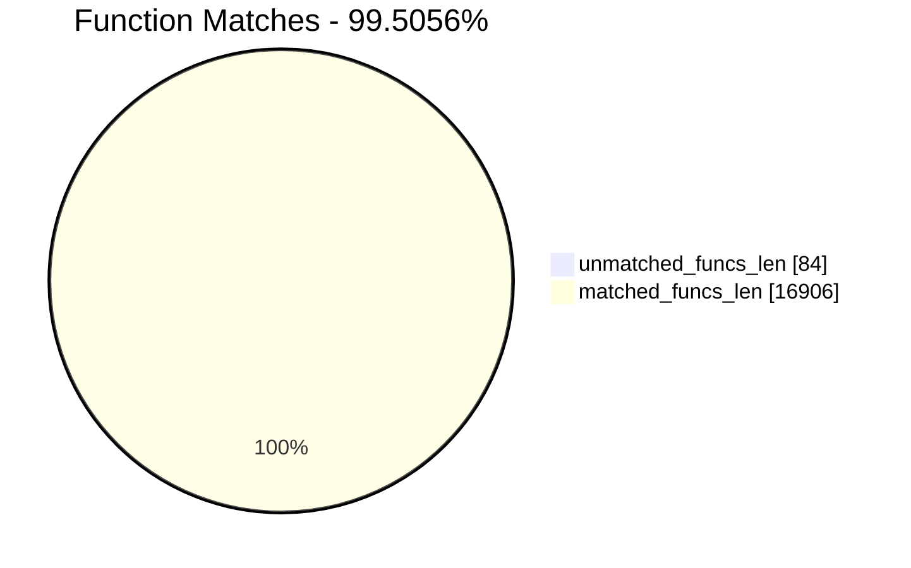
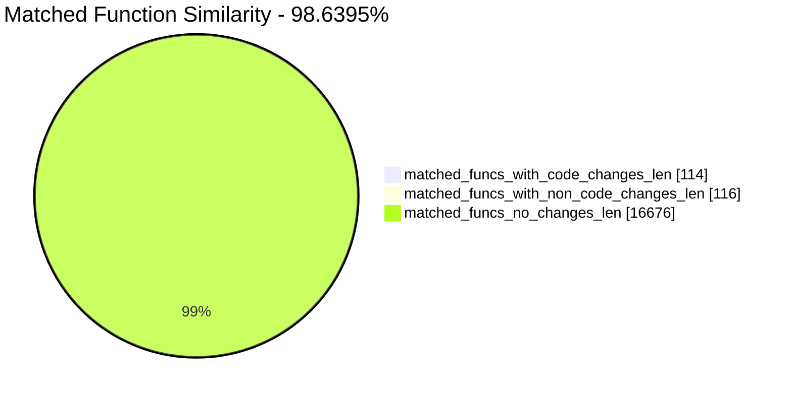
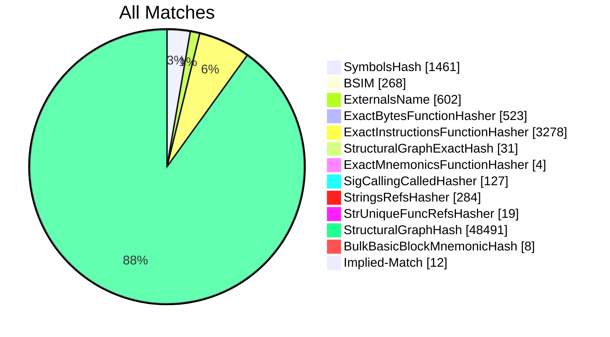
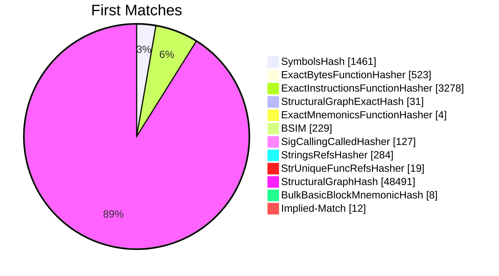
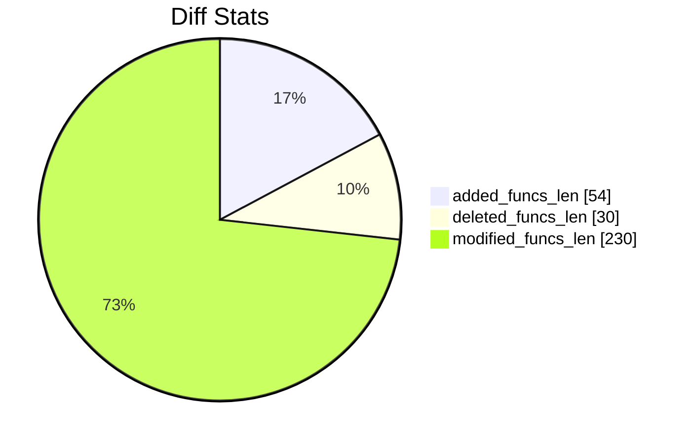
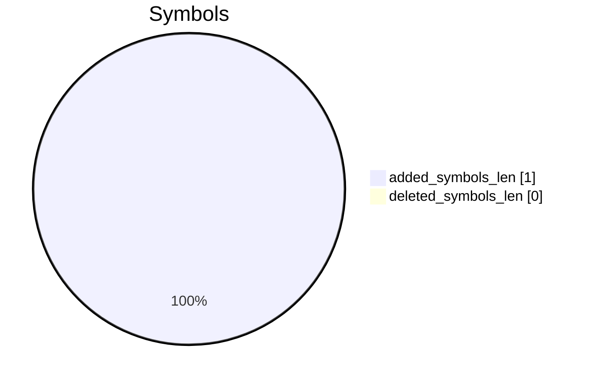
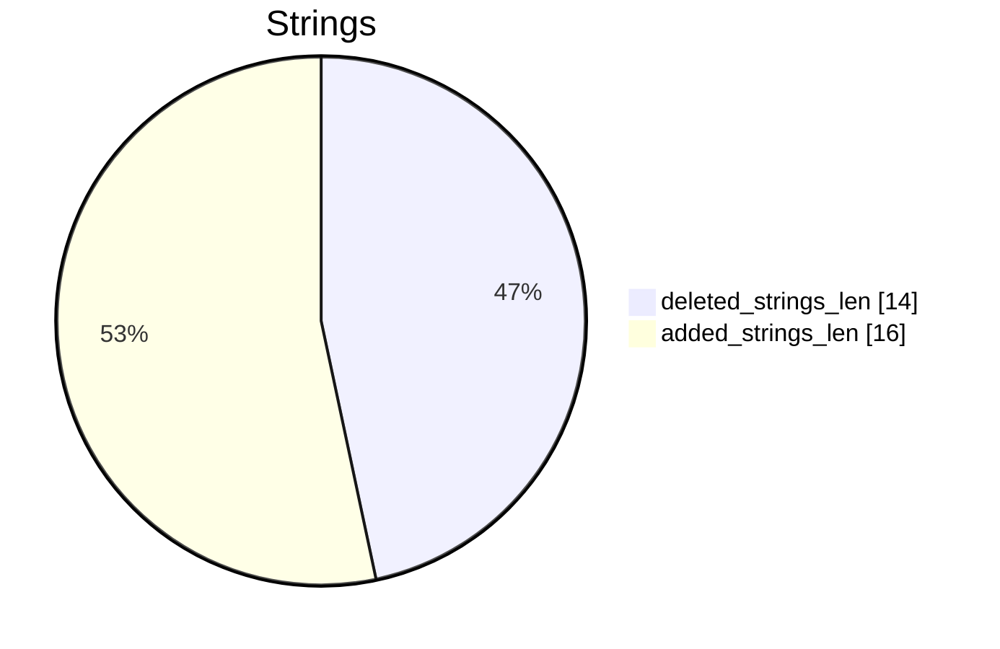

# iCamera-iCamera_1 Diff

# TOC

* [Visual Chart Diff](#visual-chart-diff)
* [Metadata](#metadata)
	* [Ghidra Diff Engine](#ghidra-diff-engine)
		* [Command Line](#command-line)
	* [Binary Metadata Diff](#binary-metadata-diff)
	* [Program Options](#program-options)
	* [Diff Stats](#diff-stats)
	* [Strings](#strings)
* [Deleted](#deleted)
	* [FUN_0045141c](#fun_0045141c)
	* [FUN_0065ef78](#fun_0065ef78)
	* [FUN_0065f5cc](#fun_0065f5cc)
	* [FUN_00660470](#fun_00660470)
	* [FUN_006606d4](#fun_006606d4)
	* [FUN_00661004](#fun_00661004)
	* [FUN_00662324](#fun_00662324)
	* [FUN_0066370c](#fun_0066370c)
	* [FUN_006637ec](#fun_006637ec)
	* [FUN_00664380](#fun_00664380)
	* [FUN_006652e0](#fun_006652e0)
	* [FUN_00665858](#fun_00665858)
	* [FUN_00665da0](#fun_00665da0)
	* [FUN_00665ebc](#fun_00665ebc)
	* [FUN_00665fc4](#fun_00665fc4)
	* [FUN_00666a18](#fun_00666a18)
	* [FUN_006674fc](#fun_006674fc)
	* [FUN_00667df8](#fun_00667df8)
	* [FUN_0066997c](#fun_0066997c)
	* [FUN_0066e41c](#fun_0066e41c)
	* [FUN_0066e440](#fun_0066e440)
	* [FUN_00673eb4](#fun_00673eb4)
	* [AES_SubBytes](#aes_subbytes)
	* [FUN_0068db08](#fun_0068db08)
	* [FUN_006920cc](#fun_006920cc)
	* [FUN_006953c0](#fun_006953c0)
	* [AddOpCodeSupport](#addopcodesupport)
	* [FUN_006a7ff8](#fun_006a7ff8)
	* [FUN_006a8434](#fun_006a8434)
	* [<EXTERNAL>::EVP_aes_256_ecb](#externalevp_aes_256_ecb)
* [Added](#added)
	* [FUN_00455a80](#fun_00455a80)
	* [FUN_0053ff24](#fun_0053ff24)
	* [FUN_00544db0](#fun_00544db0)
	* [FUN_0054fd8c](#fun_0054fd8c)
	* [FUN_0065d608](#fun_0065d608)
	* [FUN_0065e850](#fun_0065e850)
	* [FUN_0065eacc](#fun_0065eacc)
	* [FUN_00662f8c](#fun_00662f8c)
	* [FUN_006664e8](#fun_006664e8)
	* [FUN_00669cb8](#fun_00669cb8)
	* [FUN_0066a070](#fun_0066a070)
	* [FUN_0066eacc](#fun_0066eacc)
	* [iotcRecordGetRcordSid](#iotcrecordgetrcordsid)
	* [_get_p2p_server_info](#_get_p2p_server_info)
	* [iotcUpdateAESKey](#iotcupdateaeskey)
	* [FUN_0066f084](#fun_0066f084)
	* [FUN_0066f288](#fun_0066f288)
	* [iotcUpdateLocalKeyPair](#iotcupdatelocalkeypair)
	* [iotcGetLocalEccPubKey](#iotcgetlocaleccpubkey)
	* [iotcUpdateP2PAESKeys](#iotcupdatep2paeskeys)
	* [FUN_00670088](#fun_00670088)
	* [iotcGetP2PSessionID](#iotcgetp2psessionid)
	* [FUN_0067091c](#fun_0067091c)
	* [FUN_00672a24](#fun_00672a24)
	* [FUN_00677898](#fun_00677898)
	* [FUN_00678248](#fun_00678248)
	* [iotcRecordSendP2PKeepAlive](#iotcrecordsendp2pkeepalive)
	* [FUN_0067e988](#fun_0067e988)
	* [iotcRecordHandler](#iotcrecordhandler)
	* [FUN_00681708](#fun_00681708)
	* [FUN_00681778](#fun_00681778)
	* [FUN_0068e3e0](#fun_0068e3e0)
	* [FUN_0068e4ac](#fun_0068e4ac)
	* [FUN_006a06c0](#fun_006a06c0)
	* [FUN_006c08d0](#fun_006c08d0)
	* [FUN_006c090c](#fun_006c090c)
	* [FUN_006c0aec](#fun_006c0aec)
	* [TUTK3rdRSAEncrypt](#tutk3rdrsaencrypt)
	* [TUTK3rdAESEncryptEx](#tutk3rdaesencryptex)
	* [TUTK3rdAESDecryptEx](#tutk3rdaesdecryptex)
	* [TUTK3rdECDHEncodePubKeyDER](#tutk3rdecdhencodepubkeyder)
	* [<EXTERNAL>::EVP_aes_128_gcm](#externalevp_aes_128_gcm)
	* [<EXTERNAL>::EVP_CIPHER_CTX_ctrl](#externalevp_cipher_ctx_ctrl)
	* [<EXTERNAL>::EC_KEY_get0_group](#externalec_key_get0_group)
	* [<EXTERNAL>::EC_KEY_get0_public_key](#externalec_key_get0_public_key)
	* [<EXTERNAL>::EC_POINT_free](#externalec_point_free)
	* [<EXTERNAL>::EC_KEY_generate_key](#externalec_key_generate_key)
	* [<EXTERNAL>::EC_GROUP_get_degree](#externalec_group_get_degree)
	* [<EXTERNAL>::EC_POINT_dup](#externalec_point_dup)
	* [<EXTERNAL>::i2d_EC_PUBKEY](#externali2d_ec_pubkey)
	* [<EXTERNAL>::ECDH_compute_key](#externalecdh_compute_key)
	* [<EXTERNAL>::EC_KEY_free](#externalec_key_free)
	* [<EXTERNAL>::d2i_EC_PUBKEY](#externald2i_ec_pubkey)
	* [<EXTERNAL>::EC_KEY_new_by_curve_name](#externalec_key_new_by_curve_name)
* [Modified](#modified)
	* [IOTC_Check_Session_Status](#iotc_check_session_status)
	* [SendLanSearch](#sendlansearch)
	* [AddUDPQueryDeviceInfoTask](#addudpquerydeviceinfotask)
	* [ResetBBR](#resetbbr)
	* [TUTK3rdAESEncrypt](#tutk3rdaesencrypt)
	* [tutk_TaskMng_Create](#tutk_taskmng_create)
	* [avClientCleanBufNew](#avclientcleanbufnew)
	* [IOTC_Get_Remote_ProtocolVersion](#iotc_get_remote_protocolversion)
	* [tutk_block_FifoRemoveAllFramesLessThanUint16FrmNo](#tutk_block_fiforemoveallframeslessthanuint16frmno)
	* [GetOpCodeSupportCurrent](#getopcodesupportcurrent)
	* [UDPSeekIOTCDevice](#udpseekiotcdevice)
	* [RecvLanSearchR](#recvlansearchr)
	* [GetOpCodeSupportVer1](#getopcodesupportver1)
	* [tutk_packet_FifoRemoveAllFramesLessThanUint16FrmNo](#tutk_packet_fiforemoveallframeslessthanuint16frmno)
	* [AddUDPPreCheckTask](#addudpprechecktask)
	* [LanSearchRoutine](#lansearchroutine)
	* [AES_Decrypt](#aes_decrypt)
	* [IOTC_Device_Login_Status](#iotc_device_login_status)
	* [avRecvData_new](#avrecvdata_new)
	* [tutk_packet_FifoRemoveAllFramesLessThanFrmNo](#tutk_packet_fiforemoveallframeslessthanfrmno)
	* [OnACK](#onack)
	* [_doAVTransNew](#_doavtransnew)
	* [AES_Encrypt](#aes_encrypt)
	* [HandleTCPConnection](#handletcpconnection)
	* [InitBBR](#initbbr)
	* [LanToolTask](#lantooltask)
	* [SendConnectSuccess](#sendconnectsuccess)
	* [NewPushInterface](#newpushinterface)
	* [tutk_block_FifoRemoveFrameByFrmNo](#tutk_block_fiforemoveframebyfrmno)
	* [LanSearchAuthenticaion](#lansearchauthenticaion)
	* [tutk_Net_GetInterfaceInfo](#tutk_net_getinterfaceinfo)
	* [tutk_block_FifoRemoveAllFramesBiggerThanFrmNo](#tutk_block_fiforemoveallframesbiggerthanfrmno)
	* [tutk_block_FifoRemoveAllFramesLessThanFrmNo](#tutk_block_fiforemoveallframeslessthanfrmno)
	* [IOTC_Session_Set_CloseCb_With_Arg](#iotc_session_set_closecb_with_arg)
	* [AddUDPP2PConnectTask](#addudpp2pconnecttask)
	* [IOTC_Session_Channel_ON](#iotc_session_channel_on)
	* [minmax_running_max](#minmax_running_max)
	* [IOTC_Device_Login](#iotc_device_login)
	* [TUTK3rdAESDecrypt](#tutk3rdaesdecrypt)
	* [SendReqMSGType](#sendreqmsgtype)
	* [tutk_packet_FifoRemoveFrameByFrmNo](#tutk_packet_fiforemoveframebyfrmno)
	* [IOTC_Session_Channel_OFF](#iotc_session_channel_off)
	* [LinuxTConnection_acceptTCPconnection](#linuxtconnection_accepttcpconnection)
	* [TCPInfoSend](#tcpinfosend)
	* [thread_check_device](#thread_check_device)
	* [FUN_0067aba0](#fun_0067aba0)
	* [FUN_006b806c](#fun_006b806c)
	* [FUN_00678e8c](#fun_00678e8c)
	* [FUN_00664e8c](#fun_00664e8c)
	* [FUN_0068e578](#fun_0068e578)
	* [FUN_0066caa0](#fun_0066caa0)
	* [FUN_00696274](#fun_00696274)
	* [FUN_00690030](#fun_00690030)
	* [FUN_0068d9a0](#fun_0068d9a0)
	* [FUN_006901dc](#fun_006901dc)
	* [FUN_0066af78](#fun_0066af78)
	* [FUN_0068e054](#fun_0068e054)
	* [FUN_0065d6e8](#fun_0065d6e8)
	* [FUN_0065dad0](#fun_0065dad0)
	* [FUN_0069cc2c](#fun_0069cc2c)
	* [FUN_00663310](#fun_00663310)
	* [FUN_0065fee0](#fun_0065fee0)
	* [FUN_0068dee8](#fun_0068dee8)
	* [FUN_0067b740](#fun_0067b740)
	* [FUN_0068dc88](#fun_0068dc88)
	* [FUN_0068dd80](#fun_0068dd80)
	* [FUN_0067049c](#fun_0067049c)
	* [FUN_0068d684](#fun_0068d684)
	* [FUN_006889f0](#fun_006889f0)
	* [FUN_0065fff8](#fun_0065fff8)
	* [FUN_00457c08](#fun_00457c08)
	* [FUN_006742f8](#fun_006742f8)
	* [FUN_006a80c8](#fun_006a80c8)
	* [FUN_0069ebe4](#fun_0069ebe4)
	* [FUN_0069d8e8](#fun_0069d8e8)
	* [FUN_0042b2c8](#fun_0042b2c8)
	* [FUN_00663a18](#fun_00663a18)
	* [FUN_0068f01c](#fun_0068f01c)
	* [FUN_006b9a98](#fun_006b9a98)
	* [FUN_00692a08](#fun_00692a08)
	* [FUN_0068b0c4](#fun_0068b0c4)
	* [FUN_00662ef0](#fun_00662ef0)
	* [FUN_0066f964](#fun_0066f964)
	* [FUN_0069c0c0](#fun_0069c0c0)
	* [FUN_006730a0](#fun_006730a0)
	* [FUN_0069c364](#fun_0069c364)
	* [FUN_00662644](#fun_00662644)
	* [FUN_0066fbc0](#fun_0066fbc0)
	* [FUN_0066be90](#fun_0066be90)
	* [FUN_0066e348](#fun_0066e348)
	* [FUN_00661218](#fun_00661218)
	* [FUN_0066e610](#fun_0066e610)
	* [FUN_0065fdb0](#fun_0065fdb0)
	* [FUN_004c2edc](#fun_004c2edc)
	* [FUN_0044c514](#fun_0044c514)
	* [FUN_0044cf30](#fun_0044cf30)
	* [FUN_0043c304](#fun_0043c304)
	* [FUN_00672a40](#fun_00672a40)
	* [FUN_0066a694](#fun_0066a694)
	* [FUN_0044d914](#fun_0044d914)
	* [compareFrmNo](#comparefrmno)
	* [FUN_00462414](#fun_00462414)
	* [FUN_00672ccc](#fun_00672ccc)
	* [FUN_0068804c](#fun_0068804c)
	* [FUN_006ac850](#fun_006ac850)
	* [FUN_00698da0](#fun_00698da0)
	* [FUN_00684d20](#fun_00684d20)
	* [FUN_006a84d4](#fun_006a84d4)
	* [FUN_0065edd0](#fun_0065edd0)
	* [FUN_0069dde0](#fun_0069dde0)
	* [InitSampleInfo](#initsampleinfo)
	* [AES_AddRoundKey](#aes_addroundkey)
	* [FUN_0065e298](#fun_0065e298)
	* [FUN_0065dad0](#fun_0065dad0)
* [Modified (No Code Changes)](#modified-no-code-changes)
	* [RandomIDValueUpdate](#randomidvalueupdate)
	* [Nebula_Json_Obj_Get_length](#nebula_json_obj_get_length)
	* [get_compat_flag](#get_compat_flag)
	* [IOTC_Session_Lock](#iotc_session_lock)
	* [isValidFD](#isvalidfd)
	* [IsDebugToolInit](#isdebugtoolinit)
	* [AES_ShiftRows](#aes_shiftrows)
	* [IOTC_IsLiteMode](#iotc_islitemode)
	* [ttk_sockaddr_to_ip_string](#ttk_sockaddr_to_ip_string)
	* [Nebula_Json_Obj_Get_Key_Name](#nebula_json_obj_get_key_name)
	* [_M_insert_aux](#_m_insert_aux)
	* [tutk_block_FifoGetInfoByFrmNo](#tutk_block_fifogetinfobyfrmno)
	* [tutk_block_FifoCountByFrmNo](#tutk_block_fifocountbyfrmno)
	* [tutk_platform_inet_ntop](#tutk_platform_inet_ntop)
	* [release](#release)
	* [tutkCurlHttpsGetResponseString](#tutkcurlhttpsgetresponsestring)
	* [tutk_block_Release](#tutk_block_release)
	* [IOTC_TryPortReleaseTryInfoList](#iotc_tryportreleasetryinfolist)
	* [compareUint32](#compareuint32)
	* [IOTC_Session_Read_Data_And_Datatype](#iotc_session_read_data_and_datatype)
	* [tutk_platform_rand](#tutk_platform_rand)
	* [IOTC_Session_unLock](#iotc_session_unlock)
	* [tutk_bst_walkpre](#tutk_bst_walkpre)
	* [tutk_platform_vsnprintf](#tutk_platform_vsnprintf)
	* [addNatRecord](#addnatrecord)
	* [GetMinRTT](#getminrtt)
	* [GetMss](#getmss)
	* [avConnectionUnlock](#avconnectionunlock)
	* [tutkCurlHttpsReleaseHandle](#tutkcurlhttpsreleasehandle)
	* [IMP_Log_Get_Option](#imp_log_get_option)
	* [comparePacketNo](#comparepacketno)
	* [IOTC_Session_Write_DTLS](#iotc_session_write_dtls)
	* [AVPacket_Header_Swap](#avpacket_header_swap)
	* [forEachNat](#foreachnat)
	* [_checkAVConnAVClientStoped](#_checkavconnavclientstoped)
	* [__getIOCtrlFrmNo](#__getioctrlfrmno)
	* [getVSaaSInterface](#getvsaasinterface)
	* [_IsAvInitialized](#_isavinitialized)
	* [AVNewPacket_Header_Swap](#avnewpacket_header_swap)
	* [tutkCurlHttpsPerform](#tutkcurlhttpsperform)
	* [IOTC_TryPortGetNextTryInfoList](#iotc_tryportgetnexttryinfolist)
	* [_AvCheckChannelLastStatus](#_avcheckchannellaststatus)
	* [iotc_netaddr_get_content](#iotc_netaddr_get_content)
	* [minmax_reset](#minmax_reset)
	* [iotc_sockaddr_to_ip_addr](#iotc_sockaddr_to_ip_addr)
	* [tutk_block_FifoCount](#tutk_block_fifocount)
	* [iotc_convert_to_IPv4_addr](#iotc_convert_to_ipv4_addr)

# Visual Chart Diff

```mermaid

flowchart LR

IOTC_Check_Session_Status-0-old<--Match 98%-->IOTC_Check_Session_Status-0-new
SendLanSearch-0-old<--Match 97%-->SendLanSearch-0-new
AddUDPQueryDeviceInfoTask-0-old<--Match 94%-->AddUDPQueryDeviceInfoTask-0-new
ResetBBR-0-old<--Match 89%-->ResetBBR-0-new
TUTK3rdAESEncrypt-0-old<--Match 15%-->TUTK3rdAESEncrypt-0-new
tutk_TaskMng_Create-0-old<--Match 98%-->tutk_TaskMng_Create-0-new
avClientCleanBufNew-0-old<--Match 94%-->avClientCleanBufNew-0-new
IOTC_Get_Remote_ProtocolVersion-0-old<--Match 98%-->IOTC_Get_Remote_ProtocolVersion-0-new
tutk_block_FifoRemoveAllFramesLessThanUint16FrmNo-0-old<--Match 67%-->tutk_block_FifoRemoveAllFramesLessThanUint16FrmNo-0-new
GetOpCodeSupportCurrent-0-old<--Match 39%-->GetOpCodeSupportCurrent-0-new
UDPSeekIOTCDevice-0-old<--Match 94%-->UDPSeekIOTCDevice-0-new
RecvLanSearchR-0-old<--Match 92%-->RecvLanSearchR-0-new
GetOpCodeSupportVer1-0-old<--Match 43%-->GetOpCodeSupportVer1-0-new
tutk_packet_FifoRemoveAllFramesLessThanUint16FrmNo-0-old<--Match 67%-->tutk_packet_FifoRemoveAllFramesLessThanUint16FrmNo-0-new
AddUDPPreCheckTask-0-old<--Match 75%-->AddUDPPreCheckTask-0-new
LanSearchRoutine-0-old<--Match 98%-->LanSearchRoutine-0-new
AES_Decrypt-0-old<--Match 42%-->AES_Decrypt-0-new
IOTC_Device_Login_Status-0-old<--Match 85%-->IOTC_Device_Login_Status-0-new
avRecvData_new-0-old<--Match 56%-->avRecvData_new-0-new
tutk_packet_FifoRemoveAllFramesLessThanFrmNo-0-old<--Match 95%-->tutk_packet_FifoRemoveAllFramesLessThanFrmNo-0-new
OnACK-0-old<--Match 90%-->OnACK-0-new
_doAVTransNew-0-old<--Match 88%-->_doAVTransNew-0-new
AES_Encrypt-0-old<--Match 43%-->AES_Encrypt-0-new
HandleTCPConnection-0-old<--Match 98%-->HandleTCPConnection-0-new
InitBBR-0-old<--Match 90%-->InitBBR-0-new
LanToolTask-0-old<--Match 92%-->LanToolTask-0-new
iCamera<--89ommited-->iCamera_1

subgraph iCamera_1
    IOTC_Check_Session_Status-0-new
SendLanSearch-0-new
AddUDPQueryDeviceInfoTask-0-new
ResetBBR-0-new
TUTK3rdAESEncrypt-0-new
tutk_TaskMng_Create-0-new
avClientCleanBufNew-0-new
IOTC_Get_Remote_ProtocolVersion-0-new
tutk_block_FifoRemoveAllFramesLessThanUint16FrmNo-0-new
GetOpCodeSupportCurrent-0-new
UDPSeekIOTCDevice-0-new
RecvLanSearchR-0-new
GetOpCodeSupportVer1-0-new
tutk_packet_FifoRemoveAllFramesLessThanUint16FrmNo-0-new
AddUDPPreCheckTask-0-new
LanSearchRoutine-0-new
AES_Decrypt-0-new
IOTC_Device_Login_Status-0-new
avRecvData_new-0-new
tutk_packet_FifoRemoveAllFramesLessThanFrmNo-0-new
OnACK-0-new
_doAVTransNew-0-new
AES_Encrypt-0-new
HandleTCPConnection-0-new
InitBBR-0-new
LanToolTask-0-new
    subgraph Added
direction LR
FUN_00455a80
    FUN_0053ff24
    FUN_00544db0
    FUN_0054fd8c
    FUN_0065d608
    FUN_0065e850
    FUN_0065eacc
    FUN_00662f8c
    FUN_006664e8
    FUN_00669cb8
    FUN_0066a070
    FUN_0066eacc
    iotcRecordGetRcordSid
    _get_p2p_server_info
    iotcUpdateAESKey
    FUN_0066f084
    FUN_0066f288
    iotcUpdateLocalKeyPair
    iotcGetLocalEccPubKey
    iotcUpdateP2PAESKeys
    FUN_00670088
    iotcGetP2PSessionID
    FUN_0067091c
    FUN_00672a24
    FUN_00677898
    FUN_00678248
    iotcRecordSendP2PKeepAlive
    29_more_added_funcs_omitted
end
end

subgraph iCamera
    IOTC_Check_Session_Status-0-old
SendLanSearch-0-old
AddUDPQueryDeviceInfoTask-0-old
ResetBBR-0-old
TUTK3rdAESEncrypt-0-old
tutk_TaskMng_Create-0-old
avClientCleanBufNew-0-old
IOTC_Get_Remote_ProtocolVersion-0-old
tutk_block_FifoRemoveAllFramesLessThanUint16FrmNo-0-old
GetOpCodeSupportCurrent-0-old
UDPSeekIOTCDevice-0-old
RecvLanSearchR-0-old
GetOpCodeSupportVer1-0-old
tutk_packet_FifoRemoveAllFramesLessThanUint16FrmNo-0-old
AddUDPPreCheckTask-0-old
LanSearchRoutine-0-old
AES_Decrypt-0-old
IOTC_Device_Login_Status-0-old
avRecvData_new-0-old
tutk_packet_FifoRemoveAllFramesLessThanFrmNo-0-old
OnACK-0-old
_doAVTransNew-0-old
AES_Encrypt-0-old
HandleTCPConnection-0-old
InitBBR-0-old
LanToolTask-0-old
    subgraph Deleted
direction LR
FUN_0045141c
    FUN_0065ef78
    FUN_0065f5cc
    FUN_00660470
    FUN_006606d4
    FUN_00661004
    FUN_00662324
    FUN_0066370c
    FUN_006637ec
    FUN_00664380
    FUN_006652e0
    FUN_00665858
    FUN_00665da0
    FUN_00665ebc
    FUN_00665fc4
    FUN_00666a18
    FUN_006674fc
    FUN_00667df8
    FUN_0066997c
    FUN_0066e41c
    FUN_0066e440
    FUN_00673eb4
    AES_SubBytes
    FUN_0068db08
    FUN_006920cc
    FUN_006953c0
    AddOpCodeSupport
    5_more_deleted_funcs_omitted
end
end

```










# Metadata

## Ghidra Diff Engine

### Command Line

#### Captured Command Line


```
ghidriff --project-location ghidra_projects --project-name ghidriff --symbols-path symbols --gzfs-path gzfs --threaded --log-level INFO --file-log-level INFO --log-path ghidriff.log --min-func-len 10 --gdt [] --bsim --max-ram-percent 60.0 --max-section-funcs 200 iCamera iCamera_1
```


#### Verbose Args


<details>

```
--old ['iCamera'] --new [['iCamera_1']] --engine VersionTrackingDiff --output-path ghidriffs --summary False --project-location ghidra_projects --project-name ghidriff --symbols-path symbols --gzfs-path gzfs --base-address None --program-options None --threaded True --force-analysis False --force-diff False --no-symbols False --log-level INFO --file-log-level INFO --log-path ghidriff.log --va False --min-func-len 10 --use-calling-counts False --gdt [] --bsim True --bsim-full False --max-ram-percent 60.0 --print-flags False --jvm-args None --side-by-side False --max-section-funcs 200 --md-title None
```


</details>

## Binary Metadata Diff


```diff
--- iCamera Meta
+++ iCamera_1 Meta
@@ -1,48 +1,48 @@
-Program Name: iCamera
+Program Name: iCamera_1
 Language ID: MIPS:LE:32:default (1.8)
 Compiler ID: default
 Processor: MIPS
 Endian: Little
 Address Size: 32
 Minimum Address: 00400000
 Maximum Address: _elfSectionHeaders::0000059f
-# of Bytes: 5851233
+# of Bytes: 5876511
 # of Memory Blocks: 37
-# of Instructions: 854241
-# of Defined Data: 46662
-# of Functions: 8475
-# of Symbols: 64429
-# of Data Types: 974
-# of Data Type Categories: 76
+# of Instructions: 855300
+# of Defined Data: 46760
+# of Functions: 8515
+# of Symbols: 64902
+# of Data Types: 983
+# of Data Type Categories: 78
 Analyzed: true
 Created With Ghidra Version: 11.4
-Date Created: Sun Aug 24 17:34:03 CEST 2025
+Date Created: Sun Aug 24 17:34:07 CEST 2025
 ELF File Type: executable
-ELF Note[GNU BuildId]: 30c5c7d0519c14bc0371d908720a82a3825789b4
+ELF Note[GNU BuildId]: 87f496bbe893c543eaae30e901c3683ef17e6206
 ELF Original Image Base: 0x400000
 ELF Prelinked: false
 Elf Comment[0]: GCC: (Ingenic r2.3.3 2016.12) 4.7.2
 Executable Format: Executable and Linking Format (ELF)
-Executable Location: /home/moe/Documents/IOT/WyzeCam/diff/iCamera
-Executable MD5: b4b7752c37e98714003ece40689c6e10
-Executable SHA256: be16a89f873012c931391135d1c607e889648a9e7ecc0fc5953954fe357261f6
-FSRL: file:///home/moe/Documents/IOT/WyzeCam/diff/iCamera?MD5=b4b7752c37e98714003ece40689c6e10
+Executable Location: /home/moe/Documents/IOT/WyzeCam/diff/iCamera_1
+Executable MD5: 129c54fb82c032a2d1491865b103fe4e
+Executable SHA256: 4a4d05568b3c2cd3cb6823a1302c48b6a3ce49b9cf9579f9c2735d2475a11a32
+FSRL: file:///home/moe/Documents/IOT/WyzeCam/diff/iCamera_1?MD5=129c54fb82c032a2d1491865b103fe4e
 Preferred Root Namespace Category: 
 Relocatable: false
 Required Library [    0]: libstdc++.so.6
 Required Library [    1]: libaudioProcess.so
 Required Library [    2]: libpthread.so.0
 Required Library [    3]: libm.so.0
 Required Library [    4]: libdl.so.0
 Required Library [    5]: librt.so.0
 Required Library [    6]: libwyzefdk.so
 Required Library [    7]: libwyzeUtils.so
 Required Library [    8]: libwyzeUtilsPlatform.so
 Required Library [    9]: libcjson.so
 Required Library [   10]: libcproducer.so
 Required Library [   11]: libssl.so.1.1
 Required Library [   12]: libcrypto.so.1.1
 Required Library [   13]: libcurl.so.4
 Required Library [   14]: libc.so.0
 Required Library [   15]: ld-uClibc.so.0
 Should Ask To Analyze: false

```


## Program Options


<details>
<summary>Ghidra iCamera Decompiler Options</summary>


|Decompiler Option|Value|
| :---: | :---: |
|Prototype Evaluation|__stdcall|

</details>


<details>
<summary>Ghidra iCamera Specification extensions Options</summary>


|Specification extensions Option|Value|
| :---: | :---: |
|FormatVersion|0|
|VersionCounter|0|

</details>


<details>
<summary>Ghidra iCamera Analyzers Options</summary>


|Analyzers Option|Value|
| :---: | :---: |
|ASCII Strings|true|
|ASCII Strings.Create Strings Containing Existing Strings|true|
|ASCII Strings.Create Strings Containing References|true|
|ASCII Strings.Force Model Reload|false|
|ASCII Strings.Minimum String Length|LEN_5|
|ASCII Strings.Model File|StringModel.sng|
|ASCII Strings.Require Null Termination for String|true|
|ASCII Strings.Search Only in Accessible Memory Blocks|true|
|ASCII Strings.String Start Alignment|ALIGN_1|
|ASCII Strings.String end alignment|4|
|Aggressive Instruction Finder|false|
|Aggressive Instruction Finder.Create Analysis Bookmarks|true|
|Apply Data Archives|true|
|Apply Data Archives.Archive Chooser|[Auto-Detect]|
|Apply Data Archives.Create Analysis Bookmarks|true|
|Apply Data Archives.GDT User File Archive Path|None|
|Apply Data Archives.User Project Archive Path|None|
|Call Convention ID|true|
|Call Convention ID.Analysis Decompiler Timeout (sec)|60|
|Call-Fixup Installer|true|
|Condense Filler Bytes|false|
|Condense Filler Bytes.Filler Value|Auto|
|Condense Filler Bytes.Minimum number of sequential bytes|1|
|Create Address Tables|true|
|Create Address Tables.Allow Offcut References|false|
|Create Address Tables.Auto Label Table|false|
|Create Address Tables.Create Analysis Bookmarks|true|
|Create Address Tables.Maxmimum Pointer Distance|16777215|
|Create Address Tables.Minimum Pointer Address|4132|
|Create Address Tables.Minimum Table Size|4|
|Create Address Tables.Pointer Alignment|1|
|Create Address Tables.Relocation Table Guide|true|
|Create Address Tables.Table Alignment|4|
|DWARF|true|
|DWARF.Add Inlined Functions Comments|false|
|DWARF.Add Lexical Block Comments|false|
|DWARF.Copy external debug file symbols|true|
|DWARF.Create Function Signatures|true|
|DWARF.Default Calling Convention||
|DWARF.Ignore Parameter Storage Info|false|
|DWARF.Import Data Types|true|
|DWARF.Import Functions|true|
|DWARF.Import Local Variable Info|true|
|DWARF.Import Source Line Info|true|
|DWARF.Maximum Source Map Entry Length|2000|
|DWARF.Output DWARF DIE Info|false|
|DWARF.Output Source Info|false|
|DWARF.Try To Pack Structs|true|
|Data Reference|true|
|Data Reference.Address Table Alignment|1|
|Data Reference.Address Table Minimum Size|4|
|Data Reference.Align End of Strings|false|
|Data Reference.Ascii String References|true|
|Data Reference.Create Address Tables|false|
|Data Reference.Minimum String Length|5|
|Data Reference.References to Pointers|true|
|Data Reference.Relocation Table Guide|true|
|Data Reference.Respect Execute Flag|true|
|Data Reference.Subroutine References|true|
|Data Reference.Switch Table References|false|
|Data Reference.Unicode String References|true|
|Decompiler Parameter ID|false|
|Decompiler Parameter ID.Analysis Clear Level|ANALYSIS|
|Decompiler Parameter ID.Analysis Decompiler Timeout (sec)|60|
|Decompiler Parameter ID.Commit Data Types|true|
|Decompiler Parameter ID.Commit Void Return Values|false|
|Decompiler Parameter ID.Prototype Evaluation|__stdcall|
|Decompiler Switch Analysis|true|
|Decompiler Switch Analysis.Analysis Decompiler Timeout (sec)|60|
|Demangler GNU|true|
|Demangler GNU.Apply Function Calling Conventions|true|
|Demangler GNU.Apply Function Signatures|true|
|Demangler GNU.Demangle Only Known Mangled Symbols|false|
|Demangler GNU.Demangler Format|AUTO|
|Demangler GNU.Use Deprecated Demangler|false|
|Demangler GNU.Use Standard Text Replacements|true|
|Disassemble Entry Points|true|
|Disassemble Entry Points.Respect Execute Flag|true|
|ELF Scalar Operand References|false|
|ELF Scalar Operand References.Relocation Table Guide|true|
|Embedded Media|true|
|Embedded Media.Create Analysis Bookmarks|true|
|External Entry References|true|
|External Symbol Resolver|true|
|Function Start Search|true|
|Function Start Search.Bookmark Functions|false|
|Function Start Search.Search Data Blocks|false|
|GCC Exception Handlers|true|
|GCC Exception Handlers.Create Try Catch Comments|true|
|MIPS Constant Reference Analyzer|true|
|MIPS Constant Reference Analyzer.Assume T9 set to Function entry|true|
|MIPS Constant Reference Analyzer.Attempt to recover switch tables|false|
|MIPS Constant Reference Analyzer.Create Data from pointer|false|
|MIPS Constant Reference Analyzer.Function parameter/return Pointer analysis|true|
|MIPS Constant Reference Analyzer.Mark dual instruction references|false|
|MIPS Constant Reference Analyzer.Max Threads|2|
|MIPS Constant Reference Analyzer.Min absolute reference|4|
|MIPS Constant Reference Analyzer.Recover global GP register writes|true|
|MIPS Constant Reference Analyzer.Require pointer param data type|false|
|MIPS Constant Reference Analyzer.Speculative reference max|256|
|MIPS Constant Reference Analyzer.Speculative reference min|1024|
|MIPS Constant Reference Analyzer.Stored Value Pointer analysis|true|
|MIPS Constant Reference Analyzer.Trust values read from writable memory|true|
|MIPS Symbol|true|
|MIPS UnAlligned Instruction Fix|true|
|Non-Returning Functions - Discovered|true|
|Non-Returning Functions - Discovered.Create Analysis Bookmarks|true|
|Non-Returning Functions - Discovered.Function Non-return Threshold|3|
|Non-Returning Functions - Discovered.Repair Flow Damage|true|
|Non-Returning Functions - Known|true|
|Non-Returning Functions - Known.Create Analysis Bookmarks|true|
|Reference|true|
|Reference.Address Table Alignment|1|
|Reference.Address Table Minimum Size|4|
|Reference.Align End of Strings|false|
|Reference.Ascii String References|true|
|Reference.Create Address Tables|false|
|Reference.Minimum String Length|5|
|Reference.References to Pointers|true|
|Reference.Relocation Table Guide|true|
|Reference.Respect Execute Flag|true|
|Reference.Subroutine References|true|
|Reference.Switch Table References|false|
|Reference.Unicode String References|true|
|Shared Return Calls|true|
|Shared Return Calls.Allow Conditional Jumps|false|
|Shared Return Calls.Assume Contiguous Functions Only|true|
|Stack|true|
|Stack.Create Local Variables|true|
|Stack.Create Param Variables|false|
|Stack.Max Threads|2|
|Stack.useNewFunctionStackAnalysis|true|
|Subroutine References|true|
|Subroutine References.Create Thunks Early|true|
|Variadic Function Signature Override|false|
|Variadic Function Signature Override.Create Analysis Bookmarks|false|

</details>


<details>
<summary>Ghidra iCamera_1 Decompiler Options</summary>


|Decompiler Option|Value|
| :---: | :---: |
|Prototype Evaluation|__stdcall|

</details>


<details>
<summary>Ghidra iCamera_1 Specification extensions Options</summary>


|Specification extensions Option|Value|
| :---: | :---: |
|FormatVersion|0|
|VersionCounter|0|

</details>


<details>
<summary>Ghidra iCamera_1 Analyzers Options</summary>


|Analyzers Option|Value|
| :---: | :---: |
|ASCII Strings|true|
|ASCII Strings.Create Strings Containing Existing Strings|true|
|ASCII Strings.Create Strings Containing References|true|
|ASCII Strings.Force Model Reload|false|
|ASCII Strings.Minimum String Length|LEN_5|
|ASCII Strings.Model File|StringModel.sng|
|ASCII Strings.Require Null Termination for String|true|
|ASCII Strings.Search Only in Accessible Memory Blocks|true|
|ASCII Strings.String Start Alignment|ALIGN_1|
|ASCII Strings.String end alignment|4|
|Aggressive Instruction Finder|false|
|Aggressive Instruction Finder.Create Analysis Bookmarks|true|
|Apply Data Archives|true|
|Apply Data Archives.Archive Chooser|[Auto-Detect]|
|Apply Data Archives.Create Analysis Bookmarks|true|
|Apply Data Archives.GDT User File Archive Path|None|
|Apply Data Archives.User Project Archive Path|None|
|Call Convention ID|true|
|Call Convention ID.Analysis Decompiler Timeout (sec)|60|
|Call-Fixup Installer|true|
|Condense Filler Bytes|false|
|Condense Filler Bytes.Filler Value|Auto|
|Condense Filler Bytes.Minimum number of sequential bytes|1|
|Create Address Tables|true|
|Create Address Tables.Allow Offcut References|false|
|Create Address Tables.Auto Label Table|false|
|Create Address Tables.Create Analysis Bookmarks|true|
|Create Address Tables.Maxmimum Pointer Distance|16777215|
|Create Address Tables.Minimum Pointer Address|4132|
|Create Address Tables.Minimum Table Size|4|
|Create Address Tables.Pointer Alignment|1|
|Create Address Tables.Relocation Table Guide|true|
|Create Address Tables.Table Alignment|4|
|DWARF|true|
|DWARF.Add Inlined Functions Comments|false|
|DWARF.Add Lexical Block Comments|false|
|DWARF.Copy external debug file symbols|true|
|DWARF.Create Function Signatures|true|
|DWARF.Default Calling Convention||
|DWARF.Ignore Parameter Storage Info|false|
|DWARF.Import Data Types|true|
|DWARF.Import Functions|true|
|DWARF.Import Local Variable Info|true|
|DWARF.Import Source Line Info|true|
|DWARF.Maximum Source Map Entry Length|2000|
|DWARF.Output DWARF DIE Info|false|
|DWARF.Output Source Info|false|
|DWARF.Try To Pack Structs|true|
|Data Reference|true|
|Data Reference.Address Table Alignment|1|
|Data Reference.Address Table Minimum Size|4|
|Data Reference.Align End of Strings|false|
|Data Reference.Ascii String References|true|
|Data Reference.Create Address Tables|false|
|Data Reference.Minimum String Length|5|
|Data Reference.References to Pointers|true|
|Data Reference.Relocation Table Guide|true|
|Data Reference.Respect Execute Flag|true|
|Data Reference.Subroutine References|true|
|Data Reference.Switch Table References|false|
|Data Reference.Unicode String References|true|
|Decompiler Parameter ID|false|
|Decompiler Parameter ID.Analysis Clear Level|ANALYSIS|
|Decompiler Parameter ID.Analysis Decompiler Timeout (sec)|60|
|Decompiler Parameter ID.Commit Data Types|true|
|Decompiler Parameter ID.Commit Void Return Values|false|
|Decompiler Parameter ID.Prototype Evaluation|__stdcall|
|Decompiler Switch Analysis|true|
|Decompiler Switch Analysis.Analysis Decompiler Timeout (sec)|60|
|Demangler GNU|true|
|Demangler GNU.Apply Function Calling Conventions|true|
|Demangler GNU.Apply Function Signatures|true|
|Demangler GNU.Demangle Only Known Mangled Symbols|false|
|Demangler GNU.Demangler Format|AUTO|
|Demangler GNU.Use Deprecated Demangler|false|
|Demangler GNU.Use Standard Text Replacements|true|
|Disassemble Entry Points|true|
|Disassemble Entry Points.Respect Execute Flag|true|
|ELF Scalar Operand References|false|
|ELF Scalar Operand References.Relocation Table Guide|true|
|Embedded Media|true|
|Embedded Media.Create Analysis Bookmarks|true|
|External Entry References|true|
|External Symbol Resolver|true|
|Function Start Search|true|
|Function Start Search.Bookmark Functions|false|
|Function Start Search.Search Data Blocks|false|
|GCC Exception Handlers|true|
|GCC Exception Handlers.Create Try Catch Comments|true|
|MIPS Constant Reference Analyzer|true|
|MIPS Constant Reference Analyzer.Assume T9 set to Function entry|true|
|MIPS Constant Reference Analyzer.Attempt to recover switch tables|false|
|MIPS Constant Reference Analyzer.Create Data from pointer|false|
|MIPS Constant Reference Analyzer.Function parameter/return Pointer analysis|true|
|MIPS Constant Reference Analyzer.Mark dual instruction references|false|
|MIPS Constant Reference Analyzer.Max Threads|2|
|MIPS Constant Reference Analyzer.Min absolute reference|4|
|MIPS Constant Reference Analyzer.Recover global GP register writes|true|
|MIPS Constant Reference Analyzer.Require pointer param data type|false|
|MIPS Constant Reference Analyzer.Speculative reference max|256|
|MIPS Constant Reference Analyzer.Speculative reference min|1024|
|MIPS Constant Reference Analyzer.Stored Value Pointer analysis|true|
|MIPS Constant Reference Analyzer.Trust values read from writable memory|true|
|MIPS Symbol|true|
|MIPS UnAlligned Instruction Fix|true|
|Non-Returning Functions - Discovered|true|
|Non-Returning Functions - Discovered.Create Analysis Bookmarks|true|
|Non-Returning Functions - Discovered.Function Non-return Threshold|3|
|Non-Returning Functions - Discovered.Repair Flow Damage|true|
|Non-Returning Functions - Known|true|
|Non-Returning Functions - Known.Create Analysis Bookmarks|true|
|Reference|true|
|Reference.Address Table Alignment|1|
|Reference.Address Table Minimum Size|4|
|Reference.Align End of Strings|false|
|Reference.Ascii String References|true|
|Reference.Create Address Tables|false|
|Reference.Minimum String Length|5|
|Reference.References to Pointers|true|
|Reference.Relocation Table Guide|true|
|Reference.Respect Execute Flag|true|
|Reference.Subroutine References|true|
|Reference.Switch Table References|false|
|Reference.Unicode String References|true|
|Shared Return Calls|true|
|Shared Return Calls.Allow Conditional Jumps|false|
|Shared Return Calls.Assume Contiguous Functions Only|true|
|Stack|true|
|Stack.Create Local Variables|true|
|Stack.Create Param Variables|false|
|Stack.Max Threads|2|
|Stack.useNewFunctionStackAnalysis|true|
|Subroutine References|true|
|Subroutine References.Create Thunks Early|true|
|Variadic Function Signature Override|false|
|Variadic Function Signature Override.Create Analysis Bookmarks|false|

</details>

## Diff Stats


|Stat|Value|
| :---: | :---: |
|added_funcs_len|54|
|deleted_funcs_len|30|
|modified_funcs_len|230|
|added_symbols_len|1|
|deleted_symbols_len|0|
|diff_time|543.60426902771|
|deleted_strings_len|14|
|added_strings_len|16|
|match_types|Counter({'StructuralGraphHash': 48491, 'ExactInstructionsFunctionHasher': 3278, 'SymbolsHash': 1461, 'ExternalsName': 602, 'ExactBytesFunctionHasher': 523, 'StringsRefsHasher': 284, 'BSIM': 268, 'SigCallingCalledHasher': 127, 'StructuralGraphExactHash': 31, 'StrUniqueFuncRefsHasher': 19, 'Implied Match': 12, 'BulkBasicBlockMnemonicHash': 8, 'ExactMnemonicsFunctionHasher': 4})|
|items_to_process|315|
|diff_types|Counter({'address': 230, 'calling': 174, 'refcount': 151, 'called': 131, 'name': 128, 'fullname': 128, 'sig': 128, 'code': 114, 'length': 104})|
|unmatched_funcs_len|84|
|total_funcs_len|16990|
|matched_funcs_len|16906|
|matched_funcs_with_code_changes_len|114|
|matched_funcs_with_non_code_changes_len|116|
|matched_funcs_no_changes_len|16676|
|match_func_similarity_percent|98.6395%|
|func_match_overall_percent|99.5056%|
|first_matches|Counter({'StructuralGraphHash': 48491, 'ExactInstructionsFunctionHasher': 3278, 'SymbolsHash': 1461, 'ExactBytesFunctionHasher': 523, 'StringsRefsHasher': 284, 'BSIM': 229, 'SigCallingCalledHasher': 127, 'StructuralGraphExactHash': 31, 'StrUniqueFuncRefsHasher': 19, 'Implied Match': 12, 'BulkBasicBlockMnemonicHash': 8, 'ExactMnemonicsFunctionHasher': 4})|













## Strings




### Strings Diff


```diff
--- deleted strings
+++ added strings
@@ -1,14 +1,16 @@
-s_%s(%d),ioctl_IMP_ISP_Tuning_SetA
-s_09:16:08
-s_09:16:38
-s_3.4.4.4-1-g3b4709d7b_openssl_Mip
-s_IMP_ISP_Tuning_SetAeMin
-s_Nov
-s_Serial
-s_can_not_register_build-in_layer_t
-s_code_error:%s
-s_error:_kernel_size!=3_or_output
-s_osd-up-logo
-s_overwrite_existing_custom_layer_t
-s_platform_thread
-s_rebootlog_worker
+s_%s/alarm_%d.jpg
+s_-----BEGIN_PUBLIC_KEY-----_MIIBI
+s_10:56:03
+s_10:56:31
+s_3.4.4.4-12-ga2b999b84_openssl_Mi
+s_Audio_codec_list_will_be_truncat
+s_Jan
+s_TODO_ERROR:_Upsample::forward_in
+s_Warning:_audio_codec_list_is_len
+s_[%s_%d]_DEBUG:_local_sdk_close_n
+s_[%s_%d]_DEBUG:_local_sdk_open_ni
+s_enc-stream-%d
+s_inner_get_audio_codec_id_list
+s_json_object_new_uint64
+s_long-key
+s_t2

```


### String References

#### Old


|String|Ref Count|Ref Func|
| :---: | :---: | :---: |
|s_Nov_1_2023_00779f90|3|FUN_00416208,FUN_0046c280|
|s_09:16:38_00779f9c|1|FUN_00416208|
|s_overwrite_existing_custom_layer_t_008a03f0|1|FUN_005178d8|
|s_error:_kernel_size!=3_or_output__008a13f8|1|FUN_0055c240|
|s_platform_thread_00792014|1|FUN_0046be8c|
|s_09:16:08_00792200|2|FUN_0046c280|
|s_IMP_ISP_Tuning_SetAeMin_0079c578|2||
|s_osd-up-logo_007885d4|1|FUN_00452a8c|
|s_Serial_008c6948|19|_handle_json_request,_gen_token_request,_gen_json_request,_gen_change_password_request,_handle_token_request,_handle_change_password_request,_gen_identity_array_request,_handle_token_delete_request,FUN_006a38d4,_handle_ability_request,_gen_token_delete_request,_handle_identity_array_request,_gen_ability_request,FUN_006a3720|
|s_can_not_register_build-in_layer_t_008a03c4|1|FUN_005178d8|
|s_%s(%d),ioctl_IMP_ISP_Tuning_SetA_0079b3f0|1||
|s_rebootlog_worker_0077b7cc|1|FUN_0041a850|
|s_3.4.4.4-1-g3b4709d7b_openssl_Mip_008c64ec|1|FUN_00685f08|
|s_code_error:%s_007871fc|3|FUN_0044ba04,FUN_00638644,FUN_00653430|

#### New


|String|Ref Count|Ref Func|
| :---: | :---: | :---: |
|s_Jan_5_2024_0077fb40|3|FUN_00416728,FUN_00467628|
|s_%s/alarm_%d.jpg_008bb404|1|FUN_00632808|
|s_TODO_ERROR:_Upsample::forward_in_008a6fa8|1|FUN_00554f60|
|s_-----BEGIN_PUBLIC_KEY-----_MIIBI_0096b734|1|iotcRecordSendMasterHandshake|
|s_10:56:31_0077fb4c|1|FUN_00416728|
|s_long-key_007930ac|1||
|s_Audio_codec_list_will_be_truncat_007848dc|1|FUN_00424e90|
|s_inner_get_audio_codec_id_list_00784c98|2|FUN_00424e90|
|s_10:56:03_007960bc|2|FUN_00467628|
|s_3.4.4.4-12-ga2b999b84_openssl_Mi_008cb988|5|iotcRecordSendP2PInitHandshakeReq,GetIOTCVersionStr,FUN_0066c58c,FUN_0068b634,FUN_0066333c|
|s_[%s_%d]_DEBUG:_local_sdk_close_n_0078f79c|1|FUN_004506c4|
|s_[%s_%d]_DEBUG:_local_sdk_open_ni_0078f7d8|1|FUN_004506c4|
|s_t2_64_008d0000|21|fftw_elapsed_since,avServStart2_inner,FUN_006558a4,FUN_0076ab70,_handle_json_request_ack,json_tokener_parse_ex,_handle_identity_array_request_ack,_handle_change_password_request_ack,FUN_00699c0c,_handle_token_delete_request_ack,FUN_0064d234,_handle_token_request_ack,FUN_006579dc|
|s_enc-stream-%d_00796384|1|FUN_00467f64|
|s_json_object_new_uint64_0040fd88|5|FUN_0055beec|
|s_Warning:_audio_codec_list_is_len_0078489c|1|FUN_00424e90|

# Deleted

## FUN_0045141c

### Function Meta


|Key|iCamera|
| :---: | :---: |
|name|FUN_0045141c|
|fullname|FUN_0045141c|
|refcount|1|
|length|320|
|called|<EXTERNAL>::memset<br><EXTERNAL>::msg_queue_snd<br><EXTERNAL>::print_module_log_print<br><EXTERNAL>::time<br>FUN_0041ea40|
|calling||
|paramcount|0|
|address|0045141c|
|sig|undefined FUN_0045141c(void)|
|sym_type|Function|
|sym_source|DEFAULT|
|external|False|


```diff
--- FUN_0045141c
+++ FUN_0045141c
@@ -1,47 +0,0 @@
-
-void FUN_0045141c(void)
-
-{
-  int iVar1;
-  int iVar2;
-  time_t tVar3;
-  undefined4 uVar4;
-  undefined4 uVar5;
-  undefined4 uVar6;
-  char *pcVar7;
-  undefined4 local_218;
-  undefined4 local_214;
-  int local_20c;
-  
-  memset(&local_218,0,0x200);
-  local_218 = 0x2b5e;
-  local_214 = 1;
-  iVar1 = FUN_0041ea40();
-  if (iVar1 < 0) {
-    print_module_log_print
-              ("[ICAMERA]",4,"watchdog.c","watchdog_snd_msg_feed",0x3d,
-               "watchdog_snd_msg_close msg id error!\n");
-  }
-  else {
-    iVar2 = msg_queue_snd(iVar1,&local_218,local_20c + 0xc);
-    if (iVar2 < 0) {
-      tVar3 = time((time_t *)0x0);
-      uVar4 = FUN_0041ea40();
-      uVar6 = 0x44;
-      pcVar7 = "[time:%ld] send feed error (wdgMsgId:%d getMsgId:%d)\n";
-      uVar5 = 4;
-    }
-    else {
-      tVar3 = time((time_t *)0x0);
-      uVar4 = FUN_0041ea40();
-      uVar6 = 0x49;
-      pcVar7 = "[time:%ld] feed success (wdgMsgId:%d getMsgId:%d)\n";
-      uVar5 = 1;
-    }
-    print_module_log_print
-              ("[ICAMERA]",uVar5,"watchdog.c","watchdog_snd_msg_feed",uVar6,pcVar7,tVar3,iVar1,uVar4
-              );
-  }
-  return;
-}
-

```


## FUN_0065ef78

### Function Meta


|Key|iCamera|
| :---: | :---: |
|name|FUN_0065ef78|
|fullname|FUN_0065ef78|
|refcount|3|
|length|216|
|called|<EXTERNAL>::memset<br>FUN_0065e7a0|
|calling|AddUDPPreCheckTask<br>FUN_006674fc<br>FUN_00667df8|
|paramcount|0|
|address|0065ef78|
|sig|undefined FUN_0065ef78(void)|
|sym_type|Function|
|sym_source|DEFAULT|
|external|False|


```diff
--- FUN_0065ef78
+++ FUN_0065ef78
@@ -1,29 +0,0 @@
-
-void FUN_0065ef78(undefined4 param_1,undefined4 param_2,undefined4 param_3,int param_4)
-
-{
-  int iVar1;
-  int iVar2;
-  undefined2 local_5a0;
-  undefined1 local_59e;
-  undefined2 local_59c;
-  undefined2 local_598;
-  undefined2 local_596;
-  undefined1 local_590 [1404];
-  
-  memset(&local_5a0,0,0x588);
-  local_5a0 = 0x204;
-  local_59e = 0x1b;
-  local_59c = 0x14;
-  local_598 = 0x211;
-  local_596 = 0x24;
-  iVar1 = 0;
-  do {
-    iVar2 = iVar1 + 1;
-    local_590[iVar1] = *(undefined1 *)(param_4 + iVar1);
-    iVar1 = iVar2;
-  } while (iVar2 != 0x14);
-  FUN_0065e7a0(param_1,&local_5a0,0x24,param_2,param_3);
-  return;
-}
-

```


## FUN_0065f5cc

### Function Meta


|Key|iCamera|
| :---: | :---: |
|name|FUN_0065f5cc|
|fullname|FUN_0065f5cc|
|refcount|2|
|length|312|
|called|<EXTERNAL>::memset<br>FUN_0065e7a0|
|calling|FUN_00665858|
|paramcount|0|
|address|0065f5cc|
|sig|undefined FUN_0065f5cc(void)|
|sym_type|Function|
|sym_source|DEFAULT|
|external|False|


```diff
--- FUN_0065f5cc
+++ FUN_0065f5cc
@@ -1,49 +0,0 @@
-
-/* WARNING: Globals starting with '_' overlap smaller symbols at the same address */
-
-void FUN_0065f5cc(undefined4 param_1,undefined4 param_2,undefined4 param_3,int *param_4)
-
-{
-  int iVar1;
-  undefined2 local_5a0;
-  undefined1 local_59e;
-  undefined2 local_59c;
-  undefined2 local_598;
-  undefined2 local_596;
-  undefined4 local_590;
-  undefined4 local_58c;
-  undefined4 local_588;
-  undefined4 local_584;
-  undefined4 local_580;
-  undefined4 local_57c;
-  undefined4 local_578;
-  int local_574;
-  
-  memset(&local_5a0,0,0x588);
-  local_598 = 0x124;
-  local_5a0 = 0x204;
-  local_590 = _DAT_0098a868;
-  local_58c = DAT_0098a86c;
-  local_588 = DAT_0098a870;
-  local_584 = DAT_0098a874;
-  local_580 = DAT_0098a878;
-  local_59e = 0x1b;
-  local_596 = 0x14;
-  local_59c = 0x20;
-  if (DAT_0098a804 == 0) {
-    iVar1 = *param_4;
-    local_57c = DAT_0098a810;
-    local_578 = DAT_0098a814;
-  }
-  else {
-    iVar1 = *param_4;
-    local_57c = 0;
-    local_578 = 0;
-  }
-  if (iVar1 == 3) {
-    local_574 = param_4[1];
-  }
-  FUN_0065e7a0(param_1,&local_5a0,0x30,param_2,param_3);
-  return;
-}
-

```


## FUN_00660470

### Function Meta


|Key|iCamera|
| :---: | :---: |
|name|FUN_00660470|
|fullname|FUN_00660470|
|refcount|3|
|length|268|
|called|<EXTERNAL>::memset<br>FUN_0065e7a0|
|calling|AddUDPPreCheckTask<br>FUN_006674fc<br>FUN_00667df8|
|paramcount|0|
|address|00660470|
|sig|undefined FUN_00660470(void)|
|sym_type|Function|
|sym_source|DEFAULT|
|external|False|


```diff
--- FUN_00660470
+++ FUN_00660470
@@ -1,42 +0,0 @@
-
-void FUN_00660470(undefined4 param_1,undefined4 param_2,undefined4 param_3,int param_4,
-                 undefined4 *param_5)
-
-{
-  int iVar1;
-  int iVar2;
-  undefined2 local_5b0;
-  undefined1 local_5ae;
-  undefined2 local_5ac;
-  undefined2 local_5a8;
-  undefined2 local_5a6;
-  undefined1 local_5a0 [24];
-  undefined4 local_588;
-  undefined4 local_584;
-  undefined4 local_28;
-  undefined4 local_24;
-  undefined1 local_20;
-  
-  memset(&local_5b0,0,0x588);
-  local_5b0 = 0x204;
-  local_5ae = 0x1b;
-  local_5ac = 0x20;
-  local_5a8 = 0x214;
-  local_5a6 = 0x24;
-  iVar1 = 0;
-  do {
-    iVar2 = iVar1 + 1;
-    local_5a0[iVar1] = *(undefined1 *)(param_4 + iVar1);
-    iVar1 = iVar2;
-  } while (iVar2 != 0x14);
-  if (param_5 != (undefined4 *)0x0) {
-    local_20 = 0;
-    local_588 = *param_5;
-    local_584 = param_5[1];
-    local_28 = local_588;
-    local_24 = local_584;
-  }
-  FUN_0065e7a0(param_1,&local_5b0,0x30,param_2,param_3);
-  return;
-}
-

```


## FUN_006606d4

### Function Meta


|Key|iCamera|
| :---: | :---: |
|name|FUN_006606d4|
|fullname|FUN_006606d4|
|refcount|2|
|length|488|
|called|<EXTERNAL>::memset<br>FUN_0065e7a0|
|calling|FUN_00663a18|
|paramcount|0|
|address|006606d4|
|sig|undefined FUN_006606d4(void)|
|sym_type|Function|
|sym_source|DEFAULT|
|external|False|


```diff
--- FUN_006606d4
+++ FUN_006606d4
@@ -1,109 +0,0 @@
-
-void FUN_006606d4(undefined4 param_1,undefined4 param_2,undefined4 param_3,uint param_4,
-                 undefined4 *param_5,byte param_6,short param_7,char *param_8)
-
-{
-  uint uVar1;
-  uint uVar2;
-  uint uVar3;
-  uint uVar4;
-  uint uVar5;
-  uint uVar6;
-  void *pvVar7;
-  int iVar8;
-  uint extraout_v1;
-  char *pcVar9;
-  short sVar10;
-  uint in_t0;
-  uint in_t1;
-  uint in_t2;
-  undefined2 local_5b0;
-  undefined1 local_5ae;
-  short local_5ac;
-  undefined2 local_5a8;
-  undefined2 local_5a6;
-  uint local_5a0;
-  uint local_59c;
-  uint local_598;
-  uint local_594;
-  uint local_590;
-  undefined4 local_58c;
-  undefined4 local_588;
-  undefined4 local_584;
-  short local_57c;
-  undefined4 local_578;
-  undefined4 local_574;
-  
-  pvVar7 = memset(&local_5b0,0,0x588);
-  uVar1 = param_4 + 3 & 3;
-  uVar2 = param_4 + 7 & 3;
-  uVar3 = param_4 + 0xb & 3;
-  uVar4 = param_4 + 0xf & 3;
-  uVar5 = param_4 + 0x13 & 3;
-  uVar6 = param_4 & 3;
-  local_5a0 = (*(int *)((param_4 + 3) - uVar1) << (3 - uVar1) * 8 |
-              in_t2 & 0xffffffffU >> (uVar1 + 1) * 8) & -1 << (4 - uVar6) * 8 |
-              *(uint *)(param_4 - uVar6) >> uVar6 * 8;
-  uVar1 = param_4 + 4 & 3;
-  local_59c = (*(int *)((param_4 + 7) - uVar2) << (3 - uVar2) * 8 |
-              in_t1 & 0xffffffffU >> (uVar2 + 1) * 8) & -1 << (4 - uVar1) * 8 |
-              *(uint *)((param_4 + 4) - uVar1) >> uVar1 * 8;
-  uVar1 = param_4 + 8 & 3;
-  local_598 = (*(int *)((param_4 + 0xb) - uVar3) << (3 - uVar3) * 8 |
-              in_t0 & 0xffffffffU >> (uVar3 + 1) * 8) & -1 << (4 - uVar1) * 8 |
-              *(uint *)((param_4 + 8) - uVar1) >> uVar1 * 8;
-  uVar1 = param_4 + 0xc & 3;
-  local_594 = (*(int *)((param_4 + 0xf) - uVar4) << (3 - uVar4) * 8 |
-              extraout_v1 & 0xffffffffU >> (uVar4 + 1) * 8) & -1 << (4 - uVar1) * 8 |
-              *(uint *)((param_4 + 0xc) - uVar1) >> uVar1 * 8;
-  uVar1 = param_4 + 0x10 & 3;
-  local_590 = (*(int *)((param_4 + 0x13) - uVar5) << (3 - uVar5) * 8 |
-              (uint)pvVar7 & 0xffffffffU >> (uVar5 + 1) * 8) & -1 << (4 - uVar1) * 8 |
-              *(uint *)((param_4 + 0x10) - uVar1) >> uVar1 * 8;
-  local_5b0 = 0x204;
-  local_5ae = 0x1b;
-  local_5ac = 0x20;
-  local_5a8 = 0x205;
-  local_5a6 = 0x24;
-  if (param_6 < 10) {
-    local_5ac = 0x14;
-    if (param_7 != 0) goto LAB_00660890;
-LAB_006607cc:
-    if (param_8 == (char *)0x0) {
-LAB_006608b0:
-      sVar10 = local_5ac + 0x10;
-      goto LAB_0066083c;
-    }
-    iVar8 = 0;
-    pcVar9 = param_8;
-    do {
-      iVar8 = iVar8 + 1;
-      if ((*(ushort *)(__ctype_b + *pcVar9 * 2) & 0x800) == 0) goto LAB_006608b0;
-      pcVar9 = param_8 + iVar8;
-    } while (iVar8 != 8);
-    local_57c = 0;
-  }
-  else {
-    local_588 = param_5[1];
-    local_58c = *param_5;
-    local_584 = 60000;
-    if (param_7 == 0) goto LAB_006607cc;
-LAB_00660890:
-    local_5a8 = 0x20a;
-    local_5ac = 0x30;
-    local_57c = param_7;
-    if (param_8 == (char *)0x0) {
-      sVar10 = 0x40;
-      goto LAB_0066083c;
-    }
-  }
-  local_5a8 = 0x20a;
-  local_5ac = 0x30;
-  sVar10 = 0x40;
-  local_578 = *(undefined4 *)param_8;
-  local_574 = *(undefined4 *)(param_8 + 4);
-LAB_0066083c:
-  FUN_0065e7a0(param_1,&local_5b0,sVar10,param_2,param_3);
-  return;
-}
-

```


## FUN_00661004

### Function Meta


|Key|iCamera|
| :---: | :---: |
|name|FUN_00661004|
|fullname|FUN_00661004|
|refcount|0|
|length|532|
|called|<EXTERNAL>::pthread_mutex_lock<br><EXTERNAL>::pthread_mutex_unlock<br>FUN_0065edd0<br>tutk_TaskMng_Delete|
|calling||
|paramcount|0|
|address|00661004|
|sig|undefined FUN_00661004(void)|
|sym_type|Function|
|sym_source|DEFAULT|
|external|False|


```diff
--- FUN_00661004
+++ FUN_00661004
@@ -1,54 +0,0 @@
-
-undefined4 FUN_00661004(void)
-
-{
-  short sVar1;
-  int in_a3;
-  int iVar2;
-  int iVar3;
-  short *psVar4;
-  
-  if (DAT_0098ba74 == '\0') {
-    tutk_TaskMng_Delete();
-    DAT_0098d57c = 0;
-    return 0;
-  }
-  if (DAT_0098ba68 == '\0') {
-    psVar4 = &DAT_0098ba92;
-    iVar3 = 0;
-    do {
-      sVar1 = *psVar4;
-      psVar4 = psVar4 + 0x19;
-      if (sVar1 != 0) {
-        FUN_0065edd0(DAT_0098a7c0,&DAT_0098ba94 + iVar3 * 0x32,sVar1,in_a3,1);
-      }
-      iVar3 = iVar3 + 1;
-    } while (iVar3 != 0xc);
-  }
-  else {
-    psVar4 = &DAT_0098ba92;
-    iVar2 = 0;
-    iVar3 = in_a3;
-    do {
-      while( true ) {
-        pthread_mutex_lock((pthread_mutex_t *)&DAT_0098a838);
-        if (((*(int *)(iVar3 + 0x5b4) != 0) && (*(char *)(in_a3 + iVar2 + 0x5e4) == '\x01')) &&
-           (*psVar4 != 0)) break;
-        iVar2 = iVar2 + 1;
-        pthread_mutex_unlock((pthread_mutex_t *)&DAT_0098a838);
-        psVar4 = psVar4 + 0x19;
-        iVar3 = iVar3 + 4;
-        if (iVar2 == 0xc) {
-          return 0;
-        }
-      }
-      FUN_0065edd0(*(int *)(iVar3 + 0x5b4),&DAT_0098ba94 + iVar2 * 0x32,*psVar4,in_a3,1);
-      iVar2 = iVar2 + 1;
-      psVar4 = psVar4 + 0x19;
-      pthread_mutex_unlock((pthread_mutex_t *)&DAT_0098a838);
-      iVar3 = iVar3 + 4;
-    } while (iVar2 != 0xc);
-  }
-  return 0;
-}
-

```


## FUN_00662324

### Function Meta


|Key|iCamera|
| :---: | :---: |
|name|FUN_00662324|
|fullname|FUN_00662324|
|refcount|1|
|length|196|
|called|FUN_0065d7d8<br>FUN_0065dc9c<br>FUN_006621fc<br>RandomIDValueUpdate<br>iotc_netaddr_put_content|
|calling|FUN_006742f8|
|paramcount|0|
|address|00662324|
|sig|undefined FUN_00662324(void)|
|sym_type|Function|
|sym_source|DEFAULT|
|external|False|


```diff
--- FUN_00662324
+++ FUN_00662324
@@ -1,23 +0,0 @@
-
-void FUN_00662324(int param_1,int param_2,undefined4 param_3,undefined4 param_4,undefined4 param_5)
-
-{
-  int iVar1;
-  undefined1 auStack_28 [20];
-  undefined1 auStack_14 [12];
-  
-  if (*(short *)(param_1 + 4) == 8) {
-    RandomIDValueUpdate(auStack_14,0,*(undefined4 *)(param_2 + 0x10),*(undefined4 *)(param_2 + 0x14)
-                       );
-    iVar1 = FUN_0065dc9c(auStack_14,1);
-  }
-  else {
-    iotc_netaddr_put_content(param_3,param_4,auStack_28);
-    iVar1 = FUN_006621fc(auStack_28,*(undefined2 *)(param_1 + 0xc),param_5);
-  }
-  if (iVar1 != -1) {
-    FUN_0065d7d8(iVar1);
-  }
-  return;
-}
-

```


## FUN_0066370c

### Function Meta


|Key|iCamera|
| :---: | :---: |
|name|FUN_0066370c|
|fullname|FUN_0066370c|
|refcount|3|
|length|224|
|called|<EXTERNAL>::pthread_mutex_lock<br><EXTERNAL>::pthread_mutex_unlock|
|calling|FUN_006637ec<br>FUN_00663a18|
|paramcount|0|
|address|0066370c|
|sig|undefined FUN_0066370c(void)|
|sym_type|Function|
|sym_source|DEFAULT|
|external|False|


```diff
--- FUN_0066370c
+++ FUN_0066370c
@@ -1,41 +0,0 @@
-
-int FUN_0066370c(int param_1)
-
-{
-  int iVar1;
-  char *pcVar2;
-  char *pcVar3;
-  char *pcVar4;
-  int iVar5;
-  
-  pthread_mutex_lock((pthread_mutex_t *)gSessionLock);
-  if (DAT_00965a74 < 1) {
-    iVar5 = -1;
-    if (DAT_00965a74 != 0) {
-      iVar5 = 0;
-    }
-  }
-  else {
-    iVar5 = 0;
-    pcVar3 = DAT_0098a504;
-    do {
-      iVar1 = 0;
-      pcVar4 = pcVar3;
-      if (pcVar3[0x19] == '\x02') {
-        while( true ) {
-          pcVar2 = (char *)(param_1 + iVar1);
-          iVar1 = iVar1 + 1;
-          if (*pcVar2 != *pcVar4) break;
-          if ((*pcVar2 == '\0') || (pcVar4 = pcVar3 + iVar1, iVar1 == 0x14)) goto LAB_006637a4;
-        }
-      }
-      iVar5 = iVar5 + 1;
-      pcVar3 = pcVar3 + 0x10c4;
-    } while (iVar5 != DAT_00965a74);
-    iVar5 = -1;
-  }
-LAB_006637a4:
-  pthread_mutex_unlock((pthread_mutex_t *)gSessionLock);
-  return iVar5;
-}
-

```


## FUN_006637ec

### Function Meta


|Key|iCamera|
| :---: | :---: |
|name|FUN_006637ec|
|fullname|FUN_006637ec|
|refcount|2|
|length|556|
|called|<EXTERNAL>::memset<br>FUN_0065e7a0<br>FUN_0066370c|
|calling|FUN_00663a18|
|paramcount|0|
|address|006637ec|
|sig|undefined FUN_006637ec(void)|
|sym_type|Function|
|sym_source|DEFAULT|
|external|False|


```diff
--- FUN_006637ec
+++ FUN_006637ec
@@ -1,93 +0,0 @@
-
-void FUN_006637ec(undefined4 param_1,undefined4 param_2,undefined4 param_3,undefined4 *param_4,
-                 undefined4 *param_5,byte param_6,short param_7,char *param_8)
-
-{
-  uint uVar1;
-  uint uVar2;
-  uint uVar3;
-  int iVar4;
-  char *pcVar5;
-  undefined4 *puVar6;
-  undefined4 uVar7;
-  undefined8 uVar8;
-  undefined4 local_5b0;
-  undefined4 local_5ac;
-  undefined2 local_5a8;
-  undefined2 local_5a6;
-  undefined4 local_5a4;
-  undefined4 local_5a0;
-  undefined4 local_59c;
-  uint local_598;
-  uint local_594;
-  undefined4 local_590;
-  undefined4 local_58c;
-  undefined4 local_588;
-  undefined4 local_584;
-  undefined4 local_580;
-  short local_57c;
-  undefined4 local_578;
-  undefined4 local_574;
-  
-  memset(&local_5b0,0,0x588);
-  puVar6 = param_4;
-  uVar8 = FUN_0066370c();
-  if ((-1 < (int)uVar8) && (param_6 < 10)) {
-    return;
-  }
-  uVar1 = (int)param_4 + 0xbU & 3;
-  uVar2 = (int)param_4 + 0xfU & 3;
-  local_5a0 = *param_4;
-  local_59c = param_4[1];
-  local_590 = param_4[4];
-  uVar3 = (uint)(param_4 + 2) & 3;
-  local_598 = (*(int *)(((int)param_4 + 0xbU) - uVar1) << (3 - uVar1) * 8 |
-              (uint)puVar6 & 0xffffffffU >> (uVar1 + 1) * 8) & -1 << (4 - uVar3) * 8 |
-              *(uint *)((int)(param_4 + 2) - uVar3) >> uVar3 * 8;
-  uVar1 = (uint)(param_4 + 3) & 3;
-  local_594 = (*(int *)(((int)param_4 + 0xfU) - uVar2) << (3 - uVar2) * 8 |
-              (uint)((ulonglong)uVar8 >> 0x20) & 0xffffffffU >> (uVar2 + 1) * 8) &
-              -1 << (4 - uVar1) * 8 | *(uint *)((int)(param_4 + 3) - uVar1) >> uVar1 * 8;
-  local_5b0 = 0x1b0204;
-  local_58c = *param_5;
-  local_5a4 = 0;
-  local_5ac = 0x24;
-  local_5a8 = 0x207;
-  local_5a6 = 0x24;
-  local_588 = param_5[1];
-  local_584 = 0x3c;
-  local_580 = 5;
-  if (param_7 == 0) {
-    if (param_8 == (char *)0x0) {
-LAB_00663a10:
-      uVar7 = 0x34;
-      goto LAB_006639a8;
-    }
-    iVar4 = 0;
-    pcVar5 = param_8;
-    do {
-      iVar4 = iVar4 + 1;
-      if ((*(ushort *)(__ctype_b + *pcVar5 * 2) & 0x800) == 0) goto LAB_00663a10;
-      pcVar5 = param_8 + iVar4;
-    } while (iVar4 != 8);
-    local_57c = 0;
-  }
-  else {
-    local_5a8 = 0x20a;
-    local_5ac = 0x30;
-    local_57c = param_7;
-    if (param_8 == (char *)0x0) {
-      uVar7 = 0x40;
-      goto LAB_006639a8;
-    }
-  }
-  local_5ac = 0x30;
-  local_5a8 = 0x20a;
-  uVar7 = 0x40;
-  local_578 = *(undefined4 *)param_8;
-  local_574 = *(undefined4 *)(param_8 + 4);
-LAB_006639a8:
-  FUN_0065e7a0(param_1,&local_5b0,uVar7,param_2,param_3);
-  return;
-}
-

```


## FUN_00664380

### Function Meta


|Key|iCamera|
| :---: | :---: |
|name|FUN_00664380|
|fullname|FUN_00664380|
|refcount|0|
|length|204|
|called|<EXTERNAL>::pthread_mutex_lock<br><EXTERNAL>::pthread_mutex_unlock<br>FUN_0065fad8|
|calling||
|paramcount|0|
|address|00664380|
|sig|undefined FUN_00664380(void)|
|sym_type|Function|
|sym_source|DEFAULT|
|external|False|


```diff
--- FUN_00664380
+++ FUN_00664380
@@ -1,18 +0,0 @@
-
-undefined4 FUN_00664380(void)
-
-{
-  char in_stack_00000010;
-  
-  if (in_stack_00000010 == '\0') {
-    FUN_0065fad8(1,0,0,0,0,0,DAT_0098d5c8 & 0xf,DAT_0098d5cc,0);
-    DAT_0098d5c8 = DAT_0098d5c8 + 1;
-    return 0;
-  }
-  pthread_mutex_lock((pthread_mutex_t *)&DAT_0098b94c);
-  DAT_0098d5d0 = 0;
-  DAT_0098d5b0 = 0;
-  pthread_mutex_unlock((pthread_mutex_t *)&DAT_0098b94c);
-  return 0;
-}
-

```


## FUN_006652e0

### Function Meta


|Key|iCamera|
| :---: | :---: |
|name|FUN_006652e0|
|fullname|FUN_006652e0|
|refcount|1|
|length|288|
|called|<EXTERNAL>::pthread_mutex_lock<br><EXTERNAL>::pthread_mutex_unlock|
|calling||
|paramcount|0|
|address|006652e0|
|sig|undefined FUN_006652e0(void)|
|sym_type|Function|
|sym_source|DEFAULT|
|external|False|


```diff
--- FUN_006652e0
+++ FUN_006652e0
@@ -1,32 +0,0 @@
-
-void FUN_006652e0(int param_1,undefined4 param_2,int param_3)
-
-{
-  int *piVar1;
-  int iVar2;
-  int iVar3;
-  
-  if (DAT_0098a7bc == (int *)0x0) {
-    return;
-  }
-  iVar3 = 0;
-  iVar2 = param_3;
-  do {
-    piVar1 = (int *)(iVar2 + 0x5b4);
-    iVar2 = iVar2 + 4;
-    if (*piVar1 == param_1) {
-      pthread_mutex_lock((pthread_mutex_t *)&DAT_0098a838);
-      (**(code **)(*DAT_0098a7bc + 0x10))(DAT_0098a7bc,param_1);
-      *(undefined1 *)(param_3 + iVar3 + 0x5e4) = 0;
-      *(undefined4 *)(param_3 + (iVar3 + 0x16c) * 4 + 4) = 0;
-      pthread_mutex_unlock((pthread_mutex_t *)&DAT_0098a838);
-      break;
-    }
-    iVar3 = iVar3 + 1;
-  } while (iVar3 != 0xc);
-  pthread_mutex_lock((pthread_mutex_t *)&DAT_0098d548);
-  *(char *)(param_3 + 0x5b2) = *(char *)(param_3 + 0x5b2) + -1;
-  pthread_mutex_unlock((pthread_mutex_t *)&DAT_0098d548);
-  return;
-}
-

```


## FUN_00665858

### Function Meta


|Key|iCamera|
| :---: | :---: |
|name|FUN_00665858|
|fullname|FUN_00665858|
|refcount|1|
|length|572|
|called|<EXTERNAL>::pthread_mutex_lock<br><EXTERNAL>::pthread_mutex_unlock<br>FUN_0065f5cc<br>FUN_00663290<br>iotc_netaddr_get_content<br>tutk_TaskMng_DeleteIfExist|
|calling||
|paramcount|0|
|address|00665858|
|sig|undefined FUN_00665858(void)|
|sym_type|Function|
|sym_source|DEFAULT|
|external|False|


```diff
--- FUN_00665858
+++ FUN_00665858
@@ -1,49 +0,0 @@
-
-undefined4 FUN_00665858(void)
-
-{
-  int iVar1;
-  int iVar2;
-  undefined4 in_a3;
-  int iVar3;
-  int iVar4;
-  char in_stack_00000010;
-  undefined1 auStack_58 [46];
-  undefined2 local_2a;
-  
-  iVar1 = FUN_00663290(&DAT_0098a868);
-  if (-1 < iVar1) {
-    if (DAT_0098ba68 == '\0') {
-      iVar4 = 0;
-      pthread_mutex_lock((pthread_mutex_t *)&DAT_0098bce8);
-      iVar3 = 0;
-      if ((&DAT_0098bd06)[iVar1 * 10] != 0) {
-        do {
-          while( true ) {
-            iVar3 = iVar3 + 1;
-            iVar2 = (&DAT_0098bd10)[iVar1 * 5] + iVar4;
-            iVar4 = iVar4 + 0x54;
-            if (*(short *)(iVar2 + 0x12) == 0) break;
-            iotc_netaddr_get_content(iVar2 + 0x10,0x2e,auStack_58,&local_2a,0);
-            FUN_0065f5cc(DAT_0098a7c0,auStack_58,local_2a,in_a3);
-            if ((int)(uint)(ushort)(&DAT_0098bd06)[iVar1 * 10] <= iVar3) goto LAB_00665a84;
-          }
-        } while (iVar3 < (int)(uint)(ushort)(&DAT_0098bd06)[iVar1 * 10]);
-      }
-LAB_00665a84:
-      pthread_mutex_unlock((pthread_mutex_t *)&DAT_0098bce8);
-    }
-    else if (DAT_0098d4d4 != 0) {
-      FUN_0065f5cc(DAT_0098d4d4,&DAT_0098d4f0,DAT_0098d4ee,in_a3);
-    }
-  }
-  if (((in_stack_00000010 != '\0') || ((ushort)(&DAT_0098bd06)[iVar1 * 10] == DAT_0098d6e0)) &&
-     (DAT_0098d6f0 == '\0')) {
-    DAT_0098d6f0 = 1;
-    tutk_TaskMng_DeleteIfExist(&DAT_0098d568);
-    (*DAT_0098d6ec)(in_a3);
-    return 0;
-  }
-  return 0;
-}
-

```


## FUN_00665da0

### Function Meta


|Key|iCamera|
| :---: | :---: |
|name|FUN_00665da0|
|fullname|FUN_00665da0|
|refcount|1|
|length|284|
|called|FUN_00662e10<br>FUN_00665c04|
|calling|FUN_006742f8|
|paramcount|0|
|address|00665da0|
|sig|undefined FUN_00665da0(void)|
|sym_type|Function|
|sym_source|DEFAULT|
|external|False|


```diff
--- FUN_00665da0
+++ FUN_00665da0
@@ -1,36 +0,0 @@
-
-void FUN_00665da0(int param_1,undefined4 param_2,int param_3,int param_4)
-
-{
-  int iVar1;
-  int *piVar2;
-  undefined4 uVar3;
-  int iVar4;
-  int iVar5;
-  undefined4 uVar6;
-  
-  if ((param_4 == 0) && (iVar1 = FUN_00665c04(param_2), iVar1 == 0)) {
-    return;
-  }
-  if ((0x1b < *(ushort *)(param_1 + 4)) && (iVar1 = FUN_00662e10(param_1 + 0x10), -1 < iVar1)) {
-    iVar4 = DAT_0098a504 + iVar1 * 0x10c4;
-    piVar2 = (int *)(iVar4 + 0x69c);
-    iVar1 = 0;
-    do {
-      iVar5 = *piVar2;
-      piVar2 = piVar2 + 0x12;
-      if (iVar5 == param_3) {
-        uVar6 = *(undefined4 *)(param_1 + 0x28);
-        uVar3 = *(undefined4 *)(param_1 + 0x24);
-        iVar4 = iVar4 + iVar1 * 0x48;
-        *(undefined4 *)(iVar4 + 0x6cc) = 0x18;
-        *(undefined4 *)(iVar4 + 0x6dc) = uVar6;
-        *(undefined4 *)(iVar4 + 0x6e0) = uVar3;
-        return;
-      }
-      iVar1 = iVar1 + 1;
-    } while (iVar1 != 0x20);
-  }
-  return;
-}
-

```


## FUN_00665ebc

### Function Meta


|Key|iCamera|
| :---: | :---: |
|name|FUN_00665ebc|
|fullname|FUN_00665ebc|
|refcount|1|
|length|264|
|called|<EXTERNAL>::inet_addr<br>FUN_00665c04<br>iotc_convert_to_IPv4_addr|
|calling|FUN_006742f8|
|paramcount|0|
|address|00665ebc|
|sig|undefined FUN_00665ebc(void)|
|sym_type|Function|
|sym_source|DEFAULT|
|external|False|


```diff
--- FUN_00665ebc
+++ FUN_00665ebc
@@ -1,35 +0,0 @@
-
-void FUN_00665ebc(int param_1,char *param_2,undefined4 param_3,int param_4)
-
-{
-  char cVar1;
-  code *UNRECOVERED_JUMPTABLE;
-  int iVar2;
-  int iVar3;
-  in_addr_t iVar4;
-  char *pcVar5;
-  
-  if (((param_4 != 0) || (iVar3 = FUN_00665c04(param_2), iVar3 != 0)) &&
-     (0x13 < *(ushort *)(param_1 + 4))) {
-    pcVar5 = &DAT_0098a868;
-    iVar3 = 0;
-    do {
-      cVar1 = *(char *)(param_1 + 0x10 + iVar3);
-      iVar2 = iVar3 + 1;
-      if (cVar1 != *pcVar5) {
-        return;
-      }
-    } while ((cVar1 != '\0') && (pcVar5 = &DAT_0098a869 + iVar3, iVar3 = iVar2, iVar2 != 0x14));
-    if ((DAT_0098d4e4 != (code *)0x0) &&
-       (iVar3 = iotc_convert_to_IPv4_addr(param_2), UNRECOVERED_JUMPTABLE = DAT_0098d4e4, iVar3 != 1
-       )) {
-      iVar4 = inet_addr(param_2);
-                    /* WARNING: Could not recover jumptable at 0x00665f7c. Too many branches */
-                    /* WARNING: Treating indirect jump as call */
-      (*UNRECOVERED_JUMPTABLE)(iVar4,param_3);
-      return;
-    }
-  }
-  return;
-}
-

```


## FUN_00665fc4

### Function Meta


|Key|iCamera|
| :---: | :---: |
|name|FUN_00665fc4|
|fullname|FUN_00665fc4|
|refcount|1|
|length|584|
|called|<EXTERNAL>::memcmp<br><EXTERNAL>::pthread_mutex_lock<br><EXTERNAL>::pthread_mutex_unlock<br><EXTERNAL>::strlen<br>FUN_00663290<br>FUN_00665c04<br>IsDebugToolInit<br>iotc_netaddr_get_content<br>tutk_TaskMng_Create|
|calling|FUN_006742f8|
|paramcount|0|
|address|00665fc4|
|sig|undefined FUN_00665fc4(void)|
|sym_type|Function|
|sym_source|DEFAULT|
|external|False|


```diff
--- FUN_00665fc4
+++ FUN_00665fc4
@@ -1,107 +0,0 @@
-
-void FUN_00665fc4(int param_1,void *param_2,int param_3)
-
-{
-  char cVar1;
-  int iVar2;
-  int iVar3;
-  size_t __n;
-  int iVar4;
-  char *pcVar5;
-  int iVar6;
-  char local_48 [46];
-  undefined2 local_1a;
-  
-  if ((param_3 == 0) && (iVar3 = FUN_00665c04(param_2), iVar3 == 0)) {
-    return;
-  }
-  if (0x13 < *(ushort *)(param_1 + 4)) {
-    pcVar5 = &DAT_0098a868;
-    iVar3 = 0;
-    do {
-      cVar1 = *(char *)(param_1 + 0x10 + iVar3);
-      iVar2 = iVar3 + 1;
-      if (cVar1 != *pcVar5) {
-        return;
-      }
-    } while ((cVar1 != '\0') && (pcVar5 = &DAT_0098a869 + iVar3, iVar3 = iVar2, iVar2 != 0x14));
-    iVar3 = FUN_00663290(&DAT_0098a868);
-    if (-1 < iVar3) {
-      pthread_mutex_lock((pthread_mutex_t *)&DAT_0098bce8);
-      iVar2 = 0;
-      if ((&DAT_0098bd06)[iVar3 * 10] != 0) {
-        iVar6 = 0;
-        do {
-          local_48[0] = '\0';
-          local_48[1] = '\0';
-          local_48[2] = '\0';
-          local_48[3] = '\0';
-          local_48[4] = '\0';
-          local_48[5] = '\0';
-          local_48[6] = '\0';
-          local_48[7] = '\0';
-          local_48[8] = '\0';
-          local_48[9] = '\0';
-          local_48[10] = '\0';
-          local_48[0xb] = '\0';
-          local_48[0xc] = '\0';
-          local_48[0xd] = '\0';
-          local_48[0xe] = '\0';
-          local_48[0xf] = '\0';
-          local_48[0x10] = '\0';
-          local_48[0x11] = '\0';
-          local_48[0x12] = '\0';
-          local_48[0x13] = '\0';
-          local_48[0x14] = '\0';
-          local_48[0x15] = '\0';
-          local_48[0x16] = '\0';
-          local_48[0x17] = '\0';
-          local_48[0x18] = '\0';
-          local_48[0x19] = '\0';
-          local_48[0x1a] = '\0';
-          local_48[0x1b] = '\0';
-          local_48[0x1c] = '\0';
-          local_48[0x1d] = '\0';
-          local_48[0x1e] = '\0';
-          local_48[0x1f] = '\0';
-          local_48[0x20] = '\0';
-          local_48[0x21] = '\0';
-          local_48[0x22] = '\0';
-          local_48[0x23] = '\0';
-          local_48[0x24] = '\0';
-          local_48[0x25] = '\0';
-          local_48[0x26] = '\0';
-          local_48[0x27] = '\0';
-          local_48[0x28] = '\0';
-          local_48[0x29] = '\0';
-          local_48[0x2a] = '\0';
-          local_48[0x2b] = '\0';
-          local_48[0x2c] = '\0';
-          local_48[0x2d] = '\0';
-          local_1a = 0;
-          iotc_netaddr_get_content
-                    ((&DAT_0098bd10)[iVar3 * 5] + iVar2 + 0x10,0x2e,local_48,&local_1a,0);
-          iVar6 = iVar6 + 1;
-          __n = strlen(local_48);
-          iVar4 = memcmp(param_2,local_48,__n);
-          if (iVar4 == 0) {
-            *(undefined4 *)((&DAT_0098bd10)[iVar3 * 5] + iVar2 + 0x50) = 1;
-            iVar6 = IsDebugToolInit();
-            if (iVar6 != 0) {
-              *(int *)((&DAT_0098bd10)[iVar3 * 5] + iVar2 + 0x4c) =
-                   *(int *)((&DAT_0098bd10)[iVar3 * 5] + iVar2 + 0x4c) + 1;
-            }
-            break;
-          }
-          iVar2 = iVar2 + 0x54;
-        } while (iVar6 < (int)(uint)(ushort)(&DAT_0098bd06)[iVar3 * 10]);
-      }
-      pthread_mutex_unlock((pthread_mutex_t *)&DAT_0098bce8);
-      if (DAT_0098d4e8 == 0) {
-        DAT_0098d4e8 = tutk_TaskMng_Create(1000,6000,0,&LAB_00678360,0);
-      }
-    }
-  }
-  return;
-}
-

```


## FUN_00666a18

### Function Meta


|Key|iCamera|
| :---: | :---: |
|name|FUN_00666a18|
|fullname|FUN_00666a18|
|refcount|1|
|length|1004|
|called|<EXTERNAL>::pthread_mutex_lock<br><EXTERNAL>::pthread_mutex_unlock<br>FUN_0065e298<br>FUN_00662e10<br>FUN_00664e8c<br>FUN_00665c04<br>FUN_006664b8<br>FUN_006668b4<br>iotc_netaddr_put_content|
|calling|FUN_006742f8|
|paramcount|0|
|address|00666a18|
|sig|undefined FUN_00666a18(void)|
|sym_type|Function|
|sym_source|DEFAULT|
|external|False|


```diff
--- FUN_00666a18
+++ FUN_00666a18
@@ -1,106 +0,0 @@
-
-void FUN_00666a18(int param_1,int param_2,undefined4 param_3,undefined4 param_4,int param_5)
-
-{
-  char cVar1;
-  int iVar2;
-  int iVar3;
-  int iVar4;
-  int iVar5;
-  int iVar6;
-  char *pcVar7;
-  int iVar8;
-  undefined1 auStack_40 [24];
-  
-  if ((param_5 == 0) && (iVar4 = FUN_00665c04(param_3), iVar4 == 0)) {
-    return;
-  }
-  if (*(ushort *)(param_1 + 4) < 0x2c) {
-    return;
-  }
-  iVar4 = FUN_00662e10(param_2 + 0x10);
-  if (iVar4 < 0) {
-    return;
-  }
-  iVar4 = iVar4 * 0x10c4;
-  iVar5 = 0;
-  pcVar7 = (char *)(DAT_0098a504 + iVar4);
-  do {
-    cVar1 = *(char *)(param_2 + 0x10 + iVar5);
-    iVar5 = iVar5 + 1;
-    if (cVar1 != *pcVar7) {
-      return;
-    }
-  } while ((cVar1 != '\0') && (pcVar7 = (char *)(DAT_0098a504 + iVar4) + iVar5, iVar5 != 0x14));
-  FUN_006664b8(param_3,*(undefined1 *)(param_1 + 2));
-  if (*(ushort *)(param_1 + 4) < 0x30) {
-    if (*(int *)(DAT_0098a504 + iVar4 + 0x10b8) == 0) {
-      *(undefined1 *)(DAT_0098a504 + iVar4 + 0x10c0) = 1;
-    }
-  }
-  else {
-    *(undefined1 *)(DAT_0098a504 + iVar4 + 0x10c0) = *(undefined1 *)(param_2 + 0x3c);
-  }
-  pthread_mutex_lock((pthread_mutex_t *)&DAT_0098bce8);
-  FUN_00664e8c(DAT_0098a504 + iVar4,param_3,param_4,*(undefined1 *)(param_1 + 2),param_5);
-  iVar5 = DAT_0098a504 + iVar4;
-  if (*(int *)(iVar5 + 0x680) != 0) goto LAB_00666bd8;
-  if (*(int *)(iVar5 + 0x66c) == 5) {
-    if ((9 < *(byte *)(param_1 + 2)) && (0x10dffff < *(uint *)(param_2 + 0x38))) {
-      *(undefined1 *)(iVar5 + 0x1b) = 10;
-      *(undefined4 *)(iVar5 + 0x680) = 1;
-      goto LAB_00666bd8;
-    }
-  }
-  else {
-    if (*(int *)(iVar5 + 0x670) != 10) goto LAB_00666bd8;
-    if ((9 < *(byte *)(param_1 + 2)) && (0x10dffff < *(uint *)(param_2 + 0x38))) {
-      *(undefined1 *)(iVar5 + 0x1b) = 10;
-      *(undefined4 *)(iVar5 + 0x680) = 1;
-      goto LAB_00666bd8;
-    }
-  }
-  *(undefined1 *)(iVar5 + 0x1b) = 0;
-  *(undefined4 *)(iVar5 + 0x680) = 2;
-LAB_00666bd8:
-  if (param_5 == 0) {
-    *(undefined1 *)(iVar5 + 0x698) = 1;
-    if (*(int *)(iVar5 + 0x66c) == 5) {
-      *(undefined4 *)(iVar5 + 0x66c) = 6;
-    }
-  }
-  else if (param_5 == 1) {
-    if (*(int *)(iVar5 + 0x670) == 10) {
-      *(undefined4 *)(iVar5 + 0x688) = 0;
-      *(undefined4 *)(iVar5 + 0x670) = 0xb;
-    }
-    iotc_netaddr_put_content(param_3,param_4,auStack_40);
-    iVar8 = 0;
-    do {
-      iVar2 = iVar8 * 0x48;
-      iVar6 = FUN_0065e298(auStack_40,iVar5 + iVar2 + 0x6b4);
-      iVar3 = DAT_0098a504;
-      iVar8 = iVar8 + 1;
-      if (iVar6 == 0) {
-        iVar5 = iVar5 + iVar2;
-        if (*(int *)(iVar5 + 0x6cc) == 10) {
-          *(undefined4 *)(iVar5 + 0x6cc) = 0xd;
-          *(undefined4 *)(iVar5 + 0x6d0) = 0;
-          iVar5 = iVar3 + iVar4;
-          goto LAB_00666bf8;
-        }
-        break;
-      }
-    } while (iVar8 != 0x20);
-    iVar5 = DAT_0098a504 + iVar4;
-  }
-LAB_00666bf8:
-  FUN_006668b4(iVar5,param_3,param_4,0x212,*(int *)(param_2 + 0x24) * 1000,
-               *(undefined1 *)(param_1 + 2));
-  iVar4 = DAT_0098a504 + iVar4;
-  *(char *)(iVar4 + 0x1a) = (char)*(undefined4 *)(param_2 + 0x34);
-  *(undefined4 *)(iVar4 + 0x4c) = *(undefined4 *)(param_2 + 0x38);
-  pthread_mutex_unlock((pthread_mutex_t *)&DAT_0098bce8);
-  return;
-}
-

```


## FUN_006674fc

### Function Meta


|Key|iCamera|
| :---: | :---: |
|name|FUN_006674fc|
|fullname|FUN_006674fc|
|refcount|1|
|length|888|
|called|<EXTERNAL>::gettimeofday<br><EXTERNAL>::pthread_mutex_lock<br><EXTERNAL>::pthread_mutex_unlock<br>FUN_0065ef78<br>FUN_00660470<br>FUN_00667074<br>iotc_netaddr_get_content|
|calling||
|paramcount|0|
|address|006674fc|
|sig|undefined FUN_006674fc(void)|
|sym_type|Function|
|sym_source|DEFAULT|
|external|False|


```diff
--- FUN_006674fc
+++ FUN_006674fc
@@ -1,80 +0,0 @@
-
-undefined4
-FUN_006674fc(undefined4 param_1,undefined4 param_2,undefined4 param_3,int param_4,char param_5)
-
-{
-  int iVar1;
-  int iVar2;
-  int iVar3;
-  int iVar4;
-  int iVar5;
-  timeval local_60 [6];
-  int local_30;
-  
-  if (*(char *)(param_4 + 0x695) == '\0') {
-    *(undefined1 *)(param_4 + 0x695) = 1;
-    return 0;
-  }
-  if (param_5 != '\0') {
-    *(undefined4 *)(param_4 + 0x66c) = 0xfffffffd;
-    FUN_00667074(param_4 + 0x2c,param_1,0);
-    return 0;
-  }
-  if (*(int *)(param_4 + 0x66c) == 6) {
-    if ((*(int *)(param_4 + 0x1098) == 0) && (*(int *)(param_4 + 0x109c) == 0)) {
-      gettimeofday((timeval *)(param_4 + 0x1098),(__timezone_ptr_t)0x0);
-      goto LAB_0066755c;
-    }
-  }
-  else {
-LAB_0066755c:
-    if ((*(int *)(param_4 + 0x1098) == 0) && (*(int *)(param_4 + 0x109c) == 0)) goto LAB_00667574;
-  }
-  gettimeofday(local_60,(__timezone_ptr_t)0x0);
-  if (2000000 < ((local_60[0].tv_sec - *(int *)(param_4 + 0x1098)) * 1000000 + local_60[0].tv_usec)
-                - *(int *)(param_4 + 0x109c)) {
-    FUN_00667074(param_4 + 0x2c,param_1,1);
-    return 0;
-  }
-LAB_00667574:
-  pthread_mutex_lock((pthread_mutex_t *)&DAT_0098bce8);
-  iVar1 = *(int *)(param_4 + 0x67c);
-  iVar4 = iVar1 * 4;
-  iVar2 = iVar1 * 0x10;
-  if ((&DAT_0098bd06)[iVar1 * 10] != 0) {
-    iVar5 = 0;
-    iVar1 = 0;
-    local_30 = param_4 + 0x10ac;
-    do {
-      while( true ) {
-        iotc_netaddr_get_content
-                  (*(int *)((int)&DAT_0098bd10 + iVar4 + iVar2) + iVar5 + 0x10,0x2e,local_60,0,0);
-        if (DAT_0098d564 == '\0') break;
-        iVar2 = (&DAT_0098bd10)[*(int *)(param_4 + 0x67c) * 5] + iVar5;
-        if ((*(byte *)(iVar2 + 0x28) < 0x13) || (*(byte *)(param_4 + 0x50) - 1 < 2))
-        goto LAB_006676b0;
-LAB_00667614:
-        iVar1 = iVar1 + 1;
-        FUN_00660470(DAT_0098a7c0,local_60,*(undefined2 *)(iVar2 + 0x12),param_4,local_30);
-        iVar3 = *(int *)(param_4 + 0x67c);
-        iVar4 = iVar3 * 4;
-        iVar2 = iVar3 * 0x10;
-        iVar5 = iVar5 + 0x54;
-        if ((int)(uint)(ushort)(&DAT_0098bd06)[iVar3 * 10] <= iVar1) goto LAB_00667700;
-      }
-      iVar2 = (&DAT_0098bd10)[*(int *)(param_4 + 0x67c) * 5] + iVar5;
-LAB_006676b0:
-      if (*(int *)(param_4 + 0x10b8) == 0) goto LAB_00667614;
-      FUN_0065ef78(DAT_0098a7c0,local_60,*(undefined2 *)(iVar2 + 0x12),param_4);
-      iVar3 = *(int *)(param_4 + 0x67c);
-      iVar1 = iVar1 + 1;
-      iVar4 = iVar3 * 4;
-      iVar2 = iVar3 * 0x10;
-      iVar5 = iVar5 + 0x54;
-    } while (iVar1 < (int)(uint)(ushort)(&DAT_0098bd06)[iVar3 * 10]);
-  }
-LAB_00667700:
-  pthread_mutex_unlock((pthread_mutex_t *)&DAT_0098bce8);
-  return 0;
-}
-

```


## FUN_00667df8

### Function Meta


|Key|iCamera|
| :---: | :---: |
|name|FUN_00667df8|
|fullname|FUN_00667df8|
|refcount|1|
|length|2244|
|called|<EXTERNAL>::memset<br><EXTERNAL>::pthread_mutex_lock<br><EXTERNAL>::pthread_mutex_unlock<br>FUN_0065edd0<br>FUN_0065ef78<br>FUN_00660470<br>FUN_00663290<br>FUN_00667074<br>iotc_netaddr_get_content<br>tutk_platform_rand|
|calling||
|paramcount|0|
|address|00667df8|
|sig|undefined FUN_00667df8(void)|
|sym_type|Function|
|sym_source|DEFAULT|
|external|False|


```diff
--- FUN_00667df8
+++ FUN_00667df8
@@ -1,305 +0,0 @@
-
-undefined4 FUN_00667df8(uint param_1,int param_2,undefined4 param_3,int param_4)
-
-{
-  short sVar1;
-  ushort uVar2;
-  uint uVar3;
-  uint uVar4;
-  uint uVar5;
-  int iVar6;
-  int iVar7;
-  uint uVar8;
-  uint uVar9;
-  uint uVar10;
-  uint uVar11;
-  uint uVar12;
-  uint uVar13;
-  int iVar14;
-  int iVar15;
-  int iVar16;
-  int *piVar17;
-  undefined2 uVar18;
-  undefined4 *puVar19;
-  uint in_t0;
-  int iVar20;
-  uint *puVar21;
-  short *psVar22;
-  int **ppiVar23;
-  int iVar24;
-  undefined2 *puVar25;
-  ushort *puVar26;
-  int **ppiVar27;
-  int iVar28;
-  int *local_e8 [32];
-  undefined1 auStack_68 [48];
-  undefined4 local_38;
-  ushort local_34 [2];
-  int local_30;
-  undefined *local_2c;
-  
-  uVar13 = *(uint *)(param_4 + 0x670);
-  if (uVar13 == 1) {
-    local_34[0] = 0;
-    local_38 = 0x588;
-    local_e8[0] = (int *)0x0;
-    local_e8[1] = (int *)0x0;
-    local_e8[2] = (int *)0x0;
-    local_e8[3] = (int *)0x0;
-    local_e8[4] = (int *)0x0;
-    local_e8[5] = (int *)0x0;
-    local_e8[6] = (int *)0x0;
-    local_e8[7] = (int *)0x0;
-    local_e8[8] = (int *)0x0;
-    local_e8[9] = (int *)0x0;
-    local_e8[10] = (int *)0x0;
-    local_e8[0xb] = (int *)0x0;
-    if (DAT_0098a7bc == (int *)0x0) {
-      ppiVar27 = local_e8;
-      piVar17 = (int *)0x0;
-    }
-    else {
-      ppiVar27 = local_e8;
-      psVar22 = &DAT_0098ba92;
-      iVar16 = 0;
-      iVar24 = param_4;
-      ppiVar23 = ppiVar27;
-      do {
-        sVar1 = *psVar22;
-        psVar22 = psVar22 + 0x19;
-        if (sVar1 != 0) {
-          if (*(int *)(iVar24 + 0x5b4) != 0) {
-            iVar28 = (**(code **)(*DAT_0098a7bc + 0x10))(DAT_0098a7bc,*(int *)(iVar24 + 0x5b4));
-            piVar17 = local_e8[0];
-            if (iVar28 < 0) break;
-            *(undefined4 *)(iVar24 + 0x5b4) = 0;
-          }
-          iVar28 = (**(code **)(*DAT_0098a7bc + 8))(DAT_0098a7bc,0,0,0,ppiVar27 + iVar16);
-          piVar17 = local_e8[0];
-          if (iVar28 < 0) break;
-          (**(code **)**ppiVar23)();
-          piVar17 = *ppiVar23;
-          *(int **)(iVar24 + 0x5b4) = piVar17;
-          iVar28 = (**(code **)(*piVar17 + 0x14))(piVar17,&LAB_006780f4,0);
-          piVar17 = local_e8[0];
-          if (iVar28 < 0) break;
-          local_34[0] = (ushort)(&DAT_008c6084)[iVar16 % 5] >> 8 | (&DAT_008c6084)[iVar16 % 5] << 8;
-          iVar28 = (**(code **)(**ppiVar23 + 8))
-                             (*ppiVar23,&DAT_0098ba94 + iVar16 * 0x32,local_34,0,&LAB_0065cec0,
-                              param_4,FUN_0065cf14,param_4);
-          piVar17 = local_e8[0];
-          if ((iVar28 < 0) ||
-             (iVar28 = (**(code **)(**ppiVar23 + 0x28))(*ppiVar23,0,&local_38),
-             piVar17 = local_e8[0], iVar28 < 0)) break;
-        }
-        iVar16 = iVar16 + 1;
-        ppiVar23 = ppiVar23 + 1;
-        iVar24 = iVar24 + 4;
-        piVar17 = local_e8[0];
-      } while (iVar16 != 0xc);
-    }
-    while( true ) {
-      if (piVar17 != (int *)0x0) {
-        (**(code **)(*piVar17 + 4))();
-      }
-      *ppiVar27 = (int *)0x0;
-      ppiVar27 = ppiVar27 + 1;
-      if (ppiVar27 == local_e8 + 0xc) break;
-      piVar17 = *ppiVar27;
-    }
-    *(undefined4 *)(param_4 + 0x670) = 2;
-  }
-  else if (uVar13 == 2) {
-    uVar13 = param_2 + *(int *)(param_4 + 0x688);
-    *(uint *)(param_4 + 0x688) = uVar13;
-    if (59999 < uVar13) {
-      *(undefined4 *)(param_4 + 0x670) = 3;
-    }
-    iVar24 = 0;
-    while (iVar16 = param_4 + iVar24, iVar24 = iVar24 + 4, *(int *)(iVar16 + 0x5b4) == 0) {
-      if (iVar24 == 0x30) {
-        *(undefined4 *)(param_4 + 0x670) = 3;
-        return 0;
-      }
-    }
-  }
-  else if (uVar13 == 4) {
-    *(int *)(param_4 + 0x688) = *(int *)(param_4 + 0x688) + param_2;
-    puVar25 = &DAT_0098ba92;
-    iVar16 = 0;
-    iVar24 = param_4;
-    do {
-      if (*(char *)(param_4 + iVar16 + 0x5f0) != '\0') {
-        uVar13 = *(uint *)(param_4 + 0x688);
-        if (59999 < uVar13) {
-          *(undefined4 *)(param_4 + 0x670) = 6;
-          return 0;
-        }
-        if (uVar13 - *(int *)(iVar24 + 0x5fc) < 60000) {
-          if (*(int *)(iVar24 + 0x5fc) != 0) goto LAB_00668254;
-        }
-        else {
-          *(undefined4 *)(iVar24 + 0x5fc) = 0;
-        }
-        *(uint *)(iVar24 + 0x5fc) = uVar13;
-        if (*(int *)(iVar24 + 0x5b4) != 0) {
-          FUN_0065edd0(*(int *)(iVar24 + 0x5b4),&DAT_0098ba94 + iVar16 * 0x32,*puVar25,param_4,0);
-        }
-      }
-LAB_00668254:
-      iVar16 = iVar16 + 1;
-      puVar25 = puVar25 + 0x19;
-      iVar24 = iVar24 + 4;
-    } while (iVar16 != 0xc);
-  }
-  else if (uVar13 == 5) {
-    local_34[0] = 0;
-    local_38 = 0x588;
-    local_30 = tutk_platform_rand();
-    ppiVar27 = local_e8;
-    puVar19 = (undefined4 *)0x80;
-    memset(ppiVar27,0,0x80);
-    iVar24 = FUN_00663290(param_4);
-    local_2c = &DAT_00990000;
-    if (DAT_0098a7bc != (int *)0x0) {
-      pthread_mutex_lock((pthread_mutex_t *)&DAT_0098bce8);
-      iVar16 = 0;
-      if ((&DAT_0098bd06)[iVar24 * 10] != 0) {
-        puVar26 = (ushort *)(param_4 + 0x6b6);
-        iVar28 = 0;
-        ppiVar23 = ppiVar27;
-        do {
-          iVar14 = (&DAT_0098bd10)[iVar24 * 5] + iVar28;
-          uVar13 = iVar14 + 0x17U & 3;
-          uVar3 = iVar14 + 0x1bU & 3;
-          iVar15 = *(int *)((iVar14 + 0x1bU) - uVar3);
-          uVar4 = iVar14 + 0x1fU & 3;
-          iVar6 = *(int *)((iVar14 + 0x1fU) - uVar4);
-          uVar5 = iVar14 + 0x23U & 3;
-          iVar7 = *(int *)((iVar14 + 0x23U) - uVar5);
-          iVar20 = param_4 + iVar16 * 0x48 + 0x6b0;
-          uVar8 = iVar14 + 0x14U & 3;
-          in_t0 = (*(int *)((iVar14 + 0x17U) - uVar13) << (3 - uVar13) * 8 |
-                  in_t0 & 0xffffffffU >> (uVar13 + 1) * 8) & -1 << (4 - uVar8) * 8 |
-                  *(uint *)((iVar14 + 0x14U) - uVar8) >> uVar8 * 8;
-          uVar13 = iVar14 + 0x1cU & 3;
-          uVar10 = *(uint *)((iVar14 + 0x1cU) - uVar13);
-          uVar8 = iVar14 + 0x20U & 3;
-          uVar11 = *(uint *)((iVar14 + 0x20U) - uVar8);
-          uVar9 = iVar14 + 0x18U & 3;
-          uVar12 = *(uint *)((iVar14 + 0x18U) - uVar9);
-          *(undefined4 *)(iVar20 + 4) = *(undefined4 *)(iVar14 + 0x10);
-          *(uint *)(iVar20 + 8) = in_t0;
-          *(uint *)(iVar20 + 0xc) =
-               (iVar15 << (3 - uVar3) * 8 | param_1 & 0xffffffffU >> (uVar3 + 1) * 8) &
-               -1 << (4 - uVar9) * 8 | uVar12 >> uVar9 * 8;
-          uVar2 = (&DAT_008c6084)[(iVar16 + local_30) % 5];
-          *(uint *)(iVar20 + 0x10) =
-               (iVar6 << (3 - uVar4) * 8 | (uint)puVar19 & 0xffffffffU >> (uVar4 + 1) * 8) &
-               -1 << (4 - uVar13) * 8 | uVar10 >> uVar13 * 8;
-          local_34[0] = uVar2 >> 8 | uVar2 << 8;
-          *(uint *)(iVar20 + 0x14) =
-               (iVar7 << (3 - uVar5) * 8 | iVar16 * 8 & 0xffffffffU >> (uVar5 + 1) * 8) &
-               -1 << (4 - uVar8) * 8 | uVar11 >> uVar8 * 8;
-          *(undefined1 *)(puVar26 + -1) = 0;
-          *puVar26 = local_34[0];
-          iotc_netaddr_get_content((undefined4 *)(iVar20 + 4),0x2e,auStack_68,0,0);
-          iVar15 = (**(code **)(*DAT_0098a7bc + 8))(DAT_0098a7bc,0,0,0,ppiVar27 + iVar16);
-          if (iVar15 < 0) break;
-          (**(code **)**ppiVar23)();
-          piVar17 = *ppiVar23;
-          *(int **)(puVar26 + -0xd) = piVar17;
-          iVar15 = (**(code **)(*piVar17 + 0x14))(piVar17,&LAB_006780f4,0);
-          if (iVar15 < 0) break;
-          param_1 = 0;
-          iVar15 = (**(code **)(**ppiVar23 + 8))
-                             (*ppiVar23,auStack_68,local_34,0,&LAB_0065cda4,param_4,FUN_0065ce2c,
-                              param_4);
-          if (iVar15 < 0) break;
-          puVar19 = &local_38;
-          iVar15 = (**(code **)(**ppiVar23 + 0x28))(*ppiVar23,0);
-          if (iVar15 < 0) break;
-          iVar16 = iVar16 + 1;
-          iVar28 = iVar28 + 0x54;
-          puVar26 = puVar26 + 0x24;
-          ppiVar23 = ppiVar23 + 1;
-        } while (iVar16 < (int)(uint)(ushort)(&DAT_0098bd06)[iVar24 * 10]);
-      }
-    }
-    pthread_mutex_unlock((pthread_mutex_t *)(local_2c + -0x4318));
-    do {
-      if (*ppiVar27 != (int *)0x0) {
-        (**(code **)(**ppiVar27 + 4))();
-      }
-      *ppiVar27 = (int *)0x0;
-      ppiVar27 = ppiVar27 + 1;
-    } while (ppiVar27 != local_e8 + 0xc);
-    *(undefined4 *)(param_4 + 0x670) = 7;
-  }
-  else if (uVar13 == 7) {
-    uVar13 = param_2 + *(int *)(param_4 + 0x688);
-    *(uint *)(param_4 + 0x688) = uVar13;
-    if (59999 < uVar13) {
-      *(undefined4 *)(param_4 + 0x670) = 9;
-    }
-    iVar24 = 0;
-    do {
-      iVar16 = param_4 + iVar24;
-      iVar24 = iVar24 + 0x48;
-      if (*(int *)(iVar16 + 0x69c) != 0) {
-        return 0;
-      }
-    } while (iVar24 != 0x900);
-    *(undefined4 *)(param_4 + 0x670) = 9;
-  }
-  else {
-    if (uVar13 == 10) {
-      uVar13 = param_2 + *(int *)(param_4 + 0x688);
-      *(uint *)(param_4 + 0x688) = uVar13;
-      puVar21 = (uint *)(param_4 + 0x6d0);
-      iVar24 = 0;
-      do {
-        if (puVar21[-1] == 10) {
-          if (59999 < uVar13) {
-            *(undefined4 *)(param_4 + 0x670) = 0xc;
-            return 0;
-          }
-          if (uVar13 - *puVar21 < 1000) {
-            if (*puVar21 != 0) goto LAB_00668598;
-          }
-          else {
-            *puVar21 = 0;
-          }
-          *puVar21 = uVar13;
-          iotc_netaddr_get_content(param_4 + iVar24 * 0x48 + 0x6b4,0x2e,local_e8,0,0);
-          if (((DAT_0098d564 == '\0') || (*(byte *)((int)puVar21 + 6) < 0x13)) ||
-             (*(byte *)(param_4 + 0x50) - 1 < 2)) {
-            uVar13 = puVar21[-0xd];
-            uVar18 = *(undefined2 *)((int)puVar21 + -0x1a);
-            if (*(int *)(param_4 + 0x10b8) != 0) {
-              FUN_0065ef78(uVar13,local_e8,uVar18,param_4);
-              goto LAB_00668598;
-            }
-          }
-          else {
-            uVar13 = puVar21[-0xd];
-            uVar18 = *(undefined2 *)((int)puVar21 + -0x1a);
-          }
-          FUN_00660470(uVar13,local_e8,uVar18,param_4,param_4 + 0x10ac);
-        }
-LAB_00668598:
-        iVar24 = iVar24 + 1;
-        puVar21 = puVar21 + 0x12;
-        if (iVar24 == 0x20) {
-          return 0;
-        }
-        uVar13 = *(uint *)(param_4 + 0x688);
-      } while( true );
-    }
-    if ((uVar13 == 0xb) || ((uVar13 < 0xd && (0x10480000 << (uVar13 & 0x1f) < 0)))) {
-      FUN_00667074(param_4 + 0x2c,param_1,1);
-    }
-  }
-  return 0;
-}
-

```


## FUN_0066997c

### Function Meta


|Key|iCamera|
| :---: | :---: |
|name|FUN_0066997c|
|fullname|FUN_0066997c|
|refcount|1|
|length|684|
|called|<EXTERNAL>::pthread_mutex_lock<br><EXTERNAL>::pthread_mutex_unlock<br>FUN_00661898<br>FUN_00663290<br>FUN_00665c04<br>FUN_006664b8<br>addNatRecord<br>ttk_sockaddr_to_ip_string|
|calling|FUN_006742f8|
|paramcount|0|
|address|0066997c|
|sig|undefined FUN_0066997c(void)|
|sym_type|Function|
|sym_source|DEFAULT|
|external|False|


```diff
--- FUN_0066997c
+++ FUN_0066997c
@@ -1,85 +0,0 @@
-
-void FUN_0066997c(int param_1,undefined4 param_2,uint param_3,undefined4 param_4,int param_5)
-
-{
-  int iVar1;
-  int iVar2;
-  int iVar3;
-  undefined4 local_48;
-  undefined4 local_44;
-  undefined4 local_40;
-  undefined4 local_3c;
-  undefined4 local_38;
-  undefined4 local_34;
-  undefined4 local_30;
-  undefined4 local_2c;
-  undefined4 local_28;
-  undefined4 local_24;
-  undefined4 local_20;
-  undefined2 local_1c;
-  
-  if ((param_5 == 0) && (iVar1 = FUN_00665c04(param_2), iVar1 == 0)) {
-    return;
-  }
-  if ((0x17 < *(ushort *)(param_1 + 4)) || (0xf < *(ushort *)(param_1 + 4))) {
-    local_48 = 0;
-    local_44 = 0;
-    local_40 = 0;
-    local_3c = 0;
-    local_38 = 0;
-    local_34 = 0;
-    local_30 = 0;
-    local_2c = 0;
-    local_28 = 0;
-    local_24 = 0;
-    local_20 = 0;
-    local_1c = 0;
-    FUN_006664b8(param_2,*(undefined1 *)(param_1 + 2));
-    ttk_sockaddr_to_ip_string(param_1 + 0x10,0x2e,&local_48);
-    if (param_5 == 0) {
-      addNatRecord(&DAT_0098a598,param_2,(param_3 >> 8 | param_3 << 8) & 0xffff,param_1 + 0x10);
-    }
-    if (DAT_0098ba68 == '\0') {
-      FUN_00661898(param_4);
-    }
-    if (param_5 == 0) {
-      if (0 < DAT_00965a74) {
-        iVar3 = DAT_0098a504 + DAT_00965a74 * 0x10c4;
-        iVar1 = DAT_0098a504;
-        do {
-          while (*(int *)(iVar1 + 0x66c) != 3) {
-            *(undefined1 *)(iVar1 + 0x698) = 1;
-            iVar1 = iVar1 + 0x10c4;
-            if (iVar1 == iVar3) goto LAB_00669b14;
-          }
-          *(undefined4 *)(iVar1 + 0x66c) = 4;
-          *(undefined1 *)(iVar1 + 0x698) = 1;
-          iVar1 = iVar1 + 0x10c4;
-        } while (iVar1 != iVar3);
-      }
-LAB_00669b14:
-      iVar1 = FUN_00663290(&DAT_0098a868);
-      if (-1 < iVar1) {
-        pthread_mutex_lock((pthread_mutex_t *)&DAT_0098bce8);
-        if ((ushort)(&DAT_0098bd06)[iVar1 * 10] != 0) {
-          iVar3 = (&DAT_0098bd10)[iVar1 * 5];
-          iVar1 = (uint)(ushort)(&DAT_0098bd06)[iVar1 * 10] * 0x54;
-          iVar2 = 0;
-          do {
-            while (iVar2 = iVar2 + 0x54, *(int *)(iVar3 + 0x50) != 2) {
-              iVar3 = iVar3 + 0x54;
-              if (iVar2 == iVar1) goto LAB_00669bb0;
-            }
-            *(undefined4 *)(iVar3 + 0x50) = 3;
-            iVar3 = iVar3 + 0x54;
-          } while (iVar2 != iVar1);
-        }
-LAB_00669bb0:
-        pthread_mutex_unlock((pthread_mutex_t *)&DAT_0098bce8);
-        return;
-      }
-    }
-  }
-  return;
-}
-

```


## FUN_0066e41c

### Function Meta


|Key|iCamera|
| :---: | :---: |
|name|FUN_0066e41c|
|fullname|FUN_0066e41c|
|refcount|1|
|length|36|
|called||
|calling|FUN_006742f8|
|paramcount|0|
|address|0066e41c|
|sig|undefined FUN_0066e41c(void)|
|sym_type|Function|
|sym_source|DEFAULT|
|external|False|


```diff
--- FUN_0066e41c
+++ FUN_0066e41c
@@ -1,62 +0,0 @@
-
-void FUN_0066e41c(int param_1,undefined4 param_2,undefined4 param_3,undefined4 param_4)
-
-{
-  size_t __n;
-  int iVar1;
-  undefined4 uStack_5b0;
-  uint uStack_5ac;
-  undefined2 uStack_5a8;
-  undefined2 uStack_5a6;
-  undefined4 uStack_5a4;
-  undefined4 uStack_5a0;
-  undefined4 uStack_59c;
-  undefined4 uStack_598;
-  undefined4 uStack_594;
-  undefined4 uStack_590;
-  undefined4 uStack_58c;
-  undefined4 uStack_588;
-  undefined4 uStack_584;
-  int iStack_580;
-  int iStack_57c;
-  timeval tStack_28;
-  undefined4 uStack_20;
-  
-  if (*(ushort *)(param_1 + 4) < 0x1c) {
-    return;
-  }
-  uStack_5ac = 0x28;
-  uStack_5a8 = 0xa08;
-  uStack_5b0 = 0x1b0204;
-  uStack_5a6 = 0x14;
-  uStack_5a0 = 0;
-  uStack_59c = 0;
-  uStack_598 = 0;
-  uStack_594 = 0;
-  uStack_590 = 0;
-  uStack_58c = 0;
-  uStack_588 = 0;
-  uStack_584 = 0;
-  iStack_580 = 0;
-  iStack_57c = 0;
-  uStack_5a4 = 0;
-  uStack_20 = param_4;
-  __n = strlen((char *)(param_1 + 0x10));
-  memcpy(&uStack_5a0,(char *)(param_1 + 0x10),__n);
-  uStack_588 = *(undefined4 *)(param_1 + 0x24);
-  uStack_584 = *(undefined4 *)(param_1 + 0x28);
-  uStack_58c = CONCAT31(uStack_58c._1_3_,0x1b);
-  iVar1 = gettimeofday(&tStack_28,(__timezone_ptr_t)0x0);
-  iStack_580 = -1;
-  if (-1 < iVar1) {
-    iStack_580 = tStack_28.tv_usec / 1000 + tStack_28.tv_sec * 1000;
-  }
-  iVar1 = gettimeofday(&tStack_28,(__timezone_ptr_t)0x0);
-  iStack_57c = -1;
-  if (-1 < iVar1) {
-    iStack_57c = tStack_28.tv_usec / 1000 + tStack_28.tv_sec * 1000;
-  }
-  FUN_0065e7a0(uStack_20,&uStack_5b0,(uStack_5ac & 0xffff) + 0x10,param_2,param_3);
-  return;
-}
-

```


## FUN_0066e440

### Function Meta


|Key|iCamera|
| :---: | :---: |
|name|FUN_0066e440|
|fullname|FUN_0066e440|
|refcount|1|
|length|464|
|called|<EXTERNAL>::gettimeofday<br><EXTERNAL>::memcpy<br><EXTERNAL>::strlen<br>FUN_0065e7a0|
|calling||
|paramcount|0|
|address|0066e440|
|sig|undefined FUN_0066e440(void)|
|sym_type|Function|
|sym_source|DEFAULT|
|external|False|


```diff
--- FUN_0066e440
+++ FUN_0066e440
@@ -1,60 +0,0 @@
-
-void FUN_0066e440(int param_1,undefined4 param_2,undefined4 param_3,undefined4 param_4)
-
-{
-  size_t __n;
-  int iVar1;
-  code *in_t9;
-  undefined4 local_5b0;
-  uint local_5ac;
-  undefined2 local_5a8;
-  undefined2 local_5a6;
-  undefined4 local_5a4;
-  undefined4 local_5a0;
-  undefined4 local_59c;
-  undefined4 local_598;
-  undefined4 local_594;
-  undefined4 local_590;
-  undefined4 local_58c;
-  undefined4 local_588;
-  undefined4 local_584;
-  int local_580;
-  int local_57c;
-  timeval local_28;
-  undefined4 local_20;
-  
-  local_5ac = 0x28;
-  local_5a8 = 0xa08;
-  local_5b0 = 0x1b0204;
-  local_5a6 = 0x14;
-  local_5a0 = 0;
-  local_59c = 0;
-  local_598 = 0;
-  local_594 = 0;
-  local_590 = 0;
-  local_58c = 0;
-  local_588 = 0;
-  local_584 = 0;
-  local_580 = 0;
-  local_57c = 0;
-  local_5a4 = 0;
-  local_20 = param_4;
-  __n = (*in_t9)((void *)(param_1 + 0x10));
-  memcpy(&local_5a0,(void *)(param_1 + 0x10),__n);
-  local_588 = *(undefined4 *)(param_1 + 0x24);
-  local_584 = *(undefined4 *)(param_1 + 0x28);
-  local_58c = CONCAT31(local_58c._1_3_,0x1b);
-  iVar1 = gettimeofday(&local_28,(__timezone_ptr_t)0x0);
-  local_580 = -1;
-  if (-1 < iVar1) {
-    local_580 = local_28.tv_usec / 1000 + local_28.tv_sec * 1000;
-  }
-  iVar1 = gettimeofday(&local_28,(__timezone_ptr_t)0x0);
-  local_57c = -1;
-  if (-1 < iVar1) {
-    local_57c = local_28.tv_usec / 1000 + local_28.tv_sec * 1000;
-  }
-  FUN_0065e7a0(local_20,&local_5b0,(local_5ac & 0xffff) + 0x10,param_2,param_3);
-  return;
-}
-

```


## FUN_00673eb4

### Function Meta


|Key|iCamera|
| :---: | :---: |
|name|FUN_00673eb4|
|fullname|FUN_00673eb4|
|refcount|1|
|length|1092|
|called|<details><summary>Expand for full list:<br><EXTERNAL>::gettimeofday<br><EXTERNAL>::pthread_mutex_lock<br><EXTERNAL>::pthread_mutex_unlock<br>FUN_0065e298<br>FUN_00662e10<br>FUN_00662ef0<br>FUN_0066e348<br>FUN_00672ccc<br>RandomIDValueUpdate<br>iotc_netaddr_put_content<br>ttk_sockaddr_to_ip_string</summary></details>|
|calling|FUN_006742f8|
|paramcount|0|
|address|00673eb4|
|sig|undefined FUN_00673eb4(void)|
|sym_type|Function|
|sym_source|DEFAULT|
|external|False|


```diff
--- FUN_00673eb4
+++ FUN_00673eb4
@@ -1,96 +0,0 @@
-
-void FUN_00673eb4(int param_1,undefined4 param_2,undefined4 param_3)
-
-{
-  ushort uVar1;
-  int iVar2;
-  int iVar3;
-  char *pcVar4;
-  char *pcVar5;
-  int iVar6;
-  uint uVar7;
-  ushort *puVar8;
-  uint uVar9;
-  undefined1 auStack_78 [48];
-  undefined1 auStack_48 [20];
-  timeval local_34;
-  
-  ttk_sockaddr_to_ip_string(param_1 + 0x24,0x2e,auStack_78);
-  iVar6 = param_1 + 0x10;
-  iVar2 = FUN_00662e10(iVar6);
-  if (iVar2 < 0) {
-    iVar2 = 0;
-    do {
-      pcVar5 = (char *)(iVar6 + iVar2);
-      pcVar4 = &DAT_0098a868 + iVar2;
-      iVar2 = iVar2 + 1;
-      if (*pcVar4 != *pcVar5) {
-        return;
-      }
-    } while ((*pcVar4 != '\0') && (iVar2 != 0x14));
-  }
-  else {
-    iVar3 = *(int *)(DAT_0098a504 + iVar2 * 0x10c4 + 0x1c);
-    if (iVar3 == 0) {
-      FUN_0066e348(iVar2);
-      iVar2 = DAT_0098a504 + iVar2 * 0x10c4;
-      *(undefined1 *)(iVar2 + 0x2a3) = 1;
-      if (*(int *)(iVar2 + 0x28) == 0) {
-        RandomIDValueUpdate(iVar2 + 0x20,1,*(undefined4 *)(iVar2 + 0x20),
-                            *(undefined4 *)(iVar2 + 0x24));
-      }
-      FUN_00662ef0(auStack_78,*(undefined2 *)(param_1 + 0x26),iVar6,0,0,0,0,0);
-      return;
-    }
-    if (iVar3 != 1) {
-      return;
-    }
-  }
-  FUN_00662ef0(auStack_78,*(undefined2 *)(param_1 + 0x26),iVar6,0,0,0,1,0);
-  uVar9 = 0xffffffff;
-  iotc_netaddr_put_content(param_2,param_3,auStack_48);
-  pthread_mutex_lock((pthread_mutex_t *)&DAT_0098bce8);
-  puVar8 = &DAT_0098bd06;
-  do {
-    uVar1 = *puVar8;
-    if (uVar1 != 0) {
-      iVar6 = *(int *)(puVar8 + 5);
-      iVar2 = 0;
-      do {
-        iVar3 = FUN_0065e298(iVar6 + 0x10,auStack_48);
-        iVar2 = iVar2 + 1;
-        if (iVar3 == 0) {
-          uVar9 = ((uint)*(ushort *)(iVar6 + 0x12) << 0x10) >> 0x18 |
-                  (*(ushort *)(iVar6 + 0x12) & 0xff) << 8;
-          if (uVar9 != 0) {
-            pthread_mutex_unlock((pthread_mutex_t *)&DAT_0098bce8);
-            uVar7 = uVar9 + 1 & 0xffff;
-            goto LAB_006740d8;
-          }
-          break;
-        }
-        iVar6 = iVar6 + 0x54;
-      } while (iVar2 < (int)(uint)uVar1);
-    }
-    puVar8 = puVar8 + 10;
-    if (puVar8 == (ushort *)0x98bf86) {
-      uVar7 = 0x2712;
-      pthread_mutex_unlock((pthread_mutex_t *)&DAT_0098bce8);
-      if (uVar9 != 0xffffffff) {
-        uVar7 = 1;
-      }
-LAB_006740d8:
-      iVar6 = gettimeofday(&local_34,(__timezone_ptr_t)0x0);
-      iVar2 = 0x4b;
-      if (-1 < iVar6) {
-        iVar2 = ((uint)(local_34.tv_usec / 1000 + local_34.tv_sec * 1000) % 0x3c) * 5;
-      }
-      iVar2 = uVar7 + (uint)(iVar2 + DAT_0098d4b8 % 5) % 300;
-      FUN_00672ccc(DAT_0098a7c0,param_2,(uint)(iVar2 * 0x10000) >> 0x18 | iVar2 * 0x100 & 0xffffU,
-                   0x122);
-      DAT_0098d4b8 = DAT_0098d4b8 + 1;
-      return;
-    }
-  } while( true );
-}
-

```


## AES_SubBytes

### Function Meta


|Key|iCamera|
| :---: | :---: |
|name|AES_SubBytes|
|fullname|AES_SubBytes|
|refcount|5|
|length|44|
|called||
|calling|AES_Decrypt<br>AES_Encrypt|
|paramcount|0|
|address|00683054|
|sig|undefined AES_SubBytes(void)|
|sym_type|Function|
|sym_source|IMPORTED|
|external|False|


```diff
--- AES_SubBytes
+++ AES_SubBytes
@@ -1,15 +0,0 @@
-
-void AES_SubBytes(byte *param_1,int param_2)
-
-{
-  int iVar1;
-  
-  iVar1 = 0;
-  do {
-    iVar1 = iVar1 + 1;
-    *param_1 = *(byte *)(param_2 + (uint)*param_1);
-    param_1 = param_1 + 1;
-  } while (iVar1 != 0x10);
-  return;
-}
-

```


## FUN_0068db08

### Function Meta


|Key|iCamera|
| :---: | :---: |
|name|FUN_0068db08|
|fullname|FUN_0068db08|
|refcount|1|
|length|384|
|called|<EXTERNAL>::memcpy<br><EXTERNAL>::memset<br><EXTERNAL>::pthread_mutex_lock<br><EXTERNAL>::pthread_mutex_unlock<br>AVPacket_Header_Swap<br>FUN_0068a8f0<br>FUN_0068b930|
|calling||
|paramcount|0|
|address|0068db08|
|sig|undefined FUN_0068db08(void)|
|sym_type|Function|
|sym_source|DEFAULT|
|external|False|


```diff
--- FUN_0068db08
+++ FUN_0068db08
@@ -1,41 +0,0 @@
-
-void FUN_0068db08(int param_1,uint param_2)
-
-{
-  undefined4 uVar1;
-  int iVar2;
-  int iVar3;
-  int *piVar4;
-  void *__src;
-  int iVar5;
-  undefined1 auStack_540 [16];
-  undefined2 local_530;
-  undefined4 local_52c;
-  undefined1 auStack_528 [1284];
-  
-  iVar5 = *(int *)(param_1 + 0x3c);
-  pthread_mutex_lock(*(pthread_mutex_t **)(param_1 + 0x1120));
-  piVar4 = *(int **)(*(int *)(param_1 + 0x1120) + 0x18);
-  uVar1 = (**(code **)(iVar5 + 0x10))(iVar5);
-  iVar2 = FUN_0068a8f0(uVar1);
-  if (iVar2 < 1) {
-    iVar2 = 100;
-  }
-  for (; piVar4 != (int *)0x0; piVar4 = (int *)*piVar4) {
-    __src = (void *)piVar4[4];
-    if (iVar2 < (int)((param_2 & 0xffff) - *(int *)((int)__src + 4) & 0xffff)) {
-      *(uint *)((int)__src + 4) = param_2;
-      memset(auStack_540,0,0x518);
-      FUN_0068b930(auStack_540,0x17,0);
-      local_52c = *(undefined4 *)(param_1 + 0x10dc);
-      local_530 = (undefined2)piVar4[7];
-      memcpy(auStack_528,__src,piVar4[7] & 0xffff);
-      AVPacket_Header_Swap(auStack_540);
-      iVar3 = (**(code **)(iVar5 + 4))(iVar5,auStack_540,piVar4[7] + 0x18);
-      if (iVar3 < 0) break;
-    }
-  }
-  pthread_mutex_unlock(*(pthread_mutex_t **)(param_1 + 0x1120));
-  return;
-}
-

```


## FUN_006920cc

### Function Meta


|Key|iCamera|
| :---: | :---: |
|name|FUN_006920cc|
|fullname|FUN_006920cc|
|refcount|0|
|length|1296|
|called|<details><summary>Expand for full list:<br><EXTERNAL>::gettimeofday<br>FUN_0068c28c<br>FUN_0068cac0<br>FUN_0068d684<br>FUN_0068d9a0<br>IOTC_IsLiteMode<br>_checkAVConnAVClientStoped<br>avClientCleanBufNew<br>avConnectionLock<br>avConnectionUnlock<br>tutk_block_FifoCount</summary>tutk_block_FifoCountByFrmNo<br>tutk_block_FifoGetByFrmNo<br>tutk_block_FifoGetInfoByFrmNo<br>tutk_block_FifoRemoveAllFramesLessThanFrmNo<br>tutk_block_Release</details>|
|calling||
|paramcount|0|
|address|006920cc|
|sig|undefined FUN_006920cc(void)|
|sym_type|Function|
|sym_source|DEFAULT|
|external|False|


```diff
--- FUN_006920cc
+++ FUN_006920cc
@@ -1,128 +0,0 @@
-
-undefined4 FUN_006920cc(int param_1)
-
-{
-  bool bVar1;
-  int iVar2;
-  uint uVar3;
-  int *piVar4;
-  undefined4 uVar5;
-  undefined4 uVar6;
-  int iVar7;
-  uint uVar8;
-  timeval local_40;
-  int local_38;
-  int local_34;
-  int local_30;
-  
-  avConnectionLock();
-  if (*(int *)(param_1 + 0x179c) == 0) {
-    avConnectionUnlock(param_1);
-    return 0xffffb1e0;
-  }
-  if (*(int *)(param_1 + 0x16e4) == 0) {
-    if (*(char *)(param_1 + 0x50) != '\0') {
-      avConnectionUnlock(param_1);
-      return 0xffffb1bf;
-    }
-    while( true ) {
-      local_34 = 0;
-      local_38 = 0;
-      iVar2 = IOTC_IsLiteMode(0xfd86aa1c);
-      if (iVar2 != 0) break;
-      avConnectionLock(param_1);
-      if (*(int *)(param_1 + 0x179c) == 0) {
-LAB_006922e8:
-        avConnectionUnlock(param_1);
-        break;
-      }
-      iVar2 = *(int *)(param_1 + 0x3c);
-      (**(code **)(iVar2 + 0x10))(iVar2);
-      (**(code **)(iVar2 + 0x14))(iVar2);
-      iVar2 = _checkAVConnAVClientStoped(param_1);
-      if (iVar2 < 0) goto LAB_006922e8;
-      uVar8 = *(uint *)(param_1 + 0x8c);
-      uVar6 = *(undefined4 *)(param_1 + 0x68);
-      *(char *)(param_1 + 0x10cb) = *(char *)(param_1 + 0x10cb) + '\x01';
-      if (*(char *)(param_1 + 0x1110) != '\0') goto LAB_006922e8;
-      if (*(char *)(param_1 + 0x10ac) != '\0') {
-        iVar2 = gettimeofday(&local_40,(__timezone_ptr_t)0x0);
-        iVar7 = -1;
-        if (-1 < iVar2) {
-          iVar7 = local_40.tv_usec / 1000 + local_40.tv_sec * 1000;
-        }
-        if (0x1e < (uint)(iVar7 - *(int *)(param_1 + 0x1798))) {
-          FUN_0068d684(param_1,iVar7);
-          FUN_0068d9a0(param_1,iVar7);
-          *(int *)(param_1 + 0x1798) = iVar7;
-        }
-      }
-      iVar2 = tutk_block_FifoCount(uVar6);
-      if ((iVar2 == 0) && (*(char *)(param_1 + 0x10ac) != '\0')) {
-LAB_0069259c:
-        FUN_0068c28c(param_1);
-        avConnectionUnlock(param_1);
-        break;
-      }
-      local_34 = 0;
-      local_38 = 0;
-      tutk_block_FifoGetInfoByFrmNo(uVar6,uVar8,&local_34,&local_38);
-      uVar3 = tutk_block_FifoCountByFrmNo(uVar6,uVar8);
-      if (uVar3 == 0) {
-        if (*(char *)(param_1 + 0x10ac) != '\0') goto LAB_0069259c;
-        uVar3 = tutk_block_FifoCount(uVar6);
-        if (uVar3 < 5) goto LAB_006922e8;
-        uVar6 = tutk_block_FifoRemoveAllFramesLessThanFrmNo(uVar6,uVar8);
-        FUN_0068cac0(param_1,0x12,uVar6);
-        iVar2 = *(int *)(param_1 + 0x8c);
-LAB_00692290:
-        *(int *)(param_1 + 0x8c) = iVar2 + 1;
-        avConnectionUnlock(param_1);
-        break;
-      }
-      tutk_block_FifoGetInfoByFrmNo(uVar6,uVar8,&local_34,&local_38);
-      if (local_38 + local_34 == 0) {
-        bVar1 = false;
-      }
-      else {
-        bVar1 = false;
-        if (uVar3 < local_38 + local_34 + 0x3ffU >> 10) {
-          if (*(char *)(param_1 + 0x10ac) != '\0') goto LAB_0069259c;
-          iVar2 = tutk_block_FifoCountByFrmNo(uVar6,uVar8 + 2);
-          bVar1 = true;
-          if (iVar2 == 0) {
-            local_30 = tutk_block_FifoCountByFrmNo(uVar6,uVar8 + 1);
-            iVar2 = tutk_block_FifoCount(uVar6);
-            if ((int)((iVar2 - uVar3) - local_30) < 4) goto LAB_006922e8;
-            uVar5 = tutk_block_FifoRemoveAllFramesLessThanFrmNo(uVar6,uVar8);
-            FUN_0068cac0(param_1,0x12,uVar5);
-          }
-        }
-      }
-      if ((*(char *)(param_1 + 0x10ac) != '\0') && (uVar8 == (uVar8 / 0x1e) * 0x1e)) {
-        uVar5 = tutk_block_FifoRemoveAllFramesLessThanFrmNo(uVar6,uVar8);
-        FUN_0068cac0(param_1,0x12,uVar5);
-      }
-      piVar4 = (int *)tutk_block_FifoGetByFrmNo(uVar6,uVar8);
-      while (piVar4 != (int *)0x0) {
-        FUN_0068cac0(param_1,0x12,piVar4[7]);
-        iVar2 = *piVar4;
-        tutk_block_Release(piVar4);
-        piVar4 = (int *)iVar2;
-      }
-      *(undefined1 *)(param_1 + 0x10cb) = 0;
-      if (bVar1) {
-        iVar2 = *(int *)(param_1 + 0x8c);
-        goto LAB_00692290;
-      }
-      *(int *)(param_1 + 0x8c) = *(int *)(param_1 + 0x8c) + 1;
-      avConnectionUnlock(param_1);
-    }
-  }
-  else {
-    avClientCleanBufNew(param_1,1,0,0);
-  }
-  avConnectionUnlock(param_1);
-  return 0;
-}
-

```


## FUN_006953c0

### Function Meta


|Key|iCamera|
| :---: | :---: |
|name|FUN_006953c0|
|fullname|FUN_006953c0|
|refcount|1|
|length|980|
|called|<details><summary>Expand for full list:<br><EXTERNAL>::memcpy<br><EXTERNAL>::usleep<br>IOTC_Check_Session_Status<br>IOTC_IsLiteMode<br>_AvCheckChannelLastStatus<br>_IsAvInitialized<br>avConnectionLock<br>avConnectionUnlock<br>avRecvIOCtrl_new<br>tutk_block_FifoGet<br>tutk_block_Release</summary></details>|
|calling||
|paramcount|0|
|address|006953c0|
|sig|undefined FUN_006953c0(void)|
|sym_type|Function|
|sym_source|DEFAULT|
|external|False|


```diff
--- FUN_006953c0
+++ FUN_006953c0
@@ -1,109 +0,0 @@
-
-size_t FUN_006953c0(int param_1,void *param_2,uint param_3,undefined4 *param_4,uint param_5)
-
-{
-  int iVar1;
-  size_t sVar2;
-  undefined4 uVar3;
-  uint uVar4;
-  uint __n;
-  
-  iVar1 = _IsAvInitialized();
-  if (iVar1 == 0) {
-    sVar2 = 0xffffb1cd;
-  }
-  else {
-    iVar1 = IOTC_IsLiteMode(0xfd86aa1c);
-    if (iVar1 == 0) {
-      if (param_4 == (undefined4 *)0x0) {
-        if (param_2 == (void *)0x0) {
-          return 0xffffb1e0;
-        }
-        if (*(int *)(param_1 + 0x16e4) == 1) goto LAB_0069562c;
-      }
-      else {
-        if (*(int *)(param_1 + 0x16e4) == 1) {
-LAB_0069562c:
-          sVar2 = avRecvIOCtrl_new(param_1,param_4,param_2,param_3);
-          return sVar2;
-        }
-        if (param_2 != (void *)0x0) {
-          sVar2 = _AvCheckChannelLastStatus(param_1);
-          if ((int)sVar2 < 0) {
-            return sVar2;
-          }
-          avConnectionLock(param_1);
-          uVar3 = (**(code **)(*(int *)(param_1 + 0x3c) + 0x10))();
-          if (*(int *)(param_1 + 0x179c) == 0) {
-            avConnectionUnlock(param_1);
-            return 0xffffb1e0;
-          }
-          iVar1 = tutk_block_FifoGet(*(undefined4 *)(param_1 + 0x6c));
-          if (iVar1 == 0) {
-            uVar4 = 0;
-            do {
-              iVar1 = IOTC_Check_Session_Status(uVar3);
-              if ((*(char *)(param_1 + 0x58) != '\0') || (iVar1 == -0x16)) {
-                avConnectionUnlock(param_1);
-                return 0xffffb1d1;
-              }
-              if ((*(char *)(param_1 + 0x59) != '\0') || (iVar1 == -0x17)) {
-                avConnectionUnlock(param_1);
-                return 0xffffb1d0;
-              }
-              if ((*(char *)(param_1 + 0x52) != '\0') || (iVar1 == -0xe)) {
-                avConnectionUnlock(param_1);
-                return 0xffffb1d6;
-              }
-              if (*(char *)(param_1 + 0x1920) != '\0') {
-                avConnectionUnlock(param_1);
-                return 0xffffb1cf;
-              }
-              if (*(char *)(param_1 + 0x1921) != '\0') {
-                avConnectionUnlock(param_1);
-                return 0xffffb1ce;
-              }
-              if (param_5 == 0) {
-                avConnectionUnlock(param_1);
-                return 0xffffb1d4;
-              }
-              if (param_5 / 0x28 < uVar4) {
-                avConnectionUnlock(param_1);
-                return 0xffffb1d5;
-              }
-              uVar4 = uVar4 + 1;
-              avConnectionUnlock(param_1);
-              usleep(40000);
-              avConnectionLock(param_1);
-              iVar1 = tutk_block_FifoGet(*(undefined4 *)(param_1 + 0x6c));
-            } while (iVar1 == 0);
-          }
-          uVar4 = *(int *)(iVar1 + 0x1c) - 4;
-          if ((int)uVar4 <= (int)param_3) {
-            __n = 0;
-            *param_4 = **(undefined4 **)(iVar1 + 0x10);
-            if (0 < (int)uVar4) {
-              __n = param_3;
-              if (uVar4 < param_3) {
-                __n = uVar4;
-              }
-              memcpy(param_2,(void *)(*(int *)(iVar1 + 0x10) + 4),__n);
-            }
-            tutk_block_Release(iVar1);
-            *(undefined1 *)(param_1 + 0x10b4) = 0;
-            avConnectionUnlock(param_1);
-            return __n;
-          }
-          avConnectionUnlock(param_1);
-          return 0xffffb1df;
-        }
-      }
-      sVar2 = 0xffffb1e0;
-    }
-    else {
-      sVar2 = 0xffffb1c9;
-    }
-  }
-  return sVar2;
-}
-

```


## AddOpCodeSupport

### Function Meta


|Key|iCamera|
| :---: | :---: |
|name|AddOpCodeSupport|
|fullname|AddOpCodeSupport|
|refcount|33|
|length|72|
|called||
|calling|GetOpCodeSupportCurrent<br>GetOpCodeSupportVer1|
|paramcount|0|
|address|006a2c90|
|sig|undefined AddOpCodeSupport(void)|
|sym_type|Function|
|sym_source|IMPORTED|
|external|False|


```diff
--- AddOpCodeSupport
+++ AddOpCodeSupport
@@ -1,16 +0,0 @@
-
-undefined4 AddOpCodeSupport(int *param_1,uint param_2)
-
-{
-  uint uVar1;
-  
-  if (param_1 != (int *)0x0) {
-    uVar1 = param_2 >> 5;
-    if ((int)uVar1 < *param_1) {
-      param_1[uVar1 + 1] = 1 << (param_2 & 0x1f) | param_1[uVar1 + 1];
-      return 0;
-    }
-  }
-  return 0xffffffff;
-}
-

```


## FUN_006a7ff8

### Function Meta


|Key|iCamera|
| :---: | :---: |
|name|FUN_006a7ff8|
|fullname|FUN_006a7ff8|
|refcount|0|
|length|104|
|called|SampleRecorder_ClearTimeOut|
|calling||
|paramcount|0|
|address|006a7ff8|
|sig|undefined FUN_006a7ff8(void)|
|sym_type|Function|
|sym_source|DEFAULT|
|external|False|


```diff
--- FUN_006a7ff8
+++ FUN_006a7ff8
@@ -1,16 +0,0 @@
-
-void FUN_006a7ff8(int param_1)
-
-{
-  int iVar1;
-  uint uVar2;
-  uint uVar3;
-  
-  iVar1 = SampleRecorder_ClearTimeOut(param_1 + 0xa8);
-  uVar3 = *(uint *)(param_1 + 0x70);
-  uVar2 = uVar3 + iVar1;
-  *(uint *)(param_1 + 0x70) = uVar2;
-  *(uint *)(param_1 + 0x74) = (uint)(uVar2 < uVar3) + *(int *)(param_1 + 0x74);
-  return;
-}
-

```


## FUN_006a8434

### Function Meta


|Key|iCamera|
| :---: | :---: |
|name|FUN_006a8434|
|fullname|FUN_006a8434|
|refcount|4|
|length|160|
|called|GetMinRTT|
|calling|FUN_006a84d4<br>OnACK|
|paramcount|0|
|address|006a8434|
|sig|undefined FUN_006a8434(void)|
|sym_type|Function|
|sym_source|DEFAULT|
|external|False|


```diff
--- FUN_006a8434
+++ FUN_006a8434
@@ -1,18 +0,0 @@
-
-uint FUN_006a8434(undefined4 param_1,uint param_2,uint param_3)
-
-{
-  longlong lVar1;
-  uint uVar2;
-  uint uVar3;
-  uint uVar4;
-  
-  uVar2 = GetMinRTT();
-  lVar1 = ((ulonglong)param_3 * (ulonglong)param_2 & 0xffffffff) * (ulonglong)uVar2;
-  uVar4 = uVar2 * (int)((ulonglong)param_3 * (ulonglong)param_2 >> 0x20) +
-          (int)((ulonglong)lVar1 >> 0x20);
-  uVar3 = uVar4 * 0x1000000 | (uint)lVar1 >> 8;
-  uVar2 = uVar3 + 0xfffff;
-  return (((uint)(uVar2 < uVar3) + (uVar4 >> 8)) * 0x1000 | uVar2 >> 0x14) + 1 & 0xfffffffe;
-}
-

```


## <EXTERNAL>::EVP_aes_256_ecb

### Function Meta


|Key|iCamera|
| :---: | :---: |
|name|EVP_aes_256_ecb|
|fullname|<EXTERNAL>::EVP_aes_256_ecb|
|refcount|1|
|length|0|
|called||
|calling||
|paramcount|0|
|address|EXTERNAL:00000205|
|sig|EVP_CIPHER * EVP_aes_256_ecb(void)|
|sym_type|Function|
|sym_source|IMPORTED|
|external|True|


*No code available for <EXTERNAL>::EVP_aes_256_ecb*
# Added

## FUN_00455a80

### Function Meta


|Key|iCamera_1|
| :---: | :---: |
|name|FUN_00455a80|
|fullname|FUN_00455a80|
|refcount|1|
|length|244|
|called|<EXTERNAL>::memcpy<br><EXTERNAL>::print_module_log_print<br><EXTERNAL>::strlen<br><EXTERNAL>::threadpool_add_job|
|calling||
|paramcount|0|
|address|00455a80|
|sig|undefined FUN_00455a80(void)|
|sym_type|Function|
|sym_source|DEFAULT|
|external|False|


```diff
--- FUN_00455a80
+++ FUN_00455a80
@@ -0,0 +1,22 @@
+
+undefined4 FUN_00455a80(char *param_1,int param_2)
+
+{
+  size_t sVar1;
+  undefined4 uVar2;
+  
+  sVar1 = strlen(param_1);
+  memcpy(&DAT_00986ebc,param_1,sVar1 + 1);
+  uVar2 = 0;
+  if (param_2 == 2) {
+    print_module_log_print
+              ("[ICAMERA]",5,"synclog.c","sync_tutk_log_work",0xd4,
+               "start get tutk log to sd card g_syncLogSdPath:%s !\n",&DAT_00986ebc);
+    uVar2 = threadpool_add_job(FUN_00455c98,&DAT_00986ebc,0,"sync-tutk");
+  }
+  print_module_log_print
+            ("[ICAMERA]",1,"synclog.c","sync_tutk_log_work",0xd7,"dbg: sd used reason is:%d \n",
+             param_2);
+  return uVar2;
+}
+

```


## FUN_0053ff24

### Function Meta


|Key|iCamera_1|
| :---: | :---: |
|name|FUN_0053ff24|
|fullname|FUN_0053ff24|
|refcount|3|
|length|388|
|called|<EXTERNAL>::fscanf<br>jzdl::Layer::get_compat_flag|
|calling||
|paramcount|0|
|address|0053ff24|
|sig|undefined FUN_0053ff24(void)|
|sym_type|Function|
|sym_source|DEFAULT|
|external|False|


```diff
--- FUN_0053ff24
+++ FUN_0053ff24
@@ -0,0 +1,32 @@
+
+undefined4 FUN_0053ff24(Layer *param_1,FILE *param_2)
+
+{
+  int iVar1;
+  undefined4 uVar2;
+  
+  iVar1 = jzdl::Layer::get_compat_flag(param_1);
+  if (iVar1 == 0) {
+    iVar1 = fscanf(param_2,"%d %d %d %d %d %d %d %d",param_1 + 0x30,param_1 + 0x34,param_1 + 0x38,
+                   param_1 + 0x3c,param_1 + 0x40,param_1 + 0x44,param_1 + 0x48,param_1 + 0x10);
+    uVar2 = 0xffffffff;
+    if (iVar1 == 8) {
+      *(undefined4 *)(param_1 + 0x4c) = 4;
+      *(undefined4 *)(param_1 + 0x50) = 4;
+      uVar2 = 0;
+    }
+  }
+  else {
+    iVar1 = jzdl::Layer::get_compat_flag(param_1);
+    if ((((iVar1 != 1) && (iVar1 = jzdl::Layer::get_compat_flag(param_1), iVar1 != 2)) &&
+        (iVar1 = jzdl::Layer::get_compat_flag(param_1), iVar1 != 3)) ||
+       (iVar1 = fscanf(param_2,"%d %d %d %d %d %d %d %d %d %d",param_1 + 0x30,param_1 + 0x34,
+                       param_1 + 0x38,param_1 + 0x3c,param_1 + 0x40,param_1 + 0x44,param_1 + 0x48,
+                       param_1 + 0x4c,param_1 + 0x50,param_1 + 0x10), iVar1 == 10)) {
+      return 0;
+    }
+    uVar2 = 0xffffffff;
+  }
+  return uVar2;
+}
+

```


## FUN_00544db0

### Function Meta


|Key|iCamera_1|
| :---: | :---: |
|name|FUN_00544db0|
|fullname|FUN_00544db0|
|refcount|3|
|length|332|
|called||
|calling||
|paramcount|0|
|address|00544db0|
|sig|undefined FUN_00544db0(void)|
|sym_type|Function|
|sym_source|DEFAULT|
|external|False|


```diff
--- FUN_00544db0
+++ FUN_00544db0
@@ -0,0 +1,46 @@
+
+undefined4 FUN_00544db0(int param_1,int *param_2)
+
+{
+  undefined4 *puVar1;
+  int iVar2;
+  int in_t9;
+  code *pcVar3;
+  
+  puVar1 = (undefined4 *)*param_2;
+  *(undefined4 *)(param_1 + 0x30) = *puVar1;
+  pcVar3 = *(code **)(in_t9 + 0x427378);
+  *(undefined4 *)(param_1 + 0x34) = puVar1[1];
+  *(undefined4 *)(param_1 + 0x38) = puVar1[2];
+  *(undefined4 *)(param_1 + 0x3c) = puVar1[3];
+  *(undefined4 *)(param_1 + 0x40) = puVar1[4];
+  *(undefined4 *)(param_1 + 0x44) = puVar1[5];
+  *(undefined4 *)(param_1 + 0x4c) = puVar1[6];
+  *(undefined4 *)(param_1 + 0x48) = puVar1[7];
+  *param_2 = (int)(puVar1 + 8);
+  iVar2 = (*pcVar3)();
+  if (iVar2 == 0) {
+    *(undefined4 *)(param_1 + 0x50) = 4;
+    *(undefined4 *)(param_1 + 0x54) = 4;
+    puVar1 = (undefined4 *)*param_2;
+LAB_00544e44:
+    *(undefined4 *)(param_1 + 0x10) = *puVar1;
+    *param_2 = (int)(puVar1 + 1);
+    return 0;
+  }
+  iVar2 = (**(code **)(in_t9 + 0x427378))(param_1);
+  if (iVar2 != 1) {
+    iVar2 = (**(code **)(in_t9 + 0x427378))(param_1);
+    if ((iVar2 != 2) && (iVar2 = (**(code **)(in_t9 + 0x427378))(param_1), iVar2 != 3)) {
+      puVar1 = (undefined4 *)*param_2;
+      goto LAB_00544e44;
+    }
+  }
+  puVar1 = (undefined4 *)*param_2;
+  *(undefined4 *)(param_1 + 0x50) = *puVar1;
+  *(undefined4 *)(param_1 + 0x54) = puVar1[1];
+  *(undefined4 *)(param_1 + 0x10) = puVar1[2];
+  *param_2 = (int)(puVar1 + 3);
+  return 0;
+}
+

```


## FUN_0054fd8c

### Function Meta


|Key|iCamera_1|
| :---: | :---: |
|name|FUN_0054fd8c|
|fullname|FUN_0054fd8c|
|refcount|3|
|length|660|
|called|<EXTERNAL>::fread<br><EXTERNAL>::free<br><EXTERNAL>::malloc|
|calling||
|paramcount|0|
|address|0054fd8c|
|sig|undefined FUN_0054fd8c(void)|
|sym_type|Function|
|sym_source|DEFAULT|
|external|False|


```diff
--- FUN_0054fd8c
+++ FUN_0054fd8c
@@ -0,0 +1,106 @@
+
+undefined4 FUN_0054fd8c(int param_1,FILE *param_2)
+
+{
+  int *piVar1;
+  void *pvVar2;
+  undefined4 *puVar3;
+  size_t sVar4;
+  int iVar5;
+  void *pvVar6;
+  int iVar7;
+  uint uVar8;
+  
+  piVar1 = *(int **)(param_1 + 0x5c);
+  iVar7 = *(int *)(param_1 + 0x48);
+  if (piVar1 != (int *)0x0) {
+    SYNC(0);
+    iVar5 = *piVar1;
+    *piVar1 = iVar5 + -1;
+    SYNC(0);
+    if ((iVar5 == 1) && (*(int *)(param_1 + 0x58) != 0)) {
+      free(*(void **)(*(int *)(param_1 + 0x58) + -4));
+    }
+  }
+  *(undefined4 *)(param_1 + 0x58) = 0;
+  *(undefined4 *)(param_1 + 0x5c) = 0;
+  *(undefined4 *)(param_1 + 0x54) = 1;
+  *(int *)(param_1 + 0x60) = iVar7;
+  *(undefined4 *)(param_1 + 100) = 1;
+  *(undefined4 *)(param_1 + 0x68) = 1;
+  *(int *)(param_1 + 0x6c) = iVar7;
+  if (iVar7 != 0) {
+    uVar8 = iVar7 + 0xfU & 0xfffffff0;
+    pvVar2 = malloc(uVar8 + 0x18);
+    if (pvVar2 == (void *)0x0) {
+      pvVar6 = (void *)0x0;
+    }
+    else {
+      pvVar6 = (void *)((int)pvVar2 + 0x13U & 0xfffffff0);
+      *(void **)((int)pvVar6 - 4) = pvVar2;
+    }
+    puVar3 = (undefined4 *)((int)pvVar6 + uVar8);
+    *(void **)(param_1 + 0x58) = pvVar6;
+    *(undefined4 **)(param_1 + 0x5c) = puVar3;
+    *puVar3 = 1;
+    if (pvVar6 != (void *)0x0) {
+      if (*(int *)(param_1 + 100) * *(int *)(param_1 + 0x6c) == 0) {
+        return 0xffffff9c;
+      }
+      sVar4 = fread(pvVar6,*(size_t *)(param_1 + 0x48),1,param_2);
+      if (sVar4 != 1) {
+        return 0xffffffff;
+      }
+      fread((void *)(param_1 + 0x4c),4,1,param_2);
+      fread((void *)(param_1 + 0x50),4,1,param_2);
+      if (*(int *)(param_1 + 0x44) == 0) {
+        return 0;
+      }
+      piVar1 = *(int **)(param_1 + 0x78);
+      iVar7 = *(int *)(param_1 + 0x30);
+      if (piVar1 != (int *)0x0) {
+        SYNC(0);
+        iVar5 = *piVar1;
+        *piVar1 = iVar5 + -1;
+        SYNC(0);
+        if ((iVar5 == 1) && (*(int *)(param_1 + 0x74) != 0)) {
+          free(*(void **)(*(int *)(param_1 + 0x74) + -4));
+        }
+      }
+      *(undefined4 *)(param_1 + 0x74) = 0;
+      *(undefined4 *)(param_1 + 0x78) = 0;
+      *(undefined4 *)(param_1 + 0x70) = 1;
+      *(int *)(param_1 + 0x7c) = iVar7;
+      *(undefined4 *)(param_1 + 0x80) = 1;
+      *(undefined4 *)(param_1 + 0x84) = 1;
+      *(int *)(param_1 + 0x88) = iVar7;
+      if (iVar7 != 0) {
+        uVar8 = iVar7 + 0xfU & 0xfffffff0;
+        pvVar2 = malloc(uVar8 + 0x18);
+        if (pvVar2 == (void *)0x0) {
+          pvVar6 = (void *)0x0;
+        }
+        else {
+          pvVar6 = (void *)((int)pvVar2 + 0x13U & 0xfffffff0);
+          *(void **)((int)pvVar6 - 4) = pvVar2;
+        }
+        puVar3 = (undefined4 *)((int)pvVar6 + uVar8);
+        *(void **)(param_1 + 0x74) = pvVar6;
+        *(undefined4 **)(param_1 + 0x78) = puVar3;
+        *puVar3 = 1;
+        if (pvVar6 != (void *)0x0) {
+          if (*(int *)(param_1 + 0x80) * *(int *)(param_1 + 0x88) == 0) {
+            return 0xffffff9c;
+          }
+          sVar4 = fread(pvVar6,*(size_t *)(param_1 + 0x30),1,param_2);
+          if (sVar4 != 1) {
+            return 0xffffffff;
+          }
+          return 0;
+        }
+      }
+    }
+  }
+  return 0xffffff9c;
+}
+

```


## FUN_0065d608

### Function Meta


|Key|iCamera_1|
| :---: | :---: |
|name|FUN_0065d608|
|fullname|FUN_0065d608|
|refcount|6|
|length|152|
|called||
|calling|FUN_00670088<br>FUN_0067ed1c|
|paramcount|0|
|address|0065d608|
|sig|undefined FUN_0065d608(void)|
|sym_type|Function|
|sym_source|DEFAULT|
|external|False|


```diff
--- FUN_0065d608
+++ FUN_0065d608
@@ -0,0 +1,25 @@
+
+undefined4 FUN_0065d608(int param_1,uint param_2)
+
+{
+  undefined4 uVar1;
+  int iVar2;
+  
+  if (param_1 == 0xffff) {
+    uVar1 = 0xffffffff;
+    if (DAT_00991830 == param_2) {
+      uVar1 = 0;
+    }
+    return uVar1;
+  }
+  if (((-1 < param_1) && (param_1 < DAT_0096b714)) &&
+     (iVar2 = DAT_00990408 + param_1 * 0x1508, iVar2 != 0)) {
+    uVar1 = 0xffffffff;
+    if (*(ushort *)(iVar2 + 0x10c4) == param_2) {
+      uVar1 = 0;
+    }
+    return uVar1;
+  }
+  return 0xffffffd2;
+}
+

```


## FUN_0065e850

### Function Meta


|Key|iCamera_1|
| :---: | :---: |
|name|FUN_0065e850|
|fullname|FUN_0065e850|
|refcount|2|
|length|316|
|called|<EXTERNAL>::strcmp|
|calling|FUN_00670088|
|paramcount|0|
|address|0065e850|
|sig|undefined FUN_0065e850(void)|
|sym_type|Function|
|sym_source|DEFAULT|
|external|False|


```diff
--- FUN_0065e850
+++ FUN_0065e850
@@ -0,0 +1,40 @@
+
+undefined4 FUN_0065e850(int param_1,char *param_2,undefined4 param_3)
+
+{
+  int iVar1;
+  int iVar2;
+  int iVar3;
+  undefined1 *puVar4;
+  
+  if (param_1 == 0xffff) {
+    puVar4 = &DAT_0099076c;
+  }
+  else {
+    if (param_1 < 0) {
+      return 0xffffffd2;
+    }
+    if (DAT_0096b714 <= param_1) {
+      return 0xffffffd2;
+    }
+    puVar4 = (undefined1 *)(DAT_00990408 + param_1 * 0x1508);
+    if (puVar4 == (undefined1 *)0x0) {
+      return 0xffffffd2;
+    }
+  }
+  iVar3 = 0;
+  iVar1 = 0;
+  while( true ) {
+    iVar1 = (iVar3 * 0xf - iVar1) * 8;
+    iVar3 = iVar3 + 1;
+    if ((puVar4[iVar1 + 0x1104] != '\0') &&
+       (iVar2 = strcmp(puVar4 + iVar1 + 0x1104,param_2), iVar2 == 0)) break;
+    iVar1 = iVar3 * 4;
+    if (iVar3 == 0xc) {
+      return 0xffffffff;
+    }
+  }
+  *(undefined4 *)(puVar4 + iVar1 + 0x10e4) = param_3;
+  return 0;
+}
+

```


## FUN_0065eacc

### Function Meta


|Key|iCamera_1|
| :---: | :---: |
|name|FUN_0065eacc|
|fullname|FUN_0065eacc|
|refcount|3|
|length|216|
|called|TUTK3rdAESDecryptEx|
|calling|FUN_00670088<br>FUN_0067091c<br>FUN_0067ed1c|
|paramcount|0|
|address|0065eacc|
|sig|undefined FUN_0065eacc(void)|
|sym_type|Function|
|sym_source|DEFAULT|
|external|False|


```diff
--- FUN_0065eacc
+++ FUN_0065eacc
@@ -0,0 +1,35 @@
+
+int FUN_0065eacc(int param_1,undefined4 param_2,undefined4 *param_3,uint param_4,undefined4 *param_5
+                ,int param_6)
+
+{
+  int iVar1;
+  undefined4 uVar2;
+  int iVar3;
+  int iVar4;
+  
+  if ((((param_3 == (undefined4 *)0x0) || (param_5 == (undefined4 *)0x0)) || (0x57c < param_4)) ||
+     (param_6 == 0)) {
+    iVar3 = -0x2e;
+  }
+  else {
+    if ((param_1 == 1) || (iVar3 = 4, param_1 == 3)) {
+      iVar3 = 0;
+      uVar2 = 0xc;
+      iVar4 = 0;
+    }
+    else {
+      uVar2 = 0x10;
+      iVar4 = 4;
+      *param_5 = *param_3;
+    }
+    iVar1 = TUTK3rdAESDecryptEx(1,(int)param_3 + iVar3,param_4 - iVar4,param_2,uVar2,param_6,
+                                param_6 + 0x10,(int)param_5 + iVar3);
+    iVar3 = -0x1f4d;
+    if (0 < iVar1) {
+      iVar3 = iVar4 + iVar1;
+    }
+  }
+  return iVar3;
+}
+

```


## FUN_00662f8c

### Function Meta


|Key|iCamera_1|
| :---: | :---: |
|name|FUN_00662f8c|
|fullname|FUN_00662f8c|
|refcount|2|
|length|308|
|called|<EXTERNAL>::pthread_mutex_lock<br><EXTERNAL>::pthread_mutex_unlock|
|calling|FUN_00667918<br>FUN_0067091c|
|paramcount|0|
|address|00662f8c|
|sig|undefined FUN_00662f8c(void)|
|sym_type|Function|
|sym_source|DEFAULT|
|external|False|


```diff
--- FUN_00662f8c
+++ FUN_00662f8c
@@ -0,0 +1,53 @@
+
+void FUN_00662f8c(char *param_1)
+
+{
+  int iVar1;
+  undefined4 *puVar2;
+  char cVar3;
+  undefined4 uVar4;
+  undefined4 uVar5;
+  char *pcVar6;
+  undefined4 uVar7;
+  undefined4 uVar8;
+  uint uVar9;
+  char *pcVar10;
+  
+  pthread_mutex_lock((pthread_mutex_t *)&DAT_009921d0);
+  uVar9 = 0;
+  pcVar10 = (char *)&DAT_009921e8;
+  do {
+    cVar3 = *pcVar10;
+    iVar1 = 1;
+    if (cVar3 == *param_1) {
+      do {
+        if ((cVar3 == '\0') || (pcVar6 = param_1 + iVar1, iVar1 == 0x14)) goto LAB_00663000;
+        cVar3 = pcVar10[iVar1];
+        iVar1 = iVar1 + 1;
+      } while (cVar3 == *pcVar6);
+    }
+    uVar9 = uVar9 + 1;
+    pcVar10 = pcVar10 + 0x54;
+  } while (uVar9 != 0x40);
+  uVar9 = DAT_009936e8 & 0x3f;
+  DAT_009936e8 = DAT_009936e8 + 1;
+LAB_00663000:
+  puVar2 = &DAT_009921e8 + uVar9 * 0x15;
+  pcVar10 = param_1 + 0x50;
+  do {
+    uVar8 = *(undefined4 *)param_1;
+    uVar7 = *(undefined4 *)(param_1 + 4);
+    uVar5 = *(undefined4 *)(param_1 + 8);
+    uVar4 = *(undefined4 *)(param_1 + 0xc);
+    param_1 = param_1 + 0x10;
+    *puVar2 = uVar8;
+    puVar2[1] = uVar7;
+    puVar2[2] = uVar5;
+    puVar2[3] = uVar4;
+    puVar2 = puVar2 + 4;
+  } while (param_1 != pcVar10);
+  *puVar2 = *(undefined4 *)param_1;
+  pthread_mutex_unlock((pthread_mutex_t *)&DAT_009921d0);
+  return;
+}
+

```


## FUN_006664e8

### Function Meta


|Key|iCamera_1|
| :---: | :---: |
|name|FUN_006664e8|
|fullname|FUN_006664e8|
|refcount|2|
|length|428|
|called|<EXTERNAL>::memcmp<br><EXTERNAL>::pthread_mutex_lock<br><EXTERNAL>::pthread_mutex_unlock<br><EXTERNAL>::strlen<br>iotc_netaddr_get_content|
|calling|FUN_00670088<br>iotcRecordHandler|
|paramcount|0|
|address|006664e8|
|sig|undefined FUN_006664e8(void)|
|sym_type|Function|
|sym_source|DEFAULT|
|external|False|


```diff
--- FUN_006664e8
+++ FUN_006664e8
@@ -0,0 +1,90 @@
+
+void FUN_006664e8(void *param_1,undefined4 param_2)
+
+{
+  size_t __n;
+  int iVar1;
+  uint uVar2;
+  int iVar3;
+  ushort *puVar4;
+  int iVar5;
+  char local_58 [46];
+  undefined2 local_2a [3];
+  
+  pthread_mutex_lock((pthread_mutex_t *)&DAT_00991f38);
+  puVar4 = &DAT_00991f56;
+  do {
+    if ((*puVar4 != 0) && (*puVar4 != 0)) {
+      iVar3 = 0;
+      iVar5 = 0;
+      do {
+        local_58[0] = '\0';
+        local_58[1] = '\0';
+        local_58[2] = '\0';
+        local_58[3] = '\0';
+        local_58[4] = '\0';
+        local_58[5] = '\0';
+        local_58[6] = '\0';
+        local_58[7] = '\0';
+        local_58[8] = '\0';
+        local_58[9] = '\0';
+        local_58[10] = '\0';
+        local_58[0xb] = '\0';
+        local_58[0xc] = '\0';
+        local_58[0xd] = '\0';
+        local_58[0xe] = '\0';
+        local_58[0xf] = '\0';
+        local_58[0x10] = '\0';
+        local_58[0x11] = '\0';
+        local_58[0x12] = '\0';
+        local_58[0x13] = '\0';
+        local_58[0x14] = '\0';
+        local_58[0x15] = '\0';
+        local_58[0x16] = '\0';
+        local_58[0x17] = '\0';
+        local_58[0x18] = '\0';
+        local_58[0x19] = '\0';
+        local_58[0x1a] = '\0';
+        local_58[0x1b] = '\0';
+        local_58[0x1c] = '\0';
+        local_58[0x1d] = '\0';
+        local_58[0x1e] = '\0';
+        local_58[0x1f] = '\0';
+        local_58[0x20] = '\0';
+        local_58[0x21] = '\0';
+        local_58[0x22] = '\0';
+        local_58[0x23] = '\0';
+        local_58[0x24] = '\0';
+        local_58[0x25] = '\0';
+        local_58[0x26] = '\0';
+        local_58[0x27] = '\0';
+        local_58[0x28] = '\0';
+        local_58[0x29] = '\0';
+        local_58[0x2a] = '\0';
+        local_58[0x2b] = '\0';
+        local_58[0x2c] = '\0';
+        local_58[0x2d] = '\0';
+        local_2a[0] = 0;
+        iotc_netaddr_get_content(*(int *)(puVar4 + 5) + iVar3 + 0x10,0x2e,local_58,local_2a,0);
+        iVar5 = iVar5 + 1;
+        __n = strlen(local_58);
+        iVar1 = memcmp(param_1,local_58,__n);
+        if (iVar1 == 0) {
+          iVar1 = *(int *)(puVar4 + 5);
+          *(undefined4 *)(iVar1 + iVar3 + 0x50) = 4;
+          *(undefined4 *)(iVar1 + iVar3 + 0x54) = param_2;
+        }
+        iVar3 = iVar3 + 0xbc;
+      } while (iVar5 < (int)(uint)*puVar4);
+    }
+    puVar4 = puVar4 + 10;
+  } while (puVar4 != (ushort *)0x9921d6);
+  pthread_mutex_unlock((pthread_mutex_t *)&DAT_00991f38);
+  DAT_00993734 = 0;
+  uVar2 = DAT_009936ec | 4;
+  if (((DAT_009936ec & 4) == 0) && (DAT_009936ec = uVar2, DAT_00993730 != (code *)0x0)) {
+    (*DAT_00993730)();
+  }
+  return;
+}
+

```


## FUN_00669cb8

### Function Meta


|Key|iCamera_1|
| :---: | :---: |
|name|FUN_00669cb8|
|fullname|FUN_00669cb8|
|refcount|1|
|length|952|
|called|FUN_0065d290<br>FUN_0065e394<br>FUN_006640ac<br>FUN_006644d4<br>FUN_00666254<br>FUN_00669be4<br>RandomIDValueUpdate|
|calling|FUN_0067b15c|
|paramcount|0|
|address|00669cb8|
|sig|undefined FUN_00669cb8(void)|
|sym_type|Function|
|sym_source|DEFAULT|
|external|False|


```diff
--- FUN_00669cb8
+++ FUN_00669cb8
@@ -0,0 +1,112 @@
+
+void FUN_00669cb8(int param_1,undefined4 param_2,undefined4 param_3,undefined4 param_4,short param_5
+                 )
+
+{
+  int iVar1;
+  int iVar2;
+  int iVar3;
+  ushort uVar4;
+  char cVar5;
+  undefined1 uVar6;
+  undefined4 uVar7;
+  short sVar8;
+  undefined4 local_38;
+  undefined4 local_34;
+  undefined4 local_30;
+  
+  RandomIDValueUpdate(&local_38,0,*(undefined4 *)(param_1 + 0x24),*(undefined4 *)(param_1 + 0x28));
+  iVar1 = FUN_00666254(local_38,local_34,local_30);
+  if (iVar1 != 0) {
+    return;
+  }
+  iVar1 = FUN_0065e394(&local_38,1);
+  if (iVar1 < 0) {
+    iVar1 = FUN_0065e394(&local_38,0);
+    if (iVar1 < 0) {
+      iVar1 = FUN_006644d4(&local_38,0);
+      if (iVar1 < 0) {
+        return;
+      }
+      DAT_00993724 = (uint)*(ushort *)(param_1 + 6);
+      uVar4 = *(ushort *)(param_1 + 4);
+      iVar3 = DAT_009906fc + iVar1 * 0x54;
+      if (param_5 != 0x403) {
+        *(undefined2 *)(iVar3 + 0x52) = 0;
+      }
+      else {
+        if (uVar4 < 0x20) {
+          return;
+        }
+        *(undefined2 *)(iVar3 + 0x52) = *(undefined2 *)(param_1 + 0x2c);
+      }
+      goto LAB_00669dc8;
+    }
+    iVar3 = DAT_00990408 + iVar1 * 0x1508;
+    iVar2 = *(int *)(iVar3 + 0x668);
+    if (iVar2 == 2) {
+      return;
+    }
+    if (iVar2 == -1) {
+      return;
+    }
+    if (iVar2 != 3) {
+      if (*(int *)(iVar3 + 0x1c) == 0) {
+        if ((6 < *(byte *)(param_1 + 2)) && ((*(ushort *)(param_1 + 10) & 0x200) != 0)) {
+          *(undefined1 *)(iVar3 + 0x5a9) = 1;
+          *(undefined1 *)(iVar3 + 0x64a) = *(undefined1 *)(param_1 + 2);
+          return;
+        }
+        FUN_00669be4(iVar1);
+        iVar3 = DAT_00990408 + iVar1 * 0x1508;
+      }
+      else {
+        DAT_00993724 = (uint)*(ushort *)(param_1 + 6);
+      }
+      goto joined_r0x0066a058;
+    }
+  }
+  else {
+    iVar3 = DAT_00990408 + iVar1 * 0x1508;
+joined_r0x0066a058:
+    if (iVar3 == 0) {
+      return;
+    }
+  }
+  uVar4 = *(ushort *)(param_1 + 4);
+LAB_00669dc8:
+  if (0x23 < uVar4) {
+    *(undefined4 *)(iVar3 + 0x4c) = *(undefined4 *)(param_1 + 0x30);
+  }
+  if (*(int *)(iVar3 + 0x1c) == 1) {
+    if ((param_5 == 0x403) || (iVar1 = FUN_0065d290(0), iVar1 == 0)) {
+      if (0x1f < uVar4) {
+        uVar7 = FUN_0065d290(*(undefined2 *)(param_1 + 0x2c));
+        FUN_006640ac(param_4,param_2,param_3,param_1 + 0x10,iVar3 + 0x20,10,1,1,uVar7);
+      }
+      return;
+    }
+    uVar6 = 10;
+    uVar7 = 0;
+    sVar8 = 0;
+    iVar1 = 1;
+  }
+  else {
+    sVar8 = *(short *)(iVar3 + 0x52);
+    cVar5 = (char)*(int *)(iVar3 + 0x1c);
+    if (sVar8 == 0) {
+      uVar6 = *(undefined1 *)(iVar3 + 0x1b);
+      iVar1 = (int)cVar5;
+      uVar7 = 0;
+      sVar8 = 0;
+    }
+    else {
+      uVar6 = *(undefined1 *)(iVar3 + 0x1b);
+      iVar1 = (int)cVar5;
+      uVar7 = 2;
+    }
+  }
+  FUN_006640ac(param_4,param_2,param_3,param_1 + 0x10,iVar3 + 0x20,uVar6,iVar1,uVar7,sVar8);
+  return;
+}
+

```


## FUN_0066a070

### Function Meta


|Key|iCamera_1|
| :---: | :---: |
|name|FUN_0066a070|
|fullname|FUN_0066a070|
|refcount|5|
|length|616|
|called|<EXTERNAL>::memset<br>TUTK3rdAESEncryptEx<br>TUTK3rdRSAEncrypt|
|calling|iotcRecordSendMasterHandshake<br>iotcRecordSendP2PHandshake<br>iotcRecordSendP2PInitHandshakeReq<br>iotcRecordSendP2PKeepAlive|
|paramcount|0|
|address|0066a070|
|sig|undefined FUN_0066a070(void)|
|sym_type|Function|
|sym_source|DEFAULT|
|external|False|


```diff
--- FUN_0066a070
+++ FUN_0066a070
@@ -0,0 +1,97 @@
+
+int FUN_0066a070(int *param_1,undefined4 param_2,undefined4 param_3,int param_4,undefined4 param_5,
+                undefined4 *param_6,ushort param_7,int param_8)
+
+{
+  undefined4 *puVar1;
+  int iVar2;
+  undefined4 *puVar3;
+  undefined4 *puVar4;
+  undefined4 *puVar5;
+  undefined4 uVar6;
+  undefined4 uVar7;
+  undefined4 uVar8;
+  int iVar9;
+  undefined4 local_5b0;
+  undefined1 local_5ac;
+  undefined1 local_5ab;
+  short local_5aa;
+  undefined4 local_5a8;
+  undefined4 local_5a4 [26];
+  undefined4 auStack_53c [325];
+  int local_28 [3];
+  
+  memset(&local_5b0,0,0x588);
+  if (param_6 == (undefined4 *)0x0) {
+    return -0x2e;
+  }
+  local_5b0 = 0xcc51;
+  local_5ac = 1;
+  local_5ab = (undefined1)param_4;
+  local_5a8 = param_5;
+  if (param_4 == 1) {
+    local_28[0] = TUTK3rdRSAEncrypt(param_8,1,param_6,(uint)param_7,local_5a4,0x57c);
+    if (local_28[0] < 1) {
+      return -1;
+    }
+    local_5aa = (short)local_28[0];
+    local_28[0] = local_28[0] + 0xc;
+  }
+  else {
+    if (param_4 == 2) {
+      puVar4 = param_6;
+      puVar1 = local_5a4;
+      do {
+        puVar5 = puVar1;
+        puVar3 = puVar4;
+        uVar8 = puVar3[1];
+        uVar7 = puVar3[2];
+        uVar6 = puVar3[3];
+        puVar4 = puVar3 + 4;
+        *puVar5 = *puVar3;
+        puVar5[1] = uVar8;
+        puVar5[2] = uVar7;
+        puVar5[3] = uVar6;
+        puVar1 = puVar5 + 4;
+      } while (puVar4 != param_6 + 0x18);
+      uVar6 = 0x74;
+      uVar7 = puVar3[5];
+      iVar9 = 0x68;
+      puVar5[4] = *puVar4;
+      puVar5[5] = uVar7;
+      iVar2 = 0x68;
+      puVar4 = auStack_53c;
+    }
+    else {
+      if (param_4 != 4) {
+        if (param_4 != 5) {
+          return -0x3f;
+        }
+        local_5a4[2] = param_6[2];
+        local_5a4[0] = *param_6;
+        local_5aa = 0xc;
+        local_28[0] = 0x18;
+        goto LAB_0066a130;
+      }
+      local_5a4[0] = *param_6;
+      uVar6 = 0x10;
+      iVar9 = 4;
+      puVar4 = local_5a4 + 1;
+      iVar2 = 4;
+    }
+    local_5aa = param_7 + 0x10;
+    local_28[0] = TUTK3rdAESEncryptEx(1,(int)param_6 + iVar9,(uint)param_7 - iVar2,&local_5b0,uVar6,
+                                      param_8,param_8 + 0x10,puVar4);
+    if (local_28[0] < 1) {
+      return -0x3d;
+    }
+    local_28[0] = iVar9 + 0xc + local_28[0];
+  }
+  if (local_28[0] < 0) {
+    return local_28[0];
+  }
+LAB_0066a130:
+  iVar2 = (**(code **)(*param_1 + 0x10))(param_1,param_2,param_3,&local_5b0,local_28);
+  return iVar2;
+}
+

```


## FUN_0066eacc

### Function Meta


|Key|iCamera_1|
| :---: | :---: |
|name|FUN_0066eacc|
|fullname|FUN_0066eacc|
|refcount|0|
|length|140|
|called|<EXTERNAL>::printf|
|calling||
|paramcount|0|
|address|0066eacc|
|sig|undefined FUN_0066eacc(void)|
|sym_type|Function|
|sym_source|DEFAULT|
|external|False|


```diff
--- FUN_0066eacc
+++ FUN_0066eacc
@@ -0,0 +1,19 @@
+
+void FUN_0066eacc(int param_1,int param_2)
+
+{
+  byte *pbVar1;
+  int iVar2;
+  
+  if (param_2 != 0) {
+    iVar2 = 0;
+    do {
+      pbVar1 = (byte *)(param_1 + iVar2);
+      iVar2 = iVar2 + 1;
+      printf("%02x ",(uint)*pbVar1);
+    } while (iVar2 != param_2);
+  }
+  putchar(10);
+  return;
+}
+

```


## iotcRecordGetRcordSid

### Function Meta


|Key|iCamera_1|
| :---: | :---: |
|name|iotcRecordGetRcordSid|
|fullname|iotcRecordGetRcordSid|
|refcount|20|
|length|212|
|called||
|calling|AddUDPP2PConnectTask<br>AddUDPPreCheckTask<br>AddUDPQueryDeviceInfoTask<br>FUN_00671ba4<br>FUN_00672a24<br>FUN_006770e8<br>FUN_00678014<br>FUN_00679ae8|
|paramcount|0|
|address|0066eb58|
|sig|undefined iotcRecordGetRcordSid(void)|
|sym_type|Function|
|sym_source|IMPORTED|
|external|False|


```diff
--- iotcRecordGetRcordSid
+++ iotcRecordGetRcordSid
@@ -0,0 +1,22 @@
+
+uint iotcRecordGetRcordSid(undefined1 *param_1)
+
+{
+  uint uVar1;
+  
+  if (param_1 == &DAT_0099076c) {
+    return 0xffff;
+  }
+  if ((param_1[0x19] != '\0') && (*(int *)(param_1 + 0x1c) == 1)) {
+    return 0xffff;
+  }
+  if ((DAT_00990408 <= param_1) && (param_1 <= DAT_00990408 + (DAT_0096b714 + -1) * 0x1508)) {
+    uVar1 = 0xffffffff;
+    if ((uint)((int)param_1 - (int)DAT_00990408) % 0x1508 == 0) {
+      uVar1 = (uint)((int)param_1 - (int)DAT_00990408) / 0x1508;
+    }
+    return uVar1;
+  }
+  return 0xffffffff;
+}
+

```


## _get_p2p_server_info

### Function Meta


|Key|iCamera_1|
| :---: | :---: |
|name|_get_p2p_server_info|
|fullname|_get_p2p_server_info|
|refcount|10|
|length|580|
|called|<EXTERNAL>::memcmp<br><EXTERNAL>::pthread_mutex_lock<br><EXTERNAL>::pthread_mutex_unlock<br><EXTERNAL>::strlen<br>iotc_netaddr_get_content|
|calling|FUN_00670088<br>FUN_0067a28c<br>FUN_0067ed1c<br>iotcGetP2PKeyInfo<br>iotcRecordHandler<br>iotcRecordSendP2PHandshake<br>iotcRecordSendP2PInitHandshakeReq<br>iotcRecordSendP2PKeepAlive|
|paramcount|0|
|address|0066ec4c|
|sig|undefined _get_p2p_server_info(void)|
|sym_type|Function|
|sym_source|IMPORTED|
|external|False|


```diff
--- _get_p2p_server_info
+++ _get_p2p_server_info
@@ -0,0 +1,113 @@
+
+undefined4 _get_p2p_server_info(void *param_1,undefined4 *param_2)
+
+{
+  size_t __n;
+  int iVar1;
+  undefined4 uVar2;
+  undefined4 uVar3;
+  undefined4 uVar4;
+  int iVar5;
+  int iVar6;
+  undefined4 *puVar7;
+  undefined4 *puVar8;
+  ushort *puVar9;
+  int iVar10;
+  undefined4 *puVar11;
+  char local_58 [46];
+  undefined2 local_2a [3];
+  
+  pthread_mutex_lock((pthread_mutex_t *)&DAT_00991f38);
+  iVar10 = 0;
+  puVar9 = &DAT_00991f56;
+  do {
+    if ((*puVar9 != 0) && (iVar6 = 0, *puVar9 != 0)) {
+      iVar5 = 0;
+      do {
+        local_58[0] = '\0';
+        local_58[1] = '\0';
+        local_58[2] = '\0';
+        local_58[3] = '\0';
+        local_58[4] = '\0';
+        local_58[5] = '\0';
+        local_58[6] = '\0';
+        local_58[7] = '\0';
+        local_58[8] = '\0';
+        local_58[9] = '\0';
+        local_58[10] = '\0';
+        local_58[0xb] = '\0';
+        local_58[0xc] = '\0';
+        local_58[0xd] = '\0';
+        local_58[0xe] = '\0';
+        local_58[0xf] = '\0';
+        local_58[0x10] = '\0';
+        local_58[0x11] = '\0';
+        local_58[0x12] = '\0';
+        local_58[0x13] = '\0';
+        local_58[0x14] = '\0';
+        local_58[0x15] = '\0';
+        local_58[0x16] = '\0';
+        local_58[0x17] = '\0';
+        local_58[0x18] = '\0';
+        local_58[0x19] = '\0';
+        local_58[0x1a] = '\0';
+        local_58[0x1b] = '\0';
+        local_58[0x1c] = '\0';
+        local_58[0x1d] = '\0';
+        local_58[0x1e] = '\0';
+        local_58[0x1f] = '\0';
+        local_58[0x20] = '\0';
+        local_58[0x21] = '\0';
+        local_58[0x22] = '\0';
+        local_58[0x23] = '\0';
+        local_58[0x24] = '\0';
+        local_58[0x25] = '\0';
+        local_58[0x26] = '\0';
+        local_58[0x27] = '\0';
+        local_58[0x28] = '\0';
+        local_58[0x29] = '\0';
+        local_58[0x2a] = '\0';
+        local_58[0x2b] = '\0';
+        local_58[0x2c] = '\0';
+        local_58[0x2d] = '\0';
+        local_2a[0] = 0;
+        iotc_netaddr_get_content(*(int *)(puVar9 + 5) + iVar6 + 0x10,0x2e,local_58,local_2a,0);
+        iVar5 = iVar5 + 1;
+        __n = strlen(local_58);
+        iVar1 = memcmp(param_1,local_58,__n);
+        if (iVar1 == 0) {
+          if (param_2 != (undefined4 *)0x0) {
+            iVar10 = (&DAT_00991f60)[iVar10 * 5];
+            puVar8 = (undefined4 *)(iVar10 + iVar6);
+            do {
+              puVar11 = param_2;
+              puVar7 = puVar8;
+              uVar4 = puVar7[1];
+              uVar3 = puVar7[2];
+              uVar2 = puVar7[3];
+              *puVar11 = *puVar7;
+              puVar11[1] = uVar4;
+              puVar11[2] = uVar3;
+              puVar8 = puVar7 + 4;
+              puVar11[3] = uVar2;
+              param_2 = puVar11 + 4;
+            } while (puVar8 != (undefined4 *)(iVar10 + iVar6) + 0x2c);
+            uVar3 = puVar7[5];
+            uVar2 = puVar7[6];
+            puVar11[4] = *puVar8;
+            puVar11[5] = uVar3;
+            puVar11[6] = uVar2;
+          }
+          pthread_mutex_unlock((pthread_mutex_t *)&DAT_00991f38);
+          return 1;
+        }
+        iVar6 = iVar6 + 0xbc;
+      } while (iVar5 < (int)(uint)*puVar9);
+    }
+    iVar10 = iVar10 + 1;
+    puVar9 = puVar9 + 10;
+  } while (iVar10 != 0x20);
+  pthread_mutex_unlock((pthread_mutex_t *)&DAT_00991f38);
+  return 0;
+}
+

```


## iotcUpdateAESKey

### Function Meta


|Key|iCamera_1|
| :---: | :---: |
|name|iotcUpdateAESKey|
|fullname|iotcUpdateAESKey|
|refcount|3|
|length|128|
|called|<EXTERNAL>::rand|
|calling|iotcUpdateAESInfo|
|paramcount|0|
|address|0066ef00|
|sig|undefined iotcUpdateAESKey(void)|
|sym_type|Function|
|sym_source|IMPORTED|
|external|False|


```diff
--- iotcUpdateAESKey
+++ iotcUpdateAESKey
@@ -0,0 +1,20 @@
+
+undefined4 iotcUpdateAESKey(int *param_1,int param_2)
+
+{
+  int iVar1;
+  
+  if (param_2 == 0x10) {
+    iVar1 = rand();
+    *param_1 = iVar1;
+    iVar1 = rand();
+    param_1[1] = iVar1;
+    iVar1 = rand();
+    param_1[2] = iVar1;
+    iVar1 = rand();
+    param_1[3] = iVar1;
+    return 0;
+  }
+  return 0xffffffff;
+}
+

```


## FUN_0066f084

### Function Meta


|Key|iCamera_1|
| :---: | :---: |
|name|FUN_0066f084|
|fullname|FUN_0066f084|
|refcount|1|
|length|372|
|called|FUN_00660ce0<br>FUN_00666694<br>iotcUpdateNonce<br>tutk_TaskMng_Create<br>tutk_TaskMng_DeleteIfExist|
|calling||
|paramcount|0|
|address|0066f084|
|sig|undefined FUN_0066f084(void)|
|sym_type|Function|
|sym_source|DEFAULT|
|external|False|


```diff
--- FUN_0066f084
+++ FUN_0066f084
@@ -0,0 +1,41 @@
+
+undefined4 FUN_0066f084(void)
+
+{
+  int iVar1;
+  int iVar2;
+  
+  if (gbUpdateDeviceRegisterNonceDailyStart == 0) {
+    gbUpdateDeviceRegisterNonceDailyStart = 1;
+  }
+  if (DAT_009938c0 == 0) {
+    DAT_009938c0 = 1;
+    return 0;
+  }
+  DAT_00991cc4 = 1;
+  if (DAT_009936f0 == '\0') {
+    if (DAT_009938c4 == 0) goto LAB_0066f104;
+  }
+  else {
+    DAT_00990d1e = 0;
+    iVar1 = FUN_00660ce0(&DAT_0099076c);
+    if (iVar1 < 0) {
+      return 0;
+    }
+    iVar2 = tutk_TaskMng_Create(0x1e,30000,0,&LAB_00662b18,&DAT_0099076c);
+    if (iVar2 == 0) {
+      return 0;
+    }
+    FUN_00666694(&DAT_00990798,4,iVar2);
+    if (iVar1 != 0) {
+      return 0;
+    }
+    if (DAT_009938c4 == 0) goto LAB_0066f104;
+  }
+  tutk_TaskMng_DeleteIfExist(&DAT_009938c4);
+LAB_0066f104:
+  iotcUpdateNonce(&DAT_0099182e);
+  DAT_009938c4 = tutk_TaskMng_Create(20000,86400000,0,FUN_00672a24,&DAT_0099076c);
+  return 0;
+}
+

```


## FUN_0066f288

### Function Meta


|Key|iCamera_1|
| :---: | :---: |
|name|FUN_0066f288|
|fullname|FUN_0066f288|
|refcount|0|
|length|144|
|called||
|calling||
|paramcount|0|
|address|0066f288|
|sig|undefined FUN_0066f288(void)|
|sym_type|Function|
|sym_source|DEFAULT|
|external|False|


```diff
--- FUN_0066f288
+++ FUN_0066f288
@@ -0,0 +1,18 @@
+
+undefined4 FUN_0066f288(int param_1,undefined2 *param_2)
+
+{
+  int iVar1;
+  
+  if (param_1 == 0xffff) {
+    *param_2 = DAT_00991830;
+    return 0;
+  }
+  if (((-1 < param_1) && (param_1 < DAT_0096b714)) &&
+     (iVar1 = DAT_00990408 + param_1 * 0x1508, iVar1 != 0)) {
+    *param_2 = *(undefined2 *)(iVar1 + 0x10c4);
+    return 0;
+  }
+  return 0xffffffd2;
+}
+

```


## iotcUpdateLocalKeyPair

### Function Meta


|Key|iCamera_1|
| :---: | :---: |
|name|iotcUpdateLocalKeyPair|
|fullname|iotcUpdateLocalKeyPair|
|refcount|3|
|length|196|
|called|TUTK3rdECDHCreateKeyPair<br>TUTK3rdECDHKeysFree|
|calling|IOTC_Device_Login|
|paramcount|0|
|address|0066f318|
|sig|undefined iotcUpdateLocalKeyPair(void)|
|sym_type|Function|
|sym_source|IMPORTED|
|external|False|


```diff
--- iotcUpdateLocalKeyPair
+++ iotcUpdateLocalKeyPair
@@ -0,0 +1,36 @@
+
+undefined4 iotcUpdateLocalKeyPair(int param_1)
+
+{
+  int iVar1;
+  undefined4 uVar2;
+  undefined1 *puVar3;
+  
+  if (param_1 == 0xffff) {
+    puVar3 = &DAT_0099076c;
+  }
+  else {
+    if (param_1 < 0) {
+      return 0xffffffd2;
+    }
+    if (DAT_0096b714 <= param_1) {
+      return 0xffffffd2;
+    }
+    puVar3 = (undefined1 *)(DAT_00990408 + param_1 * 0x1508);
+    if (puVar3 == (undefined1 *)0x0) {
+      return 0xffffffd2;
+    }
+  }
+  if (*(int *)(puVar3 + 0x1504) != 0) {
+    TUTK3rdECDHKeysFree();
+    *(undefined4 *)(puVar3 + 0x1504) = 0;
+  }
+  iVar1 = TUTK3rdECDHCreateKeyPair();
+  uVar2 = 0xffffffc3;
+  *(int *)(puVar3 + 0x1504) = iVar1;
+  if (iVar1 != 0) {
+    uVar2 = 0;
+  }
+  return uVar2;
+}
+

```


## iotcGetLocalEccPubKey

### Function Meta


|Key|iCamera_1|
| :---: | :---: |
|name|iotcGetLocalEccPubKey|
|fullname|iotcGetLocalEccPubKey|
|refcount|3|
|length|372|
|called|<EXTERNAL>::free<br>TUTK3rdECDHEncodePubKeyDER|
|calling|iotcRecordSendP2PInitHandshakeReq|
|paramcount|0|
|address|0066fa84|
|sig|undefined iotcGetLocalEccPubKey(void)|
|sym_type|Function|
|sym_source|IMPORTED|
|external|False|


```diff
--- iotcGetLocalEccPubKey
+++ iotcGetLocalEccPubKey
@@ -0,0 +1,63 @@
+
+undefined4 iotcGetLocalEccPubKey(int param_1,undefined4 *param_2)
+
+{
+  int iVar1;
+  undefined4 *puVar2;
+  undefined4 *puVar3;
+  undefined4 uVar4;
+  undefined1 *puVar5;
+  undefined4 *puVar6;
+  undefined4 uVar7;
+  undefined4 uVar8;
+  undefined4 *local_10 [2];
+  
+  if (param_1 == 0xffff) {
+    puVar5 = &DAT_0099076c;
+  }
+  else {
+    if (param_1 < 0) {
+      return 0xffffffd2;
+    }
+    if (DAT_0096b714 <= param_1) {
+      return 0xffffffd2;
+    }
+    puVar5 = (undefined1 *)(DAT_00990408 + param_1 * 0x1508);
+    if (puVar5 == (undefined1 *)0x0) {
+      return 0xffffffd2;
+    }
+  }
+  if (*(int *)(puVar5 + 0x1504) != 0) {
+    local_10[0] = (undefined4 *)0x0;
+    iVar1 = TUTK3rdECDHEncodePubKeyDER(*(int *)(puVar5 + 0x1504),local_10);
+    if (-1 < iVar1) {
+      if (iVar1 == 0x5b) {
+        puVar3 = local_10[0];
+        do {
+          puVar6 = param_2;
+          puVar2 = puVar3;
+          uVar8 = puVar2[1];
+          uVar7 = puVar2[2];
+          uVar4 = puVar2[3];
+          *puVar6 = *puVar2;
+          puVar6[1] = uVar8;
+          puVar6[2] = uVar7;
+          puVar3 = puVar2 + 4;
+          puVar6[3] = uVar4;
+          param_2 = puVar6 + 4;
+        } while (puVar3 != local_10[0] + 0x14);
+        uVar4 = puVar2[5];
+        puVar6[4] = *puVar3;
+        puVar6[5] = uVar4;
+        *(undefined1 *)(puVar6 + 6) = *(undefined1 *)(puVar2 + 6);
+        *(undefined1 *)((int)puVar6 + 0x19) = *(undefined1 *)((int)puVar2 + 0x19);
+        *(undefined1 *)((int)puVar6 + 0x1a) = *(undefined1 *)((int)puVar2 + 0x1a);
+        free(local_10[0]);
+        return 0;
+      }
+      free(local_10[0]);
+    }
+  }
+  return 0xffffffc3;
+}
+

```


## iotcUpdateP2PAESKeys

### Function Meta


|Key|iCamera_1|
| :---: | :---: |
|name|iotcUpdateP2PAESKeys|
|fullname|iotcUpdateP2PAESKeys|
|refcount|4|
|length|496|
|called|<EXTERNAL>::free<br><EXTERNAL>::strcpy<br>TUTK3rdECDHDecodePubKeyFromDER<br>TUTK3rdECDHDecodeSecret<br>TUTK3rdECDHPubKeyFree<br>iotcUpdateAESIV|
|calling|iotcGetP2PKeyInfo|
|paramcount|0|
|address|0066fbf8|
|sig|undefined iotcUpdateP2PAESKeys(void)|
|sym_type|Function|
|sym_source|IMPORTED|
|external|False|


```diff
--- iotcUpdateP2PAESKeys
+++ iotcUpdateP2PAESKeys
@@ -0,0 +1,101 @@
+
+undefined4 iotcUpdateP2PAESKeys(int param_1,uint param_2,undefined4 param_3,char *param_4)
+
+{
+  uint uVar1;
+  uint uVar2;
+  uint uVar3;
+  uint uVar4;
+  int iVar5;
+  int iVar6;
+  uint uVar7;
+  uint uVar8;
+  uint uVar9;
+  uint uVar10;
+  uint uVar11;
+  uint uVar12;
+  uint uVar13;
+  int iVar14;
+  int iVar15;
+  undefined4 uVar16;
+  uint in_t0;
+  uint in_t1;
+  uint in_t2;
+  uint in_t3;
+  int iVar17;
+  undefined1 *puVar18;
+  void *local_20 [3];
+  
+  if (param_1 == 0xffff) {
+    puVar18 = &DAT_0099076c;
+  }
+  else {
+    if (param_1 < 0) {
+      return 0xffffffd2;
+    }
+    if (DAT_0096b714 <= param_1) {
+      return 0xffffffd2;
+    }
+    puVar18 = (undefined1 *)(DAT_00990408 + param_1 * 0x1508);
+    if (puVar18 == (undefined1 *)0x0) {
+      return 0xffffffd2;
+    }
+  }
+  if (param_2 < 0xd) {
+    iVar14 = TUTK3rdECDHDecodePubKeyFromDER(param_3,0x5c);
+    if ((iVar14 == 0) || (*(int *)(puVar18 + 0x1504) == 0)) {
+      uVar16 = 0xffffffc3;
+    }
+    else {
+      local_20[0] = (void *)0x0;
+      iVar15 = TUTK3rdECDHDecodeSecret(*(int *)(puVar18 + 0x1504),iVar14,local_20);
+      if (iVar15 < 0) {
+        TUTK3rdECDHPubKeyFree(iVar14);
+        uVar16 = 0xffffffc3;
+      }
+      else {
+        uVar1 = (int)local_20[0] + 3U & 3;
+        uVar2 = (int)local_20[0] + 7U & 3;
+        iVar15 = *(int *)(((int)local_20[0] + 7U) - uVar2);
+        iVar17 = param_2 * 0x58;
+        uVar3 = (int)local_20[0] + 0xbU & 3;
+        iVar5 = *(int *)(((int)local_20[0] + 0xbU) - uVar3);
+        uVar4 = (int)local_20[0] + 0xfU & 3;
+        iVar6 = *(int *)(((int)local_20[0] + 0xfU) - uVar4);
+        uVar7 = (uint)local_20[0] & 3;
+        uVar8 = (int)local_20[0] + 4U & 3;
+        uVar11 = *(uint *)(((int)local_20[0] + 4U) - uVar8);
+        uVar9 = (int)local_20[0] + 8U & 3;
+        uVar12 = *(uint *)(((int)local_20[0] + 8U) - uVar9);
+        uVar10 = (int)local_20[0] + 0xcU & 3;
+        uVar13 = *(uint *)(((int)local_20[0] + 0xcU) - uVar10);
+        *(uint *)(puVar18 + iVar17 + 0x10e8) =
+             (*(int *)(((int)local_20[0] + 3U) - uVar1) << (3 - uVar1) * 8 |
+             in_t3 & 0xffffffffU >> (uVar1 + 1) * 8) & -1 << (4 - uVar7) * 8 |
+             *(uint *)((int)local_20[0] - uVar7) >> uVar7 * 8;
+        *(uint *)(puVar18 + iVar17 + 0x10ec) =
+             (iVar15 << (3 - uVar2) * 8 | in_t2 & 0xffffffffU >> (uVar2 + 1) * 8) &
+             -1 << (4 - uVar8) * 8 | uVar11 >> uVar8 * 8;
+        *(uint *)(puVar18 + iVar17 + 0x10f0) =
+             (iVar5 << (3 - uVar3) * 8 | in_t1 & 0xffffffffU >> (uVar3 + 1) * 8) &
+             -1 << (4 - uVar9) * 8 | uVar12 >> uVar9 * 8;
+        *(uint *)(puVar18 + iVar17 + 0x10f4) =
+             (iVar6 << (3 - uVar4) * 8 | in_t0 & 0xffffffffU >> (uVar4 + 1) * 8) &
+             -1 << (4 - uVar10) * 8 | uVar13 >> uVar10 * 8;
+        iotcUpdateAESIV(puVar18 + iVar17 + 0x10f8,0xc);
+        strcpy(puVar18 + iVar17 + 0x1104,param_4);
+        TUTK3rdECDHPubKeyFree(iVar14);
+        if (local_20[0] == (void *)0x0) {
+          return 0;
+        }
+        free(local_20[0]);
+        uVar16 = 0;
+      }
+    }
+  }
+  else {
+    uVar16 = 0xffffffd2;
+  }
+  return uVar16;
+}
+

```


## FUN_00670088

### Function Meta


|Key|iCamera_1|
| :---: | :---: |
|name|FUN_00670088|
|fullname|FUN_00670088|
|refcount|1|
|length|1332|
|called|<details><summary>Expand for full list:<br><EXTERNAL>::gettimeofday<br><EXTERNAL>::memset<br><EXTERNAL>::pthread_mutex_lock<br><EXTERNAL>::pthread_mutex_unlock<br>FUN_0065d608<br>FUN_0065e850<br>FUN_0065eacc<br>FUN_0065ef3c<br>FUN_00664a6c<br>FUN_00665f78<br>FUN_006664e8</summary>FUN_00667508<br>IOTC_Session_Lock<br>IOTC_Session_unLock<br>_get_p2p_server_info<br>iotcGetP2PKeyInfo</details>|
|calling|iotcRecordHandler|
|paramcount|0|
|address|00670088|
|sig|undefined FUN_00670088(void)|
|sym_type|Function|
|sym_source|DEFAULT|
|external|False|


```diff
--- FUN_00670088
+++ FUN_00670088
@@ -0,0 +1,170 @@
+
+undefined4
+FUN_00670088(int param_1,undefined4 param_2,undefined4 param_3,uint param_4,undefined4 param_5,
+            undefined2 param_6,int param_7)
+
+{
+  char *pcVar1;
+  int iVar2;
+  char *pcVar3;
+  int iVar4;
+  int iVar5;
+  undefined1 auStack_680 [2];
+  byte local_67e;
+  ushort local_67c;
+  short local_678;
+  undefined2 local_670;
+  undefined4 local_66c;
+  char local_668 [20];
+  int local_654;
+  undefined1 local_644;
+  uint local_640;
+  undefined1 local_63c;
+  undefined1 auStack_104 [188];
+  undefined4 local_48;
+  undefined4 local_44;
+  undefined4 local_40;
+  undefined4 local_3c;
+  undefined4 local_38;
+  undefined4 local_34;
+  undefined4 local_30;
+  timeval local_2c;
+  
+  memset(auStack_680,0,0x57c);
+  memset(auStack_104,0,0xbc);
+  local_48 = 0;
+  local_44 = 0;
+  local_40 = 0;
+  local_3c = 0;
+  local_38 = 0;
+  local_34 = 0;
+  local_30 = 0;
+  iVar2 = _get_p2p_server_info(param_5,auStack_104);
+  if ((iVar2 == 0) && (param_7 == 0)) {
+    return 0xffffffff;
+  }
+  if ((0x57c < param_4) || (iVar2 = iotcGetP2PKeyInfo(param_5,param_1,&local_48), iVar2 < 0)) {
+    return 0xffffffff;
+  }
+  iVar2 = FUN_0065eacc(3,param_2,param_3,param_4,auStack_680,&local_48);
+  if (iVar2 < 0) {
+    return 0xffffe0b3;
+  }
+  if (0x588 < local_67c + 0x1c) {
+    return 0xffffe0b7;
+  }
+  if (param_1 == 0xffff) {
+    if (local_678 != 0x128) {
+      return 0xffffffff;
+    }
+    local_2c.tv_sec = 0;
+    local_2c.tv_usec = 0;
+    iVar2 = FUN_0065d608(0xffff,local_670);
+    if (-1 < iVar2) {
+      iVar2 = 0;
+      while( true ) {
+        pcVar3 = &DAT_0099076c + iVar2;
+        pcVar1 = local_668 + iVar2;
+        iVar2 = iVar2 + 1;
+        if (*pcVar1 != *pcVar3) break;
+        if ((*pcVar1 == '\0') || (iVar2 == 0x14)) {
+          FUN_0065e850(0xffff,param_5,local_66c);
+          gettimeofday(&local_2c,(__timezone_ptr_t)0x0);
+          FUN_006664e8(param_5,local_2c.tv_sec);
+          if (param_7 != 0) {
+            return 0;
+          }
+          if (DAT_009936f0 != '\0') {
+            DAT_009936f0 = 0;
+            return 0;
+          }
+          return 0;
+        }
+      }
+    }
+    return 0xffffe0b5;
+  }
+  if (local_678 != 0x218) {
+    return 0xffffffff;
+  }
+  IOTC_Session_Lock();
+  iVar2 = FUN_0065d608(param_1,local_670);
+  if (iVar2 < 0) {
+    IOTC_Session_unLock();
+    return 0xffffe0b5;
+  }
+  iVar4 = param_1 * 0x1508;
+  iVar5 = DAT_00990408 + iVar4;
+  iVar2 = 0;
+  if (*(char *)(iVar5 + 0x19) != '\x01') {
+LAB_006703d4:
+    IOTC_Session_unLock();
+    return 0xffffffff;
+  }
+  do {
+    pcVar3 = (char *)(iVar5 + iVar2);
+    pcVar1 = local_668 + iVar2;
+    iVar2 = iVar2 + 1;
+    if (*pcVar1 != *pcVar3) goto LAB_006703d4;
+  } while ((*pcVar1 != '\0') && (iVar2 != 0x14));
+  FUN_0065e850(param_1,param_5,local_66c);
+  *(undefined1 *)(iVar5 + 0x10c0) = local_63c;
+  IOTC_Session_unLock();
+  FUN_00665f78(param_5,local_67e);
+  pthread_mutex_lock((pthread_mutex_t *)&DAT_00991f38);
+  FUN_00664a6c(DAT_00990408 + iVar4,param_5,param_6,local_67e,param_7);
+  iVar2 = DAT_00990408 + iVar4;
+  if (*(int *)(iVar2 + 0x680) == 0) {
+    if (*(int *)(iVar2 + 0x66c) != 5) {
+      if (*(int *)(iVar2 + 0x670) == 10) {
+        if ((local_67e < 10) || (local_640 < 0x10e0000)) goto LAB_00670570;
+        *(undefined1 *)(iVar2 + 0x1b) = 10;
+        *(undefined4 *)(iVar2 + 0x680) = 1;
+      }
+      goto LAB_00670324;
+    }
+    if ((9 < local_67e) && (0x10dffff < local_640)) {
+      *(undefined1 *)(iVar2 + 0x1b) = 10;
+      *(undefined4 *)(iVar2 + 0x680) = 1;
+      if (param_7 == 0) {
+        iVar5 = *(int *)(iVar2 + 0x66c);
+        goto LAB_00670330;
+      }
+      goto LAB_00670420;
+    }
+LAB_00670570:
+    *(undefined1 *)(iVar2 + 0x1b) = 0;
+    *(undefined4 *)(iVar2 + 0x680) = 2;
+    if (param_7 != 0) goto LAB_00670420;
+    iVar5 = *(int *)(iVar2 + 0x66c);
+  }
+  else {
+LAB_00670324:
+    if (param_7 != 0) {
+LAB_00670420:
+      if (param_7 == 1) {
+        if (*(int *)(iVar2 + 0x670) == 10) {
+          *(undefined4 *)(iVar2 + 0x688) = 0;
+          *(undefined4 *)(iVar2 + 0x670) = 0xb;
+        }
+        FUN_0065ef3c(iVar2,param_5,param_6);
+        iVar2 = DAT_00990408 + iVar4;
+      }
+      goto LAB_00670348;
+    }
+    iVar5 = *(int *)(iVar2 + 0x66c);
+  }
+LAB_00670330:
+  *(undefined1 *)(iVar2 + 0x698) = 1;
+  if (iVar5 == 5) {
+    *(undefined4 *)(iVar2 + 0x66c) = 6;
+  }
+LAB_00670348:
+  FUN_00667508(iVar2,param_5,param_6,0x218,local_654 * 1000,local_67e);
+  iVar4 = DAT_00990408 + iVar4;
+  *(undefined1 *)(iVar4 + 0x1a) = local_644;
+  *(uint *)(iVar4 + 0x4c) = local_640;
+  pthread_mutex_unlock((pthread_mutex_t *)&DAT_00991f38);
+  return 0;
+}
+

```


## iotcGetP2PSessionID

### Function Meta


|Key|iCamera_1|
| :---: | :---: |
|name|iotcGetP2PSessionID|
|fullname|iotcGetP2PSessionID|
|refcount|8|
|length|344|
|called|<EXTERNAL>::strcmp|
|calling|FUN_0067ed1c<br>iotcRecordHandler<br>iotcRecordSendP2PHandshake<br>iotcRecordSendP2PKeepAlive|
|paramcount|0|
|address|006706dc|
|sig|undefined iotcGetP2PSessionID(void)|
|sym_type|Function|
|sym_source|IMPORTED|
|external|False|


```diff
--- iotcGetP2PSessionID
+++ iotcGetP2PSessionID
@@ -0,0 +1,49 @@
+
+undefined4 iotcGetP2PSessionID(char *param_1,int param_2,undefined4 *param_3)
+
+{
+  undefined4 uVar1;
+  int iVar2;
+  int iVar3;
+  int iVar4;
+  undefined1 *puVar5;
+  
+  if (param_2 == 0xffff) {
+    puVar5 = &DAT_0099076c;
+  }
+  else {
+    if (param_2 < 0) {
+      return 0xffffffd2;
+    }
+    if (DAT_0096b714 <= param_2) {
+      return 0xffffffd2;
+    }
+    puVar5 = (undefined1 *)(DAT_00990408 + param_2 * 0x1508);
+    if (puVar5 == (undefined1 *)0x0) {
+      return 0xffffffd2;
+    }
+  }
+  uVar1 = 0xffffffd2;
+  if (param_1 != (char *)0x0) {
+    iVar4 = 0;
+    if (*param_1 == '\0') {
+      uVar1 = 0xffffffd2;
+    }
+    else {
+      iVar2 = 0;
+      do {
+        iVar2 = (iVar4 * 0xf - iVar2) * 8;
+        iVar4 = iVar4 + 1;
+        if ((puVar5[iVar2 + 0x1104] != '\0') &&
+           (iVar3 = strcmp(puVar5 + iVar2 + 0x1104,param_1), iVar3 == 0)) {
+          *param_3 = *(undefined4 *)(puVar5 + iVar2 + 0x10e4);
+          return 0;
+        }
+        iVar2 = iVar4 * 4;
+      } while (iVar4 != 0xc);
+      uVar1 = 0xffffffff;
+    }
+  }
+  return uVar1;
+}
+

```


## FUN_0067091c

### Function Meta


|Key|iCamera_1|
| :---: | :---: |
|name|FUN_0067091c|
|fullname|FUN_0067091c|
|refcount|1|
|length|4144|
|called|<details><summary>Expand for full list:<br><EXTERNAL>::free<br><EXTERNAL>::gettimeofday<br><EXTERNAL>::malloc<br><EXTERNAL>::memcmp<br><EXTERNAL>::memcpy<br><EXTERNAL>::memset<br><EXTERNAL>::pthread_mutex_lock<br><EXTERNAL>::pthread_mutex_unlock<br><EXTERNAL>::strchr<br><EXTERNAL>::strstr<br>FUN_0065eacc</summary>FUN_0065eba4<br>FUN_00662f8c<br>FUN_00663264<br>FUN_006632e4<br>FUN_006651d4<br>IOTC_Session_Lock<br>IOTC_Session_unLock<br>addNatRecord<br>iotcGetMasterAESInfo<br>iotc_netaddr_get_content<br>iotc_sockaddr_to_ip_addr</details>|
|calling|iotcRecordHandler|
|paramcount|0|
|address|0067091c|
|sig|undefined FUN_0067091c(void)|
|sym_type|Function|
|sym_source|DEFAULT|
|external|False|


```diff
--- FUN_0067091c
+++ FUN_0067091c
@@ -0,0 +1,654 @@
+
+/* WARNING: Type propagation algorithm not settling */
+
+undefined4
+FUN_0067091c(int param_1,undefined4 param_2,undefined4 param_3,uint param_4,char *param_5,
+            undefined2 param_6,uint param_7)
+
+{
+  short sVar1;
+  bool bVar2;
+  int iVar3;
+  int iVar4;
+  uint uVar5;
+  uint uVar6;
+  uint uVar7;
+  uint uVar8;
+  uint uVar9;
+  uint uVar10;
+  char cVar11;
+  uint *puVar12;
+  int iVar13;
+  char *pcVar14;
+  int iVar15;
+  undefined4 *puVar16;
+  undefined4 *puVar17;
+  int iVar18;
+  uint *puVar19;
+  undefined4 *puVar20;
+  undefined4 *puVar21;
+  int iVar22;
+  uint *puVar23;
+  uint *puVar24;
+  undefined1 *puVar25;
+  char *pcVar26;
+  int iVar27;
+  void *pvVar28;
+  undefined4 uVar29;
+  uint uVar30;
+  uint uVar31;
+  uint uVar32;
+  short *psVar33;
+  undefined4 uVar34;
+  uint uVar35;
+  uint uVar36;
+  undefined2 *puVar37;
+  short *psVar38;
+  undefined4 uVar39;
+  int iVar40;
+  int iVar41;
+  uint uVar42;
+  uint uVar43;
+  int iVar44;
+  undefined2 *puVar45;
+  short local_6f0;
+  ushort auStack_6ee [7];
+  short local_6e0;
+  undefined4 local_6dc;
+  undefined4 local_6d8;
+  undefined4 local_6d4;
+  undefined4 local_6d0;
+  undefined4 local_6cc;
+  undefined1 auStack_6b8 [18];
+  ushort local_6a6;
+  char local_6a4 [2];
+  ushort local_6a2;
+  undefined2 local_6a0 [662];
+  undefined4 local_174;
+  undefined4 local_170;
+  undefined4 local_16c;
+  undefined4 local_168;
+  undefined4 local_164;
+  undefined2 local_130;
+  undefined2 local_12e;
+  short local_12c;
+  undefined4 local_120;
+  undefined4 local_11c;
+  undefined4 local_118;
+  undefined4 local_114;
+  undefined4 local_110;
+  undefined4 local_10c;
+  undefined4 local_108;
+  undefined4 local_104;
+  undefined4 local_100;
+  undefined4 local_fc;
+  undefined4 local_f8;
+  undefined2 local_f4;
+  undefined4 local_f0;
+  undefined4 local_ec;
+  undefined4 local_e8;
+  undefined4 local_e4;
+  undefined4 local_e0;
+  undefined4 local_dc;
+  undefined4 local_d8;
+  undefined4 local_d4;
+  undefined4 local_d0;
+  undefined4 local_cc;
+  undefined4 local_c8;
+  undefined2 local_c4;
+  undefined4 local_c0;
+  undefined4 local_bc;
+  undefined4 local_b8;
+  undefined4 local_b4;
+  undefined4 local_b0;
+  undefined4 local_ac;
+  undefined4 local_a8;
+  undefined4 local_a4;
+  undefined4 local_a0;
+  undefined4 local_9c;
+  undefined4 local_98;
+  undefined2 local_94;
+  undefined4 local_90;
+  undefined4 local_8c;
+  undefined4 local_88;
+  undefined4 local_84;
+  undefined4 local_80;
+  undefined4 local_7c;
+  undefined4 local_78;
+  undefined1 auStack_74 [20];
+  timeval local_60;
+  undefined4 local_58;
+  short local_54;
+  ushort uStack_52;
+  short local_50;
+  short local_4e [3];
+  uint local_48;
+  uint local_44;
+  undefined2 *local_40;
+  int local_3c;
+  int local_38;
+  int local_34;
+  void *local_30;
+  uint local_2c;
+  
+  memset(&local_6f0,0,0x57c);
+  local_90 = 0;
+  local_8c = 0;
+  local_88 = 0;
+  local_84 = 0;
+  local_80 = 0;
+  local_7c = 0;
+  local_78 = 0;
+  if ((param_7 == 0) && (iVar13 = FUN_006651d4(param_5), iVar13 == 0)) {
+    return 0xffffe0b9;
+  }
+  if ((0x57c < param_4) || (iVar13 = iotcGetMasterAESInfo(param_1,&local_90), iVar13 < 0)) {
+    return 0xffffffff;
+  }
+  iVar13 = FUN_0065eacc(1,param_2,param_3,param_4,&local_6f0,&local_90);
+  if (iVar13 < 0) {
+    return 0xffffe0b3;
+  }
+  if (local_6f0 != 0x204) {
+    return 0xffffe0b8;
+  }
+  if (0x588 < auStack_6ee[1] + 0x1c) {
+    return 0xffffe0b7;
+  }
+  if (auStack_6ee[3] != 0x100c) {
+    return 0;
+  }
+  if (param_1 == 0xffff) {
+    puVar25 = &DAT_0099076c;
+  }
+  else {
+    if (param_1 < 0) {
+      return 0xffffe0b5;
+    }
+    if (DAT_0096b714 <= param_1) {
+      return 0xffffe0b5;
+    }
+    puVar25 = (undefined1 *)(DAT_00990408 + param_1 * 0x1508);
+    if (puVar25 == (undefined1 *)0x0) {
+      return 0xffffe0b5;
+    }
+  }
+  if (*(short *)(puVar25 + 0x10c2) != local_6e0) {
+    return 0xffffe0b5;
+  }
+  pcVar14 = strchr(param_5,0x3a);
+  if ((pcVar14 == (char *)0x0) || (pcVar14 = strstr(param_5,"64:ff9b"), pcVar14 == (char *)0x0)) {
+    DAT_00991cbc = '\0';
+  }
+  else {
+    DAT_00991cbc = '\x01';
+  }
+  if (param_7 == 0) {
+    addNatRecord(&DAT_0099049c,param_5,param_6,auStack_6b8);
+  }
+  if (param_1 == 0xffff) {
+    if (DAT_00991cc0 == 0) {
+      return 0xffffffff;
+    }
+    iVar15 = 0;
+    do {
+      pcVar26 = &DAT_0099076c + iVar15;
+      pcVar14 = (char *)((int)&local_6dc + iVar15);
+      iVar15 = iVar15 + 1;
+      if (*pcVar14 != *pcVar26) {
+        return 0xffffffff;
+      }
+    } while ((*pcVar14 != '\0') && (iVar15 != 0x14));
+  }
+  else {
+    IOTC_Session_Lock();
+    iVar27 = DAT_00990408 + param_1 * 0x1508;
+    iVar15 = 0;
+    if (*(char *)(iVar27 + 0x19) != '\x01') {
+LAB_00670b58:
+      IOTC_Session_unLock();
+      return 0xffffffff;
+    }
+    do {
+      pcVar26 = (char *)(iVar27 + iVar15);
+      pcVar14 = (char *)((int)&local_6dc + iVar15);
+      iVar15 = iVar15 + 1;
+      if (*pcVar14 != *pcVar26) goto LAB_00670b58;
+    } while ((*pcVar14 != '\0') && (iVar15 != 0x14));
+    IOTC_Session_unLock();
+  }
+  memset(&local_174,0,0x54);
+  local_174 = local_6dc;
+  local_58 = 0;
+  local_54 = 0;
+  uStack_52 = 0;
+  local_170 = local_6d8;
+  local_16c = local_6d4;
+  local_168 = local_6d0;
+  local_164 = local_6cc;
+  if (local_6a6 != 0) {
+    if (iVar13 < 0x50) {
+      return 0xffffe0b6;
+    }
+    uVar32 = (uint)local_6a2;
+    iVar15 = uVar32 + 0x50;
+    if (iVar15 <= iVar13) {
+      local_58._0_2_ = 0;
+      local_58._2_2_ = 0;
+      local_54 = 0;
+      uVar42 = 0;
+      puVar45 = (undefined2 *)0x0;
+      iVar27 = 0;
+      puVar37 = local_6a0;
+      pcVar14 = local_6a4;
+      do {
+        if (*pcVar14 == '\x01') {
+          local_58._0_2_ = *puVar37;
+          local_58._2_2_ = puVar37[1];
+          local_54 = puVar37[2];
+          local_130 = (undefined2)local_58;
+          local_12e = local_58._2_2_;
+          local_12c = local_54;
+        }
+        else if (*pcVar14 == '\t') {
+          uVar42 = uVar32 / 0x6c;
+          puVar45 = puVar37;
+        }
+        iVar27 = iVar27 + 1;
+        if ((int)(uint)local_6a6 <= iVar27) {
+          uStack_52 = (ushort)uVar42;
+          goto LAB_00670e20;
+        }
+        pcVar14 = (char *)((int)auStack_6ee + iVar15 + -2);
+        if (iVar13 < iVar15 + 4) {
+          return 0xffffe0b6;
+        }
+        uVar32 = (uint)*(ushort *)((int)auStack_6ee + iVar15);
+        puVar37 = (undefined2 *)((int)auStack_6ee + iVar15 + 2);
+        iVar15 = iVar15 + 4 + uVar32;
+      } while (iVar15 <= iVar13);
+    }
+    return 0xffffe0b6;
+  }
+  puVar45 = (undefined2 *)0x0;
+LAB_00670e20:
+  local_44 = (uint)uStack_52;
+  if (local_44 == 0) {
+    return 0;
+  }
+  if (DAT_00991cc4 != '\0') {
+    DAT_00991cc4 = '\0';
+    FUN_006632e4();
+  }
+  iVar13 = 0;
+  FUN_00662f8c(&local_174);
+  cVar11 = DAT_00991cbc;
+  local_c0 = 0;
+  local_bc = 0;
+  local_b8 = 0;
+  local_b4 = 0;
+  local_b0 = 0;
+  local_ac = 0;
+  local_a8 = 0;
+  local_a4 = 0;
+  local_a0 = 0;
+  local_9c = 0;
+  local_98 = 0;
+  local_94 = 0;
+  local_4e[1] = 0;
+  pthread_mutex_lock((pthread_mutex_t *)&DAT_00991f38);
+  psVar33 = &DAT_00991f56;
+  psVar38 = psVar33;
+  do {
+    if ((((*psVar38 != 0) && ((uint)(ushort)psVar38[-3] == (local_58 & 0xffff))) &&
+        (psVar38[-2] == local_58._2_2_)) && (psVar38[-1] == local_54)) goto LAB_00670f00;
+    iVar13 = iVar13 + 1;
+    psVar38 = psVar38 + 10;
+  } while (iVar13 != 0x20);
+  iVar13 = 0;
+  do {
+    sVar1 = *psVar33;
+    psVar33 = psVar33 + 10;
+    if (sVar1 == 0) goto LAB_00670f00;
+    iVar13 = iVar13 + 1;
+  } while (iVar13 != 0x20);
+  pthread_mutex_unlock((pthread_mutex_t *)&DAT_00991f38);
+LAB_006712d8:
+  IOTC_Session_Lock();
+  if ((param_1 == 0xffff) ||
+     (param_1 = param_1 * 0x1508, *(char *)(DAT_00990408 + param_1 + 0x19) != '\x01')) {
+    IOTC_Session_unLock();
+    return 0;
+  }
+  IOTC_Session_unLock();
+  iVar13 = DAT_00990408;
+  if (param_7 == 0) {
+    *(undefined1 *)(DAT_00990408 + param_1 + 0x698) = 1;
+  }
+  else if (1 < param_7) {
+    return 0;
+  }
+  if (*(int *)(iVar13 + param_1 + 0x66c) == 1) {
+    iVar13 = FUN_00663264();
+    if (-1 < iVar13) {
+      iVar15 = DAT_00990408 + param_1;
+      *(int *)(iVar15 + 0x67c) = iVar13;
+      if (*(int *)(iVar15 + 0x66c) == 1) {
+        *(undefined4 *)(iVar15 + 0x66c) = 2;
+      }
+    }
+    *(undefined4 *)(DAT_00990408 + param_1 + 0x66c) = 2;
+  }
+  if (param_7 == 1) {
+    if (*(int *)(DAT_00990408 + param_1 + 0x670) == 4) {
+      *(undefined4 *)(DAT_00990408 + param_1 + 0x670) = 5;
+    }
+    return 0;
+  }
+  return 0;
+LAB_00670f00:
+  local_48 = (uint)(cVar11 == '\x01');
+  gettimeofday(&local_60,(__timezone_ptr_t)0x0);
+  local_34 = iVar13 * 0x10;
+  local_38 = iVar13 * 4;
+  if ((ushort)(&DAT_00991f56)[iVar13 * 10] == 0) {
+    pvVar28 = (void *)(&DAT_00991f60)[iVar13 * 5];
+    (&DAT_00991f54)[iVar13 * 10] = local_54;
+    (&DAT_00991f56)[iVar13 * 10] = (short)local_44;
+    (&DAT_00991f52)[iVar13 * 10] = local_58._2_2_;
+    (&DAT_00991f50)[iVar13 * 10] = (undefined2)local_58;
+    if (pvVar28 != (void *)0x0) {
+      free(pvVar28);
+      (&DAT_00991f60)[iVar13 * 5] = 0;
+    }
+    iVar15 = local_38 + local_34;
+    pvVar28 = malloc((uint)*(ushort *)((int)&DAT_00991f56 + iVar15) * 0xbc);
+    *(void **)((int)&DAT_00991f60 + iVar15) = pvVar28;
+    if (pvVar28 == (void *)0x0) {
+      *(undefined2 *)((int)&DAT_00991f56 + iVar15) = 0;
+      pthread_mutex_unlock((pthread_mutex_t *)&DAT_00991f38);
+      goto LAB_006712d8;
+    }
+    uVar32 = (uint)*(ushort *)((int)&DAT_00991f56 + iVar15);
+    memset(pvVar28,0,uVar32 * 0xbc);
+    if (uVar32 != 0) {
+      iVar44 = 0;
+      iVar27 = 0;
+      do {
+        iotc_sockaddr_to_ip_addr(puVar45,local_48,(int)pvVar28 + iVar44 + 0x10);
+        puVar17 = (undefined4 *)(*(int *)((int)&DAT_00991f60 + iVar15) + iVar44 + 0x58);
+        puVar20 = (undefined4 *)(puVar45 + 8);
+        do {
+          puVar21 = puVar20;
+          puVar16 = puVar17;
+          uVar39 = puVar21[1];
+          uVar34 = puVar21[2];
+          uVar29 = puVar21[3];
+          *puVar16 = *puVar21;
+          puVar16[1] = uVar39;
+          puVar16[2] = uVar34;
+          puVar20 = puVar21 + 4;
+          puVar16[3] = uVar29;
+          puVar17 = puVar16 + 4;
+        } while (puVar20 != (undefined4 *)(puVar45 + 0x30));
+        uVar34 = puVar21[5];
+        uVar29 = puVar21[6];
+        puVar16[4] = *puVar20;
+        puVar16[5] = uVar34;
+        puVar16[6] = uVar29;
+        pvVar28 = *(void **)((int)&DAT_00991f60 + iVar15);
+        uVar32 = (uint)*(ushort *)((int)&DAT_00991f56 + iVar15);
+        *(__time_t *)((int)pvVar28 + iVar44 + 0xb4) = local_60.tv_sec;
+        iVar27 = iVar27 + 1;
+        *(__suseconds_t *)((int)pvVar28 + iVar44 + 0xb8) = local_60.tv_usec;
+        puVar45 = puVar45 + 0x36;
+        iVar44 = iVar44 + 0xbc;
+      } while (iVar27 < (int)uVar32);
+    }
+    local_48 = iVar13 * 0x14;
+    iVar27 = 0xbc;
+    uVar42 = 0;
+    bVar2 = uVar32 != 0;
+    iVar15 = local_38 + local_34;
+    local_40 = &DAT_00991f50 + iVar13 * 10;
+    while (bVar2) {
+      uVar42 = uVar42 + 1;
+      bVar2 = (int)uVar42 < (int)uVar32;
+      uVar43 = uVar42;
+      iVar13 = iVar27;
+      if (bVar2) {
+        do {
+          local_f0 = 0;
+          local_ec = 0;
+          local_e8 = 0;
+          local_e4 = 0;
+          local_e0 = 0;
+          local_dc = 0;
+          local_d8 = 0;
+          local_d4 = 0;
+          local_d0 = 0;
+          local_cc = 0;
+          local_c8 = 0;
+          local_c4 = 0;
+          local_120 = 0;
+          local_11c = 0;
+          local_118 = 0;
+          local_114 = 0;
+          local_110 = 0;
+          local_10c = 0;
+          local_108 = 0;
+          local_104 = 0;
+          local_100 = 0;
+          local_fc = 0;
+          local_f8 = 0;
+          local_f4 = 0;
+          iotc_netaddr_get_content
+                    (*(int *)((int)&DAT_00991f60 + iVar15) + iVar27 + -0xac,0x2e,&local_f0,local_4e,
+                     0);
+          psVar38 = &local_50;
+          iotc_netaddr_get_content
+                    (*(int *)((int)&DAT_00991f60 + iVar15) + iVar13 + 0x10,0x2e,&local_120,psVar38,0
+                    );
+          iVar44 = memcmp(&local_f0,&local_120,0x2e);
+          if ((iVar44 == 0) && (local_4e[0] == local_50)) {
+            iVar18 = (ushort)local_40[3] - 1;
+            iVar44 = iVar13;
+            uVar32 = uVar43;
+            if ((int)uVar43 < iVar18) {
+              do {
+                local_44 = uVar32;
+                uVar30 = 0;
+                uVar35 = 0x14;
+                memset((void *)(*(int *)((int)&DAT_00991f60 + iVar15) + iVar44 + 0x10),0,0x14);
+                iVar40 = iVar44 + 0xbc;
+                iVar22 = *(int *)((int)&DAT_00991f60 + iVar15) + iVar40;
+                uVar32 = iVar22 + 0x17U & 3;
+                iVar18 = *(int *)((iVar22 + 0x17U) - uVar32);
+                uVar31 = iVar22 + 0x1bU & 3;
+                iVar3 = *(int *)((iVar22 + 0x1bU) - uVar31);
+                uVar36 = iVar22 + 0x1fU & 3;
+                iVar4 = *(int *)((iVar22 + 0x1fU) - uVar36);
+                iVar41 = *(int *)((int)&DAT_00991f60 + iVar15) + iVar44;
+                uVar5 = iVar22 + 0x14U & 3;
+                uVar8 = *(uint *)((iVar22 + 0x14U) - uVar5);
+                uVar29 = *(undefined4 *)(iVar22 + 0x20);
+                uVar6 = iVar22 + 0x1cU & 3;
+                uVar9 = *(uint *)((iVar22 + 0x1cU) - uVar6);
+                uVar7 = iVar22 + 0x18U & 3;
+                uVar10 = *(uint *)((iVar22 + 0x18U) - uVar7);
+                *(undefined4 *)(iVar41 + 0x10) = *(undefined4 *)(iVar22 + 0x10);
+                *(uint *)(iVar41 + 0x14) =
+                     (iVar18 << (3 - uVar32) * 8 | (uint)psVar38 & 0xffffffffU >> (uVar32 + 1) * 8)
+                     & -1 << (4 - uVar5) * 8 | uVar8 >> uVar5 * 8;
+                *(uint *)(iVar41 + 0x18) =
+                     (iVar3 << (3 - uVar31) * 8 | uVar35 & 0xffffffffU >> (uVar31 + 1) * 8) &
+                     -1 << (4 - uVar7) * 8 | uVar10 >> uVar7 * 8;
+                *(uint *)(iVar41 + 0x1c) =
+                     (iVar4 << (3 - uVar36) * 8 | uVar30 & 0xffffffffU >> (uVar36 + 1) * 8) &
+                     -1 << (4 - uVar6) * 8 | uVar9 >> uVar6 * 8;
+                *(undefined4 *)(iVar41 + 0x20) = uVar29;
+                iVar18 = *(int *)((int)&DAT_00991f60 + iVar15) + iVar40;
+                puVar12 = (uint *)(*(int *)((int)&DAT_00991f60 + iVar15) + iVar44 + 0x58);
+                puVar24 = (uint *)(iVar18 + 0x58);
+                do {
+                  puVar23 = puVar24;
+                  puVar19 = puVar12;
+                  psVar38 = (short *)*puVar23;
+                  uVar36 = puVar23[1];
+                  uVar31 = puVar23[2];
+                  uVar32 = puVar23[3];
+                  *puVar19 = (uint)psVar38;
+                  puVar19[1] = uVar36;
+                  puVar19[2] = uVar31;
+                  puVar24 = puVar23 + 4;
+                  puVar19[3] = uVar32;
+                  puVar12 = puVar19 + 4;
+                } while (puVar24 != (uint *)(iVar18 + 0xa8));
+                uVar31 = puVar23[5];
+                uVar32 = puVar23[6];
+                puVar19[4] = *puVar24;
+                puVar19[5] = uVar31;
+                puVar19[6] = uVar32;
+                local_44 = local_44 + 1;
+                iVar18 = *(ushort *)((int)&DAT_00991f56 + iVar15) - 1;
+                iVar44 = iVar40;
+                uVar32 = local_44;
+              } while ((int)local_44 < iVar18);
+            }
+            *(short *)((int)&DAT_00991f56 + local_48) = (short)iVar18;
+          }
+          uVar32 = (uint)*(ushort *)((int)&DAT_00991f56 + iVar15);
+          uVar43 = uVar43 + 1;
+          iVar13 = iVar13 + 0xbc;
+        } while ((int)uVar43 < (int)uVar32);
+        bVar2 = (int)uVar42 < (int)uVar32;
+        iVar27 = iVar27 + 0xbc;
+      }
+      else {
+        iVar27 = iVar27 + 0xbc;
+      }
+    }
+  }
+  else {
+    local_2c = (uint)(ushort)(&DAT_00991f56)[iVar13 * 10];
+    local_30 = malloc(local_44);
+    if (local_30 == (void *)0x0) {
+      pthread_mutex_unlock((pthread_mutex_t *)&DAT_00991f38);
+      goto LAB_006712d8;
+    }
+    memset(local_30,0,local_44);
+    if (0 < (int)local_44) {
+      local_3c = 0;
+      local_40 = (undefined2 *)0x0;
+      uVar32 = local_2c;
+      puVar37 = puVar45;
+      do {
+        if (uVar32 != 0) {
+          iVar27 = 0;
+          iVar15 = 0;
+LAB_006713b8:
+          iotc_sockaddr_to_ip_addr(puVar37,local_48,auStack_74);
+          iVar18 = (&DAT_00991f60)[iVar13 * 5];
+          iVar44 = FUN_0065eba4(iVar18 + iVar27 + 0x10,auStack_74);
+          iVar15 = iVar15 + 1;
+          if (iVar44 != 0) goto LAB_006713a4;
+          puVar17 = (undefined4 *)(puVar37 + 8);
+          puVar20 = (undefined4 *)(iVar18 + iVar27 + 0x58);
+          do {
+            puVar21 = puVar20;
+            puVar16 = puVar17;
+            uVar39 = puVar16[1];
+            uVar34 = puVar16[2];
+            uVar29 = puVar16[3];
+            *puVar21 = *puVar16;
+            puVar21[1] = uVar39;
+            puVar21[2] = uVar34;
+            puVar17 = puVar16 + 4;
+            puVar21[3] = uVar29;
+            puVar20 = puVar21 + 4;
+          } while (puVar17 != (undefined4 *)(puVar37 + 0x30));
+          uVar34 = puVar16[5];
+          uVar29 = puVar16[6];
+          puVar21[4] = *puVar17;
+          puVar21[5] = uVar34;
+          puVar21[6] = uVar29;
+          uVar32 = (uint)(ushort)(&DAT_00991f56)[iVar13 * 10];
+          uVar42 = uVar32;
+          goto LAB_00671488;
+        }
+        uVar42 = 0;
+LAB_00671740:
+        puVar25 = (undefined1 *)((int)local_30 + local_3c);
+        local_3c = local_3c + 1;
+        *puVar25 = (char)local_40;
+LAB_00671488:
+        puVar37 = puVar37 + 0x36;
+        local_40 = (undefined2 *)((int)local_40 + 1);
+      } while ((int)local_40 < (int)local_44);
+      if ((local_3c != 0) &&
+         (local_2c = uVar32, pvVar28 = malloc((local_3c + uVar42) * 0xbc), pvVar28 != (void *)0x0))
+      {
+        iVar15 = 0;
+        memcpy(pvVar28,(void *)(&DAT_00991f60)[iVar13 * 5],local_2c * 0xbc);
+        uVar32 = local_2c;
+        do {
+          puVar37 = puVar45 + (uint)*(byte *)((int)local_30 + iVar15) * 0x36;
+          iotc_sockaddr_to_ip_addr(puVar37,local_48,(int)pvVar28 + (iVar15 + uVar32) * 0xbc + 0x10);
+          uVar32 = (uint)(ushort)(&DAT_00991f56)[iVar13 * 10];
+          iVar27 = iVar15 + uVar32;
+          puVar17 = (undefined4 *)(puVar37 + 8);
+          puVar20 = (undefined4 *)((int)pvVar28 + iVar27 * 0xbc + 0x58);
+          do {
+            puVar21 = puVar20;
+            puVar16 = puVar17;
+            uVar39 = puVar16[1];
+            uVar34 = puVar16[2];
+            uVar29 = puVar16[3];
+            puVar17 = puVar16 + 4;
+            *puVar21 = *puVar16;
+            puVar21[1] = uVar39;
+            puVar21[2] = uVar34;
+            puVar21[3] = uVar29;
+            puVar20 = puVar21 + 4;
+          } while (puVar17 != (undefined4 *)(puVar37 + 0x30));
+          uVar34 = puVar16[5];
+          uVar29 = puVar16[6];
+          puVar21[4] = *puVar17;
+          puVar21[5] = uVar34;
+          puVar21[6] = uVar29;
+          iVar15 = iVar15 + 1;
+          *(__time_t *)((int)pvVar28 + iVar27 * 0xbc + 0xb4) = local_60.tv_sec;
+          *(__suseconds_t *)((int)pvVar28 + iVar27 * 0xbc + 0xb8) = local_60.tv_usec;
+        } while (iVar15 < local_3c);
+        free((void *)(&DAT_00991f60)[iVar13 * 5]);
+        sVar1 = (&DAT_00991f56)[iVar13 * 10];
+        (&DAT_00991f60)[iVar13 * 5] = pvVar28;
+        (&DAT_00991f56)[iVar13 * 10] = (short)local_3c + sVar1;
+      }
+    }
+    free(local_30);
+    uVar32 = (uint)(ushort)(&DAT_00991f56)[iVar13 * 10];
+  }
+  if (uVar32 != 0) {
+    iVar15 = 0;
+    iVar27 = local_38 + local_34;
+    iVar13 = 0;
+    do {
+      iotc_netaddr_get_content
+                (*(int *)((int)&DAT_00991f60 + iVar27) + iVar15 + 0x10,0x2e,&local_c0,local_4e + 1,0
+                );
+      iVar13 = iVar13 + 1;
+      iVar15 = iVar15 + 0xbc;
+    } while (iVar13 < (int)(uint)*(ushort *)((int)&DAT_00991f56 + iVar27));
+  }
+  gettimeofday((timeval *)(local_38 + local_34 + 0x991f58),(__timezone_ptr_t)0x0);
+  pthread_mutex_unlock((pthread_mutex_t *)&DAT_00991f38);
+  goto LAB_006712d8;
+LAB_006713a4:
+  uVar32 = (uint)(ushort)(&DAT_00991f56)[iVar13 * 10];
+  iVar27 = iVar27 + 0xbc;
+  uVar42 = uVar32;
+  if ((int)uVar32 <= iVar15) goto LAB_00671740;
+  goto LAB_006713b8;
+}
+

```


## FUN_00672a24

### Function Meta


|Key|iCamera_1|
| :---: | :---: |
|name|FUN_00672a24|
|fullname|FUN_00672a24|
|refcount|1|
|length|884|
|called|<EXTERNAL>::pthread_mutex_lock<br><EXTERNAL>::pthread_mutex_unlock<br>FUN_00663264<br>iotcRecordGetRcordSid<br>iotcRecordSendMasterHandshake<br>iotc_netaddr_get_content<br>tutk_TaskMng_Create<br>tutk_TaskMng_Delete|
|calling||
|paramcount|0|
|address|00672a24|
|sig|undefined FUN_00672a24(void)|
|sym_type|Function|
|sym_source|DEFAULT|
|external|False|


```diff
--- FUN_00672a24
+++ FUN_00672a24
@@ -0,0 +1,114 @@
+
+undefined4 FUN_00672a24(void)
+
+{
+  short sVar1;
+  undefined4 uVar2;
+  int iVar3;
+  int iVar4;
+  int iVar5;
+  int in_a3;
+  int iVar6;
+  short *psVar7;
+  ushort *puVar8;
+  int iVar9;
+  undefined4 local_60;
+  undefined4 local_5c;
+  undefined4 local_58;
+  undefined4 local_54;
+  undefined4 local_50;
+  undefined4 local_4c;
+  undefined4 local_48;
+  undefined4 local_44;
+  undefined4 local_40;
+  undefined4 local_3c;
+  undefined4 local_38;
+  undefined2 local_34;
+  undefined2 local_32;
+  uint local_30;
+  
+  if (DAT_00991cc4 == '\0') {
+    tutk_TaskMng_Delete();
+    DAT_009938c4 = 0;
+  }
+  else if (DAT_009936f0 == '\0') {
+    psVar7 = &DAT_00991ce2;
+    iVar3 = 0;
+    do {
+      sVar1 = *psVar7;
+      psVar7 = psVar7 + 0x19;
+      if (sVar1 != 0) {
+        local_60 = CONCAT22(local_60._2_2_,0x100b);
+        uVar2 = iotcRecordGetRcordSid(in_a3);
+        iotcRecordSendMasterHandshake
+                  (DAT_009906c4,&DAT_00991ce4 + iVar3 * 0x32,sVar1,in_a3,&local_60,uVar2);
+      }
+      iVar3 = iVar3 + 1;
+    } while (iVar3 != 0xc);
+  }
+  else {
+    puVar8 = &DAT_00991ce2;
+    iVar6 = 0;
+    iVar3 = in_a3;
+    do {
+      while( true ) {
+        pthread_mutex_lock((pthread_mutex_t *)&DAT_0099071c);
+        iVar9 = *(int *)(iVar3 + 0x5b4);
+        if (((iVar9 != 0) && (*(char *)(in_a3 + iVar6 + 0x5e4) == '\x01')) && (*puVar8 != 0)) break;
+        iVar6 = iVar6 + 1;
+        pthread_mutex_unlock((pthread_mutex_t *)&DAT_0099071c);
+        puVar8 = puVar8 + 0x19;
+        iVar3 = iVar3 + 4;
+        if (iVar6 == 0xc) goto LAB_00672b7c;
+      }
+      local_60 = CONCAT22(local_60._2_2_,0x100b);
+      local_30 = (uint)*puVar8;
+      uVar2 = iotcRecordGetRcordSid(in_a3);
+      iotcRecordSendMasterHandshake
+                (iVar9,&DAT_00991ce4 + iVar6 * 0x32,local_30,in_a3,&local_60,uVar2);
+      iVar6 = iVar6 + 1;
+      puVar8 = puVar8 + 0x19;
+      pthread_mutex_unlock((pthread_mutex_t *)&DAT_0099071c);
+      iVar3 = iVar3 + 4;
+    } while (iVar6 != 0xc);
+  }
+LAB_00672b7c:
+  iVar3 = FUN_00663264(&DAT_0099076c);
+  if (-1 < iVar3) {
+    pthread_mutex_lock((pthread_mutex_t *)&DAT_00991f38);
+    iVar6 = 0;
+    if ((&DAT_00991f56)[iVar3 * 10] != 0) {
+      iVar9 = 0;
+      do {
+        local_60 = 0;
+        local_5c = 0;
+        local_58 = 0;
+        local_54 = 0;
+        local_50 = 0;
+        local_4c = 0;
+        local_48 = 0;
+        local_44 = 0;
+        local_40 = 0;
+        local_3c = 0;
+        local_38 = 0;
+        local_34 = 0;
+        local_32 = 0;
+        iotc_netaddr_get_content
+                  ((&DAT_00991f60)[iVar3 * 5] + iVar6 + 0x10,0x2e,&local_60,&local_32,0);
+        iVar9 = iVar9 + 1;
+        iVar5 = (&DAT_00991f60)[iVar3 * 5] + iVar6;
+        iVar4 = *(int *)(iVar5 + 0x50);
+        iVar6 = iVar6 + 0xbc;
+        if ((iVar4 == 4) || (iVar4 == 0)) {
+          *(undefined4 *)(iVar5 + 0x50) = 1;
+        }
+      } while (iVar9 < (int)(uint)(ushort)(&DAT_00991f56)[iVar3 * 10]);
+    }
+    pthread_mutex_unlock((pthread_mutex_t *)&DAT_00991f38);
+    if (DAT_0099373c == 0) {
+      DAT_0099373c = tutk_TaskMng_Create(1000,6000,0,&LAB_0067eaac,0);
+    }
+  }
+  return 0;
+}
+

```


## FUN_00677898

### Function Meta


|Key|iCamera_1|
| :---: | :---: |
|name|FUN_00677898|
|fullname|FUN_00677898|
|refcount|1|
|length|1916|
|called|<details><summary>Expand for full list:<br><EXTERNAL>::memset<br>FUN_0065dde0<br>FUN_0065e1c8<br>FUN_0065e394<br>FUN_0065ed78<br>FUN_0065ee58<br>FUN_00661c88<br>FUN_00662990<br>FUN_006644d4<br>FUN_00666254<br>FUN_00669b18</summary>FUN_0067541c<br>RandomIDValueUpdate<br>iotcRecordSendP2PHandshake</details>|
|calling|FUN_0067b15c|
|paramcount|0|
|address|00677898|
|sig|undefined FUN_00677898(void)|
|sym_type|Function|
|sym_source|DEFAULT|
|external|False|


```diff
--- FUN_00677898
+++ FUN_00677898
@@ -0,0 +1,210 @@
+
+void FUN_00677898(int param_1,undefined4 param_2,undefined4 param_3,undefined4 param_4,int param_5)
+
+{
+  ushort uVar1;
+  uint uVar2;
+  uint uVar3;
+  uint uVar4;
+  bool bVar5;
+  bool bVar6;
+  int iVar7;
+  undefined4 *__s;
+  undefined4 uVar8;
+  undefined4 *puVar9;
+  undefined4 *puVar10;
+  undefined4 uVar11;
+  undefined4 *in_t2;
+  undefined4 uVar12;
+  undefined4 *puVar13;
+  int iVar14;
+  undefined2 local_50 [2];
+  int local_4c;
+  undefined2 local_48;
+  undefined4 local_44;
+  undefined4 local_40;
+  undefined4 local_3c;
+  code *local_38;
+  code *local_34;
+  int local_30;
+  
+  RandomIDValueUpdate(&local_44,0,*(undefined4 *)(param_1 + 0x48),*(undefined4 *)(param_1 + 0x4c));
+  iVar7 = FUN_00666254(local_44,local_40,local_3c);
+  if (iVar7 != 0) {
+    return;
+  }
+  iVar7 = FUN_0065e394(&local_44,1);
+  if (iVar7 < 0) {
+    local_30 = FUN_0065e394(&local_44,0);
+    if (local_30 < 0) {
+      iVar7 = FUN_006644d4(&local_44,0);
+      if (iVar7 < 0) {
+        return;
+      }
+      if (0x57 < *(ushort *)(param_1 + 4)) {
+        *(char *)(DAT_009906fc + iVar7 * 0x54 + 0x1a) = (char)*(undefined4 *)(param_1 + 0x60);
+      }
+      local_34 = FUN_00662990;
+      FUN_00662990(DAT_009906fc + iVar7 * 0x54 + 0x2c,10);
+      local_30 = FUN_00661c88();
+      if (local_30 < 0) {
+        return;
+      }
+      iVar14 = local_30 * 0x1508;
+      __s = (undefined4 *)(DAT_009906fc + iVar7 * 0x54);
+      puVar13 = (undefined4 *)(DAT_00990408 + iVar14);
+      in_t2 = __s + 0x14;
+      puVar10 = puVar13;
+      puVar9 = __s;
+      do {
+        uVar12 = puVar9[1];
+        uVar11 = puVar9[2];
+        uVar8 = puVar9[3];
+        *puVar10 = *puVar9;
+        puVar10[1] = uVar12;
+        puVar10[2] = uVar11;
+        puVar9 = puVar9 + 4;
+        puVar10[3] = uVar8;
+        puVar10 = puVar10 + 4;
+      } while (puVar9 != in_t2);
+      *puVar10 = *puVar9;
+      memset(__s,0,0x54);
+      *(byte *)(puVar13 + 0x192) = (byte)(((uint)*(byte *)(param_1 + 3) << 0x1e) >> 0x1f);
+      uVar8 = *(undefined4 *)(param_1 + 0x50);
+      local_38 = FUN_0065dde0;
+      *(char *)((int)puVar13 + 0x64a) = (char)*(undefined4 *)(param_1 + 0x58);
+      puVar13[0x13] = uVar8;
+      FUN_0065dde0(local_30,param_1 + 0x28);
+      if (param_5 == 0) {
+        puVar13[0x19d] = 5;
+        bVar6 = false;
+        bVar5 = true;
+      }
+      else {
+        bVar6 = false;
+        bVar5 = true;
+      }
+    }
+    else {
+      if (param_5 == 0) {
+        iVar7 = DAT_00990408 + local_30 * 0x1508;
+        if (*(int *)(iVar7 + 0x674) == 5) {
+          return;
+        }
+      }
+      else if (param_5 == 1) {
+        iVar7 = DAT_00990408 + local_30 * 0x1508;
+        if (*(int *)(iVar7 + 0x670) == 0x13) {
+          return;
+        }
+      }
+      else {
+        iVar7 = DAT_00990408 + local_30 * 0x1508;
+      }
+      iVar14 = local_30 * 0x1508;
+      if (*(int *)(iVar7 + 0x1c) == 0) {
+        if (*(int *)(iVar7 + 0x680) == 2) {
+          return;
+        }
+        *(undefined1 *)(iVar7 + 0x2a2) = 2;
+        uVar8 = *(undefined4 *)(param_1 + 0x54);
+        *(char *)(iVar7 + 0x64a) = (char)*(undefined4 *)(param_1 + 0x5c);
+        uVar1 = *(ushort *)(param_1 + 4);
+        *(undefined4 *)(iVar7 + 0x4c) = uVar8;
+        if (0x57 < uVar1) {
+          *(char *)(iVar7 + 0x1a) = (char)*(undefined4 *)(param_1 + 100);
+        }
+        if (param_5 == 0) {
+          if (*(int *)(iVar7 + 0x674) == 4) {
+            *(undefined4 *)(iVar7 + 0x674) = 5;
+          }
+          FUN_0065ed78(iVar7,param_2,param_3);
+        }
+        else if (param_5 == 1) {
+          if (*(int *)(iVar7 + 0x670) == 0x11) {
+            *(undefined4 *)(iVar7 + 0x688) = 0;
+            *(undefined4 *)(iVar7 + 0x670) = 0x13;
+          }
+          FUN_0065ee58(iVar7,param_2,param_3);
+        }
+        local_38 = FUN_0065dde0;
+        FUN_0065dde0(local_30,param_1 + 0x38);
+        bVar6 = true;
+        bVar5 = false;
+        local_34 = FUN_00662990;
+      }
+      else {
+        if (*(int *)(iVar7 + 0x1c) != 1) {
+          return;
+        }
+        *(byte *)(iVar7 + 0x648) = (byte)(((uint)*(byte *)(param_1 + 3) << 0x1e) >> 0x1f);
+        uVar8 = *(undefined4 *)(param_1 + 0x50);
+        *(char *)(iVar7 + 0x64a) = (char)*(undefined4 *)(param_1 + 0x58);
+        uVar1 = *(ushort *)(param_1 + 4);
+        *(undefined4 *)(iVar7 + 0x4c) = uVar8;
+        if (0x57 < uVar1) {
+          *(char *)(iVar7 + 0x1a) = (char)*(undefined4 *)(param_1 + 0x60);
+        }
+        local_38 = FUN_0065dde0;
+        FUN_0065dde0(local_30,param_1 + 0x28);
+        bVar6 = false;
+        bVar5 = true;
+        local_34 = FUN_00662990;
+      }
+    }
+    FUN_00669b18(local_30);
+    puVar10 = (undefined4 *)(DAT_00990408 + iVar14);
+    *(undefined1 *)(puVar10 + 0x15) = 1;
+    *(short *)(puVar10 + 0xa8) = (short)*(undefined4 *)(param_1 + 0x24);
+    uVar2 = param_1 + 0x1bU & 3;
+    iVar7 = *(int *)((param_1 + 0x1bU) - uVar2);
+    uVar12 = *(undefined4 *)(param_1 + 0x14);
+    uVar11 = *(undefined4 *)(param_1 + 0x1c);
+    uVar8 = *(undefined4 *)(param_1 + 0x20);
+    uVar3 = param_1 + 0x18U & 3;
+    uVar4 = *(uint *)((param_1 + 0x18U) - uVar3);
+    *puVar10 = *(undefined4 *)(param_1 + 0x10);
+    puVar10[1] = uVar12;
+    puVar10[2] = (iVar7 << (3 - uVar2) * 8 | (uint)in_t2 & 0xffffffffU >> (uVar2 + 1) * 8) &
+                 -1 << (4 - uVar3) * 8 | uVar4 >> uVar3 * 8;
+    puVar10[3] = uVar11;
+    puVar10[4] = uVar8;
+    puVar10[*(byte *)(param_1 + 0xe) + 0x5e] = 0;
+    puVar10[*(byte *)(param_1 + 0xe) + 0x3e] = 0;
+    *(undefined1 *)(puVar10 + 0x191) = *(undefined1 *)(param_1 + 2);
+    (*local_34)(puVar10 + 0xb,10);
+    if (param_5 == 0) {
+      FUN_0065e1c8(2,local_30,param_4,param_2,param_3);
+    }
+    else if (param_5 == 1) {
+      FUN_0065e1c8(3,local_30,param_4,param_2,param_3);
+    }
+    if (bVar5) {
+      (*local_38)(local_30,param_1 + 0x28);
+      iVar7 = local_30;
+    }
+    else {
+      FUN_0067541c(local_30,0,1,param_2,param_3,param_5 == 1);
+      (*local_38)(local_30,param_1 + 0x38);
+      iVar7 = local_30;
+    }
+    local_30 = iVar7;
+    if (!bVar6) {
+      return;
+    }
+  }
+  else {
+    iVar14 = iVar7 * 0x1508;
+    if (*(int *)(DAT_00990408 + iVar14 + 0x1c) == 0) {
+      local_30 = iVar7;
+      FUN_0065ed78(DAT_00990408 + iVar14,param_2,param_3);
+      iVar7 = local_30;
+    }
+  }
+  local_4c = DAT_00990408 + iVar14 + 0x20;
+  local_48 = (undefined2)*(undefined4 *)(param_1 + 0x24);
+  local_50[0] = 0x30f;
+  iotcRecordSendP2PHandshake(param_4,param_2,param_3,param_1 + 0x10,local_50,iVar7);
+  return;
+}
+

```


## FUN_00678248

### Function Meta


|Key|iCamera_1|
| :---: | :---: |
|name|FUN_00678248|
|fullname|FUN_00678248|
|refcount|1|
|length|200|
|called|FUN_0066547c<br>FUN_00678014|
|calling||
|paramcount|0|
|address|00678248|
|sig|undefined FUN_00678248(void)|
|sym_type|Function|
|sym_source|DEFAULT|
|external|False|


```diff
--- FUN_00678248
+++ FUN_00678248
@@ -0,0 +1,22 @@
+
+undefined4
+FUN_00678248(undefined4 param_1,undefined4 param_2,undefined4 param_3,int param_4,char param_5)
+
+{
+  if (*(char *)(param_4 + 0x696) == '\0') {
+    *(undefined1 *)(param_4 + 0x696) = 1;
+    return 0;
+  }
+  if (param_5 == '\0') {
+    if ((*(int *)(param_4 + 0x674) != 3) && (*(int *)(param_4 + 0x674) != 5)) {
+      FUN_00678014(param_4);
+      return 0;
+    }
+    FUN_0066547c(param_4 + 0x2c,param_1,1);
+    return 0;
+  }
+  *(undefined4 *)(param_4 + 0x674) = 0xffffffff;
+  FUN_0066547c(param_4 + 0x2c,param_1,0);
+  return 0;
+}
+

```


## iotcRecordSendP2PKeepAlive

### Function Meta


|Key|iCamera_1|
| :---: | :---: |
|name|iotcRecordSendP2PKeepAlive|
|fullname|iotcRecordSendP2PKeepAlive|
|refcount|3|
|length|344|
|called|<EXTERNAL>::memset<br>FUN_0066a070<br>_get_p2p_server_info<br>iotcGetP2PSessionID|
|calling|FUN_0067a28c|
|paramcount|0|
|address|0067a134|
|sig|undefined iotcRecordSendP2PKeepAlive(void)|
|sym_type|Function|
|sym_source|IMPORTED|
|external|False|


```diff
--- iotcRecordSendP2PKeepAlive
+++ iotcRecordSendP2PKeepAlive
@@ -0,0 +1,33 @@
+
+undefined4
+iotcRecordSendP2PKeepAlive(int param_1,int param_2,undefined2 param_3,int param_4,int param_5)
+
+{
+  int iVar1;
+  undefined4 uVar2;
+  undefined4 local_658;
+  undefined1 local_654;
+  undefined4 local_650;
+  undefined1 auStack_dc [188];
+  undefined4 local_20 [2];
+  
+  memset(&local_658,0,0x57c);
+  local_20[0] = 0;
+  memset(auStack_dc,0,0xbc);
+  if ((((param_1 != 0) && (param_2 != 0)) && (param_4 != 0)) &&
+     ((param_5 == 0xffff && (iVar1 = _get_p2p_server_info(param_2,auStack_dc), iVar1 != 0)))) {
+    iVar1 = iotcGetP2PSessionID(param_2,0xffff,local_20);
+    if (iVar1 < 0) {
+      uVar2 = 0xffffffc3;
+    }
+    else {
+      local_650 = *(undefined4 *)(param_4 + 4);
+      local_658 = local_20[0];
+      local_654 = 1;
+      uVar2 = FUN_0066a070(param_1,param_2,param_3,5,0xffff,&local_658,0xc,0);
+    }
+    return uVar2;
+  }
+  return 0xffffffd2;
+}
+

```


## FUN_0067e988

### Function Meta


|Key|iCamera_1|
| :---: | :---: |
|name|FUN_0067e988|
|fullname|FUN_0067e988|
|refcount|1|
|length|292|
|called|<EXTERNAL>::memset<br>FUN_00668eb0<br>FUN_0067b15c|
|calling|FUN_00681708|
|paramcount|0|
|address|0067e988|
|sig|undefined FUN_0067e988(void)|
|sym_type|Function|
|sym_source|DEFAULT|
|external|False|


```diff
--- FUN_0067e988
+++ FUN_0067e988
@@ -0,0 +1,27 @@
+
+void FUN_0067e988(undefined4 param_1,undefined4 param_2,undefined4 param_3,int param_4,uint param_5)
+
+{
+  uint uVar1;
+  short local_5a8;
+  byte local_5a5;
+  ushort local_5a4;
+  undefined1 auStack_598 [1404];
+  
+  memset(&local_5a8,0,0x588);
+  FUN_00668eb0(param_4,&local_5a8,param_5 & 0xffff,0x10);
+  uVar1 = (uint)local_5a4;
+  if ((uVar1 + 0x10 < 0x589) && (param_5 == uVar1 + 0x10)) {
+    if ((local_5a5 & 1) == 0) {
+      FUN_00668eb0(param_4 + 0x10,auStack_598,uVar1,uVar1);
+    }
+    else {
+      FUN_00668eb0(param_4 + 0x10,auStack_598,uVar1,0x30);
+    }
+    if (local_5a8 == 0x204) {
+      FUN_0067b15c(&local_5a8,param_2,param_3,param_1,0);
+    }
+  }
+  return;
+}
+

```


## iotcRecordHandler

### Function Meta


|Key|iCamera_1|
| :---: | :---: |
|name|iotcRecordHandler|
|fullname|iotcRecordHandler|
|refcount|4|
|length|1128|
|called|<details><summary>Expand for full list:<br><EXTERNAL>::memcmp<br><EXTERNAL>::memset<br><EXTERNAL>::pthread_mutex_lock<br><EXTERNAL>::pthread_mutex_unlock<br><EXTERNAL>::strlen<br>FUN_00663264<br>FUN_006664e8<br>FUN_00670088<br>FUN_0067091c<br>FUN_0067ed1c<br>_get_p2p_server_info</summary>addNatRecord<br>iotcGetP2PSessionID<br>iotc_netaddr_get_content<br>tutk_TaskMng_Create</details>|
|calling|FUN_00681708|
|paramcount|0|
|address|006812a0|
|sig|undefined iotcRecordHandler(void)|
|sym_type|Function|
|sym_source|IMPORTED|
|external|False|


```diff
--- iotcRecordHandler
+++ iotcRecordHandler
@@ -0,0 +1,170 @@
+
+int iotcRecordHandler(int *param_1,uint param_2,void *param_3,undefined2 param_4,int *param_5,
+                     int param_6)
+
+{
+  char cVar1;
+  size_t __n;
+  int iVar2;
+  int iVar3;
+  int *piVar4;
+  uint uVar5;
+  int iVar6;
+  uint uVar7;
+  int iVar8;
+  uint uVar9;
+  char local_f0 [188];
+  int local_34;
+  undefined2 local_30 [4];
+  uint local_28;
+  
+  if (param_2 < 0xc) {
+    return -0x1f43;
+  }
+  if (0x588 < param_2) {
+    return -0x1f41;
+  }
+  uVar7 = (uint)*(ushort *)((int)param_1 + 6);
+  cVar1 = *(char *)((int)param_1 + 5);
+  uVar5 = param_1[2];
+  uVar9 = uVar7 + 0xc;
+  if ((param_6 == 1) && (param_2 < uVar9)) {
+    local_28 = param_2;
+    iVar3 = (**(code **)(*param_5 + 0x30))(param_5);
+    if (iVar3 < 0) {
+      return iVar3;
+    }
+    local_34 = uVar9 - local_28;
+    iVar3 = (**(code **)(*param_5 + 0x28))(param_5,0,&local_34);
+    if (-1 < iVar3) {
+      return -0x1f42;
+    }
+    return iVar3;
+  }
+  if (param_2 != uVar9) {
+    return -0x1f42;
+  }
+  if (*param_1 != 0xcc51) {
+    return -0x1f44;
+  }
+  if ((uVar5 != 0xffff) && (DAT_0096b714 <= uVar5)) {
+    return -0x1f46;
+  }
+  piVar4 = param_1 + 3;
+  if (cVar1 == '\x01') {
+    iVar3 = FUN_0067091c(uVar5,param_1,piVar4,uVar7,param_3,param_4,param_6);
+    return iVar3;
+  }
+  if (cVar1 == '\x02') {
+    return -0x1f45;
+  }
+  if (cVar1 == '\x03') {
+    iVar3 = FUN_00670088(uVar5,param_1,piVar4,uVar7,param_3,param_4,param_6);
+    return iVar3;
+  }
+  if (cVar1 != '\x04') {
+    if (cVar1 != '\x05') {
+      return -0x1f45;
+    }
+    memset(local_f0,0,0xbc);
+    if (uVar7 == 0x1c) {
+      local_34 = 0;
+      iVar3 = iotcGetP2PSessionID(param_3,uVar5,&local_34);
+      if ((-2 < iVar3) && (param_1[3] == local_34)) {
+        if (param_6 == 0) {
+          iVar3 = _get_p2p_server_info(param_3,local_f0);
+          if (iVar3 == 0) {
+            return 0;
+          }
+          addNatRecord(&DAT_0099049c,param_3,param_4,param_1 + 6);
+        }
+        FUN_006664e8(param_3,param_1[5]);
+        return 0;
+      }
+    }
+    return 0;
+  }
+  iVar3 = FUN_0067ed1c(uVar5,param_1,piVar4,uVar7,param_3,param_4,param_5,param_6);
+  if (DAT_00991cc0 == 0) {
+    return iVar3;
+  }
+  if (iVar3 != -0x1f4d) {
+    return iVar3;
+  }
+  iVar3 = FUN_00663264(&DAT_0099076c);
+  if (iVar3 < 0) {
+    return -0x1f4d;
+  }
+  pthread_mutex_lock((pthread_mutex_t *)&DAT_00991f38);
+  iVar8 = 0;
+  if ((&DAT_00991f56)[iVar3 * 10] != 0) {
+    iVar6 = 0;
+    do {
+      local_f0[0] = '\0';
+      local_f0[1] = '\0';
+      local_f0[2] = '\0';
+      local_f0[3] = '\0';
+      local_f0[4] = '\0';
+      local_f0[5] = '\0';
+      local_f0[6] = '\0';
+      local_f0[7] = '\0';
+      local_f0[8] = '\0';
+      local_f0[9] = '\0';
+      local_f0[10] = '\0';
+      local_f0[0xb] = '\0';
+      local_f0[0xc] = '\0';
+      local_f0[0xd] = '\0';
+      local_f0[0xe] = '\0';
+      local_f0[0xf] = '\0';
+      local_f0[0x10] = '\0';
+      local_f0[0x11] = '\0';
+      local_f0[0x12] = '\0';
+      local_f0[0x13] = '\0';
+      local_f0[0x14] = '\0';
+      local_f0[0x15] = '\0';
+      local_f0[0x16] = '\0';
+      local_f0[0x17] = '\0';
+      local_f0[0x18] = '\0';
+      local_f0[0x19] = '\0';
+      local_f0[0x1a] = '\0';
+      local_f0[0x1b] = '\0';
+      local_f0[0x1c] = '\0';
+      local_f0[0x1d] = '\0';
+      local_f0[0x1e] = '\0';
+      local_f0[0x1f] = '\0';
+      local_f0[0x20] = '\0';
+      local_f0[0x21] = '\0';
+      local_f0[0x22] = '\0';
+      local_f0[0x23] = '\0';
+      local_f0[0x24] = '\0';
+      local_f0[0x25] = '\0';
+      local_f0[0x26] = '\0';
+      local_f0[0x27] = '\0';
+      local_f0[0x28] = '\0';
+      local_f0[0x29] = '\0';
+      local_f0[0x2a] = '\0';
+      local_f0[0x2b] = '\0';
+      local_f0[0x2c] = '\0';
+      local_f0[0x2d] = '\0';
+      local_30[0] = 0;
+      iotc_netaddr_get_content((&DAT_00991f60)[iVar3 * 5] + iVar8 + 0x10,0x2e,local_f0,local_30,0);
+      iVar6 = iVar6 + 1;
+      __n = strlen(local_f0);
+      iVar2 = memcmp(param_3,local_f0,__n);
+      if (iVar2 == 0) {
+        if (*(int *)((&DAT_00991f60)[iVar3 * 5] + iVar8 + 0x50) == 4) {
+          *(undefined4 *)((&DAT_00991f60)[iVar3 * 5] + iVar8 + 0x50) = 1;
+        }
+        break;
+      }
+      iVar8 = iVar8 + 0xbc;
+    } while (iVar6 < (int)(uint)(ushort)(&DAT_00991f56)[iVar3 * 10]);
+  }
+  pthread_mutex_unlock((pthread_mutex_t *)&DAT_00991f38);
+  if (DAT_0099373c == 0) {
+    DAT_0099373c = tutk_TaskMng_Create(1000,6000,0,&LAB_0067eaac,0);
+    return -0x1f4d;
+  }
+  return -0x1f4d;
+}
+

```


## FUN_00681708

### Function Meta


|Key|iCamera_1|
| :---: | :---: |
|name|FUN_00681708|
|fullname|FUN_00681708|
|refcount|1|
|length|112|
|called|FUN_0067e988<br>iotcRecordHandler|
|calling|FUN_00681778|
|paramcount|0|
|address|00681708|
|sig|undefined FUN_00681708(void)|
|sym_type|Function|
|sym_source|DEFAULT|
|external|False|


```diff
--- FUN_00681708
+++ FUN_00681708
@@ -0,0 +1,18 @@
+
+void FUN_00681708(undefined4 param_1,undefined4 param_2,undefined2 param_3,int *param_4,uint param_5
+                 )
+
+{
+  if (0xb < param_5) {
+    if (*param_4 == 0xcc51) {
+      iotcRecordHandler(param_4,param_5,param_2,param_3);
+      return;
+    }
+    if (0xf < param_5) {
+      FUN_0067e988(param_1,param_2,param_3);
+      return;
+    }
+  }
+  return;
+}
+

```


## FUN_00681778

### Function Meta


|Key|iCamera_1|
| :---: | :---: |
|name|FUN_00681778|
|fullname|FUN_00681778|
|refcount|1|
|length|60|
|called|FUN_00681708|
|calling||
|paramcount|0|
|address|00681778|
|sig|undefined FUN_00681778(void)|
|sym_type|Function|
|sym_source|DEFAULT|
|external|False|


```diff
--- FUN_00681778
+++ FUN_00681778
@@ -0,0 +1,9 @@
+
+void FUN_00681778(undefined4 param_1,undefined4 param_2,undefined4 param_3,undefined2 param_4,
+                 undefined4 param_5)
+
+{
+  FUN_00681708(param_2,param_3,param_4,param_5);
+  return;
+}
+

```


## FUN_0068e3e0

### Function Meta


|Key|iCamera_1|
| :---: | :---: |
|name|FUN_0068e3e0|
|fullname|FUN_0068e3e0|
|refcount|0|
|length|204|
|called|<EXTERNAL>::strlen<br>NewVSaaSInterface|
|calling||
|paramcount|0|
|address|0068e3e0|
|sig|undefined FUN_0068e3e0(void)|
|sym_type|Function|
|sym_source|DEFAULT|
|external|False|


```diff
--- FUN_0068e3e0
+++ FUN_0068e3e0
@@ -0,0 +1,18 @@
+
+undefined4 FUN_0068e3e0(char *param_1,undefined4 param_2,int param_3,int param_4)
+
+{
+  undefined4 uVar1;
+  size_t sVar2;
+  
+  uVar1 = 0xffffb1c1;
+  if (DAT_009941f1 != '\x01') {
+    if ((((param_1 == (char *)0x0) || (sVar2 = strlen(param_1), sVar2 != 0x14)) || (param_3 == 0))
+       || (param_4 == 0)) {
+      return 0xffffb1e0;
+    }
+    uVar1 = NewVSaaSInterface(&DAT_00994230,param_1,param_2,param_3,param_4);
+  }
+  return uVar1;
+}
+

```


## FUN_0068e4ac

### Function Meta


|Key|iCamera_1|
| :---: | :---: |
|name|FUN_0068e4ac|
|fullname|FUN_0068e4ac|
|refcount|0|
|length|176|
|called|FUN_0068a128<br>FUN_0068a180|
|calling||
|paramcount|0|
|address|0068e4ac|
|sig|undefined FUN_0068e4ac(void)|
|sym_type|Function|
|sym_source|DEFAULT|
|external|False|


```diff
--- FUN_0068e4ac
+++ FUN_0068e4ac
@@ -0,0 +1,22 @@
+
+undefined4 FUN_0068e4ac(int param_1,undefined4 param_2,undefined4 param_3)
+
+{
+  int iVar1;
+  undefined4 uVar2;
+  
+  iVar1 = DAT_00994230;
+  if (param_1 != 0) {
+    if (DAT_00994230 == 0) {
+      uVar2 = 0xffffb1b6;
+    }
+    else {
+      FUN_0068a128();
+      uVar2 = (**(code **)(iVar1 + 4))(iVar1,param_1,param_2,param_3);
+      FUN_0068a180();
+    }
+    return uVar2;
+  }
+  return 0xffffb1e0;
+}
+

```


## FUN_006a06c0

### Function Meta


|Key|iCamera_1|
| :---: | :---: |
|name|FUN_006a06c0|
|fullname|FUN_006a06c0|
|refcount|1|
|length|192|
|called|<EXTERNAL>::strncpy|
|calling||
|paramcount|0|
|address|006a06c0|
|sig|undefined FUN_006a06c0(void)|
|sym_type|Function|
|sym_source|DEFAULT|
|external|False|


```diff
--- FUN_006a06c0
+++ FUN_006a06c0
@@ -0,0 +1,26 @@
+
+undefined4 FUN_006a06c0(int param_1,undefined4 param_2,int *param_3)
+
+{
+  code *pcVar1;
+  
+  if (*param_3 == 1) {
+    if (0x400 < *(ushort *)(param_3 + 1)) {
+      return 0xffffffff;
+    }
+    if (0x400 < *(ushort *)((int)param_3 + 6)) {
+      return 0xffffffff;
+    }
+    strncpy((char *)(param_1 + 0x295),(char *)param_3[2],0x400);
+    if ((char *)param_3[3] != (char *)0x0) {
+      strncpy((char *)(param_1 + 0x695),(char *)param_3[3],0x400);
+      pcVar1 = *(code **)(param_1 + 0xa98);
+      goto LAB_006a06fc;
+    }
+  }
+  pcVar1 = *(code **)(param_1 + 0xa98);
+LAB_006a06fc:
+  (*pcVar1)(param_2);
+  return 0;
+}
+

```


## FUN_006c08d0

### Function Meta


|Key|iCamera_1|
| :---: | :---: |
|name|FUN_006c08d0|
|fullname|FUN_006c08d0|
|refcount|2|
|length|60|
|called||
|calling|FUN_006c090c<br>FUN_006c0aec|
|paramcount|0|
|address|006c08d0|
|sig|undefined FUN_006c08d0(void)|
|sym_type|Function|
|sym_source|DEFAULT|
|external|False|


```diff
--- FUN_006c08d0
+++ FUN_006c08d0
@@ -0,0 +1,17 @@
+
+EVP_CIPHER * FUN_006c08d0(int param_1)
+
+{
+  EVP_CIPHER *pEVar1;
+  
+  if (param_1 == 0) {
+    pEVar1 = EVP_aes_256_cbc();
+    return pEVar1;
+  }
+  if (param_1 != 1) {
+    return (EVP_CIPHER *)0x0;
+  }
+  pEVar1 = EVP_aes_128_gcm();
+  return pEVar1;
+}
+

```


## FUN_006c090c

### Function Meta


|Key|iCamera_1|
| :---: | :---: |
|name|FUN_006c090c|
|fullname|FUN_006c090c|
|refcount|2|
|length|480|
|called|<EXTERNAL>::EVP_CIPHER_CTX_ctrl<br><EXTERNAL>::EVP_CIPHER_CTX_free<br><EXTERNAL>::EVP_CIPHER_CTX_new<br><EXTERNAL>::EVP_DecryptFinal_ex<br><EXTERNAL>::EVP_DecryptInit_ex<br><EXTERNAL>::EVP_DecryptUpdate<br>FUN_006c08d0|
|calling|TUTK3rdAESDecrypt<br>TUTK3rdAESDecryptEx|
|paramcount|0|
|address|006c090c|
|sig|undefined FUN_006c090c(void)|
|sym_type|Function|
|sym_source|DEFAULT|
|external|False|


```diff
--- FUN_006c090c
+++ FUN_006c090c
@@ -0,0 +1,47 @@
+
+int FUN_006c090c(int param_1,uchar *param_2,int param_3,uchar *param_4,int param_5,uchar *param_6,
+                uchar *param_7,uchar *param_8)
+
+{
+  EVP_CIPHER_CTX *ctx;
+  EVP_CIPHER *cipher;
+  int iVar1;
+  int iVar2;
+  int local_28 [2];
+  
+  ctx = EVP_CIPHER_CTX_new();
+  if (ctx == (EVP_CIPHER_CTX *)0x0) {
+    iVar1 = -1;
+    EVP_CIPHER_CTX_free((EVP_CIPHER_CTX *)0x0);
+  }
+  else {
+    cipher = (EVP_CIPHER *)FUN_006c08d0(param_1);
+    iVar1 = EVP_DecryptInit_ex(ctx,cipher,(ENGINE *)0x0,param_6,param_7);
+    if (iVar1 != 1) goto LAB_006c0a88;
+    if (param_1 == 1) {
+      param_3 = param_3 + -0x10;
+      iVar1 = EVP_CIPHER_CTX_ctrl(ctx,0x11,0x10,param_2 + param_3);
+      if (iVar1 != 1) goto LAB_006c0a88;
+      iVar1 = EVP_DecryptUpdate(ctx,(uchar *)0x0,local_28,param_4,param_5);
+      if (iVar1 != 1) goto LAB_006c0a88;
+    }
+    iVar2 = EVP_DecryptUpdate(ctx,param_8,local_28,param_2,param_3);
+    iVar1 = local_28[0];
+    if (iVar2 != 1) {
+LAB_006c0a88:
+      EVP_CIPHER_CTX_free(ctx);
+      return -1;
+    }
+    iVar2 = EVP_DecryptFinal_ex(ctx,param_8 + local_28[0],local_28);
+    if (iVar2 == 1) {
+      iVar1 = iVar1 + local_28[0];
+      EVP_CIPHER_CTX_free(ctx);
+    }
+    else {
+      iVar1 = -1;
+      EVP_CIPHER_CTX_free(ctx);
+    }
+  }
+  return iVar1;
+}
+

```


## FUN_006c0aec

### Function Meta


|Key|iCamera_1|
| :---: | :---: |
|name|FUN_006c0aec|
|fullname|FUN_006c0aec|
|refcount|2|
|length|492|
|called|<EXTERNAL>::EVP_CIPHER_CTX_ctrl<br><EXTERNAL>::EVP_CIPHER_CTX_free<br><EXTERNAL>::EVP_CIPHER_CTX_new<br><EXTERNAL>::EVP_EncryptFinal_ex<br><EXTERNAL>::EVP_EncryptInit_ex<br><EXTERNAL>::EVP_EncryptUpdate<br>FUN_006c08d0|
|calling|TUTK3rdAESEncrypt<br>TUTK3rdAESEncryptEx|
|paramcount|0|
|address|006c0aec|
|sig|undefined FUN_006c0aec(void)|
|sym_type|Function|
|sym_source|DEFAULT|
|external|False|


```diff
--- FUN_006c0aec
+++ FUN_006c0aec
@@ -0,0 +1,46 @@
+
+int FUN_006c0aec(int param_1,uchar *param_2,int param_3,uchar *param_4,int param_5,uchar *param_6,
+                uchar *param_7,uchar *param_8)
+
+{
+  EVP_CIPHER_CTX *ctx;
+  EVP_CIPHER *cipher;
+  int iVar1;
+  int iVar2;
+  undefined4 local_38;
+  undefined4 local_34;
+  undefined4 local_30;
+  undefined4 local_2c;
+  int local_28 [3];
+  
+  ctx = EVP_CIPHER_CTX_new();
+  if (ctx == (EVP_CIPHER_CTX *)0x0) {
+    return -1;
+  }
+  cipher = (EVP_CIPHER *)FUN_006c08d0(param_1);
+  iVar1 = EVP_EncryptInit_ex(ctx,cipher,(ENGINE *)0x0,param_6,param_7);
+  if (((iVar1 == 1) &&
+      (((param_1 != 1 ||
+        (iVar1 = EVP_EncryptUpdate(ctx,(uchar *)0x0,local_28,param_4,param_5), iVar1 == 1)) &&
+       (iVar2 = EVP_EncryptUpdate(ctx,param_8,local_28,param_2,param_3), iVar1 = local_28[0],
+       iVar2 == 1)))) &&
+     (iVar2 = EVP_EncryptFinal_ex(ctx,param_8 + local_28[0],local_28), iVar2 == 1)) {
+    iVar1 = iVar1 + local_28[0];
+    if (param_1 == 1) {
+      iVar2 = EVP_CIPHER_CTX_ctrl(ctx,0x10,0x10,&local_38);
+      if (iVar2 != 1) goto LAB_006c0c3c;
+      param_8 = param_8 + iVar1;
+      *(undefined4 *)param_8 = local_38;
+      *(undefined4 *)(param_8 + 4) = local_34;
+      *(undefined4 *)(param_8 + 8) = local_30;
+      *(undefined4 *)(param_8 + 0xc) = local_2c;
+      iVar1 = iVar1 + 0x10;
+    }
+    EVP_CIPHER_CTX_free(ctx);
+    return iVar1;
+  }
+LAB_006c0c3c:
+  EVP_CIPHER_CTX_free(ctx);
+  return -1;
+}
+

```


## TUTK3rdRSAEncrypt

### Function Meta


|Key|iCamera_1|
| :---: | :---: |
|name|TUTK3rdRSAEncrypt|
|fullname|TUTK3rdRSAEncrypt|
|refcount|3|
|length|612|
|called|<EXTERNAL>::BIO_free_all<br><EXTERNAL>::BIO_new_mem_buf<br><EXTERNAL>::PEM_read_bio_RSAPrivateKey<br><EXTERNAL>::PEM_read_bio_RSA_PUBKEY<br><EXTERNAL>::RSA_free<br><EXTERNAL>::RSA_private_encrypt<br><EXTERNAL>::RSA_public_encrypt<br><EXTERNAL>::RSA_size|
|calling|FUN_0066a070|
|paramcount|0|
|address|006c0d94|
|sig|undefined TUTK3rdRSAEncrypt(void)|
|sym_type|Function|
|sym_source|IMPORTED|
|external|False|


```diff
--- TUTK3rdRSAEncrypt
+++ TUTK3rdRSAEncrypt
@@ -0,0 +1,70 @@
+
+uint TUTK3rdRSAEncrypt(void *param_1,char param_2,int param_3,uint param_4,int param_5,uint param_6)
+
+{
+  BIO *pBVar1;
+  RSA *rsa;
+  int iVar2;
+  uint uVar3;
+  uint uVar4;
+  
+  if (param_6 < param_4) {
+    return 0xffffffff;
+  }
+  if (param_2 == '\0') {
+    pBVar1 = BIO_new_mem_buf(param_1,-1);
+    if (pBVar1 == (BIO *)0x0) {
+      return 0xffffffff;
+    }
+    rsa = PEM_read_bio_RSAPrivateKey(pBVar1,(RSA **)0x0,(undefined1 *)0x0,(void *)0x0);
+    if (rsa == (RSA *)0x0) {
+      return 0xffffffff;
+    }
+    BIO_free_all(pBVar1);
+    iVar2 = RSA_size(rsa);
+    if (param_4 != 0) {
+      uVar4 = 0;
+      do {
+        uVar3 = RSA_private_encrypt(iVar2,(uchar *)(param_3 + uVar4),(uchar *)(param_5 + uVar4),rsa,
+                                    3);
+        uVar4 = uVar4 + iVar2;
+        if ((int)uVar3 < 0) {
+          return uVar3;
+        }
+      } while (uVar4 < param_4);
+      goto LAB_006c0ebc;
+    }
+  }
+  else {
+    if (param_2 != '\x01') {
+      return 0xffffffff;
+    }
+    pBVar1 = BIO_new_mem_buf(param_1,-1);
+    if (pBVar1 == (BIO *)0x0) {
+      return 0xffffffff;
+    }
+    rsa = PEM_read_bio_RSA_PUBKEY(pBVar1,(RSA **)0x0,(undefined1 *)0x0,(void *)0x0);
+    if (rsa == (RSA *)0x0) {
+      return 0xffffffff;
+    }
+    BIO_free_all(pBVar1);
+    iVar2 = RSA_size(rsa);
+    if (param_4 != 0) {
+      uVar4 = 0;
+      do {
+        uVar3 = RSA_public_encrypt(iVar2,(uchar *)(param_3 + uVar4),(uchar *)(param_5 + uVar4),rsa,3
+                                  );
+        uVar4 = uVar4 + iVar2;
+        if ((int)uVar3 < 0) {
+          return uVar3;
+        }
+      } while (uVar4 < param_4);
+      goto LAB_006c0ebc;
+    }
+  }
+  uVar4 = 0;
+LAB_006c0ebc:
+  RSA_free(rsa);
+  return uVar4;
+}
+

```


## TUTK3rdAESEncryptEx

### Function Meta


|Key|iCamera_1|
| :---: | :---: |
|name|TUTK3rdAESEncryptEx|
|fullname|TUTK3rdAESEncryptEx|
|refcount|4|
|length|44|
|called|FUN_006c0aec|
|calling|FUN_0066a070<br>iotcRecordSendP2PHandshake|
|paramcount|0|
|address|006c15d0|
|sig|undefined TUTK3rdAESEncryptEx(void)|
|sym_type|Function|
|sym_source|IMPORTED|
|external|False|


```diff
--- TUTK3rdAESEncryptEx
+++ TUTK3rdAESEncryptEx
@@ -0,0 +1,13 @@
+
+undefined4 TUTK3rdAESEncryptEx(int param_1)
+
+{
+  undefined4 uVar1;
+  
+  if (param_1 == 1) {
+    uVar1 = FUN_006c0aec();
+    return uVar1;
+  }
+  return 0xffffffff;
+}
+

```


## TUTK3rdAESDecryptEx

### Function Meta


|Key|iCamera_1|
| :---: | :---: |
|name|TUTK3rdAESDecryptEx|
|fullname|TUTK3rdAESDecryptEx|
|refcount|3|
|length|44|
|called|FUN_006c090c|
|calling|FUN_0065eacc|
|paramcount|0|
|address|006c1654|
|sig|undefined TUTK3rdAESDecryptEx(void)|
|sym_type|Function|
|sym_source|IMPORTED|
|external|False|


```diff
--- TUTK3rdAESDecryptEx
+++ TUTK3rdAESDecryptEx
@@ -0,0 +1,13 @@
+
+undefined4 TUTK3rdAESDecryptEx(int param_1)
+
+{
+  undefined4 uVar1;
+  
+  if (param_1 == 1) {
+    uVar1 = FUN_006c090c();
+    return uVar1;
+  }
+  return 0xffffffff;
+}
+

```


## TUTK3rdECDHEncodePubKeyDER

### Function Meta


|Key|iCamera_1|
| :---: | :---: |
|name|TUTK3rdECDHEncodePubKeyDER|
|fullname|TUTK3rdECDHEncodePubKeyDER|
|refcount|3|
|length|80|
|called|<EXTERNAL>::i2d_EC_PUBKEY|
|calling|iotcGetLocalEccPubKey|
|paramcount|0|
|address|006c1700|
|sig|undefined TUTK3rdECDHEncodePubKeyDER(void)|
|sym_type|Function|
|sym_source|IMPORTED|
|external|False|


```diff
--- TUTK3rdECDHEncodePubKeyDER
+++ TUTK3rdECDHEncodePubKeyDER
@@ -0,0 +1,14 @@
+
+int TUTK3rdECDHEncodePubKeyDER(undefined4 *param_1,uchar **param_2)
+
+{
+  int iVar1;
+  
+  iVar1 = i2d_EC_PUBKEY((EC_KEY *)*param_1,param_2);
+  if (iVar1 < 1) {
+    *param_2 = (uchar *)0x0;
+    iVar1 = -1;
+  }
+  return iVar1;
+}
+

```


## <EXTERNAL>::EVP_aes_128_gcm

### Function Meta


|Key|iCamera_1|
| :---: | :---: |
|name|EVP_aes_128_gcm|
|fullname|<EXTERNAL>::EVP_aes_128_gcm|
|refcount|1|
|length|0|
|called||
|calling||
|paramcount|0|
|address|EXTERNAL:000001ed|
|sig|EVP_CIPHER * EVP_aes_128_gcm(void)|
|sym_type|Function|
|sym_source|IMPORTED|
|external|True|


*No code available for <EXTERNAL>::EVP_aes_128_gcm*
## <EXTERNAL>::EVP_CIPHER_CTX_ctrl

### Function Meta


|Key|iCamera_1|
| :---: | :---: |
|name|EVP_CIPHER_CTX_ctrl|
|fullname|<EXTERNAL>::EVP_CIPHER_CTX_ctrl|
|refcount|1|
|length|0|
|called||
|calling||
|paramcount|4|
|address|EXTERNAL:000001f3|
|sig|int EVP_CIPHER_CTX_ctrl(EVP_CIPHER_CTX * ctx, int type, int arg, void * ptr)|
|sym_type|Function|
|sym_source|IMPORTED|
|external|True|


*No code available for <EXTERNAL>::EVP_CIPHER_CTX_ctrl*
## <EXTERNAL>::EC_KEY_get0_group

### Function Meta


|Key|iCamera_1|
| :---: | :---: |
|name|EC_KEY_get0_group|
|fullname|<EXTERNAL>::EC_KEY_get0_group|
|refcount|1|
|length|0|
|called||
|calling||
|paramcount|1|
|address|EXTERNAL:000001f8|
|sig|EC_GROUP * EC_KEY_get0_group(EC_KEY * key)|
|sym_type|Function|
|sym_source|IMPORTED|
|external|True|


*No code available for <EXTERNAL>::EC_KEY_get0_group*
## <EXTERNAL>::EC_KEY_get0_public_key

### Function Meta


|Key|iCamera_1|
| :---: | :---: |
|name|EC_KEY_get0_public_key|
|fullname|<EXTERNAL>::EC_KEY_get0_public_key|
|refcount|1|
|length|0|
|called||
|calling||
|paramcount|1|
|address|EXTERNAL:000001f9|
|sig|EC_POINT * EC_KEY_get0_public_key(EC_KEY * key)|
|sym_type|Function|
|sym_source|IMPORTED|
|external|True|


*No code available for <EXTERNAL>::EC_KEY_get0_public_key*
## <EXTERNAL>::EC_POINT_free

### Function Meta


|Key|iCamera_1|
| :---: | :---: |
|name|EC_POINT_free|
|fullname|<EXTERNAL>::EC_POINT_free|
|refcount|1|
|length|0|
|called||
|calling||
|paramcount|1|
|address|EXTERNAL:00000259|
|sig|void EC_POINT_free(EC_POINT * point)|
|sym_type|Function|
|sym_source|IMPORTED|
|external|True|


*No code available for <EXTERNAL>::EC_POINT_free*
## <EXTERNAL>::EC_KEY_generate_key

### Function Meta


|Key|iCamera_1|
| :---: | :---: |
|name|EC_KEY_generate_key|
|fullname|<EXTERNAL>::EC_KEY_generate_key|
|refcount|1|
|length|0|
|called||
|calling||
|paramcount|1|
|address|EXTERNAL:0000024f|
|sig|int EC_KEY_generate_key(EC_KEY * key)|
|sym_type|Function|
|sym_source|IMPORTED|
|external|True|


*No code available for <EXTERNAL>::EC_KEY_generate_key*
## <EXTERNAL>::EC_GROUP_get_degree

### Function Meta


|Key|iCamera_1|
| :---: | :---: |
|name|EC_GROUP_get_degree|
|fullname|<EXTERNAL>::EC_GROUP_get_degree|
|refcount|1|
|length|0|
|called||
|calling||
|paramcount|1|
|address|EXTERNAL:00000228|
|sig|int EC_GROUP_get_degree(EC_GROUP * group)|
|sym_type|Function|
|sym_source|IMPORTED|
|external|True|


*No code available for <EXTERNAL>::EC_GROUP_get_degree*
## <EXTERNAL>::EC_POINT_dup

### Function Meta


|Key|iCamera_1|
| :---: | :---: |
|name|EC_POINT_dup|
|fullname|<EXTERNAL>::EC_POINT_dup|
|refcount|1|
|length|0|
|called||
|calling||
|paramcount|2|
|address|EXTERNAL:00000200|
|sig|EC_POINT * EC_POINT_dup(EC_POINT * src, EC_GROUP * group)|
|sym_type|Function|
|sym_source|IMPORTED|
|external|True|


*No code available for <EXTERNAL>::EC_POINT_dup*
## <EXTERNAL>::i2d_EC_PUBKEY

### Function Meta


|Key|iCamera_1|
| :---: | :---: |
|name|i2d_EC_PUBKEY|
|fullname|<EXTERNAL>::i2d_EC_PUBKEY|
|refcount|1|
|length|0|
|called||
|calling||
|paramcount|2|
|address|EXTERNAL:00000211|
|sig|int i2d_EC_PUBKEY(EC_KEY * a, uchar * * pp)|
|sym_type|Function|
|sym_source|IMPORTED|
|external|True|


*No code available for <EXTERNAL>::i2d_EC_PUBKEY*
## <EXTERNAL>::ECDH_compute_key

### Function Meta


|Key|iCamera_1|
| :---: | :---: |
|name|ECDH_compute_key|
|fullname|<EXTERNAL>::ECDH_compute_key|
|refcount|1|
|length|0|
|called||
|calling||
|paramcount|5|
|address|EXTERNAL:0000023b|
|sig|int ECDH_compute_key(void * out, size_t outlen, EC_POINT * pub_key, EC_KEY * ecdh, KDF * KDF)|
|sym_type|Function|
|sym_source|IMPORTED|
|external|True|


*No code available for <EXTERNAL>::ECDH_compute_key*
## <EXTERNAL>::EC_KEY_free

### Function Meta


|Key|iCamera_1|
| :---: | :---: |
|name|EC_KEY_free|
|fullname|<EXTERNAL>::EC_KEY_free|
|refcount|1|
|length|0|
|called||
|calling||
|paramcount|1|
|address|EXTERNAL:00000235|
|sig|void EC_KEY_free(EC_KEY * key)|
|sym_type|Function|
|sym_source|IMPORTED|
|external|True|


*No code available for <EXTERNAL>::EC_KEY_free*
## <EXTERNAL>::d2i_EC_PUBKEY

### Function Meta


|Key|iCamera_1|
| :---: | :---: |
|name|d2i_EC_PUBKEY|
|fullname|<EXTERNAL>::d2i_EC_PUBKEY|
|refcount|1|
|length|0|
|called||
|calling||
|paramcount|3|
|address|EXTERNAL:00000252|
|sig|EC_KEY * d2i_EC_PUBKEY(EC_KEY * * a, uchar * * pp, long length)|
|sym_type|Function|
|sym_source|IMPORTED|
|external|True|


*No code available for <EXTERNAL>::d2i_EC_PUBKEY*
## <EXTERNAL>::EC_KEY_new_by_curve_name

### Function Meta


|Key|iCamera_1|
| :---: | :---: |
|name|EC_KEY_new_by_curve_name|
|fullname|<EXTERNAL>::EC_KEY_new_by_curve_name|
|refcount|1|
|length|0|
|called||
|calling||
|paramcount|1|
|address|EXTERNAL:000001f6|
|sig|EC_KEY * EC_KEY_new_by_curve_name(int nid)|
|sym_type|Function|
|sym_source|IMPORTED|
|external|True|


*No code available for <EXTERNAL>::EC_KEY_new_by_curve_name*
# Modified


*Modified functions contain code changes*
## IOTC_Check_Session_Status

### Match Info


|Key|iCamera - iCamera_1|
| :---: | :---: |
|diff_type|code,refcount,address,calling|
|ratio|0.97|
|i_ratio|0.59|
|m_ratio|1.0|
|b_ratio|0.98|
|match_types|SymbolsHash|

### Function Meta Diff


|Key|iCamera|iCamera_1|
| :---: | :---: | :---: |
|name|IOTC_Check_Session_Status|IOTC_Check_Session_Status|
|fullname|IOTC_Check_Session_Status|IOTC_Check_Session_Status|
|`refcount`|30|29|
|length|264|264|
|called|<EXTERNAL>::pthread_mutex_lock<br><EXTERNAL>::pthread_mutex_unlock|<EXTERNAL>::pthread_mutex_lock<br><EXTERNAL>::pthread_mutex_unlock|
|`calling`|<details><summary>Expand for full list:<br>FUN_006742f8<br>FUN_006889f0<br>FUN_0068f01c<br>FUN_00692a08<br>FUN_006953c0<br>FUN_00696274<br>FUN_0069bb7c<br>FUN_006b1b48<br>FUN_006b380c<br>IKalayAVNew<br>IOTC_GetAuthenticationType</summary>IOTC_Get_Remote_ProtocolVersion<br>IOTC_Session_Channel_OFF<br>IOTC_Session_Channel_ON<br>IOTC_Session_CheckCb<br>IOTC_Session_Check_Ex<br>IOTC_Session_Read_Check_Lost_Data_And_Datatype<br>IOTC_Session_Write_Data_And_Datatype<br>IOTC_Set_Partial_Encryption<br>_avNewServResetBuffer<br>avClientCleanBufNew<br>avRecvData_new<br>avRecvIOCtrl_new<br>avSendIOCtrlFrame<br>avSendRequest</details>|<details><summary>Expand for full list:<br>FUN_0067b15c<br>FUN_0068b87c<br>FUN_00693648<br>FUN_006975e8<br>FUN_00699c0c<br>FUN_006a16ec<br>FUN_006b7178<br>FUN_006b8e3c<br>IKalayAVNew<br>IOTC_GetAuthenticationType<br>IOTC_Get_Remote_ProtocolVersion</summary>IOTC_Session_Channel_OFF<br>IOTC_Session_Channel_ON<br>IOTC_Session_CheckCb<br>IOTC_Session_Check_Ex<br>IOTC_Session_Read_Check_Lost_Data_And_Datatype<br>IOTC_Session_Write_Data_And_Datatype<br>IOTC_Set_Partial_Encryption<br>_avNewServResetBuffer<br>avClientCleanBufNew<br>avRecvData_new<br>avRecvIOCtrl_new<br>avSendIOCtrlFrame<br>avSendRequest</details>|
|paramcount|0|0|
|`address`|0066f3f4|0066a774|
|sig|undefined IOTC_Check_Session_Status(void)|undefined IOTC_Check_Session_Status(void)|
|sym_type|Function|Function|
|sym_source|IMPORTED|IMPORTED|
|external|False|False|

### IOTC_Check_Session_Status Calling Diff


```diff
--- IOTC_Check_Session_Status calling
+++ IOTC_Check_Session_Status calling
@@ -1,9 +1,8 @@
-FUN_006742f8
-FUN_006889f0
-FUN_0068f01c
-FUN_00692a08
-FUN_006953c0
-FUN_00696274
-FUN_0069bb7c
-FUN_006b1b48
-FUN_006b380c
+FUN_0067b15c
+FUN_0068b87c
+FUN_00693648
+FUN_006975e8
+FUN_00699c0c
+FUN_006a16ec
+FUN_006b7178
+FUN_006b8e3c
```


### IOTC_Check_Session_Status Diff


```diff
--- IOTC_Check_Session_Status
+++ IOTC_Check_Session_Status
@@ -1,33 +1,33 @@
 
 undefined4 IOTC_Check_Session_Status(int param_1)
 
 {
   char cVar1;
   undefined4 uVar2;
   
   if ((DAT_0 == '\0') || (DAT_0 == '\x03')) {
     uVar2 = 0xfffffff4;
   }
   else {
     if ((param_1 < 0) || (DAT_1 <= param_1)) {
       return 0xfffffff2;
     }
     pthread_mutex_lock((pthread_mutex_t *)gSessionLock);
-    cVar1 = *(char *)(DAT_2 + param_1 * 0x10c4 + 0x19);
+    cVar1 = *(char *)(DAT_2 + param_1 * 0x1508 + 0x19);
     if (cVar1 == '\x03') {
       uVar2 = 0xffffffea;
     }
     else if (cVar1 == '\x04') {
       uVar2 = 0xffffffe9;
     }
     else {
       uVar2 = 0;
       if (cVar1 != '\x02') {
         uVar2 = 0xfffffff2;
       }
     }
     pthread_mutex_unlock((pthread_mutex_t *)gSessionLock);
   }
   return uVar2;
 }
 

```


## SendLanSearch

### Match Info


|Key|iCamera - iCamera_1|
| :---: | :---: |
|diff_type|code,length,address,called|
|ratio|0.95|
|i_ratio|0.81|
|m_ratio|0.97|
|b_ratio|0.97|
|match_types|SymbolsHash|

### Function Meta Diff


|Key|iCamera|iCamera_1|
| :---: | :---: | :---: |
|name|SendLanSearch|SendLanSearch|
|fullname|SendLanSearch|SendLanSearch|
|refcount|3|3|
|`length`|312|292|
|`called`|<EXTERNAL>::free<br><EXTERNAL>::malloc<br><EXTERNAL>::sendto<br>DataHton<br>FUN_0068353c<br>randSalt|<EXTERNAL>::free<br><EXTERNAL>::malloc<br><EXTERNAL>::sendto<br>FUN_00688c0c<br>randSalt|
|calling|UDPSeekIOTCDevice|UDPSeekIOTCDevice|
|paramcount|0|0|
|`address`|00684030|006897a0|
|sig|undefined SendLanSearch(void)|undefined SendLanSearch(void)|
|sym_type|Function|Function|
|sym_source|IMPORTED|IMPORTED|
|external|False|False|

### SendLanSearch Called Diff


```diff
--- SendLanSearch called
+++ SendLanSearch called
@@ -4,2 +4 @@
-DataHton
-FUN_0068353c
+FUN_00688c0c
```


### SendLanSearch Diff


```diff
--- SendLanSearch
+++ SendLanSearch
@@ -1,36 +1,35 @@
 
 ssize_t SendLanSearch(int param_1,sockaddr *param_2)
 
 {
   undefined4 *puVar1;
   undefined4 *__buf;
   undefined4 uVar2;
   ssize_t sVar3;
   undefined4 uVar4;
   undefined4 uVar5;
   undefined4 uVar6;
   
   __buf = (undefined4 *)malloc(0x24);
   *__buf = 0x24;
   uVar2 = randSalt();
   __buf[1] = uVar2;
   puVar1 = DAT_0;
   uVar6 = DAT_1[1];
   uVar5 = DAT_1[2];
   uVar4 = DAT_1[3];
   uVar2 = DAT_1[4];
   __buf[2] = *DAT_1;
   __buf[3] = uVar6;
   __buf[4] = uVar5;
   __buf[5] = uVar4;
   __buf[6] = uVar2;
   uVar2 = puVar1[1];
   __buf[7] = *puVar1;
   __buf[8] = uVar2;
-  DataHton(__buf,0);
-  FUN_0068353c(__buf);
+  FUN_00688c0c(__buf);
   sVar3 = sendto(param_1,__buf,0x24,0,param_2,0x10);
   free(__buf);
   return sVar3;
 }
 

```


## AddUDPQueryDeviceInfoTask

### Match Info


|Key|iCamera - iCamera_1|
| :---: | :---: |
|diff_type|code,length,address,calling,called|
|ratio|0.3|
|i_ratio|0.51|
|m_ratio|0.95|
|b_ratio|0.94|
|match_types|SymbolsHash|

### Function Meta Diff


|Key|iCamera|iCamera_1|
| :---: | :---: | :---: |
|name|AddUDPQueryDeviceInfoTask|AddUDPQueryDeviceInfoTask|
|fullname|AddUDPQueryDeviceInfoTask|AddUDPQueryDeviceInfoTask|
|refcount|3|3|
|`length`|484|536|
|`called`|<EXTERNAL>::time<br>FUN_0065edd0<br>FUN_00669c28<br>tutk_TaskMng_Create<br>tutk_platform_rand|<EXTERNAL>::time<br>FUN_00666694<br>iotcRecordGetRcordSid<br>iotcRecordSendMasterHandshake<br>tutk_TaskMng_Create<br>tutk_platform_rand|
|`calling`|FUN_0067b740|FUN_006787dc|
|paramcount|0|0|
|`address`|0067a444|006725c8|
|sig|undefined AddUDPQueryDeviceInfoTask(void)|undefined AddUDPQueryDeviceInfoTask(void)|
|sym_type|Function|Function|
|sym_source|IMPORTED|IMPORTED|
|external|False|False|

### AddUDPQueryDeviceInfoTask Called Diff


```diff
--- AddUDPQueryDeviceInfoTask called
+++ AddUDPQueryDeviceInfoTask called
@@ -2,2 +2,3 @@
-FUN_0065edd0
-FUN_00669c28
+FUN_00666694
+iotcRecordGetRcordSid
+iotcRecordSendMasterHandshake
```


### AddUDPQueryDeviceInfoTask Calling Diff


```diff
--- AddUDPQueryDeviceInfoTask calling
+++ AddUDPQueryDeviceInfoTask calling
@@ -1 +1 @@
-FUN_0067b740
+FUN_006787dc
```


### AddUDPQueryDeviceInfoTask Diff


```diff
--- AddUDPQueryDeviceInfoTask
+++ AddUDPQueryDeviceInfoTask
@@ -1,43 +1,50 @@
 
 undefined4 AddUDPQueryDeviceInfoTask(int param_1)
 
 {
-  int iVar1;
-  time_t tVar2;
-  undefined4 uVar3;
-  int iVar4;
-  int iVar5;
+  short sVar1;
+  int iVar2;
+  time_t tVar3;
+  undefined4 uVar4;
+  undefined4 uVar5;
+  int iVar6;
+  int iVar7;
+  undefined2 local_30 [4];
   
   *(undefined4 *)(param_1 + 0x66c) = 1;
   *(undefined4 *)(param_1 + 0x67c) = 0xffffffff;
-  iVar1 = tutk_platform_rand();
-  tVar2 = time((time_t *)0x0);
-  iVar4 = 0xc;
-  iVar5 = 0;
-  iVar1 = (iVar1 + tVar2) % 0xc;
-  *(int *)(param_1 + 0x10bc) = iVar1;
+  iVar2 = tutk_platform_rand();
+  tVar3 = time((time_t *)0x0);
+  iVar6 = 0xc;
+  iVar7 = 0;
+  iVar2 = (iVar2 + tVar3) % 0xc;
+  *(int *)(param_1 + 0x10bc) = iVar2;
   do {
-    iVar4 = iVar4 + -1;
-    if ((&DAT_0)[iVar1 * 0x19] == 0) {
-      iVar1 = (iVar1 + 1) % 0xc;
-      *(int *)(param_1 + 0x10bc) = iVar1;
+    uVar5 = DAT_0;
+    sVar1 = (&DAT_1)[iVar2 * 0x19];
+    iVar6 = iVar6 + -1;
+    if (sVar1 == 0) {
+      iVar2 = (iVar2 + 1) % 0xc;
+      *(int *)(param_1 + 0x10bc) = iVar2;
     }
     else {
-      FUN_0065edd0(DAT_1,&DAT_0098ba94 + iVar1 * 0x32,(&DAT_0098ba92)[iVar1 * 0x19],param_1,0
-                  );
-      iVar5 = iVar5 + 1;
-      iVar1 = (*(int *)(param_1 + 0x10bc) + 1) % 0xc;
-      *(int *)(param_1 + 0x10bc) = iVar1;
+      local_30[0] = 0x100b;
+      uVar4 = iotcRecordGetRcordSid(param_1);
+      iotcRecordSendMasterHandshake(uVar5,&DAT_2 + iVar2 * 0x32,sVar1,param_1,local_30,uVar4)
+      ;
+      iVar7 = iVar7 + 1;
+      iVar2 = (*(int *)(param_1 + 0x10bc) + 1) % 0xc;
+      *(int *)(param_1 + 0x10bc) = iVar2;
     }
-  } while ((iVar5 < 3) && (iVar4 != 0));
-  iVar1 = tutk_TaskMng_Create(500,60000,0,&LAB_2,param_1);
-  if (iVar1 == 0) {
-    uVar3 = 0xffffffff;
+  } while ((iVar7 < 3) && (iVar6 != 0));
+  iVar2 = tutk_TaskMng_Create(500,60000,0,&LAB_3,param_1);
+  if (iVar2 == 0) {
+    uVar5 = 0xffffffff;
   }
   else {
-    FUN_00669c28(param_1 + 0x2c,1,iVar1);
-    uVar3 = 0;
+    FUN_00666694(param_1 + 0x2c,1,iVar2);
+    uVar5 = 0;
   }
-  return uVar3;
+  return uVar5;
 }
 

```


## ResetBBR

### Match Info


|Key|iCamera - iCamera_1|
| :---: | :---: |
|diff_type|code,length,address,calling,called|
|ratio|0.76|
|i_ratio|0.7|
|m_ratio|0.97|
|b_ratio|0.89|
|match_types|SymbolsHash|

### Function Meta Diff


|Key|iCamera|iCamera_1|
| :---: | :---: | :---: |
|name|ResetBBR|ResetBBR|
|fullname|ResetBBR|ResetBBR|
|refcount|4|4|
|`length`|512|544|
|`called`|<EXTERNAL>::pthread_mutex_lock<br><EXTERNAL>::pthread_mutex_unlock<br>FUN_006a80c8<br>FUN_006a84d4<br>InitSampleInfo<br>ResetSampleRecorder<br>minmax_reset|<EXTERNAL>::pthread_mutex_lock<br><EXTERNAL>::pthread_mutex_unlock<br>FUN_006ad898<br>FUN_006adbe4<br>ResetSampleRecorder<br>minmax_reset|
|`calling`|FUN_0069ebe4<br>_avNewServResetBuffer|FUN_006a482c<br>_avNewServResetBuffer|
|paramcount|0|0|
|`address`|006a8674|006add48|
|sig|undefined ResetBBR(void)|undefined ResetBBR(void)|
|sym_type|Function|Function|
|sym_source|IMPORTED|IMPORTED|
|external|False|False|

### ResetBBR Called Diff


```diff
--- ResetBBR called
+++ ResetBBR called
@@ -3,3 +3,2 @@
-FUN_006a80c8
-FUN_006a84d4
-InitSampleInfo
+FUN_006ad898
+FUN_006adbe4
```


### ResetBBR Calling Diff


```diff
--- ResetBBR calling
+++ ResetBBR calling
@@ -1 +1 @@
-FUN_0069ebe4
+FUN_006a482c
```


### ResetBBR Diff


```diff
--- ResetBBR
+++ ResetBBR
@@ -1,77 +1,93 @@
 
 void ResetBBR(undefined4 *param_1)
 
 {
   pthread_mutex_lock((pthread_mutex_t *)(param_1 + 0x4c));
   param_1[1] = 0x596;
-  param_1[8] = 0;
-  param_1[10] = 0;
-  param_1[0xc] = 0;
+  *(undefined1 *)((int)param_1 + 0x3b) = 1;
   param_1[9] = 0;
   param_1[0xb] = 0;
   param_1[0xd] = 0;
-  *(undefined1 *)((int)param_1 + 0x3b) = 1;
   param_1[0x17] = 0;
   param_1[0x19] = 0;
   param_1[0x1b] = 0;
   param_1[0x1d] = 0;
+  param_1[2] = 0x2e3;
+  param_1[3] = 0x2e3;
+  param_1[8] = 0;
+  param_1[10] = 0;
+  param_1[0xc] = 0;
   param_1[0x16] = 0;
   param_1[0x18] = 0;
   param_1[0x1a] = 0;
   param_1[0x1c] = 0;
-  param_1[2] = 0x2e3;
-  param_1[3] = 0x2e3;
   *param_1 = 0;
   param_1[4] = 0;
   param_1[5] = 0;
   param_1[6] = 0;
   *(undefined2 *)(param_1 + 0xe) = 0;
   *(undefined1 *)((int)param_1 + 0x3a) = 0;
   *(undefined1 *)(param_1 + 0xf) = 0;
   *(undefined1 *)((int)param_1 + 0x3d) = 0;
   param_1[0x10] = 0;
   param_1[0x11] = 0;
   param_1[0x12] = 0;
   param_1[0x13] = 0;
   param_1[0x14] = 0;
   *(undefined1 *)(param_1 + 0x1e) = 0;
   *(undefined1 *)((int)param_1 + 0x79) = 0;
   param_1[0x23] = 0;
   param_1[0x25] = 0;
   param_1[0x27] = 0;
+  param_1[0x31] = 0;
+  param_1[0x33] = 0;
+  param_1[0x35] = 0;
+  param_1[0x3b] = 0;
+  param_1[0x3d] = 0;
+  param_1[0x3f] = 0;
+  param_1[0x1f] = 0;
+  param_1[0x20] = 0;
   param_1[0x22] = 0;
   param_1[0x24] = 0;
   param_1[0x26] = 0;
-  param_1[0x1f] = 0;
-  param_1[0x20] = 0;
   param_1[0x28] = 0;
   param_1[0x29] = 0;
-  InitSampleInfo(param_1 + 0x2c);
-  InitSampleInfo(param_1 + 0x36);
+  *(undefined1 *)(param_1 + 0x2c) = 0;
+  param_1[0x2d] = 0;
+  param_1[0x2e] = 0;
+  param_1[0x30] = 0;
+  param_1[0x32] = 0;
+  param_1[0x34] = 0;
+  *(undefined1 *)(param_1 + 0x36) = 0;
+  param_1[0x37] = 0;
+  param_1[0x38] = 0;
+  param_1[0x3a] = 0;
+  param_1[0x3c] = 0;
+  param_1[0x3e] = 0;
   ResetSampleRecorder(param_1 + 0x2a);
   param_1[0x49] = 0;
   param_1[0x4b] = 0;
   param_1[0x46] = 0;
   param_1[0x47] = 0;
   param_1[0x48] = 0;
   param_1[0x4a] = 0;
   minmax_reset(param_1 + 0x40,param_1[6],0);
   param_1[0x24] = param_1[0x1a];
   param_1[0x25] = param_1[0x1b];
   param_1[0x22] = param_1[0x18];
   param_1[0x23] = param_1[0x19];
   param_1[0x26] = param_1[0x1c];
   param_1[0x27] = param_1[0x1d];
   param_1[2] = 0x2e3;
   param_1[3] = 0x2e3;
   param_1[0x20] = 0;
   *(undefined1 *)(param_1 + 0x1e) = 0;
   *(undefined1 *)((int)param_1 + 0x79) = 0;
   param_1[0x1f] = 0;
   *param_1 = 0;
-  FUN_006a80c8(param_1);
-  FUN_006a84d4(param_1);
+  FUN_006ad898(param_1);
+  FUN_006adbe4(param_1);
   pthread_mutex_unlock((pthread_mutex_t *)(param_1 + 0x4c));
   return;
 }
 

```


## TUTK3rdAESEncrypt

### Match Info


|Key|iCamera - iCamera_1|
| :---: | :---: |
|diff_type|code,length,address,calling,called|
|ratio|0.2|
|i_ratio|0.05|
|m_ratio|0.3|
|b_ratio|0.15|
|match_types|SymbolsHash|

### Function Meta Diff


|Key|iCamera|iCamera_1|
| :---: | :---: | :---: |
|name|TUTK3rdAESEncrypt|TUTK3rdAESEncrypt|
|fullname|TUTK3rdAESEncrypt|TUTK3rdAESEncrypt|
|refcount|3|3|
|`length`|496|88|
|`called`|<EXTERNAL>::EVP_CIPHER_CTX_free<br><EXTERNAL>::EVP_CIPHER_CTX_new<br><EXTERNAL>::EVP_EncryptFinal_ex<br><EXTERNAL>::EVP_EncryptInit_ex<br><EXTERNAL>::EVP_EncryptUpdate<br><EXTERNAL>::EVP_aes_256_cbc<br><EXTERNAL>::EVP_aes_256_ecb|FUN_006c0aec|
|`calling`|FUN_0069ac80|FUN_0069fa90|
|paramcount|0|0|
|`address`|006bcef8|006c1578|
|sig|undefined TUTK3rdAESEncrypt(void)|undefined TUTK3rdAESEncrypt(void)|
|sym_type|Function|Function|
|sym_source|IMPORTED|IMPORTED|
|external|False|False|

### TUTK3rdAESEncrypt Called Diff


```diff
--- TUTK3rdAESEncrypt called
+++ TUTK3rdAESEncrypt called
@@ -1,7 +1 @@
-<EXTERNAL>::EVP_CIPHER_CTX_free
-<EXTERNAL>::EVP_CIPHER_CTX_new
-<EXTERNAL>::EVP_EncryptFinal_ex
-<EXTERNAL>::EVP_EncryptInit_ex
-<EXTERNAL>::EVP_EncryptUpdate
-<EXTERNAL>::EVP_aes_256_cbc
-<EXTERNAL>::EVP_aes_256_ecb
+FUN_006c0aec
```


### TUTK3rdAESEncrypt Calling Diff


```diff
--- TUTK3rdAESEncrypt calling
+++ TUTK3rdAESEncrypt calling
@@ -1 +1 @@
-FUN_0069ac80
+FUN_0069fa90
```


### TUTK3rdAESEncrypt Diff


```diff
--- TUTK3rdAESEncrypt
+++ TUTK3rdAESEncrypt
@@ -1,44 +1,13 @@
 
-int TUTK3rdAESEncrypt(int param_1,uchar *param_2,int param_3,uchar *param_4,uchar *param_5,
-                     uchar *param_6)
+undefined4 TUTK3rdAESEncrypt(int param_1)
 
 {
-  EVP_CIPHER_CTX *ctx;
-  EVP_CIPHER *pEVar1;
-  int iVar2;
-  int iVar3;
-  int local_20 [2];
+  undefined4 uVar1;
   
-  ctx = EVP_CIPHER_CTX_new();
-  if (ctx == (EVP_CIPHER_CTX *)0x0) {
-    return 0;
+  if (param_1 == 0) {
+    uVar1 = FUN_006c0aec();
+    return uVar1;
   }
-  if (param_1 == 0) {
-    pEVar1 = EVP_aes_256_cbc();
-    iVar2 = EVP_EncryptInit_ex(ctx,pEVar1,(ENGINE *)0x0,param_4,param_5);
-  }
-  else {
-    if (param_1 != 1) {
-      return -1;
-    }
-    pEVar1 = EVP_aes_256_ecb();
-    iVar2 = EVP_EncryptInit_ex(ctx,pEVar1,(ENGINE *)0x0,param_4,param_5);
-  }
-  if ((iVar2 == 1) &&
-     (iVar3 = EVP_EncryptUpdate(ctx,param_6,local_20,param_2,param_3), iVar2 = local_20[0],
-     iVar3 == 1)) {
-    iVar3 = EVP_EncryptFinal_ex(ctx,param_6 + local_20[0],local_20);
-    if (iVar3 != 1) {
-      EVP_CIPHER_CTX_free(ctx);
-      return 0;
-    }
-    EVP_CIPHER_CTX_free(ctx);
-    iVar2 = iVar2 + local_20[0];
-  }
-  else {
-    iVar2 = 0;
-    EVP_CIPHER_CTX_free(ctx);
-  }
-  return iVar2;
+  return 0xffffffff;
 }
 

```


## tutk_TaskMng_Create

### Match Info


|Key|iCamera - iCamera_1|
| :---: | :---: |
|diff_type|code,refcount,length,address,calling,called|
|ratio|0.7|
|i_ratio|0.39|
|m_ratio|1.0|
|b_ratio|0.98|
|match_types|SymbolsHash|

### Function Meta Diff


|Key|iCamera|iCamera_1|
| :---: | :---: | :---: |
|name|tutk_TaskMng_Create|tutk_TaskMng_Create|
|fullname|tutk_TaskMng_Create|tutk_TaskMng_Create|
|`refcount`|23|29|
|`length`|600|604|
|`called`|<EXTERNAL>::free<br><EXTERNAL>::malloc<br><EXTERNAL>::pthread_mutex_lock<br><EXTERNAL>::pthread_mutex_unlock<br>FUN_006b6f9c<br>FUN_006b70a8<br>tutk_bst_insert<br>tutk_bst_search|<EXTERNAL>::free<br><EXTERNAL>::malloc<br><EXTERNAL>::pthread_mutex_lock<br><EXTERNAL>::pthread_mutex_unlock<br>FUN_006bc5e8<br>FUN_006bc6f4<br>tutk_bst_insert<br>tutk_bst_search|
|`calling`|<details><summary>Expand for full list:<br>AddHelloServerTask<br>AddLanSearchTask<br>AddSendKnockRWhenDeviceNotResponseTask<br>AddUDPP2PConnectTask<br>AddUDPPreCheckTask<br>AddUDPQueryDeviceInfoTask<br>AddUDPRelayConnectTask<br>FUN_00661a18<br>FUN_00665fc4<br>FUN_00669d00<br>FUN_0066a8c8</summary>FUN_0066d35c<br>FUN_0066fbc0<br>FUN_006730a0<br>FUN_0067b740<br>FUN_006901dc<br>IOTC_Initialize2</details>|<details><summary>Expand for full list:<br>AddHelloServerTask<br>AddLanSearchTask<br>AddSendKnockRWhenDeviceNotResponseTask<br>AddUDPP2PConnectTask<br>AddUDPPreCheckTask<br>AddUDPQueryDeviceInfoTask<br>AddUDPRelayConnectTask<br>FUN_006614c8<br>FUN_0066676c<br>FUN_00669184<br>FUN_0066af38</summary>FUN_0066f084<br>FUN_00672a24<br>FUN_0067722c<br>FUN_006787dc<br>FUN_0067a478<br>FUN_0067b15c<br>FUN_0067ed1c<br>FUN_006947dc<br>IOTC_Initialize2<br>iotcRecordHandler</details>|
|paramcount|0|0|
|`address`|006b7524|006bcb70|
|sig|undefined tutk_TaskMng_Create(void)|undefined tutk_TaskMng_Create(void)|
|sym_type|Function|Function|
|sym_source|IMPORTED|IMPORTED|
|external|False|False|

### tutk_TaskMng_Create Called Diff


```diff
--- tutk_TaskMng_Create called
+++ tutk_TaskMng_Create called
@@ -5,2 +5,2 @@
-FUN_006b6f9c
-FUN_006b70a8
+FUN_006bc5e8
+FUN_006bc6f4
```


### tutk_TaskMng_Create Calling Diff


```diff
--- tutk_TaskMng_Create calling
+++ tutk_TaskMng_Create calling
@@ -8,9 +8,12 @@
-FUN_00661a18
-FUN_00665fc4
-FUN_00669d00
-FUN_0066a8c8
-FUN_0066d35c
-FUN_0066fbc0
-FUN_006730a0
-FUN_0067b740
-FUN_006901dc
+FUN_006614c8
+FUN_0066676c
+FUN_00669184
+FUN_0066af38
+FUN_0066f084
+FUN_00672a24
+FUN_0067722c
+FUN_006787dc
+FUN_0067a478
+FUN_0067b15c
+FUN_0067ed1c
+FUN_006947dc
@@ -17,0 +21 @@
+iotcRecordHandler
```


### tutk_TaskMng_Create Diff


```diff
--- tutk_TaskMng_Create
+++ tutk_TaskMng_Create
@@ -1,60 +1,61 @@
 
-uint * tutk_TaskMng_Create(uint param_1,uint param_2,undefined2 param_3,uint param_4,uint param_5)
+uint * tutk_TaskMng_Create(uint param_1,uint param_2,undefined4 param_3,uint param_4,uint param_5)
 
 {
   uint *__ptr;
   int *piVar1;
   uint uVar2;
-  uint local_48 [8];
+  uint local_50 [10];
   
-  FUN_006b6f9c();
+  local_50[8] = param_3;
+  FUN_006bc5e8();
   __ptr = (uint *)malloc(0x20);
   *__ptr = 0;
   __ptr[1] = 0;
   __ptr[2] = 0;
   __ptr[3] = 0;
   __ptr[4] = 0;
   __ptr[5] = 0;
   __ptr[6] = 0;
   __ptr[7] = 0;
   pthread_mutex_lock((pthread_mutex_t *)gSessionLock);
   if (1 < DAT_0 + 2U) {
     uVar2 = 1;
     do {
-      local_48[1] = 0;
-      local_48[2] = 0;
-      local_48[3] = 0;
-      local_48[4] = 0;
-      local_48[5] = 0;
-      local_48[6] = 0;
-      local_48[7] = 0;
-      local_48[0] = uVar2;
-      piVar1 = (int *)tutk_bst_search(&DAT_2,&LAB_006b6b70,local_48);
+      local_50[1] = 0;
+      local_50[2] = 0;
+      local_50[3] = 0;
+      local_50[4] = 0;
+      local_50[5] = 0;
+      local_50[6] = 0;
+      local_50[7] = 0;
+      local_50[0] = uVar2;
+      piVar1 = (int *)tutk_bst_search(&DAT_2,&LAB_006bc1b0,local_50);
       if (*piVar1 == 0) goto LAB_3;
       uVar2 = uVar2 + 1;
     } while (uVar2 < DAT_0 + 2U);
   }
   uVar2 = 1;
 LAB_3:
   *__ptr = uVar2;
+  *(short *)(__ptr + 5) = (short)local_50[8];
+  __ptr[4] = param_1;
+  __ptr[7] = param_5;
   __ptr[6] = param_4;
-  __ptr[4] = param_1;
-  *(undefined2 *)(__ptr + 5) = param_3;
-  __ptr[7] = param_5;
   __ptr[1] = 0;
   __ptr[2] = 0;
   __ptr[3] = param_2;
-  piVar1 = (int *)tutk_bst_search(&DAT_2,&LAB_006b6b70,__ptr);
+  piVar1 = (int *)tutk_bst_search(&DAT_2,&LAB_006bc1b0,__ptr);
   if (*piVar1 != 0) {
     free(__ptr);
     pthread_mutex_unlock((pthread_mutex_t *)gSessionLock);
     return (uint *)0x0;
   }
-  tutk_bst_insert(&DAT_2,&LAB_006b6b70,__ptr);
+  tutk_bst_insert(&DAT_2,&LAB_006bc1b0,__ptr);
   DAT_4 = DAT_4 + 1;
-  FUN_006b70a8(3);
+  FUN_006bc6f4(3);
   DAT_0 = DAT_0 + 1;
   pthread_mutex_unlock((pthread_mutex_t *)gSessionLock);
   return __ptr;
 }
 

```


## avClientCleanBufNew

### Match Info


|Key|iCamera - iCamera_1|
| :---: | :---: |
|diff_type|code,refcount,length,address,calling|
|ratio|0.97|
|i_ratio|0.66|
|m_ratio|1.0|
|b_ratio|0.94|
|match_types|SymbolsHash|

### Function Meta Diff


|Key|iCamera|iCamera_1|
| :---: | :---: | :---: |
|name|avClientCleanBufNew|avClientCleanBufNew|
|fullname|avClientCleanBufNew|avClientCleanBufNew|
|`refcount`|3|2|
|`length`|1096|1100|
|called|<details><summary>Expand for full list:<br><EXTERNAL>::usleep<br>IOTC_Check_Session_Status<br>__getIOCtrlFrmNo<br>avConnectionLock<br>avConnectionUnlock<br>avPutDataToIOFrameFifo<br>tutk_packet_FifoEmpty<br>tutk_packet_FifoGetByFrmNo<br>tutk_packet_FifoGetFrmCount<br>tutk_packet_FifoPutFrmNo<br>tutk_packet_FifoRemoveAllFramesLessThanUint16FrmNo</summary>tutk_packet_Release</details>|<details><summary>Expand for full list:<br><EXTERNAL>::usleep<br>IOTC_Check_Session_Status<br>__getIOCtrlFrmNo<br>avConnectionLock<br>avConnectionUnlock<br>avPutDataToIOFrameFifo<br>tutk_packet_FifoEmpty<br>tutk_packet_FifoGetByFrmNo<br>tutk_packet_FifoGetFrmCount<br>tutk_packet_FifoPutFrmNo<br>tutk_packet_FifoRemoveAllFramesLessThanUint16FrmNo</summary>tutk_packet_Release</details>|
|`calling`|FUN_006920cc||
|paramcount|0|0|
|`address`|006a1bfc|006a7a20|
|sig|undefined avClientCleanBufNew(void)|undefined avClientCleanBufNew(void)|
|sym_type|Function|Function|
|sym_source|IMPORTED|IMPORTED|
|external|False|False|

### avClientCleanBufNew Calling Diff


```diff
--- avClientCleanBufNew calling
+++ avClientCleanBufNew calling
@@ -1 +0,0 @@
-FUN_006920cc
```


### avClientCleanBufNew Diff


```diff
--- avClientCleanBufNew
+++ avClientCleanBufNew
@@ -1,143 +1,146 @@
 
 int avClientCleanBufNew(int param_1,int param_2,int param_3,int param_4)
 
 {
   short sVar1;
   int iVar2;
   int *piVar3;
   undefined4 uVar4;
   short *psVar5;
   int iVar6;
   int *piVar7;
-  int iVar8;
+  code *pcVar8;
+  int iVar9;
   short local_40;
   undefined2 local_3e;
   undefined4 local_3c;
   undefined4 local_38 [2];
   int local_30;
   
-  iVar8 = *(int *)(param_1 + 0x3c);
+  iVar9 = *(int *)(param_1 + 0x3c);
   avConnectionLock();
   if (*(char *)(param_1 + 0x10b6) != '\0') {
     local_30 = -0x4e3d;
     avConnectionUnlock(param_1);
     return local_30;
   }
   *(undefined1 *)(param_1 + 0x10b6) = 1;
   if ((param_4 == 1) || ((param_2 == 1 && (param_3 == 1)))) {
     iVar2 = tutk_packet_FifoGetFrmCount(*(undefined4 *)(param_1 + 0x1764));
     if (iVar2 != 0) {
       iVar6 = *(int *)(param_1 + 0x16b8);
       do {
         while (piVar3 = (int *)tutk_packet_FifoGetByFrmNo
                                          (*(undefined4 *)(param_1 + 0x1764),iVar6 + 1),
               piVar3 != (int *)0x0) {
           psVar5 = (short *)piVar3[8];
           if (iVar2 == 1) {
             if (param_4 == 0) {
               *(ushort *)(param_1 + 0x16a4) =
                    ~*(ushort *)(piVar3 + 3) + (short)*(undefined4 *)(psVar5 + 4);
               tutk_packet_FifoPutFrmNo(*(undefined4 *)(param_1 + 0x1764),piVar3);
               goto LAB_0;
             }
             *(ushort *)(param_1 + 0x16a4) =
                  (short)*(undefined4 *)(psVar5 + 4) + ~*(ushort *)(piVar3 + 3) + psVar5[1];
             sVar1 = *psVar5;
             if (sVar1 == 3) goto LAB_1;
 LAB_2:
             if ((sVar1 == 5) || (sVar1 == 7)) {
               uVar4 = *(undefined4 *)(psVar5 + 6);
               *(short *)(param_1 + 0x16f0) = (short)piVar3[5];
               *(undefined4 *)(param_1 + 0x16c0) = uVar4;
             }
           }
           else {
             sVar1 = *psVar5;
             if (sVar1 != 3) goto LAB_2;
 LAB_1:
             uVar4 = *(undefined4 *)(psVar5 + 6);
             *(short *)(param_1 + 0x16f2) = (short)piVar3[5];
             *(undefined4 *)(param_1 + 0x16bc) = uVar4;
           }
           do {
             piVar7 = (int *)*piVar3;
             tutk_packet_Release(piVar3);
             piVar3 = piVar7;
           } while (piVar7 != (int *)0x0);
           iVar2 = iVar2 + -1;
           iVar6 = *(int *)(param_1 + 0x16b8) + 1;
           *(int *)(param_1 + 0x16b8) = iVar6;
           if (iVar2 == 0) goto LAB_3;
         }
         iVar6 = *(int *)(param_1 + 0x16b8) + 1;
         *(int *)(param_1 + 0x16b8) = iVar6;
       } while (iVar2 != 0);
     }
 LAB_3:
     if (param_4 == 1) {
       sVar1 = *(short *)(param_1 + 0x16a4) + 0x4000;
       *(short *)(param_1 + 0x16a4) = sVar1;
       *(short *)(param_1 + 0x16a6) = sVar1;
       *(short *)(param_1 + 0x1698) = sVar1;
       *(short *)(param_1 + 0x169a) = sVar1;
       *(undefined4 *)(param_1 + 0x169c) = 0xffffffff;
       tutk_packet_FifoEmpty(*(undefined4 *)(param_1 + 0x176c));
       tutk_packet_FifoEmpty(*(undefined4 *)(param_1 + 0x1768));
       local_3e = *(undefined2 *)(param_1 + 0x16a6);
       local_40 = *(short *)(param_1 + 0x1700) + 1;
       *(short *)(param_1 + 0x1700) = local_40;
       *(undefined2 *)(param_1 + 0x1702) = 1;
       *(undefined2 *)(param_1 + 0x16e8) = 1;
       local_38[0] = 0;
       local_3c = 0;
       __getIOCtrlFrmNo(param_1 + 0x40,local_38);
       avPutDataToIOFrameFifo(param_1 + 0x40,0x24,&local_40,8,local_38[0],0x10,0,0);
+      pcVar8 = *(code **)(iVar9 + 0x10);
       while( true ) {
-        uVar4 = (**(code **)(iVar8 + 0x10))(iVar8);
+        uVar4 = (*pcVar8)(iVar9);
         local_30 = IOTC_Check_Session_Status(uVar4);
         if ((*(char *)(param_1 + 0x58) != '\0') || (local_30 == -0x16)) break;
         if ((*(char *)(param_1 + 0x59) != '\0') || (local_30 == -0x17)) {
           local_30 = -0x4e30;
           goto LAB_4;
         }
         if ((*(char *)(param_1 + 0x52) != '\0') || (local_30 == -0xe)) {
           local_30 = -0x4e2a;
           goto LAB_4;
         }
         if (*(char *)(param_1 + 0x1920) != '\0') {
           local_30 = -0x4e31;
           goto LAB_4;
         }
         if (*(char *)(param_1 + 0x1921) != '\0') {
           local_30 = -0x4e32;
           goto LAB_4;
         }
         if (*(short *)(param_1 + 0x1702) == 0) goto LAB_4;
         avConnectionUnlock(param_1);
         usleep(50000);
         avConnectionLock(param_1);
+        pcVar8 = *(code **)(iVar9 + 0x10);
       }
       local_30 = -0x4e2f;
       goto LAB_4;
     }
   }
 LAB_0:
   tutk_packet_FifoRemoveAllFramesLessThanUint16FrmNo
             (*(undefined4 *)(param_1 + 0x176c),*(short *)(param_1 + 0x16a4) + 1);
   tutk_packet_FifoRemoveAllFramesLessThanUint16FrmNo
             (*(undefined4 *)(param_1 + 0x1768),*(short *)(param_1 + 0x16a4) + 1);
   *(undefined4 *)(param_1 + 0x16c4) = *(undefined4 *)(param_1 + 0x16b8);
   if (param_2 == 1) {
     tutk_packet_FifoEmpty(*(undefined4 *)(param_1 + 6000));
   }
   if (param_3 == 1) {
     tutk_packet_FifoEmpty(*(undefined4 *)(param_1 + 0x1774));
   }
   *(undefined2 *)(param_1 + 0x16e8) = 1;
   local_30 = 0;
 LAB_4:
   *(undefined1 *)(param_1 + 0x10b6) = 0;
   avConnectionUnlock(param_1);
   return local_30;
 }
 

```


## IOTC_Get_Remote_ProtocolVersion

### Match Info


|Key|iCamera - iCamera_1|
| :---: | :---: |
|diff_type|code,refcount,address,calling|
|ratio|0.92|
|i_ratio|0.59|
|m_ratio|1.0|
|b_ratio|0.98|
|match_types|SymbolsHash|

### Function Meta Diff


|Key|iCamera|iCamera_1|
| :---: | :---: | :---: |
|name|IOTC_Get_Remote_ProtocolVersion|IOTC_Get_Remote_ProtocolVersion|
|fullname|IOTC_Get_Remote_ProtocolVersion|IOTC_Get_Remote_ProtocolVersion|
|`refcount`|11|10|
|length|164|164|
|called|<EXTERNAL>::pthread_mutex_lock<br><EXTERNAL>::pthread_mutex_unlock<br>IOTC_Check_Session_Status|<EXTERNAL>::pthread_mutex_lock<br><EXTERNAL>::pthread_mutex_unlock<br>IOTC_Check_Session_Status|
|`calling`|FUN_00690030<br>FUN_006901dc<br>FUN_00692a08<br>FUN_006b1b48|FUN_00694624<br>FUN_006947dc<br>FUN_00699c0c<br>FUN_006b7178|
|paramcount|0|0|
|`address`|00679c9c|0066deb0|
|sig|undefined IOTC_Get_Remote_ProtocolVersion(void)|undefined IOTC_Get_Remote_ProtocolVersion(void)|
|sym_type|Function|Function|
|sym_source|IMPORTED|IMPORTED|
|external|False|False|

### IOTC_Get_Remote_ProtocolVersion Calling Diff


```diff
--- IOTC_Get_Remote_ProtocolVersion calling
+++ IOTC_Get_Remote_ProtocolVersion calling
@@ -1,4 +1,4 @@
-FUN_00690030
-FUN_006901dc
-FUN_00692a08
-FUN_006b1b48
+FUN_00694624
+FUN_006947dc
+FUN_00699c0c
+FUN_006b7178
```


### IOTC_Get_Remote_ProtocolVersion Diff


```diff
--- IOTC_Get_Remote_ProtocolVersion
+++ IOTC_Get_Remote_ProtocolVersion
@@ -1,15 +1,15 @@
 
 uint IOTC_Get_Remote_ProtocolVersion(int param_1)
 
 {
   uint uVar1;
   
   pthread_mutex_lock((pthread_mutex_t *)gSessionLock);
   uVar1 = IOTC_Check_Session_Status(param_1);
   pthread_mutex_unlock((pthread_mutex_t *)gSessionLock);
   if (uVar1 == 0) {
-    uVar1 = (uint)*(byte *)(DAT_0 + param_1 * 0x10c4 + 0x64a);
+    uVar1 = (uint)*(byte *)(DAT_0 + param_1 * 0x1508 + 0x64a);
   }
   return uVar1;
 }
 

```


## tutk_block_FifoRemoveAllFramesLessThanUint16FrmNo

### Match Info


|Key|iCamera - iCamera_1|
| :---: | :---: |
|diff_type|code,length,address,called|
|ratio|0.72|
|i_ratio|0.33|
|m_ratio|0.99|
|b_ratio|0.67|
|match_types|SymbolsHash|

### Function Meta Diff


|Key|iCamera|iCamera_1|
| :---: | :---: | :---: |
|name|tutk_block_FifoRemoveAllFramesLessThanUint16FrmNo|tutk_block_FifoRemoveAllFramesLessThanUint16FrmNo|
|fullname|tutk_block_FifoRemoveAllFramesLessThanUint16FrmNo|tutk_block_FifoRemoveAllFramesLessThanUint16FrmNo|
|refcount|3|3|
|`length`|1056|1080|
|`called`|<EXTERNAL>::pthread_mutex_lock<br><EXTERNAL>::pthread_mutex_unlock<br>FUN_006abf70<br>FUN_006ac54c<br>tutk_block_Release|<EXTERNAL>::pthread_mutex_lock<br><EXTERNAL>::pthread_mutex_unlock<br>FUN_006af100<br>FUN_006af6dc<br>tutk_block_Release|
|calling|SampleRecorder_Pop|SampleRecorder_Pop|
|paramcount|0|0|
|`address`|006add0c|006b0eac|
|sig|undefined tutk_block_FifoRemoveAllFramesLessThanUint16FrmNo(void)|undefined tutk_block_FifoRemoveAllFramesLessThanUint16FrmNo(void)|
|sym_type|Function|Function|
|sym_source|IMPORTED|IMPORTED|
|external|False|False|

### tutk_block_FifoRemoveAllFramesLessThanUint16FrmNo Called Diff


```diff
--- tutk_block_FifoRemoveAllFramesLessThanUint16FrmNo called
+++ tutk_block_FifoRemoveAllFramesLessThanUint16FrmNo called
@@ -3,2 +3,2 @@
-FUN_006abf70
-FUN_006ac54c
+FUN_006af100
+FUN_006af6dc
```


### tutk_block_FifoRemoveAllFramesLessThanUint16FrmNo Diff


```diff
--- tutk_block_FifoRemoveAllFramesLessThanUint16FrmNo
+++ tutk_block_FifoRemoveAllFramesLessThanUint16FrmNo
@@ -1,187 +1,186 @@
 
 int tutk_block_FifoRemoveAllFramesLessThanUint16FrmNo(pthread_mutex_t *param_1,ushort param_2)
 
 {
   bool bVar1;
   int *piVar2;
   undefined4 *puVar3;
   undefined4 *puVar4;
   undefined4 *puVar5;
   pthread_mutex_t *ppVar6;
   int iVar7;
   int iVar8;
   uint uVar9;
   ushort uVar10;
-  int iVar11;
-  uint uVar12;
-  undefined4 *puVar13;
-  uint uVar14;
+  uint uVar11;
+  undefined4 *puVar12;
+  uint uVar13;
   pthread_mutex_t *local_res0 [4];
-  uint local_20 [2];
+  uint local_28 [3];
   
-  uVar14 = (uint)param_2;
+  uVar13 = (uint)param_2;
   if (param_1 == (pthread_mutex_t *)0x0) {
     return 0;
   }
   local_res0[0] = param_1;
   pthread_mutex_lock(param_1);
   puVar4 = *(undefined4 **)(local_res0[0] + 1);
   if (puVar4 == (undefined4 *)0x0) {
     pthread_mutex_unlock(local_res0[0]);
     return 0;
   }
   ppVar6 = local_res0[0];
   if (*(int *)((int)local_res0[0] + 0x20) == 0) {
     iVar8 = 0;
-    puVar13 = puVar4;
+    puVar12 = puVar4;
     puVar3 = puVar4;
     do {
       while( true ) {
-        puVar5 = puVar13;
+        puVar5 = puVar12;
         uVar9 = puVar5[5];
         if ((short)((ushort)uVar9 ^ param_2) < 0) break;
-        if (uVar14 <= (uVar9 & 0xffff)) goto LAB_0;
+        if (uVar13 <= (uVar9 & 0xffff)) goto LAB_0;
 LAB_1:
         if (puVar5 == puVar4) {
-          puVar13 = (undefined4 *)*puVar5;
-          ppVar6[1].__data.__lock = (int)puVar13;
+          puVar12 = (undefined4 *)*puVar5;
+          ppVar6[1].__data.__lock = (int)puVar12;
         }
         else if (*(undefined4 **)((int)ppVar6 + 0x1c) == puVar5) {
           *(undefined4 **)((int)ppVar6 + 0x1c) = puVar3;
           *puVar3 = 0;
-          puVar13 = (undefined4 *)*puVar5;
+          puVar12 = (undefined4 *)*puVar5;
         }
         else {
           *puVar3 = *puVar5;
-          puVar13 = (undefined4 *)*puVar5;
+          puVar12 = (undefined4 *)*puVar5;
         }
         if (*(int *)((int)ppVar6 + 0x24) != 0) {
           *(int *)((int)ppVar6 + 0x24) = *(int *)((int)ppVar6 + 0x24) + -1;
         }
         iVar8 = iVar8 + puVar5[7];
         *(int *)((int)ppVar6 + 0x28) = *(int *)((int)ppVar6 + 0x28) - puVar5[7];
         tutk_block_Release();
         puVar4 = (undefined4 *)local_res0[0][1].__data.__lock;
         ppVar6 = local_res0[0];
-        if (puVar13 == (undefined4 *)0x0) goto LAB_2;
+        if (puVar12 == (undefined4 *)0x0) goto LAB_2;
       }
-      if ((uVar14 & 0x7fff) < (uVar9 & 0x7fff)) goto LAB_1;
+      if ((uVar13 & 0x7fff) < (uVar9 & 0x7fff)) goto LAB_1;
 LAB_0:
-      puVar13 = (undefined4 *)*puVar5;
+      puVar12 = (undefined4 *)*puVar5;
       puVar3 = puVar5;
     } while ((undefined4 *)*puVar5 != (undefined4 *)0x0);
 LAB_2:
     if (puVar4 == (undefined4 *)0x0) {
       *(undefined4 *)((int)ppVar6 + 0x1c) = 0;
     }
     goto LAB_3;
   }
-  local_20[0] = 0;
-  puVar13 = (undefined4 *)puVar4[2];
+  local_28[0] = 0;
+  puVar12 = (undefined4 *)puVar4[2];
   if ((undefined4 *)puVar4[2] == (undefined4 *)0x0) {
     iVar8 = puVar4[1];
     puVar3 = puVar4;
   }
   else {
     do {
-      puVar3 = puVar13;
-      puVar13 = (undefined4 *)puVar3[2];
+      puVar3 = puVar12;
+      puVar12 = (undefined4 *)puVar3[2];
     } while ((undefined4 *)puVar3[2] != (undefined4 *)0x0);
     iVar8 = puVar4[1];
   }
   if (iVar8 == 0) {
-    uVar12 = puVar3[5];
+    uVar11 = puVar3[5];
     uVar9 = puVar4[5];
-    uVar10 = (ushort)uVar9 ^ (ushort)uVar12;
+    uVar10 = (ushort)uVar9 ^ (ushort)uVar11;
   }
   else {
     do {
       iVar7 = iVar8;
       iVar8 = *(int *)(iVar7 + 4);
     } while (iVar8 != 0);
-    uVar12 = puVar3[5];
+    uVar11 = puVar3[5];
     uVar9 = *(uint *)(iVar7 + 0x14);
-    uVar10 = (ushort)uVar9 ^ (ushort)uVar12;
+    uVar10 = (ushort)uVar9 ^ (ushort)uVar11;
   }
   if ((short)uVar10 < 0) {
-    if ((uVar9 & 0x7fff) < (uVar12 & 0x7fff)) goto LAB_4;
+    if ((uVar9 & 0x7fff) < (uVar11 & 0x7fff)) goto LAB_4;
 LAB_5:
-    bVar1 = (uVar9 & 0xffff) < uVar14;
+    bVar1 = (uVar9 & 0xffff) < uVar13;
     if ((short)((ushort)uVar9 ^ param_2) < 0) {
-      bVar1 = (uVar14 & 0x7fff) < (uVar9 & 0x7fff);
+      bVar1 = (uVar13 & 0x7fff) < (uVar9 & 0x7fff);
     }
     iVar8 = 0;
     if (!bVar1) goto LAB_3;
-    if (uVar14 <= uVar9) {
-      FUN_006abf70(puVar4,local_20);
-      uVar14 = uVar14 + 0x10000;
-      uVar9 = local_20[0];
+    if (uVar13 <= uVar9) {
+      FUN_006af100(puVar4,local_28);
+      uVar13 = uVar13 + 0x10000;
+      uVar9 = local_28[0];
     }
-    local_20[0] = uVar9;
-    if ((int)local_20[0] < (int)uVar14) {
+    local_28[0] = uVar9;
+    if ((int)local_28[0] < (int)uVar13) {
       iVar8 = 0;
-      uVar9 = local_20[0];
+      uVar9 = local_28[0];
       do {
-        piVar2 = (int *)FUN_006ac54c(local_res0,local_res0[0] + 1,uVar9 & 0xffff);
+        piVar2 = (int *)FUN_006af6dc(local_res0,local_res0[0] + 1,uVar9 & 0xffff);
         ppVar6 = local_res0[0];
         while (local_res0[0] = ppVar6, piVar2 != (int *)0x0) {
           iVar7 = piVar2[7];
           if (*(int *)((int)ppVar6 + 0x28) != 0) {
             *(int *)((int)ppVar6 + 0x28) = *(int *)((int)ppVar6 + 0x28) - iVar7;
           }
+          iVar8 = iVar8 + iVar7;
           if (*(int *)((int)ppVar6 + 0x24) != 0) {
             *(int *)((int)ppVar6 + 0x24) = *(int *)((int)ppVar6 + 0x24) + -1;
           }
-          iVar11 = *piVar2;
-          iVar8 = iVar8 + iVar7;
+          iVar7 = *piVar2;
           tutk_block_Release(piVar2);
-          piVar2 = (int *)iVar11;
+          piVar2 = (int *)iVar7;
           ppVar6 = local_res0[0];
         }
         uVar9 = uVar9 + 1;
-      } while (uVar9 != uVar14);
+      } while (uVar9 != uVar13);
       goto LAB_3;
     }
   }
   else {
-    if ((uVar9 & 0xffff) <= (uVar12 & 0xffff)) goto LAB_5;
+    if ((uVar9 & 0xffff) <= (uVar11 & 0xffff)) goto LAB_5;
 LAB_4:
-    bVar1 = (uVar12 & 0xffff) < uVar14;
-    if ((short)((ushort)uVar12 ^ param_2) < 0) {
-      bVar1 = (uVar14 & 0x7fff) < (uVar12 & 0x7fff);
+    bVar1 = (uVar11 & 0xffff) < uVar13;
+    if ((short)((ushort)uVar11 ^ param_2) < 0) {
+      bVar1 = (uVar13 & 0x7fff) < (uVar11 & 0x7fff);
     }
     iVar8 = 0;
     if (!bVar1) goto LAB_3;
-    if (uVar14 <= uVar12) {
-      uVar14 = uVar14 + 0x10000;
+    if (uVar13 <= uVar11) {
+      uVar13 = uVar13 + 0x10000;
     }
-    if ((int)uVar12 < (int)uVar14) {
+    if ((int)uVar11 < (int)uVar13) {
       iVar8 = 0;
       do {
-        piVar2 = (int *)FUN_006ac54c(local_res0,local_res0[0] + 1,uVar12 & 0xffff);
+        piVar2 = (int *)FUN_006af6dc(local_res0,local_res0[0] + 1,uVar11 & 0xffff);
         while (piVar2 != (int *)0x0) {
           iVar7 = piVar2[7];
           if (*(int *)((int)local_res0[0] + 0x28) != 0) {
             *(int *)((int)local_res0[0] + 0x28) = *(int *)((int)local_res0[0] + 0x28) - iVar7;
           }
+          iVar8 = iVar8 + iVar7;
           if (*(int *)((int)local_res0[0] + 0x24) != 0) {
             *(int *)((int)local_res0[0] + 0x24) = *(int *)((int)local_res0[0] + 0x24) + -1;
           }
-          iVar11 = *piVar2;
-          iVar8 = iVar8 + iVar7;
+          iVar7 = *piVar2;
           tutk_block_Release(piVar2);
-          piVar2 = (int *)iVar11;
+          piVar2 = (int *)iVar7;
         }
-        uVar12 = uVar12 + 1;
+        uVar11 = uVar11 + 1;
         ppVar6 = local_res0[0];
-      } while (uVar12 != uVar14);
+      } while (uVar11 != uVar13);
       goto LAB_3;
     }
   }
   iVar8 = 0;
   ppVar6 = local_res0[0];
 LAB_3:
   pthread_mutex_unlock(ppVar6);
   return iVar8;
 }
 

```


## GetOpCodeSupportCurrent

### Match Info


|Key|iCamera - iCamera_1|
| :---: | :---: |
|diff_type|code,length,address,calling,called|
|ratio|0.53|
|i_ratio|0.06|
|m_ratio|0.46|
|b_ratio|0.39|
|match_types|SymbolsHash|

### Function Meta Diff


|Key|iCamera|iCamera_1|
| :---: | :---: | :---: |
|name|GetOpCodeSupportCurrent|GetOpCodeSupportCurrent|
|fullname|GetOpCodeSupportCurrent|GetOpCodeSupportCurrent|
|refcount|5|5|
|`length`|548|164|
|`called`|AddOpCodeSupport||
|`calling`|FUN_0068c4e8<br>FUN_00692a08<br>FUN_0069bb7c|FUN_0069102c<br>FUN_00699c0c<br>FUN_006a16ec|
|paramcount|0|0|
|`address`|006a3008|006a1370|
|sig|undefined GetOpCodeSupportCurrent(void)|undefined GetOpCodeSupportCurrent(void)|
|sym_type|Function|Function|
|sym_source|IMPORTED|IMPORTED|
|external|False|False|

### GetOpCodeSupportCurrent Called Diff


```diff
--- GetOpCodeSupportCurrent called
+++ GetOpCodeSupportCurrent called
@@ -1 +0,0 @@
-AddOpCodeSupport
```


### GetOpCodeSupportCurrent Calling Diff


```diff
--- GetOpCodeSupportCurrent calling
+++ GetOpCodeSupportCurrent calling
@@ -1,3 +1,3 @@
-FUN_0068c4e8
-FUN_00692a08
-FUN_0069bb7c
+FUN_0069102c
+FUN_00699c0c
+FUN_006a16ec
```


### GetOpCodeSupportCurrent Diff


```diff
--- GetOpCodeSupportCurrent
+++ GetOpCodeSupportCurrent
@@ -1,49 +1,32 @@
 
 undefined4 GetOpCodeSupportCurrent(undefined4 *param_1)
 
 {
   undefined4 uVar1;
   undefined4 uVar2;
   undefined4 uVar3;
   undefined4 uVar4;
   
   if (param_1 == (undefined4 *)0x0) {
     return 0xffffffff;
   }
   if (DAT_0 == '\0') {
-    DAT_1 = 0;
-    DAT_2 = 0;
-    DAT_3 = 0;
+    DAT_1 = 4;
+    DAT_2 = 0x30000;
+    DAT_3 = 0x1f07fb;
     DAT_4 = 0;
-    DAT_5 = 4;
-    AddOpCodeSupport(&DAT_5,0);
-    AddOpCodeSupport(&DAT_5,1);
-    AddOpCodeSupport(&DAT_5,3);
-    AddOpCodeSupport(&DAT_5,4);
-    AddOpCodeSupport(&DAT_5,5);
-    AddOpCodeSupport(&DAT_5,6);
-    AddOpCodeSupport(&DAT_5,7);
-    AddOpCodeSupport(&DAT_5,8);
-    AddOpCodeSupport(&DAT_5,9);
-    AddOpCodeSupport(&DAT_5,10);
-    AddOpCodeSupport(&DAT_5,0x10);
-    AddOpCodeSupport(&DAT_5,0x11);
-    AddOpCodeSupport(&DAT_5,0x70);
-    AddOpCodeSupport(&DAT_5,0x71);
-    AddOpCodeSupport(&DAT_5,0x12);
-    AddOpCodeSupport(&DAT_5,0x13);
-    AddOpCodeSupport(&DAT_5,0x14);
+    DAT_5 = 0;
     DAT_0 = '\x01';
   }
-  uVar4 = DAT_4;
-  uVar3 = DAT_3;
-  uVar2 = DAT_2;
-  uVar1 = DAT_1;
-  *param_1 = DAT_5;
+  uVar4 = DAT_2;
+  uVar3 = DAT_5;
+  uVar2 = DAT_4;
+  uVar1 = DAT_3;
+  *param_1 = DAT_1;
   param_1[1] = uVar1;
   param_1[2] = uVar2;
   param_1[3] = uVar3;
   param_1[4] = uVar4;
   return 0;
 }
 

```


## UDPSeekIOTCDevice

### Match Info


|Key|iCamera - iCamera_1|
| :---: | :---: |
|diff_type|code,length,address|
|ratio|0.35|
|i_ratio|0.41|
|m_ratio|0.99|
|b_ratio|0.94|
|match_types|SymbolsHash|

### Function Meta Diff


|Key|iCamera|iCamera_1|
| :---: | :---: | :---: |
|name|UDPSeekIOTCDevice|UDPSeekIOTCDevice|
|fullname|UDPSeekIOTCDevice|UDPSeekIOTCDevice|
|refcount|3|3|
|`length`|652|664|
|called|<details><summary>Expand for full list:<br><EXTERNAL>::exit<br><EXTERNAL>::fcntl64<br><EXTERNAL>::getsockname<br><EXTERNAL>::usleep<br>RecvLanSearchR<br>SendLanSearch<br>tutk_Net_GetInterfaceInfo<br>tutk_Sock_Close<br>tutk_Sock_Open<br>tutk_Sock_SetOpt<br>tutk_platform_inet_ntop</summary></details>|<details><summary>Expand for full list:<br><EXTERNAL>::exit<br><EXTERNAL>::fcntl64<br><EXTERNAL>::getsockname<br><EXTERNAL>::usleep<br>RecvLanSearchR<br>SendLanSearch<br>tutk_Net_GetInterfaceInfo<br>tutk_Sock_Close<br>tutk_Sock_Open<br>tutk_Sock_SetOpt<br>tutk_platform_inet_ntop</summary></details>|
|calling|DebugToolGetInfo|DebugToolGetInfo|
|paramcount|0|0|
|`address`|006841f4|0068993c|
|sig|undefined UDPSeekIOTCDevice(void)|undefined UDPSeekIOTCDevice(void)|
|sym_type|Function|Function|
|sym_source|IMPORTED|IMPORTED|
|external|False|False|

### UDPSeekIOTCDevice Diff


```diff
--- UDPSeekIOTCDevice
+++ UDPSeekIOTCDevice
@@ -1,109 +1,110 @@
 
 int UDPSeekIOTCDevice(undefined4 param_1,int param_2)
 
 {
   int __fd;
   uint uVar1;
-  int iVar2;
   int unaff_s0;
-  uint *puVar3;
+  uint *puVar2;
+  int iVar3;
   int iVar4;
-  int iVar5;
-  byte local_1a0 [244];
-  uint local_ac [10];
-  uint local_84 [10];
-  sockaddr local_5c;
-  char local_4c [16];
-  undefined2 local_3c;
-  undefined2 local_3a;
-  uint local_38;
-  socklen_t local_2c;
+  byte local_1a8 [244];
+  uint local_b4 [10];
+  uint local_8c [10];
+  sockaddr local_64;
+  char local_54 [16];
+  undefined2 local_44;
+  undefined2 local_42;
+  uint local_40;
+  socklen_t local_34;
+  int local_30;
   
-  local_4c[0] = '\0';
-  local_4c[1] = '\0';
-  local_4c[2] = '\0';
-  local_4c[3] = '\0';
-  local_4c[4] = '\0';
-  local_4c[5] = '\0';
-  local_4c[6] = '\0';
-  local_4c[7] = '\0';
-  local_4c[8] = '\0';
-  local_4c[9] = '\0';
-  local_4c[10] = '\0';
-  local_4c[0xb] = '\0';
-  local_4c[0xc] = '\0';
-  local_4c[0xd] = '\0';
-  local_4c[0xe] = '\0';
-  local_4c[0xf] = '\0';
+  local_54[0] = '\0';
+  local_54[1] = '\0';
+  local_54[2] = '\0';
+  local_54[3] = '\0';
+  local_54[4] = '\0';
+  local_54[5] = '\0';
+  local_54[6] = '\0';
+  local_54[7] = '\0';
+  local_54[8] = '\0';
+  local_54[9] = '\0';
+  local_54[10] = '\0';
+  local_54[0xb] = '\0';
+  local_54[0xc] = '\0';
+  local_54[0xd] = '\0';
+  local_54[0xe] = '\0';
+  local_54[0xf] = '\0';
   __fd = tutk_Sock_Open(0,0,0,0);
   if (__fd < 0) {
                     /* WARNING: Subroutine does not return */
     exit(1);
   }
   uVar1 = fcntl64(__fd,3);
   if (-1 < (int)uVar1) {
     fcntl64(__fd,4,uVar1 | 0x80);
   }
-  iVar2 = tutk_Sock_SetOpt(__fd,1,0,0x25800);
-  if (iVar2 < 0) {
+  local_30 = tutk_Sock_SetOpt(__fd,1,0,0x25800);
+  if (local_30 < 0) {
 LAB_0:
     tutk_Sock_Close(__fd);
-    return iVar2;
+    return local_30;
   }
-  iVar5 = param_2 + -1;
+  iVar3 = param_2 + -1;
   if (param_2 != 0) {
     do {
-      puVar3 = local_ac;
-      tutk_Net_GetInterfaceInfo(local_1a0);
-      uVar1 = (uint)local_1a0[0];
+      puVar2 = local_b4;
+      tutk_Net_GetInterfaceInfo(local_1a8);
+      uVar1 = (uint)local_1a8[0];
       iVar4 = 0;
       if (uVar1 != 0) {
         do {
-          while (*puVar3 == 0) {
+          while( true ) {
+            if (*puVar2 == 0) break;
+            local_40 = ~puVar2[10] | *puVar2;
+            local_44 = 2;
+            local_42 = 0xb315;
+            local_30 = SendLanSearch(__fd,&local_44);
+            if (local_30 < 0) goto LAB_0;
+            uVar1 = (uint)local_1a8[0];
             iVar4 = iVar4 + 1;
-            puVar3 = puVar3 + 1;
+            puVar2 = puVar2 + 1;
             if ((int)uVar1 <= iVar4) goto LAB_1;
           }
-          local_38 = ~puVar3[10] | *puVar3;
-          local_3c = 2;
-          local_3a = 0xb315;
-          iVar2 = SendLanSearch(__fd,&local_3c);
-          if (iVar2 < 0) goto LAB_0;
-          uVar1 = (uint)local_1a0[0];
           iVar4 = iVar4 + 1;
-          puVar3 = puVar3 + 1;
+          puVar2 = puVar2 + 1;
         } while (iVar4 < (int)uVar1);
       }
 LAB_1:
       unaff_s0 = RecvLanSearchR(__fd,param_1);
       if (0 < unaff_s0) break;
-      iVar5 = iVar5 + -1;
+      iVar3 = iVar3 + -1;
       usleep(1000000);
-    } while (iVar5 != -1);
+    } while (iVar3 != -1);
   }
-  local_5c.sa_family = 0;
-  local_5c.sa_data[0] = '\0';
-  local_5c.sa_data[1] = '\0';
-  local_5c.sa_data[2] = '\0';
-  local_5c.sa_data[3] = '\0';
-  local_5c.sa_data[4] = '\0';
-  local_5c.sa_data[5] = '\0';
-  local_5c.sa_data[6] = '\0';
-  local_5c.sa_data[7] = '\0';
-  local_5c.sa_data[8] = '\0';
-  local_5c.sa_data[9] = '\0';
-  local_5c.sa_data[10] = '\0';
-  local_5c.sa_data[0xb] = '\0';
-  local_5c.sa_data[0xc] = '\0';
-  local_5c.sa_data[0xd] = '\0';
-  local_2c = 0x10;
-  getsockname(__fd,&local_5c,&local_2c);
-  tutk_platform_inet_ntop(2,local_5c.sa_data + 2,local_4c,0x10);
-  iVar2 = -0xd;
-  if (0 < iVar5) {
-    iVar2 = unaff_s0;
+  local_64.sa_family = 0;
+  local_64.sa_data[0] = '\0';
+  local_64.sa_data[1] = '\0';
+  local_64.sa_data[2] = '\0';
+  local_64.sa_data[3] = '\0';
+  local_64.sa_data[4] = '\0';
+  local_64.sa_data[5] = '\0';
+  local_64.sa_data[6] = '\0';
+  local_64.sa_data[7] = '\0';
+  local_64.sa_data[8] = '\0';
+  local_64.sa_data[9] = '\0';
+  local_64.sa_data[10] = '\0';
+  local_64.sa_data[0xb] = '\0';
+  local_64.sa_data[0xc] = '\0';
+  local_64.sa_data[0xd] = '\0';
+  local_34 = 0x10;
+  getsockname(__fd,&local_64,&local_34);
+  tutk_platform_inet_ntop(2,local_64.sa_data + 2,local_54,0x10);
+  local_30 = -0xd;
+  tutk_Sock_Close(__fd);
+  if (0 < iVar3) {
+    local_30 = unaff_s0;
   }
-  tutk_Sock_Close(__fd);
-  return iVar2;
+  return local_30;
 }
 

```


## RecvLanSearchR

### Match Info


|Key|iCamera - iCamera_1|
| :---: | :---: |
|diff_type|code,length,address,called|
|ratio|0.88|
|i_ratio|0.71|
|m_ratio|0.92|
|b_ratio|0.92|
|match_types|SymbolsHash|

### Function Meta Diff


|Key|iCamera|iCamera_1|
| :---: | :---: | :---: |
|name|RecvLanSearchR|RecvLanSearchR|
|fullname|RecvLanSearchR|RecvLanSearchR|
|refcount|3|3|
|`length`|140|120|
|`called`|<EXTERNAL>::recvfrom<br>DataNtoh<br>FUN_00683630|<EXTERNAL>::recvfrom<br>FUN_00688dd8|
|calling|UDPSeekIOTCDevice|UDPSeekIOTCDevice|
|paramcount|0|0|
|`address`|00684168|006898c4|
|sig|undefined RecvLanSearchR(void)|undefined RecvLanSearchR(void)|
|sym_type|Function|Function|
|sym_source|IMPORTED|IMPORTED|
|external|False|False|

### RecvLanSearchR Called Diff


```diff
--- RecvLanSearchR called
+++ RecvLanSearchR called
@@ -2,2 +2 @@
-DataNtoh
-FUN_00683630
+FUN_00688dd8
```


### RecvLanSearchR Diff


```diff
--- RecvLanSearchR
+++ RecvLanSearchR
@@ -1,16 +1,15 @@
 
 ssize_t RecvLanSearchR(int param_1,void *param_2)
 
 {
   socklen_t local_18 [2];
   ssize_t local_10;
   
   local_18[0] = 0x10;
   local_10 = recvfrom(param_1,param_2,0x400,0,(sockaddr *)gSIOther,local_18);
   if (0 < local_10) {
-    FUN_00683630(param_2);
-    DataNtoh(param_2,1);
+    FUN_00688dd8(param_2);
   }
   return local_10;
 }
 

```


## GetOpCodeSupportVer1

### Match Info


|Key|iCamera - iCamera_1|
| :---: | :---: |
|diff_type|code,length,address,calling,called|
|ratio|0.64|
|i_ratio|0.06|
|m_ratio|0.49|
|b_ratio|0.43|
|match_types|SymbolsHash|

### Function Meta Diff


|Key|iCamera|iCamera_1|
| :---: | :---: | :---: |
|name|GetOpCodeSupportVer1|GetOpCodeSupportVer1|
|fullname|GetOpCodeSupportVer1|GetOpCodeSupportVer1|
|refcount|4|4|
|`length`|488|160|
|`called`|AddOpCodeSupport||
|`calling`|FUN_0068c4e8<br>FUN_00692a08|FUN_0069102c<br>FUN_00699c0c|
|paramcount|0|0|
|`address`|006a2e20|006a12d0|
|sig|undefined GetOpCodeSupportVer1(void)|undefined GetOpCodeSupportVer1(void)|
|sym_type|Function|Function|
|sym_source|IMPORTED|IMPORTED|
|external|False|False|

### GetOpCodeSupportVer1 Called Diff


```diff
--- GetOpCodeSupportVer1 called
+++ GetOpCodeSupportVer1 called
@@ -1 +0,0 @@
-AddOpCodeSupport
```


### GetOpCodeSupportVer1 Calling Diff


```diff
--- GetOpCodeSupportVer1 calling
+++ GetOpCodeSupportVer1 calling
@@ -1,2 +1,2 @@
-FUN_0068c4e8
-FUN_00692a08
+FUN_0069102c
+FUN_00699c0c
```


### GetOpCodeSupportVer1 Diff


```diff
--- GetOpCodeSupportVer1
+++ GetOpCodeSupportVer1
@@ -1,46 +1,32 @@
 
 undefined4 GetOpCodeSupportVer1(undefined4 *param_1)
 
 {
   undefined4 uVar1;
   undefined4 uVar2;
   undefined4 uVar3;
   undefined4 uVar4;
   
   if (param_1 == (undefined4 *)0x0) {
     return 0xffffffff;
   }
   if (DAT_0 == '\0') {
-    DAT_1 = 0;
+    DAT_1 = 0x30000;
     DAT_2 = 0;
     DAT_3 = 0;
-    DAT_4 = 0;
-    DAT_5 = 4;
-    AddOpCodeSupport(&DAT_5,0);
-    AddOpCodeSupport(&DAT_5,1);
-    AddOpCodeSupport(&DAT_5,3);
-    AddOpCodeSupport(&DAT_5,4);
-    AddOpCodeSupport(&DAT_5,5);
-    AddOpCodeSupport(&DAT_5,6);
-    AddOpCodeSupport(&DAT_5,7);
-    AddOpCodeSupport(&DAT_5,8);
-    AddOpCodeSupport(&DAT_5,9);
-    AddOpCodeSupport(&DAT_5,10);
-    AddOpCodeSupport(&DAT_5,0x10);
-    AddOpCodeSupport(&DAT_5,0x11);
-    AddOpCodeSupport(&DAT_5,0x70);
-    AddOpCodeSupport(&DAT_5,0x71);
+    DAT_4 = 4;
+    DAT_5 = 0x307fb;
     DAT_0 = '\x01';
   }
-  uVar4 = DAT_4;
+  uVar4 = DAT_1;
   uVar3 = DAT_3;
   uVar2 = DAT_2;
-  uVar1 = DAT_1;
-  *param_1 = DAT_5;
+  uVar1 = DAT_5;
+  *param_1 = DAT_4;
   param_1[1] = uVar1;
   param_1[2] = uVar2;
   param_1[3] = uVar3;
   param_1[4] = uVar4;
   return 0;
 }
 

```


## tutk_packet_FifoRemoveAllFramesLessThanUint16FrmNo

### Match Info


|Key|iCamera - iCamera_1|
| :---: | :---: |
|diff_type|code,length,address,calling,called|
|ratio|0.72|
|i_ratio|0.33|
|m_ratio|0.99|
|b_ratio|0.67|
|match_types|SymbolsHash|

### Function Meta Diff


|Key|iCamera|iCamera_1|
| :---: | :---: | :---: |
|name|tutk_packet_FifoRemoveAllFramesLessThanUint16FrmNo|tutk_packet_FifoRemoveAllFramesLessThanUint16FrmNo|
|fullname|tutk_packet_FifoRemoveAllFramesLessThanUint16FrmNo|tutk_packet_FifoRemoveAllFramesLessThanUint16FrmNo|
|refcount|15|15|
|`length`|1056|1080|
|`called`|<EXTERNAL>::pthread_mutex_lock<br><EXTERNAL>::pthread_mutex_unlock<br>FUN_00698430<br>FUN_00698a0c<br>tutk_packet_Release|<EXTERNAL>::pthread_mutex_lock<br><EXTERNAL>::pthread_mutex_unlock<br>FUN_0069d1e0<br>FUN_0069d7bc<br>tutk_packet_Release|
|`calling`|FUN_0069ebe4<br>_doAVTransNew<br>avClientCleanBufNew|FUN_006a482c<br>_doAVTransNew<br>avClientCleanBufNew|
|paramcount|0|0|
|`address`|00699e1c|0069ebe8|
|sig|undefined tutk_packet_FifoRemoveAllFramesLessThanUint16FrmNo(void)|undefined tutk_packet_FifoRemoveAllFramesLessThanUint16FrmNo(void)|
|sym_type|Function|Function|
|sym_source|IMPORTED|IMPORTED|
|external|False|False|

### tutk_packet_FifoRemoveAllFramesLessThanUint16FrmNo Called Diff


```diff
--- tutk_packet_FifoRemoveAllFramesLessThanUint16FrmNo called
+++ tutk_packet_FifoRemoveAllFramesLessThanUint16FrmNo called
@@ -3,2 +3,2 @@
-FUN_00698430
-FUN_00698a0c
+FUN_0069d1e0
+FUN_0069d7bc
```


### tutk_packet_FifoRemoveAllFramesLessThanUint16FrmNo Calling Diff


```diff
--- tutk_packet_FifoRemoveAllFramesLessThanUint16FrmNo calling
+++ tutk_packet_FifoRemoveAllFramesLessThanUint16FrmNo calling
@@ -1 +1 @@
-FUN_0069ebe4
+FUN_006a482c
```


### tutk_packet_FifoRemoveAllFramesLessThanUint16FrmNo Diff


```diff
--- tutk_packet_FifoRemoveAllFramesLessThanUint16FrmNo
+++ tutk_packet_FifoRemoveAllFramesLessThanUint16FrmNo
@@ -1,187 +1,186 @@
 
 int tutk_packet_FifoRemoveAllFramesLessThanUint16FrmNo(pthread_mutex_t *param_1,ushort param_2)
 
 {
   bool bVar1;
   int *piVar2;
   undefined4 *puVar3;
   undefined4 *puVar4;
   undefined4 *puVar5;
   pthread_mutex_t *ppVar6;
   int iVar7;
   int iVar8;
   uint uVar9;
   ushort uVar10;
-  int iVar11;
-  uint uVar12;
-  undefined4 *puVar13;
-  uint uVar14;
+  uint uVar11;
+  undefined4 *puVar12;
+  uint uVar13;
   pthread_mutex_t *local_res0 [4];
-  uint local_20 [2];
+  uint local_28 [3];
   
-  uVar14 = (uint)param_2;
+  uVar13 = (uint)param_2;
   if (param_1 == (pthread_mutex_t *)0x0) {
     return 0;
   }
   local_res0[0] = param_1;
   pthread_mutex_lock(param_1);
   puVar4 = *(undefined4 **)(local_res0[0] + 1);
   if (puVar4 == (undefined4 *)0x0) {
     pthread_mutex_unlock(local_res0[0]);
     return 0;
   }
   ppVar6 = local_res0[0];
   if (*(short *)((int)local_res0[0] + 0x28) == 0) {
     iVar8 = 0;
-    puVar13 = puVar4;
+    puVar12 = puVar4;
     puVar3 = puVar4;
     do {
       while( true ) {
-        puVar5 = puVar13;
+        puVar5 = puVar12;
         uVar9 = puVar5[5];
         if ((short)((ushort)uVar9 ^ param_2) < 0) break;
-        if (uVar14 <= (uVar9 & 0xffff)) goto LAB_0;
+        if (uVar13 <= (uVar9 & 0xffff)) goto LAB_0;
 LAB_1:
         if (puVar5 == puVar4) {
-          puVar13 = (undefined4 *)*puVar5;
-          ppVar6[1].__data.__lock = (int)puVar13;
+          puVar12 = (undefined4 *)*puVar5;
+          ppVar6[1].__data.__lock = (int)puVar12;
         }
         else if (*(undefined4 **)((int)ppVar6 + 0x1c) == puVar5) {
           *(undefined4 **)((int)ppVar6 + 0x1c) = puVar3;
           *puVar3 = 0;
-          puVar13 = (undefined4 *)*puVar5;
+          puVar12 = (undefined4 *)*puVar5;
         }
         else {
           *puVar3 = *puVar5;
-          puVar13 = (undefined4 *)*puVar5;
+          puVar12 = (undefined4 *)*puVar5;
         }
         if (*(int *)((int)ppVar6 + 0x20) != 0) {
           *(int *)((int)ppVar6 + 0x20) = *(int *)((int)ppVar6 + 0x20) + -1;
         }
         iVar8 = iVar8 + puVar5[6];
         *(int *)((int)ppVar6 + 0x24) = *(int *)((int)ppVar6 + 0x24) - puVar5[6];
         tutk_packet_Release();
         puVar4 = (undefined4 *)local_res0[0][1].__data.__lock;
         ppVar6 = local_res0[0];
-        if (puVar13 == (undefined4 *)0x0) goto LAB_2;
+        if (puVar12 == (undefined4 *)0x0) goto LAB_2;
       }
-      if ((uVar14 & 0x7fff) < (uVar9 & 0x7fff)) goto LAB_1;
+      if ((uVar13 & 0x7fff) < (uVar9 & 0x7fff)) goto LAB_1;
 LAB_0:
-      puVar13 = (undefined4 *)*puVar5;
+      puVar12 = (undefined4 *)*puVar5;
       puVar3 = puVar5;
     } while ((undefined4 *)*puVar5 != (undefined4 *)0x0);
 LAB_2:
     if (puVar4 == (undefined4 *)0x0) {
       *(undefined4 *)((int)ppVar6 + 0x1c) = 0;
     }
     goto LAB_3;
   }
-  local_20[0] = 0;
-  puVar13 = (undefined4 *)puVar4[2];
+  local_28[0] = 0;
+  puVar12 = (undefined4 *)puVar4[2];
   if ((undefined4 *)puVar4[2] == (undefined4 *)0x0) {
     iVar8 = puVar4[1];
     puVar3 = puVar4;
   }
   else {
     do {
-      puVar3 = puVar13;
-      puVar13 = (undefined4 *)puVar3[2];
+      puVar3 = puVar12;
+      puVar12 = (undefined4 *)puVar3[2];
     } while ((undefined4 *)puVar3[2] != (undefined4 *)0x0);
     iVar8 = puVar4[1];
   }
   if (iVar8 == 0) {
-    uVar12 = puVar3[5];
+    uVar11 = puVar3[5];
     uVar9 = puVar4[5];
-    uVar10 = (ushort)uVar9 ^ (ushort)uVar12;
+    uVar10 = (ushort)uVar9 ^ (ushort)uVar11;
   }
   else {
     do {
       iVar7 = iVar8;
       iVar8 = *(int *)(iVar7 + 4);
     } while (iVar8 != 0);
-    uVar12 = puVar3[5];
+    uVar11 = puVar3[5];
     uVar9 = *(uint *)(iVar7 + 0x14);
-    uVar10 = (ushort)uVar9 ^ (ushort)uVar12;
+    uVar10 = (ushort)uVar9 ^ (ushort)uVar11;
   }
   if ((short)uVar10 < 0) {
-    if ((uVar9 & 0x7fff) < (uVar12 & 0x7fff)) goto LAB_4;
+    if ((uVar9 & 0x7fff) < (uVar11 & 0x7fff)) goto LAB_4;
 LAB_5:
-    bVar1 = (uVar9 & 0xffff) < uVar14;
+    bVar1 = (uVar9 & 0xffff) < uVar13;
     if ((short)((ushort)uVar9 ^ param_2) < 0) {
-      bVar1 = (uVar14 & 0x7fff) < (uVar9 & 0x7fff);
+      bVar1 = (uVar13 & 0x7fff) < (uVar9 & 0x7fff);
     }
     iVar8 = 0;
     if (!bVar1) goto LAB_3;
-    if (uVar14 <= uVar9) {
-      FUN_00698430(puVar4,local_20);
-      uVar14 = uVar14 + 0x10000;
-      uVar9 = local_20[0];
+    if (uVar13 <= uVar9) {
+      FUN_0069d1e0(puVar4,local_28);
+      uVar13 = uVar13 + 0x10000;
+      uVar9 = local_28[0];
     }
-    local_20[0] = uVar9;
-    if ((int)local_20[0] < (int)uVar14) {
+    local_28[0] = uVar9;
+    if ((int)local_28[0] < (int)uVar13) {
       iVar8 = 0;
-      uVar9 = local_20[0];
+      uVar9 = local_28[0];
       do {
-        piVar2 = (int *)FUN_00698a0c(local_res0,local_res0[0] + 1,uVar9 & 0xffff);
+        piVar2 = (int *)FUN_0069d7bc(local_res0,local_res0[0] + 1,uVar9 & 0xffff);
         ppVar6 = local_res0[0];
         while (local_res0[0] = ppVar6, piVar2 != (int *)0x0) {
           iVar7 = piVar2[6];
           if (*(int *)((int)ppVar6 + 0x24) != 0) {
             *(int *)((int)ppVar6 + 0x24) = *(int *)((int)ppVar6 + 0x24) - iVar7;
           }
+          iVar8 = iVar8 + iVar7;
           if (*(int *)((int)ppVar6 + 0x20) != 0) {
             *(int *)((int)ppVar6 + 0x20) = *(int *)((int)ppVar6 + 0x20) + -1;
           }
-          iVar11 = *piVar2;
-          iVar8 = iVar8 + iVar7;
+          iVar7 = *piVar2;
           tutk_packet_Release(piVar2);
-          piVar2 = (int *)iVar11;
+          piVar2 = (int *)iVar7;
           ppVar6 = local_res0[0];
         }
         uVar9 = uVar9 + 1;
-      } while (uVar9 != uVar14);
+      } while (uVar9 != uVar13);
       goto LAB_3;
     }
   }
   else {
-    if ((uVar9 & 0xffff) <= (uVar12 & 0xffff)) goto LAB_5;
+    if ((uVar9 & 0xffff) <= (uVar11 & 0xffff)) goto LAB_5;
 LAB_4:
-    bVar1 = (uVar12 & 0xffff) < uVar14;
-    if ((short)((ushort)uVar12 ^ param_2) < 0) {
-      bVar1 = (uVar14 & 0x7fff) < (uVar12 & 0x7fff);
+    bVar1 = (uVar11 & 0xffff) < uVar13;
+    if ((short)((ushort)uVar11 ^ param_2) < 0) {
+      bVar1 = (uVar13 & 0x7fff) < (uVar11 & 0x7fff);
     }
     iVar8 = 0;
     if (!bVar1) goto LAB_3;
-    if (uVar14 <= uVar12) {
-      uVar14 = uVar14 + 0x10000;
+    if (uVar13 <= uVar11) {
+      uVar13 = uVar13 + 0x10000;
     }
-    if ((int)uVar12 < (int)uVar14) {
+    if ((int)uVar11 < (int)uVar13) {
       iVar8 = 0;
       do {
-        piVar2 = (int *)FUN_00698a0c(local_res0,local_res0[0] + 1,uVar12 & 0xffff);
+        piVar2 = (int *)FUN_0069d7bc(local_res0,local_res0[0] + 1,uVar11 & 0xffff);
         while (piVar2 != (int *)0x0) {
           iVar7 = piVar2[6];
           if (*(int *)((int)local_res0[0] + 0x24) != 0) {
             *(int *)((int)local_res0[0] + 0x24) = *(int *)((int)local_res0[0] + 0x24) - iVar7;
           }
+          iVar8 = iVar8 + iVar7;
           if (*(int *)((int)local_res0[0] + 0x20) != 0) {
             *(int *)((int)local_res0[0] + 0x20) = *(int *)((int)local_res0[0] + 0x20) + -1;
           }
-          iVar11 = *piVar2;
-          iVar8 = iVar8 + iVar7;
+          iVar7 = *piVar2;
           tutk_packet_Release(piVar2);
-          piVar2 = (int *)iVar11;
+          piVar2 = (int *)iVar7;
         }
-        uVar12 = uVar12 + 1;
+        uVar11 = uVar11 + 1;
         ppVar6 = local_res0[0];
-      } while (uVar12 != uVar14);
+      } while (uVar11 != uVar13);
       goto LAB_3;
     }
   }
   iVar8 = 0;
   ppVar6 = local_res0[0];
 LAB_3:
   pthread_mutex_unlock(ppVar6);
   return iVar8;
 }
 

```


## AddUDPPreCheckTask

### Match Info


|Key|iCamera - iCamera_1|
| :---: | :---: |
|diff_type|code,length,address,called|
|ratio|0.35|
|i_ratio|0.28|
|m_ratio|0.93|
|b_ratio|0.75|
|match_types|SymbolsHash|

### Function Meta Diff


|Key|iCamera|iCamera_1|
| :---: | :---: | :---: |
|name|AddUDPPreCheckTask|AddUDPPreCheckTask|
|fullname|AddUDPPreCheckTask|AddUDPPreCheckTask|
|refcount|3|3|
|`length`|552|476|
|`called`|<EXTERNAL>::pthread_mutex_lock<br><EXTERNAL>::pthread_mutex_unlock<br>FUN_0065ef78<br>FUN_00660470<br>FUN_00669c28<br>iotc_netaddr_get_content<br>tutk_TaskMng_Create|<EXTERNAL>::pthread_mutex_lock<br><EXTERNAL>::pthread_mutex_unlock<br>FUN_00666694<br>iotcRecordGetRcordSid<br>iotcRecordSendP2PInitHandshakeReq<br>iotc_netaddr_get_content<br>tutk_TaskMng_Create|
|calling|CheckPreConnectState|CheckPreConnectState|
|paramcount|0|0|
|`address`|0067a6ac|00673288|
|sig|undefined AddUDPPreCheckTask(void)|undefined AddUDPPreCheckTask(void)|
|sym_type|Function|Function|
|sym_source|IMPORTED|IMPORTED|
|external|False|False|

### AddUDPPreCheckTask Called Diff


```diff
--- AddUDPPreCheckTask called
+++ AddUDPPreCheckTask called
@@ -3,3 +3,3 @@
-FUN_0065ef78
-FUN_00660470
-FUN_00669c28
+FUN_00666694
+iotcRecordGetRcordSid
+iotcRecordSendP2PInitHandshakeReq
```


### AddUDPPreCheckTask Diff


```diff
--- AddUDPPreCheckTask
+++ AddUDPPreCheckTask
@@ -1,56 +1,46 @@
 
 undefined4 AddUDPPreCheckTask(int param_1)
 
 {
   int iVar1;
-  int iVar2;
+  undefined4 uVar2;
   int iVar3;
-  undefined4 uVar4;
-  int iVar5;
-  int iVar6;
-  undefined1 auStack_58 [48];
+  int iVar4;
+  undefined1 auStack_68 [48];
+  undefined2 local_38 [2];
+  undefined4 local_34;
+  int local_30;
   
   *(undefined4 *)(param_1 + 0x66c) = 5;
   pthread_mutex_lock((pthread_mutex_t *)&DAT_0);
   iVar1 = *(int *)(param_1 + 0x67c);
-  iVar5 = iVar1 * 4;
-  iVar2 = iVar1 * 0x10;
   if ((&DAT_1)[iVar1 * 10] != 0) {
-    iVar6 = 0;
-    iVar1 = 0;
+    iVar3 = 0;
+    iVar4 = 0;
     do {
-      while( true ) {
-        iotc_netaddr_get_content
-                  (*(int *)((int)&DAT_2 + iVar5 + iVar2) + iVar6 + 0x10,0x2e,auStack_58,0,0);
-        if (*(int *)(param_1 + 0x10b8) == 0) break;
-        iVar2 = (&DAT_2)[*(int *)(param_1 + 0x67c) * 5] + iVar6;
-        iVar1 = iVar1 + 1;
-        iVar6 = iVar6 + 0x54;
-        FUN_0065ef78(DAT_3,auStack_58,*(undefined2 *)(iVar2 + 0x12),param_1);
-        iVar3 = *(int *)(param_1 + 0x67c);
-        iVar5 = iVar3 * 4;
-        iVar2 = iVar3 * 0x10;
-        if ((int)(uint)(ushort)(&DAT_1)[iVar3 * 10] <= iVar1) goto LAB_0067a844;
-      }
-      iVar1 = iVar1 + 1;
-      iVar2 = (&DAT_2)[*(int *)(param_1 + 0x67c) * 5] + iVar6;
-      iVar6 = iVar6 + 0x54;
-      FUN_00660470(DAT_3,auStack_58,*(undefined2 *)(iVar2 + 0x12),param_1,param_1 + 0x10ac);
-      iVar3 = *(int *)(param_1 + 0x67c);
-      iVar5 = iVar3 * 4;
-      iVar2 = iVar3 * 0x10;
-    } while (iVar1 < (int)(uint)(ushort)(&DAT_1)[iVar3 * 10]);
+      iotc_netaddr_get_content((&DAT_2)[iVar1 * 5] + iVar3 + 0x10,0x2e,auStack_68,0,0);
+      local_38[0] = 0x217;
+      local_34 = 0;
+      local_30 = param_1 + 0x10ac;
+      uVar2 = iotcRecordGetRcordSid(param_1);
+      iotcRecordSendP2PInitHandshakeReq
+                (DAT_3,auStack_68,
+                 *(undefined2 *)((&DAT_2)[*(int *)(param_1 + 0x67c) * 5] + iVar3 + 0x12),
+                 param_1,local_38,uVar2);
+      iVar1 = *(int *)(param_1 + 0x67c);
+      iVar4 = iVar4 + 1;
+      iVar3 = iVar3 + 0xbc;
+    } while (iVar4 < (int)(uint)(ushort)(&DAT_1)[iVar1 * 10]);
   }
-LAB_4:
   pthread_mutex_unlock((pthread_mutex_t *)&DAT_0);
-  iVar1 = tutk_TaskMng_Create(500,60000,0,FUN_006674fc,param_1);
+  iVar1 = tutk_TaskMng_Create(500,60000,0,&LAB_4,param_1);
   if (iVar1 == 0) {
-    uVar4 = 0xffffffff;
+    uVar2 = 0xffffffff;
   }
   else {
-    FUN_00669c28(param_1 + 0x2c,1,iVar1);
-    uVar4 = 0;
+    FUN_00666694(param_1 + 0x2c,1,iVar1);
+    uVar2 = 0;
   }
-  return uVar4;
+  return uVar2;
 }
 

```


## LanSearchRoutine

### Match Info


|Key|iCamera - iCamera_1|
| :---: | :---: |
|diff_type|code,length,address,called|
|ratio|0.96|
|i_ratio|0.75|
|m_ratio|0.98|
|b_ratio|0.98|
|match_types|SymbolsHash|

### Function Meta Diff


|Key|iCamera|iCamera_1|
| :---: | :---: | :---: |
|name|LanSearchRoutine|LanSearchRoutine|
|fullname|LanSearchRoutine|LanSearchRoutine|
|refcount|3|3|
|`length`|604|584|
|`called`|<details><summary>Expand for full list:<br><EXTERNAL>::free<br><EXTERNAL>::malloc<br><EXTERNAL>::recvfrom<br><EXTERNAL>::sendto<br><EXTERNAL>::time<br>DataHton<br>FUN_0068353c<br>FUN_00683630<br>LanSearchAuthenticaion<br>createTCPConnection<br>randTCPPort</summary>tutk_Sock_Bind<br>tutk_Sock_Close<br>tutk_Sock_Open<br>tutk_Sock_Set_timeout<br>tutk_platform_inet_ntop</details>|<details><summary>Expand for full list:<br><EXTERNAL>::free<br><EXTERNAL>::malloc<br><EXTERNAL>::recvfrom<br><EXTERNAL>::sendto<br><EXTERNAL>::time<br>FUN_00688c0c<br>FUN_00688dd8<br>LanSearchAuthenticaion<br>createTCPConnection<br>randTCPPort<br>tutk_Sock_Bind</summary>tutk_Sock_Close<br>tutk_Sock_Open<br>tutk_Sock_Set_timeout<br>tutk_platform_inet_ntop</details>|
|calling|LanToolTask|LanToolTask|
|paramcount|0|0|
|`address`|00683944|006890e0|
|sig|undefined LanSearchRoutine(void)|undefined LanSearchRoutine(void)|
|sym_type|Function|Function|
|sym_source|IMPORTED|IMPORTED|
|external|False|False|

### LanSearchRoutine Called Diff


```diff
--- LanSearchRoutine called
+++ LanSearchRoutine called
@@ -6,3 +6,2 @@
-DataHton
-FUN_0068353c
-FUN_00683630
+FUN_00688c0c
+FUN_00688dd8
```


### LanSearchRoutine Diff


```diff
--- LanSearchRoutine
+++ LanSearchRoutine
@@ -1,89 +1,88 @@
 
 int LanSearchRoutine(void)
 
 {
   int __fd;
   int iVar1;
   ssize_t sVar2;
   int iVar3;
   undefined4 uVar4;
   undefined4 *__buf;
   time_t tVar5;
   undefined1 auStack_448 [1024];
   char local_48 [16];
   sockaddr local_38;
   socklen_t local_28 [3];
   
   local_48[0] = '\0';
   local_48[1] = '\0';
   local_48[2] = '\0';
   local_48[3] = '\0';
   local_48[4] = '\0';
   local_48[5] = '\0';
   local_48[6] = '\0';
   local_48[7] = '\0';
   local_48[8] = '\0';
   local_48[9] = '\0';
   local_48[10] = '\0';
   local_48[0xb] = '\0';
   local_48[0xc] = '\0';
   local_48[0xd] = '\0';
   local_48[0xe] = '\0';
   local_48[0xf] = '\0';
   local_38.sa_family = 0;
   local_38.sa_data[0] = '\0';
   local_38.sa_data[1] = '\0';
   local_38.sa_data[2] = '\0';
   local_38.sa_data[3] = '\0';
   local_38.sa_data[4] = '\0';
   local_38.sa_data[5] = '\0';
   local_38.sa_data[6] = '\0';
   local_38.sa_data[7] = '\0';
   local_38.sa_data[8] = '\0';
   local_38.sa_data[9] = '\0';
   local_38.sa_data[10] = '\0';
   local_38.sa_data[0xb] = '\0';
   local_38.sa_data[0xc] = '\0';
   local_38.sa_data[0xd] = '\0';
   __fd = tutk_Sock_Open(0,0,0,1);
   if (__fd != -1) {
     iVar1 = tutk_Sock_Set_timeout(__fd,300);
     if ((-1 < iVar1) && (iVar1 = tutk_Sock_Bind(__fd,0,0x15b3), -1 < iVar1)) {
       iVar1 = 0;
       do {
         do {
           do {
-            if (DAT_1 == 0) goto LAB_00683b4c;
+            if (DAT_1 == 0) goto LAB_006892d4;
             local_28[0] = 0x10;
             sVar2 = recvfrom(__fd,auStack_448,0x400,0,&local_38,local_28);
           } while (sVar2 < 1);
-          FUN_00683630(auStack_448);
+          FUN_00688dd8(auStack_448);
           tutk_platform_inet_ntop(2,local_38.sa_data + 2,local_48,0x10);
           iVar3 = LanSearchAuthenticaion(auStack_448);
         } while (iVar3 != 0);
         uVar4 = randTCPPort();
         iVar1 = createTCPConnection(uVar4);
       } while (iVar1 < 1);
       __buf = (undefined4 *)malloc(0x10);
       __buf[1] = 0;
       __buf[2] = 0;
       __buf[3] = 0;
       *__buf = 0x10;
       tVar5 = time((time_t *)0x0);
       __buf[1] = tVar5;
       __buf[2] = uVar4;
-      DataHton(__buf,1);
-      FUN_0068353c(__buf);
+      FUN_00688c0c(__buf);
       sVar2 = sendto(__fd,__buf,0x10,0,&local_38,0x10);
       if (-1 < sVar2) {
         free(__buf);
 LAB_0:
         tutk_Sock_Close(__fd);
         return iVar1;
       }
     }
     tutk_Sock_Close(__fd);
   }
   return -1;
 }
 

```


## AES_Decrypt

### Match Info


|Key|iCamera - iCamera_1|
| :---: | :---: |
|diff_type|code,length,address,calling,called|
|ratio|0.18|
|i_ratio|0.06|
|m_ratio|0.66|
|b_ratio|0.42|
|match_types|SymbolsHash|

### Function Meta Diff


|Key|iCamera|iCamera_1|
| :---: | :---: | :---: |
|name|AES_Decrypt|AES_Decrypt|
|fullname|AES_Decrypt|AES_Decrypt|
|refcount|3|3|
|`length`|212|428|
|`called`|AES_AddRoundKey<br>AES_MixColumns_Inv<br>AES_ShiftRows<br>AES_SubBytes|AES_MixColumns_Inv<br>AES_ShiftRows|
|`calling`|FUN_00683630|FUN_00688dd8|
|paramcount|0|0|
|`address`|0068355c|00688c2c|
|sig|undefined AES_Decrypt(void)|undefined AES_Decrypt(void)|
|sym_type|Function|Function|
|sym_source|IMPORTED|IMPORTED|
|external|False|False|

### AES_Decrypt Called Diff


```diff
--- AES_Decrypt called
+++ AES_Decrypt called
@@ -1 +0,0 @@
-AES_AddRoundKey
@@ -4 +2,0 @@
-AES_SubBytes
```


### AES_Decrypt Calling Diff


```diff
--- AES_Decrypt calling
+++ AES_Decrypt calling
@@ -1 +1 @@
-FUN_00683630
+FUN_00688dd8
```


### AES_Decrypt Diff


```diff
--- AES_Decrypt
+++ AES_Decrypt
@@ -1,18 +1,53 @@
 
-void AES_Decrypt(undefined4 param_1,int param_2,int param_3)
+void AES_Decrypt(byte *param_1,int param_2,int param_3)
 
 {
-  AES_AddRoundKey(param_1,param_2 + param_3 + -0x10);
-  param_3 = param_3 + -0x20;
-  while( true ) {
+  int iVar1;
+  byte *pbVar2;
+  byte *pbVar3;
+  
+  iVar1 = 0;
+  pbVar2 = param_1;
+  do {
+    pbVar3 = (byte *)(param_2 + param_3 + -0x10 + iVar1);
+    iVar1 = iVar1 + 1;
+    *pbVar2 = *pbVar3 ^ *pbVar2;
+    pbVar2 = pbVar2 + 1;
+  } while (iVar1 != 0x10);
+  AES_ShiftRows(param_1,AES_ShiftRowTab_Inv);
+  iVar1 = 0;
+  pbVar2 = param_1;
+  do {
+    iVar1 = iVar1 + 1;
+    *pbVar2 = AES_Sbox_Inv[*pbVar2];
+    pbVar2 = pbVar2 + 1;
+  } while (iVar1 != 0x10);
+  for (param_3 = param_3 + -0x20; 0xf < param_3; param_3 = param_3 + -0x10) {
+    iVar1 = 0;
+    pbVar2 = param_1;
+    do {
+      pbVar3 = (byte *)(param_2 + param_3 + iVar1);
+      iVar1 = iVar1 + 1;
+      *pbVar2 = *pbVar3 ^ *pbVar2;
+      pbVar2 = pbVar2 + 1;
+    } while (iVar1 != 0x10);
+    AES_MixColumns_Inv(param_1);
     AES_ShiftRows(param_1,AES_ShiftRowTab_Inv);
-    AES_SubBytes(param_1,AES_Sbox_Inv);
-    if (param_3 < 0x10) break;
-    AES_AddRoundKey(param_1,param_2 + param_3);
-    param_3 = param_3 + -0x10;
-    AES_MixColumns_Inv(param_1);
+    iVar1 = 0;
+    pbVar2 = param_1;
+    do {
+      iVar1 = iVar1 + 1;
+      *pbVar2 = AES_Sbox_Inv[*pbVar2];
+      pbVar2 = pbVar2 + 1;
+    } while (iVar1 != 0x10);
   }
-  AES_AddRoundKey(param_1,param_2);
+  iVar1 = 0;
+  do {
+    pbVar2 = (byte *)(param_2 + iVar1);
+    iVar1 = iVar1 + 1;
+    *param_1 = *pbVar2 ^ *param_1;
+    param_1 = param_1 + 1;
+  } while (iVar1 != 0x10);
   return;
 }
 

```


## IOTC_Device_Login_Status

### Match Info


|Key|iCamera - iCamera_1|
| :---: | :---: |
|diff_type|code,length,address,called|
|ratio|0.32|
|i_ratio|0.5|
|m_ratio|0.94|
|b_ratio|0.85|
|match_types|SymbolsHash|

### Function Meta Diff


|Key|iCamera|iCamera_1|
| :---: | :---: | :---: |
|name|IOTC_Device_Login_Status|IOTC_Device_Login_Status|
|fullname|IOTC_Device_Login_Status|IOTC_Device_Login_Status|
|refcount|3|3|
|`length`|388|436|
|`called`|<EXTERNAL>::memset<br><EXTERNAL>::pthread_mutex_lock<br><EXTERNAL>::pthread_mutex_unlock<br>FUN_006630ec<br>FUN_006631b8<br>IOTC_Get_Login_Info|<EXTERNAL>::memset<br><EXTERNAL>::pthread_mutex_lock<br><EXTERNAL>::pthread_mutex_unlock<br>FUN_006630c0<br>FUN_0066318c|
|calling|GetDeviceLoginStatusStr|GetDeviceLoginStatusStr|
|paramcount|0|0|
|`address`|0067d07c|00682654|
|sig|undefined IOTC_Device_Login_Status(void)|undefined IOTC_Device_Login_Status(void)|
|sym_type|Function|Function|
|sym_source|IMPORTED|IMPORTED|
|external|False|False|

### IOTC_Device_Login_Status Called Diff


```diff
--- IOTC_Device_Login_Status called
+++ IOTC_Device_Login_Status called
@@ -4,3 +4,2 @@
-FUN_006630ec
-FUN_006631b8
-IOTC_Get_Login_Info
+FUN_006630c0
+FUN_0066318c
```


### IOTC_Device_Login_Status Diff


```diff
--- IOTC_Device_Login_Status
+++ IOTC_Device_Login_Status
@@ -1,51 +1,48 @@
 
 void IOTC_Device_Login_Status(undefined4 *param_1)
 
 {
-  char *pcVar1;
+  undefined2 uVar1;
   undefined2 uVar2;
   undefined2 uVar3;
-  undefined2 uVar4;
+  int iVar4;
   int iVar5;
   int iVar6;
-  int iVar7;
-  uint local_18 [2];
   
-  local_18[0] = 0;
   memset(param_1,0,0x18);
   *param_1 = DAT_0;
-  iVar5 = FUN_006630ec(&DAT_1);
-  if (-1 < iVar5) {
-    iVar5 = iVar5 * 0x54;
-    uVar2 = *(undefined2 *)(&DAT_2 + iVar5);
-    uVar3 = *(undefined2 *)(&DAT_3 + iVar5);
-    uVar4 = *(undefined2 *)(&DAT_4 + iVar5);
-    param_1[1] = 1;
-    *(undefined2 *)(param_1 + 2) = uVar2;
-    *(undefined2 *)((int)param_1 + 10) = uVar3;
-    *(undefined2 *)(param_1 + 3) = uVar4;
-    iVar5 = FUN_006631b8(uVar2,uVar3,uVar4);
-    pthread_mutex_lock((pthread_mutex_t *)&DAT_5);
-    if ((ushort)(&DAT_6)[iVar5 * 10] != 0) {
-      if (*(char *)((&DAT_7)[iVar5 * 5] + 0x28) == '\0') {
-        iVar6 = 1;
-        iVar7 = (&DAT_7)[iVar5 * 5];
-        do {
-          if ((int)(uint)(ushort)(&DAT_6)[iVar5 * 10] <= iVar6) goto LAB_0067d1b0;
-          pcVar1 = (char *)(iVar7 + 0x7c);
-          iVar6 = iVar6 + 1;
-          iVar7 = iVar7 + 0x54;
-        } while (*pcVar1 == '\0');
-      }
+  iVar4 = FUN_006630c0(&DAT_1);
+  if (iVar4 < 0) {
+    return;
+  }
+  iVar4 = iVar4 * 0x54;
+  uVar1 = *(undefined2 *)(&DAT_2 + iVar4);
+  uVar2 = *(undefined2 *)(&DAT_3 + iVar4);
+  uVar3 = *(undefined2 *)(&DAT_4 + iVar4);
+  param_1[1] = 1;
+  *(undefined2 *)(param_1 + 2) = uVar1;
+  *(undefined2 *)((int)param_1 + 10) = uVar2;
+  *(undefined2 *)(param_1 + 3) = uVar3;
+  iVar4 = FUN_0066318c(uVar1,uVar2,uVar3);
+  pthread_mutex_lock((pthread_mutex_t *)&DAT_5);
+  if ((ushort)(&DAT_6)[iVar4 * 10] != 0) {
+    if (*(char *)((&DAT_7)[iVar4 * 5] + 0x28) != '\0') {
+LAB_8:
       param_1[4] = 1;
+      pthread_mutex_unlock((pthread_mutex_t *)&DAT_5);
+      goto joined_r0x0068279c;
     }
-LAB_8:
-    pthread_mutex_unlock((pthread_mutex_t *)&DAT_5);
-    IOTC_Get_Login_Info(local_18);
-    if ((local_18[0] & 4) != 0) {
-      param_1[5] = 1;
+    iVar6 = (&DAT_7)[iVar4 * 5];
+    for (iVar5 = 1; iVar5 < (int)(uint)(ushort)(&DAT_6)[iVar4 * 10]; iVar5 = iVar5 + 1) {
+      if (*(char *)(iVar6 + 0xe4) != '\0') goto LAB_8;
+      iVar6 = iVar6 + 0xbc;
     }
+  }
+  pthread_mutex_unlock((pthread_mutex_t *)&DAT_5);
+joined_r0x0068279c:
+  if (((DAT_9 != '\0') && (DAT_9 != '\x03')) && ((DAT_009936ec & 4) != 0)) {
+    param_1[5] = 1;
   }
   return;
 }
 

```


## avRecvData_new

### Match Info


|Key|iCamera - iCamera_1|
| :---: | :---: |
|diff_type|code,length,address,called|
|ratio|0.27|
|i_ratio|0.16|
|m_ratio|0.98|
|b_ratio|0.57|
|match_types|SymbolsHash|

### Function Meta Diff


|Key|iCamera|iCamera_1|
| :---: | :---: | :---: |
|name|avRecvData_new|avRecvData_new|
|fullname|avRecvData_new|avRecvData_new|
|refcount|3|3|
|`length`|2032|2136|
|`called`|<details><summary>Expand for full list:<br><EXTERNAL>::memcpy<br>FUN_0069b8b0<br>IOTC_Check_Session_Status<br>_AvCheckChannelLastStatus<br>_checkAVConnAVClientStoped<br>avConnectionLock<br>avConnectionUnlock<br>compareFrmNo<br>tutk_packet_Alloc<br>tutk_packet_FifoCount<br>tutk_packet_FifoCountByFrmNo</summary>tutk_packet_FifoGetByFrmNo<br>tutk_packet_FifoGetFirstFrmNo<br>tutk_packet_FifoGetFrmCount<br>tutk_packet_FifoGetMinFrmNo<br>tutk_packet_FifoPutFrmNo<br>tutk_packet_FifoRemoveAllFramesLessThanFrmNo<br>tutk_packet_FifoRemoveFrameByFrmNo<br>tutk_packet_FifoSeekByFrmNoPos<br>tutk_packet_Release</details>|<details><summary>Expand for full list:<br><EXTERNAL>::memcpy<br>FUN_006a1420<br>IOTC_Check_Session_Status<br>_AvCheckChannelLastStatus<br>_checkAVConnAVClientStoped<br>avConnectionLock<br>avConnectionUnlock<br>tutk_packet_Alloc<br>tutk_packet_FifoCount<br>tutk_packet_FifoCountByFrmNo<br>tutk_packet_FifoGetByFrmNo</summary>tutk_packet_FifoGetFirstFrmNo<br>tutk_packet_FifoGetFrmCount<br>tutk_packet_FifoGetMinFrmNo<br>tutk_packet_FifoPutFrmNo<br>tutk_packet_FifoRemoveAllFramesLessThanFrmNo<br>tutk_packet_FifoRemoveFrameByFrmNo<br>tutk_packet_FifoSeekByFrmNoPos<br>tutk_packet_Release</details>|
|calling|||
|paramcount|0|0|
|`address`|006a0f74|006a6d30|
|sig|undefined avRecvData_new(void)|undefined avRecvData_new(void)|
|sym_type|Function|Function|
|sym_source|IMPORTED|IMPORTED|
|external|False|False|

### avRecvData_new Called Diff


```diff
--- avRecvData_new called
+++ avRecvData_new called
@@ -2 +2 @@
-FUN_0069b8b0
+FUN_006a1420
@@ -8 +7,0 @@
-compareFrmNo
```


### avRecvData_new Diff


```diff
--- avRecvData_new
+++ avRecvData_new
@@ -1,287 +1,306 @@
 
 int avRecvData_new(int param_1,int param_2,int param_3,uint param_4,int *param_5,int *param_6,
                   void *param_7,int param_8,uint *param_9,int *param_10,int *param_11)
 
 {
   int *piVar1;
   ushort uVar2;
   int iVar3;
   undefined4 uVar4;
-  int iVar5;
-  int iVar6;
+  uint uVar5;
+  uint uVar6;
   int *piVar7;
   int iVar8;
-  undefined4 uVar9;
-  uint uVar10;
-  short *psVar11;
-  uint uVar12;
+  int iVar9;
+  undefined4 uVar10;
+  uint uVar11;
+  short *psVar12;
   short sVar13;
   ushort *puVar14;
   int *piVar15;
   undefined4 local_40;
   undefined4 local_3c;
   uint local_38;
   int local_34;
   uint local_30;
   uint local_2c;
   
   if ((((((param_3 == 0) || ((int)param_4 < 1)) || (param_5 == (int *)0x0)) ||
        ((param_6 == (int *)0x0 || (param_7 == (void *)0x0)))) ||
       ((param_8 < 1 || ((param_9 == (uint *)0x0 || (param_10 == (int *)0x0)))))) ||
      (param_11 == (int *)0x0)) {
     return -20000;
   }
   avConnectionLock();
   iVar3 = _AvCheckChannelLastStatus(param_1);
-  if (-1 < iVar3) {
-    iVar3 = *(int *)(param_1 + 0x3c);
-    uVar4 = (**(code **)(iVar3 + 0x10))(iVar3);
-    (**(code **)(iVar3 + 0x14))(iVar3);
-    iVar3 = IOTC_Check_Session_Status(uVar4);
-    if ((*(char *)(param_1 + 0x58) != '\0') || (iVar3 == -0x16)) {
-      avConnectionUnlock(param_1);
-      return -0x4e2f;
-    }
-    if ((*(char *)(param_1 + 0x59) != '\0') || (iVar3 == -0x17)) {
-      avConnectionUnlock(param_1);
-      return -0x4e30;
-    }
-    if ((*(char *)(param_1 + 0x52) != '\0') || (iVar3 == -0xe)) {
-      avConnectionUnlock(param_1);
-      return -0x4e2a;
-    }
-    if ((-1 < iVar3) && (iVar3 = _checkAVConnAVClientStoped(param_1), -1 < iVar3)) {
-      FUN_0069b8b0(param_1);
-      iVar3 = *(int *)(param_1 + 0x3c);
-      (**(code **)(iVar3 + 0x10))(iVar3);
-      (**(code **)(iVar3 + 0x14))(iVar3);
-      iVar3 = tutk_packet_FifoGetFrmCount(*(undefined4 *)(param_1 + 0x1764));
-joined_r0x006a10f4:
-      if (iVar3 != 0) {
+  if (iVar3 < 0) goto LAB_0;
+  iVar3 = *(int *)(param_1 + 0x3c);
+  uVar4 = (**(code **)(iVar3 + 0x10))(iVar3);
+  (**(code **)(iVar3 + 0x14))(iVar3);
+  iVar3 = IOTC_Check_Session_Status(uVar4);
+  if ((*(char *)(param_1 + 0x58) != '\0') || (iVar3 == -0x16)) {
+    avConnectionUnlock(param_1);
+    return -0x4e2f;
+  }
+  if ((*(char *)(param_1 + 0x59) != '\0') || (iVar3 == -0x17)) {
+    avConnectionUnlock(param_1);
+    return -0x4e30;
+  }
+  if ((*(char *)(param_1 + 0x52) != '\0') || (iVar3 == -0xe)) {
+    avConnectionUnlock(param_1);
+    return -0x4e2a;
+  }
+  if ((iVar3 < 0) || (iVar3 = _checkAVConnAVClientStoped(param_1), iVar3 < 0)) goto LAB_0;
+  FUN_006a1420(param_1);
+  iVar3 = *(int *)(param_1 + 0x3c);
+  (**(code **)(iVar3 + 0x10))(iVar3);
+  (**(code **)(iVar3 + 0x14))(iVar3);
+  iVar3 = tutk_packet_FifoGetFrmCount(*(undefined4 *)(param_1 + 0x1764));
+  if (iVar3 == 0) {
+LAB_1:
+    if (param_2 == 0) goto LAB_2;
+LAB_3:
+    if (param_2 == 1) {
+      if (*(int *)(param_1 + 0x1938) == 1) goto LAB_4;
+      uVar4 = tutk_packet_FifoGetFirstFrmNo(*(undefined4 *)(param_1 + 0x1774));
+      uVar10 = *(undefined4 *)(param_1 + 0x1774);
+      goto LAB_5;
+    }
+    if (param_2 == 2) {
+      piVar7 = (int *)tutk_packet_FifoGetByFrmNo
+                                (*(undefined4 *)(param_1 + 6000),*(int *)(param_1 + 0x16c4) + 1);
+      if (piVar7 != (int *)0x0) goto LAB_6;
+LAB_4:
+      piVar7 = (int *)tutk_packet_FifoGetByFrmNo
+                                (*(undefined4 *)(param_1 + 0x1774),*(int *)(param_1 + 0x16c4) + 1);
+      if (piVar7 != (int *)0x0) goto LAB_6;
+      iVar3 = -0x4e2c;
+    }
+    else {
+      iVar3 = -20000;
+    }
+  }
+  else {
+    do {
+      while (iVar3 = iVar3 + -1, *(char *)(param_1 + 0x10ac) == '\0') {
+        iVar8 = *(int *)(param_1 + 0x16b8);
+        local_30 = tutk_packet_FifoCount(*(undefined4 *)(param_1 + 0x1764));
+        uVar5 = iVar8 + 1;
+        uVar11 = tutk_packet_FifoCountByFrmNo(*(undefined4 *)(param_1 + 0x1764),uVar5);
+        iVar9 = tutk_packet_FifoCountByFrmNo(*(undefined4 *)(param_1 + 0x1764),iVar8 + 2);
+        piVar7 = (int *)tutk_packet_FifoGetByFrmNo(*(undefined4 *)(param_1 + 0x1764),uVar5);
+        if (piVar7 == (int *)0x0) {
+          uVar6 = 0xff;
+          sVar13 = 3;
+          iVar8 = *(int *)(param_1 + 0x16bc) + 1;
+        }
+        else {
+          psVar12 = (short *)piVar7[8];
+          iVar8 = *(int *)(psVar12 + 6);
+          sVar13 = *psVar12;
+          uVar6 = (uint)(ushort)psVar12[1];
+        }
+        if ((uVar11 < uVar6) && (local_30 == iVar9 + uVar11)) {
+          if (piVar7 != (int *)0x0) {
+            tutk_packet_FifoPutFrmNo(*(undefined4 *)(param_1 + 0x1764));
+          }
+          goto LAB_1;
+        }
+        if (piVar7 == (int *)0x0) goto LAB_7;
+LAB_8:
         do {
-          iVar3 = iVar3 + -1;
-          if (*(char *)(param_1 + 0x10ac) == '\0') {
-            iVar6 = *(int *)(param_1 + 0x16b8);
-            local_30 = tutk_packet_FifoCount(*(undefined4 *)(param_1 + 0x1764));
-            iVar5 = iVar6 + 1;
-            uVar12 = tutk_packet_FifoCountByFrmNo(*(undefined4 *)(param_1 + 0x1764),iVar5);
-            local_2c = tutk_packet_FifoCountByFrmNo(*(undefined4 *)(param_1 + 0x1764),iVar6 + 2);
-            piVar7 = (int *)tutk_packet_FifoGetByFrmNo(*(undefined4 *)(param_1 + 0x1764),iVar5);
-            if (piVar7 == (int *)0x0) {
-              uVar10 = 0xff;
-              sVar13 = 3;
-              iVar6 = *(int *)(param_1 + 0x16bc) + 1;
-            }
-            else {
-              psVar11 = (short *)piVar7[8];
-              iVar6 = *(int *)(psVar11 + 6);
-              sVar13 = *psVar11;
-              uVar10 = (uint)(ushort)psVar11[1];
-            }
-            if ((uVar12 < uVar10) && (local_30 == local_2c + uVar12)) {
-              if (piVar7 != (int *)0x0) {
-                tutk_packet_FifoPutFrmNo(*(undefined4 *)(param_1 + 0x1764));
-              }
-              break;
-            }
+          piVar15 = piVar7 + 8;
+          piVar7 = (int *)*piVar7;
+        } while (piVar7 != (int *)0x0);
+        *(undefined2 *)(param_1 + 0x16a4) = *(undefined2 *)(*piVar15 + 8);
+        if (sVar13 != 3) {
+          tutk_packet_FifoPutFrmNo(*(undefined4 *)(param_1 + 6000));
+          *(int *)(param_1 + 0x16c0) = iVar8;
+          *(int *)(param_1 + 0x16b8) = *(int *)(param_1 + 0x16b8) + 1;
+          goto LAB_9;
+        }
+        tutk_packet_FifoPutFrmNo(*(undefined4 *)(param_1 + 0x1774));
+        *(int *)(param_1 + 0x16b8) = *(int *)(param_1 + 0x16b8) + 1;
+LAB_10:
+        *(int *)(param_1 + 0x16bc) = iVar8;
+        if (iVar3 == 0) goto LAB_11;
+      }
+      uVar5 = tutk_packet_FifoGetMinFrmNo(*(undefined4 *)(param_1 + 0x1764));
+      if (uVar5 == 0) {
+        uVar6 = *(int *)(param_1 + 0x16b8) + 1;
+        uVar11 = uVar6;
+      }
+      else {
+        uVar6 = *(int *)(param_1 + 0x16b8) + 1;
+        uVar11 = uVar6 - uVar5;
+        if (uVar6 <= uVar5) {
+          uVar11 = uVar5 - uVar6;
+        }
+        if (uVar11 != 0) {
+          if (uVar11 < 0x80000001) {
+            if (uVar6 <= uVar5) goto LAB_12;
           }
           else {
-            iVar5 = tutk_packet_FifoGetMinFrmNo(*(undefined4 *)(param_1 + 0x1764));
-            if ((iVar5 != 0) &&
-               (iVar6 = compareFrmNo(*(int *)(param_1 + 0x16b8) + 1,iVar5), iVar6 == 1)) {
-              tutk_packet_FifoRemoveFrameByFrmNo(*(undefined4 *)(param_1 + 0x1764),iVar5);
-              break;
-            }
-            iVar6 = compareFrmNo(iVar5,*(int *)(param_1 + 0x16b8) + 1);
-            if ((iVar6 == 1) ||
-               (iVar6 = tutk_packet_FifoSeekByFrmNoPos(*(undefined4 *)(param_1 + 0x1764),iVar5,0),
-               iVar6 == 0)) break;
-            psVar11 = *(short **)(iVar6 + 0x20);
-            sVar13 = *psVar11;
-            uVar2 = tutk_packet_FifoCountByFrmNo(*(undefined4 *)(param_1 + 0x1764),iVar5);
-            if (uVar2 < (ushort)psVar11[1]) break;
-            piVar7 = (int *)tutk_packet_FifoGetByFrmNo(*(undefined4 *)(param_1 + 0x1764),iVar5);
-            iVar6 = *(int *)(psVar11 + 6);
-          }
-          if (piVar7 == (int *)0x0) {
-            local_38 = (uint)*(ushort *)(param_1 + 0x16a4);
-            local_40 = 3;
-            local_3c = 0;
-            local_34 = iVar6;
-            iVar8 = tutk_packet_Alloc(0,0,&local_40,0x10,0);
-            if (iVar8 != 0) {
-              uVar4 = *(undefined4 *)(param_1 + 0x1774);
-              *(int *)(iVar8 + 0x14) = iVar5;
-              *(undefined2 *)(iVar8 + 0xc) = 0;
-              tutk_packet_FifoPutFrmNo(uVar4,iVar8);
-            }
-            *(int *)(param_1 + 0x16b8) = *(int *)(param_1 + 0x16b8) + 1;
-            if (sVar13 == 3) goto LAB_0;
-            *(int *)(param_1 + 0x16c0) = iVar6;
-          }
-          else {
-            do {
-              piVar15 = piVar7 + 8;
-              piVar7 = (int *)*piVar7;
-            } while (piVar7 != (int *)0x0);
-            *(undefined2 *)(param_1 + 0x16a4) = *(undefined2 *)(*piVar15 + 8);
-            if (sVar13 == 3) goto LAB_1;
-            tutk_packet_FifoPutFrmNo(*(undefined4 *)(param_1 + 6000));
-            *(int *)(param_1 + 0x16c0) = iVar6;
-            *(int *)(param_1 + 0x16b8) = *(int *)(param_1 + 0x16b8) + 1;
-          }
-          if (iVar3 == 0) break;
-        } while( true );
-      }
-      if (param_2 == 0) {
-        if (*(int *)(param_1 + 0x1938) == 1) {
-          piVar7 = (int *)tutk_packet_FifoGetByFrmNo
-                                    (*(undefined4 *)(param_1 + 6000),*(int *)(param_1 + 0x16c4) + 1)
-          ;
-          if (piVar7 == (int *)0x0) {
-            iVar3 = -0x4e2c;
-            goto LAB_2;
-          }
-        }
-        else {
-          uVar4 = tutk_packet_FifoGetFirstFrmNo(*(undefined4 *)(param_1 + 6000));
-          uVar9 = *(undefined4 *)(param_1 + 6000);
-LAB_3:
-          piVar7 = (int *)tutk_packet_FifoGetByFrmNo(uVar9,uVar4);
-          if (piVar7 == (int *)0x0) {
-            iVar3 = -0x4e2c;
-            goto LAB_2;
-          }
-        }
-LAB_4:
+            uVar11 = uVar6 - uVar5;
+            if (uVar5 <= uVar6) goto LAB_13;
+          }
+          tutk_packet_FifoRemoveFrameByFrmNo(*(undefined4 *)(param_1 + 0x1764),uVar5);
+          goto LAB_1;
+        }
+LAB_12:
+        uVar11 = uVar5 - uVar6;
+        if (uVar5 <= uVar6) {
+          uVar11 = uVar6 - uVar5;
+        }
+      }
+LAB_13:
+      if (uVar11 != 0) {
+        if (uVar11 < 0x80000001) {
+          if (uVar6 < uVar5) goto LAB_1;
+        }
+        else if (uVar5 < uVar6) goto LAB_1;
+      }
+      iVar8 = tutk_packet_FifoSeekByFrmNoPos(*(undefined4 *)(param_1 + 0x1764),uVar5,0);
+      if (iVar8 == 0) goto LAB_1;
+      psVar12 = *(short **)(iVar8 + 0x20);
+      sVar13 = *psVar12;
+      uVar2 = tutk_packet_FifoCountByFrmNo(*(undefined4 *)(param_1 + 0x1764),uVar5);
+      if (uVar2 < (ushort)psVar12[1]) goto LAB_1;
+      piVar7 = (int *)tutk_packet_FifoGetByFrmNo(*(undefined4 *)(param_1 + 0x1764),uVar5);
+      iVar8 = *(int *)(psVar12 + 6);
+      if (piVar7 != (int *)0x0) goto LAB_8;
+LAB_7:
+      local_38 = (uint)*(ushort *)(param_1 + 0x16a4);
+      local_40 = 3;
+      local_3c = 0;
+      local_34 = iVar8;
+      iVar9 = tutk_packet_Alloc(0,0,&local_40,0x10,0);
+      if (iVar9 != 0) {
+        uVar4 = *(undefined4 *)(param_1 + 0x1774);
+        *(uint *)(iVar9 + 0x14) = uVar5;
+        *(undefined2 *)(iVar9 + 0xc) = 0;
+        tutk_packet_FifoPutFrmNo(uVar4,iVar9);
+      }
+      *(int *)(param_1 + 0x16b8) = *(int *)(param_1 + 0x16b8) + 1;
+      if (sVar13 == 3) goto LAB_10;
+      *(int *)(param_1 + 0x16c0) = iVar8;
+LAB_9:
+    } while (iVar3 != 0);
+LAB_11:
+    if (param_2 != 0) goto LAB_3;
+LAB_2:
+    if (*(int *)(param_1 + 0x1938) == 1) {
+      piVar7 = (int *)tutk_packet_FifoGetByFrmNo
+                                (*(undefined4 *)(param_1 + 6000),*(int *)(param_1 + 0x16c4) + 1);
+      if (piVar7 != (int *)0x0) goto LAB_6;
+      iVar3 = -0x4e2c;
+    }
+    else {
+      uVar4 = tutk_packet_FifoGetFirstFrmNo(*(undefined4 *)(param_1 + 6000));
+      uVar10 = *(undefined4 *)(param_1 + 6000);
+LAB_5:
+      piVar7 = (int *)tutk_packet_FifoGetByFrmNo(uVar10,uVar4);
+      if (piVar7 != (int *)0x0) {
+LAB_6:
         puVar14 = (ushort *)piVar7[8];
-        uVar12 = 0;
+        uVar5 = 0;
         local_30 = (uint)puVar14[1];
-        iVar5 = 0;
+        iVar8 = 0;
         local_2c = (uint)*puVar14;
-        uVar10 = local_30 - 1;
+        uVar11 = local_30 - 1;
         piVar15 = piVar7;
         do {
-          if (uVar10 == *(ushort *)(piVar15 + 3)) {
-            uVar12 = (uint)puVar14[2];
-            if ((param_4 < iVar5 + (piVar15[6] - uVar12)) || (param_8 < (int)uVar12))
-            goto LAB_5;
-            memcpy((void *)(param_3 + iVar5),(void *)piVar15[7],piVar15[6] - uVar12);
+          if (*(ushort *)(piVar15 + 3) == uVar11) {
+            uVar5 = (uint)puVar14[2];
+            if ((param_4 < iVar8 + (piVar15[6] - uVar5)) || (param_8 < (int)uVar5))
+            goto LAB_14;
+            memcpy((void *)(param_3 + iVar8),(void *)piVar15[7],piVar15[6] - uVar5);
             memcpy(param_7,(void *)(piVar15[7] + (piVar15[6] - (uint)puVar14[2])),(uint)puVar14[2]);
             piVar1 = piVar15 + 6;
             piVar15 = (int *)*piVar15;
             iVar3 = *piVar1 - (uint)puVar14[2];
           }
           else {
-            if (param_4 < (uint)(iVar5 + piVar15[6])) {
-LAB_5:
+            if (param_4 < (uint)(iVar8 + piVar15[6])) {
+LAB_14:
               if (param_2 == 0) {
                 iVar3 = -0x4e21;
                 tutk_packet_FifoPutFrmNo(*(undefined4 *)(param_1 + 6000),piVar7);
               }
               else {
                 iVar3 = -0x4e21;
                 if (param_2 == 1) {
                   tutk_packet_FifoPutFrmNo(*(undefined4 *)(param_1 + 0x1774),piVar7);
                 }
               }
-              goto LAB_2;
+              goto LAB_15;
             }
-            memcpy((void *)(param_3 + iVar5),(void *)piVar15[7],piVar15[6]);
+            memcpy((void *)(param_3 + iVar8),(void *)piVar15[7],piVar15[6]);
             iVar3 = piVar15[6];
             piVar15 = (int *)*piVar15;
           }
-          iVar5 = iVar5 + iVar3;
-          if (piVar15 == (int *)0x0) goto LAB_6;
+          iVar8 = iVar8 + iVar3;
+          if (piVar15 == (int *)0x0) goto LAB_16;
           puVar14 = (ushort *)piVar15[8];
         } while( true );
       }
-      if (param_2 == 1) {
-        if (*(int *)(param_1 + 0x1938) != 1) {
-          uVar4 = tutk_packet_FifoGetFirstFrmNo(*(undefined4 *)(param_1 + 0x1774));
-          uVar9 = *(undefined4 *)(param_1 + 0x1774);
-          goto LAB_3;
-        }
-LAB_7:
-        piVar7 = (int *)tutk_packet_FifoGetByFrmNo
-                                  (*(undefined4 *)(param_1 + 0x1774),*(int *)(param_1 + 0x16c4) + 1)
-        ;
-        if (piVar7 != (int *)0x0) goto LAB_4;
-        iVar3 = -0x4e2c;
-      }
-      else {
-        if (param_2 == 2) {
-          piVar7 = (int *)tutk_packet_FifoGetByFrmNo
-                                    (*(undefined4 *)(param_1 + 6000),*(int *)(param_1 + 0x16c4) + 1)
-          ;
-          if (piVar7 != (int *)0x0) goto LAB_4;
-          goto LAB_7;
-        }
-        iVar3 = -20000;
-      }
-LAB_2:
-      if (iVar3 == -0x4e2e) goto LAB_8;
-      goto LAB_9;
-    }
-  }
-LAB_10:
+      iVar3 = -0x4e2c;
+    }
+  }
+LAB_15:
+  if (iVar3 == -0x4e2e) goto LAB_17;
+LAB_18:
+  if (*(char *)(param_1 + 0x10ac) == '\0') {
+    tutk_packet_FifoRemoveAllFramesLessThanFrmNo
+              (*(undefined4 *)(param_1 + 0x1764),*(int *)(param_1 + 0x16b8) + 1);
+  }
+LAB_0:
   avConnectionUnlock(param_1);
   return iVar3;
-LAB_1:
-  tutk_packet_FifoPutFrmNo(*(undefined4 *)(param_1 + 0x1774));
-  *(int *)(param_1 + 0x16b8) = *(int *)(param_1 + 0x16b8) + 1;
-LAB_0:
-  *(int *)(param_1 + 0x16bc) = iVar6;
-  goto joined_r0x006a10f4;
-LAB_6:
-  uVar10 = 0;
+LAB_16:
+  uVar11 = 0;
   do {
     piVar15 = (int *)*piVar7;
-    uVar10 = uVar10 + 1 & 0xffff;
+    uVar11 = uVar11 + 1 & 0xffff;
     tutk_packet_Release(piVar7);
     piVar7 = piVar15;
   } while (piVar15 != (int *)0x0);
-  if (local_30 == uVar10) {
-    *param_6 = iVar5;
-    iVar3 = iVar5;
-LAB_11:
-    if (local_2c != 3) goto LAB_12;
-LAB_13:
+  if (local_30 == uVar11) {
+    *param_6 = iVar8;
+    iVar3 = iVar8;
+LAB_19:
+    if (local_2c != 3) goto LAB_20;
+LAB_21:
     *param_11 = 1;
   }
   else {
-    if (local_30 < uVar10) {
+    if (local_30 < uVar11) {
       iVar3 = -0x4e2e;
-      goto LAB_11;
+      goto LAB_19;
     }
     iVar3 = -0x4e2d;
     if (local_2c == 3) {
       iVar3 = -0x4e2e;
-      goto LAB_13;
-    }
-LAB_12:
+      goto LAB_21;
+    }
+LAB_20:
     *param_11 = 0;
   }
-  *param_5 = iVar5;
-  *param_9 = uVar12;
-  if ((iVar3 < 0) && (iVar3 != -0x4e2d)) goto LAB_2;
-LAB_8:
+  *param_5 = iVar8;
+  *param_9 = uVar5;
+  if ((iVar3 < 0) && (iVar3 != -0x4e2d)) goto LAB_15;
+LAB_17:
   if (*param_11 == 0) {
-    iVar5 = *(int *)(param_1 + 0x8c);
-    *param_10 = iVar5;
-    *(int *)(param_1 + 0x8c) = iVar5 + 1;
+    iVar8 = *(int *)(param_1 + 0x8c);
+    *param_10 = iVar8;
+    *(int *)(param_1 + 0x8c) = iVar8 + 1;
   }
   else {
-    iVar5 = *(int *)(param_1 + 0x10a4);
-    *param_10 = iVar5;
-    *(int *)(param_1 + 0x10a4) = iVar5 + 1;
+    iVar8 = *(int *)(param_1 + 0x10a4);
+    *param_10 = iVar8;
+    *(int *)(param_1 + 0x10a4) = iVar8 + 1;
   }
   *(int *)(param_1 + 0x16c4) = *(int *)(param_1 + 0x16c4) + 1;
-LAB_9:
-  if (*(char *)(param_1 + 0x10ac) == '\0') {
-    tutk_packet_FifoRemoveAllFramesLessThanFrmNo
-              (*(undefined4 *)(param_1 + 0x1764),*(int *)(param_1 + 0x16b8) + 1);
-  }
-  goto LAB_10;
+  goto LAB_18;
 }
 

```


## tutk_packet_FifoRemoveAllFramesLessThanFrmNo

### Match Info


|Key|iCamera - iCamera_1|
| :---: | :---: |
|diff_type|code,length,address,calling,called|
|ratio|0.51|
|i_ratio|0.36|
|m_ratio|0.98|
|b_ratio|0.95|
|match_types|SymbolsHash|

### Function Meta Diff


|Key|iCamera|iCamera_1|
| :---: | :---: | :---: |
|name|tutk_packet_FifoRemoveAllFramesLessThanFrmNo|tutk_packet_FifoRemoveAllFramesLessThanFrmNo|
|fullname|tutk_packet_FifoRemoveAllFramesLessThanFrmNo|tutk_packet_FifoRemoveAllFramesLessThanFrmNo|
|refcount|9|9|
|`length`|624|648|
|`called`|<EXTERNAL>::pthread_mutex_lock<br><EXTERNAL>::pthread_mutex_unlock<br>FUN_00698a0c<br>tutk_packet_Release|<EXTERNAL>::pthread_mutex_lock<br><EXTERNAL>::pthread_mutex_unlock<br>FUN_0069d7bc<br>tutk_packet_Release|
|`calling`|FUN_0069ebe4<br>avRecvData_new|FUN_006a482c<br>avRecvData_new|
|paramcount|0|0|
|`address`|0069a23c|0069f020|
|sig|undefined tutk_packet_FifoRemoveAllFramesLessThanFrmNo(void)|undefined tutk_packet_FifoRemoveAllFramesLessThanFrmNo(void)|
|sym_type|Function|Function|
|sym_source|IMPORTED|IMPORTED|
|external|False|False|

### tutk_packet_FifoRemoveAllFramesLessThanFrmNo Called Diff


```diff
--- tutk_packet_FifoRemoveAllFramesLessThanFrmNo called
+++ tutk_packet_FifoRemoveAllFramesLessThanFrmNo called
@@ -3 +3 @@
-FUN_00698a0c
+FUN_0069d7bc
```


### tutk_packet_FifoRemoveAllFramesLessThanFrmNo Calling Diff


```diff
--- tutk_packet_FifoRemoveAllFramesLessThanFrmNo calling
+++ tutk_packet_FifoRemoveAllFramesLessThanFrmNo calling
@@ -1 +1 @@
-FUN_0069ebe4
+FUN_006a482c
```


### tutk_packet_FifoRemoveAllFramesLessThanFrmNo Diff


```diff
--- tutk_packet_FifoRemoveAllFramesLessThanFrmNo
+++ tutk_packet_FifoRemoveAllFramesLessThanFrmNo
@@ -1,105 +1,104 @@
 
 int tutk_packet_FifoRemoveAllFramesLessThanFrmNo(pthread_mutex_t *param_1,uint param_2)
 
 {
   int *piVar1;
-  undefined4 *puVar2;
+  int iVar2;
   undefined4 *puVar3;
+  undefined4 *puVar4;
   pthread_mutex_t *__mutex;
-  uint uVar4;
-  int iVar5;
-  undefined4 *puVar6;
-  int iVar7;
-  int iVar8;
-  undefined4 *puVar9;
-  uint uVar10;
+  uint uVar5;
+  int iVar6;
+  undefined4 *puVar7;
+  undefined4 *puVar8;
+  uint uVar9;
   pthread_mutex_t *local_res0 [4];
   
   if (param_1 == (pthread_mutex_t *)0x0) {
     return 0;
   }
   local_res0[0] = param_1;
   pthread_mutex_lock(param_1);
-  puVar2 = *(undefined4 **)(local_res0[0] + 1);
-  if (puVar2 != (undefined4 *)0x0) {
+  puVar3 = *(undefined4 **)(local_res0[0] + 1);
+  if (puVar3 != (undefined4 *)0x0) {
     if (*(short *)((int)local_res0[0] + 0x28) == 0) {
-      iVar8 = 0;
-      puVar9 = puVar2;
+      iVar6 = 0;
+      puVar8 = puVar3;
       __mutex = local_res0[0];
-      puVar6 = puVar2;
+      puVar7 = puVar3;
       do {
-        while (puVar3 = puVar9, (uint)puVar3[5] < param_2) {
-          if (puVar3 == puVar2) {
-            puVar9 = (undefined4 *)*puVar3;
-            __mutex[1].__data.__lock = (int)puVar9;
+        while (puVar4 = puVar8, (uint)puVar4[5] < param_2) {
+          if (puVar4 == puVar3) {
+            puVar8 = (undefined4 *)*puVar4;
+            __mutex[1].__data.__lock = (int)puVar8;
           }
-          else if (*(undefined4 **)((int)__mutex + 0x1c) == puVar3) {
-            *(undefined4 **)((int)__mutex + 0x1c) = puVar6;
-            *puVar6 = 0;
-            puVar9 = (undefined4 *)*puVar3;
+          else if (*(undefined4 **)((int)__mutex + 0x1c) == puVar4) {
+            *(undefined4 **)((int)__mutex + 0x1c) = puVar7;
+            *puVar7 = 0;
+            puVar8 = (undefined4 *)*puVar4;
           }
           else {
-            *puVar6 = *puVar3;
-            puVar9 = (undefined4 *)*puVar3;
+            *puVar7 = *puVar4;
+            puVar8 = (undefined4 *)*puVar4;
           }
           if (*(int *)((int)__mutex + 0x20) != 0) {
             *(int *)((int)__mutex + 0x20) = *(int *)((int)__mutex + 0x20) + -1;
           }
-          iVar8 = iVar8 + puVar3[6];
-          *(int *)((int)__mutex + 0x24) = *(int *)((int)__mutex + 0x24) - puVar3[6];
+          iVar6 = iVar6 + puVar4[6];
+          *(int *)((int)__mutex + 0x24) = *(int *)((int)__mutex + 0x24) - puVar4[6];
           tutk_packet_Release();
-          puVar2 = (undefined4 *)local_res0[0][1].__data.__lock;
+          puVar3 = (undefined4 *)local_res0[0][1].__data.__lock;
           __mutex = local_res0[0];
-          if (puVar9 == (undefined4 *)0x0) goto LAB_0;
+          if (puVar8 == (undefined4 *)0x0) goto LAB_0;
         }
-        puVar9 = (undefined4 *)*puVar3;
-        puVar6 = puVar3;
-      } while ((undefined4 *)*puVar3 != (undefined4 *)0x0);
+        puVar8 = (undefined4 *)*puVar4;
+        puVar7 = puVar4;
+      } while ((undefined4 *)*puVar4 != (undefined4 *)0x0);
 LAB_0:
-      if (puVar2 == (undefined4 *)0x0) {
+      if (puVar3 == (undefined4 *)0x0) {
         *(undefined4 *)((int)__mutex + 0x1c) = 0;
       }
     }
     else {
-      iVar8 = puVar2[2];
-      if (puVar2[2] == 0) {
-        uVar4 = puVar2[5];
+      iVar6 = puVar3[2];
+      if (puVar3[2] == 0) {
+        uVar5 = puVar3[5];
       }
       else {
         do {
-          iVar5 = iVar8;
-          iVar8 = *(int *)(iVar5 + 8);
-        } while (iVar8 != 0);
-        uVar4 = *(uint *)(iVar5 + 0x14);
+          iVar2 = iVar6;
+          iVar6 = *(int *)(iVar2 + 8);
+        } while (iVar6 != 0);
+        uVar5 = *(uint *)(iVar2 + 0x14);
       }
-      if (param_2 <= uVar4) goto LAB_1;
-      iVar8 = 0;
+      if (param_2 <= uVar5) goto LAB_1;
+      iVar6 = 0;
       do {
-        uVar10 = uVar4 + 1;
-        piVar1 = (int *)FUN_00698a0c(local_res0,local_res0[0] + 1,uVar4);
+        uVar9 = uVar5 + 1;
+        piVar1 = (int *)FUN_0069d7bc(local_res0,local_res0[0] + 1,uVar5);
         __mutex = local_res0[0];
         while (local_res0[0] = __mutex, piVar1 != (int *)0x0) {
-          iVar5 = piVar1[6];
+          iVar2 = piVar1[6];
           if (*(int *)((int)__mutex + 0x24) != 0) {
-            *(int *)((int)__mutex + 0x24) = *(int *)((int)__mutex + 0x24) - iVar5;
+            *(int *)((int)__mutex + 0x24) = *(int *)((int)__mutex + 0x24) - iVar2;
           }
+          iVar6 = iVar6 + iVar2;
           if (*(int *)((int)__mutex + 0x20) != 0) {
             *(int *)((int)__mutex + 0x20) = *(int *)((int)__mutex + 0x20) + -1;
           }
-          iVar7 = *piVar1;
-          iVar8 = iVar8 + iVar5;
+          iVar2 = *piVar1;
           tutk_packet_Release(piVar1);
-          piVar1 = (int *)iVar7;
+          piVar1 = (int *)iVar2;
           __mutex = local_res0[0];
         }
-        uVar4 = uVar10;
-      } while (uVar10 != param_2);
+        uVar5 = uVar9;
+      } while (uVar9 != param_2);
     }
     pthread_mutex_unlock(__mutex);
-    return iVar8;
+    return iVar6;
   }
 LAB_1:
   pthread_mutex_unlock(local_res0[0]);
   return 0;
 }
 

```


## OnACK

### Match Info


|Key|iCamera - iCamera_1|
| :---: | :---: |
|diff_type|code,length,address,called|
|ratio|0.78|
|i_ratio|0.69|
|m_ratio|0.97|
|b_ratio|0.9|
|match_types|SymbolsHash|

### Function Meta Diff


|Key|iCamera|iCamera_1|
| :---: | :---: | :---: |
|name|OnACK|OnACK|
|fullname|OnACK|OnACK|
|refcount|3|3|
|`length`|3016|3192|
|`called`|<details><summary>Expand for full list:<br><EXTERNAL>::pthread_mutex_lock<br><EXTERNAL>::pthread_mutex_unlock<br>FUN_006a7710<br>FUN_006a80c8<br>FUN_006a8434<br>FUN_006a84d4<br>GetInFlight<br>GetMaxBw<br>GetMinRTT<br>GetMss<br>SampleRecorder_Pop</summary>__udivdi3<br>comparePacketNo<br>minmax_running_max</details>|<details><summary>Expand for full list:<br><EXTERNAL>::pthread_mutex_lock<br><EXTERNAL>::pthread_mutex_unlock<br>FUN_006acf40<br>FUN_006ad898<br>FUN_006adbe4<br>GetInFlight<br>GetMaxBw<br>SampleRecorder_Pop<br>__udivdi3<br>comparePacketNo<br>minmax_running_max</summary></details>|
|calling|_doAVTransNew|_doAVTransNew|
|paramcount|0|0|
|`address`|006a888c|006adf88|
|sig|undefined OnACK(void)|undefined OnACK(void)|
|sym_type|Function|Function|
|sym_source|IMPORTED|IMPORTED|
|external|False|False|

### OnACK Called Diff


```diff
--- OnACK called
+++ OnACK called
@@ -3,4 +3,3 @@
-FUN_006a7710
-FUN_006a80c8
-FUN_006a8434
-FUN_006a84d4
+FUN_006acf40
+FUN_006ad898
+FUN_006adbe4
@@ -9,2 +7,0 @@
-GetMinRTT
-GetMss
```


### OnACK Diff


```diff
--- OnACK
+++ OnACK
@@ -1,434 +1,446 @@
 
 void OnACK(int *param_1,int param_2,undefined4 param_3,undefined4 param_4,undefined *param_5,
           uint param_6,ushort param_7,undefined4 param_8)
 
 {
   char cVar1;
   bool bVar2;
-  uint *puVar3;
-  uint uVar4;
-  uint *puVar5;
+  longlong lVar3;
+  uint *puVar4;
+  uint uVar5;
   uint *puVar6;
-  undefined4 uVar7;
+  uint *puVar7;
   int iVar8;
   uint *puVar9;
   uint uVar10;
   undefined *puVar11;
   uint uVar12;
   int iVar13;
   uint uVar14;
   uint uVar15;
   bool bVar16;
   int iVar17;
   int iVar18;
   uint uVar19;
   uint uVar20;
   double dVar21;
   double dVar22;
   undefined8 uVar23;
   uint local_58;
   uint local_54;
   undefined4 local_50;
   undefined4 local_4c;
   undefined *local_48;
   uint local_44;
   uint local_40;
   uint local_3c;
   uint local_38;
   int local_34;
   int local_30;
   undefined4 local_2c;
   
   local_30 = param_2;
   local_2c = param_3;
   pthread_mutex_lock((pthread_mutex_t *)(param_1 + 0x4c));
   local_58 = 0;
   local_54 = 0;
   local_50 = 0;
   local_4c = 0;
   local_48 = (undefined *)0x0;
   local_44 = 0;
   local_40 = 0;
   local_3c = 0;
   local_38 = 0;
   local_34 = 0;
-  uVar4 = SampleRecorder_Pop(param_1,local_30,local_2c,&local_58,param_5,param_6,(uint)param_7,
+  uVar5 = SampleRecorder_Pop(param_1,local_30,local_2c,&local_58,param_5,param_6,(uint)param_7,
                              param_8);
-  uVar12 = uVar4 + param_1[0x18];
-  iVar13 = (uint)(uVar12 < uVar4) + param_1[0x19];
+  uVar12 = uVar5 + param_1[0x18];
+  iVar13 = (uint)(uVar12 < uVar5) + param_1[0x19];
   param_1[0x18] = uVar12;
   param_1[0x19] = iVar13;
   param_1[0x1a] = (int)param_5;
   param_1[0x1b] = param_6;
-  if (uVar4 == 0) goto LAB_0;
-  uVar4 = param_1[0x1c] + (uint)param_7 * 0x400;
-  param_1[0x1d] = (uint)(uVar4 < (uint)param_1[0x1c]) + param_1[0x1d];
-  param_1[0x1c] = uVar4;
-  puVar6 = &local_58;
-  puVar3 = (uint *)(param_1 + 0x2c);
+  if (uVar5 == 0) goto LAB_0;
+  uVar5 = param_1[0x1c] + (uint)param_7 * 0x400;
+  param_1[0x1d] = (uint)(uVar5 < (uint)param_1[0x1c]) + param_1[0x1d];
+  param_1[0x1c] = uVar5;
+  puVar7 = &local_58;
+  puVar4 = (uint *)(param_1 + 0x2c);
   do {
-    puVar9 = puVar3;
-    puVar5 = puVar6;
-    uVar20 = puVar5[1];
-    uVar19 = puVar5[2];
-    uVar4 = puVar5[3];
-    puVar6 = puVar5 + 4;
-    *puVar9 = *puVar5;
+    puVar9 = puVar4;
+    puVar6 = puVar7;
+    uVar20 = puVar6[1];
+    uVar19 = puVar6[2];
+    uVar5 = puVar6[3];
+    puVar7 = puVar6 + 4;
+    *puVar9 = *puVar6;
     puVar9[1] = uVar20;
     puVar9[2] = uVar19;
-    puVar9[3] = uVar4;
-    puVar3 = puVar9 + 4;
-  } while (puVar6 != &local_38);
-  uVar4 = puVar5[5];
-  puVar9[4] = *puVar6;
-  puVar9[5] = uVar4;
+    puVar9[3] = uVar5;
+    puVar4 = puVar9 + 4;
+  } while (puVar7 != &local_38);
+  uVar5 = puVar6[5];
+  puVar9[4] = *puVar7;
+  puVar9[5] = uVar5;
   if (uVar12 != 0 || iVar13 != 0) {
     *(undefined1 *)((int)param_1 + 0x3a) = 0;
     iVar13 = comparePacketNo(local_54 & 0xffff,(short)param_1[0xe]);
     if (-1 < iVar13) {
       *(short *)(param_1 + 0xe) = (short)param_1[0x37];
       param_1[6] = param_1[6] + 1;
       *(undefined1 *)((int)param_1 + 0x3a) = 1;
     }
     if ((char)param_1[0x1e] == '\0') {
       if (*(char *)((int)param_1 + 0x79) == '\0') {
-        uVar4 = param_1[0x18];
+        uVar5 = param_1[0x18];
         iVar13 = param_1[0x19];
         param_1[0x26] = param_1[0x1c];
         param_1[0x24] = param_1[0x1a];
         param_1[0x25] = param_1[0x1b];
-        param_1[0x22] = uVar4;
+        param_1[0x22] = uVar5;
         param_1[0x23] = iVar13;
         param_1[0x27] = param_1[0x1d];
         param_1[0x1f] = 0;
         *(undefined1 *)((int)param_1 + 0x79) = 1;
       }
       else {
-        uVar4 = param_1[0x18];
+        uVar5 = param_1[0x18];
         iVar13 = param_1[0x19];
       }
       if ((char)local_58 == '\0') {
         if (*(char *)((int)param_1 + 0x3a) == '\0') {
           uVar12 = param_1[0x1f];
         }
         else {
           uVar12 = param_1[0x1f] + 1;
           param_1[0x1f] = uVar12;
         }
         if (3 < uVar12) {
           if (0x10 < uVar12) goto LAB_1;
           uVar19 = param_1[0x1c];
-          uVar12 = uVar4 - param_1[0x22];
-          iVar8 = (iVar13 - param_1[0x23]) - (uint)(uVar4 < uVar12);
+          uVar12 = uVar5 - param_1[0x22];
+          iVar8 = (iVar13 - param_1[0x23]) - (uint)(uVar5 < uVar12);
           iVar17 = param_1[0x1d];
           if (uVar12 != 0 || iVar8 != 0) {
             uVar10 = uVar12 >> 0x1f | iVar8 * 2;
             uVar20 = uVar12 * 10;
             uVar14 = uVar19 - param_1[0x26];
             iVar18 = (uint)(uVar20 < uVar12 * 2) + uVar10 + (uVar12 * 2 >> 0x1e | uVar10 << 2);
             uVar20 = (uint)(uVar12 * 0x32 < uVar20) + iVar18 + (uVar20 >> 0x1e | iVar18 * 4);
             uVar10 = uVar14 >> 0x18 | ((iVar17 - param_1[0x27]) - (uint)(uVar19 < uVar14)) * 0x100;
             if ((uVar20 <= uVar10) && ((uVar20 != uVar10 || (uVar12 * 0x32 <= uVar14 * 0x100)))) {
               uVar14 = param_1[0x1a];
               iVar18 = param_1[0x1b];
               uVar10 = uVar14 - param_1[0x24];
               uVar20 = (uint)(uVar14 < uVar10);
               if ((int)((iVar18 - param_1[0x25]) - uVar20) < 1) {
                 if ((iVar18 - param_1[0x25] != uVar20) || (uVar14 == param_1[0x24]))
                 goto LAB_2;
                 if (999999 < uVar10) goto LAB_3;
                 param_1[0x20] = 0;
                 *(undefined1 *)(param_1 + 0x1e) = 0;
                 *(undefined1 *)((int)param_1 + 0x79) = 0;
               }
               else {
 LAB_3:
                 local_30 = iVar18;
                 uVar12 = __udivdi3(uVar12 * 0x100000,uVar12 >> 0xc | iVar8 * 0x100000);
                 uVar20 = param_1[0x20];
                 if (uVar20 != 0) {
                   uVar10 = uVar12 - uVar20;
                   if (uVar12 <= uVar20) {
                     uVar10 = uVar20 - uVar12;
                   }
                   if ((uVar10 << 8 <= uVar20 << 5) ||
                      ((iVar8 = ((uVar10 * 8 >> 0x1b | (uVar10 >> 0x1d) << 5) - (uVar10 >> 0x1d)) -
                                (uint)(uVar10 * 0x100 < uVar10 * 0xf8),
                       uVar15 = ((uint)(uVar10 * 0x3d09 < uVar10 * 0x3d08) +
                                (((uVar10 * 0xf8 >> 0x1a | iVar8 * 0x40) - iVar8) -
                                (uint)(uVar10 * 0x3e00 < uVar10 * 0x3d08))) * 0x40,
                       uVar15 >> 0x14 == 0 &&
                       (((uVar10 * 0x3d09 >> 0x1a | uVar15) << 0xc | uVar10 * 1000000 >> 0x14) <
                        0x1f5)))) {
                     param_1[0x20] = uVar12 + uVar20 >> 1;
                     *(undefined1 *)(param_1 + 0x1e) = 1;
                     param_1[2] = 0x100;
                     param_1[0x1f] = 0;
                     goto LAB_2;
                   }
                 }
                 param_1[0x20] = uVar12;
                 iVar18 = local_30;
               }
               param_1[0x24] = uVar14;
               param_1[0x25] = iVar18;
-              param_1[0x22] = uVar4;
+              param_1[0x22] = uVar5;
               param_1[0x23] = iVar13;
               param_1[0x26] = uVar19;
               param_1[0x27] = iVar17;
               param_1[0x1f] = 0;
             }
           }
         }
       }
       else {
 LAB_1:
         param_1[0x20] = 0;
         *(undefined1 *)(param_1 + 0x1e) = 0;
         *(undefined1 *)((int)param_1 + 0x79) = 0;
         param_1[0x24] = param_1[0x1a];
         param_1[0x25] = param_1[0x1b];
-        param_1[0x22] = uVar4;
+        param_1[0x22] = uVar5;
         param_1[0x23] = iVar13;
         param_1[0x26] = param_1[0x1c];
         param_1[0x27] = param_1[0x1d];
         param_1[0x1f] = 0;
       }
     }
     else {
       if (((*param_1 == 2) && (*(char *)((int)param_1 + 0x3a) != '\0')) &&
          (iVar13 = param_1[0x1f], param_1[0x1f] = iVar13 + 1U, 0x2f < iVar13 + 1U)) {
         param_1[0x20] = 0;
         *(undefined1 *)(param_1 + 0x1e) = 0;
         *(undefined1 *)((int)param_1 + 0x79) = 0;
         param_1[0x24] = param_1[0x1a];
         param_1[0x25] = param_1[0x1b];
         param_1[0x22] = param_1[0x18];
         param_1[0x23] = param_1[0x19];
         param_1[0x26] = param_1[0x1c];
         param_1[0x27] = param_1[0x1d];
         param_1[0x1f] = 0;
-        FUN_006a7710(param_1,&local_58);
-      }
-      uVar4 = param_1[0x18];
+        FUN_006acf40(param_1,&local_58);
+      }
+      uVar5 = param_1[0x18];
       iVar13 = param_1[0x19];
     }
 LAB_2:
     if ((param_5 == local_48) && (param_6 == local_44)) {
       iVar8 = 500;
       iVar17 = 0;
     }
     else {
       iVar8 = (int)param_5 - (int)local_48;
       iVar17 = iVar8 >> 0x1f;
     }
-    uVar12 = uVar4 - local_40;
+    uVar12 = uVar5 - local_40;
     uVar23 = __udivdi3(uVar12 * 0x100000,
-                       uVar12 >> 0xc | ((iVar13 - local_3c) - (uint)(uVar4 < uVar12)) * 0x100000,
+                       uVar12 >> 0xc | ((iVar13 - local_3c) - (uint)(uVar5 < uVar12)) * 0x100000,
                        iVar8,iVar17);
-    uVar4 = (uint)uVar23;
-    param_1[0x28] = uVar4;
+    uVar5 = (uint)uVar23;
+    param_1[0x28] = uVar5;
     if (((int)((ulonglong)uVar23 >> 0x20) == 0) &&
-       ((uVar12 = GetMaxBw(param_1), uVar12 < uVar4 || ((char)local_58 == '\0')))) {
-      minmax_running_max(param_1 + 0x40,10,param_1[6],uVar4);
+       ((uVar12 = GetMaxBw(param_1), uVar12 < uVar5 || ((char)local_58 == '\0')))) {
+      minmax_running_max(param_1 + 0x40,10,param_1[6],uVar5);
     }
   }
   if ((*param_1 == 2) && ((char)param_1[0x1e] == '\0')) {
-    uVar12 = local_38 - param_1[10];
-    bVar16 = local_38 < uVar12;
-    uVar19 = local_34 - param_1[0xb];
-    uVar4 = GetMinRTT(param_1);
-    bVar16 = uVar19 != bVar16;
-    bVar2 = bVar16 || uVar4 < uVar12;
+    uVar5 = local_38 - param_1[10];
+    bVar16 = local_34 - param_1[0xb] != (uint)(local_38 < uVar5);
+    uVar12 = param_1[5];
+    bVar2 = bVar16 || uVar12 < uVar5;
     if (param_1[2] == 0x100) {
 LAB_4:
       if (bVar2) {
 LAB_5:
-        uVar4 = param_1[4] + 1U & 7;
-        iVar13 = *(int *)(&DAT_6 + uVar4 * 4);
-        param_1[4] = uVar4;
+        uVar5 = param_1[4] + 1U & 7;
+        iVar13 = *(int *)(&DAT_6 + uVar5 * 4);
+        param_1[4] = uVar5;
         param_1[2] = iVar13;
         param_1[0xb] = local_34;
         param_1[10] = local_38;
       }
       goto LAB_7;
     }
     uVar19 = GetInFlight(param_1);
-    uVar7 = GetMaxBw(param_1);
+    uVar20 = GetMaxBw(param_1);
     if (0x100 < (uint)param_1[2]) {
-      if (!bVar16 && uVar4 >= uVar12) goto LAB_7;
-      uVar4 = FUN_006a8434(param_1,uVar7,param_1[3]);
-      bVar2 = uVar4 <= uVar19;
+      if (!bVar16 && uVar12 >= uVar5) goto LAB_7;
+      lVar3 = ((ulonglong)(uint)param_1[3] * (ulonglong)(uint)param_1[5] & 0xffffffff) *
+              (ulonglong)uVar20;
+      uVar20 = uVar20 * (int)((ulonglong)(uint)param_1[3] * (ulonglong)(uint)param_1[5] >> 0x20) +
+               (int)((ulonglong)lVar3 >> 0x20);
+      uVar12 = uVar20 * 0x1000000 | (uint)lVar3 >> 8;
+      uVar5 = uVar12 + 0xfffff;
+      bVar2 = ((((uint)(uVar5 < uVar12) + (uVar20 >> 8)) * 0x1000 | uVar5 >> 0x14) + 1 & 0xfffffffe)
+              <= uVar19;
       goto LAB_4;
     }
-    if ((bVar2) || (uVar4 = FUN_006a8434(param_1,uVar7,0x100), uVar19 <= uVar4)) goto LAB_5;
-    uVar4 = param_1[0x11];
+    if ((bVar2) ||
+       (lVar3 = (ulonglong)(uint)(param_1[5] << 8) * (ulonglong)uVar20,
+       uVar20 = ((uint)param_1[5] >> 0x18) * uVar20 + (int)((ulonglong)lVar3 >> 0x20),
+       uVar12 = uVar20 * 0x1000000 | (uint)lVar3 >> 8, uVar5 = uVar12 + 0xfffff,
+       uVar19 <= ((((uint)(uVar5 < uVar12) + (uVar20 >> 8)) * 0x1000 | uVar5 >> 0x14) + 1 &
+                 0xfffffffe))) goto LAB_5;
+    uVar5 = param_1[0x11];
   }
   else {
 LAB_7:
-    uVar4 = param_1[0x11];
-  }
-  if ((2 < uVar4) || (local_3c < (uint)param_1[0x17])) goto LAB_8;
+    uVar5 = param_1[0x11];
+  }
+  if ((2 < uVar5) || (local_3c < (uint)param_1[0x17])) goto LAB_8;
   if ((param_1[0x17] == local_3c) && (local_40 < (uint)param_1[0x16])) {
     iVar13 = *param_1;
     goto LAB_9;
   }
   if (*(char *)((int)param_1 + 0x3a) == '\0') {
 LAB_8:
     iVar13 = *param_1;
 LAB_9:
     if (iVar13 == 0) {
       if (2 < (uint)param_1[0x11]) {
         *param_1 = 1;
         param_1[2] = 0x58;
         param_1[3] = 0x2e3;
 LAB_10:
-        uVar4 = GetInFlight(param_1);
-        uVar7 = GetMaxBw(param_1);
-        uVar12 = FUN_006a8434(param_1,uVar7,0x100);
-        if (uVar4 <= uVar12) {
-          FUN_006a7710(param_1,&local_58);
+        uVar5 = GetInFlight(param_1);
+        uVar12 = GetMaxBw(param_1);
+        lVar3 = (ulonglong)(uint)(param_1[5] << 8) * (ulonglong)uVar12;
+        uVar19 = ((uint)param_1[5] >> 0x18) * uVar12 + (int)((ulonglong)lVar3 >> 0x20);
+        uVar12 = uVar19 * 0x1000000 | (uint)lVar3 >> 8;
+        uVar20 = uVar12 + 0xfffff;
+        if (uVar5 <= ((((uint)(uVar20 < uVar12) + (uVar19 >> 8)) * 0x1000 | uVar20 >> 0x14) + 1 &
+                     0xfffffffe)) {
+          FUN_006acf40(param_1,&local_58);
         }
         iVar13 = *param_1;
       }
     }
     else if (iVar13 == 1) goto LAB_10;
   }
   else {
     uVar12 = param_1[0x10];
-    uVar4 = (uint)(uVar12 * 0x140 < uVar12 * 0x40) +
+    uVar5 = (uint)(uVar12 * 0x140 < uVar12 * 0x40) +
             (uVar12 >> 0x1a) + (uVar12 * 0x40 >> 0x1e | (uVar12 >> 0x1a) << 2);
-    if (uVar4 >> 8 != 0) goto LAB_8;
+    if (uVar5 >> 8 != 0) goto LAB_8;
     uVar19 = GetMaxBw(param_1);
-    if ((uVar4 * 0x1000000 | uVar12 * 0x140 >> 8) <= uVar19) {
+    if ((uVar5 * 0x1000000 | uVar12 * 0x140 >> 8) <= uVar19) {
       param_1[0x10] = uVar19;
       param_1[0x11] = 0;
       iVar13 = *param_1;
       goto LAB_9;
     }
     iVar13 = *param_1;
     if (iVar13 != 3) {
       param_1[0x11] = param_1[0x11] + 1;
       goto LAB_9;
     }
     iVar13 = 3;
   }
   uVar12 = (uint)(&DAT_11 + param_1[8] < (undefined *)param_1[8]) + param_1[9];
-  uVar4 = (int)param_5 - (int)local_48;
-  param_1[0x29] = uVar4;
+  uVar5 = (int)param_5 - (int)local_48;
+  param_1[0x29] = uVar5;
   bVar16 = true;
   if (param_6 <= uVar12) {
     if (param_6 == uVar12) {
       if (param_5 <= &DAT_11 + param_1[8]) {
         bVar16 = false;
       }
     }
     else {
       bVar16 = false;
     }
   }
-  if (uVar4 == 0) {
+  if (uVar5 == 0) {
 LAB_12:
     if ((!bVar16) || (*(char *)((int)param_1 + 0x3b) != '\0')) goto LAB_13;
     if (iVar13 == 3) goto LAB_14;
     *param_1 = 3;
-    uVar4 = param_1[0x13];
+    uVar5 = param_1[0x13];
     if ((uint)param_1[0x13] <= (uint)param_1[0x12]) {
-      uVar4 = param_1[0x12];
+      uVar5 = param_1[0x12];
     }
     param_1[2] = 0x100;
     param_1[3] = 0x100;
-    param_1[0x12] = uVar4;
+    param_1[0x12] = uVar5;
     param_1[0xc] = 0;
     param_1[0xd] = 0;
 LAB_15:
-    uVar4 = GetInFlight(param_1);
-    iVar13 = GetMss(param_1);
-    if ((uint)(iVar13 * 10) < uVar4) {
+    uVar5 = GetInFlight(param_1);
+    if ((uint)(param_1[1] * 10) < uVar5) {
       puVar11 = (undefined *)param_1[0xc];
-      uVar4 = param_1[0xd];
-      if (puVar11 != (undefined *)0x0 || uVar4 != 0) {
+      uVar5 = param_1[0xd];
+      if (puVar11 != (undefined *)0x0 || uVar5 != 0) {
         cVar1 = *(char *)((int)param_1 + 0x3a);
         goto LAB_16;
       }
     }
     else {
       param_1[0xc] = (int)(param_5 + 100000);
       param_1[0xd] = (param_5 + 100000 < param_5) + param_6;
       *(undefined1 *)(param_1 + 0xf) = 0;
     }
 LAB_17:
     if (local_48 == (undefined *)0x0 && local_44 == 0) {
       param_1[8] = (int)param_5;
       param_1[9] = param_6;
       *(undefined1 *)((int)param_1 + 0x3d) = 1;
       if ((uint)param_1[0x11] < 3) {
         *param_1 = 0;
         param_1[2] = 0x2e3;
         param_1[3] = 0x2e3;
       }
       else {
-        FUN_006a7710(param_1,&local_58);
+        FUN_006acf40(param_1,&local_58);
       }
     }
   }
   else {
     uVar12 = param_1[5];
-    if ((uVar4 <= uVar12) || (bVar16)) {
-      dVar21 = (double)(int)uVar4;
-      if ((int)uVar4 < 0) {
+    if ((uVar5 <= uVar12) || (bVar16)) {
+      dVar21 = (double)(int)uVar5;
+      if ((int)uVar5 < 0) {
         dVar21 = dVar21 + 4294967296.0;
       }
       dVar22 = (double)(int)uVar12;
       if ((int)uVar12 < 0) {
         dVar22 = dVar22 + 4294967296.0;
       }
-      if ((dVar21 <= dVar22 * 1.1) || (uVar4 <= uVar12 + 50000)) {
+      if ((dVar21 <= dVar22 * 1.1) || (uVar5 <= uVar12 + 50000)) {
         bVar16 = false;
       }
       else if (local_48 == (undefined *)0x0 && local_44 == 0) {
         bVar16 = false;
       }
-      param_1[5] = uVar4;
+      param_1[5] = uVar5;
       param_1[8] = (int)param_5;
       param_1[9] = param_6;
       goto LAB_12;
     }
 LAB_13:
     if (iVar13 == 3) {
 LAB_14:
       puVar11 = (undefined *)param_1[0xc];
-      uVar4 = param_1[0xd];
-      if (puVar11 == (undefined *)0x0 && uVar4 == 0) goto LAB_15;
+      uVar5 = param_1[0xd];
+      if (puVar11 == (undefined *)0x0 && uVar5 == 0) goto LAB_15;
       cVar1 = *(char *)((int)param_1 + 0x3a);
 LAB_16:
       if (cVar1 == '\0') {
         if ((char)param_1[0xf] == '\0') goto LAB_17;
       }
       else {
         *(undefined1 *)(param_1 + 0xf) = 1;
       }
-      if ((uVar4 < param_6) || ((param_6 == uVar4 && (puVar11 < param_5)))) {
+      if ((uVar5 < param_6) || ((param_6 == uVar5 && (puVar11 < param_5)))) {
         param_1[8] = (int)param_5;
         param_1[9] = param_6;
         *(undefined1 *)((int)param_1 + 0x3d) = 1;
         if ((uint)param_1[0x11] < 3) {
           *param_1 = 0;
           param_1[2] = 0x2e3;
           param_1[3] = 0x2e3;
         }
         else {
-          FUN_006a7710(param_1,&local_58);
+          FUN_006acf40(param_1,&local_58);
         }
       }
       goto LAB_17;
     }
   }
   *(undefined1 *)((int)param_1 + 0x3b) = 0;
-  FUN_006a80c8(param_1);
-  FUN_006a84d4(param_1);
+  FUN_006ad898(param_1);
+  FUN_006adbe4(param_1);
 LAB_0:
   pthread_mutex_unlock((pthread_mutex_t *)(param_1 + 0x4c));
   return;
 }
 

```


## _doAVTransNew

### Match Info


|Key|iCamera - iCamera_1|
| :---: | :---: |
|diff_type|code,length,address,calling,called|
|ratio|0.44|
|i_ratio|0.72|
|m_ratio|1.0|
|b_ratio|0.88|
|match_types|SymbolsHash|

### Function Meta Diff


|Key|iCamera|iCamera_1|
| :---: | :---: | :---: |
|name|_doAVTransNew|_doAVTransNew|
|fullname|_doAVTransNew|_doAVTransNew|
|refcount|3|3|
|`length`|3912|3924|
|`called`|<details><summary>Expand for full list:<br><EXTERNAL>::gettimeofday<br><EXTERNAL>::memcpy<br>AVNewPacket_Header_Swap<br>FUN_0069bb7c<br>FUN_0069dde0<br>FUN_0069e300<br>FUN_0069ebe4<br>GetTimeInMicroSecond<br>OnACK<br>avPutdecodeDataToFifo<br>comparePacketNo</summary>tutk_packet_Alloc<br>tutk_packet_FifoGetByFrmNoPos<br>tutk_packet_FifoPut<br>tutk_packet_FifoRemoveAllFramesLessThanUint16FrmNo<br>tutk_packet_FifoRemoveFrameByFrmNo<br>tutk_packet_FifoSeekByFrmNoPos<br>tutk_packet_Release</details>|<details><summary>Expand for full list:<br><EXTERNAL>::gettimeofday<br><EXTERNAL>::memcpy<br>FUN_006a16ec<br>FUN_006a1e58<br>FUN_006a2438<br>FUN_006a482c<br>GetTimeInMicroSecond<br>OnACK<br>avPutdecodeDataToFifo<br>tutk_packet_Alloc<br>tutk_packet_FifoGetByFrmNoPos</summary>tutk_packet_FifoPut<br>tutk_packet_FifoRemoveAllFramesLessThanUint16FrmNo<br>tutk_packet_FifoRemoveFrameByFrmNo<br>tutk_packet_FifoSeekByFrmNoPos<br>tutk_packet_Release</details>|
|`calling`|FUN_00692a08|FUN_00699c0c|
|paramcount|0|0|
|`address`|0069f500|006a52b0|
|sig|undefined _doAVTransNew(void)|undefined _doAVTransNew(void)|
|sym_type|Function|Function|
|sym_source|IMPORTED|IMPORTED|
|external|False|False|

### _doAVTransNew Called Diff


```diff
--- _doAVTransNew called
+++ _doAVTransNew called
@@ -3,5 +3,4 @@
-AVNewPacket_Header_Swap
-FUN_0069bb7c
-FUN_0069dde0
-FUN_0069e300
-FUN_0069ebe4
+FUN_006a16ec
+FUN_006a1e58
+FUN_006a2438
+FUN_006a482c
@@ -11 +9,0 @@
-comparePacketNo
```


### _doAVTransNew Calling Diff


```diff
--- _doAVTransNew calling
+++ _doAVTransNew calling
@@ -1 +1 @@
-FUN_00692a08
+FUN_00699c0c
```


### _doAVTransNew Diff


```diff
--- _doAVTransNew
+++ _doAVTransNew
@@ -1,487 +1,502 @@
 
 int _doAVTransNew(int param_1,byte *param_2)
 
 {
   byte bVar1;
   char cVar2;
   short sVar3;
   undefined2 uVar4;
   undefined2 uVar5;
   ushort uVar6;
   int iVar7;
   int iVar8;
   int iVar9;
-  undefined4 uVar10;
-  byte *pbVar11;
-  bool bVar12;
-  int iVar13;
-  int *piVar14;
-  uint uVar15;
+  int iVar10;
+  undefined4 uVar11;
+  byte *pbVar12;
+  bool bVar13;
+  int iVar14;
+  int *piVar15;
   uint uVar16;
   uint uVar17;
-  ushort *puVar18;
-  float fVar19;
+  uint uVar18;
+  ushort *puVar19;
+  float fVar20;
   undefined1 local_568;
   undefined1 local_567;
   undefined2 local_566;
   undefined2 local_564;
   uint local_560;
   uint local_55c;
   undefined4 local_558;
-  int local_60;
+  uint local_60;
   undefined4 local_5c;
   undefined4 local_58;
   undefined4 local_54;
   undefined4 local_50;
   undefined4 local_4c;
   uint local_48;
   undefined4 local_44;
   timeval local_40;
   uint local_38;
   
-  iVar13 = *(int *)(param_1 + 0x3c);
+  iVar14 = *(int *)(param_1 + 0x3c);
   uVar6 = *(ushort *)(param_2 + 2);
-  uVar15 = (uint)*param_2;
+  uVar16 = (uint)*param_2;
   bVar1 = param_2[1];
-  uVar16 = (uint)bVar1;
-  (**(code **)(iVar13 + 0x14))(iVar13);
-  (**(code **)(iVar13 + 0x10))(iVar13);
-  if (uVar15 == 0xc) {
-    pbVar11 = param_2 + 0x18;
+  uVar17 = (uint)bVar1;
+  (**(code **)(iVar14 + 0x14))(iVar14);
+  (**(code **)(iVar14 + 0x10))(iVar14);
+  if (uVar16 == 0xc) {
+    pbVar12 = param_2 + 0x18;
     if ((bVar1 & 8) == 0) {
-      pbVar11 = param_2 + 0x10;
-      uVar17 = 8;
-      iVar13 = 0;
+      pbVar12 = param_2 + 0x10;
+      uVar18 = 8;
+      iVar14 = 0;
     }
     else {
-      uVar17 = 0x10;
-      iVar13 = 8;
-    }
-    uVar15 = (uint)*pbVar11;
-    puVar18 = (ushort *)(param_2 + iVar13 + 8);
-    if ((uVar15 - 5 < 2) || ((uVar15 < 9 && (0x18800000 << (uVar15 & 0x1f) < 0)))) {
+      uVar18 = 0x10;
+      iVar14 = 8;
+    }
+    uVar16 = (uint)*pbVar12;
+    puVar19 = (ushort *)(param_2 + iVar14 + 8);
+    if ((uVar16 - 5 < 2) || ((uVar16 < 9 && (0x18800000 << (uVar16 & 0x1f) < 0)))) {
       avPutdecodeDataToFifo
-                (*(undefined4 *)(param_1 + 0x1780),param_2 + uVar17 + 8,
-                 *(ushort *)(pbVar11 + 8) + 0x14,puVar18,uVar15);
-    }
-    else if (uVar15 == 0xc) {
+                (*(undefined4 *)(param_1 + 0x1780),param_2 + uVar18 + 8,
+                 *(ushort *)(pbVar12 + 8) + 0x14,puVar19,uVar16);
+    }
+    else if (uVar16 == 0xc) {
       avPutdecodeDataToFifo
-                (*(undefined4 *)(param_1 + 0x1784),param_2 + iVar13 + 0x24,
-                 (uint)*(ushort *)(pbVar11 + 8),puVar18,0xc);
-      goto switchD_0069f5b4_caseD_c;
-    }
-    if (uVar15 == 0) {
-      uVar16 = (uint)pbVar11[1];
+                (*(undefined4 *)(param_1 + 0x1784),param_2 + iVar14 + 0x24,
+                 (uint)*(ushort *)(pbVar12 + 8),puVar19,0xc);
+      goto switchD_006a5364_caseD_c;
+    }
+    if (uVar16 == 0) {
+      uVar17 = (uint)pbVar12[1];
       *(int *)(param_1 + 0x1714) = *(int *)(param_1 + 0x1714) + 1;
-      if (uVar16 != 0) goto LAB_0;
+      if (uVar17 != 0) goto LAB_0;
 LAB_1:
-      uVar10 = 0;
+      uVar11 = 0;
       goto LAB_2;
     }
   }
   else {
-    uVar17 = 0;
-    if (uVar15 == 0) {
+    uVar18 = 0;
+    if (uVar16 == 0) {
       *(int *)(param_1 + 0x1714) = *(int *)(param_1 + 0x1714) + 1;
-      if (uVar16 == 0) goto LAB_1;
+      if (uVar17 == 0) goto LAB_1;
 LAB_0:
-      if (uVar16 != 0x20) {
-        if (uVar16 == 0x70) {
-          pbVar11 = param_2 + uVar17 + 8;
+      if (uVar17 != 0x20) {
+        if (uVar17 == 0x70) {
+          pbVar12 = param_2 + uVar18 + 8;
           local_38 = 0;
-          bVar12 = false;
-          if (*(short *)(pbVar11 + 6) == 0) {
-            local_38 = *(uint *)(pbVar11 + 0x14);
-            bVar12 = local_38 < 0x100;
+          bVar13 = false;
+          if (*(short *)(pbVar12 + 6) == 0) {
+            local_38 = *(uint *)(pbVar12 + 0x14);
+            bVar13 = local_38 < 0x100;
           }
         }
         else {
-          if (uVar16 == 0x21) {
+          if (uVar17 == 0x21) {
             *(undefined4 *)(param_1 + 0x44) = *(undefined4 *)(param_2 + 4);
             *(uint *)(param_1 + 0x90) = (uint)param_2[0x18];
             local_5c = 0;
             local_58 = 0;
             *(byte *)(param_1 + 0x10ac) = param_2[0x20];
             local_54 = 0;
             local_50 = 0;
             local_60 = 4;
-            if (*(int *)(param_2 + 0x24) < 5) {
-              local_60 = *(int *)(param_2 + 0x24);
+            if (*(uint *)(param_2 + 0x24) < 5) {
+              local_60 = *(uint *)(param_2 + 0x24);
             }
             memcpy(&local_5c,param_2 + 0x28,local_60 << 2);
-            *(int *)(param_1 + 0x10f4) = local_60;
+            *(uint *)(param_1 + 0x10f4) = local_60;
             *(undefined4 *)(param_1 + 0x10f8) = local_5c;
             *(undefined4 *)(param_1 + 0x10fc) = local_58;
             *(undefined4 *)(param_1 + 0x1100) = local_54;
             *(undefined4 *)(param_1 + 0x1104) = local_50;
             if (9 < uVar6) {
               *(uint *)(param_1 + 0x199c) = (uint)param_2[0x38];
             }
             *(undefined4 *)(param_1 + 0x16e4) = 1;
-            iVar13 = 0;
-            goto switchD_0069f5b4_default;
+            iVar14 = 0;
+            goto switchD_006a5364_default;
           }
-          if (uVar16 != 0x10) {
-            iVar13 = 0;
-            if ((uVar16 == 0x72) &&
-               (param_2 = param_2 + uVar17 + 0x20, *(int *)param_2 == *(int *)(param_1 + 0x16cc) + 1
+          if (uVar17 != 0x10) {
+            iVar14 = 0;
+            if ((uVar17 == 0x72) &&
+               (param_2 = param_2 + uVar18 + 0x20, *(int *)param_2 == *(int *)(param_1 + 0x16cc) + 1
                )) {
               tutk_packet_FifoRemoveFrameByFrmNo(*(undefined4 *)(param_1 + 0x175c));
               uVar5 = *(undefined2 *)(param_2 + 4);
               *(undefined4 *)(param_1 + 0x16cc) = *(undefined4 *)param_2;
               *(undefined2 *)(param_1 + 0x16a2) = uVar5;
             }
-            goto switchD_0069f5b4_default;
+            goto switchD_006a5364_default;
           }
-          pbVar11 = param_2 + uVar17 + 8;
-          bVar12 = true;
-        }
-        iVar13 = FUN_0069dde0(param_1,param_2 + uVar17 + 0x1c,pbVar11,bVar12);
-        if (((iVar13 == 0) || (iVar13 == 2)) && (iVar13 = FUN_0069ebe4(param_1), iVar13 == 0)) {
+          pbVar12 = param_2 + uVar18 + 8;
+          bVar13 = true;
+        }
+        iVar14 = FUN_006a1e58(param_1,param_2 + uVar18 + 0x1c,pbVar12,bVar13);
+        if (((iVar14 == 0) || (iVar14 == 2)) && (iVar14 = FUN_006a482c(param_1), iVar14 == 0)) {
           *(undefined1 *)(param_1 + 0x16d4) = 1;
         }
-        goto switchD_0069f5b4_default;
-      }
-      uVar10 = 0x20;
+        goto switchD_006a5364_default;
+      }
+      uVar11 = 0x20;
 LAB_2:
-      iVar13 = 0;
-      FUN_0069bb7c(param_1,param_2,uVar10);
-      goto switchD_0069f5b4_default;
-    }
-    uVar17 = uVar16 & 8;
-    puVar18 = (ushort *)0x0;
-  }
-  iVar13 = 0;
-  switch(uVar15) {
+      iVar14 = 0;
+      FUN_006a16ec(param_1,param_2,uVar11);
+      goto switchD_006a5364_default;
+    }
+    uVar18 = uVar17 & 8;
+    puVar19 = (ushort *)0x0;
+  }
+  iVar14 = 0;
+  switch(uVar16) {
   case 3:
   case 4:
   case 5:
   case 6:
   case 7:
   case 8:
     *(int *)(param_1 + 0x1714) = *(int *)(param_1 + 0x1714) + 1;
-    FUN_0069dde0(param_1,param_2 + uVar17 + 0x1c,param_2 + uVar17 + 8,uVar15);
-    if (puVar18 != (ushort *)0x0) {
-      FUN_0069e300(param_1,*puVar18);
+    FUN_006a1e58(param_1,param_2 + uVar18 + 0x1c,param_2 + uVar18 + 8,uVar16);
+    if (puVar19 != (ushort *)0x0) {
+      FUN_006a2438(param_1,*puVar19);
     }
     if ((bVar1 & 8) != 0) {
       local_48 = *(uint *)(param_1 + 0x1714);
       uVar6 = *(short *)(param_2 + 4) - *(short *)(param_1 + 0x1710);
-      uVar15 = (uint)uVar6;
+      uVar16 = (uint)uVar6;
       local_44 = 0;
-      if (uVar15 < local_48) {
+      if (uVar16 < local_48) {
         local_48 = local_48 & 0xffff;
         local_4c = CONCAT22(uVar6,*(undefined2 *)(param_2 + 8));
-        if (uVar15 != 0) {
+        if (uVar16 != 0) {
           uVar6 = *(ushort *)(param_1 + 0x170e);
           goto LAB_3;
         }
       }
-      else if (uVar15 == 0) {
+      else if (uVar16 == 0) {
         local_48 = local_48 & 0xffff;
         local_4c = (uint)*(ushort *)(param_2 + 8);
       }
       else {
-        if (uVar15 == 0) {
+        if (uVar16 == 0) {
           trap(7);
         }
         local_4c = CONCAT22(uVar6,*(undefined2 *)(param_2 + 8));
-        local_48 = CONCAT22(100 - (short)((local_48 * 100) / uVar15),(short)local_48);
+        local_48 = CONCAT22(100 - (short)((local_48 * 100) / uVar16),(short)local_48);
         uVar6 = *(ushort *)(param_1 + 0x170e);
 LAB_3:
-        if (uVar15 == 0) {
+        if (uVar16 == 0) {
           trap(7);
         }
-        if (uVar15 == 0) {
+        if (uVar16 == 0) {
           trap(7);
         }
-        local_44 = CONCAT22((short)(((uint)*(ushort *)(param_1 + 0x170c) * 100) / uVar15),
-                            (short)(((uint)uVar6 * 100) / uVar15));
+        local_44 = CONCAT22((short)(((uint)*(ushort *)(param_1 + 0x170c) * 100) / uVar16),
+                            (short)(((uint)uVar6 * 100) / uVar16));
       }
       *(undefined1 *)(param_1 + 0x16d3) = 100;
       *(undefined2 *)(param_1 + 0x1710) = *(undefined2 *)(param_2 + 4);
-      local_568 = 0xb;
-      local_566 = 0xb;
+      local_560 = local_4c;
       *(undefined2 *)(param_1 + 0x170c) = 0;
+      local_55c = local_48;
       *(undefined4 *)(param_1 + 0x1714) = 0;
       *(undefined2 *)(param_1 + 0x170e) = 0;
+      local_558 = local_44;
+      local_568 = 0xb;
       local_567 = 0;
+      local_566 = 0xb;
       local_564 = 0;
-      AVNewPacket_Header_Swap(&local_568);
-      local_560 = local_4c;
-      local_55c = local_48;
-      local_558 = local_44;
-      uVar10 = tutk_packet_Alloc(&local_568,0x14,0,0,0);
-      tutk_packet_FifoPut(*(undefined4 *)(param_1 + 0x1758),uVar10);
-    }
-    iVar13 = 0;
+      uVar11 = tutk_packet_Alloc(&local_568,0x14,0,0,0);
+      tutk_packet_FifoPut(*(undefined4 *)(param_1 + 0x1758),uVar11);
+    }
+    iVar14 = 0;
     if ((bVar1 & 4) != 0) {
       *(undefined1 *)(param_1 + 0x16d4) = 1;
     }
-    goto switchD_0069f5b4_default;
+    goto switchD_006a5364_default;
   case 9:
     break;
   case 10:
-    iVar13 = 0;
+    iVar14 = 0;
     local_48 = *(int *)(param_1 + 0x1714) + 1;
     *(uint *)(param_1 + 0x1714) = local_48;
-    if ((bVar1 & 8) == 0) goto switchD_0069f5b4_default;
+    if ((bVar1 & 8) == 0) goto switchD_006a5364_default;
     uVar6 = *(short *)(param_2 + 4) - *(short *)(param_1 + 0x1710);
-    uVar15 = (uint)uVar6;
+    uVar16 = (uint)uVar6;
     local_44 = 0;
-    if (uVar15 < local_48) {
+    if (uVar16 < local_48) {
       local_48 = local_48 & 0xffff;
       local_4c = CONCAT22(uVar6,*(undefined2 *)(param_2 + 8));
-      if (uVar15 != 0) goto LAB_4;
-    }
-    else if (uVar15 == 0) {
+      if (uVar16 != 0) goto LAB_4;
+    }
+    else if (uVar16 == 0) {
       local_48 = local_48 & 0xffff;
       local_4c = (uint)*(ushort *)(param_2 + 8);
     }
     else {
-      if (uVar15 == 0) {
+      if (uVar16 == 0) {
         trap(7);
       }
       local_4c = CONCAT22(uVar6,*(undefined2 *)(param_2 + 8));
-      local_48 = CONCAT22(100 - (short)((local_48 * 100) / uVar15),(short)local_48);
+      local_48 = CONCAT22(100 - (short)((local_48 * 100) / uVar16),(short)local_48);
 LAB_4:
-      if (uVar15 == 0) {
+      if (uVar16 == 0) {
         trap(7);
       }
-      if (uVar15 == 0) {
+      if (uVar16 == 0) {
         trap(7);
       }
-      local_44 = CONCAT22((short)(((uint)*(ushort *)(param_1 + 0x170c) * 100) / uVar15),
-                          (short)(((uint)*(ushort *)(param_1 + 0x170e) * 100) / uVar15));
+      local_44 = CONCAT22((short)(((uint)*(ushort *)(param_1 + 0x170c) * 100) / uVar16),
+                          (short)(((uint)*(ushort *)(param_1 + 0x170e) * 100) / uVar16));
     }
     *(undefined1 *)(param_1 + 0x16d3) = 100;
     *(undefined2 *)(param_1 + 0x1710) = *(undefined2 *)(param_2 + 4);
-    local_568 = 0xb;
-    local_566 = 0xb;
+    local_560 = local_4c;
     *(undefined2 *)(param_1 + 0x170c) = 0;
+    local_55c = local_48;
     *(undefined4 *)(param_1 + 0x1714) = 0;
     *(undefined2 *)(param_1 + 0x170e) = 0;
+    local_558 = local_44;
+    local_568 = 0xb;
     local_567 = 0;
+    local_566 = 0xb;
     local_564 = 0;
-    AVNewPacket_Header_Swap(&local_568);
-    local_560 = local_4c;
-    local_55c = local_48;
-    local_558 = local_44;
-    uVar10 = tutk_packet_Alloc(&local_568,0x14,0,0,0);
-    iVar13 = 0;
-    tutk_packet_FifoPut(*(undefined4 *)(param_1 + 0x1758),uVar10);
-    goto switchD_0069f5b4_default;
+    uVar11 = tutk_packet_Alloc(&local_568,0x14,0,0,0);
+    iVar14 = 0;
+    tutk_packet_FifoPut(*(undefined4 *)(param_1 + 0x1758),uVar11);
+    goto switchD_006a5364_default;
   case 0xb:
-    iVar13 = gettimeofday(&local_40,(__timezone_ptr_t)0x0);
-    iVar9 = 0xffff;
-    if (-1 < iVar13) {
-      iVar9 = local_40.tv_usec / 1000 + local_40.tv_sec * 1000;
-    }
-    uVar15 = iVar9 - (uint)*(ushort *)(param_2 + 8) & 0xffff;
+    iVar14 = gettimeofday(&local_40,(__timezone_ptr_t)0x0);
+    iVar10 = 0xffff;
+    if (-1 < iVar14) {
+      iVar10 = local_40.tv_usec / 1000 + local_40.tv_sec * 1000;
+    }
+    uVar16 = iVar10 - (uint)*(ushort *)(param_2 + 8) & 0xffff;
     if (*(int *)(param_1 + 0x1720) == 0) {
-      *(short *)(param_1 + 0x10c8) = (short)(iVar9 - (uint)*(ushort *)(param_2 + 8));
-      uVar16 = uVar15;
+      *(short *)(param_1 + 0x10c8) = (short)(iVar10 - (uint)*(ushort *)(param_2 + 8));
+      uVar17 = uVar16;
     }
     else {
-      fVar19 = ((float)uVar15 * 8.5 + (float)*(ushort *)(param_1 + 0x10c8) * 1.5) / 10.0 + 20.0;
-      if (2.1474836e+09 <= fVar19) {
-        uVar16 = (int)(fVar19 - 2.1474836e+09) & 0xffff;
-        *(short *)(param_1 + 0x10c8) = (short)(int)(fVar19 - 2.1474836e+09);
+      fVar20 = ((float)uVar16 * 8.5 + (float)*(ushort *)(param_1 + 0x10c8) * 1.5) / 10.0 + 20.0;
+      if (2.1474836e+09 <= fVar20) {
+        uVar17 = (int)(fVar20 - 2.1474836e+09) & 0xffff;
+        *(short *)(param_1 + 0x10c8) = (short)(int)(fVar20 - 2.1474836e+09);
       }
       else {
-        uVar16 = (int)fVar19 & 0xffff;
-        *(short *)(param_1 + 0x10c8) = (short)(int)fVar19;
+        uVar17 = (int)fVar20 & 0xffff;
+        *(short *)(param_1 + 0x10c8) = (short)(int)fVar20;
       }
     }
     *(undefined4 *)(param_1 + 0x191c) = 0;
-    if (uVar16 < 0x14) {
+    if (uVar17 < 0x14) {
       *(undefined2 *)(param_1 + 0x10c8) = 0x14;
-      uVar16 = 0x14;
-    }
-    if (uVar15 < uVar16) {
-      uVar15 = (int)((uint)*(ushort *)(param_1 + 0x16ec) * 9 + -0xb4 + uVar16) / 10 + 0x14;
-      *(short *)(param_1 + 0x16ec) = (short)uVar15;
+      uVar17 = 0x14;
+    }
+    if (uVar16 < uVar17) {
+      uVar16 = (int)((uint)*(ushort *)(param_1 + 0x16ec) * 9 + -0xb4 + uVar17) / 10 + 0x14;
+      *(short *)(param_1 + 0x16ec) = (short)uVar16;
     }
     else {
-      uVar15 = (int)((uint)*(ushort *)(param_1 + 0x16ec) * 9 + -0xb4 + uVar15) / 10 + 0x14;
-      *(short *)(param_1 + 0x16ec) = (short)uVar15;
-    }
-    if ((uVar15 & 0xffff) < 200) {
+      uVar16 = (int)((uint)*(ushort *)(param_1 + 0x16ec) * 9 + -0xb4 + uVar16) / 10 + 0x14;
+      *(short *)(param_1 + 0x16ec) = (short)uVar16;
+    }
+    if ((uVar16 & 0xffff) < 200) {
       *(undefined2 *)(param_1 + 0x16ec) = 200;
     }
-    else if (30000 < (uVar15 & 0xffff)) {
+    else if (30000 < (uVar16 & 0xffff)) {
       *(undefined2 *)(param_1 + 0x16ec) = 30000;
     }
     if (*(short *)(param_1 + 0x16d0) == 0) {
       *(undefined2 *)(param_1 + 0x16d0) = *(undefined2 *)(param_2 + 0xe);
     }
     else {
       *(short *)(param_1 + 0x16d0) =
            (short)(int)((float)(int)(*(short *)(param_1 + 0x16d0) * 4 +
                                     (uint)*(ushort *)(param_2 + 0xe) * 6) / 10.0 + 0.5);
     }
-    iVar13 = gettimeofday(&local_40,(__timezone_ptr_t)0x0);
-    iVar9 = -1;
-    if (-1 < iVar13) {
-      iVar9 = local_40.tv_usec / 1000 + local_40.tv_sec * 1000;
+    iVar14 = gettimeofday(&local_40,(__timezone_ptr_t)0x0);
+    iVar10 = -1;
+    if (-1 < iVar14) {
+      iVar10 = local_40.tv_usec / 1000 + local_40.tv_sec * 1000;
     }
     *(undefined2 *)(param_1 + 0x16ea) = 1;
-    *(int *)(param_1 + 0x1720) = iVar9;
+    *(int *)(param_1 + 0x1720) = iVar10;
     return 0;
   case 0xc:
-switchD_0069f5b4_caseD_c:
-    iVar13 = gettimeofday(&local_40,(__timezone_ptr_t)0x0);
-    iVar9 = 0xffff;
-    if (-1 < iVar13) {
-      iVar9 = local_40.tv_usec / 1000 + local_40.tv_sec * 1000;
-    }
-    uVar16 = iVar9 - (uint)*(ushort *)(param_1 + 0x1922) & 0xffff;
-    uVar15 = 0x14;
-    if (uVar16 != 0) {
-      uVar17 = 1000 / uVar16;
-      if (uVar16 == 0) {
+switchD_006a5364_caseD_c:
+    iVar14 = gettimeofday(&local_40,(__timezone_ptr_t)0x0);
+    iVar10 = 0xffff;
+    if (-1 < iVar14) {
+      iVar10 = local_40.tv_usec / 1000 + local_40.tv_sec * 1000;
+    }
+    uVar17 = iVar10 - (uint)*(ushort *)(param_1 + 0x1922) & 0xffff;
+    uVar16 = 0x14;
+    if (uVar17 != 0) {
+      uVar18 = 1000 / uVar17;
+      if (uVar17 == 0) {
         trap(7);
       }
-      if ((uVar17 < 0x15) && (uVar15 = 2, 1 < uVar17)) {
-        uVar15 = uVar17;
-      }
-    }
-    uVar6 = *puVar18;
-    *(short *)(param_1 + 0x1922) = (short)iVar9;
+      if ((uVar18 < 0x15) && (uVar16 = 2, 1 < uVar18)) {
+        uVar16 = uVar18;
+      }
+    }
+    uVar6 = *puVar19;
+    *(short *)(param_1 + 0x1922) = (short)iVar10;
     *(int *)(param_1 + 0x1714) = *(int *)(param_1 + 0x1714) + 1;
-    FUN_0069e300(param_1,(uint)uVar6);
-    uVar15 = uVar6 - uVar15 & 0xffff;
-    tutk_packet_FifoRemoveAllFramesLessThanUint16FrmNo(*(undefined4 *)(param_1 + 0x1780),uVar15);
-    tutk_packet_FifoRemoveAllFramesLessThanUint16FrmNo(*(undefined4 *)(param_1 + 0x1784),uVar15);
+    FUN_006a2438(param_1,(uint)uVar6);
+    uVar16 = uVar6 - uVar16 & 0xffff;
+    tutk_packet_FifoRemoveAllFramesLessThanUint16FrmNo(*(undefined4 *)(param_1 + 0x1780),uVar16);
+    tutk_packet_FifoRemoveAllFramesLessThanUint16FrmNo(*(undefined4 *)(param_1 + 0x1784),uVar16);
     *(undefined2 *)(param_1 + 0x16ea) = 1;
     return 0;
   default:
-    goto switchD_0069f5b4_default;
+    goto switchD_006a5364_default;
   }
   sVar3 = *(short *)(param_2 + 8);
   *(int *)(param_1 + 0x1714) = *(int *)(param_1 + 0x1714) + 1;
   tutk_packet_FifoRemoveAllFramesLessThanUint16FrmNo(*(undefined4 *)(param_1 + 0x1754),sVar3 + 1);
-  iVar13 = tutk_packet_FifoRemoveAllFramesLessThanUint16FrmNo
+  iVar10 = tutk_packet_FifoRemoveAllFramesLessThanUint16FrmNo
                      (*(undefined4 *)(param_1 + 0x1750),*(ushort *)(param_2 + 8) & 0xfff0);
+  iVar7 = tutk_packet_FifoRemoveAllFramesLessThanUint16FrmNo
+                    (*(undefined4 *)(param_1 + 0x1748),*(ushort *)(param_2 + 8) & 0xfff0);
+  iVar8 = tutk_packet_FifoRemoveAllFramesLessThanUint16FrmNo
+                    (*(undefined4 *)(param_1 + 0x174c),*(short *)(param_2 + 0xc) + 1);
   iVar9 = tutk_packet_FifoRemoveAllFramesLessThanUint16FrmNo
-                    (*(undefined4 *)(param_1 + 0x1748),*(ushort *)(param_2 + 8) & 0xfff0);
-  iVar7 = tutk_packet_FifoRemoveAllFramesLessThanUint16FrmNo
-                    (*(undefined4 *)(param_1 + 0x174c),*(short *)(param_2 + 0xc) + 1);
-  iVar8 = tutk_packet_FifoRemoveAllFramesLessThanUint16FrmNo
                     (*(undefined4 *)(param_1 + 0x1744),*(short *)(param_2 + 0xc) + 1);
-  sVar3 = *(short *)(param_2 + 0xc);
-  *(int *)(param_1 + 0x16d8) = iVar13 + iVar9 + *(int *)(param_1 + 0x16d8) + iVar7 + iVar8;
-  iVar13 = comparePacketNo(sVar3 + 1,*(undefined2 *)(param_1 + 0x1694));
-  if ((-1 < iVar13) && (*(short *)(param_1 + 0x1702) == 0)) {
-    *(undefined4 *)(param_1 + 0x1654) = 0;
-  }
-  iVar13 = tutk_packet_FifoSeekByFrmNoPos
-                     (*(undefined4 *)(param_1 + 0x1750),*(ushort *)(param_2 + 10) & 0xfff0,
-                      *(ushort *)(param_2 + 10) & 0xf);
-  if ((iVar13 == 0) &&
-     (iVar13 = tutk_packet_FifoSeekByFrmNoPos
+  uVar16 = (uint)*(ushort *)(param_1 + 0x1694);
+  uVar17 = *(ushort *)(param_2 + 0xc) + 1 & 0xffff;
+  iVar14 = uVar17 - uVar16;
+  if (uVar16 >= uVar17) {
+    iVar14 = uVar16 - uVar17;
+  }
+  *(int *)(param_1 + 0x16d8) = iVar10 + iVar7 + *(int *)(param_1 + 0x16d8) + iVar8 + iVar9;
+  if (iVar14 == 0) {
+LAB_5:
+    if (*(short *)(param_1 + 0x1702) == 0) {
+      *(undefined4 *)(param_1 + 0x1654) = 0;
+    }
+LAB_6:
+    uVar6 = *(ushort *)(param_2 + 10);
+  }
+  else {
+    if (0x8000 < iVar14) {
+      if (uVar17 < uVar16) goto LAB_5;
+      goto LAB_6;
+    }
+    if (uVar16 < uVar17) goto LAB_5;
+    uVar6 = *(ushort *)(param_2 + 10);
+  }
+  iVar14 = tutk_packet_FifoSeekByFrmNoPos
+                     (*(undefined4 *)(param_1 + 0x1750),uVar6 & 0xfff0,uVar6 & 0xf);
+  if ((iVar14 == 0) &&
+     (iVar14 = tutk_packet_FifoSeekByFrmNoPos
                          (*(undefined4 *)(param_1 + 0x1748),*(ushort *)(param_2 + 10) & 0xfff0,
-                          *(ushort *)(param_2 + 10) & 0xf), iVar13 == 0)) {
+                          *(ushort *)(param_2 + 10) & 0xf), iVar14 == 0)) {
     if (*(short *)(param_2 + 0xe) != 0) {
-      iVar13 = gettimeofday(&local_40,(__timezone_ptr_t)0x0);
-      iVar9 = -1;
-      if (-1 < iVar13) {
-        iVar9 = local_40.tv_usec / 1000 + local_40.tv_sec * 1000;
-      }
-      *(int *)(param_1 + 0x1924) = iVar9;
+      iVar14 = gettimeofday(&local_40,(__timezone_ptr_t)0x0);
+      iVar10 = -1;
+      if (-1 < iVar14) {
+        iVar10 = local_40.tv_usec / 1000 + local_40.tv_sec * 1000;
+      }
+      *(int *)(param_1 + 0x1924) = iVar10;
       *(undefined2 *)(param_1 + 0x1928) = 1;
-      goto LAB_5;
-    }
-LAB_6:
+      goto LAB_7;
+    }
+LAB_8:
     if (*(short *)(param_1 + 0x1928) != 0) {
       uVar6 = *(ushort *)(param_2 + 8);
-      goto LAB_7;
+      goto LAB_9;
     }
   }
   else {
-    piVar14 = *(int **)(iVar13 + 0x20);
-    if ((short)piVar14[1] == 0) {
-      iVar13 = *piVar14;
+    piVar15 = *(int **)(iVar14 + 0x20);
+    if ((short)piVar15[1] == 0) {
+      iVar14 = *piVar15;
       *(undefined2 *)(param_1 + 0x1928) = 1;
-      *(int *)(param_1 + 0x1924) = iVar13;
+      *(int *)(param_1 + 0x1924) = iVar14;
     }
     else {
-      iVar13 = gettimeofday(&local_40,(__timezone_ptr_t)0x0);
-      uVar15 = 0xffff;
-      if (-1 < iVar13) {
-        uVar15 = local_40.tv_usec / 1000 + local_40.tv_sec * 1000 & 0xffff;
-      }
-      if ((uVar15 - *piVar14 & 0xffff) <= (uint)*(ushort *)(param_1 + 0x10c8)) goto LAB_6;
-      *(int *)(param_1 + 0x1924) = *piVar14;
+      iVar14 = gettimeofday(&local_40,(__timezone_ptr_t)0x0);
+      uVar16 = 0xffff;
+      if (-1 < iVar14) {
+        uVar16 = local_40.tv_usec / 1000 + local_40.tv_sec * 1000 & 0xffff;
+      }
+      if ((uVar16 - *piVar15 & 0xffff) <= (uint)*(ushort *)(param_1 + 0x10c8)) goto LAB_8;
+      *(int *)(param_1 + 0x1924) = *piVar15;
       *(undefined2 *)(param_1 + 0x1928) = 1;
     }
-LAB_5:
+LAB_7:
     uVar6 = *(ushort *)(param_2 + 8);
-LAB_7:
-    uVar16 = (uint)*(ushort *)(param_2 + 10);
-    uVar15 = uVar6 + 1;
-    if (uVar16 < uVar6) {
-      uVar16 = uVar16 + 0x10000;
-    }
-    if (uVar15 <= uVar16) {
-      uVar17 = 0;
+LAB_9:
+    uVar17 = (uint)*(ushort *)(param_2 + 10);
+    uVar16 = uVar6 + 1;
+    if (uVar17 < uVar6) {
+      uVar17 = uVar17 + 0x10000;
+    }
+    if (uVar16 <= uVar17) {
+      uVar18 = 0;
       do {
-        if ((uVar17 < *(ushort *)(param_2 + 0xe)) &&
-           ((uVar15 & 0xffff) ==
-            ((uint)*(ushort *)(param_2 + (uVar17 + 4) * 2 + 0xe) + (uint)*(ushort *)(param_2 + 8) &
+        if ((uVar18 < *(ushort *)(param_2 + 0xe)) &&
+           ((uVar16 & 0xffff) ==
+            ((uint)*(ushort *)(param_2 + (uVar18 + 4) * 2 + 0xe) + (uint)*(ushort *)(param_2 + 8) &
             0xffff))) {
-          iVar13 = tutk_packet_FifoSeekByFrmNoPos
-                             (*(undefined4 *)(param_1 + 0x1750),uVar15 & 0xfff0,uVar15 & 0xf);
-          uVar17 = uVar17 + 1 & 0xffff;
-          if (((iVar13 != 0) && (**(uint **)(iVar13 + 0x20) < *(uint *)(param_1 + 0x1924))) &&
+          iVar14 = tutk_packet_FifoSeekByFrmNoPos
+                             (*(undefined4 *)(param_1 + 0x1750),uVar16 & 0xfff0,uVar16 & 0xf);
+          uVar18 = uVar18 + 1 & 0xffff;
+          if (((iVar14 != 0) && (**(uint **)(iVar14 + 0x20) < *(uint *)(param_1 + 0x1924))) &&
              ((uint)(*(ushort *)(param_1 + 0x10c8) >> 2) <
-              *(uint *)(param_1 + 0x1924) - **(uint **)(iVar13 + 0x20))) {
-            iVar13 = tutk_packet_FifoGetByFrmNoPos
-                               (*(undefined4 *)(param_1 + 0x1750),uVar15 & 0xfff0,uVar15 & 0xf);
-            iVar9 = *(int *)(iVar13 + 0x20);
-            cVar2 = *(char *)(iVar9 + 0x14);
+              *(uint *)(param_1 + 0x1924) - **(uint **)(iVar14 + 0x20))) {
+            iVar14 = tutk_packet_FifoGetByFrmNoPos
+                               (*(undefined4 *)(param_1 + 0x1750),uVar16 & 0xfff0,uVar16 & 0xf);
+            iVar10 = *(int *)(iVar14 + 0x20);
+            cVar2 = *(char *)(iVar10 + 0x14);
             if (cVar2 == '\x05') {
-              *(undefined1 *)(iVar9 + 0x14) = 6;
+              *(undefined1 *)(iVar10 + 0x14) = 6;
             }
             else if (cVar2 == '\a') {
-              *(undefined1 *)(iVar9 + 0x14) = 8;
+              *(undefined1 *)(iVar10 + 0x14) = 8;
             }
             else if (cVar2 == '\x03') {
-              *(undefined1 *)(iVar9 + 0x14) = 4;
+              *(undefined1 *)(iVar10 + 0x14) = 4;
             }
-            tutk_packet_FifoPut(*(undefined4 *)(param_1 + 0x1748),iVar13);
+            tutk_packet_FifoPut(*(undefined4 *)(param_1 + 0x1748),iVar14);
           }
         }
         else {
-          iVar13 = tutk_packet_FifoGetByFrmNoPos
-                             (*(undefined4 *)(param_1 + 0x1750),uVar15 & 0xfff0,uVar15 & 0xf);
-          if (iVar13 == 0) {
-            iVar13 = tutk_packet_FifoGetByFrmNoPos
-                               (*(undefined4 *)(param_1 + 0x1748),uVar15 & 0xfff0,uVar15 & 0xf);
-            if (iVar13 == 0) goto LAB_8;
-            iVar9 = *(int *)(param_1 + 0x16d8);
+          iVar14 = tutk_packet_FifoGetByFrmNoPos
+                             (*(undefined4 *)(param_1 + 0x1750),uVar16 & 0xfff0,uVar16 & 0xf);
+          if (iVar14 == 0) {
+            iVar14 = tutk_packet_FifoGetByFrmNoPos
+                               (*(undefined4 *)(param_1 + 0x1748),uVar16 & 0xfff0,uVar16 & 0xf);
+            if (iVar14 == 0) goto LAB_10;
+            iVar10 = *(int *)(param_1 + 0x16d8);
           }
           else {
-            iVar9 = *(int *)(param_1 + 0x16d8);
+            iVar10 = *(int *)(param_1 + 0x16d8);
           }
-          *(int *)(param_1 + 0x16d8) = iVar9 + *(int *)(iVar13 + 0x18);
-          tutk_packet_Release(iVar13);
-        }
-LAB_8:
-        uVar15 = uVar15 + 1;
-      } while ((int)uVar15 <= (int)uVar16);
+          *(int *)(param_1 + 0x16d8) = iVar10 + *(int *)(iVar14 + 0x18);
+          tutk_packet_Release(iVar14);
+        }
+LAB_10:
+        uVar16 = uVar16 + 1;
+      } while ((int)uVar16 <= (int)uVar17);
     }
     *(undefined2 *)(param_1 + 0x1928) = 0;
   }
-  iVar13 = 0;
+  iVar14 = 0;
   if (*(char *)(param_1 + 0x10ac) != '\0') {
     uVar5 = *(undefined2 *)(param_2 + 8);
     uVar4 = *(undefined2 *)(param_2 + 10);
     GetTimeInMicroSecond();
     OnACK(param_1 + 0x17a0,uVar5,uVar4);
   }
-switchD_0069f5b4_default:
+switchD_006a5364_default:
   *(undefined2 *)(param_1 + 0x16ea) = 1;
-  return iVar13;
+  return iVar14;
 }
 

```


## AES_Encrypt

### Match Info


|Key|iCamera - iCamera_1|
| :---: | :---: |
|diff_type|code,length,address,calling,called|
|ratio|0.33|
|i_ratio|0.15|
|m_ratio|0.74|
|b_ratio|0.43|
|match_types|SymbolsHash|

### Function Meta Diff


|Key|iCamera|iCamera_1|
| :---: | :---: | :---: |
|name|AES_Encrypt|AES_Encrypt|
|fullname|AES_Encrypt|AES_Encrypt|
|refcount|3|3|
|`length`|272|464|
|`called`|AES_AddRoundKey<br>AES_MixColumns<br>AES_ShiftRows<br>AES_SubBytes|AES_MixColumns<br>AES_ShiftRows|
|`calling`|FUN_0068353c|FUN_00688c0c|
|paramcount|0|0|
|`address`|0068342c|00688a3c|
|sig|undefined AES_Encrypt(void)|undefined AES_Encrypt(void)|
|sym_type|Function|Function|
|sym_source|IMPORTED|IMPORTED|
|external|False|False|

### AES_Encrypt Called Diff


```diff
--- AES_Encrypt called
+++ AES_Encrypt called
@@ -1 +0,0 @@
-AES_AddRoundKey
@@ -4 +2,0 @@
-AES_SubBytes
```


### AES_Encrypt Calling Diff


```diff
--- AES_Encrypt calling
+++ AES_Encrypt calling
@@ -1 +1 @@
-FUN_0068353c
+FUN_00688c0c
```


### AES_Encrypt Diff


```diff
--- AES_Encrypt
+++ AES_Encrypt
@@ -1,26 +1,60 @@
 
-void AES_Encrypt(undefined4 param_1,int param_2,int param_3)
+void AES_Encrypt(byte *param_1,int param_2,int param_3)
 
 {
   int iVar1;
   int iVar2;
+  byte *pbVar3;
+  byte *pbVar4;
   
-  AES_AddRoundKey();
-  iVar2 = 0x10;
+  iVar1 = 0;
+  pbVar3 = param_1;
+  do {
+    pbVar4 = (byte *)(param_2 + iVar1);
+    iVar1 = iVar1 + 1;
+    *pbVar3 = *pbVar4 ^ *pbVar3;
+    pbVar3 = pbVar3 + 1;
+  } while (iVar1 != 0x10);
+  iVar1 = 0x10;
   if (0x10 < param_3 + -0x10) {
+    iVar1 = 0x10;
     do {
-      AES_SubBytes(param_1,&AES_Sbox);
+      iVar2 = 0;
+      pbVar3 = param_1;
+      do {
+        iVar2 = iVar2 + 1;
+        *pbVar3 = (&AES_Sbox)[*pbVar3];
+        pbVar3 = pbVar3 + 1;
+      } while (iVar2 != 0x10);
       AES_ShiftRows(param_1,&AES_ShiftRowTab);
       AES_MixColumns(param_1);
-      iVar1 = param_2 + iVar2;
-      iVar2 = iVar2 + 0x10;
-      AES_AddRoundKey(param_1,iVar1);
-    } while (iVar2 < param_3 + -0x10);
-    iVar2 = ((param_3 - 0x21U >> 4) + 2) * 0x10;
+      iVar2 = 0;
+      pbVar3 = param_1;
+      do {
+        pbVar4 = (byte *)(param_2 + iVar1 + iVar2);
+        iVar2 = iVar2 + 1;
+        *pbVar3 = *pbVar4 ^ *pbVar3;
+        pbVar3 = pbVar3 + 1;
+      } while (iVar2 != 0x10);
+      iVar1 = iVar1 + 0x10;
+    } while (iVar1 < param_3 + -0x10);
+    iVar1 = ((param_3 - 0x21U >> 4) + 2) * 0x10;
   }
-  AES_SubBytes(param_1,&AES_Sbox);
+  iVar2 = 0;
+  pbVar3 = param_1;
+  do {
+    iVar2 = iVar2 + 1;
+    *pbVar3 = (&AES_Sbox)[*pbVar3];
+    pbVar3 = pbVar3 + 1;
+  } while (iVar2 != 0x10);
   AES_ShiftRows(param_1,&AES_ShiftRowTab);
-  AES_AddRoundKey(param_1,param_2 + iVar2);
+  iVar2 = 0;
+  do {
+    pbVar3 = (byte *)(param_2 + iVar1 + iVar2);
+    iVar2 = iVar2 + 1;
+    *param_1 = *pbVar3 ^ *param_1;
+    param_1 = param_1 + 1;
+  } while (iVar2 != 0x10);
   return;
 }
 

```


## HandleTCPConnection

### Match Info


|Key|iCamera - iCamera_1|
| :---: | :---: |
|diff_type|code,length,address,called|
|ratio|0.98|
|i_ratio|0.82|
|m_ratio|0.98|
|b_ratio|0.98|
|match_types|SymbolsHash|

### Function Meta Diff


|Key|iCamera|iCamera_1|
| :---: | :---: | :---: |
|name|HandleTCPConnection|HandleTCPConnection|
|fullname|HandleTCPConnection|HandleTCPConnection|
|refcount|3|3|
|`length`|664|644|
|`called`|<EXTERNAL>::memset<br><EXTERNAL>::recv<br><EXTERNAL>::select<br>DataNtoh<br>FUN_00683630<br>TCPInfoSend<br>showJson<br>tutk_Sock_Accept<br>tutk_Sock_Close|<EXTERNAL>::memset<br><EXTERNAL>::recv<br><EXTERNAL>::select<br>FUN_00688dd8<br>TCPInfoSend<br>showJson<br>tutk_Sock_Accept<br>tutk_Sock_Close|
|calling|LanToolTask|LanToolTask|
|paramcount|0|0|
|`address`|00683c2c|006893a0|
|sig|undefined HandleTCPConnection(void)|undefined HandleTCPConnection(void)|
|sym_type|Function|Function|
|sym_source|IMPORTED|IMPORTED|
|external|False|False|

### HandleTCPConnection Called Diff


```diff
--- HandleTCPConnection called
+++ HandleTCPConnection called
@@ -4,2 +4 @@
-DataNtoh
-FUN_00683630
+FUN_00688dd8
```


### HandleTCPConnection Diff


```diff
--- HandleTCPConnection
+++ HandleTCPConnection
@@ -1,79 +1,78 @@
 
 /* WARNING: Type propagation algorithm not settling */
 
 undefined4 HandleTCPConnection(uint param_1)
 
 {
   __fd_mask *p_Var1;
   int iVar2;
   uint uVar3;
   uint uVar4;
   int __nfds;
   uint __fd;
   undefined1 auStack_14c0 [4096];
   int local_4c0 [256];
   fd_set local_c0;
   undefined4 auStack_40 [4];
   timeval local_30;
   ssize_t local_28 [3];
   
   memset(&local_c0,0,0x80);
   local_28[1] = 0x10;
   memset(local_4c0,0,0x400);
   memset(auStack_14c0,0,0x1000);
   local_28[0] = 0;
   p_Var1 = local_c0.fds_bits;
   do {
     *p_Var1 = 0;
     p_Var1 = p_Var1 + 1;
   } while (auStack_40 != p_Var1);
   local_c0.fds_bits[param_1 >> 5] = local_c0.fds_bits[param_1 >> 5] | 1 << (param_1 & 0x1f);
   __nfds = param_1 + 1;
   uVar4 = param_1;
   do {
     do {
       local_30.tv_sec = 3;
       local_30.tv_usec = 0;
       iVar2 = select(__nfds,&local_c0,(fd_set *)0x0,(fd_set *)0x0,&local_30);
       if (iVar2 == -1) {
         return 0xffffffff;
       }
       if (iVar2 == 0) {
         return 0xfffffff3;
       }
     } while ((int)uVar4 < 0);
     __fd = 0;
     uVar3 = 0;
     do {
       if ((local_c0.fds_bits[uVar3] >> (__fd & 0x1f) & 1U) != 0) {
         if (__fd != param_1) {
           local_28[0] = recv(__fd,local_4c0,0x400,0);
           if (local_28[0] == -1) {
             return 0xfffffffa;
           }
-          FUN_00683630(local_4c0);
-          DataNtoh(local_4c0,2);
+          FUN_00688dd8(local_4c0);
           if (local_4c0[0] != 0x10) {
             return 0xffffffd2;
           }
           showJson(auStack_14c0,local_28);
           TCPInfoSend(__fd,local_28[0],auStack_14c0);
           tutk_Sock_Close(__fd);
           return 0;
         }
         uVar3 = tutk_Sock_Accept(__fd,1,auStack_40,local_28 + 1);
         if (uVar3 == 0xffffffff) {
           return 0xfffffffa;
         }
         if ((int)uVar4 < (int)uVar3) {
           uVar4 = uVar3;
         }
         local_c0.fds_bits[uVar3 >> 5] = local_c0.fds_bits[uVar3 >> 5] | 1 << (uVar3 & 0x1f);
       }
       __fd = __fd + 1;
       uVar3 = __fd >> 5;
     } while ((int)__fd <= (int)uVar4);
     __nfds = uVar4 + 1;
   } while( true );
 }
 

```


## InitBBR

### Match Info


|Key|iCamera - iCamera_1|
| :---: | :---: |
|diff_type|code,length,address,calling,called|
|ratio|0.74|
|i_ratio|0.7|
|m_ratio|0.97|
|b_ratio|0.9|
|match_types|SymbolsHash|

### Function Meta Diff


|Key|iCamera|iCamera_1|
| :---: | :---: | :---: |
|name|InitBBR|InitBBR|
|fullname|InitBBR|InitBBR|
|refcount|3|3|
|`length`|524|556|
|`called`|<EXTERNAL>::pthread_mutex_init<br><EXTERNAL>::pthread_mutexattr_init<br><EXTERNAL>::pthread_mutexattr_settype<br>FUN_006a80c8<br>InitSampleInfo<br>InitSampleRecorder<br>minmax_reset|<EXTERNAL>::pthread_mutex_init<br><EXTERNAL>::pthread_mutexattr_init<br><EXTERNAL>::pthread_mutexattr_settype<br>FUN_006ad898<br>InitSampleRecorder<br>minmax_reset|
|`calling`|FUN_0068c4e8|FUN_0069102c|
|paramcount|0|0|
|`address`|006a8220|006ad9b8|
|sig|undefined InitBBR(void)|undefined InitBBR(void)|
|sym_type|Function|Function|
|sym_source|IMPORTED|IMPORTED|
|external|False|False|

### InitBBR Called Diff


```diff
--- InitBBR called
+++ InitBBR called
@@ -4,2 +4 @@
-FUN_006a80c8
-InitSampleInfo
+FUN_006ad898
```


### InitBBR Calling Diff


```diff
--- InitBBR calling
+++ InitBBR calling
@@ -1 +1 @@
-FUN_0068c4e8
+FUN_0069102c
```


### InitBBR Diff


```diff
--- InitBBR
+++ InitBBR
@@ -1,80 +1,96 @@
 
 void InitBBR(undefined4 *param_1)
 
 {
   pthread_mutexattr_t apStack_18 [3];
   
   param_1[1] = 0x596;
+  *(undefined1 *)((int)param_1 + 0x3b) = 1;
+  param_1[9] = 0;
+  param_1[0xb] = 0;
+  param_1[0xd] = 0;
+  param_1[0x17] = 0;
+  param_1[0x19] = 0;
+  param_1[2] = 0x2e3;
+  param_1[3] = 0x2e3;
   param_1[8] = 0;
   param_1[10] = 0;
   param_1[0xc] = 0;
-  param_1[9] = 0;
-  param_1[0xb] = 0;
-  param_1[0xd] = 0;
-  *(undefined1 *)((int)param_1 + 0x3b) = 1;
-  param_1[0x17] = 0;
-  param_1[0x19] = 0;
   param_1[0x16] = 0;
   param_1[0x18] = 0;
-  param_1[2] = 0x2e3;
-  param_1[3] = 0x2e3;
   *param_1 = 0;
   param_1[4] = 0;
   param_1[5] = 0;
   param_1[6] = 0;
   *(undefined2 *)(param_1 + 0xe) = 0;
   *(undefined1 *)((int)param_1 + 0x3a) = 0;
   *(undefined1 *)(param_1 + 0xf) = 0;
   *(undefined1 *)((int)param_1 + 0x3d) = 0;
   param_1[0x10] = 0;
   param_1[0x11] = 0;
   param_1[0x12] = 0;
   param_1[0x13] = 0;
   param_1[0x14] = 0;
   param_1[0x1a] = 0;
   param_1[0x1b] = 0;
   param_1[0x1d] = 0;
   param_1[0x23] = 0;
   param_1[0x25] = 0;
   param_1[0x27] = 0;
+  param_1[0x31] = 0;
+  param_1[0x33] = 0;
+  param_1[0x35] = 0;
+  param_1[0x3b] = 0;
+  param_1[0x3d] = 0;
+  param_1[0x3f] = 0;
   param_1[0x1c] = 0;
-  param_1[0x22] = 0;
-  param_1[0x24] = 0;
-  param_1[0x26] = 0;
   *(undefined1 *)(param_1 + 0x1e) = 0;
   *(undefined1 *)((int)param_1 + 0x79) = 0;
   param_1[0x1f] = 0;
   param_1[0x20] = 0;
+  param_1[0x22] = 0;
+  param_1[0x24] = 0;
+  param_1[0x26] = 0;
   param_1[0x28] = 0;
   param_1[0x29] = 0;
-  InitSampleInfo(param_1 + 0x2c);
-  InitSampleInfo(param_1 + 0x36);
+  *(undefined1 *)(param_1 + 0x2c) = 0;
+  param_1[0x2d] = 0;
+  param_1[0x2e] = 0;
+  param_1[0x30] = 0;
+  param_1[0x32] = 0;
+  param_1[0x34] = 0;
+  *(undefined1 *)(param_1 + 0x36) = 0;
+  param_1[0x37] = 0;
+  param_1[0x38] = 0;
+  param_1[0x3a] = 0;
+  param_1[0x3c] = 0;
+  param_1[0x3e] = 0;
   InitSampleRecorder(param_1 + 0x2a);
   param_1[0x49] = 0;
   param_1[0x4b] = 0;
   param_1[0x46] = 0;
   param_1[0x47] = 0;
   param_1[0x48] = 0;
   param_1[0x4a] = 0;
   minmax_reset(param_1 + 0x40,param_1[6],0);
   param_1[0x24] = param_1[0x1a];
   param_1[0x25] = param_1[0x1b];
   param_1[0x22] = param_1[0x18];
   param_1[0x23] = param_1[0x19];
   param_1[0x27] = param_1[0x1d];
   param_1[2] = 0x2e3;
   param_1[3] = 0x2e3;
   param_1[0x26] = param_1[0x1c];
   param_1[0x20] = 0;
   *(undefined1 *)(param_1 + 0x1e) = 0;
   *(undefined1 *)((int)param_1 + 0x79) = 0;
   param_1[0x1f] = 0;
   *param_1 = 0;
   pthread_mutexattr_init(apStack_18);
   pthread_mutexattr_settype(apStack_18,1);
   pthread_mutex_init((pthread_mutex_t *)(param_1 + 0x4c),apStack_18);
-  FUN_006a80c8(param_1);
+  FUN_006ad898(param_1);
   param_1[0x13] = param_1[1] * 0xf;
   return;
 }
 

```


## LanToolTask

### Match Info


|Key|iCamera - iCamera_1|
| :---: | :---: |
|diff_type|code,length,address|
|ratio|0.95|
|i_ratio|0.46|
|m_ratio|0.96|
|b_ratio|0.92|
|match_types|SymbolsHash|

### Function Meta Diff


|Key|iCamera|iCamera_1|
| :---: | :---: | :---: |
|name|LanToolTask|LanToolTask|
|fullname|LanToolTask|LanToolTask|
|refcount|3|3|
|`length`|200|216|
|called|<EXTERNAL>::pthread_exit<br><EXTERNAL>::usleep<br>AES_Init<br>HandleTCPConnection<br>LanSearchRoutine<br>tutk_Sock_Close<br>tutk_Sock_Init<br>tutk_platform_set_thread_name|<EXTERNAL>::pthread_exit<br><EXTERNAL>::usleep<br>AES_Init<br>HandleTCPConnection<br>LanSearchRoutine<br>tutk_Sock_Close<br>tutk_Sock_Init<br>tutk_platform_set_thread_name|
|calling|||
|paramcount|0|0|
|`address`|00683ec4|00689624|
|sig|undefined LanToolTask(void)|undefined LanToolTask(void)|
|sym_type|Function|Function|
|sym_source|IMPORTED|IMPORTED|
|external|False|False|

### LanToolTask Diff


```diff
--- LanToolTask
+++ LanToolTask
@@ -1,22 +1,22 @@
 
 void LanToolTask(void)
 
 {
   int __fd;
   
   AES_Init();
   tutk_Sock_Init();
   tutk_platform_set_thread_name("LanToolTask");
   while (DAT_0 != 0) {
     while (__fd = LanSearchRoutine(), -1 < __fd) {
       HandleTCPConnection(__fd);
       tutk_Sock_Close(__fd);
-      if (DAT_0 == 0) goto LAB_00683f70;
+      if (DAT_0 == 0) goto LAB_006896e0;
     }
     usleep(100000);
   }
 LAB_1:
                     /* WARNING: Subroutine does not return */
   pthread_exit((void *)0x0);
 }
 

```


## SendConnectSuccess

### Match Info


|Key|iCamera - iCamera_1|
| :---: | :---: |
|diff_type|code,length,address,calling,called|
|ratio|0.88|
|i_ratio|0.75|
|m_ratio|1.0|
|b_ratio|0.99|
|match_types|SymbolsHash|

### Function Meta Diff


|Key|iCamera|iCamera_1|
| :---: | :---: | :---: |
|name|SendConnectSuccess|SendConnectSuccess|
|fullname|SendConnectSuccess|SendConnectSuccess|
|refcount|3|3|
|`length`|440|436|
|`called`|FUN_0065f050<br>IOTC_Get_Nat_Type<br>iotc_netaddr_get_content|FUN_0065f8a4<br>FUN_00660498<br>iotc_netaddr_get_content|
|`calling`|FUN_0067b740|FUN_006787dc|
|paramcount|0|0|
|`address`|0067a1d8|0066e3ec|
|sig|undefined SendConnectSuccess(void)|undefined SendConnectSuccess(void)|
|sym_type|Function|Function|
|sym_source|IMPORTED|IMPORTED|
|external|False|False|

### SendConnectSuccess Called Diff


```diff
--- SendConnectSuccess called
+++ SendConnectSuccess called
@@ -1,2 +1,2 @@
-FUN_0065f050
-IOTC_Get_Nat_Type
+FUN_0065f8a4
+FUN_00660498
```


### SendConnectSuccess Calling Diff


```diff
--- SendConnectSuccess calling
+++ SendConnectSuccess calling
@@ -1 +1 @@
-FUN_0067b740
+FUN_006787dc
```


### SendConnectSuccess Diff


```diff
--- SendConnectSuccess
+++ SendConnectSuccess
@@ -1,81 +1,81 @@
 
 void SendConnectSuccess(uint param_1,uint param_2,uint param_3)
 
 {
   uint uVar1;
   uint uVar2;
   uint uVar3;
   uint uVar4;
   int iVar5;
   undefined1 uVar6;
   int iVar7;
   undefined4 uVar8;
   undefined1 auStack_68 [48];
   uint local_38;
   uint local_34;
   uint local_30;
   undefined4 local_2c;
   undefined4 local_28;
   undefined4 local_24;
   undefined4 local_20;
   undefined4 local_1c;
   undefined4 local_18;
   undefined4 local_14;
   undefined2 local_10 [4];
   
   uVar1 = param_1 + 3 & 3;
   uVar2 = param_1 + 7 & 3;
   uVar3 = param_1 + 0xb & 3;
   local_2c = *(undefined4 *)(param_1 + 0xc);
-  uVar4 = param_1 & 3;
+  uVar4 = param_1 + 8 & 3;
+  local_30 = (*(int *)((param_1 + 0xb) - uVar3) << (3 - uVar3) * 8 |
+             param_1 & 0xffffffffU >> (uVar3 + 1) * 8) & -1 << (4 - uVar4) * 8 |
+             *(uint *)((param_1 + 8) - uVar4) >> uVar4 * 8;
+  uVar3 = param_1 & 3;
   local_38 = (*(int *)((param_1 + 3) - uVar1) << (3 - uVar1) * 8 |
-             param_3 & 0xffffffffU >> (uVar1 + 1) * 8) & -1 << (4 - uVar4) * 8 |
-             *(uint *)(param_1 - uVar4) >> uVar4 * 8;
+             param_3 & 0xffffffffU >> (uVar1 + 1) * 8) & -1 << (4 - uVar3) * 8 |
+             *(uint *)(param_1 - uVar3) >> uVar3 * 8;
   uVar1 = param_1 + 4 & 3;
   local_34 = (*(int *)((param_1 + 7) - uVar2) << (3 - uVar2) * 8 |
              param_2 & 0xffffffffU >> (uVar2 + 1) * 8) & -1 << (4 - uVar1) * 8 |
              *(uint *)((param_1 + 4) - uVar1) >> uVar1 * 8;
-  uVar1 = param_1 + 8 & 3;
-  local_30 = (*(int *)((param_1 + 0xb) - uVar3) << (3 - uVar3) * 8 |
-             param_1 & 0xffffffffU >> (uVar3 + 1) * 8) & -1 << (4 - uVar1) * 8 |
-             *(uint *)((param_1 + 8) - uVar1) >> uVar1 * 8;
   local_28 = *(undefined4 *)(param_1 + 0x10);
   local_24 = *(undefined4 *)(param_1 + 0x98);
   local_20 = *(undefined4 *)(param_1 + 0x9c);
   local_1c = *(undefined4 *)(param_1 + 0xa0);
   local_18 = *(undefined4 *)(param_1 + 0xa4);
   local_14 = (uint)*(byte *)(param_1 + 0x1a);
-  uVar6 = IOTC_Get_Nat_Type(0xfd86aa1c);
+  uVar6 = FUN_00660498();
   uVar1 = local_14;
   local_14._3_1_ = SUB41(uVar1,3);
   local_14._0_3_ = CONCAT12(*(char *)(param_1 + 0x54),CONCAT11(uVar6,(undefined1)local_14));
   if ((*(int *)(param_1 + 0x670) == 0x13) && (*(byte *)(param_1 + 0x644) < 0xc)) {
     iotc_netaddr_get_content(param_1 + 0xd4,0x2e,auStack_68,local_10,0);
     uVar8 = *(undefined4 *)(param_1 + 0x65c);
   }
   else {
     if (*(int *)(param_1 + 0x62c) < 0) {
       return;
     }
     iVar5 = *(int *)(param_1 + 0x62c) * 0x48;
     iVar7 = param_1 + iVar5;
     if (0xb < *(byte *)(iVar7 + 0x6d6)) {
       return;
     }
     if (*(short *)(iVar7 + 0x6a2) == 0) {
       return;
     }
     if (*(char *)(param_1 + 0x54) == '\x01') {
       iotc_netaddr_get_content(param_1 + 0xc0,0x2e,auStack_68,local_10,0);
       uVar8 = DAT_0;
     }
     else {
       iotc_netaddr_get_content(param_1 + iVar5 + 0x6a0,0x2e,auStack_68,local_10,0);
       local_10[0] = *(undefined2 *)(param_1 + *(int *)(param_1 + 0x62c) * 0x48 + 0x6a2);
       uVar8 = DAT_0;
     }
   }
-  FUN_0065f050(uVar8,&local_38,auStack_68,local_10[0]);
+  FUN_0065f8a4(uVar8,&local_38,auStack_68,local_10[0]);
   return;
 }
 

```


## NewPushInterface

### Match Info


|Key|iCamera - iCamera_1|
| :---: | :---: |
|diff_type|code,refcount,address,calling|
|ratio|0.98|
|i_ratio|0.65|
|m_ratio|1.0|
|b_ratio|0.87|
|match_types|SymbolsHash|

### Function Meta Diff


|Key|iCamera|iCamera_1|
| :---: | :---: | :---: |
|name|NewPushInterface|NewPushInterface|
|fullname|NewPushInterface|NewPushInterface|
|`refcount`|2|3|
|length|836|836|
|called|<details><summary>Expand for full list:<br><EXTERNAL>::calloc<br><EXTERNAL>::free<br><EXTERNAL>::malloc<br><EXTERNAL>::strlen<br><EXTERNAL>::strncpy<br>Nebula_Json_Obj_Create_From_String<br>Nebula_Json_Obj_New_Empty_Array<br>Nebula_Json_Obj_New_Empty_Obj<br>Nebula_Json_Obj_Obj_Add<br>Nebula_Json_Obj_Release<br>TUTK3rdAESDecrypt</summary>TUTK3rdBase64Decode<br>TUTK3rdSHA256</details>|<details><summary>Expand for full list:<br><EXTERNAL>::calloc<br><EXTERNAL>::free<br><EXTERNAL>::malloc<br><EXTERNAL>::strlen<br><EXTERNAL>::strncpy<br>Nebula_Json_Obj_Create_From_String<br>Nebula_Json_Obj_New_Empty_Array<br>Nebula_Json_Obj_New_Empty_Obj<br>Nebula_Json_Obj_Obj_Add<br>Nebula_Json_Obj_Release<br>TUTK3rdAESDecrypt</summary>TUTK3rdBase64Decode<br>TUTK3rdSHA256</details>|
|`calling`||FUN_0068e55c|
|paramcount|0|0|
|`address`|0069b4f8|006a0308|
|sig|undefined NewPushInterface(void)|undefined NewPushInterface(void)|
|sym_type|Function|Function|
|sym_source|IMPORTED|IMPORTED|
|external|False|False|

### NewPushInterface Calling Diff


```diff
--- NewPushInterface calling
+++ NewPushInterface calling
@@ -0,0 +1 @@
+FUN_0068e55c
```


### NewPushInterface Diff


```diff
--- NewPushInterface
+++ NewPushInterface
@@ -1,117 +1,117 @@
 
 int NewPushInterface(char *param_1,char *param_2,int param_3,undefined4 *param_4)
 
 {
   size_t sVar1;
   undefined4 *__ptr;
   int iVar2;
   void *__ptr_00;
   int iVar3;
   char *__dest;
   undefined4 local_50;
   undefined4 local_4c;
   undefined4 local_48;
   undefined4 local_44;
   undefined4 local_40;
   undefined4 local_3c;
   undefined4 local_38;
   undefined4 local_34;
   undefined1 local_30;
   void *local_2c;
   undefined4 local_28 [3];
   
   if (((param_4 == (undefined4 *)0x0) || (param_1 == (char *)0x0)) || (param_3 == 0)) {
     return -20000;
   }
   sVar1 = strlen(param_1);
   if (0x100 < sVar1) {
     return -0x4e38;
   }
   __ptr = (undefined4 *)calloc(1,0x118);
   if (__ptr == (undefined4 *)0x0) {
     return -0x4e23;
   }
   __dest = (char *)(__ptr + 5);
   __ptr[3] = param_3;
-  *__ptr = &LAB_0;
-  __ptr[1] = FUN_0069ac80;
+  *__ptr = &DAT_0;
+  __ptr[1] = FUN_0069fa90;
   strncpy(__dest,param_1,0x101);
   if (param_2 == (char *)0x0) {
     if (__ptr[2] != 0) {
       Nebula_Json_Obj_Release();
     }
     iVar2 = Nebula_Json_Obj_New_Empty_Obj();
     __ptr[2] = iVar2;
     if (iVar2 != 0) {
       iVar2 = Nebula_Json_Obj_New_Empty_Array();
       if (iVar2 == 0) {
         iVar3 = -0x4e23;
         Nebula_Json_Obj_Release(__ptr[2]);
         __ptr[2] = 0;
       }
       else {
         iVar3 = Nebula_Json_Obj_Obj_Add(__ptr[2],"NotificationList",iVar2);
         if (iVar3 == 0) {
 LAB_1:
           *param_4 = __ptr;
           return 0;
         }
         Nebula_Json_Obj_Release(iVar2);
         Nebula_Json_Obj_Release(__ptr[2]);
         __ptr[2] = 0;
       }
       goto LAB_2;
     }
   }
   else {
     local_50 = 0;
     local_4c = 0;
     local_48 = 0;
     local_44 = 0;
     local_40 = 0;
     local_3c = 0;
     local_38 = 0;
     local_34 = 0;
     local_30 = 0;
     sVar1 = strlen(__dest);
     TUTK3rdSHA256(__dest,sVar1,&local_50,0x21);
     sVar1 = strlen(param_2);
     iVar2 = TUTK3rdBase64Decode(param_2,sVar1,&local_2c);
     if (iVar2 == -0x3ea) {
       iVar3 = -20000;
       goto LAB_2;
     }
     if (-1 < iVar2) {
       __ptr_00 = malloc(iVar2 + 1);
       if (__ptr_00 == (void *)0x0) {
         iVar3 = -0x4e23;
         free(local_2c);
       }
       else {
         iVar2 = TUTK3rdAESDecrypt(0,local_2c,iVar2,&local_50,&local_40,__ptr_00);
         if (iVar2 < 1) {
           iVar3 = -0x4e23;
           free(local_2c);
           free(__ptr_00);
         }
         else {
           *(undefined1 *)((int)__ptr_00 + iVar2) = 0;
           iVar3 = Nebula_Json_Obj_Create_From_String((int)__ptr_00 + 4,local_28);
           if (iVar3 == 0) {
             if (__ptr[2] != 0) {
               Nebula_Json_Obj_Release();
             }
             __ptr[2] = local_28[0];
             goto LAB_1;
           }
         }
       }
       goto LAB_2;
     }
   }
   iVar3 = -0x4e23;
 LAB_2:
   free(__ptr);
   return iVar3;
 }
 

```


## tutk_block_FifoRemoveFrameByFrmNo

### Match Info


|Key|iCamera - iCamera_1|
| :---: | :---: |
|diff_type|code,length,address,calling,called|
|ratio|0.81|
|i_ratio|0.61|
|m_ratio|0.99|
|b_ratio|0.95|
|match_types|SymbolsHash|

### Function Meta Diff


|Key|iCamera|iCamera_1|
| :---: | :---: | :---: |
|name|tutk_block_FifoRemoveFrameByFrmNo|tutk_block_FifoRemoveFrameByFrmNo|
|fullname|tutk_block_FifoRemoveFrameByFrmNo|tutk_block_FifoRemoveFrameByFrmNo|
|refcount|4|4|
|`length`|464|476|
|`called`|<EXTERNAL>::pthread_mutex_lock<br><EXTERNAL>::pthread_mutex_unlock<br>FUN_006ac54c<br>tutk_block_Release|<EXTERNAL>::pthread_mutex_lock<br><EXTERNAL>::pthread_mutex_unlock<br>FUN_006af6dc<br>tutk_block_Release|
|`calling`|FUN_0068f01c<br>FUN_00692a08|FUN_00693648<br>FUN_00699c0c|
|paramcount|0|0|
|`address`|006ad320|006b04b4|
|sig|undefined tutk_block_FifoRemoveFrameByFrmNo(void)|undefined tutk_block_FifoRemoveFrameByFrmNo(void)|
|sym_type|Function|Function|
|sym_source|IMPORTED|IMPORTED|
|external|False|False|

### tutk_block_FifoRemoveFrameByFrmNo Called Diff


```diff
--- tutk_block_FifoRemoveFrameByFrmNo called
+++ tutk_block_FifoRemoveFrameByFrmNo called
@@ -3 +3 @@
-FUN_006ac54c
+FUN_006af6dc
```


### tutk_block_FifoRemoveFrameByFrmNo Calling Diff


```diff
--- tutk_block_FifoRemoveFrameByFrmNo calling
+++ tutk_block_FifoRemoveFrameByFrmNo calling
@@ -1,2 +1,2 @@
-FUN_0068f01c
-FUN_00692a08
+FUN_00693648
+FUN_00699c0c
```


### tutk_block_FifoRemoveFrameByFrmNo Diff


```diff
--- tutk_block_FifoRemoveFrameByFrmNo
+++ tutk_block_FifoRemoveFrameByFrmNo
@@ -1,92 +1,92 @@
 
 undefined4 tutk_block_FifoRemoveFrameByFrmNo(pthread_mutex_t *param_1,int param_2)
 
 {
   int *piVar1;
   pthread_mutex_t *__mutex;
   undefined4 *puVar2;
   undefined4 *puVar3;
   int *piVar4;
   undefined4 *puVar5;
-  undefined4 *puVar6;
-  undefined4 uVar7;
+  undefined4 uVar6;
+  undefined4 *puVar7;
   pthread_mutex_t *local_res0 [4];
   
   if (param_1 == (pthread_mutex_t *)0x0) {
-    uVar7 = 0xffffffff;
+    uVar6 = 0xffffffff;
   }
   else {
     local_res0[0] = param_1;
     pthread_mutex_lock(param_1);
     puVar2 = *(undefined4 **)(local_res0[0] + 1);
     if (puVar2 == (undefined4 *)0x0) {
-      uVar7 = 0xffffffff;
+      uVar6 = 0xffffffff;
       pthread_mutex_unlock(local_res0[0]);
     }
     else {
       if (*(int *)((int)local_res0[0] + 0x20) == 0) {
-        uVar7 = 0xffffffff;
+        uVar6 = 0xffffffff;
         __mutex = local_res0[0];
-        puVar6 = puVar2;
+        puVar7 = puVar2;
         puVar5 = puVar2;
         do {
-          while (puVar3 = puVar6, puVar3[5] == param_2) {
-            puVar6 = (undefined4 *)*puVar3;
+          while (puVar3 = puVar7, puVar3[5] == param_2) {
+            puVar7 = (undefined4 *)*puVar3;
             if (puVar3 == puVar2) {
-              __mutex[1].__data.__lock = (int)puVar6;
+              __mutex[1].__data.__lock = (int)puVar7;
             }
             else if (puVar3 == *(undefined4 **)((int)__mutex + 0x1c)) {
               *(undefined4 **)((int)__mutex + 0x1c) = puVar5;
               *puVar5 = 0;
             }
             else {
-              *puVar5 = puVar6;
+              *puVar5 = puVar7;
             }
             if (*(int *)((int)__mutex + 0x24) != 0) {
               *(int *)((int)__mutex + 0x24) = *(int *)((int)__mutex + 0x24) + -1;
             }
             if (*(int *)((int)__mutex + 0x28) != 0) {
               *(int *)((int)__mutex + 0x28) = *(int *)((int)__mutex + 0x28) - puVar3[7];
             }
-            uVar7 = 0;
             tutk_block_Release();
+            uVar6 = 0;
             puVar2 = (undefined4 *)local_res0[0][1].__data.__lock;
             __mutex = local_res0[0];
-            if (puVar6 == (undefined4 *)0x0) goto LAB_0;
+            if (puVar7 == (undefined4 *)0x0) goto LAB_0;
           }
-          puVar6 = (undefined4 *)*puVar3;
+          puVar7 = (undefined4 *)*puVar3;
           puVar5 = puVar3;
         } while ((undefined4 *)*puVar3 != (undefined4 *)0x0);
 LAB_0:
         if (puVar2 == (undefined4 *)0x0) {
           *(undefined4 *)((int)__mutex + 0x1c) = 0;
         }
       }
       else {
-        piVar1 = (int *)FUN_006ac54c(local_res0,local_res0[0] + 1,param_2);
+        piVar1 = (int *)FUN_006af6dc(local_res0,local_res0[0] + 1,param_2);
         if (piVar1 == (int *)0x0) {
-          uVar7 = 0xffffffff;
+          uVar6 = 0xffffffff;
           __mutex = local_res0[0];
         }
         else {
           do {
             if (*(int *)((int)local_res0[0] + 0x28) != 0) {
               *(int *)((int)local_res0[0] + 0x28) = *(int *)((int)local_res0[0] + 0x28) - piVar1[7];
             }
             if (*(int *)((int)local_res0[0] + 0x24) != 0) {
               *(int *)((int)local_res0[0] + 0x24) = *(int *)((int)local_res0[0] + 0x24) + -1;
             }
             piVar4 = (int *)*piVar1;
             tutk_block_Release(piVar1);
             piVar1 = piVar4;
           } while (piVar4 != (int *)0x0);
-          uVar7 = 0;
+          uVar6 = 0;
           __mutex = local_res0[0];
         }
       }
       pthread_mutex_unlock(__mutex);
     }
   }
-  return uVar7;
+  return uVar6;
 }
 

```


## LanSearchAuthenticaion

### Match Info


|Key|iCamera - iCamera_1|
| :---: | :---: |
|diff_type|code,length,address|
|ratio|0.85|
|i_ratio|0.67|
|m_ratio|0.95|
|b_ratio|0.89|
|match_types|SymbolsHash|

### Function Meta Diff


|Key|iCamera|iCamera_1|
| :---: | :---: | :---: |
|name|LanSearchAuthenticaion|LanSearchAuthenticaion|
|fullname|LanSearchAuthenticaion|LanSearchAuthenticaion|
|refcount|3|3|
|`length`|132|120|
|called|DebugToolCheckPwd<br>IOTCCheckUID|DebugToolCheckPwd<br>IOTCCheckUID|
|calling|LanSearchRoutine|LanSearchRoutine|
|paramcount|0|0|
|`address`|00683830|00688fd8|
|sig|undefined LanSearchAuthenticaion(void)|undefined LanSearchAuthenticaion(void)|
|sym_type|Function|Function|
|sym_source|IMPORTED|IMPORTED|
|external|False|False|

### LanSearchAuthenticaion Diff


```diff
--- LanSearchAuthenticaion
+++ LanSearchAuthenticaion
@@ -1,22 +1,24 @@
 
 undefined4 LanSearchAuthenticaion(int *param_1)
 
 {
   int iVar1;
   undefined4 uVar2;
   
   if (*param_1 != 0x24) {
     return 0xffffffff;
   }
   iVar1 = IOTCCheckUID(param_1 + 2);
   if (iVar1 == 0) {
     iVar1 = DebugToolCheckPwd(param_1 + 7);
     uVar2 = 0xffffffff;
     if (iVar1 == 0) {
       uVar2 = 0;
     }
-    return uVar2;
   }
-  return 0xffffffff;
+  else {
+    uVar2 = 0xffffffff;
+  }
+  return uVar2;
 }
 

```


## tutk_Net_GetInterfaceInfo

### Match Info


|Key|iCamera - iCamera_1|
| :---: | :---: |
|diff_type|code,length,address,calling|
|ratio|0.83|
|i_ratio|0.61|
|m_ratio|0.99|
|b_ratio|0.98|
|match_types|SymbolsHash|

### Function Meta Diff


|Key|iCamera|iCamera_1|
| :---: | :---: | :---: |
|name|tutk_Net_GetInterfaceInfo|tutk_Net_GetInterfaceInfo|
|fullname|tutk_Net_GetInterfaceInfo|tutk_Net_GetInterfaceInfo|
|refcount|5|5|
|`length`|428|440|
|called|<EXTERNAL>::freeifaddrs<br><EXTERNAL>::getifaddrs<br><EXTERNAL>::memset<br><EXTERNAL>::sprintf<br>getMac|<EXTERNAL>::freeifaddrs<br><EXTERNAL>::getifaddrs<br><EXTERNAL>::memset<br><EXTERNAL>::sprintf<br>getMac|
|`calling`|FUN_0065fad8<br>FUN_0066f964<br>UDPSeekIOTCDevice|FUN_006601f4<br>FUN_0066ace4<br>UDPSeekIOTCDevice|
|paramcount|0|0|
|`address`|006b611c|006bb74c|
|sig|undefined tutk_Net_GetInterfaceInfo(void)|undefined tutk_Net_GetInterfaceInfo(void)|
|sym_type|Function|Function|
|sym_source|IMPORTED|IMPORTED|
|external|False|False|

### tutk_Net_GetInterfaceInfo Calling Diff


```diff
--- tutk_Net_GetInterfaceInfo calling
+++ tutk_Net_GetInterfaceInfo calling
@@ -1,2 +1,2 @@
-FUN_0065fad8
-FUN_0066f964
+FUN_006601f4
+FUN_0066ace4
```


### tutk_Net_GetInterfaceInfo Diff


```diff
--- tutk_Net_GetInterfaceInfo
+++ tutk_Net_GetInterfaceInfo
@@ -1,45 +1,45 @@
 
 byte tutk_Net_GetInterfaceInfo(byte *param_1)
 
 {
   int iVar1;
   short *psVar2;
   int *piVar3;
   int iVar4;
   int *piVar5;
   uint uVar6;
-  int *local_28 [2];
+  int *local_30 [3];
   
   memset(param_1,0,0x144);
-  local_28[0] = (int *)0x0;
-  getifaddrs(local_28);
-  piVar3 = local_28[0];
-  piVar5 = local_28[0];
-  if (local_28[0] != (int *)0x0) {
+  local_30[0] = (int *)0x0;
+  getifaddrs(local_30);
+  piVar3 = local_30[0];
+  piVar5 = local_30[0];
+  if (local_30[0] != (int *)0x0) {
     do {
       if (((((piVar5[2] & 1U) != 0) && ((piVar5[2] & 8U) == 0)) &&
           (psVar2 = (short *)piVar5[3], psVar2 != (short *)0x0)) && (*psVar2 == 2)) {
         uVar6 = (uint)*param_1;
         if (uVar6 < 10) {
           *(undefined4 *)(param_1 + (uVar6 + 0x46) * 4 + 4) = *(undefined4 *)(piVar5[4] + 4);
           iVar4 = piVar5[1];
           iVar1 = uVar6 * 6;
           *(undefined4 *)(param_1 + (uVar6 + 0x3c) * 4 + 4) = *(undefined4 *)(psVar2 + 2);
           getMac(piVar3,iVar4,param_1 + iVar1 + 0xb5);
           sprintf((char *)(param_1 + uVar6 * 0x12 + 1),"%02hhX:%02hhX:%02hhX:%02hhX:%02hhX:%02hhX",
                   (int)(char)param_1[iVar1 + 0xb5],(int)(char)param_1[iVar1 + 0xb6],
                   (int)(char)param_1[iVar1 + 0xb7],(int)(char)param_1[iVar1 + 0xb8],
                   (int)(char)param_1[iVar1 + 0xb9],(int)(char)param_1[iVar1 + 0xba]);
           *param_1 = *param_1 + 1;
-          piVar3 = local_28[0];
+          piVar3 = local_30[0];
         }
       }
       piVar5 = (int *)*piVar5;
     } while (piVar5 != (int *)0x0);
     if (piVar3 != (int *)0x0) {
       freeifaddrs();
     }
   }
   return *param_1;
 }
 

```


## tutk_block_FifoRemoveAllFramesBiggerThanFrmNo

### Match Info


|Key|iCamera - iCamera_1|
| :---: | :---: |
|diff_type|code,length,address,calling,called|
|ratio|0.72|
|i_ratio|0.38|
|m_ratio|0.98|
|b_ratio|0.95|
|match_types|SymbolsHash|

### Function Meta Diff


|Key|iCamera|iCamera_1|
| :---: | :---: | :---: |
|name|tutk_block_FifoRemoveAllFramesBiggerThanFrmNo|tutk_block_FifoRemoveAllFramesBiggerThanFrmNo|
|fullname|tutk_block_FifoRemoveAllFramesBiggerThanFrmNo|tutk_block_FifoRemoveAllFramesBiggerThanFrmNo|
|refcount|5|5|
|`length`|628|652|
|`called`|<EXTERNAL>::pthread_mutex_lock<br><EXTERNAL>::pthread_mutex_unlock<br>FUN_006ac54c<br>tutk_block_Release|<EXTERNAL>::pthread_mutex_lock<br><EXTERNAL>::pthread_mutex_unlock<br>FUN_006af6dc<br>tutk_block_Release|
|`calling`|FUN_00692a08|FUN_00699c0c|
|paramcount|0|0|
|`address`|006ae4ec|006b16bc|
|sig|undefined tutk_block_FifoRemoveAllFramesBiggerThanFrmNo(void)|undefined tutk_block_FifoRemoveAllFramesBiggerThanFrmNo(void)|
|sym_type|Function|Function|
|sym_source|IMPORTED|IMPORTED|
|external|False|False|

### tutk_block_FifoRemoveAllFramesBiggerThanFrmNo Called Diff


```diff
--- tutk_block_FifoRemoveAllFramesBiggerThanFrmNo called
+++ tutk_block_FifoRemoveAllFramesBiggerThanFrmNo called
@@ -3 +3 @@
-FUN_006ac54c
+FUN_006af6dc
```


### tutk_block_FifoRemoveAllFramesBiggerThanFrmNo Calling Diff


```diff
--- tutk_block_FifoRemoveAllFramesBiggerThanFrmNo calling
+++ tutk_block_FifoRemoveAllFramesBiggerThanFrmNo calling
@@ -1 +1 @@
-FUN_00692a08
+FUN_00699c0c
```


### tutk_block_FifoRemoveAllFramesBiggerThanFrmNo Diff


```diff
--- tutk_block_FifoRemoveAllFramesBiggerThanFrmNo
+++ tutk_block_FifoRemoveAllFramesBiggerThanFrmNo
@@ -1,106 +1,105 @@
 
 int tutk_block_FifoRemoveAllFramesBiggerThanFrmNo(pthread_mutex_t *param_1,uint param_2)
 
 {
   int *piVar1;
   int iVar2;
   undefined4 *puVar3;
   undefined4 *puVar4;
   pthread_mutex_t *__mutex;
   uint uVar5;
-  undefined4 *puVar6;
-  int iVar7;
-  int iVar8;
-  undefined4 *puVar9;
+  int iVar6;
+  undefined4 *puVar7;
+  undefined4 *puVar8;
   pthread_mutex_t *local_res0 [4];
   
   if (param_1 == (pthread_mutex_t *)0x0) {
     return 0;
   }
   local_res0[0] = param_1;
   pthread_mutex_lock(param_1);
   puVar3 = *(undefined4 **)(local_res0[0] + 1);
   if (puVar3 != (undefined4 *)0x0) {
     if (*(int *)((int)local_res0[0] + 0x20) == 0) {
-      iVar8 = 0;
-      puVar9 = puVar3;
+      iVar6 = 0;
+      puVar8 = puVar3;
       __mutex = local_res0[0];
-      puVar6 = puVar3;
+      puVar7 = puVar3;
       do {
-        while (puVar4 = puVar9, param_2 < (uint)puVar4[5]) {
+        while (puVar4 = puVar8, param_2 < (uint)puVar4[5]) {
           if (puVar4 == puVar3) {
-            puVar9 = (undefined4 *)*puVar4;
-            __mutex[1].__data.__lock = (int)puVar9;
+            puVar8 = (undefined4 *)*puVar4;
+            __mutex[1].__data.__lock = (int)puVar8;
           }
           else if (*(undefined4 **)((int)__mutex + 0x1c) == puVar4) {
-            *(undefined4 **)((int)__mutex + 0x1c) = puVar6;
-            *puVar6 = 0;
-            puVar9 = (undefined4 *)*puVar4;
+            *(undefined4 **)((int)__mutex + 0x1c) = puVar7;
+            *puVar7 = 0;
+            puVar8 = (undefined4 *)*puVar4;
           }
           else {
-            *puVar6 = *puVar4;
-            puVar9 = (undefined4 *)*puVar4;
+            *puVar7 = *puVar4;
+            puVar8 = (undefined4 *)*puVar4;
           }
           if (*(int *)((int)__mutex + 0x24) != 0) {
             *(int *)((int)__mutex + 0x24) = *(int *)((int)__mutex + 0x24) + -1;
           }
           iVar2 = puVar4[7];
           if (*(int *)((int)__mutex + 0x28) != 0) {
             *(int *)((int)__mutex + 0x28) = *(int *)((int)__mutex + 0x28) - iVar2;
           }
-          iVar8 = iVar8 + iVar2;
+          iVar6 = iVar6 + iVar2;
           tutk_block_Release();
           puVar3 = (undefined4 *)local_res0[0][1].__data.__lock;
           __mutex = local_res0[0];
-          if (puVar9 == (undefined4 *)0x0) goto LAB_0;
+          if (puVar8 == (undefined4 *)0x0) goto LAB_0;
         }
-        puVar9 = (undefined4 *)*puVar4;
-        puVar6 = puVar4;
+        puVar8 = (undefined4 *)*puVar4;
+        puVar7 = puVar4;
       } while ((undefined4 *)*puVar4 != (undefined4 *)0x0);
 LAB_0:
       if (puVar3 == (undefined4 *)0x0) {
         *(undefined4 *)((int)__mutex + 0x1c) = 0;
       }
     }
     else {
-      iVar8 = puVar3[1];
+      iVar6 = puVar3[1];
       if (puVar3[1] == 0) {
         uVar5 = puVar3[5];
       }
       else {
         do {
-          iVar2 = iVar8;
-          iVar8 = *(int *)(iVar2 + 4);
-        } while (iVar8 != 0);
+          iVar2 = iVar6;
+          iVar6 = *(int *)(iVar2 + 4);
+        } while (iVar6 != 0);
         uVar5 = *(uint *)(iVar2 + 0x14);
       }
       if (uVar5 <= param_2) goto LAB_1;
-      iVar8 = 0;
+      iVar6 = 0;
       do {
-        piVar1 = (int *)FUN_006ac54c(local_res0,local_res0[0] + 1,uVar5);
+        piVar1 = (int *)FUN_006af6dc(local_res0,local_res0[0] + 1,uVar5);
         __mutex = local_res0[0];
         while (local_res0[0] = __mutex, piVar1 != (int *)0x0) {
           iVar2 = piVar1[7];
           if (*(int *)((int)__mutex + 0x28) != 0) {
             *(int *)((int)__mutex + 0x28) = *(int *)((int)__mutex + 0x28) - iVar2;
           }
+          iVar6 = iVar6 + iVar2;
           if (*(int *)((int)__mutex + 0x24) != 0) {
             *(int *)((int)__mutex + 0x24) = *(int *)((int)__mutex + 0x24) + -1;
           }
-          iVar7 = *piVar1;
-          iVar8 = iVar8 + iVar2;
+          iVar2 = *piVar1;
           tutk_block_Release(piVar1);
-          piVar1 = (int *)iVar7;
+          piVar1 = (int *)iVar2;
           __mutex = local_res0[0];
         }
         uVar5 = uVar5 - 1;
       } while (param_2 < uVar5);
     }
     pthread_mutex_unlock(__mutex);
-    return iVar8;
+    return iVar6;
   }
 LAB_1:
   pthread_mutex_unlock(local_res0[0]);
   return 0;
 }
 

```


## tutk_block_FifoRemoveAllFramesLessThanFrmNo

### Match Info


|Key|iCamera - iCamera_1|
| :---: | :---: |
|diff_type|code,refcount,length,address,calling,called|
|ratio|0.51|
|i_ratio|0.36|
|m_ratio|0.98|
|b_ratio|0.95|
|match_types|SymbolsHash|

### Function Meta Diff


|Key|iCamera|iCamera_1|
| :---: | :---: | :---: |
|name|tutk_block_FifoRemoveAllFramesLessThanFrmNo|tutk_block_FifoRemoveAllFramesLessThanFrmNo|
|fullname|tutk_block_FifoRemoveAllFramesLessThanFrmNo|tutk_block_FifoRemoveAllFramesLessThanFrmNo|
|`refcount`|8|5|
|`length`|624|648|
|`called`|<EXTERNAL>::pthread_mutex_lock<br><EXTERNAL>::pthread_mutex_unlock<br>FUN_006ac54c<br>tutk_block_Release|<EXTERNAL>::pthread_mutex_lock<br><EXTERNAL>::pthread_mutex_unlock<br>FUN_006af6dc<br>tutk_block_Release|
|`calling`|FUN_006920cc<br>FUN_00696274|FUN_006975e8|
|paramcount|0|0|
|`address`|006ae12c|006b12e4|
|sig|undefined tutk_block_FifoRemoveAllFramesLessThanFrmNo(void)|undefined tutk_block_FifoRemoveAllFramesLessThanFrmNo(void)|
|sym_type|Function|Function|
|sym_source|IMPORTED|IMPORTED|
|external|False|False|

### tutk_block_FifoRemoveAllFramesLessThanFrmNo Called Diff


```diff
--- tutk_block_FifoRemoveAllFramesLessThanFrmNo called
+++ tutk_block_FifoRemoveAllFramesLessThanFrmNo called
@@ -3 +3 @@
-FUN_006ac54c
+FUN_006af6dc
```


### tutk_block_FifoRemoveAllFramesLessThanFrmNo Calling Diff


```diff
--- tutk_block_FifoRemoveAllFramesLessThanFrmNo calling
+++ tutk_block_FifoRemoveAllFramesLessThanFrmNo calling
@@ -1,2 +1 @@
-FUN_006920cc
-FUN_00696274
+FUN_006975e8
```


### tutk_block_FifoRemoveAllFramesLessThanFrmNo Diff


```diff
--- tutk_block_FifoRemoveAllFramesLessThanFrmNo
+++ tutk_block_FifoRemoveAllFramesLessThanFrmNo
@@ -1,105 +1,104 @@
 
 int tutk_block_FifoRemoveAllFramesLessThanFrmNo(pthread_mutex_t *param_1,uint param_2)
 
 {
   int *piVar1;
-  undefined4 *puVar2;
+  int iVar2;
   undefined4 *puVar3;
+  undefined4 *puVar4;
   pthread_mutex_t *__mutex;
-  uint uVar4;
-  int iVar5;
-  undefined4 *puVar6;
-  int iVar7;
-  int iVar8;
-  undefined4 *puVar9;
-  uint uVar10;
+  uint uVar5;
+  int iVar6;
+  undefined4 *puVar7;
+  undefined4 *puVar8;
+  uint uVar9;
   pthread_mutex_t *local_res0 [4];
   
   if (param_1 == (pthread_mutex_t *)0x0) {
     return 0;
   }
   local_res0[0] = param_1;
   pthread_mutex_lock(param_1);
-  puVar2 = *(undefined4 **)(local_res0[0] + 1);
-  if (puVar2 != (undefined4 *)0x0) {
+  puVar3 = *(undefined4 **)(local_res0[0] + 1);
+  if (puVar3 != (undefined4 *)0x0) {
     if (*(int *)((int)local_res0[0] + 0x20) == 0) {
-      iVar8 = 0;
-      puVar9 = puVar2;
+      iVar6 = 0;
+      puVar8 = puVar3;
       __mutex = local_res0[0];
-      puVar6 = puVar2;
+      puVar7 = puVar3;
       do {
-        while (puVar3 = puVar9, (uint)puVar3[5] < param_2) {
-          if (puVar3 == puVar2) {
-            puVar9 = (undefined4 *)*puVar3;
-            __mutex[1].__data.__lock = (int)puVar9;
+        while (puVar4 = puVar8, (uint)puVar4[5] < param_2) {
+          if (puVar4 == puVar3) {
+            puVar8 = (undefined4 *)*puVar4;
+            __mutex[1].__data.__lock = (int)puVar8;
           }
-          else if (*(undefined4 **)((int)__mutex + 0x1c) == puVar3) {
-            *(undefined4 **)((int)__mutex + 0x1c) = puVar6;
-            *puVar6 = 0;
-            puVar9 = (undefined4 *)*puVar3;
+          else if (*(undefined4 **)((int)__mutex + 0x1c) == puVar4) {
+            *(undefined4 **)((int)__mutex + 0x1c) = puVar7;
+            *puVar7 = 0;
+            puVar8 = (undefined4 *)*puVar4;
           }
           else {
-            *puVar6 = *puVar3;
-            puVar9 = (undefined4 *)*puVar3;
+            *puVar7 = *puVar4;
+            puVar8 = (undefined4 *)*puVar4;
           }
           if (*(int *)((int)__mutex + 0x24) != 0) {
             *(int *)((int)__mutex + 0x24) = *(int *)((int)__mutex + 0x24) + -1;
           }
-          iVar8 = iVar8 + puVar3[7];
-          *(int *)((int)__mutex + 0x28) = *(int *)((int)__mutex + 0x28) - puVar3[7];
+          iVar6 = iVar6 + puVar4[7];
+          *(int *)((int)__mutex + 0x28) = *(int *)((int)__mutex + 0x28) - puVar4[7];
           tutk_block_Release();
-          puVar2 = (undefined4 *)local_res0[0][1].__data.__lock;
+          puVar3 = (undefined4 *)local_res0[0][1].__data.__lock;
           __mutex = local_res0[0];
-          if (puVar9 == (undefined4 *)0x0) goto LAB_0;
+          if (puVar8 == (undefined4 *)0x0) goto LAB_0;
         }
-        puVar9 = (undefined4 *)*puVar3;
-        puVar6 = puVar3;
-      } while ((undefined4 *)*puVar3 != (undefined4 *)0x0);
+        puVar8 = (undefined4 *)*puVar4;
+        puVar7 = puVar4;
+      } while ((undefined4 *)*puVar4 != (undefined4 *)0x0);
 LAB_0:
-      if (puVar2 == (undefined4 *)0x0) {
+      if (puVar3 == (undefined4 *)0x0) {
         *(undefined4 *)((int)__mutex + 0x1c) = 0;
       }
     }
     else {
-      iVar8 = puVar2[2];
-      if (puVar2[2] == 0) {
-        uVar4 = puVar2[5];
+      iVar6 = puVar3[2];
+      if (puVar3[2] == 0) {
+        uVar5 = puVar3[5];
       }
       else {
         do {
-          iVar5 = iVar8;
-          iVar8 = *(int *)(iVar5 + 8);
-        } while (iVar8 != 0);
-        uVar4 = *(uint *)(iVar5 + 0x14);
+          iVar2 = iVar6;
+          iVar6 = *(int *)(iVar2 + 8);
+        } while (iVar6 != 0);
+        uVar5 = *(uint *)(iVar2 + 0x14);
       }
-      if (param_2 <= uVar4) goto LAB_1;
-      iVar8 = 0;
+      if (param_2 <= uVar5) goto LAB_1;
+      iVar6 = 0;
       do {
-        uVar10 = uVar4 + 1;
-        piVar1 = (int *)FUN_006ac54c(local_res0,local_res0[0] + 1,uVar4);
+        uVar9 = uVar5 + 1;
+        piVar1 = (int *)FUN_006af6dc(local_res0,local_res0[0] + 1,uVar5);
         __mutex = local_res0[0];
         while (local_res0[0] = __mutex, piVar1 != (int *)0x0) {
-          iVar5 = piVar1[7];
+          iVar2 = piVar1[7];
           if (*(int *)((int)__mutex + 0x28) != 0) {
-            *(int *)((int)__mutex + 0x28) = *(int *)((int)__mutex + 0x28) - iVar5;
+            *(int *)((int)__mutex + 0x28) = *(int *)((int)__mutex + 0x28) - iVar2;
           }
+          iVar6 = iVar6 + iVar2;
           if (*(int *)((int)__mutex + 0x24) != 0) {
             *(int *)((int)__mutex + 0x24) = *(int *)((int)__mutex + 0x24) + -1;
           }
-          iVar7 = *piVar1;
-          iVar8 = iVar8 + iVar5;
+          iVar2 = *piVar1;
           tutk_block_Release(piVar1);
-          piVar1 = (int *)iVar7;
+          piVar1 = (int *)iVar2;
           __mutex = local_res0[0];
         }
-        uVar4 = uVar10;
-      } while (uVar10 != param_2);
+        uVar5 = uVar9;
+      } while (uVar9 != param_2);
     }
     pthread_mutex_unlock(__mutex);
-    return iVar8;
+    return iVar6;
   }
 LAB_1:
   pthread_mutex_unlock(local_res0[0]);
   return 0;
 }
 

```


## IOTC_Session_Set_CloseCb_With_Arg

### Match Info


|Key|iCamera - iCamera_1|
| :---: | :---: |
|diff_type|code,refcount,address,calling|
|ratio|0.94|
|i_ratio|0.63|
|m_ratio|1.0|
|b_ratio|0.98|
|match_types|SymbolsHash|

### Function Meta Diff


|Key|iCamera|iCamera_1|
| :---: | :---: | :---: |
|name|IOTC_Session_Set_CloseCb_With_Arg|IOTC_Session_Set_CloseCb_With_Arg|
|fullname|IOTC_Session_Set_CloseCb_With_Arg|IOTC_Session_Set_CloseCb_With_Arg|
|`refcount`|5|4|
|length|260|260|
|called|<EXTERNAL>::pthread_mutex_lock<br><EXTERNAL>::pthread_mutex_unlock|<EXTERNAL>::pthread_mutex_lock<br><EXTERNAL>::pthread_mutex_unlock|
|`calling`|FUN_0068e578<br>FUN_006901dc|FUN_00692bac<br>FUN_006947dc|
|paramcount|0|0|
|`address`|0066f070|0066a3f0|
|sig|undefined IOTC_Session_Set_CloseCb_With_Arg(void)|undefined IOTC_Session_Set_CloseCb_With_Arg(void)|
|sym_type|Function|Function|
|sym_source|IMPORTED|IMPORTED|
|external|False|False|

### IOTC_Session_Set_CloseCb_With_Arg Calling Diff


```diff
--- IOTC_Session_Set_CloseCb_With_Arg calling
+++ IOTC_Session_Set_CloseCb_With_Arg calling
@@ -1,2 +1,2 @@
-FUN_0068e578
-FUN_006901dc
+FUN_00692bac
+FUN_006947dc
```


### IOTC_Session_Set_CloseCb_With_Arg Diff


```diff
--- IOTC_Session_Set_CloseCb_With_Arg
+++ IOTC_Session_Set_CloseCb_With_Arg
@@ -1,20 +1,20 @@
 
 void IOTC_Session_Set_CloseCb_With_Arg
                (int param_1,uint param_2,undefined4 param_3,int param_4,undefined4 param_5)
 
 {
   int iVar1;
   
   param_2 = param_2 & 0xff;
   if ((((param_4 == -0x27955e4) && (DAT_0 - 1 < 2)) && (-1 < param_1)) &&
      ((param_1 < DAT_1 && (param_2 < 0x20)))) {
     pthread_mutex_lock((pthread_mutex_t *)gSessionLock);
-    iVar1 = DAT_2 + param_1 * 0x10c4;
+    iVar1 = DAT_2 + param_1 * 0x1508;
     *(undefined4 *)(iVar1 + (param_2 + 0x148) * 4 + 4) = param_5;
     *(undefined4 *)(iVar1 + (param_2 + 0x128) * 4 + 4) = param_3;
     pthread_mutex_unlock((pthread_mutex_t *)gSessionLock);
     return;
   }
   return;
 }
 

```


## AddUDPP2PConnectTask

### Match Info


|Key|iCamera - iCamera_1|
| :---: | :---: |
|diff_type|code,length,address,called|
|ratio|0.63|
|i_ratio|0.42|
|m_ratio|0.96|
|b_ratio|0.96|
|match_types|SymbolsHash|

### Function Meta Diff


|Key|iCamera|iCamera_1|
| :---: | :---: | :---: |
|name|AddUDPP2PConnectTask|AddUDPP2PConnectTask|
|fullname|AddUDPP2PConnectTask|AddUDPP2PConnectTask|
|refcount|4|4|
|`length`|540|588|
|`called`|FUN_0065fd7c<br>FUN_00669c28<br>FUN_0066e610<br>iotc_netaddr_get_content<br>tutk_TaskMng_Create|FUN_00660498<br>FUN_00666694<br>iotcRecordGetRcordSid<br>iotcRecordSendP2PHandshake<br>iotc_netaddr_get_content<br>tutk_TaskMng_Create|
|calling|CheckUDPParellelConnectState<br>CheckUDPSequentialConnectState|CheckUDPParellelConnectState<br>CheckUDPSequentialConnectState|
|paramcount|0|0|
|`address`|0067a8d4|00678310|
|sig|undefined AddUDPP2PConnectTask(void)|undefined AddUDPP2PConnectTask(void)|
|sym_type|Function|Function|
|sym_source|IMPORTED|IMPORTED|
|external|False|False|

### AddUDPP2PConnectTask Called Diff


```diff
--- AddUDPP2PConnectTask called
+++ AddUDPP2PConnectTask called
@@ -1,3 +1,4 @@
-FUN_0065fd7c
-FUN_00669c28
-FUN_0066e610
+FUN_00660498
+FUN_00666694
+iotcRecordGetRcordSid
+iotcRecordSendP2PHandshake
```


### AddUDPP2PConnectTask Diff


```diff
--- AddUDPP2PConnectTask
+++ AddUDPP2PConnectTask
@@ -1,80 +1,92 @@
 
 undefined4 AddUDPP2PConnectTask(int param_1,int param_2)
 
 {
   byte bVar1;
   short sVar2;
   bool bVar3;
   int iVar4;
-  short *psVar5;
-  int iVar6;
-  undefined4 uVar7;
-  undefined1 auStack_48 [46];
-  undefined2 local_1a;
+  undefined4 uVar5;
+  short *psVar6;
+  int iVar7;
+  undefined4 uVar8;
+  undefined1 auStack_60 [48];
+  undefined2 local_30 [2];
+  int local_2c;
+  uint local_28;
+  undefined1 local_24;
+  int local_20;
+  undefined2 local_1c [2];
   
   if (DAT_0 == 0) {
     *(undefined4 *)(param_1 + 0x668) = 2;
     return 0;
   }
   bVar1 = *(byte *)(param_1 + 0x1a);
-  iVar4 = FUN_0065fd7c();
+  iVar4 = FUN_00660498();
   if (iVar4 + (uint)bVar1 == 5) {
     bVar1 = *(byte *)(param_1 + 0x1b);
     bVar3 = false;
   }
   else {
     bVar1 = *(byte *)(param_1 + 0x1a);
-    iVar4 = FUN_0065fd7c();
+    iVar4 = FUN_00660498();
     if (iVar4 + (uint)bVar1 != 6) {
       bVar3 = false;
       goto LAB_1;
     }
     bVar1 = *(byte *)(param_1 + 0x1b);
     bVar3 = true;
   }
   if (bVar1 < 10) {
     *(undefined4 *)(param_1 + 0x668) = 2;
     return 0;
   }
 LAB_1:
-  iotc_netaddr_get_content(param_1 + 0x6a0,0x2e,auStack_48,&local_1a,0);
-  FUN_0066e610(*(undefined1 *)(param_1 + 0x6d6),auStack_48,local_1a,param_1,param_1 + 0x20,
-               *(undefined1 *)(param_1 + 0x1b),param_1 + 0x10ac);
+  iotc_netaddr_get_content(param_1 + 0x6a0,0x2e,auStack_60,local_1c,0);
+  uVar8 = DAT_2;
+  local_28 = (uint)*(byte *)(param_1 + 0x6d6);
+  local_24 = *(undefined1 *)(param_1 + 0x1b);
+  local_2c = param_1 + 0x20;
+  local_20 = param_1 + 0x10ac;
+  local_30[0] = 0x240;
+  uVar5 = iotcRecordGetRcordSid(param_1);
+  iotcRecordSendP2PHandshake(uVar8,auStack_60,local_1c[0],param_1,local_30,uVar5);
   *(undefined4 *)(param_1 + 0x668) = 1;
   *(undefined4 *)(param_1 + 0x678) = 0;
   if (bVar3) {
-    uVar7 = 200;
+    uVar8 = 200;
     iVar4 = 400;
   }
   else {
-    uVar7 = 200;
+    uVar8 = 200;
     iVar4 = DAT_0;
     if (DAT_0 < 1) {
       iVar4 = param_2;
     }
-    if (DAT_2 != '\0') {
-      psVar5 = (short *)(param_1 + 0x6a2);
-      iVar6 = 0;
+    if (DAT_3 != '\0') {
+      psVar6 = (short *)(param_1 + 0x6a2);
+      iVar7 = 0;
       do {
-        sVar2 = *psVar5;
-        psVar5 = psVar5 + 0x24;
+        sVar2 = *psVar6;
+        psVar6 = psVar6 + 0x24;
         if (sVar2 == 0) {
-          uVar7 = 0x32;
-          if (iVar6 < 4) {
-            uVar7 = 200;
+          uVar8 = 0x32;
+          if (iVar7 < 4) {
+            uVar8 = 200;
           }
           break;
         }
-        iVar6 = iVar6 + 1;
-        uVar7 = 0x32;
-      } while (iVar6 != 0x20);
+        iVar7 = iVar7 + 1;
+        uVar8 = 0x32;
+      } while (iVar7 != 0x20);
     }
   }
-  iVar4 = tutk_TaskMng_Create(uVar7,iVar4,0,&LAB_3,param_1);
+  iVar4 = tutk_TaskMng_Create(uVar8,iVar4,0,&LAB_4,param_1);
   if (iVar4 == 0) {
     return 0xffffffff;
   }
-  FUN_00669c28(param_1 + 0x2c,2,iVar4);
+  FUN_00666694(param_1 + 0x2c,2,iVar4);
   return 0;
 }
 

```


## IOTC_Session_Channel_ON

### Match Info


|Key|iCamera - iCamera_1|
| :---: | :---: |
|diff_type|code,refcount,address,calling|
|ratio|0.96|
|i_ratio|0.62|
|m_ratio|1.0|
|b_ratio|0.99|
|match_types|SymbolsHash|

### Function Meta Diff


|Key|iCamera|iCamera_1|
| :---: | :---: | :---: |
|name|IOTC_Session_Channel_ON|IOTC_Session_Channel_ON|
|fullname|IOTC_Session_Channel_ON|IOTC_Session_Channel_ON|
|`refcount`|8|6|
|length|284|284|
|called|<EXTERNAL>::pthread_mutex_lock<br><EXTERNAL>::pthread_mutex_unlock<br>IOTC_Check_Session_Status|<EXTERNAL>::pthread_mutex_lock<br><EXTERNAL>::pthread_mutex_unlock<br>IOTC_Check_Session_Status|
|`calling`|FUN_00413130<br>FUN_0068a65c<br>FUN_006901dc<br>FUN_006b1b48|FUN_00413650<br>FUN_0068ed0c<br>FUN_006947dc<br>FUN_006b7178|
|paramcount|0|0|
|`address`|0067250c|0066d278|
|sig|undefined IOTC_Session_Channel_ON(void)|undefined IOTC_Session_Channel_ON(void)|
|sym_type|Function|Function|
|sym_source|IMPORTED|IMPORTED|
|external|False|False|

### IOTC_Session_Channel_ON Calling Diff


```diff
--- IOTC_Session_Channel_ON calling
+++ IOTC_Session_Channel_ON calling
@@ -1,4 +1,4 @@
-FUN_00413130
-FUN_0068a65c
-FUN_006901dc
-FUN_006b1b48
+FUN_00413650
+FUN_0068ed0c
+FUN_006947dc
+FUN_006b7178
```


### IOTC_Session_Channel_ON Diff


```diff
--- IOTC_Session_Channel_ON
+++ IOTC_Session_Channel_ON
@@ -1,29 +1,29 @@
 
 int IOTC_Session_Channel_ON(int param_1,uint param_2)
 
 {
   int iVar1;
   
   if ((DAT_0 == '\0') || (DAT_0 == '\x03')) {
     iVar1 = -0xc;
   }
   else {
     pthread_mutex_lock((pthread_mutex_t *)gSessionLock);
     iVar1 = IOTC_Check_Session_Status(param_1);
     if (iVar1 != 0) {
       pthread_mutex_unlock((pthread_mutex_t *)gSessionLock);
       return iVar1;
     }
     if ((param_2 & 0xff) < 0x20) {
-      *(undefined1 *)(DAT_1 + param_1 * 0x10c4 + (param_2 & 0xff) + 0x1f8) = 1;
+      *(undefined1 *)(DAT_1 + param_1 * 0x1508 + (param_2 & 0xff) + 0x1f8) = 1;
       pthread_mutex_unlock((pthread_mutex_t *)gSessionLock);
       iVar1 = 0;
     }
     else {
       iVar1 = -0x1a;
       pthread_mutex_unlock((pthread_mutex_t *)gSessionLock);
     }
   }
   return iVar1;
 }
 

```


## minmax_running_max

### Match Info


|Key|iCamera - iCamera_1|
| :---: | :---: |
|diff_type|code,length,address,called|
|ratio|0.45|
|i_ratio|0.15|
|m_ratio|0.96|
|b_ratio|0.72|
|match_types|SymbolsHash|

### Function Meta Diff


|Key|iCamera|iCamera_1|
| :---: | :---: | :---: |
|name|minmax_running_max|minmax_running_max|
|fullname|minmax_running_max|minmax_running_max|
|refcount|3|3|
|`length`|176|192|
|`called`|FUN_006aeaf0<br>minmax_reset|FUN_006b4100|
|calling|OnACK|OnACK|
|paramcount|0|0|
|`address`|006aec04|006b4214|
|sig|undefined minmax_running_max(void)|undefined minmax_running_max(void)|
|sym_type|Function|Function|
|sym_source|IMPORTED|IMPORTED|
|external|False|False|

### minmax_running_max Called Diff


```diff
--- minmax_running_max called
+++ minmax_running_max called
@@ -1,2 +1 @@
-FUN_006aeaf0
-minmax_reset
+FUN_006b4100
```


### minmax_running_max Diff


```diff
--- minmax_running_max
+++ minmax_running_max
@@ -1,30 +1,34 @@
 
-void minmax_running_max(int param_1,uint param_2,int param_3,uint param_4)
+void minmax_running_max(int *param_1,uint param_2,int param_3,uint param_4)
 
 {
   int local_10;
   uint local_c;
   
-  local_10 = param_3;
-  local_c = param_4;
-  if ((param_4 < *(uint *)(param_1 + 4)) && ((uint)(param_3 - *(int *)(param_1 + 0x10)) <= param_2))
-  {
-    if (param_4 < *(uint *)(param_1 + 0xc)) {
-      if (*(uint *)(param_1 + 0x14) <= param_4) {
-        *(int *)(param_1 + 0x10) = param_3;
-        *(uint *)(param_1 + 0x14) = param_4;
+  if ((param_4 < (uint)param_1[1]) && ((uint)(param_3 - param_1[4]) <= param_2)) {
+    if (param_4 < (uint)param_1[3]) {
+      if ((uint)param_1[5] <= param_4) {
+        param_1[4] = param_3;
+        param_1[5] = param_4;
       }
     }
     else {
-      *(int *)(param_1 + 8) = param_3;
-      *(uint *)(param_1 + 0xc) = param_4;
-      *(int *)(param_1 + 0x10) = param_3;
-      *(uint *)(param_1 + 0x14) = param_4;
+      param_1[2] = param_3;
+      param_1[3] = param_4;
+      param_1[4] = param_3;
+      param_1[5] = param_4;
     }
-    FUN_006aeaf0(param_1,param_2,&local_10);
+    local_10 = param_3;
+    local_c = param_4;
+    FUN_006b4100(param_1,param_2,&local_10);
     return;
   }
-  minmax_reset(param_1,param_3,param_4);
+  *param_1 = param_3;
+  param_1[1] = param_4;
+  param_1[2] = param_3;
+  param_1[3] = param_4;
+  param_1[4] = param_3;
+  param_1[5] = param_4;
   return;
 }
 

```


## IOTC_Device_Login

### Match Info


|Key|iCamera - iCamera_1|
| :---: | :---: |
|diff_type|code,length,address,calling,called|
|ratio|0.77|
|i_ratio|0.49|
|m_ratio|0.96|
|b_ratio|0.96|
|match_types|SymbolsHash|

### Function Meta Diff


|Key|iCamera|iCamera_1|
| :---: | :---: | :---: |
|name|IOTC_Device_Login|IOTC_Device_Login|
|fullname|IOTC_Device_Login|IOTC_Device_Login|
|refcount|3|3|
|`length`|1264|1372|
|`called`|<details><summary>Expand for full list:<br>DebugToolLoginRet<br>FUN_0065d8f8<br>FUN_0065e630<br>FUN_006608bc<br>FUN_006609b4<br>FUN_00660ebc<br>FUN_00661a18<br>FUN_00662644<br>FUN_00663310<br>FUN_00665400<br>FUN_0066620c</summary>FUN_0066d640<br>FUN_00678b40</details>|<details><summary>Expand for full list:<br>DebugToolLoginRet<br>FUN_0065dff0<br>FUN_0065f028<br>FUN_00660a48<br>FUN_00660b40<br>FUN_00661048<br>FUN_006614c8<br>FUN_00661f28<br>FUN_00664fe0<br>FUN_0066766c<br>FUN_00669468</summary>FUN_00671ba4<br>FUN_00680f54<br>iotcUpdateAESInfo<br>iotcUpdateLocalKeyPair<br>iotcUpdateNonce</details>|
|`calling`|FUN_00670350|FUN_0066f938|
|paramcount|0|0|
|`address`|0066fe60|0066f3dc|
|sig|undefined IOTC_Device_Login(void)|undefined IOTC_Device_Login(void)|
|sym_type|Function|Function|
|sym_source|IMPORTED|IMPORTED|
|external|False|False|

### IOTC_Device_Login Called Diff


```diff
--- IOTC_Device_Login called
+++ IOTC_Device_Login called
@@ -2,12 +2,15 @@
-FUN_0065d8f8
-FUN_0065e630
-FUN_006608bc
-FUN_006609b4
-FUN_00660ebc
-FUN_00661a18
-FUN_00662644
-FUN_00663310
-FUN_00665400
-FUN_0066620c
-FUN_0066d640
-FUN_00678b40
+FUN_0065dff0
+FUN_0065f028
+FUN_00660a48
+FUN_00660b40
+FUN_00661048
+FUN_006614c8
+FUN_00661f28
+FUN_00664fe0
+FUN_0066766c
+FUN_00669468
+FUN_00671ba4
+FUN_00680f54
+iotcUpdateAESInfo
+iotcUpdateLocalKeyPair
+iotcUpdateNonce
```


### IOTC_Device_Login Calling Diff


```diff
--- IOTC_Device_Login calling
+++ IOTC_Device_Login calling
@@ -1 +1 @@
-FUN_00670350
+FUN_0066f938
```


### IOTC_Device_Login Diff


```diff
--- IOTC_Device_Login
+++ IOTC_Device_Login
@@ -1,126 +1,134 @@
 
 /* WARNING: Globals starting with '_' overlap smaller symbols at the same address */
 
 int IOTC_Device_Login(char *param_1)
 
 {
   int iVar1;
   int iVar2;
   int iVar3;
   char *pcVar4;
   undefined1 *puVar5;
   undefined4 uVar6;
   
   iVar3 = ___ctype_toupper;
   iVar2 = DAT_0;
   if (2 < DAT_1) {
     DebugToolLoginRet(0xfffffff6);
     return -10;
   }
   if ((DAT_2 == '\0') || (DAT_2 == '\x03')) {
     DebugToolLoginRet(0xfffffff4);
     return -0xc;
   }
   if (param_1 == (char *)0x0) {
 LAB_3:
     DAT_1 = DAT_1 + 1;
     DebugToolLoginRet(0xfffffff6);
     return -10;
   }
   iVar1 = 0;
   pcVar4 = param_1;
   do {
     iVar1 = iVar1 + 1;
     if ((*(ushort *)(__ctype_b + *pcVar4 * 2) & 0x800) == 0) goto LAB_3;
     pcVar4 = param_1 + iVar1;
   } while (iVar1 != 0x14);
   SYNC(0);
   if (DAT_0 == 0) {
     DAT_0 = 1;
     SYNC(0);
   }
   if (iVar2 == 1) {
     DebugToolLoginRet(0xfffffff5);
     return -0xb;
   }
   iVar2 = 0;
   do {
     pcVar4 = param_1 + iVar2;
-    puVar5 = (undefined1 *)((int)&DAT_4 + iVar2);
+    puVar5 = &DAT_4 + iVar2;
     iVar2 = iVar2 + 1;
     *puVar5 = (char)*(undefined2 *)(iVar3 + *pcVar4 * 2);
   } while (iVar2 != 0x14);
-  iVar2 = FUN_0065e630();
+  iVar2 = FUN_0065f028();
   if (iVar2 < 0) {
     DAT_0 = 0;
     DebugToolLoginRet(iVar2);
     return iVar2;
   }
-  FUN_006609b4(&DAT_5);
+  FUN_00660b40(&DAT_5);
   iVar2 = ___ctype_toupper;
   iVar3 = 0;
   do {
     pcVar4 = param_1 + iVar3;
     puVar5 = &DAT_5 + iVar3;
     iVar3 = iVar3 + 1;
     *puVar5 = (char)*(undefined2 *)(iVar2 + *pcVar4 * 2);
   } while (iVar3 != 0x14);
   DAT_6 = 1;
   DAT_7 = DAT_7 | 1;
   if (DAT_8 != (code *)0x0) {
     (*DAT_8)();
   }
-  iVar2 = FUN_00665400(1);
+  iVar2 = FUN_00664fe0(1);
   if (iVar2 < 0) {
     DAT_0 = 0;
-    FUN_00662644(&DAT_5);
+    FUN_00661f28(&DAT_5);
     goto LAB_9;
   }
-  iVar3 = FUN_00663310(&DAT_5,&DAT_0098ba90,0xc,0);
+  iotcUpdateNonce(&DAT_10);
+  iotcUpdateNonce(&DAT_11);
+  iotcUpdateAESInfo(0xffff);
+  iVar2 = iotcUpdateLocalKeyPair(0xffff);
+  if (iVar2 < 0) {
+    DAT_0 = 0;
+    FUN_00661f28(&DAT_5);
+  }
+  iVar3 = FUN_00671ba4(&DAT_5,&DAT_00991ce0,0xc,0);
   if (iVar3 == -0x3c) {
-    iVar2 = FUN_00660ebc(&DAT_5);
-    if (iVar2 != 0) goto LAB_10;
-    iVar3 = FUN_00663310(&DAT_5,&DAT_0098ba90,0xc,1);
-    FUN_006608bc(&DAT_5);
+    iVar2 = FUN_00661048(&DAT_5);
+    if (iVar2 != 0) goto LAB_12;
+    iVar3 = FUN_00671ba4(&DAT_5,&DAT_00991ce0,0xc,1);
+    FUN_00660a48(&DAT_5);
   }
   if (iVar3 < 0) {
-LAB_10:
+LAB_12:
     DAT_0 = 0;
-    FUN_00662644(&DAT_5);
+    FUN_00661f28(&DAT_5);
     DebugToolLoginRet(iVar3);
     return iVar3;
   }
-  iVar2 = FUN_0066620c(DAT_11,0,iVar3);
+  iVar2 = FUN_0066766c(DAT_13,0,iVar3);
   if (iVar2 == -1) {
-    iVar1 = FUN_0066d640(1,0);
+    iVar1 = FUN_00669468(1,0);
     if (iVar1 == 0) {
-      DAT_12 = '\x01';
-      iVar2 = FUN_0066620c(DAT_13,1,iVar3);
-      goto LAB_14;
+      DAT_14 = '\x01';
+      iVar2 = FUN_0066766c(DAT_15,1,iVar3);
+      goto LAB_16;
     }
   }
   else {
-LAB_14:
+LAB_16:
     if (-1 < iVar2) {
-      uVar6 = DAT_11;
-      if (DAT_12 != '\0') {
-        uVar6 = DAT_13;
+      uVar6 = DAT_13;
+      if (DAT_14 != '\0') {
+        uVar6 = DAT_15;
       }
-      iVar2 = FUN_00678b40(uVar6,DAT_12 != '\0',iVar3);
-      if ((-1 < iVar2) && (iVar2 = FUN_00661a18(), -1 < iVar2)) {
+      iVar2 = FUN_00680f54(uVar6,DAT_14 != '\0',iVar3);
+      if ((-1 < iVar2) && (iVar2 = FUN_006614c8(), -1 < iVar2)) {
         DAT_7 = DAT_7 | 2;
         if (DAT_8 != (code *)0x0) {
           (*DAT_8)();
         }
         goto LAB_9;
       }
     }
   }
   DAT_0 = 0;
-  FUN_0065d8f8();
-  FUN_00662644(&DAT_5);
+  FUN_0065dff0();
+  FUN_00661f28(&DAT_5);
 LAB_9:
   DebugToolLoginRet(iVar2);
   return iVar2;
 }
 

```


## TUTK3rdAESDecrypt

### Match Info


|Key|iCamera - iCamera_1|
| :---: | :---: |
|diff_type|code,length,address,called|
|ratio|0.19|
|i_ratio|0.06|
|m_ratio|0.31|
|b_ratio|0.17|
|match_types|SymbolsHash|

### Function Meta Diff


|Key|iCamera|iCamera_1|
| :---: | :---: | :---: |
|name|TUTK3rdAESDecrypt|TUTK3rdAESDecrypt|
|fullname|TUTK3rdAESDecrypt|TUTK3rdAESDecrypt|
|refcount|3|3|
|`length`|476|88|
|`called`|<EXTERNAL>::EVP_CIPHER_CTX_free<br><EXTERNAL>::EVP_CIPHER_CTX_new<br><EXTERNAL>::EVP_DecryptFinal_ex<br><EXTERNAL>::EVP_DecryptInit_ex<br><EXTERNAL>::EVP_DecryptUpdate<br><EXTERNAL>::EVP_aes_256_cbc<br><EXTERNAL>::EVP_aes_256_ecb|FUN_006c090c|
|calling|NewPushInterface|NewPushInterface|
|paramcount|0|0|
|`address`|006bd0e8|006c15fc|
|sig|undefined TUTK3rdAESDecrypt(void)|undefined TUTK3rdAESDecrypt(void)|
|sym_type|Function|Function|
|sym_source|IMPORTED|IMPORTED|
|external|False|False|

### TUTK3rdAESDecrypt Called Diff


```diff
--- TUTK3rdAESDecrypt called
+++ TUTK3rdAESDecrypt called
@@ -1,7 +1 @@
-<EXTERNAL>::EVP_CIPHER_CTX_free
-<EXTERNAL>::EVP_CIPHER_CTX_new
-<EXTERNAL>::EVP_DecryptFinal_ex
-<EXTERNAL>::EVP_DecryptInit_ex
-<EXTERNAL>::EVP_DecryptUpdate
-<EXTERNAL>::EVP_aes_256_cbc
-<EXTERNAL>::EVP_aes_256_ecb
+FUN_006c090c
```


### TUTK3rdAESDecrypt Diff


```diff
--- TUTK3rdAESDecrypt
+++ TUTK3rdAESDecrypt
@@ -1,47 +1,13 @@
 
-int TUTK3rdAESDecrypt(int param_1,uchar *param_2,int param_3,uchar *param_4,uchar *param_5,
-                     uchar *param_6)
+undefined4 TUTK3rdAESDecrypt(int param_1)
 
 {
-  EVP_CIPHER_CTX *ctx;
-  EVP_CIPHER *pEVar1;
-  int iVar2;
-  int iVar3;
-  int local_20 [2];
+  undefined4 uVar1;
   
-  ctx = EVP_CIPHER_CTX_new();
-  if (ctx == (EVP_CIPHER_CTX *)0x0) {
-    EVP_CIPHER_CTX_free((EVP_CIPHER_CTX *)0x0);
-    iVar2 = 0;
+  if (param_1 == 0) {
+    uVar1 = FUN_006c090c();
+    return uVar1;
   }
-  else {
-    if (param_1 == 0) {
-      pEVar1 = EVP_aes_256_cbc();
-      iVar2 = EVP_DecryptInit_ex(ctx,pEVar1,(ENGINE *)0x0,param_4,param_5);
-    }
-    else {
-      if (param_1 != 1) {
-        return -1;
-      }
-      pEVar1 = EVP_aes_256_ecb();
-      iVar2 = EVP_DecryptInit_ex(ctx,pEVar1,(ENGINE *)0x0,param_4,param_5);
-    }
-    if ((iVar2 == 1) &&
-       (iVar3 = EVP_DecryptUpdate(ctx,param_6,local_20,param_2,param_3), iVar2 = local_20[0],
-       iVar3 == 1)) {
-      iVar3 = EVP_DecryptFinal_ex(ctx,param_6 + local_20[0],local_20);
-      if (iVar3 != 1) {
-        EVP_CIPHER_CTX_free(ctx);
-        return 0;
-      }
-      EVP_CIPHER_CTX_free(ctx);
-      iVar2 = iVar2 + local_20[0];
-    }
-    else {
-      iVar2 = 0;
-      EVP_CIPHER_CTX_free(ctx);
-    }
-  }
-  return iVar2;
+  return 0xffffffff;
 }
 

```


## SendReqMSGType

### Match Info


|Key|iCamera - iCamera_1|
| :---: | :---: |
|diff_type|code,length,address,called|
|ratio|0.9|
|i_ratio|0.75|
|m_ratio|0.94|
|b_ratio|0.94|
|match_types|SymbolsHash|

### Function Meta Diff


|Key|iCamera|iCamera_1|
| :---: | :---: | :---: |
|name|SendReqMSGType|SendReqMSGType|
|fullname|SendReqMSGType|SendReqMSGType|
|refcount|4|4|
|`length`|176|156|
|`called`|DataHton<br>FUN_0068353c<br>randSalt|FUN_00688c0c<br>randSalt|
|calling|TCPConnectToDebugTool|TCPConnectToDebugTool|
|paramcount|0|0|
|`address`|00684480|00689bd4|
|sig|undefined SendReqMSGType(void)|undefined SendReqMSGType(void)|
|sym_type|Function|Function|
|sym_source|IMPORTED|IMPORTED|
|external|False|False|

### SendReqMSGType Called Diff


```diff
--- SendReqMSGType called
+++ SendReqMSGType called
@@ -1,2 +1 @@
-DataHton
-FUN_0068353c
+FUN_00688c0c
```


### SendReqMSGType Diff


```diff
--- SendReqMSGType
+++ SendReqMSGType
@@ -1,18 +1,17 @@
 
 void SendReqMSGType(int param_1,undefined4 param_2)
 
 {
   undefined4 local_410;
   undefined4 local_40c;
   undefined4 local_408;
   
   memset(&local_410,0,0x400);
   local_410 = 0x10;
   local_40c = randSalt();
   local_408 = param_2;
-  DataHton(&local_410,2);
-  FUN_0068353c(&local_410);
+  FUN_00688c0c(&local_410);
   send(param_1,&local_410,0x10,0x4000);
   return;
 }
 

```


## tutk_packet_FifoRemoveFrameByFrmNo

### Match Info


|Key|iCamera - iCamera_1|
| :---: | :---: |
|diff_type|code,length,address,calling,called|
|ratio|0.52|
|i_ratio|0.56|
|m_ratio|0.97|
|b_ratio|0.9|
|match_types|SymbolsHash|

### Function Meta Diff


|Key|iCamera|iCamera_1|
| :---: | :---: | :---: |
|name|tutk_packet_FifoRemoveFrameByFrmNo|tutk_packet_FifoRemoveFrameByFrmNo|
|fullname|tutk_packet_FifoRemoveFrameByFrmNo|tutk_packet_FifoRemoveFrameByFrmNo|
|refcount|24|24|
|`length`|468|492|
|`called`|<EXTERNAL>::pthread_mutex_lock<br><EXTERNAL>::pthread_mutex_unlock<br>FUN_00698a0c<br>tutk_packet_Release|<EXTERNAL>::pthread_mutex_lock<br><EXTERNAL>::pthread_mutex_unlock<br>FUN_0069d7bc<br>tutk_packet_Release|
|`calling`|<details><summary>Expand for full list:<br>FUN_0069b9d8<br>FUN_0069cc2c<br>FUN_0069e300<br>FUN_0069ebe4<br>FUN_006a9b80<br>_doAVTransNew<br>avPutDataToAVFrameFifo<br>avPutDataToIOFrameFifo<br>avPutEncodeDataToFifo<br>avPutdecodeDataToFifo<br>avRecvData_new</summary>avSendRequest</details>|<details><summary>Expand for full list:<br>FUN_006a1548<br>FUN_006a2438<br>FUN_006a33e0<br>FUN_006a482c<br>FUN_006b1ef0<br>_doAVTransNew<br>avPutDataToAVFrameFifo<br>avPutDataToIOFrameFifo<br>avPutEncodeDataToFifo<br>avPutdecodeDataToFifo<br>avRecvData_new</summary>avSendRequest</details>|
|paramcount|0|0|
|`address`|006998a0|0069e654|
|sig|undefined tutk_packet_FifoRemoveFrameByFrmNo(void)|undefined tutk_packet_FifoRemoveFrameByFrmNo(void)|
|sym_type|Function|Function|
|sym_source|IMPORTED|IMPORTED|
|external|False|False|

### tutk_packet_FifoRemoveFrameByFrmNo Called Diff


```diff
--- tutk_packet_FifoRemoveFrameByFrmNo called
+++ tutk_packet_FifoRemoveFrameByFrmNo called
@@ -3 +3 @@
-FUN_00698a0c
+FUN_0069d7bc
```


### tutk_packet_FifoRemoveFrameByFrmNo Calling Diff


```diff
--- tutk_packet_FifoRemoveFrameByFrmNo calling
+++ tutk_packet_FifoRemoveFrameByFrmNo calling
@@ -1,5 +1,5 @@
-FUN_0069b9d8
-FUN_0069cc2c
-FUN_0069e300
-FUN_0069ebe4
-FUN_006a9b80
+FUN_006a1548
+FUN_006a2438
+FUN_006a33e0
+FUN_006a482c
+FUN_006b1ef0
```


### tutk_packet_FifoRemoveFrameByFrmNo Diff


```diff
--- tutk_packet_FifoRemoveFrameByFrmNo
+++ tutk_packet_FifoRemoveFrameByFrmNo
@@ -1,91 +1,96 @@
 
 int tutk_packet_FifoRemoveFrameByFrmNo(pthread_mutex_t *param_1,int param_2)
 
 {
   pthread_mutex_t *__mutex;
   int *piVar1;
   int iVar2;
   undefined4 *puVar3;
   undefined4 *puVar4;
-  int iVar5;
+  int *piVar5;
   int iVar6;
   undefined4 *puVar7;
   undefined4 *puVar8;
   pthread_mutex_t *local_res0 [4];
   
   if (param_1 == (pthread_mutex_t *)0x0) {
     iVar6 = -1;
   }
   else {
     local_res0[0] = param_1;
     pthread_mutex_lock(param_1);
     puVar3 = *(undefined4 **)(local_res0[0] + 1);
     if (puVar3 == (undefined4 *)0x0) {
       iVar6 = -1;
       pthread_mutex_unlock(local_res0[0]);
     }
     else {
       if (*(short *)((int)local_res0[0] + 0x28) == 0) {
         iVar6 = 0;
         __mutex = local_res0[0];
         puVar8 = puVar3;
         puVar7 = puVar3;
         do {
-          while (puVar4 = puVar8, puVar4[5] != param_2) {
+          while (puVar4 = puVar8, puVar4[5] == param_2) {
             puVar8 = (undefined4 *)*puVar4;
-            puVar7 = puVar4;
-            if ((undefined4 *)*puVar4 == (undefined4 *)0x0) goto LAB_0;
+            if (puVar4 == puVar3) {
+              __mutex[1].__data.__lock = (int)puVar8;
+            }
+            else if (puVar4 == *(undefined4 **)((int)__mutex + 0x1c)) {
+              *(undefined4 **)((int)__mutex + 0x1c) = puVar7;
+              *puVar7 = 0;
+            }
+            else {
+              *puVar7 = puVar8;
+            }
+            if (*(int *)((int)__mutex + 0x20) != 0) {
+              *(int *)((int)__mutex + 0x20) = *(int *)((int)__mutex + 0x20) + -1;
+            }
+            iVar2 = puVar4[6];
+            if (*(int *)((int)__mutex + 0x24) != 0) {
+              *(int *)((int)__mutex + 0x24) = *(int *)((int)__mutex + 0x24) - iVar2;
+            }
+            iVar6 = iVar6 + iVar2;
+            tutk_packet_Release();
+            puVar3 = (undefined4 *)local_res0[0][1].__data.__lock;
+            __mutex = local_res0[0];
+            if (puVar8 == (undefined4 *)0x0) goto LAB_0;
           }
           puVar8 = (undefined4 *)*puVar4;
-          if (puVar4 == puVar3) {
-            __mutex[1].__data.__lock = (int)puVar8;
-          }
-          else if (puVar4 == *(undefined4 **)((int)__mutex + 0x1c)) {
-            *(undefined4 **)((int)__mutex + 0x1c) = puVar7;
-            *puVar7 = 0;
-          }
-          else {
-            *puVar7 = puVar8;
-          }
-          if (*(int *)((int)__mutex + 0x20) != 0) {
-            *(int *)((int)__mutex + 0x20) = *(int *)((int)__mutex + 0x20) + -1;
-          }
-          iVar2 = puVar4[6];
-          if (*(int *)((int)__mutex + 0x24) != 0) {
-            *(int *)((int)__mutex + 0x24) = *(int *)((int)__mutex + 0x24) - iVar2;
-          }
-          iVar6 = iVar6 + iVar2;
-          tutk_packet_Release();
-          puVar3 = (undefined4 *)local_res0[0][1].__data.__lock;
-          __mutex = local_res0[0];
-        } while (puVar8 != (undefined4 *)0x0);
+          puVar7 = puVar4;
+        } while ((undefined4 *)*puVar4 != (undefined4 *)0x0);
 LAB_0:
         if (puVar3 == (undefined4 *)0x0) {
           *(undefined4 *)((int)__mutex + 0x1c) = 0;
         }
       }
       else {
-        piVar1 = (int *)FUN_00698a0c(local_res0,local_res0[0] + 1,param_2);
-        iVar6 = 0;
-        __mutex = local_res0[0];
-        while (local_res0[0] = __mutex, piVar1 != (int *)0x0) {
-          iVar2 = piVar1[6];
-          if (*(int *)((int)__mutex + 0x24) != 0) {
-            *(int *)((int)__mutex + 0x24) = *(int *)((int)__mutex + 0x24) - iVar2;
-          }
-          if (*(int *)((int)__mutex + 0x20) != 0) {
-            *(int *)((int)__mutex + 0x20) = *(int *)((int)__mutex + 0x20) + -1;
-          }
-          iVar5 = *piVar1;
-          iVar6 = iVar6 + iVar2;
-          tutk_packet_Release(piVar1);
-          piVar1 = (int *)iVar5;
+        piVar1 = (int *)FUN_0069d7bc(local_res0,local_res0[0] + 1,param_2);
+        if (piVar1 == (int *)0x0) {
+          iVar6 = 0;
           __mutex = local_res0[0];
+        }
+        else {
+          iVar6 = 0;
+          do {
+            iVar2 = piVar1[6];
+            if (*(int *)((int)local_res0[0] + 0x24) != 0) {
+              *(int *)((int)local_res0[0] + 0x24) = *(int *)((int)local_res0[0] + 0x24) - iVar2;
+            }
+            iVar6 = iVar6 + iVar2;
+            if (*(int *)((int)local_res0[0] + 0x20) != 0) {
+              *(int *)((int)local_res0[0] + 0x20) = *(int *)((int)local_res0[0] + 0x20) + -1;
+            }
+            piVar5 = (int *)*piVar1;
+            tutk_packet_Release(piVar1);
+            __mutex = local_res0[0];
+            piVar1 = piVar5;
+          } while (piVar5 != (int *)0x0);
         }
       }
       pthread_mutex_unlock(__mutex);
     }
   }
   return iVar6;
 }
 

```


## IOTC_Session_Channel_OFF

### Match Info


|Key|iCamera - iCamera_1|
| :---: | :---: |
|diff_type|code,refcount,address,calling,called|
|ratio|0.92|
|i_ratio|0.66|
|m_ratio|1.0|
|b_ratio|0.99|
|match_types|SymbolsHash|

### Function Meta Diff


|Key|iCamera|iCamera_1|
| :---: | :---: | :---: |
|name|IOTC_Session_Channel_OFF|IOTC_Session_Channel_OFF|
|fullname|IOTC_Session_Channel_OFF|IOTC_Session_Channel_OFF|
|`refcount`|24|17|
|length|376|376|
|`called`|<EXTERNAL>::pthread_mutex_lock<br><EXTERNAL>::pthread_mutex_unlock<br>FUN_0065de44<br>IOTC_Check_Session_Status|<EXTERNAL>::pthread_mutex_lock<br><EXTERNAL>::pthread_mutex_unlock<br>FUN_0065e53c<br>IOTC_Check_Session_Status|
|`calling`|FUN_0068e578<br>FUN_006901dc<br>FUN_006b1b48<br>FUN_006b2e88<br>RDT_Abort|FUN_00692bac<br>FUN_006947dc<br>FUN_006b7178<br>FUN_006b84b8<br>RDT_Abort|
|paramcount|0|0|
|`address`|00672628|0066d394|
|sig|undefined IOTC_Session_Channel_OFF(void)|undefined IOTC_Session_Channel_OFF(void)|
|sym_type|Function|Function|
|sym_source|IMPORTED|IMPORTED|
|external|False|False|

### IOTC_Session_Channel_OFF Called Diff


```diff
--- IOTC_Session_Channel_OFF called
+++ IOTC_Session_Channel_OFF called
@@ -3 +3 @@
-FUN_0065de44
+FUN_0065e53c
```


### IOTC_Session_Channel_OFF Calling Diff


```diff
--- IOTC_Session_Channel_OFF calling
+++ IOTC_Session_Channel_OFF calling
@@ -1,4 +1,4 @@
-FUN_0068e578
-FUN_006901dc
-FUN_006b1b48
-FUN_006b2e88
+FUN_00692bac
+FUN_006947dc
+FUN_006b7178
+FUN_006b84b8
```


### IOTC_Session_Channel_OFF Diff


```diff
--- IOTC_Session_Channel_OFF
+++ IOTC_Session_Channel_OFF
@@ -1,39 +1,39 @@
 
 int IOTC_Session_Channel_OFF(int param_1,uint param_2)
 
 {
   int iVar1;
   int iVar2;
   undefined4 uVar3;
   int iVar4;
   
   param_2 = param_2 & 0xff;
   if ((DAT_0 == '\0') || (DAT_0 == '\x03')) {
     iVar1 = -0xc;
   }
   else {
     pthread_mutex_lock((pthread_mutex_t *)gSessionLock);
     iVar1 = IOTC_Check_Session_Status(param_1);
     if (iVar1 == 0) {
       if (0x1f < param_2) {
         pthread_mutex_unlock((pthread_mutex_t *)gSessionLock);
         return -0x1a;
       }
       if (param_2 != 0) {
-        iVar2 = DAT_1 + param_1 * 0x10c4;
+        iVar2 = DAT_1 + param_1 * 0x1508;
         iVar4 = (param_2 + 0x86) * 4;
         uVar3 = *(undefined4 *)(iVar2 + iVar4 + 4);
         *(undefined4 *)(iVar2 + (param_2 + 0xe8) * 4 + 4) = 0;
         *(undefined2 *)(iVar2 + (param_2 + 0x28) * 2 + 6) = 0;
         *(undefined1 *)(iVar2 + param_2 + 0x1f8) = 0;
         *(undefined4 *)(iVar2 + (param_2 + 0xa8) * 4 + 4) = 0;
         *(undefined4 *)(iVar2 + (param_2 + 200) * 4 + 4) = 0;
-        FUN_0065de44(uVar3);
-        *(undefined4 *)(DAT_1 + param_1 * 0x10c4 + iVar4 + 4) = 0;
+        FUN_0065e53c(uVar3);
+        *(undefined4 *)(DAT_1 + param_1 * 0x1508 + iVar4 + 4) = 0;
       }
     }
     pthread_mutex_unlock((pthread_mutex_t *)gSessionLock);
   }
   return iVar1;
 }
 

```


## LinuxTConnection_acceptTCPconnection

### Match Info


|Key|iCamera - iCamera_1|
| :---: | :---: |
|diff_type|code,length,address,calling,called|
|ratio|0.33|
|i_ratio|0.61|
|m_ratio|0.99|
|b_ratio|0.95|
|match_types|SymbolsHash|

### Function Meta Diff


|Key|iCamera|iCamera_1|
| :---: | :---: | :---: |
|name|LinuxTConnection_acceptTCPconnection|LinuxTConnection_acceptTCPconnection|
|fullname|LinuxTConnection_acceptTCPconnection|LinuxTConnection_acceptTCPconnection|
|refcount|3|3|
|`length`|400|412|
|`called`|<EXTERNAL>::__errno_location<br><EXTERNAL>::accept<br>FUN_006b99d0<br>LinuxTConnection_handleError<br>TUTKSSL_accept<br>TUTKSSL_new<br>TUTKSSL_set_fd<br>TUTKSSL_set_psk_server_callback<br>tos_convert_error|<EXTERNAL>::__errno_location<br><EXTERNAL>::accept<br>FUN_006c36c0<br>TUTKSSL_accept<br>TUTKSSL_new<br>TUTKSSL_set_fd<br>TUTKSSL_set_psk_server_callback<br>tos_convert_error|
|`calling`|FUN_006b806c|FUN_006bd6bc|
|paramcount|0|0|
|`address`|006ba1b8|006c3ee4|
|sig|undefined LinuxTConnection_acceptTCPconnection(void)|undefined LinuxTConnection_acceptTCPconnection(void)|
|sym_type|Function|Function|
|sym_source|IMPORTED|IMPORTED|
|external|False|False|

### LinuxTConnection_acceptTCPconnection Called Diff


```diff
--- LinuxTConnection_acceptTCPconnection called
+++ LinuxTConnection_acceptTCPconnection called
@@ -3,2 +3 @@
-FUN_006b99d0
-LinuxTConnection_handleError
+FUN_006c36c0
```


### LinuxTConnection_acceptTCPconnection Calling Diff


```diff
--- LinuxTConnection_acceptTCPconnection calling
+++ LinuxTConnection_acceptTCPconnection calling
@@ -1 +1 @@
-FUN_006b806c
+FUN_006bd6bc
```


### LinuxTConnection_acceptTCPconnection Diff


```diff
--- LinuxTConnection_acceptTCPconnection
+++ LinuxTConnection_acceptTCPconnection
@@ -1,47 +1,57 @@
 
 int LinuxTConnection_acceptTCPconnection(int param_1)
 
 {
   int iVar1;
   int *piVar2;
+  code *pcVar3;
   socklen_t local_18 [2];
   int local_10;
   
   local_18[0] = 0;
-  if (*(int *)(param_1 + 0x58) != 3) {
-    local_10 = -0x1100115;
-    goto LAB_0;
-  }
-  local_18[0] = 0x10;
-  iVar1 = accept(*(int *)(param_1 + 0xc),(sockaddr *)(param_1 + 0x38),local_18);
-  *(int *)(param_1 + 0x10) = iVar1;
-  if (iVar1 < 0) {
-    piVar2 = __errno_location();
-    local_10 = tos_convert_error(*piVar2);
-    if (local_10 < 0) goto LAB_0;
-  }
-  if ((*(uint *)(param_1 + 0x1c) & 8) == 0) {
-    *(undefined4 *)(param_1 + 0x58) = 2;
-    if (*(code **)(param_1 + 0x70) != (code *)0x0) {
-      (**(code **)(param_1 + 0x70))(param_1,*(undefined4 *)(param_1 + 0x74));
+  if (*(int *)(param_1 + 0x58) == 3) {
+    local_18[0] = 0x10;
+    iVar1 = accept(*(int *)(param_1 + 0xc),(sockaddr *)(param_1 + 0x38),local_18);
+    *(int *)(param_1 + 0x10) = iVar1;
+    if (iVar1 < 0) {
+      piVar2 = __errno_location();
+      local_10 = tos_convert_error(*piVar2);
+      if (local_10 < 0) goto LAB_0;
+    }
+    if ((*(uint *)(param_1 + 0x1c) & 8) == 0) {
+      *(undefined4 *)(param_1 + 0x58) = 2;
+      if (*(code **)(param_1 + 0x70) != (code *)0x0) {
+        (**(code **)(param_1 + 0x70))(param_1,*(undefined4 *)(param_1 + 0x74));
+      }
+    }
+    else {
+      local_10 = FUN_006c36c0(*(undefined4 *)(param_1 + 0x10));
+      if (((local_10 < 0) ||
+          (local_10 = TUTKSSL_new(*(undefined4 *)(param_1 + 0x8c),param_1 + 0x90), local_10 < 0)) ||
+         (local_10 = TUTKSSL_set_fd(*(undefined4 *)(param_1 + 0x90),*(undefined4 *)(param_1 + 0x10))
+         , local_10 < 0)) goto LAB_0;
+      TUTKSSL_set_psk_server_callback(*(undefined4 *)(param_1 + 0x90),FUN_006c2e78,param_1);
+      local_10 = TUTKSSL_accept(*(undefined4 *)(param_1 + 0x90));
+      if ((local_10 != -0x110010a) && (local_10 < 0)) {
+        pcVar3 = *(code **)(param_1 + 0x68);
+        goto LAB_1;
+      }
+    }
+    local_10 = *(int *)(param_1 + 0x10);
+    if (-1 < local_10) {
+      return local_10;
     }
   }
   else {
-    local_10 = FUN_006b99d0(*(undefined4 *)(param_1 + 0x10));
-    if (((local_10 < 0) ||
-        (local_10 = TUTKSSL_new(*(undefined4 *)(param_1 + 0x8c),param_1 + 0x90), local_10 < 0)) ||
-       (local_10 = TUTKSSL_set_fd(*(undefined4 *)(param_1 + 0x90),*(undefined4 *)(param_1 + 0x10)),
-       local_10 < 0)) goto LAB_0;
-    TUTKSSL_set_psk_server_callback(*(undefined4 *)(param_1 + 0x90),FUN_006b9188,param_1);
-    local_10 = TUTKSSL_accept(*(undefined4 *)(param_1 + 0x90));
-    if ((local_10 != -0x110010a) && (local_10 < 0)) goto LAB_0;
+    local_10 = -0x1100115;
   }
-  local_10 = *(int *)(param_1 + 0x10);
-  if (-1 < local_10) {
+LAB_0:
+  pcVar3 = *(code **)(param_1 + 0x68);
+LAB_1:
+  if (pcVar3 == (code *)0x0) {
     return local_10;
   }
-LAB_0:
-  LinuxTConnection_handleError(param_1,local_10);
+  (*pcVar3)(param_1,local_10,*(undefined4 *)(param_1 + 0x6c));
   return local_10;
 }
 

```


## TCPInfoSend

### Match Info


|Key|iCamera - iCamera_1|
| :---: | :---: |
|diff_type|code,length,address,called|
|ratio|0.77|
|i_ratio|0.71|
|m_ratio|0.92|
|b_ratio|0.92|
|match_types|SymbolsHash|

### Function Meta Diff


|Key|iCamera|iCamera_1|
| :---: | :---: | :---: |
|name|TCPInfoSend|TCPInfoSend|
|fullname|TCPInfoSend|TCPInfoSend|
|refcount|3|3|
|`length`|140|120|
|`called`|<EXTERNAL>::send<br>DataHton<br>FUN_0068353c|<EXTERNAL>::send<br>FUN_00688c0c|
|calling|HandleTCPConnection|HandleTCPConnection|
|paramcount|0|0|
|`address`|00683ba0|00689328|
|sig|undefined TCPInfoSend(void)|undefined TCPInfoSend(void)|
|sym_type|Function|Function|
|sym_source|IMPORTED|IMPORTED|
|external|False|False|

### TCPInfoSend Called Diff


```diff
--- TCPInfoSend called
+++ TCPInfoSend called
@@ -2,2 +2 @@
-DataHton
-FUN_0068353c
+FUN_00688c0c
```


### TCPInfoSend Diff


```diff
--- TCPInfoSend
+++ TCPInfoSend
@@ -1,10 +1,9 @@
 
 undefined4 TCPInfoSend(int param_1,size_t param_2,void *param_3)
 
 {
-  DataHton(param_3,2);
-  FUN_0068353c(param_3);
+  FUN_00688c0c(param_3);
   send(param_1,param_3,param_2,0x4000);
   return 0;
 }
 

```


## thread_check_device

### Match Info


|Key|iCamera - iCamera_1|
| :---: | :---: |
|diff_type|code,length,address,called|
|ratio|0.13|
|i_ratio|0.43|
|m_ratio|0.97|
|b_ratio|0.59|
|match_types|SymbolsHash|

### Function Meta Diff


|Key|iCamera|iCamera_1|
| :---: | :---: | :---: |
|name|thread_check_device|thread_check_device|
|fullname|thread_check_device|thread_check_device|
|refcount|2|2|
|`length`|1744|1656|
|`called`|<details><summary>Expand for full list:<br><EXTERNAL>::free<br><EXTERNAL>::pthread_exit<br><EXTERNAL>::pthread_mutex_lock<br><EXTERNAL>::pthread_mutex_unlock<br><EXTERNAL>::usleep<br>FUN_0065cd24<br>FUN_006602d0<br>FUN_006603d0<br>FUN_006608bc<br>FUN_00660ebc<br>FUN_00661ce8</summary>FUN_0066283c<br>FUN_00663290<br>FUN_00663310<br>FUN_00665400<br>iotc_netaddr_get_content<br>tutk_platform_rand<br>tutk_platform_set_thread_name</details>|<details><summary>Expand for full list:<br><EXTERNAL>::free<br><EXTERNAL>::pthread_exit<br><EXTERNAL>::pthread_mutex_lock<br><EXTERNAL>::pthread_mutex_unlock<br><EXTERNAL>::usleep<br>FUN_0065d384<br>FUN_00660624<br>FUN_00660724<br>FUN_00660a48<br>FUN_00661048<br>FUN_00661798</summary>FUN_00662138<br>FUN_00663264<br>FUN_00664fe0<br>FUN_00671ba4<br>iotc_netaddr_get_content<br>tutk_platform_rand<br>tutk_platform_set_thread_name</details>|
|calling|||
|paramcount|0|0|
|`address`|00668e34|00671f50|
|sig|undefined thread_check_device(void)|undefined thread_check_device(void)|
|sym_type|Function|Function|
|sym_source|IMPORTED|IMPORTED|
|external|False|False|

### thread_check_device Called Diff


```diff
--- thread_check_device called
+++ thread_check_device called
@@ -6,10 +6,10 @@
-FUN_0065cd24
-FUN_006602d0
-FUN_006603d0
-FUN_006608bc
-FUN_00660ebc
-FUN_00661ce8
-FUN_0066283c
-FUN_00663290
-FUN_00663310
-FUN_00665400
+FUN_0065d384
+FUN_00660624
+FUN_00660724
+FUN_00660a48
+FUN_00661048
+FUN_00661798
+FUN_00662138
+FUN_00663264
+FUN_00664fe0
+FUN_00671ba4
```


### thread_check_device Diff


```diff
--- thread_check_device
+++ thread_check_device
@@ -1,211 +1,172 @@
 
 void thread_check_device(int *param_1)
 
 {
-  uint uVar1;
-  bool bVar2;
-  int *piVar3;
+  char cVar1;
+  uint uVar2;
+  bool bVar3;
   int *piVar4;
-  int *piVar5;
-  char cVar6;
+  int iVar5;
+  int iVar6;
   int iVar7;
   int iVar8;
-  int iVar9;
-  uint uVar10;
-  int iVar11;
-  undefined4 uVar12;
-  uint uVar13;
+  uint uVar9;
+  int iVar10;
+  undefined4 uVar11;
+  uint uVar12;
+  undefined4 uVar13;
   undefined4 uVar14;
-  undefined4 uVar15;
+  int iVar15;
   int iVar16;
-  int iVar17;
-  uint *puVar18;
-  int iVar19;
-  ushort *puVar20;
-  int iVar21;
+  uint *puVar17;
+  int iVar18;
+  ushort *puVar19;
   undefined1 auStack_80 [48];
   undefined4 local_50;
   int *local_4c;
   ushort local_48 [4];
   int local_40;
   int local_3c;
-  int *local_38;
+  int local_38;
   int *local_34;
-  int local_30;
+  int *local_30;
   int local_2c;
   
   tutk_platform_set_thread_name("iotc_check_device");
   local_40 = *param_1;
-  local_3c = local_40 * 0x10c4;
-  iVar7 = FUN_00665400(*(undefined4 *)(DAT_0 + local_3c + 0x1c));
-  if (iVar7 < 0) {
-    cVar6 = (char)param_1[1];
+  local_3c = local_40 * 0x1508;
+  local_38 = FUN_00664fe0(*(undefined4 *)(DAT_0 + local_3c + 0x1c));
+  if (-1 < local_38) {
+    iVar5 = FUN_00663264(DAT_0 + local_3c);
+    if ((iVar5 < 0) || (iVar6 = FUN_00661798(iVar5 * 0x14 + 0x991f58), iVar6 == 0)) {
+      local_38 = FUN_00671ba4(DAT_0 + local_3c,&DAT_00991ce0,0xc,0);
+      if (local_38 == -0x3c) {
+        iVar5 = FUN_00661048(DAT_0 + local_3c);
+        if (iVar5 != 0) goto LAB_1;
+        local_38 = FUN_00671ba4(DAT_0 + local_3c,&DAT_00991ce0,0xc,1);
+        FUN_00660a48(DAT_0 + local_3c);
+      }
+      iVar5 = local_38;
+      if (local_38 < 0) goto LAB_1;
+    }
+    iVar6 = DAT_0 + local_3c;
+    pthread_mutex_lock((pthread_mutex_t *)&DAT_2);
+    if ((&DAT_3)[iVar5 * 10] == 0) {
+      pthread_mutex_unlock((pthread_mutex_t *)&DAT_2);
+    }
+    else {
+      iVar7 = tutk_platform_rand();
+      if ((&DAT_3)[iVar5 * 10] != 0) {
+        local_30 = (int *)(iVar5 << 2);
+        local_2c = iVar5 << 4;
+        puVar19 = (ushort *)(iVar6 + 0x6b6);
+        iVar18 = 0;
+        iVar16 = 0;
+        do {
+          iVar10 = (&DAT_4)[iVar5 * 5] + iVar18;
+          iVar15 = iVar6 + iVar16 * 0x48;
+          local_48[0] = (ushort)(&DAT_5)[(iVar16 + iVar7) % 5] >> 8 |
+                        (&DAT_5)[(iVar16 + iVar7) % 5] << 8;
+          uVar12 = iVar10 + 0x1bU & 3;
+          iVar8 = *(int *)((iVar10 + 0x1bU) - uVar12);
+          uVar14 = *(undefined4 *)(iVar10 + 0x14);
+          uVar13 = *(undefined4 *)(iVar10 + 0x1c);
+          uVar11 = *(undefined4 *)(iVar10 + 0x20);
+          uVar9 = iVar10 + 0x18U & 3;
+          uVar2 = *(uint *)((iVar10 + 0x18U) - uVar9);
+          *(undefined4 *)(iVar15 + 0x6b4) = *(undefined4 *)(iVar10 + 0x10);
+          *(undefined4 *)(iVar15 + 0x6b8) = uVar14;
+          *(uint *)(iVar15 + 0x6bc) =
+               (iVar8 << (3 - uVar12) * 8 |
+               ((iVar16 + iVar7) / 5) * 4 & 0xffffffffU >> (uVar12 + 1) * 8) & -1 << (4 - uVar9) * 8
+               | uVar2 >> uVar9 * 8;
+          *(undefined4 *)(iVar15 + 0x6c0) = uVar13;
+          *(undefined4 *)(iVar15 + 0x6c4) = uVar11;
+          piVar4 = DAT_6;
+          *puVar19 = local_48[0];
+          local_4c = (int *)0x0;
+          iVar8 = (**(code **)(*piVar4 + 8))(piVar4,0,0,0,&local_4c);
+          if (iVar8 < 0) goto LAB_7;
+          iVar8 = (&DAT_4)[iVar5 * 5];
+          *(int **)(puVar19 + -0xd) = local_4c;
+          iotc_netaddr_get_content(iVar8 + iVar18 + 0x10,0x2e,auStack_80,0,0);
+          iVar8 = (**(code **)(*local_4c + 0x14))(local_4c,&LAB_8,0);
+          if ((iVar8 < 0) ||
+             (iVar8 = iVar6 + iVar16 * 0x48 + 0x69c,
+             iVar8 = (**(code **)(*local_4c + 8))
+                               (local_4c,auStack_80,local_48,0,FUN_0065d7a4,iVar8,FUN_0065d720,iVar8
+                               ), iVar8 < 0)) goto LAB_7;
+          local_50 = 0x588;
+          iVar8 = (**(code **)(*local_4c + 0x28))(local_4c,0,&local_50);
+          if (iVar8 < 0) goto LAB_7;
+          iVar16 = iVar16 + 1;
+          iVar18 = iVar18 + 0xbc;
+          puVar19 = puVar19 + 0x24;
+        } while (iVar16 < (int)(uint)(ushort)(&DAT_3)[iVar5 * 10]);
+        local_34 = param_1 + 1;
+        local_38 = iVar8;
+        pthread_mutex_unlock((pthread_mutex_t *)&DAT_2);
+        iVar5 = DAT_0 + local_3c;
+        if ((char)param_1[1] == '\0') {
+          iVar6 = (int)local_30 + local_2c;
+          local_30 = param_1;
+          do {
+            iVar7 = 0;
+            bVar3 = false;
+            puVar17 = (uint *)(iVar5 + 0x6cc);
+            do {
+              uVar12 = puVar17[-0xc];
+              if ((uVar12 != 0) && (*(char *)((int)puVar17 + 0xb) != -0x13)) {
+                uVar9 = *puVar17;
+                if ((0x18 < uVar9) || (-1 < 0x400280 << (uVar9 & 0x1f))) {
+                  bVar3 = true;
+                }
+                if (uVar9 == 0x14) {
+                  if (*(char *)(*(int *)((int)&DAT_4 + iVar6) + iVar7 + 0x28) != '\0') {
+                    *puVar17 = 0x15;
+                  }
+                }
+                else if (uVar9 == 0x15) {
+                  if (*(byte *)(*(int *)((int)&DAT_4 + iVar6) + iVar7 + 0x28) < 0x19) {
+                    *puVar17 = 0x16;
+                  }
+                  else {
+                    *puVar17 = 0x17;
+                    FUN_00660624(uVar12,iVar5,iVar5 + 0x10ac);
+                  }
+                }
+                else if (uVar9 == 8) {
+                  FUN_00660724(uVar12,"",0,*(undefined4 *)(iVar5 + 0x1c));
+                  *puVar17 = 0x14;
+                }
+              }
+              puVar17 = puVar17 + 0x12;
+              iVar7 = iVar7 + 0xbc;
+            } while ((uint *)(iVar5 + 0xfcc) != puVar17);
+            usleep(100000);
+            param_1 = local_30;
+          } while (((char)*local_34 == '\0') && (bVar3));
+        }
+        goto LAB_1;
+      }
+LAB_7:
+      pthread_mutex_unlock((pthread_mutex_t *)&DAT_2);
+    }
+    local_38 = -6;
+    FUN_0065d384(DAT_0 + local_3c);
+  }
 LAB_1:
-    param_1[2] = iVar7;
-    *(undefined1 *)((int)param_1 + 5) = 0;
-    if (cVar6 != '\0') goto LAB_2;
+  param_1[2] = local_38;
+  *(undefined1 *)((int)param_1 + 5) = 0;
+  cVar1 = (char)param_1[1];
+  while (cVar1 == '\0') {
+    usleep(100000);
+    cVar1 = (char)param_1[1];
   }
-  else {
-    iVar7 = FUN_00663290(DAT_0 + local_3c);
-    if (iVar7 < 0) {
-LAB_3:
-      iVar7 = FUN_00663310(DAT_0 + local_3c,&DAT_0098ba90,0xc,0);
-      if (iVar7 == -0x3c) {
-        iVar21 = FUN_00660ebc(DAT_0 + local_3c);
-        if (iVar21 == 0) {
-          iVar7 = FUN_00663310(DAT_0 + local_3c,&DAT_0098ba90,0xc,1);
-          FUN_006608bc(DAT_0 + local_3c);
-          goto LAB_4;
-        }
-      }
-      else {
-LAB_4:
-        if (-1 < iVar7) {
-          local_34 = (int *)(iVar7 << 2);
-          local_30 = iVar7 << 4;
-          goto LAB_5;
-        }
-      }
-      cVar6 = (char)param_1[1];
-      goto LAB_1;
-    }
-    local_34 = (int *)(iVar7 * 4);
-    local_30 = iVar7 * 0x10;
-    iVar7 = FUN_00661ce8(iVar7 * 0x14 + 0x98bd08);
-    if (iVar7 == 0) goto LAB_3;
-LAB_5:
-    iVar21 = DAT_0 + local_3c;
-    pthread_mutex_lock((pthread_mutex_t *)&DAT_6);
-    iVar7 = (int)local_34 + local_30;
-    if (*(short *)((int)&DAT_7 + iVar7) == 0) {
-      pthread_mutex_unlock((pthread_mutex_t *)&DAT_6);
-LAB_8:
-      FUN_0065cd24(DAT_0 + local_3c);
-      iVar7 = -6;
-      cVar6 = (char)param_1[1];
-      goto LAB_1;
-    }
-    iVar8 = tutk_platform_rand();
-    if (*(short *)((int)&DAT_7 + iVar7) == 0) {
-LAB_9:
-      pthread_mutex_unlock((pthread_mutex_t *)&DAT_6);
-      goto LAB_8;
-    }
-    puVar20 = (ushort *)(iVar21 + 0x6b6);
-    iVar19 = 0;
-    iVar17 = 0;
-    local_38 = (int *)&DAT_10;
-    do {
-      iVar11 = *(int *)((int)&DAT_11 + iVar7) + iVar19;
-      iVar16 = iVar21 + iVar17 * 0x48;
-      local_48[0] = (ushort)(&DAT_12)[(iVar17 + iVar8) % 5] >> 8 |
-                    (&DAT_12)[(iVar17 + iVar8) % 5] << 8;
-      uVar13 = iVar11 + 0x1bU & 3;
-      iVar9 = *(int *)((iVar11 + 0x1bU) - uVar13);
-      uVar15 = *(undefined4 *)(iVar11 + 0x14);
-      uVar12 = *(undefined4 *)(iVar11 + 0x20);
-      uVar14 = *(undefined4 *)(iVar11 + 0x1c);
-      uVar10 = iVar11 + 0x18U & 3;
-      uVar1 = *(uint *)((iVar11 + 0x18U) - uVar10);
-      *(undefined4 *)(iVar16 + 0x6b4) = *(undefined4 *)(iVar11 + 0x10);
-      *(undefined4 *)(iVar16 + 0x6b8) = uVar15;
-      *(uint *)(iVar16 + 0x6bc) =
-           (iVar9 << (3 - uVar13) * 8 | ((iVar17 + iVar8) / 5) * 4 & 0xffffffffU >> (uVar13 + 1) * 8
-           ) & -1 << (4 - uVar10) * 8 | uVar1 >> uVar10 * 8;
-      *(undefined4 *)(iVar16 + 0x6c0) = uVar14;
-      *(undefined4 *)(iVar16 + 0x6c4) = uVar12;
-      piVar3 = DAT_13;
-      *puVar20 = local_48[0];
-      local_4c = (int *)0x0;
-      iVar9 = (**(code **)(*piVar3 + 8))(piVar3,0,0,0,&local_4c);
-      if (iVar9 < 0) goto LAB_9;
-      iVar9 = *(int *)((int)&DAT_11 + iVar7);
-      *(int **)(puVar20 + -0xd) = local_4c;
-      iotc_netaddr_get_content(iVar9 + iVar19 + 0x10,0x2e,auStack_80,0,0);
-      iVar9 = (**(code **)(*local_4c + 0x14))(local_4c,&LAB_14,0);
-      if ((iVar9 < 0) ||
-         (iVar9 = iVar21 + iVar17 * 0x48 + 0x69c,
-         iVar9 = (**(code **)(*local_4c + 8))
-                           (local_4c,auStack_80,local_48,0,FUN_0065d0ac,iVar9,FUN_0065d028,iVar9),
-         iVar9 < 0)) goto LAB_9;
-      local_50 = 0x588;
-      iVar9 = (**(code **)(*local_4c + 0x28))(local_4c,0,&local_50);
-      piVar3 = local_38;
-      if (iVar9 < 0) goto LAB_9;
-      iVar17 = iVar17 + 1;
-      iVar19 = iVar19 + 0x54;
-      puVar20 = puVar20 + 0x24;
-    } while (iVar17 < (int)(uint)*(ushort *)((int)&DAT_7 + iVar7));
-    local_38 = param_1 + 1;
-    local_2c = iVar9;
-    pthread_mutex_unlock((pthread_mutex_t *)&DAT_6);
-    iVar7 = local_30;
-    piVar4 = local_34;
-    iVar21 = DAT_0 + local_3c;
-    piVar5 = param_1;
-    if ((char)param_1[1] != '\0') {
-LAB_15:
-      *(undefined1 *)((int)param_1 + 5) = 0;
-      param_1[2] = local_2c;
-      goto LAB_2;
-    }
-    do {
-      local_34 = piVar5;
-      iVar8 = 0;
-      bVar2 = false;
-      puVar18 = (uint *)(iVar21 + 0x6cc);
-LAB_16:
-      do {
-        uVar13 = puVar18[-0xc];
-        if ((uVar13 != 0) && (*(char *)((int)puVar18 + 0xb) != -0x13)) {
-          uVar10 = *puVar18;
-          if ((0x18 < uVar10) || (-1 < 0x400280 << (uVar10 & 0x1f))) {
-            bVar2 = true;
-          }
-          if (uVar10 == 0x14) {
-            if (*(char *)(*(int *)((int)piVar3 + (int)piVar4 + iVar7 + 0x10) + iVar8 + 0x28) != '\0'
-               ) {
-              *puVar18 = 0x15;
-              puVar18 = puVar18 + 0x12;
-              iVar8 = iVar8 + 0x54;
-              if ((uint *)(iVar21 + 0xfcc) == puVar18) break;
-              goto LAB_16;
-            }
-          }
-          else if (uVar10 == 0x15) {
-            if (*(byte *)(*(int *)((int)piVar3 + (int)piVar4 + iVar7 + 0x10) + iVar8 + 0x28) < 0x19)
-            {
-              *puVar18 = 0x16;
-            }
-            else {
-              *puVar18 = 0x17;
-              FUN_006602d0(uVar13,iVar21,iVar21 + 0x10ac);
-            }
-          }
-          else if (uVar10 == 8) {
-            FUN_006603d0(uVar13,"",0,*(undefined4 *)(iVar21 + 0x1c));
-            *puVar18 = 0x14;
-          }
-        }
-        puVar18 = puVar18 + 0x12;
-        iVar8 = iVar8 + 0x54;
-      } while ((uint *)(iVar21 + 0xfcc) != puVar18);
-      usleep(100000);
-      param_1 = local_34;
-      if ((char)*local_38 != '\0') goto LAB_15;
-      piVar5 = local_34;
-    } while (bVar2);
-    *(undefined1 *)((int)local_34 + 5) = 0;
-    local_34[2] = local_2c;
-  }
-  do {
-    usleep(100000);
-  } while ((char)param_1[1] == '\0');
-LAB_2:
   free(param_1);
-  FUN_0065cd24(DAT_0 + local_3c);
-  FUN_0066283c(local_40);
+  FUN_0065d384(DAT_0 + local_3c);
+  FUN_00662138(local_40);
                     /* WARNING: Subroutine does not return */
   pthread_exit((void *)0x0);
 }
 

```


## FUN_0067aba0

### Match Info


|Key|iCamera - iCamera_1|
| :---: | :---: |
|diff_type|code,name,fullname,refcount,length,sig,address,calling|
|ratio|0.1|
|i_ratio|0.12|
|m_ratio|0.55|
|b_ratio|0.25|
|match_types|StructuralGraphExactHash|

### Function Meta Diff


|Key|iCamera|iCamera_1|
| :---: | :---: | :---: |
|`name`|FUN_0067aba0|iotcGetMasterAESInfo|
|`fullname`|FUN_0067aba0|iotcGetMasterAESInfo|
|`refcount`|0|4|
|`length`|88|232|
|called|||
|`calling`||FUN_0067091c<br>iotcRecordSendMasterHandshake|
|paramcount|0|0|
|`address`|0067aba0|00670834|
|`sig`|undefined FUN_0067aba0(void)|undefined iotcGetMasterAESInfo(void)|
|sym_type|Function|Function|
|sym_source|DEFAULT|IMPORTED|
|external|False|False|

### FUN_0067aba0 Calling Diff


```diff
--- FUN_0067aba0 calling
+++ iotcGetMasterAESInfo calling
@@ -0,0 +1,2 @@
+FUN_0067091c
+iotcRecordSendMasterHandshake
```


### FUN_0067aba0 Diff


```diff
--- FUN_0067aba0
+++ iotcGetMasterAESInfo
@@ -1,24 +1,85 @@
 
-int FUN_0067aba0(int param_1)
+undefined4 iotcGetMasterAESInfo(int param_1,uint *param_2,uint param_3,uint param_4)
 
 {
-  int iVar1;
-  int iVar2;
+  uint uVar1;
+  uint uVar2;
+  uint uVar3;
+  uint uVar4;
+  uint uVar5;
+  uint uVar6;
+  int iVar7;
+  int iVar8;
+  int iVar9;
+  int iVar10;
+  int iVar11;
+  uint uVar12;
+  uint uVar13;
+  uint uVar14;
+  uint uVar15;
+  uint uVar16;
+  uint uVar17;
+  uint uVar18;
+  uint uVar19;
+  uint uVar20;
+  uint uVar21;
+  uint uVar22;
+  uint uVar23;
+  undefined1 *puVar24;
+  uint uVar25;
+  uint in_t0;
+  uint in_t1;
+  uint in_t2;
   
-  if (DAT_0 < 1) {
-    return -1;
+  if (param_1 != 0xffff) {
+    if ((-1 < param_1) && (param_1 < DAT_0)) {
+      uVar25 = param_1 * 0x1508;
+      puVar24 = (undefined1 *)(DAT_1 + uVar25);
+      param_3 = DAT_1;
+      if (puVar24 != (undefined1 *)0x0) goto LAB_2;
+    }
+    return 0xffffffd2;
   }
-  iVar1 = 0;
-  iVar2 = DAT_1;
-  if (param_1 != DAT_1) {
-    do {
-      iVar1 = iVar1 + 1;
-      iVar2 = iVar2 + 0x10c4;
-      if (iVar1 == DAT_0) {
-        return -1;
-      }
-    } while (param_1 != iVar2);
-  }
-  return iVar1;
+  puVar24 = &DAT_3;
+  uVar25 = 0xffff;
+LAB_2:
+  uVar1 = (uint)(puVar24 + 0x10c9) & 3;
+  uVar2 = (uint)(puVar24 + 0x10cd) & 3;
+  iVar7 = *(int *)(puVar24 + 0x10cd + -uVar2);
+  uVar3 = (uint)(puVar24 + 0x10d1) & 3;
+  iVar8 = *(int *)(puVar24 + 0x10d1 + -uVar3);
+  uVar4 = (uint)(puVar24 + 0x10d5) & 3;
+  iVar9 = *(int *)(puVar24 + 0x10d5 + -uVar4);
+  uVar5 = (uint)(puVar24 + 0x10d9) & 3;
+  iVar10 = *(int *)(puVar24 + 0x10d9 + -uVar5);
+  uVar6 = (uint)(puVar24 + 0x10dd) & 3;
+  iVar11 = *(int *)(puVar24 + 0x10dd + -uVar6);
+  uVar12 = (uint)(puVar24 + 0x10c6) & 3;
+  uVar13 = (uint)(puVar24 + 0x10ca) & 3;
+  uVar18 = *(uint *)(puVar24 + 0x10ca + -uVar13);
+  uVar14 = (uint)(puVar24 + 0x10ce) & 3;
+  uVar19 = *(uint *)(puVar24 + 0x10ce + -uVar14);
+  uVar23 = *(uint *)(puVar24 + 0x10de);
+  uVar15 = (uint)(puVar24 + 0x10d2) & 3;
+  uVar20 = *(uint *)(puVar24 + 0x10d2 + -uVar15);
+  uVar16 = (uint)(puVar24 + 0x10d6) & 3;
+  uVar21 = *(uint *)(puVar24 + 0x10d6 + -uVar16);
+  uVar17 = (uint)(puVar24 + 0x10da) & 3;
+  uVar22 = *(uint *)(puVar24 + 0x10da + -uVar17);
+  *param_2 = (*(int *)(puVar24 + 0x10c9 + -uVar1) << (3 - uVar1) * 8 |
+             in_t2 & 0xffffffffU >> (uVar1 + 1) * 8) & -1 << (4 - uVar12) * 8 |
+             *(uint *)(puVar24 + 0x10c6 + -uVar12) >> uVar12 * 8;
+  param_2[1] = (iVar7 << (3 - uVar2) * 8 | in_t1 & 0xffffffffU >> (uVar2 + 1) * 8) &
+               -1 << (4 - uVar13) * 8 | uVar18 >> uVar13 * 8;
+  param_2[2] = (iVar8 << (3 - uVar3) * 8 | in_t0 & 0xffffffffU >> (uVar3 + 1) * 8) &
+               -1 << (4 - uVar14) * 8 | uVar19 >> uVar14 * 8;
+  param_2[3] = (iVar9 << (3 - uVar4) * 8 | param_4 & 0xffffffffU >> (uVar4 + 1) * 8) &
+               -1 << (4 - uVar15) * 8 | uVar20 >> uVar15 * 8;
+  param_2[4] = (iVar10 << (3 - uVar5) * 8 | param_3 & 0xffffffffU >> (uVar5 + 1) * 8) &
+               -1 << (4 - uVar16) * 8 | uVar21 >> uVar16 * 8;
+  param_2[5] = (iVar11 << (3 - uVar6) * 8 | uVar25 & 0xffffffffU >> (uVar6 + 1) * 8) &
+               -1 << (4 - uVar17) * 8 | uVar22 >> uVar17 * 8;
+  param_2[6] = uVar23;
+  return 0;
 }
 

```


## FUN_006b806c

### Match Info


|Key|iCamera - iCamera_1|
| :---: | :---: |
|diff_type|code,name,fullname,length,sig,address|
|ratio|0.94|
|i_ratio|0.73|
|m_ratio|1.0|
|b_ratio|0.97|
|match_types|StructuralGraphExactHash|

### Function Meta Diff


|Key|iCamera|iCamera_1|
| :---: | :---: | :---: |
|`name`|FUN_006b806c|FUN_006bd6bc|
|`fullname`|FUN_006b806c|FUN_006bd6bc|
|refcount|1|1|
|`length`|3208|3212|
|called|<details><summary>Expand for full list:<br><EXTERNAL>::__assert<br><EXTERNAL>::__errno_location<br><EXTERNAL>::close<br><EXTERNAL>::free<br><EXTERNAL>::getsockopt<br><EXTERNAL>::memset<br><EXTERNAL>::pthread_exit<br><EXTERNAL>::pthread_mutex_lock<br><EXTERNAL>::pthread_mutex_unlock<br><EXTERNAL>::read<br><EXTERNAL>::select</summary><EXTERNAL>::time<br><EXTERNAL>::usleep<br>LinuxTConnection_SetupFails<br>LinuxTConnection_acceptTCPconnection<br>LinuxTConnection_connectedReadyToSend<br>LinuxTConnection_handleError<br>LinuxTConnection_handleMsg<br>LinuxTConnection_receiveMsg<br>TUTKSSL_Delete<br>TUTKSSL_accept<br>TUTKSSL_connect<br>isValidFD<br>tlistAppend<br>tlistDestroy<br>tlistHead<br>tlistLength<br>tlistNew<br>tlistRemoveNode<br>tos_convert_error<br>tutk_platform_set_thread_name</details>|<details><summary>Expand for full list:<br><EXTERNAL>::__assert<br><EXTERNAL>::__errno_location<br><EXTERNAL>::close<br><EXTERNAL>::free<br><EXTERNAL>::getsockopt<br><EXTERNAL>::memset<br><EXTERNAL>::pthread_exit<br><EXTERNAL>::pthread_mutex_lock<br><EXTERNAL>::pthread_mutex_unlock<br><EXTERNAL>::read<br><EXTERNAL>::select</summary><EXTERNAL>::time<br><EXTERNAL>::usleep<br>LinuxTConnection_SetupFails<br>LinuxTConnection_acceptTCPconnection<br>LinuxTConnection_connectedReadyToSend<br>LinuxTConnection_handleError<br>LinuxTConnection_handleMsg<br>LinuxTConnection_receiveMsg<br>TUTKSSL_Delete<br>TUTKSSL_accept<br>TUTKSSL_connect<br>isValidFD<br>tlistAppend<br>tlistDestroy<br>tlistHead<br>tlistLength<br>tlistNew<br>tlistRemoveNode<br>tos_convert_error<br>tutk_platform_set_thread_name</details>|
|calling|||
|paramcount|0|0|
|`address`|006b806c|006bd6bc|
|`sig`|undefined FUN_006b806c(void)|undefined FUN_006bd6bc(void)|
|sym_type|Function|Function|
|sym_source|DEFAULT|DEFAULT|
|external|False|False|

### FUN_006b806c Diff


```diff
--- FUN_006b806c
+++ FUN_006bd6bc
@@ -1,372 +1,375 @@
 
-void FUN_006b806c(int param_1)
+void FUN_006bd6bc(int param_1)
 
 {
   uint uVar1;
   time_t tVar2;
   __fd_mask *p_Var3;
   int *piVar4;
   int iVar5;
   int *piVar6;
   int *piVar7;
   int iVar8;
   int iVar9;
   __fd_mask *p_Var10;
   uint uVar11;
   __fd_mask _Var12;
   __fd_mask _Var13;
   __fd_mask _Var14;
   pthread_mutex_t *__mutex;
   undefined1 auStack_1e8 [128];
   fd_set local_168;
   __fd_mask local_e8 [32];
   undefined4 local_68;
   undefined4 local_64;
   undefined2 local_60;
   timeval local_5c;
   socklen_t sStack_54;
   int local_50;
   undefined2 local_4c [2];
   int local_48;
   int local_44;
   __fd_mask *local_40;
   time_t *local_3c;
   __fd_mask *local_38;
   __fd_mask *local_34;
   int *local_30;
   int *local_2c;
   
   local_50 = 0;
   memset(auStack_1e8,0,0x80);
   local_4c[0] = 0;
   local_5c.tv_sec = 0;
   local_5c.tv_usec = 0;
   tutk_platform_set_thread_name("iotc_conn_hdlr");
   p_Var3 = local_e8;
   do {
     *p_Var3 = 0;
     p_Var3 = p_Var3 + 1;
   } while (&local_68 != p_Var3);
   p_Var3 = local_168.fds_bits;
   do {
     ((fd_set *)p_Var3)->fds_bits[0] = 0;
     p_Var3 = ((fd_set *)p_Var3)->fds_bits + 1;
   } while (local_e8 != p_Var3);
   local_48 = tlistNew();
   if (local_48 == 0) {
 LAB_0:
                     /* WARNING: Subroutine does not return */
     pthread_exit((void *)0x0);
   }
   if (*(int *)(param_1 + 0x148) == -1) {
     local_3c = &gIOTCConnHdlrTS;
     local_38 = (__fd_mask *)(param_1 + 0x14);
+    local_40 = (__fd_mask *)(param_1 + 0x94);
     local_34 = (__fd_mask *)(param_1 + 0x114);
-    local_40 = (__fd_mask *)(param_1 + 0x94);
   }
   else {
     pthread_mutex_lock((pthread_mutex_t *)(param_1 + 0x11c));
     uVar1 = *(uint *)(param_1 + 0x148);
     uVar11 = *(uint *)(param_1 + 0x114);
     iVar9 = param_1 + ((uVar1 >> 5) + 4) * 4;
     local_3c = &gIOTCConnHdlrTS;
     *(uint *)(iVar9 + 4) = *(uint *)(iVar9 + 4) | 1 << (uVar1 & 0x1f);
     local_38 = (__fd_mask *)(param_1 + 0x14);
     if ((int)uVar1 <= (int)uVar11) {
       uVar1 = uVar11;
     }
     local_40 = (__fd_mask *)(param_1 + 0x94);
     local_34 = (__fd_mask *)(param_1 + 0x114);
     *(uint *)(param_1 + 0x114) = uVar1;
     pthread_mutex_unlock((pthread_mutex_t *)(param_1 + 0x11c));
   }
 LAB_1:
+  __mutex = (pthread_mutex_t *)(param_1 + 0x11c);
+LAB_2:
   do {
-    __mutex = (pthread_mutex_t *)(param_1 + 0x11c);
-LAB_2:
     memset(auStack_1e8,0,0x80);
     local_4c[0] = 0;
     tVar2 = time((time_t *)0x0);
     local_5c.tv_sec = *(__time_t *)(param_1 + 0x138);
     local_5c.tv_usec = *(__suseconds_t *)(param_1 + 0x13c);
     *local_3c = tVar2;
     pthread_mutex_lock(__mutex);
     p_Var3 = local_38;
     p_Var10 = local_e8;
     do {
       _Var13 = p_Var3[2];
       _Var12 = p_Var3[3];
       _Var14 = *p_Var3;
       p_Var10[1] = p_Var3[1];
       p_Var10[2] = _Var13;
       *p_Var10 = _Var14;
       p_Var10[3] = _Var12;
       p_Var3 = p_Var3 + 4;
       p_Var10 = p_Var10 + 4;
     } while (p_Var3 != local_40);
     p_Var10 = local_168.fds_bits;
     p_Var3 = local_40;
     do {
       _Var13 = p_Var3[2];
       _Var12 = p_Var3[3];
       _Var14 = *p_Var3;
       p_Var10[1] = p_Var3[1];
       p_Var10[2] = _Var13;
       *p_Var10 = _Var14;
       p_Var10[3] = _Var12;
       p_Var3 = p_Var3 + 4;
       p_Var10 = p_Var10 + 4;
     } while (p_Var3 != local_34);
     pthread_mutex_unlock(__mutex);
     local_44 = select(*(int *)(param_1 + 0x114) + 1,(fd_set *)local_e8,&local_168,(fd_set *)0x0,
                       &local_5c);
     iVar9 = *(int *)(param_1 + 0xc);
     piVar4 = (int *)(**(code **)(iVar9 + 4))(iVar9);
     while (piVar4 != (int *)0x0) {
       iVar5 = *piVar4;
       if (iVar5 == 0) {
         tlistAppend(local_48,piVar4[1]);
       }
       else if (iVar5 == 1) {
         local_2c = (int *)piVar4[1];
         pthread_mutex_lock(__mutex);
         uVar1 = local_2c[4];
         if (-1 < (int)uVar1) {
           if ((local_2c[7] & 8U) != 0) {
             TUTKSSL_Delete(local_2c[0x24]);
             uVar1 = local_2c[4];
             local_2c[0x24] = 0;
           }
           iVar5 = param_1 + (((uint)local_2c[3] >> 5) + 4) * 4;
           *(uint *)(iVar5 + 4) = *(uint *)(iVar5 + 4) | 1 << (local_2c[3] & 0x1fU);
           iVar5 = param_1 + ((uVar1 >> 5) + 4) * 4;
           *(uint *)(iVar5 + 4) = ~(1 << (uVar1 & 0x1f)) & *(uint *)(iVar5 + 4);
           close(uVar1);
           local_2c[4] = -1;
           local_2c[0x16] = 3;
         }
         pthread_mutex_unlock(__mutex);
       }
       else if (iVar5 == 2) {
         local_30 = (int *)piVar4[1];
         piVar6 = (int *)tlistHead(local_48);
         if (piVar6 != (int *)0x0) {
           piVar7 = (int *)*piVar6;
           while (local_30 != piVar7) {
             piVar6 = (int *)piVar6[1];
             if (piVar6 == (int *)0x0) goto LAB_3;
             piVar7 = (int *)*piVar6;
           }
           local_2c = piVar6;
           pthread_mutex_lock(__mutex);
           uVar1 = local_30[3];
           if (-1 < (int)uVar1) {
             iVar8 = param_1 + ((uVar1 >> 5) + 4) * 4;
             iVar5 = param_1 + ((uVar1 >> 5) + 0x24) * 4;
             uVar11 = *(uint *)(iVar5 + 4);
             uVar1 = ~(1 << (uVar1 & 0x1f));
             *(uint *)(iVar8 + 4) = uVar1 & *(uint *)(iVar8 + 4);
             *(uint *)(iVar5 + 4) = uVar11 & uVar1;
           }
           uVar1 = local_30[4];
           if (-1 < (int)uVar1) {
             iVar5 = param_1 + ((uVar1 >> 5) + 4) * 4;
             *(uint *)(iVar5 + 4) = ~(1 << (uVar1 & 0x1f)) & *(uint *)(iVar5 + 4);
           }
           pthread_mutex_unlock(__mutex);
           (**(code **)(*local_30 + 4))(local_30);
           tlistRemoveNode(local_48,local_2c);
         }
       }
       else if (iVar5 == 3) {
         local_30 = (int *)piVar4[1];
         (*(code *)*local_30)(local_30[1]);
         free(local_30);
       }
 LAB_3:
       free(piVar4);
       piVar4 = (int *)(**(code **)(iVar9 + 4))(iVar9);
     }
     if (*(int *)(param_1 + 0x134) == 1) {
       tlistLength(local_48);
       tlistDestroy(local_48);
       goto LAB_0;
     }
     if (local_44 == 0) {
       if (*(code **)(param_1 + 0x140) != (code *)0x0) {
         (**(code **)(param_1 + 0x140))(param_1,*(undefined4 *)(param_1 + 0x144));
       }
       goto LAB_1;
     }
     if (local_44 != -1) {
       uVar1 = *(uint *)(param_1 + 0x148);
       if ((uVar1 == 0xffffffff) || ((local_e8[uVar1 >> 5] >> (uVar1 & 0x1f) & 1U) == 0)) {
         piVar4 = (int *)tlistHead(local_48);
         if (piVar4 != (int *)0x0) {
           iVar9 = *piVar4;
           uVar1 = *(uint *)(iVar9 + 0xc);
           if (uVar1 == 0xffffffff) goto LAB_4;
 LAB_5:
           if ((local_e8[uVar1 >> 5] >> (uVar1 & 0x1f) & 1U) == 0) goto LAB_4;
           if (*(int *)(iVar9 + 0x14) == 1) {
             iVar5 = LinuxTConnection_receiveMsg(iVar9,auStack_1e8,0x80,local_4c);
             if (0 < iVar5) {
               LinuxTConnection_handleMsg(iVar9,auStack_1e8,local_4c[0]);
               piVar4 = (int *)piVar4[1];
-              goto joined_r0x006b8ac8;
+              goto joined_r0x006be11c;
             }
             iVar5 = getsockopt(*(int *)(iVar9 + 0xc),0xffff,0x1007,&local_50,&sStack_54);
             if (((iVar5 == 0) && (local_50 != 0)) &&
                (iVar5 = tos_convert_error(), iVar5 == -0x1100108)) {
               pthread_mutex_lock(__mutex);
               iVar5 = param_1 + ((*(uint *)(iVar9 + 0xc) >> 5) + 4) * 4;
               *(uint *)(iVar5 + 4) = ~(1 << (*(uint *)(iVar9 + 0xc) & 0x1f)) & *(uint *)(iVar5 + 4);
               pthread_mutex_unlock(__mutex);
               LinuxTConnection_handleError(iVar9,0xfeeffef8);
             }
           }
           else if (*(int *)(iVar9 + 0x18) == 1) {
             uVar1 = LinuxTConnection_acceptTCPconnection(iVar9);
             if (0 < (int)uVar1) {
               pthread_mutex_lock(__mutex);
               iVar8 = param_1 + ((*(uint *)(iVar9 + 0xc) >> 5) + 4) * 4;
               iVar5 = param_1 + ((uVar1 >> 5) + 4) * 4;
               *(uint *)(iVar8 + 4) = ~(1 << (*(uint *)(iVar9 + 0xc) & 0x1f)) & *(uint *)(iVar8 + 4);
               iVar9 = *(int *)(param_1 + 0x114);
               *(uint *)(iVar5 + 4) = *(uint *)(iVar5 + 4) | 1 << (uVar1 & 0x1f);
               if (iVar9 < (int)uVar1) {
                 *(uint *)(param_1 + 0x114) = uVar1;
               }
               pthread_mutex_unlock(__mutex);
               piVar4 = (int *)piVar4[1];
-              goto joined_r0x006b8ac8;
+              goto joined_r0x006be11c;
             }
           }
           else if (((*(int *)(iVar9 + 0x58) == 1) && (*(int *)(iVar9 + 0x18) == 0)) &&
                   ((*(uint *)(iVar9 + 0x1c) & 8) != 0)) {
             iVar5 = TUTKSSL_connect(*(undefined4 *)(iVar9 + 0x90));
             if (iVar5 == 0) {
               *(undefined4 *)(iVar9 + 0x58) = 2;
               (**(code **)(iVar9 + 0x70))(iVar9,*(undefined4 *)(iVar9 + 0x74));
             }
             else if (iVar5 != -0x110010a) {
               iVar8 = param_1 + ((*(uint *)(iVar9 + 0xc) >> 5) + 4) * 4;
               *(uint *)(iVar8 + 4) = ~(1 << (*(uint *)(iVar9 + 0xc) & 0x1f)) & *(uint *)(iVar8 + 4);
               LinuxTConnection_SetupFails(iVar9,iVar5);
             }
           }
           else {
             do {
               iVar5 = LinuxTConnection_receiveMsg(iVar9,auStack_1e8,0x80,local_4c);
               if (iVar5 < 1) {
                 if (iVar5 != -0x110010a) {
                   pthread_mutex_lock(__mutex);
                   uVar1 = *(uint *)(iVar9 + 0xc);
                   goto LAB_6;
                 }
                 break;
               }
               LinuxTConnection_handleMsg(iVar9,auStack_1e8,local_4c[0]);
             } while (iVar5 == 0x604);
           }
 LAB_7:
           piVar4 = (int *)piVar4[1];
-joined_r0x006b8ac8:
+joined_r0x006be11c:
           if (piVar4 != (int *)0x0) {
             do {
               iVar9 = *piVar4;
               uVar1 = *(uint *)(iVar9 + 0xc);
               if (uVar1 != 0xffffffff) goto LAB_5;
 LAB_4:
               uVar11 = *(uint *)(iVar9 + 0x10);
               if ((uVar11 == 0xffffffff) || ((local_e8[uVar11 >> 5] >> (uVar11 & 0x1f) & 1U) == 0))
               {
                 if ((uVar1 == 0xffffffff) ||
                    ((local_168.fds_bits[uVar1 >> 5] >> (uVar1 & 0x1f) & 1U) == 0))
                 goto LAB_7;
                 pthread_mutex_lock(__mutex);
                 iVar5 = param_1 + ((*(uint *)(iVar9 + 0xc) >> 5) + 0x24) * 4;
                 *(uint *)(iVar5 + 4) =
                      ~(1 << (*(uint *)(iVar9 + 0xc) & 0x1f)) & *(uint *)(iVar5 + 4);
                 pthread_mutex_unlock(__mutex);
                 iVar5 = LinuxTConnection_connectedReadyToSend(iVar9);
                 if (iVar5 != 0) goto LAB_8;
                 pthread_mutex_lock(__mutex);
                 iVar5 = param_1 + ((*(uint *)(iVar9 + 0xc) >> 5) + 4) * 4;
                 *(uint *)(iVar5 + 4) = *(uint *)(iVar5 + 4) | 1 << (*(uint *)(iVar9 + 0xc) & 0x1f);
                 pthread_mutex_unlock(__mutex);
                 piVar4 = (int *)piVar4[1];
               }
               else {
                 if ((*(int *)(iVar9 + 0x58) == 3) && ((*(uint *)(iVar9 + 0x1c) & 8) != 0)) {
                   iVar5 = TUTKSSL_accept(*(undefined4 *)(iVar9 + 0x90));
                   if (iVar5 == 0) {
                     *(undefined4 *)(iVar9 + 0x58) = 2;
                     if (*(code **)(iVar9 + 0x70) != (code *)0x0) {
                       (**(code **)(iVar9 + 0x70))(iVar9,*(undefined4 *)(iVar9 + 0x74));
                     }
                   }
                   else if (iVar5 != -0x110010a) {
                     pthread_mutex_lock(__mutex);
                     iVar8 = param_1 + ((*(uint *)(iVar9 + 0x10) >> 5) + 4) * 4;
                     *(uint *)(iVar8 + 4) =
                          ~(1 << (*(uint *)(iVar9 + 0x10) & 0x1f)) & *(uint *)(iVar8 + 4);
                     pthread_mutex_unlock(__mutex);
                     LinuxTConnection_handleError(iVar9,iVar5);
                   }
                   goto LAB_7;
                 }
                 while (iVar5 = LinuxTConnection_receiveMsg(iVar9,auStack_1e8,0x80,local_4c),
                       0 < iVar5) {
                   LinuxTConnection_handleMsg(iVar9,auStack_1e8,local_4c[0]);
                   if (iVar5 != 0x604) {
                     piVar4 = (int *)piVar4[1];
-                    goto joined_r0x006b8ac8;
+                    goto joined_r0x006be11c;
                   }
                 }
                 if (iVar5 == -0x110010a) goto LAB_7;
                 pthread_mutex_lock(__mutex);
                 uVar1 = *(uint *)(iVar9 + 0x10);
 LAB_6:
                 iVar5 = param_1 + ((uVar1 >> 5) + 4) * 4;
                 *(uint *)(iVar5 + 4) = ~(1 << (uVar1 & 0x1f)) & *(uint *)(iVar5 + 4);
                 pthread_mutex_unlock(__mutex);
                 LinuxTConnection_handleError(iVar9,8);
                 piVar4 = (int *)piVar4[1];
               }
               if (piVar4 == (int *)0x0) break;
             } while( true );
           }
           goto LAB_2;
         }
       }
       else {
         local_68 = 0;
         local_64 = 0;
         local_60 = 0;
         read(uVar1,&local_68,10);
       }
       goto LAB_1;
     }
     piVar4 = __errno_location();
-    if (*piVar4 == 9) {
-      for (piVar4 = (int *)tlistHead(local_48); piVar4 != (int *)0x0; piVar4 = (int *)piVar4[1]) {
-        iVar9 = isValidFD(*(undefined4 *)(*piVar4 + 0xc));
-        if (iVar9 == 0) {
+    if (*piVar4 != 9) {
+      if (*piVar4 != 4) {
+        usleep((*(int *)(param_1 + 0x138) * 1000 + *(int *)(param_1 + 0x13c) / 1000) * 1000);
+      }
+      goto LAB_1;
+    }
+    piVar4 = (int *)tlistHead(local_48);
+    if (piVar4 == (int *)0x0) goto LAB_1;
+    do {
+      iVar9 = isValidFD(*(undefined4 *)(*piVar4 + 0xc));
+      if (iVar9 == 0) {
                     /* WARNING: Subroutine does not return */
-          __assert((char *)&DAT_9,"../../../Src/Platform/Common/tconnection/tconn_manager.c",
-                   0xfb);
-        }
-      }
-      goto LAB_2;
-    }
-    if (*piVar4 != 4) {
-      usleep((*(int *)(param_1 + 0x138) * 1000 + *(int *)(param_1 + 0x13c) / 1000) * 1000);
-    }
+        __assert((char *)&DAT_9,"../../../Src/Platform/Common/tconnection/tconn_manager.c",
+                 0xfb);
+      }
+      piVar4 = (int *)piVar4[1];
+    } while (piVar4 != (int *)0x0);
   } while( true );
 LAB_8:
   LinuxTConnection_SetupFails(iVar9,iVar5);
   piVar4 = (int *)piVar4[1];
-  goto joined_r0x006b8ac8;
+  goto joined_r0x006be11c;
 }
 

```


## FUN_00678e8c

### Match Info


|Key|iCamera - iCamera_1|
| :---: | :---: |
|diff_type|code,name,fullname,length,sig,address,called|
|ratio|0.17|
|i_ratio|0.14|
|m_ratio|0.89|
|b_ratio|0.33|
|match_types|StructuralGraphExactHash|

### Function Meta Diff


|Key|iCamera|iCamera_1|
| :---: | :---: | :---: |
|`name`|FUN_00678e8c|FUN_00690374|
|`fullname`|FUN_00678e8c|FUN_00690374|
|refcount|1|1|
|`length`|296|368|
|`called`|<EXTERNAL>::calloc<br><EXTERNAL>::getenv<br><EXTERNAL>::memcpy<br><EXTERNAL>::memset<br><EXTERNAL>::strcmp<br>FUN_00663290<br>FUN_00672a40|<EXTERNAL>::memcpy<br><EXTERNAL>::memset<br><EXTERNAL>::pthread_mutex_lock<br><EXTERNAL>::pthread_mutex_unlock<br>FUN_0068efa0<br>FUN_0068ffd4|
|calling|||
|paramcount|0|0|
|`address`|00678e8c|00690374|
|`sig`|undefined FUN_00678e8c(void)|undefined FUN_00690374(void)|
|sym_type|Function|Function|
|sym_source|DEFAULT|DEFAULT|
|external|False|False|

### FUN_00678e8c Called Diff


```diff
--- FUN_00678e8c called
+++ FUN_00690374 called
@@ -1,2 +0,0 @@
-<EXTERNAL>::calloc
-<EXTERNAL>::getenv
@@ -5,3 +3,4 @@
-<EXTERNAL>::strcmp
-FUN_00663290
-FUN_00672a40
+<EXTERNAL>::pthread_mutex_lock
+<EXTERNAL>::pthread_mutex_unlock
+FUN_0068efa0
+FUN_0068ffd4
```


### FUN_00678e8c Diff


```diff
--- FUN_00678e8c
+++ FUN_00690374
@@ -1,37 +1,40 @@
 
-undefined4 FUN_00678e8c(undefined4 *param_1,size_t *param_2)
+void FUN_00690374(int param_1,uint param_2)
 
 {
-  char *__s1;
-  int iVar1;
-  size_t __size;
-  void *__dest;
-  undefined1 auStack_5b0 [1416];
-  undefined4 local_28;
-  undefined4 local_24;
-  undefined4 local_20;
-  undefined4 local_1c;
-  undefined4 local_18;
+  undefined4 uVar1;
+  int iVar2;
+  int iVar3;
+  int *piVar4;
+  void *__src;
+  int iVar5;
+  undefined1 auStack_540 [16];
+  undefined2 local_530;
+  undefined4 local_52c;
+  undefined1 auStack_528 [1284];
   
-  __s1 = getenv("IOTC_ENABLE_WAKEUP_LOGIN");
-  if ((__s1 != (char *)0x0) && (iVar1 = strcmp(__s1,"true"), iVar1 == 0)) {
-    local_28 = 0;
-    local_24 = 0;
-    local_20 = 0;
-    local_1c = 0;
-    local_18 = 0;
-    memset(auStack_5b0,0,0x588);
-    iVar1 = FUN_00663290(&DAT_0);
-    if (-1 < iVar1) {
-      __size = FUN_00672a40(auStack_5b0,DAT_1,&local_28);
-      __dest = calloc(1,__size);
-      *param_1 = __dest;
-      memcpy(__dest,auStack_5b0,__size);
-      *param_2 = __size;
-      return 0;
+  iVar5 = *(int *)(param_1 + 0x3c);
+  pthread_mutex_lock(*(pthread_mutex_t **)(param_1 + 0x1120));
+  piVar4 = *(int **)(*(int *)(param_1 + 0x1120) + 0x18);
+  uVar1 = (**(code **)(iVar5 + 0x10))(iVar5);
+  iVar2 = FUN_0068efa0(uVar1);
+  if (iVar2 < 1) {
+    iVar2 = 100;
+  }
+  for (; piVar4 != (int *)0x0; piVar4 = (int *)*piVar4) {
+    __src = (void *)piVar4[4];
+    if (iVar2 < (int)((param_2 & 0xffff) - *(int *)((int)__src + 4) & 0xffff)) {
+      *(uint *)((int)__src + 4) = param_2;
+      memset(auStack_540,0,0x518);
+      FUN_0068ffd4(auStack_540,0x17,0);
+      local_52c = *(undefined4 *)(param_1 + 0x10dc);
+      local_530 = (undefined2)piVar4[7];
+      memcpy(auStack_528,__src,piVar4[7] & 0xffff);
+      iVar3 = (**(code **)(iVar5 + 4))(iVar5,auStack_540,piVar4[7] + 0x18);
+      if (iVar3 < 0) break;
     }
-    return 0xffffffba;
   }
-  return 0xffffffc1;
+  pthread_mutex_unlock(*(pthread_mutex_t **)(param_1 + 0x1120));
+  return;
 }
 

```


## FUN_00664e8c

### Match Info


|Key|iCamera - iCamera_1|
| :---: | :---: |
|diff_type|code,name,fullname,refcount,sig,address,calling,called|
|ratio|0.93|
|i_ratio|0.73|
|m_ratio|1.0|
|b_ratio|0.99|
|match_types|StructuralGraphExactHash|

### Function Meta Diff


|Key|iCamera|iCamera_1|
| :---: | :---: | :---: |
|`name`|FUN_00664e8c|FUN_00664a6c|
|`fullname`|FUN_00664e8c|FUN_00664a6c|
|`refcount`|4|5|
|length|600|600|
|`called`|<EXTERNAL>::pthread_mutex_lock<br><EXTERNAL>::pthread_mutex_unlock<br>FUN_0065e298<br>FUN_00663290<br>iotc_netaddr_put_content|<EXTERNAL>::pthread_mutex_lock<br><EXTERNAL>::pthread_mutex_unlock<br>FUN_0065eba4<br>FUN_00663264<br>iotc_netaddr_put_content|
|`calling`|FUN_00666a18<br>FUN_006742f8|FUN_00670088<br>FUN_0067b15c|
|paramcount|0|0|
|`address`|00664e8c|00664a6c|
|`sig`|undefined FUN_00664e8c(void)|undefined FUN_00664a6c(void)|
|sym_type|Function|Function|
|sym_source|DEFAULT|DEFAULT|
|external|False|False|

### FUN_00664e8c Called Diff


```diff
--- FUN_00664e8c called
+++ FUN_00664a6c called
@@ -3,2 +3,2 @@
-FUN_0065e298
-FUN_00663290
+FUN_0065eba4
+FUN_00663264
```


### FUN_00664e8c Calling Diff


```diff
--- FUN_00664e8c calling
+++ FUN_00664a6c calling
@@ -1,2 +1,2 @@
-FUN_00666a18
-FUN_006742f8
+FUN_00670088
+FUN_0067b15c
```


### FUN_00664e8c Diff


```diff
--- FUN_00664e8c
+++ FUN_00664a6c
@@ -1,77 +1,77 @@
 
-void FUN_00664e8c(int param_1,undefined4 param_2,undefined4 param_3,undefined4 param_4,int param_5)
+void FUN_00664a6c(int param_1,undefined4 param_2,undefined4 param_3,undefined4 param_4,int param_5)
 
 {
   ushort uVar1;
   int iVar2;
   undefined1 uVar3;
   int iVar4;
   int iVar5;
   int iVar6;
   undefined1 auStack_50 [24];
   undefined4 local_38;
   undefined4 local_34;
   int local_30;
   
   iVar4 = 0;
   local_38 = param_3;
   local_34 = param_4;
   iotc_netaddr_put_content(param_2,param_3,auStack_50);
   do {
     iVar5 = param_1 + iVar4 * 0x48 + 0x6a0;
     if (param_5 == 0) {
-      iVar2 = FUN_0065e298(auStack_50,iVar5);
+      iVar2 = FUN_0065eba4(auStack_50,iVar5);
       if (iVar2 == 0) {
         if (param_1 == 0) goto LAB_0;
         uVar3 = (undefined1)local_34;
         if ((iVar5 == 0) || (param_1 + iVar4 * 0x48 == -0x6d6)) goto LAB_1;
-        iVar2 = FUN_00663290(param_1);
+        iVar2 = FUN_00663264(param_1);
         if (iVar2 < 0) goto LAB_0;
         pthread_mutex_lock((pthread_mutex_t *)&DAT_2);
         uVar1 = (&DAT_3)[iVar2 * 10];
         iVar6 = 0;
         if (uVar1 != 0) {
           iVar2 = (&DAT_4)[iVar2 * 5];
           do {
             local_30 = iVar2;
-            iVar2 = FUN_0065e298(iVar2 + 0x10,iVar5);
+            iVar2 = FUN_0065eba4(iVar2 + 0x10,iVar5);
             iVar6 = iVar6 + 1;
             if (iVar2 == 0) {
               *(undefined1 *)(param_1 + iVar4 * 0x48 + 0x6d6) = *(undefined1 *)(local_30 + 0x28);
               pthread_mutex_unlock((pthread_mutex_t *)&DAT_2);
 LAB_0:
               uVar3 = (undefined1)local_34;
 LAB_1:
               *(undefined1 *)(param_1 + iVar4 * 0x48 + 0x6d6) = uVar3;
               if (*(int *)(param_1 + 0x62c) != -1) {
                 return;
               }
               *(int *)(param_1 + 0x62c) = iVar4;
               return;
             }
-            iVar2 = local_30 + 0x54;
+            iVar2 = local_30 + 0xbc;
           } while (iVar6 < (int)(uint)uVar1);
         }
         pthread_mutex_unlock((pthread_mutex_t *)&DAT_2);
         *(char *)(param_1 + iVar4 * 0x48 + 0x6d6) = (char)local_34;
         if (*(int *)(param_1 + 0x62c) == -1) {
           *(int *)(param_1 + 0x62c) = iVar4;
         }
         return;
       }
     }
     else if (param_5 == 1) {
       iotc_netaddr_put_content(param_2,local_38,auStack_50);
-      iVar5 = FUN_0065e298(auStack_50,param_1 + iVar4 * 0x48 + 0x6b4);
+      iVar5 = FUN_0065eba4(auStack_50,param_1 + iVar4 * 0x48 + 0x6b4);
       if (iVar5 == 0) {
         *(char *)(param_1 + iVar4 * 0x48 + 0x6d6) = (char)local_34;
         return;
       }
     }
     iVar4 = iVar4 + 1;
     if (iVar4 == 0x20) {
       return;
     }
   } while( true );
 }
 

```


## FUN_0068e578

### Match Info


|Key|iCamera - iCamera_1|
| :---: | :---: |
|diff_type|code,name,fullname,length,sig,address,called|
|ratio|0.99|
|i_ratio|0.55|
|m_ratio|0.99|
|b_ratio|0.91|
|match_types|StructuralGraphExactHash|

### Function Meta Diff


|Key|iCamera|iCamera_1|
| :---: | :---: | :---: |
|`name`|FUN_0068e578|FUN_00692bac|
|`fullname`|FUN_0068e578|FUN_00692bac|
|refcount|2|2|
|`length`|688|696|
|`called`|<EXTERNAL>::usleep<br>FUN_0068e114<br>IOTC_Session_Channel_OFF<br>IOTC_Session_Set_CloseCb_With_Arg<br>avConnectionLock<br>avConnectionUnlock<br>tutk_TaskMng_Delete|<EXTERNAL>::usleep<br>FUN_00692748<br>IOTC_Session_Channel_OFF<br>IOTC_Session_Set_CloseCb_With_Arg<br>avConnectionLock<br>avConnectionUnlock<br>tutk_TaskMng_Delete|
|calling|||
|paramcount|0|0|
|`address`|0068e578|00692bac|
|`sig`|undefined FUN_0068e578(void)|undefined FUN_00692bac(void)|
|sym_type|Function|Function|
|sym_source|DEFAULT|DEFAULT|
|external|False|False|

### FUN_0068e578 Called Diff


```diff
--- FUN_0068e578 called
+++ FUN_00692bac called
@@ -2 +2 @@
-FUN_0068e114
+FUN_00692748
```


### FUN_0068e578 Diff


```diff
--- FUN_0068e578
+++ FUN_00692bac
@@ -1,79 +1,79 @@
 
-undefined4 FUN_0068e578(int param_1,int param_2)
+undefined4 FUN_00692bac(int param_1,int param_2)
 
 {
   undefined4 uVar1;
   undefined4 uVar2;
   int iVar3;
   int iVar4;
   
   avConnectionLock();
   iVar4 = *(int *)(param_1 + 0x3c);
   uVar1 = (**(code **)(iVar4 + 0x10))(iVar4);
   uVar2 = (**(code **)(iVar4 + 0x14))(iVar4);
   IOTC_Session_Set_CloseCb_With_Arg(uVar1,uVar2,0,0xfd86aa1c,0);
   (**(code **)(iVar4 + 0x1c))(iVar4);
   iVar3 = (**(code **)(iVar4 + 0x18))(iVar4);
   if (iVar3 == 1) {
     if (param_2 == 2) {
       if ((*(byte *)(param_1 + 0x1920) & 2) != 0) goto LAB_0;
       *(byte *)(param_1 + 0x1920) = *(byte *)(param_1 + 0x1920) | 2;
       if (*(int *)(param_1 + 0x179c) != 0) goto LAB_1;
       iVar3 = *(int *)(param_1 + 0x1980);
     }
     else {
       *(byte *)(param_1 + 0x1920) = *(byte *)(param_1 + 0x1920) | 4;
       if (*(int *)(param_1 + 0x179c) != 0) goto LAB_1;
       iVar3 = *(int *)(param_1 + 0x1980);
     }
   }
   else {
     iVar3 = (**(code **)(iVar4 + 0x18))(iVar4);
     if (iVar3 == 0) {
       if (param_2 == 2) {
         if ((*(byte *)(param_1 + 0x1921) & 2) != 0) goto LAB_0;
         *(byte *)(param_1 + 0x1921) = *(byte *)(param_1 + 0x1921) | 2;
       }
       else {
         *(byte *)(param_1 + 0x1921) = *(byte *)(param_1 + 0x1921) | 4;
       }
     }
     if (*(int *)(param_1 + 0x179c) != 0) {
 LAB_1:
       (**(code **)(iVar4 + 0xc))(iVar4);
       IOTC_Session_Channel_OFF(uVar1,uVar2);
       iVar3 = (**(code **)(iVar4 + 0x18))(iVar4);
       if (iVar3 == 1) {
         if (*(int *)(param_1 + 0x1688) != 0) {
           tutk_TaskMng_Delete();
           *(undefined4 *)(param_1 + 0x1688) = 0;
         }
       }
       else if (*(int *)(param_1 + 0x168c) != 0) {
         tutk_TaskMng_Delete();
         *(undefined4 *)(param_1 + 0x168c) = 0;
       }
       iVar3 = *(int *)(param_1 + 0x1980);
       while (iVar3 != 0) {
         avConnectionUnlock(param_1);
         usleep(1000);
         avConnectionLock(param_1);
         iVar3 = *(int *)(param_1 + 0x1980);
       }
-      FUN_0068e114(param_1);
+      FUN_00692748(param_1);
       avConnectionUnlock(param_1);
       return 0;
     }
     iVar3 = *(int *)(param_1 + 0x1980);
   }
   while (iVar3 != 0) {
     avConnectionUnlock(param_1);
     usleep(1000);
     avConnectionLock(param_1);
     iVar3 = *(int *)(param_1 + 0x1980);
   }
 LAB_0:
   avConnectionUnlock(param_1);
   return 0xffffb1e0;
 }
 

```


## FUN_0066caa0

### Match Info


|Key|iCamera - iCamera_1|
| :---: | :---: |
|diff_type|code,name,fullname,length,sig,address,calling,called|
|ratio|0.88|
|i_ratio|0.39|
|m_ratio|1.0|
|b_ratio|0.91|
|match_types|StructuralGraphExactHash|

### Function Meta Diff


|Key|iCamera|iCamera_1|
| :---: | :---: | :---: |
|`name`|FUN_0066caa0|FUN_00677470|
|`fullname`|FUN_0066caa0|FUN_00677470|
|refcount|2|2|
|`length`|884|880|
|`called`|FUN_0065dc9c<br>FUN_0065e2f4<br>FUN_0065fdb0<br>FUN_00665c04<br>FUN_00668e10<br>FUN_0066a954<br>FUN_0066be90<br>RandomIDValueUpdate|FUN_0065e394<br>FUN_0065ec00<br>FUN_006607c4<br>FUN_00665ddc<br>FUN_00666254<br>FUN_00669b18<br>FUN_006772b8<br>RandomIDValueUpdate|
|`calling`|FUN_006742f8|FUN_0067b15c|
|paramcount|0|0|
|`address`|0066caa0|00677470|
|`sig`|undefined FUN_0066caa0(void)|undefined FUN_00677470(void)|
|sym_type|Function|Function|
|sym_source|DEFAULT|DEFAULT|
|external|False|False|

### FUN_0066caa0 Called Diff


```diff
--- FUN_0066caa0 called
+++ FUN_00677470 called
@@ -1,7 +1,7 @@
-FUN_0065dc9c
-FUN_0065e2f4
-FUN_0065fdb0
-FUN_00665c04
-FUN_00668e10
-FUN_0066a954
-FUN_0066be90
+FUN_0065e394
+FUN_0065ec00
+FUN_006607c4
+FUN_00665ddc
+FUN_00666254
+FUN_00669b18
+FUN_006772b8
```


### FUN_0066caa0 Calling Diff


```diff
--- FUN_0066caa0 calling
+++ FUN_00677470 calling
@@ -1 +1 @@
-FUN_006742f8
+FUN_0067b15c
```


### FUN_0066caa0 Diff


```diff
--- FUN_0066caa0
+++ FUN_00677470
@@ -1,101 +1,101 @@
 
-void FUN_0066caa0(int param_1,undefined4 param_2,undefined4 param_3,undefined4 param_4,int param_5)
+void FUN_00677470(int param_1,undefined4 param_2,undefined4 param_3,undefined4 param_4,int param_5)
 
 {
   int iVar1;
   int iVar2;
   uint uVar3;
   undefined4 uVar4;
   undefined4 local_30;
   undefined4 local_2c;
   undefined4 local_28;
   
-  if ((param_5 == 0) && (iVar1 = FUN_00665c04(param_2), iVar1 == 0)) {
+  if ((param_5 == 0) && (iVar1 = FUN_00665ddc(param_2), iVar1 == 0)) {
     return;
   }
   if (0x1f < *(ushort *)(param_1 + 4)) {
     RandomIDValueUpdate(&local_30,0,*(undefined4 *)(param_1 + 0x28),*(undefined4 *)(param_1 + 0x2c))
     ;
-    iVar1 = FUN_00668e10(local_30,local_2c,local_28);
+    iVar1 = FUN_00666254(local_30,local_2c,local_28);
     if (iVar1 == 0) {
-      iVar1 = FUN_0065dc9c(&local_30,1);
+      iVar1 = FUN_0065e394(&local_30,1);
       if (-1 < iVar1) {
-        iVar1 = DAT_0 + iVar1 * 0x10c4;
-        FUN_0065fdb0(param_4,param_2,param_3,iVar1,iVar1 + 0x20,0,*(undefined1 *)(iVar1 + 0x1b));
+        iVar1 = DAT_0 + iVar1 * 0x1508;
+        FUN_006607c4(param_4,param_2,param_3,iVar1,iVar1 + 0x20,*(undefined1 *)(iVar1 + 0x1b));
       }
-      iVar1 = FUN_0065dc9c(&local_30,2);
+      iVar1 = FUN_0065e394(&local_30,2);
       if (-1 < iVar1) {
-        iVar2 = DAT_0 + iVar1 * 0x10c4;
+        iVar2 = DAT_0 + iVar1 * 0x1508;
         if ((1 < *(byte *)(iVar2 + 0x19) - 3) &&
            ((*(int *)(iVar2 + 0x680) != 2 || (*(byte *)(iVar2 + 0x19) != 2)))) {
           uVar3 = *(uint *)(param_1 + 0x24);
           if (uVar3 == 0xfffffff9) {
             if (param_5 != 0) {
               if (param_5 != 1) {
                 return;
               }
               *(byte *)(iVar2 + 0x648) = (byte)(((uint)*(byte *)(param_1 + 3) << 0x1e) >> 0x1f);
-              FUN_0065e2f4(iVar2,param_2,param_3,*(undefined4 *)(param_1 + 0x24));
+              FUN_0065ec00(iVar2,param_2,param_3,*(undefined4 *)(param_1 + 0x24));
               return;
             }
             if (*(int *)(iVar2 + 0x674) == 1) {
               *(undefined4 *)(iVar2 + 0x674) = 2;
             }
             *(byte *)(iVar2 + 0x648) = (byte)(((uint)*(byte *)(param_1 + 3) << 0x1e) >> 0x1f);
             uVar4 = *(undefined4 *)(param_1 + 0x24);
           }
           else {
             if (0xfffffff9 < uVar3) {
               if (uVar3 == 0xfffffffb) {
                 *(undefined1 *)(iVar2 + 0x5af) = 1;
                 return;
               }
               if (0xfffffffa < uVar3) {
                 if (uVar3 != 0xffffffff) {
                   return;
                 }
                 *(undefined1 *)(iVar2 + 0x5a9) = 1;
                 return;
               }
               *(undefined1 *)(iVar2 + 0x645) = 1;
               return;
             }
             if (uVar3 == 0xffffffea) {
               *(undefined1 *)(iVar2 + 0x5b0) = 2;
               return;
             }
             if (uVar3 == 0xfffffff7) {
               *(undefined1 *)(iVar2 + 0x10a2) = 1;
               return;
             }
             if (uVar3 != 0) {
               return;
             }
             if (param_5 != 0) {
               if (param_5 != 1) {
                 return;
               }
-              FUN_0065e2f4(iVar2,param_2,param_3,0);
+              FUN_0065ec00(iVar2,param_2,param_3,0);
               return;
             }
             uVar4 = 0;
             if (*(char *)(iVar2 + 0x2a2) == '\x01') {
-              FUN_0066be90(iVar1,1,2,0);
-              iVar2 = DAT_0 + iVar1 * 0x10c4;
+              FUN_00669b18(iVar1,1,2,0);
+              iVar2 = DAT_0 + iVar1 * 0x1508;
               if (*(int *)(iVar2 + 0x674) - 1U < 2) {
                 *(byte *)(iVar2 + 0x648) = (byte)(((uint)*(byte *)(param_1 + 3) << 0x1e) >> 0x1f);
                 uVar4 = *(undefined4 *)(param_1 + 0x24);
               }
               else {
                 uVar4 = *(undefined4 *)(param_1 + 0x24);
               }
             }
           }
-          FUN_0066a954(iVar2,param_2,param_3,uVar4);
+          FUN_006772b8(iVar2,param_2,param_3,uVar4);
         }
       }
     }
   }
   return;
 }
 

```


## FUN_00696274

### Match Info


|Key|iCamera - iCamera_1|
| :---: | :---: |
|diff_type|code,name,fullname,length,sig,address,called|
|ratio|0.71|
|i_ratio|0.16|
|m_ratio|1.0|
|b_ratio|0.69|
|match_types|BSIM|

### Function Meta Diff


|Key|iCamera|iCamera_1|
| :---: | :---: | :---: |
|`name`|FUN_00696274|FUN_006975e8|
|`fullname`|FUN_00696274|FUN_006975e8|
|refcount|3|3|
|`length`|2284|2280|
|`called`|<details><summary>Expand for full list:<br><EXTERNAL>::free<br><EXTERNAL>::gettimeofday<br><EXTERNAL>::malloc<br><EXTERNAL>::memcpy<br><EXTERNAL>::memset<br>FUN_0068a1d8<br>FUN_0068a970<br>FUN_0068c28c<br>FUN_0068cac0<br>FUN_0068d684<br>FUN_0068d9a0</summary>IOTC_Check_Session_Status<br>_AvCheckChannelLastStatus<br>_checkAVConnAVClientStoped<br>avConnectionLock<br>avConnectionUnlock<br>tutk_block_FifoCount<br>tutk_block_FifoCountByFrmNo<br>tutk_block_FifoGetByFrmNo<br>tutk_block_FifoGetInfoByFrmNo<br>tutk_block_FifoRemoveAllFramesLessThanFrmNo<br>tutk_block_Release</details>|<details><summary>Expand for full list:<br><EXTERNAL>::free<br><EXTERNAL>::gettimeofday<br><EXTERNAL>::malloc<br><EXTERNAL>::memcpy<br><EXTERNAL>::memset<br>FUN_0068e888<br>FUN_0068f020<br>FUN_0069021c<br>FUN_00690dd0<br>FUN_00691604<br>FUN_006921c0</summary>IOTC_Check_Session_Status<br>avConnectionLock<br>avConnectionUnlock<br>tutk_block_FifoCount<br>tutk_block_FifoCountByFrmNo<br>tutk_block_FifoGetByFrmNo<br>tutk_block_FifoGetInfoByFrmNo<br>tutk_block_FifoRemoveAllFramesLessThanFrmNo<br>tutk_block_Release</details>|
|calling|||
|paramcount|0|0|
|`address`|00696274|006975e8|
|`sig`|undefined FUN_00696274(void)|undefined FUN_006975e8(void)|
|sym_type|Function|Function|
|sym_source|DEFAULT|DEFAULT|
|external|False|False|

### FUN_00696274 Called Diff


```diff
--- FUN_00696274 called
+++ FUN_006975e8 called
@@ -6,6 +6,6 @@
-FUN_0068a1d8
-FUN_0068a970
-FUN_0068c28c
-FUN_0068cac0
-FUN_0068d684
-FUN_0068d9a0
+FUN_0068e888
+FUN_0068f020
+FUN_0069021c
+FUN_00690dd0
+FUN_00691604
+FUN_006921c0
@@ -13,2 +12,0 @@
-_AvCheckChannelLastStatus
-_checkAVConnAVClientStoped
```


### FUN_00696274 Diff


```diff
--- FUN_00696274
+++ FUN_006975e8
@@ -1,270 +1,246 @@
 
-uint FUN_00696274(int param_1,void *param_2,uint param_3,uint *param_4,uint *param_5,int *param_6,
+uint FUN_006975e8(int param_1,void *param_2,uint param_3,uint *param_4,uint *param_5,int *param_6,
                  uint param_7,size_t *param_8,uint *param_9)
 
 {
   char cVar1;
   short sVar2;
   undefined4 uVar3;
   uint uVar4;
   uint uVar5;
   uint uVar6;
   void *__s;
   int *piVar7;
   int *piVar8;
   char *pcVar9;
   undefined4 uVar10;
   int iVar11;
   int iVar12;
   timeval local_48;
   size_t local_40;
   uint local_3c;
   uint local_38;
   int local_34;
   int local_30;
-  uint local_2c;
+  int local_2c;
   
   local_3c = 0;
   local_40 = 0;
-  if (param_4 == (uint *)0x0) {
-    return 0xffffb1e0;
-  }
-  if (param_2 == (void *)0x0) {
-    return 0xffffb1e0;
-  }
-  if ((int)param_3 < 1) {
-    return 0xffffb1e0;
-  }
-  if (param_9 == (uint *)0x0) {
-    return 0xffffb1e0;
-  }
-  if (param_5 == (uint *)0x0) {
-    return 0xffffb1e0;
-  }
-  if (param_8 == (size_t *)0x0) {
+  if (((((param_4 == (uint *)0x0) || (param_2 == (void *)0x0)) || ((int)param_3 < 1)) ||
+      ((param_9 == (uint *)0x0 || (param_5 == (uint *)0x0)))) || (param_8 == (size_t *)0x0)) {
     return 0xffffb1e0;
   }
   avConnectionLock();
   if (*(int *)(param_1 + 0x179c) == 0) {
-    local_2c = 0xffffb1e0;
-    avConnectionUnlock(param_1);
-    return local_2c;
+    avConnectionUnlock(param_1);
+    return 0xffffb1e0;
   }
   iVar12 = *(int *)(param_1 + 0x3c);
   uVar3 = (**(code **)(iVar12 + 0x10))(iVar12);
   (**(code **)(iVar12 + 0x14))(iVar12);
-  uVar4 = _AvCheckChannelLastStatus(param_1);
-  if ((int)uVar4 < 0) {
-LAB_0:
-    local_2c = uVar4;
-    avConnectionUnlock(param_1);
-    return local_2c;
+  uVar4 = *(int *)(param_1 + 0x110c) - 1;
+  if ((uVar4 < 2) && (uVar4 = *(uint *)(&DAT_0 + uVar4 * 4), (int)uVar4 < 0)) {
+LAB_1:
+    avConnectionUnlock(param_1);
+    return uVar4;
   }
   uVar4 = IOTC_Check_Session_Status(uVar3);
   if ((*(char *)(param_1 + 0x58) != '\0') || (uVar4 == 0xffffffea)) {
-    local_2c = 0xffffb1d1;
-    avConnectionUnlock(param_1);
-    return local_2c;
+    avConnectionUnlock(param_1);
+    return 0xffffb1d1;
   }
   if ((*(char *)(param_1 + 0x59) != '\0') || (uVar4 == 0xffffffe9)) {
-    local_2c = 0xffffb1d0;
-    avConnectionUnlock(param_1);
-    return local_2c;
+    avConnectionUnlock(param_1);
+    return 0xffffb1d0;
   }
   if ((*(char *)(param_1 + 0x52) != '\0') || (uVar4 == 0xfffffff2)) {
-    local_2c = 0xffffb1d6;
-    avConnectionUnlock(param_1);
-    return local_2c;
-  }
-  if (((int)uVar4 < 0) || (uVar4 = _checkAVConnAVClientStoped(param_1), (int)uVar4 < 0))
-  goto LAB_0;
+    avConnectionUnlock(param_1);
+    return 0xffffb1d6;
+  }
+  if ((int)uVar4 < 0) goto LAB_1;
   uVar4 = *(uint *)(param_1 + 0x8c);
   uVar3 = *(undefined4 *)(param_1 + 0x68);
   *param_9 = uVar4;
   *(char *)(param_1 + 0x10cb) = *(char *)(param_1 + 0x10cb) + '\x01';
   if (*(char *)(param_1 + 0x1110) != '\0') {
-LAB_1:
-    local_2c = 0xffffb1d4;
-    avConnectionUnlock(param_1);
-    return local_2c;
+LAB_2:
+    avConnectionUnlock(param_1);
+    return 0xffffb1d4;
   }
   if (*(char *)(param_1 + 0x10ac) != '\0') {
     iVar12 = gettimeofday(&local_48,(__timezone_ptr_t)0x0);
     iVar11 = -1;
     if (-1 < iVar12) {
       iVar11 = local_48.tv_usec / 1000 + local_48.tv_sec * 1000;
     }
     if (0x1e < (uint)(iVar11 - *(int *)(param_1 + 0x1798))) {
-      FUN_0068d684(param_1,iVar11);
-      FUN_0068d9a0(param_1,iVar11);
+      FUN_006921c0(param_1,iVar11);
+      FUN_0069021c(param_1,iVar11);
       *(int *)(param_1 + 0x1798) = iVar11;
     }
   }
   uVar5 = tutk_block_FifoCount(uVar3);
   if ((uVar5 == 0) && (*(char *)(param_1 + 0x10ac) != '\0')) {
-LAB_2:
-    local_2c = 0xffffb1d4;
-    FUN_0068c28c(param_1);
-    avConnectionUnlock(param_1);
-    return local_2c;
+LAB_3:
+    FUN_00690dd0(param_1);
+    avConnectionUnlock(param_1);
+    return 0xffffb1d4;
   }
   uVar6 = tutk_block_FifoCountByFrmNo(uVar3,uVar4);
   if (uVar6 == 0) {
     if (*(char *)(param_1 + 0x10ac) == '\0') {
       if (4 < uVar5) {
         uVar3 = tutk_block_FifoRemoveAllFramesLessThanFrmNo(uVar3,uVar4);
-        FUN_0068cac0(param_1,0x12,uVar3);
+        FUN_00691604(param_1,0x12,uVar3);
         *(int *)(param_1 + 0x8c) = *(int *)(param_1 + 0x8c) + 1;
         avConnectionUnlock(param_1);
         return 0xffffb1d2;
       }
-      goto LAB_1;
-    }
-    goto LAB_2;
+      goto LAB_2;
+    }
+    goto LAB_3;
   }
   local_3c = 0;
   local_40 = 0;
   tutk_block_FifoGetInfoByFrmNo(uVar3,uVar4,&local_3c,&local_40);
   uVar5 = local_40 + local_3c;
   if ((param_3 < uVar5) || (param_7 < local_40)) {
-    local_2c = 0xffffb1df;
-    avConnectionUnlock(param_1);
-    return local_2c;
+    avConnectionUnlock(param_1);
+    return 0xffffb1df;
   }
   *param_4 = 0;
   *param_5 = local_3c;
   if (uVar5 == 0) {
     uVar5 = 0;
     local_30 = 0;
   }
   else {
     uVar5 = uVar5 + 0x3ff >> 10;
     if (uVar6 < uVar5) {
-      if (*(char *)(param_1 + 0x10ac) != '\0') goto LAB_2;
+      if (*(char *)(param_1 + 0x10ac) != '\0') goto LAB_3;
       iVar12 = tutk_block_FifoCountByFrmNo(uVar3,uVar4 + 2);
       local_30 = 1;
       if (iVar12 == 0) {
         local_2c = tutk_block_FifoCountByFrmNo(uVar3,uVar4 + 1);
         iVar12 = tutk_block_FifoCount(uVar3);
-        if ((int)((iVar12 - uVar6) - local_2c) < 4) goto LAB_1;
+        if ((int)((iVar12 - uVar6) - local_2c) < 4) goto LAB_2;
         uVar10 = tutk_block_FifoRemoveAllFramesLessThanFrmNo(uVar3,uVar4);
-        FUN_0068cac0(param_1,0x12,uVar10);
+        FUN_00691604(param_1,0x12,uVar10);
       }
     }
     else {
       local_30 = 0;
     }
   }
   if ((*(char *)(param_1 + 0x10ac) != '\0') && (uVar4 == (uVar4 / 0x1e) * 0x1e)) {
     tutk_block_FifoRemoveAllFramesLessThanFrmNo(uVar3,uVar4);
   }
   memset(param_2,0,param_3);
   __s = malloc(uVar5);
   if (__s != (void *)0x0) {
     memset(__s,0,uVar5);
   }
   piVar7 = (int *)tutk_block_FifoGetByFrmNo(uVar3,uVar4);
   if (piVar7 != (int *)0x0) {
     local_34 = 0;
     *param_8 = 0;
     local_38 = uVar5 - 1;
     do {
       uVar6 = (uint)*(ushort *)(piVar7 + 3);
       if (__s == (void *)0x0) {
-LAB_3:
+LAB_4:
         memcpy((void *)((int)param_2 + uVar6 * 0x400),(void *)piVar7[4],piVar7[7]);
         sVar2 = *(short *)((int)piVar7 + 0xe);
         *param_4 = *param_4 + piVar7[7];
         if ((sVar2 != 0) && (*(ushort *)(piVar7 + 3) == local_38)) {
           local_34 = 1;
           *param_8 = local_40;
         }
       }
       else {
         pcVar9 = (char *)((int)__s + uVar6);
         if (uVar6 < uVar5) {
           if (*pcVar9 < '\x01') {
             *pcVar9 = '\x01';
-            goto LAB_3;
+            goto LAB_4;
           }
           *pcVar9 = *pcVar9 + '\x01';
         }
       }
       piVar8 = (int *)*piVar7;
       tutk_block_Release(piVar7);
       piVar7 = piVar8;
     } while (piVar8 != (int *)0x0);
     if ((local_34 != 0) && (param_6 != (int *)0x0)) {
       *param_4 = *param_4 - *param_8;
       memcpy(param_6,(void *)((int)param_2 + local_3c),*param_8);
     }
   }
   if (__s == (void *)0x0) {
     if (local_3c < *param_4) {
       *param_4 = local_3c;
     }
   }
   else {
     free(__s);
   }
   *(undefined1 *)(param_1 + 0x10cb) = 0;
   if (local_30 != 0) {
     *(int *)(param_1 + 0x8c) = *(int *)(param_1 + 0x8c) + 1;
     avConnectionUnlock(param_1);
     return 0xffffb1d3;
   }
   *(int *)(param_1 + 0x8c) = *(int *)(param_1 + 0x8c) + 1;
   if ((*(char *)(param_1 + 0x10ac) == '\0') || (*(char *)(param_1 + 0x111a) == '\0')) {
-LAB_4:
+LAB_5:
     avConnectionUnlock(param_1);
     return *param_4;
   }
   uVar5 = param_6[1];
   if (*param_6 != 0x4155444f) {
     *param_9 = uVar4 - *(int *)(param_1 + 0x10a4);
-    goto LAB_4;
+    goto LAB_5;
   }
   iVar12 = *(int *)(param_1 + 0x111c);
   if (iVar12 == 0) {
-LAB_5:
-    FUN_0068a1d8(param_1,iVar12 + 4);
+LAB_6:
+    FUN_0068e888(param_1,iVar12 + 4);
     if (*(int *)(param_1 + 0x111c) == 0) {
-LAB_6:
+LAB_7:
       *(int *)(param_1 + 0x10a4) = *(int *)(param_1 + 0x10a4) + 1;
-      goto LAB_1;
-    }
-    iVar11 = 0;
+      avConnectionUnlock(param_1);
+      return 0xffffb1d4;
+    }
     if (*(char *)(param_1 + 0xa4) != '\0') {
+      iVar11 = 0;
       pcVar9 = (char *)(param_1 + 0xb4);
       do {
         iVar11 = iVar11 + 1;
-        if (iVar11 == *(int *)(param_1 + 0x111c)) goto LAB_6;
+        if (iVar11 == *(int *)(param_1 + 0x111c)) goto LAB_7;
         cVar1 = *pcVar9;
         pcVar9 = pcVar9 + 0x10;
       } while (cVar1 != '\0');
-      goto LAB_7;
-    }
-  }
-  else {
+      goto LAB_8;
+    }
+  }
+  else if (*(char *)(param_1 + 0xa4) != '\0') {
     iVar11 = 0;
-    if (*(char *)(param_1 + 0xa4) != '\0') {
-      pcVar9 = (char *)(param_1 + 0xb4);
-      do {
-        iVar11 = iVar11 + 1;
-        if (iVar11 == iVar12) goto LAB_5;
-        cVar1 = *pcVar9;
-        pcVar9 = pcVar9 + 0x10;
-      } while (cVar1 != '\0');
-      goto LAB_7;
-    }
+    pcVar9 = (char *)(param_1 + 0xb4);
+    do {
+      iVar11 = iVar11 + 1;
+      if (iVar11 == iVar12) goto LAB_6;
+      cVar1 = *pcVar9;
+      pcVar9 = pcVar9 + 0x10;
+    } while (cVar1 != '\0');
+    goto LAB_8;
   }
   iVar11 = 0;
-LAB_7:
+LAB_8:
   *(undefined1 *)(param_1 + (iVar11 + 6) * 0x10 + 0x44) = 1;
-  FUN_0068a970(param_1,iVar11,param_2,(short)*param_5,param_6 + 2,uVar5 & 0xffff,
+  FUN_0068f020(param_1,iVar11,param_2,(short)*param_5,param_6 + 2,uVar5 & 0xffff,
                *(undefined4 *)(param_1 + 0x10a4));
   *(int *)(param_1 + 0x10a4) = *(int *)(param_1 + 0x10a4) + 1;
   avConnectionUnlock(param_1);
   return 0xffffb1d4;
 }
 

```


## FUN_00690030

### Match Info


|Key|iCamera - iCamera_1|
| :---: | :---: |
|diff_type|code,name,fullname,length,sig,address,calling|
|ratio|0.65|
|i_ratio|0.5|
|m_ratio|0.99|
|b_ratio|0.88|
|match_types|BSIM|

### Function Meta Diff


|Key|iCamera|iCamera_1|
| :---: | :---: | :---: |
|`name`|FUN_00690030|FUN_00694624|
|`fullname`|FUN_00690030|FUN_00694624|
|refcount|2|2|
|`length`|428|440|
|called|IOTC_Get_Remote_ProtocolVersion<br>IOTC_Session_Check_Ex<br>avConnectionLock<br>avConnectionUnlock|IOTC_Get_Remote_ProtocolVersion<br>IOTC_Session_Check_Ex<br>avConnectionLock<br>avConnectionUnlock|
|`calling`|FUN_006901dc|FUN_006947dc|
|paramcount|0|0|
|`address`|00690030|00694624|
|`sig`|undefined FUN_00690030(void)|undefined FUN_00694624(void)|
|sym_type|Function|Function|
|sym_source|DEFAULT|DEFAULT|
|external|False|False|

### FUN_00690030 Calling Diff


```diff
--- FUN_00690030 calling
+++ FUN_00694624 calling
@@ -1 +1 @@
-FUN_006901dc
+FUN_006947dc
```


### FUN_00690030 Diff


```diff
--- FUN_00690030
+++ FUN_00694624
@@ -1,49 +1,52 @@
 
-undefined4 FUN_00690030(int param_1)
+undefined4 FUN_00694624(int param_1)
 
 {
   undefined4 uVar1;
   int iVar2;
   uint uVar3;
-  undefined4 local_b0 [21];
-  uint local_5c;
+  undefined4 local_b8 [21];
+  uint local_64;
   
   avConnectionLock();
   iVar2 = *(int *)(param_1 + 0x3c);
   (**(code **)(iVar2 + 0x10))(iVar2);
   (**(code **)(iVar2 + 0x14))(iVar2);
   avConnectionLock(param_1);
   uVar1 = (**(code **)(*(int *)(param_1 + 0x3c) + 0x10))();
-  local_b0[0] = 0x9c;
-  iVar2 = IOTC_Session_Check_Ex(uVar1,local_b0);
-  if (-1 < iVar2) {
+  local_b8[0] = 0x9c;
+  iVar2 = IOTC_Session_Check_Ex(uVar1,local_b8);
+  if (iVar2 < 0) {
+LAB_0:
+    avConnectionUnlock(param_1);
+  }
+  else {
     iVar2 = IOTC_Get_Remote_ProtocolVersion(uVar1);
     if (((iVar2 < 0x17) || (*(ushort *)(param_1 + 0x54) < 10)) ||
-       ((0xfcfdff < local_5c + 0xfcfcfe00 && (local_5c < 0x4010000)))) {
+       ((0xfcfdff < local_64 + 0xfcfcfe00 && (local_64 < 0x4010000)))) {
       uVar3 = (uint)(*(int *)(param_1 + 0x199c) != 0);
     }
     else if (*(char *)(param_1 + 0x50) == '\x01') {
       uVar3 = *(uint *)(param_1 + 0x199c) & 1;
     }
     else {
       if (*(char *)(param_1 + 0x50) != '\0') goto LAB_0;
       uVar3 = (uint)(*(int *)(param_1 + 0x199c) << 0x1e) >> 0x1f;
     }
-    uVar1 = 0;
     avConnectionUnlock(param_1);
-    if (uVar3 == 0) goto LAB_1;
-    avConnectionLock(param_1);
-    if (*(int *)(param_1 + 0x1998) != 0) {
-      uVar1 = 1;
-      avConnectionUnlock(param_1);
-      goto LAB_1;
+    if (uVar3 != 0) {
+      avConnectionLock(param_1);
+      if (*(int *)(param_1 + 0x1998) != 0) {
+        uVar1 = 1;
+        avConnectionUnlock(param_1);
+        goto LAB_1;
+      }
+      goto LAB_0;
     }
   }
-LAB_0:
   uVar1 = 0;
-  avConnectionUnlock(param_1);
 LAB_1:
   avConnectionUnlock(param_1);
   return uVar1;
 }
 

```


## FUN_0068d9a0

### Match Info


|Key|iCamera - iCamera_1|
| :---: | :---: |
|diff_type|code,name,fullname,refcount,length,sig,address,calling,called|
|ratio|0.96|
|i_ratio|0.82|
|m_ratio|0.98|
|b_ratio|0.98|
|match_types|BSIM|

### Function Meta Diff


|Key|iCamera|iCamera_1|
| :---: | :---: | :---: |
|`name`|FUN_0068d9a0|FUN_0069021c|
|`fullname`|FUN_0068d9a0|FUN_0069021c|
|`refcount`|2|1|
|`length`|360|344|
|`called`|<EXTERNAL>::memcpy<br><EXTERNAL>::memset<br><EXTERNAL>::pthread_mutex_lock<br><EXTERNAL>::pthread_mutex_unlock<br>AVPacket_Header_Swap<br>FUN_0068b930|<EXTERNAL>::memcpy<br><EXTERNAL>::memset<br><EXTERNAL>::pthread_mutex_lock<br><EXTERNAL>::pthread_mutex_unlock<br>FUN_0068ffd4|
|`calling`|FUN_006920cc<br>FUN_00696274|FUN_006975e8|
|paramcount|0|0|
|`address`|0068d9a0|0069021c|
|`sig`|undefined FUN_0068d9a0(void)|undefined FUN_0069021c(void)|
|sym_type|Function|Function|
|sym_source|DEFAULT|DEFAULT|
|external|False|False|

### FUN_0068d9a0 Called Diff


```diff
--- FUN_0068d9a0 called
+++ FUN_0069021c called
@@ -5,2 +5 @@
-AVPacket_Header_Swap
-FUN_0068b930
+FUN_0068ffd4
```


### FUN_0068d9a0 Calling Diff


```diff
--- FUN_0068d9a0 calling
+++ FUN_0069021c calling
@@ -1,2 +1 @@
-FUN_006920cc
-FUN_00696274
+FUN_006975e8
```


### FUN_0068d9a0 Diff


```diff
--- FUN_0068d9a0
+++ FUN_0069021c
@@ -1,44 +1,43 @@
 
-void FUN_0068d9a0(int param_1,uint param_2)
+void FUN_0069021c(int param_1,uint param_2)
 
 {
   int iVar1;
   pthread_mutex_t *__mutex;
   int *piVar2;
   void *__src;
   int iVar3;
   undefined1 auStack_538 [16];
   undefined2 local_528;
   undefined4 local_524;
   undefined1 auStack_520 [1280];
   
   iVar3 = *(int *)(param_1 + 0x3c);
   pthread_mutex_lock(*(pthread_mutex_t **)(param_1 + 0x74));
   __mutex = *(pthread_mutex_t **)(param_1 + 0x74);
   piVar2 = (int *)__mutex[1].__data.__lock;
   if (piVar2 != (int *)0x0) {
     do {
       __src = (void *)piVar2[4];
       if ((uint)*(ushort *)(param_1 + 0x10c8) <=
           ((param_2 & 0xffff) - *(int *)((int)__src + 4) & 0xffff)) {
         if (((uint)piVar2[5] <= *(uint *)(param_1 + 0x8c)) ||
            (piVar2[5] - *(uint *)(param_1 + 0x8c) < 0x1f)) {
           *(uint *)((int)__src + 4) = param_2;
           memset(auStack_538,0,0x518);
-          FUN_0068b930(auStack_538,8,0);
+          FUN_0068ffd4(auStack_538,8,0);
           local_524 = *(undefined4 *)(param_1 + 0x10d8);
           local_528 = (undefined2)piVar2[7];
           memcpy(auStack_520,__src,piVar2[7] & 0xffff);
-          AVPacket_Header_Swap(auStack_538);
           iVar1 = (**(code **)(iVar3 + 4))(iVar3,auStack_538,piVar2[7] + 0x18);
           if (iVar1 < 0) break;
         }
       }
       piVar2 = (int *)*piVar2;
     } while (piVar2 != (int *)0x0);
     __mutex = *(pthread_mutex_t **)(param_1 + 0x74);
   }
   pthread_mutex_unlock(__mutex);
   return;
 }
 

```


## FUN_006901dc

### Match Info


|Key|iCamera - iCamera_1|
| :---: | :---: |
|diff_type|code,name,fullname,length,sig,address,called|
|ratio|0.87|
|i_ratio|0.55|
|m_ratio|0.99|
|b_ratio|0.9|
|match_types|BSIM|

### Function Meta Diff


|Key|iCamera|iCamera_1|
| :---: | :---: | :---: |
|`name`|FUN_006901dc|FUN_006947dc|
|`fullname`|FUN_006901dc|FUN_006947dc|
|refcount|1|1|
|`length`|2748|2700|
|`called`|<details><summary>Expand for full list:<br><EXTERNAL>::memcpy<br><EXTERNAL>::memset<br><EXTERNAL>::strlen<br><EXTERNAL>::usleep<br>AVPacket_Header_Swap<br>FUN_0068a8f0<br>FUN_0068b930<br>FUN_0068c4e8<br>FUN_0068e114<br>FUN_00690030<br>IOTC_Get_Remote_ProtocolVersion</summary>IOTC_IsLiteMode<br>IOTC_Session_Channel_OFF<br>IOTC_Session_Channel_ON<br>IOTC_Session_Check_Ex<br>IOTC_Session_Set_CloseCb_With_Arg<br>OpCodeBigEndianExchange<br>TUTK3rdSHA256<br>avConnectionLock<br>avConnectionUnlock<br>tutk_TaskMng_Create<br>tutk_platform_CreateTask<br>tutk_platform_rand</details>|<details><summary>Expand for full list:<br><EXTERNAL>::memcpy<br><EXTERNAL>::memset<br><EXTERNAL>::strlen<br><EXTERNAL>::usleep<br>FUN_0068efa0<br>FUN_0068ffd4<br>FUN_0069102c<br>FUN_00692748<br>FUN_00694624<br>IOTC_Get_Remote_ProtocolVersion<br>IOTC_IsLiteMode</summary>IOTC_Session_Channel_OFF<br>IOTC_Session_Channel_ON<br>IOTC_Session_Check_Ex<br>IOTC_Session_Set_CloseCb_With_Arg<br>OpCodeBigEndianExchange<br>TUTK3rdSHA256<br>avConnectionLock<br>avConnectionUnlock<br>tutk_TaskMng_Create<br>tutk_platform_CreateTask<br>tutk_platform_rand</details>|
|calling|||
|paramcount|0|0|
|`address`|006901dc|006947dc|
|`sig`|undefined FUN_006901dc(void)|undefined FUN_006947dc(void)|
|sym_type|Function|Function|
|sym_source|DEFAULT|DEFAULT|
|external|False|False|

### FUN_006901dc Called Diff


```diff
--- FUN_006901dc called
+++ FUN_006947dc called
@@ -5,6 +5,5 @@
-AVPacket_Header_Swap
-FUN_0068a8f0
-FUN_0068b930
-FUN_0068c4e8
-FUN_0068e114
-FUN_00690030
+FUN_0068efa0
+FUN_0068ffd4
+FUN_0069102c
+FUN_00692748
+FUN_00694624
```


### FUN_006901dc Diff


```diff
--- FUN_006901dc
+++ FUN_006947dc
@@ -1,362 +1,358 @@
 
 /* WARNING: Type propagation algorithm not settling */
 
-int FUN_006901dc(int param_1,int param_2,int param_3,int param_4)
+int FUN_006947dc(int param_1,int param_2,int param_3,int param_4)
 
 {
   char cVar1;
   undefined4 uVar2;
   int iVar3;
   size_t sVar4;
   uint uVar5;
   undefined4 uVar6;
   uint uVar7;
   int iVar8;
   undefined4 uVar9;
   int iVar10;
   uint uVar11;
   uint uVar12;
   char *__s;
   char *__s_00;
   undefined1 auStack_b50 [16];
   undefined2 local_b40;
   int local_b3c;
   undefined1 auStack_b38 [4];
   undefined4 auStack_b34 [6];
   undefined1 auStack_b1c [1252];
   undefined1 auStack_638 [16];
   undefined2 local_628;
   byte local_626;
   int local_624;
   undefined1 auStack_620 [4];
   undefined4 auStack_61c [5];
   undefined1 auStack_608 [4];
   undefined1 auStack_604 [4];
   undefined1 local_600 [1248];
   undefined4 local_120;
   char local_11c;
   uint local_cc;
   undefined4 local_84;
   undefined4 local_80;
   undefined4 local_7c;
   undefined4 local_78;
   undefined4 local_74;
   undefined4 local_70;
   undefined4 local_6c;
   undefined4 local_68;
   undefined1 local_64;
   undefined4 local_60;
   undefined4 local_5c;
   undefined4 local_58;
   undefined4 local_54;
   undefined4 local_50;
   uint local_4c;
   uint local_48;
   undefined4 local_44;
   int local_40;
   int local_3c;
   undefined1 *local_38;
   int local_34;
   int local_30;
   undefined1 *local_2c;
   
   iVar10 = *(int *)(param_1 + 0x3c);
   local_4c = 0;
   iVar3 = (**(code **)(iVar10 + 0x10))(iVar10);
   local_44 = (**(code **)(iVar10 + 0x14))(iVar10);
   local_84 = 0;
   local_80 = 0;
   local_7c = 0;
   local_78 = 0;
   local_74 = 0;
   local_70 = 0;
   local_6c = 0;
   local_68 = 0;
   local_64 = 0;
   __s_00 = *(char **)(param_2 + 8);
   __s = *(char **)(param_2 + 0xc);
   iVar10 = IOTC_IsLiteMode(0xfd86aa1c);
   if (iVar10 != 0) {
     return -0x4e37;
   }
   if (iVar3 < 0) {
     return -20000;
   }
   local_120 = 0x9c;
   local_4c = IOTC_Session_Check_Ex(iVar3,&local_120);
   if ((int)local_4c < 0) {
     return local_4c;
   }
   if (local_11c == '\x01') {
-    uVar12 = 0x10;
+    uVar11 = 0x10;
     if (0x10d04ff < local_cc) {
-      uVar12 = 0x101;
+      uVar11 = 0x101;
     }
 LAB_0:
     if (local_cc < 0x3010900) goto LAB_1;
 LAB_2:
     if (*(int *)(param_2 + 0x18) != 1) goto LAB_1;
     if ((__s != (char *)0x0) && (sVar4 = strlen(__s), 0x400 < sVar4)) {
       return -0x4e38;
     }
     if ((__s_00 != (char *)0x0) && (sVar4 = strlen(__s_00), 0x77 < sVar4)) {
       return -0x4e38;
     }
     sVar4 = strlen(__s);
     local_4c = TUTK3rdSHA256(__s,sVar4,&local_84,0x20);
     if ((int)local_4c < 0) {
       return -0x4e38;
     }
     __s_00 = *(char **)(param_2 + 8);
     __s = (char *)&local_84;
   }
   else {
-    uVar12 = 0x101;
+    uVar11 = 0x101;
     iVar10 = IOTC_Get_Remote_ProtocolVersion(iVar3);
     if (iVar10 < 9) {
-      uVar12 = 0x10;
+      uVar11 = 0x10;
     }
     if (local_11c == '\x01') goto LAB_0;
     iVar10 = IOTC_Get_Remote_ProtocolVersion(iVar3);
     if (0x16 < iVar10) goto LAB_2;
 LAB_1:
     if (__s == (char *)0x0) goto LAB_3;
   }
   sVar4 = strlen(__s);
-  if (uVar12 - 1 < sVar4) {
+  if (uVar11 - 1 < sVar4) {
     return -0x4e38;
   }
 LAB_3:
-  if ((__s_00 != (char *)0x0) && (sVar4 = strlen(__s_00), uVar12 - 1 < sVar4)) {
+  if ((__s_00 != (char *)0x0) && (sVar4 = strlen(__s_00), uVar11 - 1 < sVar4)) {
     return -0x4e38;
   }
   avConnectionLock(param_1);
-  FUN_0068c4e8(param_1);
+  FUN_0069102c(param_1);
   *(undefined1 *)(param_1 + 0x50) = 0;
   *(char *)(param_1 + 0x10ae) = (char)local_44;
   uVar6 = *(undefined4 *)(param_2 + 0x10);
   *(int *)(param_1 + 0x40) = iVar3;
   *(char *)(param_1 + 0x10ac) = (char)uVar6;
   *(undefined4 *)(param_1 + 0x48) = 0x101;
   *(undefined4 *)(param_1 + 0x4c) = 0x101;
-  tutk_platform_CreateTask(&local_4c,FUN_00692a08,param_1,1,0);
+  tutk_platform_CreateTask(&local_4c,FUN_00699c0c,param_1,1,0);
   if ((int)local_4c < 0) {
     avConnectionUnlock(param_1);
     return -0x4e24;
   }
   uVar6 = *(undefined4 *)(param_2 + 0x14);
   *(undefined4 *)(param_1 + 0x1980) = 1;
   *(undefined4 *)(param_1 + 0x1998) = uVar6;
   local_4c = IOTC_Session_Channel_OFF(iVar3,local_44);
   local_4c = IOTC_Session_Channel_ON(iVar3,local_44);
-  local_4c = FUN_0068a8f0(iVar3);
+  local_4c = FUN_0068efa0(iVar3);
   if ((int)local_4c < 1) {
-    uVar11 = 2;
+    uVar12 = 2;
     uVar7 = 0x32;
     uVar5 = 100;
   }
   else {
     uVar7 = local_4c >> 1;
-    uVar11 = local_4c / 0x32;
+    uVar12 = local_4c / 0x32;
     uVar5 = local_4c;
   }
   *(short *)(param_1 + 0x10c8) = (short)uVar5;
   *(uint *)(param_1 + 0x1114) = uVar7;
-  FUN_0068b930(auStack_638,0,0);
+  FUN_0068ffd4(auStack_638,0,0);
   local_48 = (uint)*(byte *)(param_1 + 0x10ac);
   if (local_48 == 1) {
     local_626 = *(byte *)(param_1 + 0x10ac);
     memset(auStack_620,0,0x500);
   }
   else {
     memset(auStack_620,0,0x500);
   }
   if (__s_00 == (char *)0x0) {
     __s_00 = "";
     memcpy(auStack_620,"",0);
   }
   else {
     sVar4 = strlen(__s_00);
-    if (uVar12 < sVar4) {
-      sVar4 = uVar12;
+    if (uVar11 < sVar4) {
+      sVar4 = uVar11;
     }
     memcpy(auStack_620,__s_00,sVar4);
   }
   if (__s == (char *)0x0) {
     sVar4 = 0;
     __s = "";
   }
   else {
     sVar4 = strlen(__s);
-    if (uVar12 < sVar4) {
-      sVar4 = uVar12;
-    }
-  }
-  local_3c = uVar12 + 0x18;
-  memcpy(auStack_620 + uVar12,__s,sVar4);
-  local_30 = uVar12 * 2;
+    if (uVar11 < sVar4) {
+      sVar4 = uVar11;
+    }
+  }
+  local_3c = uVar11 + 0x18;
+  memcpy(auStack_620 + uVar11,__s,sVar4);
+  local_30 = uVar11 * 2;
   local_38 = auStack_b50 + local_30;
   auStack_620[local_30] = (char)local_48;
   OpCodeBigEndianExchange(param_1 + 0x10e0,&local_60);
   iVar10 = local_30;
   uVar6 = local_5c;
   iVar8 = local_30 + 0x1c;
   *(undefined4 *)((int)auStack_61c + local_30) = local_60;
   uVar2 = local_58;
   *(undefined4 *)((int)auStack_61c + iVar10 + 4) = uVar6;
   uVar6 = local_54;
   *(undefined4 *)((int)auStack_61c + iVar10 + 8) = uVar2;
   uVar2 = local_50;
   uVar9 = *(undefined4 *)(param_2 + 0x18);
   *(undefined4 *)((int)auStack_61c + iVar10 + 0xc) = uVar6;
   *(undefined4 *)((int)auStack_61c + iVar10 + 0x10) = uVar2;
   uVar6 = *(undefined4 *)(param_2 + 0x14);
   auStack_608[iVar10] = (char)uVar9;
   cVar1 = *(char *)(param_1 + 0x10ac);
   auStack_604[iVar10] = (char)uVar6;
   local_628 = (undefined2)(iVar10 + 0x20);
   local_34 = 0;
   local_40 = iVar10 + 0x38;
   if (cVar1 == '\x01') {
     local_30 = iVar10 + 0x20;
     local_2c = auStack_b50 + iVar10 + 0x18;
-    FUN_0068b930(auStack_b50,0x20,0);
+    FUN_0068ffd4(auStack_b50,0x20,0);
     memset(auStack_b38,0,0x500);
     local_34 = local_40;
     sVar4 = strlen(__s_00);
-    if (uVar12 < sVar4) {
-      sVar4 = uVar12;
+    if (uVar11 < sVar4) {
+      sVar4 = uVar11;
     }
     memcpy(auStack_b38,__s_00,sVar4);
     sVar4 = strlen(__s);
-    if (sVar4 <= uVar12) {
-      uVar12 = sVar4;
-    }
-    memcpy(auStack_b50 + local_3c,__s,uVar12);
+    if (sVar4 <= uVar11) {
+      uVar11 = sVar4;
+    }
+    memcpy(auStack_b50 + local_3c,__s,uVar11);
     local_38[0x18] = *(undefined1 *)(param_1 + 0x10ac);
     *(undefined4 *)(auStack_b50 + iVar8) = local_60;
     *(undefined4 *)((int)auStack_b34 + iVar10 + 4) = local_5c;
     *(undefined4 *)((int)auStack_b34 + iVar10 + 8) = local_58;
     *(undefined4 *)((int)auStack_b34 + iVar10 + 0xc) = local_54;
     *(undefined4 *)((int)auStack_b34 + iVar10 + 0x10) = local_50;
     local_2c[0x18] = (char)*(undefined4 *)(param_2 + 0x18);
     local_b40 = (undefined2)local_30;
     auStack_b1c[iVar10] = (char)*(undefined4 *)(param_2 + 0x14);
   }
   local_624 = *(int *)(param_1 + 0x197c);
   iVar10 = 10;
   if (local_624 == 0) {
     do {
       iVar10 = iVar10 + -1;
       local_624 = tutk_platform_rand();
       *(int *)(param_1 + 0x197c) = local_624;
       if (local_624 != 0) goto LAB_4;
     } while (iVar10 != 0);
     cVar1 = *(char *)(param_1 + 0x10ac);
     iVar10 = 2;
     local_624 = 1;
     *(undefined4 *)(param_1 + 0x197c) = 2;
   }
   else {
 LAB_4:
     cVar1 = *(char *)(param_1 + 0x10ac);
     iVar10 = local_624 + 1;
     *(int *)(param_1 + 0x197c) = iVar10;
   }
   if (cVar1 == '\x01') {
     *(int *)(param_1 + 0x197c) = local_624 + 2;
     local_b3c = iVar10;
   }
   local_48 = 0;
   if (param_4 != 0) {
     local_48 = (uint)(param_4 * 1000) / 0x32 + 1;
   }
-  AVPacket_Header_Swap(auStack_638);
-  if (*(char *)(param_1 + 0x10ac) == '\x01') {
-    AVPacket_Header_Swap(auStack_b50);
-  }
-  uVar12 = 0;
+  uVar11 = 0;
   iVar10 = -1;
   while( true ) {
-    if (uVar11 == 0) {
+    if (uVar12 == 0) {
       trap(7);
     }
-    if ((uVar12 % uVar11 == 0) &&
+    if ((uVar11 % uVar12 == 0) &&
        (iVar10 = (**(code **)(*(int *)(param_1 + 0x3c) + 4))
                            (*(int *)(param_1 + 0x3c),auStack_638,local_40),
        *(char *)(param_1 + 0x10ac) == '\x01')) {
       iVar10 = (**(code **)(*(int *)(param_1 + 0x3c) + 4))
                          (*(int *)(param_1 + 0x3c),auStack_b50,local_34);
     }
     if (iVar10 == -0x16) {
       IOTC_Session_Channel_OFF(iVar3,local_44);
-      FUN_0068e114(param_1);
+      FUN_00692748(param_1);
       avConnectionUnlock(param_1);
       return -0x4e2f;
     }
     if (iVar10 == -0x17) {
       IOTC_Session_Channel_OFF(iVar3,local_44);
-      FUN_0068e114(param_1);
+      FUN_00692748(param_1);
       avConnectionUnlock(param_1);
       return -0x4e30;
     }
     if (iVar10 == -0xe) break;
     if ((*(char *)(param_1 + 0x10b1) != '\0') || (*(char *)(param_1 + 0x1921) != '\0')) {
-      IOTC_Session_Channel_OFF(iVar3,local_44);
-      FUN_0068e114(param_1);
+      IOTC_Session_Channel_OFF(iVar3);
+      FUN_00692748(param_1);
       avConnectionUnlock(param_1);
       return -0x4e32;
     }
     if (*(char *)(param_1 + 0x5a) != '\0') {
-      IOTC_Session_Channel_OFF(iVar3,local_44);
-      FUN_0068e114(param_1);
+      IOTC_Session_Channel_OFF(iVar3);
+      FUN_00692748(param_1);
       avConnectionUnlock(param_1);
       return -0x4e51;
     }
     if (*(int *)(param_1 + 0x90) == 3) {
-      IOTC_Session_Channel_OFF(iVar3,local_44);
-      FUN_0068e114(param_1);
+      IOTC_Session_Channel_OFF(iVar3);
+      FUN_00692748(param_1);
       avConnectionUnlock(param_1);
       return -0x4e29;
     }
     if (*(int *)(param_1 + 0x90) == 0) {
       *(undefined4 *)(param_3 + 4) = *(undefined4 *)(param_1 + 0x44);
       IOTC_Session_Set_CloseCb_With_Arg(iVar3,local_44,&LAB_5,0xfd86aa1c,param_1);
       *(undefined4 *)(param_1 + 0x179c) = 1;
       if (*(int *)(param_1 + 0x16e4) == 1) {
         *(undefined1 *)(param_1 + 0x51) = 1;
         uVar6 = tutk_TaskMng_Create(10,0,0,AVAPI_BBR_SendTask,param_1);
         *(undefined4 *)(param_1 + 0x168c) = uVar6;
-        iVar3 = FUN_00690030(param_1);
+        iVar3 = FUN_00694624(param_1);
         if (iVar3 == 0) {
           *(undefined4 *)(param_1 + 0x1998) = 0;
         }
         else {
           *(undefined4 *)(param_3 + 0xc) = 1;
         }
         if ((*(char *)(param_1 + 0x10ac) != '\0') &&
            (iVar3 = *(int *)(param_2 + 0x1c), *(undefined4 *)(param_1 + 0x16dc) = 1, iVar3 == 1)) {
           *(undefined4 *)(param_3 + 0x10) = 1;
           *(undefined4 *)(param_1 + 0x1938) = 1;
         }
       }
       avConnectionUnlock(param_1);
       return 0;
     }
-    uVar12 = uVar12 + 1;
+    uVar11 = uVar11 + 1;
     avConnectionUnlock(param_1);
     usleep(50000);
     avConnectionLock(param_1);
-    if (local_48 < uVar12) {
+    if (local_48 < uVar11) {
       IOTC_Session_Channel_OFF(iVar3,local_44);
-      FUN_0068e114(param_1);
+      FUN_00692748(param_1);
       avConnectionUnlock(param_1);
       return -0x4e2b;
     }
   }
-  IOTC_Session_Channel_OFF(iVar3,local_44);
-  FUN_0068e114(param_1);
+  IOTC_Session_Channel_OFF(iVar3);
+  FUN_00692748(param_1);
   avConnectionUnlock(param_1);
   return -0x4e2a;
 }
 

```


## FUN_0066af78

### Match Info


|Key|iCamera - iCamera_1|
| :---: | :---: |
|diff_type|code,name,fullname,length,sig,address,calling,called|
|ratio|0.43|
|i_ratio|0.48|
|m_ratio|0.95|
|b_ratio|0.79|
|match_types|BSIM|

### Function Meta Diff


|Key|iCamera|iCamera_1|
| :---: | :---: | :---: |
|`name`|FUN_0066af78|FUN_00667918|
|`fullname`|FUN_0066af78|FUN_00667918|
|refcount|1|1|
|`length`|3140|2852|
|`called`|<details><summary>Expand for full list:<br><EXTERNAL>::free<br><EXTERNAL>::gettimeofday<br><EXTERNAL>::malloc<br><EXTERNAL>::memcmp<br><EXTERNAL>::memcpy<br><EXTERNAL>::memset<br><EXTERNAL>::pthread_mutex_lock<br><EXTERNAL>::pthread_mutex_unlock<br><EXTERNAL>::strchr<br><EXTERNAL>::strstr<br>FUN_0065e298</summary>FUN_00662e10<br>FUN_00663290<br>FUN_00663678<br>FUN_006655f4<br>addNatRecord<br>iotc_netaddr_get_content<br>iotc_sockaddr_to_ip_addr</details>|<details><summary>Expand for full list:<br><EXTERNAL>::free<br><EXTERNAL>::gettimeofday<br><EXTERNAL>::malloc<br><EXTERNAL>::memcmp<br><EXTERNAL>::memcpy<br><EXTERNAL>::memset<br><EXTERNAL>::pthread_mutex_lock<br><EXTERNAL>::pthread_mutex_unlock<br><EXTERNAL>::strchr<br><EXTERNAL>::strstr<br>FUN_0065eba4</summary>FUN_00662f8c<br>FUN_00663264<br>FUN_006632e4<br>FUN_00663d70<br>FUN_006651d4<br>addNatRecord<br>iotc_netaddr_get_content<br>iotc_sockaddr_to_ip_addr</details>|
|`calling`|FUN_006742f8|FUN_0067b15c|
|paramcount|0|0|
|`address`|0066af78|00667918|
|`sig`|undefined FUN_0066af78(void)|undefined FUN_00667918(void)|
|sym_type|Function|Function|
|sym_source|DEFAULT|DEFAULT|
|external|False|False|

### FUN_0066af78 Called Diff


```diff
--- FUN_0066af78 called
+++ FUN_00667918 called
@@ -11,5 +11,6 @@
-FUN_0065e298
-FUN_00662e10
-FUN_00663290
-FUN_00663678
-FUN_006655f4
+FUN_0065eba4
+FUN_00662f8c
+FUN_00663264
+FUN_006632e4
+FUN_00663d70
+FUN_006651d4
```


### FUN_0066af78 Calling Diff


```diff
--- FUN_0066af78 calling
+++ FUN_00667918 calling
@@ -1 +1 @@
-FUN_006742f8
+FUN_0067b15c
```


### FUN_0066af78 Diff


```diff
--- FUN_0066af78
+++ FUN_00667918
@@ -1,481 +1,439 @@
 
-void FUN_0066af78(int param_1,char *param_2,uint param_3,uint param_4)
+void FUN_00667918(int param_1,char *param_2,uint param_3,uint param_4)
 
 {
   ushort uVar1;
   bool bVar2;
   int iVar3;
   uint uVar4;
-  undefined2 *puVar5;
+  char cVar5;
   undefined2 *puVar6;
-  char *pcVar7;
-  int iVar8;
-  uint uVar9;
-  undefined4 *puVar10;
+  undefined2 *puVar7;
+  char *pcVar8;
+  int iVar9;
+  char *pcVar10;
   ushort *puVar11;
   int iVar12;
   void *pvVar13;
-  undefined1 *puVar14;
-  uint uVar15;
-  int iVar16;
-  char cVar17;
+  uint uVar14;
+  undefined1 *puVar15;
+  uint uVar16;
+  int iVar17;
   int iVar18;
-  undefined4 *puVar19;
+  undefined4 uVar19;
   undefined4 uVar20;
   uint uVar21;
-  undefined4 uVar22;
-  uint uVar23;
-  undefined4 uVar24;
-  ushort *puVar25;
-  short *psVar26;
-  undefined4 uVar27;
-  int iVar28;
-  uint uVar29;
-  char *pcVar30;
-  int iVar31;
+  ushort *puVar22;
+  short *psVar23;
+  int iVar24;
+  uint uVar25;
+  int iVar26;
   size_t __size;
-  char *pcVar32;
+  uint uVar27;
+  char *pcVar28;
   undefined4 local_120;
-  undefined4 local_11c [16];
+  undefined4 local_11c;
+  undefined4 local_118;
+  undefined4 local_114;
+  undefined4 local_110;
   undefined2 local_dc;
   undefined2 local_da;
   undefined2 local_d8;
-  undefined4 uStack_d0;
   undefined4 local_cc;
   undefined4 local_c8;
   undefined4 local_c4;
   undefined4 local_c0;
   undefined4 local_bc;
   undefined4 local_b8;
   undefined4 local_b4;
   undefined4 local_b0;
   undefined4 local_ac;
   undefined4 local_a8;
   undefined4 local_a4;
   undefined2 local_a0;
   undefined4 local_9c;
   undefined4 local_98;
   undefined4 local_94;
   undefined4 local_90;
   undefined4 local_8c;
   undefined4 local_88;
   undefined4 local_84;
   undefined4 local_80;
   undefined4 local_7c;
   undefined4 local_78;
   undefined4 local_74;
   undefined2 local_70;
   undefined1 auStack_6c [20];
   undefined4 local_58;
   undefined4 local_54;
   short local_50;
   short local_4e [3];
   int local_48;
   int local_44;
-  int local_40;
+  undefined2 *local_40;
   int local_3c;
-  undefined2 *local_38;
+  int local_38;
   void *local_34;
   uint local_30;
   uint local_2c;
   
-  if ((param_4 == 0) && (iVar8 = FUN_006655f4(param_2), iVar8 == 0)) {
+  if ((param_4 == 0) && (iVar9 = FUN_006651d4(param_2), iVar9 == 0)) {
     return;
   }
   uVar1 = *(ushort *)(param_1 + 4);
   if ((int)(uVar1 - 0x38) < 0) {
     return;
   }
-  pcVar7 = strchr(param_2,0x3a);
-  pcVar30 = (char *)(param_1 + 0x48);
-  if ((pcVar7 == (char *)0x0) || (pcVar7 = strstr(param_2,"64:ff9b"), pcVar7 == (char *)0x0)) {
+  pcVar8 = strchr(param_2,0x3a);
+  if ((pcVar8 == (char *)0x0) || (pcVar8 = strstr(param_2,"64:ff9b"), pcVar8 == (char *)0x0)) {
     DAT_0 = '\0';
   }
   else {
     DAT_0 = '\x01';
   }
   if (param_4 == 0) {
     addNatRecord(&DAT_1,param_2,(param_3 >> 8 | param_3 << 8) & 0xffff,param_1 + 0x34);
   }
   if (((DAT_2 == 0) ||
-      (iVar8 = memcmp(&DAT_3,(void *)(param_1 + 0x10),0x14), iVar8 != 0)) &&
-     (iVar8 = FUN_00662e10(param_1 + 0x10), iVar8 < 0)) {
+      (iVar9 = memcmp(&DAT_3,(void *)(param_1 + 0x10),0x14), iVar9 != 0)) &&
+     (iVar9 = FUN_00663d70(param_1 + 0x10), iVar9 < 0)) {
     return;
   }
   memset(&local_120,0,0x54);
   local_120 = *(undefined4 *)(param_1 + 0x10);
-  local_11c[0] = *(undefined4 *)(param_1 + 0x14);
-  local_11c[1] = *(undefined4 *)(param_1 + 0x18);
-  local_11c[2] = *(undefined4 *)(param_1 + 0x1c);
-  local_11c[3] = *(undefined4 *)(param_1 + 0x20);
-  uVar21 = (uint)*(ushort *)(param_1 + 0x46);
-  if (uVar21 == 0) {
-    return;
-  }
-  iVar8 = uVar1 - 0x3c;
-  if (iVar8 < 0) {
-    return;
-  }
-  uVar9 = (uint)*(ushort *)(param_1 + 0x4a);
-  iVar8 = iVar8 - uVar9;
-  pcVar7 = (char *)(param_1 + 0x4c);
-  if (iVar8 < 0) {
-    return;
-  }
+  local_11c = *(undefined4 *)(param_1 + 0x14);
+  local_118 = *(undefined4 *)(param_1 + 0x18);
+  local_114 = *(undefined4 *)(param_1 + 0x1c);
+  local_110 = *(undefined4 *)(param_1 + 0x20);
+  if (*(ushort *)(param_1 + 0x46) == 0) {
+    return;
+  }
+  iVar9 = uVar1 - 0x3c;
+  if (iVar9 < 0) {
+    return;
+  }
+  uVar16 = (uint)*(ushort *)(param_1 + 0x4a);
+  iVar9 = iVar9 - uVar16;
+  pcVar8 = (char *)(param_1 + 0x4c);
+  if (iVar9 < 0) {
+    return;
+  }
+  pcVar10 = (char *)(param_1 + 0x48);
   local_58._0_2_ = 0;
   local_58._2_2_ = 0;
   local_54._0_2_ = 0;
   __size = 0;
-  pcVar32 = (char *)0x0;
+  pcVar28 = (char *)0x0;
   iVar18 = 0;
-  while (*pcVar30 != '\x01') {
-    if (*pcVar30 == '\x02') {
-      __size = uVar9 >> 4;
-      pcVar32 = pcVar7;
-    }
-    if ((int)uVar21 <= iVar18 + 1) goto LAB_4;
-LAB_5:
-    pcVar30 = pcVar7 + uVar9;
+  while( true ) {
+    if (*pcVar10 == '\x01') {
+      local_dc = *(undefined2 *)(pcVar10 + 4);
+      local_58._2_2_ = *(ushort *)(pcVar10 + 6);
+      local_54._0_2_ = *(undefined2 *)(pcVar10 + 8);
+      local_58._0_2_ = local_dc;
+      local_da = local_58._2_2_;
+      local_d8 = (undefined2)local_54;
+    }
+    else if (*pcVar10 == '\x02') {
+      __size = uVar16 >> 4;
+      pcVar28 = pcVar8;
+    }
+    if ((int)(uint)*(ushort *)(param_1 + 0x46) <= iVar18 + 1) break;
     iVar18 = iVar18 + 1;
-    if (iVar8 + -4 < 0) {
+    pcVar10 = pcVar8 + uVar16;
+    if (iVar9 + -4 < 0) {
       return;
     }
-    uVar9 = (uint)*(ushort *)(pcVar30 + 2);
-    iVar8 = (iVar8 + -4) - uVar9;
-    pcVar7 = pcVar30 + 4;
-    if (iVar8 < 0) {
+    uVar16 = (uint)*(ushort *)(pcVar10 + 2);
+    iVar9 = (iVar9 + -4) - uVar16;
+    pcVar8 = pcVar10 + 4;
+    if (iVar9 < 0) {
       return;
     }
   }
-  local_58._0_2_ = *(undefined2 *)(pcVar30 + 4);
-  local_58._2_2_ = *(ushort *)(pcVar30 + 6);
-  local_54._0_2_ = *(undefined2 *)(pcVar30 + 8);
-  local_dc = (undefined2)local_58;
-  local_da = local_58._2_2_;
-  local_d8 = (undefined2)local_54;
-  if (iVar18 + 1 < (int)uVar21) goto LAB_5;
-LAB_4:
   local_54 = CONCAT22((short)__size,(undefined2)local_54);
   if (__size == 0) {
     return;
   }
-  if (DAT_6 != '\0') {
-    DAT_6 = '\0';
-    iVar8 = FUN_00663290(&DAT_3);
-    if (-1 < iVar8) {
-      FUN_00663678(iVar8);
-    }
-  }
-  pthread_mutex_lock((pthread_mutex_t *)&DAT_7);
-  uVar21 = 0;
-  pcVar7 = (char *)&DAT_8;
-  do {
-    cVar17 = *pcVar7;
-    iVar8 = 1;
-    if (cVar17 == (char)local_120) {
-      do {
-        if ((cVar17 == '\0') || (iVar8 == 0x14)) goto LAB_9;
-        iVar18 = iVar8 + -4;
-        cVar17 = pcVar7[iVar8];
-        iVar8 = iVar8 + 1;
-      } while (cVar17 == *(char *)((int)local_11c + iVar18));
-    }
-    uVar21 = uVar21 + 1;
-    pcVar7 = pcVar7 + 0x54;
-  } while (uVar21 != 0x40);
-  uVar21 = DAT_10 & 0x3f;
-  DAT_10 = DAT_10 + 1;
-LAB_9:
-  puVar19 = &DAT_8 + uVar21 * 0x15;
-  puVar10 = &local_120;
-  do {
-    uVar27 = *puVar10;
-    uVar24 = puVar10[1];
-    uVar22 = puVar10[2];
-    uVar20 = puVar10[3];
-    puVar10 = puVar10 + 4;
-    *puVar19 = uVar27;
-    puVar19[1] = uVar24;
-    puVar19[2] = uVar22;
-    puVar19[3] = uVar20;
-    puVar19 = puVar19 + 4;
-  } while (puVar10 != &uStack_d0);
-  *puVar19 = *puVar10;
-  pthread_mutex_unlock((pthread_mutex_t *)&DAT_7);
-  cVar17 = DAT_0;
-  iVar8 = 0;
-  pthread_mutex_lock((pthread_mutex_t *)&DAT_11);
-  bVar2 = cVar17 == '\x01';
-  puVar25 = &DAT_12;
-  puVar11 = puVar25;
-LAB_13:
+  if (DAT_4 != '\0') {
+    DAT_4 = '\0';
+    FUN_006632e4();
+  }
+  FUN_00662f8c(&local_120);
+  cVar5 = DAT_0;
+  iVar9 = 0;
+  pthread_mutex_lock((pthread_mutex_t *)&DAT_5);
+  bVar2 = cVar5 == '\x01';
+  puVar22 = &DAT_6;
+  puVar11 = puVar22;
+LAB_7:
   if (((*puVar11 == 0) || ((uint)puVar11[-3] != (local_58 & 0xffff))) ||
      ((puVar11[-2] != local_58._2_2_ || ((uint)puVar11[-1] != (local_54 & 0xffff)))))
-  goto LAB_14;
+  goto LAB_8;
   local_2c = (uint)*puVar11;
   local_34 = malloc(__size);
   if (local_34 != (void *)0x0) {
     memset(local_34,0,__size);
     if (__size == 0) {
-      local_38 = &DAT_15;
-      local_40 = iVar8 << 2;
-      local_3c = iVar8 << 4;
+      local_40 = &DAT_9;
+      local_3c = iVar9 << 2;
+      local_38 = iVar9 << 4;
       local_30 = local_2c;
     }
     else {
-      local_40 = iVar8 * 4;
-      local_3c = iVar8 * 0x10;
-      local_38 = &DAT_15;
+      local_3c = iVar9 * 4;
+      local_38 = iVar9 * 0x10;
+      local_40 = &DAT_9;
       local_44 = 0;
       local_48 = 0;
-      uVar21 = local_2c;
-      pcVar7 = pcVar32;
+      uVar16 = local_2c;
+      pcVar8 = pcVar28;
       do {
         local_30 = 0;
-        if (uVar21 != 0) {
-          iVar31 = 0;
+        if (uVar16 != 0) {
+          iVar26 = 0;
           iVar18 = 0;
           do {
-            iotc_sockaddr_to_ip_addr(pcVar7,bVar2,auStack_6c);
-            iVar12 = FUN_0065e298((&DAT_16)[iVar8 * 5] + iVar31 + 0x10,auStack_6c);
+            iotc_sockaddr_to_ip_addr(pcVar8,bVar2,auStack_6c);
+            iVar12 = FUN_0065eba4((&DAT_10)[iVar9 * 5] + iVar26 + 0x10,auStack_6c);
             iVar18 = iVar18 + 1;
-            uVar21 = (uint)(ushort)(&DAT_12)[iVar8 * 10];
-            local_30 = uVar21;
-            if (iVar12 == 0) goto LAB_17;
-            iVar31 = iVar31 + 0x54;
-          } while (iVar18 < (int)uVar21);
+            uVar16 = (uint)(ushort)(&DAT_6)[iVar9 * 10];
+            local_30 = uVar16;
+            if (iVar12 == 0) goto LAB_11;
+            iVar26 = iVar26 + 0xbc;
+          } while (iVar18 < (int)uVar16);
         }
-        puVar14 = (undefined1 *)((int)local_34 + local_44);
+        puVar15 = (undefined1 *)((int)local_34 + local_44);
         local_44 = local_44 + 1;
-        *puVar14 = (char)local_48;
-LAB_17:
-        pcVar7 = pcVar7 + 0x10;
+        *puVar15 = (char)local_48;
+LAB_11:
+        pcVar8 = pcVar8 + 0x10;
         local_48 = local_48 + 1;
       } while (local_48 < (int)__size);
       if ((local_44 != 0) &&
-         (local_2c = uVar21, pvVar13 = malloc((local_44 + local_30) * 0x54), puVar5 = local_38,
+         (local_2c = uVar16, pvVar13 = malloc((local_30 + local_44) * 0xbc), puVar6 = local_40,
          pvVar13 != (void *)0x0)) {
+        iVar9 = local_3c + local_38;
+        memcpy(pvVar13,*(void **)((int)local_40 + iVar9 + 0x10),local_2c * 0xbc);
         iVar18 = 0;
-        iVar8 = local_40 + local_3c;
-        memcpy(pvVar13,*(void **)((int)local_38 + iVar8 + 0x10),local_2c * 0x54);
-        uVar21 = local_2c;
+        uVar16 = local_2c;
         while( true ) {
           iotc_sockaddr_to_ip_addr
-                    (pcVar32 + (uint)*(byte *)((int)local_34 + iVar18) * 0x10,bVar2,
-                     (int)pvVar13 + (iVar18 + uVar21) * 0x54 + 0x10);
-          puVar6 = local_38;
+                    (pcVar28 + (uint)*(byte *)((int)local_34 + iVar18) * 0x10,bVar2,
+                     (int)pvVar13 + (iVar18 + uVar16) * 0xbc + 0x10);
+          puVar7 = local_40;
           iVar18 = iVar18 + 1;
           if (local_44 <= iVar18) break;
-          uVar21 = (uint)*(ushort *)((int)puVar5 + iVar8 + 6);
+          uVar16 = (uint)*(ushort *)((int)puVar6 + iVar9 + 6);
         }
-        iVar8 = local_40 + local_3c;
-        free(*(void **)((int)local_38 + iVar8 + 0x10));
-        *(void **)((int)puVar6 + iVar8 + 0x10) = pvVar13;
-        uVar21 = local_44 + (uint)*(ushort *)((int)puVar6 + iVar8 + 6);
-        local_30 = uVar21 & 0xffff;
-        *(short *)((int)puVar6 + iVar8 + 6) = (short)uVar21;
+        iVar9 = local_3c + local_38;
+        free(*(void **)((int)local_40 + iVar9 + 0x10));
+        *(void **)((int)puVar7 + iVar9 + 0x10) = pvVar13;
+        uVar16 = local_44 + (uint)*(ushort *)((int)puVar7 + iVar9 + 6);
+        local_30 = uVar16 & 0xffff;
+        *(short *)((int)puVar7 + iVar9 + 6) = (short)uVar16;
       }
     }
     free(local_34);
-    uVar21 = local_30;
-    goto LAB_18;
-  }
-  goto LAB_19;
+    uVar16 = local_30;
+    goto LAB_12;
+  }
+  goto LAB_13;
+LAB_8:
+  iVar9 = iVar9 + 1;
+  puVar11 = puVar11 + 10;
+  if (iVar9 == 0x20) goto LAB_14;
+  goto LAB_7;
 LAB_14:
-  iVar8 = iVar8 + 1;
-  puVar11 = puVar11 + 10;
-  if (iVar8 == 0x20) goto LAB_20;
-  goto LAB_13;
-LAB_20:
-  iVar8 = 0;
+  iVar9 = 0;
   do {
-    uVar1 = *puVar25;
-    puVar25 = puVar25 + 10;
+    uVar1 = *puVar22;
+    puVar22 = puVar22 + 10;
     if (uVar1 == 0) {
-      local_40 = iVar8 * 4;
-      local_3c = iVar8 * 0x10;
-      local_38 = &DAT_15;
-      pvVar13 = (void *)(&DAT_16)[iVar8 * 5];
-      (&DAT_21)[iVar8 * 10] = (undefined2)local_54;
-      (&DAT_12)[iVar8 * 10] = (short)__size;
-      (&DAT_22)[iVar8 * 10] = local_58._2_2_;
-      (&DAT_15)[iVar8 * 10] = (undefined2)local_58;
+      local_3c = iVar9 * 4;
+      local_38 = iVar9 * 0x10;
+      local_40 = &DAT_9;
+      pvVar13 = (void *)(&DAT_10)[iVar9 * 5];
+      (&DAT_15)[iVar9 * 10] = (undefined2)local_54;
+      (&DAT_6)[iVar9 * 10] = (short)__size;
+      (&DAT_16)[iVar9 * 10] = local_58._2_2_;
+      (&DAT_9)[iVar9 * 10] = (undefined2)local_58;
       if (pvVar13 != (void *)0x0) {
         free(pvVar13);
-        (&DAT_16)[iVar8 * 5] = 0;
-      }
-      puVar5 = local_38;
-      iVar8 = local_40 + local_3c;
-      pvVar13 = malloc((uint)*(ushort *)((int)local_38 + iVar8 + 6) * 0x54);
-      *(void **)((int)puVar5 + iVar8 + 0x10) = pvVar13;
+        (&DAT_10)[iVar9 * 5] = 0;
+      }
+      puVar6 = local_40;
+      iVar9 = local_3c + local_38;
+      pvVar13 = malloc((uint)*(ushort *)((int)local_40 + iVar9 + 6) * 0xbc);
+      *(void **)((int)puVar6 + iVar9 + 0x10) = pvVar13;
       if (pvVar13 == (void *)0x0) {
-        *(undefined2 *)((int)puVar5 + iVar8 + 6) = 0;
-        pthread_mutex_unlock((pthread_mutex_t *)&DAT_11);
+        *(undefined2 *)((int)puVar6 + iVar9 + 6) = 0;
+        pthread_mutex_unlock((pthread_mutex_t *)&DAT_5);
       }
       else {
-        uVar21 = (uint)*(ushort *)((int)puVar5 + iVar8 + 6);
-        memset(pvVar13,0,uVar21 * 0x54);
-        if (uVar21 != 0) {
-          iVar31 = 0;
+        uVar16 = (uint)*(ushort *)((int)puVar6 + iVar9 + 6);
+        memset(pvVar13,0,uVar16 * 0xbc);
+        if (uVar16 != 0) {
+          iVar26 = 0;
           iVar18 = 0;
           while( true ) {
-            iotc_sockaddr_to_ip_addr(pcVar32,bVar2,(int)pvVar13 + iVar31 + 0x10);
-            uVar21 = (uint)*(ushort *)((int)puVar5 + iVar8 + 6);
+            iotc_sockaddr_to_ip_addr(pcVar28,bVar2,(int)pvVar13 + iVar26 + 0x10);
+            uVar16 = (uint)*(ushort *)((int)puVar6 + iVar9 + 6);
             iVar18 = iVar18 + 1;
-            iVar31 = iVar31 + 0x54;
-            pcVar32 = pcVar32 + 0x10;
-            if ((int)uVar21 <= iVar18) break;
-            pvVar13 = *(void **)((int)puVar5 + iVar8 + 0x10);
+            iVar26 = iVar26 + 0xbc;
+            pcVar28 = pcVar28 + 0x10;
+            if ((int)uVar16 <= iVar18) break;
+            pvVar13 = *(void **)((int)puVar6 + iVar9 + 0x10);
           }
         }
-        puVar5 = local_38;
-        iVar18 = 0x54;
-        uVar9 = 0;
-        iVar8 = local_40 + local_3c;
-        bVar2 = uVar21 != 0;
+        puVar6 = local_40;
+        iVar18 = 0xbc;
+        uVar27 = 0;
+        iVar9 = local_3c + local_38;
+        bVar2 = uVar16 != 0;
         while (bVar2) {
-          uVar9 = uVar9 + 1;
-          bVar2 = (int)uVar9 < (int)uVar21;
+          uVar27 = uVar27 + 1;
+          bVar2 = (int)uVar27 < (int)uVar16;
           if (bVar2) {
-            uVar29 = uVar9;
-            iVar31 = iVar18;
-            local_48 = iVar18 + -0x54;
+            uVar25 = uVar27;
+            iVar26 = iVar18;
+            local_48 = iVar18 + -0xbc;
             do {
               local_9c = 0;
               local_98 = 0;
               local_94 = 0;
               local_90 = 0;
               local_8c = 0;
               local_88 = 0;
               local_84 = 0;
               local_80 = 0;
               local_7c = 0;
               local_78 = 0;
               local_74 = 0;
               local_70 = 0;
               local_cc = 0;
               local_c8 = 0;
               local_c4 = 0;
               local_c0 = 0;
               local_bc = 0;
               local_b8 = 0;
               local_b4 = 0;
               local_b0 = 0;
               local_ac = 0;
               local_a8 = 0;
               local_a4 = 0;
               local_a0 = 0;
               iotc_netaddr_get_content
-                        (*(int *)((int)puVar5 + iVar8 + 0x10) + local_48 + 0x10,0x2e,&local_9c,
+                        (*(int *)((int)puVar6 + iVar9 + 0x10) + local_48 + 0x10,0x2e,&local_9c,
                          local_4e,0);
-              psVar26 = &local_50;
+              psVar23 = &local_50;
               iotc_netaddr_get_content
-                        (*(int *)((int)puVar5 + iVar8 + 0x10) + iVar31 + 0x10,0x2e,&local_cc,
+                        (*(int *)((int)puVar6 + iVar9 + 0x10) + iVar26 + 0x10,0x2e,&local_cc,
                          &local_50,0);
               iVar12 = memcmp(&local_9c,&local_cc,0x2e);
               if ((iVar12 == 0) && (local_4e[0] == local_50)) {
-                uVar15 = *(ushort *)((int)puVar5 + iVar8 + 6) - 1;
-                uVar21 = uVar29;
-                iVar12 = iVar31;
-                if ((int)uVar29 < (int)uVar15) {
+                uVar14 = *(ushort *)((int)puVar6 + iVar9 + 6) - 1;
+                uVar16 = uVar25;
+                iVar12 = iVar26;
+                if ((int)uVar25 < (int)uVar14) {
                   do {
-                    uVar23 = 0x14;
-                    local_30 = uVar21;
-                    memset((void *)(*(int *)((int)puVar5 + iVar8 + 0x10) + iVar12 + 0x10),0,0x14);
-                    iVar16 = *(int *)((int)puVar5 + iVar8 + 0x10);
-                    iVar28 = iVar16 + iVar12;
-                    iVar16 = iVar16 + iVar12 + 0x54;
-                    uVar21 = iVar16 + 0x17U & 3;
-                    uVar15 = iVar16 + 0x1bU & 3;
-                    iVar3 = *(int *)((iVar16 + 0x1bU) - uVar15);
-                    uVar4 = iVar16 + 0x14U & 3;
-                    psVar26 = (short *)((*(int *)((iVar16 + 0x17U) - uVar21) << (3 - uVar21) * 8 |
-                                        (uint)psVar26 & 0xffffffffU >> (uVar21 + 1) * 8) &
+                    uVar21 = 0x14;
+                    local_30 = uVar16;
+                    memset((void *)(*(int *)((int)puVar6 + iVar9 + 0x10) + iVar12 + 0x10),0,0x14);
+                    iVar17 = *(int *)((int)puVar6 + iVar9 + 0x10);
+                    iVar24 = iVar17 + iVar12;
+                    iVar17 = iVar17 + iVar12 + 0xbc;
+                    uVar16 = iVar17 + 0x17U & 3;
+                    uVar14 = iVar17 + 0x1bU & 3;
+                    iVar3 = *(int *)((iVar17 + 0x1bU) - uVar14);
+                    uVar4 = iVar17 + 0x14U & 3;
+                    psVar23 = (short *)((*(int *)((iVar17 + 0x17U) - uVar16) << (3 - uVar16) * 8 |
+                                        (uint)psVar23 & 0xffffffffU >> (uVar16 + 1) * 8) &
                                         -1 << (4 - uVar4) * 8 |
-                                       *(uint *)((iVar16 + 0x14U) - uVar4) >> uVar4 * 8);
-                    uVar22 = *(undefined4 *)(iVar16 + 0x1c);
-                    uVar20 = *(undefined4 *)(iVar16 + 0x20);
-                    uVar21 = iVar16 + 0x18U & 3;
-                    uVar4 = *(uint *)((iVar16 + 0x18U) - uVar21);
-                    *(undefined4 *)(iVar28 + 0x10) = *(undefined4 *)(iVar16 + 0x10);
-                    *(short **)(iVar28 + 0x14) = psVar26;
-                    *(uint *)(iVar28 + 0x18) =
-                         (iVar3 << (3 - uVar15) * 8 | uVar23 & 0xffffffffU >> (uVar15 + 1) * 8) &
-                         -1 << (4 - uVar21) * 8 | uVar4 >> uVar21 * 8;
-                    *(undefined4 *)(iVar28 + 0x1c) = uVar22;
-                    *(undefined4 *)(iVar28 + 0x20) = uVar20;
-                    uVar15 = *(ushort *)((int)puVar5 + iVar8 + 6) - 1;
-                    uVar21 = local_30 + 1;
-                    iVar12 = iVar12 + 0x54;
-                  } while ((int)(local_30 + 1) < (int)uVar15);
+                                       *(uint *)((iVar17 + 0x14U) - uVar4) >> uVar4 * 8);
+                    uVar20 = *(undefined4 *)(iVar17 + 0x1c);
+                    uVar19 = *(undefined4 *)(iVar17 + 0x20);
+                    uVar16 = iVar17 + 0x18U & 3;
+                    uVar4 = *(uint *)((iVar17 + 0x18U) - uVar16);
+                    *(undefined4 *)(iVar24 + 0x10) = *(undefined4 *)(iVar17 + 0x10);
+                    *(short **)(iVar24 + 0x14) = psVar23;
+                    *(uint *)(iVar24 + 0x18) =
+                         (iVar3 << (3 - uVar14) * 8 | uVar21 & 0xffffffffU >> (uVar14 + 1) * 8) &
+                         -1 << (4 - uVar16) * 8 | uVar4 >> uVar16 * 8;
+                    *(undefined4 *)(iVar24 + 0x1c) = uVar20;
+                    *(undefined4 *)(iVar24 + 0x20) = uVar19;
+                    uVar14 = *(ushort *)((int)puVar6 + iVar9 + 6) - 1;
+                    uVar16 = local_30 + 1;
+                    iVar12 = iVar12 + 0xbc;
+                  } while ((int)(local_30 + 1) < (int)uVar14);
                 }
-                uVar21 = uVar15 & 0xffff;
-                *(short *)((int)puVar5 + iVar8 + 6) = (short)uVar15;
+                uVar16 = uVar14 & 0xffff;
+                *(short *)((int)puVar6 + iVar9 + 6) = (short)uVar14;
               }
               else {
-                uVar21 = (uint)*(ushort *)((int)puVar5 + iVar8 + 6);
+                uVar16 = (uint)*(ushort *)((int)puVar6 + iVar9 + 6);
               }
-              uVar29 = uVar29 + 1;
-              iVar31 = iVar31 + 0x54;
-            } while ((int)uVar29 < (int)uVar21);
-            bVar2 = (int)uVar9 < (int)uVar21;
-            iVar18 = iVar18 + 0x54;
+              uVar25 = uVar25 + 1;
+              iVar26 = iVar26 + 0xbc;
+            } while ((int)uVar25 < (int)uVar16);
+            bVar2 = (int)uVar27 < (int)uVar16;
+            iVar18 = iVar18 + 0xbc;
           }
           else {
-            iVar18 = iVar18 + 0x54;
+            iVar18 = iVar18 + 0xbc;
           }
         }
-LAB_18:
-        puVar5 = local_38;
-        if (0 < (int)uVar21) {
+LAB_12:
+        puVar6 = local_40;
+        if (0 < (int)uVar16) {
           iVar18 = 0;
-          iVar8 = 0;
-          iVar31 = local_40 + local_3c;
+          iVar9 = 0;
+          iVar26 = local_3c + local_38;
           do {
             iotc_netaddr_get_content
-                      (*(int *)((int)puVar5 + iVar31 + 0x10) + iVar18 + 0x10,0x2e,&local_cc,
+                      (*(int *)((int)puVar6 + iVar26 + 0x10) + iVar18 + 0x10,0x2e,&local_cc,
                        &local_50,0);
-            iVar8 = iVar8 + 1;
-            iVar18 = iVar18 + 0x54;
-          } while (iVar8 < (int)(uint)*(ushort *)((int)puVar5 + iVar31 + 6));
+            iVar9 = iVar9 + 1;
+            iVar18 = iVar18 + 0xbc;
+          } while (iVar9 < (int)(uint)*(ushort *)((int)puVar6 + iVar26 + 6));
         }
-        gettimeofday((timeval *)((int)local_38 + local_40 + local_3c + 8),(__timezone_ptr_t)0x0);
-        pthread_mutex_unlock((pthread_mutex_t *)&DAT_11);
-      }
-      goto LAB_23;
-    }
-    iVar8 = iVar8 + 1;
-  } while (iVar8 != 0x20);
-LAB_19:
-  pthread_mutex_unlock((pthread_mutex_t *)&DAT_11);
-LAB_23:
-  iVar8 = FUN_00662e10(param_1 + 0x10);
-  if (-1 < iVar8) {
+        gettimeofday((timeval *)((int)local_40 + local_3c + local_38 + 8),(__timezone_ptr_t)0x0);
+        pthread_mutex_unlock((pthread_mutex_t *)&DAT_5);
+      }
+      goto LAB_17;
+    }
+    iVar9 = iVar9 + 1;
+  } while (iVar9 != 0x20);
+LAB_13:
+  pthread_mutex_unlock((pthread_mutex_t *)&DAT_5);
+LAB_17:
+  iVar9 = FUN_00663d70(param_1 + 0x10);
+  if (-1 < iVar9) {
     if (param_4 == 0) {
-      iVar18 = DAT_24 + iVar8 * 0x10c4;
+      iVar18 = DAT_18 + iVar9 * 0x1508;
       *(undefined1 *)(iVar18 + 0x698) = 1;
     }
     else {
       if (1 < param_4) {
         return;
       }
-      iVar18 = DAT_24 + iVar8 * 0x10c4;
+      iVar18 = DAT_18 + iVar9 * 0x1508;
     }
     if (*(int *)(iVar18 + 0x66c) == 1) {
-      iVar18 = FUN_00663290();
-      iVar31 = DAT_24 + iVar8 * 0x10c4;
-      if ((iVar18 < 0) || (*(int *)(iVar31 + 0x67c) = iVar18, *(int *)(iVar31 + 0x66c) != 1)) {
-        *(undefined4 *)(iVar31 + 0x66c) = 2;
+      iVar18 = FUN_00663264();
+      iVar26 = DAT_18 + iVar9 * 0x1508;
+      if ((iVar18 < 0) || (*(int *)(iVar26 + 0x67c) = iVar18, *(int *)(iVar26 + 0x66c) != 1)) {
+        *(undefined4 *)(iVar26 + 0x66c) = 2;
       }
       else {
-        *(undefined4 *)(iVar31 + 0x66c) = 2;
-        *(undefined4 *)(iVar31 + 0x66c) = 2;
-      }
-    }
-    if ((param_4 == 1) && (iVar8 = DAT_24 + iVar8 * 0x10c4, *(int *)(iVar8 + 0x670) == 4)) {
-      *(undefined4 *)(iVar8 + 0x670) = 5;
+        *(undefined4 *)(iVar26 + 0x66c) = 2;
+        *(undefined4 *)(iVar26 + 0x66c) = 2;
+      }
+    }
+    if ((param_4 == 1) && (iVar9 = DAT_18 + iVar9 * 0x1508, *(int *)(iVar9 + 0x670) == 4)) {
+      *(undefined4 *)(iVar9 + 0x670) = 5;
     }
   }
   return;
 }
 

```


## FUN_0068e054

### Match Info


|Key|iCamera - iCamera_1|
| :---: | :---: |
|diff_type|code,name,fullname,length,sig,address,calling,called|
|ratio|0.9|
|i_ratio|0.59|
|m_ratio|0.94|
|b_ratio|0.88|
|match_types|BSIM|

### Function Meta Diff


|Key|iCamera|iCamera_1|
| :---: | :---: | :---: |
|`name`|FUN_0068e054|FUN_00690044|
|`fullname`|FUN_0068e054|FUN_00690044|
|refcount|2|2|
|`length`|144|128|
|`called`|AVPacket_Header_Swap<br>FUN_0068b930|FUN_0068ffd4|
|`calling`|FUN_00692a08|FUN_00699c0c|
|paramcount|0|0|
|`address`|0068e054|00690044|
|`sig`|undefined FUN_0068e054(void)|undefined FUN_00690044(void)|
|sym_type|Function|Function|
|sym_source|DEFAULT|DEFAULT|
|external|False|False|

### FUN_0068e054 Called Diff


```diff
--- FUN_0068e054 called
+++ FUN_00690044 called
@@ -1,2 +1 @@
-AVPacket_Header_Swap
-FUN_0068b930
+FUN_0068ffd4
```


### FUN_0068e054 Calling Diff


```diff
--- FUN_0068e054 calling
+++ FUN_00690044 calling
@@ -1 +1 @@
-FUN_00692a08
+FUN_00699c0c
```


### FUN_0068e054 Diff


```diff
--- FUN_0068e054
+++ FUN_00690044
@@ -1,18 +1,17 @@
 
-void FUN_0068e054(int param_1,undefined4 param_2)
+void FUN_00690044(int param_1,undefined4 param_2)
 
 {
   int iVar1;
   undefined1 auStack_528 [20];
   undefined4 local_514;
   undefined4 local_510;
   
   iVar1 = *(int *)(param_1 + 0x3c);
-  FUN_0068b930(auStack_528,10,1);
+  FUN_0068ffd4(auStack_528,10,1);
   local_514 = *(undefined4 *)(param_1 + 0x10d8);
   local_510 = param_2;
-  AVPacket_Header_Swap(auStack_528);
   (**(code **)(iVar1 + 4))(iVar1,auStack_528,0x1c);
   return;
 }
 

```


## FUN_0065d6e8

### Match Info


|Key|iCamera - iCamera_1|
| :---: | :---: |
|diff_type|code,name,fullname,refcount,sig,address,calling|
|ratio|0.95|
|i_ratio|0.69|
|m_ratio|1.0|
|b_ratio|0.97|
|match_types|BSIM|

### Function Meta Diff


|Key|iCamera|iCamera_1|
| :---: | :---: | :---: |
|`name`|FUN_0065d6e8|FUN_0065dde0|
|`fullname`|FUN_0065d6e8|FUN_0065dde0|
|`refcount`|7|14|
|length|140|140|
|called|||
|`calling`|FUN_006742f8|FUN_00677898<br>FUN_0067b15c<br>FUN_0067ed1c|
|paramcount|0|0|
|`address`|0065d6e8|0065dde0|
|`sig`|undefined FUN_0065d6e8(void)|undefined FUN_0065dde0(void)|
|sym_type|Function|Function|
|sym_source|DEFAULT|DEFAULT|
|external|False|False|

### FUN_0065d6e8 Calling Diff


```diff
--- FUN_0065d6e8 calling
+++ FUN_0065dde0 calling
@@ -1 +1,3 @@
-FUN_006742f8
+FUN_00677898
+FUN_0067b15c
+FUN_0067ed1c
```


### FUN_0065d6e8 Diff


```diff
--- FUN_0065d6e8
+++ FUN_0065dde0
@@ -1,23 +1,23 @@
 
-void FUN_0065d6e8(int param_1,undefined4 *param_2)
+void FUN_0065dde0(int param_1,undefined4 *param_2)
 
 {
   undefined4 uVar1;
   int iVar2;
   undefined4 uVar3;
   undefined4 uVar4;
   
-  iVar2 = DAT_0 + param_1 * 0x10c4;
+  iVar2 = DAT_0 + param_1 * 0x1508;
   if (*(short *)(iVar2 + 0xea) != 0) {
     return;
   }
   uVar4 = param_2[1];
   uVar3 = param_2[2];
   uVar1 = param_2[3];
   *(undefined4 *)(iVar2 + 0xe8) = *param_2;
   *(undefined4 *)(iVar2 + 0xec) = uVar4;
   *(undefined4 *)(iVar2 + 0xf0) = uVar3;
   *(undefined4 *)(iVar2 + 0xf4) = uVar1;
   return;
 }
 

```


## FUN_0065dad0

### Match Info


|Key|iCamera - iCamera_1|
| :---: | :---: |
|diff_type|code,name,fullname,refcount,sig,address,calling|
|ratio|0.98|
|i_ratio|0.81|
|m_ratio|1.0|
|b_ratio|0.99|
|match_types|BSIM|

### Function Meta Diff


|Key|iCamera|iCamera_1|
| :---: | :---: | :---: |
|`name`|FUN_0065dad0|FUN_0065e1c8|
|`fullname`|FUN_0065dad0|FUN_0065e1c8|
|`refcount`|13|17|
|length|460|460|
|called|iotc_netaddr_put_content|iotc_netaddr_put_content|
|`calling`|FUN_0065f704<br>FUN_00664a38<br>FUN_00669d7c<br>FUN_0066bf5c<br>FUN_0066c3ac<br>FUN_0066c898<br>FUN_0066ce14<br>FUN_0066dcf0<br>FUN_006742f8|<details><summary>Expand for full list:<br>FUN_0065fe20<br>FUN_00664618<br>FUN_006667e8<br>FUN_006754ac<br>FUN_006759f4<br>FUN_00675f4c<br>FUN_0067639c<br>FUN_006769f4<br>FUN_00676ee0<br>FUN_00677898<br>FUN_0067b15c</summary>FUN_0067ed1c</details>|
|paramcount|0|0|
|`address`|0065dad0|0065e1c8|
|`sig`|undefined FUN_0065dad0(void)|undefined FUN_0065e1c8(void)|
|sym_type|Function|Function|
|sym_source|DEFAULT|DEFAULT|
|external|False|False|

### FUN_0065dad0 Calling Diff


```diff
--- FUN_0065dad0 calling
+++ FUN_0065e1c8 calling
@@ -1,9 +1,12 @@
-FUN_0065f704
-FUN_00664a38
-FUN_00669d7c
-FUN_0066bf5c
-FUN_0066c3ac
-FUN_0066c898
-FUN_0066ce14
-FUN_0066dcf0
-FUN_006742f8
+FUN_0065fe20
+FUN_00664618
+FUN_006667e8
+FUN_006754ac
+FUN_006759f4
+FUN_00675f4c
+FUN_0067639c
+FUN_006769f4
+FUN_00676ee0
+FUN_00677898
+FUN_0067b15c
+FUN_0067ed1c
```


### FUN_0065dad0 Diff


```diff
--- FUN_0065dad0
+++ FUN_0065e1c8
@@ -1,64 +1,64 @@
 
-void FUN_0065dad0(int param_1,int param_2,undefined4 param_3,undefined4 param_4,undefined2 param_5)
+void FUN_0065e1c8(int param_1,int param_2,undefined4 param_3,undefined4 param_4,undefined2 param_5)
 
 {
   int iVar1;
   undefined4 local_28;
   undefined4 local_24;
   undefined4 local_20;
   undefined4 local_1c;
   undefined4 local_18;
   
   iVar1 = iotc_netaddr_put_content(param_4,param_5,&local_28);
   if (iVar1 == 0) {
-    iVar1 = DAT_0 + param_2 * 0x10c4;
+    iVar1 = DAT_0 + param_2 * 0x1508;
     if (param_1 == 1) {
       *(undefined4 *)(iVar1 + 0x650) = param_3;
       *(undefined4 *)(iVar1 + 0xac) = local_28;
       *(undefined4 *)(iVar1 + 0xb0) = local_24;
       *(undefined4 *)(iVar1 + 0xb4) = local_20;
       *(undefined4 *)(iVar1 + 0xb8) = local_1c;
       *(undefined4 *)(iVar1 + 0xbc) = local_18;
     }
     else if (param_1 < 2) {
       if (param_1 == 0) {
         *(undefined4 *)(iVar1 + 0x654) = param_3;
         *(undefined4 *)(iVar1 + 0x34) = local_28;
         *(undefined4 *)(iVar1 + 0x38) = local_24;
         *(undefined4 *)(iVar1 + 0x3c) = local_20;
         *(undefined4 *)(iVar1 + 0x40) = local_1c;
         *(undefined4 *)(iVar1 + 0x44) = local_18;
       }
     }
     else if (param_1 == 2) {
       *(undefined4 *)(iVar1 + 0x658) = param_3;
       *(undefined4 *)(iVar1 + 0xc0) = local_28;
       *(undefined4 *)(iVar1 + 0xc4) = local_24;
       *(undefined4 *)(iVar1 + 200) = local_20;
       *(undefined4 *)(iVar1 + 0xcc) = local_1c;
       *(undefined4 *)(iVar1 + 0xd0) = local_18;
     }
     else if (param_1 == 3) {
       *(undefined4 *)(iVar1 + 0x65c) = param_3;
       *(undefined4 *)(iVar1 + 0xd4) = local_28;
       *(undefined4 *)(iVar1 + 0xd8) = local_24;
       *(undefined4 *)(iVar1 + 0xdc) = local_20;
       *(undefined4 *)(iVar1 + 0xe0) = local_1c;
       *(undefined4 *)(iVar1 + 0xe4) = local_18;
     }
     if ((*(int *)(iVar1 + 0x664) == -1) || (param_1 < *(int *)(iVar1 + 0x664))) {
       *(undefined4 *)(iVar1 + 0x660) = param_3;
       *(int *)(iVar1 + 0x664) = param_1;
       *(undefined4 *)(iVar1 + 0x98) = local_28;
       *(undefined4 *)(iVar1 + 0x9c) = local_24;
       *(undefined4 *)(iVar1 + 0xa0) = local_20;
       *(undefined4 *)(iVar1 + 0xa4) = local_1c;
       *(undefined4 *)(iVar1 + 0xa8) = local_18;
     }
     if (*(char *)(iVar1 + 0x19) == '\x01') {
       *(undefined1 *)(iVar1 + 0x19) = 2;
     }
   }
   return;
 }
 

```


## FUN_0069cc2c

### Match Info


|Key|iCamera - iCamera_1|
| :---: | :---: |
|diff_type|code,name,fullname,length,sig,address,called|
|ratio|0.95|
|i_ratio|0.76|
|m_ratio|0.99|
|b_ratio|0.91|
|match_types|BSIM|

### Function Meta Diff


|Key|iCamera|iCamera_1|
| :---: | :---: | :---: |
|`name`|FUN_0069cc2c|FUN_006a33e0|
|`fullname`|FUN_0069cc2c|FUN_006a33e0|
|refcount|5|5|
|`length`|3088|3044|
|`called`|<details><summary>Expand for full list:<br><EXTERNAL>::gettimeofday<br><EXTERNAL>::memcpy<br>AVNewPacket_Header_Swap<br>GetTimeInMicroSecond<br>OnSend<br>avCalculate_checksum<br>avPutEncodeDataToFifo<br>tutk_packet_Alloc<br>tutk_packet_FifoCount<br>tutk_packet_FifoGet<br>tutk_packet_FifoGetByFrmNo</summary>tutk_packet_FifoPut<br>tutk_packet_FifoPutFrmNo<br>tutk_packet_FifoRemoveFrameByFrmNo<br>tutk_packet_Release</details>|<details><summary>Expand for full list:<br><EXTERNAL>::gettimeofday<br><EXTERNAL>::memcpy<br>GetTimeInMicroSecond<br>OnSend<br>avCalculate_checksum<br>avPutEncodeDataToFifo<br>tutk_packet_Alloc<br>tutk_packet_FifoCount<br>tutk_packet_FifoGet<br>tutk_packet_FifoGetByFrmNo<br>tutk_packet_FifoPut</summary>tutk_packet_FifoPutFrmNo<br>tutk_packet_FifoRemoveFrameByFrmNo<br>tutk_packet_Release</details>|
|calling|AVAPI_BBR_DoSend|AVAPI_BBR_DoSend|
|paramcount|0|0|
|`address`|0069cc2c|006a33e0|
|`sig`|undefined FUN_0069cc2c(void)|undefined FUN_006a33e0(void)|
|sym_type|Function|Function|
|sym_source|DEFAULT|DEFAULT|
|external|False|False|

### FUN_0069cc2c Called Diff


```diff
--- FUN_0069cc2c called
+++ FUN_006a33e0 called
@@ -3 +2,0 @@
-AVNewPacket_Header_Swap
```


### FUN_0069cc2c Diff


```diff
--- FUN_0069cc2c
+++ FUN_006a33e0
@@ -1,353 +1,356 @@
 
-uint FUN_0069cc2c(int param_1,uint param_2)
+uint FUN_006a33e0(int param_1,uint param_2)
 
 {
   byte bVar1;
   ushort uVar2;
   short sVar3;
   ushort uVar4;
   undefined2 uVar5;
   int iVar6;
   int iVar7;
   int *piVar8;
   short sVar9;
   int iVar10;
   char cVar11;
   undefined4 uVar12;
+  void *__src;
   int iVar13;
+  size_t __n;
   int *piVar14;
   uint uVar15;
   uint uVar16;
   uint uVar17;
   int iVar18;
-  double dVar19;
+  code *pcVar19;
   double dVar20;
+  double dVar21;
   undefined1 local_a78;
   undefined1 local_a77;
   undefined2 local_a76;
   short local_a74;
   undefined1 auStack_a70 [1280];
   byte local_570;
   byte local_56f;
   undefined2 local_56e;
   ushort local_56c [2];
   undefined2 local_568;
   undefined2 local_566;
   ushort auStack_564 [638];
   int local_68;
   ushort local_62;
   undefined4 local_60;
   timeval local_5c;
   timeval *local_50;
   uint local_4c;
   uint local_48;
   int local_44;
   int local_40;
   int local_3c;
   int local_38;
   int local_34;
   
   local_44 = param_1 + 0x40;
   iVar18 = *(int *)(param_1 + 0x3c);
   if (param_2 == 0) {
     local_50 = &local_5c;
     uVar16 = 0;
   }
   else {
     local_50 = &local_5c;
     local_48 = 0;
     uVar16 = 0;
     local_4c = 0;
     while (iVar6 = tutk_packet_FifoGet(*(undefined4 *)(param_1 + 0x1740)), iVar6 != 0) {
       piVar14 = *(int **)(iVar6 + 0x20);
       bVar1 = *(byte *)(piVar14 + 5);
       iVar7 = gettimeofday(local_50,(__timezone_ptr_t)0x0);
       iVar10 = -1;
       if (-1 < iVar7) {
         iVar10 = local_5c.tv_usec / 1000 + local_5c.tv_sec * 1000;
       }
       uVar2 = *(ushort *)(param_1 + 0x1692);
       uVar15 = (uint)uVar2;
       local_56c[0] = *(ushort *)(param_1 + 0x1690);
       sVar3 = *(short *)(iVar6 + 0xc);
       *(ushort *)(param_1 + 0x1692) = uVar2 + 1;
       *(ushort *)(param_1 + 0x1690) = local_56c[0] + 1;
       if (sVar3 == 0) {
         iVar7 = *(int *)(param_1 + 0x16b4) + 1;
         *(int *)(param_1 + 0x16b4) = iVar7;
         if (bVar1 == 3) {
           iVar13 = *(int *)(param_1 + 0x16ac) + 1;
           *(int *)(param_1 + 0x16ac) = iVar13;
           *(ushort *)((int)piVar14 + 0x16) = uVar2;
           piVar14[8] = iVar7;
           piVar14[9] = iVar13;
         }
         else {
           if ((bVar1 == 5) || (bVar1 == 7)) {
             *(undefined2 *)(param_1 + 0x16f4) = 0;
             *(int *)(param_1 + 0x16b0) = *(int *)(param_1 + 0x16b0) + 1;
             *(ushort *)((int)piVar14 + 0x16) = uVar2;
             piVar14[8] = iVar7;
             goto LAB_0;
           }
           *(ushort *)((int)piVar14 + 0x16) = uVar2;
           piVar14[8] = iVar7;
         }
 LAB_1:
         iVar7 = *(int *)(param_1 + 0x171c);
         if (199 < (uint)(iVar10 - iVar7)) goto LAB_2;
 LAB_3:
         local_56f = 0;
         local_34 = 0;
         iVar10 = 0;
         iVar7 = 0;
         if (*(int *)(param_1 + 0x16dc) == 0) goto LAB_4;
 LAB_5:
         local_56e = 0xb;
         local_38 = *(int *)(iVar6 + 0x20);
         uVar4 = *(ushort *)(iVar6 + 0xe);
         *(undefined2 *)(local_38 + 0xc) = *(undefined2 *)(param_1 + 0x178c);
         local_570 = 0xc;
         *(undefined1 *)(local_38 + 0xe) = *(undefined1 *)(param_1 + 0x178e);
         uVar17 = uVar4 - 0xc & 0xffff;
         cVar11 = *(char *)(param_1 + 0x178e) + '\x01';
         *(char *)(param_1 + 0x178e) = cVar11;
         if (cVar11 == *(char *)(param_1 + 0x178f)) {
           *(undefined1 *)(param_1 + 0x178e) = 0;
           *(short *)(param_1 + 0x178c) = *(short *)(param_1 + 0x178c) + 1;
         }
         *(char *)(local_38 + 0xf) = *(char *)(param_1 + 0x178f);
         *(undefined1 *)(local_38 + 0x10) = *(undefined1 *)(param_1 + 0x1790);
         local_3c = iVar7;
         avCalculate_checksum
                   (piVar14 + 5,*(undefined4 *)(iVar6 + 0x1c),*(undefined4 *)(iVar6 + 0x18));
         memcpy((void *)((int)&local_568 + iVar10),(void *)(*(int *)(iVar6 + 0x20) + 0xc),uVar17);
         memcpy((void *)((int)&local_568 + uVar17 + iVar10),*(void **)(iVar6 + 0x1c),
                *(size_t *)(iVar6 + 0x18));
         iVar7 = uVar17 + *(int *)(iVar6 + 0x18) + local_34;
         if ((*(char *)(param_1 + 0x178e) == '\0') &&
            ((uint)*(ushort *)(param_1 + 0x178c) % 100 == 0)) {
           iVar10 = (int)*(short *)(param_1 + 0x16d0);
           if (iVar10 == 0) {
             *(undefined1 *)(param_1 + 0x178f) = 0x19;
             *(undefined1 *)(param_1 + 0x1790) = 1;
           }
           else {
             if (iVar10 == 0) {
               trap(7);
             }
             *(undefined1 *)(param_1 + 0x1790) = 1;
             uVar17 = 100 / iVar10 & 0xff;
             if (uVar17 < 10) {
               *(undefined1 *)(param_1 + 0x178f) = 10;
             }
             else {
               *(char *)(param_1 + 0x178f) = (char)(100 / iVar10);
               if (0x14 < uVar17) {
                 *(undefined1 *)(param_1 + 0x178f) = 0x14;
               }
             }
           }
         }
         local_48 = (uint)*(ushort *)(local_38 + 0xc);
         if ((uint)*(ushort *)((int)auStack_564 + (local_3c + 8U & 0xffff)) ==
             *(ushort *)(iVar6 + 0xc) + 1) {
 LAB_6:
           local_56f = local_56f | 1;
         }
       }
       else {
         iVar7 = *(int *)(param_1 + 0x16b4);
         *(ushort *)((int)piVar14 + 0x16) = uVar2;
         piVar14[8] = iVar7;
         if (bVar1 == 3) {
           piVar14[9] = *(int *)(param_1 + 0x16ac);
           goto LAB_1;
         }
 LAB_0:
         if ((bVar1 != 5) && (bVar1 != 7)) goto LAB_1;
         piVar14[9] = *(int *)(param_1 + 0x16b0);
         iVar7 = *(int *)(param_1 + 0x171c);
         if ((uint)(iVar10 - iVar7) < 200) goto LAB_3;
 LAB_2:
         local_566 = *(undefined2 *)(param_1 + 0x10c8);
         local_568 = (undefined2)iVar10;
         *(int *)(param_1 + 0x1718) = iVar7;
         local_56f = 8;
         *(int *)(param_1 + 0x171c) = iVar10;
         local_34 = 8;
         iVar10 = 8;
         iVar7 = 8;
         if (*(int *)(param_1 + 0x16dc) != 0) goto LAB_5;
 LAB_4:
         local_56e = 0xb;
         local_38 = iVar10 + 8;
         uVar17 = *(ushort *)(iVar6 + 0xe) - 0x14 & 0xffff;
         local_570 = bVar1;
         memcpy((void *)((int)&local_568 + iVar10),(void *)(*(int *)(iVar6 + 0x20) + 0x14),uVar17);
         memcpy((void *)((int)&local_568 + uVar17 + iVar10),*(void **)(iVar6 + 0x1c),
                *(size_t *)(iVar6 + 0x18));
         iVar7 = uVar17 + *(int *)(iVar6 + 0x18) + local_34;
         if ((uint)*(ushort *)((int)local_56c + local_38) == *(ushort *)(iVar6 + 0xc) + 1)
         goto LAB_6;
       }
       iVar10 = tutk_packet_FifoCount(*(undefined4 *)(param_1 + 0x1740));
       if ((iVar10 == 0) || (param_2 <= uVar16 + 8 + iVar7)) {
         local_56f = local_56f | 4;
       }
-      AVNewPacket_Header_Swap(&local_570);
       iVar7 = (**(code **)(iVar18 + 4))(iVar18,&local_570,iVar7 + 8);
       if ((0 < iVar7) && (uVar16 = uVar16 + iVar7, *(char *)(param_1 + 0x10ac) != '\0')) {
         GetTimeInMicroSecond();
         OnSend(param_1 + 0x17a0,uVar15,iVar7);
       }
       iVar7 = gettimeofday(local_50,(__timezone_ptr_t)0x0);
       iVar10 = -1;
       if (-1 < iVar7) {
         iVar10 = local_5c.tv_usec / 1000 + local_5c.tv_sec * 1000;
       }
       iVar7 = *(int *)(param_1 + 0x16dc);
       *piVar14 = iVar10;
       if (((iVar7 != 0) && (*(char *)(param_1 + 0x1790) != '\0')) &&
          (iVar7 = avPutEncodeDataToFifo
                             (local_44,*(undefined4 *)(iVar6 + 0x1c),*(undefined4 *)(iVar6 + 0x18),
                              *(int *)(iVar6 + 0x20) + 0xc), iVar7 == 0)) {
         iVar7 = *(int *)(param_1 + 0x3c);
         piVar8 = (int *)tutk_packet_FifoGetByFrmNo(*(undefined4 *)(param_1 + 0x177c),local_48);
         local_40 = (int)piVar8;
         for (; piVar8 != (int *)0x0; piVar8 = (int *)*piVar8) {
           local_a74 = *(short *)(param_1 + 0x1690);
+          __src = (void *)piVar8[7];
+          __n = piVar8[6];
+          local_a78 = 0xc;
           *(short *)(param_1 + 0x1690) = local_a74 + 1;
-          local_a78 = 0xc;
           local_a76 = 0xb;
           local_a77 = 0;
-          AVNewPacket_Header_Swap(&local_a78);
-          memcpy(auStack_a70,(void *)piVar8[7],piVar8[6]);
+          memcpy(auStack_a70,__src,__n);
           (**(code **)(iVar7 + 4))(iVar7,&local_a78,piVar8[6] + 8);
         }
         tutk_packet_FifoPutFrmNo(*(undefined4 *)(param_1 + 0x177c),local_40);
         tutk_packet_FifoRemoveFrameByFrmNo(*(undefined4 *)(param_1 + 0x177c),local_48);
       }
       if (*(char *)(param_1 + 0x10ac) == '\0') {
         tutk_packet_Release(iVar6);
       }
       else {
         uVar12 = *(undefined4 *)(param_1 + 0x1750);
         *(uint *)(iVar6 + 0x14) = uVar15 & 0xfff0;
         *(ushort *)(iVar6 + 0xc) = uVar2 & 0xf;
         local_4c = tutk_packet_FifoPut(uVar12,iVar6);
         local_62 = (ushort)bVar1;
         if (bVar1 == 3) {
           local_60 = *(undefined4 *)(param_1 + 0x16ac);
         }
         else {
           local_60 = *(undefined4 *)(param_1 + 0x16b0);
         }
         local_68 = *piVar14;
         iVar6 = tutk_packet_Alloc(&local_68,0xc,0,0,0);
         uVar12 = *(undefined4 *)(param_1 + 0x1754);
         *(uint *)(iVar6 + 0x14) = uVar15;
         tutk_packet_FifoPut(uVar12,iVar6);
       }
       if ((*(uint *)(param_1 + 0x1950) <= local_4c) || (param_2 <= uVar16)) break;
     }
   }
   iVar6 = gettimeofday(local_50,(__timezone_ptr_t)0x0);
   iVar7 = -1;
   if (-1 < iVar6) {
     iVar7 = local_5c.tv_usec / 1000 + local_5c.tv_sec * 1000;
   }
   if (199 < (uint)(iVar7 - *(int *)(param_1 + 0x171c))) {
     local_56c[0] = *(ushort *)(param_1 + 0x1690);
+    pcVar19 = *(code **)(iVar18 + 4);
     local_566 = *(undefined2 *)(param_1 + 0x10c8);
     *(int *)(param_1 + 0x1718) = *(int *)(param_1 + 0x171c);
     local_56f = 8;
     local_56e = 0xb;
     *(ushort *)(param_1 + 0x1690) = local_56c[0] + 1;
     local_568 = (undefined2)iVar7;
     *(int *)(param_1 + 0x171c) = iVar7;
     local_570 = 10;
-    AVNewPacket_Header_Swap(&local_570);
-    (**(code **)(iVar18 + 4))(iVar18,&local_570,0x10);
+    (*pcVar19)(iVar18,&local_570,0x10);
   }
   if ((*(int *)(param_1 + 0x16f8) == 0) && (*(int *)(param_1 + 0x16fc) == 0)) {
     iVar18 = gettimeofday(local_50,(__timezone_ptr_t)0x0);
     iVar6 = -1;
     if (-1 < iVar18) {
       iVar6 = local_5c.tv_usec / 1000 + local_5c.tv_sec * 1000;
     }
     *(int *)(param_1 + 0x16f8) = iVar6;
     *(int *)(param_1 + 0x16fc) = iVar6;
   }
   iVar6 = -1;
   iVar18 = gettimeofday(local_50,(__timezone_ptr_t)0x0);
   if (-1 < iVar18) {
     iVar6 = local_5c.tv_usec / 1000 + local_5c.tv_sec * 1000;
   }
   if (0xf9 < iVar6 - *(int *)(param_1 + 0x16f8)) {
     uVar15 = *(uint *)(param_1 + 0x1720);
     if (uVar15 == 0) {
       sVar3 = *(short *)(param_1 + 0x10c8);
       iVar18 = gettimeofday(local_50,(__timezone_ptr_t)0x0);
       sVar9 = -1;
       if (-1 < iVar18) {
         sVar9 = (short)(local_5c.tv_usec / 1000) + (short)local_5c.tv_sec * 1000;
       }
       *(short *)(param_1 + 0x10c8) = sVar9 + (sVar3 - (short)*(undefined4 *)(param_1 + 0x16f8));
     }
     else if ((uVar15 < *(uint *)(param_1 + 0x1718)) &&
             (0 < (int)(*(uint *)(param_1 + 0x1718) - uVar15))) {
       iVar18 = gettimeofday(local_50,(__timezone_ptr_t)0x0);
       iVar7 = -1;
       if (-1 < iVar18) {
         iVar7 = local_5c.tv_usec / 1000 + local_5c.tv_sec * 1000;
       }
       if ((uint)*(ushort *)(param_1 + 0x10c8) < (uint)(iVar7 - *(int *)(param_1 + 0x1720))) {
-        dVar20 = (double)*(ushort *)(param_1 + 0x10c8) * 1.5;
+        dVar21 = (double)*(ushort *)(param_1 + 0x10c8) * 1.5;
         iVar18 = gettimeofday(local_50,(__timezone_ptr_t)0x0);
         iVar7 = -1;
         if (-1 < iVar18) {
           iVar7 = local_5c.tv_usec / 1000 + local_5c.tv_sec * 1000;
         }
         iVar7 = iVar7 - *(int *)(param_1 + 0x1720);
-        dVar19 = (double)iVar7;
+        dVar20 = (double)iVar7;
         if (iVar7 < 0) {
-          dVar19 = dVar19 + 4294967296.0;
-        }
-        dVar20 = (dVar19 * 8.5 + dVar20) / 10.0;
-        if (dVar20 < 2147483648.0) {
-          uVar5 = (undefined2)(int)dVar20;
+          dVar20 = dVar20 + 4294967296.0;
+        }
+        dVar21 = (dVar20 * 8.5 + dVar21) / 10.0;
+        if (dVar21 < 2147483648.0) {
+          uVar5 = (undefined2)(int)dVar21;
         }
         else {
-          uVar5 = (undefined2)(int)(dVar20 - 2147483648.0);
+          uVar5 = (undefined2)(int)(dVar21 - 2147483648.0);
         }
         *(undefined2 *)(param_1 + 0x10c8) = uVar5;
         *(undefined4 *)(param_1 + 0x191c) = 1;
       }
     }
     iVar18 = gettimeofday(local_50,(__timezone_ptr_t)0x0);
     iVar7 = -1;
     if (-1 < iVar18) {
       iVar7 = local_5c.tv_usec / 1000 + local_5c.tv_sec * 1000;
     }
     *(int *)(param_1 + 0x16f8) = iVar7;
   }
   if (999 < iVar6 - *(int *)(param_1 + 0x16fc)) {
     if (*(ushort *)(param_1 + 0x16d6) == 0) {
       *(short *)(param_1 + 0x16d6) = (short)(*(uint *)(param_1 + 0x16d8) >> 10);
     }
     else {
       *(short *)(param_1 + 0x16d6) =
            (short)((*(uint *)(param_1 + 0x16d8) >> 10) + (uint)*(ushort *)(param_1 + 0x16d6) >> 1);
     }
     *(undefined4 *)(param_1 + 0x16d8) = 0;
     iVar18 = gettimeofday(local_50,(__timezone_ptr_t)0x0);
     iVar6 = -1;
     if (-1 < iVar18) {
       iVar6 = local_5c.tv_usec / 1000 + local_5c.tv_sec * 1000;
     }
     *(int *)(param_1 + 0x16fc) = iVar6;
   }
   return uVar16;
 }
 

```


## FUN_00663310

### Match Info


|Key|iCamera - iCamera_1|
| :---: | :---: |
|diff_type|code,name,fullname,length,sig,address,called|
|ratio|0.52|
|i_ratio|0.17|
|m_ratio|0.96|
|b_ratio|0.66|
|match_types|BSIM|

### Function Meta Diff


|Key|iCamera|iCamera_1|
| :---: | :---: | :---: |
|`name`|FUN_00663310|FUN_00671ba4|
|`fullname`|FUN_00663310|FUN_00671ba4|
|refcount|4|4|
|`length`|872|940|
|`called`|<EXTERNAL>::pthread_mutex_lock<br><EXTERNAL>::pthread_mutex_unlock<br><EXTERNAL>::time<br><EXTERNAL>::usleep<br>FUN_0065edd0<br>FUN_00663290<br>tutk_platform_rand|<EXTERNAL>::pthread_mutex_lock<br><EXTERNAL>::pthread_mutex_unlock<br><EXTERNAL>::time<br><EXTERNAL>::usleep<br>FUN_00663264<br>iotcRecordGetRcordSid<br>iotcRecordSendMasterHandshake<br>tutk_platform_rand|
|calling|IOTC_Device_Login<br>thread_check_device|IOTC_Device_Login<br>thread_check_device|
|paramcount|0|0|
|`address`|00663310|00671ba4|
|`sig`|undefined FUN_00663310(void)|undefined FUN_00671ba4(void)|
|sym_type|Function|Function|
|sym_source|DEFAULT|DEFAULT|
|external|False|False|

### FUN_00663310 Called Diff


```diff
--- FUN_00663310 called
+++ FUN_00671ba4 called
@@ -5,2 +5,3 @@
-FUN_0065edd0
-FUN_00663290
+FUN_00663264
+iotcRecordGetRcordSid
+iotcRecordSendMasterHandshake
```


### FUN_00663310 Diff


```diff
--- FUN_00663310
+++ FUN_00671ba4
@@ -1,103 +1,121 @@
 
-int FUN_00663310(int param_1,int param_2,int param_3,uint param_4)
+int FUN_00671ba4(int param_1,int param_2,int param_3,uint param_4)
 
 {
   short sVar1;
   int iVar2;
   char *pcVar3;
   time_t tVar4;
-  int iVar5;
+  undefined4 uVar5;
   char *pcVar6;
   int iVar7;
-  int iVar8;
+  uint uVar8;
   int iVar9;
-  char local_40 [16];
+  int iVar10;
+  int iVar11;
+  char local_48 [12];
+  undefined2 local_3c [2];
+  uint local_38;
+  uint local_34;
   uint local_30;
+  int local_2c;
   
-  local_30 = param_4 & 0xff;
-  if ((DAT_0 == 0) || (local_30 != 0)) {
-    iVar2 = FUN_00663290(param_1);
+  local_38 = param_4 & 0xff;
+  if ((DAT_0 == 0) || (local_38 != 0)) {
+    iVar2 = FUN_00663264(param_1);
     if (-1 < iVar2) {
       return iVar2;
     }
-    pcVar3 = local_40;
+    pcVar3 = local_48;
     pcVar6 = pcVar3 + param_3;
     if (0 < param_3) {
       do {
         *pcVar3 = '\0';
         pcVar3 = pcVar3 + 1;
       } while (pcVar3 != pcVar6);
     }
-    iVar9 = 0;
+    iVar10 = 0;
     iVar2 = tutk_platform_rand();
     tVar4 = time((time_t *)0x0);
     if (param_3 == 0) {
       trap(7);
     }
     *(int *)(param_1 + 0x10bc) = (iVar2 + tVar4) % param_3;
     do {
-      if (local_30 == 0) {
-        if ((iVar9 == (iVar9 / 5) * 5) && (0 < param_3)) {
-          iVar2 = *(int *)(param_1 + 0x10bc);
-          iVar7 = 0;
-          iVar8 = 0;
+      if (local_38 == 0) {
+        if ((iVar10 == (iVar10 / 5) * 5) && (iVar2 = 0, 0 < param_3)) {
+          iVar9 = *(int *)(param_1 + 0x10bc);
+          iVar11 = 0;
           do {
-            iVar5 = param_2 + iVar2 * 0x32;
-            sVar1 = *(short *)(iVar5 + 2);
-            iVar7 = iVar7 + 1;
+            iVar7 = param_2 + iVar9 * 0x32;
+            sVar1 = *(short *)(iVar7 + 2);
+            iVar2 = iVar2 + 1;
             if (sVar1 != 0) {
-              FUN_0065edd0(DAT_1,iVar5 + 4,sVar1,param_1,1);
-              iVar8 = iVar8 + 1;
-              iVar2 = *(int *)(param_1 + 0x10bc);
+              local_2c = DAT_1;
+              local_3c[0] = 0x100b;
+              uVar5 = iotcRecordGetRcordSid(param_1);
+              iVar11 = iVar11 + 1;
+              iotcRecordSendMasterHandshake(local_2c,iVar7 + 4,sVar1,param_1,local_3c,uVar5);
+              iVar9 = *(int *)(param_1 + 0x10bc);
             }
-            iVar2 = (iVar2 + 1) % param_3;
+            iVar9 = (iVar9 + 1) % param_3;
             if (param_3 == 0) {
               trap(7);
             }
-            *(int *)(param_1 + 0x10bc) = iVar2;
-          } while ((iVar8 < 3) && (iVar7 != param_3));
+            *(int *)(param_1 + 0x10bc) = iVar9;
+          } while ((iVar11 < 3) && (iVar2 != param_3));
         }
       }
       else if (0 < param_3) {
-        pcVar3 = local_40;
-        iVar8 = param_1;
-        iVar7 = param_1;
-        iVar2 = param_2;
+        iVar11 = 0;
+        iVar2 = param_1;
+        iVar9 = param_2;
         do {
-          pthread_mutex_lock((pthread_mutex_t *)&DAT_2);
-          if ((((*(int *)(iVar8 + 0x5b4) == 0) || (*pcVar3 != '\0')) ||
-              (*(char *)(iVar7 + 0x5e4) != '\x01')) ||
-             ((*(short *)(iVar2 + 2) == 0 ||
-              (iVar5 = FUN_0065edd0(*(int *)(iVar8 + 0x5b4),"",0,param_1,1), iVar5 < 1)))) {
+          while( true ) {
+            pcVar3 = local_48 + iVar11;
+            pthread_mutex_lock((pthread_mutex_t *)&DAT_2);
+            iVar7 = param_1 + iVar11;
+            iVar11 = iVar11 + 1;
+            if ((((*(int *)(iVar2 + 0x5b4) != 0) && (*pcVar3 == '\0')) &&
+                (uVar8 = (uint)*(byte *)(iVar7 + 0x5e4), uVar8 == 1)) &&
+               (*(ushort *)(iVar9 + 2) != 0)) break;
+LAB_3:
+            iVar2 = iVar2 + 4;
             pthread_mutex_unlock((pthread_mutex_t *)&DAT_2);
+            iVar9 = iVar9 + 0x32;
+            if (iVar11 == param_3) goto LAB_4;
           }
-          else {
-            *pcVar3 = '\x01';
-            pthread_mutex_unlock((pthread_mutex_t *)&DAT_2);
-          }
-          iVar7 = iVar7 + 1;
-          iVar2 = iVar2 + 0x32;
-          pcVar3 = pcVar3 + 1;
-          iVar8 = iVar8 + 4;
-        } while (pcVar3 != local_40 + param_3);
+          local_3c[0] = 0x100b;
+          local_34 = (uint)*(ushort *)(iVar9 + 2);
+          local_30 = uVar8;
+          local_2c = *(int *)(iVar2 + 0x5b4);
+          uVar5 = iotcRecordGetRcordSid(param_1);
+          iVar7 = iotcRecordSendMasterHandshake(local_2c,iVar9 + 4,local_34,param_1,local_3c,uVar5);
+          if (iVar7 < 1) goto LAB_3;
+          *pcVar3 = (char)local_30;
+          pthread_mutex_unlock((pthread_mutex_t *)&DAT_2);
+          iVar2 = iVar2 + 4;
+          iVar9 = iVar9 + 0x32;
+        } while (iVar11 != param_3);
       }
+LAB_4:
       usleep(100000);
       if (*(char *)(param_1 + 0x5ad) != '\0') {
         return -0x28;
       }
       if (*(char *)(param_1 + 0x5ae) != '\0') {
         return -10;
       }
       if (*(char *)(param_1 + 0x5aa) != '\0') {
         return -0x28;
       }
-      iVar2 = FUN_00663290(param_1);
+      iVar2 = FUN_00663264(param_1);
       if (-1 < iVar2) {
         return iVar2;
       }
-      iVar9 = iVar9 + 1;
-    } while (iVar9 != 0x32);
+      iVar10 = iVar10 + 1;
+    } while (iVar10 != 0x32);
   }
   return -0x3c;
 }
 

```


## FUN_0065fee0

### Match Info


|Key|iCamera - iCamera_1|
| :---: | :---: |
|diff_type|code,name,fullname,length,sig,address,calling,called|
|ratio|0.3|
|i_ratio|0.28|
|m_ratio|0.93|
|b_ratio|0.87|
|match_types|BSIM|

### Function Meta Diff


|Key|iCamera|iCamera_1|
| :---: | :---: | :---: |
|`name`|FUN_0065fee0|FUN_006770e8|
|`fullname`|FUN_0065fee0|FUN_006770e8|
|refcount|2|2|
|`length`|280|324|
|`called`|FUN_0065fdb0<br>iotc_netaddr_get_content|iotcRecordGetRcordSid<br>iotcRecordSendP2PHandshake<br>iotc_netaddr_get_content|
|`calling`|FUN_0066a8c8|FUN_0067722c|
|paramcount|0|0|
|`address`|0065fee0|006770e8|
|`sig`|undefined FUN_0065fee0(void)|undefined FUN_006770e8(void)|
|sym_type|Function|Function|
|sym_source|DEFAULT|DEFAULT|
|external|False|False|

### FUN_0065fee0 Called Diff


```diff
--- FUN_0065fee0 called
+++ FUN_006770e8 called
@@ -1 +1,2 @@
-FUN_0065fdb0
+iotcRecordGetRcordSid
+iotcRecordSendP2PHandshake
```


### FUN_0065fee0 Calling Diff


```diff
--- FUN_0065fee0 calling
+++ FUN_006770e8 calling
@@ -1 +1 @@
-FUN_0066a8c8
+FUN_0067722c
```


### FUN_0065fee0 Diff


```diff
--- FUN_0065fee0
+++ FUN_006770e8
@@ -1,24 +1,36 @@
 
-void FUN_0065fee0(int param_1)
+void FUN_006770e8(int param_1)
 
 {
-  char *pcVar1;
-  int iVar2;
-  undefined1 auStack_50 [48];
+  undefined4 uVar1;
+  undefined4 uVar2;
+  char *pcVar3;
+  int iVar4;
+  undefined1 auStack_60 [48];
+  undefined2 local_30 [2];
+  int local_2c;
+  undefined1 local_28;
+  undefined1 local_27;
   
-  pcVar1 = (char *)(param_1 + 0x6d5);
-  iVar2 = 0;
+  pcVar3 = (char *)(param_1 + 0x6d5);
+  iVar4 = 0;
   do {
-    if (*(int *)(pcVar1 + -0xd) == 3) {
-      if ((9 < (byte)pcVar1[1]) || (*pcVar1 != '\0')) {
-        iotc_netaddr_get_content(param_1 + iVar2 * 0x48 + 0x6a0,0x2e,auStack_50,0,0);
-        FUN_0065fdb0(DAT_0,auStack_50,*(undefined2 *)(pcVar1 + -0x33),param_1,param_1 + 0x20,
-                     *pcVar1,*(undefined1 *)(param_1 + 0x1b));
+    if (*(int *)(pcVar3 + -0xd) == 3) {
+      if ((9 < (byte)pcVar3[1]) || (*pcVar3 != '\0')) {
+        iotc_netaddr_get_content(param_1 + iVar4 * 0x48 + 0x6a0,0x2e,auStack_60,0,0);
+        uVar1 = DAT_0;
+        local_27 = *(undefined1 *)(param_1 + 0x1b);
+        local_28 = *pcVar3 != '\0';
+        local_30[0] = 0x241;
+        local_2c = param_1 + 0x20;
+        uVar2 = iotcRecordGetRcordSid(param_1);
+        iotcRecordSendP2PHandshake
+                  (uVar1,auStack_60,*(undefined2 *)(pcVar3 + -0x33),param_1,local_30,uVar2);
       }
     }
-    pcVar1 = pcVar1 + 0x48;
-    iVar2 = iVar2 + 1;
-  } while (iVar2 != 0x20);
+    pcVar3 = pcVar3 + 0x48;
+    iVar4 = iVar4 + 1;
+  } while (iVar4 != 0x20);
   return;
 }
 

```


## FUN_0068dee8

### Match Info


|Key|iCamera - iCamera_1|
| :---: | :---: |
|diff_type|code,name,fullname,length,sig,address,calling,called|
|ratio|0.94|
|i_ratio|0.78|
|m_ratio|0.98|
|b_ratio|0.96|
|match_types|BSIM|

### Function Meta Diff


|Key|iCamera|iCamera_1|
| :---: | :---: | :---: |
|`name`|FUN_0068dee8|FUN_006925b4|
|`fullname`|FUN_0068dee8|FUN_006925b4|
|refcount|2|2|
|`length`|364|348|
|`called`|<EXTERNAL>::gettimeofday<br><EXTERNAL>::memcpy<br>AVPacket_Header_Swap<br>FUN_0068b930<br>FUN_0068cac0|<EXTERNAL>::gettimeofday<br><EXTERNAL>::memcpy<br>FUN_0068ffd4<br>FUN_00691604|
|`calling`|FUN_00692a08|FUN_00699c0c|
|paramcount|0|0|
|`address`|0068dee8|006925b4|
|`sig`|undefined FUN_0068dee8(void)|undefined FUN_006925b4(void)|
|sym_type|Function|Function|
|sym_source|DEFAULT|DEFAULT|
|external|False|False|

### FUN_0068dee8 Called Diff


```diff
--- FUN_0068dee8 called
+++ FUN_006925b4 called
@@ -3,3 +3,2 @@
-AVPacket_Header_Swap
-FUN_0068b930
-FUN_0068cac0
+FUN_0068ffd4
+FUN_00691604
```


### FUN_0068dee8 Calling Diff


```diff
--- FUN_0068dee8 calling
+++ FUN_006925b4 calling
@@ -1 +1 @@
-FUN_00692a08
+FUN_00699c0c
```


### FUN_0068dee8 Diff


```diff
--- FUN_0068dee8
+++ FUN_006925b4
@@ -1,47 +1,46 @@
 
-undefined4 FUN_0068dee8(int param_1,int param_2)
+undefined4 FUN_006925b4(int param_1,int param_2)
 
 {
   int iVar1;
   uint uVar2;
   int iVar3;
   undefined1 auStack_530 [4];
   undefined4 local_52c;
   undefined4 local_528;
   undefined2 local_524;
   undefined2 local_522;
   ushort local_520;
   short local_51e;
   undefined4 local_51c;
   undefined1 auStack_518 [1280];
   timeval local_18;
   
   iVar3 = *(int *)(param_1 + 0x3c);
   if (param_2 != 0) {
-    FUN_0068b930(auStack_530,6,1);
+    FUN_0068ffd4(auStack_530,6,1);
     local_524 = *(undefined2 *)(param_2 + 0xc);
     local_51c = *(undefined4 *)(param_1 + 0x10d8);
     local_52c = *(undefined4 *)(param_2 + 0x14);
     local_528 = *(undefined4 *)(param_2 + 0x18);
     local_522 = *(undefined2 *)(param_2 + 0xe);
     local_520 = (ushort)*(undefined4 *)(param_2 + 0x1c);
     iVar1 = gettimeofday(&local_18,(__timezone_ptr_t)0x0);
     local_51e = -1;
     if (-1 < iVar1) {
       local_51e = (short)(local_18.tv_usec / 1000) + (short)local_18.tv_sec * 1000;
     }
     memcpy(auStack_518,*(void **)(param_2 + 0x10),*(size_t *)(param_2 + 0x1c));
     uVar2 = (uint)local_520;
-    AVPacket_Header_Swap(auStack_530);
     iVar3 = (**(code **)(iVar3 + 4))(iVar3,auStack_530,uVar2 + 0x18);
     if (-1 < iVar3) {
       if (iVar3 != 0) {
-        FUN_0068cac0(param_1,4,uVar2 + 0x18);
+        FUN_00691604(param_1,4,uVar2 + 0x18);
         return 0;
       }
       return 0xffffb1c2;
     }
   }
   return 0xffffffff;
 }
 

```


## FUN_0067b740

### Match Info


|Key|iCamera - iCamera_1|
| :---: | :---: |
|diff_type|code,name,fullname,length,sig,address,calling,called|
|ratio|0.87|
|i_ratio|0.46|
|m_ratio|0.99|
|b_ratio|0.93|
|match_types|BSIM|

### Function Meta Diff


|Key|iCamera|iCamera_1|
| :---: | :---: | :---: |
|`name`|FUN_0067b740|FUN_006787dc|
|`fullname`|FUN_0067b740|FUN_006787dc|
|refcount|1|1|
|`length`|2912|2996|
|`called`|<details><summary>Expand for full list:<br><EXTERNAL>::gettimeofday<br><EXTERNAL>::pthread_mutex_lock<br><EXTERNAL>::pthread_mutex_unlock<br><EXTERNAL>::usleep<br>AddLanSearchTask<br>AddSendKnockRWhenDeviceNotResponseTask<br>AddUDPQueryDeviceInfoTask<br>CheckConnectErrors<br>CheckPreConnectState<br>CheckTCPConnectState<br>CheckUDPParellelConnectState</summary>CheckUDPSequentialConnectState<br>FUN_0065cc8c<br>FUN_0065cd24<br>FUN_0065d130<br>FUN_006608bc<br>FUN_00661218<br>FUN_00661ce8<br>FUN_00662130<br>FUN_006623e8<br>FUN_00662644<br>FUN_0066283c<br>FUN_00663290<br>FUN_006642e0<br>FUN_006651f0<br>FUN_00669c28<br>GenShortRandomID<br>RefreshNatStatus<br>SendConnectSuccess<br>tutk_TaskMng_Create</details>|<details><summary>Expand for full list:<br><EXTERNAL>::gettimeofday<br><EXTERNAL>::pthread_mutex_lock<br><EXTERNAL>::pthread_mutex_unlock<br><EXTERNAL>::usleep<br>AddLanSearchTask<br>AddSendKnockRWhenDeviceNotResponseTask<br>AddUDPQueryDeviceInfoTask<br>CheckConnectErrors<br>CheckPreConnectState<br>CheckTCPConnectState<br>CheckUDPParellelConnectState</summary>CheckUDPSequentialConnectState<br>FUN_0065d2ec<br>FUN_0065d384<br>FUN_0065d828<br>FUN_00660a48<br>FUN_00661798<br>FUN_00661c88<br>FUN_00661f28<br>FUN_00662138<br>FUN_006628f0<br>FUN_00662990<br>FUN_00663264<br>FUN_00664ef0<br>FUN_00666694<br>FUN_0067541c<br>GenShortRandomID<br>RefreshNatStatus<br>SendConnectSuccess<br>TUTK3rdECDHCreateKeyPair<br>iotcUpdateAESInfo<br>iotcUpdateNonce<br>tutk_TaskMng_Create</details>|
|`calling`|FUN_0067c328|FUN_00679418|
|paramcount|0|0|
|`address`|0067b740|006787dc|
|`sig`|undefined FUN_0067b740(void)|undefined FUN_006787dc(void)|
|sym_type|Function|Function|
|sym_source|DEFAULT|DEFAULT|
|external|False|False|

### FUN_0067b740 Called Diff


```diff
--- FUN_0067b740 called
+++ FUN_006787dc called
@@ -13,14 +13,14 @@
-FUN_0065cc8c
-FUN_0065cd24
-FUN_0065d130
-FUN_006608bc
-FUN_00661218
-FUN_00661ce8
-FUN_00662130
-FUN_006623e8
-FUN_00662644
-FUN_0066283c
-FUN_00663290
-FUN_006642e0
-FUN_006651f0
-FUN_00669c28
+FUN_0065d2ec
+FUN_0065d384
+FUN_0065d828
+FUN_00660a48
+FUN_00661798
+FUN_00661c88
+FUN_00661f28
+FUN_00662138
+FUN_006628f0
+FUN_00662990
+FUN_00663264
+FUN_00664ef0
+FUN_00666694
+FUN_0067541c
@@ -29,0 +30,3 @@
+TUTK3rdECDHCreateKeyPair
+iotcUpdateAESInfo
+iotcUpdateNonce
```


### FUN_0067b740 Calling Diff


```diff
--- FUN_0067b740 calling
+++ FUN_006787dc calling
@@ -1 +1 @@
-FUN_0067c328
+FUN_00679418
```


### FUN_0067b740 Diff


```diff
--- FUN_0067b740
+++ FUN_006787dc
@@ -1,357 +1,364 @@
 
-int FUN_0067b740(char *param_1,int param_2,undefined2 param_3,undefined4 *param_4)
+int FUN_006787dc(char *param_1,int param_2,undefined2 param_3,undefined4 *param_4)
 
 {
   char cVar1;
   uint uVar2;
   uint uVar3;
   uint uVar4;
   uint uVar5;
   uint uVar6;
   uint uVar7;
   uint uVar8;
   uint uVar9;
   uint uVar10;
   bool bVar11;
   bool bVar12;
   ushort uVar13;
   int iVar14;
   int iVar15;
   ushort *puVar16;
   int iVar17;
   char *pcVar18;
   undefined4 uVar19;
   int iVar20;
   char *pcVar21;
   uint uVar22;
   uint uVar23;
   undefined4 *puVar24;
   int iVar25;
   int *piVar26;
   undefined4 local_50;
   undefined4 local_4c;
   undefined4 local_48;
   undefined4 local_44;
   undefined4 local_40;
   char local_3c [4];
   timeval local_38;
   uint local_30;
   int local_2c;
   
   gettimeofday((timeval *)&DAT_0,(__timezone_ptr_t)0x0);
   if ((DAT_1 == '\0') || (DAT_1 == '\x03')) {
     param_2 = -0xc;
   }
   else if (param_1 == (char *)0x0) {
 LAB_2:
     if (param_2 < 0) {
       return -10;
     }
-    iVar14 = param_2 * 0x10c4;
+    iVar14 = param_2 * 0x1508;
     param_2 = -10;
-    FUN_00662644(DAT_3 + iVar14);
+    FUN_00661f28(DAT_3 + iVar14);
   }
   else {
     iVar14 = 0;
     pcVar18 = param_1;
     do {
       iVar14 = iVar14 + 1;
       if ((*(ushort *)(__ctype_b + *pcVar18 * 2) & 0x800) == 0) goto LAB_2;
       pcVar18 = param_1 + iVar14;
     } while (iVar14 != 0x14);
     if (param_2 < 0) {
       pthread_mutex_lock((pthread_mutex_t *)&DAT_4);
-      param_2 = FUN_00662130();
+      param_2 = FUN_00661c88();
       if (param_2 == -1) {
         pthread_mutex_unlock((pthread_mutex_t *)&DAT_4);
         return -0x12;
       }
-      iVar14 = param_2 * 0x10c4;
+      iVar14 = param_2 * 0x1508;
       puVar24 = (undefined4 *)(DAT_3 + iVar14);
       local_30 = (uint)(*(char *)(puVar24 + 0x16b) == '\x01');
     }
     else {
-      iVar14 = param_2 * 0x10c4;
+      iVar14 = param_2 * 0x1508;
       puVar24 = (undefined4 *)(DAT_3 + iVar14);
       *(undefined1 *)(puVar24 + 0x16b) = 1;
       local_30 = 1;
     }
     pcVar18 = (char *)&local_50;
     do {
       while( true ) {
         pcVar21 = param_1;
         cVar1 = *pcVar21;
         uVar22 = (uint)(cVar1 < 0x5b);
         uVar23 = (int)cVar1 - 0x20;
         if (uVar22 == 0) break;
         *pcVar18 = cVar1;
         pcVar18 = pcVar18 + 1;
         param_1 = pcVar21 + 1;
         if (pcVar18 == local_3c) goto LAB_5;
       }
       *pcVar18 = (char)uVar23;
       pcVar18 = pcVar18 + 1;
       param_1 = pcVar21 + 1;
     } while (pcVar18 != local_3c);
 LAB_5:
     local_3c[0] = '\0';
     *puVar24 = local_50;
     puVar24[1] = local_4c;
     puVar24[2] = local_48;
     puVar24[3] = local_44;
     puVar24[4] = local_40;
     *(undefined1 *)(puVar24 + 5) = 0;
     if (param_4 != (undefined4 *)0x0) {
       uVar2 = (int)param_4 + 7U & 3;
       iVar15 = *(int *)(((int)param_4 + 7U) - uVar2);
       uVar3 = (int)param_4 + 0xbU & 3;
       iVar17 = *(int *)(((int)param_4 + 0xbU) - uVar3);
       uVar4 = (int)param_4 + 0xfU & 3;
       iVar20 = *(int *)(((int)param_4 + 0xfU) - uVar4);
       uVar5 = (uint)(param_4 + 1) & 3;
       uVar8 = *(uint *)((int)(param_4 + 1) - uVar5);
       uVar19 = param_4[4];
       uVar6 = (uint)(param_4 + 3) & 3;
       uVar9 = *(uint *)((int)(param_4 + 3) - uVar6);
       uVar7 = (uint)(param_4 + 2) & 3;
       uVar10 = *(uint *)((int)(param_4 + 2) - uVar7);
       puVar24[0x429] = *param_4;
       puVar24[0x42a] =
            (iVar15 << (3 - uVar2) * 8 | uVar23 & 0xffffffffU >> (uVar2 + 1) * 8) &
            -1 << (4 - uVar5) * 8 | uVar8 >> uVar5 * 8;
       puVar24[0x42b] =
            (iVar17 << (3 - uVar3) * 8 | uVar22 & 0xffffffffU >> (uVar3 + 1) * 8) &
            -1 << (4 - uVar7) * 8 | uVar10 >> uVar7 * 8;
       puVar24[0x42c] =
            (iVar20 << (3 - uVar4) * 8 | (uint)(pcVar21 + 1) & 0xffffffffU >> (uVar4 + 1) * 8) &
            -1 << (4 - uVar6) * 8 | uVar9 >> uVar6 * 8;
       puVar24[0x42d] = uVar19;
       puVar24[0x42e] = 0;
     }
     if (local_30 == 0) {
       RefreshNatStatus();
       DAT_6 = 0;
-      iVar15 = FUN_0065d130();
+      iVar15 = FUN_0065d828();
       if (iVar15 < 0) {
 LAB_7:
-        FUN_0066283c(param_2);
+        FUN_00662138(param_2);
         return iVar15;
       }
     }
     else {
       pthread_mutex_lock((pthread_mutex_t *)&DAT_4);
       RefreshNatStatus();
       DAT_6 = 0;
-      iVar15 = FUN_0065d130();
+      iVar15 = FUN_0065d828();
       if (iVar15 < 0) {
         pthread_mutex_unlock((pthread_mutex_t *)&DAT_4);
         goto LAB_7;
       }
     }
     iVar15 = DAT_3 + iVar14;
     *(undefined2 *)(iVar15 + 0x52) = param_3;
     uVar13 = DAT_8;
     *(undefined4 *)(iVar15 + 0x1c) = 0;
     if ((uVar13 != 0) && (0 < DAT_9)) {
       puVar16 = (ushort *)((int)&DAT_10 + 2);
       iVar15 = DAT_9 * 0x10;
       do {
         *puVar16 = uVar13 >> 8 | uVar13 << 8;
         puVar16 = puVar16 + 8;
       } while (puVar16 != (ushort *)((int)&DAT_10 + iVar15 + 2));
     }
     iVar17 = GenShortRandomID();
     uVar19 = DAT_11;
     iVar15 = DAT_3;
     if (DAT_12 == 0) {
       iVar20 = DAT_3 + iVar14;
       DAT_12 = iVar17;
       *(int *)(iVar20 + 0x20) = iVar17 + DAT_13 * 0x10000;
       *(undefined4 *)(iVar20 + 0x24) = uVar19;
     }
     else {
       DAT_12 = DAT_12 + 1;
       iVar17 = DAT_3 + iVar14;
-      *(int *)(iVar17 + 0x20) = DAT_12 + DAT_0098ba28 * 0x10000;
+      *(int *)(iVar17 + 0x20) = DAT_12 + DAT_00993848 * 0x10000;
       *(undefined4 *)(iVar17 + 0x24) = uVar19;
     }
     if (local_30 != 0) {
       pthread_mutex_unlock((pthread_mutex_t *)&DAT_4);
       iVar15 = DAT_3;
     }
     iVar15 = iVar15 + iVar14;
     *(undefined1 *)(iVar15 + 0x2a2) = 1;
     *(undefined4 *)(iVar15 + 0x48) = 0;
     *(undefined4 *)(iVar15 + 0x66c) = 0;
     *(undefined4 *)(iVar15 + 0x668) = 0;
     *(undefined4 *)(iVar15 + 0x674) = 0;
-    FUN_006651f0(iVar15);
+    iotcUpdateNonce(iVar15 + 0x10c2);
     bVar12 = false;
+    iotcUpdateNonce(DAT_3 + iVar14 + 0x10c4);
+    iotcUpdateAESInfo(param_2);
+    iVar17 = DAT_3 + iVar14;
+    uVar19 = TUTK3rdECDHCreateKeyPair();
+    iVar15 = DAT_3;
+    *(undefined4 *)(iVar17 + 0x1504) = uVar19;
     bVar11 = false;
+    FUN_00664ef0(iVar15 + iVar14);
     AddLanSearchTask(DAT_3 + iVar14);
     while (iVar15 = CheckConnectErrors(param_2), -1 < iVar15) {
       if ((DAT_1 != '\0') && (DAT_1 != '\x03')) {
         pthread_mutex_lock((pthread_mutex_t *)&DAT_14);
         local_2c = DAT_15;
         pthread_mutex_unlock((pthread_mutex_t *)&DAT_14);
         if (local_2c == 1) {
-          iVar17 = FUN_00663290(DAT_3 + iVar14);
+          iVar17 = FUN_00663264(DAT_3 + iVar14);
           iVar20 = 0;
           if (-1 < iVar17) {
             local_2c = iVar17;
-            iVar20 = FUN_00661ce8(iVar17 * 0x14 + 0x98bd08);
+            iVar20 = FUN_00661798(iVar17 * 0x14 + 0x991f58);
             iVar17 = local_2c;
           }
           iVar25 = DAT_3 + iVar14;
           if (DAT_16 == 0) {
             if (*(int *)(iVar25 + 0x66c) == 0) {
               if (iVar20 != 0) {
 LAB_17:
                 *(undefined4 *)(iVar25 + 0x66c) = 2;
                 *(int *)(iVar25 + 0x67c) = iVar17;
                 if (*(int *)(iVar25 + 0x670) != 0) goto LAB_18;
                 uVar19 = 5;
                 goto LAB_19;
               }
               AddUDPQueryDeviceInfoTask(iVar25);
               iVar25 = DAT_3 + iVar14;
             }
             else {
               if (*(int *)(iVar25 + 0x66c) != 1) goto LAB_20;
               if (iVar20 != 0) goto LAB_17;
             }
             uVar19 = 1;
             if (*(int *)(iVar25 + 0x670) == 0) {
 LAB_19:
               *(undefined4 *)(iVar25 + 0x670) = uVar19;
               local_2c = iVar25;
-              iVar15 = tutk_TaskMng_Create(0x14,0,0,FUN_00667df8,iVar25);
+              iVar15 = tutk_TaskMng_Create(0x14,0,0,&LAB_21,iVar25);
               if (iVar15 == 0) {
                 iVar15 = -5;
               }
               else {
-                FUN_00669c28(local_2c + 0x2c,4,iVar15);
+                FUN_00666694(local_2c + 0x2c,4,iVar15);
                 iVar15 = 0;
               }
             }
           }
           else {
 LAB_20:
             if (*(int *)(iVar25 + 0x670) == 0) {
               uVar19 = 5;
               if (iVar20 == 0) {
                 uVar19 = 1;
               }
               goto LAB_19;
             }
           }
         }
         else if ((local_2c == 2) &&
                 (gettimeofday(&local_38,(__timezone_ptr_t)0x0),
                 0x3b < local_38.tv_sec - DAT_0)) {
           iVar15 = -2;
           break;
         }
       }
 LAB_18:
       if (bVar11) {
         if (bVar12) {
           iVar15 = CheckTCPConnectState(param_2);
         }
         else if (gsConnectOption == '\x01') {
           iVar17 = *(int *)(DAT_3 + iVar14 + 0x680);
           if (iVar17 == 1) {
             iVar15 = CheckUDPParellelConnectState(param_2);
           }
-          else if (iVar17 == 2) goto LAB_21;
+          else if (iVar17 == 2) goto LAB_22;
         }
         else {
-LAB_21:
+LAB_22:
           iVar15 = CheckUDPSequentialConnectState(param_2);
         }
-        if (iVar15 - 4U < 3) goto LAB_22;
+        if (iVar15 - 4U < 3) goto LAB_23;
         iVar17 = DAT_3 + iVar14;
         if (*(int *)(iVar17 + 0x48) == 6) {
-          if (-1 < iVar15) goto LAB_22;
+          if (-1 < iVar15) goto LAB_23;
           break;
         }
         if (iVar15 < 0) break;
       }
       else {
         iVar15 = CheckPreConnectState(param_2,*(undefined1 *)(DAT_3 + iVar14 + 0x5ad));
         if (iVar15 == 3) {
           iVar20 = DAT_3 + iVar14;
-          iVar17 = tutk_TaskMng_Create(0x14,0,0,&LAB_23,iVar20);
+          iVar17 = tutk_TaskMng_Create(0x14,0,0,&LAB_24,iVar20);
           if (iVar17 != 0) {
-            FUN_00669c28(iVar20 + 0x2c,4,iVar17);
+            FUN_00666694(iVar20 + 0x2c,4,iVar17);
             *(undefined4 *)(iVar20 + 0x670) = 0xd;
           }
-          FUN_006623e8(DAT_3 + iVar14 + 0x2c,1);
+          FUN_00662990(DAT_3 + iVar14 + 0x2c,1);
           bVar12 = true;
-LAB_24:
+LAB_25:
           bVar11 = true;
         }
         else {
           if (0 < iVar15) {
-            FUN_006623e8(DAT_3 + iVar14 + 0x2c,4);
-            goto LAB_24;
+            FUN_00662990(DAT_3 + iVar14 + 0x2c,4);
+            goto LAB_25;
           }
           if (iVar15 != 0) break;
         }
         iVar17 = DAT_3 + iVar14;
-        if (*(int *)(iVar17 + 0x48) == 6) goto LAB_22;
+        if (*(int *)(iVar17 + 0x48) == 6) goto LAB_23;
       }
       if ((*(int *)(iVar17 + 0x10b4) != 0) &&
          (gettimeofday(&local_38,(__timezone_ptr_t)0x0),
-         *(uint *)(DAT_3 + iVar14 + 0x10b4) <= (uint)(local_38.tv_sec - DAT_0098b974))) {
+         *(uint *)(DAT_3 + iVar14 + 0x10b4) <= (uint)(local_38.tv_sec - DAT_00993778))) {
         iVar15 = -0xd;
         break;
       }
       usleep(10000);
     }
     if (iVar15 != -0xc) {
-      FUN_006642e0(DAT_3 + iVar14 + 0x2c);
-      FUN_00661218(param_2,iVar15,0xffffffff,0,0,1);
-      FUN_006608bc(DAT_3 + iVar14);
-      FUN_0065cd24(DAT_3 + iVar14);
-      FUN_0065cc8c(DAT_3 + iVar14);
-      FUN_00662644(DAT_3 + iVar14);
-    }
-LAB_22:
+      FUN_006628f0(DAT_3 + iVar14 + 0x2c);
+      FUN_0067541c(param_2,iVar15,0xffffffff,0,0,1);
+      FUN_00660a48(DAT_3 + iVar14);
+      FUN_0065d384(DAT_3 + iVar14);
+      FUN_0065d2ec(DAT_3 + iVar14);
+      FUN_00661f28(DAT_3 + iVar14);
+    }
+LAB_23:
     if (local_30 == 0) {
       pthread_mutex_unlock((pthread_mutex_t *)&DAT_4);
     }
     if (iVar15 < 0) {
       return iVar15;
     }
     SendConnectSuccess(DAT_3 + iVar14);
-    FUN_006608bc(DAT_3 + iVar14);
+    FUN_00660a48(DAT_3 + iVar14);
     iVar15 = DAT_3 + iVar14;
-    if (DAT_25 != (int *)0x0) {
+    if (DAT_26 != (int *)0x0) {
       iVar17 = 0x20;
       piVar26 = (int *)(iVar15 + 0x69c);
       do {
         while ((iVar17 = iVar17 + -1, *piVar26 != 0 && ((char)piVar26[0xe] == '\0'))) {
-          (**(code **)(*DAT_25 + 0x10))();
+          (**(code **)(*DAT_26 + 0x10))();
           *piVar26 = 0;
           piVar26 = piVar26 + 0x12;
-          if (iVar17 == 0) goto LAB_26;
+          if (iVar17 == 0) goto LAB_27;
         }
         piVar26 = piVar26 + 0x12;
       } while (iVar17 != 0);
-LAB_26:
+LAB_27:
       iVar15 = DAT_3 + iVar14;
     }
-    FUN_0065cc8c(iVar15);
-    FUN_006623e8(DAT_3 + iVar14 + 0x2c,1);
-    FUN_006623e8(DAT_3 + iVar14 + 0x2c,4);
-    FUN_006623e8(DAT_3 + iVar14 + 0x2c,7);
+    FUN_0065d2ec(iVar15);
+    FUN_00662990(DAT_3 + iVar14 + 0x2c,1);
+    FUN_00662990(DAT_3 + iVar14 + 0x2c,4);
+    FUN_00662990(DAT_3 + iVar14 + 0x2c,7);
     cVar1 = *(char *)(DAT_3 + iVar14 + 0x54);
     if (((cVar1 == '\0') || (cVar1 == '\x02')) && (*(char *)(DAT_3 + iVar14 + 0x64b) == '\0')
        ) {
       AddSendKnockRWhenDeviceNotResponseTask();
     }
   }
   return param_2;
 }
 

```


## FUN_0068dc88

### Match Info


|Key|iCamera - iCamera_1|
| :---: | :---: |
|diff_type|code,name,fullname,length,sig,address,calling,called|
|ratio|0.88|
|i_ratio|0.8|
|m_ratio|0.97|
|b_ratio|0.93|
|match_types|BSIM|

### Function Meta Diff


|Key|iCamera|iCamera_1|
| :---: | :---: | :---: |
|`name`|FUN_0068dc88|FUN_006924cc|
|`fullname`|FUN_0068dc88|FUN_006924cc|
|refcount|5|5|
|`length`|248|232|
|`called`|<EXTERNAL>::memcpy<br><EXTERNAL>::memset<br>AVPacket_Header_Swap<br>FUN_0068b930<br>FUN_0068cac0|<EXTERNAL>::memcpy<br><EXTERNAL>::memset<br>FUN_0068ffd4<br>FUN_00691604|
|`calling`|FUN_00692a08|FUN_00699c0c|
|paramcount|0|0|
|`address`|0068dc88|006924cc|
|`sig`|undefined FUN_0068dc88(void)|undefined FUN_006924cc(void)|
|sym_type|Function|Function|
|sym_source|DEFAULT|DEFAULT|
|external|False|False|

### FUN_0068dc88 Called Diff


```diff
--- FUN_0068dc88 called
+++ FUN_006924cc called
@@ -3,3 +3,2 @@
-AVPacket_Header_Swap
-FUN_0068b930
-FUN_0068cac0
+FUN_0068ffd4
+FUN_00691604
```


### FUN_0068dc88 Calling Diff


```diff
--- FUN_0068dc88 calling
+++ FUN_006924cc calling
@@ -1 +1 @@
-FUN_00692a08
+FUN_00699c0c
```


### FUN_0068dc88 Diff


```diff
--- FUN_0068dc88
+++ FUN_006924cc
@@ -1,24 +1,23 @@
 
-void FUN_0068dc88(int param_1,void *param_2,int param_3,undefined1 param_4)
+void FUN_006924cc(int param_1,void *param_2,int param_3,undefined1 param_4)
 
 {
   size_t __n;
   int iVar1;
   undefined1 auStack_530 [16];
   undefined2 local_520;
   undefined4 local_51c;
   undefined1 auStack_518 [1280];
   
   iVar1 = *(int *)(param_1 + 0x3c);
   memset(auStack_530,0,0x518);
   __n = param_3 * 4;
-  FUN_0068b930(auStack_530,param_4,0);
+  FUN_0068ffd4(auStack_530,param_4,0);
   local_51c = *(undefined4 *)(param_1 + 0x10dc);
   local_520 = (undefined2)__n;
-  FUN_0068cac0(param_1,0x19,param_3);
+  FUN_00691604(param_1,0x19,param_3);
   memcpy(auStack_518,param_2,__n);
-  AVPacket_Header_Swap(auStack_530);
   (**(code **)(iVar1 + 4))(iVar1,auStack_530,__n + 0x18);
   return;
 }
 

```


## FUN_0068dd80

### Match Info


|Key|iCamera - iCamera_1|
| :---: | :---: |
|diff_type|code,name,fullname,length,sig,address,calling,called|
|ratio|0.97|
|i_ratio|0.74|
|m_ratio|0.98|
|b_ratio|0.94|
|match_types|BSIM|

### Function Meta Diff


|Key|iCamera|iCamera_1|
| :---: | :---: | :---: |
|`name`|FUN_0068dd80|FUN_006900c4|
|`fullname`|FUN_0068dd80|FUN_006900c4|
|refcount|2|2|
|`length`|360|344|
|`called`|<EXTERNAL>::memcpy<br>AVPacket_Header_Swap<br>FUN_0068b930|<EXTERNAL>::memcpy<br>FUN_0068ffd4|
|`calling`|FUN_00692a08|FUN_00699c0c|
|paramcount|0|0|
|`address`|0068dd80|006900c4|
|`sig`|undefined FUN_0068dd80(void)|undefined FUN_006900c4(void)|
|sym_type|Function|Function|
|sym_source|DEFAULT|DEFAULT|
|external|False|False|

### FUN_0068dd80 Called Diff


```diff
--- FUN_0068dd80 called
+++ FUN_006900c4 called
@@ -2,2 +2 @@
-AVPacket_Header_Swap
-FUN_0068b930
+FUN_0068ffd4
```


### FUN_0068dd80 Calling Diff


```diff
--- FUN_0068dd80 calling
+++ FUN_006900c4 calling
@@ -1 +1 @@
-FUN_00692a08
+FUN_00699c0c
```


### FUN_0068dd80 Diff


```diff
--- FUN_0068dd80
+++ FUN_006900c4
@@ -1,51 +1,50 @@
 
 undefined4
-FUN_0068dd80(int param_1,void *param_2,size_t param_3,void *param_4,ushort param_5,
+FUN_006900c4(int param_1,void *param_2,size_t param_3,void *param_4,ushort param_5,
             undefined4 param_6,undefined1 param_7)
 
 {
   undefined4 uVar1;
   uint __n;
   int iVar2;
   undefined1 auStack_540 [4];
   undefined4 local_53c;
   int local_538;
   ushort local_532;
   undefined2 local_530;
   undefined4 local_52c;
   undefined1 auStack_528 [1284];
   
   __n = (uint)param_5;
   iVar2 = *(int *)(param_1 + 0x3c);
-  FUN_0068b930(auStack_540,param_7,1);
+  FUN_0068ffd4(auStack_540,param_7,1);
   if ((__n != 0) && (param_4 != (void *)0x0)) {
     memcpy(auStack_528,param_4,__n);
   }
   memcpy(auStack_528 + __n,param_2,param_3);
   local_52c = *(undefined4 *)(param_1 + 0x10dc);
   local_538 = __n + param_3;
   local_53c = param_6;
   local_530 = (undefined2)param_3;
   local_532 = param_5;
-  AVPacket_Header_Swap(auStack_540);
   iVar2 = (**(code **)(iVar2 + 4))(iVar2,auStack_540,__n + 0x18 + param_3);
   uVar1 = 0xffffffea;
   if (iVar2 == -0x16) {
     *(undefined1 *)(param_1 + 0x58) = 1;
   }
   else {
     uVar1 = 0xffffffe9;
     if (iVar2 == -0x17) {
       *(undefined1 *)(param_1 + 0x59) = 1;
     }
     else {
       uVar1 = 0;
       if (iVar2 == -0xe) {
         *(undefined1 *)(param_1 + 0x52) = 1;
         uVar1 = 0xfffffff2;
       }
     }
   }
   return uVar1;
 }
 

```


## FUN_0067049c

### Match Info


|Key|iCamera - iCamera_1|
| :---: | :---: |
|diff_type|code,name,fullname,length,sig,address,calling,called|
|ratio|0.59|
|i_ratio|0.38|
|m_ratio|0.99|
|b_ratio|0.81|
|match_types|BSIM|

### Function Meta Diff


|Key|iCamera|iCamera_1|
| :---: | :---: | :---: |
|`name`|FUN_0067049c|FUN_0066b1d4|
|`fullname`|FUN_0067049c|FUN_0066b1d4|
|refcount|1|1|
|`length`|1824|1876|
|`called`|<details><summary>Expand for full list:<br><EXTERNAL>::free<br><EXTERNAL>::pthread_mutex_destroy<br><EXTERNAL>::pthread_mutex_lock<br><EXTERNAL>::pthread_mutex_unlock<br>DebugToolLoginRet<br>DebugToolTaskDestroy<br>FUN_0065cc8c<br>FUN_0065cd24<br>FUN_006608bc<br>FUN_00662644<br>FUN_00663678</summary>FUN_006642e0<br>GetDebugToolMode<br>IOTC_TryPortCleanAllNode<br>IOTC_TryPortDeInitialize<br>IOTC_TryPortReleaseAllConnection<br>IOTC_sCHL_deinitialize<br>IsDebugToolInit<br>TUTK_LOG_Deinit<br>deinitNatTrack<br>ttk_mem_free<br>ttk_mutex_lock<br>ttk_mutex_unlock<br>tutk_TaskMng_DeInit<br>tutk_TaskMng_DeleteIfExist</details>|<details><summary>Expand for full list:<br><EXTERNAL>::free<br><EXTERNAL>::pthread_mutex_destroy<br><EXTERNAL>::pthread_mutex_lock<br><EXTERNAL>::pthread_mutex_unlock<br>DebugToolLoginRet<br>DebugToolTaskDestroy<br>FUN_0065d2ec<br>FUN_0065d384<br>FUN_00660a48<br>FUN_00661f28<br>FUN_00662260</summary>FUN_006628f0<br>GetDebugToolMode<br>IOTC_TryPortCleanAllNode<br>IOTC_TryPortDeInitialize<br>IOTC_TryPortReleaseAllConnection<br>IOTC_sCHL_deinitialize<br>IsDebugToolInit<br>TUTK_LOG_Deinit<br>deinitNatTrack<br>ttk_mem_free<br>ttk_mutex_lock<br>ttk_mutex_unlock<br>tutk_TaskMng_DeInit<br>tutk_TaskMng_DeleteIfExist</details>|
|`calling`|FUN_004132c0|FUN_004137e0|
|paramcount|0|0|
|`address`|0067049c|0066b1d4|
|`sig`|undefined FUN_0067049c(void)|undefined FUN_0066b1d4(void)|
|sym_type|Function|Function|
|sym_source|DEFAULT|DEFAULT|
|external|False|False|

### FUN_0067049c Called Diff


```diff
--- FUN_0067049c called
+++ FUN_0066b1d4 called
@@ -7,6 +7,6 @@
-FUN_0065cc8c
-FUN_0065cd24
-FUN_006608bc
-FUN_00662644
-FUN_00663678
-FUN_006642e0
+FUN_0065d2ec
+FUN_0065d384
+FUN_00660a48
+FUN_00661f28
+FUN_00662260
+FUN_006628f0
```


### FUN_0067049c Calling Diff


```diff
--- FUN_0067049c calling
+++ FUN_0066b1d4 calling
@@ -1 +1 @@
-FUN_004132c0
+FUN_004137e0
```


### FUN_0067049c Diff


```diff
--- FUN_0067049c
+++ FUN_0066b1d4
@@ -1,188 +1,194 @@
 
-undefined4 FUN_0067049c(void)
+undefined4 FUN_0066b1d4(void)
 
 {
   void *__ptr;
   undefined4 uVar1;
   int iVar2;
   int iVar3;
-  void *pvVar4;
-  int iVar5;
-  int iVar6;
+  int iVar4;
+  void *pvVar5;
+  code *pcVar6;
   int iVar7;
-  code *pcVar8;
+  int iVar8;
   int local_30;
   int *local_2c;
   
   uVar1 = 0xfffffff4;
   if (DAT_0 != '\0') {
     if (DAT_0 == '\x03') {
       uVar1 = 0xfffffff4;
     }
     else if (DAT_1 == (int *)0x0) {
       uVar1 = 0xffffffc3;
     }
     else {
       DAT_0 = '\x03';
       IOTC_sCHL_deinitialize();
+      iVar4 = 0;
       tutk_TaskMng_DeleteIfExist(&DAT_2);
       tutk_TaskMng_DeleteIfExist(&DAT_3);
       tutk_TaskMng_DeleteIfExist(&DAT_4);
       tutk_TaskMng_DeleteIfExist(&DAT_5);
       tutk_TaskMng_DeleteIfExist(&DAT_6);
       tutk_TaskMng_DeleteIfExist(&DAT_7);
       tutk_TaskMng_DeleteIfExist(&DAT_8);
       DAT_9 = 0;
       DAT_10 = 0xffffffff;
       DAT_11 = 10000;
       DAT_12 = 0xffffffff;
       DAT_13 = 0;
-      if (0 < DAT_14) {
+      do {
+        iVar3 = DAT_14 + iVar4;
+        iVar4 = iVar4 + 0x54;
+        FUN_006628f0(iVar3 + 0x2c);
+      } while (iVar4 != 0x2a00);
+      if (0 < DAT_15) {
+        iVar4 = 0;
         iVar3 = 0;
-        iVar5 = 0;
         do {
-          FUN_006642e0(DAT_15 + iVar3 + 0x2c);
-          FUN_006608bc(DAT_15 + iVar3);
-          FUN_0065cc8c(DAT_15 + iVar3);
-          FUN_0065cd24(DAT_15 + iVar3);
-          iVar6 = 0;
+          FUN_006628f0(DAT_16 + iVar4 + 0x2c);
+          FUN_00660a48(DAT_16 + iVar4);
+          FUN_0065d2ec(DAT_16 + iVar4);
+          FUN_0065d384(DAT_16 + iVar4);
+          iVar7 = 0;
           do {
-            iVar2 = DAT_15 + iVar3;
-            pcVar8 = *(code **)(iVar2 + (iVar6 + 0x108) * 4 + 4);
-            if (pcVar8 != (code *)0x0) {
-              (*pcVar8)(iVar5,iVar6,1);
-              iVar2 = DAT_15 + iVar3;
+            iVar2 = DAT_16 + iVar4;
+            pcVar6 = *(code **)(iVar2 + (iVar7 + 0x108) * 4 + 4);
+            if (pcVar6 != (code *)0x0) {
+              (*pcVar6)(iVar3,iVar7,1);
+              iVar2 = DAT_16 + iVar4;
             }
-            pcVar8 = *(code **)(iVar2 + (iVar6 + 0x128) * 4 + 4);
-            iVar7 = iVar6 + 1;
-            if (pcVar8 != (code *)0x0) {
-              (*pcVar8)(iVar5,iVar6,1,*(undefined4 *)(iVar2 + (iVar6 + 0x148) * 4 + 4));
+            pcVar6 = *(code **)(iVar2 + (iVar7 + 0x128) * 4 + 4);
+            iVar8 = iVar7 + 1;
+            if (pcVar6 != (code *)0x0) {
+              (*pcVar6)(iVar3,iVar7,1,*(undefined4 *)(iVar2 + (iVar7 + 0x148) * 4 + 4));
             }
-            iVar6 = iVar7;
-          } while (iVar7 != 0x20);
-          iVar5 = iVar5 + 1;
-          iVar3 = iVar3 + 0x10c4;
-        } while (iVar5 < DAT_14);
+            iVar7 = iVar8;
+          } while (iVar8 != 0x20);
+          iVar3 = iVar3 + 1;
+          iVar4 = iVar4 + 0x1508;
+        } while (iVar3 < DAT_15);
       }
-      FUN_006642e0(&DAT_16);
-      FUN_00662644(&DAT_17);
+      FUN_006628f0(&DAT_17);
+      FUN_00661f28(&DAT_18);
       tutk_TaskMng_DeInit();
-      if (DAT_18 != 0) {
-        (**(code **)(*DAT_1 + 0x10))();
-        DAT_18 = 0;
-      }
       if (DAT_19 != 0) {
         (**(code **)(*DAT_1 + 0x10))();
         DAT_19 = 0;
       }
-      if (DAT_20 != (int *)0x0) {
-        (**(code **)(*DAT_20 + 4))();
-        (**(code **)(*DAT_1 + 0x10))(DAT_1,DAT_0098d4d4);
-        DAT_20 = (int *)0x0;
-        DAT_21 = 0;
+      if (DAT_20 != 0) {
+        (**(code **)(*DAT_1 + 0x10))();
+        DAT_20 = 0;
+      }
+      if (DAT_21 != (int *)0x0) {
+        (**(code **)(*DAT_21 + 4))();
+        (**(code **)(*DAT_1 + 0x10))(DAT_1,DAT_00993728);
+        DAT_21 = (int *)0x0;
         DAT_22 = 0;
         DAT_23 = 0;
         DAT_24 = 0;
         DAT_25 = 0;
         DAT_26 = 0;
         DAT_27 = 0;
         DAT_28 = 0;
         DAT_29 = 0;
         DAT_30 = 0;
         DAT_31 = 0;
         DAT_32 = 0;
         DAT_33 = 0;
+        DAT_34 = 0;
       }
-      iVar5 = 0;
       iVar3 = 0;
-      IOTC_TryPortCleanAllNode(DAT_34);
-      IOTC_TryPortReleaseAllConnection(DAT_34);
+      iVar4 = 0;
+      IOTC_TryPortCleanAllNode(DAT_35);
+      IOTC_TryPortReleaseAllConnection(DAT_35);
       IOTC_TryPortDeInitialize();
-      DAT_34 = 0;
-      if (0 < DAT_14) {
+      DAT_35 = 0;
+      if (0 < DAT_15) {
         do {
-          iVar3 = iVar3 + 1;
-          FUN_00662644(DAT_15 + iVar5);
-          iVar5 = iVar5 + 0x10c4;
-        } while (iVar3 < DAT_14);
+          iVar4 = iVar4 + 1;
+          FUN_00661f28(DAT_16 + iVar3);
+          iVar3 = iVar3 + 0x1508;
+        } while (iVar4 < DAT_15);
       }
       if (DAT_1 != (int *)0x0) {
         (**(code **)(*DAT_1 + 0x18))(DAT_1,0,0);
         (**(code **)(*DAT_1 + 4))();
         DAT_1 = (int *)0x0;
       }
-      pthread_mutex_lock((pthread_mutex_t *)&DAT_35);
-      iVar3 = 0;
+      pthread_mutex_lock((pthread_mutex_t *)&DAT_36);
+      iVar4 = 0;
       do {
-        iVar5 = iVar3 + 1;
-        FUN_00663678(iVar3);
-        iVar3 = iVar5;
-      } while (iVar5 != 0x20);
-      pthread_mutex_lock((pthread_mutex_t *)&DAT_36);
-      __ptr = (void *)DAT_37;
+        iVar3 = iVar4 + 1;
+        FUN_00662260(iVar4);
+        iVar4 = iVar3;
+      } while (iVar3 != 0x20);
+      pthread_mutex_lock((pthread_mutex_t *)&DAT_37);
+      __ptr = (void *)DAT_38;
       while (__ptr != (void *)0x0) {
-        pvVar4 = *(void **)((int)__ptr + 0x14);
-        DAT_37 = (int)pvVar4;
+        pvVar5 = *(void **)((int)__ptr + 0x14);
+        DAT_38 = (int)pvVar5;
         free(__ptr);
-        __ptr = pvVar4;
+        __ptr = pvVar5;
       }
+      pthread_mutex_unlock((pthread_mutex_t *)&DAT_37);
       pthread_mutex_unlock((pthread_mutex_t *)&DAT_36);
-      pthread_mutex_unlock((pthread_mutex_t *)&DAT_35);
-      pthread_mutex_destroy((pthread_mutex_t *)&DAT_35);
+      pthread_mutex_destroy((pthread_mutex_t *)&DAT_36);
       pthread_mutex_destroy((pthread_mutex_t *)gSessionLock);
-      pthread_mutex_destroy((pthread_mutex_t *)&DAT_38);
       pthread_mutex_destroy((pthread_mutex_t *)&DAT_39);
       pthread_mutex_destroy((pthread_mutex_t *)&DAT_40);
       pthread_mutex_destroy((pthread_mutex_t *)&DAT_41);
-      pthread_mutex_destroy((pthread_mutex_t *)&DAT_36);
       pthread_mutex_destroy((pthread_mutex_t *)&DAT_42);
-      iVar3 = DAT_15;
-      DAT_43 = 0;
+      pthread_mutex_destroy((pthread_mutex_t *)&DAT_37);
+      pthread_mutex_destroy((pthread_mutex_t *)&DAT_43);
+      iVar4 = DAT_16;
       DAT_44 = 0;
+      DAT_45 = 0;
       DAT_0 = '\0';
-      DAT_45 = 0;
       DAT_46 = 0;
       DAT_47 = 0;
-      if (DAT_15 != 0) {
-        DAT_15 = 0;
-        free((void *)iVar3);
+      DAT_48 = 0;
+      if (DAT_16 != 0) {
+        DAT_16 = 0;
+        free((void *)iVar4);
       }
-      if (DAT_48 != 0) {
-        free((void *)DAT_48);
+      if (DAT_14 != 0) {
+        free((void *)DAT_14);
       }
       local_2c = DAT_49;
       if (DAT_49 != (int *)0x0) {
         ttk_mutex_lock(DAT_49 + 1,1);
         local_30 = local_2c[0x18];
         do {
           if (local_30 == 0) break;
-          iVar3 = *(int *)(local_30 + 8);
+          iVar4 = *(int *)(local_30 + 8);
           ttk_mem_free(&local_30);
           *local_2c = *local_2c + -1;
-          local_30 = iVar3;
-        } while (iVar3 != local_2c[0x18]);
+          local_30 = iVar4;
+        } while (iVar4 != local_2c[0x18]);
         ttk_mutex_unlock(local_2c + 1);
         pthread_mutex_destroy((pthread_mutex_t *)(local_2c + 1));
         ttk_mem_free(&local_2c);
       }
       DAT_49 = (int *)0x0;
       if (DAT_50 != 0) {
         free((void *)DAT_50);
         DAT_50 = 0;
       }
       TUTK_LOG_Deinit(0);
-      iVar3 = IsDebugToolInit();
-      if (iVar3 != 0) {
+      iVar4 = IsDebugToolInit();
+      if (iVar4 != 0) {
         DebugToolLoginRet(100);
-        iVar3 = GetDebugToolMode();
-        if (iVar3 == 1) {
+        iVar4 = GetDebugToolMode();
+        if (iVar4 == 1) {
           DebugToolTaskDestroy();
         }
       }
       deinitNatTrack(&DAT_51);
       uVar1 = 0;
     }
   }
   return uVar1;
 }
 

```


## FUN_0068d684

### Match Info


|Key|iCamera - iCamera_1|
| :---: | :---: |
|diff_type|code,name,fullname,refcount,length,sig,address,calling,called|
|ratio|0.98|
|i_ratio|0.72|
|m_ratio|0.99|
|b_ratio|0.97|
|match_types|BSIM|

### Function Meta Diff


|Key|iCamera|iCamera_1|
| :---: | :---: | :---: |
|`name`|FUN_0068d684|FUN_006921c0|
|`fullname`|FUN_0068d684|FUN_006921c0|
|`refcount`|2|1|
|`length`|796|780|
|`called`|<details><summary>Expand for full list:<br><EXTERNAL>::memcpy<br><EXTERNAL>::pthread_mutex_lock<br><EXTERNAL>::pthread_mutex_unlock<br>AVPacket_Header_Swap<br>FUN_0068b930<br>FUN_0068cac0<br>tutk_block_FifoGetByFrmNo<br>tutk_block_FifoGetMaxFrmNo<br>tutk_block_FifoGetMinFrmNo<br>tutk_block_FifoPutByPassSameBlock<br>tutk_block_Release</summary></details>|<EXTERNAL>::memcpy<br><EXTERNAL>::pthread_mutex_lock<br><EXTERNAL>::pthread_mutex_unlock<br>FUN_0068ffd4<br>FUN_00691604<br>tutk_block_FifoGetByFrmNo<br>tutk_block_FifoGetMaxFrmNo<br>tutk_block_FifoGetMinFrmNo<br>tutk_block_FifoPutByPassSameBlock<br>tutk_block_Release|
|`calling`|FUN_006920cc<br>FUN_00696274|FUN_006975e8|
|paramcount|0|0|
|`address`|0068d684|006921c0|
|`sig`|undefined FUN_0068d684(void)|undefined FUN_006921c0(void)|
|sym_type|Function|Function|
|sym_source|DEFAULT|DEFAULT|
|external|False|False|

### FUN_0068d684 Called Diff


```diff
--- FUN_0068d684 called
+++ FUN_006921c0 called
@@ -4,3 +4,2 @@
-AVPacket_Header_Swap
-FUN_0068b930
-FUN_0068cac0
+FUN_0068ffd4
+FUN_00691604
```


### FUN_0068d684 Calling Diff


```diff
--- FUN_0068d684 calling
+++ FUN_006921c0 calling
@@ -1,2 +1 @@
-FUN_006920cc
-FUN_00696274
+FUN_006975e8
```


### FUN_0068d684 Diff


```diff
--- FUN_0068d684
+++ FUN_006921c0
@@ -1,110 +1,109 @@
 
-void FUN_0068d684(int param_1,int param_2)
+void FUN_006921c0(int param_1,int param_2)
 
 {
   uint uVar1;
   uint uVar2;
   undefined4 *puVar3;
   int iVar4;
   uint __n;
   pthread_mutex_t *__mutex;
   int iVar5;
   int iVar6;
   undefined4 *puVar7;
   undefined4 *puVar8;
   void *__src;
   undefined1 auStack_548 [16];
   ushort local_538;
   undefined4 local_534;
   undefined1 auStack_530 [1280];
   int local_30;
   int local_2c;
   
   if (*(int *)(param_1 + 0x70) != 0) {
     local_30 = *(int *)(param_1 + 0x3c);
     uVar1 = tutk_block_FifoGetMaxFrmNo();
     iVar6 = 0;
     iVar5 = 0;
     uVar2 = tutk_block_FifoGetMinFrmNo(*(undefined4 *)(param_1 + 0x70));
     __mutex = (pthread_mutex_t *)(param_1 + 0x1668);
     do {
       if (uVar1 < uVar2) {
         return;
       }
       pthread_mutex_lock(__mutex);
       puVar3 = (undefined4 *)tutk_block_FifoGetByFrmNo(*(undefined4 *)(param_1 + 0x70),uVar2);
       if (puVar3 != (undefined4 *)0x0) {
         if ((uint)puVar3[5] < *(uint *)(param_1 + 0x8c)) {
           do {
             puVar7 = (undefined4 *)*puVar3;
             tutk_block_Release(puVar3);
             if (puVar7 == (undefined4 *)0x0) break;
             puVar3 = (undefined4 *)*puVar7;
             tutk_block_Release(puVar7);
           } while (puVar3 != (undefined4 *)0x0);
         }
         else {
           puVar7 = (undefined4 *)*puVar3;
           if (puVar7 != (undefined4 *)0x0) {
             puVar8 = puVar7;
             if (*(short *)(puVar3 + 3) == 0) {
               tutk_block_Release(puVar3);
               puVar8 = (undefined4 *)*puVar7;
               puVar3 = puVar7;
               if (puVar8 == (undefined4 *)0x0) {
                 *puVar7 = 0;
                 goto LAB_0;
               }
             }
             do {
               puVar8 = (undefined4 *)*puVar8;
               tutk_block_Release();
             } while (puVar8 != (undefined4 *)0x0);
             *puVar3 = 0;
           }
 LAB_0:
           __src = (void *)puVar3[4];
           iVar5 = iVar5 + 1;
           iVar6 = iVar6 + (uint)*(ushort *)((int)__src + 8);
           if ((param_2 - *(int *)((int)__src + 4) & 0xffffU) < (uint)*(ushort *)(param_1 + 0x10c8))
           {
             iVar4 = tutk_block_FifoPutByPassSameBlock(*(undefined4 *)(param_1 + 0x70),puVar3);
           }
           else {
-            FUN_0068cac0(param_1,0x14,1);
-            FUN_0068b930(auStack_548,7,0);
+            FUN_00691604(param_1,0x14,1);
+            FUN_0068ffd4(auStack_548,7,0);
             local_534 = *(undefined4 *)(param_1 + 0x10d8);
             if (*(short *)((int)__src + 8) == 0) {
               local_538 = 0xc;
               local_2c = 0x24;
               __n = 0xc;
             }
             else {
               local_538 = (*(short *)((int)__src + 8) + 5) * 2;
               __n = (uint)local_538;
               local_2c = __n + 0x18;
             }
             memcpy(auStack_530,__src,__n);
             *(int *)((int)__src + 4) = param_2;
-            AVPacket_Header_Swap(auStack_548);
             pthread_mutex_unlock(__mutex);
             iVar4 = (**(code **)(local_30 + 4))(local_30,auStack_548,local_2c);
             if (iVar4 < 0) {
               tutk_block_Release(puVar3);
               return;
             }
             pthread_mutex_lock(__mutex);
             iVar4 = tutk_block_FifoPutByPassSameBlock(*(undefined4 *)(param_1 + 0x70),puVar3);
           }
           if (iVar4 == 0) {
             tutk_block_Release(puVar3);
           }
         }
       }
       uVar2 = uVar2 + 1;
       pthread_mutex_unlock(__mutex);
     } while ((iVar5 < 6) || (iVar6 < 0x1e));
   }
   return;
 }
 

```


## FUN_006889f0

### Match Info


|Key|iCamera - iCamera_1|
| :---: | :---: |
|diff_type|code,name,fullname,length,sig,address,calling,called|
|ratio|0.83|
|i_ratio|0.53|
|m_ratio|0.98|
|b_ratio|0.96|
|match_types|BSIM|

### Function Meta Diff


|Key|iCamera|iCamera_1|
| :---: | :---: | :---: |
|`name`|FUN_006889f0|FUN_0068b87c|
|`fullname`|FUN_006889f0|FUN_0068b87c|
|refcount|1|1|
|`length`|744|720|
|`called`|<details><summary>Expand for full list:<br><EXTERNAL>::free<br><EXTERNAL>::pthread_mutex_destroy<br><EXTERNAL>::usleep<br>DeleteVSaaSInterface<br>FUN_00684a98<br>FUN_00684be8<br>IOTC_Check_Session_Status<br>IOTC_Session_Lock<br>IOTC_Session_unLock<br>ReleasePushInterface<br>_IsAvInitialized</summary>getVSaaSInterface</details>|<EXTERNAL>::free<br><EXTERNAL>::pthread_mutex_destroy<br><EXTERNAL>::usleep<br>DeleteVSaaSInterface<br>FUN_0068a1d8<br>FUN_0068a328<br>IOTC_Check_Session_Status<br>IOTC_Session_Lock<br>IOTC_Session_unLock<br>ReleasePushInterface|
|`calling`|FUN_00413340|FUN_00413860|
|paramcount|0|0|
|`address`|006889f0|0068b87c|
|`sig`|undefined FUN_006889f0(void)|undefined FUN_0068b87c(void)|
|sym_type|Function|Function|
|sym_source|DEFAULT|DEFAULT|
|external|False|False|

### FUN_006889f0 Called Diff


```diff
--- FUN_006889f0 called
+++ FUN_0068b87c called
@@ -5,2 +5,2 @@
-FUN_00684a98
-FUN_00684be8
+FUN_0068a1d8
+FUN_0068a328
@@ -11,2 +10,0 @@
-_IsAvInitialized
-getVSaaSInterface
```


### FUN_006889f0 Calling Diff


```diff
--- FUN_006889f0 calling
+++ FUN_0068b87c calling
@@ -1 +1 @@
-FUN_00413340
+FUN_00413860
```


### FUN_006889f0 Diff


```diff
--- FUN_006889f0
+++ FUN_0068b87c
@@ -1,85 +1,83 @@
 
-undefined4 FUN_006889f0(void)
+undefined4 FUN_0068b87c(void)
 
 {
   int iVar1;
   int iVar2;
   undefined4 uVar3;
   int local_30 [3];
   
   local_30[0] = 0;
   iVar1 = IOTC_Check_Session_Status(0);
   if (iVar1 == -0xc) {
     uVar3 = 0xffffb1cd;
   }
   else {
     IOTC_Session_Lock();
-    iVar1 = _IsAvInitialized();
-    if (iVar1 == 0) {
-      IOTC_Session_unLock();
-      uVar3 = 0xffffb1cd;
-    }
-    else {
+    if (DAT_0 == '\x01') {
       DAT_0 = 2;
       IOTC_Session_unLock();
       if (0 < DAT_1) {
         iVar1 = 0;
         do {
-          while (iVar2 = FUN_00684be8(iVar1,local_30), iVar2 == 0) {
+          while (iVar2 = FUN_0068a328(iVar1,local_30), iVar2 == 0) {
             (**(code **)(local_30[0] + 0x34))(local_30[0],1000,0,0);
-            FUN_00684a98(iVar1);
+            FUN_0068a1d8(iVar1);
             iVar1 = iVar1 + 1;
-            if (DAT_1 <= iVar1) goto LAB_00688b0c;
+            if (DAT_1 <= iVar1) goto LAB_0068b990;
           }
           iVar1 = iVar1 + 1;
         } while (iVar1 < DAT_1);
       }
 LAB_2:
       if (DAT_3 != (undefined4 *)0x0) {
         DAT_3[2] = 1;
       }
       do {
         usleep(50000);
       } while (DAT_4 != 0);
       if (0 < DAT_1) {
         iVar1 = 0;
         do {
-          while (iVar2 = FUN_00684be8(iVar1,local_30), iVar2 == 0) {
+          while (iVar2 = FUN_0068a328(iVar1,local_30), iVar2 == 0) {
             (**(code **)(local_30[0] + 0x38))(local_30[0],4);
-            FUN_00684a98(iVar1);
+            FUN_0068a1d8(iVar1);
             iVar1 = iVar1 + 1;
-            if (DAT_1 <= iVar1) goto LAB_00688bb8;
+            if (DAT_1 <= iVar1) goto LAB_0068ba3c;
           }
           iVar1 = iVar1 + 1;
         } while (iVar1 < DAT_1);
 LAB_5:
         iVar2 = 0;
         iVar1 = 0;
         if (0 < DAT_1) {
           do {
             iVar1 = iVar1 + 1;
             pthread_mutex_destroy((pthread_mutex_t *)((int)DAT_6 + iVar2 + 4));
             iVar2 = iVar2 + 0x58;
           } while (iVar1 < DAT_1);
         }
       }
-      uVar3 = getVSaaSInterface();
-      DeleteVSaaSInterface(uVar3);
+      DeleteVSaaSInterface(DAT_7);
       DAT_7 = 0;
       if (DAT_3 != (undefined4 *)0x0) {
         ReleasePushInterface(*DAT_3);
         free(DAT_3);
         DAT_3 = (undefined4 *)0x0;
       }
       DAT_4 = 0;
       gUsrSetMaxClientBufKbSize = 0;
       pthread_mutex_destroy((pthread_mutex_t *)&DAT_8);
       pthread_mutex_destroy((pthread_mutex_t *)&DAT_9);
       free(DAT_6);
-      DAT_0 = 0;
+      DAT_0 = '\0';
       uVar3 = 0;
+    }
+    else {
+      IOTC_Session_unLock();
+      uVar3 = 0xffffb1cd;
     }
   }
   return uVar3;
 }
 

```


## FUN_0065fff8

### Match Info


|Key|iCamera - iCamera_1|
| :---: | :---: |
|diff_type|code,name,fullname,length,sig,address,called|
|ratio|0.43|
|i_ratio|0.37|
|m_ratio|0.96|
|b_ratio|0.73|
|match_types|BSIM|

### Function Meta Diff


|Key|iCamera|iCamera_1|
| :---: | :---: | :---: |
|`name`|FUN_0065fff8|FUN_00679ae8|
|`fullname`|FUN_0065fff8|FUN_00679ae8|
|refcount|1|1|
|`length`|384|416|
|`called`|FUN_0065fdb0<br>iotc_netaddr_get_content|iotcRecordGetRcordSid<br>iotcRecordSendP2PHandshake<br>iotc_netaddr_get_content|
|calling|||
|paramcount|0|0|
|`address`|0065fff8|00679ae8|
|`sig`|undefined FUN_0065fff8(void)|undefined FUN_00679ae8(void)|
|sym_type|Function|Function|
|sym_source|DEFAULT|DEFAULT|
|external|False|False|

### FUN_0065fff8 Called Diff


```diff
--- FUN_0065fff8 called
+++ FUN_00679ae8 called
@@ -1 +1,2 @@
-FUN_0065fdb0
+iotcRecordGetRcordSid
+iotcRecordSendP2PHandshake
```


### FUN_0065fff8 Diff


```diff
--- FUN_0065fff8
+++ FUN_00679ae8
@@ -1,48 +1,60 @@
 
-void FUN_0065fff8(int param_1,int param_2)
+void FUN_00679ae8(int param_1,int param_2)
 
 {
-  int iVar1;
+  undefined4 uVar1;
   int iVar2;
   int *piVar3;
   int iVar4;
-  undefined1 auStack_50 [48];
+  undefined1 auStack_60 [48];
+  undefined2 local_30 [2];
+  int local_2c;
+  undefined1 local_28;
+  undefined1 local_27;
   
   if (59999 < *(uint *)(param_1 + 0x688)) {
     *(undefined4 *)(param_1 + 0x670) = 0x12;
   }
   *(uint *)(param_1 + 0x688) = param_2 + *(uint *)(param_1 + 0x688);
   piVar3 = (int *)(param_1 + 0x6cc);
   iVar4 = 0;
   do {
-    if (*piVar3 == 0x10) {
-      iVar2 = *(int *)(param_1 + 0x688);
-      if ((uint)(iVar2 - piVar3[1]) < 2000) {
-        if (piVar3[1] != 0) goto joined_r0x00660074;
-        iVar1 = *(int *)(param_1 + 0x670);
+    while (*piVar3 != 0x10) {
+LAB_0:
+      iVar4 = iVar4 + 1;
+      piVar3 = piVar3 + 0x12;
+      if (iVar4 == 0x20) {
+        return;
       }
-      else {
-        piVar3[1] = 0;
-        iVar1 = *(int *)(param_1 + 0x670);
-      }
-      if (iVar1 == 0x11) {
-        if ((char)piVar3[2] == '\0') goto joined_r0x00660074;
-      }
-      else {
-        *(undefined4 *)(param_1 + 0x670) = 0x11;
-        *(undefined1 *)(piVar3 + 2) = 1;
-      }
-      piVar3[1] = iVar2;
-      iotc_netaddr_get_content(param_1 + iVar4 * 0x48 + 0x6b4,0x2e,auStack_50,0,0);
-      FUN_0065fdb0(piVar3[-0xc],auStack_50,*(undefined2 *)((int)piVar3 + -0x16),param_1,
-                   param_1 + 0x20,(char)piVar3[2],*(undefined1 *)(param_1 + 0x1b));
     }
-joined_r0x00660074:
+    iVar2 = *(int *)(param_1 + 0x688);
+    if ((uint)(iVar2 - piVar3[1]) < 2000) {
+      if (piVar3[1] != 0) goto LAB_0;
+    }
+    else {
+      piVar3[1] = 0;
+    }
+    if (*(int *)(param_1 + 0x670) == 0x11) {
+      if ((char)piVar3[2] == '\0') goto LAB_0;
+    }
+    else {
+      *(undefined4 *)(param_1 + 0x670) = 0x11;
+      *(undefined1 *)(piVar3 + 2) = 1;
+    }
+    piVar3[1] = iVar2;
+    iotc_netaddr_get_content(param_1 + iVar4 * 0x48 + 0x6b4,0x2e,auStack_60,0,0);
+    local_27 = *(undefined1 *)(param_1 + 0x1b);
+    local_28 = (char)piVar3[2] != '\0';
+    local_30[0] = 0x241;
+    local_2c = param_1 + 0x20;
+    uVar1 = iotcRecordGetRcordSid(param_1);
     iVar4 = iVar4 + 1;
+    iotcRecordSendP2PHandshake
+              (piVar3[-0xc],auStack_60,*(undefined2 *)((int)piVar3 + -0x16),param_1,local_30,uVar1);
     piVar3 = piVar3 + 0x12;
     if (iVar4 == 0x20) {
       return;
     }
   } while( true );
 }
 

```


## FUN_00457c08

### Match Info


|Key|iCamera - iCamera_1|
| :---: | :---: |
|diff_type|code,name,fullname,length,sig,address,called|
|ratio|0.43|
|i_ratio|0.25|
|m_ratio|0.87|
|b_ratio|0.83|
|match_types|BSIM|

### Function Meta Diff


|Key|iCamera|iCamera_1|
| :---: | :---: | :---: |
|`name`|FUN_00457c08|FUN_004506c4|
|`fullname`|FUN_00457c08|FUN_004506c4|
|refcount|1|1|
|`length`|508|660|
|`called`|<details><summary>Expand for full list:<br><EXTERNAL>::gettimeofday<br><EXTERNAL>::print_module_log_print<br><EXTERNAL>::sleep<br><EXTERNAL>::usleep<br>FUN_0041fb64<br>FUN_00457ac0<br>FUN_00457b70<br>FUN_00458dd8<br>FUN_00459d3c<br>FUN_00465524<br>FUN_00465664</summary></details>|<details><summary>Expand for full list:<br><EXTERNAL>::gettimeofday<br><EXTERNAL>::print_module_log_print<br><EXTERNAL>::sleep<br><EXTERNAL>::usleep<br>FUN_0045057c<br>FUN_0045062c<br>FUN_00455534<br>FUN_0045799c<br>FUN_00458900<br>FUN_00465b7c<br>FUN_00465cbc</summary>FUN_00465d38</details>|
|calling|||
|paramcount|0|0|
|`address`|00457c08|004506c4|
|`sig`|undefined FUN_00457c08(void)|undefined FUN_004506c4(void)|
|sym_type|Function|Function|
|sym_source|DEFAULT|DEFAULT|
|external|False|False|

### FUN_00457c08 Called Diff


```diff
--- FUN_00457c08 called
+++ FUN_004506c4 called
@@ -5,7 +5,8 @@
-FUN_0041fb64
-FUN_00457ac0
-FUN_00457b70
-FUN_00458dd8
-FUN_00459d3c
-FUN_00465524
-FUN_00465664
+FUN_0045057c
+FUN_0045062c
+FUN_00455534
+FUN_0045799c
+FUN_00458900
+FUN_00465b7c
+FUN_00465cbc
+FUN_00465d38
```


### FUN_00457c08 Diff


```diff
--- FUN_00457c08
+++ FUN_004506c4
@@ -1,68 +1,92 @@
 
-void FUN_00457c08(void)
+void FUN_004506c4(void)
 
 {
   bool bVar1;
-  int iVar2;
-  undefined4 uVar3;
+  bool bVar2;
+  int iVar3;
   undefined4 uVar4;
-  char *pcVar5;
-  char *pcVar6;
+  uint uVar5;
+  undefined4 uVar6;
+  char *pcVar7;
+  char *pcVar8;
+  timeval local_40;
   timeval local_38;
   timeval local_30;
   
-  DAT_0 = FUN_00457ac0();
-  pcVar6 = "Factory_Tooling_timing";
+  DAT_0 = FUN_0045057c();
+  pcVar8 = "Factory_Tooling_timing";
   print_module_log_print
-            ("[ICAMERA]",2,"factorytime.c","Factory_Tooling_timing",300,"(%s) in...\n",
+            ("[ICAMERA]",2,"factorytime.c","Factory_Tooling_timing",0x12e,"(%s) in...\n",
              "Factory_Tooling_timing");
-  iVar2 = FUN_00459d3c();
-  if (iVar2 == 0) {
-    uVar4 = 0x136;
-    pcVar5 = "dbg: motor_cruise start...\n";
-    uVar3 = 2;
+  iVar3 = FUN_00458900();
+  if (iVar3 == 0) {
+    uVar6 = 0x138;
+    pcVar7 = "dbg: motor_cruise start...\n";
+    uVar4 = 2;
   }
   else {
-    uVar4 = 0x132;
-    pcVar5 = "err: motor_cruise fila...\n";
-    uVar3 = 4;
+    uVar6 = 0x134;
+    pcVar7 = "err: motor_cruise fila...\n";
+    uVar4 = 4;
   }
   print_module_log_print
-            ("[ICAMERA]",uVar3,"factorytime.c","Factory_Tooling_timing",uVar4,pcVar5,pcVar6);
-  while (iVar2 = FUN_0041fb64(), iVar2 == 0) {
+            ("[ICAMERA]",uVar4,"factorytime.c","Factory_Tooling_timing",uVar6,pcVar7,pcVar8);
+  while (iVar3 = FUN_00455534(), iVar3 == 0) {
     usleep(200000);
   }
   usleep(200000);
-  FUN_00465524(1,1);
-  FUN_00465664();
+  FUN_00465b7c(1,1);
+  FUN_00465cbc();
   bVar1 = true;
-  gettimeofday(&local_38,(__timezone_ptr_t)0x0);
   gettimeofday(&local_30,(__timezone_ptr_t)0x0);
+  uVar5 = 0;
+  gettimeofday(&local_40,(__timezone_ptr_t)0x0);
   do {
     gettimeofday(&local_38,(__timezone_ptr_t)0x0);
-    if (300 < local_38.tv_sec - local_30.tv_sec) {
+    if (299 < local_38.tv_sec - local_30.tv_sec) {
       DAT_0 = DAT_0 + 5;
-      FUN_00457b70();
-      pcVar6 = "productservices/factorytest/factorytime.c";
+      FUN_0045062c();
+      pcVar8 = "productservices/factorytest/factorytime.c";
       print_module_log_print
-                ("[ICAMERA]",2,"factorytime.c","Factory_Tooling_timing",0x151,
+                ("[ICAMERA]",2,"factorytime.c","Factory_Tooling_timing",0x155,
                  "[%s %d] DEBUG: Factory_Tooling_timing action_time:%d \n",
-                 "productservices/factorytest/factorytime.c",0x151,DAT_0);
-      gettimeofday(&local_30,(__timezone_ptr_t)0x0);
+                 "productservices/factorytest/factorytime.c",0x155,DAT_0);
+      local_30.tv_sec = local_30.tv_sec + 300;
     }
+    bVar2 = bVar1;
     if (9 < DAT_0) {
+      bVar2 = false;
       if (bVar1) {
         print_module_log_print
-                  ("[ICAMERA]",2,"factorytime.c","Factory_Tooling_timing",0x158,"aginTime is 60\n",
-                   pcVar6);
-        bVar1 = false;
-        FUN_00458dd8();
+                  ("[ICAMERA]",2,"factorytime.c","Factory_Tooling_timing",0x15c,"aginTime is 60\n",
+                   pcVar8);
+        FUN_0045799c();
+        bVar2 = false;
+      }
+    }
+    bVar1 = bVar2;
+    if ((9 < local_38.tv_sec - local_40.tv_sec) && ((int)uVar5 < 0x2d0)) {
+      if ((uVar5 & 1) == 0) {
+        FUN_00465cbc();
+        uVar4 = 0x16b;
+        uVar6 = 0x16b;
+        pcVar7 = "[%s %d] DEBUG: local_sdk_open_night_light irCutCount:%d \n";
       }
       else {
-        bVar1 = false;
+        FUN_00465d38();
+        uVar4 = 0x166;
+        uVar6 = 0x166;
+        pcVar7 = "[%s %d] DEBUG: local_sdk_close_night_light irCutCount:%d \n";
       }
+      pcVar8 = "productservices/factorytest/factorytime.c";
+      print_module_log_print
+                ("[ICAMERA]",2,"factorytime.c","Factory_Tooling_timing",uVar6,pcVar7,
+                 "productservices/factorytest/factorytime.c",uVar4,uVar5);
+      uVar5 = uVar5 + 1;
+      local_40.tv_sec = local_40.tv_sec + 10;
     }
-    sleep(0x1e);
+    sleep(2);
   } while( true );
 }
 

```


## FUN_006742f8

### Match Info


|Key|iCamera - iCamera_1|
| :---: | :---: |
|diff_type|code,name,fullname,length,sig,address,calling,called|
|ratio|0.07|
|i_ratio|0.09|
|m_ratio|0.96|
|b_ratio|0.16|
|match_types|BSIM|

### Function Meta Diff


|Key|iCamera|iCamera_1|
| :---: | :---: | :---: |
|`name`|FUN_006742f8|FUN_0067b15c|
|`fullname`|FUN_006742f8|FUN_0067b15c|
|refcount|2|2|
|`length`|15496|14380|
|`called`|<details><summary>Expand for full list:<br><EXTERNAL>::memcmp<br><EXTERNAL>::memset<br><EXTERNAL>::pthread_mutex_lock<br><EXTERNAL>::pthread_mutex_unlock<br>FUN_0065cc30<br>FUN_0065d6e8<br>FUN_0065d7d8<br>FUN_0065dad0<br>FUN_0065dc9c<br>FUN_0065e298<br>FUN_0065e2f4</summary>FUN_0065e46c<br>FUN_0065e54c<br>FUN_0065e7a0<br>FUN_0065ec94<br>FUN_0065f704<br>FUN_0066057c<br>FUN_00661218<br>FUN_006616e0<br>FUN_00662130<br>FUN_006621fc<br>FUN_00662324<br>FUN_006623e8<br>FUN_0066287c<br>FUN_00662924<br>FUN_00662b80<br>FUN_00662e10<br>FUN_00662ef0<br>FUN_00663290<br>FUN_00663bfc<br>FUN_0066453c<br>FUN_006648f4<br>FUN_00664a38<br>FUN_00664e8c<br>FUN_006655f4<br>FUN_0066572c<br>FUN_00665c04<br>FUN_00665da0<br>FUN_00665ebc<br>FUN_00665fc4<br>FUN_006668b4<br>FUN_00666a18<br>FUN_00666e04<br>FUN_00668e10<br>FUN_006697e0<br>FUN_0066997c<br>FUN_00669d00<br>FUN_00669d7c<br>FUN_0066a694<br>FUN_0066a954<br>FUN_0066ac58<br>FUN_0066af78<br>FUN_0066be90<br>FUN_0066bf5c<br>FUN_0066c3ac<br>FUN_0066c898<br>FUN_0066caa0<br>FUN_0066ce14<br>FUN_0066dcf0<br>FUN_0066e348<br>FUN_0066e41c<br>FUN_006730a0<br>FUN_00673eb4<br>IOTC_Check_Session_Status<br>IOTC_TryPortRefConnection<br>IOTC_TryPortReleaseNode<br>RandomIDValueUpdate<br>addNatRecord<br>iotc_netaddr_put_content<br>natReceiveFromOther<br>ttk_sockaddr_to_ip_string<br>tutk_platform_rand</details>|<details><summary>Expand for full list:<br><EXTERNAL>::gettimeofday<br><EXTERNAL>::inet_addr<br><EXTERNAL>::memcmp<br><EXTERNAL>::memcpy<br><EXTERNAL>::memset<br><EXTERNAL>::pthread_mutex_lock<br><EXTERNAL>::pthread_mutex_unlock<br><EXTERNAL>::strlen<br>FUN_0065dde0<br>FUN_0065ded0<br>FUN_0065e1c8</summary>FUN_0065e394<br>FUN_0065eba4<br>FUN_0065ec00<br>FUN_0065ed78<br>FUN_0065ee58<br>FUN_0065ef3c<br>FUN_0065f198<br>FUN_0065f68c<br>FUN_0065fe20<br>FUN_006608f0<br>FUN_00661348<br>FUN_00661c88<br>FUN_00661d54<br>FUN_00662178<br>FUN_00662990<br>FUN_00663264<br>FUN_00663be4<br>FUN_00663d70<br>FUN_00663e50<br>FUN_006640ac<br>FUN_006642d8<br>FUN_00664618<br>FUN_00664a6c<br>FUN_006651d4<br>FUN_00665ddc<br>FUN_00665f78<br>FUN_00666254<br>FUN_00666278<br>FUN_0066676c<br>FUN_006667e8<br>FUN_00667100<br>FUN_00667508<br>FUN_00667918<br>FUN_006689f4<br>FUN_00668b90<br>FUN_00669b18<br>FUN_00669be4<br>FUN_00669cb8<br>FUN_0067541c<br>FUN_006754ac<br>FUN_006759f4<br>FUN_00675f4c<br>FUN_0067639c<br>FUN_006769f4<br>FUN_00676ee0<br>FUN_006772b8<br>FUN_00677470<br>FUN_00677898<br>FUN_0067a28c<br>FUN_0067a478<br>IOTC_Check_Session_Status<br>IsDebugToolInit<br>RandomIDValueUpdate<br>addNatRecord<br>iotc_convert_to_IPv4_addr<br>iotc_netaddr_get_content<br>iotc_netaddr_put_content<br>natReceiveFromOther<br>ttk_sockaddr_to_ip_string<br>tutk_TaskMng_Create<br>tutk_platform_rand</details>|
|`calling`||FUN_0067e988|
|paramcount|0|0|
|`address`|006742f8|0067b15c|
|`sig`|undefined FUN_006742f8(void)|undefined FUN_0067b15c(void)|
|sym_type|Function|Function|
|sym_source|DEFAULT|DEFAULT|
|external|False|False|

### FUN_006742f8 Called Diff


```diff
--- FUN_006742f8 called
+++ FUN_0067b15c called
@@ -0,0 +1,2 @@
+<EXTERNAL>::gettimeofday
+<EXTERNAL>::inet_addr
@@ -1,0 +4 @@
+<EXTERNAL>::memcpy
@@ -5,59 +8,54 @@
-FUN_0065cc30
-FUN_0065d6e8
-FUN_0065d7d8
-FUN_0065dad0
-FUN_0065dc9c
-FUN_0065e298
-FUN_0065e2f4
-FUN_0065e46c
-FUN_0065e54c
-FUN_0065e7a0
-FUN_0065ec94
-FUN_0065f704
-FUN_0066057c
-FUN_00661218
-FUN_006616e0
-FUN_00662130
-FUN_006621fc
-FUN_00662324
-FUN_006623e8
-FUN_0066287c
-FUN_00662924
-FUN_00662b80
-FUN_00662e10
-FUN_00662ef0
-FUN_00663290
-FUN_00663bfc
-FUN_0066453c
-FUN_006648f4
-FUN_00664a38
-FUN_00664e8c
-FUN_006655f4
-FUN_0066572c
-FUN_00665c04
-FUN_00665da0
-FUN_00665ebc
-FUN_00665fc4
-FUN_006668b4
-FUN_00666a18
-FUN_00666e04
-FUN_00668e10
-FUN_006697e0
-FUN_0066997c
-FUN_00669d00
-FUN_00669d7c
-FUN_0066a694
-FUN_0066a954
-FUN_0066ac58
-FUN_0066af78
-FUN_0066be90
-FUN_0066bf5c
-FUN_0066c3ac
-FUN_0066c898
-FUN_0066caa0
-FUN_0066ce14
-FUN_0066dcf0
-FUN_0066e348
-FUN_0066e41c
-FUN_006730a0
-FUN_00673eb4
+<EXTERNAL>::strlen
+FUN_0065dde0
+FUN_0065ded0
+FUN_0065e1c8
+FUN_0065e394
+FUN_0065eba4
+FUN_0065ec00
+FUN_0065ed78
+FUN_0065ee58
+FUN_0065ef3c
+FUN_0065f198
+FUN_0065f68c
+FUN_0065fe20
+FUN_006608f0
+FUN_00661348
+FUN_00661c88
+FUN_00661d54
+FUN_00662178
+FUN_00662990
+FUN_00663264
+FUN_00663be4
+FUN_00663d70
+FUN_00663e50
+FUN_006640ac
+FUN_006642d8
+FUN_00664618
+FUN_00664a6c
+FUN_006651d4
+FUN_00665ddc
+FUN_00665f78
+FUN_00666254
+FUN_00666278
+FUN_0066676c
+FUN_006667e8
+FUN_00667100
+FUN_00667508
+FUN_00667918
+FUN_006689f4
+FUN_00668b90
+FUN_00669b18
+FUN_00669be4
+FUN_00669cb8
+FUN_0067541c
+FUN_006754ac
+FUN_006759f4
+FUN_00675f4c
+FUN_0067639c
+FUN_006769f4
+FUN_00676ee0
+FUN_006772b8
+FUN_00677470
+FUN_00677898
+FUN_0067a28c
+FUN_0067a478
@@ -65,2 +63 @@
-IOTC_TryPortRefConnection
-IOTC_TryPortReleaseNode
+IsDebugToolInit
@@ -68,0 +66,2 @@
+iotc_convert_to_IPv4_addr
+iotc_netaddr_get_content
@@ -71,0 +71 @@
+tutk_TaskMng_Create
```


### FUN_006742f8 Calling Diff


```diff
--- FUN_006742f8 calling
+++ FUN_0067b15c calling
@@ -0,0 +1 @@
+FUN_0067e988
```


### FUN_006742f8 Diff


```diff
--- FUN_006742f8
+++ FUN_0067b15c
@@ -1,1942 +1,1851 @@
 
-void FUN_006742f8(int param_1,undefined4 param_2,uint param_3,undefined *param_4,int param_5)
+/* WARNING: Removing unreachable block (ram,0x0067b940) */
+/* WARNING: Removing unreachable block (ram,0x0067dd60) */
+/* WARNING: Removing unreachable block (ram,0x0067b97c) */
+/* WARNING: Removing unreachable block (ram,0x0067bde0) */
+/* WARNING: Removing unreachable block (ram,0x0067bd94) */
+/* WARNING: Removing unreachable block (ram,0x0067bda8) */
+/* WARNING: Removing unreachable block (ram,0x0067bdf4) */
+
+void FUN_0067b15c(int param_1,char *param_2,uint param_3,undefined *param_4,uint param_5)
 
 {
-  byte bVar1;
-  bool bVar2;
+  char cVar1;
+  uint uVar2;
   uint uVar3;
   uint uVar4;
   uint uVar5;
   uint uVar6;
   uint uVar7;
   uint uVar8;
-  ushort uVar9;
-  int iVar10;
-  char *pcVar11;
-  int *piVar12;
-  int iVar13;
-  uint *puVar14;
-  undefined4 *puVar15;
-  uint *puVar16;
-  undefined2 uVar17;
-  undefined1 *puVar18;
-  uint *__s;
-  undefined4 *__s_00;
+  uint uVar9;
+  bool bVar10;
+  ushort uVar11;
+  in_addr_t iVar12;
+  size_t sVar13;
+  int iVar14;
+  int *piVar15;
+  int iVar16;
+  undefined4 uVar17;
+  undefined *puVar18;
   char *pcVar19;
-  undefined4 uVar20;
-  uint uVar21;
-  undefined1 *puVar22;
-  char *pcVar23;
+  undefined1 *puVar20;
+  undefined1 *puVar21;
+  char *pcVar22;
+  int iVar23;
   undefined1 *puVar24;
-  undefined4 uVar25;
-  undefined *puVar26;
+  code *pcVar25;
+  uint uVar26;
+  uint in_t0;
   undefined4 uVar27;
-  uint uVar28;
   uint in_t1;
   uint in_t2;
-  uint in_t3;
-  uint uVar29;
-  ushort uVar30;
+  undefined4 uVar28;
+  int iVar29;
+  char *pcVar30;
   uint uVar31;
-  char cVar32;
-  int iVar33;
-  uint *puVar34;
-  code *pcVar35;
-  undefined8 uVar36;
-  undefined4 local_710;
-  undefined4 local_70c;
-  undefined4 local_708;
+  code *pcVar32;
+  ushort *puVar33;
+  undefined8 uVar34;
+  undefined4 local_730;
+  uint local_72c;
+  undefined4 local_728;
+  undefined4 local_724;
+  uint local_720;
+  uint local_71c;
+  uint local_718;
+  uint local_714;
+  uint local_710;
+  uint local_70c;
+  uint local_708;
   uint local_704;
   uint local_700;
-  uint local_6fc;
-  uint local_6f8;
-  uint local_6f4;
-  uint local_6f0;
-  uint local_6ec;
-  uint local_6e8;
-  uint local_6e4;
-  uint local_6e0;
-  undefined1 auStack_188 [48];
-  undefined4 local_158;
-  undefined4 local_154;
-  undefined4 local_150;
-  undefined4 local_14c;
-  undefined4 local_148;
-  undefined4 local_144;
-  undefined4 local_140;
-  undefined4 local_13c;
-  undefined4 local_138;
-  undefined4 local_134;
-  undefined4 local_130;
-  undefined2 local_12c;
-  undefined1 auStack_128 [20];
-  undefined1 auStack_114 [20];
-  undefined1 auStack_100 [20];
-  undefined1 auStack_ec [20];
-  undefined1 auStack_d8 [20];
-  undefined1 auStack_c4 [20];
-  undefined1 auStack_b0 [20];
-  undefined1 auStack_9c [20];
-  undefined1 auStack_88 [20];
-  undefined1 auStack_74 [20];
-  undefined1 auStack_60 [20];
-  undefined4 local_4c;
-  undefined4 local_48;
-  undefined4 local_44;
-  code *local_40;
-  int local_3c;
-  int local_38;
+  int local_6fc;
+  undefined1 auStack_1a8 [48];
+  undefined1 auStack_178 [48];
+  undefined1 auStack_148 [20];
+  undefined1 auStack_134 [20];
+  undefined1 auStack_120 [20];
+  undefined1 auStack_10c [20];
+  undefined1 auStack_f8 [20];
+  undefined1 auStack_e4 [20];
+  undefined1 auStack_d0 [20];
+  undefined1 auStack_bc [20];
+  undefined1 auStack_a8 [20];
+  undefined1 auStack_94 [20];
+  undefined1 auStack_80 [20];
+  undefined1 auStack_6c [20];
+  undefined1 auStack_58 [20];
+  timeval local_44;
+  undefined2 local_3c [2];
+  code *local_38;
   uint local_34;
-  uint local_30;
+  undefined *local_30;
   
-  uVar9 = *(ushort *)(param_1 + 8);
-  if (uVar9 == 0x403) {
+  uVar11 = *(ushort *)(param_1 + 8);
+  if (uVar11 == 0x1008) {
+    return;
+  }
+  if (uVar11 == 0x121) {
+    return;
+  }
+  if (uVar11 == 0x212) {
+    return;
+  }
+  if (uVar11 == 0x215) {
+    return;
+  }
+  if (uVar11 == 0x216) {
+    return;
+  }
+  if (uVar11 == 0x301) {
+    return;
+  }
+  if (uVar11 == 0x206) {
+    return;
+  }
+  if (uVar11 == 0x20b) {
+    return;
+  }
+  if (uVar11 == 0x103) {
+    return;
+  }
+  if (uVar11 == 0x10b) {
+    return;
+  }
+  if (uVar11 == 0x303) {
+    return;
+  }
+  if (uVar11 == 0x126) {
+    return;
+  }
+  if (uVar11 == 0x125) {
+    return;
+  }
+  if (uVar11 != 0x403) {
+    if (0x403 < uVar11) {
+      if (uVar11 == 0x513) {
+        if (*(short *)(param_1 + 4) == 8) {
+          RandomIDValueUpdate(&local_730,0,*(undefined4 *)(param_1 + 0x10),
+                              *(undefined4 *)(param_1 + 0x14));
+          iVar16 = FUN_0065e394(&local_730,1);
+        }
+        else {
+          iotc_netaddr_put_content(param_2,param_3,auStack_10c);
+          iVar16 = FUN_00663be4(auStack_10c,*(undefined2 *)(param_1 + 0xc),param_5);
+        }
+        if (iVar16 == -1) {
+          return;
+        }
+        FUN_0065ded0(iVar16);
+        return;
+      }
+      if (uVar11 < 0x514) {
+        if (uVar11 != 0x417) {
+          if (uVar11 < 0x418) {
+            if (uVar11 == 0x406) {
 LAB_0:
-    if (0x1b < *(ushort *)(param_1 + 4)) {
-      RandomIDValueUpdate(&local_710,0,*(undefined4 *)(param_1 + 0x24),
-                          *(undefined4 *)(param_1 + 0x28));
-      iVar10 = FUN_00668e10(local_710,local_70c,local_708);
-      if (iVar10 != 0) {
-        return;
-      }
-      iVar10 = FUN_0065dc9c(&local_710,1);
-      if (iVar10 < 0) {
-        iVar10 = FUN_0065dc9c(&local_710,0);
-        if (iVar10 < 0) {
-          iVar10 = FUN_006648f4(&local_710,0);
-          if (iVar10 < 0) {
-            return;
-          }
-          DAT_1 = (uint)*(ushort *)(param_1 + 6);
-          uVar30 = *(ushort *)(param_1 + 4);
-          pcVar11 = (char *)(iVar10 * 0x54 + DAT_2);
-          if (uVar9 != 0x403) {
-            pcVar11[0x52] = '\0';
-            pcVar11[0x53] = '\0';
-          }
-          else {
-            if (uVar30 < 0x20) {
-              return;
-            }
-            *(undefined2 *)(pcVar11 + 0x52) = *(undefined2 *)(param_1 + 0x2c);
-          }
-          goto LAB_3;
-        }
-        iVar13 = iVar10 * 0x10c4;
-        pcVar11 = DAT_4 + iVar13;
-        iVar33 = *(int *)(pcVar11 + 0x668);
-        if (iVar33 == 2) {
-          return;
-        }
-        if (iVar33 == -1) {
-          return;
-        }
-        if (iVar33 == 3) {
-          uVar30 = *(ushort *)(param_1 + 4);
-          goto LAB_3;
-        }
-        if (*(int *)(pcVar11 + 0x1c) == 0) {
-          if ((6 < *(byte *)(param_1 + 2)) && ((*(ushort *)(param_1 + 10) & 0x200) != 0)) {
-            pcVar11[0x5a9] = '\x01';
-            pcVar11[0x64a] = *(char *)(param_1 + 2);
-            return;
-          }
-          FUN_0066e348(iVar10);
-          pcVar11 = DAT_4 + iVar13;
-        }
-        else {
-          DAT_1 = (uint)*(ushort *)(param_1 + 6);
-          pcVar11 = DAT_4 + iVar13;
-        }
-      }
-      else {
-        pcVar11 = DAT_4 + iVar10 * 0x10c4;
-      }
-      if (pcVar11 == (char *)0x0) {
-        return;
-      }
-      uVar30 = *(ushort *)(param_1 + 4);
-LAB_3:
-      if (0x23 < uVar30) {
-        *(undefined4 *)(pcVar11 + 0x4c) = *(undefined4 *)(param_1 + 0x30);
-      }
-      if (*(int *)(pcVar11 + 0x1c) != 1) {
-        cVar32 = (char)*(int *)(pcVar11 + 0x1c);
-        if (*(short *)(pcVar11 + 0x52) != 0) {
-          FUN_00662b80(param_4,param_2,param_3,param_1 + 0x10,pcVar11 + 0x20,pcVar11[0x1b],
-                       (int)cVar32,2,*(short *)(pcVar11 + 0x52));
-          return;
-        }
-        FUN_00662b80(param_4,param_2,param_3,param_1 + 0x10,pcVar11 + 0x20,pcVar11[0x1b],(int)cVar32
-                     ,0,0);
-        return;
-      }
-      if ((uVar9 != 0x403) && (iVar10 = FUN_0065cc30(0), iVar10 != 0)) {
-        FUN_00662b80(param_4,param_2,param_3,param_1 + 0x10,pcVar11 + 0x20,10,1,0,0);
-        return;
-      }
-      if (uVar30 < 0x20) {
-        return;
-      }
-      uVar20 = FUN_0065cc30(*(undefined2 *)(param_1 + 0x2c));
-      FUN_00662b80(param_4,param_2,param_3,param_1 + 0x10,pcVar11 + 0x20,10,1,1,uVar20);
-      return;
-    }
-    if (*(ushort *)(param_1 + 4) < 0x18) {
-      return;
-    }
-    RandomIDValueUpdate(&local_710,1,*(undefined4 *)(param_1 + 0x24),0);
-    iVar10 = param_1 + 0x10;
-    iotc_netaddr_put_content(param_2,param_3,auStack_9c);
-    pthread_mutex_lock((pthread_mutex_t *)gSessionLock);
-    if ((int)DAT_5 < 1) {
-      uVar29 = 0;
-      if (DAT_5 != 0) {
-LAB_6:
-        pthread_mutex_unlock((pthread_mutex_t *)gSessionLock);
-        goto LAB_7;
-      }
-    }
-    else {
-      uVar29 = 0;
-      uVar31 = 2;
-      uVar28 = DAT_5;
-      pcVar11 = DAT_4;
-      do {
-        iVar33 = 0;
-        pcVar19 = pcVar11;
-        if ((byte)pcVar11[0x19] == uVar31) {
-          do {
-            pcVar23 = (char *)(iVar10 + iVar33);
-            iVar33 = iVar33 + 1;
-            if (*pcVar23 != *pcVar19) goto LAB_8;
-          } while ((*pcVar23 != '\0') && (pcVar19 = pcVar11 + iVar33, iVar33 != 0x14));
-          local_34 = uVar31;
-          local_30 = uVar28;
-          iVar33 = FUN_0065e298(pcVar11 + 0x98,auStack_9c,(undefined *)0x660000);
-          uVar31 = local_34;
-          uVar28 = local_30;
-          if (iVar33 == 0) goto LAB_6;
-        }
-LAB_8:
-        uVar29 = uVar29 + 1;
-        pcVar11 = pcVar11 + 0x10c4;
-      } while (uVar29 != uVar28);
-    }
-    pthread_mutex_unlock((pthread_mutex_t *)gSessionLock);
-    uVar29 = FUN_00662e10(iVar10);
-    pcVar11 = DAT_4;
-    if ((int)uVar29 < 0) {
-      return;
-    }
-    if (*(int *)(DAT_4 + uVar29 * 0x10c4 + 0x1c) == 0) {
-      if ((*(int *)(DAT_4 + uVar29 * 0x10c4 + 0x48) != 3) &&
-         (*(int *)(DAT_4 + uVar29 * 0x10c4 + 0x668) != 1)) {
-        return;
-      }
-      if ((6 < *(byte *)(param_1 + 2)) && ((*(ushort *)(param_1 + 10) & 0x200) != 0)) {
-        DAT_4[uVar29 * 0x10c4 + 0x5a9] = '\x01';
-        pcVar11[uVar29 * 0x10c4 + 0x64a] = *(char *)(param_1 + 2);
-        return;
-      }
-      if (*(int *)(DAT_4 + uVar29 * 0x10c4 + 0x28) != 1) {
-        RandomIDValueUpdate(DAT_4 + uVar29 * 0x10c4 + 0x20,1,
-                            *(undefined4 *)(DAT_4 + uVar29 * 0x10c4 + 0x20),0);
-      }
-      FUN_0066e348(uVar29);
-    }
-    else {
-      if (*(int *)(DAT_4 + uVar29 * 0x10c4 + 0x1c) != 1) {
-        return;
-      }
-      *(undefined4 *)(DAT_4 + uVar29 * 0x10c4 + 0x24) = local_70c;
-      *(undefined4 *)(pcVar11 + uVar29 * 0x10c4 + 0x28) = local_708;
-      *(undefined4 *)(pcVar11 + uVar29 * 0x10c4 + 0x20) = local_710;
-      DAT_1 = (uint)*(ushort *)(param_1 + 6);
-    }
-LAB_7:
-    FUN_00662b80(param_4,param_2,param_3,iVar10,DAT_4 + uVar29 * 0x10c4 + 0x20,0,
-                 (int)DAT_4[uVar29 * 0x10c4 + 0x1c],0,0);
-    return;
-  }
-  if (0x403 < uVar9) {
-    if (uVar9 == 0x513) {
-      if (*(short *)(param_1 + 4) == 8) {
-        RandomIDValueUpdate(&local_710,0,*(undefined4 *)(param_1 + 0x10),
-                            *(undefined4 *)(param_1 + 0x14));
-        iVar10 = FUN_0065dc9c(&local_710,1);
-      }
-      else {
-        iotc_netaddr_put_content(param_2,param_3,auStack_100);
-        iVar10 = FUN_006621fc(auStack_100,*(undefined2 *)(param_1 + 0xc),param_5);
-      }
-      if (iVar10 == -1) {
-        return;
-      }
-      FUN_0065d7d8(iVar10);
-      return;
-    }
-    if (uVar9 < 0x514) {
-      if (uVar9 != 0x417) {
-        if (0x417 < uVar9) {
-          if (uVar9 != 0x428) {
-            if (0x428 < uVar9) {
-              if (uVar9 == 0x503) {
+              if (0x1b < *(ushort *)(param_1 + 4)) {
+                FUN_006759f4(param_1,param_2,param_3,param_4,uVar11);
+                return;
+              }
+              if (*(ushort *)(param_1 + 4) < 0x18) {
+                return;
+              }
+              FUN_00675f4c(param_1,param_2,param_3,param_4);
+              return;
+            }
+            if (uVar11 < 0x407) {
+              if (uVar11 != 0x404) {
+                if (uVar11 != 0x405) {
+                  return;
+                }
+                goto LAB_1;
+              }
+              goto LAB_0;
+            }
+            if (uVar11 == 0x407) {
+              iVar16 = param_1 + 0x10;
+              uVar26 = (uint)*(ushort *)(param_1 + 4);
+              if ((*(byte *)(param_1 + 3) & 4) != 0) {
+                return;
+              }
+              if ((*(byte *)(param_1 + 3) & 8) == 0) {
+                if (*(short *)(param_1 + 0xc) == 0) {
+                  iVar23 = FUN_00662178(param_2,param_3);
+                }
+                else {
+                  RandomIDValueUpdate(&local_730,1,*(short *)(param_1 + 0xc),0);
+                  iVar23 = FUN_0065e394(&local_730,1);
+                }
+              }
+              else {
+                if (uVar26 < 0xc) {
+                  return;
+                }
+                RandomIDValueUpdate(&local_730,0,*(undefined4 *)(param_1 + 0x14),
+                                    *(undefined4 *)(param_1 + 0x18));
+                iVar23 = FUN_0065e394(&local_730,2);
+                if (iVar23 < 0) {
+                  iVar23 = FUN_00664618(param_1,param_4,param_2,param_3,&local_730);
+                }
+                else {
+                  FUN_0065fe20(iVar23,param_4,param_2,param_3);
+                }
+                iVar16 = param_1 + *(int *)(param_1 + 0x10) + 0x10;
+                uVar26 = (uint)*(ushort *)(param_1 + 4) - *(int *)(param_1 + 0x10);
+              }
+              if (iVar23 == -1) {
+                return;
+              }
+              uVar31 = (uint)*(byte *)(param_1 + 0xe);
+              if (0x1f < uVar31) {
+                return;
+              }
+              iVar29 = iVar23 * 0x1508;
+              if (*(code **)(DAT_2 + (uVar31 + 0xa8) * 4 + iVar29 + 4) == (code *)0x0) {
+                if (0 < (int)uVar26) {
+                  FUN_00661d54(iVar23,iVar16,uVar26 & 0xffff,*(undefined2 *)(param_1 + 6),uVar31,
+                               (int)*(char *)(param_1 + 0xf));
+                  iotc_netaddr_put_content(param_2,param_3,auStack_134);
+                  FUN_006608f0(iVar23,auStack_134);
+                  return;
+                }
+              }
+              else {
+                local_38 = *(code **)(DAT_2 + (uVar31 + 0xa8) * 4 + iVar29 + 4);
+                uVar17 = IOTC_Check_Session_Status(iVar23);
+                (*local_38)(iVar23,uVar31,iVar16,uVar26,uVar17);
+                piVar15 = DAT_3;
+                pcVar22 = DAT_2 + (*(byte *)(param_1 + 0xe) + 0xe8) * 4 + iVar29 + 4;
+                pcVar22[0] = '\x01';
+                pcVar22[1] = '\0';
+                pcVar22[2] = '\0';
+                pcVar22[3] = '\0';
+                DAT_4 = 1;
+                if (piVar15 != (int *)0x0) {
+                  (**(code **)(*piVar15 + 0x14))(piVar15,500);
+                }
+                piVar15 = (int *)(DAT_2 + (*(byte *)(param_1 + 0xe) + 0x5e) * 4 + iVar29);
+                iVar16 = *piVar15;
+                DAT_2[iVar29 + 0x55] = '\0';
+                *piVar15 = iVar16 + 1;
+              }
+              iotc_netaddr_put_content(param_2,param_3,auStack_134);
+              FUN_006608f0(iVar23,auStack_134);
+              return;
+            }
+            if (uVar11 != 0x408) {
+              return;
+            }
+            iVar16 = param_1 + 0x10;
+            uVar26 = (uint)*(ushort *)(param_1 + 4);
+            if ((*(byte *)(param_1 + 3) & 4) != 0) {
+              return;
+            }
+            if ((*(byte *)(param_1 + 3) & 8) == 0) {
+              if (*(short *)(param_1 + 0xc) == 0) {
+                iVar23 = FUN_00662178(param_2,param_3);
+              }
+              else {
+                RandomIDValueUpdate(&local_730,1,*(short *)(param_1 + 0xc),0);
+                iVar23 = FUN_0065e394(&local_730,1);
+              }
+            }
+            else {
+              if (uVar26 < 0xc) {
+                return;
+              }
+              RandomIDValueUpdate(&local_730,0,*(undefined4 *)(param_1 + 0x14),
+                                  *(undefined4 *)(param_1 + 0x18));
+              iVar16 = FUN_00666254(local_730,local_72c,local_728);
+              if (iVar16 != 0) {
+                return;
+              }
+              iVar23 = FUN_0065e394(&local_730,1);
+              iVar16 = param_1 + *(int *)(param_1 + 0x10) + 0x10;
+              uVar26 = (uint)*(ushort *)(param_1 + 4) - *(int *)(param_1 + 0x10);
+              if (iVar23 != -1) goto LAB_5;
+              iVar23 = FUN_0065e394(&local_730,0);
+              if (-1 < iVar23) {
+                FUN_00676ee0(iVar23,param_1,param_4,param_2,param_3);
+                goto LAB_5;
+              }
+            }
+            if (iVar23 == -1) {
+              return;
+            }
+LAB_5:
+            pcVar22 = DAT_2;
+            iVar29 = iVar23 * 0x1508;
+            DAT_2[iVar29 + 0x64b] = '\x01';
+            uVar31 = (uint)*(byte *)(param_1 + 0xe);
+            if (0x1f < uVar31) {
+              return;
+            }
+            if (*(code **)(pcVar22 + (uVar31 + 0xa8) * 4 + iVar29 + 4) == (code *)0x0) {
+              if (0 < (int)uVar26) {
+                FUN_00661d54(iVar23,iVar16,uVar26 & 0xffff,*(undefined2 *)(param_1 + 6),uVar31,
+                             (int)*(char *)(param_1 + 0xf));
+                iotc_netaddr_put_content(param_2,param_3,auStack_148);
+                FUN_006608f0(iVar23,auStack_148);
+                return;
+              }
+            }
+            else {
+              local_38 = *(code **)(pcVar22 + (uVar31 + 0xa8) * 4 + iVar29 + 4);
+              uVar17 = IOTC_Check_Session_Status(iVar23);
+              (*local_38)(iVar23,uVar31,iVar16,uVar26,uVar17);
+              piVar15 = DAT_3;
+              pcVar22 = DAT_2 + (*(byte *)(param_1 + 0xe) + 0xe8) * 4 + iVar29 + 4;
+              pcVar22[0] = '\x01';
+              pcVar22[1] = '\0';
+              pcVar22[2] = '\0';
+              pcVar22[3] = '\0';
+              DAT_4 = 1;
+              if (piVar15 != (int *)0x0) {
+                (**(code **)(*piVar15 + 0x14))(piVar15,500);
+              }
+              piVar15 = (int *)(DAT_2 + (*(byte *)(param_1 + 0xe) + 0x5e) * 4 + iVar29);
+              iVar16 = *piVar15;
+              DAT_2[iVar29 + 0x55] = '\0';
+              *piVar15 = iVar16 + 1;
+            }
+            iotc_netaddr_put_content(param_2,param_3,auStack_148);
+            FUN_006608f0(iVar23,auStack_148);
+            return;
+          }
+          if (uVar11 != 0x428) {
+            if (0x428 < uVar11) {
+              if (uVar11 == 0x503) {
                 if ((*(byte *)(param_1 + 3) & 4) != 0) {
                   return;
                 }
                 if ((*(byte *)(param_1 + 3) & 8) == 0) {
-                  iotc_netaddr_put_content(param_2,param_3,auStack_c4);
-                  iVar33 = param_1 + 0x10;
-                  iVar10 = FUN_006621fc(auStack_c4,*(undefined2 *)(param_1 + 0xc),param_5);
-                  uVar29 = (uint)*(ushort *)(param_1 + 4);
+                  iotc_netaddr_put_content(param_2,param_3,auStack_d0);
+                  iVar23 = param_1 + 0x10;
+                  iVar16 = FUN_00663be4(auStack_d0,*(undefined2 *)(param_1 + 0xc),param_5);
+                  uVar26 = (uint)*(ushort *)(param_1 + 4);
                 }
                 else {
                   if (*(ushort *)(param_1 + 4) < 0xc) {
                     return;
                   }
-                  RandomIDValueUpdate(&local_710,0,*(undefined4 *)(param_1 + 0x14),
+                  RandomIDValueUpdate(&local_730,0,*(undefined4 *)(param_1 + 0x14),
                                       *(undefined4 *)(param_1 + 0x18));
-                  iVar10 = FUN_0065dc9c(&local_710,1);
-                  iVar33 = param_1 + *(int *)(param_1 + 0x10) + 0x10;
-                  uVar29 = (uint)*(ushort *)(param_1 + 4) - *(int *)(param_1 + 0x10);
-                }
-                if (iVar10 == -1) {
+                  iVar16 = FUN_0065e394(&local_730,1);
+                  iVar23 = param_1 + *(int *)(param_1 + 0x10) + 0x10;
+                  uVar26 = (uint)*(ushort *)(param_1 + 4) - *(int *)(param_1 + 0x10);
+                }
+                if (iVar16 == -1) {
                   return;
                 }
                 uVar31 = (uint)*(byte *)(param_1 + 0xe);
                 if (0x1f < uVar31) {
                   return;
                 }
-                iVar13 = iVar10 * 0x10c4;
-                pcVar35 = *(code **)(DAT_4 + (uVar31 + 0xa8) * 4 + iVar13 + 4);
-                if (pcVar35 != (code *)0x0) {
-                  uVar20 = IOTC_Check_Session_Status(iVar10);
-                  (*pcVar35)(iVar10,uVar31,iVar33,uVar29,uVar20);
-                  piVar12 = DAT_9;
-                  pcVar11 = DAT_4 + (*(byte *)(param_1 + 0xe) + 0xe8) * 4 + iVar13 + 4;
-                  pcVar11[0] = '\x01';
-                  pcVar11[1] = '\0';
-                  pcVar11[2] = '\0';
-                  pcVar11[3] = '\0';
-                  DAT_10 = 1;
-                  if (piVar12 != (int *)0x0) {
-                    (**(code **)(*piVar12 + 0x14))(piVar12,500);
+                iVar29 = iVar16 * 0x1508;
+                pcVar32 = *(code **)(DAT_2 + (uVar31 + 0xa8) * 4 + iVar29 + 4);
+                if (pcVar32 != (code *)0x0) {
+                  uVar17 = IOTC_Check_Session_Status(iVar16);
+                  (*pcVar32)(iVar16,uVar31,iVar23,uVar26,uVar17);
+                  piVar15 = DAT_3;
+                  pcVar22 = DAT_2 + (*(byte *)(param_1 + 0xe) + 0xe8) * 4 + iVar29 + 4;
+                  pcVar22[0] = '\x01';
+                  pcVar22[1] = '\0';
+                  pcVar22[2] = '\0';
+                  pcVar22[3] = '\0';
+                  DAT_4 = 1;
+                  if (piVar15 != (int *)0x0) {
+                    (**(code **)(*piVar15 + 0x14))(piVar15,500);
                   }
-                  piVar12 = (int *)(DAT_4 + (*(byte *)(param_1 + 0xe) + 0x5e) * 4 + iVar13);
-                  iVar10 = *piVar12;
-                  DAT_4[iVar13 + 0x55] = '\0';
-                  *piVar12 = iVar10 + 1;
+                  piVar15 = (int *)(DAT_2 + (*(byte *)(param_1 + 0xe) + 0x5e) * 4 + iVar29);
+                  iVar16 = *piVar15;
+                  DAT_2[iVar29 + 0x55] = '\0';
+                  *piVar15 = iVar16 + 1;
                   return;
                 }
-                if ((int)uVar29 < 1) {
+                if ((int)uVar26 < 1) {
                   return;
                 }
-                FUN_0066453c(iVar10,iVar33,uVar29 & 0xffff,*(undefined2 *)(param_1 + 6),uVar31,
+                FUN_00661d54(iVar16,iVar23,uVar26 & 0xffff,*(undefined2 *)(param_1 + 6),uVar31,
                              (int)*(char *)(param_1 + 0xf));
                 return;
               }
-              if (uVar9 == 0x511) {
-                FUN_00662324(param_1,param_1,param_2,param_3,param_5);
-                return;
-              }
-              if (uVar9 != 0x501) {
+              if (uVar11 == 0x511) {
+                if (*(short *)(param_1 + 4) == 8) {
+                  RandomIDValueUpdate(&local_730,0,*(undefined4 *)(param_1 + 0x10),
+                                      *(undefined4 *)(param_1 + 0x14));
+                  iVar16 = FUN_0065e394(&local_730,1);
+                }
+                else {
+                  iotc_netaddr_put_content(param_2,param_3,auStack_120);
+                  iVar16 = FUN_00663be4(auStack_120,*(undefined2 *)(param_1 + 0xc),param_5);
+                }
+                if (iVar16 == -1) {
+                  return;
+                }
+                FUN_0065ded0(iVar16);
+                return;
+              }
+              if (uVar11 != 0x501) {
                 return;
               }
               if ((*(byte *)(param_1 + 3) & 4) != 0) {
                 return;
               }
               if ((*(byte *)(param_1 + 3) & 8) == 0) {
-                iotc_netaddr_put_content(param_2,param_3,auStack_b0);
-                iVar33 = param_1 + 0x10;
-                iVar10 = FUN_006621fc(auStack_b0,*(undefined2 *)(param_1 + 0xc),param_5);
-                uVar29 = (uint)*(ushort *)(param_1 + 4);
+                iotc_netaddr_put_content(param_2,param_3,auStack_bc);
+                iVar23 = param_1 + 0x10;
+                iVar16 = FUN_00663be4(auStack_bc,*(undefined2 *)(param_1 + 0xc),param_5);
+                uVar26 = (uint)*(ushort *)(param_1 + 4);
               }
               else {
                 if (*(ushort *)(param_1 + 4) < 0xc) {
                   return;
                 }
-                RandomIDValueUpdate(&local_710,0,*(undefined4 *)(param_1 + 0x14),
+                RandomIDValueUpdate(&local_730,0,*(undefined4 *)(param_1 + 0x14),
                                     *(undefined4 *)(param_1 + 0x18));
-                iVar10 = FUN_0065dc9c(&local_710,1);
-                iVar33 = param_1 + *(int *)(param_1 + 0x10) + 0x10;
-                uVar29 = (uint)*(ushort *)(param_1 + 4) - *(int *)(param_1 + 0x10);
-              }
-              if (iVar10 == -1) {
+                iVar16 = FUN_0065e394(&local_730,1);
+                iVar23 = param_1 + *(int *)(param_1 + 0x10) + 0x10;
+                uVar26 = (uint)*(ushort *)(param_1 + 4) - *(int *)(param_1 + 0x10);
+              }
+              if (iVar16 == -1) {
                 return;
               }
               uVar31 = (uint)*(byte *)(param_1 + 0xe);
               if (0x1f < uVar31) {
                 return;
               }
-              iVar13 = iVar10 * 0x10c4;
-              pcVar35 = *(code **)(DAT_4 + (uVar31 + 0xa8) * 4 + iVar13 + 4);
-              if (pcVar35 != (code *)0x0) {
-                uVar20 = IOTC_Check_Session_Status(iVar10);
-                (*pcVar35)(iVar10,uVar31,iVar33,uVar29,uVar20);
-                piVar12 = DAT_9;
-                pcVar11 = DAT_4 + (*(byte *)(param_1 + 0xe) + 0xe8) * 4 + iVar13 + 4;
-                pcVar11[0] = '\x01';
-                pcVar11[1] = '\0';
-                pcVar11[2] = '\0';
-                pcVar11[3] = '\0';
-                DAT_10 = 1;
-                if (piVar12 != (int *)0x0) {
-                  (**(code **)(*piVar12 + 0x14))(piVar12,500);
-                }
-                piVar12 = (int *)(DAT_4 + (*(byte *)(param_1 + 0xe) + 0x5e) * 4 + iVar13);
-                iVar10 = *piVar12;
-                DAT_4[iVar13 + 0x55] = '\0';
-                *piVar12 = iVar10 + 1;
-                return;
-              }
-              if ((int)uVar29 < 1) {
-                return;
-              }
-              FUN_0066453c(iVar10,iVar33,uVar29 & 0xffff,*(undefined2 *)(param_1 + 6),uVar31,
+              iVar29 = iVar16 * 0x1508;
+              pcVar32 = *(code **)(DAT_2 + (uVar31 + 0xa8) * 4 + iVar29 + 4);
+              if (pcVar32 != (code *)0x0) {
+                uVar17 = IOTC_Check_Session_Status(iVar16);
+                (*pcVar32)(iVar16,uVar31,iVar23,uVar26,uVar17);
+                piVar15 = DAT_3;
+                pcVar22 = DAT_2 + (*(byte *)(param_1 + 0xe) + 0xe8) * 4 + iVar29 + 4;
+                pcVar22[0] = '\x01';
+                pcVar22[1] = '\0';
+                pcVar22[2] = '\0';
+                pcVar22[3] = '\0';
+                DAT_4 = 1;
+                if (piVar15 != (int *)0x0) {
+                  (**(code **)(*piVar15 + 0x14))(piVar15,500);
+                }
+                piVar15 = (int *)(DAT_2 + (*(byte *)(param_1 + 0xe) + 0x5e) * 4 + iVar29);
+                iVar16 = *piVar15;
+                DAT_2[iVar29 + 0x55] = '\0';
+                *piVar15 = iVar16 + 1;
+                return;
+              }
+              if ((int)uVar26 < 1) {
+                return;
+              }
+              FUN_00661d54(iVar16,iVar23,uVar26 & 0xffff,*(undefined2 *)(param_1 + 6),uVar31,
                            (int)*(char *)(param_1 + 0xf));
               return;
             }
-            if (uVar9 != 0x418) {
-              if (uVar9 != 0x427) {
+            if (uVar11 != 0x418) {
+              if (uVar11 != 0x427) {
                 return;
               }
               if ((*(byte *)(param_1 + 3) & 8) == 0) {
                 if (*(short *)(param_1 + 0xc) != 0) {
-                  RandomIDValueUpdate(&local_710,1,*(short *)(param_1 + 0xc),0);
-                  iVar10 = FUN_0065dc9c(&local_710,1);
-                  if (-1 < iVar10) goto LAB_11;
-                }
-                iVar10 = FUN_00663bfc(param_2,param_3);
+                  RandomIDValueUpdate(&local_730,1,*(short *)(param_1 + 0xc),0);
+                  iVar16 = FUN_0065e394(&local_730,1);
+                  if (-1 < iVar16) goto LAB_6;
+                }
+                iVar16 = FUN_00662178(param_2,param_3);
               }
               else {
                 if (*(ushort *)(param_1 + 4) < 8) {
                   return;
                 }
-                RandomIDValueUpdate(&local_710,0,*(undefined4 *)(param_1 + 0x10),
+                RandomIDValueUpdate(&local_730,0,*(undefined4 *)(param_1 + 0x10),
                                     *(undefined4 *)(param_1 + 0x14));
-                iVar10 = FUN_0065dc9c(&local_710,2);
-                if (-1 < iVar10) {
-                  FUN_0065f704(iVar10,param_4,param_2,param_3);
-                  goto LAB_11;
-                }
-                iVar10 = FUN_00664a38(param_1,param_4,param_2,param_3,&local_710);
-              }
-              if (iVar10 == -1) {
-                return;
-              }
-LAB_11:
-              DAT_4[iVar10 * 0x10c4 + 0x55] = '\0';
-              iotc_netaddr_put_content(param_2,param_3,&local_158);
-              FUN_0066057c(iVar10,&local_158);
-              FUN_0066be90(iVar10);
+                iVar16 = FUN_0065e394(&local_730,2);
+                if (-1 < iVar16) {
+                  FUN_0065fe20(iVar16,param_4,param_2,param_3);
+                  goto LAB_6;
+                }
+                iVar16 = FUN_00664618(param_1,param_4,param_2,param_3,&local_730);
+              }
+              if (iVar16 == -1) {
+                return;
+              }
+LAB_6:
+              DAT_2[iVar16 * 0x1508 + 0x55] = '\0';
+              iotc_netaddr_put_content(param_2,param_3,auStack_178);
+              FUN_006608f0(iVar16,auStack_178);
+              FUN_00669b18(iVar16);
               return;
             }
             if ((*(byte *)(param_1 + 3) & 8) == 0) {
-              uVar29 = (uint)*(ushort *)(param_1 + 0xc);
-              if (uVar29 == 0) {
-                iVar10 = FUN_00663bfc(param_2,param_3);
-                goto LAB_12;
-              }
-              uVar20 = 1;
-              uVar25 = 0;
+              uVar26 = (uint)*(ushort *)(param_1 + 0xc);
+              if (uVar26 == 0) {
+                iVar16 = FUN_00662178(param_2,param_3);
+                goto LAB_7;
+              }
+              uVar17 = 1;
+              uVar27 = 0;
             }
             else {
               if (*(ushort *)(param_1 + 4) < 8) {
                 return;
               }
-              uVar29 = *(uint *)(param_1 + 0x10);
-              uVar25 = *(undefined4 *)(param_1 + 0x14);
-              uVar20 = 0;
-            }
-            RandomIDValueUpdate(&local_710,uVar20,uVar29,uVar25);
-            iVar10 = FUN_0065dc9c(&local_710,1);
-LAB_12:
-            if (iVar10 < 0) {
-              return;
-            }
-            if (DAT_4[iVar10 * 0x10c4 + 0x19] != '\x02') {
-              return;
-            }
-            FUN_0065d7d8(iVar10);
+              uVar26 = *(uint *)(param_1 + 0x10);
+              uVar27 = *(undefined4 *)(param_1 + 0x14);
+              uVar17 = 0;
+            }
+            RandomIDValueUpdate(&local_730,uVar17,uVar26,uVar27);
+            iVar16 = FUN_0065e394(&local_730,1);
+LAB_7:
+            if (iVar16 < 0) {
+              return;
+            }
+            if (DAT_2[iVar16 * 0x1508 + 0x19] != '\x02') {
+              return;
+            }
+            FUN_0065ded0(iVar16);
             return;
           }
           if ((*(byte *)(param_1 + 3) & 8) == 0) {
             if (*(short *)(param_1 + 0xc) == 0) {
-              iVar10 = FUN_00663bfc(param_2,param_3);
+              iVar16 = FUN_00662178(param_2,param_3);
             }
             else {
-              RandomIDValueUpdate(&local_710,1,*(short *)(param_1 + 0xc),0);
-              iVar10 = FUN_0065dc9c(&local_710,1);
+              RandomIDValueUpdate(&local_730,1,*(short *)(param_1 + 0xc),0);
+              iVar16 = FUN_0065e394(&local_730,1);
             }
           }
           else {
             if (*(ushort *)(param_1 + 4) < 8) {
               return;
             }
-            RandomIDValueUpdate(&local_710,0,*(undefined4 *)(param_1 + 0x10),
+            RandomIDValueUpdate(&local_730,0,*(undefined4 *)(param_1 + 0x10),
                                 *(undefined4 *)(param_1 + 0x14));
-            iVar10 = FUN_00668e10(local_710,local_70c,local_708);
-            if (iVar10 != 0) {
-              return;
-            }
-            iVar10 = FUN_0065dc9c(&local_710,1);
-            if (iVar10 != -1) goto LAB_13;
-            iVar10 = FUN_0065dc9c(&local_710,0);
-            if (-1 < iVar10) {
-              FUN_0066c898(iVar10,param_1,param_4,param_2,param_3);
-              goto LAB_13;
-            }
-          }
-          if (iVar10 == -1) {
-            return;
-          }
-LAB_13:
-          pcVar11 = DAT_4;
-          DAT_4[iVar10 * 0x10c4 + 0x64b] = '\x01';
-          pcVar11[iVar10 * 0x10c4 + 0x55] = '\0';
-          iotc_netaddr_put_content(param_2,param_3,auStack_188);
-          FUN_0066057c(iVar10,auStack_188);
-          return;
-        }
-        if (uVar9 != 0x406) {
-          if (0x406 < uVar9) {
-            if (uVar9 == 0x407) {
-              uVar29 = (uint)*(ushort *)(param_1 + 4);
-              iVar10 = param_1 + 0x10;
-              if ((*(byte *)(param_1 + 3) & 4) != 0) {
+            iVar16 = FUN_00666254(local_730,local_72c,local_728);
+            if (iVar16 != 0) {
+              return;
+            }
+            iVar16 = FUN_0065e394(&local_730,1);
+            if (iVar16 != -1) goto LAB_8;
+            iVar16 = FUN_0065e394(&local_730,0);
+            if (-1 < iVar16) {
+              FUN_00676ee0(iVar16,param_1,param_4,param_2,param_3);
+              goto LAB_8;
+            }
+          }
+          if (iVar16 == -1) {
+            return;
+          }
+LAB_8:
+          pcVar22 = DAT_2;
+          DAT_2[iVar16 * 0x1508 + 0x64b] = '\x01';
+          pcVar22[iVar16 * 0x1508 + 0x55] = '\0';
+          iotc_netaddr_put_content(param_2,param_3,auStack_1a8);
+          FUN_006608f0(iVar16,auStack_1a8);
+          return;
+        }
+        if ((*(byte *)(param_1 + 3) & 8) == 0) {
+          uVar26 = (uint)*(ushort *)(param_1 + 0xc);
+          if (uVar26 == 0) {
+            iVar16 = FUN_00662178(param_2,param_3);
+            goto LAB_9;
+          }
+          uVar17 = 1;
+          uVar27 = 0;
+        }
+        else {
+          if (*(ushort *)(param_1 + 4) < 8) {
+            return;
+          }
+          uVar26 = *(uint *)(param_1 + 0x10);
+          uVar27 = *(undefined4 *)(param_1 + 0x14);
+          uVar17 = 0;
+        }
+        RandomIDValueUpdate(&local_730,uVar17,uVar26,uVar27);
+        iVar16 = FUN_0065e394(&local_730,1);
+LAB_9:
+        if (iVar16 < 0) {
+          return;
+        }
+        if (DAT_2[iVar16 * 0x1508 + 0x19] != '\x02') {
+          return;
+        }
+        FUN_0065ded0(iVar16);
+        return;
+      }
+      if (uVar11 == 0xa02) {
+LAB_10:
+        if ((param_5 == 0) && (iVar16 = FUN_00665ddc(param_2), iVar16 == 0)) {
+          return;
+        }
+        if (*(ushort *)(param_1 + 4) < 0x18) {
+          if (*(ushort *)(param_1 + 4) < 0x10) {
+            return;
+          }
+          memset(&local_730,0,0x2e);
+          FUN_00665f78(param_2,*(undefined1 *)(param_1 + 2));
+          ttk_sockaddr_to_ip_string(param_1 + 0x10,0x2e,&local_730);
+        }
+        else {
+          memset(&local_730,0,0x2e);
+          FUN_00665f78(param_2,*(undefined1 *)(param_1 + 2));
+          ttk_sockaddr_to_ip_string(param_1 + 0x10,0x2e,&local_730);
+        }
+        if (param_5 == 0) {
+          addNatRecord(&DAT_11,param_2,(param_3 >> 8 | param_3 << 8) & 0xffff,param_1 + 0x10);
+        }
+        if (DAT_12 == '\0') {
+          FUN_00661348(param_4);
+        }
+        if (param_5 != 0) {
+          return;
+        }
+        if (0 < (int)DAT_13) {
+          pcVar30 = DAT_2 + (int)DAT_0096b714 * 0x1508;
+          pcVar22 = DAT_2;
+          do {
+            if (*(int *)(pcVar22 + 0x66c) == 3) {
+              pcVar22[0x66c] = '\x04';
+              pcVar22[0x66d] = '\0';
+              pcVar22[0x66e] = '\0';
+              pcVar22[0x66f] = '\0';
+            }
+            pcVar22[0x698] = '\x01';
+            pcVar22 = pcVar22 + 0x1508;
+          } while (pcVar22 != pcVar30);
+        }
+        iVar16 = FUN_00663264(&DAT_14);
+        if (iVar16 < 0) {
+          return;
+        }
+        pthread_mutex_lock((pthread_mutex_t *)&DAT_15);
+        uVar11 = (&DAT_16)[iVar16 * 10];
+        iVar23 = 0;
+        if (uVar11 != 0) {
+          iVar16 = (&DAT_17)[iVar16 * 5];
+          do {
+            iVar23 = iVar23 + 0xbc;
+            if (*(int *)(iVar16 + 0x50) == 2) {
+              *(undefined4 *)(iVar16 + 0x50) = 3;
+            }
+            iVar16 = iVar16 + 0xbc;
+          } while (iVar23 != (uint)uVar11 * 0xbc);
+        }
+      }
+      else {
+        if (uVar11 < 0xa03) {
+          if (uVar11 != 0x601) {
+            if (uVar11 < 0x602) {
+              if (uVar11 == 0x521) {
+                if ((*(byte *)(param_1 + 3) & 8) == 0) {
+                  iotc_netaddr_put_content(param_2,param_3,auStack_f8);
+                  iVar16 = FUN_00663be4(auStack_f8,*(undefined2 *)(param_1 + 0xc),param_5);
+                }
+                else {
+                  if (*(ushort *)(param_1 + 4) < 8) {
+                    return;
+                  }
+                  RandomIDValueUpdate(&local_730,0,*(undefined4 *)(param_1 + 0x10),
+                                      *(undefined4 *)(param_1 + 0x14));
+                  iVar16 = FUN_0065e394(&local_730,1);
+                }
+                if (iVar16 == -1) {
+                  return;
+                }
+                DAT_2[iVar16 * 0x1508 + 0x55] = '\0';
+                return;
+              }
+              if (uVar11 != 0x523) {
                 return;
               }
               if ((*(byte *)(param_1 + 3) & 8) == 0) {
-                local_30 = uVar29;
-                if (*(short *)(param_1 + 0xc) == 0) {
-                  iVar33 = FUN_00663bfc(param_2,param_3);
-                  uVar29 = local_30;
-                }
-                else {
-                  RandomIDValueUpdate(&local_710,1,*(short *)(param_1 + 0xc),0);
-                  iVar33 = FUN_0065dc9c(&local_710,1);
-                  uVar29 = local_30;
-                }
+                iotc_netaddr_put_content(param_2,param_3,auStack_e4);
+                iVar16 = FUN_00663be4(auStack_e4,*(undefined2 *)(param_1 + 0xc),param_5);
               }
               else {
-                if (uVar29 < 0xc) {
+                if (*(ushort *)(param_1 + 4) < 8) {
                   return;
                 }
-                RandomIDValueUpdate(&local_710,0,*(undefined4 *)(param_1 + 0x14),
-                                    *(undefined4 *)(param_1 + 0x18));
-                iVar33 = FUN_0065dc9c(&local_710,2);
-                if (iVar33 < 0) {
-                  iVar33 = FUN_00664a38(param_1,param_4,param_2,param_3,&local_710);
-                }
-                else {
-                  FUN_0065f704(iVar33,param_4,param_2,param_3);
-                }
-                iVar10 = param_1 + *(int *)(param_1 + 0x10) + 0x10;
-                uVar29 = (uint)*(ushort *)(param_1 + 4) - *(int *)(param_1 + 0x10);
-              }
-              if (iVar33 == -1) {
-                return;
-              }
-              uVar31 = (uint)*(byte *)(param_1 + 0xe);
-              if (0x1f < uVar31) {
-                return;
-              }
-              iVar13 = iVar33 * 0x10c4;
-              pcVar35 = *(code **)(DAT_4 + (uVar31 + 0xa8) * 4 + iVar13 + 4);
-              if (pcVar35 == (code *)0x0) {
-                if (0 < (int)uVar29) {
-                  FUN_0066453c(iVar33,iVar10,uVar29 & 0xffff,*(undefined2 *)(param_1 + 6),uVar31,
-                               (int)*(char *)(param_1 + 0xf));
-                  iotc_netaddr_put_content(param_2,param_3,auStack_114);
-                  FUN_0066057c(iVar33,auStack_114);
+                RandomIDValueUpdate(&local_730,0,*(undefined4 *)(param_1 + 0x10),
+                                    *(undefined4 *)(param_1 + 0x14));
+                iVar16 = FUN_0065e394(&local_730,1);
+              }
+              if (iVar16 == -1) {
+                return;
+              }
+              DAT_2[iVar16 * 0x1508 + 0x55] = '\0';
+              return;
+            }
+            if (uVar11 == 0x603) {
+              if (*(ushort *)(param_1 + 4) < 0x48) {
+                return;
+              }
+              if (DAT_18 == 0) {
+                iVar16 = tutk_platform_rand();
+                DAT_18 = iVar16 % 0xf + 1;
+              }
+              if (*(int *)(param_1 + 0x44) != DAT_18) {
+                return;
+              }
+              FUN_006667e8(param_1,param_2,param_3,param_4);
+              return;
+            }
+            if (uVar11 < 0x603) {
+              uVar11 = *(ushort *)(param_1 + 4);
+              if (0xb7 < uVar11) {
+                FUN_006754ac(param_1,param_1 + 0x10,param_2,param_3,param_4);
+                return;
+              }
+              if (uVar11 < 0x24) {
+                return;
+              }
+              memset(auStack_178,0,0x2e);
+              if ((DAT_19 != '\0') || (DAT_00991c7c != 0)) {
+                if (DAT_20 < 1) {
+                  if (DAT_21 != 0) {
+                    FUN_006689f4(param_1 + 0x10,param_2,param_3);
+                  }
+                }
+                else if (uVar11 == 0x24) {
+                  param_4 = &DAT_22;
+                  FUN_00668b90(param_1 + 0x10,param_2,param_3);
+                }
+                else if (uVar11 == 0xa8) {
+                  *(undefined1 *)(param_1 + 0xb4) = 0;
+                  param_4 = (undefined *)(param_1 + 0x34);
+                  FUN_00668b90(param_1 + 0x10,param_2,param_3);
+                }
+                if (DAT_19 != '\0') {
                   return;
                 }
               }
-              else {
-                local_30 = uVar29;
-                uVar20 = IOTC_Check_Session_Status(iVar33);
-                (*pcVar35)(iVar33,uVar31,iVar10,local_30,uVar20);
-                piVar12 = DAT_9;
-                pcVar11 = DAT_4 + (*(byte *)(param_1 + 0xe) + 0xe8) * 4 + iVar13 + 4;
-                pcVar11[0] = '\x01';
-                pcVar11[1] = '\0';
-                pcVar11[2] = '\0';
-                pcVar11[3] = '\0';
-                DAT_10 = 1;
-                if (piVar12 != (int *)0x0) {
-                  (**(code **)(*piVar12 + 0x14))(piVar12,500);
-                }
-                piVar12 = (int *)(DAT_4 + (*(byte *)(param_1 + 0xe) + 0x5e) * 4 + iVar13);
-                iVar10 = *piVar12;
-                DAT_4[iVar13 + 0x55] = '\0';
-                *piVar12 = iVar10 + 1;
-              }
-              iotc_netaddr_put_content(param_2,param_3,auStack_114);
-              FUN_0066057c(iVar33,auStack_114);
-              return;
-            }
-            if (uVar9 != 0x408) {
-              return;
-            }
-            iVar10 = param_1 + 0x10;
-            uVar29 = (uint)*(ushort *)(param_1 + 4);
-            if ((*(byte *)(param_1 + 3) & 4) != 0) {
-              return;
-            }
-            if ((*(byte *)(param_1 + 3) & 8) == 0) {
-              if (*(short *)(param_1 + 0xc) == 0) {
-                iVar33 = FUN_00663bfc(param_2,param_3);
-              }
-              else {
-                RandomIDValueUpdate(&local_710,1,*(short *)(param_1 + 0xc),0);
-                iVar33 = FUN_0065dc9c(&local_710,1);
-              }
-            }
-            else {
-              if (uVar29 < 0xc) {
-                return;
-              }
-              RandomIDValueUpdate(&local_710,0,*(undefined4 *)(param_1 + 0x14),
-                                  *(undefined4 *)(param_1 + 0x18));
-              iVar10 = FUN_00668e10(local_710,local_70c,local_708);
-              if (iVar10 != 0) {
-                return;
-              }
-              iVar33 = FUN_0065dc9c(&local_710,1);
-              iVar10 = param_1 + *(int *)(param_1 + 0x10) + 0x10;
-              uVar29 = (uint)*(ushort *)(param_1 + 4) - *(int *)(param_1 + 0x10);
-              if (iVar33 != -1) goto LAB_14;
-              iVar33 = FUN_0065dc9c(&local_710,0);
-              if (-1 < iVar33) {
-                FUN_0066c898(iVar33,param_1,param_4,param_2,param_3);
-                goto LAB_14;
-              }
-            }
-            if (iVar33 == -1) {
-              return;
-            }
-LAB_14:
-            pcVar11 = DAT_4;
-            iVar13 = iVar33 * 0x10c4;
-            DAT_4[iVar13 + 0x64b] = '\x01';
-            uVar31 = (uint)*(byte *)(param_1 + 0xe);
-            if (0x1f < uVar31) {
-              return;
-            }
-            pcVar35 = *(code **)(pcVar11 + (uVar31 + 0xa8) * 4 + iVar13 + 4);
-            if (pcVar35 == (code *)0x0) {
-              if (0 < (int)uVar29) {
-                FUN_0066453c(iVar33,iVar10,uVar29 & 0xffff,*(undefined2 *)(param_1 + 6),uVar31,
-                             (int)*(char *)(param_1 + 0xf));
-                iotc_netaddr_put_content(param_2,param_3,auStack_128);
-                FUN_0066057c(iVar33,auStack_128);
-                return;
-              }
-            }
-            else {
-              local_30 = uVar31;
-              uVar20 = IOTC_Check_Session_Status(iVar33);
-              (*pcVar35)(iVar33,local_30,iVar10,uVar29,uVar20);
-              piVar12 = DAT_9;
-              pcVar11 = DAT_4 + (*(byte *)(param_1 + 0xe) + 0xe8) * 4 + iVar13 + 4;
-              pcVar11[0] = '\x01';
-              pcVar11[1] = '\0';
-              pcVar11[2] = '\0';
-              pcVar11[3] = '\0';
-              DAT_10 = 1;
-              if (piVar12 != (int *)0x0) {
-                (**(code **)(*piVar12 + 0x14))(piVar12,500);
-              }
-              piVar12 = (int *)(DAT_4 + (*(byte *)(param_1 + 0xe) + 0x5e) * 4 + iVar13);
-              iVar10 = *piVar12;
-              DAT_4[iVar13 + 0x55] = '\0';
-              *piVar12 = iVar10 + 1;
-            }
-            iotc_netaddr_put_content(param_2,param_3,auStack_128);
-            FUN_0066057c(iVar33,auStack_128);
-            return;
-          }
-          if (uVar9 != 0x404) {
-            if (uVar9 != 0x405) {
-              return;
-            }
-            goto LAB_15;
-          }
-        }
-        if (*(ushort *)(param_1 + 4) < 0x1c) {
-          if (*(ushort *)(param_1 + 4) < 0x18) {
-            return;
-          }
-          FUN_0066bf5c(param_1,param_2,param_3,param_4);
-          return;
-        }
-        RandomIDValueUpdate(&local_710,0,*(undefined4 *)(param_1 + 0x24),
-                            *(undefined4 *)(param_1 + 0x28));
-        iVar10 = FUN_00668e10(local_710,local_70c,local_708);
-        if (iVar10 != 0) {
-          return;
-        }
-        uVar29 = FUN_0065dc9c(&local_710,1);
-        if ((int)uVar29 < 0) {
-          uVar29 = FUN_0065dc9c(&local_710,0);
-          pcVar11 = DAT_4;
-          if ((int)uVar29 < 0) {
-            iVar33 = FUN_006648f4(&local_710,0);
-            if (iVar33 < 0) {
-              return;
-            }
-            DAT_1 = (uint)*(ushort *)(param_1 + 6);
-            local_40 = FUN_006623e8;
-            FUN_006623e8(DAT_2 + iVar33 * 0x54 + 0x2c,10);
-            uVar29 = FUN_00662130();
-            if ((int)uVar29 < 0) {
-              return;
-            }
-            iVar10 = uVar29 * 0x10c4;
-            __s_00 = (undefined4 *)(DAT_2 + iVar33 * 0x54);
-            pcVar11 = DAT_4 + iVar10;
-            puVar15 = __s_00;
-            do {
-              uVar27 = puVar15[1];
-              uVar25 = puVar15[2];
-              uVar20 = puVar15[3];
-              *(undefined4 *)pcVar11 = *puVar15;
-              *(undefined4 *)(pcVar11 + 4) = uVar27;
-              *(undefined4 *)(pcVar11 + 8) = uVar25;
-              puVar15 = puVar15 + 4;
-              *(undefined4 *)(pcVar11 + 0xc) = uVar20;
-              pcVar11 = pcVar11 + 0x10;
-            } while (puVar15 != __s_00 + 0x14);
-            bVar2 = true;
-            *(undefined4 *)pcVar11 = *puVar15;
-            memset(__s_00,0,0x54);
-            goto LAB_16;
-          }
-          iVar10 = uVar29 * 0x10c4;
-          if (*(int *)(DAT_4 + iVar10 + 0x1c) != 0) {
-            if (*(int *)(DAT_4 + iVar10 + 0x1c) != 1) {
-              return;
-            }
-            DAT_1 = (uint)*(ushort *)(param_1 + 6);
-            bVar2 = true;
-            local_40 = FUN_006623e8;
-            goto LAB_16;
-          }
-          if (*(int *)(DAT_4 + iVar10 + 0x668) != 1) {
-            return;
-          }
-          if ((6 < *(byte *)(param_1 + 2)) && ((*(ushort *)(param_1 + 10) & 0x200) != 0)) {
-            DAT_4[iVar10 + 0x5a9] = '\x01';
-            pcVar11[iVar10 + 0x64a] = *(char *)(param_1 + 2);
-            return;
-          }
-          if (uVar9 == 0x406) {
-            if (*(ushort *)(param_1 + 4) < 0x20) {
-              return;
-            }
-            if (*(char *)(param_1 + 0x2c) == '\0') {
-              DAT_4[iVar10 + 0x10a2] = '\x01';
-              return;
-            }
-          }
-          DAT_4[iVar10 + 0x2a2] = '\x02';
+              uVar26 = param_1 + 0x10;
+              iVar16 = FUN_00663d70(uVar26);
+              pcVar22 = DAT_2;
+              if (iVar16 < 0) {
+                return;
+              }
+              iVar23 = iVar16 * 0x1508;
+              if (DAT_2[iVar23 + 0x19] != '\x01') {
+                return;
+              }
+              if (*(int *)(DAT_2 + iVar23 + 0x48) == -1) {
+                return;
+              }
+              if ((*(int *)(DAT_2 + iVar23 + 0x10b8) == 0) &&
+                 (iVar29 = memcmp(DAT_2 + iVar23 + 0x10ac,"00000000",8), iVar29 != 0)) {
+                cVar1 = *(char *)(param_1 + 2);
+                pcVar22[iVar23 + 0x5b0] = '\x03';
+                pcVar22[iVar23 + 0x64a] = cVar1;
+                return;
+              }
+              if ((byte)pcVar22[iVar23 + 0x50] - 1 < 2) {
+                pcVar22[iVar23 + 0x50] = '\x02';
+                return;
+              }
+              if (*(int *)(pcVar22 + iVar23 + 0x28) != 1) {
+                param_4 = *(undefined **)(pcVar22 + iVar23 + 0x24);
+                RandomIDValueUpdate(pcVar22 + iVar23 + 0x20,1,
+                                    *(undefined4 *)(pcVar22 + iVar23 + 0x20));
+              }
+              if (*(int *)(DAT_2 + iVar23 + 0x48) == 1) {
+                pcVar22 = DAT_2 + iVar23 + 0x48;
+                pcVar22[0] = '\x03';
+                pcVar22[1] = '\0';
+                pcVar22[2] = '\0';
+                pcVar22[3] = '\0';
+              }
+              uVar31 = param_1 + 0x24;
+              ttk_sockaddr_to_ip_string(uVar31,0x2e,auStack_178);
+              memset(auStack_1a8,0,0x2e);
+              ttk_sockaddr_to_ip_string(uVar31,0x2e,auStack_1a8);
+              iotc_netaddr_put_content(param_2,param_3,auStack_58);
+              puVar24 = auStack_6c;
+              iotc_netaddr_put_content(auStack_1a8,*(undefined2 *)(param_1 + 0x26));
+              puVar20 = auStack_58;
+              puVar21 = auStack_6c;
+              uVar34 = FUN_0065eba4();
+              if ((uint)uVar34 != 0) {
+                uVar9 = param_1 + 0x27U & 3;
+                uVar8 = param_1 + 0x13U & 3;
+                uVar2 = param_1 + 0x17U & 3;
+                uVar3 = param_1 + 0x1bU & 3;
+                uVar4 = param_1 + 0x1fU & 3;
+                uVar5 = param_1 + 0x23U & 3;
+                uVar6 = uVar31 & 3;
+                local_70c = (*(int *)((param_1 + 0x27U) - uVar9) << (3 - uVar9) * 8 |
+                            (uint)puVar20 & 0xffffffffU >> (uVar9 + 1) * 8) & -1 << (4 - uVar6) * 8
+                            | *(uint *)(uVar31 - uVar6) >> uVar6 * 8;
+                uVar31 = param_1 + 0x2bU & 3;
+                uVar9 = param_1 + 0x2fU & 3;
+                uVar6 = param_1 + 0x33U & 3;
+                uVar7 = uVar26 & 3;
+                local_720 = (*(int *)((param_1 + 0x13U) - uVar8) << (3 - uVar8) * 8 |
+                            in_t2 & 0xffffffffU >> (uVar8 + 1) * 8) & -1 << (4 - uVar7) * 8 |
+                            *(uint *)(uVar26 - uVar7) >> uVar7 * 8;
+                uVar8 = param_1 + 0x14U & 3;
+                local_71c = (*(int *)((param_1 + 0x17U) - uVar2) << (3 - uVar2) * 8 |
+                            in_t1 & 0xffffffffU >> (uVar2 + 1) * 8) & -1 << (4 - uVar8) * 8 |
+                            *(uint *)((param_1 + 0x14U) - uVar8) >> uVar8 * 8;
+                uVar8 = param_1 + 0x18U & 3;
+                local_718 = (*(int *)((param_1 + 0x1bU) - uVar3) << (3 - uVar3) * 8 |
+                            (uint)param_4 & 0xffffffffU >> (uVar3 + 1) * 8) & -1 << (4 - uVar8) * 8
+                            | *(uint *)((param_1 + 0x18U) - uVar8) >> uVar8 * 8;
+                uVar8 = param_1 + 0x1cU & 3;
+                local_714 = (*(int *)((param_1 + 0x1fU) - uVar4) << (3 - uVar4) * 8 |
+                            (uint)puVar24 & 0xffffffffU >> (uVar4 + 1) * 8) & -1 << (4 - uVar8) * 8
+                            | *(uint *)((param_1 + 0x1cU) - uVar8) >> uVar8 * 8;
+                uVar8 = param_1 + 0x20U & 3;
+                local_710 = (*(int *)((param_1 + 0x23U) - uVar5) << (3 - uVar5) * 8 |
+                            (uint)puVar21 & 0xffffffffU >> (uVar5 + 1) * 8) & -1 << (4 - uVar8) * 8
+                            | *(uint *)((param_1 + 0x20U) - uVar8) >> uVar8 * 8;
+                uVar8 = param_1 + 0x28U & 3;
+                local_708 = (*(int *)((param_1 + 0x2bU) - uVar31) << (3 - uVar31) * 8 |
+                            in_t0 & 0xffffffffU >> (uVar31 + 1) * 8) & -1 << (4 - uVar8) * 8 |
+                            *(uint *)((param_1 + 0x28U) - uVar8) >> uVar8 * 8;
+                uVar31 = param_1 + 0x2cU & 3;
+                local_704 = (*(int *)((param_1 + 0x2fU) - uVar9) << (3 - uVar9) * 8 |
+                            (uint)((ulonglong)uVar34 >> 0x20) & 0xffffffffU >> (uVar9 + 1) * 8) &
+                            -1 << (4 - uVar31) * 8 |
+                            *(uint *)((param_1 + 0x2cU) - uVar31) >> uVar31 * 8;
+                uVar31 = param_1 + 0x30U & 3;
+                local_700 = (*(int *)((param_1 + 0x33U) - uVar6) << (3 - uVar6) * 8 |
+                            (uint)uVar34 & 0xffffffffU >> (uVar6 + 1) * 8) & -1 << (4 - uVar31) * 8
+                            | *(uint *)((param_1 + 0x30U) - uVar31) >> uVar31 * 8;
+                local_730 = 0x1d0204;
+                local_72c = 0x24;
+                local_728 = 0x210301;
+                local_724 = 0;
+                FUN_0065f198(DAT_23,&local_730,0x34,param_2,param_3);
+              }
+              FUN_006642d8(param_2,param_3,uVar26,1,0,0,1,
+                           *(undefined2 *)(DAT_2 + iVar23 + 0x52));
+              FUN_00669be4(iVar16);
+              return;
+            }
+            if (uVar11 != 0x604) {
+              return;
+            }
+          }
+          FUN_006667e8(param_1,param_2,param_3,param_4);
+          return;
+        }
+        if (uVar11 == 0x1008) {
+          FUN_00667918(param_1,param_2,param_3,param_5);
+          return;
+        }
+        if (uVar11 < 0x1009) {
+          if (uVar11 != 0xa03) {
+            if (uVar11 != 0xa07) {
+              return;
+            }
+            if (*(ushort *)(param_1 + 4) < 0x1c) {
+              return;
+            }
+            local_72c = 0x28;
+            local_730 = 0x1d0204;
+            local_728 = 0x140a08;
+            local_724 = 0;
+            memset(&local_720,0,0x28);
+            sVar13 = strlen((char *)(param_1 + 0x10));
+            memcpy(&local_720,(char *)(param_1 + 0x10),sVar13);
+            local_708 = *(undefined4 *)(param_1 + 0x24);
+            local_704 = *(undefined4 *)(param_1 + 0x28);
+            local_70c = CONCAT31(local_70c._1_3_,0x1d);
+            iVar16 = gettimeofday(&local_44,(__timezone_ptr_t)0x0);
+            local_700 = -1;
+            if (-1 < iVar16) {
+              local_700 = local_44.tv_usec / 1000 + local_44.tv_sec * 1000;
+            }
+            iVar16 = gettimeofday(&local_44,(__timezone_ptr_t)0x0);
+            local_6fc = -1;
+            if (-1 < iVar16) {
+              local_6fc = local_44.tv_usec / 1000 + local_44.tv_sec * 1000;
+            }
+            FUN_0065f198(param_4,&local_730,(local_72c & 0xffff) + 0x10,param_2,param_3);
+            return;
+          }
         }
         else {
-          iVar10 = uVar29 * 0x10c4;
-          if (*(int *)(DAT_4 + iVar10 + 0x668) == 3) {
-            return;
-          }
-        }
-        bVar2 = false;
-        local_40 = FUN_006623e8;
-LAB_16:
-        FUN_0066be90(uVar29);
-        if ((DAT_17 == '\0') &&
-           (iVar33 = FUN_006616e0(param_2), pcVar11 = DAT_4, iVar33 != 0)) {
-          uVar20 = 0;
-          DAT_4[iVar10 + 0x54] = '\x02';
-          pcVar11 = pcVar11 + iVar10 + 0x48;
-          pcVar11[0] = '\x06';
-          pcVar11[1] = '\0';
-          pcVar11[2] = '\0';
-          pcVar11[3] = '\0';
-        }
-        else {
-          uVar20 = 1;
-          DAT_4[iVar10 + 0x54] = '\0';
-        }
-        uVar21 = uVar29;
-        FUN_0065dad0(uVar20,uVar29,param_4,param_2,param_3);
-        pcVar19 = DAT_4 + iVar10;
-        pcVar19[0x668] = '\x03';
-        pcVar19[0x669] = '\0';
-        pcVar19[0x66a] = '\0';
-        pcVar19[0x66b] = '\0';
-        pcVar19[0x2a0] = '\0';
-        pcVar19[0x2a1] = '\0';
-        uVar31 = param_1 + 0x1bU & 3;
-        iVar33 = *(int *)((param_1 + 0x1bU) - uVar31);
-        uVar27 = *(undefined4 *)(param_1 + 0x14);
-        uVar25 = *(undefined4 *)(param_1 + 0x1c);
-        uVar20 = *(undefined4 *)(param_1 + 0x20);
-        uVar28 = param_1 + 0x18U & 3;
-        uVar3 = *(uint *)((param_1 + 0x18U) - uVar28);
-        *(undefined4 *)pcVar19 = *(undefined4 *)(param_1 + 0x10);
-        *(undefined4 *)(pcVar19 + 4) = uVar27;
-        *(uint *)(pcVar19 + 8) =
-             (iVar33 << (3 - uVar31) * 8 | uVar21 & 0xffffffffU >> (uVar31 + 1) * 8) &
-             -1 << (4 - uVar28) * 8 | uVar3 >> uVar28 * 8;
-        *(undefined4 *)(pcVar19 + 0xc) = uVar25;
-        *(undefined4 *)(pcVar19 + 0x10) = uVar20;
-        pcVar11 = pcVar19 + (*(byte *)(param_1 + 0xe) + 0x5e) * 4;
-        pcVar11[0] = '\0';
-        pcVar11[1] = '\0';
-        pcVar11[2] = '\0';
-        pcVar11[3] = '\0';
-        pcVar11 = pcVar19 + (*(byte *)(param_1 + 0xe) + 0x3e) * 4;
-        pcVar11[0] = '\0';
-        pcVar11[1] = '\0';
-        pcVar11[2] = '\0';
-        pcVar11[3] = '\0';
-        pcVar19[0x64a] = *(char *)(param_1 + 2);
-        bVar1 = *(byte *)(param_1 + 3);
-        pcVar19[0x64b] = '\x01';
-        pcVar19[0x648] = (byte)(((uint)bVar1 << 0x1e) >> 0x1f);
-        (*local_40)(pcVar19 + 0x2c,10);
-        if (0x23 < *(ushort *)(param_1 + 4)) {
-          *(undefined4 *)(DAT_4 + iVar10 + 0x4c) = *(undefined4 *)(param_1 + 0x30);
-        }
-        if (!bVar2) {
-          FUN_00661218(uVar29,0,DAT_4[iVar10 + 0x54],0,0,0);
-        }
-        if (param_4 != DAT_18) {
-          IOTC_TryPortRefConnection(DAT_19,param_4);
-        }
-        IOTC_TryPortReleaseNode(DAT_19,DAT_0098a504 + iVar10 + 0x20);
-        return;
-      }
-      if ((*(byte *)(param_1 + 3) & 8) == 0) {
-        uVar29 = (uint)*(ushort *)(param_1 + 0xc);
-        if (uVar29 == 0) {
-          iVar10 = FUN_00663bfc(param_2,param_3);
-          goto LAB_20;
-        }
-        uVar20 = 1;
-        uVar25 = 0;
-      }
-      else {
-        if (*(ushort *)(param_1 + 4) < 8) {
-          return;
-        }
-        uVar29 = *(uint *)(param_1 + 0x10);
-        uVar25 = *(undefined4 *)(param_1 + 0x14);
-        uVar20 = 0;
-      }
-      RandomIDValueUpdate(&local_710,uVar20,uVar29,uVar25);
-      iVar10 = FUN_0065dc9c(&local_710,1);
-LAB_20:
-      if (iVar10 < 0) {
-        return;
-      }
-      if (DAT_4[iVar10 * 0x10c4 + 0x19] != '\x02') {
-        return;
-      }
-      FUN_0065d7d8(iVar10);
+          if (uVar11 == 0x8004) goto LAB_10;
+          if (uVar11 != 0x8005) {
+            if (uVar11 != 0x1009) {
+              return;
+            }
+            if (param_5 != 0) {
+              return;
+            }
+            iVar16 = FUN_006651d4(param_2);
+            if (iVar16 == 0) {
+              return;
+            }
+            natReceiveFromOther(&DAT_11);
+            return;
+          }
+        }
+        if (param_5 == 0) {
+          iVar16 = FUN_00665ddc(param_2);
+          if (iVar16 == 0) {
+            return;
+          }
+          natReceiveFromOther(&DAT_11);
+        }
+        if (0 < (int)DAT_13) {
+          pcVar30 = DAT_2 + (int)DAT_0096b714 * 0x1508;
+          pcVar22 = DAT_2;
+          do {
+            if (*(int *)(pcVar22 + 0x66c) == 3) {
+              pcVar22[0x66c] = '\x04';
+              pcVar22[0x66d] = '\0';
+              pcVar22[0x66e] = '\0';
+              pcVar22[0x66f] = '\0';
+            }
+            pcVar22 = pcVar22 + 0x1508;
+          } while (pcVar22 != pcVar30);
+        }
+        iVar16 = FUN_00663264(&DAT_14);
+        if (iVar16 < 0) {
+          return;
+        }
+        pthread_mutex_lock((pthread_mutex_t *)&DAT_15);
+        uVar11 = (&DAT_16)[iVar16 * 10];
+        iVar23 = 0;
+        if (uVar11 != 0) {
+          iVar16 = (&DAT_17)[iVar16 * 5];
+          do {
+            iVar23 = iVar23 + 0xbc;
+            if (*(int *)(iVar16 + 0x50) == 2) {
+              *(undefined4 *)(iVar16 + 0x50) = 3;
+            }
+            iVar16 = iVar16 + 0xbc;
+          } while (iVar23 != (uint)uVar11 * 0xbc);
+        }
+      }
+      pthread_mutex_unlock((pthread_mutex_t *)&DAT_15);
       return;
     }
-    if (uVar9 == 0xa02) {
-LAB_21:
-      FUN_0066997c(param_1,param_2,param_3,param_4,param_5);
+    if (uVar11 == 0x20b) {
+LAB_24:
+      if (0x1f < *(ushort *)(param_1 + 4)) {
+        FUN_00677470(param_1,param_2,param_3,param_4,param_5);
+        return;
+      }
+      if (*(ushort *)(param_1 + 4) < 0x18) {
+        return;
+      }
+      if (param_5 == 0) {
+        iVar16 = FUN_00665ddc(param_2);
+        if (iVar16 == 0) {
+          return;
+        }
+        if (*(ushort *)(param_1 + 4) < 0x18) {
+          return;
+        }
+      }
+      iVar16 = FUN_00663d70(param_1 + 0x10);
+      if (iVar16 < 0) {
+        return;
+      }
+      iVar23 = iVar16 * 0x1508;
+      uVar26 = *(uint *)(param_1 + 0x24);
+      pcVar22 = DAT_2 + iVar23;
+      if (uVar26 == 0xfffffffa) {
+        pcVar22[0x645] = '\x01';
+        return;
+      }
+      if (uVar26 < 0xfffffffb) {
+        if (uVar26 != 0) {
+          return;
+        }
+        if (param_5 == 0) {
+          uVar17 = 0;
+          if (pcVar22[0x2a2] == '\x01') {
+            FUN_00669b18(iVar16);
+            DAT_2[iVar23 + 0x648] = (byte)(((uint)*(byte *)(param_1 + 3) << 0x1e) >> 0x1f);
+            uVar17 = *(undefined4 *)(param_1 + 0x24);
+          }
+          FUN_006772b8(DAT_2 + iVar23,param_2,param_3,uVar17);
+          return;
+        }
+        if (param_5 != 1) {
+          return;
+        }
+        pcVar22[0x648] = (byte)(((uint)*(byte *)(param_1 + 3) << 0x1e) >> 0x1f);
+        FUN_0065ec00(pcVar22,param_2,param_3,*(undefined4 *)(param_1 + 0x24));
+        return;
+      }
+      if (uVar26 == 0xfffffffb) {
+        pcVar22[0x5af] = '\x01';
+        return;
+      }
+      if (uVar26 != 0xffffffff) {
+        return;
+      }
+      pcVar22[0x5a9] = '\x01';
       return;
     }
-    if (0xa02 < uVar9) {
-      if (uVar9 == 0x1008) {
-        FUN_0066af78();
-        return;
-      }
-      if (uVar9 < 0x1009) {
-        if (uVar9 != 0xa03) {
-          if (uVar9 != 0xa07) {
-            return;
-          }
-          FUN_0066e41c();
-          return;
-        }
-      }
-      else {
-        if (uVar9 == 0x8004) goto LAB_21;
-        if (uVar9 != 0x8005) {
-          if (uVar9 != 0x1009) {
-            return;
-          }
-          if (param_5 != 0) {
-            return;
-          }
-          iVar10 = FUN_006655f4(param_2);
-          if (iVar10 == 0) {
-            return;
-          }
-          natReceiveFromOther(&DAT_22);
-          return;
-        }
-      }
-      if (param_5 == 0) {
-        iVar10 = FUN_00665c04(param_2);
-        if (iVar10 == 0) {
-          return;
-        }
-        natReceiveFromOther(&DAT_22);
-      }
-      if (0 < (int)DAT_5) {
-        pcVar19 = DAT_4 + DAT_00965a74 * 0x10c4;
-        pcVar11 = DAT_4;
-        do {
-          if (*(int *)(pcVar11 + 0x66c) == 3) {
-            pcVar11[0x66c] = '\x04';
-            pcVar11[0x66d] = '\0';
-            pcVar11[0x66e] = '\0';
-            pcVar11[0x66f] = '\0';
-          }
-          pcVar11 = pcVar11 + 0x10c4;
-        } while (pcVar11 != pcVar19);
-      }
-      iVar10 = FUN_00663290(&DAT_23);
-      if (iVar10 < 0) {
-        return;
-      }
-      pthread_mutex_lock((pthread_mutex_t *)&DAT_24);
-      uVar9 = (&DAT_25)[iVar10 * 10];
-      if (uVar9 != 0) {
-        iVar10 = (&DAT_26)[iVar10 * 5];
-        iVar33 = 0;
-        do {
-          iVar33 = iVar33 + 0x54;
-          if (*(int *)(iVar10 + 0x50) == 2) {
-            *(undefined4 *)(iVar10 + 0x50) = 3;
-          }
-          iVar10 = iVar10 + 0x54;
-        } while (iVar33 != (uint)uVar9 * 0x54);
-      }
-      pthread_mutex_unlock((pthread_mutex_t *)&DAT_24);
+    if (uVar11 < 0x20c) {
+      if (uVar11 != 0x10b) {
+        if (0x10b < uVar11) {
+          if (uVar11 == 0x125) {
+            if ((param_5 == 0) && (iVar16 = FUN_00665ddc(param_2), iVar16 == 0)) {
+              return;
+            }
+            if (*(ushort *)(param_1 + 4) < 0x14) {
+              return;
+            }
+            pcVar22 = &DAT_14;
+            iVar16 = 0;
+            do {
+              cVar1 = *(char *)(param_1 + 0x10 + iVar16);
+              iVar23 = iVar16 + 1;
+              if (cVar1 != *pcVar22) {
+                return;
+              }
+            } while ((cVar1 != '\0') &&
+                    (pcVar22 = &DAT_25 + iVar16, iVar16 = iVar23, iVar23 != 0x14));
+            if (DAT_26 == (code *)0x0) {
+              return;
+            }
+            iVar16 = iotc_convert_to_IPv4_addr(param_2);
+            pcVar32 = DAT_26;
+            if (iVar16 == 1) {
+              return;
+            }
+            iVar12 = inet_addr(param_2);
+            (*pcVar32)(iVar12,param_3);
+            return;
+          }
+          if (uVar11 < 0x126) {
+            if (uVar11 != 0x121) {
+              if (uVar11 != 0x123) {
+                return;
+              }
+              if (*(ushort *)(param_1 + 4) < 0x28) {
+                return;
+              }
+              if (param_5 == 0) {
+                iVar16 = FUN_00665ddc(param_2);
+                if (iVar16 == 0) {
+                  return;
+                }
+                addNatRecord(&DAT_11,param_2,(param_3 >> 8 | param_3 << 8) & 0xffff,
+                             param_1 + 0x24);
+              }
+              iVar16 = 0;
+              do {
+                pcVar22 = &DAT_14 + iVar16;
+                cVar1 = *(char *)(param_1 + 0x10 + iVar16);
+                iVar16 = iVar16 + 1;
+                if (cVar1 != *pcVar22) {
+                  return;
+                }
+              } while ((cVar1 != '\0') && (iVar16 != 0x14));
+              FUN_00666278(param_2,0x123);
+              return;
+            }
+            if ((param_5 == 0) && (iVar16 = FUN_00665ddc(param_2), iVar16 == 0)) {
+              return;
+            }
+            if (*(ushort *)(param_1 + 4) < 0x1c) {
+              return;
+            }
+            pcVar22 = &DAT_14;
+            iVar16 = 0;
+            do {
+              cVar1 = *(char *)(param_1 + 0x10 + iVar16);
+              iVar23 = iVar16 + 1;
+              if (cVar1 != *pcVar22) {
+                return;
+              }
+            } while ((cVar1 != '\0') &&
+                    (pcVar22 = &DAT_25 + iVar16, iVar16 = iVar23, iVar23 != 0x14));
+            FUN_00666278(param_2,0x121);
+            if (DAT_12 == '\0') {
+              return;
+            }
+            if (param_5 != 0) {
+              return;
+            }
+            DAT_12 = 0;
+            return;
+          }
+          if (uVar11 != 0x206) {
+            if (uVar11 == 0x208) {
+              FUN_00677470(param_1,param_2,param_3,param_4,param_5);
+              return;
+            }
+            if (uVar11 != 0x126) {
+              return;
+            }
+            if ((param_5 == 0) && (iVar16 = FUN_00665ddc(param_2), iVar16 == 0)) {
+              return;
+            }
+            if (*(ushort *)(param_1 + 4) < 0x14) {
+              return;
+            }
+            pcVar22 = &DAT_14;
+            iVar16 = 0;
+            do {
+              cVar1 = *(char *)(param_1 + 0x10 + iVar16);
+              iVar23 = iVar16 + 1;
+              if (cVar1 != *pcVar22) {
+                return;
+              }
+            } while ((cVar1 != '\0') &&
+                    (pcVar22 = &DAT_25 + iVar16, iVar16 = iVar23, iVar23 != 0x14));
+            iVar16 = FUN_00663264(&DAT_14);
+            if (iVar16 < 0) {
+              return;
+            }
+            pthread_mutex_lock((pthread_mutex_t *)&DAT_15);
+            iVar23 = 0;
+            if ((&DAT_16)[iVar16 * 10] != 0) {
+              iVar29 = 0;
+              do {
+                local_730 = 0;
+                local_72c = 0;
+                local_728 = 0;
+                local_724 = 0;
+                local_720 = 0;
+                local_71c = 0;
+                local_718 = 0;
+                local_714 = 0;
+                local_710 = 0;
+                local_70c = 0;
+                local_708 = 0;
+                local_704 = local_704 & 0xffff0000;
+                local_3c[0] = 0;
+                iotc_netaddr_get_content
+                          ((&DAT_17)[iVar16 * 5] + iVar23 + 0x10,0x2e,&local_730,local_3c,0);
+                iVar29 = iVar29 + 1;
+                sVar13 = strlen((char *)&local_730);
+                iVar14 = memcmp(param_2,&local_730,sVar13);
+                if (iVar14 == 0) {
+                  *(undefined4 *)((&DAT_17)[iVar16 * 5] + iVar23 + 0x50) = 1;
+                  iVar29 = IsDebugToolInit();
+                  if (iVar29 != 0) {
+                    *(int *)((&DAT_17)[iVar16 * 5] + iVar23 + 0x4c) =
+                         *(int *)((&DAT_17)[iVar16 * 5] + iVar23 + 0x4c) + 1;
+                  }
+                  break;
+                }
+                iVar23 = iVar23 + 0xbc;
+              } while (iVar29 < (int)(uint)(ushort)(&DAT_16)[iVar16 * 10]);
+            }
+            pthread_mutex_unlock((pthread_mutex_t *)&DAT_15);
+            if (DAT_27 != 0) {
+              return;
+            }
+            DAT_27 = tutk_TaskMng_Create(1000,6000,0,&LAB_0067eaac,0);
+            return;
+          }
+          goto LAB_24;
+        }
+        if (uVar11 != 0x103) {
+          if (uVar11 < 0x104) {
+            if (uVar11 == 8) {
+              if ((param_5 == 0) && (iVar16 = FUN_006651d4(param_2), iVar16 == 0)) {
+                return;
+              }
+              if (*(ushort *)(param_1 + 4) < 0x14) {
+                return;
+              }
+              iVar16 = 0;
+              do {
+                iVar23 = param_1 + iVar16;
+                pcVar22 = &DAT_14 + iVar16;
+                iVar16 = iVar16 + 1;
+                if (*pcVar22 != *(char *)(iVar23 + 0x10)) {
+                  iVar16 = FUN_00663d70(param_1 + 0x10);
+                  if (iVar16 < 0) {
+                    return;
+                  }
+                  DAT_2[iVar16 * 0x1508 + 0x5ae] = '\x01';
+                  return;
+                }
+              } while ((*pcVar22 != '\0') && (iVar16 != 0x14));
+              DAT_29 = 1;
+              DAT_30 = DAT_30 & 0xfffffffd;
+              return;
+            }
+            if (uVar11 != 10) {
+              return;
+            }
+            if (*(ushort *)(param_1 + 4) < 0x14) {
+              return;
+            }
+            if (DAT_31 != 0) {
+              iVar16 = 0;
+              while( true ) {
+                pcVar22 = &DAT_14 + iVar16;
+                cVar1 = *(char *)(param_1 + iVar16 + 0x10);
+                iVar16 = iVar16 + 1;
+                if (cVar1 != *pcVar22) break;
+                if (cVar1 == '\0') {
+                  DAT_32 = 1;
+                  return;
+                }
+                if (iVar16 == 0x14) {
+                  DAT_32 = 1;
+                  return;
+                }
+              }
+            }
+            iVar16 = FUN_00663d70(param_1 + 0x10);
+            if (iVar16 < 0) {
+              return;
+            }
+            DAT_2[iVar16 * 0x1508 + 0x5ad] = '\x01';
+            return;
+          }
+          if (uVar11 != 0x109) {
+            if (uVar11 != 0x10a) {
+              return;
+            }
+            if (*(ushort *)(param_1 + 4) < 0x14) {
+              return;
+            }
+            iVar16 = memcmp((void *)(param_1 + 0x10),&DAT_14,0x14);
+            if (iVar16 != 0) {
+              return;
+            }
+            if ((DAT_30 & 8) == 0) {
+              return;
+            }
+            DAT_30 = DAT_30 & 0xfffffff7;
+            if (DAT_33 == (code *)0x0) {
+              return;
+            }
+            (*DAT_33)();
+            return;
+          }
+          if ((param_5 == 0) && (iVar16 = FUN_00665ddc(param_2), iVar16 == 0)) {
+            return;
+          }
+          if (*(ushort *)(param_1 + 4) < 0x14) {
+            return;
+          }
+          iVar16 = memcmp((void *)(param_1 + 0x10),&DAT_14,0x14);
+          if (iVar16 != 0) {
+            return;
+          }
+          if ((DAT_30 & 8) != 0) {
+            return;
+          }
+          if (DAT_33 == (code *)0x0) {
+            DAT_30 = DAT_30 | 8;
+            return;
+          }
+          DAT_30 = DAT_30 | 8;
+          (*DAT_33)();
+          return;
+        }
+      }
+      if ((param_5 == 0) && (iVar16 = FUN_00665ddc(param_2), iVar16 == 0)) {
+        return;
+      }
+      if (0x1b < *(ushort *)(param_1 + 4)) {
+        FUN_00667100(param_1,param_2,param_3);
+        return;
+      }
+      if (*(ushort *)(param_1 + 4) < 0x14) {
+        return;
+      }
+      iVar16 = 0;
+      pcVar30 = (char *)(param_1 + 0x10);
+      pcVar22 = pcVar30;
+      do {
+        pcVar19 = &DAT_14 + iVar16;
+        iVar16 = iVar16 + 1;
+        if (*pcVar19 != *pcVar22) goto LAB_34;
+      } while ((*pcVar19 != '\0') && (pcVar22 = pcVar30 + iVar16, iVar16 != 0x14));
+      iVar16 = FUN_00663e50();
+      if (iVar16 == 0) {
+        iVar16 = FUN_00663d70(pcVar30);
+        if (iVar16 < 0) {
+          iVar16 = FUN_00661c88();
+          if (iVar16 < 0) {
+            return;
+          }
+          iVar23 = FUN_0066676c(DAT_2 + iVar16 * 0x1508);
+          if (iVar23 < 0) {
+            return;
+          }
+        }
+        pcVar22 = DAT_2 + iVar16 * 0x1508;
+        pcVar22[0x1c] = '\x01';
+        pcVar22[0x1d] = '\0';
+        pcVar22[0x1e] = '\0';
+        pcVar22[0x1f] = '\0';
+        uVar26 = param_1 + 0x1bU & 3;
+        iVar16 = *(int *)((param_1 + 0x1bU) - uVar26);
+        uVar28 = *(undefined4 *)(param_1 + 0x14);
+        uVar27 = *(undefined4 *)(param_1 + 0x1c);
+        uVar17 = *(undefined4 *)(param_1 + 0x20);
+        uVar31 = param_1 + 0x18U & 3;
+        uVar9 = *(uint *)((param_1 + 0x18U) - uVar31);
+        *(undefined4 *)pcVar22 = *(undefined4 *)pcVar30;
+        *(undefined4 *)(pcVar22 + 4) = uVar28;
+        *(uint *)(pcVar22 + 8) =
+             (iVar16 << (3 - uVar26) * 8 | in_t1 & 0xffffffffU >> (uVar26 + 1) * 8) &
+             -1 << (4 - uVar31) * 8 | uVar9 >> uVar31 * 8;
+        *(undefined4 *)(pcVar22 + 0xc) = uVar27;
+        *(undefined4 *)(pcVar22 + 0x10) = uVar17;
+        DAT_35 = (uint)*(ushort *)(param_1 + 6);
+        FUN_0065f68c(param_2,param_3,pcVar30,0,0,0);
+        return;
+      }
+LAB_34:
+      FUN_0065f68c(param_2,param_3,pcVar30,0xffffffff,0,0);
       return;
     }
-    if (uVar9 == 0x601) {
-LAB_27:
-      FUN_00669d7c(param_1,param_2,param_3,param_4);
-      return;
-    }
-    if (uVar9 < 0x602) {
-      if (uVar9 == 0x521) {
-        if ((*(byte *)(param_1 + 3) & 8) == 0) {
-          iotc_netaddr_put_content(param_2,param_3,auStack_ec);
-          iVar10 = FUN_006621fc(auStack_ec,*(undefined2 *)(param_1 + 0xc),param_5);
-        }
-        else {
-          if (*(ushort *)(param_1 + 4) < 8) {
-            return;
-          }
-          RandomIDValueUpdate(&local_710,0,*(undefined4 *)(param_1 + 0x10),
-                              *(undefined4 *)(param_1 + 0x14));
-          iVar10 = FUN_0065dc9c(&local_710,1);
-        }
-        if (iVar10 == -1) {
-          return;
-        }
-        DAT_4[iVar10 * 0x10c4 + 0x55] = '\0';
-        return;
-      }
-      if (uVar9 != 0x523) {
-        return;
-      }
-      if ((*(byte *)(param_1 + 3) & 8) == 0) {
-        iotc_netaddr_put_content(param_2,param_3,auStack_d8);
-        iVar10 = FUN_006621fc(auStack_d8,*(undefined2 *)(param_1 + 0xc),param_5);
-      }
-      else {
-        if (*(ushort *)(param_1 + 4) < 8) {
-          return;
-        }
-        RandomIDValueUpdate(&local_710,0,*(undefined4 *)(param_1 + 0x10),
-                            *(undefined4 *)(param_1 + 0x14));
-        iVar10 = FUN_0065dc9c(&local_710,1);
-      }
-      if (iVar10 == -1) {
-        return;
-      }
-      DAT_4[iVar10 * 0x10c4 + 0x55] = '\0';
-      return;
-    }
-    if (uVar9 == 0x603) {
-      if (*(ushort *)(param_1 + 4) < 0x48) {
-        return;
-      }
-      if (DAT_28 == 0) {
-        iVar10 = tutk_platform_rand();
-        DAT_28 = iVar10 % 0xf + 1;
-      }
-      if (*(int *)(param_1 + 0x44) != DAT_28) {
-        return;
-      }
-      FUN_00669d7c(param_1,param_2,param_3,param_4);
-      return;
-    }
-    if (0x602 < uVar9) {
-      if (uVar9 != 0x604) {
-        return;
-      }
-      goto LAB_27;
-    }
-    uVar9 = *(ushort *)(param_1 + 4);
-    if (0xb7 < uVar9) {
-      FUN_0066ce14(param_1,param_1 + 0x10,param_2,param_3,param_4);
-      return;
-    }
-    if (uVar9 < 0x24) {
-      return;
-    }
-    local_158 = 0;
-    local_154 = 0;
-    local_150 = 0;
-    local_14c = 0;
-    local_148 = 0;
-    local_144 = 0;
-    local_140 = 0;
-    local_13c = 0;
-    local_138 = 0;
-    local_134 = 0;
-    local_130 = 0;
-    local_12c = 0;
-    if ((DAT_30 == '\0') && (DAT_0098b934 == 0)) goto LAB_00675e5c;
-    if (DAT_31 < 1) {
-      if (DAT_32 != 0) {
-        FUN_006697e0(param_1 + 0x10,param_2,param_3);
-      }
-    }
-    else {
-      if (uVar9 == 0x24) {
-        param_4 = &DAT_33;
-      }
-      else {
-        if (uVar9 != 0xa8) goto LAB_34;
-        *(undefined1 *)(param_1 + 0xb4) = 0;
-        param_4 = (undefined *)(param_1 + 0x34);
-      }
-      FUN_0066ac58(param_1 + 0x10,param_2,param_3);
-    }
-LAB_34:
-    if (DAT_30 != '\0') {
-      return;
-    }
-LAB_29:
-    uVar29 = param_1 + 0x10;
-    iVar10 = FUN_00662e10(uVar29);
-    pcVar11 = DAT_4;
-    if (iVar10 < 0) {
-      return;
-    }
-    iVar33 = iVar10 * 0x10c4;
-    if (DAT_4[iVar33 + 0x19] != '\x01') {
-      return;
-    }
-    if (*(int *)(DAT_4 + iVar33 + 0x48) == -1) {
-      return;
-    }
-    if ((*(int *)(DAT_4 + iVar33 + 0x10b8) == 0) &&
-       (iVar13 = memcmp(DAT_4 + iVar33 + 0x10ac,"00000000",8), iVar13 != 0)) {
-      cVar32 = *(char *)(param_1 + 2);
-      pcVar11[iVar33 + 0x5b0] = '\x03';
-      pcVar11[iVar33 + 0x64a] = cVar32;
-      return;
-    }
-    if (1 < (byte)pcVar11[iVar33 + 0x50] - 1) {
-      if (*(int *)(pcVar11 + iVar33 + 0x28) != 1) {
-        param_4 = *(undefined **)(pcVar11 + iVar33 + 0x24);
-        RandomIDValueUpdate(pcVar11 + iVar33 + 0x20,1,*(undefined4 *)(pcVar11 + iVar33 + 0x20));
-      }
-      if (*(int *)(DAT_4 + iVar33 + 0x48) == 1) {
-        pcVar11 = DAT_4 + iVar33 + 0x48;
-        pcVar11[0] = '\x03';
-        pcVar11[1] = '\0';
-        pcVar11[2] = '\0';
-        pcVar11[3] = '\0';
-      }
-      uVar31 = param_1 + 0x24;
-      ttk_sockaddr_to_ip_string(uVar31,0x2e,&local_158);
-      memset(auStack_188,0,0x2e);
-      ttk_sockaddr_to_ip_string(uVar31,0x2e,auStack_188);
-      iotc_netaddr_put_content(param_2,param_3,auStack_60);
-      puVar24 = auStack_74;
-      iotc_netaddr_put_content(auStack_188,*(undefined2 *)(param_1 + 0x26));
-      puVar18 = auStack_60;
-      puVar22 = auStack_74;
-      uVar36 = FUN_0065e298();
-      if ((uint)uVar36 != 0) {
-        uVar28 = param_1 + 0x27U & 3;
-        uVar3 = param_1 + 0x13U & 3;
-        uVar21 = param_1 + 0x17U & 3;
-        uVar4 = param_1 + 0x1bU & 3;
-        uVar5 = param_1 + 0x1fU & 3;
-        uVar6 = param_1 + 0x23U & 3;
-        uVar7 = uVar31 & 3;
-        local_6ec = (*(int *)((param_1 + 0x27U) - uVar28) << (3 - uVar28) * 8 |
-                    (uint)puVar18 & 0xffffffffU >> (uVar28 + 1) * 8) & -1 << (4 - uVar7) * 8 |
-                    *(uint *)(uVar31 - uVar7) >> uVar7 * 8;
-        uVar31 = param_1 + 0x2bU & 3;
-        uVar28 = param_1 + 0x2fU & 3;
-        uVar7 = param_1 + 0x33U & 3;
-        uVar8 = uVar29 & 3;
-        local_700 = (*(int *)((param_1 + 0x13U) - uVar3) << (3 - uVar3) * 8 |
-                    in_t3 & 0xffffffffU >> (uVar3 + 1) * 8) & -1 << (4 - uVar8) * 8 |
-                    *(uint *)(uVar29 - uVar8) >> uVar8 * 8;
-        uVar3 = param_1 + 0x14U & 3;
-        local_6fc = (*(int *)((param_1 + 0x17U) - uVar21) << (3 - uVar21) * 8 |
-                    in_t2 & 0xffffffffU >> (uVar21 + 1) * 8) & -1 << (4 - uVar3) * 8 |
-                    *(uint *)((param_1 + 0x14U) - uVar3) >> uVar3 * 8;
-        uVar3 = param_1 + 0x18U & 3;
-        local_6f8 = (*(int *)((param_1 + 0x1bU) - uVar4) << (3 - uVar4) * 8 |
-                    (uint)param_4 & 0xffffffffU >> (uVar4 + 1) * 8) & -1 << (4 - uVar3) * 8 |
-                    *(uint *)((param_1 + 0x18U) - uVar3) >> uVar3 * 8;
-        uVar3 = param_1 + 0x1cU & 3;
-        local_6f4 = (*(int *)((param_1 + 0x1fU) - uVar5) << (3 - uVar5) * 8 |
-                    (uint)puVar24 & 0xffffffffU >> (uVar5 + 1) * 8) & -1 << (4 - uVar3) * 8 |
-                    *(uint *)((param_1 + 0x1cU) - uVar3) >> uVar3 * 8;
-        uVar3 = param_1 + 0x20U & 3;
-        local_6f0 = (*(int *)((param_1 + 0x23U) - uVar6) << (3 - uVar6) * 8 |
-                    (uint)puVar22 & 0xffffffffU >> (uVar6 + 1) * 8) & -1 << (4 - uVar3) * 8 |
-                    *(uint *)((param_1 + 0x20U) - uVar3) >> uVar3 * 8;
-        uVar3 = param_1 + 0x28U & 3;
-        local_6e8 = (*(int *)((param_1 + 0x2bU) - uVar31) << (3 - uVar31) * 8 |
-                    in_t1 & 0xffffffffU >> (uVar31 + 1) * 8) & -1 << (4 - uVar3) * 8 |
-                    *(uint *)((param_1 + 0x28U) - uVar3) >> uVar3 * 8;
-        uVar31 = param_1 + 0x2cU & 3;
-        local_6e4 = (*(int *)((param_1 + 0x2fU) - uVar28) << (3 - uVar28) * 8 |
-                    (uint)((ulonglong)uVar36 >> 0x20) & 0xffffffffU >> (uVar28 + 1) * 8) &
-                    -1 << (4 - uVar31) * 8 | *(uint *)((param_1 + 0x2cU) - uVar31) >> uVar31 * 8;
-        uVar31 = param_1 + 0x30U & 3;
-        local_6e0 = (*(int *)((param_1 + 0x33U) - uVar7) << (3 - uVar7) * 8 |
-                    (uint)uVar36 & 0xffffffffU >> (uVar7 + 1) * 8) & -1 << (4 - uVar31) * 8 |
-                    *(uint *)((param_1 + 0x30U) - uVar31) >> uVar31 * 8;
-        local_710 = 0x1b0204;
-        local_70c = 0x24;
-        local_708 = 0x210301;
-        local_704 = 0;
-        FUN_0065e7a0(DAT_18,&local_710,0x34,param_2,param_3);
-      }
-      FUN_00662ef0(param_2,param_3,uVar29,1,0,0,1,*(undefined2 *)(DAT_4 + iVar33 + 0x52));
-      FUN_0066e348(iVar10);
-      return;
-    }
-    pcVar11[iVar33 + 0x50] = '\x02';
-    return;
-  }
-  if (uVar9 == 0x20b) {
-LAB_35:
-    if (0x1f < *(ushort *)(param_1 + 4)) {
-      FUN_0066caa0(param_1,param_2,param_3,param_4,param_5);
-      return;
-    }
-    if (*(ushort *)(param_1 + 4) < 0x18) {
-      return;
-    }
-    if (param_5 == 0) {
-      iVar10 = FUN_00665c04(param_2);
-      if (iVar10 == 0) {
-        return;
-      }
-      if (*(ushort *)(param_1 + 4) < 0x18) {
-        return;
-      }
-    }
-    iVar10 = FUN_00662e10(param_1 + 0x10);
-    if (iVar10 < 0) {
-      return;
-    }
-    uVar29 = *(uint *)(param_1 + 0x24);
-    iVar33 = iVar10 * 0x10c4;
-    pcVar11 = DAT_4 + iVar33;
-    if (uVar29 == 0xfffffffa) {
-      pcVar11[0x645] = '\x01';
-      return;
-    }
-    if (uVar29 < 0xfffffffb) {
-      if (uVar29 != 0) {
+    if (uVar11 == 0x229) {
+      uVar11 = *(ushort *)(param_1 + 4);
+      if (uVar11 < 0x19) {
+        if (param_5 == 0) {
+          iVar16 = FUN_00665ddc(param_2);
+          if (iVar16 == 0) {
+            return;
+          }
+          uVar11 = *(ushort *)(param_1 + 4);
+        }
+        if (uVar11 < 0x18) {
+          return;
+        }
+        iVar16 = FUN_00663d70(param_1 + 0x10);
+        if (iVar16 < 0) {
+          return;
+        }
+        FUN_00667508(DAT_2 + iVar16 * 0x1508,param_2,param_3,0x229,0xffffffff,
+                     *(undefined1 *)(param_1 + 2));
+        FUN_00664a6c(DAT_2 + iVar16 * 0x1508,param_2,param_3,*(undefined1 *)(param_1 + 2),
+                     param_5);
         return;
       }
       if (param_5 == 0) {
-        uVar20 = 0;
-        if (pcVar11[0x2a2] == '\x01') {
-          FUN_0066be90(iVar10);
-          DAT_4[iVar33 + 0x648] = (byte)(((uint)*(byte *)(param_1 + 3) << 0x1e) >> 0x1f);
-          uVar20 = *(undefined4 *)(param_1 + 0x24);
-        }
-        FUN_0066a954(DAT_4 + iVar33,param_2,param_3,uVar20);
-        return;
-      }
-      if (param_5 != 1) {
-        return;
-      }
-      pcVar11[0x648] = (byte)(((uint)*(byte *)(param_1 + 3) << 0x1e) >> 0x1f);
-      FUN_0065e2f4(pcVar11,param_2,param_3,*(undefined4 *)(param_1 + 0x24));
-      return;
-    }
-    if (uVar29 == 0xfffffffb) {
-      pcVar11[0x5af] = '\x01';
-      return;
-    }
-    if (uVar29 != 0xffffffff) {
-      return;
-    }
-    pcVar11[0x5a9] = '\x01';
-    return;
-  }
-  if (uVar9 < 0x20c) {
-    if (uVar9 != 0x10b) {
-      if (0x10b < uVar9) {
-        if (uVar9 == 0x125) {
-          FUN_00665ebc();
-          return;
-        }
-        if (uVar9 < 0x126) {
-          if (uVar9 != 0x121) {
-            if (uVar9 != 0x123) {
-              return;
-            }
-            if (*(ushort *)(param_1 + 4) < 0x28) {
-              return;
-            }
-            if (param_5 == 0) {
-              iVar10 = FUN_00665c04(param_2);
-              if (iVar10 == 0) {
-                return;
-              }
-              addNatRecord(&DAT_22,param_2,(param_3 >> 8 | param_3 << 8) & 0xffff,
-                           param_1 + 0x24);
-            }
-            iVar10 = 0;
-            do {
-              pcVar11 = &DAT_23 + iVar10;
-              cVar32 = *(char *)(param_1 + 0x10 + iVar10);
-              iVar10 = iVar10 + 1;
-              if (cVar32 != *pcVar11) {
-                return;
-              }
-            } while ((cVar32 != '\0') && (iVar10 != 0x14));
-            FUN_00666e04(param_2,0x123);
-            return;
-          }
-          if ((param_5 == 0) && (iVar10 = FUN_00665c04(param_2), iVar10 == 0)) {
-            return;
-          }
-          if (*(ushort *)(param_1 + 4) < 0x1c) {
-            return;
-          }
-          iVar10 = 0;
-          do {
-            pcVar11 = &DAT_23 + iVar10;
-            cVar32 = *(char *)(param_1 + 0x10 + iVar10);
-            iVar10 = iVar10 + 1;
-            if (cVar32 != *pcVar11) {
-              return;
-            }
-          } while ((cVar32 != '\0') && (iVar10 != 0x14));
-          FUN_00666e04(param_2,0x121);
-          if (DAT_36 == '\0') {
-            return;
-          }
-          if (param_5 != 0) {
-            return;
-          }
-          DAT_36 = 0;
-          return;
-        }
-        if (uVar9 != 0x206) {
-          if (uVar9 == 0x208) {
-            FUN_0066caa0(param_1,param_2,param_3,param_4,param_5);
-            return;
-          }
-          if (uVar9 != 0x126) {
-            return;
-          }
-          FUN_00665fc4(param_1,param_2,param_5);
-          return;
-        }
-        goto LAB_35;
-      }
-      if (uVar9 != 0x103) {
-        if (uVar9 < 0x104) {
-          if (uVar9 == 8) {
-            FUN_0066572c(param_1,param_2,param_5);
-            return;
-          }
-          if (uVar9 != 10) {
-            return;
-          }
-          if (*(ushort *)(param_1 + 4) < 0x14) {
-            return;
-          }
-          if (DAT_37 != 0) {
-            pcVar11 = &DAT_23;
-            iVar10 = 0;
-            while( true ) {
-              cVar32 = *(char *)(param_1 + iVar10 + 0x10);
-              iVar33 = iVar10 + 1;
-              if (cVar32 != *pcVar11) break;
-              if (cVar32 == '\0') {
-                DAT_38 = 1;
-                return;
-              }
-              pcVar11 = &DAT_39 + iVar10;
-              iVar10 = iVar33;
-              if (iVar33 == 0x14) {
-                DAT_38 = 1;
-                return;
-              }
-            }
-          }
-          iVar10 = FUN_00662e10(param_1 + 0x10);
-          if (iVar10 < 0) {
-            return;
-          }
-          DAT_4[iVar10 * 0x10c4 + 0x5ad] = '\x01';
-          return;
-        }
-        if (uVar9 != 0x109) {
-          if (uVar9 != 0x10a) {
-            return;
-          }
-          if (*(ushort *)(param_1 + 4) < 0x14) {
-            return;
-          }
-          iVar10 = memcmp((void *)(param_1 + 0x10),&DAT_23,0x14);
-          if (iVar10 != 0) {
-            return;
-          }
-          if ((DAT_40 & 8) == 0) {
-            return;
-          }
-          DAT_40 = DAT_40 & 0xfffffff7;
-          if (DAT_41 == (code *)0x0) {
-            return;
-          }
-          (*DAT_41)();
-          return;
-        }
-        if ((param_5 == 0) && (iVar10 = FUN_00665c04(param_2), iVar10 == 0)) {
-          return;
-        }
-        if (*(ushort *)(param_1 + 4) < 0x14) {
-          return;
-        }
-        iVar10 = memcmp((void *)(param_1 + 0x10),&DAT_23,0x14);
-        if (iVar10 != 0) {
-          return;
-        }
-        if ((DAT_40 & 8) != 0) {
-          return;
-        }
-        if (DAT_41 == (code *)0x0) {
-          DAT_40 = DAT_40 | 8;
-          return;
-        }
-        DAT_40 = DAT_40 | 8;
-        (*DAT_41)();
-        return;
-      }
-    }
-    if ((param_5 == 0) && (iVar10 = FUN_00665c04(param_2), iVar10 == 0)) {
-      return;
-    }
-    if (*(ushort *)(param_1 + 4) < 0x1c) {
-      if (*(ushort *)(param_1 + 4) < 0x14) {
-        return;
-      }
-      FUN_0066a694(param_1,param_2,param_3);
-      return;
-    }
-    RandomIDValueUpdate(&local_710,0,*(undefined4 *)(param_1 + 0x24),*(undefined4 *)(param_1 + 0x28)
-                       );
-    iVar10 = FUN_00668e10(local_710,local_70c,local_708);
-    if (iVar10 != 0) {
-      return;
-    }
-    bVar2 = 0x1f < *(ushort *)(param_1 + 4);
-    uVar17 = 0;
-    if (bVar2) {
-      uVar17 = *(undefined2 *)(param_1 + 0x2c);
-    }
-    pcVar19 = (char *)(param_1 + 0x10);
-    iVar10 = FUN_0065cc30(uVar17);
-    iVar33 = 0;
-    pcVar11 = pcVar19;
-    do {
-      pcVar23 = &DAT_23 + iVar33;
-      iVar33 = iVar33 + 1;
-      if (*pcVar23 != *pcVar11) goto LAB_42;
-    } while ((*pcVar23 != '\0') && (pcVar11 = pcVar19 + iVar33, iVar33 != 0x14));
-    iVar33 = FUN_00662924();
-    if (iVar33 == 0) {
-      if (iVar10 != 0) {
-        iVar10 = FUN_0065dc9c(&local_710,1);
-        if (-1 < iVar10) {
-          return;
-        }
-        iVar10 = FUN_0065dc9c(&local_710,0);
-        if (-1 < iVar10) {
-          pcVar11 = DAT_4 + iVar10 * 0x10c4;
-          pcVar11[0x1c] = '\x01';
-          pcVar11[0x1d] = '\0';
-          pcVar11[0x1e] = '\0';
-          pcVar11[0x1f] = '\0';
-          uVar29 = param_1 + 0x1bU & 3;
-          iVar33 = *(int *)((param_1 + 0x1bU) - uVar29);
-          uVar27 = *(undefined4 *)(param_1 + 0x14);
-          uVar25 = *(undefined4 *)(param_1 + 0x1c);
-          uVar20 = *(undefined4 *)(param_1 + 0x20);
-          uVar31 = param_1 + 0x18U & 3;
-          uVar28 = *(uint *)((param_1 + 0x18U) - uVar31);
-          *(undefined4 *)pcVar11 = *(undefined4 *)pcVar19;
-          *(undefined4 *)(pcVar11 + 4) = uVar27;
-          *(uint *)(pcVar11 + 8) =
-               (iVar33 << (3 - uVar29) * 8 | iVar10 * 0x10c4 & 0xffffffffU >> (uVar29 + 1) * 8) &
-               -1 << (4 - uVar31) * 8 | uVar28 >> uVar31 * 8;
-          *(undefined4 *)(pcVar11 + 0xc) = uVar25;
-          *(undefined4 *)(pcVar11 + 0x10) = uVar20;
-          *(undefined4 *)(pcVar11 + 0x24) = local_70c;
-          *(undefined4 *)(pcVar11 + 0x28) = local_708;
-          *(undefined4 *)(pcVar11 + 0x20) = local_710;
-          if (bVar2) {
-            *(undefined2 *)(pcVar11 + 0x52) = *(undefined2 *)(param_1 + 0x2c);
-          }
-          else {
-            pcVar11[0x52] = '\0';
-            pcVar11[0x53] = '\0';
-          }
-          DAT_1 = (uint)*(ushort *)(param_1 + 6);
-          FUN_0065ec94(param_2,param_3,pcVar19,0,pcVar11 + 0x20,bVar2);
-          return;
-        }
-        uVar29 = 0;
-        iVar10 = FUN_006648f4(&local_710);
-        if (iVar10 < 0) {
-          iVar10 = FUN_0066287c();
-          if (iVar10 < 0) {
-            return;
-          }
-          iVar33 = FUN_00669d00(iVar10 * 0x54 + DAT_2);
-          if (iVar33 < 0) {
-            return;
-          }
-        }
-        puVar15 = (undefined4 *)(iVar10 * 0x54 + DAT_2);
-        puVar15[7] = 1;
-        uVar31 = param_1 + 0x1bU & 3;
-        iVar10 = *(int *)((param_1 + 0x1bU) - uVar31);
-        uVar27 = *(undefined4 *)(param_1 + 0x14);
-        uVar25 = *(undefined4 *)(param_1 + 0x1c);
-        uVar20 = *(undefined4 *)(param_1 + 0x20);
-        uVar28 = param_1 + 0x18U & 3;
-        uVar3 = *(uint *)((param_1 + 0x18U) - uVar28);
-        *puVar15 = *(undefined4 *)pcVar19;
-        puVar15[1] = uVar27;
-        puVar15[2] = (iVar10 << (3 - uVar31) * 8 | uVar29 & 0xffffffffU >> (uVar31 + 1) * 8) &
-                     -1 << (4 - uVar28) * 8 | uVar3 >> uVar28 * 8;
-        puVar15[3] = uVar25;
-        puVar15[4] = uVar20;
-        puVar15[9] = local_70c;
-        puVar15[10] = local_708;
-        puVar15[8] = local_710;
-        if (bVar2) {
-          *(undefined2 *)((int)puVar15 + 0x52) = *(undefined2 *)(param_1 + 0x2c);
-        }
-        else {
-          *(undefined2 *)((int)puVar15 + 0x52) = 0;
-        }
-        DAT_1 = (uint)*(ushort *)(param_1 + 6);
-        FUN_0065ec94(param_2,param_3,pcVar19,0,&local_710,bVar2);
-        return;
-      }
-    }
-    else {
-LAB_42:
-      if (iVar10 != 0) {
-        FUN_0065ec94(param_2,param_3,pcVar19,0xffffffff,&local_710,bVar2);
-        return;
-      }
-    }
-    FUN_0065ec94(param_2,param_3,pcVar19,0xfffffff7,&local_710,1);
-    return;
-  }
-  if (uVar9 == 0x229) {
-    uVar9 = *(ushort *)(param_1 + 4);
-    if (uVar9 < 0x19) {
-      if (param_5 == 0) {
-        iVar10 = FUN_00665c04(param_2);
-        if (iVar10 == 0) {
-          return;
-        }
-        uVar9 = *(ushort *)(param_1 + 4);
-      }
-      if (uVar9 < 0x18) {
-        return;
-      }
-      iVar10 = FUN_00662e10(param_1 + 0x10);
-      if (iVar10 < 0) {
-        return;
-      }
-      FUN_006668b4(DAT_4 + iVar10 * 0x10c4,param_2,param_3,0x229,0xffffffff,
-                   *(undefined1 *)(param_1 + 2));
-      FUN_00664e8c(DAT_4 + iVar10 * 0x10c4,param_2,param_3,*(undefined1 *)(param_1 + 2),
+        iVar16 = FUN_00665ddc(param_2);
+        if (iVar16 == 0) {
+          return;
+        }
+        uVar11 = *(ushort *)(param_1 + 4);
+      }
+      if (uVar11 < 0x1c) {
+        return;
+      }
+      iVar16 = FUN_00663d70(param_1 + 0x10);
+      if (iVar16 < 0) {
+        return;
+      }
+      FUN_00667508(DAT_2 + iVar16 * 0x1508,param_2,param_3,0x229,
+                   *(int *)(param_1 + 0x28) * 1000,*(undefined1 *)(param_1 + 2));
+      FUN_00664a6c(DAT_2 + iVar16 * 0x1508,param_2,param_3,*(undefined1 *)(param_1 + 2),
                    param_5);
       return;
     }
-    if (param_5 == 0) {
-      iVar10 = FUN_00665c04(param_2);
-      if (iVar10 == 0) {
-        return;
-      }
-      uVar9 = *(ushort *)(param_1 + 4);
-    }
-    if (uVar9 < 0x1c) {
+    if (uVar11 < 0x22a) {
+      if (0x216 < uVar11) {
+        if (uVar11 != 0x227) {
+          return;
+        }
+        if ((param_5 == 0) && (iVar16 = FUN_00665ddc(param_2), iVar16 == 0)) {
+          return;
+        }
+        if (*(ushort *)(param_1 + 4) < 0x14) {
+          return;
+        }
+        iVar16 = FUN_00663d70(param_1 + 0x10);
+        if (iVar16 < 0) {
+          return;
+        }
+        FUN_00667508(DAT_2 + iVar16 * 0x1508,param_2,param_3,0x227,0xffffffff,
+                     *(undefined1 *)(param_1 + 2));
+        FUN_00664a6c(DAT_2 + iVar16 * 0x1508,param_2,param_3,*(undefined1 *)(param_1 + 2),
+                     param_5);
+        return;
+      }
+      if ((uVar11 < 0x215) && (uVar11 != 0x212)) {
+        if (uVar11 != 0x213) {
+          return;
+        }
+        if ((param_5 == 0) && (iVar16 = FUN_00665ddc(param_2), iVar16 == 0)) {
+          return;
+        }
+        if (*(ushort *)(param_1 + 4) < 0x18) {
+          return;
+        }
+        if (*(int *)(param_1 + 0x24) != -6) {
+          return;
+        }
+        iVar16 = FUN_00663d70(param_1 + 0x10);
+        if (iVar16 < 0) {
+          return;
+        }
+        if (DAT_2[iVar16 * 0x1508 + 0x2a2] != '\x01') {
+          return;
+        }
+        DAT_2[iVar16 * 0x1508 + 0x645] = '\x01';
+        return;
+      }
+      if ((param_5 == 0) && (iVar16 = FUN_00665ddc(param_2), iVar16 == 0)) {
+        return;
+      }
+      if (*(ushort *)(param_1 + 4) < 0x2c) {
+        return;
+      }
+      iVar16 = FUN_00663d70(param_1 + 0x10);
+      if (iVar16 < 0) {
+        return;
+      }
+      iVar16 = iVar16 * 0x1508;
+      iVar23 = 0;
+      pcVar22 = DAT_2 + iVar16;
+      do {
+        cVar1 = *(char *)(param_1 + 0x10 + iVar23);
+        iVar23 = iVar23 + 1;
+        if (cVar1 != *pcVar22) {
+          return;
+        }
+      } while ((cVar1 != '\0') && (pcVar22 = DAT_2 + iVar16 + iVar23, iVar23 != 0x14));
+      FUN_00665f78(param_2,*(undefined1 *)(param_1 + 2));
+      if (*(ushort *)(param_1 + 4) < 0x30) {
+        if (*(int *)(DAT_2 + iVar16 + 0x10b8) == 0) {
+          DAT_2[iVar16 + 0x10c0] = '\x01';
+        }
+      }
+      else {
+        DAT_2[iVar16 + 0x10c0] = *(char *)(param_1 + 0x3c);
+      }
+      pthread_mutex_lock((pthread_mutex_t *)&DAT_15);
+      FUN_00664a6c(DAT_2 + iVar16,param_2,param_3,*(undefined1 *)(param_1 + 2),param_5);
+      pcVar22 = DAT_2 + iVar16;
+      if (*(int *)(pcVar22 + 0x680) != 0) goto LAB_36;
+      if (*(int *)(pcVar22 + 0x66c) == 5) {
+        if ((9 < *(byte *)(param_1 + 2)) && (0x10dffff < *(uint *)(param_1 + 0x38))) {
+          pcVar22[0x1b] = '\n';
+          pcVar22[0x680] = '\x01';
+          pcVar22[0x681] = '\0';
+          pcVar22[0x682] = '\0';
+          pcVar22[0x683] = '\0';
+          goto LAB_36;
+        }
+      }
+      else {
+        if (*(int *)(pcVar22 + 0x670) != 10) goto LAB_36;
+        if ((9 < *(byte *)(param_1 + 2)) && (0x10dffff < *(uint *)(param_1 + 0x38))) {
+          pcVar22[0x1b] = '\n';
+          pcVar22[0x680] = '\x01';
+          pcVar22[0x681] = '\0';
+          pcVar22[0x682] = '\0';
+          pcVar22[0x683] = '\0';
+          goto LAB_36;
+        }
+      }
+      pcVar22[0x1b] = '\0';
+      pcVar22[0x680] = '\x02';
+      pcVar22[0x681] = '\0';
+      pcVar22[0x682] = '\0';
+      pcVar22[0x683] = '\0';
+LAB_36:
+      if (param_5 == 0) {
+        pcVar22[0x698] = '\x01';
+        if (*(int *)(pcVar22 + 0x66c) == 5) {
+          pcVar22[0x66c] = '\x06';
+          pcVar22[0x66d] = '\0';
+          pcVar22[0x66e] = '\0';
+          pcVar22[0x66f] = '\0';
+        }
+      }
+      else if (param_5 == 1) {
+        if (*(int *)(pcVar22 + 0x670) == 10) {
+          pcVar22[0x688] = '\0';
+          pcVar22[0x689] = '\0';
+          pcVar22[0x68a] = '\0';
+          pcVar22[0x68b] = '\0';
+          pcVar22[0x670] = '\v';
+          pcVar22[0x671] = '\0';
+          pcVar22[0x672] = '\0';
+          pcVar22[0x673] = '\0';
+        }
+        FUN_0065ef3c(pcVar22,param_2,param_3);
+      }
+      FUN_00667508(DAT_2 + iVar16,param_2,param_3,0x212,*(int *)(param_1 + 0x24) * 1000,
+                   *(undefined1 *)(param_1 + 2));
+      pcVar22 = DAT_2;
+      DAT_2[iVar16 + 0x1a] = (char)*(undefined4 *)(param_1 + 0x34);
+      *(undefined4 *)(pcVar22 + iVar16 + 0x4c) = *(undefined4 *)(param_1 + 0x38);
+      pthread_mutex_unlock((pthread_mutex_t *)&DAT_15);
       return;
     }
-    iVar10 = FUN_00662e10(param_1 + 0x10);
-    if (iVar10 < 0) {
+    if (uVar11 == 0x301) {
+      if ((param_5 == 0) && (iVar16 = FUN_00665ddc(param_2), iVar16 == 0)) {
+        return;
+      }
+      if (0x123 < *(ushort *)(param_1 + 4)) {
+        FUN_0067a478(3,param_1,param_2,param_3);
+        return;
+      }
+      if (0x73 < *(ushort *)(param_1 + 4)) {
+        FUN_0067a478(2,param_1,param_2,param_3);
+        return;
+      }
+      ttk_sockaddr_to_ip_string(param_1 + 0x24,0x2e,&local_730);
+      iVar23 = param_1 + 0x10;
+      iVar16 = FUN_00663d70(iVar23);
+      if (iVar16 < 0) {
+        iVar16 = 0;
+        do {
+          pcVar30 = (char *)(iVar23 + iVar16);
+          pcVar22 = &DAT_14 + iVar16;
+          iVar16 = iVar16 + 1;
+          if (*pcVar22 != *pcVar30) {
+            return;
+          }
+        } while ((*pcVar22 != '\0') && (iVar16 != 0x14));
+      }
+      else {
+        iVar29 = iVar16 * 0x1508;
+        if (*(int *)(DAT_2 + iVar29 + 0x1c) == 0) {
+          FUN_00669be4(iVar16);
+          pcVar22 = DAT_2;
+          piVar15 = (int *)(DAT_2 + iVar29 + 0x28);
+          DAT_2[iVar29 + 0x2a3] = '\x01';
+          if (*piVar15 == 0) {
+            RandomIDValueUpdate(pcVar22 + iVar29 + 0x20,1,*(undefined4 *)(pcVar22 + iVar29 + 0x20),
+                                *(undefined4 *)(pcVar22 + iVar29 + 0x24));
+          }
+          FUN_006642d8(&local_730,*(undefined2 *)(param_1 + 0x26),iVar23,0,0,0,0,0);
+          return;
+        }
+        if (*(int *)(DAT_2 + iVar29 + 0x1c) != 1) {
+          return;
+        }
+      }
+      FUN_006642d8(&local_730,*(undefined2 *)(param_1 + 0x26),iVar23,0,0,0,1,0);
+      iotc_netaddr_put_content(param_2,param_3,auStack_80);
+      uVar26 = 0xffffffff;
+      pthread_mutex_lock((pthread_mutex_t *)&DAT_15);
+      puVar33 = &DAT_16;
+      do {
+        uVar11 = *puVar33;
+        if (uVar11 != 0) {
+          iVar23 = *(int *)(puVar33 + 5);
+          iVar16 = 0;
+          do {
+            iVar29 = FUN_0065eba4(iVar23 + 0x10,auStack_80);
+            iVar16 = iVar16 + 1;
+            if (iVar29 == 0) {
+              uVar31 = ((uint)*(ushort *)(iVar23 + 0x12) << 0x10) >> 0x18 |
+                       (*(ushort *)(iVar23 + 0x12) & 0xff) << 8;
+              uVar26 = uVar31;
+              if (uVar31 != 0) {
+                pthread_mutex_unlock((pthread_mutex_t *)&DAT_15);
+                goto LAB_37;
+              }
+              break;
+            }
+            iVar23 = iVar23 + 0xbc;
+          } while (iVar16 < (int)(uint)uVar11);
+        }
+        puVar33 = puVar33 + 10;
+        if (puVar33 == (ushort *)0x9921d6) {
+          pthread_mutex_unlock((pthread_mutex_t *)&DAT_15);
+          uVar31 = 0x2711;
+          if (uVar26 != 0xffffffff) {
+            uVar31 = 0;
+          }
+LAB_37:
+          iVar16 = gettimeofday(&local_44,(__timezone_ptr_t)0x0);
+          uVar26 = 0xffffffff;
+          if (-1 < iVar16) {
+            uVar26 = local_44.tv_usec / 1000 + local_44.tv_sec * 1000;
+          }
+          iVar16 = uVar31 + 1 + ((uVar26 % 0x3c) * 5 + DAT_38 % 5) % 300;
+          FUN_0067a28c(DAT_23,param_2,
+                       (uint)(iVar16 * 0x10000) >> 0x18 | iVar16 * 0x100 & 0xffffU,0x122);
+          DAT_38 = DAT_38 + 1;
+          return;
+        }
+      } while( true );
+    }
+    if (uVar11 < 0x302) {
+      if (uVar11 == 0x22e) {
+        if ((param_5 == 0) && (iVar16 = FUN_00665ddc(param_2), iVar16 == 0)) {
+          return;
+        }
+        if (*(ushort *)(param_1 + 4) < 0x18) {
+          return;
+        }
+        iVar16 = FUN_00663d70(param_1 + 0x10);
+        if (iVar16 == -1) {
+          return;
+        }
+        DAT_2[iVar16 * 0x1508 + 0x5b0] = (char)*(undefined4 *)(param_1 + 0x24);
+        return;
+      }
+      if (uVar11 != 0x232) {
+        return;
+      }
+      if ((param_5 == 0) && (iVar16 = FUN_00665ddc(param_2), iVar16 == 0)) {
+        return;
+      }
+      if (*(ushort *)(param_1 + 4) < 0x1c) {
+        return;
+      }
+      iVar16 = FUN_00663d70(param_1 + 0x10);
+      pcVar22 = DAT_2;
+      if (iVar16 < 0) {
+        return;
+      }
+      iVar23 = 0;
+      pcVar30 = DAT_2 + iVar16 * 0x1508 + 0x69c;
+      do {
+        puVar18 = *(undefined **)pcVar30;
+        pcVar30 = pcVar30 + 0x48;
+        if (param_4 == puVar18) {
+          uVar17 = *(undefined4 *)(param_1 + 0x24);
+          iVar16 = iVar23 * 0x48 + iVar16 * 0x1508;
+          uVar27 = *(undefined4 *)(param_1 + 0x28);
+          pcVar30 = DAT_2 + iVar16 + 0x6cc;
+          pcVar30[0] = '\x18';
+          pcVar30[1] = '\0';
+          pcVar30[2] = '\0';
+          pcVar30[3] = '\0';
+          *(undefined4 *)(pcVar22 + iVar16 + 0x6e0) = uVar17;
+          *(undefined4 *)(pcVar22 + iVar16 + 0x6dc) = uVar27;
+          return;
+        }
+        iVar23 = iVar23 + 1;
+      } while (iVar23 != 0x20);
       return;
     }
-    FUN_006668b4(DAT_4 + iVar10 * 0x10c4,param_2,param_3,0x229,
-                 *(int *)(param_1 + 0x28) * 1000,*(undefined1 *)(param_1 + 2));
-    FUN_00664e8c(DAT_4 + iVar10 * 0x10c4,param_2,param_3,*(undefined1 *)(param_1 + 2),param_5
-                );
-    return;
-  }
-  if (uVar9 < 0x22a) {
-    if (0x216 < uVar9) {
-      if (uVar9 != 0x227) {
-        return;
-      }
-      if ((param_5 == 0) && (iVar10 = FUN_00665c04(param_2), iVar10 == 0)) {
-        return;
-      }
-      if (*(ushort *)(param_1 + 4) < 0x14) {
-        return;
-      }
-      iVar10 = FUN_00662e10(param_1 + 0x10);
-      if (iVar10 < 0) {
-        return;
-      }
-      FUN_006668b4(DAT_4 + iVar10 * 0x10c4,param_2,param_3,0x227,0xffffffff,
-                   *(undefined1 *)(param_1 + 2));
-      FUN_00664e8c(DAT_4 + iVar10 * 0x10c4,param_2,param_3,*(undefined1 *)(param_1 + 2),
-                   param_5);
+    if (uVar11 != 0x401) {
+      if (0x401 < uVar11) {
+LAB_1:
+        if (0x1b < *(ushort *)(param_1 + 4)) {
+          FUN_0067639c(param_1,param_2,param_3,param_4,uVar11);
+          return;
+        }
+        if (*(ushort *)(param_1 + 4) < 0x18) {
+          return;
+        }
+        FUN_006769f4(param_1,param_2,param_3,param_4);
+        return;
+      }
+      if (uVar11 != 0x303) {
+        return;
+      }
+      uVar26 = param_5;
+      if ((param_5 == 0) && (iVar16 = FUN_00665ddc(param_2), iVar16 == 0)) {
+        return;
+      }
+      if (0x4f < *(ushort *)(param_1 + 4)) {
+        FUN_00677898(param_1,param_2,param_3,param_4,param_5);
+        return;
+      }
+      if (*(ushort *)(param_1 + 4) < 0x38) {
+        return;
+      }
+      iotc_netaddr_put_content(param_2,param_3,auStack_94);
+      iVar16 = FUN_00663be4(auStack_94,*(undefined4 *)(param_1 + 0x24),param_5);
+      if (-1 < iVar16) {
+        return;
+      }
+      iVar16 = FUN_00663d70((undefined4 *)(param_1 + 0x10));
+      if (iVar16 < 0) {
+        return;
+      }
+      iVar23 = iVar16 * 0x1508;
+      pcVar22 = DAT_2 + iVar23;
+      if (*(int *)(pcVar22 + 0x1c) == 0) {
+        pcVar22[0x2a2] = '\x02';
+        if (param_5 == 0) {
+          if (*(int *)(pcVar22 + 0x674) != 4) {
+            return;
+          }
+          pcVar22[0x674] = '\x05';
+          pcVar22[0x675] = '\0';
+          pcVar22[0x676] = '\0';
+          pcVar22[0x677] = '\0';
+          FUN_0065ed78(pcVar22,param_2,param_3);
+          bVar10 = false;
+        }
+        else {
+          bVar10 = false;
+          if (param_5 == 1) {
+            if (*(int *)(pcVar22 + 0x670) != 0x11) {
+              return;
+            }
+            pcVar22[0x688] = '\0';
+            pcVar22[0x689] = '\0';
+            pcVar22[0x68a] = '\0';
+            pcVar22[0x68b] = '\0';
+            pcVar22[0x670] = '\x13';
+            pcVar22[0x671] = '\0';
+            pcVar22[0x672] = '\0';
+            pcVar22[0x673] = '\0';
+            FUN_0065ee58(pcVar22,param_2,param_3);
+          }
+        }
+      }
+      else {
+        if (*(int *)(pcVar22 + 0x1c) != 1) {
+          return;
+        }
+        pcVar22[0x648] = (byte)(((uint)*(byte *)(param_1 + 3) << 0x1e) >> 0x1f);
+        if (param_5 == 0) {
+          pcVar22[0x674] = '\x05';
+          pcVar22[0x675] = '\0';
+          pcVar22[0x676] = '\0';
+          pcVar22[0x677] = '\0';
+          bVar10 = true;
+        }
+        else {
+          bVar10 = true;
+          if (param_5 == 1) {
+            pcVar22[0x670] = '\x13';
+            pcVar22[0x671] = '\0';
+            pcVar22[0x672] = '\0';
+            pcVar22[0x673] = '\0';
+            bVar10 = true;
+          }
+        }
+      }
+      FUN_00669b18(iVar16);
+      pcVar30 = DAT_2 + iVar23;
+      pcVar30[0x54] = '\x01';
+      *(short *)(pcVar30 + 0x2a0) = (short)*(undefined4 *)(param_1 + 0x24);
+      uVar31 = param_1 + 0x1bU & 3;
+      iVar29 = *(int *)((param_1 + 0x1bU) - uVar31);
+      uVar28 = *(undefined4 *)(param_1 + 0x14);
+      uVar27 = *(undefined4 *)(param_1 + 0x1c);
+      uVar17 = *(undefined4 *)(param_1 + 0x20);
+      uVar9 = param_1 + 0x18U & 3;
+      uVar8 = *(uint *)((param_1 + 0x18U) - uVar9);
+      *(undefined4 *)pcVar30 = *(undefined4 *)(param_1 + 0x10);
+      *(undefined4 *)(pcVar30 + 4) = uVar28;
+      *(uint *)(pcVar30 + 8) =
+           (iVar29 << (3 - uVar31) * 8 | uVar26 & 0xffffffffU >> (uVar31 + 1) * 8) &
+           -1 << (4 - uVar9) * 8 | uVar8 >> uVar9 * 8;
+      *(undefined4 *)(pcVar30 + 0xc) = uVar27;
+      *(undefined4 *)(pcVar30 + 0x10) = uVar17;
+      pcVar22 = pcVar30 + (*(byte *)(param_1 + 0xe) + 0x5e) * 4;
+      pcVar22[0] = '\0';
+      pcVar22[1] = '\0';
+      pcVar22[2] = '\0';
+      pcVar22[3] = '\0';
+      pcVar22 = pcVar30 + (*(byte *)(param_1 + 0xe) + 0x3e) * 4;
+      pcVar22[0] = '\0';
+      pcVar22[1] = '\0';
+      pcVar22[2] = '\0';
+      pcVar22[3] = '\0';
+      RandomIDValueUpdate(pcVar30 + 0x20,1,0,0);
+      pcVar22 = DAT_2;
+      DAT_2[iVar23 + 0x644] = *(char *)(param_1 + 2);
+      FUN_00662990(pcVar22 + iVar23 + 0x2c,10);
+      if (param_5 == 0) {
+        uVar17 = 2;
+      }
+      else {
+        uVar17 = 3;
+        if (param_5 != 1) goto LAB_39;
+      }
+      FUN_0065e1c8(uVar17,iVar16,param_4,param_2,param_3);
+LAB_39:
+      if (bVar10) {
+        FUN_0065dde0(iVar16,param_1 + 0x28);
+        return;
+      }
+      FUN_0067541c(iVar16,0,1,param_2,param_3,param_5 == 1);
+      FUN_0065dde0(iVar16,param_1 + 0x38);
       return;
     }
-    if ((0x214 < uVar9) || (uVar9 == 0x212)) {
-      FUN_00666a18(param_1,param_1,param_2,param_3,param_5);
+  }
+  if (0x1b < *(ushort *)(param_1 + 4)) {
+    FUN_00669cb8(param_1,param_2,param_3,param_4,uVar11);
+    return;
+  }
+  if (*(ushort *)(param_1 + 4) < 0x18) {
+    return;
+  }
+  RandomIDValueUpdate(&local_730,1,*(undefined4 *)(param_1 + 0x24),0);
+  iVar16 = param_1 + 0x10;
+  iotc_netaddr_put_content(param_2,param_3,auStack_a8);
+  pthread_mutex_lock((pthread_mutex_t *)gSessionLock);
+  if ((int)DAT_13 < 1) {
+    pcVar32 = (code *)0x0;
+    if (DAT_13 != (code *)0x0) {
+LAB_40:
+      pthread_mutex_unlock((pthread_mutex_t *)gSessionLock);
+      goto LAB_41;
+    }
+  }
+  else {
+    puVar18 = (undefined *)0x660000;
+    pcVar32 = (code *)0x0;
+    uVar26 = 2;
+    pcVar25 = DAT_13;
+    pcVar22 = DAT_2;
+    do {
+      iVar23 = 0;
+      pcVar30 = pcVar22;
+      if ((byte)pcVar22[0x19] == uVar26) {
+        do {
+          pcVar19 = (char *)(iVar16 + iVar23);
+          iVar23 = iVar23 + 1;
+          if (*pcVar19 != *pcVar30) goto LAB_42;
+        } while ((*pcVar19 != '\0') && (pcVar30 = pcVar22 + iVar23, iVar23 != 0x14));
+        local_38 = pcVar25;
+        local_34 = uVar26;
+        local_30 = puVar18;
+        iVar23 = FUN_0065eba4(pcVar22 + 0x98,auStack_a8);
+        pcVar25 = local_38;
+        uVar26 = local_34;
+        puVar18 = local_30;
+        if (iVar23 == 0) goto LAB_40;
+      }
+LAB_42:
+      pcVar32 = pcVar32 + 1;
+      pcVar22 = pcVar22 + 0x1508;
+    } while (pcVar32 != pcVar25);
+  }
+  pthread_mutex_unlock((pthread_mutex_t *)gSessionLock);
+  pcVar32 = (code *)FUN_00663d70(iVar16);
+  pcVar22 = DAT_2;
+  if ((int)pcVar32 < 0) {
+    return;
+  }
+  if (*(int *)(DAT_2 + (int)pcVar32 * 0x1508 + 0x1c) == 0) {
+    if ((*(int *)(DAT_2 + (int)pcVar32 * 0x1508 + 0x48) != 3) &&
+       (*(int *)(DAT_2 + (int)pcVar32 * 0x1508 + 0x668) != 1)) {
       return;
     }
-    if (uVar9 != 0x213) {
+    if ((6 < *(byte *)(param_1 + 2)) && ((*(ushort *)(param_1 + 10) & 0x200) != 0)) {
+      DAT_2[(int)pcVar32 * 0x1508 + 0x5a9] = '\x01';
+      pcVar22[(int)pcVar32 * 0x1508 + 0x64a] = *(char *)(param_1 + 2);
       return;
     }
-    if ((param_5 == 0) && (iVar10 = FUN_00665c04(param_2), iVar10 == 0)) {
+    if (*(int *)(DAT_2 + (int)pcVar32 * 0x1508 + 0x28) != 1) {
+      RandomIDValueUpdate(DAT_2 + (int)pcVar32 * 0x1508 + 0x20,1,
+                          *(undefined4 *)(DAT_2 + (int)pcVar32 * 0x1508 + 0x20),0);
+    }
+    FUN_00669be4(pcVar32);
+  }
+  else {
+    if (*(int *)(DAT_2 + (int)pcVar32 * 0x1508 + 0x1c) != 1) {
       return;
     }
-    if (*(ushort *)(param_1 + 4) < 0x18) {
-      return;
-    }
-    if (*(int *)(param_1 + 0x24) != -6) {
-      return;
-    }
-    iVar10 = FUN_00662e10(param_1 + 0x10);
-    if (iVar10 < 0) {
-      return;
-    }
-    if (DAT_4[iVar10 * 0x10c4 + 0x2a2] != '\x01') {
-      return;
-    }
-    DAT_4[iVar10 * 0x10c4 + 0x645] = '\x01';
-    return;
-  }
-  if (uVar9 == 0x301) {
-    if ((param_5 == 0) && (iVar10 = FUN_00665c04(param_2), iVar10 == 0)) {
-      return;
-    }
-    if (0x123 < *(ushort *)(param_1 + 4)) {
-      FUN_006730a0(3,param_1,param_2,param_3);
-      return;
-    }
-    if (*(ushort *)(param_1 + 4) < 0x74) {
-      FUN_00673eb4(param_1,param_2,param_3);
-      return;
-    }
-    FUN_006730a0(2,param_1,param_2,param_3);
-    return;
-  }
-  if (uVar9 < 0x302) {
-    if (uVar9 != 0x22e) {
-      if (uVar9 != 0x232) {
-        return;
-      }
-      FUN_00665da0(param_1,param_2,param_4,param_5);
-      return;
-    }
-    if ((param_5 == 0) && (iVar10 = FUN_00665c04(param_2), iVar10 == 0)) {
-      return;
-    }
-    if (*(ushort *)(param_1 + 4) < 0x18) {
-      return;
-    }
-    iVar10 = FUN_00662e10(param_1 + 0x10);
-    if (iVar10 == -1) {
-      return;
-    }
-    DAT_4[iVar10 * 0x10c4 + 0x5b0] = (char)*(undefined4 *)(param_1 + 0x24);
-    return;
-  }
-  if (uVar9 == 0x401) goto LAB_0;
-  if (0x401 < uVar9) {
-LAB_15:
-    if (0x1b < *(ushort *)(param_1 + 4)) {
-      FUN_0066dcf0(param_1,param_2,param_3,param_4,uVar9);
-      return;
-    }
-    if (*(ushort *)(param_1 + 4) < 0x18) {
-      return;
-    }
-    FUN_0066c3ac(param_1,param_2,param_3,param_4);
-    return;
-  }
-  if (uVar9 != 0x303) {
-    return;
-  }
-  puVar26 = param_4;
-  if ((param_5 == 0) && (iVar10 = FUN_00665c04(param_2), iVar10 == 0)) {
-    return;
-  }
-  if (*(ushort *)(param_1 + 4) < 0x50) {
-    if (*(ushort *)(param_1 + 4) < 0x38) {
-      return;
-    }
-    iotc_netaddr_put_content(param_2,param_3,auStack_88);
-    iVar10 = FUN_006621fc(auStack_88,*(undefined4 *)(param_1 + 0x24),param_5);
-    if (-1 < iVar10) {
-      return;
-    }
-    iVar10 = FUN_00662e10((undefined4 *)(param_1 + 0x10));
-    if (iVar10 < 0) {
-      return;
-    }
-    iVar33 = iVar10 * 0x10c4;
-    pcVar11 = DAT_4 + iVar33;
-    if (*(int *)(pcVar11 + 0x1c) == 0) {
-      pcVar11[0x2a2] = '\x02';
-      if (param_5 == 0) {
-        if (*(int *)(pcVar11 + 0x674) != 4) {
-          return;
-        }
-        pcVar11[0x674] = '\x05';
-        pcVar11[0x675] = '\0';
-        pcVar11[0x676] = '\0';
-        pcVar11[0x677] = '\0';
-        FUN_0065e46c(pcVar11,param_2,param_3);
-        bVar2 = false;
-      }
-      else {
-        bVar2 = false;
-        if (param_5 == 1) {
-          if (*(int *)(pcVar11 + 0x670) != 0x11) {
-            return;
-          }
-          pcVar11[0x688] = '\0';
-          pcVar11[0x689] = '\0';
-          pcVar11[0x68a] = '\0';
-          pcVar11[0x68b] = '\0';
-          pcVar11[0x670] = '\x13';
-          pcVar11[0x671] = '\0';
-          pcVar11[0x672] = '\0';
-          pcVar11[0x673] = '\0';
-          FUN_0065e54c(pcVar11,param_2,param_3);
-        }
-      }
-    }
-    else {
-      if (*(int *)(pcVar11 + 0x1c) != 1) {
-        return;
-      }
-      pcVar11[0x648] = (byte)(((uint)*(byte *)(param_1 + 3) << 0x1e) >> 0x1f);
-      if (param_5 == 0) {
-        pcVar11[0x674] = '\x05';
-        pcVar11[0x675] = '\0';
-        pcVar11[0x676] = '\0';
-        pcVar11[0x677] = '\0';
-        bVar2 = true;
-      }
-      else {
-        bVar2 = true;
-        if (param_5 == 1) {
-          pcVar11[0x670] = '\x13';
-          pcVar11[0x671] = '\0';
-          pcVar11[0x672] = '\0';
-          pcVar11[0x673] = '\0';
-          bVar2 = true;
-        }
-      }
-    }
-    FUN_0066be90(iVar10);
-    pcVar19 = DAT_4 + iVar33;
-    pcVar19[0x54] = '\x01';
-    *(short *)(pcVar19 + 0x2a0) = (short)*(undefined4 *)(param_1 + 0x24);
-    uVar29 = param_1 + 0x1bU & 3;
-    iVar13 = *(int *)((param_1 + 0x1bU) - uVar29);
-    uVar27 = *(undefined4 *)(param_1 + 0x14);
-    uVar25 = *(undefined4 *)(param_1 + 0x1c);
-    uVar20 = *(undefined4 *)(param_1 + 0x20);
-    uVar31 = param_1 + 0x18U & 3;
-    uVar28 = *(uint *)((param_1 + 0x18U) - uVar31);
-    *(undefined4 *)pcVar19 = *(undefined4 *)(param_1 + 0x10);
-    *(undefined4 *)(pcVar19 + 4) = uVar27;
-    *(uint *)(pcVar19 + 8) =
-         (iVar13 << (3 - uVar29) * 8 | (uint)puVar26 & 0xffffffffU >> (uVar29 + 1) * 8) &
-         -1 << (4 - uVar31) * 8 | uVar28 >> uVar31 * 8;
-    *(undefined4 *)(pcVar19 + 0xc) = uVar25;
-    *(undefined4 *)(pcVar19 + 0x10) = uVar20;
-    pcVar11 = pcVar19 + (*(byte *)(param_1 + 0xe) + 0x5e) * 4;
-    pcVar11[0] = '\0';
-    pcVar11[1] = '\0';
-    pcVar11[2] = '\0';
-    pcVar11[3] = '\0';
-    pcVar11 = pcVar19 + (*(byte *)(param_1 + 0xe) + 0x3e) * 4;
-    pcVar11[0] = '\0';
-    pcVar11[1] = '\0';
-    pcVar11[2] = '\0';
-    pcVar11[3] = '\0';
-    RandomIDValueUpdate(pcVar19 + 0x20,1,0,0);
-    pcVar11 = DAT_4;
-    DAT_4[iVar33 + 0x644] = *(char *)(param_1 + 2);
-    FUN_006623e8(pcVar11 + iVar33 + 0x2c,10);
-    if (param_5 == 0) {
-      uVar20 = 2;
-    }
-    else {
-      if (param_5 != 1) goto LAB_43;
-      uVar20 = 3;
-    }
-    FUN_0065dad0(uVar20,iVar10,param_4,param_2,param_3);
-LAB_43:
-    if (bVar2) {
-      FUN_0065d6e8(iVar10,param_1 + 0x28);
-      return;
-    }
-    FUN_00661218(iVar10,0,1,param_2,param_3,param_5 == 1);
-    FUN_0065d6e8(iVar10,param_1 + 0x38);
-    return;
-  }
-  uVar29 = *(uint *)(param_1 + 0x4c);
-  RandomIDValueUpdate(&local_4c,0,*(undefined4 *)(param_1 + 0x48));
-  iVar10 = FUN_00668e10(local_4c,local_48,local_44);
-  if (iVar10 != 0) {
-    return;
-  }
-  iVar10 = FUN_0065dc9c(&local_4c,1);
-  if (-1 < iVar10) {
-    pcVar11 = DAT_4 + iVar10 * 0x10c4;
-    iVar33 = *(int *)(pcVar11 + 0x1c);
-    if (iVar33 == 0) {
-      FUN_0065e46c(pcVar11,param_2,param_3);
-      pcVar11 = DAT_4 + iVar10 * 0x10c4;
-      iVar33 = *(int *)(pcVar11 + 0x1c);
-    }
-    goto LAB_44;
-  }
-  iVar10 = FUN_0065dc9c(&local_4c,0);
-  if (iVar10 < 0) {
-    iVar33 = FUN_006648f4(&local_4c,0);
-    if (iVar33 < 0) {
-      return;
-    }
-    if (0x57 < *(ushort *)(param_1 + 4)) {
-      *(char *)(iVar33 * 0x54 + DAT_2 + 0x1a) = (char)*(undefined4 *)(param_1 + 0x60);
-    }
-    local_40 = FUN_006623e8;
-    FUN_006623e8(DAT_2 + iVar33 * 0x54 + 0x2c,10);
-    iVar10 = FUN_00662130();
-    if (iVar10 < 0) {
-      return;
-    }
-    __s = (uint *)(DAT_2 + iVar33 * 0x54);
-    puVar34 = (uint *)(DAT_4 + iVar10 * 0x10c4);
-    puVar14 = puVar34;
-    puVar16 = __s;
-    do {
-      uVar28 = puVar16[1];
-      uVar31 = puVar16[2];
-      uVar29 = puVar16[3];
-      *puVar14 = *puVar16;
-      puVar14[1] = uVar28;
-      puVar14[2] = uVar31;
-      puVar16 = puVar16 + 4;
-      puVar14[3] = uVar29;
-      puVar14 = puVar14 + 4;
-    } while (puVar16 != __s + 0x14);
-    uVar29 = *puVar16;
-    *puVar14 = uVar29;
-    memset(__s,0,0x54);
-    *(byte *)(puVar34 + 0x192) = (byte)(((uint)*(byte *)(param_1 + 3) << 0x1e) >> 0x1f);
-    uVar31 = *(uint *)(param_1 + 0x50);
-    *(char *)((int)puVar34 + 0x64a) = (char)*(undefined4 *)(param_1 + 0x58);
-    puVar34[0x13] = uVar31;
-    FUN_0065d6e8(iVar10,param_1 + 0x28);
-    if (param_5 == 0) {
-      puVar34[0x19d] = 5;
-      local_3c = 0;
-      bVar2 = true;
-    }
-    else {
-      local_3c = 0;
-      bVar2 = true;
-    }
-  }
-  else {
-    if (param_5 == 0) {
-      if (*(int *)(DAT_4 + iVar10 * 0x10c4 + 0x674) == 5) {
-        return;
-      }
-    }
-    else if ((param_5 == 1) && (*(int *)(DAT_4 + iVar10 * 0x10c4 + 0x670) == 0x13)) {
-      return;
-    }
-    pcVar11 = DAT_4 + iVar10 * 0x10c4;
-    if (*(int *)(pcVar11 + 0x1c) == 0) {
-      if (*(int *)(pcVar11 + 0x680) == 2) {
-        return;
-      }
-      pcVar11[0x2a2] = '\x02';
-      uVar20 = *(undefined4 *)(param_1 + 0x54);
-      pcVar11[0x64a] = (char)*(undefined4 *)(param_1 + 0x5c);
-      uVar9 = *(ushort *)(param_1 + 4);
-      *(undefined4 *)(pcVar11 + 0x4c) = uVar20;
-      if (0x57 < uVar9) {
-        pcVar11[0x1a] = (char)*(undefined4 *)(param_1 + 100);
-      }
-      if (param_5 == 0) {
-        if (*(int *)(pcVar11 + 0x674) == 4) {
-          pcVar11[0x674] = '\x05';
-          pcVar11[0x675] = '\0';
-          pcVar11[0x676] = '\0';
-          pcVar11[0x677] = '\0';
-        }
-        FUN_0065e46c(pcVar11,param_2,param_3);
-      }
-      else if (param_5 == 1) {
-        if (*(int *)(pcVar11 + 0x670) == 0x11) {
-          pcVar11[0x688] = '\0';
-          pcVar11[0x689] = '\0';
-          pcVar11[0x68a] = '\0';
-          pcVar11[0x68b] = '\0';
-          pcVar11[0x670] = '\x13';
-          pcVar11[0x671] = '\0';
-          pcVar11[0x672] = '\0';
-          pcVar11[0x673] = '\0';
-        }
-        FUN_0065e54c(pcVar11,param_2,param_3);
-      }
-      FUN_0065d6e8(iVar10,param_1 + 0x38);
-      local_3c = 1;
-      bVar2 = false;
-      local_40 = FUN_006623e8;
-    }
-    else {
-      if (*(int *)(pcVar11 + 0x1c) != 1) {
-        return;
-      }
-      pcVar11[0x648] = (byte)(((uint)*(byte *)(param_1 + 3) << 0x1e) >> 0x1f);
-      uVar20 = *(undefined4 *)(param_1 + 0x50);
-      pcVar11[0x64a] = (char)*(undefined4 *)(param_1 + 0x58);
-      uVar9 = *(ushort *)(param_1 + 4);
-      *(undefined4 *)(pcVar11 + 0x4c) = uVar20;
-      if (0x57 < uVar9) {
-        pcVar11[0x1a] = (char)*(undefined4 *)(param_1 + 0x60);
-      }
-      FUN_0065d6e8(iVar10,param_1 + 0x28);
-      local_3c = 0;
-      bVar2 = true;
-      local_40 = FUN_006623e8;
-    }
-  }
-  FUN_0066be90(iVar10);
-  local_38 = iVar10 * 0x10c4;
-  pcVar11 = DAT_4 + local_38;
-  pcVar11[0x54] = '\x01';
-  *(short *)(pcVar11 + 0x2a0) = (short)*(undefined4 *)(param_1 + 0x24);
-  uVar31 = param_1 + 0x1bU & 3;
-  iVar33 = *(int *)((param_1 + 0x1bU) - uVar31);
-  uVar27 = *(undefined4 *)(param_1 + 0x14);
-  uVar25 = *(undefined4 *)(param_1 + 0x1c);
-  uVar20 = *(undefined4 *)(param_1 + 0x20);
-  uVar28 = param_1 + 0x18U & 3;
-  uVar3 = *(uint *)((param_1 + 0x18U) - uVar28);
-  *(undefined4 *)pcVar11 = *(undefined4 *)(param_1 + 0x10);
-  *(undefined4 *)(pcVar11 + 4) = uVar27;
-  *(uint *)(pcVar11 + 8) =
-       (iVar33 << (3 - uVar31) * 8 | uVar29 & 0xffffffffU >> (uVar31 + 1) * 8) &
-       -1 << (4 - uVar28) * 8 | uVar3 >> uVar28 * 8;
-  *(undefined4 *)(pcVar11 + 0xc) = uVar25;
-  *(undefined4 *)(pcVar11 + 0x10) = uVar20;
-  pcVar19 = pcVar11 + (*(byte *)(param_1 + 0xe) + 0x5e) * 4;
-  pcVar19[0] = '\0';
-  pcVar19[1] = '\0';
-  pcVar19[2] = '\0';
-  pcVar19[3] = '\0';
-  pcVar19 = pcVar11 + (*(byte *)(param_1 + 0xe) + 0x3e) * 4;
-  pcVar19[0] = '\0';
-  pcVar19[1] = '\0';
-  pcVar19[2] = '\0';
-  pcVar19[3] = '\0';
-  pcVar11[0x644] = *(char *)(param_1 + 2);
-  (*local_40)(pcVar11 + 0x2c,10);
-  if (param_5 == 0) {
-    uVar20 = 2;
-LAB_45:
-    FUN_0065dad0(uVar20,iVar10,param_4,param_2,param_3);
-  }
-  else {
-    uVar20 = 3;
-    if (param_5 == 1) goto LAB_45;
-  }
-  if (bVar2) {
-    FUN_0065d6e8(iVar10,param_1 + 0x28);
-  }
-  else {
-    FUN_00661218(iVar10,0,1,param_2,param_3,param_5 == 1);
-    FUN_0065d6e8(iVar10,param_1 + 0x38);
-  }
-  if (local_3c == 0) {
-    return;
-  }
-  pcVar11 = DAT_4 + local_38;
-  iVar33 = *(int *)(pcVar11 + 0x1c);
-LAB_44:
-  local_710 = 0x1b0204;
-  local_70c = 0x1c;
-  local_704 = *(uint *)(param_1 + 0x24) & 0xffff;
-  if ((char)iVar33 == '\x01') {
-    local_708 = 0x14030c;
-  }
-  else {
-    local_708 = 0x24030c;
-  }
-  uVar29 = param_1 + 0x1fU & 3;
-  local_700 = *(undefined4 *)(param_1 + 0x10);
-  local_6fc = *(undefined4 *)(param_1 + 0x14);
-  local_6f8 = *(undefined4 *)(param_1 + 0x18);
-  local_6f0 = *(undefined4 *)(param_1 + 0x20);
-  uVar31 = param_1 + 0x1cU & 3;
-  local_6f4 = (*(int *)((param_1 + 0x1fU) - uVar29) << (3 - uVar29) * 8 |
-              0xffffffffU >> (uVar29 + 1) * 8 & 1) & -1 << (4 - uVar31) * 8 |
-              *(uint *)((param_1 + 0x1cU) - uVar31) >> uVar31 * 8;
-  local_6ec = *(uint *)(pcVar11 + 0x20);
-  local_6e8 = *(uint *)(pcVar11 + 0x24);
-  FUN_0065e7a0(param_4,&local_710,0x2c,param_2,param_3);
+    *(uint *)(DAT_2 + (int)pcVar32 * 0x1508 + 0x24) = local_72c;
+    *(undefined4 *)(pcVar22 + (int)pcVar32 * 0x1508 + 0x28) = local_728;
+    *(undefined4 *)(pcVar22 + (int)pcVar32 * 0x1508 + 0x20) = local_730;
+    DAT_35 = (uint)*(ushort *)(param_1 + 6);
+  }
+LAB_41:
+  FUN_006640ac(param_4,param_2,param_3,iVar16,DAT_2 + (int)pcVar32 * 0x1508 + 0x20,0,
+               (int)DAT_2[(int)pcVar32 * 0x1508 + 0x1c],0,0);
   return;
 }
 

```


## FUN_006a80c8

### Match Info


|Key|iCamera - iCamera_1|
| :---: | :---: |
|diff_type|code,name,fullname,length,sig,address,called|
|ratio|0.91|
|i_ratio|0.2|
|m_ratio|0.91|
|b_ratio|0.86|
|match_types|BSIM|

### Function Meta Diff


|Key|iCamera|iCamera_1|
| :---: | :---: | :---: |
|`name`|FUN_006a80c8|FUN_006ad898|
|`fullname`|FUN_006a80c8|FUN_006ad898|
|refcount|3|3|
|`length`|344|288|
|`called`|GetBw<br>GetMss|GetBw|
|calling|InitBBR<br>OnACK<br>ResetBBR|InitBBR<br>OnACK<br>ResetBBR|
|paramcount|0|0|
|`address`|006a80c8|006ad898|
|`sig`|undefined FUN_006a80c8(void)|undefined FUN_006ad898(void)|
|sym_type|Function|Function|
|sym_source|DEFAULT|DEFAULT|
|external|False|False|

### FUN_006a80c8 Called Diff


```diff
--- FUN_006a80c8 called
+++ FUN_006ad898 called
@@ -2 +1,0 @@
-GetMss
```


### FUN_006a80c8 Diff


```diff
--- FUN_006a80c8
+++ FUN_006ad898
@@ -1,37 +1,35 @@
 
-void FUN_006a80c8(int *param_1)
+void FUN_006ad898(int *param_1)
 
 {
   ulonglong uVar1;
   uint uVar2;
   int iVar3;
   uint uVar4;
   int iVar5;
   uint uVar6;
   int iVar7;
   
   uVar2 = GetBw();
   uVar1 = (ulonglong)uVar2 * (ulonglong)(uint)param_1[2];
   iVar7 = (int)((uVar1 >> 8) >> 0x20);
   iVar3 = (int)(uVar1 >> 8);
   uVar2 = (uint)((int)(uVar1 >> 0x20) << 0x18) >> 0x1d | iVar7 << 3;
   uVar6 = (uint)uVar1 & 0xffffff00;
   uVar4 = uVar6 + iVar3 * -8;
   iVar5 = (((uint)(iVar3 * 8) >> 0x1b | uVar2 << 5) - uVar2) - (uint)(uVar6 < uVar4);
   uVar2 = uVar4 * 0x3f;
   uVar6 = uVar2 + iVar3;
   uVar2 = ((uint)(uVar6 < uVar2) +
           (((uVar4 >> 0x1a | iVar5 * 0x40) - iVar5) - (uint)(uVar4 * 0x40 < uVar2)) + iVar7) * 0x40;
   uVar4 = uVar2 >> 0x14;
   uVar2 = (uVar6 >> 0x1a | uVar2) << 0xc | uVar6 * 0x40 >> 0x14;
-  iVar3 = GetMss(param_1);
-  if ((uVar4 == 0) && (uVar2 < (uint)(iVar3 * 10))) {
-    iVar3 = GetMss(param_1);
-    uVar2 = iVar3 * 10;
+  if ((uVar4 == 0) && (uVar2 < (uint)(param_1[1] * 10))) {
+    uVar2 = param_1[1] * 10;
   }
   if (((*param_1 != 0) || (uVar4 != 0)) || ((uint)param_1[0x14] < uVar2)) {
     param_1[0x14] = uVar2;
   }
   return;
 }
 

```


## FUN_0069ebe4

### Match Info


|Key|iCamera - iCamera_1|
| :---: | :---: |
|diff_type|code,name,fullname,length,sig,address,called|
|ratio|0.06|
|i_ratio|0.25|
|m_ratio|0.93|
|b_ratio|0.46|
|match_types|BSIM|

### Function Meta Diff


|Key|iCamera|iCamera_1|
| :---: | :---: | :---: |
|`name`|FUN_0069ebe4|FUN_006a482c|
|`fullname`|FUN_0069ebe4|FUN_006a482c|
|refcount|1|1|
|`length`|2332|2692|
|`called`|<details><summary>Expand for full list:<br><EXTERNAL>::free<br><EXTERNAL>::malloc<br><EXTERNAL>::memcpy<br><EXTERNAL>::memset<br>FUN_0069b8b0<br>ResetBBR<br>__getIOCtrlFrmNo<br>_gen_set_json_request_ack<br>_handle_ability_request<br>_handle_ability_request_ack<br>_handle_change_password_request</summary>_handle_change_password_request_ack<br>_handle_identity_array_request<br>_handle_identity_array_request_ack<br>_handle_json_request<br>_handle_json_request_ack<br>_handle_token_delete_request<br>_handle_token_delete_request_ack<br>_handle_token_request<br>_handle_token_request_ack<br>avPutDataToIOFrameFifo<br>compareFrmNo<br>comparePacketNo<br>tutk_packet_FifoCountByFrmNo<br>tutk_packet_FifoEmpty<br>tutk_packet_FifoGetByFrmNo<br>tutk_packet_FifoGetMinFrmNo<br>tutk_packet_FifoPutFrmNo<br>tutk_packet_FifoRemoveAllFramesLessThanFrmNo<br>tutk_packet_FifoRemoveAllFramesLessThanUint16FrmNo<br>tutk_packet_FifoRemoveFrameByFrmNo<br>tutk_packet_FifoSeekByFrmNoPos<br>tutk_packet_FifoSize<br>tutk_packet_Release</details>|<details><summary>Expand for full list:<br><EXTERNAL>::free<br><EXTERNAL>::malloc<br><EXTERNAL>::memcpy<br><EXTERNAL>::memset<br>FUN_006a1420<br>ResetBBR<br>__getIOCtrlFrmNo<br>_gen_set_json_request_ack<br>_handle_ability_request<br>_handle_ability_request_ack<br>_handle_change_password_request</summary>_handle_change_password_request_ack<br>_handle_identity_array_request<br>_handle_identity_array_request_ack<br>_handle_json_request<br>_handle_json_request_ack<br>_handle_token_delete_request<br>_handle_token_delete_request_ack<br>_handle_token_request<br>_handle_token_request_ack<br>avPutDataToIOFrameFifo<br>tutk_packet_FifoCountByFrmNo<br>tutk_packet_FifoEmpty<br>tutk_packet_FifoGetByFrmNo<br>tutk_packet_FifoGetMinFrmNo<br>tutk_packet_FifoPutFrmNo<br>tutk_packet_FifoRemoveAllFramesLessThanFrmNo<br>tutk_packet_FifoRemoveAllFramesLessThanUint16FrmNo<br>tutk_packet_FifoRemoveFrameByFrmNo<br>tutk_packet_FifoSeekByFrmNoPos<br>tutk_packet_FifoSize<br>tutk_packet_Release</details>|
|calling|_doAVTransNew|_doAVTransNew|
|paramcount|0|0|
|`address`|0069ebe4|006a482c|
|`sig`|undefined FUN_0069ebe4(void)|undefined FUN_006a482c(void)|
|sym_type|Function|Function|
|sym_source|DEFAULT|DEFAULT|
|external|False|False|

### FUN_0069ebe4 Called Diff


```diff
--- FUN_0069ebe4 called
+++ FUN_006a482c called
@@ -5 +5 @@
-FUN_0069b8b0
+FUN_006a1420
@@ -22,2 +21,0 @@
-compareFrmNo
-comparePacketNo
```


### FUN_0069ebe4 Diff


```diff
--- FUN_0069ebe4
+++ FUN_006a482c
@@ -1,307 +1,452 @@
 
-undefined4 FUN_0069ebe4(int param_1)
+undefined4 FUN_006a482c(int param_1)
 
 {
   short sVar1;
   ushort uVar2;
-  int iVar3;
-  int iVar4;
+  uint uVar3;
+  uint uVar4;
   int iVar5;
-  int *piVar6;
+  int iVar6;
   void *__s;
   int *piVar7;
   int *piVar8;
-  undefined2 uVar9;
+  int *piVar9;
   uint uVar10;
   uint uVar11;
   undefined4 uVar12;
   short *psVar13;
+  undefined2 uVar14;
   undefined4 local_30;
   undefined4 local_2c;
   undefined4 local_28;
   undefined4 local_24;
   
   local_24 = 0;
-  FUN_0069b8b0();
-  iVar3 = tutk_packet_FifoGetMinFrmNo(*(undefined4 *)(param_1 + 0x175c));
-  iVar4 = compareFrmNo(iVar3,*(int *)(param_1 + 0x16cc) + 1);
-  if (iVar4 == 0) {
-    iVar4 = tutk_packet_FifoSeekByFrmNoPos(*(undefined4 *)(param_1 + 0x175c),iVar3,0);
-    if (iVar4 != 0) {
-      psVar13 = *(short **)(iVar4 + 0x20);
-      iVar5 = tutk_packet_FifoCountByFrmNo(*(undefined4 *)(param_1 + 0x175c),iVar3);
-      sVar1 = *psVar13;
-      uVar11 = (uint)(ushort)psVar13[1];
-      if (sVar1 == 1) {
-        if ((int)uVar11 <= iVar5) {
-          local_24 = **(undefined4 **)(iVar4 + 0x1c);
-          __s = malloc(uVar11 << 10);
-          if (__s != (void *)0x0) {
-            memset(__s,0,uVar11 << 10);
-            piVar7 = (int *)tutk_packet_FifoGetByFrmNo(*(undefined4 *)(param_1 + 0x175c),iVar3);
-            if (piVar7 == (int *)0x0) {
-              uVar9 = 0;
-            }
-            else {
-              iVar4 = 0;
-              do {
-                uVar9 = (undefined2)*(undefined4 *)(piVar7[8] + 8);
-                memcpy((void *)((int)__s + iVar4),(void *)piVar7[7],piVar7[6]);
-                piVar6 = (int *)*piVar7;
-                iVar4 = iVar4 + piVar7[6];
-                tutk_packet_Release(piVar7);
-                piVar7 = piVar6;
-              } while (piVar6 != (int *)0x0);
-            }
-            *(int *)(param_1 + 0x16cc) = iVar3;
-            *(undefined2 *)(param_1 + 0x16a2) = uVar9;
-            iVar3 = param_1 + 0x40;
-            switch(local_24) {
-            case 0x22:
-              uVar10 = (uint)*(ushort *)(param_1 + 0x1704);
-              uVar11 = (uint)*(ushort *)((int)__s + 4);
-              iVar4 = uVar10 - uVar11;
-              if (uVar10 <= uVar11) {
-                iVar4 = uVar11 - uVar10;
-              }
-              uVar12 = 0xffffffff;
-              if (iVar4 != 0) {
-                uVar9 = *(undefined2 *)((int)__s + 6);
-                *(ushort *)(param_1 + 0x1704) = *(ushort *)((int)__s + 4);
-                iVar4 = comparePacketNo(uVar9,*(undefined2 *)(param_1 + 0x169c));
-                uVar2 = *(ushort *)((int)__s + 6);
-                if ((iVar4 == 1) || ((uint)uVar2 == *(uint *)(param_1 + 0x169c))) {
-                  *(undefined4 *)(param_1 + 0x169c) = 0xffffffff;
-                }
-                iVar4 = comparePacketNo((uint)uVar2,*(undefined2 *)(param_1 + 0x16a4));
-                if (iVar4 == 1) {
-                  *(undefined2 *)(param_1 + 0x16a4) = *(undefined2 *)((int)__s + 6);
-                }
-                iVar4 = comparePacketNo(*(undefined2 *)((int)__s + 6),
-                                        *(undefined2 *)(param_1 + 0x16a6));
-                if (iVar4 == 1) {
-                  *(undefined2 *)(param_1 + 0x16a6) = *(undefined2 *)((int)__s + 6);
-                }
-                iVar4 = comparePacketNo(*(undefined2 *)((int)__s + 6),
-                                        *(undefined2 *)(param_1 + 0x1698));
-                if (iVar4 == 1) {
-                  *(undefined2 *)(param_1 + 0x1698) = *(undefined2 *)((int)__s + 6);
-                }
-                iVar4 = comparePacketNo(*(undefined2 *)((int)__s + 6),
-                                        *(undefined2 *)(param_1 + 0x169a));
-                if (iVar4 == 1) {
-                  *(undefined2 *)(param_1 + 0x169a) = *(undefined2 *)((int)__s + 6);
-                }
-                iVar4 = compareFrmNo(*(undefined4 *)((int)__s + 8),*(undefined4 *)(param_1 + 0x16b8)
-                                    );
-                if (iVar4 == 1) {
-                  uVar12 = *(undefined4 *)((int)__s + 8);
-                  *(undefined4 *)(param_1 + 0x16b8) = uVar12;
-                  *(undefined4 *)(param_1 + 0x16c4) = uVar12;
-                }
-                tutk_packet_FifoRemoveAllFramesLessThanUint16FrmNo
-                          (*(undefined4 *)(param_1 + 0x176c),*(short *)((int)__s + 6) + 1);
-                tutk_packet_FifoRemoveAllFramesLessThanUint16FrmNo
-                          (*(undefined4 *)(param_1 + 0x1768),*(short *)((int)__s + 6) + 1);
-                uVar12 = 0;
-                tutk_packet_FifoRemoveAllFramesLessThanFrmNo
-                          (*(undefined4 *)(param_1 + 0x1764),*(int *)((int)__s + 8) + 1);
-                tutk_packet_FifoRemoveAllFramesLessThanFrmNo
-                          (*(undefined4 *)(param_1 + 6000),*(int *)((int)__s + 8) + 1);
-                tutk_packet_FifoRemoveAllFramesLessThanFrmNo
-                          (*(undefined4 *)(param_1 + 0x1774),*(int *)((int)__s + 8) + 1);
-                local_28 = 0;
-                local_30 = 0;
-                local_2c = 0;
-                __getIOCtrlFrmNo(iVar3,&local_28);
-                local_2c = *(undefined4 *)(param_1 + 0x16b8);
-                local_30 = CONCAT22(*(undefined2 *)(param_1 + 0x16a6),*(undefined2 *)((int)__s + 4))
-                ;
-                avPutDataToIOFrameFifo(iVar3,0x23,&local_30,8,local_28,0x10,0,0);
-              }
-              break;
-            case 0x23:
-              uVar11 = (uint)*(ushort *)(param_1 + 0x1708);
-              uVar10 = (uint)*(ushort *)((int)__s + 4);
-              iVar3 = uVar11 - uVar10;
-              if (uVar11 <= uVar10) {
-                iVar3 = uVar10 - uVar11;
-              }
-              uVar12 = 0xffffffff;
-              if (iVar3 == 0) {
-                *(undefined2 *)(param_1 + 0x170a) = 0;
-                uVar12 = 0;
-              }
-              break;
-            case 0x24:
-              uVar10 = (uint)*(ushort *)(param_1 + 0x1706);
-              uVar11 = (uint)*(ushort *)((int)__s + 4);
-              iVar4 = uVar10 - uVar11;
-              if (uVar10 <= uVar11) {
-                iVar4 = uVar11 - uVar10;
-              }
-              uVar12 = 0xffffffff;
-              if (iVar4 != 0) {
-                *(ushort *)(param_1 + 0x1706) = *(ushort *)((int)__s + 4);
-                uVar12 = 0;
-                tutk_packet_FifoEmpty(*(undefined4 *)(param_1 + 0x1740));
-                tutk_packet_FifoEmpty(*(undefined4 *)(param_1 + 0x1748));
-                tutk_packet_FifoEmpty(*(undefined4 *)(param_1 + 0x1750));
-                tutk_packet_FifoEmpty(*(undefined4 *)(param_1 + 0x1754));
-                local_28 = 0;
-                local_30 = 0;
-                local_2c = 0;
-                __getIOCtrlFrmNo(iVar3,&local_28);
-                local_30 = *(undefined4 *)((int)__s + 4);
-                *(short *)(param_1 + 0x1692) = *(short *)((int)__s + 6) + 1;
-                local_2c = *(undefined4 *)(param_1 + 0x16b4);
-                avPutDataToIOFrameFifo(iVar3,0x25,&local_30,8,local_28,0x10,0,0);
-                ResetBBR(param_1 + 0x17a0);
-              }
-              break;
-            case 0x25:
-              iVar3 = comparePacketNo(*(undefined2 *)((int)__s + 6),
-                                      *(undefined2 *)(param_1 + 0x169c));
-              uVar2 = *(ushort *)((int)__s + 6);
-              if ((iVar3 == 1) || ((uint)uVar2 == *(uint *)(param_1 + 0x169c))) {
-                *(undefined4 *)(param_1 + 0x169c) = 0xffffffff;
-              }
-              iVar3 = comparePacketNo((uint)uVar2,*(undefined2 *)(param_1 + 0x16a4));
-              if (iVar3 == 1) {
-                *(undefined2 *)(param_1 + 0x16a4) = *(undefined2 *)((int)__s + 6);
-              }
-              iVar3 = comparePacketNo(*(undefined2 *)((int)__s + 6),
-                                      *(undefined2 *)(param_1 + 0x16a6));
-              if (iVar3 == 1) {
-                *(undefined2 *)(param_1 + 0x16a6) = *(undefined2 *)((int)__s + 6);
-              }
-              iVar3 = comparePacketNo(*(undefined2 *)((int)__s + 6),
-                                      *(undefined2 *)(param_1 + 0x1698));
-              if (iVar3 == 1) {
-                *(undefined2 *)(param_1 + 0x1698) = *(undefined2 *)((int)__s + 6);
-              }
-              iVar3 = comparePacketNo(*(undefined2 *)((int)__s + 6),
-                                      *(undefined2 *)(param_1 + 0x169a));
-              if (iVar3 == 1) {
-                *(undefined2 *)(param_1 + 0x169a) = *(undefined2 *)((int)__s + 6);
-              }
-              iVar3 = compareFrmNo(*(undefined4 *)((int)__s + 8),*(undefined4 *)(param_1 + 0x16b8));
-              if (iVar3 == 1) {
-                uVar12 = *(undefined4 *)((int)__s + 8);
-                *(undefined4 *)(param_1 + 0x16b8) = uVar12;
-                *(undefined4 *)(param_1 + 0x16c4) = uVar12;
-              }
-              tutk_packet_FifoRemoveAllFramesLessThanUint16FrmNo
-                        (*(undefined4 *)(param_1 + 0x176c),*(short *)((int)__s + 6) + 1);
-              tutk_packet_FifoRemoveAllFramesLessThanUint16FrmNo
-                        (*(undefined4 *)(param_1 + 0x1768),*(short *)((int)__s + 6) + 1);
-              uVar12 = 0;
-              tutk_packet_FifoRemoveAllFramesLessThanFrmNo
-                        (*(undefined4 *)(param_1 + 0x1764),*(int *)((int)__s + 8) + 1);
-              tutk_packet_FifoRemoveAllFramesLessThanFrmNo
-                        (*(undefined4 *)(param_1 + 6000),*(int *)((int)__s + 8) + 1);
-              tutk_packet_FifoRemoveAllFramesLessThanFrmNo
-                        (*(undefined4 *)(param_1 + 0x1774),*(int *)((int)__s + 8) + 1);
-              *(undefined2 *)(param_1 + 0x1702) = 0;
-              break;
-            case 0x26:
-              uVar12 = 0;
-              _handle_token_request(param_1);
-              break;
-            case 0x27:
-              uVar12 = 0;
-              _handle_token_request_ack(param_1);
-              break;
-            case 0x28:
-              uVar12 = 0;
-              _handle_token_delete_request(param_1);
-              break;
-            case 0x29:
-              uVar12 = 0;
-              _handle_token_delete_request_ack(param_1);
-              break;
-            default:
-              uVar12 = 0;
-              break;
-            case 0x30:
-              uVar12 = 0;
-              _handle_identity_array_request(param_1);
-              break;
-            case 0x31:
-              uVar12 = 0;
-              _handle_identity_array_request_ack(param_1);
-              break;
-            case 0x32:
-              uVar12 = 0;
-              _handle_ability_request(param_1);
-              break;
-            case 0x33:
-              uVar12 = 0;
-              _handle_ability_request_ack(param_1);
-              break;
-            case 0x34:
-              uVar12 = 0;
-              _handle_change_password_request(param_1);
-              break;
-            case 0x35:
-              uVar12 = 0;
-              _handle_change_password_request_ack(param_1);
-              break;
-            case 0x36:
-              uVar12 = 0;
-              _gen_set_json_request_ack(param_1);
-              break;
-            case 0x38:
-              uVar12 = 0;
-              _handle_json_request(param_1);
-              break;
-            case 0x39:
-              uVar12 = 0;
-              _handle_json_request_ack(param_1,(int)__s + 4);
-              break;
-            case 0x40:
-              uVar12 = 0;
-              if ((gUsrSetMaxClientBufKbSize == '\0') && (*(int *)(param_1 + 0x1958) != 1)) {
-                *(uint *)(param_1 + 0x1948) = (uint)(*(int *)((int)__s + 4) * 0x1400) >> 1;
-              }
-            }
-            free(__s);
-            return uVar12;
+  FUN_006a1420();
+  uVar3 = tutk_packet_FifoGetMinFrmNo(*(undefined4 *)(param_1 + 0x175c));
+  uVar4 = *(int *)(param_1 + 0x16cc) + 1;
+  uVar11 = uVar3 - uVar4;
+  if (uVar3 <= uVar4) {
+    uVar11 = uVar4 - uVar3;
+  }
+  if (uVar11 != 0) {
+    if (uVar3 != 0) {
+      uVar11 = uVar3 - uVar4;
+      if (uVar3 < uVar4) {
+        uVar11 = uVar4 - uVar3;
+      }
+      if (uVar11 != 0) {
+        if (uVar11 < 0x80000001) {
+          if (uVar3 >= uVar4) {
+            return 0xffffffff;
           }
-          return 0xffffb1dd;
         }
-      }
-      else if ((sVar1 == 0) && ((int)uVar11 <= iVar5)) {
-        iVar4 = tutk_packet_FifoSize(*(undefined4 *)(param_1 + 0x175c));
-        iVar5 = tutk_packet_FifoSize(*(undefined4 *)(param_1 + 0x1760));
-        if (iVar5 + iVar4 < 0x20000) {
-          piVar6 = (int *)tutk_packet_FifoGetByFrmNo(*(undefined4 *)(param_1 + 0x175c),iVar3);
-          piVar7 = piVar6;
-          if (piVar6 == (int *)0x0) {
-            uVar9 = 0;
-          }
-          else {
-            do {
-              piVar8 = (int *)*piVar7;
-              uVar9 = (undefined2)*(undefined4 *)(piVar7[8] + 8);
-              piVar7 = piVar8;
-            } while (piVar8 != (int *)0x0);
-          }
-          *(int *)(param_1 + 0x16cc) = iVar3;
-          *(undefined2 *)(param_1 + 0x16a2) = uVar9;
-          tutk_packet_FifoPutFrmNo(*(undefined4 *)(param_1 + 0x1760),piVar6);
-          return 0;
+        else if (uVar3 <= uVar4) {
+          return 0xffffffff;
         }
-        tutk_packet_FifoRemoveFrameByFrmNo(*(undefined4 *)(param_1 + 0x175c),iVar3);
-        return 0xffffb1da;
-      }
-    }
-  }
-  else if ((iVar3 != 0) && (iVar4 = compareFrmNo(*(int *)(param_1 + 0x16cc) + 1,iVar3), iVar4 == 1))
-  {
-    tutk_packet_FifoRemoveFrameByFrmNo(*(undefined4 *)(param_1 + 0x175c),iVar3);
+        tutk_packet_FifoRemoveFrameByFrmNo(*(undefined4 *)(param_1 + 0x175c),uVar3);
+        return 0xffffffff;
+      }
+    }
     return 0xffffffff;
   }
-  return 0xffffffff;
+  iVar5 = tutk_packet_FifoSeekByFrmNoPos(*(undefined4 *)(param_1 + 0x175c),uVar3,0);
+  if (iVar5 == 0) {
+    return 0xffffffff;
+  }
+  psVar13 = *(short **)(iVar5 + 0x20);
+  iVar6 = tutk_packet_FifoCountByFrmNo(*(undefined4 *)(param_1 + 0x175c),uVar3);
+  sVar1 = *psVar13;
+  uVar11 = (uint)(ushort)psVar13[1];
+  if (sVar1 != 1) {
+    if (sVar1 != 0) {
+      return 0xffffffff;
+    }
+    if (iVar6 < (int)uVar11) {
+      return 0xffffffff;
+    }
+    iVar5 = tutk_packet_FifoSize(*(undefined4 *)(param_1 + 0x175c));
+    iVar6 = tutk_packet_FifoSize(*(undefined4 *)(param_1 + 0x1760));
+    if (0x1ffff < iVar6 + iVar5) {
+      tutk_packet_FifoRemoveFrameByFrmNo(*(undefined4 *)(param_1 + 0x175c),uVar3);
+      return 0xffffb1da;
+    }
+    piVar8 = (int *)tutk_packet_FifoGetByFrmNo(*(undefined4 *)(param_1 + 0x175c),uVar3);
+    piVar7 = piVar8;
+    if (piVar8 == (int *)0x0) {
+      uVar14 = 0;
+    }
+    else {
+      do {
+        piVar9 = (int *)*piVar7;
+        uVar14 = (undefined2)*(undefined4 *)(piVar7[8] + 8);
+        piVar7 = piVar9;
+      } while (piVar9 != (int *)0x0);
+    }
+    *(uint *)(param_1 + 0x16cc) = uVar3;
+    *(undefined2 *)(param_1 + 0x16a2) = uVar14;
+    tutk_packet_FifoPutFrmNo(*(undefined4 *)(param_1 + 0x1760),piVar8);
+    return 0;
+  }
+  if (iVar6 < (int)uVar11) {
+    return 0xffffffff;
+  }
+  local_24 = **(undefined4 **)(iVar5 + 0x1c);
+  __s = malloc(uVar11 << 10);
+  if (__s == (void *)0x0) {
+    return 0xffffb1dd;
+  }
+  memset(__s,0,uVar11 << 10);
+  piVar7 = (int *)tutk_packet_FifoGetByFrmNo(*(undefined4 *)(param_1 + 0x175c),uVar3);
+  if (piVar7 == (int *)0x0) {
+    uVar14 = 0;
+  }
+  else {
+    iVar5 = 0;
+    do {
+      uVar14 = (undefined2)*(undefined4 *)(piVar7[8] + 8);
+      memcpy((void *)((int)__s + iVar5),(void *)piVar7[7],piVar7[6]);
+      piVar8 = (int *)*piVar7;
+      iVar5 = iVar5 + piVar7[6];
+      tutk_packet_Release(piVar7);
+      piVar7 = piVar8;
+    } while (piVar8 != (int *)0x0);
+  }
+  *(uint *)(param_1 + 0x16cc) = uVar3;
+  *(undefined2 *)(param_1 + 0x16a2) = uVar14;
+  iVar5 = param_1 + 0x40;
+  switch(local_24) {
+  case 0x22:
+    uVar3 = (uint)*(ushort *)(param_1 + 0x1704);
+    uVar11 = (uint)*(ushort *)((int)__s + 4);
+    iVar6 = uVar3 - uVar11;
+    if (uVar3 <= uVar11) {
+      iVar6 = uVar11 - uVar3;
+    }
+    uVar12 = 0xffffffff;
+    if (iVar6 == 0) break;
+    uVar2 = *(ushort *)((int)__s + 6);
+    uVar11 = (uint)uVar2;
+    *(ushort *)(param_1 + 0x1704) = *(ushort *)((int)__s + 4);
+    uVar3 = *(uint *)(param_1 + 0x169c) & 0xffff;
+    iVar6 = uVar3 - uVar11;
+    if (uVar11 > uVar3) {
+      iVar6 = uVar11 - uVar3;
+    }
+    if (iVar6 == 0) {
+LAB_0:
+      if (*(uint *)(param_1 + 0x169c) == uVar11) goto LAB_1;
+    }
+    else {
+      if (iVar6 < 0x8001) {
+        if (uVar11 <= uVar3) goto LAB_0;
+      }
+      else if (uVar3 <= uVar11) goto LAB_0;
+LAB_1:
+      *(undefined4 *)(param_1 + 0x169c) = 0xffffffff;
+    }
+    uVar3 = (uint)*(ushort *)(param_1 + 0x16a4);
+    iVar6 = uVar11 - uVar3;
+    if (uVar11 <= uVar3) {
+      iVar6 = uVar3 - uVar11;
+    }
+    if (iVar6 != 0) {
+      if (iVar6 < 0x8001) {
+        if (uVar11 > uVar3) goto LAB_2;
+      }
+      else if (uVar11 < uVar3) {
+LAB_2:
+        *(ushort *)(param_1 + 0x16a4) = uVar2;
+      }
+    }
+    uVar3 = (uint)*(ushort *)(param_1 + 0x16a6);
+    iVar6 = uVar11 - uVar3;
+    if (uVar11 <= uVar3) {
+      iVar6 = uVar3 - uVar11;
+    }
+    if (iVar6 != 0) {
+      if (iVar6 < 0x8001) {
+        if (uVar11 > uVar3) goto LAB_3;
+      }
+      else if (uVar11 < uVar3) {
+LAB_3:
+        *(ushort *)(param_1 + 0x16a6) = uVar2;
+      }
+    }
+    uVar3 = (uint)*(ushort *)(param_1 + 0x1698);
+    iVar6 = uVar11 - uVar3;
+    if (uVar11 <= uVar3) {
+      iVar6 = uVar3 - uVar11;
+    }
+    if (iVar6 != 0) {
+      if (iVar6 < 0x8001) {
+        if (uVar11 > uVar3) goto LAB_4;
+      }
+      else if (uVar11 < uVar3) {
+LAB_4:
+        *(ushort *)(param_1 + 0x1698) = uVar2;
+      }
+    }
+    uVar3 = (uint)*(ushort *)(param_1 + 0x169a);
+    iVar6 = uVar11 - uVar3;
+    if (uVar11 <= uVar3) {
+      iVar6 = uVar3 - uVar11;
+    }
+    if (iVar6 != 0) {
+      if (iVar6 < 0x8001) {
+        if (uVar11 > uVar3) goto LAB_5;
+      }
+      else if (uVar11 < uVar3) {
+LAB_5:
+        *(ushort *)(param_1 + 0x169a) = uVar2;
+      }
+    }
+    uVar4 = *(uint *)((int)__s + 8);
+    uVar10 = *(uint *)(param_1 + 0x16b8);
+    uVar3 = uVar4 - uVar10;
+    if (uVar10 >= uVar4) {
+      uVar3 = uVar10 - uVar4;
+    }
+    if (uVar3 != 0) {
+      if (uVar3 < 0x80000001) {
+        if (uVar10 < uVar4) {
+          *(uint *)(param_1 + 0x16b8) = uVar4;
+          *(uint *)(param_1 + 0x16c4) = uVar4;
+        }
+      }
+      else if (uVar4 < uVar10) {
+        *(uint *)(param_1 + 0x16b8) = uVar4;
+        *(uint *)(param_1 + 0x16c4) = uVar4;
+      }
+    }
+    tutk_packet_FifoRemoveAllFramesLessThanUint16FrmNo
+              (*(undefined4 *)(param_1 + 0x176c),uVar11 + 1 & 0xffff);
+    tutk_packet_FifoRemoveAllFramesLessThanUint16FrmNo
+              (*(undefined4 *)(param_1 + 0x1768),*(short *)((int)__s + 6) + 1);
+    uVar12 = 0;
+    tutk_packet_FifoRemoveAllFramesLessThanFrmNo
+              (*(undefined4 *)(param_1 + 0x1764),*(int *)((int)__s + 8) + 1);
+    tutk_packet_FifoRemoveAllFramesLessThanFrmNo
+              (*(undefined4 *)(param_1 + 6000),*(int *)((int)__s + 8) + 1);
+    tutk_packet_FifoRemoveAllFramesLessThanFrmNo
+              (*(undefined4 *)(param_1 + 0x1774),*(int *)((int)__s + 8) + 1);
+    local_28 = 0;
+    local_30 = 0;
+    local_2c = 0;
+    __getIOCtrlFrmNo(iVar5,&local_28);
+    local_2c = *(undefined4 *)(param_1 + 0x16b8);
+    local_30 = CONCAT22(*(undefined2 *)(param_1 + 0x16a6),*(undefined2 *)((int)__s + 4));
+    avPutDataToIOFrameFifo(iVar5,0x23,&local_30,8,local_28,0x10,0,0);
+    break;
+  case 0x23:
+    uVar11 = (uint)*(ushort *)(param_1 + 0x1708);
+    uVar3 = (uint)*(ushort *)((int)__s + 4);
+    iVar5 = uVar11 - uVar3;
+    if (uVar11 <= uVar3) {
+      iVar5 = uVar3 - uVar11;
+    }
+    uVar12 = 0xffffffff;
+    if (iVar5 == 0) {
+      *(undefined2 *)(param_1 + 0x170a) = 0;
+      uVar12 = 0;
+    }
+    break;
+  case 0x24:
+    uVar3 = (uint)*(ushort *)(param_1 + 0x1706);
+    uVar11 = (uint)*(ushort *)((int)__s + 4);
+    iVar6 = uVar3 - uVar11;
+    if (uVar3 <= uVar11) {
+      iVar6 = uVar11 - uVar3;
+    }
+    uVar12 = 0xffffffff;
+    if (iVar6 != 0) {
+      *(ushort *)(param_1 + 0x1706) = *(ushort *)((int)__s + 4);
+      uVar12 = 0;
+      tutk_packet_FifoEmpty(*(undefined4 *)(param_1 + 0x1740));
+      tutk_packet_FifoEmpty(*(undefined4 *)(param_1 + 0x1748));
+      tutk_packet_FifoEmpty(*(undefined4 *)(param_1 + 0x1750));
+      tutk_packet_FifoEmpty(*(undefined4 *)(param_1 + 0x1754));
+      local_28 = 0;
+      local_30 = 0;
+      local_2c = 0;
+      __getIOCtrlFrmNo(iVar5,&local_28);
+      local_30 = *(undefined4 *)((int)__s + 4);
+      *(short *)(param_1 + 0x1692) = *(short *)((int)__s + 6) + 1;
+      local_2c = *(undefined4 *)(param_1 + 0x16b4);
+      avPutDataToIOFrameFifo(iVar5,0x25,&local_30,8,local_28,0x10,0,0);
+      ResetBBR(param_1 + 0x17a0);
+    }
+    break;
+  case 0x25:
+    uVar2 = *(ushort *)((int)__s + 6);
+    uVar11 = (uint)uVar2;
+    uVar3 = *(uint *)(param_1 + 0x169c) & 0xffff;
+    iVar5 = uVar11 - uVar3;
+    if (uVar11 <= uVar3) {
+      iVar5 = uVar3 - uVar11;
+    }
+    if (iVar5 == 0) {
+LAB_6:
+      if (*(uint *)(param_1 + 0x169c) == uVar11) goto LAB_7;
+    }
+    else {
+      if (iVar5 < 0x8001) {
+        if (uVar11 <= uVar3) goto LAB_6;
+      }
+      else if (uVar3 <= uVar11) goto LAB_6;
+LAB_7:
+      *(undefined4 *)(param_1 + 0x169c) = 0xffffffff;
+    }
+    uVar3 = (uint)*(ushort *)(param_1 + 0x16a4);
+    iVar5 = uVar11 - uVar3;
+    if (uVar11 <= uVar3) {
+      iVar5 = uVar3 - uVar11;
+    }
+    if (iVar5 != 0) {
+      if (iVar5 < 0x8001) {
+        if (uVar11 > uVar3) goto LAB_8;
+      }
+      else if (uVar11 < uVar3) {
+LAB_8:
+        *(ushort *)(param_1 + 0x16a4) = uVar2;
+      }
+    }
+    uVar3 = (uint)*(ushort *)(param_1 + 0x16a6);
+    iVar5 = uVar11 - uVar3;
+    if (uVar11 <= uVar3) {
+      iVar5 = uVar3 - uVar11;
+    }
+    if (iVar5 != 0) {
+      if (iVar5 < 0x8001) {
+        if (uVar11 > uVar3) goto LAB_9;
+      }
+      else if (uVar11 < uVar3) {
+LAB_9:
+        *(ushort *)(param_1 + 0x16a6) = uVar2;
+      }
+    }
+    uVar3 = (uint)*(ushort *)(param_1 + 0x1698);
+    iVar5 = uVar11 - uVar3;
+    if (uVar11 <= uVar3) {
+      iVar5 = uVar3 - uVar11;
+    }
+    if (iVar5 != 0) {
+      if (iVar5 < 0x8001) {
+        if (uVar11 > uVar3) goto LAB_10;
+      }
+      else if (uVar11 < uVar3) {
+LAB_10:
+        *(ushort *)(param_1 + 0x1698) = uVar2;
+      }
+    }
+    uVar3 = (uint)*(ushort *)(param_1 + 0x169a);
+    iVar5 = uVar11 - uVar3;
+    if (uVar11 <= uVar3) {
+      iVar5 = uVar3 - uVar11;
+    }
+    if (iVar5 != 0) {
+      if (iVar5 < 0x8001) {
+        if (uVar11 > uVar3) goto LAB_11;
+      }
+      else if (uVar11 < uVar3) {
+LAB_11:
+        *(ushort *)(param_1 + 0x169a) = uVar2;
+      }
+    }
+    uVar4 = *(uint *)((int)__s + 8);
+    uVar10 = *(uint *)(param_1 + 0x16b8);
+    uVar3 = uVar4 - uVar10;
+    if (uVar10 >= uVar4) {
+      uVar3 = uVar10 - uVar4;
+    }
+    if (uVar3 != 0) {
+      if (uVar3 < 0x80000001) {
+        if (uVar10 < uVar4) {
+          *(uint *)(param_1 + 0x16b8) = uVar4;
+          *(uint *)(param_1 + 0x16c4) = uVar4;
+        }
+      }
+      else if (uVar4 < uVar10) {
+        *(uint *)(param_1 + 0x16b8) = uVar4;
+        *(uint *)(param_1 + 0x16c4) = uVar4;
+      }
+    }
+    tutk_packet_FifoRemoveAllFramesLessThanUint16FrmNo
+              (*(undefined4 *)(param_1 + 0x176c),uVar11 + 1 & 0xffff);
+    tutk_packet_FifoRemoveAllFramesLessThanUint16FrmNo
+              (*(undefined4 *)(param_1 + 0x1768),*(short *)((int)__s + 6) + 1);
+    uVar12 = 0;
+    tutk_packet_FifoRemoveAllFramesLessThanFrmNo
+              (*(undefined4 *)(param_1 + 0x1764),*(int *)((int)__s + 8) + 1);
+    tutk_packet_FifoRemoveAllFramesLessThanFrmNo
+              (*(undefined4 *)(param_1 + 6000),*(int *)((int)__s + 8) + 1);
+    tutk_packet_FifoRemoveAllFramesLessThanFrmNo
+              (*(undefined4 *)(param_1 + 0x1774),*(int *)((int)__s + 8) + 1);
+    *(undefined2 *)(param_1 + 0x1702) = 0;
+    break;
+  case 0x26:
+    uVar12 = 0;
+    _handle_token_request(param_1);
+    break;
+  case 0x27:
+    uVar12 = 0;
+    _handle_token_request_ack(param_1);
+    break;
+  case 0x28:
+    uVar12 = 0;
+    _handle_token_delete_request(param_1);
+    break;
+  case 0x29:
+    uVar12 = 0;
+    _handle_token_delete_request_ack(param_1);
+    break;
+  default:
+    uVar12 = 0;
+    break;
+  case 0x30:
+    uVar12 = 0;
+    _handle_identity_array_request(param_1);
+    break;
+  case 0x31:
+    uVar12 = 0;
+    _handle_identity_array_request_ack(param_1);
+    break;
+  case 0x32:
+    uVar12 = 0;
+    _handle_ability_request(param_1);
+    break;
+  case 0x33:
+    uVar12 = 0;
+    _handle_ability_request_ack(param_1);
+    break;
+  case 0x34:
+    uVar12 = 0;
+    _handle_change_password_request(param_1);
+    break;
+  case 0x35:
+    uVar12 = 0;
+    _handle_change_password_request_ack(param_1);
+    break;
+  case 0x36:
+    uVar12 = 0;
+    _gen_set_json_request_ack(param_1);
+    break;
+  case 0x38:
+    uVar12 = 0;
+    _handle_json_request(param_1);
+    break;
+  case 0x39:
+    uVar12 = 0;
+    _handle_json_request_ack(param_1,(int)__s + 4);
+    break;
+  case 0x40:
+    uVar12 = 0;
+    if ((gUsrSetMaxClientBufKbSize == '\0') && (*(int *)(param_1 + 0x1958) != 1)) {
+      *(uint *)(param_1 + 0x1948) = (uint)(*(int *)((int)__s + 4) * 0x1400) >> 1;
+    }
+  }
+  free(__s);
+  return uVar12;
 }
 

```


## FUN_0069d8e8

### Match Info


|Key|iCamera - iCamera_1|
| :---: | :---: |
|diff_type|code,name,fullname,length,sig,address,called|
|ratio|0.39|
|i_ratio|0.54|
|m_ratio|0.97|
|b_ratio|0.5|
|match_types|BSIM|

### Function Meta Diff


|Key|iCamera|iCamera_1|
| :---: | :---: | :---: |
|`name`|FUN_0069d8e8|FUN_006a25b4|
|`fullname`|FUN_0069d8e8|FUN_006a25b4|
|refcount|2|2|
|`length`|1248|1324|
|`called`|<EXTERNAL>::gettimeofday<br><EXTERNAL>::pthread_mutex_lock<br><EXTERNAL>::pthread_mutex_unlock<br>AVNewPacket_Header_Swap<br>comparePacketNo<br>tutk_packet_FifoCount<br>tutk_packet_FifoGet<br>tutk_packet_FifoPut<br>tutk_packet_Release|<EXTERNAL>::gettimeofday<br><EXTERNAL>::pthread_mutex_lock<br><EXTERNAL>::pthread_mutex_unlock<br>tutk_packet_FifoCount<br>tutk_packet_FifoGet<br>tutk_packet_FifoPut<br>tutk_packet_Release|
|calling|AVAPI_BBR_DoSend<br>avRecvIOCtrl_new|AVAPI_BBR_DoSend<br>avRecvIOCtrl_new|
|paramcount|0|0|
|`address`|0069d8e8|006a25b4|
|`sig`|undefined FUN_0069d8e8(void)|undefined FUN_006a25b4(void)|
|sym_type|Function|Function|
|sym_source|DEFAULT|DEFAULT|
|external|False|False|

### FUN_0069d8e8 Called Diff


```diff
--- FUN_0069d8e8 called
+++ FUN_006a25b4 called
@@ -4,2 +3,0 @@
-AVNewPacket_Header_Swap
-comparePacketNo
```


### FUN_0069d8e8 Diff


```diff
--- FUN_0069d8e8
+++ FUN_006a25b4
@@ -1,179 +1,220 @@
 
-void FUN_0069d8e8(int param_1)
+void FUN_006a25b4(int param_1)
 
 {
   short sVar1;
   undefined2 uVar2;
   int iVar3;
-  int iVar4;
+  uint uVar4;
   int iVar5;
-  uint uVar6;
+  int iVar6;
   uint uVar7;
-  ushort uVar8;
+  uint uVar8;
   int iVar9;
   uint uVar10;
-  uint uVar11;
-  int iVar12;
-  undefined2 uVar13;
+  ushort uVar11;
+  uint uVar12;
+  uint uVar13;
   uint uVar14;
+  int iVar15;
+  int iVar16;
+  undefined2 uVar17;
+  uint uVar18;
   undefined1 local_548;
   undefined1 local_547;
   undefined2 local_546;
   short local_544;
   ushort local_540;
   undefined2 local_53e;
   undefined2 local_53c;
-  ushort local_53a [637];
+  ushort local_53a;
+  ushort local_538;
+  short local_536;
+  short local_534;
   timeval local_40;
-  int local_38;
+  undefined1 *local_38;
   int local_34;
   uint local_30;
   pthread_mutex_t *local_2c;
   
   iVar3 = gettimeofday(&local_40,(__timezone_ptr_t)0x0);
-  iVar12 = -1;
+  iVar16 = -1;
   if (-1 < iVar3) {
-    iVar12 = local_40.tv_usec / 1000 + local_40.tv_sec * 1000;
-  }
-  local_38 = *(int *)(param_1 + 0x3c);
+    iVar16 = local_40.tv_usec / 1000 + local_40.tv_sec * 1000;
+  }
+  iVar3 = *(int *)(param_1 + 0x3c);
   if (*(short *)(param_1 + 0x16ea) == 0) {
     return;
   }
-  if ((((uint)(iVar12 - *(int *)(param_1 + 0x16a8)) < (uint)*(byte *)(param_1 + 0x16d3)) &&
-      (*(char *)(param_1 + 0x16d4) != '\x01')) && (*(short *)(param_1 + 0x1702) != 1)) {
+  uVar13 = iVar16 - *(int *)(param_1 + 0x16a8);
+  if (((uVar13 < *(byte *)(param_1 + 0x16d3)) && (*(char *)(param_1 + 0x16d4) != '\x01')) &&
+     (*(short *)(param_1 + 0x1702) != 1)) {
     return;
   }
   if (*(int *)(param_1 + 0x169c) == -1) {
-    sVar1 = *(short *)(param_1 + 0x169a);
-    *(short *)(param_1 + 0x16a6) = sVar1;
+    *(short *)(param_1 + 0x16a6) = *(short *)(param_1 + 0x169a);
+    if (*(short *)(param_1 + 0x1698) == *(short *)(param_1 + 0x169a)) goto LAB_0;
+  }
+  else {
+    uVar4 = (uint)*(ushort *)(param_1 + 0x16a4);
+    uVar11 = *(ushort *)(param_1 + 0x16a0);
+    uVar12 = (uint)uVar11;
+    iVar5 = uVar4 - uVar12;
+    if (uVar12 >= uVar4) {
+      iVar5 = uVar12 - uVar4;
+    }
+    if (iVar5 == 0) {
+LAB_1:
+      *(ushort *)(param_1 + 0x16a6) = *(ushort *)(param_1 + 0x16a4);
+      sVar1 = *(short *)(param_1 + 0x169a);
+    }
+    else if (iVar5 < 0x8001) {
+      if (uVar12 < uVar4) goto LAB_1;
+      *(ushort *)(param_1 + 0x16a6) = uVar11;
+      sVar1 = *(short *)(param_1 + 0x169a);
+    }
+    else {
+      if (uVar4 < uVar12) goto LAB_1;
+      *(ushort *)(param_1 + 0x16a6) = uVar11;
+      sVar1 = *(short *)(param_1 + 0x169a);
+    }
+    if (*(short *)(param_1 + 0x1698) == sVar1) {
 LAB_0:
-    if (*(short *)(param_1 + 0x1698) == sVar1) {
-LAB_1:
       if ((*(short *)(param_1 + 0x16e8) == 0) && (*(char *)(param_1 + 0x16d4) != '\x01')) {
-        if ((uint)(*(ushort *)(param_1 + 0x10c8) >> 1) <=
-            (uint)(iVar12 - *(int *)(param_1 + 0x16a8))) {
+        if (*(ushort *)(param_1 + 0x10c8) >> 1 <= uVar13) {
           *(undefined1 *)(param_1 + 0x16d4) = 1;
         }
         return;
       }
     }
   }
-  else {
-    iVar3 = comparePacketNo(*(undefined2 *)(param_1 + 0x16a4),*(undefined2 *)(param_1 + 0x16a0));
-    if (iVar3 < 0) {
-      sVar1 = *(short *)(param_1 + 0x169a);
-      *(undefined2 *)(param_1 + 0x16a6) = *(undefined2 *)(param_1 + 0x16a0);
-      goto LAB_0;
-    }
-    *(undefined2 *)(param_1 + 0x16a6) = *(undefined2 *)(param_1 + 0x16a4);
-    if (*(short *)(param_1 + 0x1698) == *(short *)(param_1 + 0x169a)) goto LAB_1;
-  }
-  local_53a[2] = *(short *)(param_1 + 0x1696);
+  local_536 = *(short *)(param_1 + 0x1696);
   local_540 = *(ushort *)(param_1 + 0x16a6);
   local_53c = *(undefined2 *)(param_1 + 0x16a2);
   local_2c = (pthread_mutex_t *)(param_1 + 0x1724);
-  *(ushort *)(param_1 + 0x1696) = local_53a[2] + 1;
-  local_53a[0] = 0;
+  *(short *)(param_1 + 0x1696) = local_536 + 1;
+  local_53a = 0;
   pthread_mutex_lock(local_2c);
-  iVar3 = tutk_packet_FifoCount(*(undefined4 *)(param_1 + 0x1768));
-  if (iVar3 == 0) {
+  iVar5 = tutk_packet_FifoCount(*(undefined4 *)(param_1 + 0x1768));
+  if (iVar5 == 0) {
     uVar2 = *(undefined2 *)(param_1 + 0x1698);
-    uVar8 = *(ushort *)(param_1 + 0x16a6);
+    uVar11 = *(ushort *)(param_1 + 0x16a6);
+    local_38 = &local_548;
     *(undefined4 *)(param_1 + 0x169c) = 0xffffffff;
-    iVar3 = 0x18;
+    iVar5 = 0x18;
     local_53e = uVar2;
   }
   else {
-    uVar10 = 0;
-    if (iVar3 < 1) {
-      uVar8 = *(ushort *)(param_1 + 0x16a6);
-      iVar3 = (local_53a[0] + 7) * 2;
-      *(uint *)(param_1 + 0x169c) = (uint)uVar8;
+    local_38 = &local_548;
+    if (iVar5 < 1) {
+      uVar11 = *(ushort *)(param_1 + 0x16a6);
+      iVar5 = (local_53a + 7) * 2;
+      *(uint *)(param_1 + 0x169c) = (uint)uVar11;
     }
     else {
+      uVar4 = 0;
       local_34 = 0;
-      uVar11 = 0xe;
-      iVar9 = 0;
-      uVar14 = 0;
+      uVar13 = 0xe;
+      iVar15 = 0;
+      uVar12 = 0;
       local_30 = 0;
       do {
-        uVar13 = (undefined2)uVar14;
-        iVar4 = tutk_packet_FifoGet(*(undefined4 *)(param_1 + 0x1768));
-        if (iVar4 == 0) break;
-        if (uVar11 + 2 < 0x500) {
-          uVar6 = *(uint *)(iVar4 + 0x14);
-          uVar8 = local_53a[0] + 1;
-          local_53a[local_53a[0] + 4] = (ushort)(uVar6 - local_540);
-          if (uVar10 == 0) {
-            uVar10 = uVar6 - local_540 & 0xffff;
-          }
-          local_53a[0] = uVar8;
-          uVar7 = uVar6;
+        uVar17 = (undefined2)uVar12;
+        iVar6 = tutk_packet_FifoGet(*(undefined4 *)(param_1 + 0x1768));
+        if (iVar6 == 0) break;
+        uVar7 = uVar13 + 2;
+        if (uVar7 < 0x500) {
+          uVar13 = (uint)local_53a;
+          uVar10 = *(uint *)(iVar6 + 0x14);
+          local_53a = local_53a + 1;
+          *(short *)(local_38 + (uVar13 + 4) * 2 + 0xe) = (short)(uVar10 - local_540);
+          if (uVar4 == 0) {
+            uVar4 = uVar10 - local_540 & 0xffff;
+          }
+          uVar18 = uVar10;
+          uVar13 = uVar10;
+          if (iVar15 == 0) goto LAB_2;
+          uVar8 = uVar10 & 0xffff;
+          uVar13 = uVar12 & 0xffff;
+          iVar9 = uVar8 - uVar13;
+          if (uVar8 <= uVar13) {
+            iVar9 = uVar13 - uVar8;
+          }
           if (iVar9 != 0) {
-            iVar5 = comparePacketNo(uVar6 & 0xffff,uVar14 & 0xffff);
-            if (iVar5 == 1) {
-              uVar7 = *(uint *)(iVar4 + 0x14);
-              uVar6 = uVar7;
+            if (iVar9 < 0x8001) {
+              if (uVar8 > uVar13) {
+LAB_3:
+                uVar12 = uVar10;
+              }
             }
-            else {
-              uVar7 = *(uint *)(iVar4 + 0x14);
-              uVar6 = uVar14;
-            }
-            iVar5 = comparePacketNo(local_30 & 0xffff,uVar7 & 0xffff);
-            uVar7 = local_30;
-            if (iVar5 == 1) {
-              uVar7 = *(uint *)(iVar4 + 0x14);
-            }
-          }
-          local_30 = uVar7;
-          iVar5 = tutk_packet_FifoPut(*(undefined4 *)(param_1 + 0x1768),iVar4);
-          uVar11 = uVar11 + 2;
-          uVar14 = uVar6;
+            else if (uVar8 < uVar13) goto LAB_3;
+          }
+          uVar14 = local_30 & 0xffff;
+          iVar9 = uVar14 - uVar8;
+          if (uVar14 <= uVar8) {
+            iVar9 = uVar8 - uVar14;
+          }
+          uVar18 = uVar12;
+          uVar13 = local_30;
+          if (iVar9 == 0) goto LAB_2;
+          if (iVar9 < 0x8001) {
+            if (uVar14 <= uVar8) goto LAB_2;
+          }
+          else if (uVar8 <= uVar14) goto LAB_2;
+          local_30 = uVar10;
+          iVar9 = tutk_packet_FifoPut(*(undefined4 *)(param_1 + 0x1768),iVar6);
+          uVar13 = uVar7;
         }
         else {
           local_34 = 1;
-          iVar5 = tutk_packet_FifoPut(*(undefined4 *)(param_1 + 0x1768),iVar4);
-        }
-        if (iVar5 == 0) {
-          tutk_packet_Release(iVar4);
-        }
-        uVar13 = (undefined2)uVar14;
-        iVar9 = iVar9 + 1;
-      } while (iVar3 != iVar9);
-      uVar8 = *(ushort *)(param_1 + 0x16a6);
-      iVar3 = (local_53a[0] + 7) * 2;
-      *(uint *)(param_1 + 0x169c) = uVar10 + uVar8 & 0xffff;
+          uVar7 = uVar13;
+          uVar18 = uVar12;
+          uVar13 = local_30;
+LAB_2:
+          local_30 = uVar13;
+          iVar9 = tutk_packet_FifoPut(*(undefined4 *)(param_1 + 0x1768),iVar6);
+          uVar13 = uVar7;
+          uVar12 = uVar18;
+        }
+        if (iVar9 == 0) {
+          tutk_packet_Release(iVar6);
+        }
+        uVar17 = (undefined2)uVar12;
+        iVar15 = iVar15 + 1;
+      } while (iVar5 != iVar15);
+      uVar11 = *(ushort *)(param_1 + 0x16a6);
+      iVar5 = (local_53a + 7) * 2;
+      *(uint *)(param_1 + 0x169c) = uVar4 + uVar11 & 0xffff;
       if (local_34 != 0) {
         uVar2 = *(undefined2 *)(param_1 + 0x1698);
-        iVar3 = iVar3 + 8;
-        local_53e = uVar13;
-        goto LAB_2;
+        iVar5 = iVar5 + 8;
+        local_53e = uVar17;
+        goto LAB_4;
       }
     }
     uVar2 = *(undefined2 *)(param_1 + 0x1698);
-    iVar3 = iVar3 + 8;
+    iVar5 = iVar5 + 8;
     local_53e = uVar2;
   }
-LAB_2:
-  *(ushort *)(param_1 + 0x16a0) = uVar8;
+LAB_4:
+  *(ushort *)(param_1 + 0x16a0) = uVar11;
   *(undefined2 *)(param_1 + 0x169a) = uVar2;
   *(undefined1 *)(param_1 + 0x16d4) = 0;
   *(undefined2 *)(param_1 + 0x16e8) = 0;
   pthread_mutex_unlock(local_2c);
-  iVar9 = gettimeofday(&local_40,(__timezone_ptr_t)0x0);
-  local_53a[3] = -1;
-  if (-1 < iVar9) {
-    local_53a[3] = (short)(local_40.tv_usec / 1000) + (short)local_40.tv_sec * 1000;
+  iVar15 = gettimeofday(&local_40,(__timezone_ptr_t)0x0);
+  local_534 = -1;
+  if (-1 < iVar15) {
+    local_534 = (short)(local_40.tv_usec / 1000) + (short)local_40.tv_sec * 1000;
   }
   local_544 = *(short *)(param_1 + 0x1690);
   *(short *)(param_1 + 0x1690) = local_544 + 1;
-  local_53a[1] = (ushort)(*(short *)(param_1 + 0x1702) == 1);
+  local_538 = (ushort)(*(short *)(param_1 + 0x1702) == 1);
   local_548 = 9;
   local_546 = 0xb;
   local_547 = 0;
-  AVNewPacket_Header_Swap(&local_548);
-  (**(code **)(local_38 + 4))(local_38,&local_548,iVar3);
-  *(int *)(param_1 + 0x16a8) = iVar12;
+  (**(code **)(iVar3 + 4))(iVar3,local_38,iVar5);
+  *(int *)(param_1 + 0x16a8) = iVar16;
   return;
 }
 

```


## FUN_0042b2c8

### Match Info


|Key|iCamera - iCamera_1|
| :---: | :---: |
|diff_type|code,name,fullname,length,sig,address,calling,called|
|ratio|0.72|
|i_ratio|0.26|
|m_ratio|0.85|
|b_ratio|0.77|
|match_types|BSIM|

### Function Meta Diff


|Key|iCamera|iCamera_1|
| :---: | :---: | :---: |
|`name`|FUN_0042b2c8|FUN_00424e90|
|`fullname`|FUN_0042b2c8|FUN_00424e90|
|refcount|1|1|
|`length`|444|604|
|`called`|<EXTERNAL>::cJSON_Delete<br><EXTERNAL>::cJSON_GetArrayItem<br><EXTERNAL>::cJSON_GetArraySize<br><EXTERNAL>::cJSON_GetObjectItem<br><EXTERNAL>::cJSON_Parse<br><EXTERNAL>::cJSON_PrintUnformatted<br><EXTERNAL>::free<br><EXTERNAL>::printf<br><EXTERNAL>::puts|<EXTERNAL>::cJSON_Delete<br><EXTERNAL>::cJSON_GetArrayItem<br><EXTERNAL>::cJSON_GetArraySize<br><EXTERNAL>::cJSON_GetObjectItem<br><EXTERNAL>::cJSON_Parse<br><EXTERNAL>::cJSON_PrintUnformatted<br><EXTERNAL>::free<br><EXTERNAL>::print_module_log_print<br><EXTERNAL>::printf<br><EXTERNAL>::puts|
|`calling`|FUN_0042b484|FUN_004250ec|
|paramcount|0|0|
|`address`|0042b2c8|00424e90|
|`sig`|undefined FUN_0042b2c8(void)|undefined FUN_00424e90(void)|
|sym_type|Function|Function|
|sym_source|DEFAULT|DEFAULT|
|external|False|False|

### FUN_0042b2c8 Called Diff


```diff
--- FUN_0042b2c8 called
+++ FUN_00424e90 called
@@ -7,0 +8 @@
+<EXTERNAL>::print_module_log_print
```


### FUN_0042b2c8 Calling Diff


```diff
--- FUN_0042b2c8 calling
+++ FUN_00424e90 calling
@@ -1 +1 @@
-FUN_0042b484
+FUN_004250ec
```


### FUN_0042b2c8 Diff


```diff
--- FUN_0042b2c8
+++ FUN_00424e90
@@ -1,60 +1,71 @@
 
-int FUN_0042b2c8(undefined4 param_1,int param_2)
+int FUN_00424e90(undefined4 param_1,int param_2)
 
 {
   int iVar1;
   void *__ptr;
   int iVar2;
   int iVar3;
+  undefined4 uVar4;
+  int iVar5;
   char *__s;
-  int iVar4;
-  int iVar5;
+  int iVar6;
   
   iVar1 = cJSON_Parse();
   if (iVar1 == 0) {
     puts("cJSON_Parse error!");
     iVar1 = -1;
   }
   else {
     __ptr = (void *)cJSON_PrintUnformatted(iVar1);
     if (__ptr != (void *)0x0) {
       printf("Json:%s \n",__ptr);
       free(__ptr);
     }
     iVar2 = cJSON_GetObjectItem(iVar1,"cameraInfo");
     if (iVar2 == 0) {
       __s = "json not found cameraInfo";
     }
     else {
       iVar2 = cJSON_GetObjectItem(iVar2,"audioEncoderList");
       if (iVar2 != 0) {
-        iVar4 = 0;
-        iVar5 = 0;
         if (*(int *)(iVar2 + 0xc) != 0x20) {
           puts("json audioEncoderList not an array");
           return -3;
         }
-        for (; iVar3 = cJSON_GetArraySize(iVar2), iVar5 < iVar3; iVar5 = iVar5 + 1) {
-          iVar3 = cJSON_GetArrayItem(iVar2,iVar5);
-          if (*(int *)(iVar3 + 0xc) == 8) {
+        iVar3 = cJSON_GetArraySize(iVar2);
+        if (10 < iVar3) {
+          uVar4 = cJSON_GetArraySize(iVar2);
+          print_module_log_print
+                    ("[ICAMERA]",2,"protocol.c","inner_get_audio_codec_id_list",0x2a6,
+                     "Warning: audio codec list is length %d, max allowed is only %d",uVar4,10);
+          print_module_log_print
+                    ("[ICAMERA]",2,"protocol.c","inner_get_audio_codec_id_list",0x2a7,
+                     "Audio codec list will be truncated to length %d",10);
+        }
+        iVar3 = 0;
+        for (iVar6 = 0; (iVar5 = cJSON_GetArraySize(iVar2), iVar6 < iVar5 && (iVar6 != 10));
+            iVar6 = iVar6 + 1) {
+          iVar5 = cJSON_GetArrayItem(iVar2,iVar6);
+          if (*(int *)(iVar5 + 0xc) == 8) {
             printf("    jsonList->type is cJSON_Number:");
-            printf("    jsonList valueint is %d\n",*(undefined4 *)(iVar3 + 0x18));
-            *(undefined4 *)(param_2 + iVar4 * 4) = *(undefined4 *)(iVar3 + 0x18);
-            iVar4 = iVar4 + 1;
+            printf("    jsonList valueint is %d\n",*(undefined4 *)(iVar5 + 0x18));
+            *(undefined4 *)(param_2 + iVar3 * 4) = *(undefined4 *)(iVar5 + 0x18);
+            iVar3 = iVar3 + 1;
           }
           else {
             printf("    jsonList->type is %d\n",*(undefined4 *)(iVar2 + 0xc));
           }
         }
         cJSON_Delete(iVar1);
-        printf("finish, there %d codec\n",iVar4);
-        return iVar4;
+        printf("finish, there %d codec\n",iVar3);
+        return iVar3;
       }
       __s = "json not found audioEncoderList";
     }
     iVar1 = -2;
     puts(__s);
   }
   return iVar1;
 }
 

```


## FUN_00663a18

### Match Info


|Key|iCamera - iCamera_1|
| :---: | :---: |
|diff_type|code,name,fullname,length,sig,address,calling,called|
|ratio|0.21|
|i_ratio|0.28|
|m_ratio|0.89|
|b_ratio|0.65|
|match_types|BSIM|

### Function Meta Diff


|Key|iCamera|iCamera_1|
| :---: | :---: | :---: |
|`name`|FUN_00663a18|FUN_00678014|
|`fullname`|FUN_00663a18|FUN_00678014|
|refcount|2|2|
|`length`|484|388|
|`called`|FUN_006606d4<br>FUN_0066370c<br>FUN_006637ec<br>iotc_netaddr_get_content|iotcRecordGetRcordSid<br>iotcRecordSendP2PHandshake<br>iotc_netaddr_get_content|
|`calling`|AddUDPRelayConnectTask|AddUDPRelayConnectTask<br>FUN_00678248|
|paramcount|0|0|
|`address`|00663a18|00678014|
|`sig`|undefined FUN_00663a18(void)|undefined FUN_00678014(void)|
|sym_type|Function|Function|
|sym_source|DEFAULT|DEFAULT|
|external|False|False|

### FUN_00663a18 Called Diff


```diff
--- FUN_00663a18 called
+++ FUN_00678014 called
@@ -1,3 +1,2 @@
-FUN_006606d4
-FUN_0066370c
-FUN_006637ec
+iotcRecordGetRcordSid
+iotcRecordSendP2PHandshake
```


### FUN_00663a18 Calling Diff


```diff
--- FUN_00663a18 calling
+++ FUN_00678014 calling
@@ -1,0 +2 @@
+FUN_00678248
```


### FUN_00663a18 Diff


```diff
--- FUN_00663a18
+++ FUN_00678014
@@ -1,46 +1,45 @@
 
-void FUN_00663a18(int param_1)
+void FUN_00678014(int param_1)
 
 {
-  byte bVar1;
-  undefined2 uVar2;
-  undefined4 uVar3;
+  undefined4 uVar1;
+  undefined4 uVar2;
+  int *piVar3;
   int iVar4;
-  int *piVar5;
-  int iVar6;
-  undefined1 auStack_60 [48];
-  uint local_30;
+  undefined1 auStack_70 [48];
+  undefined2 local_40 [2];
+  int local_3c;
+  undefined4 local_38;
+  undefined4 local_34;
+  undefined1 local_30;
+  undefined2 local_2e;
+  int local_2c;
   
-  piVar5 = (int *)(param_1 + 0x6c8);
-  iVar6 = 0;
+  piVar3 = (int *)(param_1 + 0x6c8);
+  iVar4 = 0;
   do {
-    if ((*piVar5 < 2) &&
-       (((*(byte *)(param_1 + 0x1b) < 10 || (9 < *(byte *)((int)piVar5 + 0xe))) &&
-        (*(short *)((int)piVar5 + -0x26) != 0)))) {
-      iotc_netaddr_get_content(param_1 + iVar6 * 0x48 + 0x6a0,0x2e,auStack_60,0,0);
-      uVar3 = DAT_0;
-      if ((DAT_1 == '\0') || (*(byte *)((int)piVar5 + 0xe) < 0x14)) {
-        local_30 = (uint)*(ushort *)((int)piVar5 + -0x26);
-        bVar1 = *(byte *)(param_1 + 0x1b);
-        uVar2 = *(undefined2 *)(param_1 + 0x52);
-        iVar4 = FUN_0066370c(param_1);
-        if ((iVar4 < 0) || (9 < bVar1)) {
-          FUN_006606d4(uVar3,auStack_60,local_30,param_1,param_1 + 0x20,bVar1,uVar2,param_1 + 0x10ac
-                      );
-        }
-      }
-      else {
-        FUN_006637ec(DAT_0,auStack_60,*(undefined2 *)((int)piVar5 + -0x26),param_1,
-                     param_1 + 0x20,*(undefined1 *)(param_1 + 0x1b),*(undefined2 *)(param_1 + 0x52),
-                     param_1 + 0x10ac);
-      }
-      if (*piVar5 == 0) {
-        *piVar5 = 1;
+    if ((*piVar3 < 2) &&
+       (((*(byte *)(param_1 + 0x1b) < 10 || (9 < *(byte *)((int)piVar3 + 0xe))) &&
+        (*(short *)((int)piVar3 + -0x26) != 0)))) {
+      iotc_netaddr_get_content(param_1 + iVar4 * 0x48 + 0x6a0,0x2e,auStack_70,0,0);
+      uVar1 = DAT_0;
+      local_30 = *(undefined1 *)(param_1 + 0x1b);
+      local_2e = *(undefined2 *)(param_1 + 0x52);
+      local_40[0] = 0x20c;
+      local_38 = 0x3c;
+      local_34 = 5;
+      local_3c = param_1 + 0x20;
+      local_2c = param_1 + 0x10ac;
+      uVar2 = iotcRecordGetRcordSid(param_1);
+      iotcRecordSendP2PHandshake
+                (uVar1,auStack_70,*(undefined2 *)((int)piVar3 + -0x26),param_1,local_40,uVar2);
+      if (*piVar3 == 0) {
+        *piVar3 = 1;
       }
     }
-    iVar6 = iVar6 + 1;
-    piVar5 = piVar5 + 0x12;
-  } while (iVar6 != 0x20);
+    piVar3 = piVar3 + 0x12;
+    iVar4 = iVar4 + 1;
+  } while (iVar4 != 0x20);
   return;
 }
 

```


## FUN_0068f01c

### Match Info


|Key|iCamera - iCamera_1|
| :---: | :---: |
|diff_type|code,name,fullname,length,sig,address,called|
|ratio|0.33|
|i_ratio|0.32|
|m_ratio|0.99|
|b_ratio|0.71|
|match_types|BSIM|

### Function Meta Diff


|Key|iCamera|iCamera_1|
| :---: | :---: | :---: |
|`name`|FUN_0068f01c|FUN_00693648|
|`fullname`|FUN_0068f01c|FUN_00693648|
|refcount|2|2|
|`length`|3028|2940|
|`called`|<details><summary>Expand for full list:<br><EXTERNAL>::gettimeofday<br><EXTERNAL>::memcpy<br><EXTERNAL>::pthread_mutex_lock<br><EXTERNAL>::pthread_mutex_unlock<br><EXTERNAL>::usleep<br>AVPacket_Header_Swap<br>FUN_0068ac48<br>FUN_0068b930<br>FUN_0068ba0c<br>FUN_0068cac0<br>IOTC_Check_Session_Status</summary>IOTC_IsLiteMode<br>avConnectionLock<br>avConnectionUnlock<br>is_DASA_enabled<br>tutk_block_Alloc<br>tutk_block_FifoPut<br>tutk_block_FifoRemoveFrameByFrmNo<br>tutk_block_FifoSeekByFrmNoPos<br>tutk_block_FifoSize<br>tutk_block_Release</details>|<details><summary>Expand for full list:<br><EXTERNAL>::gettimeofday<br><EXTERNAL>::memcpy<br><EXTERNAL>::pthread_mutex_lock<br><EXTERNAL>::pthread_mutex_unlock<br><EXTERNAL>::usleep<br>FUN_0068f2f8<br>FUN_0068ffd4<br>FUN_00690550<br>FUN_00691604<br>IOTC_Check_Session_Status<br>IOTC_IsLiteMode</summary>avConnectionLock<br>avConnectionUnlock<br>is_DASA_enabled<br>tutk_block_Alloc<br>tutk_block_FifoPut<br>tutk_block_FifoRemoveFrameByFrmNo<br>tutk_block_FifoSeekByFrmNoPos<br>tutk_block_FifoSize<br>tutk_block_Release</details>|
|calling|||
|paramcount|0|0|
|`address`|0068f01c|00693648|
|`sig`|undefined FUN_0068f01c(void)|undefined FUN_00693648(void)|
|sym_type|Function|Function|
|sym_source|DEFAULT|DEFAULT|
|external|False|False|

### FUN_0068f01c Called Diff


```diff
--- FUN_0068f01c called
+++ FUN_00693648 called
@@ -6,5 +6,4 @@
-AVPacket_Header_Swap
-FUN_0068ac48
-FUN_0068b930
-FUN_0068ba0c
-FUN_0068cac0
+FUN_0068f2f8
+FUN_0068ffd4
+FUN_00690550
+FUN_00691604
```


### FUN_0068f01c Diff


```diff
--- FUN_0068f01c
+++ FUN_00693648
@@ -1,371 +1,385 @@
 
-int FUN_0068f01c(int param_1,undefined4 *param_2,uint param_3,void *param_4,size_t param_5)
+uint FUN_00693648(int param_1,undefined4 *param_2,uint param_3,void *param_4,size_t param_5)
 
 {
   int iVar1;
   undefined4 uVar2;
   int iVar3;
-  uint uVar4;
-  undefined4 *puVar5;
+  undefined4 *puVar4;
+  uint uVar5;
   undefined4 *puVar6;
   int iVar7;
   undefined4 uVar8;
   undefined4 uVar9;
   undefined4 uVar10;
   uint uVar11;
   uint uVar12;
   short sVar13;
-  size_t sVar14;
-  uint uVar15;
+  uint uVar14;
   undefined4 *__dest;
-  undefined1 auStack_568 [4];
-  int local_564;
-  uint local_560;
-  undefined2 local_55c;
-  undefined2 local_55a;
-  ushort local_558;
-  short local_556;
-  undefined4 local_554;
-  undefined4 local_550 [320];
-  timeval local_50;
-  int local_48;
-  uint local_44;
-  size_t local_40;
-  undefined4 local_3c;
-  pthread_mutex_t *local_38;
-  int local_34;
-  undefined4 local_30;
-  uint local_2c;
+  size_t sVar15;
+  undefined1 auStack_570 [4];
+  int local_56c;
+  uint local_568;
+  undefined2 local_564;
+  undefined2 local_562;
+  ushort local_560;
+  short local_55e;
+  undefined4 local_55c;
+  undefined4 local_558 [320];
+  timeval local_58;
+  code *local_50;
+  int local_4c;
+  uint local_48;
+  size_t local_44;
+  undefined4 local_40;
+  pthread_mutex_t *local_3c;
+  int local_38;
+  undefined4 local_34;
+  uint local_30;
   
   iVar1 = IOTC_IsLiteMode(0xfd86aa1c);
   if (iVar1 != 0) {
-    return -0x4e37;
-  }
-  if (((param_2 == (undefined4 *)0x0) || ((int)param_3 < 1)) ||
-     ((param_4 == (void *)0x0 && (0 < (int)param_5)))) {
-    return -20000;
+    return 0xffffb1c9;
+  }
+  if (param_2 == (undefined4 *)0x0) {
+    return 0xffffb1e0;
+  }
+  if ((int)param_3 < 1) {
+    return 0xffffb1e0;
+  }
+  if ((param_4 == (void *)0x0) && (0 < (int)param_5)) {
+    return 0xffffb1e0;
   }
   avConnectionLock(param_1);
   iVar1 = *(int *)(param_1 + 0x3c);
-  local_30 = *(undefined4 *)(param_1 + 0x195c);
+  local_34 = *(undefined4 *)(param_1 + 0x195c);
   uVar2 = (**(code **)(iVar1 + 0x10))(iVar1);
   if (*(int *)(param_1 + 0x179c) == 0) {
-    avConnectionUnlock(param_1);
-    return -0x4e28;
+    uVar5 = 0xffffb1d8;
+    goto LAB_0;
   }
   iVar3 = IOTC_Check_Session_Status(uVar2);
   if ((*(char *)(param_1 + 0x58) != '\0') || (iVar3 == -0x16)) {
-    avConnectionUnlock(param_1);
-    return -0x4e2f;
+    uVar5 = 0xffffb1d1;
+    goto LAB_0;
   }
   if ((*(char *)(param_1 + 0x59) != '\0') || (iVar3 == -0x17)) {
-    avConnectionUnlock(param_1);
-    return -0x4e30;
+    uVar5 = 0xffffb1d0;
+    goto LAB_0;
   }
   if ((*(char *)(param_1 + 0x52) != '\0') || (iVar3 == -0xe)) {
-    avConnectionUnlock(param_1);
-    return -0x4e2a;
-  }
-  if ((*(int *)(param_1 + 0x1998) == 0) && (iVar3 = (**(code **)(iVar1 + 0x18))(iVar1), iVar3 == 0))
-  {
-    avConnectionUnlock(param_1);
-    return -0x4e34;
-  }
-  local_34 = param_1 + 0x40;
-  if (*(int *)(param_1 + 0x16e4) == 1) {
+    uVar5 = 0xffffb1d6;
+    goto LAB_0;
+  }
+  if (*(int *)(param_1 + 0x1998) == 0) {
+    iVar3 = (**(code **)(iVar1 + 0x18))(iVar1);
+    uVar5 = 0xffffb1cc;
+    if (iVar3 == 0) goto LAB_0;
+    iVar3 = *(int *)(param_1 + 0x16e4);
+  }
+  else {
+    iVar3 = *(int *)(param_1 + 0x16e4);
+  }
+  if (iVar3 == 1) {
     if (param_4 == (void *)0x0) {
       uVar2 = 5;
     }
     else {
       uVar2 = 5;
       if (*(char *)((int)param_4 + 2) != '\x01') {
         uVar2 = 7;
       }
     }
-    iVar1 = FUN_0068ac48(param_1,param_2,param_3,param_4,param_5,uVar2);
+    local_30 = FUN_0068f2f8(param_1,param_2,param_3,param_4,param_5,uVar2);
     avConnectionUnlock(param_1);
-    if (iVar1 < 0) {
-      return iVar1;
-    }
-    iVar1 = FUN_0068cac0(param_1,1,param_3);
-    if ((iVar1 < 0) && (iVar3 = is_DASA_enabled(local_30), iVar3 != 0)) {
-      return iVar1;
+    if ((int)local_30 < 0) {
+      return local_30;
+    }
+    local_30 = FUN_00691604(param_1,1,param_3);
+    if (((int)local_30 < 0) && (iVar1 = is_DASA_enabled(local_34), iVar1 != 0)) {
+      return local_30;
     }
     return 0;
   }
-  local_3c = *(undefined4 *)(param_1 + 0x10d8);
-  uVar4 = 0;
+  local_40 = *(undefined4 *)(param_1 + 0x10d8);
+  local_38 = param_1 + 0x40;
+  uVar5 = 0;
   if (*(char *)(param_1 + 0x10ac) != '\0') {
-    local_2c = 0;
-    uVar4 = tutk_block_FifoSize(*(undefined4 *)(param_1 + 0x70));
-    if ((*(uint *)(param_1 + 0x1950) <= uVar4) || (*(uint *)(param_1 + 0x1950) <= param_3)) {
-LAB_0:
-      avConnectionUnlock(param_1);
-      return -0x4e26;
-    }
-    uVar4 = local_2c;
+    local_30 = 0;
+    uVar5 = tutk_block_FifoSize(*(undefined4 *)(param_1 + 0x70));
+    if ((*(uint *)(param_1 + 0x1950) <= uVar5) || (*(uint *)(param_1 + 0x1950) <= param_3)) {
+LAB_1:
+      uVar5 = 0xffffb1da;
+      goto LAB_0;
+    }
+    uVar5 = local_30;
     if (*(char *)(param_1 + 0x10ac) != '\0') {
-      iVar3 = is_DASA_enabled(local_30);
-      if (iVar3 != 0) {
-        iVar3 = *(int *)(param_1 + 0x165c);
-        if (iVar3 == 1) {
-          avConnectionUnlock(param_1);
-          return -0x4e40;
-        }
-        if (iVar3 == 2) {
-          *(undefined4 *)(param_1 + 0x165c) = 3;
-          iVar3 = gettimeofday(&local_50,(__timezone_ptr_t)0x0);
+      iVar3 = is_DASA_enabled(local_34);
+      if (iVar3 == 0) goto LAB_2;
+      iVar3 = *(int *)(param_1 + 0x165c);
+      uVar5 = 0xffffb1c0;
+      if (iVar3 == 1) goto LAB_0;
+      if (iVar3 == 2) {
+        *(undefined4 *)(param_1 + 0x165c) = 3;
+        iVar3 = gettimeofday(&local_58,(__timezone_ptr_t)0x0);
+        iVar7 = -1;
+        if (-1 < iVar3) {
+          iVar7 = local_58.tv_usec / 1000 + local_58.tv_sec * 1000;
+        }
+        *(int *)(param_1 + 0x1664) = iVar7;
+        uVar5 = (uint)*(byte *)(param_1 + 0x10ac);
+      }
+      else {
+        if (iVar3 == 3) {
+          uVar2 = *(undefined4 *)(param_1 + 0x1664);
+          iVar3 = gettimeofday(&local_58,(__timezone_ptr_t)0x0);
           iVar7 = -1;
           if (-1 < iVar3) {
-            iVar7 = local_50.tv_usec / 1000 + local_50.tv_sec * 1000;
+            iVar7 = local_58.tv_usec / 1000 + local_58.tv_sec * 1000;
           }
-          *(int *)(param_1 + 0x1664) = iVar7;
-          uVar4 = (uint)*(byte *)(param_1 + 0x10ac);
-          goto LAB_1;
-        }
-        if (iVar3 == 3) {
-          uVar2 = *(undefined4 *)(param_1 + 0x1664);
-          iVar3 = gettimeofday(&local_50,(__timezone_ptr_t)0x0);
-          iVar7 = -1;
-          if (-1 < iVar3) {
-            iVar7 = local_50.tv_usec / 1000 + local_50.tv_sec * 1000;
-          }
-          iVar3 = FUN_0068ba0c(local_34,2,uVar2,iVar7);
+          iVar3 = FUN_00690550(local_38,2,uVar2,iVar7);
           *(int *)(param_1 + 0x1660) = iVar3;
           if (iVar3 != 0) {
             *(undefined4 *)(param_1 + 0x165c) = 4;
             avConnectionUnlock(param_1);
-            return -0x4e26;
+            return 0xffffb1da;
           }
         }
         else if (iVar3 == 4) {
-          uVar4 = tutk_block_FifoSize(*(undefined4 *)(param_1 + 0x70));
-          if (*(uint *)(param_1 + 0x1660) >> 1 <= uVar4) goto LAB_0;
-          uVar4 = (uint)*(byte *)(param_1 + 0x10ac);
+          uVar5 = tutk_block_FifoSize(*(undefined4 *)(param_1 + 0x70));
+          if (*(uint *)(param_1 + 0x1660) >> 1 <= uVar5) goto LAB_1;
+          uVar5 = (uint)*(byte *)(param_1 + 0x10ac);
           *(undefined4 *)(param_1 + 0x165c) = 0;
-          goto LAB_1;
-        }
-      }
-      uVar4 = (uint)*(byte *)(param_1 + 0x10ac);
-    }
-  }
-LAB_1:
+          goto LAB_3;
+        }
+LAB_2:
+        uVar5 = (uint)*(byte *)(param_1 + 0x10ac);
+      }
+    }
+  }
+LAB_3:
   if (param_4 == (void *)0x0) {
-    local_40 = 0;
+    local_44 = 0;
   }
   else {
-    local_40 = param_5;
+    local_44 = param_5;
     if ((int)param_5 < 0) {
-      local_40 = 0;
-    }
-  }
-  local_48 = *(int *)(param_1 + 0x7c);
-  local_44 = (int)(local_40 + param_3 + 0x3ff) >> 10;
-  *(int *)(param_1 + 0x7c) = local_48 + 1;
-  if (0 < (int)local_44) {
-    uVar15 = local_44 - 2;
+      local_44 = 0;
+    }
+  }
+  local_4c = *(int *)(param_1 + 0x7c);
+  local_48 = (int)(local_44 + param_3 + 0x3ff) >> 10;
+  *(int *)(param_1 + 0x7c) = local_4c + 1;
+  if (0 < (int)local_48) {
+    uVar14 = local_48 - 2;
     uVar11 = 0;
     __dest = (undefined4 *)0x0;
     uVar12 = param_3;
-    puVar5 = param_2;
-    if ((int)uVar15 < 1) goto LAB_2;
-LAB_3:
-    if (uVar4 == 0) {
-      puVar6 = local_550;
-      param_2 = puVar5 + 0x100;
+    puVar4 = param_2;
+    if ((int)uVar14 < 1) goto LAB_4;
+LAB_5:
+    if (uVar5 == 0) {
+      puVar6 = local_558;
+      param_2 = puVar4 + 0x100;
       do {
-        uVar10 = *puVar5;
-        uVar9 = puVar5[1];
-        uVar8 = puVar5[2];
-        uVar2 = puVar5[3];
-        puVar5 = puVar5 + 4;
+        uVar10 = *puVar4;
+        uVar9 = puVar4[1];
+        uVar8 = puVar4[2];
+        uVar2 = puVar4[3];
+        puVar4 = puVar4 + 4;
         *puVar6 = uVar10;
         puVar6[1] = uVar9;
         puVar6[2] = uVar8;
         puVar6[3] = uVar2;
         puVar6 = puVar6 + 4;
-      } while (puVar5 != param_2);
+      } while (puVar4 != param_2);
       uVar12 = uVar12 - 0x400;
-      sVar14 = 0x400;
-      goto LAB_4;
-    }
-LAB_5:
+      sVar15 = 0x400;
+      goto LAB_6;
+    }
+LAB_7:
     uVar12 = uVar12 - 0x400;
-    sVar14 = 0x400;
-    param_2 = puVar5 + 0x100;
-    __dest = puVar5;
-LAB_4:
-    if (uVar4 == 0) goto LAB_6;
-LAB_7:
-    local_38 = (pthread_mutex_t *)(local_34 + 0x1628);
-    pthread_mutex_lock(local_38);
-    uVar4 = tutk_block_Alloc(__dest,sVar14,0,0);
-    if (uVar4 == 0) {
-      uVar2 = *(undefined4 *)(local_34 + 0x30);
-LAB_8:
-      iVar3 = -0x4e23;
-      tutk_block_FifoRemoveFrameByFrmNo(uVar2,local_48);
-      pthread_mutex_unlock(local_38);
+    sVar15 = 0x400;
+    param_2 = puVar4 + 0x100;
+    __dest = puVar4;
+LAB_6:
+    if (uVar5 == 0) goto LAB_8;
+LAB_9:
+    local_3c = (pthread_mutex_t *)(local_38 + 0x1628);
+    pthread_mutex_lock(local_3c);
+    local_30 = tutk_block_Alloc(__dest,sVar15,0,0);
+    if (local_30 == 0) {
+      uVar2 = *(undefined4 *)(local_38 + 0x30);
+      local_30 = 0xffffb1dd;
+LAB_10:
+      tutk_block_FifoRemoveFrameByFrmNo(uVar2,local_4c);
+      pthread_mutex_unlock(local_3c);
+      uVar5 = local_30;
     }
     else {
-      *(short *)(uVar4 + 0xe) = (short)param_5;
-      *(int *)(uVar4 + 0x14) = local_48;
-      *(uint *)(uVar4 + 0x18) = param_3;
-      *(short *)(uVar4 + 0xc) = (short)uVar11;
-      *(size_t *)(uVar4 + 0x1c) = sVar14;
-      local_2c = uVar4;
-      iVar3 = gettimeofday(&local_50,(__timezone_ptr_t)0x0);
+      *(short *)(local_30 + 0xe) = (short)param_5;
+      *(int *)(local_30 + 0x14) = local_4c;
+      *(uint *)(local_30 + 0x18) = param_3;
+      *(short *)(local_30 + 0xc) = (short)uVar11;
+      *(size_t *)(local_30 + 0x1c) = sVar15;
+      iVar3 = gettimeofday(&local_58,(__timezone_ptr_t)0x0);
       iVar7 = -1;
       if (-1 < iVar3) {
-        iVar7 = local_50.tv_usec / 1000 + local_50.tv_sec * 1000;
-      }
-      uVar2 = *(undefined4 *)(local_34 + 0x30);
-      *(int *)(local_2c + 0x20) = iVar7;
-      iVar3 = tutk_block_FifoPut(uVar2,local_2c);
+        iVar7 = local_58.tv_usec / 1000 + local_58.tv_sec * 1000;
+      }
+      uVar2 = *(undefined4 *)(local_38 + 0x30);
+      *(int *)(local_30 + 0x20) = iVar7;
+      iVar3 = tutk_block_FifoPut(uVar2,local_30);
+      uVar5 = local_30;
       if (iVar3 == 0) {
-        tutk_block_Release(local_2c);
-        uVar2 = *(undefined4 *)(local_34 + 0x30);
-        goto LAB_8;
-      }
-      pthread_mutex_unlock(local_38);
+        local_30 = 0xffffb1dd;
+        tutk_block_Release(uVar5);
+        uVar2 = *(undefined4 *)(local_38 + 0x30);
+        goto LAB_10;
+      }
+      pthread_mutex_unlock(local_3c);
       do {
         uVar11 = uVar11 + 1;
-        if (uVar11 == local_44) {
-LAB_9:
-          if (*(char *)(param_1 + 0x10ac) == '\0') goto LAB_10;
-          uVar4 = 0;
-          goto LAB_11;
+        if (uVar11 == local_48) {
+LAB_11:
+          local_50 = avConnectionUnlock;
+          if (*(char *)(param_1 + 0x10ac) == '\0') goto LAB_12;
+          uVar5 = 0;
+          goto LAB_13;
         }
         while( true ) {
-          uVar4 = (uint)*(byte *)(param_1 + 0x10ac);
-          puVar5 = param_2;
-          if ((int)uVar11 < (int)uVar15) goto LAB_3;
-LAB_2:
-          if (uVar15 == uVar11) {
+          uVar5 = (uint)*(byte *)(param_1 + 0x10ac);
+          puVar4 = param_2;
+          if ((int)uVar11 < (int)uVar14) goto LAB_5;
+LAB_4:
+          if (uVar14 == uVar11) {
             if ((int)uVar12 < 0x400) {
-              __dest = local_550;
-              local_2c = uVar4;
+              __dest = local_558;
+              local_30 = uVar5;
               memcpy(__dest,param_2,uVar12);
-              local_40 = local_40 - (0x400 - uVar12);
+              local_44 = local_44 - (0x400 - uVar12);
               if (param_4 == (void *)0x0) {
-                sVar14 = 0x400;
+                sVar15 = 0x400;
                 uVar12 = 0;
-                uVar4 = local_2c;
+                uVar5 = local_30;
               }
               else {
-                memcpy((void *)((int)local_550 + uVar12),param_4,0x400 - uVar12);
-                sVar14 = 0x400;
+                memcpy((void *)((int)local_558 + uVar12),param_4,0x400 - uVar12);
+                sVar15 = 0x400;
                 uVar12 = 0;
-                uVar4 = local_2c;
+                uVar5 = local_30;
               }
             }
             else {
-              puVar5 = param_2;
-              if (uVar4 != 0) goto LAB_5;
-              puVar5 = local_550;
+              puVar4 = param_2;
+              if (uVar5 != 0) goto LAB_7;
+              puVar4 = local_558;
               puVar6 = param_2 + 0x100;
               do {
                 uVar10 = *param_2;
                 uVar9 = param_2[1];
                 uVar8 = param_2[2];
                 uVar2 = param_2[3];
                 param_2 = param_2 + 4;
-                *puVar5 = uVar10;
-                puVar5[1] = uVar9;
-                puVar5[2] = uVar8;
-                puVar5[3] = uVar2;
-                puVar5 = puVar5 + 4;
+                *puVar4 = uVar10;
+                puVar4[1] = uVar9;
+                puVar4[2] = uVar8;
+                puVar4[3] = uVar2;
+                puVar4 = puVar4 + 4;
               } while (param_2 != puVar6);
               uVar12 = uVar12 - 0x400;
-              sVar14 = 0x400;
+              sVar15 = 0x400;
               param_2 = puVar6;
             }
-            goto LAB_4;
+            goto LAB_6;
           }
-          sVar14 = local_40;
+          sVar15 = local_44;
           if (uVar12 != 0) {
-            local_2c = uVar4;
-            memcpy(local_550,param_2,uVar12);
-            uVar4 = local_2c;
-            sVar14 = local_40 + uVar12;
+            local_30 = uVar5;
+            memcpy(local_558,param_2,uVar12);
+            uVar5 = local_30;
+            sVar15 = local_44 + uVar12;
           }
-          __dest = local_550;
-          if (param_4 == (void *)0x0) goto LAB_4;
-          local_2c = uVar4;
-          memcpy((void *)((int)local_550 + uVar12),(void *)((int)param_4 + (param_5 - local_40)),
-                 local_40);
-          if (local_2c != 0) goto LAB_7;
-LAB_6:
-          FUN_0068b930(auStack_568,3,1);
-          local_564 = local_48;
-          local_558 = (ushort)sVar14;
-          local_55c = (undefined2)uVar11;
-          local_554 = local_3c;
-          local_560 = param_3;
-          local_55a = (short)param_5;
-          AVPacket_Header_Swap(auStack_568);
-          iVar3 = (**(code **)(iVar1 + 4))(iVar1,auStack_568,sVar14 + 0x18);
-          if (iVar3 < 1) break;
-          FUN_0068cac0(param_1,2,local_558 + 0x18);
+          __dest = local_558;
+          if (param_4 == (void *)0x0) goto LAB_6;
+          local_30 = uVar5;
+          memcpy((void *)((int)local_558 + uVar12),(void *)((int)param_4 + (param_5 - local_44)),
+                 local_44);
+          if (local_30 != 0) goto LAB_9;
+LAB_8:
+          FUN_0068ffd4(auStack_570,3,1);
+          local_56c = local_4c;
+          local_564 = (undefined2)uVar11;
+          local_560 = (ushort)sVar15;
+          local_55c = local_40;
+          local_568 = param_3;
+          local_562 = (short)param_5;
+          uVar5 = (**(code **)(iVar1 + 4))(iVar1,auStack_570,sVar15 + 0x18);
+          if ((int)uVar5 < 1) break;
+          FUN_00691604(param_1,2,local_560 + 0x18);
           uVar11 = uVar11 + 1;
-          if (uVar11 == local_44) goto LAB_9;
-        }
-      } while (iVar3 == 0);
+          if (uVar11 == local_48) goto LAB_11;
+        }
+      } while (uVar5 == 0);
     }
     *(int *)(param_1 + 0x7c) = *(int *)(param_1 + 0x7c) + -1;
+LAB_0:
+    local_30 = uVar5;
     avConnectionUnlock(param_1);
-    return iVar3;
-  }
-  if (uVar4 == 0) goto LAB_10;
-  goto LAB_12;
-LAB_11:
+    return local_30;
+  }
+  local_50 = avConnectionUnlock;
+  if (uVar5 == 0) goto LAB_12;
+  goto LAB_14;
+LAB_13:
   do {
-    iVar3 = tutk_block_FifoSeekByFrmNoPos(*(undefined4 *)(param_1 + 0x70),local_48,uVar4 & 0xffff);
+    iVar3 = tutk_block_FifoSeekByFrmNoPos(*(undefined4 *)(param_1 + 0x70),local_4c,uVar5 & 0xffff);
     if (iVar3 == 0) {
       *(int *)(param_1 + 0x7c) = *(int *)(param_1 + 0x7c) + -1;
-      avConnectionUnlock(param_1);
-      return -0x4e26;
-    }
-    FUN_0068b930(auStack_568,3,1);
-    local_55c = *(undefined2 *)(iVar3 + 0xc);
-    local_55a = *(undefined2 *)(iVar3 + 0xe);
-    local_564 = *(int *)(iVar3 + 0x14);
-    local_560 = *(uint *)(iVar3 + 0x18);
-    local_554 = local_3c;
-    local_558 = (ushort)*(undefined4 *)(iVar3 + 0x1c);
-    iVar7 = gettimeofday(&local_50,(__timezone_ptr_t)0x0);
-    local_556 = -1;
+      local_30 = 0xffffb1da;
+      (*local_50)(param_1,3,1);
+      return local_30;
+    }
+    FUN_0068ffd4(auStack_570);
+    local_564 = *(undefined2 *)(iVar3 + 0xc);
+    local_562 = *(undefined2 *)(iVar3 + 0xe);
+    local_56c = *(int *)(iVar3 + 0x14);
+    local_568 = *(uint *)(iVar3 + 0x18);
+    local_560 = (ushort)*(undefined4 *)(iVar3 + 0x1c);
+    local_55c = local_40;
+    iVar7 = gettimeofday(&local_58,(__timezone_ptr_t)0x0);
+    local_55e = -1;
     if (-1 < iVar7) {
-      local_556 = (short)(local_50.tv_usec / 1000) + (short)local_50.tv_sec * 1000;
-    }
-    memcpy(local_550,*(void **)(iVar3 + 0x10),*(size_t *)(iVar3 + 0x1c));
-    sVar13 = local_558 + 0x18;
-    AVPacket_Header_Swap(auStack_568);
-    (**(code **)(iVar1 + 4))(iVar1,auStack_568,sVar13);
-    FUN_0068cac0(param_1,2,sVar13);
-    uVar4 = uVar4 + 1;
+      local_55e = (short)(local_58.tv_usec / 1000) + (short)local_58.tv_sec * 1000;
+    }
+    uVar5 = uVar5 + 1;
+    memcpy(local_558,*(void **)(iVar3 + 0x10),*(size_t *)(iVar3 + 0x1c));
+    sVar13 = local_560 + 0x18;
+    (**(code **)(iVar1 + 4))(iVar1,auStack_570,sVar13);
+    FUN_00691604(param_1,2,sVar13);
     if (*(short *)(param_1 + 0x1956) != 0) {
       uVar12 = (uint)*(ushort *)(param_1 + 0x1954);
       if (uVar12 != 0) {
         if (uVar12 == 0) {
           trap(7);
         }
-        if (uVar4 % uVar12 != 0) goto joined_r0x0068f758;
-      }
-      avConnectionUnlock(param_1);
+        if (uVar5 % uVar12 != 0) goto joined_r0x00693d48;
+      }
+      (*local_50)(param_1);
       usleep((uint)*(ushort *)(param_1 + 0x1956) * 1000);
       avConnectionLock(param_1);
     }
-joined_r0x0068f758:
-  } while (uVar4 != uVar11);
+joined_r0x00693d48:
+  } while (uVar5 != uVar11);
+LAB_14:
+  uVar5 = FUN_00691604(param_1,1,param_3);
+  if (((int)uVar5 < 0) && (local_30 = uVar5, iVar1 = is_DASA_enabled(local_34), iVar1 != 0)) {
+    (*local_50)(param_1);
+    return local_30;
+  }
 LAB_12:
-  iVar1 = FUN_0068cac0(param_1,1,param_3);
-  if ((iVar1 < 0) && (iVar3 = is_DASA_enabled(local_30), iVar3 != 0)) {
-    avConnectionUnlock(param_1);
-    return iVar1;
-  }
-LAB_10:
-  avConnectionUnlock(param_1);
+  (*local_50)(param_1);
   return 0;
 }
 

```


## FUN_006b9a98

### Match Info


|Key|iCamera - iCamera_1|
| :---: | :---: |
|diff_type|code,name,fullname,length,sig,address,called|
|ratio|0.36|
|i_ratio|0.52|
|m_ratio|0.98|
|b_ratio|0.57|
|match_types|BSIM|

### Function Meta Diff


|Key|iCamera|iCamera_1|
| :---: | :---: | :---: |
|`name`|FUN_006b9a98|FUN_006c3750|
|`fullname`|FUN_006b9a98|FUN_006c3750|
|refcount|1|1|
|`length`|1252|1312|
|`called`|<details><summary>Expand for full list:<br><EXTERNAL>::__errno_location<br><EXTERNAL>::bind<br><EXTERNAL>::connect<br><EXTERNAL>::getsockname<br><EXTERNAL>::listen<br><EXTERNAL>::pthread_mutex_lock<br><EXTERNAL>::pthread_mutex_unlock<br><EXTERNAL>::write<br>FUN_006b99d0<br>convertErrorToConnErr<br>tos_convert_error</summary>ttk_lookup_hostname</details>|<details><summary>Expand for full list:<br><EXTERNAL>::__errno_location<br><EXTERNAL>::bind<br><EXTERNAL>::connect<br><EXTERNAL>::getsockname<br><EXTERNAL>::listen<br><EXTERNAL>::pthread_mutex_lock<br><EXTERNAL>::pthread_mutex_unlock<br><EXTERNAL>::write<br>FUN_006c36c0<br>tos_convert_error<br>ttk_lookup_hostname</summary></details>|
|calling|||
|paramcount|0|0|
|`address`|006b9a98|006c3750|
|`sig`|undefined FUN_006b9a98(void)|undefined FUN_006c3750(void)|
|sym_type|Function|Function|
|sym_source|DEFAULT|DEFAULT|
|external|False|False|

### FUN_006b9a98 Called Diff


```diff
--- FUN_006b9a98 called
+++ FUN_006c3750 called
@@ -9,2 +9 @@
-FUN_006b99d0
-convertErrorToConnErr
+FUN_006c36c0
```


### FUN_006b9a98 Diff


```diff
--- FUN_006b9a98
+++ FUN_006c3750
@@ -1,186 +1,193 @@
 
-int FUN_006b9a98(int param_1,int param_2,short *param_3,undefined4 param_4,undefined4 param_5,
+int FUN_006c3750(int param_1,int param_2,short *param_3,undefined4 param_4,undefined4 param_5,
                 undefined4 param_6,undefined4 param_7,undefined4 param_8)
 
 {
   short sVar1;
   uint uVar2;
   uint uVar3;
   int iVar4;
   uint uVar5;
   int *piVar6;
   int iVar7;
-  uint uVar8;
+  int iVar8;
+  uint uVar9;
   sockaddr *__addr;
-  int iVar9;
   sockaddr local_30;
   socklen_t local_20 [2];
   
   sVar1 = *param_3;
   if (param_1 == 0) {
     return -0x1100115;
   }
   *(undefined4 *)(param_1 + 0x70) = param_5;
   *(undefined4 *)(param_1 + 0x74) = param_6;
   *(undefined4 *)(param_1 + 0x78) = param_7;
   *(undefined4 *)(param_1 + 0x7c) = param_8;
   if (*(int *)(param_1 + 0x18) == 0) {
     if (sVar1 == 0) {
       return -0x1100115;
     }
     __addr = (sockaddr *)(param_1 + 0x28);
     iVar4 = ttk_lookup_hostname(param_2,__addr);
     if (iVar4 != 0) {
 LAB_0:
-      iVar4 = -0x110017a;
-      iVar9 = 4;
+      iVar7 = -0x110017a;
+      iVar4 = 4;
       goto LAB_1;
     }
     *(undefined2 *)(param_1 + 0x28) = 2;
     *(short *)(param_1 + 0x2a) = sVar1;
-    iVar4 = 0;
+    iVar7 = 0;
     if (*(int *)(param_1 + 0x14) != 0) {
       *(undefined4 *)(param_1 + 0x58) = 2;
       goto LAB_2;
     }
-    uVar8 = *(uint *)(param_1 + 0xc);
-    FUN_006b99d0();
+    uVar9 = *(uint *)(param_1 + 0xc);
+    FUN_006c36c0();
     uVar5 = param_1 + 0x33U & 3;
-    iVar9 = *(int *)((param_1 + 0x33U) - uVar5);
+    iVar4 = *(int *)((param_1 + 0x33U) - uVar5);
     uVar2 = param_1 + 0x30U & 3;
     uVar3 = *(uint *)((param_1 + 0x30U) - uVar2);
     *(undefined4 *)(param_1 + 0x38) = *(undefined4 *)__addr;
     *(undefined4 *)(param_1 + 0x3c) = *(undefined4 *)(param_1 + 0x2c);
     *(uint *)(param_1 + 0x40) =
-         (iVar9 << (3 - uVar5) * 8 | uVar8 & 0xffffffffU >> (uVar5 + 1) * 8) & -1 << (4 - uVar2) * 8
+         (iVar4 << (3 - uVar5) * 8 | uVar9 & 0xffffffffU >> (uVar5 + 1) * 8) & -1 << (4 - uVar2) * 8
          | uVar3 >> uVar2 * 8;
     *(undefined4 *)(param_1 + 0x44) = *(undefined4 *)(param_1 + 0x34);
-    iVar9 = connect(*(int *)(param_1 + 0xc),__addr,0x10);
-    if (-1 < iVar9) goto LAB_2;
+    iVar4 = connect(*(int *)(param_1 + 0xc),__addr,0x10);
+    if (-1 < iVar4) goto LAB_2;
     piVar6 = __errno_location();
     if (*piVar6 == 0x96) {
       *(undefined4 *)(param_1 + 0x58) = 1;
       goto LAB_2;
     }
-    iVar9 = convertErrorToConnErr();
-    iVar4 = tos_convert_error(*piVar6);
-    if (-1 < iVar4) goto LAB_2;
+    uVar5 = *piVar6 - 0x80;
+    iVar4 = 7;
+    if (uVar5 < 0x13) {
+      iVar4 = *(int *)(&DAT_3 + uVar5 * 4);
+    }
+    iVar7 = tos_convert_error();
+    if (-1 < iVar7) goto LAB_2;
+LAB_4:
+    if (iVar4 == 0) {
+      return iVar7;
+    }
+LAB_1:
+    if (*(code **)(param_1 + 0x78) == (code *)0x0) {
+      return iVar7;
+    }
+    (**(code **)(param_1 + 0x78))(param_1,iVar4,*(undefined4 *)(param_1 + 0x7c));
+    return iVar7;
+  }
+  if (*(int *)(param_1 + 0x18) != 1) {
+    return -0x1100115;
+  }
+  if (param_2 == 0) {
+    *(undefined4 *)(param_1 + 0x2c) = 0;
   }
   else {
-    if (*(int *)(param_1 + 0x18) != 1) {
-      return -0x1100115;
-    }
-    if (param_2 == 0) {
-      *(undefined4 *)(param_1 + 0x2c) = 0;
+    iVar4 = ttk_lookup_hostname(param_2,param_1 + 0x28);
+    if (iVar4 != 0) goto LAB_0;
+  }
+  *(undefined2 *)(param_1 + 0x28) = 2;
+  *(short *)(param_1 + 0x2a) = sVar1;
+  iVar4 = bind(*(int *)(param_1 + 0xc),(sockaddr *)(param_1 + 0x28),0x10);
+  if (iVar4 == 0) {
+    iVar8 = *(int *)(param_1 + 0x14);
+    iVar4 = 0;
+    iVar7 = 0;
+  }
+  else {
+    iVar4 = 7;
+    piVar6 = __errno_location();
+    if (*piVar6 - 0x80U < 0x13) {
+      iVar4 = *(int *)(&DAT_3 + (*piVar6 - 0x80U) * 4);
+      iVar7 = tos_convert_error();
     }
     else {
-      iVar4 = ttk_lookup_hostname(param_2,param_1 + 0x28);
-      if (iVar4 != 0) goto LAB_0;
+      iVar7 = tos_convert_error();
     }
-    *(undefined2 *)(param_1 + 0x28) = 2;
-    *(short *)(param_1 + 0x2a) = sVar1;
-    iVar4 = bind(*(int *)(param_1 + 0xc),(sockaddr *)(param_1 + 0x28),0x10);
-    if (iVar4 == 0) {
-      iVar9 = 0;
-      iVar4 = 0;
+    if (iVar7 < 0) goto LAB_4;
+    iVar8 = *(int *)(param_1 + 0x14);
+  }
+  if (iVar8 == 0) {
+    iVar8 = listen(*(int *)(param_1 + 0xc),0x40);
+    if (iVar8 == 0) {
+      *(undefined4 *)(param_1 + 0x58) = 3;
     }
     else {
       piVar6 = __errno_location();
-      iVar9 = convertErrorToConnErr(*piVar6);
-      iVar4 = tos_convert_error(*piVar6);
-      if (iVar4 < 0) goto LAB_3;
+      iVar7 = tos_convert_error(*piVar6);
+      if (iVar7 < 0) goto LAB_4;
+      *(undefined4 *)(param_1 + 0x58) = 3;
     }
-    if (*(int *)(param_1 + 0x14) == 0) {
-      iVar7 = listen(*(int *)(param_1 + 0xc),0x40);
-      if (iVar7 == 0) {
-        *(undefined4 *)(param_1 + 0x58) = 3;
-      }
-      else {
-        piVar6 = __errno_location();
-        iVar4 = tos_convert_error(*piVar6);
-        if (iVar4 < 0) goto LAB_3;
-        *(undefined4 *)(param_1 + 0x58) = 3;
-      }
-      if (sVar1 != 0) goto LAB_2;
-      iVar9 = *(int *)(param_1 + 0xc);
+    if (sVar1 != 0) goto LAB_2;
+    iVar4 = *(int *)(param_1 + 0xc);
+  }
+  else {
+    *(undefined4 *)(param_1 + 0x58) = 2;
+    if (sVar1 != 0) goto LAB_2;
+    iVar4 = *(int *)(param_1 + 0xc);
+  }
+  local_20[0] = 0x10;
+  local_30.sa_family = 0;
+  local_30.sa_data[0] = '\0';
+  local_30.sa_data[1] = '\0';
+  local_30.sa_data[2] = '\0';
+  local_30.sa_data[3] = '\0';
+  local_30.sa_data[4] = '\0';
+  local_30.sa_data[5] = '\0';
+  local_30.sa_data[6] = '\0';
+  local_30.sa_data[7] = '\0';
+  local_30.sa_data[8] = '\0';
+  local_30.sa_data[9] = '\0';
+  local_30.sa_data[10] = '\0';
+  local_30.sa_data[0xb] = '\0';
+  local_30.sa_data[0xc] = '\0';
+  local_30.sa_data[0xd] = '\0';
+  iVar4 = getsockname(iVar4,&local_30,local_20);
+  if (iVar4 != 0) {
+    iVar4 = 7;
+    piVar6 = __errno_location();
+    if (*piVar6 - 0x80U < 0x13) {
+      iVar4 = *(int *)(&DAT_3 + (*piVar6 - 0x80U) * 4);
+    }
+    iVar7 = tos_convert_error();
+    if (iVar7 < 0) goto LAB_4;
+  }
+  *param_3 = local_30.sa_data._0_2_;
+LAB_2:
+  iVar4 = *(int *)(param_1 + 0x24);
+  pthread_mutex_lock((pthread_mutex_t *)(iVar4 + 0x11c));
+  if (*(int *)(param_1 + 0x14) == 1) {
+    uVar5 = *(uint *)(param_1 + 0xc);
+    iVar8 = iVar4 + ((uVar5 >> 5) + 4) * 4;
+    *(uint *)(iVar8 + 4) = *(uint *)(iVar8 + 4) | 1 << (uVar5 & 0x1f);
+  }
+  else {
+    if (*(int *)(param_1 + 0x18) == 0) {
+      uVar5 = *(uint *)(param_1 + 0xc);
+      iVar8 = (uVar5 >> 5) + 0x24;
     }
     else {
-      *(undefined4 *)(param_1 + 0x58) = 2;
-      if (sVar1 != 0) goto LAB_2;
-      iVar9 = *(int *)(param_1 + 0xc);
+      uVar5 = *(uint *)(param_1 + 0xc);
+      iVar8 = (uVar5 >> 5) + 4;
     }
-    local_20[0] = 0x10;
-    local_30.sa_family = 0;
-    local_30.sa_data[0] = '\0';
-    local_30.sa_data[1] = '\0';
-    local_30.sa_data[2] = '\0';
-    local_30.sa_data[3] = '\0';
-    local_30.sa_data[4] = '\0';
-    local_30.sa_data[5] = '\0';
-    local_30.sa_data[6] = '\0';
-    local_30.sa_data[7] = '\0';
-    local_30.sa_data[8] = '\0';
-    local_30.sa_data[9] = '\0';
-    local_30.sa_data[10] = '\0';
-    local_30.sa_data[0xb] = '\0';
-    local_30.sa_data[0xc] = '\0';
-    local_30.sa_data[0xd] = '\0';
-    iVar9 = getsockname(iVar9,&local_30,local_20);
-    if (iVar9 == 0) {
-      *param_3 = local_30.sa_data._0_2_;
-LAB_2:
-      iVar9 = *(int *)(param_1 + 0x24);
-      pthread_mutex_lock((pthread_mutex_t *)(iVar9 + 0x11c));
-      if (*(int *)(param_1 + 0x14) == 1) {
-        uVar5 = *(uint *)(param_1 + 0xc);
-        iVar7 = iVar9 + ((uVar5 >> 5) + 4) * 4;
-        *(uint *)(iVar7 + 4) = *(uint *)(iVar7 + 4) | 1 << (uVar5 & 0x1f);
-      }
-      else {
-        if (*(int *)(param_1 + 0x18) == 0) {
-          uVar5 = *(uint *)(param_1 + 0xc);
-          iVar7 = (uVar5 >> 5) + 0x24;
-        }
-        else {
-          uVar5 = *(uint *)(param_1 + 0xc);
-          iVar7 = (uVar5 >> 5) + 4;
-        }
-        iVar7 = iVar9 + iVar7 * 4;
-        *(uint *)(iVar7 + 4) = *(uint *)(iVar7 + 4) | 1 << (uVar5 & 0x1f);
-      }
-      if (*(int *)(iVar9 + 0x114) < (int)uVar5) {
-        *(uint *)(iVar9 + 0x114) = uVar5;
-      }
-      if (*(int *)(iVar9 + 0x14c) != -1) {
-        write(*(int *)(iVar9 + 0x14c),&DAT_4,1);
-      }
-      pthread_mutex_unlock((pthread_mutex_t *)(iVar9 + 0x11c));
-      if (*(int *)(param_1 + 0x58) != 2) {
-        return iVar4;
-      }
-      if (*(code **)(param_1 + 0x70) == (code *)0x0) {
-        return iVar4;
-      }
-      (**(code **)(param_1 + 0x70))(param_1,*(undefined4 *)(param_1 + 0x74));
-      return iVar4;
-    }
-    piVar6 = __errno_location();
-    iVar9 = convertErrorToConnErr(*piVar6);
-    iVar4 = tos_convert_error(*piVar6);
-    if (-1 < iVar4) {
-      *param_3 = local_30.sa_data._0_2_;
-      goto LAB_2;
-    }
+    iVar8 = iVar4 + iVar8 * 4;
+    *(uint *)(iVar8 + 4) = *(uint *)(iVar8 + 4) | 1 << (uVar5 & 0x1f);
   }
-LAB_3:
-  if (iVar9 == 0) {
-    return iVar4;
+  if (*(int *)(iVar4 + 0x114) < (int)uVar5) {
+    *(uint *)(iVar4 + 0x114) = uVar5;
   }
-LAB_1:
-  if (*(code **)(param_1 + 0x78) == (code *)0x0) {
-    return iVar4;
+  if (*(int *)(iVar4 + 0x14c) != -1) {
+    write(*(int *)(iVar4 + 0x14c),&DAT_5,1);
   }
-  (**(code **)(param_1 + 0x78))(param_1,iVar9,*(undefined4 *)(param_1 + 0x7c));
-  return iVar4;
+  pthread_mutex_unlock((pthread_mutex_t *)(iVar4 + 0x11c));
+  if ((*(int *)(param_1 + 0x58) == 2) && (*(code **)(param_1 + 0x70) != (code *)0x0)) {
+    (**(code **)(param_1 + 0x70))(param_1,*(undefined4 *)(param_1 + 0x74));
+    return iVar7;
+  }
+  return iVar7;
 }
 

```


## FUN_00692a08

### Match Info


|Key|iCamera - iCamera_1|
| :---: | :---: |
|diff_type|code,name,fullname,length,sig,address,called|
|ratio|0.08|
|i_ratio|0.2|
|m_ratio|0.99|
|b_ratio|0.21|
|match_types|BSIM|

### Function Meta Diff


|Key|iCamera|iCamera_1|
| :---: | :---: | :---: |
|`name`|FUN_00692a08|FUN_00699c0c|
|`fullname`|FUN_00692a08|FUN_00699c0c|
|refcount|1|1|
|`length`|10616|10416|
|`called`|<details><summary>Expand for full list:<br><EXTERNAL>::free<br><EXTERNAL>::gettimeofday<br><EXTERNAL>::malloc<br><EXTERNAL>::memcpy<br><EXTERNAL>::memmove<br><EXTERNAL>::memset<br><EXTERNAL>::pthread_exit<br><EXTERNAL>::pthread_mutex_lock<br><EXTERNAL>::pthread_mutex_unlock<br>AVNewPacket_Header_Swap<br>AVPacket_Header_Swap</summary>FUN_004139e4<br>FUN_0068a1d8<br>FUN_0068a874<br>FUN_0068a8f0<br>FUN_0068a970<br>FUN_0068ab0c<br>FUN_0068b534<br>FUN_0068b568<br>FUN_0068b7e0<br>FUN_0068b930<br>FUN_0068bcfc<br>FUN_0068c178<br>FUN_0068c40c<br>FUN_0068cac0<br>FUN_0068dc88<br>FUN_0068dd80<br>FUN_0068dee8<br>FUN_0068e054<br>GetOpCodeSupportCurrent<br>GetOpCodeSupportVer1<br>IOTC_Check_Session_Status<br>IOTC_Get_Remote_ProtocolVersion<br>IOTC_Session_Check_Ex<br>OpCodeBigEndianExchange<br>_AvDoAuthCheck<br>_checkAVConnAVClientStoped<br>_doAVTransNew<br>avConnectionLock<br>avConnectionUnlock<br>is_DASA_enabled<br>tutk_block_Alloc<br>tutk_block_FifoCountByFrmNo<br>tutk_block_FifoEmpty<br>tutk_block_FifoExist<br>tutk_block_FifoGetByFrmNo<br>tutk_block_FifoGetLostPos<br>tutk_block_FifoPut<br>tutk_block_FifoPutByPassSameBlock<br>tutk_block_FifoPutFrmNo<br>tutk_block_FifoRemoveAllFramesBiggerThanFrmNo<br>tutk_block_FifoRemoveFrameByFrmNo<br>tutk_block_FifoSeekByFrmNoPos<br>tutk_block_FifoSize<br>tutk_block_Release<br>tutk_platform_set_thread_name</details>|<details><summary>Expand for full list:<br><EXTERNAL>::free<br><EXTERNAL>::gettimeofday<br><EXTERNAL>::malloc<br><EXTERNAL>::memcpy<br><EXTERNAL>::memmove<br><EXTERNAL>::memset<br><EXTERNAL>::pthread_exit<br><EXTERNAL>::pthread_mutex_lock<br><EXTERNAL>::pthread_mutex_unlock<br>AVNewPacket_Header_Swap<br>FUN_00413f04</summary>FUN_0068e888<br>FUN_0068ef24<br>FUN_0068efa0<br>FUN_0068f020<br>FUN_0068f1bc<br>FUN_0068fbd8<br>FUN_0068fc0c<br>FUN_0068fe84<br>FUN_0068ffd4<br>FUN_00690044<br>FUN_006900c4<br>FUN_00690840<br>FUN_00690cbc<br>FUN_00690f50<br>FUN_00691604<br>FUN_006924cc<br>FUN_006925b4<br>GetOpCodeSupportCurrent<br>GetOpCodeSupportVer1<br>IOTC_Check_Session_Status<br>IOTC_Get_Remote_ProtocolVersion<br>IOTC_Session_Check_Ex<br>OpCodeBigEndianExchange<br>_AvDoAuthCheck<br>_doAVTransNew<br>avConnectionLock<br>avConnectionUnlock<br>is_DASA_enabled<br>tutk_block_Alloc<br>tutk_block_FifoCountByFrmNo<br>tutk_block_FifoEmpty<br>tutk_block_FifoExist<br>tutk_block_FifoGetByFrmNo<br>tutk_block_FifoGetLostPos<br>tutk_block_FifoPut<br>tutk_block_FifoPutByPassSameBlock<br>tutk_block_FifoPutFrmNo<br>tutk_block_FifoRemoveAllFramesBiggerThanFrmNo<br>tutk_block_FifoRemoveFrameByFrmNo<br>tutk_block_FifoSeekByFrmNoPos<br>tutk_block_FifoSize<br>tutk_block_Release<br>tutk_platform_set_thread_name</details>|
|calling|||
|paramcount|0|0|
|`address`|00692a08|00699c0c|
|`sig`|undefined FUN_00692a08(void)|undefined FUN_00699c0c(void)|
|sym_type|Function|Function|
|sym_source|DEFAULT|DEFAULT|
|external|False|False|

### FUN_00692a08 Called Diff


```diff
--- FUN_00692a08 called
+++ FUN_00699c0c called
@@ -11,19 +11,18 @@
-AVPacket_Header_Swap
-FUN_004139e4
-FUN_0068a1d8
-FUN_0068a874
-FUN_0068a8f0
-FUN_0068a970
-FUN_0068ab0c
-FUN_0068b534
-FUN_0068b568
-FUN_0068b7e0
-FUN_0068b930
-FUN_0068bcfc
-FUN_0068c178
-FUN_0068c40c
-FUN_0068cac0
-FUN_0068dc88
-FUN_0068dd80
-FUN_0068dee8
-FUN_0068e054
+FUN_00413f04
+FUN_0068e888
+FUN_0068ef24
+FUN_0068efa0
+FUN_0068f020
+FUN_0068f1bc
+FUN_0068fbd8
+FUN_0068fc0c
+FUN_0068fe84
+FUN_0068ffd4
+FUN_00690044
+FUN_006900c4
+FUN_00690840
+FUN_00690cbc
+FUN_00690f50
+FUN_00691604
+FUN_006924cc
+FUN_006925b4
@@ -37 +35,0 @@
-_checkAVConnAVClientStoped
```


### FUN_00692a08 Diff


```diff
--- FUN_00692a08
+++ FUN_00699c0c
@@ -1,1387 +1,1420 @@
 
-/* WARNING: Removing unreachable block (ram,0x00694c10) */
-/* WARNING: Removing unreachable block (ram,0x00693974) */
-/* WARNING: Removing unreachable block (ram,0x00693414) */
-/* WARNING: Removing unreachable block (ram,0x00694e60) */
-/* WARNING: Removing unreachable block (ram,0x00693f04) */
-/* WARNING: Removing unreachable block (ram,0x00693f54) */
-/* WARNING: Removing unreachable block (ram,0x00694674) */
-/* WARNING: Removing unreachable block (ram,0x00693e90) */
-/* WARNING: Removing unreachable block (ram,0x00693fd4) */
-/* WARNING: Removing unreachable block (ram,0x00693394) */
-/* WARNING: Removing unreachable block (ram,0x0069498c) */
-/* WARNING: Removing unreachable block (ram,0x00694594) */
-/* WARNING: Removing unreachable block (ram,0x006939cc) */
-/* WARNING: Removing unreachable block (ram,0x00694ec8) */
-/* WARNING: Removing unreachable block (ram,0x0069490c) */
+/* WARNING: Removing unreachable block (ram,0x0069bd2c) */
+/* WARNING: Removing unreachable block (ram,0x0069a8c0) */
+/* WARNING: Removing unreachable block (ram,0x0069aebc) */
+/* WARNING: Removing unreachable block (ram,0x0069be04) */
+/* WARNING: Removing unreachable block (ram,0x0069b2ac) */
+/* WARNING: Removing unreachable block (ram,0x0069b2fc) */
+/* WARNING: Removing unreachable block (ram,0x0069b910) */
+/* WARNING: Removing unreachable block (ram,0x0069b238) */
+/* WARNING: Removing unreachable block (ram,0x0069b37c) */
+/* WARNING: Removing unreachable block (ram,0x0069af38) */
+/* WARNING: Removing unreachable block (ram,0x0069c0b8) */
+/* WARNING: Removing unreachable block (ram,0x0069b838) */
+/* WARNING: Removing unreachable block (ram,0x0069a914) */
+/* WARNING: Removing unreachable block (ram,0x0069be68) */
+/* WARNING: Removing unreachable block (ram,0x0069c034) */
 
-void FUN_00692a08(int param_1)
+void FUN_00699c0c(int param_1)
 
 {
-  bool bVar1;
-  char cVar2;
+  char cVar1;
+  ushort uVar2;
   ushort uVar3;
-  ushort uVar4;
+  bool bVar4;
   char cVar5;
   undefined1 uVar6;
   undefined4 uVar7;
   int iVar8;
-  int iVar9;
+  pthread_mutex_t *ppVar9;
   uint uVar10;
-  uint uVar11;
-  int *piVar12;
-  uint uVar13;
-  pthread_mutex_t *ppVar14;
-  undefined4 *__src;
-  pthread_mutex_t *ppVar15;
+  int *piVar11;
+  uint uVar12;
+  int iVar13;
+  undefined4 *puVar14;
+  int iVar15;
   undefined4 uVar16;
   uint uVar17;
-  undefined4 *puVar18;
-  int *piVar19;
-  char *pcVar20;
-  size_t sVar21;
+  pthread_mutex_t *ppVar18;
+  pthread_mutex_t *ppVar19;
+  undefined4 *puVar20;
+  int *piVar21;
+  char *pcVar22;
+  size_t __n;
   size_t __size;
-  code *pcVar22;
-  void *__src_00;
+  code *pcVar23;
+  void *__src;
   undefined4 local_2028;
   undefined4 local_2024;
   uint local_2020;
   uint local_201c;
   undefined4 local_2018;
   int local_2014;
-  uint local_2010;
-  uint local_200c;
+  pthread_mutex_t *local_2010;
+  pthread_mutex_t *local_200c;
   pthread_mutex_t *local_2008;
-  uint local_2004;
+  int local_2004;
   undefined4 local_2000;
   undefined4 local_1ffc;
   undefined4 local_1ff8;
   undefined4 local_1ff4;
   undefined1 auStack_1ab0 [20];
   undefined4 local_1a9c;
   undefined1 auStack_1a98 [1376];
   undefined4 local_1538;
-  uint local_1534;
+  pthread_mutex_t *local_1534;
   uint local_1530;
   undefined4 local_152c;
   undefined4 local_1528;
   int local_1524;
   undefined4 local_1520;
-  uint local_151c;
+  pthread_mutex_t *local_151c;
   pthread_mutex_t *local_1518;
-  uint local_1514;
+  int local_1514;
   undefined4 local_1510 [337];
   undefined1 auStack_fcc [1272];
   undefined1 auStack_ad4 [1272];
-  undefined1 auStack_5dc [1024];
+  undefined4 auStack_5dc [256];
   undefined4 local_1dc;
   byte local_1d8;
   uint local_188;
   undefined4 local_140 [21];
   uint local_ec;
   undefined4 local_a4;
-  uint local_a0;
+  pthread_mutex_t *local_a0;
   uint local_9c;
   uint local_98;
   undefined4 local_94;
   int local_90;
-  uint local_8c;
+  int local_8c;
   undefined4 local_88;
   undefined4 local_84;
   undefined4 local_80;
   undefined4 local_7c;
   uint local_78;
   undefined4 local_74;
   undefined4 local_70;
   undefined4 local_6c;
   undefined4 local_68;
   timeval local_64;
   uint local_5c;
   ushort local_58;
   ushort local_56 [3];
-  code *local_50;
-  size_t local_4c;
+  undefined4 *local_50;
+  pthread_mutex_t *local_4c;
   pthread_mutex_t *local_48;
-  uint local_44;
-  uint local_40;
-  uint local_3c;
+  pthread_mutex_t *local_44;
+  pthread_mutex_t *local_40;
+  int local_3c;
   pthread_mutex_t *local_38;
   pthread_mutex_t *local_34;
-  uint local_30;
+  pthread_mutex_t *local_30;
   
-  puVar18 = *(undefined4 **)(param_1 + 0x3c);
+  puVar20 = *(undefined4 **)(param_1 + 0x3c);
   tutk_platform_set_thread_name("avConnReadThread");
-  uVar7 = (*(code *)puVar18[4])(puVar18);
+  uVar7 = (*(code *)puVar20[4])(puVar20);
   local_140[0] = 0x9c;
   IOTC_Session_Check_Ex(uVar7,local_140);
-  pcVar22 = (code *)*puVar18;
+  pcVar23 = (code *)*puVar20;
 LAB_0:
-  iVar8 = (*pcVar22)(puVar18,&local_1538,0x56c);
+  iVar8 = (*pcVar23)(puVar20,&local_1538,0x56c);
   avConnectionLock(param_1);
   cVar5 = *(char *)(param_1 + 0x50);
   if (cVar5 == '\0') {
     if (*(char *)(param_1 + 0x1921) != '\0') goto LAB_1;
     if (*(int *)(param_1 + 0x179c) == 0) {
-      cVar2 = *(char *)(param_1 + 0x10b1);
-joined_r0x00692ba8:
-      if (cVar2 == '\x01') goto LAB_1;
+      cVar1 = *(char *)(param_1 + 0x10b1);
+joined_r0x00699da4:
+      if (cVar1 == '\x01') goto LAB_1;
     }
   }
   else if (cVar5 == '\x01') {
     if (*(char *)(param_1 + 0x1920) != '\0') {
 LAB_1:
       avConnectionUnlock(param_1);
 LAB_2:
       *(undefined4 *)(param_1 + 0x1980) = 0;
                     /* WARNING: Subroutine does not return */
       pthread_exit((void *)0x0);
     }
     if (*(int *)(param_1 + 0x179c) == 0) {
-      cVar2 = *(char *)(param_1 + 0x10af);
-      goto joined_r0x00692ba8;
+      cVar1 = *(char *)(param_1 + 0x10af);
+      goto joined_r0x00699da4;
     }
   }
-  if (iVar8 < 1) {
-    if (iVar8 == -0x16) {
-      *(undefined1 *)(param_1 + 0x58) = 1;
-      avConnectionUnlock(param_1);
-    }
-    else if (iVar8 == -0x17) {
-      *(undefined1 *)(param_1 + 0x59) = 1;
-      avConnectionUnlock(param_1);
-    }
-    else if (iVar8 == -0xe) {
-      *(undefined1 *)(param_1 + 0x52) = 1;
-      avConnectionUnlock(param_1);
-    }
-    else {
-      uVar11 = local_1538;
-      if (iVar8 != -0x4ee3) goto LAB_3;
+  uVar12 = local_1538;
+  if (0 < iVar8) {
+    if (((*(char *)(param_1 + 0x58) == '\0') && (*(char *)(param_1 + 0x59) == '\0')) &&
+       (*(char *)(param_1 + 0x52) == '\0')) {
+      if (iVar8 < 8) goto LAB_3;
+      uVar2 = local_1538._2_2_;
       if (cVar5 != '\0') {
-        (*(code *)puVar18[1])(puVar18,"recv dtls data!",0xf);
-        goto switchD_00693134_caseD_7;
-      }
-      *(undefined1 *)(param_1 + 0x5a) = 1;
-      avConnectionUnlock(param_1);
-    }
-    goto LAB_2;
-  }
-  iVar9 = _checkAVConnAVClientStoped(param_1);
-  if (iVar9 == 0) {
-    uVar11 = local_1538;
-    if (iVar8 < 8) goto LAB_3;
-    uVar3 = local_1538._2_2_;
-    if (*(char *)(param_1 + 0x50) != '\0') {
-      if (*(char *)(param_1 + 0x50) == '\x01') {
+        if (cVar5 != '\x01') goto LAB_3;
         *(ushort *)(param_1 + 0x54) = local_1538._2_2_;
         if ((((0x30108ff < local_ec) &&
-             (iVar8 = IOTC_Get_Remote_ProtocolVersion(uVar7), 0x16 < iVar8)) &&
-            (pcVar22 = AVNewPacket_Header_Swap, 9 < uVar3)) ||
-           (pcVar22 = AVNewPacket_Header_Swap, *(int *)(param_1 + 0x16e4) == 1)) goto LAB_4;
-        if (((8 < uVar3) && (*(int *)(param_1 + 0x16e0) == 1)) && ((char)local_1538 == '\0')) {
-          pcVar22 = AVNewPacket_Header_Swap;
-          if (local_1538._1_1_ == ' ') goto LAB_4;
-          if (local_1538._1_1_ == '\0') goto LAB_5;
-        }
-        AVPacket_Header_Swap(&local_1538);
-        bVar1 = (char)local_1538 != '\0';
-        if (bVar1) goto switchD_00693134_caseD_7;
+             (iVar8 = IOTC_Get_Remote_ProtocolVersion(uVar7), 0x16 < iVar8)) && (9 < uVar2)) ||
+           (*(int *)(param_1 + 0x16e4) == 1)) {
+LAB_4:
+          AVNewPacket_Header_Swap(&local_1538);
+          goto LAB_5;
+        }
+        uVar12 = local_1538;
+        if ((uVar2 < 9) || (*(int *)(param_1 + 0x16e0) != 1)) {
+          if ((char)local_1538 == '\0') {
+LAB_6:
+            local_40 = (pthread_mutex_t *)(uint)local_1538._1_1_;
+            iVar8 = *(int *)(param_1 + 0x3c);
+            local_34 = (pthread_mutex_t *)&DAT_7;
+            uVar16 = (**(code **)(iVar8 + 0x10))(iVar8);
+            (**(code **)(iVar8 + 0x14))(iVar8);
+            if (local_40 == local_34) {
+              if (((pthread_mutex_t *)(uint)*(byte *)(param_1 + 0x10cf) < local_1534) ||
+                 (local_1534 == (pthread_mutex_t *)0x0)) {
+                *(char *)(param_1 + 0x10cf) = (char)local_1534;
+                FUN_00690840(param_1,local_1520,&local_1538);
+              }
+              local_a4 = local_1538;
+              local_94._2_2_ = (ushort)(local_1528 >> 0x10);
+              uVar6 = 0x11;
+LAB_8:
+              local_1538 = local_a4;
+              local_a4._0_2_ = CONCAT11(uVar6,(undefined1)local_a4);
+              local_94 = (uint)local_94._2_2_ << 0x10;
+              local_a0 = local_1534;
+              local_9c = local_1530;
+              local_98 = local_152c;
+              local_90 = local_1524;
+              iVar13 = (**(code **)(iVar8 + 4))(iVar8,&local_a4,0x18);
+LAB_9:
+              if (iVar13 == -0x16) {
+                *(undefined1 *)(param_1 + 0x58) = 1;
+              }
+              else {
+                if (iVar13 != -0x17) goto LAB_10;
+                *(undefined1 *)(param_1 + 0x59) = 1;
+              }
+              goto switchD_0069a2c8_caseD_7;
+            }
+            if ((pthread_mutex_t *)&DAT_7 < local_40) {
+              if (local_40 == (pthread_mutex_t *)0x17) {
+                if (*(int *)(param_1 + 0x10d4) == 0) {
+                  iVar13 = 0;
+                  if (local_1524 != *(int *)(param_1 + 0x10dc)) goto LAB_10;
+                  FUN_0068ffd4(&local_1538,0x18,1);
+                  local_1524 = *(int *)(param_1 + 0x10dc);
+                  (**(code **)(iVar8 + 4))(iVar8,&local_1538,0x20);
+                  for (iVar8 = 0; iVar8 != *(int *)(param_1 + 0x111c); iVar8 = iVar8 + 1) {
+                    iVar13 = param_1 + 0x40 + iVar8 * 0x10;
+                    if ((*(char *)(iVar13 + 100) == '\x02') &&
+                       (local_1520 == *(pthread_mutex_t **)(iVar13 + 0x5c))) {
+                      *(undefined1 *)(param_1 + (iVar8 + 6) * 0x10 + 0x44) = 0;
+                      uVar16 = 0xd;
+                      goto LAB_11;
+                    }
+                  }
+                }
+                goto LAB_12;
+              }
+              if ((pthread_mutex_t *)&DAT_13 <= local_40) {
+                if (local_40 == (pthread_mutex_t *)0x70) {
+                  if (((*(pthread_mutex_t **)(param_1 + 0x84) < local_1534) ||
+                      (local_1534 == (pthread_mutex_t *)0x0)) &&
+                     (iVar13 = tutk_block_FifoExist
+                                         (*(undefined4 *)(param_1 + 0x6c),local_1534,param_1 + 0x84)
+                     , iVar13 == 0)) {
+                    uVar12 = tutk_block_FifoSize(*(undefined4 *)(param_1 + 0x6c));
+                    if (uVar12 < *(uint *)(param_1 + 0x1948)) {
+                      if (local_1520 < (pthread_mutex_t *)0x100) {
+                        FUN_00690840(param_1,local_1520,&local_1538);
+                      }
+                      else {
+                        iVar13 = tutk_block_Alloc(&local_1520,local_1528 & 0xffff,0,0);
+                        if (iVar13 == 0) {
+                          *(undefined4 *)(param_1 + 0x98) = 0xffffb1dd;
+                        }
+                        else {
+                          uVar16 = *(undefined4 *)(param_1 + 0x6c);
+                          *(pthread_mutex_t **)(iVar13 + 0x14) = local_1534;
+                          *(uint *)(iVar13 + 0x18) = local_1530;
+                          *(undefined2 *)(iVar13 + 0xc) = (undefined2)local_152c;
+                          tutk_block_FifoPut(uVar16,iVar13);
+                          *(undefined4 *)(param_1 + 0x98) = 0;
+                        }
+                      }
+                    }
+                    else {
+                      *(undefined4 *)(param_1 + 0x98) = 0xffffb1da;
+                    }
+                  }
+                  local_94._2_2_ = (ushort)(local_1528 >> 0x10);
+                  uVar6 = 0x71;
+                  local_a4 = local_1538;
+                  goto LAB_8;
+                }
+                if (local_40 == (pthread_mutex_t *)0x71) {
+                  if (local_1524 != 0) {
+                    iVar13 = gettimeofday(&local_64,(__timezone_ptr_t)0x0);
+                    iVar8 = -1;
+                    if (-1 < iVar13) {
+                      iVar8 = local_64.tv_usec / 1000 + local_64.tv_sec * 1000;
+                    }
+                    iVar8 = iVar8 - local_1524;
+                    iVar13 = FUN_0068efa0(uVar16);
+                    if ((iVar8 < 1) || (iVar13 / 2 < iVar8)) {
+                      iVar8 = iVar13 / 2;
+                    }
+                    *(int *)(param_1 + 0x1114) = iVar8;
+                  }
+                  if (local_1534 == *(pthread_mutex_t **)(param_1 + 0x10bc)) {
+                    *(undefined4 *)(param_1 + 0x1654) = 0;
+                    iVar13 = 0;
+                    goto LAB_10;
+                  }
+                }
+                goto LAB_12;
+              }
+              if (local_40 != (pthread_mutex_t *)0x13) {
+                iVar13 = 0;
+                if (local_40 == (pthread_mutex_t *)0x16) goto LAB_14;
+                goto LAB_10;
+              }
+              if (local_1520 == (pthread_mutex_t *)0x0) {
+                if (local_151c != *(pthread_mutex_t **)(param_1 + 0x10d8)) {
+LAB_15:
+                  iVar13 = -1;
+                  goto LAB_10;
+                }
+              }
+              else {
+                if (local_1520 != (pthread_mutex_t *)0x1) {
+                  if (local_1520 != (pthread_mutex_t *)0x2) goto LAB_16;
+                  if (local_151c != *(pthread_mutex_t **)(param_1 + 0x10d8)) goto LAB_15;
+                }
+                if (local_1518 != *(pthread_mutex_t **)(param_1 + 0x10dc)) goto LAB_15;
+              }
+LAB_16:
+              if (*(int *)(param_1 + 0x10d0) == 1) {
+                *(int *)(param_1 + 0x7c) = local_1514;
+                if (*(pthread_mutex_t **)(param_1 + 0x10d8) < local_151c) {
+                  *(pthread_mutex_t **)(param_1 + 0x10d8) = local_151c;
+                }
+                *(undefined4 *)(param_1 + 0x10d0) = 0;
+              }
+              if (*(int *)(param_1 + 0x10d4) == 1) {
+                *(undefined4 *)(param_1 + 0x109c) = local_1510[0];
+                if (*(pthread_mutex_t **)(param_1 + 0x10d8) < local_151c) {
+                  *(pthread_mutex_t **)(param_1 + 0x10dc) = local_1518;
+                }
+                *(undefined4 *)(param_1 + 0x10d4) = 0;
+              }
+              if (*(char *)(param_1 + 0x10ac) == '\0') goto LAB_12;
+              iVar8 = is_DASA_enabled(*(undefined4 *)(param_1 + 0x195c));
+              iVar13 = 0;
+              if (iVar8 != 0) {
+                if (*(int *)(param_1 + 0x165c) != 1) goto LAB_12;
+                *(undefined4 *)(param_1 + 0x165c) = 2;
+                iVar13 = 0;
+              }
+            }
+            else {
+              if (local_40 != (pthread_mutex_t *)0x5) {
+                if (local_40 < (pthread_mutex_t *)0x6) {
+                  iVar13 = 0;
+                  if (local_40 == (pthread_mutex_t *)0x0) {
+                    iVar13 = IOTC_Check_Session_Status(uVar16);
+                    if (-1 < iVar13) {
+                      local_30 = (pthread_mutex_t *)(local_1538 >> 0x10);
+                      if (local_30 < (pthread_mutex_t *)0x3) {
+                        *(pthread_mutex_t **)(param_1 + 0x48) = local_34;
+                        *(pthread_mutex_t **)(param_1 + 0x4c) = local_34;
+                      }
+                      local_50 = &local_2028;
+                      iVar13 = *(int *)(param_1 + 0x4c) + *(int *)(param_1 + 0x48);
+                      if (*(char *)((int)&local_1520 + iVar13) == '\0') {
+                        *(undefined1 *)(param_1 + 0x10ac) = 0;
+                      }
+                      memset(local_50,0,0x518);
+                      local_2024 = *(undefined4 *)(param_1 + 0x44);
+                      local_2018._2_2_ = (undefined2)(local_1528 >> 0x10);
+                      local_2018 = CONCAT22(local_2018._2_2_,0xc);
+                      local_2020 = local_1530;
+                      local_2008 = (pthread_mutex_t *)
+                                   CONCAT31(local_2008._1_3_,*(undefined1 *)(param_1 + 0x10ac));
+                      local_201c = local_152c;
+                      local_2014 = local_1524;
+                      local_2028._0_1_ = (undefined1)local_1538;
+                      local_2028._0_2_ = CONCAT11(1,(undefined1)local_2028);
+                      local_2028 = CONCAT22(0xb,(undefined2)local_2028);
+                      if ((pthread_mutex_t *)0x1 < local_30) {
+                        local_34 = (pthread_mutex_t *)(param_1 + 0x10e0);
+                        local_2028._0_2_ = CONCAT11(0x14,(undefined1)local_2028);
+                        local_2028 = CONCAT22(0xb,(undefined2)local_2028);
+                        GetOpCodeSupportCurrent(local_34);
+                        OpCodeBigEndianExchange(local_34,&local_8c);
+                        local_2004 = local_8c;
+                        local_2018 = CONCAT22(local_2018._2_2_,(short)local_2018 + 0x14);
+                        local_2000 = local_88;
+                        local_1ffc = local_84;
+                        local_74 = 0;
+                        local_1ff8 = local_80;
+                        local_70 = 0;
+                        local_6c = 0;
+                        local_1ff4 = local_7c;
+                        local_68 = 0;
+                        local_5c = *(uint *)((int)&local_151c + iVar13);
+                        local_78 = 4;
+                        if ((int)local_5c < 5) {
+                          local_78 = local_5c;
+                        }
+                        memcpy(&local_74,(void *)((int)&local_1518 + iVar13),local_78 << 2);
+                        *(uint *)(param_1 + 0x10f4) = local_78;
+                        *(undefined4 *)(param_1 + 0x10f8) = local_74;
+                        *(undefined4 *)(param_1 + 0x10fc) = local_70;
+                        *(undefined4 *)(param_1 + 0x1100) = local_6c;
+                        *(undefined4 *)(param_1 + 0x1104) = local_68;
+                      }
+                      if (local_1538._2_2_ < 4) {
+                        _AvDoAuthCheck(param_1,&local_1538);
+                        cVar5 = *(char *)(param_1 + 0x51);
+                      }
+                      else {
+                        if (local_1524 != *(int *)(param_1 + 0x1108)) {
+                          iVar13 = 0;
+                          if (*(int *)(param_1 + 0x1108) != 0) goto LAB_10;
+                          _AvDoAuthCheck(param_1,&local_1538);
+                          *(int *)(param_1 + 0x1108) = local_1524;
+                        }
+                        if ((4 < local_1538._2_2_) &&
+                           (*(undefined1 *)(param_1 + 0x1118) = 1, 7 < local_1538._2_2_)) {
+                          *(undefined1 *)(param_1 + 0x111a) = 1;
+                        }
+                        cVar5 = *(char *)(param_1 + 0x51);
+                      }
+                      if (cVar5 == '\0') {
+                        local_2010 = (pthread_mutex_t *)CONCAT31(local_2010._1_3_,3);
+                      }
+                      else {
+                        local_2010 = (pthread_mutex_t *)((uint)local_2010._1_3_ << 8);
+                      }
+                      iVar13 = (**(code **)(iVar8 + 4))
+                                         (iVar8,local_50,(local_2018 & 0xffff) + 0x18 & 0xffff);
+                    }
+                    goto LAB_9;
+                  }
+                }
+                else if (local_40 == (pthread_mutex_t *)&DAT_17) {
+                  if (*(int *)(param_1 + 0x10d0) == 0) {
+                    ppVar9 = (pthread_mutex_t *)
+                             tutk_block_FifoGetByFrmNo(*(undefined4 *)(param_1 + 0x70),local_1520);
+                    if (ppVar9 == (pthread_mutex_t *)0x0) {
+                      FUN_00690044(param_1,local_1520);
+                    }
+                    else {
+                      uVar12 = (uint)local_1518 & 0xffff;
+                      ppVar18 = ppVar9;
+                      if (uVar12 == 0) {
+                        do {
+                          local_38 = ppVar18;
+                          iVar13 = gettimeofday(&local_64,(__timezone_ptr_t)0x0);
+                          iVar8 = -1;
+                          if (-1 < iVar13) {
+                            iVar8 = local_64.tv_usec / 1000 + local_64.tv_sec * 1000;
+                          }
+                          if ((uint)*(ushort *)(param_1 + 0x10c8) <
+                              (uint)(iVar8 - *(int *)((int)local_38 + 0x20))) {
+                            iVar8 = FUN_006925b4(param_1,local_38);
+                            if (iVar8 < 0) break;
+                            iVar13 = gettimeofday(&local_64,(__timezone_ptr_t)0x0);
+                            iVar8 = -1;
+                            if (-1 < iVar13) {
+                              iVar8 = local_64.tv_usec / 1000 + local_64.tv_sec * 1000;
+                            }
+                            *(int *)((int)local_38 + 0x20) = iVar8;
+                          }
+                          ppVar18 = (pthread_mutex_t *)(local_38->__data).__lock;
+                        } while (ppVar18 != (pthread_mutex_t *)0x0);
+                      }
+                      else {
+                        ppVar19 = (pthread_mutex_t *)0x0;
+                        do {
+                          if ((int)uVar12 <= (int)ppVar19) break;
+                          uVar2 = *(ushort *)
+                                   ((int)&local_1520 + (int)&(ppVar19->__data).__count * 2 + 2);
+                          uVar3 = (ushort)(ppVar18->__data).__kind;
+                          if (uVar2 == uVar3) {
+                            local_40 = ppVar19;
+                            local_38 = ppVar18;
+                            iVar13 = gettimeofday(&local_64,(__timezone_ptr_t)0x0);
+                            iVar8 = -1;
+                            if (-1 < iVar13) {
+                              iVar8 = local_64.tv_usec / 1000 + local_64.tv_sec * 1000;
+                            }
+                            if ((uint)*(ushort *)(param_1 + 0x10c8) <
+                                (uint)(iVar8 - *(int *)((int)local_38 + 0x20))) {
+                              iVar8 = FUN_006925b4(param_1,local_38);
+                              if (iVar8 < 0) break;
+                              iVar13 = gettimeofday(&local_64,(__timezone_ptr_t)0x0);
+                              iVar8 = -1;
+                              if (-1 < iVar13) {
+                                iVar8 = local_64.tv_usec / 1000 + local_64.tv_sec * 1000;
+                              }
+                              *(int *)((int)local_38 + 0x20) = iVar8;
+                              ppVar19 = (pthread_mutex_t *)(local_40->__size + 1);
+                              ppVar18 = local_38;
+                            }
+                            else {
+                              ppVar19 = (pthread_mutex_t *)(local_40->__size + 1);
+                              ppVar18 = local_38;
+                            }
+                          }
+                          else if (uVar2 < uVar3) {
+                            FUN_00690044(param_1,local_1520);
+                            break;
+                          }
+                          ppVar18 = (pthread_mutex_t *)(ppVar18->__data).__lock;
+                          uVar12 = (uint)local_1518 & 0xffff;
+                        } while (ppVar18 != (pthread_mutex_t *)0x0);
+                      }
+                      iVar8 = tutk_block_FifoPutFrmNo(*(undefined4 *)(param_1 + 0x70),ppVar9);
+                      if (iVar8 == 0) {
+                        do {
+                          ppVar18 = (pthread_mutex_t *)(ppVar9->__data).__lock;
+                          tutk_block_Release(ppVar9);
+                          ppVar9 = ppVar18;
+                        } while (ppVar18 != (pthread_mutex_t *)0x0);
+                      }
+                    }
+                  }
+                  uVar16 = 0xb;
+LAB_11:
+                  FUN_00691604(param_1,uVar16,1);
+                  iVar13 = 0;
+                }
+                else {
+                  iVar13 = 0;
+                  if (local_40 == (pthread_mutex_t *)&DAT_18) {
+                    if (*(int *)(param_1 + 0x10d0) != 0) goto LAB_12;
+                    iVar13 = 0;
+                    if (local_1524 == *(int *)(param_1 + 0x10d8)) {
+                      if ((6 < local_1538._2_2_) && (uVar12 = local_1528 >> 0x10, uVar12 != 0)) {
+                        iVar13 = gettimeofday(&local_64,(__timezone_ptr_t)0x0);
+                        uVar17 = 0xffffffff;
+                        if (-1 < iVar13) {
+                          uVar17 = local_64.tv_usec / 1000 + local_64.tv_sec * 1000;
+                        }
+                        iVar13 = (uVar17 & 0xffff) - uVar12;
+                        if (iVar13 < 0) {
+                          iVar13 = iVar13 + 0x10000;
+                        }
+                        FUN_00691604(param_1,0xe,iVar13);
+                        if (0 < iVar13) {
+                          *(short *)(param_1 + 0x10c8) =
+                               (short)((int)(iVar13 * 3 +
+                                            (uint)*(ushort *)(param_1 + 0x10c8) * 0x11 + -0x154) /
+                                      0x14) + 0x14;
+                        }
+                        if (*(ushort *)(param_1 + 0x10c8) < 10) {
+                          *(undefined2 *)(param_1 + 0x10c8) = 10;
+                        }
+                        else if (6000 < *(ushort *)(param_1 + 0x10c8)) {
+                          *(undefined2 *)(param_1 + 0x10c8) = 6000;
+                        }
+                      }
+                      FUN_0068ffd4(&local_1538,9,1);
+                      local_1524 = *(int *)(param_1 + 0x10d8);
+                      (**(code **)(iVar8 + 4))(iVar8,&local_1538,0x20);
+                      pthread_mutex_lock((pthread_mutex_t *)(param_1 + 0x1668));
+                      iVar8 = tutk_block_FifoRemoveFrameByFrmNo
+                                        (*(undefined4 *)(param_1 + 0x70),local_1520);
+                      if (iVar8 == 0) {
+                        FUN_00691604(param_1,0xc,1);
+                      }
+                      pthread_mutex_unlock((pthread_mutex_t *)(param_1 + 0x1668));
+                      iVar13 = 0;
+                    }
+                  }
+                }
+                goto LAB_10;
+              }
+LAB_14:
+              uVar17 = 0;
+              uVar12 = local_1528 >> 2;
+              while (uVar17 < (uVar12 & 0x3fff)) {
+                ppVar9 = (pthread_mutex_t *)(&local_1520)[uVar17];
+                local_5c = 0x578;
+                if (*(int *)(param_1 + 0x111c) != 0) {
+                  pcVar22 = (char *)(param_1 + 0xa4);
+                  iVar8 = 0;
+                  do {
+                    if ((*pcVar22 == '\x02') && (ppVar9 == *(pthread_mutex_t **)(pcVar22 + -8))) {
+                      *(undefined1 *)(param_1 + (iVar8 + 6) * 0x10 + 0x44) = 3;
+                      uVar10 = FUN_0068fe84(param_1,iVar8,auStack_1ab0,0x578,&local_2028,&local_5c,0
+                                           );
+                      if ((int)uVar10 < 0) goto LAB_19;
+                      uVar16 = 0x16;
+                      if (*(char *)(param_1 + 0x1119) == '\0') {
+                        uVar16 = 5;
+                      }
+                      iVar8 = FUN_006900c4(param_1,auStack_1ab0,uVar10 & 0xffff,&local_2028,
+                                           local_5c & 0xffff,ppVar9,uVar16);
+                      if (iVar8 < 0) goto LAB_12;
+                      FUN_00691604(param_1,8,uVar10);
+                      goto LAB_19;
+                    }
+                    iVar8 = iVar8 + 1;
+                    pcVar22 = pcVar22 + 0x10;
+                  } while (iVar8 != *(int *)(param_1 + 0x111c));
+                }
+                if (*(char *)(param_1 + 0x1119) == '\0') {
+LAB_19:
+                  uVar17 = uVar17 + 1 & 0xffff;
+                }
+                else {
+                  iVar8 = *(int *)(param_1 + 0x3c);
+                  FUN_0068ffd4(&local_2028,0x19,1);
+                  local_2014 = *(int *)(param_1 + 0x10dc);
+                  local_2010 = ppVar9;
+                  (**(code **)(iVar8 + 4))(iVar8,&local_2028,0x1c);
+                  uVar17 = uVar17 + 1 & 0xffff;
+                }
+              }
+LAB_12:
+              iVar13 = 0;
+            }
+LAB_10:
+            if (iVar13 == -0xe) {
+              *(undefined1 *)(param_1 + 0x52) = 1;
+            }
+            goto switchD_0069a2c8_caseD_7;
+          }
+        }
+        else if ((char)local_1538 == '\0') {
+          if ((local_1538._1_1_ != 0x20) && (local_1538._1_1_ != 0)) goto LAB_6;
+          goto LAB_4;
+        }
+        goto LAB_3;
+      }
+      *(ushort *)(param_1 + 0x54) = local_1538._2_2_;
+      if ((((0x30108ff < local_ec) && (iVar8 = IOTC_Get_Remote_ProtocolVersion(uVar7), 0x16 < iVar8)
+           ) && (9 < uVar2)) || (*(int *)(param_1 + 0x16e4) == 1)) goto LAB_4;
+      if ((short)local_1538 == 0x2100) {
+LAB_5:
+        _doAVTransNew(param_1,&local_1538);
+        uVar12 = local_1538;
+        goto LAB_3;
+      }
+      if ((local_1538 & 0xff) == 0) {
         iVar8 = *(int *)(param_1 + 0x3c);
-        local_34 = (pthread_mutex_t *)(local_1538 >> 8 & 0xff);
-        local_38 = (pthread_mutex_t *)&DAT_6;
-        local_50 = (code *)(**(code **)(iVar8 + 0x10))(iVar8);
-        (**(code **)(iVar8 + 0x14))(iVar8);
-        if (local_34 == local_38) {
-          if ((*(byte *)(param_1 + 0x10cf) < local_1534) || (local_1534 == 0)) {
-            *(char *)(param_1 + 0x10cf) = (char)local_1534;
-            FUN_0068bcfc(param_1,local_1520,&local_1538);
-          }
-          local_a4 = local_1538;
-          local_94._2_2_ = (ushort)(local_1528 >> 0x10);
-          uVar6 = 0x11;
-LAB_7:
-          local_1538 = local_a4;
-          local_a4._0_2_ = CONCAT11(uVar6,(undefined1)local_a4);
-          local_94 = (uint)local_94._2_2_ << 0x10;
-          local_a0 = local_1534;
-          local_9c = local_1530;
-          local_98 = local_152c;
-          local_90 = local_1524;
-          AVPacket_Header_Swap(&local_a4);
-          iVar9 = (**(code **)(iVar8 + 4))(iVar8,&local_a4,0x18);
-LAB_8:
-          if (iVar9 == -0x16) {
-            *(undefined1 *)(param_1 + 0x58) = 1;
+        ppVar9 = (pthread_mutex_t *)(**(code **)(iVar8 + 0x10))(iVar8);
+        ppVar18 = (pthread_mutex_t *)(local_1538 >> 8 & 0xff);
+        if (ppVar18 == (pthread_mutex_t *)0x12) {
+          local_48 = local_151c;
+          local_4c = local_1520;
+          local_44 = local_1518;
+          if (*(pthread_mutex_t **)(param_1 + 0x10d8) < local_151c) {
+            tutk_block_FifoRemoveAllFramesBiggerThanFrmNo
+                      (*(undefined4 *)(param_1 + 0x68),*(int *)(param_1 + 0x8c) + -1);
+            pthread_mutex_lock((pthread_mutex_t *)(param_1 + 0x1668));
+            tutk_block_FifoRemoveAllFramesBiggerThanFrmNo
+                      (*(undefined4 *)(param_1 + 0x70),*(int *)(param_1 + 0x8c) + -1);
+            pthread_mutex_unlock((pthread_mutex_t *)(param_1 + 0x1668));
+            tutk_block_FifoRemoveAllFramesBiggerThanFrmNo
+                      (*(undefined4 *)(param_1 + 0x74),*(int *)(param_1 + 0x8c) + -1);
+          }
+          if (*(pthread_mutex_t **)(param_1 + 0x10dc) < local_44) {
+            ppVar9 = *(pthread_mutex_t **)(param_1 + 0x111c);
+            local_50 = (undefined4 *)(*(int *)(param_1 + 0x10a4) + -1);
+            if (ppVar9 != (pthread_mutex_t *)0x0) {
+              pcVar22 = (char *)(param_1 + 0xa4);
+              ppVar18 = (pthread_mutex_t *)0x0;
+              do {
+                if ((*pcVar22 == '\x02') &&
+                   (local_30 = ppVar9, iVar13 = FUN_0068fbd8(*(undefined4 *)(pcVar22 + -8),local_50)
+                   , ppVar9 = local_30, 0 < iVar13)) {
+                  *pcVar22 = '\0';
+                  if (*(void **)(pcVar22 + 4) == (void *)0x0) {
+                    ppVar9 = *(pthread_mutex_t **)(param_1 + 0x111c);
+                  }
+                  else {
+                    free(*(void **)(pcVar22 + 4));
+                    pcVar22[4] = '\0';
+                    pcVar22[5] = '\0';
+                    pcVar22[6] = '\0';
+                    pcVar22[7] = '\0';
+                    ppVar9 = *(pthread_mutex_t **)(param_1 + 0x111c);
+                  }
+                }
+                ppVar18 = (pthread_mutex_t *)((int)&(ppVar18->__data).__lock + 1);
+                pcVar22 = pcVar22 + 0x10;
+              } while (ppVar18 < ppVar9);
+            }
+          }
+          if (local_4c == (pthread_mutex_t *)0x1) {
+            local_38 = *(pthread_mutex_t **)(param_1 + 0x10dc);
+            if (*(pthread_mutex_t **)(param_1 + 0x10dc) < local_44) {
+              *(pthread_mutex_t **)(param_1 + 0x10dc) = local_44;
+              local_38 = local_44;
+            }
+            local_30 = *(pthread_mutex_t **)(param_1 + 0x10d8);
+          }
+          else if (local_4c == (pthread_mutex_t *)0x0) {
+            local_30 = *(pthread_mutex_t **)(param_1 + 0x10d8);
+            if (*(pthread_mutex_t **)(param_1 + 0x10d8) < local_48) {
+              *(pthread_mutex_t **)(param_1 + 0x10d8) = local_48;
+              local_30 = local_48;
+            }
+            local_38 = *(pthread_mutex_t **)(param_1 + 0x10dc);
           }
           else {
-            if (iVar9 != -0x17) goto LAB_9;
-            *(undefined1 *)(param_1 + 0x59) = 1;
-          }
-          goto switchD_00693134_caseD_7;
-        }
-        if ((pthread_mutex_t *)&DAT_6 < local_34) {
-          if (local_34 == (pthread_mutex_t *)0x17) {
-            if (*(int *)(param_1 + 0x10d4) == 0) {
-              iVar9 = 0;
-              if (local_1524 != *(int *)(param_1 + 0x10dc)) goto LAB_9;
-              FUN_0068b930(&local_1538,0x18,1);
-              local_1524 = *(int *)(param_1 + 0x10dc);
-              AVPacket_Header_Swap(&local_1538);
-              (**(code **)(iVar8 + 4))(iVar8,&local_1538,0x20);
-              for (iVar8 = 0; iVar8 != *(int *)(param_1 + 0x111c); iVar8 = iVar8 + 1) {
-                iVar9 = param_1 + 0x40 + iVar8 * 0x10;
-                if ((*(char *)(iVar9 + 100) == '\x02') && (local_1520 == *(uint *)(iVar9 + 0x5c))) {
-                  *(undefined1 *)(param_1 + (iVar8 + 6) * 0x10 + 0x44) = 0;
-                  uVar16 = 0xd;
-                  goto LAB_10;
-                }
-              }
-            }
-LAB_11:
-            iVar9 = 0;
-          }
-          else if (local_34 < (pthread_mutex_t *)0x18) {
-            if (local_34 != (pthread_mutex_t *)0x13) {
-              if (local_34 == (pthread_mutex_t *)0x16) goto LAB_12;
-              goto LAB_11;
-            }
-            if (local_1520 == 0) {
-              if (local_151c != *(uint *)(param_1 + 0x10d8)) {
-LAB_13:
-                iVar9 = -1;
-                goto LAB_9;
-              }
-            }
-            else {
-              if (local_1520 != 1) {
-                if (local_1520 != 2) goto LAB_14;
-                if (local_151c != *(uint *)(param_1 + 0x10d8)) {
-                  iVar9 = -1;
-                  goto LAB_9;
-                }
-              }
-              if (local_1518 != *(pthread_mutex_t **)(param_1 + 0x10dc)) goto LAB_13;
-            }
-LAB_14:
-            if (*(int *)(param_1 + 0x10d0) == 1) {
-              *(uint *)(param_1 + 0x7c) = local_1514;
-              if (*(uint *)(param_1 + 0x10d8) < local_151c) {
-                *(uint *)(param_1 + 0x10d8) = local_151c;
-              }
-              *(undefined4 *)(param_1 + 0x10d0) = 0;
-            }
-            if (*(int *)(param_1 + 0x10d4) == 1) {
-              *(undefined4 *)(param_1 + 0x109c) = local_1510[0];
-              if (*(uint *)(param_1 + 0x10d8) < local_151c) {
-                *(pthread_mutex_t **)(param_1 + 0x10dc) = local_1518;
-              }
-              *(undefined4 *)(param_1 + 0x10d4) = 0;
-            }
-            if (((*(char *)(param_1 + 0x10ac) == '\0') ||
-                (iVar8 = is_DASA_enabled(*(undefined4 *)(param_1 + 0x195c)), iVar8 == 0)) ||
-               (*(int *)(param_1 + 0x165c) != 1)) goto LAB_11;
-            *(undefined4 *)(param_1 + 0x165c) = 2;
-            iVar9 = 0;
-          }
-          else {
-            if (local_34 == (pthread_mutex_t *)0x70) {
-              if (((*(uint *)(param_1 + 0x84) < local_1534) || (local_1534 == 0)) &&
-                 (iVar9 = tutk_block_FifoExist
-                                    (*(undefined4 *)(param_1 + 0x6c),local_1534,param_1 + 0x84),
-                 iVar9 == 0)) {
-                uVar11 = tutk_block_FifoSize(*(undefined4 *)(param_1 + 0x6c));
-                if (uVar11 < *(uint *)(param_1 + 0x1948)) {
-                  if (local_1520 < 0x100) {
-                    FUN_0068bcfc(param_1,local_1520,&local_1538);
-                  }
-                  else {
-                    iVar9 = tutk_block_Alloc(&local_1520,local_1528 & 0xffff,0,0);
-                    if (iVar9 == 0) {
-                      *(undefined4 *)(param_1 + 0x98) = 0xffffb1dd;
-                    }
-                    else {
-                      uVar16 = *(undefined4 *)(param_1 + 0x6c);
-                      *(uint *)(iVar9 + 0x14) = local_1534;
-                      *(uint *)(iVar9 + 0x18) = local_1530;
-                      *(undefined2 *)(iVar9 + 0xc) = (undefined2)local_152c;
-                      tutk_block_FifoPut(uVar16,iVar9);
-                      *(undefined4 *)(param_1 + 0x98) = 0;
-                    }
-                  }
-                }
-                else {
-                  *(undefined4 *)(param_1 + 0x98) = 0xffffb1da;
-                }
-              }
-              local_94._2_2_ = (ushort)(local_1528 >> 0x10);
-              uVar6 = 0x71;
-              local_a4 = local_1538;
-              goto LAB_7;
-            }
-            iVar9 = 0;
-            if (local_34 == (pthread_mutex_t *)0x71) {
-              if (local_1524 != 0) {
-                iVar9 = gettimeofday(&local_64,(__timezone_ptr_t)0x0);
-                iVar8 = -1;
-                if (-1 < iVar9) {
-                  iVar8 = local_64.tv_usec / 1000 + local_64.tv_sec * 1000;
-                }
-                iVar8 = iVar8 - local_1524;
-                iVar9 = FUN_0068a8f0(local_50);
-                if ((iVar8 < 1) || (iVar9 / 2 < iVar8)) {
-                  iVar8 = iVar9 / 2;
-                }
-                *(int *)(param_1 + 0x1114) = iVar8;
-              }
-              if (local_1534 != *(uint *)(param_1 + 0x10bc)) goto LAB_11;
-              *(undefined4 *)(param_1 + 0x1654) = 0;
-              iVar9 = 0;
-            }
-          }
-        }
-        else if (local_34 == (pthread_mutex_t *)0x5) {
-LAB_12:
-          uVar10 = 0;
-          uVar11 = local_1528 >> 2;
-          while (iVar9 = 0, uVar10 < (uVar11 & 0x3fff)) {
-            uVar17 = (&local_1520)[uVar10];
-            local_5c = 0x578;
-            if (*(int *)(param_1 + 0x111c) != 0) {
-              pcVar20 = (char *)(param_1 + 0xa4);
-              iVar8 = 0;
-              do {
-                if ((*pcVar20 == '\x02') && (uVar17 == *(uint *)(pcVar20 + -8))) {
-                  *(undefined1 *)(param_1 + (iVar8 + 6) * 0x10 + 0x44) = 3;
-                  local_3c = uVar10;
-                  uVar13 = FUN_0068b7e0(param_1,iVar8,auStack_1ab0,0x578,&local_2028,&local_5c,0);
-                  uVar10 = local_3c;
-                  if ((int)uVar13 < 0) goto LAB_15;
-                  uVar16 = 0x16;
-                  if (*(char *)(param_1 + 0x1119) == '\0') {
-                    uVar16 = 5;
-                  }
-                  iVar8 = FUN_0068dd80(param_1,auStack_1ab0,uVar13 & 0xffff,&local_2028,
-                                       local_5c & 0xffff,uVar17,uVar16);
-                  if (iVar8 < 0) goto LAB_11;
-                  FUN_0068cac0(param_1,8,uVar13);
-                  uVar10 = local_3c;
-                  goto LAB_15;
-                }
-                iVar8 = iVar8 + 1;
-                pcVar20 = pcVar20 + 0x10;
-              } while (iVar8 != *(int *)(param_1 + 0x111c));
-            }
-            if (*(char *)(param_1 + 0x1119) == '\0') {
-LAB_15:
-              uVar10 = uVar10 + 1 & 0xffff;
-            }
-            else {
-              iVar8 = *(int *)(param_1 + 0x3c);
-              local_3c = uVar10;
-              FUN_0068b930(&local_2028,0x19,1);
-              local_2014 = *(int *)(param_1 + 0x10dc);
-              local_2010 = uVar17;
-              AVPacket_Header_Swap(&local_2028);
-              (**(code **)(iVar8 + 4))(iVar8,&local_2028,0x1c);
-              uVar10 = local_3c + 1 & 0xffff;
-            }
-          }
-        }
-        else if (local_34 < (pthread_mutex_t *)0x6) {
-          iVar9 = 0;
-          if (local_34 == (pthread_mutex_t *)0x0) {
-            iVar9 = IOTC_Check_Session_Status(local_50);
-            if (-1 < iVar9) {
-              local_34 = (pthread_mutex_t *)(local_1538 >> 0x10);
-              if (local_34 < (pthread_mutex_t *)0x3) {
-                *(pthread_mutex_t **)(param_1 + 0x48) = local_38;
-                *(pthread_mutex_t **)(param_1 + 0x4c) = local_38;
-              }
-              local_50 = (code *)&local_2028;
-              local_30 = *(int *)(param_1 + 0x4c) + *(int *)(param_1 + 0x48);
-              if (*(char *)((int)&local_1520 + local_30) == '\0') {
-                *(undefined1 *)(param_1 + 0x10ac) = 0;
-              }
-              memset(local_50,0,0x518);
-              local_2024 = *(undefined4 *)(param_1 + 0x44);
-              local_2018._2_2_ = (undefined2)(local_1528 >> 0x10);
-              local_2018 = CONCAT22(local_2018._2_2_,0xc);
-              local_2020 = local_1530;
-              local_2008 = (pthread_mutex_t *)
-                           CONCAT31(local_2008._1_3_,*(undefined1 *)(param_1 + 0x10ac));
-              local_201c = local_152c;
-              local_2014 = local_1524;
-              local_2028._0_1_ = SUB41(local_1538,0);
-              local_2028._0_2_ = CONCAT11(1,local_2028._0_1_);
-              local_2028 = CONCAT22(0xb,(undefined2)local_2028);
-              if ((pthread_mutex_t *)0x1 < local_34) {
-                local_34 = (pthread_mutex_t *)(param_1 + 0x10e0);
-                local_2028._0_2_ = CONCAT11(0x14,local_2028._0_1_);
-                local_2028 = CONCAT22(0xb,(undefined2)local_2028);
-                GetOpCodeSupportCurrent(local_34);
-                OpCodeBigEndianExchange(local_34,&local_8c);
-                local_2004 = local_8c;
-                local_2018 = CONCAT22(local_2018._2_2_,(short)local_2018 + 0x14);
-                local_2000 = local_88;
-                local_1ffc = local_84;
-                local_1ff8 = local_80;
-                local_74 = 0;
-                local_70 = 0;
-                local_1ff4 = local_7c;
-                local_6c = 0;
-                local_68 = 0;
-                local_5c = *(uint *)((int)&local_151c + local_30);
-                local_78 = 4;
-                if ((int)local_5c < 5) {
-                  local_78 = local_5c;
-                }
-                memcpy(&local_74,(void *)((int)&local_1518 + local_30),local_78 << 2);
-                *(uint *)(param_1 + 0x10f4) = local_78;
-                *(undefined4 *)(param_1 + 0x10f8) = local_74;
-                *(undefined4 *)(param_1 + 0x10fc) = local_70;
-                *(undefined4 *)(param_1 + 0x1100) = local_6c;
-                *(undefined4 *)(param_1 + 0x1104) = local_68;
-              }
-              if (local_1538._2_2_ < 4) {
-                _AvDoAuthCheck(param_1,&local_1538);
-              }
-              else {
-                if (local_1524 != *(int *)(param_1 + 0x1108)) {
-                  iVar9 = 0;
-                  if (*(int *)(param_1 + 0x1108) != 0) goto LAB_9;
-                  _AvDoAuthCheck(param_1,&local_1538);
-                  *(int *)(param_1 + 0x1108) = local_1524;
-                }
+            uVar12 = local_1538;
+            if (local_4c != (pthread_mutex_t *)0x2) goto LAB_3;
+            local_30 = *(pthread_mutex_t **)(param_1 + 0x10d8);
+            if (*(pthread_mutex_t **)(param_1 + 0x10d8) < local_48) {
+              *(pthread_mutex_t **)(param_1 + 0x10d8) = local_48;
+              local_30 = local_48;
+            }
+            local_38 = *(pthread_mutex_t **)(param_1 + 0x10dc);
+            if (*(pthread_mutex_t **)(param_1 + 0x10dc) < local_44) {
+              *(pthread_mutex_t **)(param_1 + 0x10dc) = local_44;
+              local_38 = local_44;
+            }
+          }
+          local_3c = *(int *)(param_1 + 0x8c);
+          local_34 = (pthread_mutex_t *)(param_1 + 0x1668);
+          uVar16 = *(undefined4 *)(param_1 + 0x10a4);
+          local_40 = local_1520;
+          pthread_mutex_lock(local_34);
+          tutk_block_FifoEmpty(*(undefined4 *)(param_1 + 0x70));
+          pthread_mutex_unlock(local_34);
+          FUN_0068ffd4(&local_2028,0x13,0);
+          local_2010 = local_40;
+          local_200c = local_30;
+          local_2008 = local_38;
+          local_2004 = local_3c;
+          local_2018 = CONCAT22(local_2018._2_2_,0x14);
+          local_2000 = uVar16;
+          (**(code **)(iVar8 + 4))(iVar8,&local_2028,0x2c);
+          uVar12 = local_1538;
+        }
+        else {
+          uVar12 = local_1538;
+          if (ppVar18 < (pthread_mutex_t *)0x13) {
+            if (ppVar18 == (pthread_mutex_t *)0x1) {
+LAB_20:
+              *(uint *)(param_1 + 0x90) = (uint)local_1520 & 0xff;
+              *(pthread_mutex_t **)(param_1 + 0x44) = local_1534;
+              *(undefined1 *)(param_1 + 0x10ac) = local_1518._0_1_;
+              uVar2 = local_1538._2_2_;
+              if (ppVar18 != (pthread_mutex_t *)0x1) {
                 if ((4 < local_1538._2_2_) &&
                    (*(undefined1 *)(param_1 + 0x1118) = 1, 7 < local_1538._2_2_)) {
                   *(undefined1 *)(param_1 + 0x111a) = 1;
                 }
-              }
-              if (*(char *)(param_1 + 0x51) == '\0') {
-                local_2010 = CONCAT31(local_2010._1_3_,3);
+                goto LAB_21;
+              }
+              local_1dc = 0x9c;
+              local_40 = ppVar18;
+              local_30 = ppVar9;
+              iVar8 = IOTC_Session_Check_Ex(ppVar9,&local_1dc);
+              if (-1 < iVar8) {
+                if ((pthread_mutex_t *)(uint)local_1d8 == local_40) {
+                  if (0x2ffffff < local_188) {
+LAB_22:
+                    if (4 < uVar2) {
+                      *(undefined1 *)(param_1 + 0x1118) = 1;
+                    }
+                  }
+                }
+                else {
+                  iVar8 = IOTC_Get_Remote_ProtocolVersion(local_30);
+                  if (0x10 < iVar8) goto LAB_22;
+                }
+              }
+              local_1dc = 0x9c;
+              uVar2 = local_1538._2_2_;
+              iVar8 = IOTC_Session_Check_Ex(local_30,&local_1dc);
+              if (iVar8 < 0) {
+LAB_23:
+                ppVar18 = (pthread_mutex_t *)(local_1538 >> 8 & 0xff);
+              }
+              else if (local_1d8 == 1) {
+                ppVar18 = (pthread_mutex_t *)(local_1538 >> 8 & 0xff);
+                if (0x3010414 < local_188) {
+LAB_24:
+                  if (7 < uVar2) {
+                    *(undefined1 *)(param_1 + 0x111a) = 1;
+                  }
+                  goto LAB_23;
+                }
               }
               else {
-                local_2010 = (uint)local_2010._1_3_ << 8;
-              }
-              local_40 = (local_2018 & 0xffff) + 0x18 & 0xffff;
-              AVPacket_Header_Swap(local_50);
-              iVar9 = (**(code **)(iVar8 + 4))(iVar8,local_50,local_40);
-            }
-            goto LAB_8;
-          }
-        }
-        else if (local_34 == (pthread_mutex_t *)&DAT_16) {
-          if (*(int *)(param_1 + 0x10d0) == 0) {
-            ppVar14 = (pthread_mutex_t *)
-                      tutk_block_FifoGetByFrmNo(*(undefined4 *)(param_1 + 0x70),local_1520);
-            if (ppVar14 == (pthread_mutex_t *)0x0) {
-              FUN_0068e054(param_1,local_1520);
+                iVar8 = IOTC_Get_Remote_ProtocolVersion(local_30);
+                if (0x10 < iVar8) goto LAB_24;
+                ppVar18 = (pthread_mutex_t *)(local_1538 >> 8 & 0xff);
+              }
+LAB_21:
+              if (ppVar18 == (pthread_mutex_t *)&DAT_25) {
+                local_8c = 4;
+                if (local_1514 < 5) {
+                  local_8c = local_1514;
+                }
+                local_88 = 0;
+                local_84 = 0;
+                local_80 = 0;
+                local_7c = 0;
+                memcpy(&local_88,local_1510,local_8c << 2);
+              }
+              else {
+                GetOpCodeSupportVer1(&local_8c);
+              }
+              *(int *)(param_1 + 0x10f4) = local_8c;
+              *(undefined4 *)(param_1 + 0x10f8) = local_88;
+              *(undefined4 *)(param_1 + 0x10fc) = local_84;
+              *(undefined4 *)(param_1 + 0x1100) = local_80;
+              *(undefined4 *)(param_1 + 0x1104) = local_7c;
+              goto switchD_0069a2c8_caseD_7;
+            }
+            if (ppVar18 == (pthread_mutex_t *)0x11) {
+              if (local_1524 != 0) {
+                local_30 = ppVar9;
+                iVar13 = gettimeofday(&local_64,(__timezone_ptr_t)0x0);
+                iVar8 = -1;
+                if (-1 < iVar13) {
+                  iVar8 = local_64.tv_usec / 1000 + local_64.tv_sec * 1000;
+                }
+                iVar8 = iVar8 - local_1524;
+                iVar13 = FUN_0068efa0(local_30);
+                if ((iVar8 < 1) || (iVar13 / 2 < iVar8)) {
+                  iVar8 = iVar13 / 2;
+                }
+                *(int *)(param_1 + 0x1114) = iVar8;
+              }
+              if (local_1534 == (pthread_mutex_t *)(uint)*(byte *)(param_1 + 0x10ce)) {
+                *(undefined1 *)(param_1 + 0x10cc) = 1;
+              }
+              goto switchD_0069a2c8_caseD_7;
+            }
+          }
+          else if (ppVar18 == (pthread_mutex_t *)0x70) {
+            if ((*(pthread_mutex_t **)(param_1 + 0x84) < local_1534) &&
+               (iVar13 = tutk_block_FifoExist
+                                   (*(undefined4 *)(param_1 + 0x6c),local_1534,param_1 + 0x84),
+               iVar13 == 0)) {
+              uVar12 = tutk_block_FifoSize(*(undefined4 *)(param_1 + 0x6c));
+              if (uVar12 < *(uint *)(param_1 + 0x1948)) {
+                if (local_1520 < (pthread_mutex_t *)0x100) {
+                  FUN_00690840(param_1,local_1520,&local_1538);
+                }
+                else {
+                  iVar13 = tutk_block_Alloc(&local_1520,local_1528 & 0xffff,0,0);
+                  if (iVar13 == 0) {
+                    *(undefined4 *)(param_1 + 0x98) = 0xffffb1dd;
+                  }
+                  else {
+                    uVar16 = *(undefined4 *)(param_1 + 0x6c);
+                    *(pthread_mutex_t **)(iVar13 + 0x14) = local_1534;
+                    *(uint *)(iVar13 + 0x18) = local_1530;
+                    *(undefined2 *)(iVar13 + 0xc) = (undefined2)local_152c;
+                    tutk_block_FifoPut(uVar16,iVar13);
+                    *(undefined4 *)(param_1 + 0x98) = 0;
+                  }
+                }
+              }
+              else {
+                *(undefined4 *)(param_1 + 0x98) = 0xffffb1da;
+              }
+            }
+            local_a0 = local_1534;
+            local_9c = local_1530;
+            local_98 = local_152c;
+            local_90 = local_1524;
+            local_a4._2_2_ = (undefined2)(local_1538 >> 0x10);
+            local_a4._0_1_ = (undefined1)local_1538;
+            local_a4._0_2_ = CONCAT11(0x71,(undefined1)local_a4);
+            local_94 = local_1528 & 0xffff0000;
+            (**(code **)(iVar8 + 4))(iVar8,&local_a4,0x18);
+            uVar12 = local_1538;
+          }
+          else {
+            if (ppVar18 == (pthread_mutex_t *)0x71) {
+              if (local_1524 != 0) {
+                local_30 = ppVar9;
+                iVar13 = gettimeofday(&local_64,(__timezone_ptr_t)0x0);
+                iVar8 = -1;
+                if (-1 < iVar13) {
+                  iVar8 = local_64.tv_usec / 1000 + local_64.tv_sec * 1000;
+                }
+                iVar8 = iVar8 - local_1524;
+                iVar13 = FUN_0068efa0(local_30);
+                if ((iVar8 < 1) || (iVar13 / 2 < iVar8)) {
+                  iVar8 = iVar13 / 2;
+                }
+                *(int *)(param_1 + 0x1114) = iVar8;
+              }
+              if (local_1534 == *(pthread_mutex_t **)(param_1 + 0x10bc)) {
+                *(undefined4 *)(param_1 + 0x1654) = 0;
+              }
+              goto switchD_0069a2c8_caseD_7;
+            }
+            if (ppVar18 == (pthread_mutex_t *)&DAT_25) goto LAB_0069a1a0;
+          }
+        }
+        goto LAB_3;
+      }
+      if ((local_1538 & 0xff) != 1) {
+switchD_0069a2c8_caseD_7:
+        uVar12 = local_1538;
+        goto LAB_3;
+      }
+      cVar5 = local_1538._1_1_;
+      local_56[0] = 0;
+      memset(auStack_ad4,0,0x4f6);
+      iVar8 = *(int *)(param_1 + 0x3c);
+      uVar12 = local_1538;
+      switch(cVar5) {
+      case '\x03':
+      case '\x06':
+        if (*(int *)(param_1 + 0x10d8) != local_1524) break;
+        if (*(char *)(param_1 + 0x1110) == '\x01') {
+          *(undefined1 *)(param_1 + 0x1110) = 0;
+          *(pthread_mutex_t **)(param_1 + 0x8c) = local_1534;
+          *(pthread_mutex_t **)(param_1 + 0x10c4) = local_1534;
+        }
+        if (cVar5 == '\x03') {
+          local_4c = (pthread_mutex_t *)FUN_00691604;
+          FUN_00691604(param_1,0x10,local_1528 & 0xffff);
+          uVar12 = tutk_block_FifoSize(*(undefined4 *)(param_1 + 0x68));
+          if (*(uint *)(param_1 + 0x1948) <= uVar12) {
+            *(undefined4 *)(param_1 + 0x94) = 0xffffb1da;
+            goto switchD_0069a2c8_caseD_7;
+          }
+        }
+        else {
+          local_4c = (pthread_mutex_t *)FUN_00691604;
+          FUN_00691604(param_1,0x13,local_1528 & 0xffff);
+          tutk_block_FifoSize(*(undefined4 *)(param_1 + 0x68));
+        }
+        if (local_1534 < *(pthread_mutex_t **)(param_1 + 0x8c)) goto switchD_0069a2c8_caseD_7;
+        uVar12 = local_1538;
+        if (2000 < (uint)((int)local_1534 - (int)*(pthread_mutex_t **)(param_1 + 0x8c))) break;
+        iVar13 = tutk_block_Alloc(&local_1520,local_1528 & 0xffff,0,0);
+        if (iVar13 == 0) {
+          *(undefined4 *)(param_1 + 0x94) = 0xffffb1dd;
+          goto switchD_0069a2c8_caseD_7;
+        }
+        uVar16 = *(undefined4 *)(param_1 + 0x68);
+        *(pthread_mutex_t **)(iVar13 + 0x14) = local_1534;
+        *(uint *)(iVar13 + 0x18) = local_1530;
+        *(undefined2 *)(iVar13 + 0xc) = (undefined2)local_152c;
+        *(undefined2 *)(iVar13 + 0xe) = local_152c._2_2_;
+        iVar15 = tutk_block_FifoPutByPassSameBlock(uVar16,iVar13);
+        if (iVar15 == 0) {
+          (*(code *)local_4c)(param_1,0x1c,local_1528 & 0xffff);
+          tutk_block_Release(iVar13);
+          uVar12 = local_1538;
+          break;
+        }
+        cVar5 = *(char *)(param_1 + 0x10ac);
+        if (cVar5 != '\0') {
+          iVar15 = (local_152c >> 0x10) + local_1530;
+          local_38 = (pthread_mutex_t *)0xc350;
+          if (iVar15 != 0) {
+            local_38 = (pthread_mutex_t *)(iVar15 + 0x3ffU >> 10);
+          }
+          ppVar9 = (pthread_mutex_t *)
+                   tutk_block_FifoCountByFrmNo(*(undefined4 *)(param_1 + 0x68),local_1534);
+          if ((ppVar9 < local_38) && (ppVar9 != (pthread_mutex_t *)0x0)) {
+            cVar5 = *(char *)(param_1 + 0x10ac);
+          }
+          else {
+            local_50 = &local_2028;
+            FUN_0068ffd4(local_50,8,0);
+            local_2014 = *(int *)(param_1 + 0x10d8);
+            if (6 < local_1538._2_2_) {
+              local_2018 = CONCAT22(local_1528._2_2_,(short)local_2018);
+            }
+            FUN_0068f1bc(param_1,local_1534);
+            local_2010 = local_1534;
+            iVar15 = gettimeofday(&local_64,(__timezone_ptr_t)0x0);
+            local_200c = (pthread_mutex_t *)0xffffffff;
+            if (-1 < iVar15) {
+              local_200c = (pthread_mutex_t *)(local_64.tv_usec / 1000 + local_64.tv_sec * 1000);
+            }
+            FUN_00690f50(param_1,local_1534,1);
+            (**(code **)(iVar8 + 4))(iVar8,local_50,0x20);
+            cVar5 = *(char *)(param_1 + 0x10ac);
+          }
+        }
+        *(undefined4 *)(param_1 + 0x94) = 0;
+        if (cVar5 == '\0') goto switchD_0069a2c8_caseD_7;
+        if ((*(pthread_mutex_t **)(param_1 + 0x10c4) < local_1534) &&
+           (*(pthread_mutex_t **)(param_1 + 0x8c) <= local_1534)) {
+          local_44 = (pthread_mutex_t *)FUN_0068ef24();
+          *(undefined4 *)(param_1 + 0x10c4) = *(undefined4 *)(param_1 + 0x8c);
+          ppVar9 = local_1534;
+          do {
+            ppVar18 = *(pthread_mutex_t **)(param_1 + 0x10c4);
+            if (ppVar18 < ppVar9) {
+              iVar8 = tutk_block_FifoGetLostPos
+                                (*(undefined4 *)(param_1 + 0x68),ppVar18,local_56,auStack_ad4,0x4f6)
+              ;
+              ppVar9 = (pthread_mutex_t *)(uint)local_56[0];
+              if ((iVar8 == 0) && (ppVar9 == (pthread_mutex_t *)0x0)) {
+                ppVar18 = *(pthread_mutex_t **)(param_1 + 0x10c4);
+                ppVar9 = local_1534;
+              }
+              else {
+                __n = (int)ppVar9 * 2;
+                __size = __n + 0xc;
+                local_38 = ppVar9;
+                puVar14 = (undefined4 *)malloc(__size);
+                if (puVar14 == (undefined4 *)0x0) goto switchD_0069a2c8_caseD_7;
+                *puVar14 = *(undefined4 *)(param_1 + 0x10c4);
+                *(short *)(puVar14 + 2) = (short)local_38;
+                puVar14[1] = 0;
+                FUN_0068ffd4(auStack_1ab0,7,0);
+                local_1a9c = *(undefined4 *)(param_1 + 0x10d8);
+                if (iVar8 != 0) {
+                  if (local_56[0] == 0) {
+                    memcpy(auStack_1a98,puVar14,__size);
+                    pthread_mutex_lock((pthread_mutex_t *)(param_1 + 0x1668));
+                    iVar8 = tutk_block_FifoSeekByFrmNoPos
+                                      (*(undefined4 *)(param_1 + 0x70),*puVar14,
+                                       *(undefined2 *)(puVar14 + 2));
+                    if (iVar8 == 0) {
+                      uVar16 = *puVar14;
+                      goto LAB_26;
+                    }
+LAB_27:
+                    iVar8 = *(int *)(*(int *)(iVar8 + 0x10) + 4);
+                  }
+                  else {
+                    memcpy((void *)((int)puVar14 + 10),auStack_ad4,__n);
+                    __size = __n + 10;
+                    memcpy(auStack_1a98,puVar14,__size);
+                    pthread_mutex_lock((pthread_mutex_t *)(param_1 + 0x1668));
+                    iVar8 = tutk_block_FifoSeekByFrmNoPos
+                                      (*(undefined4 *)(param_1 + 0x70),*puVar14,
+                                       *(undefined2 *)(puVar14 + 2));
+                    if (iVar8 != 0) goto LAB_27;
+                    uVar16 = *puVar14;
+LAB_26:
+                    iVar8 = FUN_0068f1bc(param_1,uVar16);
+                    FUN_00690cbc(param_1,puVar14,__size);
+                  }
+                  ppVar9 = (pthread_mutex_t *)(param_1 + 0x1668);
+                  pthread_mutex_unlock(ppVar9);
+                  if ((*(pthread_mutex_t **)(param_1 + 0x10c4) < local_1534) &&
+                     ((uint)*(ushort *)(param_1 + 0x10c8) <= (uint)((int)local_44 - iVar8))) {
+                    uVar16 = *puVar14;
+                    if (*(int *)(param_1 + 0x70) != 0) {
+                      local_48 = *(pthread_mutex_t **)(param_1 + 0x3c);
+                      pthread_mutex_lock(ppVar9);
+                      piVar11 = (int *)tutk_block_FifoGetByFrmNo
+                                                 (*(undefined4 *)(param_1 + 0x70),uVar16);
+                      if (piVar11 != (int *)0x0) {
+                        piVar21 = (int *)*piVar11;
+                        if (piVar21 != (int *)0x0) {
+                          if ((short)piVar11[3] == 0) {
+                            tutk_block_Release(piVar11);
+                            piVar11 = piVar21;
+                          }
+                          piVar21 = (int *)*piVar11;
+                          while (piVar21 != (int *)0x0) {
+                            piVar21 = (int *)*piVar21;
+                            tutk_block_Release();
+                          }
+                          *piVar11 = 0;
+                        }
+                        local_50 = &local_2028;
+                        __src = (void *)piVar11[4];
+                        FUN_0068ffd4(local_50,7,0);
+                        local_2014 = *(int *)(param_1 + 0x10d8);
+                        if (*(short *)((int)__src + 8) == 0) {
+                          local_2018 = CONCAT22(local_2018._2_2_,0xc);
+                        }
+                        else {
+                          local_2018 = CONCAT22(local_2018._2_2_,
+                                                (*(short *)((int)__src + 8) + 5) * 2);
+                        }
+                        memcpy(&local_2010,__src,local_2018 & 0xffff);
+                        uVar16 = FUN_0068ef24();
+                        uVar12 = local_2018 & 0xffff;
+                        *(undefined4 *)((int)__src + 4) = uVar16;
+                        pthread_mutex_unlock(ppVar9);
+                        iVar8 = (*(code *)(local_48->__data).__count)
+                                          (local_48,local_50,uVar12 + 0x18);
+                        if (iVar8 < 0) {
+                          tutk_block_Release(piVar11);
+                        }
+                        else {
+                          pthread_mutex_lock(ppVar9);
+                          iVar8 = tutk_block_FifoPutByPassSameBlock
+                                            (*(undefined4 *)(param_1 + 0x70),piVar11);
+                          if (iVar8 == 0) {
+                            tutk_block_Release(piVar11);
+                          }
+                          pthread_mutex_unlock(ppVar9);
+                        }
+                      }
+                    }
+                    (*(code *)local_4c)(param_1,0x14,1);
+                  }
+                }
+                free(puVar14);
+                ppVar18 = *(pthread_mutex_t **)(param_1 + 0x10c4);
+                ppVar9 = local_1534;
+              }
             }
             else {
-              uVar11 = (uint)local_1518 & 0xffff;
-              ppVar15 = ppVar14;
-              if (uVar11 == 0) {
-                do {
-                  local_34 = ppVar15;
-                  iVar9 = gettimeofday(&local_64,(__timezone_ptr_t)0x0);
-                  iVar8 = -1;
-                  if (-1 < iVar9) {
-                    iVar8 = local_64.tv_usec / 1000 + local_64.tv_sec * 1000;
-                  }
-                  if ((uint)*(ushort *)(param_1 + 0x10c8) <
-                      (uint)(iVar8 - *(int *)((int)local_34 + 0x20))) {
-                    iVar8 = FUN_0068dee8(param_1,local_34);
-                    if (iVar8 < 0) break;
-                    iVar9 = gettimeofday(&local_64,(__timezone_ptr_t)0x0);
-                    iVar8 = -1;
-                    if (-1 < iVar9) {
-                      iVar8 = local_64.tv_usec / 1000 + local_64.tv_sec * 1000;
-                    }
-                    *(int *)((int)local_34 + 0x20) = iVar8;
-                  }
-                  ppVar15 = (pthread_mutex_t *)(local_34->__data).__lock;
-                } while (ppVar15 != (pthread_mutex_t *)0x0);
-              }
-              else {
-                uVar10 = 0;
-                do {
-                  if ((int)uVar11 <= (int)uVar10) break;
-                  uVar3 = *(ushort *)((int)&local_1520 + (uVar10 + 4) * 2 + 2);
-                  uVar4 = (ushort)(ppVar15->__data).__kind;
-                  if (uVar3 == uVar4) {
-                    local_40 = uVar10;
-                    local_34 = ppVar15;
-                    iVar9 = gettimeofday(&local_64,(__timezone_ptr_t)0x0);
-                    iVar8 = -1;
-                    if (-1 < iVar9) {
-                      iVar8 = local_64.tv_usec / 1000 + local_64.tv_sec * 1000;
-                    }
-                    if ((uint)*(ushort *)(param_1 + 0x10c8) <
-                        (uint)(iVar8 - *(int *)((int)local_34 + 0x20))) {
-                      iVar8 = FUN_0068dee8(param_1,local_34);
-                      if (iVar8 < 0) break;
-                      iVar9 = gettimeofday(&local_64,(__timezone_ptr_t)0x0);
-                      iVar8 = -1;
-                      if (-1 < iVar9) {
-                        iVar8 = local_64.tv_usec / 1000 + local_64.tv_sec * 1000;
-                      }
-                      *(int *)((int)local_34 + 0x20) = iVar8;
-                      uVar10 = local_40 + 1;
-                      ppVar15 = local_34;
-                    }
-                    else {
-                      uVar10 = local_40 + 1;
-                      ppVar15 = local_34;
-                    }
-                  }
-                  else if (uVar3 < uVar4) {
-                    FUN_0068e054(param_1,local_1520);
-                    break;
-                  }
-                  ppVar15 = (pthread_mutex_t *)(ppVar15->__data).__lock;
-                  uVar11 = (uint)local_1518 & 0xffff;
-                } while (ppVar15 != (pthread_mutex_t *)0x0);
-              }
-              iVar8 = tutk_block_FifoPutFrmNo(*(undefined4 *)(param_1 + 0x70),ppVar14);
-              if (iVar8 == 0) {
-                do {
-                  ppVar15 = (pthread_mutex_t *)(ppVar14->__data).__lock;
-                  tutk_block_Release(ppVar14);
-                  ppVar14 = ppVar15;
-                } while (ppVar15 != (pthread_mutex_t *)0x0);
-              }
-            }
-          }
-          uVar16 = 0xb;
-LAB_10:
-          FUN_0068cac0(param_1,uVar16,1);
-          iVar9 = 0;
-        }
-        else {
-          iVar9 = 0;
-          if (local_34 == (pthread_mutex_t *)&DAT_17) {
-            if (*(int *)(param_1 + 0x10d0) != 0) goto LAB_11;
-            iVar9 = 0;
-            if (local_1524 == *(int *)(param_1 + 0x10d8)) {
-              if ((6 < local_1538._2_2_) && (local_1528 >> 0x10 != 0)) {
-                local_40 = local_1528 >> 0x10;
-                iVar9 = gettimeofday(&local_64,(__timezone_ptr_t)0x0);
-                uVar11 = 0xffffffff;
-                if (-1 < iVar9) {
-                  uVar11 = local_64.tv_usec / 1000 + local_64.tv_sec * 1000;
-                }
-                local_34 = (pthread_mutex_t *)((uVar11 & 0xffff) - local_40);
-                if ((int)local_34 < 0) {
-                  local_34 = (pthread_mutex_t *)((int)local_34 + 0x10000);
-                }
-                FUN_0068cac0(param_1,0xe,local_34);
-                if (0 < (int)local_34) {
-                  *(short *)(param_1 + 0x10c8) =
-                       (short)((int)((int)local_34 * 3 +
-                                    (uint)*(ushort *)(param_1 + 0x10c8) * 0x11 + -0x154) / 0x14) +
-                       0x14;
-                }
-                if (*(ushort *)(param_1 + 0x10c8) < 10) {
-                  *(undefined2 *)(param_1 + 0x10c8) = 10;
-                }
-                else if (6000 < *(ushort *)(param_1 + 0x10c8)) {
-                  *(undefined2 *)(param_1 + 0x10c8) = 6000;
-                }
-              }
-              FUN_0068b930(&local_1538,9,1);
-              local_1524 = *(int *)(param_1 + 0x10d8);
-              AVPacket_Header_Swap(&local_1538);
-              (**(code **)(iVar8 + 4))(iVar8,&local_1538,0x20);
-              pthread_mutex_lock((pthread_mutex_t *)(param_1 + 0x1668));
-              iVar8 = tutk_block_FifoRemoveFrameByFrmNo(*(undefined4 *)(param_1 + 0x70),local_1520);
-              if (iVar8 == 0) {
-                FUN_0068cac0(param_1,0xc,1);
-              }
-              pthread_mutex_unlock((pthread_mutex_t *)(param_1 + 0x1668));
-              iVar9 = 0;
-            }
-          }
-        }
-LAB_9:
-        if (iVar9 == -0xe) {
-          *(undefined1 *)(param_1 + 0x52) = 1;
-        }
-        goto switchD_00693134_caseD_7;
+              local_56[0] = 0;
+            }
+            ppVar18 = (pthread_mutex_t *)((int)&(ppVar18->__data).__lock + 1);
+            uVar12 = local_1538;
+            if (ppVar9 < ppVar18) goto LAB_3;
+            *(pthread_mutex_t **)(param_1 + 0x10c4) = ppVar18;
+          } while( true );
+        }
+        local_50 = *(undefined4 **)(iVar13 + 0x14);
+        local_56[0] = 0;
+        if (*(int *)(param_1 + 0x70) == 0) goto switchD_0069a2c8_caseD_7;
+        local_40 = (pthread_mutex_t *)(uint)*(ushort *)(iVar13 + 0xc);
+        pthread_mutex_lock((pthread_mutex_t *)(param_1 + 0x1668));
+        piVar11 = (int *)tutk_block_FifoGetByFrmNo(*(undefined4 *)(param_1 + 0x70),local_50);
+        if (piVar11 != (int *)0x0) {
+          ppVar9 = (pthread_mutex_t *)piVar11[4];
+          uVar12 = (uint)(ushort)(ppVar9->__data).__owner;
+          iVar8 = 0;
+          if (uVar12 == 0) {
+            do {
+              piVar21 = (int *)*piVar11;
+              tutk_block_Release(piVar11);
+              piVar11 = piVar21;
+            } while (piVar21 != (int *)0x0);
+            iVar8 = tutk_block_FifoGetLostPos
+                              (*(undefined4 *)(param_1 + 0x68),local_50,&local_58,auStack_fcc,0x4f6)
+            ;
+            ppVar9 = (pthread_mutex_t *)(uint)local_58;
+            if ((ppVar9 != (pthread_mutex_t *)0x0) || (iVar8 != 0)) {
+              local_40 = (pthread_mutex_t *)((int)ppVar9 * 2);
+              local_4c = (pthread_mutex_t *)((int)local_40 + 0xc);
+              local_30 = ppVar9;
+              ppVar9 = (pthread_mutex_t *)malloc((size_t)local_4c);
+              if (ppVar9 != (pthread_mutex_t *)0x0) {
+                *(short *)&(ppVar9->__data).__owner = (short)local_30;
+                (ppVar9->__data).__lock = (int)local_50;
+                local_38 = ppVar9;
+                memcpy((void *)((int)&(ppVar9->__data).__owner + 2),auStack_fcc,(size_t)local_40);
+                ppVar9 = (pthread_mutex_t *)((int)&(local_40->__data).__owner + 2);
+                if (local_30 == (pthread_mutex_t *)0x0) {
+                  ppVar9 = local_4c;
+                }
+                FUN_00690cbc(param_1,local_38,ppVar9);
+                local_56[0] = (ushort)(local_38->__data).__owner;
+                free(local_38);
+              }
+            }
+          }
+          else {
+            bVar4 = uVar12 != 0;
+            while (bVar4) {
+              if ((pthread_mutex_t *)(uint)*(ushort *)((int)ppVar9 + iVar8 * 2 + 10) == local_40) {
+                uVar17 = uVar12 - 1 & 0xffff;
+                *(short *)&(ppVar9->__data).__owner = (short)(uVar12 - 1);
+                if (uVar17 == 0) goto LAB_28;
+                local_30 = ppVar9;
+                memmove((code *)((int)ppVar9 + (iVar8 + 5) * 2),
+                        (code *)((int)ppVar9 + (iVar8 + 6) * 2),(uVar17 - iVar8) * 2);
+                uVar16 = *(undefined4 *)(param_1 + 0x70);
+                *(short *)(piVar11 + 3) = (short)(local_30->__data).__owner;
+                iVar8 = tutk_block_FifoPutByPassSameBlock(uVar16,piVar11);
+                ppVar9 = local_30;
+                if (iVar8 == 0) {
+                  tutk_block_Release(piVar11);
+                  goto LAB_29;
+                }
+                break;
+              }
+              iVar8 = iVar8 + 1;
+              bVar4 = iVar8 < (int)uVar12;
+            }
+            local_56[0] = (ushort)(ppVar9->__data).__owner;
+          }
+        }
+        goto LAB_29;
+      case '\x04':
+      case '\x05':
+        if (local_1524 == *(int *)(param_1 + 0x10dc)) {
+          if (local_1530 < 0x501) {
+            if (cVar5 == '\x04') {
+              FUN_00691604(param_1,0x15,local_1528 & 0xffff);
+            }
+            else {
+              FUN_00691604(param_1,0x18,local_1528 & 0xffff);
+            }
+            ppVar9 = local_1534;
+            if ((local_1538._1_1_ == '\x05') && (*(int *)(param_1 + 0x10a8) != 0)) {
+              local_38 = local_1534;
+              iVar8 = FUN_0068fbd8(local_1534,*(undefined4 *)(param_1 + 0x10a4));
+              ppVar9 = local_38;
+              uVar12 = local_1538;
+              if (iVar8 < 0) break;
+            }
+            for (iVar8 = 0; iVar8 != *(int *)(param_1 + 0x111c); iVar8 = iVar8 + 1) {
+              iVar13 = param_1 + 0x40 + iVar8 * 0x10;
+              if ((*(char *)(iVar13 + 100) == '\x02') &&
+                 (ppVar9 == *(pthread_mutex_t **)(iVar13 + 0x5c))) {
+                *(undefined1 *)(param_1 + (iVar8 + 6) * 0x10 + 0x44) = 2;
+                goto switchD_0069a2c8_caseD_7;
+              }
+            }
+            iVar8 = FUN_0068fc0c(param_1);
+            if (-1 < iVar8) {
+              FUN_0068f020(param_1,iVar8,(int)&local_1520 + (local_152c >> 0x10),local_1528 & 0xffff
+                           ,&local_1520,local_152c >> 0x10,local_1534);
+              ppVar9 = local_1534;
+              if (local_1538._1_1_ == '\x04') {
+                iVar8 = FUN_0068fbd8(local_1534,*(undefined4 *)(param_1 + 0x10a8));
+                if (0 < iVar8) {
+                  *(pthread_mutex_t **)(param_1 + 0x10a8) = ppVar9;
+                }
+                uVar12 = *(int *)(param_1 + 0x10a0) + 1;
+                *(uint *)(param_1 + 0x10a0) = uVar12;
+                if (uVar12 % 5 == 0) {
+                  ppVar18 = *(pthread_mutex_t **)(param_1 + 0x10a4);
+                  if (ppVar9 < ppVar18) {
+                    local_50 = auStack_5dc;
+                    local_4c = (pthread_mutex_t *)FUN_00413f04;
+                    iVar8 = FUN_00413f04(param_1,ppVar18,0xffffffff,local_50);
+                    if (0 < iVar8) {
+                      FUN_006924cc(param_1,local_50,iVar8,5);
+                    }
+                    iVar8 = (*(code *)local_4c)(param_1,0,*(undefined4 *)(param_1 + 0x10a8),local_50
+                                               );
+                    puVar14 = local_50;
+                    if (0 < iVar8) {
+LAB_30:
+                      FUN_006924cc(param_1,puVar14,iVar8,5);
+                      uVar12 = local_1538;
+                      break;
+                    }
+                  }
+                  else {
+                    iVar8 = FUN_00413f04(param_1,ppVar18,*(undefined4 *)(param_1 + 0x10a8),
+                                         auStack_5dc);
+                    if (0 < iVar8) {
+                      puVar14 = auStack_5dc;
+                      goto LAB_30;
+                    }
+                  }
+                }
+              }
+            }
+          }
+          goto switchD_0069a2c8_caseD_7;
+        }
+        break;
+      default:
+        goto switchD_0069a2c8_caseD_7;
+      case '\t':
+        if (*(int *)(param_1 + 0x10d8) == local_1524) {
+          piVar11 = (int *)tutk_block_FifoGetByFrmNo(*(undefined4 *)(param_1 + 0x74),local_1520);
+          uVar12 = local_1538;
+          while (local_1538 = uVar12, piVar11 != (int *)0x0) {
+            piVar11 = (int *)*piVar11;
+            tutk_block_Release();
+            uVar12 = local_1538;
+          }
+          local_1538._2_2_ = (ushort)(uVar12 >> 0x10);
+          bVar4 = 6 < local_1538._2_2_;
+          if (bVar4) {
+            if (local_151c == (pthread_mutex_t *)0x0) break;
+            iVar13 = gettimeofday(&local_64,(__timezone_ptr_t)0x0);
+            iVar8 = -1;
+            if (-1 < iVar13) {
+              iVar8 = local_64.tv_usec / 1000 + local_64.tv_sec * 1000;
+            }
+            iVar8 = iVar8 - (int)local_151c;
+            FUN_00691604(param_1,0x1d,iVar8);
+            if (0 < iVar8) {
+              *(short *)(param_1 + 0x10c8) =
+                   (short)((int)(iVar8 * 3 + (uint)*(ushort *)(param_1 + 0x10c8) * 0x11 + -0x154) /
+                          0x14) + 0x14;
+            }
+            if (*(ushort *)(param_1 + 0x10c8) < 10) {
+              *(undefined2 *)(param_1 + 0x10c8) = 10;
+            }
+            else if (6000 < *(ushort *)(param_1 + 0x10c8)) {
+              *(undefined2 *)(param_1 + 0x10c8) = 6000;
+            }
+          }
+          goto switchD_0069a2c8_caseD_7;
+        }
+        break;
+      case '\n':
+        if (*(int *)(param_1 + 0x10d8) != local_1524) goto switchD_0069a2c8_caseD_7;
+        FUN_0068f1bc(param_1,local_1520);
+        uVar12 = local_1538;
+        break;
+      case '\x15':
+      case '\x16':
+        if (((*(char *)(param_1 + 0x1118) == '\0') ||
+            (*(undefined1 *)(param_1 + 0x1119) = 1, local_1524 != *(int *)(param_1 + 0x10dc))) ||
+           (0x500 < local_1530)) goto switchD_0069a2c8_caseD_7;
+        ppVar9 = local_1534;
+        if ((cVar5 == '\x16') && (*(int *)(param_1 + 0x10a8) != 0)) {
+          local_38 = local_1534;
+          iVar13 = FUN_0068fbd8(local_1534,*(undefined4 *)(param_1 + 0x10a4));
+          ppVar9 = local_38;
+          uVar12 = local_1538;
+          if (iVar13 < 0) break;
+        }
+        for (iVar13 = 0; iVar13 != *(int *)(param_1 + 0x111c); iVar13 = iVar13 + 1) {
+          iVar15 = param_1 + 0x40 + iVar13 * 0x10;
+          if ((*(char *)(iVar15 + 100) == '\x02') &&
+             (ppVar9 == *(pthread_mutex_t **)(iVar15 + 0x5c))) {
+            *(undefined1 *)(param_1 + (iVar13 + 6) * 0x10 + 0x44) = 2;
+            goto switchD_0069a2c8_caseD_7;
+          }
+        }
+        for (iVar13 = 0; iVar13 != *(int *)(param_1 + 0x111c); iVar13 = iVar13 + 1) {
+          if (*(char *)(param_1 + iVar13 * 0x10 + 0xa4) == '\0') {
+            *(undefined1 *)(param_1 + (iVar13 + 6) * 0x10 + 0x44) = 1;
+            goto LAB_31;
+          }
+        }
+        uVar12 = local_1538;
+        if (ppVar9 != *(pthread_mutex_t **)(param_1 + 0x10a4)) break;
+        FUN_0068e888(param_1,iVar13 + 4);
+        for (iVar13 = 0; ppVar9 = local_1534, iVar13 != *(int *)(param_1 + 0x111c);
+            iVar13 = iVar13 + 1) {
+          if (*(char *)(param_1 + iVar13 * 0x10 + 0xa4) == '\0') {
+            *(undefined1 *)(param_1 + (iVar13 + 6) * 0x10 + 0x44) = 1;
+            goto LAB_31;
+          }
+        }
+        for (iVar13 = 0; iVar13 != *(int *)(param_1 + 0x111c); iVar13 = iVar13 + 1) {
+          iVar15 = param_1 + 0x40 + iVar13 * 0x10;
+          if ((*(char *)(iVar15 + 100) == '\x02') &&
+             (*(int *)(param_1 + 0x10a8) == *(int *)(iVar15 + 0x5c))) {
+            *(undefined1 *)(param_1 + (iVar13 + 6) * 0x10 + 0x44) = 0;
+            goto LAB_31;
+          }
+        }
+        *(undefined1 *)(param_1 + 0xa4) = 0;
+        iVar13 = 0;
+LAB_31:
+        FUN_0068f020(param_1,iVar13,(int)&local_1520 + (local_152c >> 0x10),local_1528 & 0xffff,
+                     &local_1520,local_152c >> 0x10,ppVar9);
+        if (local_1538._1_1_ == '\x15') {
+          local_38 = local_1534;
+          iVar13 = FUN_0068fbd8(local_1534,*(undefined4 *)(param_1 + 0x10a8));
+          if (0 < iVar13) {
+            *(pthread_mutex_t **)(param_1 + 0x10a8) = local_38;
+          }
+          uVar12 = *(int *)(param_1 + 0x10a0) + 1;
+          *(uint *)(param_1 + 0x10a0) = uVar12;
+          if (uVar12 % 5 == 0) {
+            ppVar9 = *(pthread_mutex_t **)(param_1 + 0x10a4);
+            if (local_38 < ppVar9) {
+              local_50 = auStack_5dc;
+              local_4c = (pthread_mutex_t *)FUN_00413f04;
+              iVar13 = FUN_00413f04(param_1,ppVar9,0xffffffff,local_50);
+              if (0 < iVar13) {
+                FUN_006924cc(param_1,local_50,iVar13,0x16);
+              }
+              iVar13 = (*(code *)local_4c)(param_1,0,*(undefined4 *)(param_1 + 0x10a8),local_50);
+              puVar14 = local_50;
+              if (0 < iVar13) {
+LAB_32:
+                FUN_006924cc(param_1,puVar14,iVar13,0x16);
+              }
+            }
+            else {
+              iVar13 = FUN_00413f04(param_1,ppVar9,*(undefined4 *)(param_1 + 0x10a8),auStack_5dc);
+              if (0 < iVar13) {
+                puVar14 = auStack_5dc;
+                goto LAB_32;
+              }
+            }
+          }
+        }
+        local_50 = &local_2028;
+        FUN_0068ffd4(local_50,0x17,0);
+        local_2014 = *(int *)(param_1 + 0x10dc);
+        local_30 = local_1534;
+        iVar13 = gettimeofday(&local_64,(__timezone_ptr_t)0x0);
+        local_200c = (pthread_mutex_t *)0xffffffff;
+        if (-1 < iVar13) {
+          local_200c = (pthread_mutex_t *)(local_64.tv_usec / 1000 + local_64.tv_sec * 1000);
+        }
+        local_2010 = local_30;
+        FUN_00690f50(param_1,local_1534,0);
+        (**(code **)(iVar8 + 4))(iVar8,local_50,0x20);
+        uVar12 = local_1538;
+        break;
+      case '\x18':
+        if (*(int *)(param_1 + 0x10dc) == local_1524) {
+          piVar11 = (int *)tutk_block_FifoGetByFrmNo(*(undefined4 *)(param_1 + 0x1120),local_1520);
+          if (piVar11 == (int *)0x0) goto switchD_0069a2c8_caseD_7;
+          do {
+            piVar21 = (int *)*piVar11;
+            tutk_block_Release(piVar11);
+            piVar11 = piVar21;
+            uVar12 = local_1538;
+          } while (piVar21 != (int *)0x0);
+        }
+        break;
+      case '\x19':
+        if ((*(int *)(param_1 + 0x10dc) == local_1524) &&
+           (local_1520 == *(pthread_mutex_t **)(param_1 + 0x10a4))) {
+          *(code **)(param_1 + 0x10a4) = (code *)((int)&(local_1520->__data).__lock + 1);
+          goto switchD_0069a2c8_caseD_7;
+        }
       }
       goto LAB_3;
     }
-    *(ushort *)(param_1 + 0x54) = local_1538._2_2_;
-    if (((0x30108ff < local_ec) && (iVar8 = IOTC_Get_Remote_ProtocolVersion(uVar7), 0x16 < iVar8))
-       && (pcVar22 = AVNewPacket_Header_Swap, 9 < uVar3)) {
-LAB_4:
-      (*pcVar22)(&local_1538);
-      _doAVTransNew(param_1,&local_1538);
-      goto switchD_00693134_caseD_7;
+    goto LAB_1;
+  }
+  if (iVar8 == -0x16) {
+    *(undefined1 *)(param_1 + 0x58) = 1;
+    avConnectionUnlock(param_1);
+    goto LAB_2;
+  }
+  if (iVar8 == -0x17) {
+    *(undefined1 *)(param_1 + 0x59) = 1;
+    avConnectionUnlock(param_1);
+    goto LAB_2;
+  }
+  if (iVar8 == -0xe) {
+    *(undefined1 *)(param_1 + 0x52) = 1;
+    avConnectionUnlock(param_1);
+    goto LAB_2;
+  }
+  if (iVar8 == -0x4ee3) {
+    if (cVar5 != '\0') {
+      (*(code *)puVar20[1])(puVar20,"recv dtls data!",0xf);
+      uVar12 = local_1538;
+      goto LAB_3;
     }
-    if (*(int *)(param_1 + 0x16e4) == 1) {
-LAB_5:
-      pcVar22 = AVNewPacket_Header_Swap;
-      goto LAB_4;
-    }
-    pcVar22 = AVPacket_Header_Swap;
-    if ((short)local_1538 == 0x2100) goto LAB_4;
-    AVPacket_Header_Swap(&local_1538);
-    if ((local_1538 & 0xff) == 0) {
-      iVar8 = *(int *)(param_1 + 0x3c);
-      uVar10 = (**(code **)(iVar8 + 0x10))(iVar8);
-      uVar17 = local_1538 >> 8 & 0xff;
-      if (uVar17 == 0x12) {
-        local_4c = local_151c;
-        local_44 = local_1520;
-        local_48 = local_1518;
-        if (*(uint *)(param_1 + 0x10d8) < local_151c) {
-          tutk_block_FifoRemoveAllFramesBiggerThanFrmNo
-                    (*(undefined4 *)(param_1 + 0x68),*(int *)(param_1 + 0x8c) + -1);
-          pthread_mutex_lock((pthread_mutex_t *)(param_1 + 0x1668));
-          tutk_block_FifoRemoveAllFramesBiggerThanFrmNo
-                    (*(undefined4 *)(param_1 + 0x70),*(int *)(param_1 + 0x8c) + -1);
-          pthread_mutex_unlock((pthread_mutex_t *)(param_1 + 0x1668));
-          tutk_block_FifoRemoveAllFramesBiggerThanFrmNo
-                    (*(undefined4 *)(param_1 + 0x74),*(int *)(param_1 + 0x8c) + -1);
-        }
-        if (*(pthread_mutex_t **)(param_1 + 0x10dc) < local_48) {
-          uVar11 = *(uint *)(param_1 + 0x111c);
-          local_50 = (code *)(*(int *)(param_1 + 0x10a4) + -1);
-          if (uVar11 != 0) {
-            pcVar20 = (char *)(param_1 + 0xa4);
-            uVar10 = 0;
-            do {
-              if ((*pcVar20 == '\x02') &&
-                 (local_30 = uVar11, iVar9 = FUN_0068b534(*(undefined4 *)(pcVar20 + -8),local_50),
-                 uVar11 = local_30, 0 < iVar9)) {
-                *pcVar20 = '\0';
-                if (*(void **)(pcVar20 + 4) == (void *)0x0) {
-                  uVar11 = *(uint *)(param_1 + 0x111c);
-                }
-                else {
-                  free(*(void **)(pcVar20 + 4));
-                  pcVar20[4] = '\0';
-                  pcVar20[5] = '\0';
-                  pcVar20[6] = '\0';
-                  pcVar20[7] = '\0';
-                  uVar11 = *(uint *)(param_1 + 0x111c);
-                }
-              }
-              uVar10 = uVar10 + 1;
-              pcVar20 = pcVar20 + 0x10;
-            } while (uVar10 < uVar11);
-          }
-        }
-        if (local_44 == 1) {
-          local_34 = *(pthread_mutex_t **)(param_1 + 0x10dc);
-          if (*(pthread_mutex_t **)(param_1 + 0x10dc) < local_48) {
-            *(pthread_mutex_t **)(param_1 + 0x10dc) = local_48;
-            local_34 = local_48;
-          }
-          local_30 = *(uint *)(param_1 + 0x10d8);
-        }
-        else if (local_44 == 0) {
-          local_30 = *(uint *)(param_1 + 0x10d8);
-          if (*(uint *)(param_1 + 0x10d8) < local_4c) {
-            *(size_t *)(param_1 + 0x10d8) = local_4c;
-            local_30 = local_4c;
-          }
-          local_34 = *(pthread_mutex_t **)(param_1 + 0x10dc);
-        }
-        else {
-          uVar11 = local_1538;
-          if (local_44 != 2) goto LAB_3;
-          local_30 = *(uint *)(param_1 + 0x10d8);
-          if (*(uint *)(param_1 + 0x10d8) < local_4c) {
-            *(size_t *)(param_1 + 0x10d8) = local_4c;
-            local_30 = local_4c;
-          }
-          local_34 = *(pthread_mutex_t **)(param_1 + 0x10dc);
-          if (*(pthread_mutex_t **)(param_1 + 0x10dc) < local_48) {
-            *(pthread_mutex_t **)(param_1 + 0x10dc) = local_48;
-            local_34 = local_48;
-          }
-        }
-        local_40 = *(uint *)(param_1 + 0x8c);
-        local_38 = (pthread_mutex_t *)(param_1 + 0x1668);
-        uVar16 = *(undefined4 *)(param_1 + 0x10a4);
-        local_3c = local_1520;
-        pthread_mutex_lock(local_38);
-        tutk_block_FifoEmpty(*(undefined4 *)(param_1 + 0x70));
-        pthread_mutex_unlock(local_38);
-        FUN_0068b930(&local_2028,0x13,0);
-        local_2010 = local_3c;
-        local_200c = local_30;
-        local_2008 = local_34;
-        local_2004 = local_40;
-        local_2018 = CONCAT22(local_2018._2_2_,0x14);
-        local_2000 = uVar16;
-        (**(code **)(iVar8 + 4))(iVar8,&local_2028,0x2c);
-      }
-      else {
-        uVar11 = local_1538;
-        if (uVar17 < 0x13) {
-          if (uVar17 == 1) {
-LAB_18:
-            *(uint *)(param_1 + 0x90) = local_1520 & 0xff;
-            *(uint *)(param_1 + 0x44) = local_1534;
-            *(undefined1 *)(param_1 + 0x10ac) = local_1518._0_1_;
-            uVar3 = local_1538._2_2_;
-            if (uVar17 != 1) {
-              if ((4 < local_1538._2_2_) &&
-                 (*(undefined1 *)(param_1 + 0x1118) = 1, 7 < local_1538._2_2_)) {
-                *(undefined1 *)(param_1 + 0x111a) = 1;
-              }
-              goto LAB_19;
-            }
-            local_1dc = 0x9c;
-            local_40 = uVar17;
-            local_30 = uVar10;
-            iVar8 = IOTC_Session_Check_Ex(uVar10,&local_1dc);
-            if (-1 < iVar8) {
-              if (local_1d8 == local_40) {
-                if (0x2ffffff < local_188) {
-LAB_20:
-                  if (4 < uVar3) {
-                    *(undefined1 *)(param_1 + 0x1118) = 1;
-                  }
-                }
-              }
-              else {
-                iVar8 = IOTC_Get_Remote_ProtocolVersion(local_30);
-                if (0x10 < iVar8) goto LAB_20;
-              }
-            }
-            local_1dc = 0x9c;
-            uVar3 = local_1538._2_2_;
-            iVar8 = IOTC_Session_Check_Ex(local_30,&local_1dc);
-            if (iVar8 < 0) {
-LAB_21:
-              uVar17 = local_1538 >> 8 & 0xff;
-            }
-            else if (local_1d8 == 1) {
-              uVar17 = local_1538 >> 8 & 0xff;
-              if (0x3010414 < local_188) {
-LAB_22:
-                if (7 < uVar3) {
-                  *(undefined1 *)(param_1 + 0x111a) = 1;
-                }
-                goto LAB_21;
-              }
-            }
-            else {
-              iVar8 = IOTC_Get_Remote_ProtocolVersion(local_30);
-              if (0x10 < iVar8) goto LAB_22;
-              uVar17 = local_1538 >> 8 & 0xff;
-            }
-LAB_19:
-            if (uVar17 == 0x14) {
-              local_8c = 4;
-              if ((int)local_1514 < 5) {
-                local_8c = local_1514;
-              }
-              local_88 = 0;
-              local_84 = 0;
-              local_80 = 0;
-              local_7c = 0;
-              memcpy(&local_88,local_1510,local_8c << 2);
-            }
-            else {
-              GetOpCodeSupportVer1(&local_8c);
-            }
-            *(uint *)(param_1 + 0x10f4) = local_8c;
-            *(undefined4 *)(param_1 + 0x10f8) = local_88;
-            *(undefined4 *)(param_1 + 0x10fc) = local_84;
-            *(undefined4 *)(param_1 + 0x1100) = local_80;
-            *(undefined4 *)(param_1 + 0x1104) = local_7c;
-          }
-          else {
-            if (uVar17 != 0x11) goto LAB_3;
-            if (local_1524 != 0) {
-              local_30 = uVar10;
-              iVar9 = gettimeofday(&local_64,(__timezone_ptr_t)0x0);
-              iVar8 = -1;
-              if (-1 < iVar9) {
-                iVar8 = local_64.tv_usec / 1000 + local_64.tv_sec * 1000;
-              }
-              iVar8 = iVar8 - local_1524;
-              iVar9 = FUN_0068a8f0(local_30);
-              if ((iVar8 < 1) || (iVar9 / 2 < iVar8)) {
-                iVar8 = iVar9 / 2;
-              }
-              *(int *)(param_1 + 0x1114) = iVar8;
-            }
-            if (local_1534 == *(byte *)(param_1 + 0x10ce)) {
-              *(undefined1 *)(param_1 + 0x10cc) = 1;
-            }
-          }
-        }
-        else if (uVar17 == 0x70) {
-          if ((*(uint *)(param_1 + 0x84) < local_1534) &&
-             (iVar9 = tutk_block_FifoExist
-                                (*(undefined4 *)(param_1 + 0x6c),local_1534,param_1 + 0x84),
-             iVar9 == 0)) {
-            uVar11 = tutk_block_FifoSize(*(undefined4 *)(param_1 + 0x6c));
-            if (uVar11 < *(uint *)(param_1 + 0x1948)) {
-              if (local_1520 < 0x100) {
-                FUN_0068bcfc(param_1,local_1520,&local_1538);
-              }
-              else {
-                iVar9 = tutk_block_Alloc(&local_1520,local_1528 & 0xffff,0,0);
-                if (iVar9 == 0) {
-                  *(undefined4 *)(param_1 + 0x98) = 0xffffb1dd;
-                }
-                else {
-                  uVar16 = *(undefined4 *)(param_1 + 0x6c);
-                  *(uint *)(iVar9 + 0x14) = local_1534;
-                  *(uint *)(iVar9 + 0x18) = local_1530;
-                  *(undefined2 *)(iVar9 + 0xc) = (undefined2)local_152c;
-                  tutk_block_FifoPut(uVar16,iVar9);
-                  *(undefined4 *)(param_1 + 0x98) = 0;
-                }
-              }
-            }
-            else {
-              *(undefined4 *)(param_1 + 0x98) = 0xffffb1da;
-            }
-          }
-          local_94 = local_1528 & 0xffff0000;
-          local_a0 = local_1534;
-          local_9c = local_1530;
-          local_98 = local_152c;
-          local_90 = local_1524;
-          local_a4._2_2_ = (undefined2)(local_1538 >> 0x10);
-          local_a4._0_1_ = (undefined1)local_1538;
-          local_a4._0_2_ = CONCAT11(0x71,(undefined1)local_a4);
-          AVPacket_Header_Swap(&local_a4);
-          (**(code **)(iVar8 + 4))(iVar8,&local_a4,0x18);
-        }
-        else {
-          if (uVar17 != 0x71) {
-            if (uVar17 != 0x14) goto LAB_3;
-            goto LAB_18;
-          }
-          if (local_1524 != 0) {
-            local_30 = uVar10;
-            iVar9 = gettimeofday(&local_64,(__timezone_ptr_t)0x0);
-            iVar8 = -1;
-            if (-1 < iVar9) {
-              iVar8 = local_64.tv_usec / 1000 + local_64.tv_sec * 1000;
-            }
-            iVar8 = iVar8 - local_1524;
-            iVar9 = FUN_0068a8f0(local_30);
-            if ((iVar8 < 1) || (iVar9 / 2 < iVar8)) {
-              iVar8 = iVar9 / 2;
-            }
-            *(int *)(param_1 + 0x1114) = iVar8;
-          }
-          if (local_1534 == *(uint *)(param_1 + 0x10bc)) {
-            *(undefined4 *)(param_1 + 0x1654) = 0;
-          }
-        }
-      }
-      goto switchD_00693134_caseD_7;
-    }
-    if ((local_1538 & 0xff) != 1) goto switchD_00693134_caseD_7;
-    cVar5 = local_1538._1_1_;
-    local_56[0] = 0;
-    memset(auStack_ad4,0,0x4f6);
-    uVar10 = local_1534;
-    local_4c = *(size_t *)(param_1 + 0x3c);
-    uVar11 = local_1538;
-    switch(cVar5) {
-    case '\x03':
-    case '\x06':
-      if (*(int *)(param_1 + 0x10d8) != local_1524) break;
-      if (*(char *)(param_1 + 0x1110) == '\x01') {
-        *(undefined1 *)(param_1 + 0x1110) = 0;
-        *(uint *)(param_1 + 0x8c) = local_1534;
-        *(uint *)(param_1 + 0x10c4) = local_1534;
-      }
-      if (cVar5 == '\x03') {
-        local_48 = (pthread_mutex_t *)FUN_0068cac0;
-        FUN_0068cac0(param_1,0x10,local_1528 & 0xffff);
-        uVar11 = tutk_block_FifoSize(*(undefined4 *)(param_1 + 0x68));
-        if (*(uint *)(param_1 + 0x1948) <= uVar11) {
-          *(undefined4 *)(param_1 + 0x94) = 0xffffb1da;
-          goto switchD_00693134_caseD_7;
-        }
-      }
-      else {
-        local_48 = (pthread_mutex_t *)FUN_0068cac0;
-        FUN_0068cac0(param_1,0x13,local_1528 & 0xffff);
-        tutk_block_FifoSize(*(undefined4 *)(param_1 + 0x68));
-      }
-      if (local_1534 < *(uint *)(param_1 + 0x8c)) goto switchD_00693134_caseD_7;
-      uVar11 = local_1538;
-      if (2000 < local_1534 - *(uint *)(param_1 + 0x8c)) break;
-      iVar8 = tutk_block_Alloc(&local_1520,local_1528 & 0xffff,0,0);
-      if (iVar8 == 0) {
-        *(undefined4 *)(param_1 + 0x94) = 0xffffb1dd;
-        goto switchD_00693134_caseD_7;
-      }
-      uVar16 = *(undefined4 *)(param_1 + 0x68);
-      *(uint *)(iVar8 + 0x14) = local_1534;
-      *(uint *)(iVar8 + 0x18) = local_1530;
-      *(undefined2 *)(iVar8 + 0xc) = (undefined2)local_152c;
-      *(undefined2 *)(iVar8 + 0xe) = local_152c._2_2_;
-      iVar9 = tutk_block_FifoPutByPassSameBlock(uVar16,iVar8);
-      if (iVar9 == 0) {
-        (*(code *)local_48)(param_1,0x1c,local_1528 & 0xffff);
-        tutk_block_Release(iVar8);
-        goto switchD_00693134_caseD_7;
-      }
-      cVar5 = *(char *)(param_1 + 0x10ac);
-      if (cVar5 != '\0') {
-        iVar9 = (local_152c >> 0x10) + local_1530;
-        local_34 = (pthread_mutex_t *)0xc350;
-        if (iVar9 != 0) {
-          local_34 = (pthread_mutex_t *)(iVar9 + 0x3ffU >> 10);
-        }
-        ppVar14 = (pthread_mutex_t *)
-                  tutk_block_FifoCountByFrmNo(*(undefined4 *)(param_1 + 0x68),local_1534);
-        if ((ppVar14 < local_34) && (ppVar14 != (pthread_mutex_t *)0x0)) {
-          cVar5 = *(char *)(param_1 + 0x10ac);
-        }
-        else {
-          local_50 = (code *)&local_2028;
-          FUN_0068b930(local_50,8,0);
-          local_2014 = *(int *)(param_1 + 0x10d8);
-          if (6 < local_1538._2_2_) {
-            local_2018 = CONCAT22(local_1528._2_2_,(short)local_2018);
-          }
-          FUN_0068ab0c(param_1,local_1534);
-          local_2010 = local_1534;
-          iVar9 = gettimeofday(&local_64,(__timezone_ptr_t)0x0);
-          local_200c = 0xffffffff;
-          if (-1 < iVar9) {
-            local_200c = local_64.tv_usec / 1000 + local_64.tv_sec * 1000;
-          }
-          FUN_0068c40c(param_1,local_1534,1);
-          (**(code **)(local_4c + 4))(local_4c,local_50,0x20);
-          cVar5 = *(char *)(param_1 + 0x10ac);
-        }
-      }
-      *(undefined4 *)(param_1 + 0x94) = 0;
-      if (cVar5 == '\0') goto switchD_00693134_caseD_7;
-      if ((*(uint *)(param_1 + 0x10c4) < local_1534) && (*(uint *)(param_1 + 0x8c) <= local_1534)) {
-        local_44 = FUN_0068a874();
-        *(undefined4 *)(param_1 + 0x10c4) = *(undefined4 *)(param_1 + 0x8c);
-        uVar10 = local_1534;
-        do {
-          uVar17 = *(uint *)(param_1 + 0x10c4);
-          if (uVar17 < uVar10) {
-            iVar8 = tutk_block_FifoGetLostPos
-                              (*(undefined4 *)(param_1 + 0x68),uVar17,local_56,auStack_ad4,0x4f6);
-            ppVar14 = (pthread_mutex_t *)(uint)local_56[0];
-            if ((iVar8 == 0) && (ppVar14 == (pthread_mutex_t *)0x0)) {
-              uVar17 = *(uint *)(param_1 + 0x10c4);
-              uVar10 = local_1534;
-            }
-            else {
-              sVar21 = (int)ppVar14 * 2;
-              __size = sVar21 + 0xc;
-              local_34 = ppVar14;
-              __src = (undefined4 *)malloc(__size);
-              if (__src == (undefined4 *)0x0) goto switchD_00693134_caseD_7;
-              *__src = *(undefined4 *)(param_1 + 0x10c4);
-              *(short *)(__src + 2) = (short)local_34;
-              __src[1] = 0;
-              FUN_0068b930(auStack_1ab0,7,0);
-              local_1a9c = *(undefined4 *)(param_1 + 0x10d8);
-              if (iVar8 != 0) {
-                if (local_56[0] == 0) {
-                  memcpy(auStack_1a98,__src,__size);
-                  AVPacket_Header_Swap(auStack_1ab0);
-                  pthread_mutex_lock((pthread_mutex_t *)(param_1 + 0x1668));
-                  iVar8 = tutk_block_FifoSeekByFrmNoPos
-                                    (*(undefined4 *)(param_1 + 0x70),*__src,
-                                     *(undefined2 *)(__src + 2));
-                  if (iVar8 != 0) goto LAB_23;
-                  uVar16 = *__src;
-LAB_24:
-                  iVar8 = FUN_0068ab0c(param_1,uVar16);
-                  FUN_0068c178(param_1,__src,__size);
-                }
-                else {
-                  memcpy((void *)((int)__src + 10),auStack_ad4,sVar21);
-                  __size = sVar21 + 10;
-                  memcpy(auStack_1a98,__src,__size);
-                  AVPacket_Header_Swap(auStack_1ab0);
-                  pthread_mutex_lock((pthread_mutex_t *)(param_1 + 0x1668));
-                  iVar8 = tutk_block_FifoSeekByFrmNoPos
-                                    (*(undefined4 *)(param_1 + 0x70),*__src,
-                                     *(undefined2 *)(__src + 2));
-                  if (iVar8 == 0) {
-                    uVar16 = *__src;
-                    goto LAB_24;
-                  }
-LAB_23:
-                  iVar8 = *(int *)(*(int *)(iVar8 + 0x10) + 4);
-                }
-                ppVar14 = (pthread_mutex_t *)(param_1 + 0x1668);
-                pthread_mutex_unlock(ppVar14);
-                if ((*(uint *)(param_1 + 0x10c4) < local_1534) &&
-                   ((uint)*(ushort *)(param_1 + 0x10c8) <= local_44 - iVar8)) {
-                  uVar16 = *__src;
-                  if (*(int *)(param_1 + 0x70) != 0) {
-                    local_4c = *(size_t *)(param_1 + 0x3c);
-                    pthread_mutex_lock(ppVar14);
-                    piVar12 = (int *)tutk_block_FifoGetByFrmNo
-                                               (*(undefined4 *)(param_1 + 0x70),uVar16);
-                    if (piVar12 != (int *)0x0) {
-                      piVar19 = (int *)*piVar12;
-                      if (piVar19 != (int *)0x0) {
-                        if ((short)piVar12[3] == 0) {
-                          tutk_block_Release(piVar12);
-                          piVar12 = piVar19;
-                        }
-                        piVar19 = (int *)*piVar12;
-                        while (piVar19 != (int *)0x0) {
-                          piVar19 = (int *)*piVar19;
-                          tutk_block_Release();
-                        }
-                        *piVar12 = 0;
-                      }
-                      local_50 = (code *)&local_2028;
-                      __src_00 = (void *)piVar12[4];
-                      FUN_0068b930(local_50,7,0);
-                      local_2014 = *(int *)(param_1 + 0x10d8);
-                      if (*(short *)((int)__src_00 + 8) == 0) {
-                        local_2018 = CONCAT22(local_2018._2_2_,0xc);
-                      }
-                      else {
-                        local_2018 = CONCAT22(local_2018._2_2_,
-                                              (*(short *)((int)__src_00 + 8) + 5) * 2);
-                      }
-                      memcpy(&local_2010,__src_00,local_2018 & 0xffff);
-                      uVar16 = FUN_0068a874();
-                      uVar11 = local_2018 & 0xffff;
-                      *(undefined4 *)((int)__src_00 + 4) = uVar16;
-                      AVPacket_Header_Swap(local_50);
-                      pthread_mutex_unlock(ppVar14);
-                      iVar8 = (**(code **)(local_4c + 4))(local_4c,local_50,uVar11 + 0x18);
-                      if (iVar8 < 0) {
-                        tutk_block_Release(piVar12);
-                      }
-                      else {
-                        pthread_mutex_lock(ppVar14);
-                        iVar8 = tutk_block_FifoPutByPassSameBlock
-                                          (*(undefined4 *)(param_1 + 0x70),piVar12);
-                        if (iVar8 == 0) {
-                          tutk_block_Release(piVar12);
-                        }
-                        pthread_mutex_unlock(ppVar14);
-                      }
-                    }
-                  }
-                  (*(code *)local_48)(param_1,0x14,1);
-                }
-              }
-              free(__src);
-              uVar17 = *(uint *)(param_1 + 0x10c4);
-              uVar10 = local_1534;
-            }
-          }
-          else {
-            local_56[0] = 0;
-          }
-          uVar11 = local_1538;
-          if (uVar10 < uVar17 + 1) goto LAB_3;
-          *(uint *)(param_1 + 0x10c4) = uVar17 + 1;
-        } while( true );
-      }
-      local_50 = *(code **)(iVar8 + 0x14);
-      local_56[0] = 0;
-      if (*(int *)(param_1 + 0x70) == 0) goto switchD_00693134_caseD_7;
-      local_40 = (uint)*(ushort *)(iVar8 + 0xc);
-      pthread_mutex_lock((pthread_mutex_t *)(param_1 + 0x1668));
-      piVar12 = (int *)tutk_block_FifoGetByFrmNo(*(undefined4 *)(param_1 + 0x70),local_50);
-      if (piVar12 != (int *)0x0) {
-        uVar11 = piVar12[4];
-        uVar10 = (uint)*(ushort *)(uVar11 + 8);
-        iVar8 = 0;
-        if (uVar10 == 0) {
-          do {
-            piVar19 = (int *)*piVar12;
-            tutk_block_Release(piVar12);
-            piVar12 = piVar19;
-          } while (piVar19 != (int *)0x0);
-          iVar8 = tutk_block_FifoGetLostPos
-                            (*(undefined4 *)(param_1 + 0x68),local_50,&local_58,auStack_fcc,0x4f6);
-          uVar11 = (uint)local_58;
-          if ((uVar11 != 0) || (iVar8 != 0)) {
-            local_40 = uVar11 * 2;
-            local_4c = local_40 + 0xc;
-            local_30 = uVar11;
-            ppVar14 = (pthread_mutex_t *)malloc(local_4c);
-            if (ppVar14 != (pthread_mutex_t *)0x0) {
-              *(short *)&(ppVar14->__data).__owner = (short)local_30;
-              (ppVar14->__data).__lock = (int)local_50;
-              local_34 = ppVar14;
-              memcpy((void *)((int)&(ppVar14->__data).__owner + 2),auStack_fcc,local_40);
-              sVar21 = local_40 + 10;
-              if (local_30 == 0) {
-                sVar21 = local_4c;
-              }
-              FUN_0068c178(param_1,local_34,sVar21);
-              local_56[0] = (ushort)(local_34->__data).__owner;
-              free(local_34);
-            }
-          }
-        }
-        else {
-          bVar1 = uVar10 != 0;
-          while (bVar1) {
-            if (*(ushort *)(uVar11 + iVar8 * 2 + 10) == local_40) {
-              uVar17 = uVar10 - 1 & 0xffff;
-              *(short *)(uVar11 + 8) = (short)(uVar10 - 1);
-              if (uVar17 == 0) goto LAB_25;
-              local_30 = uVar11;
-              memmove((void *)(uVar11 + (iVar8 + 5) * 2),(void *)(uVar11 + (iVar8 + 6) * 2),
-                      (uVar17 - iVar8) * 2);
-              uVar16 = *(undefined4 *)(param_1 + 0x70);
-              *(undefined2 *)(piVar12 + 3) = *(undefined2 *)(local_30 + 8);
-              iVar8 = tutk_block_FifoPutByPassSameBlock(uVar16,piVar12);
-              uVar11 = local_30;
-              if (iVar8 == 0) {
-                tutk_block_Release(piVar12);
-                goto LAB_26;
-              }
-              break;
-            }
-            iVar8 = iVar8 + 1;
-            bVar1 = iVar8 < (int)uVar10;
-          }
-          local_56[0] = *(ushort *)(uVar11 + 8);
-        }
-      }
-      goto LAB_26;
-    case '\x04':
-    case '\x05':
-      if ((local_1524 == *(int *)(param_1 + 0x10dc)) && (local_1530 < 0x501)) {
-        if (cVar5 == '\x04') {
-          FUN_0068cac0(param_1,0x15,local_1528 & 0xffff);
-        }
-        else {
-          FUN_0068cac0(param_1,0x18,local_1528 & 0xffff);
-        }
-        uVar10 = local_1534;
-        if (((local_1538._1_1_ != '\x05') || (*(int *)(param_1 + 0x10a8) == 0)) ||
-           (iVar8 = FUN_0068b534(local_1534,*(undefined4 *)(param_1 + 0x10a4)), uVar11 = local_1538,
-           -1 < iVar8)) {
-          iVar8 = 0;
-          while (iVar8 != *(int *)(param_1 + 0x111c)) {
-            iVar9 = param_1 + 0x40 + iVar8 * 0x10;
-            if (*(char *)(iVar9 + 100) == '\x02') {
-              if (uVar10 == *(uint *)(iVar9 + 0x5c)) goto LAB_27;
-              iVar8 = iVar8 + 1;
-            }
-            else {
-              iVar8 = iVar8 + 1;
-            }
-          }
-          iVar8 = FUN_0068b568(param_1);
-          if (-1 < iVar8) {
-            FUN_0068a970(param_1,iVar8,(int)&local_1520 + (local_152c >> 0x10),local_1528 & 0xffff,
-                         &local_1520,local_152c >> 0x10,local_1534);
-            uVar11 = local_1534;
-            if (local_1538._1_1_ == '\x04') {
-              iVar8 = FUN_0068b534(local_1534,*(undefined4 *)(param_1 + 0x10a8));
-              if (0 < iVar8) {
-                *(uint *)(param_1 + 0x10a8) = uVar11;
-              }
-              uVar10 = *(int *)(param_1 + 0x10a0) + 1;
-              *(uint *)(param_1 + 0x10a0) = uVar10;
-              if (uVar10 % 5 == 0) {
-                uVar10 = *(uint *)(param_1 + 0x10a4);
-                if (uVar11 < uVar10) {
-                  local_50 = FUN_004139e4;
-                  iVar8 = FUN_004139e4(param_1,uVar10,0xffffffff,auStack_5dc);
-                  if (0 < iVar8) {
-                    FUN_0068dc88(param_1,auStack_5dc,iVar8,5);
-                  }
-                  iVar8 = (*local_50)(param_1,0,*(undefined4 *)(param_1 + 0x10a8),auStack_5dc);
-                }
-                else {
-                  iVar8 = FUN_004139e4(param_1,uVar10,*(undefined4 *)(param_1 + 0x10a8),auStack_5dc)
-                  ;
-                }
-                if (0 < iVar8) {
-                  FUN_0068dc88(param_1,auStack_5dc,iVar8,5);
-                }
-              }
-            }
-          }
-          goto switchD_00693134_caseD_7;
-        }
-      }
-      break;
-    default:
-      goto switchD_00693134_caseD_7;
-    case '\t':
-      if (*(int *)(param_1 + 0x10d8) == local_1524) {
-        piVar12 = (int *)tutk_block_FifoGetByFrmNo(*(undefined4 *)(param_1 + 0x74),local_1520);
-        uVar11 = local_1538;
-        while (local_1538 = uVar11, piVar12 != (int *)0x0) {
-          iVar8 = *piVar12;
-          tutk_block_Release(piVar12);
-          piVar12 = (int *)iVar8;
-          uVar11 = local_1538;
-        }
-        local_1538._2_2_ = (ushort)(uVar11 >> 0x10);
-        bVar1 = 6 < local_1538._2_2_;
-        if (bVar1) {
-          if (local_151c == 0) break;
-          iVar9 = gettimeofday(&local_64,(__timezone_ptr_t)0x0);
-          iVar8 = -1;
-          if (-1 < iVar9) {
-            iVar8 = local_64.tv_usec / 1000 + local_64.tv_sec * 1000;
-          }
-          iVar8 = iVar8 - local_151c;
-          FUN_0068cac0(param_1,0x1d,iVar8);
-          if (0 < iVar8) {
-            *(short *)(param_1 + 0x10c8) =
-                 (short)((int)(iVar8 * 3 + (uint)*(ushort *)(param_1 + 0x10c8) * 0x11 + -0x154) /
-                        0x14) + 0x14;
-          }
-          if (*(ushort *)(param_1 + 0x10c8) < 10) {
-            *(undefined2 *)(param_1 + 0x10c8) = 10;
-          }
-          else if (6000 < *(ushort *)(param_1 + 0x10c8)) {
-            *(undefined2 *)(param_1 + 0x10c8) = 6000;
-          }
-        }
-        goto switchD_00693134_caseD_7;
-      }
-      break;
-    case '\n':
-      if (*(int *)(param_1 + 0x10d8) == local_1524) {
-        FUN_0068ab0c(param_1,local_1520);
-      }
-      goto switchD_00693134_caseD_7;
-    case '\x15':
-    case '\x16':
-      if (((*(char *)(param_1 + 0x1118) == '\0') ||
-          (*(undefined1 *)(param_1 + 0x1119) = 1, local_1524 != *(int *)(param_1 + 0x10dc))) ||
-         (0x500 < local_1530)) goto switchD_00693134_caseD_7;
-      if (((cVar5 != '\x16') || (*(int *)(param_1 + 0x10a8) == 0)) ||
-         (iVar8 = FUN_0068b534(local_1534,*(undefined4 *)(param_1 + 0x10a4)), uVar11 = local_1538,
-         -1 < iVar8)) {
-        for (iVar8 = 0; iVar8 != *(int *)(param_1 + 0x111c); iVar8 = iVar8 + 1) {
-          iVar9 = param_1 + 0x40 + iVar8 * 0x10;
-          if ((*(char *)(iVar9 + 100) == '\x02') && (uVar10 == *(uint *)(iVar9 + 0x5c)))
-          goto LAB_27;
-        }
-        for (iVar8 = 0; iVar8 != *(int *)(param_1 + 0x111c); iVar8 = iVar8 + 1) {
-          if (*(char *)(param_1 + iVar8 * 0x10 + 0xa4) == '\0') {
-            *(undefined1 *)(param_1 + (iVar8 + 6) * 0x10 + 0x44) = 1;
-            goto LAB_28;
-          }
-        }
-        uVar11 = local_1538;
-        if (uVar10 == *(uint *)(param_1 + 0x10a4)) {
-          FUN_0068a1d8(param_1,iVar8 + 4);
-          for (iVar8 = 0; uVar10 = local_1534, iVar8 != *(int *)(param_1 + 0x111c);
-              iVar8 = iVar8 + 1) {
-            if (*(char *)(param_1 + iVar8 * 0x10 + 0xa4) == '\0') {
-              *(undefined1 *)(param_1 + (iVar8 + 6) * 0x10 + 0x44) = 1;
-              goto LAB_28;
-            }
-          }
-          for (iVar8 = 0; iVar8 != *(int *)(param_1 + 0x111c); iVar8 = iVar8 + 1) {
-            iVar9 = param_1 + 0x40 + iVar8 * 0x10;
-            if ((*(char *)(iVar9 + 100) == '\x02') &&
-               (*(int *)(param_1 + 0x10a8) == *(int *)(iVar9 + 0x5c))) {
-              *(undefined1 *)(param_1 + (iVar8 + 6) * 0x10 + 0x44) = 0;
-              goto LAB_28;
-            }
-          }
-          *(undefined1 *)(param_1 + 0xa4) = 0;
-          iVar8 = 0;
+    *(undefined1 *)(param_1 + 0x5a) = 1;
+    avConnectionUnlock(param_1);
+    goto LAB_2;
+  }
+LAB_3:
+  local_1538 = uVar12;
+  avConnectionUnlock(param_1);
+  pcVar23 = (code *)*puVar20;
+  goto LAB_0;
 LAB_28:
-          FUN_0068a970(param_1,iVar8,(int)&local_1520 + (local_152c >> 0x10),local_1528 & 0xffff,
-                       &local_1520,local_152c >> 0x10,uVar10);
-          uVar11 = local_1534;
-          if (local_1538._1_1_ == '\x15') {
-            iVar8 = FUN_0068b534(local_1534,*(undefined4 *)(param_1 + 0x10a8));
-            if (0 < iVar8) {
-              *(uint *)(param_1 + 0x10a8) = uVar11;
-            }
-            uVar10 = *(int *)(param_1 + 0x10a0) + 1;
-            *(uint *)(param_1 + 0x10a0) = uVar10;
-            if (uVar10 % 5 == 0) {
-              uVar10 = *(uint *)(param_1 + 0x10a4);
-              if (uVar11 < uVar10) {
-                local_50 = FUN_004139e4;
-                iVar8 = FUN_004139e4(param_1,uVar10,0xffffffff,auStack_5dc);
-                if (0 < iVar8) {
-                  FUN_0068dc88(param_1,auStack_5dc,iVar8,0x16);
-                }
-                iVar8 = (*local_50)(param_1,0,*(undefined4 *)(param_1 + 0x10a8),auStack_5dc);
-              }
-              else {
-                iVar8 = FUN_004139e4(param_1,uVar10,*(undefined4 *)(param_1 + 0x10a8),auStack_5dc);
-              }
-              if (0 < iVar8) {
-                FUN_0068dc88(param_1,auStack_5dc,iVar8,0x16);
-              }
-            }
-          }
-          local_50 = (code *)&local_2028;
-          FUN_0068b930(local_50,0x17,0);
-          uVar11 = local_1534;
-          local_2014 = *(int *)(param_1 + 0x10dc);
-          iVar8 = gettimeofday(&local_64,(__timezone_ptr_t)0x0);
-          local_200c = 0xffffffff;
-          if (-1 < iVar8) {
-            local_200c = local_64.tv_usec / 1000 + local_64.tv_sec * 1000;
-          }
-          local_2010 = uVar11;
-          FUN_0068c40c(param_1,local_1534,0);
-          (**(code **)(local_4c + 4))(local_4c,local_50,0x20);
-          goto switchD_00693134_caseD_7;
-        }
-      }
-      break;
-    case '\x18':
-      if (*(int *)(param_1 + 0x10dc) == local_1524) {
-        piVar12 = (int *)tutk_block_FifoGetByFrmNo(*(undefined4 *)(param_1 + 0x1120),local_1520);
-        if (piVar12 == (int *)0x0) goto switchD_00693134_caseD_7;
-        do {
-          piVar19 = (int *)*piVar12;
-          tutk_block_Release(piVar12);
-          piVar12 = piVar19;
-          uVar11 = local_1538;
-        } while (piVar19 != (int *)0x0);
-      }
-      break;
-    case '\x19':
-      if ((*(int *)(param_1 + 0x10dc) == local_1524) && (local_1520 == *(uint *)(param_1 + 0x10a4)))
-      {
-        *(uint *)(param_1 + 0x10a4) = local_1520 + 1;
-      }
-    }
-    goto LAB_3;
-  }
-  goto LAB_1;
-LAB_27:
-  *(undefined1 *)(param_1 + (iVar8 + 6) * 0x10 + 0x44) = 2;
-  goto switchD_00693134_caseD_7;
-LAB_25:
   do {
-    piVar19 = (int *)*piVar12;
-    tutk_block_Release(piVar12);
-    piVar12 = piVar19;
-  } while (piVar19 != (int *)0x0);
-LAB_26:
+    piVar21 = (int *)*piVar11;
+    tutk_block_Release(piVar11);
+    piVar11 = piVar21;
+  } while (piVar21 != (int *)0x0);
+LAB_29:
   pthread_mutex_unlock((pthread_mutex_t *)(param_1 + 0x1668));
-switchD_00693134_caseD_7:
-  uVar11 = local_1538;
-LAB_3:
-  local_1538 = uVar11;
-  avConnectionUnlock(param_1);
-  pcVar22 = (code *)*puVar18;
-  goto LAB_0;
+  uVar12 = local_1538;
+  goto LAB_3;
 }
 

```


## FUN_0068b0c4

### Match Info


|Key|iCamera - iCamera_1|
| :---: | :---: |
|diff_type|code,name,fullname,length,sig,address|
|ratio|0.96|
|i_ratio|0.73|
|m_ratio|0.99|
|b_ratio|0.87|
|match_types|BSIM|

### Function Meta Diff


|Key|iCamera|iCamera_1|
| :---: | :---: | :---: |
|`name`|FUN_0068b0c4|FUN_0068f774|
|`fullname`|FUN_0068b0c4|FUN_0068f774|
|refcount|0|0|
|`length`|616|604|
|called|<EXTERNAL>::malloc<br><EXTERNAL>::memset<br><EXTERNAL>::strlen<br><EXTERNAL>::strncmp<br><EXTERNAL>::strncpy<br><EXTERNAL>::strnlen<br>TUTK3rdSHA256|<EXTERNAL>::malloc<br><EXTERNAL>::memset<br><EXTERNAL>::strlen<br><EXTERNAL>::strncmp<br><EXTERNAL>::strncpy<br><EXTERNAL>::strnlen<br>TUTK3rdSHA256|
|calling|||
|paramcount|0|0|
|`address`|0068b0c4|0068f774|
|`sig`|undefined FUN_0068b0c4(void)|undefined FUN_0068f774(void)|
|sym_type|Function|Function|
|sym_source|DEFAULT|DEFAULT|
|external|False|False|

### FUN_0068b0c4 Diff


```diff
--- FUN_0068b0c4
+++ FUN_0068f774
@@ -1,87 +1,81 @@
 
 undefined4
-FUN_0068b0c4(undefined4 param_1,char *param_2,char *param_3,undefined4 param_4,int param_5)
+FUN_0068f774(undefined4 param_1,char *param_2,char *param_3,undefined4 param_4,int param_5)
 
 {
   int iVar1;
   size_t sVar2;
   char *__dest;
   char acStack_440 [1028];
   char local_3c [36];
   
   local_3c[0] = '\0';
   local_3c[1] = '\0';
   local_3c[2] = '\0';
   local_3c[3] = '\0';
   local_3c[4] = '\0';
   local_3c[5] = '\0';
   local_3c[6] = '\0';
   local_3c[7] = '\0';
   local_3c[8] = '\0';
   local_3c[9] = '\0';
   local_3c[10] = '\0';
   local_3c[0xb] = '\0';
   local_3c[0xc] = '\0';
   local_3c[0xd] = '\0';
   local_3c[0xe] = '\0';
   local_3c[0xf] = '\0';
   local_3c[0x10] = '\0';
   local_3c[0x11] = '\0';
   local_3c[0x12] = '\0';
   local_3c[0x13] = '\0';
   local_3c[0x14] = '\0';
   local_3c[0x15] = '\0';
   local_3c[0x16] = '\0';
   local_3c[0x17] = '\0';
   local_3c[0x18] = '\0';
   local_3c[0x19] = '\0';
   local_3c[0x1a] = '\0';
   local_3c[0x1b] = '\0';
   local_3c[0x1c] = '\0';
   local_3c[0x1d] = '\0';
   local_3c[0x1e] = '\0';
   local_3c[0x1f] = '\0';
   local_3c[0x20] = 0;
   memset(acStack_440,0,0x401);
   iVar1 = strncmp("AUTHPWD_",param_2,8);
   if (iVar1 == 0) {
-    if (*(code **)(param_5 + 0x198c) == (code *)0x0) {
-      return 0;
-    }
     iVar1 = (**(code **)(param_5 + 0x198c))(param_5,param_2 + 8,acStack_440,0x101);
     sVar2 = strnlen(acStack_440,0x101);
     if (sVar2 == 0x101) {
       return 0;
     }
   }
   else {
     iVar1 = strncmp("AUTHTKN_",param_2,8);
     if (iVar1 != 0) {
-      return 0;
-    }
-    if (*(code **)(param_5 + 0x1990) == (code *)0x0) {
       return 0;
     }
     iVar1 = (**(code **)(param_5 + 0x1990))(param_5,param_2 + 8,acStack_440,0x401);
     sVar2 = strnlen(acStack_440,0x401);
     if (sVar2 == 0x401) {
       return 0;
     }
   }
   if ((-1 < iVar1) && (iVar1 = TUTK3rdSHA256(acStack_440,sVar2,local_3c,0x20), -1 < iVar1)) {
     strncpy(param_3,local_3c,0x20);
     sVar2 = strlen(param_2);
     __dest = (char *)malloc(sVar2 - 7);
     *(char **)(param_5 + 0x1994) = __dest;
     if (__dest != (char *)0x0) {
       sVar2 = strlen(param_2);
       strncpy(__dest,param_2 + 8,sVar2 - 8);
       sVar2 = strlen(param_2);
       *(undefined1 *)(*(int *)(param_5 + 0x1994) + sVar2 + -8) = 0;
       return 0x20;
     }
     return 0x20;
   }
   return 0;
 }
 

```


## FUN_00662ef0

### Match Info


|Key|iCamera - iCamera_1|
| :---: | :---: |
|diff_type|code,name,fullname,refcount,sig,address,calling,called|
|ratio|0.94|
|i_ratio|0.75|
|m_ratio|1.0|
|b_ratio|0.99|
|match_types|BSIM|

### Function Meta Diff


|Key|iCamera|iCamera_1|
| :---: | :---: | :---: |
|`name`|FUN_00662ef0|FUN_006642d8|
|`fullname`|FUN_00662ef0|FUN_006642d8|
|`refcount`|8|12|
|length|508|508|
|`called`|FUN_0065e7a0<br>FUN_00662924<br>FUN_00662e10|FUN_0065f198<br>FUN_00663d70<br>FUN_00663e50|
|`calling`|FUN_006730a0<br>FUN_00673eb4<br>FUN_006742f8|FUN_0067a478<br>FUN_0067b15c<br>FUN_0067ed1c|
|paramcount|0|0|
|`address`|00662ef0|006642d8|
|`sig`|undefined FUN_00662ef0(void)|undefined FUN_006642d8(void)|
|sym_type|Function|Function|
|sym_source|DEFAULT|DEFAULT|
|external|False|False|

### FUN_00662ef0 Called Diff


```diff
--- FUN_00662ef0 called
+++ FUN_006642d8 called
@@ -1,3 +1,3 @@
-FUN_0065e7a0
-FUN_00662924
-FUN_00662e10
+FUN_0065f198
+FUN_00663d70
+FUN_00663e50
```


### FUN_00662ef0 Calling Diff


```diff
--- FUN_00662ef0 calling
+++ FUN_006642d8 calling
@@ -1,3 +1,3 @@
-FUN_006730a0
-FUN_00673eb4
-FUN_006742f8
+FUN_0067a478
+FUN_0067b15c
+FUN_0067ed1c
```


### FUN_00662ef0 Diff


```diff
--- FUN_00662ef0
+++ FUN_006642d8
@@ -1,86 +1,86 @@
 
-void FUN_00662ef0(undefined4 param_1,undefined4 param_2,undefined4 *param_3,undefined4 param_4,
+void FUN_006642d8(undefined4 param_1,undefined4 param_2,undefined4 *param_3,undefined4 param_4,
                  undefined4 *param_5,byte param_6,char param_7,short param_8)
 
 {
   int iVar1;
   undefined2 uVar2;
   undefined4 uVar3;
   undefined4 local_5b0;
   undefined4 local_5ac;
   undefined2 local_5a8;
   ushort local_5a6;
   undefined4 local_5a4;
   undefined4 local_5a0;
   undefined4 local_59c;
   undefined4 local_598;
   undefined4 local_594;
   undefined4 local_590;
   undefined4 local_58c;
   undefined4 local_588;
   undefined4 local_584;
   undefined4 local_580;
   undefined4 *local_28;
   undefined4 local_24;
   undefined4 local_20;
   
-  local_5b0 = 0x1b0204;
+  local_5b0 = 0x1d0204;
   local_5a8 = 0x401;
   local_5a6 = 0x33;
   local_5ac = 0;
   local_5a4 = 0;
   if (param_7 == '\x01') {
     local_28 = param_3;
     local_24 = param_4;
     local_20 = param_2;
-    iVar1 = FUN_00662924();
+    iVar1 = FUN_00663e50();
     param_2 = local_20;
     param_3 = local_28;
     param_4 = local_24;
     if (iVar1 != 0) {
       local_5a6 = local_5a6 | 0x200;
     }
   }
   local_5a0 = *param_3;
   local_59c = param_3[1];
   local_598 = param_3[2];
   local_594 = param_3[3];
   local_590 = param_3[4];
   local_5a4 = CONCAT13((char)param_4,(undefined3)local_5a4);
   local_58c = 0;
   local_588 = 0;
   local_584 = 0;
   local_580 = 0;
   if (param_6 < 10) {
     local_20 = param_2;
-    iVar1 = FUN_00662e10(param_3);
+    iVar1 = FUN_00663d70(param_3);
     param_2 = local_20;
     if (iVar1 < 0) {
       uVar3 = 0x28;
       uVar2 = 0x18;
     }
     else {
-      local_58c = *(undefined4 *)(DAT_0 + iVar1 * 0x10c4 + 0x20);
+      local_58c = *(undefined4 *)(DAT_0 + iVar1 * 0x1508 + 0x20);
       uVar3 = 0x28;
       uVar2 = 0x18;
     }
   }
   else {
     local_58c = *param_5;
     local_588 = param_5[1];
     uVar3 = 0x34;
     uVar2 = 0x24;
   }
   if ((param_7 == '\0') && (param_8 != 0)) {
     local_5a8 = 0x403;
     local_584 = CONCAT22(local_584._2_2_,param_8);
   }
   else {
     local_5a8 = 0x401;
   }
   local_5ac = CONCAT22(local_5ac._2_2_,uVar2);
   local_580 = 0x3040404;
-  FUN_0065e7a0(DAT_1,&local_5b0,uVar3,param_1,param_2);
+  FUN_0065f198(DAT_1,&local_5b0,uVar3,param_1,param_2);
   return;
 }
 

```


## FUN_0066f964

### Match Info


|Key|iCamera - iCamera_1|
| :---: | :---: |
|diff_type|code,name,fullname,length,sig,address|
|ratio|0.99|
|i_ratio|0.75|
|m_ratio|0.99|
|b_ratio|0.97|
|match_types|BSIM|

### Function Meta Diff


|Key|iCamera|iCamera_1|
| :---: | :---: | :---: |
|`name`|FUN_0066f964|FUN_0066ace4|
|`fullname`|FUN_0066f964|FUN_0066ace4|
|refcount|1|1|
|`length`|604|596|
|called|<EXTERNAL>::memcpy<br><EXTERNAL>::memset<br><EXTERNAL>::sscanf<br>GenShortRandomID<br>tutk_Net_GetInterfaceInfo<br>tutk_platform_inet_ntop|<EXTERNAL>::memcpy<br><EXTERNAL>::memset<br><EXTERNAL>::sscanf<br>GenShortRandomID<br>tutk_Net_GetInterfaceInfo<br>tutk_platform_inet_ntop|
|calling|IOTC_Initialize2|IOTC_Initialize2|
|paramcount|0|0|
|`address`|0066f964|0066ace4|
|`sig`|undefined FUN_0066f964(void)|undefined FUN_0066ace4(void)|
|sym_type|Function|Function|
|sym_source|DEFAULT|DEFAULT|
|external|False|False|

### FUN_0066f964 Diff


```diff
--- FUN_0066f964
+++ FUN_0066ace4
@@ -1,82 +1,82 @@
 
-/* WARNING: Heritage AFTER dead removal. Example location: r0x0098a7c4 : 0x0066fa1c */
+/* WARNING: Heritage AFTER dead removal. Example location: r0x009906c8 : 0x0066ad9c */
 /* WARNING: Restarted to delay deadcode elimination for space: ram */
 
-void FUN_0066f964(void)
+void FUN_0066ace4(void)
 
 {
   ushort uVar1;
   ushort uVar2;
   int iVar3;
   int iVar4;
   int iVar5;
   undefined4 *puVar6;
   undefined4 *puVar7;
   undefined1 uStack_190;
   char acStack_18f [180];
   undefined1 auStack_db [63];
   undefined4 local_9c [20];
   uint local_4c;
   uint local_48;
   int local_44;
   uint local_40;
   uint local_3c;
   uint local_38;
   undefined4 local_34;
   undefined4 local_30;
   undefined4 local_2c;
   undefined4 local_28;
   
-  if ((DAT_0 == '\0') || (DAT_0098a7c4 != 0)) {
+  if ((DAT_0 == '\0') || (DAT_009906c8 != 0)) {
     local_34 = 0;
     local_30 = 0;
     local_2c = 0;
     local_28 = 0;
     memset(&DAT_0,0,0xec);
     iVar4 = tutk_Net_GetInterfaceInfo(&uStack_190);
     if (0 < iVar4) {
       DAT_0 = '\x01';
       iVar5 = 10;
       if (iVar4 < 0xb) {
         iVar5 = iVar4;
       }
       puVar7 = local_9c;
       puVar6 = &DAT_1;
       iVar4 = 0;
       do {
         uVar1 = DAT_2 << 8;
         uVar2 = DAT_2 >> 8;
         *puVar6 = *puVar7;
         *(ushort *)((int)puVar6 + -2) = uVar2 | uVar1;
         iVar3 = iVar4 * 4;
         iVar4 = iVar4 + 1;
         tutk_platform_inet_ntop(2,&DAT_1 + iVar3,(char *)&local_34,0x10);
         puVar7 = puVar7 + 1;
         puVar6 = puVar6 + 4;
       } while (iVar4 < iVar5);
       local_4c = 0;
       local_48 = 0;
       local_44 = 0;
       local_40 = 0;
       local_3c = 0;
       local_38 = 0;
       DAT_3 = iVar5;
       sscanf(acStack_18f,"%2x%*1s%2x%*1s%2x%*1s%2x%*1s%2x%*1s%2x",&local_4c,&local_48,&local_44,
              &local_40,&local_3c,&local_38);
       memcpy(&DAT_4,auStack_db,iVar5 * 6);
       DAT_5 = (local_38 & 0xff) + local_44 * 0x1000000 + (local_40 & 0xff) * 0x10000 +
                      (local_3c & 0xff) * 0x100;
       DAT_6 = (local_4c & 0xff) * 0x100 + (local_48 & 0xff);
     }
     while (DAT_5 == 0) {
       iVar4 = GenShortRandomID();
       iVar5 = GenShortRandomID();
       DAT_5 = iVar4 * 0x10000 + iVar5;
     }
     while (DAT_6 == 0) {
       DAT_6 = GenShortRandomID();
     }
   }
   return;
 }
 

```


## FUN_0069c0c0

### Match Info


|Key|iCamera - iCamera_1|
| :---: | :---: |
|diff_type|code,name,fullname,length,sig,address,called|
|ratio|0.98|
|i_ratio|0.84|
|m_ratio|0.99|
|b_ratio|0.98|
|match_types|BSIM|

### Function Meta Diff


|Key|iCamera|iCamera_1|
| :---: | :---: | :---: |
|`name`|FUN_0069c0c0|FUN_006a1c28|
|`fullname`|FUN_0069c0c0|FUN_006a1c28|
|refcount|2|2|
|`length`|576|560|
|`called`|<EXTERNAL>::gettimeofday<br><EXTERNAL>::memcpy<br>AVNewPacket_Header_Swap<br>tutk_packet_FifoCount<br>tutk_packet_FifoGet<br>tutk_packet_FifoPut|<EXTERNAL>::gettimeofday<br><EXTERNAL>::memcpy<br>tutk_packet_FifoCount<br>tutk_packet_FifoGet<br>tutk_packet_FifoPut|
|calling|AVAPI_BBR_DoSend<br>avSendIOCtrlFrame|AVAPI_BBR_DoSend<br>avSendIOCtrlFrame|
|paramcount|0|0|
|`address`|0069c0c0|006a1c28|
|`sig`|undefined FUN_0069c0c0(void)|undefined FUN_006a1c28(void)|
|sym_type|Function|Function|
|sym_source|DEFAULT|DEFAULT|
|external|False|False|

### FUN_0069c0c0 Called Diff


```diff
--- FUN_0069c0c0 called
+++ FUN_006a1c28 called
@@ -3 +2,0 @@
-AVNewPacket_Header_Swap
```


### FUN_0069c0c0 Diff


```diff
--- FUN_0069c0c0
+++ FUN_006a1c28
@@ -1,86 +1,84 @@
 
-uint FUN_0069c0c0(int param_1,uint param_2)
+uint FUN_006a1c28(int param_1,uint param_2)
 
 {
   ushort uVar1;
   int iVar2;
   int iVar3;
   int iVar4;
   undefined4 uVar5;
   int iVar6;
   void *__src;
   size_t __n;
   int *piVar7;
   uint uVar8;
   int iVar9;
   size_t __n_00;
   undefined1 local_540 [2];
   undefined2 local_53e;
   short local_53c;
   undefined1 auStack_538 [1280];
   timeval local_38;
   uint local_30;
   
   iVar9 = *(int *)(param_1 + 0x3c);
   iVar2 = tutk_packet_FifoCount(*(undefined4 *)(param_1 + 0x173c));
   if (iVar2 < 1) {
     uVar8 = 0;
   }
   else {
     uVar8 = 0;
     while( true ) {
       iVar2 = iVar2 + -1;
       iVar3 = tutk_packet_FifoGet(*(undefined4 *)(param_1 + 0x173c));
       if (iVar3 == 0) break;
       local_53c = *(short *)(param_1 + 0x1690);
       piVar7 = *(int **)(iVar3 + 0x20);
       *(short *)(param_1 + 0x1690) = local_53c + 1;
       uVar1 = *(ushort *)((int)piVar7 + 0x16);
       local_53e = 0xb;
       if (*(int *)(param_1 + 0x16dc) == 0) {
         local_30 = (uint)*(ushort *)(iVar3 + 0xe);
         local_540[1] = *(undefined1 *)((int)piVar7 + 0x15);
         local_540[0] = (undefined1)piVar7[5];
         __n_00 = local_30 - 0x14;
         memcpy(auStack_538,piVar7 + 5,__n_00);
         __src = *(void **)(iVar3 + 0x1c);
         __n = *(size_t *)(iVar3 + 0x18);
         iVar6 = local_30 - 0xc;
       }
       else {
         local_30 = (uint)*(ushort *)(iVar3 + 0xe);
         local_540[1] = 0;
         __n_00 = local_30 - 0xc;
         local_540[0] = 0xc;
         memcpy(auStack_538,piVar7 + 3,__n_00);
         __src = *(void **)(iVar3 + 0x1c);
         __n = *(size_t *)(iVar3 + 0x18);
         iVar6 = local_30 - 4;
       }
       memcpy(local_540 + iVar6,__src,__n);
-      iVar6 = *(int *)(iVar3 + 0x18);
-      AVNewPacket_Header_Swap(local_540);
-      iVar6 = (**(code **)(iVar9 + 4))(iVar9,local_540,__n_00 + iVar6 + 8);
+      iVar6 = (**(code **)(iVar9 + 4))(iVar9,local_540,__n_00 + *(int *)(iVar3 + 0x18) + 8);
       if (0 < iVar6) {
         uVar8 = uVar8 + iVar6;
       }
       iVar6 = gettimeofday(&local_38,(__timezone_ptr_t)0x0);
       iVar4 = -1;
       if (-1 < iVar6) {
         iVar4 = local_38.tv_usec / 1000 + local_38.tv_sec * 1000;
       }
       uVar5 = *(undefined4 *)(param_1 + 0x174c);
       *piVar7 = iVar4;
       *(uint *)(iVar3 + 0x14) = (uint)uVar1;
       tutk_packet_FifoPut(uVar5,iVar3);
       if (iVar2 == 0) {
         return uVar8;
       }
       if (param_2 < uVar8) {
         return uVar8;
       }
     }
   }
   return uVar8;
 }
 

```


## FUN_006730a0

### Match Info


|Key|iCamera - iCamera_1|
| :---: | :---: |
|diff_type|code,name,fullname,length,sig,address,calling,called|
|ratio|0.52|
|i_ratio|0.47|
|m_ratio|0.96|
|b_ratio|0.86|
|match_types|BSIM|

### Function Meta Diff


|Key|iCamera|iCamera_1|
| :---: | :---: | :---: |
|`name`|FUN_006730a0|FUN_0067a478|
|`fullname`|FUN_006730a0|FUN_0067a478|
|refcount|2|2|
|`length`|3604|3300|
|`called`|<details><summary>Expand for full list:<br><EXTERNAL>::gettimeofday<br><EXTERNAL>::memset<br><EXTERNAL>::pthread_mutex_lock<br><EXTERNAL>::pthread_mutex_unlock<br>FUN_0065dc9c<br>FUN_0065e298<br>FUN_0065fad8<br>FUN_0065fd7c<br>FUN_0066287c<br>FUN_00662ef0<br>FUN_006648f4</summary>FUN_00668e10<br>FUN_00669d00<br>FUN_0066e348<br>FUN_00672ccc<br>IOTC_TryPortAddNode<br>RandomIDValueUpdate<br>iotc_netaddr_get_content<br>iotc_netaddr_put_content<br>ttk_sockaddr_to_ip_string<br>tutk_TaskMng_Create</details>|<details><summary>Expand for full list:<br><EXTERNAL>::gettimeofday<br><EXTERNAL>::memset<br><EXTERNAL>::pthread_mutex_lock<br><EXTERNAL>::pthread_mutex_unlock<br>FUN_0065e394<br>FUN_0065eba4<br>FUN_00660498<br>FUN_00661be0<br>FUN_006642d8<br>FUN_006644d4<br>FUN_00666254</summary>FUN_0066676c<br>FUN_00669be4<br>FUN_0067a28c<br>IOTC_TryPortAddNode<br>RandomIDValueUpdate<br>iotc_netaddr_get_content<br>iotc_netaddr_put_content<br>ttk_sockaddr_to_ip_string<br>tutk_TaskMng_Create</details>|
|`calling`|FUN_006742f8|FUN_0067b15c|
|paramcount|0|0|
|`address`|006730a0|0067a478|
|`sig`|undefined FUN_006730a0(void)|undefined FUN_0067a478(void)|
|sym_type|Function|Function|
|sym_source|DEFAULT|DEFAULT|
|external|False|False|

### FUN_006730a0 Called Diff


```diff
--- FUN_006730a0 called
+++ FUN_0067a478 called
@@ -5,11 +5,10 @@
-FUN_0065dc9c
-FUN_0065e298
-FUN_0065fad8
-FUN_0065fd7c
-FUN_0066287c
-FUN_00662ef0
-FUN_006648f4
-FUN_00668e10
-FUN_00669d00
-FUN_0066e348
-FUN_00672ccc
+FUN_0065e394
+FUN_0065eba4
+FUN_00660498
+FUN_00661be0
+FUN_006642d8
+FUN_006644d4
+FUN_00666254
+FUN_0066676c
+FUN_00669be4
+FUN_0067a28c
```


### FUN_006730a0 Calling Diff


```diff
--- FUN_006730a0 calling
+++ FUN_0067a478 calling
@@ -1 +1 @@
-FUN_006742f8
+FUN_0067b15c
```


### FUN_006730a0 Diff


```diff
--- FUN_006730a0
+++ FUN_0067a478
@@ -1,552 +1,493 @@
 
-void FUN_006730a0(int param_1,int param_2,undefined4 param_3,undefined4 param_4)
+void FUN_0067a478(int param_1,int param_2,undefined4 param_3,undefined4 param_4)
 
 {
   ushort uVar1;
   uint uVar2;
   uint uVar3;
   uint uVar4;
   uint uVar5;
   uint uVar6;
   uint uVar7;
   uint uVar8;
   int iVar9;
   int iVar10;
   uint uVar11;
   uint uVar12;
   uint uVar13;
   uint uVar14;
   uint uVar15;
   uint uVar16;
   uint uVar17;
   uint uVar18;
   uint uVar19;
   uint uVar20;
   uint uVar21;
   uint uVar22;
   uint uVar23;
   int iVar24;
   int iVar25;
   undefined4 uVar26;
   uint *puVar27;
   code *pcVar28;
   char *pcVar29;
   undefined4 uVar30;
   int iVar31;
   undefined4 *puVar32;
-  undefined4 uVar33;
+  undefined1 *puVar33;
   int *piVar34;
-  int iVar35;
+  undefined4 uVar35;
   char *pcVar36;
   int iVar37;
   uint uVar38;
-  uint in_t0;
   code *pcVar39;
   int iVar40;
   uint uVar41;
-  undefined *puVar42;
+  uint in_t4;
   uint in_t6;
-  int *piVar43;
-  uint uVar44;
-  int *piVar45;
-  ushort *puVar46;
-  int iVar47;
-  char *pcVar48;
-  uint uVar49;
-  uint *puVar50;
-  int iVar51;
-  short *psVar52;
-  undefined4 local_180;
-  int local_17c [42];
-  undefined2 local_d4;
-  undefined4 local_d0;
-  undefined4 local_cc;
-  undefined4 local_c8;
-  undefined4 local_c4;
+  uint uVar42;
+  int iVar43;
+  int *piVar44;
+  ushort *puVar45;
+  char *pcVar46;
+  uint uVar47;
+  uint *puVar48;
+  short *psVar49;
+  int iVar50;
+  undefined4 local_178;
+  int local_174 [42];
+  undefined2 local_cc;
+  timeval local_c8;
   undefined4 local_c0;
   undefined4 local_bc;
   undefined4 local_b8;
   undefined4 local_b4;
   undefined4 local_b0;
   undefined4 local_ac;
   undefined4 local_a8;
-  undefined2 local_a4;
-  timeval local_a0;
+  undefined4 local_a4;
+  undefined4 local_a0;
+  undefined2 local_9c;
   undefined4 local_98;
   undefined4 local_94;
   undefined4 local_90;
   undefined4 local_8c;
   undefined4 local_88;
   undefined4 local_84;
   undefined4 local_80;
   undefined4 local_7c;
   undefined4 local_78;
-  undefined2 local_74;
-  undefined1 auStack_70 [20];
-  undefined4 local_5c;
-  undefined4 local_58;
+  undefined4 local_74;
+  undefined4 local_70;
+  undefined2 local_6c;
+  undefined1 auStack_68 [20];
   undefined4 local_54;
-  undefined2 local_50 [4];
-  undefined4 local_48;
-  int local_44;
-  int local_40;
+  undefined4 local_50;
+  undefined4 local_4c;
+  undefined2 local_48 [4];
+  undefined4 local_40;
   int local_3c;
-  code *local_38;
-  undefined4 local_34;
-  undefined *local_30;
-  code *local_2c;
+  int local_38;
+  code *local_34;
+  code *local_30;
   
-  local_48 = param_4;
-  RandomIDValueUpdate(&local_5c,0,*(undefined4 *)(param_2 + 0x74),*(undefined4 *)(param_2 + 0x78));
-  iVar24 = FUN_00668e10(local_5c,local_58,local_54);
+  local_40 = param_4;
+  RandomIDValueUpdate(&local_54,0,*(undefined4 *)(param_2 + 0x74),*(undefined4 *)(param_2 + 0x78));
+  iVar24 = FUN_00666254(local_54,local_50,local_4c);
   if (iVar24 != 0) {
     return;
   }
-  memset(&local_180,0,0x80);
-  local_180 = *(int *)(param_2 + 0x24);
-  local_17c[0] = *(int *)(param_2 + 0x28);
-  local_17c[1] = *(undefined4 *)(param_2 + 0x2c);
+  memset(&local_178,0,0x80);
+  local_178 = *(int *)(param_2 + 0x24);
+  local_174[0] = *(int *)(param_2 + 0x28);
+  local_174[1] = *(undefined4 *)(param_2 + 0x2c);
   if (param_1 == 3) {
-    local_17c[2] = *(undefined4 *)(param_2 + 0x30);
+    local_174[2] = *(undefined4 *)(param_2 + 0x30);
     piVar34 = (int *)(param_2 + 0x88);
     iVar24 = 8;
-    iVar51 = 1;
+    iVar50 = 1;
     do {
       if (*piVar34 == 0) break;
-      piVar45 = local_17c;
-      if (iVar51 < 1) {
-        if (iVar51 == 0) {
+      piVar44 = local_174;
+      if (iVar50 < 1) {
+        if (iVar50 == 0) {
           iVar25 = 0;
-          iVar51 = 1;
+          iVar50 = 1;
           goto LAB_0;
         }
       }
       else {
         iVar25 = 0;
         do {
           iVar31 = iVar25;
           iVar25 = iVar31 + 1;
-          if ((*piVar34 == *piVar45) &&
-             (*(short *)((int)piVar45 + -2) == *(short *)((int)piVar34 + -2))) goto LAB_1;
-          piVar45 = piVar45 + 4;
-        } while (iVar25 != iVar51);
+          if ((*piVar34 == *piVar44) &&
+             (*(short *)((int)piVar44 + -2) == *(short *)((int)piVar34 + -2))) goto LAB_1;
+          piVar44 = piVar44 + 4;
+        } while (iVar25 != iVar50);
         if (iVar25 < 8) {
-          iVar51 = iVar31 + 2;
+          iVar50 = iVar31 + 2;
 LAB_0:
-          iVar35 = *piVar34;
-          iVar47 = piVar34[1];
+          iVar37 = *piVar34;
+          iVar43 = piVar34[1];
           iVar31 = piVar34[2];
-          (&local_180)[iVar25 * 4] = piVar34[-1];
-          local_17c[iVar25 * 4] = iVar35;
-          local_17c[iVar25 * 4 + 1] = iVar47;
-          local_17c[iVar25 * 4 + 2] = iVar31;
+          (&local_178)[iVar25 * 4] = piVar34[-1];
+          local_174[iVar25 * 4] = iVar37;
+          local_174[iVar25 * 4 + 1] = iVar43;
+          local_174[iVar25 * 4 + 2] = iVar31;
         }
       }
 LAB_1:
       iVar24 = iVar24 + -1;
       piVar34 = piVar34 + 4;
     } while (iVar24 != 0);
   }
   else {
-    local_17c[2] = *(undefined4 *)(param_2 + 0x30);
-    iVar51 = 1;
-  }
-  iVar24 = FUN_0065dc9c(&local_5c,1);
+    local_174[2] = *(undefined4 *)(param_2 + 0x30);
+    iVar50 = 1;
+  }
+  iVar24 = FUN_0065e394(&local_54,1);
   if (iVar24 < 0) {
-    iVar24 = FUN_0065dc9c(&local_5c,0);
+    iVar24 = FUN_0065e394(&local_54,0);
     if (iVar24 < 0) {
-      iVar24 = FUN_006648f4(&local_5c,0);
+      iVar24 = FUN_006644d4(&local_54,0);
       if (iVar24 < 0) {
         iVar24 = 0;
-        pcVar48 = (char *)(param_2 + 0x10);
-        pcVar36 = pcVar48;
+        pcVar46 = (char *)(param_2 + 0x10);
+        puVar33 = &DAT_2;
+        pcVar36 = pcVar46;
         do {
           pcVar29 = &DAT_2 + iVar24;
-          pcVar36 = (char *)(int)*pcVar36;
           iVar24 = iVar24 + 1;
-          if ((char *)(int)*pcVar29 != pcVar36) {
+          if (*pcVar29 != *pcVar36) {
             return;
           }
-        } while (((char *)(int)*pcVar29 != (char *)0x0) &&
-                (pcVar36 = pcVar48 + iVar24, iVar24 != 0x14));
-        iVar24 = FUN_0066287c();
+        } while ((*pcVar29 != '\0') && (pcVar36 = pcVar46 + iVar24, iVar24 != 0x14));
+        iVar24 = FUN_00661be0();
         if (iVar24 < 0) {
           return;
         }
-        local_40 = iVar24 * 4;
         puVar32 = (undefined4 *)(DAT_3 + iVar24 * 0x54);
         *(undefined1 *)((int)puVar32 + 0x1b) = 10;
         uVar26 = *(undefined4 *)(param_2 + 0x7c);
         puVar32[7] = 1;
         *(char *)((int)puVar32 + 0x1a) = (char)uVar26;
-        uVar49 = param_2 + 0x17U & 3;
-        iVar25 = *(int *)((param_2 + 0x17U) - uVar49);
-        uVar33 = *(undefined4 *)(param_2 + 0x18);
-        uVar44 = param_2 + 0x14U & 3;
-        uVar38 = *(uint *)((param_2 + 0x14U) - uVar44);
+        uVar47 = param_2 + 0x1bU & 3;
+        iVar25 = *(int *)((param_2 + 0x1bU) - uVar47);
+        uVar35 = *(undefined4 *)(param_2 + 0x14);
         uVar30 = *(undefined4 *)(param_2 + 0x1c);
         uVar26 = *(undefined4 *)(param_2 + 0x20);
-        *puVar32 = *(undefined4 *)pcVar48;
-        puVar32[1] = (iVar25 << (3 - uVar49) * 8 | (uint)pcVar36 & 0xffffffffU >> (uVar49 + 1) * 8)
-                     & -1 << (4 - uVar44) * 8 | uVar38 >> uVar44 * 8;
-        puVar32[2] = uVar33;
+        uVar42 = param_2 + 0x18U & 3;
+        uVar38 = *(uint *)((param_2 + 0x18U) - uVar42);
+        *puVar32 = *(undefined4 *)pcVar46;
+        puVar32[1] = uVar35;
+        puVar32[2] = (iVar25 << (3 - uVar47) * 8 | (uint)puVar33 & 0xffffffffU >> (uVar47 + 1) * 8)
+                     & -1 << (4 - uVar42) * 8 | uVar38 >> uVar42 * 8;
         puVar32[3] = uVar30;
         puVar32[4] = uVar26;
-        puVar32[8] = local_5c;
-        puVar32[9] = local_58;
-        puVar32[10] = local_54;
-        iVar25 = FUN_00669d00();
+        puVar32[8] = local_54;
+        puVar32[9] = local_50;
+        puVar32[10] = local_4c;
+        iVar25 = FUN_0066676c();
         if (iVar25 < 0) {
           return;
         }
         iVar31 = DAT_3 + iVar24 * 0x54;
       }
       else {
-        local_40 = iVar24 * 4;
         iVar31 = DAT_3 + iVar24 * 0x54;
         *(char *)(iVar31 + 0x1a) = (char)*(undefined4 *)(param_2 + 0x7c);
       }
-      local_44 = 1;
+      local_3c = 1;
     }
     else {
-      local_40 = iVar24 * 4;
-      iVar47 = iVar24 * 0x10c4;
-      iVar31 = DAT_4 + iVar47;
+      iVar43 = iVar24 * 0x1508;
+      iVar31 = DAT_4 + iVar43;
       iVar25 = *(int *)(iVar31 + 0x668);
       if (iVar25 == 2) {
         return;
       }
       if (iVar25 == -1) {
         return;
       }
       if (iVar25 == 3) {
         if (*(int *)(iVar31 + 0x664) == 0) {
           iVar31 = iVar31 + 0x34;
         }
         else {
           iVar31 = iVar31 + 0xac;
         }
-        iotc_netaddr_get_content(iVar31,0x2e,local_17c + 0x1f,local_50,0);
-        FUN_00662ef0(local_17c + 0x1f,local_50[0],param_2 + 0x10,0,&local_5c,10,
-                     (int)*(char *)(DAT_4 + iVar47 + 0x1c),
-                     *(undefined2 *)(DAT_4 + iVar47 + 0x52));
+        iotc_netaddr_get_content(iVar31,0x2e,local_174 + 0x1f,local_48,0);
+        FUN_006642d8(local_174 + 0x1f,local_48[0],param_2 + 0x10,0,&local_54,10,
+                     (int)*(char *)(DAT_4 + iVar43 + 0x1c),
+                     *(undefined2 *)(DAT_4 + iVar43 + 0x52));
         return;
       }
       if (*(int *)(iVar31 + 0x1c) == 0) {
-        piVar43 = local_17c + 0x1f;
-        FUN_0066e348(iVar24);
-        piVar34 = &local_180;
-        iVar31 = DAT_4 + iVar47;
-        piVar45 = (int *)(iVar31 + 0xfac);
+        FUN_00669be4(iVar24);
+        piVar34 = &local_178;
+        iVar31 = DAT_4 + iVar43;
+        piVar44 = (int *)(iVar31 + 0xfac);
         do {
           iVar40 = *piVar34;
           iVar37 = piVar34[1];
-          iVar35 = piVar34[2];
+          iVar43 = piVar34[2];
           iVar25 = piVar34[3];
           piVar34 = piVar34 + 4;
-          *piVar45 = iVar40;
-          piVar45[1] = iVar37;
-          piVar45[2] = iVar35;
-          piVar45[3] = iVar25;
-          piVar45 = piVar45 + 4;
-        } while (piVar43 != piVar34);
-        puVar50 = (uint *)(param_2 + 0x34);
+          *piVar44 = iVar40;
+          piVar44[1] = iVar37;
+          piVar44[2] = iVar43;
+          piVar44[3] = iVar25;
+          piVar44 = piVar44 + 4;
+        } while (local_174 + 0x1f != piVar34);
+        puVar48 = (uint *)(param_2 + 0x34);
         puVar27 = (uint *)(iVar31 + 0x102c);
         do {
-          uVar41 = *puVar50;
-          uVar38 = puVar50[1];
-          uVar44 = puVar50[2];
-          uVar49 = puVar50[3];
+          uVar41 = *puVar48;
+          uVar38 = puVar48[1];
+          uVar42 = puVar48[2];
+          uVar47 = puVar48[3];
           *puVar27 = uVar41;
           puVar27[1] = uVar38;
-          puVar27[2] = uVar44;
-          puVar50 = puVar50 + 4;
-          puVar27[3] = uVar49;
+          puVar27[2] = uVar42;
+          puVar48 = puVar48 + 4;
+          puVar27[3] = uVar47;
           puVar27 = puVar27 + 4;
-        } while (puVar50 != (uint *)(param_2 + 0x74));
+        } while (puVar48 != (uint *)(param_2 + 0x74));
         uVar2 = param_2 + 0x107U & 3;
         uVar3 = param_2 + 0x10fU & 3;
         iVar25 = *(int *)((param_2 + 0x10fU) - uVar3);
         uVar4 = param_2 + 0x113U & 3;
-        iVar35 = *(int *)((param_2 + 0x113U) - uVar4);
+        iVar43 = *(int *)((param_2 + 0x113U) - uVar4);
         uVar26 = *(undefined4 *)(param_2 + 0x108);
         uVar5 = param_2 + 0x117U & 3;
         iVar37 = *(int *)((param_2 + 0x117U) - uVar5);
         uVar6 = param_2 + 0x11bU & 3;
         iVar40 = *(int *)((param_2 + 0x11bU) - uVar6);
         uVar7 = param_2 + 0x11fU & 3;
         iVar9 = *(int *)((param_2 + 0x11fU) - uVar7);
         uVar8 = param_2 + 0x123U & 3;
         iVar10 = *(int *)((param_2 + 0x123U) - uVar8);
         uVar11 = param_2 + 0x104U & 3;
         uVar12 = param_2 + 0x10cU & 3;
         uVar18 = *(uint *)((param_2 + 0x10cU) - uVar12);
         uVar13 = param_2 + 0x110U & 3;
         uVar19 = *(uint *)((param_2 + 0x110U) - uVar13);
         uVar14 = param_2 + 0x114U & 3;
         uVar20 = *(uint *)((param_2 + 0x114U) - uVar14);
         uVar15 = param_2 + 0x118U & 3;
         uVar21 = *(uint *)((param_2 + 0x118U) - uVar15);
         uVar16 = param_2 + 0x11cU & 3;
         uVar22 = *(uint *)((param_2 + 0x11cU) - uVar16);
         uVar17 = param_2 + 0x120U & 3;
         uVar23 = *(uint *)((param_2 + 0x120U) - uVar17);
         *(uint *)(iVar31 + 0x106c) =
              (*(int *)((param_2 + 0x107U) - uVar2) << (3 - uVar2) * 8 |
-             in_t0 & 0xffffffffU >> (uVar2 + 1) * 8) & -1 << (4 - uVar11) * 8 |
+             in_t6 & 0xffffffffU >> (uVar2 + 1) * 8) & -1 << (4 - uVar11) * 8 |
              *(uint *)((param_2 + 0x104U) - uVar11) >> uVar11 * 8;
         *(undefined4 *)(iVar31 + 0x1070) = uVar26;
         *(uint *)(iVar31 + 0x1074) =
-             (iVar25 << (3 - uVar3) * 8 | in_t6 & 0xffffffffU >> (uVar3 + 1) * 8) &
+             (iVar25 << (3 - uVar3) * 8 | in_t4 & 0xffffffffU >> (uVar3 + 1) * 8) &
              -1 << (4 - uVar12) * 8 | uVar18 >> uVar12 * 8;
         *(uint *)(iVar31 + 0x1078) =
-             (iVar35 << (3 - uVar4) * 8 | (uint)(param_2 + 0x74) & 0xffffffffU >> (uVar4 + 1) * 8) &
+             (iVar43 << (3 - uVar4) * 8 | (uint)(param_2 + 0x74) & 0xffffffffU >> (uVar4 + 1) * 8) &
              -1 << (4 - uVar13) * 8 | uVar19 >> uVar13 * 8;
         *(uint *)(iVar31 + 0x107c) =
              (iVar37 << (3 - uVar5) * 8 | uVar41 & 0xffffffffU >> (uVar5 + 1) * 8) &
              -1 << (4 - uVar14) * 8 | uVar20 >> uVar14 * 8;
         *(uint *)(iVar31 + 0x1080) =
              (iVar40 << (3 - uVar6) * 8 | uVar38 & 0xffffffffU >> (uVar6 + 1) * 8) &
              -1 << (4 - uVar15) * 8 | uVar21 >> uVar15 * 8;
         *(uint *)(iVar31 + 0x1084) =
-             (iVar9 << (3 - uVar7) * 8 | uVar44 & 0xffffffffU >> (uVar7 + 1) * 8) &
+             (iVar9 << (3 - uVar7) * 8 | uVar42 & 0xffffffffU >> (uVar7 + 1) * 8) &
              -1 << (4 - uVar16) * 8 | uVar22 >> uVar16 * 8;
+        local_3c = 0;
         *(uint *)(iVar31 + 0x1088) =
-             (iVar10 << (3 - uVar8) * 8 | uVar49 & 0xffffffffU >> (uVar8 + 1) * 8) &
+             (iVar10 << (3 - uVar8) * 8 | uVar47 & 0xffffffffU >> (uVar8 + 1) * 8) &
              -1 << (4 - uVar17) * 8 | uVar23 >> uVar17 * 8;
-        local_44 = 0;
-        if (*(char *)(iVar31 + 0x2a3) == '\0') {
-          *(undefined1 *)(iVar31 + 0x2a3) = 1;
-          puVar42 = &DAT_5;
-          local_44 = 0;
-          if (DAT_6 != 0) {
-            pcVar39 = (code *)(param_2 + 0x36);
-            pcVar28 = (code *)0x4;
-            uVar26 = 2;
-            local_44 = 0;
-            do {
-              pcVar28 = pcVar28 + -1;
-              if (*(short *)pcVar39 != 0) {
-                local_cc = *(undefined4 *)(pcVar39 + 2);
-                local_d0._0_2_ = (undefined2)uVar26;
-                local_d0._2_2_ =
-                     *(ushort *)(puVar42 + 0x5a78) >> 8 | *(ushort *)(puVar42 + 0x5a78) << 8;
-                local_17c[0x1f] = 0;
-                local_17c[0x20] = 0;
-                local_17c[0x21] = 0;
-                local_17c[0x22] = 0;
-                local_17c[0x23] = 0;
-                local_17c[0x24] = 0;
-                local_17c[0x25] = 0;
-                local_17c[0x26] = 0;
-                local_17c[0x27] = 0;
-                local_17c[0x28] = 0;
-                local_17c[0x29] = 0;
-                local_d4 = 0;
-                local_38 = pcVar39;
-                local_34 = uVar26;
-                local_30 = puVar42;
-                local_2c = pcVar28;
-                ttk_sockaddr_to_ip_string(&local_d0,0x2e,piVar43);
-                iVar25 = DAT_4 + iVar47;
-                FUN_0065fad8(0,iVar25,iVar25 + 0x20,1,piVar43,local_d0._2_2_,0,
-                             *(undefined2 *)(iVar25 + 0x52),iVar25 + 0x10ac);
-                pcVar28 = local_2c;
-                pcVar39 = local_38;
-                uVar26 = local_34;
-                puVar42 = local_30;
-              }
-              pcVar39 = pcVar39 + 0x10;
-            } while (pcVar28 != (code *)0x0);
-            local_44 = 0;
-            iVar31 = DAT_4 + iVar47;
-          }
-        }
       }
       else {
-        local_44 = 1;
+        local_3c = 1;
         *(char *)(iVar31 + 0x1a) = (char)*(undefined4 *)(param_2 + 0x7c);
       }
     }
   }
   else {
-    local_40 = iVar24 * 4;
-    iVar31 = DAT_4 + iVar24 * 0x10c4;
+    iVar31 = DAT_4 + iVar24 * 0x1508;
     if ((*(int *)(iVar31 + 0x668) == 3) && (*(short *)(iVar31 + 0xae) != 0)) {
-      iotc_netaddr_get_content(iVar31 + 0xac,0x2e,local_17c + 0x1f,local_50,0);
-      iVar24 = DAT_4 + iVar24 * 0x10c4;
-      FUN_00662ef0(local_17c + 0x1f,local_50[0],param_2 + 0x10,0,&local_5c,10,
+      iotc_netaddr_get_content(iVar31 + 0xac,0x2e,local_174 + 0x1f,local_48,0);
+      iVar24 = DAT_4 + iVar24 * 0x1508;
+      FUN_006642d8(local_174 + 0x1f,local_48[0],param_2 + 0x10,0,&local_54,10,
                    (int)*(char *)(iVar24 + 0x1c),*(undefined2 *)(iVar24 + 0x52));
       return;
     }
-    local_44 = 0;
-  }
-  local_a0.tv_sec = 0;
-  local_a0.tv_usec = 0;
+    local_3c = 0;
+  }
   local_98 = 0;
   local_94 = 0;
   local_90 = 0;
   local_8c = 0;
   local_88 = 0;
   local_84 = 0;
   local_80 = 0;
   local_7c = 0;
   local_78 = 0;
   local_74 = 0;
-  local_d0 = 0;
-  local_cc = 0;
-  local_c8 = 0;
-  local_c4 = 0;
+  local_70 = 0;
+  local_6c = 0;
+  local_c8.tv_sec = 0;
+  local_c8.tv_usec = 0;
   local_c0 = 0;
   local_bc = 0;
   local_b8 = 0;
   local_b4 = 0;
   local_b0 = 0;
   local_ac = 0;
   local_a8 = 0;
   local_a4 = 0;
-  piVar34 = local_17c + 0x1f;
-  local_17c[0x1f] = 0;
-  local_17c[0x20] = 0;
-  local_17c[0x21] = 0;
-  local_17c[0x22] = 0;
-  local_17c[0x23] = 0;
-  local_17c[0x24] = 0;
-  local_17c[0x25] = 0;
-  local_17c[0x26] = 0;
-  local_17c[0x27] = 0;
-  local_17c[0x28] = 0;
-  local_17c[0x29] = 0;
-  local_d4 = 0;
-  ttk_sockaddr_to_ip_string(param_2 + 0x24,0x2e,&local_a0);
+  local_a0 = 0;
+  local_9c = 0;
+  piVar34 = local_174 + 0x1f;
+  local_174[0x1f] = 0;
+  local_174[0x20] = 0;
+  local_174[0x21] = 0;
+  local_174[0x22] = 0;
+  local_174[0x23] = 0;
+  local_174[0x24] = 0;
+  local_174[0x25] = 0;
+  local_174[0x26] = 0;
+  local_174[0x27] = 0;
+  local_174[0x28] = 0;
+  local_174[0x29] = 0;
+  local_cc = 0;
+  ttk_sockaddr_to_ip_string(param_2 + 0x24,0x2e,&local_98);
   ttk_sockaddr_to_ip_string(param_2 + 0x34,0x2e,piVar34);
   if (param_1 == 3) {
-    local_3c = param_2 + 0x10;
+    local_38 = param_2 + 0x10;
     pcVar39 = (code *)(param_2 + 0x88);
     pcVar28 = (code *)0x0;
     do {
       iVar25 = *(int *)pcVar39;
       pcVar39 = pcVar39 + 0x10;
       if (iVar25 != 0) {
-        local_38 = pcVar39;
-        local_2c = pcVar28;
-        ttk_sockaddr_to_ip_string(local_3c + (int)(pcVar28 + 7) * 0x10 + 4,0x2e,&local_d0);
-        pcVar28 = local_2c;
-        pcVar39 = local_38;
+        local_34 = pcVar39;
+        local_30 = pcVar28;
+        ttk_sockaddr_to_ip_string(local_38 + (int)(pcVar28 + 7) * 0x10 + 4,0x2e,&local_c8);
+        pcVar28 = local_30;
+        pcVar39 = local_34;
       }
       pcVar28 = pcVar28 + 1;
-    } while (pcVar28 != (code *)&DAT_7);
-  }
-  if (DAT_8 == '\0') {
-    if (local_44 == 0) {
-      local_38 = FUN_0065fd7c;
-      iVar25 = FUN_0065fd7c();
-      pcVar28 = local_38;
-      if (iVar25 + *(int *)(param_2 + 0x80) != 5) goto LAB_9;
-      local_38 = DAT_10;
+    } while (pcVar28 != (code *)&DAT_5);
+  }
+  if (DAT_6 == '\0') {
+    if (local_3c == 0) {
+      local_34 = FUN_00660498;
+      iVar25 = FUN_00660498();
+      pcVar28 = local_34;
+      if (iVar25 + *(int *)(param_2 + 0x80) != 5) goto LAB_7;
+      local_34 = DAT_8;
       uVar26 = (*pcVar28)();
-      IOTC_TryPortAddNode(local_38,&local_5c,0,uVar26,&local_180,iVar51,param_2 + 0x10,
-                          *(undefined2 *)
-                           (DAT_4 + (local_40 * 0x10 + iVar24 * 0x3f1) * 4 + 0x52));
+      IOTC_TryPortAddNode(local_34,&local_54,0,uVar26,&local_178,iVar50,param_2 + 0x10,
+                          *(undefined2 *)(DAT_4 + iVar24 * 0x1508 + 0x52));
     }
     else {
-      iVar24 = FUN_0065fd7c();
-      if (iVar24 + *(int *)(param_2 + 0x7c) != 5) goto LAB_9;
-      local_38 = DAT_10;
-      uVar26 = FUN_0065fd7c();
-      IOTC_TryPortAddNode(local_38,&local_5c,1,uVar26,&local_180,iVar51,&DAT_2,0);
-    }
-    if (DAT_11 == '\0') {
-      DAT_13 = tutk_TaskMng_Create(5,60000,0,&LAB_0065eb44,0);
-      if (DAT_13 == 0) {
+      iVar24 = FUN_00660498();
+      if (iVar24 + *(int *)(param_2 + 0x7c) != 5) goto LAB_7;
+      local_34 = DAT_8;
+      uVar26 = FUN_00660498();
+      IOTC_TryPortAddNode(local_34,&local_54,1,uVar26,&local_178,iVar50,&DAT_2,0);
+    }
+    if (DAT_9 == '\0') {
+      DAT_11 = tutk_TaskMng_Create(5,60000,0,&LAB_0065f53c,0);
+      if (DAT_11 == 0) {
         return;
       }
-      DAT_11 = '\x01';
-    }
-  }
-LAB_9:
+      DAT_9 = '\x01';
+    }
+  }
+LAB_7:
   ttk_sockaddr_to_ip_string(param_2 + 0x24,0x2e,piVar34);
-  iVar51 = iVar31 + 0x20;
+  iVar50 = iVar31 + 0x20;
   iVar24 = param_2 + 0x10;
-  FUN_00662ef0(piVar34,*(undefined2 *)(param_2 + 0x26),iVar24,0,iVar51,10,
+  FUN_006642d8(piVar34,*(undefined2 *)(param_2 + 0x26),iVar24,0,iVar50,10,
                (int)*(char *)(iVar31 + 0x1c),*(undefined2 *)(iVar31 + 0x52));
-  if (DAT_6 != 0) {
-    psVar52 = (short *)(param_2 + 0x36);
+  if (DAT_12 != 0) {
+    psVar49 = (short *)(param_2 + 0x36);
     pcVar28 = (code *)0x0;
     pcVar39 = (code *)0x4;
     do {
-      if (*psVar52 != 0) {
-        local_38 = pcVar39;
-        local_2c = pcVar28;
+      if (*psVar49 != 0) {
+        local_34 = pcVar39;
+        local_30 = pcVar28;
         ttk_sockaddr_to_ip_string(iVar24 + (int)(pcVar28 + 2) * 0x10 + 4,0x2e,piVar34);
-        FUN_00662ef0(piVar34,*psVar52,iVar24,0,iVar51,10,(int)*(char *)(iVar31 + 0x1c),
+        FUN_006642d8(piVar34,*psVar49,iVar24,0,iVar50,10,(int)*(char *)(iVar31 + 0x1c),
                      *(undefined2 *)(iVar31 + 0x52));
-        pcVar28 = local_2c;
-        pcVar39 = local_38;
+        pcVar28 = local_30;
+        pcVar39 = local_34;
       }
       pcVar28 = pcVar28 + 1;
-      psVar52 = psVar52 + 8;
+      psVar49 = psVar49 + 8;
     } while (pcVar28 != pcVar39);
   }
-  if ((DAT_8 == '\0') && (pcVar28 = (code *)&DAT_00000008, param_1 == 3)) {
-    piVar45 = (int *)(param_2 + 0x88);
+  if ((DAT_6 == '\0') && (pcVar28 = (code *)&DAT_00000008, param_1 == 3)) {
+    piVar44 = (int *)(param_2 + 0x88);
     pcVar39 = (code *)0x0;
     do {
-      if (*piVar45 != 0) {
-        local_2c = pcVar28;
+      if (*piVar44 != 0) {
+        local_30 = pcVar28;
         ttk_sockaddr_to_ip_string(iVar24 + (int)(pcVar39 + 7) * 0x10 + 4,0x2e,piVar34);
-        FUN_00662ef0(piVar34,*(undefined2 *)((int)piVar45 + -2),iVar24,0,iVar51,10,
+        FUN_006642d8(piVar34,*(undefined2 *)((int)piVar44 + -2),iVar24,0,iVar50,10,
                      (int)*(char *)(iVar31 + 0x1c),*(undefined2 *)(iVar31 + 0x52));
-        pcVar28 = local_2c;
+        pcVar28 = local_30;
       }
       pcVar39 = pcVar39 + 1;
-      piVar45 = piVar45 + 4;
+      piVar44 = piVar44 + 4;
     } while (pcVar39 != pcVar28);
   }
-  if ((local_44 != 0) && (DAT_8 == '\0')) {
-    iotc_netaddr_put_content(param_3,local_48,auStack_70);
-    uVar49 = 0xffffffff;
-    pthread_mutex_lock((pthread_mutex_t *)&DAT_14);
-    puVar46 = &DAT_15;
+  if ((local_3c != 0) && (DAT_6 == '\0')) {
+    iotc_netaddr_put_content(param_3,local_40,auStack_68);
+    uVar47 = 0xffffffff;
+    pthread_mutex_lock((pthread_mutex_t *)&DAT_13);
+    puVar45 = &DAT_14;
     do {
-      uVar1 = *puVar46;
+      uVar1 = *puVar45;
       if (uVar1 != 0) {
-        iVar51 = *(int *)(puVar46 + 5);
+        iVar50 = *(int *)(puVar45 + 5);
         iVar24 = 0;
         do {
-          iVar25 = FUN_0065e298(iVar51 + 0x10,auStack_70);
+          iVar25 = FUN_0065eba4(iVar50 + 0x10,auStack_68);
           iVar24 = iVar24 + 1;
           if (iVar25 == 0) {
-            uVar49 = ((uint)*(ushort *)(iVar51 + 0x12) << 0x10) >> 0x18 |
-                     (*(ushort *)(iVar51 + 0x12) & 0xff) << 8;
+            uVar47 = ((uint)*(ushort *)(iVar50 + 0x12) << 0x10) >> 0x18 |
+                     (*(ushort *)(iVar50 + 0x12) & 0xff) << 8;
             break;
           }
-          iVar51 = iVar51 + 0x54;
+          iVar50 = iVar50 + 0xbc;
         } while (iVar24 < (int)(uint)uVar1);
       }
-      puVar46 = puVar46 + 10;
-      if (0 < (int)uVar49) {
-        pthread_mutex_unlock((pthread_mutex_t *)&DAT_14);
-        uVar44 = uVar49 + 1 & 0xffff;
-        goto LAB_16;
-      }
-    } while (puVar46 != (ushort *)0x98bf86);
-    uVar44 = 0x2712;
-    pthread_mutex_unlock((pthread_mutex_t *)&DAT_14);
-    if (uVar49 != 0xffffffff) {
-      uVar44 = 1;
-    }
-LAB_16:
-    iVar51 = gettimeofday(&local_a0,(__timezone_ptr_t)0x0);
+      puVar45 = puVar45 + 10;
+      if (0 < (int)uVar47) {
+        pthread_mutex_unlock((pthread_mutex_t *)&DAT_13);
+        uVar42 = uVar47 + 1 & 0xffff;
+        goto LAB_15;
+      }
+    } while (puVar45 != (ushort *)0x9921d6);
+    uVar42 = 0x2712;
+    pthread_mutex_unlock((pthread_mutex_t *)&DAT_13);
+    if (uVar47 != 0xffffffff) {
+      uVar42 = 1;
+    }
+LAB_15:
+    iVar50 = gettimeofday(&local_c8,(__timezone_ptr_t)0x0);
     iVar24 = 0x4b;
-    if (-1 < iVar51) {
-      iVar24 = ((uint)(local_a0.tv_usec / 1000 + local_a0.tv_sec * 1000) % 0x3c) * 5;
-    }
-    iVar24 = uVar44 + (uint)(iVar24 + DAT_17 % 5) % 300;
-    FUN_00672ccc(DAT_18,param_3,(uint)(iVar24 * 0x10000) >> 0x18 | iVar24 * 0x100 & 0xffffU,
+    if (-1 < iVar50) {
+      iVar24 = ((uint)(local_c8.tv_usec / 1000 + local_c8.tv_sec * 1000) % 0x3c) * 5;
+    }
+    iVar24 = uVar42 + (uint)(iVar24 + DAT_16 % 5) % 300;
+    FUN_0067a28c(DAT_17,param_3,(uint)(iVar24 * 0x10000) >> 0x18 | iVar24 * 0x100 & 0xffffU,
                  0x122);
-    DAT_17 = DAT_17 + 1;
+    DAT_16 = DAT_16 + 1;
   }
   return;
 }
 

```


## FUN_0069c364

### Match Info


|Key|iCamera - iCamera_1|
| :---: | :---: |
|diff_type|code,name,fullname,length,sig,address,called|
|ratio|0.67|
|i_ratio|0.72|
|m_ratio|0.99|
|b_ratio|0.97|
|match_types|BSIM|

### Function Meta Diff


|Key|iCamera|iCamera_1|
| :---: | :---: | :---: |
|`name`|FUN_0069c364|FUN_006a2b4c|
|`fullname`|FUN_0069c364|FUN_006a2b4c|
|refcount|3|3|
|`length`|2248|2196|
|`called`|<details><summary>Expand for full list:<br><EXTERNAL>::gettimeofday<br><EXTERNAL>::memcpy<br>AVNewPacket_Header_Swap<br>GetTimeInMicroSecond<br>OnReSend<br>tutk_packet_Alloc<br>tutk_packet_FifoCount<br>tutk_packet_FifoGet<br>tutk_packet_FifoGetByFrmNo<br>tutk_packet_FifoGetByFrmNoPos<br>tutk_packet_FifoPrepend</summary>tutk_packet_FifoPut<br>tutk_packet_Release</details>|<details><summary>Expand for full list:<br><EXTERNAL>::gettimeofday<br><EXTERNAL>::memcpy<br>GetTimeInMicroSecond<br>OnReSend<br>tutk_packet_Alloc<br>tutk_packet_FifoCount<br>tutk_packet_FifoGet<br>tutk_packet_FifoGetByFrmNo<br>tutk_packet_FifoGetByFrmNoPos<br>tutk_packet_FifoPrepend<br>tutk_packet_FifoPut</summary>tutk_packet_Release</details>|
|calling|AVAPI_BBR_DoSend|AVAPI_BBR_DoSend|
|paramcount|0|0|
|`address`|0069c364|006a2b4c|
|`sig`|undefined FUN_0069c364(void)|undefined FUN_006a2b4c(void)|
|sym_type|Function|Function|
|sym_source|DEFAULT|DEFAULT|
|external|False|False|

### FUN_0069c364 Called Diff


```diff
--- FUN_0069c364 called
+++ FUN_006a2b4c called
@@ -3 +2,0 @@
-AVNewPacket_Header_Swap
```


### FUN_0069c364 Diff


```diff
--- FUN_0069c364
+++ FUN_006a2b4c
@@ -1,271 +1,267 @@
 
-uint FUN_0069c364(int param_1,uint param_2)
+uint FUN_006a2b4c(int param_1,uint param_2)
 
 {
   char cVar1;
   bool bVar2;
   int iVar3;
   int iVar4;
   int iVar5;
   undefined1 *puVar6;
   undefined4 uVar7;
-  int *piVar8;
-  int iVar9;
-  uint uVar10;
+  int iVar8;
+  int *piVar9;
+  int iVar10;
   uint uVar11;
-  int iVar12;
+  uint uVar12;
   uint uVar13;
   int iVar14;
   undefined8 uVar15;
   undefined1 local_558;
   byte local_557;
   undefined2 local_556;
   short local_554;
   undefined2 local_550;
   undefined2 local_54e;
   undefined1 auStack_548 [1272];
   int local_50;
   undefined2 local_4a;
   int local_48;
   timeval local_44;
   uint local_38;
   int local_34;
-  int local_30;
-  undefined1 *local_2c;
+  undefined1 *local_30;
   
-  iVar9 = *(int *)(param_1 + 0x3c);
+  iVar10 = *(int *)(param_1 + 0x3c);
   iVar3 = tutk_packet_FifoCount(*(undefined4 *)(param_1 + 0x1744));
   if (param_2 == 0) {
-    uVar11 = 0;
+    uVar12 = 0;
     tutk_packet_FifoCount(*(undefined4 *)(param_1 + 0x1748));
   }
   else {
     if (0 < iVar3) {
       do {
         while( true ) {
           iVar3 = iVar3 + -1;
           iVar4 = tutk_packet_FifoGet(*(undefined4 *)(param_1 + 0x1744));
           if (iVar4 == 0) goto LAB_0;
-          piVar8 = *(int **)(iVar4 + 0x20);
-          if ((char)piVar8[5] != '\0') break;
+          piVar9 = *(int **)(iVar4 + 0x20);
+          if ((char)piVar9[5] != '\0') break;
           local_554 = *(short *)(param_1 + 0x1690);
           local_556 = 0xb;
           *(short *)(param_1 + 0x1690) = local_554 + 1;
           if (*(int *)(param_1 + 0x16dc) == 0) {
-            local_557 = *(byte *)((int)piVar8 + 0x15);
-            uVar11 = *(ushort *)(iVar4 + 0xe) - 0x14 & 0xffff;
+            local_557 = *(byte *)((int)piVar9 + 0x15);
+            uVar12 = *(ushort *)(iVar4 + 0xe) - 0x14 & 0xffff;
             local_558 = 0;
-            memcpy(&local_550,piVar8 + 5,uVar11);
-            memcpy((void *)((int)&local_550 + uVar11),*(void **)(iVar4 + 0x1c),
+            memcpy(&local_550,piVar9 + 5,uVar12);
+            memcpy((void *)((int)&local_550 + uVar12),*(void **)(iVar4 + 0x1c),
                    *(size_t *)(iVar4 + 0x18));
-            iVar12 = uVar11 + *(int *)(iVar4 + 0x18);
+            iVar8 = uVar12 + *(int *)(iVar4 + 0x18);
           }
           else {
-            uVar11 = *(ushort *)(iVar4 + 0xe) - 0xc & 0xffff;
+            uVar12 = *(ushort *)(iVar4 + 0xe) - 0xc & 0xffff;
             local_557 = 0;
             local_558 = 0xc;
-            memcpy(&local_550,piVar8 + 3,uVar11);
-            memcpy((void *)((int)&local_550 + uVar11),*(void **)(iVar4 + 0x1c),
+            memcpy(&local_550,piVar9 + 3,uVar12);
+            memcpy((void *)((int)&local_550 + uVar12),*(void **)(iVar4 + 0x1c),
                    *(size_t *)(iVar4 + 0x18));
-            iVar12 = uVar11 + *(int *)(iVar4 + 0x18);
+            iVar8 = uVar12 + *(int *)(iVar4 + 0x18);
           }
-          AVNewPacket_Header_Swap(&local_558);
-          (**(code **)(iVar9 + 4))(iVar9,&local_558,iVar12 + 8);
-          iVar12 = gettimeofday(&local_44,(__timezone_ptr_t)0x0);
+          (**(code **)(iVar10 + 4))(iVar10,&local_558,iVar8 + 8);
+          iVar8 = gettimeofday(&local_44,(__timezone_ptr_t)0x0);
           iVar5 = -1;
-          if (-1 < iVar12) {
+          if (-1 < iVar8) {
             iVar5 = local_44.tv_usec / 1000 + local_44.tv_sec * 1000;
           }
           uVar7 = *(undefined4 *)(param_1 + 0x174c);
-          *piVar8 = iVar5;
+          *piVar9 = iVar5;
           tutk_packet_FifoPut(uVar7,iVar4);
           if (iVar3 == 0) goto LAB_0;
         }
         tutk_packet_FifoPut(*(undefined4 *)(param_1 + 0x174c),iVar4);
       } while (iVar3 != 0);
     }
 LAB_0:
-    uVar11 = 0;
+    uVar12 = 0;
     iVar3 = tutk_packet_FifoCount(*(undefined4 *)(param_1 + 0x1748));
     if (0 < iVar3) {
-      local_30 = param_1 + 0x17a0;
       while (iVar4 = tutk_packet_FifoGet(*(undefined4 *)(param_1 + 0x1748)), iVar4 != 0) {
-        piVar8 = *(int **)(iVar4 + 0x20);
-        local_34 = piVar8[9];
-        local_38 = (uint)*(byte *)(piVar8 + 5);
-        uVar10 = (uint)*(ushort *)((int)piVar8 + 0x16);
-        iVar12 = gettimeofday(&local_44,(__timezone_ptr_t)0x0);
+        piVar9 = *(int **)(iVar4 + 0x20);
+        local_34 = piVar9[9];
+        local_38 = (uint)*(byte *)(piVar9 + 5);
+        uVar11 = (uint)*(ushort *)((int)piVar9 + 0x16);
+        iVar8 = gettimeofday(&local_44,(__timezone_ptr_t)0x0);
         iVar3 = iVar3 + -1;
         iVar5 = -1;
-        if (-1 < iVar12) {
+        if (-1 < iVar8) {
           iVar5 = local_44.tv_usec / 1000 + local_44.tv_sec * 1000;
         }
         local_554 = *(short *)(param_1 + 0x1690);
         local_557 = 0;
         *(short *)(param_1 + 0x1690) = local_554 + 1;
         local_556 = 0xb;
         if ((uint)(iVar5 - *(int *)(param_1 + 0x171c)) < 200) {
-          iVar12 = 0;
+          iVar8 = 0;
           puVar6 = (undefined1 *)0x0;
           uVar13 = (uint)*(ushort *)(iVar4 + 0xe);
           iVar5 = *(int *)(iVar4 + 0x20);
           if (*(int *)(param_1 + 0x16dc) != 0) goto LAB_1;
 LAB_2:
           uVar13 = uVar13 - 0x14 & 0xffff;
-          iVar14 = uVar13 + iVar12;
+          iVar14 = uVar13 + iVar8;
           local_558 = (undefined1)local_38;
-          local_2c = (undefined1 *)
-                     memcpy((void *)((int)&local_550 + iVar12),(void *)(iVar5 + 0x14),uVar13);
+          local_30 = (undefined1 *)
+                     memcpy((void *)((int)&local_550 + iVar8),(void *)(iVar5 + 0x14),uVar13);
           memcpy((void *)((int)&local_550 + iVar14),*(void **)(iVar4 + 0x1c),
                  *(size_t *)(iVar4 + 0x18));
           iVar14 = iVar14 + *(int *)(iVar4 + 0x18);
-          puVar6 = local_2c;
+          puVar6 = local_30;
         }
         else {
           local_54e = *(undefined2 *)(param_1 + 0x10c8);
           *(int *)(param_1 + 0x1718) = *(int *)(param_1 + 0x171c);
           local_550 = (undefined2)iVar5;
           *(int *)(param_1 + 0x171c) = iVar5;
           local_557 = 8;
           puVar6 = &DAT_3;
-          iVar12 = 8;
+          iVar8 = 8;
           uVar13 = (uint)*(ushort *)(iVar4 + 0xe);
           iVar5 = *(int *)(iVar4 + 0x20);
           if (*(int *)(param_1 + 0x16dc) == 0) goto LAB_2;
 LAB_1:
           uVar13 = uVar13 - 0xc & 0xffff;
-          iVar14 = uVar13 + iVar12;
+          iVar14 = uVar13 + iVar8;
           local_558 = 0xc;
-          local_2c = puVar6;
-          memcpy((void *)((int)&local_550 + iVar12),(void *)(iVar5 + 0xc),uVar13);
+          local_30 = puVar6;
+          memcpy((void *)((int)&local_550 + iVar8),(void *)(iVar5 + 0xc),uVar13);
           memcpy((void *)((int)&local_550 + iVar14),*(void **)(iVar4 + 0x1c),
                  *(size_t *)(iVar4 + 0x18));
           iVar14 = iVar14 + *(int *)(iVar4 + 0x18);
-          puVar6 = local_2c + (int)auStack_548;
+          puVar6 = local_30 + (int)auStack_548;
         }
         if ((uint)*(ushort *)(puVar6 + 4) == *(ushort *)(iVar4 + 0xc) + 1) {
           local_557 = local_557 | 1;
         }
-        if ((iVar3 == 0) || (param_2 <= uVar11 + 8 + iVar14)) {
+        if ((iVar3 == 0) || (param_2 <= uVar12 + 8 + iVar14)) {
           local_557 = local_557 | 4;
         }
-        AVNewPacket_Header_Swap(&local_558);
-        iVar12 = (**(code **)(iVar9 + 4))(iVar9,&local_558,iVar14 + 8);
-        if ((0 < iVar12) && (uVar11 = uVar11 + iVar12, *(char *)(param_1 + 0x10ac) != '\0')) {
+        iVar8 = (**(code **)(iVar10 + 4))(iVar10,&local_558,iVar14 + 8);
+        if ((0 < iVar8) && (uVar12 = uVar12 + iVar8, *(char *)(param_1 + 0x10ac) != '\0')) {
           uVar15 = GetTimeInMicroSecond();
-          OnReSend(local_30,uVar10,(int)uVar15,(int)((ulonglong)uVar15 >> 0x20));
-        }
-        *(undefined2 *)(piVar8 + 1) = 1;
-        iVar12 = gettimeofday(&local_44,(__timezone_ptr_t)0x0);
+          OnReSend(param_1 + 0x17a0,uVar11,(int)uVar15,(int)((ulonglong)uVar15 >> 0x20));
+        }
+        *(undefined2 *)(piVar9 + 1) = 1;
+        iVar8 = gettimeofday(&local_44,(__timezone_ptr_t)0x0);
         iVar5 = -1;
-        if (-1 < iVar12) {
+        if (-1 < iVar8) {
           iVar5 = local_44.tv_usec / 1000 + local_44.tv_sec * 1000;
         }
         uVar7 = *(undefined4 *)(param_1 + 0x1750);
-        *piVar8 = iVar5;
+        *piVar9 = iVar5;
         tutk_packet_FifoPut(uVar7,iVar4);
-        iVar4 = tutk_packet_FifoGetByFrmNo(*(undefined4 *)(param_1 + 0x1754),uVar10);
+        iVar4 = tutk_packet_FifoGetByFrmNo(*(undefined4 *)(param_1 + 0x1754),uVar11);
         if (iVar4 == 0) {
-          local_50 = *piVar8;
+          local_50 = *piVar9;
           local_4a = (undefined2)local_38;
           local_48 = local_34;
           iVar4 = tutk_packet_Alloc(&local_50,0xc,0,0,0);
-          *(uint *)(iVar4 + 0x14) = uVar10;
+          *(uint *)(iVar4 + 0x14) = uVar11;
         }
         else {
-          **(int **)(iVar4 + 0x1c) = *piVar8;
+          **(int **)(iVar4 + 0x1c) = *piVar9;
         }
         tutk_packet_FifoPut(*(undefined4 *)(param_1 + 0x1754),iVar4);
-        if ((param_2 <= uVar11) || (iVar3 == 0)) break;
+        if ((param_2 <= uVar12) || (iVar3 == 0)) break;
       }
     }
   }
   iVar3 = tutk_packet_FifoCount(*(undefined4 *)(param_1 + 0x174c));
   if (0 < iVar3) {
     bVar2 = false;
     do {
       while( true ) {
         iVar3 = iVar3 + -1;
-        iVar9 = tutk_packet_FifoGet(*(undefined4 *)(param_1 + 0x174c));
-        if (iVar9 == 0) goto LAB_4;
-        piVar8 = *(int **)(iVar9 + 0x20);
+        iVar10 = tutk_packet_FifoGet(*(undefined4 *)(param_1 + 0x174c));
+        if (iVar10 == 0) goto LAB_4;
+        piVar9 = *(int **)(iVar10 + 0x20);
         iVar4 = gettimeofday(&local_44,(__timezone_ptr_t)0x0);
-        uVar10 = 0xffff;
+        uVar11 = 0xffff;
         if (-1 < iVar4) {
-          uVar10 = local_44.tv_usec / 1000 + local_44.tv_sec * 1000 & 0xffff;
-        }
-        if ((uVar10 - *piVar8 & 0xffff) < (uint)*(ushort *)(param_1 + 0x16ee)) break;
-        if ((char)piVar8[5] == '\0') {
+          uVar11 = local_44.tv_usec / 1000 + local_44.tv_sec * 1000 & 0xffff;
+        }
+        if ((uVar11 - *piVar9 & 0xffff) < (uint)*(ushort *)(param_1 + 0x16ee)) break;
+        if ((char)piVar9[5] == '\0') {
           uVar7 = *(undefined4 *)(param_1 + 0x1744);
         }
         else {
           uVar7 = *(undefined4 *)(param_1 + 0x174c);
         }
         bVar2 = true;
-        tutk_packet_FifoPut(uVar7,iVar9);
+        tutk_packet_FifoPut(uVar7,iVar10);
         if (iVar3 == 0) goto LAB_4;
       }
-      tutk_packet_FifoPut(*(undefined4 *)(param_1 + 0x174c),iVar9);
+      tutk_packet_FifoPut(*(undefined4 *)(param_1 + 0x174c),iVar10);
     } while (iVar3 != 0);
 LAB_4:
     if (bVar2) {
       *(short *)(param_1 + 0x16ee) = *(short *)(param_1 + 0x16ee) << 1;
       goto LAB_5;
     }
   }
   if (0x32 < *(ushort *)(param_1 + 0x16ee)) {
     *(ushort *)(param_1 + 0x16ee) = *(ushort *)(param_1 + 0x16ee) >> 1;
   }
 LAB_5:
-  iVar9 = 0;
+  iVar10 = 0;
   iVar3 = tutk_packet_FifoCount(*(undefined4 *)(param_1 + 0x1754));
   if (0 < iVar3) {
     do {
       iVar4 = tutk_packet_FifoGet(*(undefined4 *)(param_1 + 0x1754));
       if (iVar4 == 0) break;
       iVar5 = **(int **)(iVar4 + 0x1c);
-      iVar12 = gettimeofday(&local_44,(__timezone_ptr_t)0x0);
+      iVar8 = gettimeofday(&local_44,(__timezone_ptr_t)0x0);
       iVar3 = iVar3 + -1;
-      uVar10 = 0xffff;
-      if (-1 < iVar12) {
-        uVar10 = local_44.tv_usec / 1000 + local_44.tv_sec * 1000 & 0xffff;
+      uVar11 = 0xffff;
+      if (-1 < iVar8) {
+        uVar11 = local_44.tv_usec / 1000 + local_44.tv_sec * 1000 & 0xffff;
       }
       uVar13 = (uint)*(ushort *)(param_1 + 0x10c8);
       if ((uint)*(ushort *)(param_1 + 0x10c8) < (uint)*(ushort *)(param_1 + 0x16ec)) {
         uVar13 = (uint)*(ushort *)(param_1 + 0x16ec);
       }
-      if ((uVar10 - iVar5 & 0xffff) < uVar13 + *(byte *)(param_1 + 0x16d2)) {
+      if ((uVar11 - iVar5 & 0xffff) < uVar13 + *(byte *)(param_1 + 0x16d2)) {
         tutk_packet_FifoPrepend(*(undefined4 *)(param_1 + 0x1754),iVar4);
         break;
       }
-      iVar12 = tutk_packet_FifoGetByFrmNoPos
-                         (*(undefined4 *)(param_1 + 0x1750),*(uint *)(iVar4 + 0x14) & 0xfff0,
-                          *(uint *)(iVar4 + 0x14) & 0xf);
-      if (iVar12 != 0) {
-        iVar5 = *(int *)(iVar12 + 0x20);
+      iVar8 = tutk_packet_FifoGetByFrmNoPos
+                        (*(undefined4 *)(param_1 + 0x1750),*(uint *)(iVar4 + 0x14) & 0xfff0,
+                         *(uint *)(iVar4 + 0x14) & 0xf);
+      if (iVar8 != 0) {
+        iVar5 = *(int *)(iVar8 + 0x20);
         cVar1 = *(char *)(iVar5 + 0x14);
         if (cVar1 == '\x05') {
           *(undefined1 *)(iVar5 + 0x14) = 6;
         }
         else if (cVar1 == '\a') {
           *(undefined1 *)(iVar5 + 0x14) = 8;
         }
         else if (cVar1 == '\x03') {
           *(undefined1 *)(iVar5 + 0x14) = 4;
         }
-        iVar9 = iVar9 + 1;
-        tutk_packet_FifoPut(*(undefined4 *)(param_1 + 0x1748),iVar12);
+        iVar10 = iVar10 + 1;
+        tutk_packet_FifoPut(*(undefined4 *)(param_1 + 0x1748),iVar8);
       }
       tutk_packet_Release(iVar4);
     } while (iVar3 != 0);
-    if (iVar9 != 0) {
-      uVar10 = (uint)*(ushort *)(param_1 + 0x16ec) << 1;
-      if (30000 < uVar10) {
-        uVar10 = 30000;
-      }
-      *(short *)(param_1 + 0x16ec) = (short)uVar10;
-    }
-  }
-  return uVar11;
+    if (iVar10 != 0) {
+      uVar11 = (uint)*(ushort *)(param_1 + 0x16ec) << 1;
+      if (30000 < uVar11) {
+        uVar11 = 30000;
+      }
+      *(short *)(param_1 + 0x16ec) = (short)uVar11;
+    }
+  }
+  return uVar12;
 }
 

```


## FUN_00662644

### Match Info


|Key|iCamera - iCamera_1|
| :---: | :---: |
|diff_type|code,name,fullname,refcount,length,sig,address,calling,called|
|ratio|0.95|
|i_ratio|0.71|
|m_ratio|0.98|
|b_ratio|0.96|
|match_types|BSIM|

### Function Meta Diff


|Key|iCamera|iCamera_1|
| :---: | :---: | :---: |
|`name`|FUN_00662644|FUN_00661f28|
|`fullname`|FUN_00662644|FUN_00661f28|
|`refcount`|10|11|
|`length`|504|528|
|`called`|<EXTERNAL>::memset<br><EXTERNAL>::pthread_mutex_lock<br><EXTERNAL>::pthread_mutex_unlock<br>FUN_0065de44<br>IOTC_TryPortReleaseConnection<br>IOTC_TryPortReleaseNode|<EXTERNAL>::memset<br><EXTERNAL>::pthread_mutex_lock<br><EXTERNAL>::pthread_mutex_unlock<br>FUN_0065e53c<br>IOTC_TryPortReleaseConnection<br>IOTC_TryPortReleaseNode<br>TUTK3rdECDHKeysFree|
|`calling`|FUN_0066283c<br>FUN_0067049c<br>FUN_0067b740<br>FUN_0067c328<br>IOTC_Device_Login|FUN_00662138<br>FUN_0066b1d4<br>FUN_006787dc<br>FUN_00679418<br>IOTC_Device_Login|
|paramcount|0|0|
|`address`|00662644|00661f28|
|`sig`|undefined FUN_00662644(void)|undefined FUN_00661f28(void)|
|sym_type|Function|Function|
|sym_source|DEFAULT|DEFAULT|
|external|False|False|

### FUN_00662644 Called Diff


```diff
--- FUN_00662644 called
+++ FUN_00661f28 called
@@ -4 +4 @@
-FUN_0065de44
+FUN_0065e53c
@@ -6,0 +7 @@
+TUTK3rdECDHKeysFree
```


### FUN_00662644 Calling Diff


```diff
--- FUN_00662644 calling
+++ FUN_00661f28 calling
@@ -1,4 +1,4 @@
-FUN_0066283c
-FUN_0067049c
-FUN_0067b740
-FUN_0067c328
+FUN_00662138
+FUN_0066b1d4
+FUN_006787dc
+FUN_00679418
```


### FUN_00662644 Diff


```diff
--- FUN_00662644
+++ FUN_00661f28
@@ -1,71 +1,74 @@
 
-void FUN_00662644(void *param_1)
+void FUN_00661f28(void *param_1)
 
 {
   byte bVar1;
   int iVar2;
   undefined4 *puVar3;
   void *pvVar4;
   int iVar5;
   
   pthread_mutex_lock((pthread_mutex_t *)gSessionLock);
   bVar1 = *(byte *)((int)param_1 + 0x19);
   *(undefined1 *)((int)param_1 + 0x218) = 1;
   if (1 < bVar1) {
     puVar3 = (undefined4 *)((int)param_1 + 0x21c);
     while( true ) {
       if (bVar1 == 0) {
         *puVar3 = 0;
       }
       else {
-        FUN_0065de44(*puVar3);
+        FUN_0065e53c(*puVar3);
         *puVar3 = 0;
       }
       puVar3 = puVar3 + 1;
       if (puVar3 == (undefined4 *)((int)param_1 + 0x29c)) break;
       bVar1 = *(byte *)((int)param_1 + 0x19);
     }
   }
   IOTC_TryPortReleaseNode(DAT_0,(int)param_1 + 0x20);
   IOTC_TryPortReleaseConnection(DAT_0,*(undefined4 *)((int)param_1 + 0x650));
   if (DAT_1 != (int *)0x0) {
     iVar5 = 0xc;
     pvVar4 = param_1;
     do {
       iVar5 = iVar5 + -1;
       if (*(int *)((int)pvVar4 + 0x5b4) != 0) {
         pthread_mutex_lock((pthread_mutex_t *)&DAT_2);
         iVar2 = (**(code **)(*DAT_1 + 0x10))
                           (DAT_1,*(undefined4 *)((int)pvVar4 + 0x5b4));
         *(undefined4 *)((int)pvVar4 + 0x5b4) = 0;
         pthread_mutex_unlock((pthread_mutex_t *)&DAT_2);
         if (iVar2 < 0) goto LAB_3;
       }
       pvVar4 = (void *)((int)pvVar4 + 4);
     } while (iVar5 != 0);
     iVar5 = 4;
     pvVar4 = param_1;
     do {
       iVar5 = iVar5 + -1;
       if (*(int *)((int)pvVar4 + 0xf9c) != 0) {
         iVar2 = (**(code **)(*DAT_1 + 0x10))(DAT_1,*(int *)((int)pvVar4 + 0xf9c));
         if (iVar2 < 0) goto LAB_3;
         *(undefined4 *)((int)pvVar4 + 0xf9c) = 0;
       }
       pvVar4 = (void *)((int)pvVar4 + 4);
     } while (iVar5 != 0);
-    memset(param_1,0,0x10c4);
+    if (*(int *)((int)param_1 + 0x1504) != 0) {
+      TUTK3rdECDHKeysFree();
+    }
+    memset(param_1,0,0x1508);
     *(undefined1 *)((int)param_1 + 0x1f8) = 1;
     *(undefined4 *)((int)param_1 + 0x650) = 0;
     *(undefined4 *)((int)param_1 + 0x654) = 0;
     *(undefined4 *)((int)param_1 + 0x658) = 0;
     *(undefined4 *)((int)param_1 + 0x65c) = 0;
     *(undefined4 *)((int)param_1 + 0x660) = 0;
     *(undefined4 *)((int)param_1 + 0x664) = 0xffffffff;
     *(undefined4 *)((int)param_1 + 0x62c) = 0xffffffff;
   }
 LAB_3:
   pthread_mutex_unlock((pthread_mutex_t *)gSessionLock);
   return;
 }
 

```


## FUN_0066fbc0

### Match Info


|Key|iCamera - iCamera_1|
| :---: | :---: |
|diff_type|code,name,fullname,length,sig,address,calling|
|ratio|0.78|
|i_ratio|0.49|
|m_ratio|0.99|
|b_ratio|0.96|
|match_types|BSIM|

### Function Meta Diff


|Key|iCamera|iCamera_1|
| :---: | :---: | :---: |
|`name`|FUN_0066fbc0|FUN_0066af38|
|`fullname`|FUN_0066fbc0|FUN_0066af38|
|refcount|2|2|
|`length`|348|344|
|called|<EXTERNAL>::calloc<br><EXTERNAL>::memset<br>GenShortRandomID<br>tutk_TaskMng_Create<br>tutk_TaskMng_DeleteIfExist|<EXTERNAL>::calloc<br><EXTERNAL>::memset<br>GenShortRandomID<br>tutk_TaskMng_Create<br>tutk_TaskMng_DeleteIfExist|
|`calling`|FUN_0067c850<br>FUN_0067c8a0|FUN_00681e28<br>FUN_00681e78|
|paramcount|0|0|
|`address`|0066fbc0|0066af38|
|`sig`|undefined FUN_0066fbc0(void)|undefined FUN_0066af38(void)|
|sym_type|Function|Function|
|sym_source|DEFAULT|DEFAULT|
|external|False|False|

### FUN_0066fbc0 Calling Diff


```diff
--- FUN_0066fbc0 calling
+++ FUN_0066af38 calling
@@ -1,2 +1,2 @@
-FUN_0067c850
-FUN_0067c8a0
+FUN_00681e28
+FUN_00681e78
```


### FUN_0066fbc0 Diff


```diff
--- FUN_0066fbc0
+++ FUN_0066af38
@@ -1,37 +1,36 @@
 
-undefined4 FUN_0066fbc0(undefined4 param_1,undefined4 param_2,int param_3)
+undefined4 FUN_0066af38(undefined4 param_1,undefined4 param_2,int param_3)
 
 {
   undefined4 *puVar1;
   int iVar2;
   int iVar3;
   undefined4 uVar4;
-  int iVar5;
   
   puVar1 = (undefined4 *)calloc(1,8);
-  iVar5 = 6000;
-  if (param_3 != 0) {
-    iVar5 = param_3;
-  }
   iVar2 = GenShortRandomID();
   iVar3 = GenShortRandomID();
   puVar1[1] = iVar2 * 0x10000 + iVar3;
   *puVar1 = 3;
   DAT_0 = 0;
   memset(&DAT_1,0,0x100);
+  iVar2 = 6000;
+  if (param_3 != 0) {
+    iVar2 = param_3;
+  }
   if (DAT_2 == (code *)0x0) {
-    DAT_2 = FUN_0065cfa8;
+    DAT_2 = FUN_0065d6a0;
   }
   DAT_3 = param_1;
   DAT_4 = param_2;
   tutk_TaskMng_DeleteIfExist(&DAT_5);
-  DAT_7 = &LAB_00678fb4;
+  DAT_7 = &LAB_00663600;
   DAT_8 = 0;
-  DAT_5 = tutk_TaskMng_Create(200,iVar5,0,FUN_00665858,puVar1);
+  DAT_5 = tutk_TaskMng_Create(200,iVar2,0,&LAB_00679ec8,puVar1);
   uVar4 = 0xfffffffb;
   if (DAT_5 != 0) {
     uVar4 = 0;
   }
   return uVar4;
 }
 

```


## FUN_0066be90

### Match Info


|Key|iCamera - iCamera_1|
| :---: | :---: |
|diff_type|code,name,fullname,refcount,length,sig,address,calling,called|
|ratio|0.29|
|i_ratio|0.09|
|m_ratio|0.83|
|b_ratio|0.53|
|match_types|BSIM|

### Function Meta Diff


|Key|iCamera|iCamera_1|
| :---: | :---: | :---: |
|`name`|FUN_0066be90|FUN_0067541c|
|`fullname`|FUN_0066be90|FUN_0067541c|
|`refcount`|10|9|
|`length`|204|144|
|`called`|<EXTERNAL>::gettimeofday|iotcRecordSendP2PHandshake|
|`calling`|FUN_0066bf5c<br>FUN_0066c3ac<br>FUN_0066c898<br>FUN_0066caa0<br>FUN_0066ce14<br>FUN_006742f8|FUN_006754ac<br>FUN_006759f4<br>FUN_00675f4c<br>FUN_0067639c<br>FUN_006769f4<br>FUN_00676ee0<br>FUN_00677898<br>FUN_006787dc<br>FUN_0067b15c|
|paramcount|0|0|
|`address`|0066be90|0067541c|
|`sig`|undefined FUN_0066be90(void)|undefined FUN_0067541c(void)|
|sym_type|Function|Function|
|sym_source|DEFAULT|DEFAULT|
|external|False|False|

### FUN_0066be90 Called Diff


```diff
--- FUN_0066be90 called
+++ FUN_0067541c called
@@ -1 +1 @@
-<EXTERNAL>::gettimeofday
+iotcRecordSendP2PHandshake
```


### FUN_0066be90 Calling Diff


```diff
--- FUN_0066be90 calling
+++ FUN_0067541c calling
@@ -1,6 +1,9 @@
-FUN_0066bf5c
-FUN_0066c3ac
-FUN_0066c898
-FUN_0066caa0
-FUN_0066ce14
-FUN_006742f8
+FUN_006754ac
+FUN_006759f4
+FUN_00675f4c
+FUN_0067639c
+FUN_006769f4
+FUN_00676ee0
+FUN_00677898
+FUN_006787dc
+FUN_0067b15c
```


### FUN_0066be90 Diff


```diff
--- FUN_0066be90
+++ FUN_0067541c
@@ -1,19 +1,22 @@
 
-void FUN_0066be90(int param_1)
+void FUN_0067541c(int param_1,undefined4 param_2,undefined4 param_3,undefined4 param_4,
+                 undefined2 param_5,undefined1 param_6)
 
 {
-  int iVar1;
-  int iVar2;
-  timeval local_18;
+  undefined2 local_20 [2];
+  undefined4 local_1c;
+  undefined4 local_18;
+  undefined4 local_14;
+  undefined2 local_10;
+  undefined1 local_e;
   
-  *(undefined1 *)(DAT_0 + param_1 * 0x10c4 + 0x219) = 1;
-  iVar1 = gettimeofday(&local_18,(__timezone_ptr_t)0x0);
-  iVar2 = -1;
-  if (-1 < iVar1) {
-    iVar2 = local_18.tv_usec / 1000 + local_18.tv_sec * 1000;
-  }
-  iVar1 = DAT_0 + param_1 * 0x10c4;
-  *(int *)(iVar1 + 0x29c) = iVar2 - *(int *)(iVar1 + 0x29c);
+  local_10 = param_5;
+  local_e = param_6;
+  local_20[0] = 0x806;
+  local_1c = param_2;
+  local_18 = param_3;
+  local_14 = param_4;
+  iotcRecordSendP2PHandshake(0,0,0,DAT_0 + param_1 * 0x1508,local_20,param_1);
   return;
 }
 

```


## FUN_0066e348

### Match Info


|Key|iCamera - iCamera_1|
| :---: | :---: |
|diff_type|code,name,fullname,refcount,sig,address,calling|
|ratio|0.95|
|i_ratio|0.68|
|m_ratio|1.0|
|b_ratio|0.98|
|match_types|BSIM|

### Function Meta Diff


|Key|iCamera|iCamera_1|
| :---: | :---: | :---: |
|`name`|FUN_0066e348|FUN_00669be4|
|`fullname`|FUN_0066e348|FUN_00669be4|
|`refcount`|5|6|
|length|212|212|
|called|<EXTERNAL>::gettimeofday|<EXTERNAL>::gettimeofday|
|`calling`|FUN_006730a0<br>FUN_00673eb4<br>FUN_006742f8|FUN_00669cb8<br>FUN_0067a478<br>FUN_0067b15c<br>FUN_0067ed1c|
|paramcount|0|0|
|`address`|0066e348|00669be4|
|`sig`|undefined FUN_0066e348(void)|undefined FUN_00669be4(void)|
|sym_type|Function|Function|
|sym_source|DEFAULT|DEFAULT|
|external|False|False|

### FUN_0066e348 Calling Diff


```diff
--- FUN_0066e348 calling
+++ FUN_00669be4 calling
@@ -1,3 +1,4 @@
-FUN_006730a0
-FUN_00673eb4
-FUN_006742f8
+FUN_00669cb8
+FUN_0067a478
+FUN_0067b15c
+FUN_0067ed1c
```


### FUN_0066e348 Diff


```diff
--- FUN_0066e348
+++ FUN_00669be4
@@ -1,22 +1,22 @@
 
-void FUN_0066e348(int param_1)
+void FUN_00669be4(int param_1)
 
 {
   int iVar1;
   int iVar2;
   int iVar3;
   timeval local_10;
   
   if (((-1 < param_1) && (param_1 < DAT_0)) &&
-     (iVar3 = DAT_1 + param_1 * 0x10c4, *(char *)(iVar3 + 0x219) != '\x02')) {
+     (iVar3 = DAT_1 + param_1 * 0x1508, *(char *)(iVar3 + 0x219) != '\x02')) {
     *(undefined1 *)(iVar3 + 0x219) = 2;
     iVar1 = gettimeofday(&local_10,(__timezone_ptr_t)0x0);
     iVar2 = -1;
     if (-1 < iVar1) {
       iVar2 = local_10.tv_usec / 1000 + local_10.tv_sec * 1000;
     }
     *(int *)(iVar3 + 0x29c) = iVar2;
   }
   return;
 }
 

```


## FUN_00661218

### Match Info


|Key|iCamera - iCamera_1|
| :---: | :---: |
|diff_type|code,name,fullname,refcount,length,sig,address,calling,called|
|ratio|0.03|
|i_ratio|0.05|
|m_ratio|0.49|
|b_ratio|0.1|
|match_types|BSIM|

### Function Meta Diff


|Key|iCamera|iCamera_1|
| :---: | :---: | :---: |
|`name`|FUN_00661218|iotcRecordSendP2PHandshake|
|`fullname`|FUN_00661218|iotcRecordSendP2PHandshake|
|`refcount`|9|18|
|`length`|1224|3804|
|`called`|<EXTERNAL>::gettimeofday<br><EXTERNAL>::inet_addr<br><EXTERNAL>::memset<br>FUN_0065e7a0<br>FUN_0065fd7c<br>forEachNat<br>iotc_netaddr_get_content|<details><summary>Expand for full list:<br><EXTERNAL>::gettimeofday<br><EXTERNAL>::inet_addr<br><EXTERNAL>::memset<br><EXTERNAL>::pthread_mutex_lock<br><EXTERNAL>::pthread_mutex_unlock<br>FUN_00660498<br>FUN_0066a070<br>TUTK3rdAESEncryptEx<br>_get_p2p_server_info<br>forEachNat<br>iotcGetP2PKeyInfo</summary>iotcGetP2PSessionID<br>iotc_netaddr_get_content</details>|
|`calling`|FUN_0066bf5c<br>FUN_0066c3ac<br>FUN_0066c898<br>FUN_0066ce14<br>FUN_0066dcf0<br>FUN_006742f8<br>FUN_0067b740|AddUDPP2PConnectTask<br>FUN_0067541c<br>FUN_006770e8<br>FUN_00677898<br>FUN_00678014<br>FUN_00679ae8<br>FUN_0067ed1c|
|paramcount|0|0|
|`address`|00661218|00674540|
|`sig`|undefined FUN_00661218(void)|undefined iotcRecordSendP2PHandshake(void)|
|sym_type|Function|Function|
|sym_source|DEFAULT|IMPORTED|
|external|False|False|

### FUN_00661218 Called Diff


```diff
--- FUN_00661218 called
+++ iotcRecordSendP2PHandshake called
@@ -4,2 +4,6 @@
-FUN_0065e7a0
-FUN_0065fd7c
+<EXTERNAL>::pthread_mutex_lock
+<EXTERNAL>::pthread_mutex_unlock
+FUN_00660498
+FUN_0066a070
+TUTK3rdAESEncryptEx
+_get_p2p_server_info
@@ -6,0 +11,2 @@
+iotcGetP2PKeyInfo
+iotcGetP2PSessionID
```


### FUN_00661218 Calling Diff


```diff
--- FUN_00661218 calling
+++ iotcRecordSendP2PHandshake calling
@@ -1,7 +1,7 @@
-FUN_0066bf5c
-FUN_0066c3ac
-FUN_0066c898
-FUN_0066ce14
-FUN_0066dcf0
-FUN_006742f8
-FUN_0067b740
+AddUDPP2PConnectTask
+FUN_0067541c
+FUN_006770e8
+FUN_00677898
+FUN_00678014
+FUN_00679ae8
+FUN_0067ed1c
```


### FUN_00661218 Diff


```diff
--- FUN_00661218
+++ iotcRecordSendP2PHandshake
@@ -1,224 +1,530 @@
 
-void FUN_00661218(int param_1,undefined4 param_2,undefined1 param_3,char *param_4,ushort param_5,
-                 char param_6)
+int iotcRecordSendP2PHandshake
+              (int *param_1,int param_2,uint param_3,undefined4 *param_4,short *param_5,int param_6)
 
 {
-  uint uVar1;
-  uint uVar2;
+  short sVar1;
+  undefined2 uVar2;
   uint uVar3;
-  uint uVar4;
-  uint uVar5;
-  undefined4 *puVar6;
+  undefined1 uVar4;
+  int iVar5;
+  uint *puVar6;
   uint *puVar7;
-  uint *puVar8;
-  undefined4 *puVar9;
+  undefined4 *puVar8;
+  int iVar9;
   int iVar10;
-  uint *puVar11;
-  uint uVar12;
-  undefined4 uVar13;
-  uint uVar14;
-  undefined4 uVar15;
-  uint uVar16;
-  undefined4 uVar17;
-  uint uVar18;
-  undefined4 uVar19;
-  uint in_t2;
-  int iVar20;
-  undefined4 local_610;
-  uint local_60c;
-  undefined2 local_608;
-  undefined2 local_606;
-  undefined4 local_604;
-  uint local_600;
-  undefined4 local_5fc;
-  undefined4 local_5f8;
-  undefined4 local_5f4;
-  undefined4 local_5f0;
-  uint local_5ec;
-  undefined4 local_5e8;
-  undefined4 local_5e4;
-  undefined4 local_5e0;
-  undefined1 local_5dc;
-  undefined1 local_5db;
-  undefined1 local_5da;
-  undefined4 local_5d8;
-  undefined4 local_5d4;
-  undefined4 local_5d0;
-  undefined4 local_5cc;
-  undefined4 local_5c8;
-  undefined4 local_5c4 [16];
-  undefined1 auStack_584 [128];
-  uint local_504 [16];
-  uint local_4c4 [40];
-  uint local_424;
-  uint local_420;
-  uint local_41c;
-  uint local_418;
-  uint local_414;
-  uint local_410;
-  uint local_40c;
-  uint local_408;
-  undefined4 local_404;
-  in_addr_t local_400;
-  undefined4 local_3fc;
-  undefined4 local_3f8;
-  int local_3f4;
-  undefined1 auStack_88 [48];
+  char *pcVar11;
+  undefined4 *puVar12;
+  char *pcVar13;
+  char *pcVar14;
+  uint uVar15;
+  uint *puVar16;
+  uint uVar17;
+  undefined4 uVar18;
+  uint uVar19;
+  undefined4 uVar20;
+  uint uVar21;
+  undefined4 uVar22;
+  uint uVar23;
+  undefined4 uVar24;
+  uint in_t4;
+  int iVar25;
+  int iVar26;
+  undefined4 local_c28;
+  in_addr_t local_c24;
+  int local_c20;
+  undefined4 local_c1c;
+  undefined4 local_c18;
+  undefined4 local_c14;
+  undefined4 local_c10;
+  undefined4 local_c0c;
+  undefined4 local_c08;
+  undefined4 local_c04;
+  undefined4 local_c00;
+  undefined2 local_bfc;
+  undefined4 local_6a0;
+  undefined2 local_69c;
+  undefined1 local_69a;
+  undefined2 local_698;
+  undefined2 local_696;
+  short local_694;
+  undefined2 local_692;
+  ushort local_690;
+  uint local_68c;
+  uint local_688;
+  undefined4 local_684;
+  uint local_680;
+  undefined4 local_67c;
+  uint local_678 [3];
+  undefined4 local_66c;
+  undefined4 local_668;
+  undefined4 local_664;
+  uint local_660;
+  undefined4 local_65c;
+  undefined4 local_658;
+  undefined4 local_654;
+  undefined4 local_650 [7];
+  undefined4 local_634;
+  undefined4 local_630;
+  undefined1 auStack_610 [128];
+  uint local_590 [16];
+  uint local_550 [40];
+  uint local_4b0;
+  uint local_4ac;
+  uint local_4a8;
+  uint local_4a4;
+  uint local_4a0;
+  uint local_49c;
+  uint local_498;
+  uint local_494;
+  undefined4 local_490;
+  in_addr_t local_48c;
+  undefined4 local_488;
+  undefined4 local_484;
+  int local_480;
+  undefined1 auStack_124 [18];
+  ushort local_112;
+  undefined4 local_68;
+  undefined4 local_64;
+  undefined4 local_60;
+  undefined4 local_5c;
   undefined4 local_58;
-  in_addr_t local_54;
+  undefined4 local_54;
   undefined4 local_50;
-  undefined4 local_4c;
-  undefined1 *local_48;
+  undefined1 *local_4c;
+  undefined4 local_48;
   undefined4 local_44;
-  undefined4 local_40;
-  timeval local_3c;
+  timeval local_40;
+  int local_38;
+  undefined4 local_34;
   uint local_30;
   
-  local_30 = (uint)param_5;
-  gettimeofday(&local_3c,(__timezone_ptr_t)0x0);
-  local_604 = 0;
-  local_610 = 0x1b0204;
-  local_60c = 0x210;
-  local_608 = 0x804;
-  local_606 = 0x24;
-  iVar20 = (local_3c.tv_sec - DAT_0) * 1000 + (local_3c.tv_usec - DAT_0098b978) / 1000;
-  memset(&local_600,0,0x210);
-  param_1 = param_1 * 0x10c4;
-  local_5d4 = *(undefined4 *)(DAT_1 + param_1 + 0x4c);
-  local_5d0 = 0x3040404;
-  local_5db = FUN_0065fd7c();
-  uVar5 = DAT_1 + param_1;
-  local_5dc = *(undefined1 *)(uVar5 + 0x1a);
-  local_5cc = *(undefined4 *)(uVar5 + 0x20);
-  local_5c8 = *(undefined4 *)(uVar5 + 0x24);
-  local_5ec = *(uint *)(uVar5 + 0x98);
-  local_5e8 = *(undefined4 *)(uVar5 + 0x9c);
-  local_5e4 = *(undefined4 *)(uVar5 + 0xa0);
-  local_5e0 = *(undefined4 *)(uVar5 + 0xa4);
-  uVar12 = uVar5 + 3 & 3;
-  local_5fc = *(undefined4 *)(uVar5 + 4);
-  local_5f8 = *(undefined4 *)(uVar5 + 8);
-  local_5f4 = *(undefined4 *)(uVar5 + 0xc);
-  local_5f0 = *(undefined4 *)(uVar5 + 0x10);
-  uVar14 = uVar5 & 3;
-  local_600 = (*(int *)((uVar5 + 3) - uVar12) << (3 - uVar12) * 8 |
-              local_5ec & 0xffffffffU >> (uVar12 + 1) * 8) & -1 << (4 - uVar14) * 8 |
-              *(uint *)(uVar5 - uVar14) >> uVar14 * 8;
-  local_3f4 = iVar20;
-  if (param_4 != (char *)0x0) {
-    local_54 = 0;
-    local_50 = 0;
-    local_4c = 0;
-    local_58 = 2;
-    local_400 = inet_addr(param_4);
-    local_58 = CONCAT22((short)local_30,(undefined2)local_58);
-    local_3fc = local_50;
-    local_404 = local_58;
-    local_3f8 = local_4c;
-    uVar5 = DAT_1 + param_1;
-    local_54 = local_400;
+  local_30 = param_3 & 0xffff;
+  puVar8 = param_4;
+  memset(&local_6a0,0,0x57c);
+  local_34 = 0;
+  local_68 = 0;
+  local_64 = 0;
+  local_60 = 0;
+  local_5c = 0;
+  local_58 = 0;
+  local_54 = 0;
+  local_50 = 0;
+  memset(auStack_124,0,0xbc);
+  if (param_4 == (undefined4 *)0x0) {
+    return -0x2e;
   }
-  puVar7 = (uint *)(uVar5 + 0xfac);
-  puVar11 = local_4c4;
-  do {
-    uVar18 = *puVar7;
-    uVar16 = puVar7[1];
-    uVar14 = puVar7[2];
-    uVar12 = puVar7[3];
-    puVar7 = puVar7 + 4;
-    *puVar11 = uVar18;
-    puVar11[1] = uVar16;
-    puVar11[2] = uVar14;
-    puVar11[3] = uVar12;
-    puVar11 = puVar11 + 4;
-  } while (puVar7 != (uint *)(uVar5 + 0x102c));
-  puVar11 = local_504;
-  do {
-    puVar8 = puVar7;
-    uVar18 = *puVar8;
-    uVar16 = puVar8[1];
-    uVar14 = puVar8[2];
-    uVar12 = puVar8[3];
-    puVar7 = puVar8 + 4;
-    *puVar11 = uVar18;
-    puVar11[1] = uVar16;
-    puVar11[2] = uVar14;
-    puVar11[3] = uVar12;
-    puVar11 = puVar11 + 4;
-  } while (puVar7 != (uint *)(uVar5 + 0x106c));
-  uVar12 = (int)puVar8 + 0x13U & 3;
-  uVar14 = (int)puVar8 + 0x17U & 3;
-  uVar1 = (int)puVar8 + 0x2fU & 3;
-  local_410 = puVar8[9];
-  local_40c = puVar8[10];
-  uVar2 = (int)puVar8 + 0x1bU & 3;
-  uVar3 = (int)puVar8 + 0x1fU & 3;
-  uVar4 = (uint)puVar7 & 3;
-  local_424 = (*(int *)(((int)puVar8 + 0x13U) - uVar12) << (3 - uVar12) * 8 |
-              in_t2 & 0xffffffffU >> (uVar12 + 1) * 8) & -1 << (4 - uVar4) * 8 |
-              *(uint *)((int)puVar7 - uVar4) >> uVar4 * 8;
-  uVar12 = (uint)(puVar8 + 5) & 3;
-  local_420 = (*(int *)(((int)puVar8 + 0x17U) - uVar14) << (3 - uVar14) * 8 |
-              uVar5 + 0x102c & 0xffffffffU >> (uVar14 + 1) * 8) & -1 << (4 - uVar12) * 8 |
-              *(uint *)((int)(puVar8 + 5) - uVar12) >> uVar12 * 8;
-  uVar12 = (uint)(puVar8 + 0xb) & 3;
-  local_408 = (*(int *)(((int)puVar8 + 0x2fU) - uVar1) << (3 - uVar1) * 8 |
-              uVar5 + 0x106c & 0xffffffffU >> (uVar1 + 1) * 8) & -1 << (4 - uVar12) * 8 |
-              *(uint *)((int)(puVar8 + 0xb) - uVar12) >> uVar12 * 8;
-  local_414 = puVar8[8];
-  uVar12 = (uint)(puVar8 + 6) & 3;
-  local_41c = (*(int *)(((int)puVar8 + 0x1bU) - uVar2) << (3 - uVar2) * 8 |
-              uVar18 & 0xffffffffU >> (uVar2 + 1) * 8) & -1 << (4 - uVar12) * 8 |
-              *(uint *)((int)(puVar8 + 6) - uVar12) >> uVar12 * 8;
-  uVar12 = (uint)(puVar8 + 7) & 3;
-  local_418 = (*(int *)(((int)puVar8 + 0x1fU) - uVar3) << (3 - uVar3) * 8 |
-              uVar16 & 0xffffffffU >> (uVar3 + 1) * 8) & -1 << (4 - uVar12) * 8 |
-              *(uint *)((int)(puVar8 + 7) - uVar12) >> uVar12 * 8;
-  local_48 = auStack_584;
-  local_40 = 8;
-  local_44 = 0;
-  forEachNat(&DAT_2,FUN_0065d9ac,&local_48);
-  puVar9 = local_5c4;
-  puVar6 = &DAT_3;
-  do {
-    uVar19 = *puVar6;
-    uVar17 = puVar6[1];
-    uVar15 = puVar6[2];
-    uVar13 = puVar6[3];
-    puVar6 = puVar6 + 4;
-    *puVar9 = uVar19;
-    puVar9[1] = uVar17;
-    puVar9[2] = uVar15;
-    puVar9[3] = uVar13;
-    puVar9 = puVar9 + 4;
-  } while (puVar6 != (undefined4 *)0x98b9c4);
-  iVar20 = 0;
-  local_5da = param_3;
-  local_5d8 = param_2;
-  do {
-    while( true ) {
-      iVar10 = DAT_1 + param_1 + iVar20 * 0x48;
-      if (0xb < *(byte *)(iVar10 + 0x6d6)) break;
-LAB_4:
-      iVar20 = iVar20 + 1;
-      if (iVar20 == 0x20) {
-        return;
-      }
-    }
-    if ((*(int *)(iVar10 + 0x69c) == 0) || (param_6 == '\0')) {
-      if (*(short *)(iVar10 + 0x6a2) != 0) {
-        iotc_netaddr_get_content(DAT_1 + param_1 + iVar20 * 0x48 + 0x6a0,0x2e,auStack_88,0,0)
-        ;
-        FUN_0065e7a0(DAT_5,&local_610,(local_60c & 0xffff) + 0x10,auStack_88,
-                     *(undefined2 *)(DAT_1 + param_1 + iVar20 * 0x48 + 0x6a2));
-      }
-      goto LAB_4;
-    }
-    iVar20 = iVar20 + 1;
-    FUN_0065e7a0(*(int *)(iVar10 + 0x69c),&local_610,(local_60c & 0xffff) + 0x10,param_4,local_30);
-    if (iVar20 == 0x20) {
-      return;
-    }
-  } while( true );
+  if (param_5 == (short *)0x0) {
+    return -0x2e;
+  }
+  if (*param_5 != 0x806) {
+    if (param_1 == (int *)0x0) {
+      return -0x2e;
+    }
+    if (param_2 == 0) {
+      return -0x2e;
+    }
+    iVar5 = _get_p2p_server_info(param_2,auStack_124);
+    if (iVar5 == 0) {
+      return -0x2e;
+    }
+    iVar5 = iotcGetP2PKeyInfo(param_2,param_6,&local_68);
+    if (iVar5 < 0) {
+      return -0x3d;
+    }
+    iVar5 = iotcGetP2PSessionID(param_2,param_6,&local_34);
+    if (iVar5 < 0) {
+      return -0x3d;
+    }
+  }
+  if (param_6 == 0xffff) {
+    local_694 = *param_5;
+    local_6a0 = local_34;
+    if (local_694 == 0x10e) {
+      local_68c = *param_4;
+      local_688 = param_4[1];
+      local_684 = param_4[2];
+      local_680 = param_4[3];
+      local_67c = param_4[4];
+      local_678[0] = *(uint *)(param_5 + 2);
+      local_69c = 0x204;
+      local_698 = 0x24;
+      local_692 = 0x14;
+      local_69a = 0x1d;
+      local_690 = 0;
+      local_696 = 0;
+      local_678[1] = **(uint **)(param_5 + 4);
+      local_678[2] = (*(uint **)(param_5 + 4))[1];
+      uVar18 = 0x38;
+      local_66c = CONCAT31(local_66c._1_3_,(char)param_5[6]);
+      goto LAB_0;
+    }
+    if (local_694 != 0x30f) {
+      return -0x2e;
+    }
+    local_690 = param_5[4];
+    param_6 = 0xffff;
+    local_692 = 0x14;
+  }
+  else {
+    if (param_6 < 0) {
+      return -0x3d;
+    }
+    if (DAT_1 <= param_6) {
+      return -0x3d;
+    }
+    iVar5 = param_6 * 0x1508;
+    if (DAT_2 + iVar5 == (char *)0x0) {
+      return -0x3d;
+    }
+    local_694 = *param_5;
+    local_6a0 = local_34;
+    if (local_694 == 0x240) {
+      local_68c = *param_4;
+      local_688 = param_4[1];
+      local_684 = param_4[2];
+      local_680 = param_4[3];
+      local_67c = param_4[4];
+      puVar8 = *(undefined4 **)(param_5 + 8);
+      local_69c = 0x204;
+      local_698 = 0x110;
+      local_69a = 0x1d;
+      local_690 = 0;
+      local_696 = 0;
+      local_692 = 0x34;
+      if (puVar8 != (undefined4 *)0x0) {
+        local_590[1] = *puVar8;
+        local_590[2] = puVar8[1];
+      }
+      local_650[6] = **(undefined4 **)(param_5 + 2);
+      local_634 = (*(undefined4 **)(param_5 + 2))[1];
+      local_630 = FUN_00660498();
+      if ((DAT_3 != '\0') && (DAT_0096b71c != 0)) {
+        iVar5 = 0;
+        do {
+          uVar22 = *(undefined4 *)((int)&DAT_4 + iVar5);
+          uVar20 = *(undefined4 *)((int)&DAT_5 + iVar5);
+          uVar18 = *(undefined4 *)((int)&DAT_6 + iVar5);
+          iVar26 = iVar5 + 0x10;
+          *(undefined4 *)((int)local_678 + iVar5) = *(undefined4 *)((int)&DAT_7 + iVar5);
+          *(undefined4 *)((int)local_678 + iVar5 + 4) = uVar22;
+          *(undefined4 *)((int)local_678 + iVar5 + 8) = uVar20;
+          *(undefined4 *)((int)&local_66c + iVar5) = uVar18;
+          iVar5 = iVar26;
+        } while (iVar26 != 0x40);
+      }
+      memset(&local_c28,0,0x588);
+      local_c28 = 0xcc51;
+      local_c24 = 0x1340401;
+      local_c20 = param_6;
+      local_c1c = local_6a0;
+      iVar5 = TUTK3rdAESEncryptEx(1,&local_69c,0x120,&local_c28,0x10,&local_68,&local_58,&local_c18)
+      ;
+      local_38 = iVar5 + 0x10;
+      if (iVar5 < 1) {
+        return -0x3d;
+      }
+      if (local_38 < 0) {
+        return local_38;
+      }
+      iVar5 = (**(code **)(*param_1 + 0x10))(param_1,param_2,local_30,&local_c28,&local_38);
+      if (DAT_8 == '\0') {
+        iVar26 = FUN_00660498();
+        if (iVar26 != 3) {
+          iVar25 = gettimeofday(&local_40,(__timezone_ptr_t)0x0);
+          iVar26 = 0x4b;
+          if (-1 < iVar25) {
+            iVar26 = ((uint)(local_40.tv_usec / 1000 + local_40.tv_sec * 1000) % 0x3c) * 5;
+          }
+          iVar26 = local_112 + 1 + (uint)(iVar26 + DAT_9 % 5) % 300;
+          (**(code **)(*param_1 + 0x10))
+                    (param_1,param_2,(uint)(iVar26 * 0x10000) >> 0x18 | iVar26 * 0x100 & 0xffffU,
+                     &local_c28,&local_38);
+          DAT_9 = DAT_9 + 1;
+          return iVar5;
+        }
+        return iVar5;
+      }
+      return iVar5;
+    }
+    if (local_694 == 0x20c) {
+      pthread_mutex_lock((pthread_mutex_t *)gSessionLock);
+      if (DAT_1 < 1) {
+        if (DAT_1 != 0) {
+LAB_10:
+          pthread_mutex_unlock((pthread_mutex_t *)gSessionLock);
+          return -0x39;
+        }
+      }
+      else {
+        iVar5 = 0;
+        pcVar11 = DAT_2;
+        do {
+          iVar26 = 0;
+          pcVar14 = pcVar11;
+          if (pcVar11[0x19] == '\x02') {
+            while( true ) {
+              pcVar13 = (char *)((int)param_4 + iVar26);
+              iVar26 = iVar26 + 1;
+              if (*pcVar13 != *pcVar14) break;
+              if ((*pcVar13 == '\0') || (pcVar14 = pcVar11 + iVar26, iVar26 == 0x14))
+              goto LAB_10;
+            }
+          }
+          iVar5 = iVar5 + 1;
+          pcVar11 = pcVar11 + 0x1508;
+        } while (iVar5 != DAT_1);
+      }
+      pthread_mutex_unlock((pthread_mutex_t *)gSessionLock);
+      local_68c = *param_4;
+      local_688 = param_4[1];
+      local_684 = param_4[2];
+      local_680 = param_4[3];
+      local_67c = param_4[4];
+      local_69a = 0x1d;
+      local_694 = *param_5;
+      local_678[0] = **(uint **)(param_5 + 2);
+      local_69c = 0x204;
+      local_698 = 0x30;
+      local_690 = 0;
+      local_678[1] = (*(uint **)(param_5 + 2))[1];
+      local_692 = 0x24;
+      local_678[2] = *(uint *)(param_5 + 4);
+      local_66c = *(undefined4 *)(param_5 + 6);
+      pcVar11 = *(char **)(param_5 + 10);
+      local_696 = 0;
+      local_668 = CONCAT22(local_668._2_2_,param_5[9]);
+      if (pcVar11 != (char *)0x0) {
+        iVar5 = 0;
+        pcVar14 = pcVar11;
+        do {
+          iVar5 = iVar5 + 1;
+          if ((*(ushort *)(__ctype_b + *pcVar14 * 2) & 0x800) == 0) goto LAB_11;
+          pcVar14 = pcVar11 + iVar5;
+        } while (iVar5 != 8);
+        local_664 = *(undefined4 *)pcVar11;
+        local_660 = *(uint *)(pcVar11 + 4);
+      }
+LAB_11:
+      uVar18 = 0x44;
+      goto LAB_0;
+    }
+    if (local_694 == 0x241) {
+      local_68c = *param_4;
+      local_688 = param_4[1];
+      local_684 = param_4[2];
+      local_680 = param_4[3];
+      local_67c = param_4[4];
+      local_69a = 0x1d;
+      local_678[0] = **(uint **)(param_5 + 2);
+      local_698 = 0x2c;
+      local_69c = 0x204;
+      local_692 = 0x24;
+      local_690 = 0;
+      local_696 = 0;
+      local_678[2] = (uint)*(byte *)(param_5 + 4);
+      local_678[1] = (*(uint **)(param_5 + 2))[1];
+      local_66c = 0x3040404;
+      local_668 = 0x1d;
+      local_664 = FUN_00660498();
+      uVar18 = 0x40;
+      goto LAB_0;
+    }
+    if (local_694 != 0x30f) {
+      if (local_694 != 0x806) {
+        return -0x2e;
+      }
+      local_69c = 0x204;
+      local_698 = 0x210;
+      local_69a = 0x1d;
+      local_692 = 0x24;
+      local_40.tv_sec = 0;
+      local_40.tv_usec = 0;
+      gettimeofday(&local_40,(__timezone_ptr_t)0x0);
+      uVar15 = *(uint *)(DAT_2 + iVar5 + 0x4c);
+      local_65c = 0x3040404;
+      iVar26 = (local_40.tv_sec - DAT_12) * 1000 + (local_40.tv_usec - DAT_0099377c) / 1000;
+      local_660 = uVar15;
+      uVar4 = FUN_00660498();
+      uVar17 = (int)param_4 + 3U & 3;
+      pcVar11 = DAT_2 + iVar5;
+      uVar19 = (int)param_4 + 7U & 3;
+      local_668 = CONCAT31(CONCAT21(local_668._2_2_,uVar4),pcVar11[0x1a]);
+      local_658 = *(undefined4 *)(pcVar11 + 0x20);
+      local_654 = *(undefined4 *)(pcVar11 + 0x24);
+      uVar21 = (uint)(pcVar11 + 0x9b) & 3;
+      local_678[1] = *(uint *)(pcVar11 + 0x9c);
+      local_678[2] = *(uint *)(pcVar11 + 0xa0);
+      local_66c = *(undefined4 *)(pcVar11 + 0xa4);
+      uVar23 = (uint)param_4 & 3;
+      local_68c = (*(int *)(((int)param_4 + 3U) - uVar17) << (3 - uVar17) * 8 |
+                  uVar15 & 0xffffffffU >> (uVar17 + 1) * 8) & -1 << (4 - uVar23) * 8 |
+                  *(uint *)((int)param_4 - uVar23) >> uVar23 * 8;
+      uVar17 = (uint)(pcVar11 + 0x98) & 3;
+      local_678[0] = (*(int *)(pcVar11 + 0x9b + -uVar21) << (3 - uVar21) * 8 |
+                     in_t4 & 0xffffffffU >> (uVar21 + 1) * 8) & -1 << (4 - uVar17) * 8 |
+                     *(uint *)(pcVar11 + 0x98 + -uVar17) >> uVar17 * 8;
+      uVar17 = (uint)(param_4 + 1) & 3;
+      local_688 = (*(int *)(((int)param_4 + 7U) - uVar19) << (3 - uVar19) * 8 |
+                  (uint)puVar8 & 0xffffffffU >> (uVar19 + 1) * 8) & -1 << (4 - uVar17) * 8 |
+                  *(uint *)((int)(param_4 + 1) - uVar17) >> uVar17 * 8;
+      local_684 = param_4[2];
+      local_680 = param_4[3];
+      local_67c = param_4[4];
+      local_480 = iVar26;
+      if (*(char **)(param_5 + 6) != (char *)0x0) {
+        local_c24 = 0;
+        local_c20 = 0;
+        local_c1c = 0;
+        local_c28 = 2;
+        sVar1 = param_5[8];
+        local_c24 = inet_addr(*(char **)(param_5 + 6));
+        local_c28 = CONCAT22(sVar1,(undefined2)local_c28);
+        local_488 = local_c20;
+        local_490 = local_c28;
+        local_484 = local_c1c;
+        pcVar11 = DAT_2 + iVar5;
+        local_48c = local_c24;
+      }
+      puVar6 = (uint *)(pcVar11 + 0xfac);
+      puVar16 = local_550;
+      do {
+        uVar23 = *puVar6;
+        uVar21 = puVar6[1];
+        uVar19 = puVar6[2];
+        uVar17 = puVar6[3];
+        puVar6 = puVar6 + 4;
+        *puVar16 = uVar23;
+        puVar16[1] = uVar21;
+        puVar16[2] = uVar19;
+        puVar16[3] = uVar17;
+        puVar16 = puVar16 + 4;
+      } while (puVar6 != (uint *)(pcVar11 + 0x102c));
+      puVar16 = local_590;
+      do {
+        puVar7 = puVar6;
+        uVar21 = puVar7[1];
+        uVar19 = puVar7[2];
+        uVar17 = puVar7[3];
+        puVar6 = puVar7 + 4;
+        *puVar16 = *puVar7;
+        puVar16[1] = uVar21;
+        puVar16[2] = uVar19;
+        puVar16[3] = uVar17;
+        puVar16 = puVar16 + 4;
+      } while (puVar6 != (uint *)(pcVar11 + 0x106c));
+      uVar17 = (int)puVar7 + 0x17U & 3;
+      local_4b0 = *puVar6;
+      local_49c = puVar7[9];
+      local_498 = puVar7[10];
+      uVar23 = (int)puVar7 + 0x1fU & 3;
+      uVar15 = (int)puVar7 + 0x23U & 3;
+      uVar3 = (uint)(puVar7 + 5) & 3;
+      local_4ac = (*(int *)((char *)((int)puVar7 + 0x17U) + -uVar17) << (3 - uVar17) * 8 |
+                  (uint)(pcVar11 + 0x102c) & 0xffffffffU >> (uVar17 + 1) * 8) &
+                  -1 << (4 - uVar3) * 8 | *(uint *)((int)(puVar7 + 5) - uVar3) >> uVar3 * 8;
+      local_4a8 = puVar7[6];
+      local_494 = puVar7[0xb];
+      uVar17 = (uint)(puVar7 + 7) & 3;
+      local_4a4 = (*(int *)((char *)((int)puVar7 + 0x1fU) + -uVar23) << (3 - uVar23) * 8 |
+                  uVar21 & 0xffffffffU >> (uVar23 + 1) * 8) & -1 << (4 - uVar17) * 8 |
+                  *(uint *)((int)(puVar7 + 7) - uVar17) >> uVar17 * 8;
+      uVar17 = (uint)(puVar7 + 8) & 3;
+      local_4a0 = (*(int *)((char *)((int)puVar7 + 0x23U) + -uVar15) << (3 - uVar15) * 8 |
+                  uVar19 & 0xffffffffU >> (uVar15 + 1) * 8) & -1 << (4 - uVar17) * 8 |
+                  *(uint *)((int)(puVar7 + 8) - uVar17) >> uVar17 * 8;
+      local_4c = auStack_610;
+      local_44 = 8;
+      local_48 = 0;
+      forEachNat(&DAT_13,FUN_0065e0a4,&local_4c);
+      puVar12 = local_650;
+      puVar8 = &DAT_7;
+      do {
+        uVar24 = *puVar8;
+        uVar22 = puVar8[1];
+        uVar20 = puVar8[2];
+        uVar18 = puVar8[3];
+        puVar8 = puVar8 + 4;
+        *puVar12 = uVar24;
+        puVar12[1] = uVar22;
+        puVar12[2] = uVar20;
+        puVar12[3] = uVar18;
+        puVar12 = puVar12 + 4;
+      } while (puVar8 != (undefined4 *)0x9937e4);
+      local_664 = *(undefined4 *)(param_5 + 2);
+      local_668 = CONCAT13(1,CONCAT12((char)*(undefined4 *)(param_5 + 4),(undefined2)local_668));
+      iVar25 = 0;
+      iVar26 = -1;
+      do {
+        iVar10 = iVar25 * 0x48;
+        local_c28 = 0;
+        local_c24 = 0;
+        local_c20 = 0;
+        local_c1c = 0;
+        local_c18 = 0;
+        local_c14 = 0;
+        local_c10 = 0;
+        local_c0c = 0;
+        local_c08 = 0;
+        local_c04 = 0;
+        local_c00 = 0;
+        local_bfc = 0;
+        local_34 = 0;
+        if ((*(int *)(DAT_2 + iVar10 + iVar5 + 0x69c) == 0) || ((char)param_5[9] == '\0')) {
+          if (*(short *)(DAT_2 + iVar10 + iVar5 + 0x6a2) != 0) {
+            iotc_netaddr_get_content(DAT_2 + iVar10 + iVar5 + 0x6a0,0x2e,&local_c28,0,0);
+            iVar9 = iotcGetP2PSessionID(&local_c28,param_6,&local_34);
+            if ((-1 < iVar9) &&
+               (iVar9 = iotcGetP2PKeyInfo(&local_c28,param_6,&local_68), -1 < iVar9)) {
+              uVar2 = *(undefined2 *)(DAT_2 + iVar10 + iVar5 + 0x6a2);
+              uVar18 = DAT_14;
+              goto LAB_15;
+            }
+          }
+        }
+        else {
+          iotc_netaddr_get_content(DAT_2 + iVar10 + iVar5 + 0x6b4,0x2e,&local_c28,0,0);
+          iVar9 = iotcGetP2PSessionID(&local_c28,param_6,&local_34);
+          if ((-1 < iVar9) && (iVar9 = iotcGetP2PKeyInfo(&local_c28,param_6,&local_68), -1 < iVar9))
+          {
+            uVar2 = *(undefined2 *)(DAT_2 + iVar10 + iVar5 + 0x6b6);
+            uVar18 = *(undefined4 *)(DAT_2 + iVar10 + iVar5 + 0x69c);
+LAB_15:
+            local_6a0 = local_34;
+            iVar10 = FUN_0066a070(uVar18,&local_c28,uVar2,4,param_6,&local_6a0,0x224,&local_68);
+            if (0 < iVar10) {
+              iVar26 = iVar10;
+            }
+          }
+        }
+        iVar25 = iVar25 + 1;
+        if (iVar25 == 0x20) {
+          return iVar26;
+        }
+      } while( true );
+    }
+    local_690 = param_5[4];
+    local_692 = 0x24;
+  }
+  local_696 = 0;
+  local_698 = 0x1c;
+  local_69a = 0x1d;
+  local_69c = 0x204;
+  local_6a0 = local_34;
+  uVar17 = (int)param_4 + 0xfU & 3;
+  local_68c = *param_4;
+  local_688 = param_4[1];
+  local_684 = param_4[2];
+  local_67c = param_4[4];
+  uVar19 = (uint)(param_4 + 3) & 3;
+  local_680 = (*(int *)(((int)param_4 + 0xfU) - uVar17) << (3 - uVar17) * 8 |
+              (uint)local_690 & 0xffffffffU >> (uVar17 + 1) * 8) & -1 << (4 - uVar19) * 8 |
+              *(uint *)((int)(param_4 + 3) - uVar19) >> uVar19 * 8;
+  local_678[0] = **(uint **)(param_5 + 2);
+  local_678[1] = (*(uint **)(param_5 + 2))[1];
+  uVar18 = 0x30;
+LAB_0:
+  iVar5 = FUN_0066a070(param_1,param_2,local_30,4,param_6,&local_6a0,uVar18,&local_68);
+  return iVar5;
 }
 

```


## FUN_0066e610

### Match Info


|Key|iCamera - iCamera_1|
| :---: | :---: |
|diff_type|code,name,fullname,refcount,length,sig,address,calling,called|
|ratio|0.02|
|i_ratio|0.04|
|m_ratio|0.27|
|b_ratio|0.1|
|match_types|BSIM|

### Function Meta Diff


|Key|iCamera|iCamera_1|
| :---: | :---: | :---: |
|`name`|FUN_0066e610|FUN_0067ed1c|
|`fullname`|FUN_0066e610|FUN_0067ed1c|
|`refcount`|4|1|
|`length`|1172|7368|
|`called`|<EXTERNAL>::gettimeofday<br><EXTERNAL>::memset<br><EXTERNAL>::pthread_mutex_lock<br><EXTERNAL>::pthread_mutex_unlock<br>FUN_0065e298<br>FUN_0065e7a0<br>FUN_0065fd7c<br>forEachNat<br>iotc_netaddr_put_content|<details><summary>Expand for full list:<br><EXTERNAL>::gettimeofday<br><EXTERNAL>::inet_addr<br><EXTERNAL>::memcmp<br><EXTERNAL>::memset<br><EXTERNAL>::pthread_mutex_lock<br><EXTERNAL>::pthread_mutex_unlock<br><EXTERNAL>::strlen<br>FUN_0065d290<br>FUN_0065d608<br>FUN_0065dde0<br>FUN_0065e1c8</summary>FUN_0065e394<br>FUN_0065eacc<br>FUN_0065eba4<br>FUN_0065ec00<br>FUN_0065ed78<br>FUN_0065ee58<br>FUN_006601f4<br>FUN_00660498<br>FUN_00661be0<br>FUN_00661c88<br>FUN_00662990<br>FUN_00663264<br>FUN_00663e50<br>FUN_006642d8<br>FUN_006644d4<br>FUN_00666254<br>FUN_0066676c<br>FUN_00669b18<br>FUN_00669be4<br>FUN_006772b8<br>FUN_0067a28c<br>IOTC_TryPortAddNode<br>RandomIDValueUpdate<br>_get_p2p_server_info<br>iotcGetP2PKeyInfo<br>iotcGetP2PSessionID<br>iotcRecordSendP2PHandshake<br>iotc_convert_to_IPv4_addr<br>iotc_netaddr_get_content<br>iotc_netaddr_put_content<br>ttk_sockaddr_to_ip_string<br>tutk_TaskMng_Create</details>|
|`calling`|AddUDPP2PConnectTask|iotcRecordHandler|
|paramcount|0|0|
|`address`|0066e610|0067ed1c|
|`sig`|undefined FUN_0066e610(void)|undefined FUN_0067ed1c(void)|
|sym_type|Function|Function|
|sym_source|DEFAULT|DEFAULT|
|external|False|False|

### FUN_0066e610 Called Diff


```diff
--- FUN_0066e610 called
+++ FUN_0067ed1c called
@@ -1,0 +2,2 @@
+<EXTERNAL>::inet_addr
+<EXTERNAL>::memcmp
@@ -5,4 +7,34 @@
-FUN_0065e298
-FUN_0065e7a0
-FUN_0065fd7c
-forEachNat
+<EXTERNAL>::strlen
+FUN_0065d290
+FUN_0065d608
+FUN_0065dde0
+FUN_0065e1c8
+FUN_0065e394
+FUN_0065eacc
+FUN_0065eba4
+FUN_0065ec00
+FUN_0065ed78
+FUN_0065ee58
+FUN_006601f4
+FUN_00660498
+FUN_00661be0
+FUN_00661c88
+FUN_00662990
+FUN_00663264
+FUN_00663e50
+FUN_006642d8
+FUN_006644d4
+FUN_00666254
+FUN_0066676c
+FUN_00669b18
+FUN_00669be4
+FUN_006772b8
+FUN_0067a28c
+IOTC_TryPortAddNode
+RandomIDValueUpdate
+_get_p2p_server_info
+iotcGetP2PKeyInfo
+iotcGetP2PSessionID
+iotcRecordSendP2PHandshake
+iotc_convert_to_IPv4_addr
+iotc_netaddr_get_content
@@ -9,0 +42,2 @@
+ttk_sockaddr_to_ip_string
+tutk_TaskMng_Create
```


### FUN_0066e610 Calling Diff


```diff
--- FUN_0066e610 calling
+++ FUN_0067ed1c calling
@@ -1 +1 @@
-AddUDPP2PConnectTask
+iotcRecordHandler
```


### FUN_0066e610 Diff


```diff
--- FUN_0066e610
+++ FUN_0067ed1c
@@ -1,130 +1,913 @@
 
-void FUN_0066e610(int param_1,undefined4 param_2,undefined4 param_3,int param_4,undefined4 *param_5,
-                 byte param_6,undefined4 *param_7)
+int FUN_0067ed1c(int param_1,undefined4 param_2,undefined4 param_3,uint param_4,char *param_5,
+                undefined2 param_6,undefined4 param_7,int param_8)
 
 {
-  ushort uVar1;
-  int iVar2;
+  char *pcVar1;
+  ushort uVar2;
   int iVar3;
-  undefined4 uVar4;
-  undefined4 uVar5;
+  in_addr_t iVar4;
+  int *piVar5;
   int iVar6;
-  undefined4 uVar7;
-  ushort *puVar8;
-  uint uVar9;
-  undefined4 local_5d8;
-  uint local_5d4;
-  undefined2 local_5d0;
-  undefined2 local_5ce;
-  undefined4 local_5cc;
-  undefined1 local_5c8 [20];
-  undefined4 local_5b4 [19];
-  undefined1 auStack_568 [160];
-  undefined4 local_4c8;
-  undefined4 local_4c4;
-  undefined1 auStack_50 [20];
-  undefined1 *local_3c;
-  undefined4 local_38;
-  undefined4 local_34;
-  timeval local_30;
+  int iVar7;
+  size_t __n;
+  int iVar8;
+  code *pcVar9;
+  uint *puVar10;
+  char *pcVar11;
+  int *piVar12;
+  undefined4 uVar13;
+  undefined4 *__s;
+  undefined4 *puVar14;
+  undefined4 *puVar15;
+  undefined4 uVar16;
+  undefined4 uVar17;
+  undefined4 uVar18;
+  uint uVar19;
+  ushort *puVar20;
+  uint uVar21;
+  int iVar22;
+  undefined4 *puVar23;
+  int local_7e8;
+  undefined1 local_7e2;
+  byte local_7e1;
+  ushort local_7e0;
+  short local_7dc;
+  byte local_7d6;
+  uint local_7d4;
+  uint local_7d0;
+  uint local_7cc;
+  uint local_7c8;
+  uint local_7c4;
+  uint local_7c0;
+  undefined4 local_7bc;
+  undefined4 local_7b8;
+  undefined2 local_7b4;
+  undefined4 local_7ac;
+  undefined4 local_7a8 [7];
+  undefined1 local_78c;
+  undefined1 local_788;
+  undefined1 local_784;
+  undefined1 local_780;
+  undefined4 local_76c;
+  undefined4 local_768;
+  int local_764;
+  int local_760;
+  undefined4 uStack_75c;
+  int local_758 [34];
+  undefined4 local_6d0;
+  undefined4 local_6cc;
+  undefined4 local_6c8;
+  undefined4 local_6c4;
+  undefined4 local_6c0;
+  undefined1 auStack_26c [188];
+  undefined4 local_1b0;
+  int local_1ac [10];
+  undefined2 local_184;
+  undefined4 local_130;
+  undefined4 local_12c;
+  undefined4 local_128;
+  char *local_124;
+  undefined4 local_120;
+  undefined4 local_11c;
+  undefined4 local_118;
+  undefined4 local_114;
+  undefined4 local_110;
+  undefined4 local_10c;
+  undefined4 local_108;
+  undefined2 local_104;
+  undefined4 local_100;
+  undefined4 local_fc;
+  uint *local_f8;
+  undefined4 local_f4;
+  undefined4 local_f0;
+  undefined4 local_ec;
+  undefined4 local_e8;
+  undefined4 local_e4;
+  undefined4 local_e0;
+  undefined4 local_dc;
+  undefined4 local_d8;
+  undefined2 local_d4;
+  undefined4 local_d0;
+  int local_cc;
+  undefined4 local_c8;
+  undefined4 local_c4;
+  undefined4 local_c0;
+  undefined4 local_bc;
+  undefined4 local_b8;
+  undefined4 local_b4;
+  undefined4 local_b0;
+  undefined4 local_ac;
+  undefined4 local_a8;
+  undefined2 local_a4;
+  undefined4 local_a0;
+  undefined4 local_9c;
+  undefined4 local_98;
+  undefined4 local_94;
+  undefined4 local_90;
+  undefined4 local_8c;
+  undefined4 local_88;
+  undefined4 local_84;
+  undefined4 local_80;
+  undefined4 local_7c;
+  undefined4 local_78;
+  undefined4 local_74;
+  undefined4 local_70;
+  undefined4 local_6c;
+  undefined4 local_68;
+  undefined4 local_64;
+  uint local_60;
+  uint local_5c;
+  uint local_58;
+  undefined2 local_54 [2];
+  int local_50;
+  undefined1 local_4c;
+  undefined1 local_4b;
+  timeval local_48;
+  int local_40;
+  undefined2 local_3c [2];
+  undefined4 *local_38;
+  int local_34;
+  code *local_30;
   
-  local_5d8 = 0x1b0204;
-  local_5d4 = 0x60;
-  local_5d0 = 0x203;
-  local_5ce = 0x34;
-  local_5cc = 0;
-  memset(local_5c8,0,0x110);
-  iVar6 = 0;
-  do {
-    iVar2 = iVar6 + 1;
-    local_5c8[iVar6] = *(undefined1 *)(param_4 + iVar6);
-    iVar6 = iVar2;
-  } while (iVar2 != 0x14);
-  if (param_7 != (undefined4 *)0x0) {
-    local_4c8 = *param_7;
-    local_4c4 = param_7[1];
-  }
-  if (param_6 < 10) {
-    local_5d4 = CONCAT22(local_5d4._2_2_,0x24);
-    iVar6 = 0x34;
+  memset(&local_7e8,0,0x57c);
+  memset(auStack_26c,0,0xbc);
+  local_a0 = 0;
+  local_9c = 0;
+  local_98 = 0;
+  local_94 = 0;
+  local_90 = 0;
+  local_8c = 0;
+  local_88 = 0;
+  iVar3 = _get_p2p_server_info(param_5,auStack_26c);
+  if ((iVar3 == 0) && (param_8 == 0)) {
+    return -1;
+  }
+  if ((0x57c < param_4) || (iVar3 = iotcGetP2PKeyInfo(param_5,param_1,&local_a0), iVar3 < 0)) {
+    return -1;
+  }
+  iVar3 = FUN_0065eacc(4,param_2,param_3,param_4,&local_7e8,&local_a0);
+  if (iVar3 < 0) {
+    return -0x1f4d;
+  }
+  local_40 = 0;
+  iVar3 = iotcGetP2PSessionID(param_5,param_1,&local_40);
+  if ((iVar3 < -1) || (local_40 != local_7e8)) {
+    return -0x1f4f;
+  }
+  if (0x588 < local_7e0 + 0x1c) {
+    return -0x1f49;
+  }
+  if (local_7dc == 0x30d) {
+    local_60 = 0;
+    local_5c = 0;
+    local_58 = 0;
+    memset(&local_1b0,0,0x80);
+    local_d0 = 0;
+    local_cc = 0;
+    local_c8 = 0;
+    local_c4 = 0;
+    local_c0 = 0;
+    local_bc = 0;
+    local_b8 = 0;
+    local_b4 = 0;
+    local_b0 = 0;
+    local_ac = 0;
+    local_a8 = 0;
+    local_a4 = 0;
+    local_3c[0] = 0;
+    if ((param_1 == 0xffff) && (iVar3 = FUN_0065d608(0xffff,local_7d4 & 0xffff), iVar3 != 0)) {
+      return -0x1f4b;
+    }
+    RandomIDValueUpdate(&local_60,0,local_76c,local_768);
+    iVar3 = FUN_00666254(local_60,local_5c,local_58);
+    if (iVar3 != 0) {
+      return 0;
+    }
+    piVar12 = local_758;
+    iVar3 = 1;
+    do {
+      if (*piVar12 == 0) break;
+      piVar5 = local_1ac;
+      if (iVar3 < 1) {
+        if (iVar3 == 0) {
+          iVar6 = 0;
+          goto LAB_0;
+        }
+      }
+      else {
+        iVar6 = 0;
+        do {
+          if ((*piVar12 == *piVar5) &&
+             (*(short *)((int)piVar5 + -2) == *(short *)((int)piVar12 + -2))) {
+            if (iVar6 != iVar3) goto LAB_1;
+            break;
+          }
+          iVar6 = iVar6 + 1;
+          piVar5 = piVar5 + 4;
+        } while (iVar6 != iVar3);
+        iVar3 = iVar6;
+        if (iVar6 < 8) {
+LAB_0:
+          iVar8 = *piVar12;
+          iVar7 = piVar12[1];
+          iVar3 = piVar12[2];
+          (&local_1b0)[iVar6 * 4] = piVar12[-1];
+          local_1ac[iVar6 * 4] = iVar8;
+          local_1ac[iVar6 * 4 + 1] = iVar7;
+          local_1ac[iVar6 * 4 + 2] = iVar3;
+          iVar3 = iVar6 + 1;
+        }
+      }
+LAB_1:
+      piVar12 = piVar12 + 4;
+    } while (piVar12 != local_758 + 0x20);
+    iVar6 = FUN_0065e394(&local_60,1);
+    if (iVar6 < 0) {
+      iVar6 = FUN_0065e394(&local_60,0);
+      if (iVar6 < 0) {
+        iVar6 = FUN_006644d4(&local_60,0);
+        if (iVar6 < 0) {
+          iVar6 = 0;
+          do {
+            pcVar11 = &DAT_2 + iVar6;
+            pcVar1 = (char *)((int)&local_7d0 + iVar6);
+            iVar6 = iVar6 + 1;
+            if (*pcVar11 != *pcVar1) {
+              return -1;
+            }
+          } while ((*pcVar11 != '\0') && (iVar6 != 0x14));
+          iVar6 = FUN_00661be0();
+          if (iVar6 < 0) {
+            return iVar6;
+          }
+          puVar10 = (uint *)(DAT_3 + iVar6 * 0x54);
+          puVar10[7] = 1;
+          *(undefined1 *)((int)puVar10 + 0x1b) = 10;
+          *(char *)((int)puVar10 + 0x1a) = (char)local_764;
+          *puVar10 = local_7d0;
+          puVar10[1] = local_7cc;
+          puVar10[2] = local_7c8;
+          puVar10[3] = local_7c4;
+          puVar10[4] = local_7c0;
+          puVar10[8] = local_60;
+          puVar10[9] = local_5c;
+          puVar10[10] = local_58;
+          iVar7 = FUN_0066676c(puVar10);
+          if (iVar7 < 0) {
+            return -1;
+          }
+          local_38 = &local_7ac;
+          local_30 = (code *)&local_130;
+          iVar7 = DAT_3 + iVar6 * 0x54;
+        }
+        else {
+          local_38 = &local_7ac;
+          local_30 = (code *)&local_130;
+          iVar7 = DAT_3 + iVar6 * 0x54;
+          *(char *)(iVar7 + 0x1a) = (char)local_764;
+        }
+      }
+      else {
+        iVar22 = iVar6 * 0x1508;
+        iVar7 = DAT_4 + iVar22;
+        iVar8 = *(int *)(iVar7 + 0x668);
+        if (iVar8 == 2) {
+          return 0;
+        }
+        if (iVar8 == -1) {
+          return 0;
+        }
+        if (iVar8 == 3) {
+          if (*(int *)(iVar7 + 0x664) == 0) {
+            iVar7 = iVar7 + 0x34;
+          }
+          else {
+            iVar7 = iVar7 + 0xac;
+          }
+          iotc_netaddr_get_content(iVar7,0x2e,&local_d0,local_3c,0);
+          FUN_006642d8(&local_d0,local_3c[0],&local_7d0,0,&local_60,10,
+                       (int)*(char *)(DAT_4 + iVar22 + 0x1c),
+                       *(undefined2 *)(DAT_4 + iVar22 + 0x52));
+          return 0;
+        }
+        if (*(int *)(iVar7 + 0x1c) == 0) {
+          local_30 = (code *)&local_130;
+          FUN_00669be4(iVar6);
+          iVar7 = DAT_4 + iVar22;
+          puVar14 = (undefined4 *)(iVar7 + 0xfac);
+          pcVar9 = (code *)&local_1b0;
+          do {
+            uVar18 = *(undefined4 *)pcVar9;
+            uVar17 = *(undefined4 *)(pcVar9 + 4);
+            uVar16 = *(undefined4 *)(pcVar9 + 8);
+            uVar13 = *(undefined4 *)(pcVar9 + 0xc);
+            pcVar9 = pcVar9 + 0x10;
+            *puVar14 = uVar18;
+            puVar14[1] = uVar17;
+            puVar14[2] = uVar16;
+            puVar14[3] = uVar13;
+            puVar14 = puVar14 + 4;
+          } while (local_30 != pcVar9);
+          puVar15 = &local_7ac;
+          local_38 = puVar15;
+          puVar14 = (undefined4 *)(iVar7 + 0x102c);
+          do {
+            uVar17 = puVar15[1];
+            uVar16 = puVar15[2];
+            uVar13 = puVar15[3];
+            *puVar14 = *puVar15;
+            puVar14[1] = uVar17;
+            puVar14[2] = uVar16;
+            puVar15 = puVar15 + 4;
+            puVar14[3] = uVar13;
+            puVar14 = puVar14 + 4;
+          } while (puVar15 != &local_76c);
+          *(int *)(iVar7 + 0x106c) = local_758[0x1f];
+          *(int *)(iVar7 + 0x1070) = local_758[0x20];
+          *(int *)(iVar7 + 0x1074) = local_758[0x21];
+          *(undefined4 *)(iVar7 + 0x1078) = local_6d0;
+          *(undefined4 *)(iVar7 + 0x107c) = local_6cc;
+          *(undefined4 *)(iVar7 + 0x1080) = local_6c8;
+          *(undefined4 *)(iVar7 + 0x1084) = local_6c4;
+          *(undefined4 *)(iVar7 + 0x1088) = local_6c0;
+          if (((*(char *)(iVar7 + 0x2a3) == '\0') &&
+              (*(undefined1 *)(iVar7 + 0x2a3) = 1, DAT_5 != 0)) && (local_7ac._2_2_ != 0)) {
+            local_70 = 0;
+            local_6c = 0;
+            local_68 = 0;
+            local_64 = 0;
+            memset(local_30,0,0x2e);
+            local_70 = CONCAT22(DAT_6 >> 8 | DAT_6 << 8,2);
+            local_6c = local_7a8[0];
+            ttk_sockaddr_to_ip_string(&local_70,0x2e,local_30);
+            iVar7 = DAT_4 + iVar22;
+            FUN_006601f4(0,iVar7,iVar7 + 0x20,1,local_30,local_70 >> 0x10,0,
+                         *(undefined2 *)(iVar7 + 0x52),iVar7 + 0x10ac);
+            iVar7 = DAT_4 + iVar22;
+          }
+        }
+        else {
+          local_38 = &local_7ac;
+          local_30 = (code *)&local_130;
+          *(char *)(iVar7 + 0x1a) = (char)local_764;
+        }
+      }
+    }
+    else {
+      iVar7 = DAT_4 + iVar6 * 0x1508;
+      if ((*(int *)(iVar7 + 0x668) == 3) && (*(short *)(iVar7 + 0xae) != 0)) {
+        iotc_netaddr_get_content(iVar7 + 0xac,0x2e,&local_d0,local_3c,0);
+        iVar3 = DAT_4 + iVar6 * 0x1508;
+        FUN_006642d8(&local_d0,local_3c[0],&local_7d0,0,&local_60,10,(int)*(char *)(iVar3 + 0x1c),
+                     *(undefined2 *)(iVar3 + 0x52));
+        return 0;
+      }
+      local_38 = &local_7ac;
+      local_30 = (code *)&local_130;
+    }
+    local_100 = 0;
+    local_fc = 0;
+    local_f8 = (uint *)0x0;
+    local_f4 = 0;
+    local_f0 = 0;
+    local_ec = 0;
+    local_e8 = 0;
+    local_e4 = 0;
+    local_e0 = 0;
+    local_dc = 0;
+    local_d8 = 0;
+    local_d4 = 0;
+    local_130 = 0;
+    local_12c = 0;
+    local_128 = 0;
+    local_124 = (char *)0x0;
+    local_120 = 0;
+    local_11c = 0;
+    local_118 = 0;
+    local_114 = 0;
+    local_110 = 0;
+    local_10c = 0;
+    local_108 = 0;
+    local_104 = 0;
+    ttk_sockaddr_to_ip_string(&local_7bc,0x2e,&local_100);
+    ttk_sockaddr_to_ip_string(local_38,0x2e,local_30);
+    if (DAT_7 == '\0') {
+      if (param_1 == 0xffff) {
+        iVar6 = FUN_00660498();
+        if (iVar6 + local_764 != 5) goto LAB_8;
+        local_30 = DAT_9;
+        uVar13 = FUN_00660498();
+        IOTC_TryPortAddNode(local_30,&local_60,1,uVar13,&local_1b0,iVar3,&DAT_2,0);
+      }
+      else {
+        local_30 = FUN_00660498;
+        iVar8 = FUN_00660498();
+        pcVar9 = local_30;
+        if (iVar8 + local_760 != 5) goto LAB_8;
+        local_30 = DAT_9;
+        uVar13 = (*pcVar9)();
+        IOTC_TryPortAddNode(local_30,&local_60,0,uVar13,&local_1b0,iVar3,&local_7d0,
+                            *(undefined2 *)(DAT_4 + iVar6 * 0x1508 + 0x52));
+      }
+      if (DAT_10 == '\0') {
+        DAT_12 = tutk_TaskMng_Create(5,60000,0,&LAB_0065f53c,0);
+        if (DAT_12 == 0) {
+          return 0;
+        }
+        DAT_10 = '\x01';
+      }
+    }
+LAB_8:
+    ttk_sockaddr_to_ip_string(&local_7bc,0x2e,&local_d0);
+    FUN_006642d8(&local_d0,local_7bc._2_2_,&local_7d0,0,iVar7 + 0x20,10,(int)*(char *)(iVar7 + 0x1c)
+                 ,*(undefined2 *)(iVar7 + 0x52));
+    if ((DAT_5 != 0) && (local_7ac._2_2_ != 0)) {
+      ttk_sockaddr_to_ip_string(local_38,0x2e,&local_d0);
+      FUN_006642d8(&local_d0,local_7ac._2_2_,&local_7d0,0,iVar7 + 0x20,10,
+                   (int)*(char *)(iVar7 + 0x1c),*(undefined2 *)(iVar7 + 0x52));
+    }
+    if ((param_1 == 0xffff) && (DAT_7 == '\0')) {
+      local_38 = (undefined4 *)&DAT_13;
+      local_84 = 0;
+      local_80 = 0;
+      local_7c = 0;
+      local_78 = 0;
+      local_74 = 0;
+      iotc_netaddr_put_content(param_5,param_6,&local_84);
+      uVar21 = 0xffffffff;
+      pthread_mutex_lock((pthread_mutex_t *)((int)local_38 + 0x1f38));
+      puVar20 = &DAT_14;
+      do {
+        uVar2 = *puVar20;
+        if (uVar2 != 0) {
+          iVar6 = *(int *)(puVar20 + 5);
+          iVar3 = 0;
+          do {
+            iVar7 = FUN_0065eba4(iVar6 + 0x10,&local_84);
+            iVar3 = iVar3 + 1;
+            if (iVar7 == 0) {
+              uVar21 = ((uint)*(ushort *)(iVar6 + 0x12) << 0x10) >> 0x18 |
+                       (*(ushort *)(iVar6 + 0x12) & 0xff) << 8;
+              if (uVar21 != 0) {
+                pthread_mutex_unlock((pthread_mutex_t *)((int)local_38 + 0x1f38));
+                uVar19 = uVar21 + 1 & 0xffff;
+                goto LAB_15;
+              }
+              break;
+            }
+            iVar6 = iVar6 + 0xbc;
+          } while (iVar3 < (int)(uint)uVar2);
+        }
+        puVar20 = puVar20 + 10;
+      } while (puVar20 != (ushort *)0x9921d6);
+      uVar19 = 0x2712;
+      pthread_mutex_unlock((pthread_mutex_t *)((int)local_38 + 0x1f38));
+      if (uVar21 != 0xffffffff) {
+        uVar19 = 1;
+      }
+LAB_15:
+      iVar6 = gettimeofday(&local_48,(__timezone_ptr_t)0x0);
+      iVar3 = 0x4b;
+      if (-1 < iVar6) {
+        iVar3 = ((uint)(local_48.tv_usec / 1000 + local_48.tv_sec * 1000) % 0x3c) * 5;
+      }
+      iVar3 = uVar19 + (uint)(iVar3 + DAT_16 % 5) % 300;
+      FUN_0067a28c(DAT_17,param_5,(uint)(iVar3 * 0x10000) >> 0x18 | iVar3 * 0x100 & 0xffffU,
+                   0x122);
+      DAT_16 = DAT_16 + 1;
+    }
+    return 0;
+  }
+  if (param_1 == 0xffff) {
+    if (local_7dc == 0x10d) {
+      local_60 = 0;
+      local_5c = 0;
+      local_58 = 0;
+      iVar3 = FUN_0065d608(0xffff,local_7d4 & 0xffff);
+      if (iVar3 != 0) {
+        return -0x1f4b;
+      }
+      local_100 = 0;
+      local_fc = 0;
+      local_f8 = (uint *)0x0;
+      local_f4 = 0;
+      RandomIDValueUpdate(&local_60,0,local_7bc,local_7b8);
+      iVar3 = FUN_00666254(local_60,local_5c,local_58);
+      if (iVar3 != 0) {
+        return -1;
+      }
+      iVar3 = FUN_0065d290(local_7b4);
+      iVar6 = 0;
+      do {
+        pcVar11 = &DAT_2 + iVar6;
+        pcVar1 = (char *)((int)&local_7d0 + iVar6);
+        iVar6 = iVar6 + 1;
+        if (*pcVar11 != *pcVar1) goto LAB_18;
+      } while ((*pcVar11 != '\0') && (iVar6 != 0x14));
+      iVar6 = FUN_00663e50();
+      if (iVar6 == 0) {
+        if (iVar3 != 0) {
+          iVar3 = FUN_0065e394(&local_60,1);
+          if (-1 < iVar3) {
+            return 0;
+          }
+          iVar3 = FUN_0065e394(&local_60,0);
+          if (iVar3 < 0) {
+            iVar3 = FUN_006644d4(&local_60,0);
+            if (iVar3 < 0) {
+              iVar3 = FUN_00661be0();
+              if (iVar3 < 0) {
+                return -1;
+              }
+              iVar6 = FUN_0066676c(iVar3 * 0x54 + DAT_3);
+              if (iVar6 < 0) {
+                return -1;
+              }
+            }
+            puVar10 = (uint *)(iVar3 * 0x54 + DAT_3);
+          }
+          else {
+            puVar10 = (uint *)(iVar3 * 0x1508 + DAT_4);
+          }
+          puVar10[7] = 1;
+          *puVar10 = local_7d0;
+          puVar10[1] = local_7cc;
+          puVar10[2] = local_7c8;
+          puVar10[3] = local_7c4;
+          puVar10[4] = local_7c0;
+          puVar10[8] = local_60;
+          puVar10[9] = local_5c;
+          puVar10[10] = local_58;
+          *(undefined2 *)((int)puVar10 + 0x52) = local_7b4;
+          local_100 = CONCAT22(local_100._2_2_,0x10e);
+          local_fc = 0;
+          local_f4 = CONCAT31(local_f4._1_3_,1);
+          goto LAB_19;
+        }
+        local_100 = CONCAT22(local_100._2_2_,0x10e);
+        local_f4 = CONCAT31(local_f4._1_3_,1);
+      }
+      else {
+LAB_18:
+        local_100 = CONCAT22(local_100._2_2_,0x10e);
+        local_f4 = CONCAT31(local_f4._1_3_,1);
+        if (iVar3 != 0) {
+          local_fc = 0xffffffff;
+          goto LAB_19;
+        }
+      }
+      local_fc = 0xfffffff7;
+LAB_19:
+      uVar13 = DAT_17;
+      if (DAT_20 != '\0') {
+        uVar13 = DAT_21;
+      }
+      local_f8 = &local_60;
+      iotcRecordSendP2PHandshake(uVar13,param_5,param_6,&local_7d0,&local_100,0xffff);
+      return 0;
+    }
+    if (local_7dc != 0x30e) {
+      if (local_7dc != 0x129) {
+        if (local_7dc != 299) {
+          return -0x1f4e;
+        }
+        iVar3 = FUN_0065d608(0xffff,local_7d4 & 0xffff);
+        if (iVar3 != 0) {
+          return -0x1f4b;
+        }
+        iVar3 = 0;
+        do {
+          pcVar11 = &DAT_2 + iVar3;
+          pcVar1 = (char *)((int)&local_7d0 + iVar3);
+          iVar3 = iVar3 + 1;
+          if (*pcVar1 != *pcVar11) {
+            return -1;
+          }
+        } while ((*pcVar1 != '\0') && (iVar3 != 0x14));
+        if (DAT_22 != (code *)0x0) {
+          iVar3 = iotc_convert_to_IPv4_addr(param_5);
+          pcVar9 = DAT_22;
+          if (iVar3 == 1) {
+            return -1;
+          }
+          iVar4 = inet_addr(param_5);
+          (*pcVar9)(iVar4,param_6);
+          return 0;
+        }
+        return 0;
+      }
+      iVar3 = FUN_0065d608(0xffff,local_7d4 & 0xffff);
+      if (iVar3 != 0) {
+        return -0x1f4b;
+      }
+      iVar3 = 0;
+      do {
+        pcVar11 = &DAT_2 + iVar3;
+        pcVar1 = (char *)((int)&local_7d0 + iVar3);
+        iVar3 = iVar3 + 1;
+        if (*pcVar1 != *pcVar11) {
+          return -1;
+        }
+      } while ((*pcVar1 != '\0') && (iVar3 != 0x14));
+      iVar3 = FUN_00663264(&local_7d0);
+      if (iVar3 < 0) {
+        return -1;
+      }
+      local_38 = (undefined4 *)&DAT_13;
+      pthread_mutex_lock((pthread_mutex_t *)&DAT_23);
+      iVar6 = 0;
+      if ((&DAT_14)[iVar3 * 10] != 0) {
+        iVar7 = 0;
+        do {
+          local_1b0 = 0;
+          local_1ac[0] = 0;
+          local_1ac[1] = 0;
+          local_1ac[2] = 0;
+          local_1ac[3] = 0;
+          local_1ac[4] = 0;
+          local_1ac[5] = 0;
+          local_1ac[6] = 0;
+          local_1ac[7] = 0;
+          local_1ac[8] = 0;
+          local_1ac[9] = 0;
+          local_184 = 0;
+          local_3c[0] = 0;
+          iotc_netaddr_get_content
+                    ((&DAT_24)[iVar3 * 5] + iVar6 + 0x10,0x2e,&local_1b0,local_3c,0);
+          iVar7 = iVar7 + 1;
+          __n = strlen((char *)&local_1b0);
+          iVar8 = memcmp(param_5,&local_1b0,__n);
+          if (iVar8 == 0) {
+            if (*(int *)((&DAT_24)[iVar3 * 5] + iVar6 + 0x50) == 4) {
+              *(undefined4 *)((&DAT_24)[iVar3 * 5] + iVar6 + 0x50) = 1;
+            }
+            break;
+          }
+          iVar6 = iVar6 + 0xbc;
+        } while (iVar7 < (int)(uint)(ushort)(&DAT_14)[iVar3 * 10]);
+      }
+      pthread_mutex_unlock((pthread_mutex_t *)((int)local_38 + 0x1f38));
+      if (DAT_25 == 0) {
+        DAT_25 = tutk_TaskMng_Create(1000,6000,0,&LAB_0067eaac,0);
+        return 0;
+      }
+      return 0;
+    }
   }
   else {
-    local_5b4[0x10] = *param_5;
-    local_5b4[0x11] = param_5[1];
-    local_5b4[0x12] = FUN_0065fd7c();
-    if ((DAT_0 != '\0') && (iVar6 = 0, DAT_00965a7c != 0)) {
-      do {
-        uVar7 = *(undefined4 *)((int)&DAT_1 + iVar6);
-        uVar5 = *(undefined4 *)((int)&DAT_2 + iVar6);
-        uVar4 = *(undefined4 *)((int)&DAT_3 + iVar6);
-        iVar2 = iVar6 + 0x10;
-        *(undefined4 *)((int)local_5b4 + iVar6) = *(undefined4 *)((int)&DAT_4 + iVar6);
-        *(undefined4 *)((int)local_5b4 + iVar6 + 4) = uVar7;
-        *(undefined4 *)((int)local_5b4 + iVar6 + 8) = uVar5;
-        *(undefined4 *)((int)local_5b4 + iVar6 + 0xc) = uVar4;
-        iVar6 = iVar2;
-      } while (iVar2 != 0x40);
-    }
-    if (param_1 < 0xb) {
-      iVar6 = (local_5d4 & 0xffff) + 0x10;
+    if (local_7dc == 0x20d) {
+      local_60 = 0;
+      local_5c = 0;
+      local_58 = 0;
+      RandomIDValueUpdate(&local_60,0,local_7bc,local_7b8);
+      iVar3 = FUN_00666254(local_60,local_5c,local_58);
+      if (iVar3 != 0) {
+        return 0;
+      }
+      iVar3 = FUN_0065e394(&local_60,1);
+      if (-1 < iVar3) {
+        iVar3 = DAT_4 + iVar3 * 0x1508;
+        local_4b = *(undefined1 *)(iVar3 + 0x1b);
+        local_50 = iVar3 + 0x20;
+        local_54[0] = 0x241;
+        local_4c = 0;
+        iotcRecordSendP2PHandshake(param_7,param_5,param_6,iVar3,local_54,param_1);
+      }
+      iVar3 = FUN_0065e394(&local_60,2);
+      if (iVar3 < 0) {
+        return -1;
+      }
+      iVar6 = DAT_4 + iVar3 * 0x1508;
+      if (*(byte *)(iVar6 + 0x19) - 3 < 2) {
+        return -1;
+      }
+      if ((*(int *)(iVar6 + 0x680) == 2) && (*(byte *)(iVar6 + 0x19) == 2)) {
+        return -1;
+      }
+      if (local_7c0 == 0xfffffff7) {
+        *(undefined1 *)(iVar6 + 0x10a2) = 1;
+        return 0;
+      }
+      if (local_7c0 < 0xfffffff8) {
+        if (local_7c0 != 0) {
+          if (local_7c0 == 0xffffffea) {
+            *(undefined1 *)(iVar6 + 0x5b0) = 2;
+            return 0;
+          }
+          return 0;
+        }
+        if (param_8 != 0) {
+          if (param_8 == 1) {
+            FUN_0065ec00(iVar6,param_5,param_6,0);
+            return 0;
+          }
+          return 0;
+        }
+        uVar21 = 0;
+        if (*(char *)(iVar6 + 0x2a2) == '\x01') {
+          FUN_00669b18(iVar3,1,2,0);
+          iVar6 = DAT_4 + iVar3 * 0x1508;
+          uVar21 = local_7c0;
+          if (*(int *)(iVar6 + 0x674) - 1U < 2) {
+            *(byte *)(iVar6 + 0x648) = (byte)(((uint)local_7e1 << 0x1e) >> 0x1f);
+          }
+        }
+        FUN_006772b8(iVar6,param_5,param_6,uVar21);
+        return 0;
+      }
+      if (local_7c0 == 0xfffffffb) {
+        *(undefined1 *)(iVar6 + 0x5af) = 1;
+        return 0;
+      }
+      if (local_7c0 != 0xffffffff) {
+        if (local_7c0 != 0xfffffff9) {
+          return 0;
+        }
+        if (param_8 != 0) {
+          if (param_8 == 1) {
+            *(byte *)(iVar6 + 0x648) = (byte)(((uint)local_7e1 << 0x1e) >> 0x1f);
+            FUN_0065ec00(iVar6,param_5,param_6,0xfffffff9);
+            return 0;
+          }
+          return 0;
+        }
+        if (*(int *)(iVar6 + 0x674) == 1) {
+          *(undefined4 *)(iVar6 + 0x674) = 2;
+        }
+        *(byte *)(iVar6 + 0x648) = (byte)(((uint)local_7e1 << 0x1e) >> 0x1f);
+        FUN_006772b8(iVar6,param_5,param_6,0xfffffff9);
+        return 0;
+      }
+      *(undefined1 *)(iVar6 + 0x5a9) = 1;
+      return 0;
+    }
+    if (local_7dc != 0x30e) {
+      return -0x1f4e;
+    }
+  }
+  local_60 = 0;
+  local_5c = 0;
+  local_58 = 0;
+  RandomIDValueUpdate(&local_60,0,local_7a8[3],local_7a8[4]);
+  iVar3 = FUN_00666254(local_60,local_5c,local_58);
+  if (iVar3 != 0) {
+    return 0;
+  }
+  iVar3 = FUN_0065e394(&local_60,1);
+  if (-1 < iVar3) {
+    iVar3 = iVar3 * 0x1508;
+    if (*(int *)(DAT_4 + iVar3 + 0x1c) == 0) {
+      FUN_0065ed78(DAT_4 + iVar3,param_5,param_6);
+    }
+    goto LAB_27;
+  }
+  iVar6 = FUN_0065e394(&local_60,0);
+  if (iVar6 < 0) {
+    iVar7 = FUN_006644d4(&local_60,0);
+    if (iVar7 < 0) {
+      return 0;
+    }
+    iVar3 = DAT_3 + iVar7 * 0x54;
+    *(undefined1 *)(iVar3 + 0x1a) = local_784;
+    FUN_00662990(iVar3 + 0x2c,10);
+    iVar6 = FUN_00661c88();
+    if (iVar6 < 0) {
+      return 0;
+    }
+    iVar3 = iVar6 * 0x1508;
+    __s = (undefined4 *)(DAT_3 + iVar7 * 0x54);
+    puVar23 = (undefined4 *)(DAT_4 + iVar3);
+    puVar14 = puVar23;
+    puVar15 = __s;
+    do {
+      uVar17 = puVar15[1];
+      uVar16 = puVar15[2];
+      uVar13 = puVar15[3];
+      *puVar14 = *puVar15;
+      puVar14[1] = uVar17;
+      puVar14[2] = uVar16;
+      puVar15 = puVar15 + 4;
+      puVar14[3] = uVar13;
+      puVar14 = puVar14 + 4;
+    } while (puVar15 != __s + 0x14);
+    *puVar14 = *puVar15;
+    memset(__s,0,0x54);
+    *(byte *)(puVar23 + 0x192) = (byte)(((uint)local_7e1 << 0x1e) >> 0x1f);
+    puVar23[0x13] = local_7a8[5];
+    *(undefined1 *)((int)puVar23 + 0x64a) = local_78c;
+    FUN_0065dde0(iVar6,&local_7bc);
+    if (param_8 == 0) {
+      puVar23[0x19d] = 5;
+      local_34 = 0;
+      local_30 = (code *)0x1;
     }
     else {
-      local_3c = auStack_568;
-      local_34 = 8;
-      local_38 = 0;
-      forEachNat(&DAT_5,FUN_0065d9ac,&local_3c);
-      local_5d4 = CONCAT22(local_5d4._2_2_,0x110);
-      iVar6 = 0x120;
-    }
-  }
-  FUN_0065e7a0(DAT_6,&local_5d8,iVar6,param_2,param_3);
-  if ((DAT_7 != '\0') || (iVar6 = FUN_0065fd7c(), iVar6 == 3)) {
-    return;
-  }
-  iotc_netaddr_put_content(param_2,param_3,auStack_50);
-  uVar9 = 0xffffffff;
-  pthread_mutex_lock((pthread_mutex_t *)&DAT_8);
-  puVar8 = &DAT_9;
-  do {
-    uVar1 = *puVar8;
-    if (uVar1 != 0) {
-      iVar6 = *(int *)(puVar8 + 5);
-      iVar2 = 0;
-      do {
-        iVar3 = FUN_0065e298(iVar6 + 0x10,auStack_50);
-        iVar2 = iVar2 + 1;
-        if (iVar3 != 0) {
-          uVar9 = ((uint)*(ushort *)(iVar6 + 0x12) << 0x10) >> 0x18 |
-                  (*(ushort *)(iVar6 + 0x12) & 0xff) << 8;
-          if (uVar9 != 0) {
-            iVar6 = uVar9 + 1;
-            pthread_mutex_unlock((pthread_mutex_t *)&DAT_8);
-            goto LAB_10;
-          }
-          break;
-        }
-        iVar6 = iVar6 + 0x54;
-      } while (iVar2 < (int)(uint)uVar1);
-    }
-    puVar8 = puVar8 + 10;
-    if (puVar8 == (ushort *)0x98bf86) {
-      iVar6 = 0x2712;
-      pthread_mutex_unlock((pthread_mutex_t *)&DAT_8);
-      if (uVar9 != 0xffffffff) {
-        iVar6 = 1;
-      }
-LAB_10:
-      iVar3 = gettimeofday(&local_30,(__timezone_ptr_t)0x0);
-      iVar2 = 0x4b;
-      if (-1 < iVar3) {
-        iVar2 = ((uint)(local_30.tv_usec / 1000 + local_30.tv_sec * 1000) % 0x3c) * 5;
-      }
-      iVar6 = (uint)(iVar2 + DAT_11 % 5) % 300 + iVar6;
-      FUN_0065e7a0(DAT_6,&local_5d8,(local_5d4 & 0xffff) + 0x10,param_2,
-                   (uint)(iVar6 * 0x10000) >> 0x18 | iVar6 * 0x100 & 0xffffU);
-      DAT_11 = DAT_11 + 1;
-      return;
-    }
-  } while( true );
+      local_34 = 0;
+      local_30 = (code *)0x1;
+    }
+  }
+  else {
+    if (param_8 == 0) {
+      iVar7 = DAT_4 + iVar6 * 0x1508;
+      if (*(int *)(iVar7 + 0x674) == 5) {
+        return 0;
+      }
+    }
+    else if (param_8 == 1) {
+      iVar7 = DAT_4 + iVar6 * 0x1508;
+      if (*(int *)(iVar7 + 0x670) == 0x13) {
+        return 0;
+      }
+    }
+    else {
+      iVar7 = DAT_4 + iVar6 * 0x1508;
+    }
+    iVar3 = iVar6 * 0x1508;
+    if (*(int *)(iVar7 + 0x1c) == 0) {
+      if (*(int *)(iVar7 + 0x680) == 2) {
+        return 0;
+      }
+      *(undefined1 *)(iVar7 + 0x2a2) = 2;
+      *(undefined4 *)(iVar7 + 0x4c) = local_7a8[6];
+      *(undefined1 *)(iVar7 + 0x64a) = local_788;
+      *(undefined1 *)(iVar7 + 0x1a) = local_780;
+      if (param_8 == 0) {
+        FUN_0065e1c8(2,iVar6,param_7,param_5,param_6);
+        iVar7 = DAT_4 + iVar3;
+        if (*(int *)(iVar7 + 0x674) == 4) {
+          *(undefined4 *)(iVar7 + 0x674) = 5;
+        }
+        FUN_0065ed78(iVar7,param_5,param_6);
+      }
+      else if (param_8 == 1) {
+        FUN_0065e1c8(3,iVar6,param_7,param_5,param_6);
+        iVar7 = DAT_4 + iVar3;
+        if (*(int *)(iVar7 + 0x670) == 0x11) {
+          *(undefined4 *)(iVar7 + 0x688) = 0;
+          *(undefined4 *)(iVar7 + 0x670) = 0x13;
+        }
+        FUN_0065ee58(iVar7,param_5,param_6);
+      }
+      FUN_0065dde0(iVar6,&local_7ac);
+      local_34 = 1;
+      local_30 = (code *)0x0;
+    }
+    else {
+      if (*(int *)(iVar7 + 0x1c) != 1) {
+        return 0;
+      }
+      *(byte *)(iVar7 + 0x648) = (byte)(((uint)local_7e1 << 0x1e) >> 0x1f);
+      *(undefined4 *)(iVar7 + 0x4c) = local_7a8[5];
+      local_34 = 0;
+      *(undefined1 *)(iVar7 + 0x64a) = local_78c;
+      *(undefined1 *)(iVar7 + 0x1a) = local_784;
+      local_30 = (code *)0x1;
+      FUN_0065dde0(iVar6,&local_7bc);
+    }
+  }
+  FUN_00669b18(iVar6);
+  puVar10 = (uint *)(DAT_4 + iVar3);
+  *(undefined1 *)(puVar10 + 0x15) = 1;
+  *(undefined2 *)(puVar10 + 0xa8) = (undefined2)local_7c0;
+  *puVar10 = local_7d4;
+  puVar10[1] = local_7d0;
+  puVar10[2] = local_7cc;
+  puVar10[3] = local_7c8;
+  puVar10[4] = local_7c4;
+  puVar10[local_7d6 + 0x5e] = 0;
+  puVar10[local_7d6 + 0x3e] = 0;
+  *(undefined1 *)(puVar10 + 0x191) = local_7e2;
+  FUN_00662990(puVar10 + 0xb,10);
+  if (local_30 == (code *)0x0) {
+    local_130 = CONCAT22(local_130._2_2_,0x806);
+    local_128 = 1;
+    local_12c = 0;
+    local_124 = param_5;
+    local_120._0_3_ = CONCAT12(param_8 == 1,param_6);
+    iotcRecordSendP2PHandshake(0,0,0,&local_7d4,&local_130,iVar6);
+    FUN_0065dde0(iVar6,&local_7ac);
+  }
+  else {
+    if (param_8 == 0) {
+      uVar13 = 2;
+LAB_28:
+      FUN_0065e1c8(uVar13,iVar6,param_7,param_5,param_6);
+    }
+    else {
+      uVar13 = 3;
+      if (param_8 == 1) goto LAB_28;
+    }
+    FUN_0065dde0(iVar6,&local_7bc);
+  }
+  if (local_34 == 0) {
+    return 0;
+  }
+LAB_27:
+  local_cc = DAT_4 + iVar3 + 0x20;
+  local_d0 = CONCAT22(local_d0._2_2_,0x30f);
+  local_c8 = CONCAT22(local_c8._2_2_,(undefined2)local_7c0);
+  iotcRecordSendP2PHandshake(param_7,param_5,param_6,&local_7d4,&local_d0,param_1);
+  return 0;
 }
 

```


## FUN_0065fdb0

### Match Info


|Key|iCamera - iCamera_1|
| :---: | :---: |
|diff_type|code,name,fullname,refcount,length,sig,address,calling,called|
|ratio|0.71|
|i_ratio|0.74|
|m_ratio|0.99|
|b_ratio|0.99|
|match_types|BSIM|

### Function Meta Diff


|Key|iCamera|iCamera_1|
| :---: | :---: | :---: |
|`name`|FUN_0065fdb0|FUN_006607c4|
|`fullname`|FUN_0065fdb0|FUN_006607c4|
|`refcount`|3|1|
|`length`|304|300|
|`called`|FUN_0065e7a0<br>FUN_0065fd7c|FUN_0065f198<br>FUN_00660498|
|`calling`|FUN_0065fee0<br>FUN_0065fff8<br>FUN_0066caa0|FUN_00677470|
|paramcount|0|0|
|`address`|0065fdb0|006607c4|
|`sig`|undefined FUN_0065fdb0(void)|undefined FUN_006607c4(void)|
|sym_type|Function|Function|
|sym_source|DEFAULT|DEFAULT|
|external|False|False|

### FUN_0065fdb0 Called Diff


```diff
--- FUN_0065fdb0 called
+++ FUN_006607c4 called
@@ -1,2 +1,2 @@
-FUN_0065e7a0
-FUN_0065fd7c
+FUN_0065f198
+FUN_00660498
```


### FUN_0065fdb0 Calling Diff


```diff
--- FUN_0065fdb0 calling
+++ FUN_006607c4 calling
@@ -1,3 +1 @@
-FUN_0065fee0
-FUN_0065fff8
-FUN_0066caa0
+FUN_00677470
```


### FUN_0065fdb0 Diff


```diff
--- FUN_0065fdb0
+++ FUN_006607c4
@@ -1,63 +1,63 @@
 
-void FUN_0065fdb0(undefined4 param_1,undefined4 param_2,undefined4 param_3,undefined4 *param_4,
-                 undefined4 *param_5,byte param_6,byte param_7)
+void FUN_006607c4(undefined4 param_1,undefined4 param_2,undefined4 param_3,undefined4 *param_4,
+                 undefined4 *param_5,byte param_6)
 
 {
   uint uVar1;
   uint uVar2;
+  uint in_v1;
   int iVar3;
-  uint in_t0;
   undefined4 local_598;
   uint local_594;
   undefined2 local_590;
   undefined2 local_58e;
   undefined4 local_58c;
   undefined4 local_588;
   undefined4 local_584;
-  uint local_580;
-  undefined4 local_57c;
+  undefined4 local_580;
+  uint local_57c;
   undefined4 local_578;
   undefined4 local_574;
   undefined4 local_570;
-  uint local_56c;
+  undefined4 local_56c;
   undefined4 local_568;
   undefined4 local_564;
   undefined4 local_560;
   undefined4 local_10;
   undefined4 local_c;
   
-  uVar1 = (int)param_4 + 0xbU & 3;
+  uVar1 = (int)param_4 + 0xfU & 3;
   local_588 = *param_4;
   local_584 = param_4[1];
-  local_57c = param_4[3];
+  local_580 = param_4[2];
   local_578 = param_4[4];
-  uVar2 = (uint)(param_4 + 2) & 3;
-  local_580 = (*(int *)(((int)param_4 + 0xbU) - uVar1) << (3 - uVar1) * 8 |
-              in_t0 & 0xffffffffU >> (uVar1 + 1) * 8) & -1 << (4 - uVar2) * 8 |
-              *(uint *)((int)(param_4 + 2) - uVar2) >> uVar2 * 8;
-  local_598 = 0x1b0204;
+  uVar2 = (uint)(param_4 + 3) & 3;
+  local_57c = (*(int *)(((int)param_4 + 0xfU) - uVar1) << (3 - uVar1) * 8 |
+              in_v1 & 0xffffffffU >> (uVar1 + 1) * 8) & -1 << (4 - uVar2) * 8 |
+              *(uint *)((int)(param_4 + 3) - uVar2) >> uVar2 * 8;
+  local_598 = 0x1d0204;
   local_594 = 0x2c;
+  local_590 = 0x209;
   local_58c = 0;
-  local_590 = 0x209;
   local_58e = 0x24;
-  if (param_7 < 10) {
+  if (param_6 < 10) {
     local_594 = 0x14;
     iVar3 = 0x24;
   }
   else {
+    local_56c = 0;
     local_574 = *param_5;
     local_570 = param_5[1];
     local_568 = 0x3040404;
-    local_564 = 0x1b;
-    local_56c = (uint)param_6;
+    local_564 = 0x1d;
     local_10 = param_1;
     local_c = param_2;
-    local_560 = FUN_0065fd7c();
+    local_560 = FUN_00660498();
     iVar3 = (local_594 & 0xffff) + 0x10;
     param_1 = local_10;
     param_2 = local_c;
   }
-  FUN_0065e7a0(param_1,&local_598,iVar3,param_2,param_3);
+  FUN_0065f198(param_1,&local_598,iVar3,param_2,param_3);
   return;
 }
 

```


## FUN_004c2edc

### Match Info


|Key|iCamera - iCamera_1|
| :---: | :---: |
|diff_type|code,name,fullname,refcount,length,sig,address,calling,called|
|ratio|0.3|
|i_ratio|0.29|
|m_ratio|0.4|
|b_ratio|0.29|
|match_types|BSIM|

### Function Meta Diff


|Key|iCamera|iCamera_1|
| :---: | :---: | :---: |
|`name`|FUN_004c2edc|iotcUpdateAESIV|
|`fullname`|FUN_004c2edc|iotcUpdateAESIV|
|`refcount`|0|4|
|`length`|28|112|
|`called`|<EXTERNAL>::memcmp|<EXTERNAL>::rand|
|`calling`||iotcUpdateAESInfo<br>iotcUpdateP2PAESKeys|
|paramcount|0|0|
|`address`|004c2edc|0066ee90|
|`sig`|undefined FUN_004c2edc(void)|undefined iotcUpdateAESIV(void)|
|sym_type|Function|Function|
|sym_source|DEFAULT|IMPORTED|
|external|False|False|

### FUN_004c2edc Called Diff


```diff
--- FUN_004c2edc called
+++ iotcUpdateAESIV called
@@ -1 +1 @@
-<EXTERNAL>::memcmp
+<EXTERNAL>::rand
```


### FUN_004c2edc Calling Diff


```diff
--- FUN_004c2edc calling
+++ iotcUpdateAESIV calling
@@ -0,0 +1,2 @@
+iotcUpdateAESInfo
+iotcUpdateP2PAESKeys
```


### FUN_004c2edc Diff


```diff
--- FUN_004c2edc
+++ iotcUpdateAESIV
@@ -1,8 +1,18 @@
 
-void FUN_004c2edc(void *param_1,void *param_2,size_t param_3)
+undefined4 iotcUpdateAESIV(int *param_1,int param_2)
 
 {
-  memcmp(param_1,param_2,param_3);
-  return;
+  int iVar1;
+  
+  if (param_2 == 0xc) {
+    iVar1 = rand();
+    *param_1 = iVar1;
+    iVar1 = rand();
+    param_1[1] = iVar1;
+    iVar1 = rand();
+    param_1[2] = iVar1;
+    return 0;
+  }
+  return 0xffffffff;
 }
 

```


## FUN_0044c514

### Match Info


|Key|iCamera - iCamera_1|
| :---: | :---: |
|diff_type|code,name,fullname,refcount,length,sig,address,calling,called|
|ratio|0.09|
|i_ratio|0.02|
|m_ratio|0.6|
|b_ratio|0.21|
|match_types|BSIM|

### Function Meta Diff


|Key|iCamera|iCamera_1|
| :---: | :---: | :---: |
|`name`|FUN_0044c514|FUN_0066333c|
|`fullname`|FUN_0044c514|FUN_0066333c|
|`refcount`|2|1|
|`length`|300|708|
|`called`|<EXTERNAL>::calloc<br><EXTERNAL>::free<br><EXTERNAL>::https_post<br><EXTERNAL>::paracfg_get_cloud_server_url<br><EXTERNAL>::printf<br><EXTERNAL>::snprintf<br>FUN_0044ba04<br>FUN_0044bca0<br>FUN_0044c348|<EXTERNAL>::calloc<br><EXTERNAL>::getenv<br><EXTERNAL>::gettimeofday<br><EXTERNAL>::memset<br><EXTERNAL>::strcmp<br>FUN_00660498<br>FUN_00663264<br>ttk_sockaddr_to_ip_string|
|`calling`|FUN_0043276c<br>FUN_00432d44||
|paramcount|0|0|
|`address`|0044c514|0066333c|
|`sig`|undefined FUN_0044c514(void)|undefined FUN_0066333c(void)|
|sym_type|Function|Function|
|sym_source|DEFAULT|DEFAULT|
|external|False|False|

### FUN_0044c514 Called Diff


```diff
--- FUN_0044c514 called
+++ FUN_0066333c called
@@ -2,8 +2,7 @@
-<EXTERNAL>::free
-<EXTERNAL>::https_post
-<EXTERNAL>::paracfg_get_cloud_server_url
-<EXTERNAL>::printf
-<EXTERNAL>::snprintf
-FUN_0044ba04
-FUN_0044bca0
-FUN_0044c348
+<EXTERNAL>::getenv
+<EXTERNAL>::gettimeofday
+<EXTERNAL>::memset
+<EXTERNAL>::strcmp
+FUN_00660498
+FUN_00663264
+ttk_sockaddr_to_ip_string
```


### FUN_0044c514 Calling Diff


```diff
--- FUN_0044c514 calling
+++ FUN_0066333c calling
@@ -1,2 +0,0 @@
-FUN_0043276c
-FUN_00432d44
```


### FUN_0044c514 Diff


```diff
--- FUN_0044c514
+++ FUN_0066333c
@@ -1,53 +1,156 @@
 
-undefined4 FUN_0044c514(void)
+/* WARNING: Globals starting with '_' overlap smaller symbols at the same address */
+
+undefined4 FUN_0066333c(undefined4 *param_1,undefined4 *param_2)
 
 {
-  void *__ptr;
-  int iVar1;
-  undefined4 uVar2;
-  char acStack_98 [128];
-  void *local_18;
-  undefined4 local_14 [2];
+  char *pcVar1;
+  int iVar2;
+  int iVar3;
+  char *pcVar4;
+  undefined4 *puVar5;
+  undefined4 *puVar6;
+  char *pcVar7;
+  undefined4 *puVar8;
+  undefined4 *puVar9;
+  undefined4 uVar10;
+  undefined4 uVar11;
+  undefined4 uVar12;
+  undefined4 uVar13;
+  undefined4 local_5d0;
+  undefined2 local_5cc;
+  undefined2 uStack_5ca;
+  undefined2 local_5c8;
+  undefined2 uStack_5c6;
+  undefined2 local_5c4 [2];
+  undefined4 local_5c0;
+  undefined4 local_5bc;
+  undefined4 local_5b8;
+  undefined4 local_5b4;
+  undefined4 local_5b0;
+  undefined4 local_5ac;
+  undefined1 local_5a8;
+  undefined2 local_5a6;
+  undefined4 local_5a4;
+  undefined4 local_5a0;
+  undefined4 local_59c;
+  undefined4 local_598;
+  undefined4 local_594;
+  undefined4 local_590;
+  undefined4 local_58c;
+  undefined4 local_588;
+  __time_t local_584;
+  undefined1 local_580;
+  undefined2 local_57e;
+  char local_57c [4];
+  undefined4 local_578 [10];
+  undefined4 auStack_550 [322];
+  undefined4 local_48;
+  undefined4 local_44;
+  undefined4 local_40;
+  undefined4 local_3c;
+  undefined4 local_38;
+  undefined4 local_34;
+  undefined4 local_30;
+  undefined4 local_2c;
+  undefined4 local_28;
+  undefined4 local_24;
+  undefined4 local_20;
+  undefined2 local_1c;
+  timeval local_18;
   
-  local_14[0] = 0;
-  __ptr = calloc(0x1000,1);
-  local_18 = (void *)0x0;
-  if (__ptr == (void *)0x0) {
-    uVar2 = 0xffffffff;
-  }
-  else {
-    iVar1 = FUN_0044c348(__ptr,0x1000,"360a7068374548a2853526f5e0231ad2",
-                         "575784fcbc53417dbafff63cceb49851");
-    if (iVar1 < 0) {
-      uVar2 = 0xffffffff;
-    }
-    else {
-      uVar2 = paracfg_get_cloud_server_url(0);
-      snprintf(acStack_98,0x80,"https://%s%s",uVar2,"/device/binding/dongle");
-      iVar1 = https_post(acStack_98,__ptr,&local_18,local_14,0,0x1e,0,0);
-      if (iVar1 == 0) {
-        printf("cloud_recv_buffer %s \n",local_18);
-        iVar1 = FUN_0044ba04(local_18);
-        if (iVar1 == 0) {
-          uVar2 = 0;
-          iVar1 = FUN_0044bca0(local_18);
-          if (iVar1 < 0) {
-            uVar2 = 0xffffffff;
-          }
-        }
-        else {
-          uVar2 = 0xffffffff;
-        }
+  pcVar1 = getenv("IOTC_ENABLE_WAKEUP_LOGIN");
+  if ((pcVar1 != (char *)0x0) && (iVar2 = strcmp(pcVar1,"true"), iVar2 == 0)) {
+    memset(&local_5d0,0,0x588);
+    iVar3 = FUN_00663264(&DAT_0);
+    iVar2 = DAT_1;
+    if (-1 < iVar3) {
+      local_5bc = DAT_2;
+      local_5b8 = DAT_3;
+      local_5b4 = DAT_4;
+      local_5b0 = DAT_5;
+      local_5a0 = DAT_6;
+      local_59c = DAT_7;
+      local_598 = DAT_8;
+      local_5a4 = DAT_9;
+      local_5c0 = _DAT_0;
+      local_5c8 = 0x120;
+      local_5d0._0_2_ = 0x204;
+      local_5d0._2_1_ = 0x1d;
+      uStack_5c6 = 0x14;
+      local_5ac = 2;
+      local_5a8 = 1;
+      local_5a6 = 0x24;
+      local_48 = 0;
+      local_44 = 0;
+      local_40 = 0;
+      local_3c = 0;
+      local_38 = 0;
+      local_34 = 0;
+      local_30 = 0;
+      local_2c = 0;
+      local_28 = 0;
+      local_24 = 0;
+      local_20 = 0;
+      local_1c = 0;
+      local_5c4[0] = 0;
+      uStack_5ca = 0;
+      local_594 = 0x3040404;
+      local_590 = FUN_00660498();
+      if (iVar2 == 0) {
+        local_58c = DAT_10;
+        local_588 = DAT_11;
       }
       else {
-        uVar2 = 0xffffffff;
+        local_58c = 0;
+        local_588 = 0;
       }
+      gettimeofday(&local_18,(__timezone_ptr_t)0x0);
+      local_584 = local_18.tv_sec;
+      ttk_sockaddr_to_ip_string(&local_5a4,0x2e,&local_48);
+      local_580 = 2;
+      pcVar4 = "3.4.4.4-12-ga2b999b84_openssl_Mips_T31_4.7.2_uclibc";
+      pcVar1 = local_57c;
+      do {
+        pcVar7 = pcVar1;
+        uVar13 = *(undefined4 *)pcVar4;
+        uVar12 = *(undefined4 *)(pcVar4 + 4);
+        uVar11 = *(undefined4 *)(pcVar4 + 8);
+        uVar10 = *(undefined4 *)(pcVar4 + 0xc);
+        pcVar4 = pcVar4 + 0x10;
+        *(undefined4 *)pcVar7 = uVar13;
+        *(undefined4 *)(pcVar7 + 4) = uVar12;
+        *(undefined4 *)(pcVar7 + 8) = uVar11;
+        *(undefined4 *)(pcVar7 + 0xc) = uVar10;
+        pcVar1 = pcVar7 + 0x10;
+      } while (pcVar4 != "ibc");
+      builtin_strncpy(pcVar7 + 0x10,"ibc",4);
+      local_57e = 0x34;
+      local_5cc = 0x78;
+      puVar5 = (undefined4 *)calloc(1,0x88);
+      *param_1 = puVar5;
+      puVar9 = &local_5d0;
+      do {
+        puVar8 = puVar9;
+        puVar6 = puVar5;
+        uVar12 = puVar8[1];
+        uVar11 = puVar8[2];
+        uVar10 = puVar8[3];
+        puVar9 = puVar8 + 4;
+        *puVar6 = *puVar8;
+        puVar6[1] = uVar12;
+        puVar6[2] = uVar11;
+        puVar6[3] = uVar10;
+        puVar5 = puVar6 + 4;
+      } while (puVar9 != auStack_550);
+      uVar10 = puVar8[5];
+      puVar6[4] = *puVar9;
+      puVar6[5] = uVar10;
+      *param_2 = 0x88;
+      return 0;
     }
-    free(__ptr);
+    return 0xffffffba;
   }
-  if (local_18 != (void *)0x0) {
-    free(local_18);
-  }
-  return uVar2;
+  return 0xffffffc1;
 }
 

```


## FUN_0044cf30

### Match Info


|Key|iCamera - iCamera_1|
| :---: | :---: |
|diff_type|code,name,fullname,refcount,length,sig,address,calling,called|
|ratio|0.1|
|i_ratio|0.05|
|m_ratio|0.84|
|b_ratio|0.28|
|match_types|BSIM|

### Function Meta Diff


|Key|iCamera|iCamera_1|
| :---: | :---: | :---: |
|`name`|FUN_0044cf30|FUN_0068e55c|
|`fullname`|FUN_0044cf30|FUN_0068e55c|
|`refcount`|6|0|
|`length`|484|352|
|`called`|<EXTERNAL>::calloc<br><EXTERNAL>::free<br><EXTERNAL>::memcpy<br><EXTERNAL>::print_module_log_print<br><EXTERNAL>::pthread_mutex_lock<br><EXTERNAL>::pthread_mutex_unlock|<EXTERNAL>::calloc<br><EXTERNAL>::free<br>FUN_0068a128<br>FUN_0068a180<br>NewPushInterface|
|`calling`|FUN_0044d3f0<br>FUN_0044d84c<br>FUN_0044d89c<br>FUN_0044d8d8<br>FUN_0044d914<br>FUN_0044d950||
|paramcount|0|0|
|`address`|0044cf30|0068e55c|
|`sig`|undefined FUN_0044cf30(void)|undefined FUN_0068e55c(void)|
|sym_type|Function|Function|
|sym_source|DEFAULT|DEFAULT|
|external|False|False|

### FUN_0044cf30 Called Diff


```diff
--- FUN_0044cf30 called
+++ FUN_0068e55c called
@@ -3,4 +3,3 @@
-<EXTERNAL>::memcpy
-<EXTERNAL>::print_module_log_print
-<EXTERNAL>::pthread_mutex_lock
-<EXTERNAL>::pthread_mutex_unlock
+FUN_0068a128
+FUN_0068a180
+NewPushInterface
```


### FUN_0044cf30 Calling Diff


```diff
--- FUN_0044cf30 calling
+++ FUN_0068e55c calling
@@ -1,6 +0,0 @@
-FUN_0044d3f0
-FUN_0044d84c
-FUN_0044d89c
-FUN_0044d8d8
-FUN_0044d914
-FUN_0044d950
```


### FUN_0044cf30 Diff


```diff
--- FUN_0044cf30
+++ FUN_0068e55c
@@ -1,68 +1,38 @@
 
-undefined4 FUN_0044cf30(int *param_1,void *param_2,size_t param_3,undefined4 param_4)
+int FUN_0068e55c(char *param_1,char *param_2,int param_3)
 
 {
-  char *pcVar1;
-  void *__ptr;
-  void *__dest;
-  int *piVar2;
-  undefined4 uVar3;
+  int iVar1;
   
-  if (param_1 == (int *)0x0) {
-    uVar3 = 0x69;
-    pcVar1 = "(%s) pHead is null\n";
+  if (((param_1 != (char *)0x0) && (param_3 != 0)) && (*param_1 != '\0')) {
+    if ((param_2 == (char *)0x0) || (iVar1 = -20000, *param_2 != '\0')) {
+      if (DAT_0 == '\x01') {
+        if (DAT_1 != (void *)0x0) {
+          return -0x4e4e;
+        }
+        DAT_1 = calloc(1,0xc);
+        if (DAT_1 == (void *)0x0) {
+          iVar1 = -0x4e23;
+        }
+        else {
+          FUN_0068a128();
+          iVar1 = NewPushInterface(param_1,param_2,FUN_0068a0a8,DAT_1);
+          if (iVar1 == 0) {
+            *(int *)((int)DAT_1 + 4) = param_3;
+          }
+          else {
+            free(DAT_1);
+            DAT_1 = (void *)0x0;
+          }
+          FUN_0068a180();
+        }
+      }
+      else {
+        iVar1 = -0x4e33;
+      }
+    }
+    return iVar1;
   }
-  else if (param_2 == (void *)0x0) {
-    uVar3 = 0x6e;
-    pcVar1 = "(%s) data is null\n";
-  }
-  else {
-    if ((int)param_3 < 1) {
-      uVar3 = 0x73;
-      pcVar1 = "(%s) dataLen is %d\n";
-LAB_0:
-      print_module_log_print
-                ("[ICAMERA]",4,"statequeue.c","spotlight_state_queue_add",uVar3,pcVar1,
-                 "spotlight_state_queue_add",param_3);
-      return 0xffffffff;
-    }
-    pthread_mutex_lock((pthread_mutex_t *)&DAT_1);
-    if (DAT_2 == 0) {
-      pthread_mutex_unlock((pthread_mutex_t *)&DAT_1);
-      uVar3 = 0x7d;
-      pcVar1 = "(%s) cannot add...\n";
-    }
-    else {
-      do {
-        piVar2 = param_1;
-        param_1 = (int *)*piVar2;
-      } while ((int *)*piVar2 != (int *)0x0);
-      __ptr = calloc(1,0xc);
-      *piVar2 = (int)__ptr;
-      if (__ptr != (void *)0x0) {
-        __dest = calloc(1,param_3);
-        *(void **)((int)__ptr + 4) = __dest;
-        if (__dest != (void *)0x0) {
-          memcpy(__dest,param_2,param_3);
-          *(undefined4 *)(*piVar2 + 8) = param_4;
-          pthread_mutex_unlock((pthread_mutex_t *)&DAT_1);
-          return 0;
-        }
-        free(__ptr);
-        *piVar2 = 0;
-        pthread_mutex_unlock((pthread_mutex_t *)&DAT_1);
-        uVar3 = 0x9a;
-        pcVar1 = "(%s) malloc sendData fail, dataLen:%d\n";
-        goto LAB_0;
-      }
-      pthread_mutex_unlock((pthread_mutex_t *)&DAT_1);
-      uVar3 = 0x8e;
-      pcVar1 = "(%s) malloc node fail\n";
-    }
-  }
-  print_module_log_print
-            ("[ICAMERA]",4,"statequeue.c","spotlight_state_queue_add",uVar3,pcVar1,
-             "spotlight_state_queue_add");
-  return 0xffffffff;
+  return -20000;
 }
 

```


## FUN_0043c304

### Match Info


|Key|iCamera - iCamera_1|
| :---: | :---: |
|diff_type|code,name,fullname,refcount,length,sig,address,calling,called|
|ratio|0.5|
|i_ratio|0.21|
|m_ratio|0.93|
|b_ratio|0.79|
|match_types|BSIM|

### Function Meta Diff


|Key|iCamera|iCamera_1|
| :---: | :---: | :---: |
|`name`|FUN_0043c304|FUN_00447500|
|`fullname`|FUN_0043c304|FUN_00447500|
|`refcount`|1|2|
|`length`|52|60|
|`called`|FUN_00441740|FUN_00446b58|
|`calling`|FUN_00443a60|FUN_004321b4<br>FUN_004326ec|
|paramcount|0|0|
|`address`|0043c304|00447500|
|`sig`|undefined FUN_0043c304(void)|undefined FUN_00447500(void)|
|sym_type|Function|Function|
|sym_source|DEFAULT|DEFAULT|
|external|False|False|

### FUN_0043c304 Called Diff


```diff
--- FUN_0043c304 called
+++ FUN_00447500 called
@@ -1 +1 @@
-FUN_00441740
+FUN_00446b58
```


### FUN_0043c304 Calling Diff


```diff
--- FUN_0043c304 calling
+++ FUN_00447500 calling
@@ -1 +1,2 @@
-FUN_00443a60
+FUN_004321b4
+FUN_004326ec
```


### FUN_0043c304 Diff


```diff
--- FUN_0043c304
+++ FUN_00447500
@@ -1,11 +1,15 @@
 
-undefined4 FUN_0043c304(void)
+undefined4 FUN_00447500(undefined4 param_1,undefined4 param_2,undefined4 param_3)
 
 {
-  undefined4 local_10 [3];
+  undefined4 local_18;
+  undefined4 local_14;
+  undefined4 local_10;
   
-  local_10[0] = 0;
-  FUN_00441740(&DAT_0,local_10,4,5);
+  local_18 = param_1;
+  local_14 = param_2;
+  local_10 = param_3;
+  FUN_00446b58(&DAT_0,&local_18,0xc,6);
   return 0;
 }
 

```


## FUN_00672a40

### Match Info


|Key|iCamera - iCamera_1|
| :---: | :---: |
|diff_type|code,name,fullname,refcount,length,sig,address,calling,called|
|ratio|0.12|
|i_ratio|0.03|
|m_ratio|0.68|
|b_ratio|0.09|
|match_types|BSIM|

### Function Meta Diff


|Key|iCamera|iCamera_1|
| :---: | :---: | :---: |
|`name`|FUN_00672a40|iotcRecordSendP2PInitHandshakeReq|
|`fullname`|FUN_00672a40|iotcRecordSendP2PInitHandshakeReq|
|`refcount`|2|6|
|`length`|652|1264|
|`called`|<EXTERNAL>::gettimeofday<br>IOTC_Get_Nat_Type<br>ttk_sockaddr_to_ip_string|<EXTERNAL>::gettimeofday<br><EXTERNAL>::memset<br>FUN_0066a070<br>_get_p2p_server_info<br>iotcGetLocalEccPubKey<br>iotcGetP2PKeyInfo|
|`calling`|FUN_00672ccc<br>FUN_00678e8c|AddUDPPreCheckTask<br>FUN_0067a28c|
|paramcount|0|0|
|`address`|00672a40|00672d98|
|`sig`|undefined FUN_00672a40(void)|undefined iotcRecordSendP2PInitHandshakeReq(void)|
|sym_type|Function|Function|
|sym_source|DEFAULT|IMPORTED|
|external|False|False|

### FUN_00672a40 Called Diff


```diff
--- FUN_00672a40 called
+++ iotcRecordSendP2PInitHandshakeReq called
@@ -2,2 +2,5 @@
-IOTC_Get_Nat_Type
-ttk_sockaddr_to_ip_string
+<EXTERNAL>::memset
+FUN_0066a070
+_get_p2p_server_info
+iotcGetLocalEccPubKey
+iotcGetP2PKeyInfo
```


### FUN_00672a40 Calling Diff


```diff
--- FUN_00672a40 calling
+++ iotcRecordSendP2PInitHandshakeReq calling
@@ -1,2 +1,2 @@
-FUN_00672ccc
-FUN_00678e8c
+AddUDPPreCheckTask
+FUN_0067a28c
```


### FUN_00672a40 Diff


```diff
--- FUN_00672a40
+++ iotcRecordSendP2PInitHandshakeReq
@@ -1,128 +1,240 @@
 
-/* WARNING: Globals starting with '_' overlap smaller symbols at the same address */
-
-int FUN_00672a40(undefined2 *param_1,int param_2,undefined4 *param_3)
+undefined4
+iotcRecordSendP2PInitHandshakeReq
+          (int param_1,int param_2,undefined2 param_3,undefined4 *param_4,short *param_5,int param_6
+          )
 
 {
-  uint uVar1;
-  int iVar2;
+  undefined2 uVar1;
+  short sVar2;
   uint uVar3;
-  uint uVar4;
-  uint *puVar5;
-  undefined4 uVar6;
-  undefined4 uVar7;
-  undefined4 uVar8;
-  char *pcVar9;
+  char *pcVar4;
+  int iVar5;
+  uint *puVar6;
+  uint *puVar7;
+  undefined4 *puVar8;
+  undefined4 uVar9;
   char *pcVar10;
-  uint uVar11;
-  undefined4 uVar12;
-  undefined4 local_48;
+  uint *puVar11;
+  uint *puVar12;
+  char *pcVar13;
+  uint uVar14;
+  uint uVar15;
+  undefined4 uVar16;
+  uint uVar17;
+  undefined4 uVar18;
+  undefined4 uVar19;
+  undefined4 local_6d8;
+  undefined4 local_6d4;
+  undefined4 local_6d0;
+  uint local_6cc [23];
+  undefined2 local_670;
+  undefined1 local_66e;
+  undefined2 local_66c;
+  undefined2 local_66a;
+  short local_668;
+  undefined2 local_666;
+  undefined2 local_664;
+  undefined2 local_660;
+  undefined4 local_65c;
+  undefined4 local_658;
+  uint local_654;
+  uint local_650;
+  undefined4 local_64c;
+  undefined4 local_648;
+  undefined4 local_644;
+  undefined4 local_640;
+  undefined4 local_63c;
+  undefined4 local_638;
+  undefined1 local_634;
+  undefined2 local_632;
+  undefined4 local_630;
+  undefined4 local_62c;
+  undefined4 local_628;
+  undefined4 local_624;
+  undefined4 local_620;
+  undefined4 local_61c;
+  undefined4 local_618;
+  undefined4 local_614;
+  __time_t local_610;
+  undefined1 local_60c;
+  undefined2 local_60a;
+  char local_608 [4];
+  undefined4 local_604 [298];
+  undefined1 auStack_15c [188];
+  uint local_a0 [23];
   undefined4 local_44;
   undefined4 local_40;
   undefined4 local_3c;
   undefined4 local_38;
   undefined4 local_34;
   undefined4 local_30;
   undefined4 local_2c;
-  undefined4 local_28;
-  undefined4 local_24;
-  undefined4 local_20;
-  undefined2 local_1c;
-  timeval local_18;
+  timeval local_28;
   
-  param_1[4] = 0x120;
-  *param_1 = 0x204;
-  *(undefined1 *)(param_1 + 1) = 0x1b;
-  param_1[5] = 0x14;
-  param_1[6] = 0;
-  param_1[3] = 0;
-  uVar6 = DAT_0;
-  uVar12 = DAT_1;
-  uVar1 = DAT_2;
-  uVar8 = DAT_3;
-  *(undefined4 *)(param_1 + 8) = _DAT_4;
-  *(undefined4 *)(param_1 + 10) = uVar8;
-  local_48 = 0;
+  memset(&local_6d8,0,0x57c);
   local_44 = 0;
   local_40 = 0;
   local_3c = 0;
   local_38 = 0;
   local_34 = 0;
-  uVar11 = (int)param_1 + 0x1bU & 3;
-  puVar5 = (uint *)(((int)param_1 + 0x1bU) - uVar11);
-  *puVar5 = *puVar5 & -1 << (uVar11 + 1) * 8 | uVar1 >> (3 - uVar11) * 8;
   local_30 = 0;
   local_2c = 0;
-  local_28 = 0;
-  local_24 = 0;
-  local_20 = 0;
-  local_1c = 0;
-  uVar11 = (uint)(param_1 + 0xc) & 3;
-  puVar5 = (uint *)((int)(param_1 + 0xc) - uVar11);
-  *puVar5 = *puVar5 & 0xffffffffU >> (4 - uVar11) * 8 | uVar1 << uVar11 * 8;
-  *(undefined4 *)(param_1 + 0xe) = uVar12;
-  *(undefined4 *)(param_1 + 0x10) = uVar6;
-  uVar7 = DAT_5;
-  uVar6 = DAT_6;
-  uVar12 = DAT_7;
-  uVar8 = DAT_8;
-  *(undefined4 *)(param_1 + 0x12) = 2;
-  *(undefined4 *)(param_1 + 0x1c) = uVar7;
-  *(undefined1 *)(param_1 + 0x14) = 1;
-  *(undefined4 *)(param_1 + 0x18) = uVar12;
-  param_1[0x15] = 0x24;
-  *(undefined4 *)(param_1 + 0x16) = uVar8;
-  *(undefined4 *)(param_1 + 0x1a) = uVar6;
-  *(undefined4 *)(param_1 + 0x1e) = 0x3040404;
-  uVar8 = IOTC_Get_Nat_Type(0xfd86aa1c);
-  *(undefined4 *)(param_1 + 0x20) = uVar8;
-  uVar8 = DAT_9;
-  if (param_2 == 0) {
-    *(undefined4 *)(param_1 + 0x22) = DAT_10;
-    *(undefined4 *)(param_1 + 0x24) = uVar8;
+  memset(local_a0,0,0x5c);
+  memset(auStack_15c,0,0xbc);
+  if ((((param_1 == 0) || (param_2 == 0)) || (param_5 == (short *)0x0)) ||
+     (iVar5 = _get_p2p_server_info(param_2,auStack_15c), iVar5 == 0)) {
+    return 0xffffffd2;
   }
-  else {
-    *(undefined1 *)(param_1 + 0x22) = 0;
-    *(undefined1 *)((int)param_1 + 0x45) = 0;
-    *(undefined1 *)(param_1 + 0x23) = 0;
-    *(undefined1 *)((int)param_1 + 0x47) = 0;
-    *(undefined1 *)(param_1 + 0x24) = 0;
-    *(undefined1 *)((int)param_1 + 0x49) = 0;
-    *(undefined1 *)(param_1 + 0x25) = 0;
-    *(undefined1 *)((int)param_1 + 0x4b) = 0;
+  iVar5 = iotcGetP2PKeyInfo(param_2,param_6,&local_44);
+  if ((-1 < iVar5) && (iVar5 = iotcGetLocalEccPubKey(param_6,local_a0), -1 < iVar5)) {
+    if (param_6 == 0xffff) {
+      local_6d8 = local_34;
+      local_6d4 = local_30;
+      local_6d0 = local_2c;
+      puVar7 = local_a0;
+      puVar12 = local_6cc;
+      do {
+        puVar11 = puVar12;
+        puVar6 = puVar7;
+        uVar17 = puVar6[1];
+        uVar15 = puVar6[2];
+        uVar14 = puVar6[3];
+        puVar7 = puVar6 + 4;
+        *puVar11 = *puVar6;
+        puVar11[1] = uVar17;
+        puVar11[2] = uVar15;
+        puVar11[3] = uVar14;
+        puVar12 = puVar11 + 4;
+      } while (puVar7 != local_a0 + 0x14);
+      uVar15 = puVar6[5];
+      uVar14 = puVar6[6];
+      sVar2 = *param_5;
+      puVar11[4] = *puVar7;
+      puVar11[5] = uVar15;
+      puVar11[6] = uVar14;
+      if (sVar2 != 0x127) {
+        return 0xffffffd2;
+      }
+      local_64c = *param_4;
+      local_648 = param_4[1];
+      local_644 = param_4[2];
+      local_640 = param_4[3];
+      local_63c = param_4[4];
+      local_670 = 0x204;
+      local_666 = 0x14;
+      local_66e = 0x1d;
+      local_664 = 0;
+      local_66a = 0;
+      local_638 = 2;
+      local_634 = 1;
+      puVar8 = *(undefined4 **)(param_5 + 2);
+      local_632 = 0x24;
+      local_624 = puVar8[4];
+      local_630 = puVar8[1];
+      local_62c = puVar8[2];
+      local_628 = puVar8[3];
+      local_620 = 0x3040404;
+      local_61c = *puVar8;
+      local_618 = DAT_0;
+      local_614 = DAT_1;
+      local_28.tv_sec = 0;
+      local_28.tv_usec = 0;
+      local_668 = sVar2;
+      local_660 = DAT_2;
+      gettimeofday(&local_28,(__timezone_ptr_t)0x0);
+      local_60c = 2;
+      local_610 = local_28.tv_sec;
+      pcVar10 = "3.4.4.4-12-ga2b999b84_openssl_Mips_T31_4.7.2_uclibc";
+      pcVar4 = local_608;
+      do {
+        pcVar13 = pcVar4;
+        uVar19 = *(undefined4 *)pcVar10;
+        uVar18 = *(undefined4 *)(pcVar10 + 4);
+        uVar16 = *(undefined4 *)(pcVar10 + 8);
+        uVar9 = *(undefined4 *)(pcVar10 + 0xc);
+        pcVar10 = pcVar10 + 0x10;
+        *(undefined4 *)pcVar13 = uVar19;
+        *(undefined4 *)(pcVar13 + 4) = uVar18;
+        *(undefined4 *)(pcVar13 + 8) = uVar16;
+        *(undefined4 *)(pcVar13 + 0xc) = uVar9;
+        pcVar4 = pcVar13 + 0x10;
+      } while (pcVar10 != "ibc");
+      param_6 = 0xffff;
+      builtin_strncpy(pcVar13 + 0x10,"ibc",4);
+      local_60a = 0x34;
+      local_66c = 0x8c;
+      uVar9 = 0x104;
+LAB_3:
+      uVar9 = FUN_0066a070(param_1,param_2,param_3,2,param_6,&local_6d8,uVar9,&local_44);
+      return uVar9;
+    }
+    if ((-1 < param_6) && (param_6 < DAT_4)) {
+      iVar5 = DAT_5 + param_6 * 0x1508;
+      if (iVar5 != 0) {
+        uVar1 = *(undefined2 *)(iVar5 + 0x10c4);
+        local_6d8 = local_34;
+        local_6d4 = local_30;
+        local_6d0 = local_2c;
+        puVar7 = local_a0;
+        puVar12 = local_6cc;
+        do {
+          puVar11 = puVar12;
+          puVar6 = puVar7;
+          uVar17 = puVar6[1];
+          uVar15 = puVar6[2];
+          uVar14 = puVar6[3];
+          puVar7 = puVar6 + 4;
+          *puVar11 = *puVar6;
+          puVar11[1] = uVar17;
+          puVar11[2] = uVar15;
+          puVar11[3] = uVar14;
+          puVar12 = puVar11 + 4;
+        } while (puVar7 != local_a0 + 0x14);
+        uVar15 = puVar6[5];
+        uVar14 = puVar6[6];
+        sVar2 = *param_5;
+        *puVar12 = *puVar7;
+        puVar11[6] = uVar14;
+        puVar11[5] = uVar15;
+        if (sVar2 != 0x217) {
+          return 0xffffffd2;
+        }
+        if (param_4 == (undefined4 *)0x0) {
+          return 0xffffffd2;
+        }
+        uVar14 = (int)param_4 + 0xbU & 3;
+        uVar17 = (int)param_4 + 0xfU & 3;
+        local_65c = *param_4;
+        local_658 = param_4[1];
+        local_64c = param_4[4];
+        uVar3 = (uint)(param_4 + 2) & 3;
+        local_654 = (*(int *)(((int)param_4 + 0xbU) - uVar14) << (3 - uVar14) * 8 |
+                    uVar15 & 0xffffffffU >> (uVar14 + 1) * 8) & -1 << (4 - uVar3) * 8 |
+                    *(uint *)((int)(param_4 + 2) - uVar3) >> uVar3 * 8;
+        uVar14 = (uint)(param_4 + 3) & 3;
+        local_650 = (*(int *)(((int)param_4 + 0xfU) - uVar17) << (3 - uVar17) * 8 |
+                    (uint)puVar12 & 0xffffffffU >> (uVar17 + 1) * 8) & -1 << (4 - uVar14) * 8 |
+                    *(uint *)((int)(param_4 + 3) - uVar14) >> uVar14 * 8;
+        local_670 = 0x204;
+        local_648 = *(undefined4 *)(param_5 + 2);
+        local_66e = 0x1d;
+        local_66c = 0x24;
+        local_664 = 0;
+        local_66a = 0;
+        local_666 = 0x24;
+        puVar8 = *(undefined4 **)(param_5 + 4);
+        if (puVar8 != (undefined4 *)0x0) {
+          local_644 = *puVar8;
+          local_640 = puVar8[1];
+        }
+        uVar9 = 0x9c;
+        local_668 = 0x217;
+        local_660 = uVar1;
+        goto LAB_3;
+      }
+    }
   }
-  gettimeofday(&local_18,(__timezone_ptr_t)0x0);
-  *(__time_t *)(param_1 + 0x26) = local_18.tv_sec;
-  ttk_sockaddr_to_ip_string(param_1 + 0x16,0x2e,&local_48);
-  *(undefined1 *)(param_1 + 0x28) = 2;
-  pcVar9 = (char *)(param_1 + 0x2a);
-  pcVar10 = "3.4.4.4-0-gcb76ff7_openssl_Mips_T31_4.7.2_uclibc";
-  do {
-    uVar8 = *(undefined4 *)(pcVar10 + 4);
-    uVar12 = *(undefined4 *)(pcVar10 + 8);
-    *(undefined4 *)pcVar9 = *(undefined4 *)pcVar10;
-    *(undefined4 *)(pcVar9 + 4) = uVar8;
-    uVar11 = *(uint *)(pcVar10 + 0xc);
-    *(undefined4 *)(pcVar9 + 8) = uVar12;
-    pcVar10 = pcVar10 + 0x10;
-    *(uint *)(pcVar9 + 0xc) = uVar11;
-    pcVar9 = pcVar9 + 0x10;
-  } while (pcVar10 != "");
-  *pcVar9 = '\0';
-  param_1[0x29] = 0x31;
-  param_1[2] = 0x75;
-  *param_3 = *(undefined4 *)(param_1 + 0x20);
-  uVar1 = (int)param_1 + 0x37U & 3;
-  iVar2 = *(int *)(((int)param_1 + 0x37U) - uVar1);
-  uVar12 = *(undefined4 *)(param_1 + 0x18);
-  uVar8 = *(undefined4 *)(param_1 + 0x1c);
-  uVar3 = (uint)(param_1 + 0x1a) & 3;
-  uVar4 = *(uint *)((int)(param_1 + 0x1a) - uVar3);
-  param_3[1] = *(undefined4 *)(param_1 + 0x16);
-  param_3[2] = uVar12;
-  param_3[3] = (iVar2 << (3 - uVar1) * 8 | uVar11 & 0xffffffffU >> (uVar1 + 1) * 8) &
-               -1 << (4 - uVar3) * 8 | uVar4 >> uVar3 * 8;
-  param_3[4] = uVar8;
-  return (ushort)param_1[2] + 0x10;
+  return 0xffffffc3;
 }
 

```


## FUN_0066a694

### Match Info


|Key|iCamera - iCamera_1|
| :---: | :---: |
|diff_type|code,name,fullname,length,sig,address,calling,called|
|ratio|0.15|
|i_ratio|0.03|
|m_ratio|0.58|
|b_ratio|0.02|
|match_types|BSIM|

### Function Meta Diff


|Key|iCamera|iCamera_1|
| :---: | :---: | :---: |
|`name`|FUN_0066a694|FUN_006759f4|
|`fullname`|FUN_0066a694|FUN_006759f4|
|refcount|1|1|
|`length`|564|1368|
|`called`|FUN_0065ec94<br>FUN_00662130<br>FUN_00662924<br>FUN_00662e10<br>FUN_00669d00|<details><summary>Expand for full list:<br><EXTERNAL>::memset<br>FUN_0065e1c8<br>FUN_0065e394<br>FUN_00661190<br>FUN_00661c88<br>FUN_00662990<br>FUN_006644d4<br>FUN_00666254<br>FUN_00669b18<br>FUN_0067541c<br>IOTC_TryPortRefConnection</summary>IOTC_TryPortReleaseNode<br>RandomIDValueUpdate</details>|
|`calling`|FUN_006742f8|FUN_0067b15c|
|paramcount|0|0|
|`address`|0066a694|006759f4|
|`sig`|undefined FUN_0066a694(void)|undefined FUN_006759f4(void)|
|sym_type|Function|Function|
|sym_source|DEFAULT|DEFAULT|
|external|False|False|

### FUN_0066a694 Called Diff


```diff
--- FUN_0066a694 called
+++ FUN_006759f4 called
@@ -1,5 +1,13 @@
-FUN_0065ec94
-FUN_00662130
-FUN_00662924
-FUN_00662e10
-FUN_00669d00
+<EXTERNAL>::memset
+FUN_0065e1c8
+FUN_0065e394
+FUN_00661190
+FUN_00661c88
+FUN_00662990
+FUN_006644d4
+FUN_00666254
+FUN_00669b18
+FUN_0067541c
+IOTC_TryPortRefConnection
+IOTC_TryPortReleaseNode
+RandomIDValueUpdate
```


### FUN_0066a694 Calling Diff


```diff
--- FUN_0066a694 calling
+++ FUN_006759f4 calling
@@ -1 +1 @@
-FUN_006742f8
+FUN_0067b15c
```


### FUN_0066a694 Diff


```diff
--- FUN_0066a694
+++ FUN_006759f4
@@ -1,72 +1,148 @@
 
-void FUN_0066a694(int param_1,uint param_2,undefined4 param_3)
+void FUN_006759f4(int param_1,undefined4 param_2,undefined4 param_3,int param_4,short param_5)
 
 {
-  uint uVar1;
+  byte bVar1;
   uint uVar2;
   uint uVar3;
-  int iVar4;
-  undefined4 *puVar5;
+  uint uVar4;
+  bool bVar5;
   int iVar6;
-  char *pcVar7;
-  undefined4 uVar8;
-  undefined4 uVar9;
-  uint uVar10;
+  uint uVar7;
+  int iVar8;
+  undefined4 *puVar9;
+  undefined4 *puVar10;
   undefined4 uVar11;
-  char *pcVar12;
-  char *pcVar13;
+  undefined4 uVar12;
+  undefined4 *__s;
+  uint uVar13;
+  undefined4 uVar14;
+  undefined4 local_38;
+  undefined4 local_34;
+  undefined4 local_30;
   
-  iVar4 = 0;
-  pcVar13 = (char *)(param_1 + 0x10);
-  pcVar12 = pcVar13;
-  do {
-    pcVar7 = &DAT_0 + iVar4;
-    iVar4 = iVar4 + 1;
-    if (*pcVar7 != *pcVar12) goto LAB_1;
-    uVar10 = param_2;
-    if (*pcVar7 == '\0') {
-      iVar4 = FUN_00662924();
-      goto joined_r0x0066a778;
+  RandomIDValueUpdate(&local_38,0,*(undefined4 *)(param_1 + 0x24),*(undefined4 *)(param_1 + 0x28));
+  iVar6 = FUN_00666254(local_38,local_34,local_30);
+  if (iVar6 != 0) {
+    return;
+  }
+  uVar7 = FUN_0065e394(&local_38,1);
+  if ((int)uVar7 < 0) {
+    uVar7 = FUN_0065e394(&local_38,0);
+    if ((int)uVar7 < 0) {
+      iVar6 = FUN_006644d4(&local_38,0);
+      if (iVar6 < 0) {
+        return;
+      }
+      DAT_0 = (uint)*(ushort *)(param_1 + 6);
+      FUN_00662990(DAT_1 + iVar6 * 0x54 + 0x2c,10);
+      uVar7 = FUN_00661c88();
+      if ((int)uVar7 < 0) {
+        return;
+      }
+      __s = (undefined4 *)(DAT_1 + iVar6 * 0x54);
+      iVar6 = uVar7 * 0x1508;
+      puVar9 = (undefined4 *)(DAT_2 + iVar6);
+      puVar10 = __s;
+      do {
+        uVar14 = puVar10[1];
+        uVar12 = puVar10[2];
+        uVar11 = puVar10[3];
+        *puVar9 = *puVar10;
+        puVar9[1] = uVar14;
+        puVar9[2] = uVar12;
+        puVar10 = puVar10 + 4;
+        puVar9[3] = uVar11;
+        puVar9 = puVar9 + 4;
+      } while (puVar10 != __s + 0x14);
+      bVar5 = true;
+      *puVar9 = *puVar10;
+      memset(__s,0,0x54);
+      goto LAB_3;
     }
-    pcVar12 = pcVar13 + iVar4;
-  } while (iVar4 != 0x14);
-  iVar4 = FUN_00662924();
-joined_r0x0066a778:
-  if (iVar4 == 0) {
-    iVar4 = FUN_00662e10(pcVar13);
-    if (-1 < iVar4) {
-      iVar4 = iVar4 * 0x10c4;
-LAB_2:
-      puVar5 = (undefined4 *)(DAT_3 + iVar4);
-      puVar5[7] = 1;
-      uVar1 = param_1 + 0x1bU & 3;
-      iVar4 = *(int *)((param_1 + 0x1bU) - uVar1);
-      uVar11 = *(undefined4 *)(param_1 + 0x14);
-      uVar9 = *(undefined4 *)(param_1 + 0x1c);
-      uVar8 = *(undefined4 *)(param_1 + 0x20);
-      uVar2 = param_1 + 0x18U & 3;
-      uVar3 = *(uint *)((param_1 + 0x18U) - uVar2);
-      *puVar5 = *(undefined4 *)pcVar13;
-      puVar5[1] = uVar11;
-      puVar5[2] = (iVar4 << (3 - uVar1) * 8 | uVar10 & 0xffffffffU >> (uVar1 + 1) * 8) &
-                  -1 << (4 - uVar2) * 8 | uVar3 >> uVar2 * 8;
-      puVar5[3] = uVar9;
-      puVar5[4] = uVar8;
-      DAT_4 = (uint)*(ushort *)(param_1 + 6);
-      FUN_0065ec94(param_2,param_3,pcVar13,0,0,0);
+    iVar6 = uVar7 * 0x1508;
+    iVar8 = DAT_2 + iVar6;
+    if (*(int *)(iVar8 + 0x1c) != 0) {
+      if (*(int *)(iVar8 + 0x1c) != 1) {
+        return;
+      }
+      DAT_0 = (uint)*(ushort *)(param_1 + 6);
+      bVar5 = true;
+      goto LAB_3;
+    }
+    if (*(int *)(iVar8 + 0x668) != 1) {
       return;
     }
-    iVar4 = FUN_00662130();
-    if (-1 < iVar4) {
-      iVar4 = iVar4 * 0x10c4;
-      iVar6 = FUN_00669d00(DAT_3 + iVar4);
-      if (-1 < iVar6) goto LAB_2;
+    if ((6 < *(byte *)(param_1 + 2)) && ((*(ushort *)(param_1 + 10) & 0x200) != 0)) {
+      *(undefined1 *)(iVar8 + 0x5a9) = 1;
+      *(undefined1 *)(iVar8 + 0x64a) = *(undefined1 *)(param_1 + 2);
+      return;
+    }
+    if (param_5 == 0x406) {
+      if (*(ushort *)(param_1 + 4) < 0x20) {
+        return;
+      }
+      if (*(char *)(param_1 + 0x2c) == '\0') {
+        *(undefined1 *)(iVar8 + 0x10a2) = 1;
+        return;
+      }
+    }
+    *(undefined1 *)(iVar8 + 0x2a2) = 2;
+  }
+  else {
+    iVar6 = uVar7 * 0x1508;
+    if (*(int *)(DAT_2 + iVar6 + 0x668) == 3) {
+      return;
     }
   }
+  bVar5 = false;
+LAB_3:
+  FUN_00669b18(uVar7);
+  if ((DAT_4 == '\0') && (iVar8 = FUN_00661190(param_2), iVar8 != 0)) {
+    uVar11 = 0;
+    iVar8 = DAT_2 + iVar6;
+    *(undefined1 *)(iVar8 + 0x54) = 2;
+    *(undefined4 *)(iVar8 + 0x48) = 6;
+  }
   else {
-LAB_1:
-    FUN_0065ec94(param_2,param_3,pcVar13,0xffffffff,0,0);
+    uVar11 = 1;
+    *(undefined1 *)(DAT_2 + iVar6 + 0x54) = 0;
   }
+  uVar13 = uVar7;
+  FUN_0065e1c8(uVar11,uVar7,param_4,param_2,param_3);
+  puVar10 = (undefined4 *)(DAT_2 + iVar6);
+  puVar10[0x19a] = 3;
+  *(undefined2 *)(puVar10 + 0xa8) = 0;
+  uVar2 = param_1 + 0x1bU & 3;
+  iVar8 = *(int *)((param_1 + 0x1bU) - uVar2);
+  uVar14 = *(undefined4 *)(param_1 + 0x14);
+  uVar12 = *(undefined4 *)(param_1 + 0x1c);
+  uVar11 = *(undefined4 *)(param_1 + 0x20);
+  uVar3 = param_1 + 0x18U & 3;
+  uVar4 = *(uint *)((param_1 + 0x18U) - uVar3);
+  *puVar10 = *(undefined4 *)(param_1 + 0x10);
+  puVar10[1] = uVar14;
+  puVar10[2] = (iVar8 << (3 - uVar2) * 8 | uVar13 & 0xffffffffU >> (uVar2 + 1) * 8) &
+               -1 << (4 - uVar3) * 8 | uVar4 >> uVar3 * 8;
+  puVar10[3] = uVar12;
+  puVar10[4] = uVar11;
+  puVar10[*(byte *)(param_1 + 0xe) + 0x5e] = 0;
+  puVar10[*(byte *)(param_1 + 0xe) + 0x3e] = 0;
+  *(undefined1 *)((int)puVar10 + 0x64a) = *(undefined1 *)(param_1 + 2);
+  bVar1 = *(byte *)(param_1 + 3);
+  *(undefined1 *)((int)puVar10 + 0x64b) = 1;
+  *(byte *)(puVar10 + 0x192) = (byte)(((uint)bVar1 << 0x1e) >> 0x1f);
+  FUN_00662990(puVar10 + 0xb,10);
+  if (0x23 < *(ushort *)(param_1 + 4)) {
+    *(undefined4 *)(DAT_2 + iVar6 + 0x4c) = *(undefined4 *)(param_1 + 0x30);
+  }
+  if (!bVar5) {
+    FUN_0067541c(uVar7,0,*(undefined1 *)(DAT_2 + iVar6 + 0x54),0,0,0);
+  }
+  if (param_4 != DAT_5) {
+    IOTC_TryPortRefConnection(DAT_6,param_4);
+  }
+  IOTC_TryPortReleaseNode(DAT_6,DAT_00990408 + iVar6 + 0x20);
   return;
 }
 

```


## FUN_0044d914

### Match Info


|Key|iCamera - iCamera_1|
| :---: | :---: |
|diff_type|code,name,fullname,refcount,length,sig,address,calling,called|
|ratio|0.5|
|i_ratio|0.21|
|m_ratio|0.93|
|b_ratio|0.79|
|match_types|BSIM|

### Function Meta Diff


|Key|iCamera|iCamera_1|
| :---: | :---: | :---: |
|`name`|FUN_0044d914|FUN_00438ec8|
|`fullname`|FUN_0044d914|FUN_00438ec8|
|`refcount`|3|1|
|`length`|60|52|
|`called`|FUN_0044cf30|FUN_0043d03c|
|`calling`|FUN_004269d8<br>FUN_00442de0<br>FUN_00443318|FUN_00432e34|
|paramcount|0|0|
|`address`|0044d914|00438ec8|
|`sig`|undefined FUN_0044d914(void)|undefined FUN_00438ec8(void)|
|sym_type|Function|Function|
|sym_source|DEFAULT|DEFAULT|
|external|False|False|

### FUN_0044d914 Called Diff


```diff
--- FUN_0044d914 called
+++ FUN_00438ec8 called
@@ -1 +1 @@
-FUN_0044cf30
+FUN_0043d03c
```


### FUN_0044d914 Calling Diff


```diff
--- FUN_0044d914 calling
+++ FUN_00438ec8 calling
@@ -1,3 +1 @@
-FUN_004269d8
-FUN_00442de0
-FUN_00443318
+FUN_00432e34
```


### FUN_0044d914 Diff


```diff
--- FUN_0044d914
+++ FUN_00438ec8
@@ -1,15 +1,11 @@
 
-undefined4 FUN_0044d914(undefined4 param_1,undefined4 param_2,undefined4 param_3)
+undefined4 FUN_00438ec8(void)
 
 {
-  undefined4 local_18;
-  undefined4 local_14;
-  undefined4 local_10;
+  undefined4 local_10 [3];
   
-  local_18 = param_1;
-  local_14 = param_2;
-  local_10 = param_3;
-  FUN_0044cf30(&DAT_0,&local_18,0xc,5);
+  local_10[0] = 0;
+  FUN_0043d03c(&DAT_0,local_10,4,5);
   return 0;
 }
 

```


## compareFrmNo

### Match Info


|Key|iCamera - iCamera_1|
| :---: | :---: |
|diff_type|code,name,fullname,refcount,length,sig,address,calling,called|
|ratio|0.21|
|i_ratio|0.08|
|m_ratio|0.23|
|b_ratio|0.19|
|match_types|BSIM|

### Function Meta Diff


|Key|iCamera|iCamera_1|
| :---: | :---: | :---: |
|`name`|compareFrmNo|iotcUpdateAESInfo|
|`fullname`|compareFrmNo|iotcUpdateAESInfo|
|`refcount`|10|4|
|`length`|24|184|
|`called`|compareUint32|iotcUpdateAESIV<br>iotcUpdateAESKey|
|`calling`|FUN_0069dde0<br>FUN_0069ebe4<br>avRecvData_new|FUN_006787dc<br>IOTC_Device_Login|
|paramcount|0|0|
|`address`|0069ddc8|0066ef80|
|`sig`|undefined compareFrmNo(void)|undefined iotcUpdateAESInfo(void)|
|sym_type|Function|Function|
|sym_source|IMPORTED|IMPORTED|
|external|False|False|

### compareFrmNo Called Diff


```diff
--- compareFrmNo called
+++ iotcUpdateAESInfo called
@@ -1 +1,2 @@
-compareUint32
+iotcUpdateAESIV
+iotcUpdateAESKey
```


### compareFrmNo Calling Diff


```diff
--- compareFrmNo calling
+++ iotcUpdateAESInfo calling
@@ -1,3 +1,2 @@
-FUN_0069dde0
-FUN_0069ebe4
-avRecvData_new
+FUN_006787dc
+IOTC_Device_Login
```


### compareFrmNo Diff


```diff
--- compareFrmNo
+++ iotcUpdateAESInfo
@@ -1,8 +1,26 @@
 
-void compareFrmNo(void)
+undefined4 iotcUpdateAESInfo(int param_1)
 
 {
-  compareUint32();
-  return;
+  undefined1 *puVar1;
+  
+  if (param_1 == 0xffff) {
+    puVar1 = &DAT_0;
+  }
+  else {
+    if (param_1 < 0) {
+      return 0xffffffd2;
+    }
+    if (DAT_1 <= param_1) {
+      return 0xffffffd2;
+    }
+    puVar1 = (undefined1 *)(DAT_2 + param_1 * 0x1508);
+    if (puVar1 == (undefined1 *)0x0) {
+      return 0xffffffd2;
+    }
+  }
+  iotcUpdateAESKey(puVar1 + 0x10c6,0x10);
+  iotcUpdateAESIV(puVar1 + 0x10d6,0xc);
+  return 0;
 }
 

```


## FUN_00462414

### Match Info


|Key|iCamera - iCamera_1|
| :---: | :---: |
|diff_type|code,name,fullname,refcount,length,sig,address,calling,called|
|ratio|0.46|
|i_ratio|0.37|
|m_ratio|0.59|
|b_ratio|0.44|
|match_types|BSIM|

### Function Meta Diff


|Key|iCamera|iCamera_1|
| :---: | :---: | :---: |
|`name`|FUN_00462414|TUTK3rdECDHKeysFree|
|`fullname`|FUN_00462414|TUTK3rdECDHKeysFree|
|`refcount`|2|4|
|`length`|32|76|
|`called`|<EXTERNAL>::wyze_mp4_read_video_frame|<EXTERNAL>::EC_KEY_free<br><EXTERNAL>::free|
|`calling`|FUN_00643ffc<br>FUN_00644dfc|FUN_00661f28<br>iotcUpdateLocalKeyPair|
|paramcount|0|0|
|`address`|00462414|006c1900|
|`sig`|undefined FUN_00462414(void)|undefined TUTK3rdECDHKeysFree(void)|
|sym_type|Function|Function|
|sym_source|DEFAULT|IMPORTED|
|external|False|False|

### FUN_00462414 Called Diff


```diff
--- FUN_00462414 called
+++ TUTK3rdECDHKeysFree called
@@ -1 +1,2 @@
-<EXTERNAL>::wyze_mp4_read_video_frame
+<EXTERNAL>::EC_KEY_free
+<EXTERNAL>::free
```


### FUN_00462414 Calling Diff


```diff
--- FUN_00462414 calling
+++ TUTK3rdECDHKeysFree calling
@@ -1,2 +1,2 @@
-FUN_00643ffc
-FUN_00644dfc
+FUN_00661f28
+iotcUpdateLocalKeyPair
```


### FUN_00462414 Diff


```diff
--- FUN_00462414
+++ TUTK3rdECDHKeysFree
@@ -1,10 +1,9 @@
 
-bool FUN_00462414(void)
+void TUTK3rdECDHKeysFree(undefined4 *param_1)
 
 {
-  int iVar1;
-  
-  iVar1 = wyze_mp4_read_video_frame();
-  return iVar1 != 0;
+  EC_KEY_free((EC_KEY *)*param_1);
+  free(param_1);
+  return;
 }
 

```


## FUN_00672ccc

### Match Info


|Key|iCamera - iCamera_1|
| :---: | :---: |
|diff_type|code,name,fullname,refcount,length,sig,address,calling,called|
|ratio|0.12|
|i_ratio|0.08|
|m_ratio|0.67|
|b_ratio|0.46|
|match_types|BSIM|

### Function Meta Diff


|Key|iCamera|iCamera_1|
| :---: | :---: | :---: |
|`name`|FUN_00672ccc|FUN_0067a28c|
|`fullname`|FUN_00672ccc|FUN_0067a28c|
|`refcount`|10|11|
|`length`|980|492|
|`called`|<EXTERNAL>::gettimeofday<br><EXTERNAL>::memcmp<br><EXTERNAL>::memset<br><EXTERNAL>::pthread_mutex_lock<br><EXTERNAL>::pthread_mutex_unlock<br><EXTERNAL>::strlen<br>FUN_0065e7a0<br>FUN_00672a40<br>IsDebugToolInit<br>iotc_netaddr_get_content|<EXTERNAL>::gettimeofday<br><EXTERNAL>::memcmp<br><EXTERNAL>::memset<br>FUN_00660498<br>_get_p2p_server_info<br>iotcRecordSendP2PInitHandshakeReq<br>iotcRecordSendP2PKeepAlive|
|`calling`|FUN_006730a0<br>FUN_00673eb4<br>FUN_00678b40<br>IOTC_Device_Update_Authkey|FUN_0067a478<br>FUN_0067b15c<br>FUN_0067ed1c<br>FUN_00680f54<br>IOTC_Device_Update_Authkey|
|paramcount|0|0|
|`address`|00672ccc|0067a28c|
|`sig`|undefined FUN_00672ccc(void)|undefined FUN_0067a28c(void)|
|sym_type|Function|Function|
|sym_source|DEFAULT|DEFAULT|
|external|False|False|

### FUN_00672ccc Called Diff


```diff
--- FUN_00672ccc called
+++ FUN_0067a28c called
@@ -4,7 +4,4 @@
-<EXTERNAL>::pthread_mutex_lock
-<EXTERNAL>::pthread_mutex_unlock
-<EXTERNAL>::strlen
-FUN_0065e7a0
-FUN_00672a40
-IsDebugToolInit
-iotc_netaddr_get_content
+FUN_00660498
+_get_p2p_server_info
+iotcRecordSendP2PInitHandshakeReq
+iotcRecordSendP2PKeepAlive
```


### FUN_00672ccc Calling Diff


```diff
--- FUN_00672ccc calling
+++ FUN_0067a28c calling
@@ -1,3 +1,4 @@
-FUN_006730a0
-FUN_00673eb4
-FUN_00678b40
+FUN_0067a478
+FUN_0067b15c
+FUN_0067ed1c
+FUN_00680f54
```


### FUN_00672ccc Diff


```diff
--- FUN_00672ccc
+++ FUN_0067a28c
@@ -1,146 +1,58 @@
 
-/* WARNING: Globals starting with '_' overlap smaller symbols at the same address */
-
-undefined4 FUN_00672ccc(undefined4 param_1,void *param_2,undefined4 param_3,int param_4)
+void FUN_0067a28c(undefined4 param_1,undefined4 param_2,undefined4 param_3,int param_4)
 
 {
   int iVar1;
-  undefined4 uVar2;
-  int iVar3;
-  size_t __n;
-  int iVar4;
-  int *piVar5;
-  undefined2 local_5f0;
-  undefined1 local_5ee;
-  ushort local_5ec;
-  undefined2 local_5ea;
-  undefined2 local_5e8;
-  undefined2 local_5e6;
-  undefined2 local_5e4;
-  undefined4 local_5e0;
-  undefined4 local_5dc;
-  undefined4 local_5d8;
-  undefined4 local_5d4;
-  undefined4 local_5d0;
-  undefined4 local_5cc;
-  undefined4 local_5c8;
-  __time_t local_5c4;
-  timeval local_68;
-  undefined4 local_60;
-  undefined4 local_5c;
-  undefined4 local_58;
-  undefined4 local_54;
-  undefined4 local_50;
+  int iVar2;
+  undefined1 auStack_108 [80];
+  int local_b8;
+  int local_b4;
   undefined4 local_4c;
   undefined4 local_48;
   undefined4 local_44;
   undefined4 local_40;
-  undefined2 local_3c;
-  undefined4 local_38;
-  undefined4 local_34;
-  undefined4 local_30;
-  undefined4 local_2c;
-  undefined4 local_28;
-  undefined2 local_24 [2];
+  undefined4 local_3c;
+  undefined2 local_38 [2];
+  undefined4 *local_34;
+  undefined2 local_30 [2];
+  int local_2c;
+  timeval local_28;
   
-  memset(&local_5f0,0,0x588);
-  local_38 = 0;
-  local_34 = 0;
-  local_30 = 0;
-  local_2c = 0;
-  local_28 = 0;
-  iVar1 = FUN_00672a40(&local_5f0,DAT_0,&local_38);
-  if (param_4 == 0x122) {
-    iVar3 = memcmp(&local_38,&DAT_1,0x14);
-    if (iVar3 == 0) {
-      local_5f0 = 0x204;
-      local_5e0 = _DAT_2;
-      local_5dc = DAT_3;
-      local_5d8 = DAT_4;
-      local_5d4 = DAT_5;
-      local_5d0 = DAT_6;
-      local_5ee = 0x1b;
-      local_5e6 = 0x14;
-      local_5e8 = 0x122;
-      local_5e4 = 0;
-      local_5ea = 0;
-      local_5ec = 0x20;
-      if (DAT_0 == 0) {
-        local_5cc = DAT_7;
-        local_5c8 = DAT_8;
-      }
-      else {
-        local_5cc = 0;
-        local_5c8 = 0;
-      }
-      gettimeofday(&local_68,(__timezone_ptr_t)0x0);
-      iVar1 = local_5ec + 0x10;
-      local_5c4 = local_68.tv_sec;
-    }
-    else {
-      DAT_1 = local_38;
-      DAT_9 = local_34;
-      DAT_10 = local_30;
-      DAT_11 = local_2c;
-      DAT_12 = local_28;
-    }
-    uVar2 = FUN_0065e7a0(param_1,&local_5f0,iVar1,param_2,param_3);
-    iVar1 = IsDebugToolInit();
-    if (iVar1 != 0) {
-      pthread_mutex_lock((pthread_mutex_t *)&DAT_13);
-      piVar5 = &DAT_14;
-      do {
-        if ((*(short *)((int)piVar5 + -10) != 0) && (*(short *)((int)piVar5 + -10) != 0)) {
-          iVar1 = 0;
-          iVar3 = 0;
-          do {
-            while( true ) {
-              local_68.tv_sec = 0;
-              local_68.tv_usec = 0;
-              local_60 = 0;
-              local_5c = 0;
-              local_58 = 0;
-              local_54 = 0;
-              local_50 = 0;
-              local_4c = 0;
-              local_48 = 0;
-              local_44 = 0;
-              local_40 = 0;
-              local_3c = 0;
-              local_24[0] = 0;
-              iotc_netaddr_get_content(*piVar5 + iVar1 + 0x10,0x2e,&local_68,local_24,0);
-              iVar3 = iVar3 + 1;
-              __n = strlen((char *)&local_68);
-              iVar4 = memcmp(param_2,&local_68,__n);
-              if (iVar4 != 0) break;
-              gettimeofday((timeval *)(*piVar5 + iVar1 + 0x2c),(__timezone_ptr_t)0x0);
-              iVar4 = *piVar5 + iVar1;
-              *(undefined4 *)(iVar4 + 0x48) = uVar2;
-              *(int *)(iVar4 + 0x40) = *(int *)(iVar4 + 0x40) + 1;
-              iVar1 = iVar1 + 0x54;
-              if ((int)(uint)*(ushort *)((int)piVar5 + -10) <= iVar3) goto LAB_15;
-            }
-            iVar1 = iVar1 + 0x54;
-          } while (iVar3 < (int)(uint)*(ushort *)((int)piVar5 + -10));
-        }
-LAB_15:
-        piVar5 = piVar5 + 5;
-        if (piVar5 == (int *)0x98bf90) {
-          pthread_mutex_unlock((pthread_mutex_t *)&DAT_13);
-          return uVar2;
-        }
-      } while( true );
-    }
+  local_4c = 0;
+  local_48 = 0;
+  local_44 = 0;
+  local_40 = 0;
+  local_3c = 0;
+  memset(auStack_108,0,0xbc);
+  local_28.tv_sec = 0;
+  local_28.tv_usec = 0;
+  iVar2 = -1;
+  local_4c = FUN_00660498();
+  local_44 = DAT_0;
+  local_40 = DAT_1;
+  local_48 = DAT_2;
+  local_3c = DAT_3;
+  gettimeofday(&local_28,(__timezone_ptr_t)0x0);
+  _get_p2p_server_info(param_2,auStack_108);
+  if (local_b8 == 4) {
+    iVar2 = local_28.tv_sec - local_b4;
+  }
+  if (((param_4 == 0x122) && (iVar1 = memcmp(&local_4c,&DAT_4,0x14), iVar1 == 0)) &&
+     (iVar2 < 0x79)) {
+    local_30[0] = 0;
+    local_2c = local_28.tv_sec;
+    iotcRecordSendP2PKeepAlive(param_1,param_2,param_3,local_30,0xffff);
   }
   else {
-    DAT_1 = local_38;
-    DAT_9 = local_34;
-    DAT_10 = local_30;
-    DAT_11 = local_2c;
-    DAT_12 = local_28;
-    uVar2 = FUN_0065e7a0(param_1,&local_5f0,iVar1,param_2,param_3);
-    IsDebugToolInit();
+    local_34 = &local_4c;
+    local_38[0] = 0x127;
+    iotcRecordSendP2PInitHandshakeReq(param_1,param_2,param_3,&DAT_5,local_38,0xffff);
+    DAT_4 = local_4c;
+    DAT_6 = local_48;
+    DAT_7 = local_44;
+    DAT_8 = local_40;
+    DAT_9 = local_3c;
   }
-  return uVar2;
+  return;
 }
 

```


## FUN_0068804c

### Match Info


|Key|iCamera - iCamera_1|
| :---: | :---: |
|diff_type|code,name,fullname,length,sig,address,calling|
|ratio|0.65|
|i_ratio|0.71|
|m_ratio|0.98|
|b_ratio|0.98|
|match_types|SigCallingCalledHasher|

### Function Meta Diff


|Key|iCamera|iCamera_1|
| :---: | :---: | :---: |
|`name`|FUN_0068804c|FUN_0068da48|
|`fullname`|FUN_0068804c|FUN_0068da48|
|refcount|1|1|
|`length`|292|280|
|called|avServStart2_inner|avServStart2_inner|
|`calling`|FUN_00413160|FUN_00413680|
|paramcount|0|0|
|`address`|0068804c|0068da48|
|`sig`|undefined FUN_0068804c(void)|undefined FUN_0068da48(void)|
|sym_type|Function|Function|
|sym_source|DEFAULT|DEFAULT|
|external|False|False|

### FUN_0068804c Calling Diff


```diff
--- FUN_0068804c calling
+++ FUN_0068da48 calling
@@ -1 +1 @@
-FUN_00413160
+FUN_00413680
```


### FUN_0068804c Diff


```diff
--- FUN_0068804c
+++ FUN_0068da48
@@ -1,23 +1,23 @@
 
-undefined4 FUN_0068804c(uint *param_1,uint *param_2)
+undefined4 FUN_0068da48(uint *param_1,uint *param_2)
 
 {
   undefined4 uVar1;
-  uint local_18;
-  uint local_14 [2];
+  uint local_10;
+  uint local_c;
   
-  local_18 = 2;
+  local_10 = 2;
   if ((((param_1 != (uint *)0x0) && (0x3b < *param_1)) && (param_2 != (uint *)0x0)) &&
      (0x10f < *param_2)) {
-    local_14[0] = param_1[5];
+    local_c = param_1[5];
     uVar1 = avServStart2_inner(param_1[1],0,param_1[3],param_1[4],(char)param_1[2],param_1[6],
-                               param_1[7],param_1[8],local_14,&local_18,param_2 + 3,param_2 + 4,
+                               param_1[7],param_1[8],&local_c,&local_10,param_2 + 3,param_2 + 4,
                                param_1[9],param_1[10],param_1[0xb],param_1[0xc],param_1[0xd],
                                param_1[0xe]);
-    param_2[1] = local_14[0];
-    param_2[2] = local_18;
+    param_2[1] = local_c;
+    param_2[2] = local_10;
     return uVar1;
   }
   return 0xffffb1e0;
 }
 

```


## FUN_006ac850

### Match Info


|Key|iCamera - iCamera_1|
| :---: | :---: |
|diff_type|code,name,fullname,length,sig,address,calling,called|
|ratio|0.83|
|i_ratio|0.43|
|m_ratio|0.99|
|b_ratio|0.93|
|match_types|SigCallingCalledHasher|

### Function Meta Diff


|Key|iCamera|iCamera_1|
| :---: | :---: | :---: |
|`name`|FUN_006ac850|FUN_006af9e0|
|`fullname`|FUN_006ac850|FUN_006af9e0|
|refcount|3|3|
|`length`|136|140|
|`called`|FUN_006ac850<br>tutk_block_Release|FUN_006af9e0<br>tutk_block_Release|
|`calling`|FUN_006ac850<br>tutk_block_FifoEmpty|FUN_006af9e0<br>tutk_block_FifoEmpty|
|paramcount|0|0|
|`address`|006ac850|006af9e0|
|`sig`|undefined FUN_006ac850(void)|undefined FUN_006af9e0(void)|
|sym_type|Function|Function|
|sym_source|DEFAULT|DEFAULT|
|external|False|False|

### FUN_006ac850 Called Diff


```diff
--- FUN_006ac850 called
+++ FUN_006af9e0 called
@@ -1 +1 @@
-FUN_006ac850
+FUN_006af9e0
```


### FUN_006ac850 Calling Diff


```diff
--- FUN_006ac850 calling
+++ FUN_006af9e0 calling
@@ -1 +1 @@
-FUN_006ac850
+FUN_006af9e0
```


### FUN_006ac850 Diff


```diff
--- FUN_006ac850
+++ FUN_006af9e0
@@ -1,15 +1,15 @@
 
-void FUN_006ac850(int *param_1)
+void FUN_006af9e0(int *param_1)
 
 {
   if (param_1 != (int *)0x0) {
-    FUN_006ac850(param_1[2]);
-    FUN_006ac850(param_1[1]);
+    FUN_006af9e0(param_1[2]);
+    FUN_006af9e0(param_1[1]);
     do {
       param_1 = (int *)*param_1;
       tutk_block_Release();
     } while (param_1 != (int *)0x0);
   }
   return;
 }
 

```


## FUN_00698da0

### Match Info


|Key|iCamera - iCamera_1|
| :---: | :---: |
|diff_type|code,name,fullname,length,sig,address,calling,called|
|ratio|0.89|
|i_ratio|0.45|
|m_ratio|0.99|
|b_ratio|0.94|
|match_types|SigCallingCalledHasher|

### Function Meta Diff


|Key|iCamera|iCamera_1|
| :---: | :---: | :---: |
|`name`|FUN_00698da0|FUN_0069db50|
|`fullname`|FUN_00698da0|FUN_0069db50|
|refcount|3|3|
|`length`|176|180|
|`called`|FUN_00698da0<br>tutk_packet_Release|FUN_0069db50<br>tutk_packet_Release|
|`calling`|FUN_00698da0<br>tutk_packet_FifoEmpty|FUN_0069db50<br>tutk_packet_FifoEmpty|
|paramcount|0|0|
|`address`|00698da0|0069db50|
|`sig`|undefined FUN_00698da0(void)|undefined FUN_0069db50(void)|
|sym_type|Function|Function|
|sym_source|DEFAULT|DEFAULT|
|external|False|False|

### FUN_00698da0 Called Diff


```diff
--- FUN_00698da0 called
+++ FUN_0069db50 called
@@ -1 +1 @@
-FUN_00698da0
+FUN_0069db50
```


### FUN_00698da0 Calling Diff


```diff
--- FUN_00698da0 calling
+++ FUN_0069db50 calling
@@ -1 +1 @@
-FUN_00698da0
+FUN_0069db50
```


### FUN_00698da0 Diff


```diff
--- FUN_00698da0
+++ FUN_0069db50
@@ -1,21 +1,21 @@
 
-void FUN_00698da0(int *param_1,int *param_2)
+void FUN_0069db50(int *param_1,int *param_2)
 
 {
   int *piVar1;
   
   if (param_1 != (int *)0x0) {
-    FUN_00698da0(param_1[2]);
-    FUN_00698da0(param_1[1],param_2);
+    FUN_0069db50(param_1[2]);
+    FUN_0069db50(param_1[1],param_2);
     do {
       piVar1 = (int *)*param_1;
       if (param_2 != (int *)0x0) {
         *param_2 = *param_2 + param_1[6];
       }
       tutk_packet_Release(param_1);
       param_1 = piVar1;
     } while (piVar1 != (int *)0x0);
   }
   return;
 }
 

```


## FUN_00684d20

### Match Info


|Key|iCamera - iCamera_1|
| :---: | :---: |
|diff_type|code,name,fullname,length,sig,address,calling,called|
|ratio|0.48|
|i_ratio|0.2|
|m_ratio|0.94|
|b_ratio|0.72|
|match_types|Implied Match|

### Function Meta Diff


|Key|iCamera|iCamera_1|
| :---: | :---: | :---: |
|`name`|FUN_00684d20|FUN_0068a440|
|`fullname`|FUN_00684d20|FUN_0068a440|
|refcount|47|47|
|`length`|172|152|
|`called`|FUN_006849e8<br>FUN_00684a40<br>FUN_00684be8<br>_IsAvInitialized|FUN_0068a128<br>FUN_0068a180<br>FUN_0068a328|
|`calling`|<details><summary>Expand for full list:<br>FUN_00684dcc<br>FUN_00684e70<br>FUN_00685480<br>FUN_00685534<br>FUN_00685718<br>FUN_006861c4<br>FUN_00686254<br>FUN_00686304<br>FUN_006868d8<br>FUN_006869a0<br>FUN_00686a68</summary>FUN_00686b18<br>FUN_00686bc0<br>FUN_00686d30<br>FUN_00686dc0<br>FUN_00686f44<br>FUN_00687470<br>FUN_00687514<br>FUN_00687598<br>FUN_006876b8<br>FUN_00687788<br>FUN_0068781c<br>FUN_00687910<br>FUN_006879b0<br>FUN_00687a3c<br>FUN_00687ac8<br>FUN_00687b54<br>FUN_00687be0<br>FUN_00687c6c<br>FUN_00687dec<br>FUN_00687e78<br>FUN_00687f2c<br>FUN_00687fc0<br>FUN_00688280<br>FUN_00688394<br>FUN_00688650<br>FUN_00688790<br>FUN_0068889c<br>avClientStart_inner<br>avServStart2_inner</details>|<details><summary>Expand for full list:<br>FUN_0068a4d8<br>FUN_0068a57c<br>FUN_0068ab8c<br>FUN_0068ac40<br>FUN_0068ae24<br>FUN_0068bbc0<br>FUN_0068bc50<br>FUN_0068bd00<br>FUN_0068c2d4<br>FUN_0068c39c<br>FUN_0068c464</summary>FUN_0068c514<br>FUN_0068c5bc<br>FUN_0068c72c<br>FUN_0068c7bc<br>FUN_0068c940<br>FUN_0068ce6c<br>FUN_0068cf10<br>FUN_0068cf94<br>FUN_0068d0b4<br>FUN_0068d184<br>FUN_0068d218<br>FUN_0068d30c<br>FUN_0068d3ac<br>FUN_0068d438<br>FUN_0068d4c4<br>FUN_0068d550<br>FUN_0068d5dc<br>FUN_0068d668<br>FUN_0068d7e8<br>FUN_0068d874<br>FUN_0068d928<br>FUN_0068d9bc<br>FUN_0068dc70<br>FUN_0068dd84<br>FUN_0068e040<br>FUN_0068e180<br>FUN_0068e28c<br>avClientStart_inner<br>avServStart2_inner</details>|
|paramcount|0|0|
|`address`|00684d20|0068a440|
|`sig`|undefined FUN_00684d20(void)|undefined FUN_0068a440(void)|
|sym_type|Function|Function|
|sym_source|DEFAULT|DEFAULT|
|external|False|False|

### FUN_00684d20 Called Diff


```diff
--- FUN_00684d20 called
+++ FUN_0068a440 called
@@ -1,4 +1,3 @@
-FUN_006849e8
-FUN_00684a40
-FUN_00684be8
-_IsAvInitialized
+FUN_0068a128
+FUN_0068a180
+FUN_0068a328
```


### FUN_00684d20 Calling Diff


```diff
--- FUN_00684d20 calling
+++ FUN_0068a440 calling
@@ -1,38 +1,38 @@
-FUN_00684dcc
-FUN_00684e70
-FUN_00685480
-FUN_00685534
-FUN_00685718
-FUN_006861c4
-FUN_00686254
-FUN_00686304
-FUN_006868d8
-FUN_006869a0
-FUN_00686a68
-FUN_00686b18
-FUN_00686bc0
-FUN_00686d30
-FUN_00686dc0
-FUN_00686f44
-FUN_00687470
-FUN_00687514
-FUN_00687598
-FUN_006876b8
-FUN_00687788
-FUN_0068781c
-FUN_00687910
-FUN_006879b0
-FUN_00687a3c
-FUN_00687ac8
-FUN_00687b54
-FUN_00687be0
-FUN_00687c6c
-FUN_00687dec
-FUN_00687e78
-FUN_00687f2c
-FUN_00687fc0
-FUN_00688280
-FUN_00688394
-FUN_00688650
-FUN_00688790
-FUN_0068889c
+FUN_0068a4d8
+FUN_0068a57c
+FUN_0068ab8c
+FUN_0068ac40
+FUN_0068ae24
+FUN_0068bbc0
+FUN_0068bc50
+FUN_0068bd00
+FUN_0068c2d4
+FUN_0068c39c
+FUN_0068c464
+FUN_0068c514
+FUN_0068c5bc
+FUN_0068c72c
+FUN_0068c7bc
+FUN_0068c940
+FUN_0068ce6c
+FUN_0068cf10
+FUN_0068cf94
+FUN_0068d0b4
+FUN_0068d184
+FUN_0068d218
+FUN_0068d30c
+FUN_0068d3ac
+FUN_0068d438
+FUN_0068d4c4
+FUN_0068d550
+FUN_0068d5dc
+FUN_0068d668
+FUN_0068d7e8
+FUN_0068d874
+FUN_0068d928
+FUN_0068d9bc
+FUN_0068dc70
+FUN_0068dd84
+FUN_0068e040
+FUN_0068e180
+FUN_0068e28c
```


### FUN_00684d20 Diff


```diff
--- FUN_00684d20
+++ FUN_0068a440
@@ -1,21 +1,18 @@
 
-int FUN_00684d20(undefined4 param_1,undefined4 param_2)
+int FUN_0068a440(undefined4 param_1,undefined4 param_2)
 
 {
   int iVar1;
   
-  iVar1 = _IsAvInitialized();
+  if (DAT_0 != '\x01') {
+    return -0x4e33;
+  }
+  FUN_0068a128();
+  iVar1 = FUN_0068a328(param_1,param_2);
   if (iVar1 == 0) {
-    iVar1 = -0x4e33;
+    return 0;
   }
-  else {
-    FUN_006849e8();
-    iVar1 = FUN_00684be8(param_1,param_2);
-    if (iVar1 != 0) {
-      FUN_00684a40();
-      return iVar1;
-    }
-  }
+  FUN_0068a180();
   return iVar1;
 }
 

```


## FUN_006a84d4

### Match Info


|Key|iCamera - iCamera_1|
| :---: | :---: |
|diff_type|code,name,fullname,length,sig,address,called|
|ratio|0.38|
|i_ratio|0.19|
|m_ratio|0.92|
|b_ratio|0.48|
|match_types|Implied Match|

### Function Meta Diff


|Key|iCamera|iCamera_1|
| :---: | :---: | :---: |
|`name`|FUN_006a84d4|FUN_006adbe4|
|`fullname`|FUN_006a84d4|FUN_006adbe4|
|refcount|2|2|
|`length`|416|356|
|`called`|FUN_006a8434<br>GetBw<br>GetMss|GetBw|
|calling|OnACK<br>ResetBBR|OnACK<br>ResetBBR|
|paramcount|0|0|
|`address`|006a84d4|006adbe4|
|`sig`|undefined FUN_006a84d4(void)|undefined FUN_006adbe4(void)|
|sym_type|Function|Function|
|sym_source|DEFAULT|DEFAULT|
|external|False|False|

### FUN_006a84d4 Called Diff


```diff
--- FUN_006a84d4 called
+++ FUN_006adbe4 called
@@ -1 +0,0 @@
-FUN_006a8434
@@ -3 +1,0 @@
-GetMss
```


### FUN_006a84d4 Diff


```diff
--- FUN_006a84d4
+++ FUN_006adbe4
@@ -1,55 +1,56 @@
 
-void FUN_006a84d4(int *param_1)
+void FUN_006adbe4(int *param_1)
 
 {
-  undefined4 uVar1;
-  uint uVar2;
-  int iVar3;
-  int iVar4;
+  bool bVar1;
+  longlong lVar2;
+  uint uVar3;
+  uint uVar4;
   uint uVar5;
+  uint uVar6;
   
-  uVar5 = param_1[0x13];
+  uVar6 = param_1[0x13];
   if (*(char *)((int)param_1 + 0x3d) != '\0') {
     *(undefined1 *)((int)param_1 + 0x3d) = 0;
-    if (uVar5 < (uint)param_1[0x12]) {
-      uVar5 = param_1[0x12];
+    if (uVar6 < (uint)param_1[0x12]) {
+      uVar6 = param_1[0x12];
     }
   }
-  uVar1 = GetBw(param_1);
-  uVar2 = FUN_006a8434(param_1,uVar1,param_1[3]);
+  uVar3 = GetBw(param_1);
+  lVar2 = ((ulonglong)(uint)param_1[3] * (ulonglong)(uint)param_1[5] & 0xffffffff) *
+          (ulonglong)uVar3;
+  uVar5 = uVar3 * (int)((ulonglong)(uint)param_1[3] * (ulonglong)(uint)param_1[5] >> 0x20) +
+          (int)((ulonglong)lVar2 >> 0x20);
+  uVar4 = uVar5 * 0x1000000 | (uint)lVar2 >> 8;
+  uVar3 = uVar4 + 0xfffff;
+  uVar3 = (((uint)(uVar3 < uVar4) + (uVar5 >> 8)) * 0x1000 | uVar3 >> 0x14) + 1 & 0xfffffffe;
   if ((uint)param_1[0x11] < 3) {
-    if (uVar5 < uVar2) {
-      uVar5 = uVar5 + param_1[0x2e];
+    if (uVar6 < uVar3) {
+      uVar3 = param_1[1] * 10;
+      uVar6 = uVar6 + param_1[0x2e];
     }
     else {
-      iVar4 = param_1[0x19];
-      uVar2 = param_1[0x18];
-      iVar3 = GetMss(param_1);
-      if ((iVar4 == 0) && (uVar2 < (uint)(iVar3 * 10))) {
-        uVar5 = uVar5 + param_1[0x2e];
+      uVar3 = param_1[1] * 10;
+      if (param_1[0x19] == 0) {
+        bVar1 = uVar3 < uVar6;
+        if (uVar3 <= (uint)param_1[0x18]) goto LAB_0;
+        uVar6 = uVar6 + param_1[0x2e];
       }
     }
   }
   else {
-    uVar5 = uVar5 + param_1[0x2e];
-    if (uVar2 < uVar5) {
-      uVar5 = uVar2;
+    uVar6 = uVar6 + param_1[0x2e];
+    if (uVar3 <= uVar6) {
+      uVar6 = uVar3;
     }
+    uVar3 = param_1[1] * 10;
   }
-  iVar3 = GetMss(param_1);
-  if ((uint)(iVar3 * 10) < uVar5) {
-    iVar4 = *param_1;
+  bVar1 = uVar3 < uVar6;
+LAB_0:
+  if ((bVar1) && (*param_1 != 3)) {
+    uVar3 = uVar6;
   }
-  else {
-    iVar3 = GetMss(param_1);
-    iVar4 = *param_1;
-    uVar5 = iVar3 * 10;
-  }
-  if ((iVar4 == 3) && (iVar3 = GetMss(param_1), (uint)(iVar3 * 10) <= uVar5)) {
-    iVar3 = GetMss(param_1);
-    uVar5 = iVar3 * 10;
-  }
-  param_1[0x13] = uVar5;
+  param_1[0x13] = uVar3;
   return;
 }
 

```


## FUN_0065edd0

### Match Info


|Key|iCamera - iCamera_1|
| :---: | :---: |
|diff_type|code,name,fullname,refcount,length,sig,address,calling,called|
|ratio|0.14|
|i_ratio|0.03|
|m_ratio|0.51|
|b_ratio|0.34|
|match_types|Implied Match|

### Function Meta Diff


|Key|iCamera|iCamera_1|
| :---: | :---: | :---: |
|`name`|FUN_0065edd0|iotcRecordSendMasterHandshake|
|`fullname`|FUN_0065edd0|iotcRecordSendMasterHandshake|
|`refcount`|7|9|
|`length`|204|600|
|`called`|FUN_0065e7a0|<EXTERNAL>::memset<br>FUN_0066a070<br>iotcGetMasterAESInfo|
|`calling`|AddUDPQueryDeviceInfoTask<br>FUN_00661004<br>FUN_00663310<br>FUN_00667df8|AddUDPQueryDeviceInfoTask<br>FUN_00671ba4<br>FUN_00672a24|
|paramcount|0|0|
|`address`|0065edd0|0067194c|
|`sig`|undefined FUN_0065edd0(void)|undefined iotcRecordSendMasterHandshake(void)|
|sym_type|Function|Function|
|sym_source|DEFAULT|IMPORTED|
|external|False|False|

### FUN_0065edd0 Called Diff


```diff
--- FUN_0065edd0 called
+++ iotcRecordSendMasterHandshake called
@@ -1 +1,3 @@
-FUN_0065e7a0
+<EXTERNAL>::memset
+FUN_0066a070
+iotcGetMasterAESInfo
```


### FUN_0065edd0 Calling Diff


```diff
--- FUN_0065edd0 calling
+++ iotcRecordSendMasterHandshake calling
@@ -2,3 +2,2 @@
-FUN_00661004
-FUN_00663310
-FUN_00667df8
+FUN_00671ba4
+FUN_00672a24
```


### FUN_0065edd0 Diff


```diff
--- FUN_0065edd0
+++ iotcRecordSendMasterHandshake
@@ -1,50 +1,103 @@
 
-void FUN_0065edd0(undefined4 param_1,undefined4 param_2,undefined4 param_3,int param_4,
-                 undefined1 param_5)
+undefined4
+iotcRecordSendMasterHandshake
+          (int param_1,int param_2,undefined2 param_3,uint param_4,short *param_5,uint param_6)
 
 {
-  int iVar1;
-  int iVar2;
+  uint uVar1;
+  uint uVar2;
+  int iVar3;
+  undefined1 *puVar4;
+  undefined4 uVar5;
+  uint uVar6;
+  undefined2 local_5b8;
+  undefined1 local_5b6;
+  undefined2 local_5b4;
+  undefined2 local_5b2;
+  short local_5b0;
+  undefined2 local_5ae;
+  undefined2 local_5ac;
+  undefined2 local_5a8;
+  undefined4 local_5a4;
+  undefined4 local_5a0;
+  undefined4 local_59c;
+  undefined4 local_598;
+  undefined4 local_594;
   undefined4 local_590;
   undefined4 local_58c;
-  undefined2 local_588;
-  undefined2 local_586;
+  uint local_588;
   undefined4 local_584;
   undefined4 local_580;
   undefined4 local_57c;
   undefined4 local_578;
-  undefined4 local_574;
-  undefined4 local_570;
-  undefined4 local_56c;
-  undefined4 local_568;
-  undefined4 local_564;
-  undefined4 local_560;
-  undefined1 local_55c;
-  undefined1 local_55b;
+  undefined1 local_564;
+  undefined1 local_563;
+  undefined4 local_3c;
+  undefined4 local_38;
+  undefined4 local_34;
+  undefined4 local_30;
+  undefined4 local_2c;
+  undefined4 local_28;
+  undefined4 local_24;
   
-  local_590 = 0x1b0204;
-  local_58c = 0x26;
-  local_588 = 0x1007;
-  local_586 = 0x18;
-  local_584 = 0;
-  local_580 = 0;
-  local_57c = 0;
-  local_578 = 0;
-  local_574 = 0;
-  local_570 = 0;
-  local_56c = 0;
-  local_568 = 0;
-  local_564 = 0;
-  local_560 = 0;
-  iVar1 = 0;
-  do {
-    iVar2 = iVar1 + 1;
-    *(undefined1 *)((int)&local_580 + iVar1) = *(undefined1 *)(param_4 + iVar1);
-    iVar1 = iVar2;
-  } while (iVar2 != 0x14);
-  local_55b = param_5;
-  local_55c = 6;
-  FUN_0065e7a0(param_1,&local_590,0x36,param_2,param_3);
-  return;
+  memset(&local_5b8,0,0x57c);
+  local_3c = 0;
+  local_38 = 0;
+  local_34 = 0;
+  local_30 = 0;
+  local_2c = 0;
+  local_28 = 0;
+  local_24 = 0;
+  if ((((param_1 != 0) && (param_2 != 0)) && (param_4 != 0)) &&
+     ((param_5 != (short *)0x0 &&
+      (uVar6 = param_6, iVar3 = iotcGetMasterAESInfo(param_6,&local_3c), -1 < iVar3)))) {
+    if (param_6 == 0xffff) {
+      puVar4 = &DAT_0;
+    }
+    else {
+      if ((int)param_6 < 0) {
+        return 0xffffffd2;
+      }
+      if (DAT_1 <= (int)param_6) {
+        return 0xffffffd2;
+      }
+      puVar4 = (undefined1 *)(DAT_2 + param_6 * 0x1508);
+      if (puVar4 == (undefined1 *)0x0) {
+        return 0xffffffd2;
+      }
+    }
+    local_5b0 = *param_5;
+    local_5a8 = *(undefined2 *)(puVar4 + 0x10c2);
+    if (local_5b0 == 0x100b) {
+      uVar1 = param_4 + 3 & 3;
+      local_584 = *(undefined4 *)(param_4 + 4);
+      local_580 = *(undefined4 *)(param_4 + 8);
+      local_57c = *(undefined4 *)(param_4 + 0xc);
+      uVar2 = param_4 & 3;
+      local_588 = (*(int *)((param_4 + 3) - uVar1) << (3 - uVar1) * 8 |
+                  uVar6 & 0xffffffffU >> (uVar1 + 1) * 8) & -1 << (4 - uVar2) * 8 |
+                  *(uint *)(param_4 - uVar2) >> uVar2 * 8;
+      local_578 = *(undefined4 *)(param_4 + 0x10);
+      local_5ae = 0x18;
+      local_5b8 = 0x204;
+      local_5a4 = local_3c;
+      local_5b6 = 0x1d;
+      local_5a0 = local_38;
+      local_5b4 = 0x48;
+      local_59c = local_34;
+      local_598 = local_30;
+      local_563 = param_6 == 0xffff;
+      local_594 = local_2c;
+      local_590 = local_28;
+      local_58c = local_24;
+      local_5ac = 0;
+      local_5b2 = 0;
+      local_564 = 6;
+      uVar5 = FUN_0066a070(param_1,param_2,param_3,1,param_6,&local_5b8,0x58,
+                           s______BEGIN_PUBLIC_KEY______MIIBI_0096b734);
+      return uVar5;
+    }
+  }
+  return 0xffffffd2;
 }
 

```


## FUN_0069dde0

### Match Info


|Key|iCamera - iCamera_1|
| :---: | :---: |
|diff_type|code,name,fullname,length,sig,address,calling,called|
|ratio|0.14|
|i_ratio|0.32|
|m_ratio|0.93|
|b_ratio|0.51|
|match_types|Implied Match|

### Function Meta Diff


|Key|iCamera|iCamera_1|
| :---: | :---: | :---: |
|`name`|FUN_0069dde0|FUN_006a1e58|
|`fullname`|FUN_0069dde0|FUN_006a1e58|
|refcount|3|3|
|`length`|1312|1504|
|`called`|<details><summary>Expand for full list:<br><EXTERNAL>::pthread_mutex_lock<br><EXTERNAL>::pthread_mutex_unlock<br>compareFrmNo<br>comparePacketNo<br>tutk_packet_Alloc<br>tutk_packet_FifoExist<br>tutk_packet_FifoGetByFrmNo<br>tutk_packet_FifoPut<br>tutk_packet_FifoPutByPassSameBlock<br>tutk_packet_FifoSeekByFrmNoPos<br>tutk_packet_FifoSize</summary>tutk_packet_Release</details>|<EXTERNAL>::pthread_mutex_lock<br><EXTERNAL>::pthread_mutex_unlock<br>tutk_packet_Alloc<br>tutk_packet_FifoExist<br>tutk_packet_FifoGetByFrmNo<br>tutk_packet_FifoPut<br>tutk_packet_FifoPutByPassSameBlock<br>tutk_packet_FifoSeekByFrmNoPos<br>tutk_packet_FifoSize<br>tutk_packet_Release|
|`calling`|FUN_0069e300<br>_doAVTransNew|FUN_006a2438<br>_doAVTransNew|
|paramcount|0|0|
|`address`|0069dde0|006a1e58|
|`sig`|undefined FUN_0069dde0(void)|undefined FUN_006a1e58(void)|
|sym_type|Function|Function|
|sym_source|DEFAULT|DEFAULT|
|external|False|False|

### FUN_0069dde0 Called Diff


```diff
--- FUN_0069dde0 called
+++ FUN_006a1e58 called
@@ -3,2 +2,0 @@
-compareFrmNo
-comparePacketNo
```


### FUN_0069dde0 Calling Diff


```diff
--- FUN_0069dde0 calling
+++ FUN_006a1e58 calling
@@ -1 +1 @@
-FUN_0069e300
+FUN_006a2438
```


### FUN_0069dde0 Diff


```diff
--- FUN_0069dde0
+++ FUN_006a1e58
@@ -1,157 +1,236 @@
 
-undefined4 FUN_0069dde0(int param_1,undefined4 param_2,int param_3,uint param_4)
+undefined4 FUN_006a1e58(int param_1,undefined4 param_2,int param_3,uint param_4)
 
 {
   int iVar1;
   int iVar2;
   int iVar3;
   int iVar4;
-  undefined4 uVar5;
+  uint uVar5;
   short sVar6;
-  undefined2 uVar7;
+  uint uVar7;
+  uint uVar8;
+  undefined4 uVar9;
+  uint uVar10;
+  undefined2 uVar11;
   undefined4 local_38;
   uint local_34;
   uint local_30;
   undefined4 local_2c;
-  ushort local_28 [4];
+  ushort local_28 [6];
   
   local_38 = 0;
   local_34 = 0;
   local_30 = 0;
   local_2c = 0;
-  if (param_4 < 2) {
-    iVar1 = comparePacketNo(*(undefined2 *)(param_3 + 2),*(undefined2 *)(param_1 + 0x16a2));
-    if ((iVar1 != -1) || (*(short *)(param_3 + 2) == 0)) {
-      iVar1 = compareFrmNo(*(undefined4 *)(param_3 + 0xc),*(undefined4 *)(param_1 + 0x16cc));
-      if (iVar1 == 1) {
-        iVar1 = *(int *)(param_1 + 0x175c);
-        if (iVar1 == 0) {
-          return 0;
-        }
-        uVar7 = *(undefined2 *)(param_3 + 6);
-        iVar2 = tutk_packet_FifoSeekByFrmNoPos(iVar1,*(undefined4 *)(param_3 + 0xc),uVar7);
-        if (iVar2 == 0) {
-          local_38._0_2_ = (ushort)(param_4 != 0);
-          local_30 = (uint)*(ushort *)(param_3 + 2);
-          local_2c = *(undefined4 *)(param_3 + 0x10);
-          local_34 = local_34 & 0xffff0000;
-          local_38 = CONCAT22(*(undefined2 *)(param_3 + 4),(ushort)local_38);
-          iVar2 = tutk_packet_Alloc(param_2,*(undefined2 *)(param_3 + 8),&local_38,0x10,0);
-          if (iVar2 != 0) {
-            uVar5 = *(undefined4 *)(param_3 + 0xc);
-            *(undefined2 *)(iVar2 + 0xc) = uVar7;
-            *(undefined4 *)(iVar2 + 0x14) = uVar5;
-            iVar1 = tutk_packet_FifoPutByPassSameBlock(iVar1,iVar2);
-            if (iVar1 == 0) {
-              tutk_packet_Release(iVar2);
-            }
-          }
-          *(short *)(param_1 + 0x16e8) = *(short *)(param_1 + 0x16e8) + 1;
-          return 0;
-        }
-      }
-      goto LAB_0;
-    }
-    sVar6 = *(short *)(param_1 + 0x170c);
-  }
-  else {
+  if (1 < param_4) {
     iVar1 = tutk_packet_FifoSize(*(undefined4 *)(param_1 + 0x176c));
     iVar2 = tutk_packet_FifoSize(*(undefined4 *)(param_1 + 0x1764));
     iVar3 = tutk_packet_FifoSize(*(undefined4 *)(param_1 + 6000));
     iVar4 = tutk_packet_FifoSize(*(undefined4 *)(param_1 + 0x1774));
-    if ((((uint)(iVar2 + iVar1 + iVar3 + iVar4) < *(uint *)(param_1 + 0x1948)) ||
-        (iVar1 = comparePacketNo(*(undefined2 *)(param_3 + 2),*(undefined2 *)(param_1 + 0x1698)),
-        iVar1 < 0)) &&
-       ((iVar1 = comparePacketNo(*(undefined2 *)(param_3 + 2),*(undefined2 *)(param_1 + 0x16a6)),
-        iVar1 != -1 || (*(short *)(param_3 + 2) == 0)))) {
-      iVar1 = compareFrmNo(*(undefined4 *)(param_3 + 0xc),*(undefined4 *)(param_1 + 0x16b8));
-      if (iVar1 != 1) {
+    uVar5 = (uint)*(ushort *)(param_3 + 2);
+    if ((uint)(iVar2 + iVar1 + iVar3 + iVar4) < *(uint *)(param_1 + 0x1948)) goto LAB_0;
+    uVar7 = (uint)*(ushort *)(param_1 + 0x1698);
+    iVar1 = uVar5 - uVar7;
+    if (uVar5 <= uVar7) {
+      iVar1 = uVar7 - uVar5;
+    }
+    if (iVar1 != 0) {
+      if (iVar1 < 0x8001) {
+        if (uVar5 <= uVar7) goto LAB_0;
+      }
+      else if (uVar7 <= uVar5) {
 LAB_0:
-        *(short *)(param_1 + 0x170e) = *(short *)(param_1 + 0x170e) + 1;
-        return 2;
-      }
-      if (*(int *)(param_1 + 0x1764) != 0) {
-        if ((*(byte *)(param_3 + 1) & 1) == 0) {
-          sVar6 = *(short *)(param_3 + 6);
-          uVar7 = 0;
-        }
-        else {
-          uVar7 = *(undefined2 *)(param_3 + 6);
-          sVar6 = *(short *)(param_3 + 4) + -1;
-        }
-        iVar1 = tutk_packet_FifoSeekByFrmNoPos
-                          (*(int *)(param_1 + 0x1764),*(undefined4 *)(param_3 + 0xc),sVar6);
-        if ((iVar1 != 0) ||
-           (iVar1 = tutk_packet_FifoExist
-                              (*(undefined4 *)(param_1 + 0x176c),*(undefined2 *)(param_3 + 2),0),
-           iVar1 != 0)) goto LAB_0;
-        if (param_4 - 3 < 2) {
-          local_38._0_2_ = 3;
-        }
-        else if (param_4 - 5 < 2) {
-          local_38._0_2_ = 5;
-        }
-        else {
-          if (1 < param_4 - 7) {
-            return 0xffffffff;
-          }
-          local_38._0_2_ = 7;
-        }
-        local_30 = *(undefined4 *)(param_3 + 0xc);
-        local_2c = *(undefined4 *)(param_3 + 0x10);
-        local_34 = CONCAT22(local_34._2_2_,uVar7);
-        local_38 = CONCAT22(*(undefined2 *)(param_3 + 4),(ushort)local_38);
-        iVar1 = tutk_packet_Alloc(param_2,*(undefined2 *)(param_3 + 8),&local_38,0x10,0);
+        uVar7 = (uint)*(ushort *)(param_1 + 0x16a6);
+        iVar1 = uVar5 - uVar7;
+        if (uVar5 <= uVar7) {
+          iVar1 = uVar7 - uVar5;
+        }
         if (iVar1 != 0) {
-          uVar5 = *(undefined4 *)(param_1 + 0x176c);
-          *(uint *)(iVar1 + 0x14) = (uint)*(ushort *)(param_3 + 2);
-          *(short *)(iVar1 + 0xc) = sVar6;
-          iVar2 = tutk_packet_FifoPut(uVar5,iVar1);
-          if (iVar2 == 0) {
+          if (iVar1 < 0x8001) {
+            if (uVar5 <= uVar7) goto LAB_1;
+          }
+          else if (uVar7 <= uVar5) {
+LAB_1:
+            if (uVar5 != 0) {
+              sVar6 = *(short *)(param_1 + 0x170c);
+              goto LAB_2;
+            }
+          }
+        }
+        uVar10 = *(uint *)(param_3 + 0xc);
+        uVar8 = *(uint *)(param_1 + 0x16b8);
+        uVar7 = uVar10 - uVar8;
+        if (uVar10 <= uVar8) {
+          uVar7 = uVar8 - uVar10;
+        }
+        if (uVar7 != 0) {
+          if (uVar7 < 0x80000001) {
+            if (uVar10 <= uVar8) {
+              sVar6 = *(short *)(param_1 + 0x170e);
+              goto LAB_3;
+            }
+          }
+          else if (uVar8 <= uVar10) goto LAB_4;
+          if (*(int *)(param_1 + 0x1764) != 0) {
+            if ((*(byte *)(param_3 + 1) & 1) == 0) {
+              sVar6 = *(short *)(param_3 + 6);
+              uVar11 = 0;
+            }
+            else {
+              uVar11 = *(undefined2 *)(param_3 + 6);
+              sVar6 = *(short *)(param_3 + 4) + -1;
+            }
+            iVar1 = tutk_packet_FifoSeekByFrmNoPos(*(int *)(param_1 + 0x1764),uVar10,sVar6);
+            if ((iVar1 != 0) ||
+               (iVar1 = tutk_packet_FifoExist
+                                  (*(undefined4 *)(param_1 + 0x176c),*(undefined2 *)(param_3 + 2),0)
+               , iVar1 != 0)) goto LAB_4;
+            if (param_4 - 3 < 2) {
+              local_38._0_2_ = 3;
+            }
+            else if (param_4 - 5 < 2) {
+              local_38._0_2_ = 5;
+            }
+            else {
+              if (1 < param_4 - 7) {
+                return 0xffffffff;
+              }
+              local_38._0_2_ = 7;
+            }
+            local_30 = *(undefined4 *)(param_3 + 0xc);
+            local_2c = *(undefined4 *)(param_3 + 0x10);
+            local_34 = CONCAT22(local_34._2_2_,uVar11);
+            local_38 = CONCAT22(*(undefined2 *)(param_3 + 4),(ushort)local_38);
+            iVar1 = tutk_packet_Alloc(param_2,*(undefined2 *)(param_3 + 8),&local_38,0x10,0);
+            if (iVar1 != 0) {
+              uVar9 = *(undefined4 *)(param_1 + 0x176c);
+              *(uint *)(iVar1 + 0x14) = (uint)*(ushort *)(param_3 + 2);
+              *(short *)(iVar1 + 0xc) = sVar6;
+              iVar2 = tutk_packet_FifoPut(uVar9,iVar1);
+              if (iVar2 == 0) {
+                tutk_packet_Release(iVar1);
+              }
+            }
+            uVar5 = (uint)*(ushort *)(param_3 + 2);
+            *(short *)(param_1 + 0x16e8) = *(short *)(param_1 + 0x16e8) + 1;
+          }
+          uVar7 = (uint)*(ushort *)(param_1 + 0x1698);
+          iVar1 = uVar5 - uVar7;
+          if (uVar5 <= uVar7) {
+            iVar1 = uVar7 - uVar5;
+          }
+          if (iVar1 != 0) {
+            if (iVar1 < 0x8001) {
+              if (uVar5 <= uVar7) goto LAB_5;
+            }
+            else if (uVar7 <= uVar5) goto LAB_5;
+            local_28[0] = *(ushort *)(param_1 + 0x1698) + 1;
+            pthread_mutex_lock((pthread_mutex_t *)(param_1 + 0x1724));
+            if ((*(char *)(param_1 + 0x10ac) != '\0') && (*(ushort *)(param_3 + 2) != local_28[0]))
+            {
+              iVar2 = (ushort)((*(ushort *)(param_3 + 2) + 1) - local_28[0]) - 1;
+              iVar1 = 0;
+              if (0 < iVar2) {
+                do {
+                  iVar3 = tutk_packet_Alloc(local_28,2,0,0,0);
+                  iVar1 = iVar1 + 1;
+                  if (iVar3 != 0) {
+                    uVar9 = *(undefined4 *)(param_1 + 0x1768);
+                    *(uint *)(iVar3 + 0x14) = (uint)local_28[0];
+                    iVar4 = tutk_packet_FifoPut(uVar9,iVar3);
+                    if (iVar4 == 0) {
+                      tutk_packet_Release(iVar3);
+                    }
+                  }
+                  local_28[0] = local_28[0] + 1;
+                } while (iVar1 < iVar2);
+              }
+            }
+            *(undefined2 *)(param_1 + 0x1698) = *(undefined2 *)(param_3 + 2);
+            pthread_mutex_unlock((pthread_mutex_t *)(param_1 + 0x1724));
+            return 0;
+          }
+LAB_5:
+          pthread_mutex_lock((pthread_mutex_t *)(param_1 + 0x1724));
+          iVar1 = tutk_packet_FifoGetByFrmNo
+                            (*(undefined4 *)(param_1 + 0x1768),*(undefined2 *)(param_3 + 2));
+          if (iVar1 != 0) {
             tutk_packet_Release(iVar1);
           }
-        }
-        *(short *)(param_1 + 0x16e8) = *(short *)(param_1 + 0x16e8) + 1;
-      }
-      iVar1 = comparePacketNo(*(undefined2 *)(param_3 + 2),*(undefined2 *)(param_1 + 0x1698));
-      if (iVar1 == 1) {
-        local_28[0] = *(short *)(param_1 + 0x1698) + 1;
-        pthread_mutex_lock((pthread_mutex_t *)(param_1 + 0x1724));
-        if ((*(char *)(param_1 + 0x10ac) != '\0') && (*(ushort *)(param_3 + 2) != local_28[0])) {
-          iVar2 = (ushort)((*(ushort *)(param_3 + 2) + 1) - local_28[0]) - 1;
-          iVar1 = 0;
-          if (0 < iVar2) {
-            do {
-              iVar3 = tutk_packet_Alloc(local_28,2,0,0,0);
-              iVar1 = iVar1 + 1;
-              if (iVar3 != 0) {
-                uVar5 = *(undefined4 *)(param_1 + 0x1768);
-                *(uint *)(iVar3 + 0x14) = (uint)local_28[0];
-                iVar4 = tutk_packet_FifoPut(uVar5,iVar3);
-                if (iVar4 == 0) {
-                  tutk_packet_Release(iVar3);
-                }
-              }
-              local_28[0] = local_28[0] + 1;
-            } while (iVar1 < iVar2);
-          }
-        }
-        *(undefined2 *)(param_1 + 0x1698) = *(undefined2 *)(param_3 + 2);
-        pthread_mutex_unlock((pthread_mutex_t *)(param_1 + 0x1724));
-        return 0;
-      }
-      pthread_mutex_lock((pthread_mutex_t *)(param_1 + 0x1724));
-      iVar1 = tutk_packet_FifoGetByFrmNo
-                        (*(undefined4 *)(param_1 + 0x1768),*(undefined2 *)(param_3 + 2));
-      if (iVar1 != 0) {
-        tutk_packet_Release(iVar1);
-      }
-      pthread_mutex_unlock((pthread_mutex_t *)(param_1 + 0x1724));
+          pthread_mutex_unlock((pthread_mutex_t *)(param_1 + 0x1724));
+          return 0;
+        }
+        goto LAB_4;
+      }
+    }
+    sVar6 = *(short *)(param_1 + 0x170c);
+LAB_2:
+    *(short *)(param_1 + 0x170c) = sVar6 + 1;
+    return 1;
+  }
+  uVar5 = (uint)*(ushort *)(param_3 + 2);
+  uVar7 = (uint)*(ushort *)(param_1 + 0x16a2);
+  iVar1 = uVar5 - uVar7;
+  if (uVar5 <= uVar7) {
+    iVar1 = uVar7 - uVar5;
+  }
+  if (iVar1 != 0) {
+    if (iVar1 < 0x8001) {
+      if (uVar5 <= uVar7) goto LAB_6;
+    }
+    else if (uVar7 <= uVar5) {
+LAB_6:
+      if (uVar5 != 0) {
+        sVar6 = *(short *)(param_1 + 0x170c);
+        goto LAB_2;
+      }
+    }
+  }
+  uVar8 = *(uint *)(param_3 + 0xc);
+  uVar7 = *(uint *)(param_1 + 0x16cc);
+  uVar5 = uVar8 - uVar7;
+  if (uVar8 <= uVar7) {
+    uVar5 = uVar7 - uVar8;
+  }
+  if (uVar5 != 0) {
+    if (uVar5 < 0x80000001) {
+      if (uVar8 <= uVar7) goto LAB_4;
+    }
+    else if (uVar7 <= uVar8) {
+      sVar6 = *(short *)(param_1 + 0x170e);
+      goto LAB_3;
+    }
+    iVar1 = *(int *)(param_1 + 0x175c);
+    if (iVar1 == 0) {
       return 0;
     }
-    sVar6 = *(short *)(param_1 + 0x170c);
-  }
-  *(short *)(param_1 + 0x170c) = sVar6 + 1;
-  return 1;
+    uVar11 = *(undefined2 *)(param_3 + 6);
+    iVar2 = tutk_packet_FifoSeekByFrmNoPos(iVar1,uVar8,uVar11);
+    if (iVar2 == 0) {
+      local_38._0_2_ = (ushort)(param_4 != 0);
+      local_30 = (uint)*(ushort *)(param_3 + 2);
+      local_2c = *(undefined4 *)(param_3 + 0x10);
+      local_34 = local_34 & 0xffff0000;
+      local_38 = CONCAT22(*(undefined2 *)(param_3 + 4),(ushort)local_38);
+      iVar2 = tutk_packet_Alloc(param_2,*(undefined2 *)(param_3 + 8),&local_38,0x10,0);
+      if (iVar2 != 0) {
+        uVar9 = *(undefined4 *)(param_3 + 0xc);
+        *(undefined2 *)(iVar2 + 0xc) = uVar11;
+        *(undefined4 *)(iVar2 + 0x14) = uVar9;
+        iVar1 = tutk_packet_FifoPutByPassSameBlock(iVar1,iVar2);
+        if (iVar1 == 0) {
+          tutk_packet_Release(iVar2);
+        }
+      }
+      *(short *)(param_1 + 0x16e8) = *(short *)(param_1 + 0x16e8) + 1;
+      return 0;
+    }
+  }
+LAB_4:
+  sVar6 = *(short *)(param_1 + 0x170e);
+LAB_3:
+  *(short *)(param_1 + 0x170e) = sVar6 + 1;
+  return 2;
 }
 

```


## InitSampleInfo

### Match Info


|Key|iCamera - iCamera_1|
| :---: | :---: |
|diff_type|code,name,fullname,refcount,length,sig,address,calling,called|
|ratio|0.23|
|i_ratio|0.06|
|m_ratio|0.77|
|b_ratio|0.32|
|match_types|Implied Match|

### Function Meta Diff


|Key|iCamera|iCamera_1|
| :---: | :---: | :---: |
|`name`|InitSampleInfo|InitSampleRecorder|
|`fullname`|InitSampleInfo|InitSampleRecorder|
|`refcount`|6|3|
|`length`|48|76|
|`called`||tutk_block_FifoNew|
|`calling`|InitBBR<br>ResetBBR|InitBBR|
|paramcount|0|0|
|`address`|006a77b8|006ad05c|
|`sig`|undefined InitSampleInfo(void)|undefined InitSampleRecorder(void)|
|sym_type|Function|Function|
|sym_source|IMPORTED|IMPORTED|
|external|False|False|

### InitSampleInfo Called Diff


```diff
--- InitSampleInfo called
+++ InitSampleRecorder called
@@ -0,0 +1 @@
+tutk_block_FifoNew
```


### InitSampleInfo Calling Diff


```diff
--- InitSampleInfo calling
+++ InitSampleRecorder calling
@@ -2 +1,0 @@
-ResetBBR
```


### InitSampleInfo Diff


```diff
--- InitSampleInfo
+++ InitSampleRecorder
@@ -1,16 +1,16 @@
 
-void InitSampleInfo(undefined1 *param_1)
+undefined4 InitSampleRecorder(int *param_1)
 
 {
-  *param_1 = 0;
-  *(undefined4 *)(param_1 + 4) = 0;
-  *(undefined4 *)(param_1 + 8) = 0;
-  *(undefined4 *)(param_1 + 0x10) = 0;
-  *(undefined4 *)(param_1 + 0x14) = 0;
-  *(undefined4 *)(param_1 + 0x18) = 0;
-  *(undefined4 *)(param_1 + 0x1c) = 0;
-  *(undefined4 *)(param_1 + 0x20) = 0;
-  *(undefined4 *)(param_1 + 0x24) = 0;
-  return;
+  int iVar1;
+  undefined4 uVar2;
+  
+  iVar1 = tutk_block_FifoNew(1);
+  uVar2 = 0xffffffff;
+  if (iVar1 != 0) {
+    uVar2 = 0;
+  }
+  *param_1 = iVar1;
+  return uVar2;
 }
 

```


## AES_AddRoundKey

### Match Info


|Key|iCamera - iCamera_1|
| :---: | :---: |
|diff_type|code,name,fullname,refcount,length,sig,address,calling|
|ratio|0.27|
|i_ratio|0.09|
|m_ratio|0.35|
|b_ratio|0.35|
|match_types|Implied Match|

### Function Meta Diff


|Key|iCamera|iCamera_1|
| :---: | :---: | :---: |
|`name`|AES_AddRoundKey|AES_MixColumns_Inv|
|`fullname`|AES_AddRoundKey|AES_MixColumns_Inv|
|`refcount`|8|3|
|`length`|48|228|
|called|||
|`calling`|AES_Decrypt<br>AES_Encrypt|AES_Decrypt|
|paramcount|0|0|
|`address`|00683080|006887cc|
|`sig`|undefined AES_AddRoundKey(void)|undefined AES_MixColumns_Inv(void)|
|sym_type|Function|Function|
|sym_source|IMPORTED|IMPORTED|
|external|False|False|

### AES_AddRoundKey Calling Diff


```diff
--- AES_AddRoundKey calling
+++ AES_MixColumns_Inv calling
@@ -2 +1,0 @@
-AES_Encrypt
```


### AES_AddRoundKey Diff


```diff
--- AES_AddRoundKey
+++ AES_MixColumns_Inv
@@ -1,17 +1,34 @@
 
-void AES_AddRoundKey(byte *param_1,int param_2)
+void AES_MixColumns_Inv(int param_1)
 
 {
-  int iVar1;
-  byte *pbVar2;
+  byte bVar1;
+  byte bVar2;
+  byte bVar3;
+  byte bVar4;
+  byte bVar5;
+  byte bVar6;
+  byte bVar7;
+  byte *pbVar8;
+  int iVar9;
   
-  iVar1 = 0;
+  iVar9 = 0;
+  pbVar8 = (byte *)(param_1 + 1);
   do {
-    pbVar2 = (byte *)(param_2 + iVar1);
-    iVar1 = iVar1 + 1;
-    *param_1 = *pbVar2 ^ *param_1;
-    param_1 = param_1 + 1;
-  } while (iVar1 != 0x10);
+    bVar1 = pbVar8[-1];
+    bVar2 = *pbVar8;
+    bVar3 = pbVar8[1];
+    bVar4 = pbVar8[2];
+    bVar7 = bVar4 ^ bVar3 ^ bVar2 ^ bVar1;
+    bVar5 = (&AES_xtime)[(byte)(&AES_xtime)[(byte)((&AES_xtime)[bVar7] ^ bVar3 ^ bVar1)]];
+    bVar6 = (&AES_xtime)[(byte)(&AES_xtime)[(byte)((&AES_xtime)[bVar7] ^ bVar4 ^ bVar2)]];
+    pbVar8[-1] = bVar7 ^ bVar5 ^ bVar1 ^ (&AES_xtime)[bVar2 ^ bVar1];
+    *pbVar8 = bVar7 ^ bVar6 ^ (&AES_xtime)[bVar3 ^ bVar2] ^ bVar2;
+    pbVar8[1] = bVar7 ^ bVar5 ^ (&AES_xtime)[bVar4 ^ bVar3] ^ bVar3;
+    iVar9 = iVar9 + 4;
+    pbVar8[2] = bVar7 ^ bVar6 ^ (&AES_xtime)[bVar4 ^ bVar1] ^ bVar4;
+    pbVar8 = pbVar8 + 4;
+  } while (iVar9 != 0x10);
   return;
 }
 

```


## FUN_0065e298

### Match Info


|Key|iCamera - iCamera_1|
| :---: | :---: |
|diff_type|code,name,fullname,refcount,length,sig,address,calling,called|
|ratio|0.07|
|i_ratio|0.02|
|m_ratio|0.24|
|b_ratio|0.14|
|match_types|Implied Match|

### Function Meta Diff


|Key|iCamera|iCamera_1|
| :---: | :---: | :---: |
|`name`|FUN_0065e298|iotcGetP2PKeyInfo|
|`fullname`|FUN_0065e298|iotcGetP2PKeyInfo|
|`refcount`|21|8|
|`length`|92|672|
|`called`||<EXTERNAL>::memset<br><EXTERNAL>::strcmp<br>_get_p2p_server_info<br>iotcUpdateP2PAESKeys|
|`calling`|<details><summary>Expand for full list:<br>FUN_0065e2f4<br>FUN_0065e46c<br>FUN_0065e54c<br>FUN_006621fc<br>FUN_00663bfc<br>FUN_00664e8c<br>FUN_006664b8<br>FUN_006668b4<br>FUN_00666a18<br>FUN_0066a954<br>FUN_0066af78</summary>FUN_0066e610<br>FUN_006730a0<br>FUN_00673eb4<br>FUN_006742f8</details>|FUN_00670088<br>FUN_0067ed1c<br>iotcRecordSendP2PHandshake<br>iotcRecordSendP2PInitHandshakeReq|
|paramcount|0|0|
|`address`|0065e298|0066fde8|
|`sig`|undefined FUN_0065e298(void)|undefined iotcGetP2PKeyInfo(void)|
|sym_type|Function|Function|
|sym_source|DEFAULT|IMPORTED|
|external|False|False|

### FUN_0065e298 Called Diff


```diff
--- FUN_0065e298 called
+++ iotcGetP2PKeyInfo called
@@ -0,0 +1,4 @@
+<EXTERNAL>::memset
+<EXTERNAL>::strcmp
+_get_p2p_server_info
+iotcUpdateP2PAESKeys
```


### FUN_0065e298 Calling Diff


```diff
--- FUN_0065e298 calling
+++ iotcGetP2PKeyInfo calling
@@ -1,15 +1,4 @@
-FUN_0065e2f4
-FUN_0065e46c
-FUN_0065e54c
-FUN_006621fc
-FUN_00663bfc
-FUN_00664e8c
-FUN_006664b8
-FUN_006668b4
-FUN_00666a18
-FUN_0066a954
-FUN_0066af78
-FUN_0066e610
-FUN_006730a0
-FUN_00673eb4
-FUN_006742f8
+FUN_00670088
+FUN_0067ed1c
+iotcRecordSendP2PHandshake
+iotcRecordSendP2PInitHandshakeReq
```


### FUN_0065e298 Diff


```diff
--- FUN_0065e298
+++ iotcGetP2PKeyInfo
@@ -1,13 +1,102 @@
 
-bool FUN_0065e298(int param_1,int param_2)
+int iotcGetP2PKeyInfo(char *param_1,int param_2,undefined4 *param_3)
 
 {
-  if ((((*(int *)(param_1 + 4) == *(int *)(param_2 + 4)) &&
-       (*(int *)(param_1 + 8) == *(int *)(param_2 + 8))) &&
-      (*(int *)(param_1 + 0xc) == *(int *)(param_2 + 0xc))) &&
-     (*(int *)(param_1 + 0x10) == *(int *)(param_2 + 0x10))) {
-    return *(short *)(param_1 + 2) != *(short *)(param_2 + 2);
+  int iVar1;
+  int iVar2;
+  int iVar3;
+  undefined4 uVar4;
+  undefined4 uVar5;
+  undefined4 uVar6;
+  undefined4 uVar7;
+  undefined4 uVar8;
+  undefined4 uVar9;
+  int iVar10;
+  undefined1 *puVar11;
+  undefined1 *puVar12;
+  undefined1 auStack_e8 [88];
+  undefined1 auStack_90 [92];
+  int local_34;
+  undefined4 local_30;
+  
+  memset(auStack_e8,0,0xbc);
+  iVar1 = _get_p2p_server_info(param_1,auStack_e8);
+  iVar3 = local_34;
+  if (iVar1 == 0) {
+    iVar1 = -1;
   }
-  return true;
+  else {
+    iVar1 = -1;
+    if (local_34 != 0) {
+      if (param_2 == 0xffff) {
+        puVar11 = &DAT_0;
+      }
+      else {
+        if (param_2 < 0) {
+          return -0x2e;
+        }
+        if (DAT_1 <= param_2) {
+          return -0x2e;
+        }
+        puVar11 = (undefined1 *)(DAT_2 + param_2 * 0x1508);
+        if (puVar11 == (undefined1 *)0x0) {
+          return -0x2e;
+        }
+      }
+      iVar10 = 0;
+      iVar1 = 0;
+      do {
+        iVar1 = (iVar1 + iVar10 * -5) * 8;
+        if ((puVar11[iVar1 + 0x1104] != '\0') &&
+           (iVar2 = strcmp(puVar11 + iVar1 + 0x1104,param_1), iVar2 == 0)) {
+          puVar12 = puVar11 + iVar1 + 0x10e4;
+          if (iVar3 != *(int *)(puVar11 + iVar1 + 0x1134)) {
+            iVar3 = iotcUpdateP2PAESKeys(param_2,iVar10,auStack_90,param_1);
+            if (iVar3 < 0) {
+              return iVar3;
+            }
+            *(int *)(puVar11 + iVar1 + 0x1134) = local_34;
+            *(undefined4 *)(puVar11 + iVar1 + 0x1138) = local_30;
+          }
+          goto LAB_3;
+        }
+        iVar10 = iVar10 + 1;
+        iVar1 = iVar10 * 0x10;
+      } while (iVar10 != 0xc);
+      iVar1 = 0;
+      iVar3 = 0;
+      do {
+        iVar3 = (iVar3 + iVar1 * -5) * 8;
+        if (puVar11[iVar3 + 0x1104] == '\0') {
+          iVar1 = iotcUpdateP2PAESKeys(param_2,iVar1,auStack_90,param_1);
+          if (iVar1 < 0) {
+            return iVar1;
+          }
+          puVar12 = puVar11 + iVar3 + 0x10e4;
+          *(int *)(puVar11 + iVar3 + 0x1134) = local_34;
+          *(undefined4 *)(puVar11 + iVar3 + 0x1138) = local_30;
+LAB_3:
+          uVar9 = *(undefined4 *)(puVar12 + 8);
+          uVar4 = *(undefined4 *)(puVar12 + 0x1c);
+          uVar8 = *(undefined4 *)(puVar12 + 0xc);
+          uVar7 = *(undefined4 *)(puVar12 + 0x10);
+          uVar6 = *(undefined4 *)(puVar12 + 0x14);
+          uVar5 = *(undefined4 *)(puVar12 + 0x18);
+          *param_3 = *(undefined4 *)(puVar12 + 4);
+          param_3[1] = uVar9;
+          param_3[2] = uVar8;
+          param_3[3] = uVar7;
+          param_3[4] = uVar6;
+          param_3[5] = uVar5;
+          param_3[6] = uVar4;
+          return 0;
+        }
+        iVar1 = iVar1 + 1;
+        iVar3 = iVar1 * 0x10;
+      } while (iVar1 != 0xc);
+      iVar1 = -0x3d;
+    }
+  }
+  return iVar1;
 }
 

```


## FUN_0065dad0

### Match Info


|Key|iCamera - iCamera_1|
| :---: | :---: |
|diff_type|code,name,fullname,refcount,length,sig,address,calling,called|
|ratio|0.11|
|i_ratio|0.05|
|m_ratio|0.62|
|b_ratio|0.04|
|match_types|Implied Match|

### Function Meta Diff


|Key|iCamera|iCamera_1|
| :---: | :---: | :---: |
|`name`|FUN_0065dad0|FUN_00667100|
|`fullname`|FUN_0065dad0|FUN_00667100|
|`refcount`|13|1|
|`length`|460|1032|
|`called`|iotc_netaddr_put_content|FUN_0065d290<br>FUN_0065e394<br>FUN_0065f68c<br>FUN_00661be0<br>FUN_00663e50<br>FUN_006644d4<br>FUN_00666254<br>FUN_0066676c<br>RandomIDValueUpdate|
|`calling`|FUN_0065f704<br>FUN_00664a38<br>FUN_00669d7c<br>FUN_0066bf5c<br>FUN_0066c3ac<br>FUN_0066c898<br>FUN_0066ce14<br>FUN_0066dcf0<br>FUN_006742f8|FUN_0067b15c|
|paramcount|0|0|
|`address`|0065dad0|00667100|
|`sig`|undefined FUN_0065dad0(void)|undefined FUN_00667100(void)|
|sym_type|Function|Function|
|sym_source|DEFAULT|DEFAULT|
|external|False|False|

### FUN_0065dad0 Called Diff


```diff
--- FUN_0065dad0 called
+++ FUN_00667100 called
@@ -1 +1,9 @@
-iotc_netaddr_put_content
+FUN_0065d290
+FUN_0065e394
+FUN_0065f68c
+FUN_00661be0
+FUN_00663e50
+FUN_006644d4
+FUN_00666254
+FUN_0066676c
+RandomIDValueUpdate
```


### FUN_0065dad0 Calling Diff


```diff
--- FUN_0065dad0 calling
+++ FUN_00667100 calling
@@ -1,9 +1 @@
-FUN_0065f704
-FUN_00664a38
-FUN_00669d7c
-FUN_0066bf5c
-FUN_0066c3ac
-FUN_0066c898
-FUN_0066ce14
-FUN_0066dcf0
-FUN_006742f8
+FUN_0067b15c
```


### FUN_0065dad0 Diff


```diff
--- FUN_0065dad0
+++ FUN_00667100
@@ -1,64 +1,140 @@
 
-void FUN_0065dad0(int param_1,int param_2,undefined4 param_3,undefined4 param_4,undefined2 param_5)
+void FUN_00667100(int param_1,undefined4 param_2,undefined4 param_3)
 
 {
-  int iVar1;
+  ushort uVar1;
+  bool bVar2;
+  uint uVar3;
+  uint uVar4;
+  uint uVar5;
+  int iVar6;
+  undefined4 *puVar7;
+  int iVar8;
+  undefined4 uVar9;
+  undefined2 uVar10;
+  undefined4 uVar11;
+  uint uVar12;
+  undefined4 uVar13;
+  char cVar14;
+  char *pcVar15;
+  char *pcVar16;
+  undefined4 local_30;
+  undefined4 local_2c;
   undefined4 local_28;
-  undefined4 local_24;
-  undefined4 local_20;
-  undefined4 local_1c;
-  undefined4 local_18;
   
-  iVar1 = iotc_netaddr_put_content(param_4,param_5,&local_28);
-  if (iVar1 == 0) {
-    iVar1 = DAT_0 + param_2 * 0x10c4;
-    if (param_1 == 1) {
-      *(undefined4 *)(iVar1 + 0x650) = param_3;
-      *(undefined4 *)(iVar1 + 0xac) = local_28;
-      *(undefined4 *)(iVar1 + 0xb0) = local_24;
-      *(undefined4 *)(iVar1 + 0xb4) = local_20;
-      *(undefined4 *)(iVar1 + 0xb8) = local_1c;
-      *(undefined4 *)(iVar1 + 0xbc) = local_18;
+  RandomIDValueUpdate(&local_30,0,*(undefined4 *)(param_1 + 0x24),*(undefined4 *)(param_1 + 0x28));
+  iVar6 = FUN_00666254(local_30,local_2c,local_28);
+  if (iVar6 == 0) {
+    bVar2 = 0x1f < *(ushort *)(param_1 + 4);
+    if (bVar2) {
+      uVar10 = *(undefined2 *)(param_1 + 0x2c);
     }
-    else if (param_1 < 2) {
-      if (param_1 == 0) {
-        *(undefined4 *)(iVar1 + 0x654) = param_3;
-        *(undefined4 *)(iVar1 + 0x34) = local_28;
-        *(undefined4 *)(iVar1 + 0x38) = local_24;
-        *(undefined4 *)(iVar1 + 0x3c) = local_20;
-        *(undefined4 *)(iVar1 + 0x40) = local_1c;
-        *(undefined4 *)(iVar1 + 0x44) = local_18;
-      }
+    else {
+      uVar10 = 0;
     }
-    else if (param_1 == 2) {
-      *(undefined4 *)(iVar1 + 0x658) = param_3;
-      *(undefined4 *)(iVar1 + 0xc0) = local_28;
-      *(undefined4 *)(iVar1 + 0xc4) = local_24;
-      *(undefined4 *)(iVar1 + 200) = local_20;
-      *(undefined4 *)(iVar1 + 0xcc) = local_1c;
-      *(undefined4 *)(iVar1 + 0xd0) = local_18;
+    pcVar16 = (char *)(param_1 + 0x10);
+    iVar6 = FUN_0065d290(uVar10);
+    iVar8 = 1;
+    cVar14 = DAT_0;
+    if (DAT_0 == *pcVar16) {
+      do {
+        if ((cVar14 == '\0') || (pcVar15 = pcVar16 + iVar8, iVar8 == 0x14)) {
+          iVar8 = FUN_00663e50();
+          if (iVar8 == 0) {
+            if (iVar6 != 0) {
+              iVar6 = FUN_0065e394(&local_30,1);
+              if (-1 < iVar6) {
+                return;
+              }
+              iVar6 = FUN_0065e394(&local_30,0);
+              if (iVar6 < 0) {
+                uVar12 = 0;
+                iVar6 = FUN_006644d4(&local_30);
+                if (iVar6 < 0) {
+                  iVar6 = FUN_00661be0();
+                  if (iVar6 < 0) {
+                    return;
+                  }
+                  iVar8 = FUN_0066676c(iVar6 * 0x54 + DAT_1);
+                  if (iVar8 < 0) {
+                    return;
+                  }
+                }
+                puVar7 = (undefined4 *)(DAT_1 + iVar6 * 0x54);
+                puVar7[7] = 1;
+                uVar3 = param_1 + 0x1bU & 3;
+                iVar6 = *(int *)((param_1 + 0x1bU) - uVar3);
+                uVar13 = *(undefined4 *)(param_1 + 0x14);
+                uVar9 = *(undefined4 *)(param_1 + 0x20);
+                uVar11 = *(undefined4 *)(param_1 + 0x1c);
+                uVar4 = param_1 + 0x18U & 3;
+                uVar5 = *(uint *)((param_1 + 0x18U) - uVar4);
+                *puVar7 = *(undefined4 *)pcVar16;
+                puVar7[1] = uVar13;
+                puVar7[2] = (iVar6 << (3 - uVar3) * 8 | uVar12 & 0xffffffffU >> (uVar3 + 1) * 8) &
+                            -1 << (4 - uVar4) * 8 | uVar5 >> uVar4 * 8;
+                puVar7[3] = uVar11;
+                puVar7[4] = uVar9;
+                puVar7[8] = local_30;
+                puVar7[9] = local_2c;
+                puVar7[10] = local_28;
+                if (bVar2) {
+                  *(undefined2 *)((int)puVar7 + 0x52) = *(undefined2 *)(param_1 + 0x2c);
+                }
+                else {
+                  *(undefined2 *)((int)puVar7 + 0x52) = 0;
+                }
+                puVar7 = &local_30;
+                uVar1 = *(ushort *)(param_1 + 6);
+              }
+              else {
+                puVar7 = (undefined4 *)(DAT_2 + iVar6 * 0x1508);
+                puVar7[7] = 1;
+                uVar12 = param_1 + 0x1bU & 3;
+                iVar8 = *(int *)((param_1 + 0x1bU) - uVar12);
+                uVar13 = *(undefined4 *)(param_1 + 0x14);
+                uVar9 = *(undefined4 *)(param_1 + 0x20);
+                uVar11 = *(undefined4 *)(param_1 + 0x1c);
+                uVar3 = param_1 + 0x18U & 3;
+                uVar4 = *(uint *)((param_1 + 0x18U) - uVar3);
+                *puVar7 = *(undefined4 *)pcVar16;
+                puVar7[1] = uVar13;
+                puVar7[2] = (iVar8 << (3 - uVar12) * 8 |
+                            iVar6 * 0x300 & 0xffffffffU >> (uVar12 + 1) * 8) & -1 << (4 - uVar3) * 8
+                            | uVar4 >> uVar3 * 8;
+                puVar7[3] = uVar11;
+                puVar7[4] = uVar9;
+                puVar7[8] = local_30;
+                puVar7[9] = local_2c;
+                puVar7[10] = local_28;
+                if (bVar2) {
+                  *(undefined2 *)((int)puVar7 + 0x52) = *(undefined2 *)(param_1 + 0x2c);
+                }
+                else {
+                  *(undefined2 *)((int)puVar7 + 0x52) = 0;
+                }
+                puVar7 = puVar7 + 8;
+                uVar1 = *(ushort *)(param_1 + 6);
+              }
+              DAT_3 = (uint)uVar1;
+              FUN_0065f68c(param_2,param_3,pcVar16,0,puVar7,bVar2);
+              return;
+            }
+            goto LAB_4;
+          }
+          break;
+        }
+        cVar14 = (&DAT_0)[iVar8];
+        iVar8 = iVar8 + 1;
+      } while (cVar14 == *pcVar15);
     }
-    else if (param_1 == 3) {
-      *(undefined4 *)(iVar1 + 0x65c) = param_3;
-      *(undefined4 *)(iVar1 + 0xd4) = local_28;
-      *(undefined4 *)(iVar1 + 0xd8) = local_24;
-      *(undefined4 *)(iVar1 + 0xdc) = local_20;
-      *(undefined4 *)(iVar1 + 0xe0) = local_1c;
-      *(undefined4 *)(iVar1 + 0xe4) = local_18;
+    if (iVar6 != 0) {
+      FUN_0065f68c(param_2,param_3,pcVar16,0xffffffff,&local_30,bVar2);
+      return;
     }
-    if ((*(int *)(iVar1 + 0x664) == -1) || (param_1 < *(int *)(iVar1 + 0x664))) {
-      *(undefined4 *)(iVar1 + 0x660) = param_3;
-      *(int *)(iVar1 + 0x664) = param_1;
-      *(undefined4 *)(iVar1 + 0x98) = local_28;
-      *(undefined4 *)(iVar1 + 0x9c) = local_24;
-      *(undefined4 *)(iVar1 + 0xa0) = local_20;
-      *(undefined4 *)(iVar1 + 0xa4) = local_1c;
-      *(undefined4 *)(iVar1 + 0xa8) = local_18;
-    }
-    if (*(char *)(iVar1 + 0x19) == '\x01') {
-      *(undefined1 *)(iVar1 + 0x19) = 2;
-    }
+LAB_4:
+    FUN_0065f68c(param_2,param_3,pcVar16,0xfffffff7,&local_30,1);
   }
   return;
 }
 

```


# Modified (No Code Changes)


*Slightly modified functions have no code changes, rather differnces in:*
- refcount
- length
- called
- calling
- name
- fullname

## RandomIDValueUpdate

### Match Info


|Key|iCamera - iCamera_1|
| :---: | :---: |
|diff_type|refcount,address,calling|
|ratio|1.0|
|i_ratio|0.83|
|m_ratio|1.0|
|b_ratio|1.0|
|match_types|SymbolsHash|

### Function Meta Diff


|Key|iCamera|iCamera_1|
| :---: | :---: | :---: |
|name|RandomIDValueUpdate|RandomIDValueUpdate|
|fullname|RandomIDValueUpdate|RandomIDValueUpdate|
|`refcount`|43|47|
|length|48|48|
|called|||
|`calling`|<details><summary>Expand for full list:<br>FUN_00662324<br>FUN_00669d7c<br>FUN_0066bf5c<br>FUN_0066c3ac<br>FUN_0066caa0<br>FUN_0066ce14<br>FUN_0066dcf0<br>FUN_006730a0<br>FUN_00673eb4<br>FUN_006742f8<br>FUN_0067e030</summary>IOTC_TryPortAddNode</details>|<details><summary>Expand for full list:<br>FUN_006667e8<br>FUN_00667100<br>FUN_00669cb8<br>FUN_006754ac<br>FUN_006759f4<br>FUN_00675f4c<br>FUN_0067639c<br>FUN_006769f4<br>FUN_00677470<br>FUN_00677898<br>FUN_0067a478</summary>FUN_0067b15c<br>FUN_0067ed1c<br>FUN_00683640<br>IOTC_TryPortAddNode</details>|
|paramcount|0|0|
|`address`|0067fe10|00685de0|
|sig|undefined RandomIDValueUpdate(void)|undefined RandomIDValueUpdate(void)|
|sym_type|Function|Function|
|sym_source|IMPORTED|IMPORTED|
|external|False|False|

### RandomIDValueUpdate Calling Diff


```diff
--- RandomIDValueUpdate calling
+++ RandomIDValueUpdate calling
@@ -1,11 +1,14 @@
-FUN_00662324
-FUN_00669d7c
-FUN_0066bf5c
-FUN_0066c3ac
-FUN_0066caa0
-FUN_0066ce14
-FUN_0066dcf0
-FUN_006730a0
-FUN_00673eb4
-FUN_006742f8
-FUN_0067e030
+FUN_006667e8
+FUN_00667100
+FUN_00669cb8
+FUN_006754ac
+FUN_006759f4
+FUN_00675f4c
+FUN_0067639c
+FUN_006769f4
+FUN_00677470
+FUN_00677898
+FUN_0067a478
+FUN_0067b15c
+FUN_0067ed1c
+FUN_00683640
```


## Nebula_Json_Obj_Get_length

### Match Info


|Key|iCamera - iCamera_1|
| :---: | :---: |
|diff_type|refcount,address|
|ratio|1.0|
|i_ratio|0.76|
|m_ratio|1.0|
|b_ratio|1.0|
|match_types|SymbolsHash|

### Function Meta Diff


|Key|iCamera|iCamera_1|
| :---: | :---: | :---: |
|name|Nebula_Json_Obj_Get_length|Nebula_Json_Obj_Get_length|
|fullname|Nebula_Json_Obj_Get_length|Nebula_Json_Obj_Get_length|
|`refcount`|2|3|
|length|116|116|
|called|json_object_is_type<br>json_object_object_length|json_object_is_type<br>json_object_object_length|
|calling|||
|paramcount|0|0|
|`address`|006bb914|006bfb94|
|sig|undefined Nebula_Json_Obj_Get_length(void)|undefined Nebula_Json_Obj_Get_length(void)|
|sym_type|Function|Function|
|sym_source|IMPORTED|IMPORTED|
|external|False|False|

## get_compat_flag

### Match Info


|Key|iCamera - iCamera_1|
| :---: | :---: |
|diff_type|refcount,address,calling|
|ratio|1.0|
|i_ratio|1.0|
|m_ratio|1.0|
|b_ratio|1.0|
|match_types|SymbolsHash|

### Function Meta Diff


|Key|iCamera|iCamera_1|
| :---: | :---: | :---: |
|name|get_compat_flag|get_compat_flag|
|fullname|jzdl::Layer::get_compat_flag|jzdl::Layer::get_compat_flag|
|`refcount`|236|220|
|length|8|8|
|called|||
|`calling`|<details><summary>Expand for full list:<br>FUN_005291a0<br>FUN_00529304<br>FUN_0052948c<br>FUN_00530570<br>FUN_005306c0<br>FUN_005308a0<br>FUN_005312ac<br>FUN_00535090<br>FUN_005351d4<br>FUN_0053537c<br>FUN_00535de0</summary>FUN_00538094<br>FUN_0053894c<br>FUN_00539220<br>FUN_00539358<br>FUN_005394fc<br>FUN_0053b470<br>FUN_0053b5ac<br>FUN_0053b750<br>FUN_0053d6c0<br>FUN_0053d800<br>FUN_0053d9c0<br>FUN_0053f5c0<br>FUN_0053f704<br>FUN_0053f8c4<br>FUN_00541a40<br>FUN_00541b88<br>FUN_00541d64<br>FUN_00542278<br>FUN_00544750<br>FUN_0054489c<br>FUN_00544a78<br>FUN_00545004<br>FUN_00546364<br>FUN_00546fd0<br>FUN_0054fad0<br>FUN_0054fc18<br>FUN_0054fdf4<br>FUN_005507f0<br>FUN_00554948<br>FUN_00554a90<br>FUN_00554ba4<br>FUN_00556810<br>FUN_00556974<br>FUN_00556afc<br>FUN_00559f10<br>FUN_0055a054<br>FUN_0055a214<br>FUN_0055ac78<br>FUN_0055c240<br>FUN_0055c9d0<br>FUN_0055cb1c<br>FUN_0055ccf8<br>FUN_0055df58<br>FUN_0055ebb8<br>FUN_0055f2f0<br>FUN_0055f454<br>FUN_0055f5dc</details>|<details><summary>Expand for full list:<br>FUN_00529800<br>FUN_00529964<br>FUN_00529aec<br>FUN_00530bd0<br>FUN_00530d20<br>FUN_00530f00<br>FUN_0053190c<br>FUN_005356f0<br>FUN_00535834<br>FUN_005359dc<br>FUN_00536440</summary>FUN_005386f4<br>FUN_00538fac<br>FUN_00539880<br>FUN_005399b8<br>FUN_00539b5c<br>FUN_0053bad0<br>FUN_0053bc0c<br>FUN_0053bdb0<br>FUN_0053dd20<br>FUN_0053de60<br>FUN_0053e020<br>FUN_0053fc20<br>FUN_0053fd64<br>FUN_0053ff24<br>FUN_005420a0<br>FUN_005421e8<br>FUN_005423c4<br>FUN_005428d8<br>FUN_00544efc<br>FUN_005450d8<br>FUN_00545664<br>FUN_005469c4<br>FUN_00550278<br>FUN_00550454<br>FUN_00550e50<br>FUN_00554fa8<br>FUN_005550f0<br>FUN_00555204<br>FUN_00556e70<br>FUN_00556fd4<br>FUN_0055715c<br>FUN_0055a570<br>FUN_0055a6b4<br>FUN_0055a874<br>FUN_0055b2d8<br>FUN_0055beec<br>FUN_0055d030<br>FUN_0055d17c<br>FUN_0055d358<br>FUN_0055e5b8<br>FUN_0055f950<br>FUN_0055fab4<br>FUN_0055fc3c</details>|
|paramcount|1|1|
|`address`|00524690|00524cf0|
|sig|undefined __thiscall get_compat_flag(Layer * this)|undefined __thiscall get_compat_flag(Layer * this)|
|sym_type|Function|Function|
|sym_source|ANALYSIS|ANALYSIS|
|external|False|False|

### get_compat_flag Calling Diff


```diff
--- jzdl::Layer::get_compat_flag calling
+++ jzdl::Layer::get_compat_flag calling
@@ -1,58 +1,54 @@
-FUN_005291a0
-FUN_00529304
-FUN_0052948c
-FUN_00530570
-FUN_005306c0
-FUN_005308a0
-FUN_005312ac
-FUN_00535090
-FUN_005351d4
-FUN_0053537c
-FUN_00535de0
-FUN_00538094
-FUN_0053894c
-FUN_00539220
-FUN_00539358
-FUN_005394fc
-FUN_0053b470
-FUN_0053b5ac
-FUN_0053b750
-FUN_0053d6c0
-FUN_0053d800
-FUN_0053d9c0
-FUN_0053f5c0
-FUN_0053f704
-FUN_0053f8c4
-FUN_00541a40
-FUN_00541b88
-FUN_00541d64
-FUN_00542278
-FUN_00544750
-FUN_0054489c
-FUN_00544a78
-FUN_00545004
-FUN_00546364
-FUN_00546fd0
-FUN_0054fad0
-FUN_0054fc18
-FUN_0054fdf4
-FUN_005507f0
-FUN_00554948
-FUN_00554a90
-FUN_00554ba4
-FUN_00556810
-FUN_00556974
-FUN_00556afc
-FUN_00559f10
-FUN_0055a054
-FUN_0055a214
-FUN_0055ac78
-FUN_0055c240
-FUN_0055c9d0
-FUN_0055cb1c
-FUN_0055ccf8
-FUN_0055df58
-FUN_0055ebb8
-FUN_0055f2f0
-FUN_0055f454
-FUN_0055f5dc
+FUN_00529800
+FUN_00529964
+FUN_00529aec
+FUN_00530bd0
+FUN_00530d20
+FUN_00530f00
+FUN_0053190c
+FUN_005356f0
+FUN_00535834
+FUN_005359dc
+FUN_00536440
+FUN_005386f4
+FUN_00538fac
+FUN_00539880
+FUN_005399b8
+FUN_00539b5c
+FUN_0053bad0
+FUN_0053bc0c
+FUN_0053bdb0
+FUN_0053dd20
+FUN_0053de60
+FUN_0053e020
+FUN_0053fc20
+FUN_0053fd64
+FUN_0053ff24
+FUN_005420a0
+FUN_005421e8
+FUN_005423c4
+FUN_005428d8
+FUN_00544efc
+FUN_005450d8
+FUN_00545664
+FUN_005469c4
+FUN_00550278
+FUN_00550454
+FUN_00550e50
+FUN_00554fa8
+FUN_005550f0
+FUN_00555204
+FUN_00556e70
+FUN_00556fd4
+FUN_0055715c
+FUN_0055a570
+FUN_0055a6b4
+FUN_0055a874
+FUN_0055b2d8
+FUN_0055beec
+FUN_0055d030
+FUN_0055d17c
+FUN_0055d358
+FUN_0055e5b8
+FUN_0055f950
+FUN_0055fab4
+FUN_0055fc3c
```


## IOTC_Session_Lock

### Match Info


|Key|iCamera - iCamera_1|
| :---: | :---: |
|diff_type|refcount,address,calling|
|ratio|1.0|
|i_ratio|0.5|
|m_ratio|1.0|
|b_ratio|1.0|
|match_types|SymbolsHash|

### Function Meta Diff


|Key|iCamera|iCamera_1|
| :---: | :---: | :---: |
|name|IOTC_Session_Lock|IOTC_Session_Lock|
|fullname|IOTC_Session_Lock|IOTC_Session_Lock|
|`refcount`|27|30|
|length|24|24|
|called|||
|`calling`|<details><summary>Expand for full list:<br>FUN_006889f0<br>FUN_0068a7f0<br>FUN_0068ac48<br>FUN_006af29c<br>FUN_006afd94<br>FUN_006b1964<br>FUN_006b1b48<br>FUN_006b27a4<br>FUN_006b2e88<br>FUN_006b380c<br>FUN_006b3c6c</summary>FUN_006b3d8c<br>FUN_006b44d0<br>FUN_006b461c<br>RDT_Abort<br>avRecvIOCtrl_new<br>avSendIOCtrlFrame</details>|<details><summary>Expand for full list:<br>FUN_00670088<br>FUN_0067091c<br>FUN_0068b87c<br>FUN_0068eea0<br>FUN_0068f2f8<br>FUN_006b48cc<br>FUN_006b53c4<br>FUN_006b6f94<br>FUN_006b7178<br>FUN_006b7dd4<br>FUN_006b84b8</summary>FUN_006b8e3c<br>FUN_006b929c<br>FUN_006b93bc<br>FUN_006b9b00<br>FUN_006b9c4c<br>RDT_Abort<br>avRecvIOCtrl_new<br>avSendIOCtrlFrame</details>|
|paramcount|0|0|
|`address`|00679d40|0066df54|
|sig|undefined IOTC_Session_Lock(void)|undefined IOTC_Session_Lock(void)|
|sym_type|Function|Function|
|sym_source|IMPORTED|IMPORTED|
|external|False|False|

### IOTC_Session_Lock Calling Diff


```diff
--- IOTC_Session_Lock calling
+++ IOTC_Session_Lock calling
@@ -1,14 +1,16 @@
-FUN_006889f0
-FUN_0068a7f0
-FUN_0068ac48
-FUN_006af29c
-FUN_006afd94
-FUN_006b1964
-FUN_006b1b48
-FUN_006b27a4
-FUN_006b2e88
-FUN_006b380c
-FUN_006b3c6c
-FUN_006b3d8c
-FUN_006b44d0
-FUN_006b461c
+FUN_00670088
+FUN_0067091c
+FUN_0068b87c
+FUN_0068eea0
+FUN_0068f2f8
+FUN_006b48cc
+FUN_006b53c4
+FUN_006b6f94
+FUN_006b7178
+FUN_006b7dd4
+FUN_006b84b8
+FUN_006b8e3c
+FUN_006b929c
+FUN_006b93bc
+FUN_006b9b00
+FUN_006b9c4c
```


## isValidFD

### Match Info


|Key|iCamera - iCamera_1|
| :---: | :---: |
|diff_type|refcount,address,calling|
|ratio|1.0|
|i_ratio|0.83|
|m_ratio|1.0|
|b_ratio|1.0|
|match_types|SymbolsHash|

### Function Meta Diff


|Key|iCamera|iCamera_1|
| :---: | :---: | :---: |
|name|isValidFD|isValidFD|
|fullname|isValidFD|isValidFD|
|`refcount`|3|4|
|length|92|92|
|called|<EXTERNAL>::__errno_location<br><EXTERNAL>::fcntl64|<EXTERNAL>::__errno_location<br><EXTERNAL>::fcntl64|
|`calling`|FUN_006b806c|FUN_006bd6bc|
|paramcount|0|0|
|`address`|006b8010|006bd660|
|sig|undefined isValidFD(void)|undefined isValidFD(void)|
|sym_type|Function|Function|
|sym_source|IMPORTED|IMPORTED|
|external|False|False|

### isValidFD Calling Diff


```diff
--- isValidFD calling
+++ isValidFD calling
@@ -1 +1 @@
-FUN_006b806c
+FUN_006bd6bc
```


## IsDebugToolInit

### Match Info


|Key|iCamera - iCamera_1|
| :---: | :---: |
|diff_type|refcount,address,calling|
|ratio|1.0|
|i_ratio|0.5|
|m_ratio|1.0|
|b_ratio|1.0|
|match_types|SymbolsHash|

### Function Meta Diff


|Key|iCamera|iCamera_1|
| :---: | :---: | :---: |
|name|IsDebugToolInit|IsDebugToolInit|
|fullname|IsDebugToolInit|IsDebugToolInit|
|`refcount`|9|7|
|length|24|24|
|called|||
|`calling`|FUN_00665fc4<br>FUN_00666e04<br>FUN_0067049c<br>FUN_00672ccc<br>FUN_0067cee4<br>IOTC_Initialize2|FUN_00666278<br>FUN_0066b1d4<br>FUN_0067b15c<br>FUN_006824bc<br>IOTC_Initialize2|
|paramcount|0|0|
|`address`|006822a4|006878b4|
|sig|undefined IsDebugToolInit(void)|undefined IsDebugToolInit(void)|
|sym_type|Function|Function|
|sym_source|IMPORTED|IMPORTED|
|external|False|False|

### IsDebugToolInit Calling Diff


```diff
--- IsDebugToolInit calling
+++ IsDebugToolInit calling
@@ -1,5 +1,4 @@
-FUN_00665fc4
-FUN_00666e04
-FUN_0067049c
-FUN_00672ccc
-FUN_0067cee4
+FUN_00666278
+FUN_0066b1d4
+FUN_0067b15c
+FUN_006824bc
```


## AES_ShiftRows

### Match Info


|Key|iCamera - iCamera_1|
| :---: | :---: |
|diff_type|refcount,address|
|ratio|1.0|
|i_ratio|0.96|
|m_ratio|1.0|
|b_ratio|1.0|
|match_types|SymbolsHash|

### Function Meta Diff


|Key|iCamera|iCamera_1|
| :---: | :---: | :---: |
|name|AES_ShiftRows|AES_ShiftRows|
|fullname|AES_ShiftRows|AES_ShiftRows|
|`refcount`|5|6|
|length|104|104|
|called|||
|calling|AES_Decrypt<br>AES_Encrypt|AES_Decrypt<br>AES_Encrypt|
|paramcount|0|0|
|`address`|006830b0|006886c0|
|sig|undefined AES_ShiftRows(void)|undefined AES_ShiftRows(void)|
|sym_type|Function|Function|
|sym_source|IMPORTED|IMPORTED|
|external|False|False|

## IOTC_IsLiteMode

### Match Info


|Key|iCamera - iCamera_1|
| :---: | :---: |
|diff_type|refcount,address,calling|
|ratio|1.0|
|i_ratio|1.0|
|m_ratio|1.0|
|b_ratio|1.0|
|match_types|SymbolsHash|

### Function Meta Diff


|Key|iCamera|iCamera_1|
| :---: | :---: | :---: |
|name|IOTC_IsLiteMode|IOTC_IsLiteMode|
|fullname|IOTC_IsLiteMode|IOTC_IsLiteMode|
|`refcount`|10|8|
|length|20|20|
|called|||
|`calling`|FUN_00685f20<br>FUN_0068f01c<br>FUN_006901dc<br>FUN_006920cc<br>FUN_006953c0<br>IKalayAVNew<br>avSendIOCtrlFrame<br>avSendRequest|FUN_0068b64c<br>FUN_00693648<br>FUN_006947dc<br>IKalayAVNew<br>avSendIOCtrlFrame<br>avSendRequest|
|paramcount|0|0|
|`address`|0066f364|0066a6e4|
|sig|undefined IOTC_IsLiteMode(void)|undefined IOTC_IsLiteMode(void)|
|sym_type|Function|Function|
|sym_source|IMPORTED|IMPORTED|
|external|False|False|

### IOTC_IsLiteMode Calling Diff


```diff
--- IOTC_IsLiteMode calling
+++ IOTC_IsLiteMode calling
@@ -1,5 +1,3 @@
-FUN_00685f20
-FUN_0068f01c
-FUN_006901dc
-FUN_006920cc
-FUN_006953c0
+FUN_0068b64c
+FUN_00693648
+FUN_006947dc
```


## ttk_sockaddr_to_ip_string

### Match Info


|Key|iCamera - iCamera_1|
| :---: | :---: |
|diff_type|refcount,address,calling|
|ratio|1.0|
|i_ratio|0.81|
|m_ratio|1.0|
|b_ratio|1.0|
|match_types|SymbolsHash|

### Function Meta Diff


|Key|iCamera|iCamera_1|
| :---: | :---: | :---: |
|name|ttk_sockaddr_to_ip_string|ttk_sockaddr_to_ip_string|
|fullname|ttk_sockaddr_to_ip_string|ttk_sockaddr_to_ip_string|
|`refcount`|17|22|
|length|84|84|
|called|tutk_platform_inet_ntop|tutk_platform_inet_ntop|
|`calling`|FUN_0065fad8<br>FUN_00661898<br>FUN_0066997c<br>FUN_00672a40<br>FUN_006730a0<br>FUN_00673eb4<br>FUN_006742f8<br>FUN_0067e030|FUN_006601f4<br>FUN_00661348<br>FUN_0066333c<br>FUN_0067a478<br>FUN_0067b15c<br>FUN_0067ed1c<br>FUN_00683640|
|paramcount|0|0|
|`address`|006bea70|006c2940|
|sig|undefined ttk_sockaddr_to_ip_string(void)|undefined ttk_sockaddr_to_ip_string(void)|
|sym_type|Function|Function|
|sym_source|IMPORTED|IMPORTED|
|external|False|False|

### ttk_sockaddr_to_ip_string Calling Diff


```diff
--- ttk_sockaddr_to_ip_string calling
+++ ttk_sockaddr_to_ip_string calling
@@ -1,8 +1,7 @@
-FUN_0065fad8
-FUN_00661898
-FUN_0066997c
-FUN_00672a40
-FUN_006730a0
-FUN_00673eb4
-FUN_006742f8
-FUN_0067e030
+FUN_006601f4
+FUN_00661348
+FUN_0066333c
+FUN_0067a478
+FUN_0067b15c
+FUN_0067ed1c
+FUN_00683640
```


## Nebula_Json_Obj_Get_Key_Name

### Match Info


|Key|iCamera - iCamera_1|
| :---: | :---: |
|diff_type|refcount,address,calling|
|ratio|1.0|
|i_ratio|0.71|
|m_ratio|1.0|
|b_ratio|1.0|
|match_types|SymbolsHash|

### Function Meta Diff


|Key|iCamera|iCamera_1|
| :---: | :---: | :---: |
|name|Nebula_Json_Obj_Get_Key_Name|Nebula_Json_Obj_Get_Key_Name|
|fullname|Nebula_Json_Obj_Get_Key_Name|Nebula_Json_Obj_Get_Key_Name|
|`refcount`|5|6|
|length|248|248|
|called|json_object_is_type<br>json_object_iter_begin<br>json_object_iter_next<br>json_object_iter_peek_name<br>json_object_object_length|json_object_is_type<br>json_object_iter_begin<br>json_object_iter_next<br>json_object_iter_peek_name<br>json_object_object_length|
|`calling`|FUN_00689760|FUN_006a0780|
|paramcount|0|0|
|`address`|006bb988|006bfc08|
|sig|undefined Nebula_Json_Obj_Get_Key_Name(void)|undefined Nebula_Json_Obj_Get_Key_Name(void)|
|sym_type|Function|Function|
|sym_source|IMPORTED|IMPORTED|
|external|False|False|

### Nebula_Json_Obj_Get_Key_Name Calling Diff


```diff
--- Nebula_Json_Obj_Get_Key_Name calling
+++ Nebula_Json_Obj_Get_Key_Name calling
@@ -1 +1 @@
-FUN_00689760
+FUN_006a0780
```


## _M_insert_aux

### Match Info


|Key|iCamera - iCamera_1|
| :---: | :---: |
|diff_type|refcount,address,calling|
|ratio|1.0|
|i_ratio|0.82|
|m_ratio|1.0|
|b_ratio|1.0|
|match_types|SymbolsHash|

### Function Meta Diff


|Key|iCamera|iCamera_1|
| :---: | :---: | :---: |
|name|_M_insert_aux|_M_insert_aux|
|fullname|std::vector<int,std::allocator<int>>::_M_insert_aux|std::vector<int,std::allocator<int>>::_M_insert_aux|
|`refcount`|10|9|
|length|468|468|
|called|<EXTERNAL>::memmove<br><EXTERNAL>::operator.delete<br><EXTERNAL>::operator.new|<EXTERNAL>::memmove<br><EXTERNAL>::operator.delete<br><EXTERNAL>::operator.new|
|`calling`|FUN_0051bd58<br>FUN_00566014<br>FUN_00566170<br>FUN_00566270<br>jzdl::Net::load_param<br>jzdl::Net::load_param_bin|FUN_0051c3b8<br>FUN_005667d0<br>FUN_005668d0<br>jzdl::Net::load_param<br>jzdl::Net::load_param_bin|
|paramcount|3|3|
|`address`|0051e5bc|0051ec1c|
|sig|undefined __thiscall _M_insert_aux(vector<int,std::allocator<int>> * this, __normal_iterator param_1, int * param_2)|undefined __thiscall _M_insert_aux(vector<int,std::allocator<int>> * this, __normal_iterator param_1, int * param_2)|
|sym_type|Function|Function|
|sym_source|ANALYSIS|ANALYSIS|
|external|False|False|

### _M_insert_aux Calling Diff


```diff
--- std::vector<int,std::allocator<int>>::_M_insert_aux calling
+++ std::vector<int,std::allocator<int>>::_M_insert_aux calling
@@ -1,4 +1,3 @@
-FUN_0051bd58
-FUN_00566014
-FUN_00566170
-FUN_00566270
+FUN_0051c3b8
+FUN_005667d0
+FUN_005668d0
```


## tutk_block_FifoGetInfoByFrmNo

### Match Info


|Key|iCamera - iCamera_1|
| :---: | :---: |
|diff_type|refcount,address,calling|
|ratio|1.0|
|i_ratio|0.8|
|m_ratio|1.0|
|b_ratio|1.0|
|match_types|SymbolsHash|

### Function Meta Diff


|Key|iCamera|iCamera_1|
| :---: | :---: | :---: |
|name|tutk_block_FifoGetInfoByFrmNo|tutk_block_FifoGetInfoByFrmNo|
|fullname|tutk_block_FifoGetInfoByFrmNo|tutk_block_FifoGetInfoByFrmNo|
|`refcount`|5|3|
|length|300|300|
|called|<EXTERNAL>::pthread_mutex_lock<br><EXTERNAL>::pthread_mutex_unlock|<EXTERNAL>::pthread_mutex_lock<br><EXTERNAL>::pthread_mutex_unlock|
|`calling`|FUN_006920cc<br>FUN_00696274|FUN_006975e8|
|paramcount|0|0|
|`address`|006adbe0|006b0d80|
|sig|undefined tutk_block_FifoGetInfoByFrmNo(void)|undefined tutk_block_FifoGetInfoByFrmNo(void)|
|sym_type|Function|Function|
|sym_source|IMPORTED|IMPORTED|
|external|False|False|

### tutk_block_FifoGetInfoByFrmNo Calling Diff


```diff
--- tutk_block_FifoGetInfoByFrmNo calling
+++ tutk_block_FifoGetInfoByFrmNo calling
@@ -1,2 +1 @@
-FUN_006920cc
-FUN_00696274
+FUN_006975e8
```


## tutk_block_FifoCountByFrmNo

### Match Info


|Key|iCamera - iCamera_1|
| :---: | :---: |
|diff_type|refcount,address,calling|
|ratio|1.0|
|i_ratio|0.77|
|m_ratio|1.0|
|b_ratio|1.0|
|match_types|SymbolsHash|

### Function Meta Diff


|Key|iCamera|iCamera_1|
| :---: | :---: | :---: |
|name|tutk_block_FifoCountByFrmNo|tutk_block_FifoCountByFrmNo|
|fullname|tutk_block_FifoCountByFrmNo|tutk_block_FifoCountByFrmNo|
|`refcount`|10|7|
|length|284|284|
|called|<EXTERNAL>::pthread_mutex_lock<br><EXTERNAL>::pthread_mutex_unlock|<EXTERNAL>::pthread_mutex_lock<br><EXTERNAL>::pthread_mutex_unlock|
|`calling`|FUN_0068c2b0<br>FUN_006920cc<br>FUN_00692a08<br>FUN_00696274|FUN_00690df4<br>FUN_006975e8<br>FUN_00699c0c|
|paramcount|0|0|
|`address`|006adac4|006b0c64|
|sig|undefined tutk_block_FifoCountByFrmNo(void)|undefined tutk_block_FifoCountByFrmNo(void)|
|sym_type|Function|Function|
|sym_source|IMPORTED|IMPORTED|
|external|False|False|

### tutk_block_FifoCountByFrmNo Calling Diff


```diff
--- tutk_block_FifoCountByFrmNo calling
+++ tutk_block_FifoCountByFrmNo calling
@@ -1,4 +1,3 @@
-FUN_0068c2b0
-FUN_006920cc
-FUN_00692a08
-FUN_00696274
+FUN_00690df4
+FUN_006975e8
+FUN_00699c0c
```


## tutk_platform_inet_ntop

### Match Info


|Key|iCamera - iCamera_1|
| :---: | :---: |
|diff_type|refcount,address,calling|
|ratio|1.0|
|i_ratio|0.5|
|m_ratio|1.0|
|b_ratio|1.0|
|match_types|SymbolsHash|

### Function Meta Diff


|Key|iCamera|iCamera_1|
| :---: | :---: | :---: |
|name|tutk_platform_inet_ntop|tutk_platform_inet_ntop|
|fullname|tutk_platform_inet_ntop|tutk_platform_inet_ntop|
|`refcount`|19|17|
|length|24|24|
|called|||
|`calling`|<details><summary>Expand for full list:<br>DebugToolGetInfo<br>FUN_0066f964<br>FUN_006b9258<br>IOTC_Session_Check_Ex<br>IOTC_TryPortAddNode<br>LanSearchRoutine<br>LinuxTConnection_receiveMsg<br>UDPSeekIOTCDevice<br>addNatRecord<br>iotc_netaddr_get_content<br>iotc_sockaddr_to_ip_addr</summary>ttk_sockaddr_to_ip_string</details>|<details><summary>Expand for full list:<br>DebugToolGetInfo<br>FUN_0066ace4<br>FUN_006c2f48<br>IOTC_Session_Check_Ex<br>IOTC_TryPortAddNode<br>LanSearchRoutine<br>LinuxTConnection_receiveMsg<br>UDPSeekIOTCDevice<br>addNatRecord<br>iotc_netaddr_get_content<br>iotc_sockaddr_to_ip_addr</summary>ttk_sockaddr_to_ip_string</details>|
|paramcount|4|4|
|`address`|006b6580|006bbbc0|
|sig|char * tutk_platform_inet_ntop(int __af, void * __cp, char * __buf, socklen_t __len)|char * tutk_platform_inet_ntop(int __af, void * __cp, char * __buf, socklen_t __len)|
|sym_type|Function|Function|
|sym_source|IMPORTED|IMPORTED|
|external|False|False|

### tutk_platform_inet_ntop Calling Diff


```diff
--- tutk_platform_inet_ntop calling
+++ tutk_platform_inet_ntop calling
@@ -2,2 +2,2 @@
-FUN_0066f964
-FUN_006b9258
+FUN_0066ace4
+FUN_006c2f48
```


## release

### Match Info


|Key|iCamera - iCamera_1|
| :---: | :---: |
|diff_type|refcount,address,calling|
|ratio|1.0|
|i_ratio|0.89|
|m_ratio|1.0|
|b_ratio|1.0|
|match_types|SymbolsHash|

### Function Meta Diff


|Key|iCamera|iCamera_1|
| :---: | :---: | :---: |
|name|release|release|
|fullname|jzdl::Mat<signed_char>::release|jzdl::Mat<signed_char>::release|
|`refcount`|17|15|
|length|188|188|
|called|<EXTERNAL>::free|<EXTERNAL>::free|
|`calling`|FUN_005330e0<br>FUN_0053416c<br>FUN_00546fd0<br>FUN_0055ebb8<br>jzdl::Net::forward_layer|FUN_00533740<br>FUN_005347cc<br>jzdl::Net::forward_layer|
|paramcount|1|1|
|`address`|0051dad0|0051e130|
|sig|undefined __thiscall release(Mat<signed_char> * this)|undefined __thiscall release(Mat<signed_char> * this)|
|sym_type|Function|Function|
|sym_source|ANALYSIS|ANALYSIS|
|external|False|False|

### release Calling Diff


```diff
--- jzdl::Mat<signed_char>::release calling
+++ jzdl::Mat<signed_char>::release calling
@@ -1,4 +1,2 @@
-FUN_005330e0
-FUN_0053416c
-FUN_00546fd0
-FUN_0055ebb8
+FUN_00533740
+FUN_005347cc
```


## tutkCurlHttpsGetResponseString

### Match Info


|Key|iCamera - iCamera_1|
| :---: | :---: |
|diff_type|refcount,address,calling|
|ratio|1.0|
|i_ratio|0.83|
|m_ratio|1.0|
|b_ratio|1.0|
|match_types|SymbolsHash|

### Function Meta Diff


|Key|iCamera|iCamera_1|
| :---: | :---: | :---: |
|name|tutkCurlHttpsGetResponseString|tutkCurlHttpsGetResponseString|
|fullname|tutkCurlHttpsGetResponseString|tutkCurlHttpsGetResponseString|
|`refcount`|4|6|
|length|24|24|
|called|||
|`calling`|FUN_00689760|FUN_006a0780|
|paramcount|0|0|
|`address`|006bdffc|006bf77c|
|sig|undefined tutkCurlHttpsGetResponseString(void)|undefined tutkCurlHttpsGetResponseString(void)|
|sym_type|Function|Function|
|sym_source|IMPORTED|IMPORTED|
|external|False|False|

### tutkCurlHttpsGetResponseString Calling Diff


```diff
--- tutkCurlHttpsGetResponseString calling
+++ tutkCurlHttpsGetResponseString calling
@@ -1 +1 @@
-FUN_00689760
+FUN_006a0780
```


## tutk_block_Release

### Match Info


|Key|iCamera - iCamera_1|
| :---: | :---: |
|diff_type|refcount,address,calling|
|ratio|1.0|
|i_ratio|0.78|
|m_ratio|1.0|
|b_ratio|1.0|
|match_types|SymbolsHash|

### Function Meta Diff


|Key|iCamera|iCamera_1|
| :---: | :---: | :---: |
|name|tutk_block_Release|tutk_block_Release|
|fullname|tutk_block_Release|tutk_block_Release|
|`refcount`|38|37|
|length|36|36|
|called|<EXTERNAL>::free|<EXTERNAL>::free|
|`calling`|<details><summary>Expand for full list:<br>FUN_0068ab0c<br>FUN_0068c178<br>FUN_0068d684<br>FUN_0068f01c<br>FUN_006920cc<br>FUN_00692a08<br>FUN_006953c0<br>FUN_00696274<br>FUN_006ac850<br>SampleRecorder_Add<br>SampleRecorder_Pop</summary>tutk_block_FifoRemoveAllFramesBiggerThanFrmNo<br>tutk_block_FifoRemoveAllFramesLessThanFrmNo<br>tutk_block_FifoRemoveAllFramesLessThanUint16FrmNo<br>tutk_block_FifoRemoveFrameByFrmNo</details>|<details><summary>Expand for full list:<br>FUN_0068f1bc<br>FUN_00690cbc<br>FUN_006921c0<br>FUN_00693648<br>FUN_006975e8<br>FUN_00699c0c<br>FUN_006af9e0<br>SampleRecorder_Add<br>SampleRecorder_Pop<br>tutk_block_FifoRemoveAllFramesBiggerThanFrmNo<br>tutk_block_FifoRemoveAllFramesLessThanFrmNo</summary>tutk_block_FifoRemoveAllFramesLessThanUint16FrmNo<br>tutk_block_FifoRemoveFrameByFrmNo</details>|
|paramcount|0|0|
|`address`|006ac82c|006af9bc|
|sig|undefined tutk_block_Release(void)|undefined tutk_block_Release(void)|
|sym_type|Function|Function|
|sym_source|IMPORTED|IMPORTED|
|external|False|False|

### tutk_block_Release Calling Diff


```diff
--- tutk_block_Release calling
+++ tutk_block_Release calling
@@ -1,9 +1,7 @@
-FUN_0068ab0c
-FUN_0068c178
-FUN_0068d684
-FUN_0068f01c
-FUN_006920cc
-FUN_00692a08
-FUN_006953c0
-FUN_00696274
-FUN_006ac850
+FUN_0068f1bc
+FUN_00690cbc
+FUN_006921c0
+FUN_00693648
+FUN_006975e8
+FUN_00699c0c
+FUN_006af9e0
```


## IOTC_TryPortReleaseTryInfoList

### Match Info


|Key|iCamera - iCamera_1|
| :---: | :---: |
|diff_type|refcount,address|
|ratio|1.0|
|i_ratio|0.86|
|m_ratio|1.0|
|b_ratio|1.0|
|match_types|SymbolsHash|

### Function Meta Diff


|Key|iCamera|iCamera_1|
| :---: | :---: | :---: |
|name|IOTC_TryPortReleaseTryInfoList|IOTC_TryPortReleaseTryInfoList|
|fullname|IOTC_TryPortReleaseTryInfoList|IOTC_TryPortReleaseTryInfoList|
|`refcount`|3|2|
|length|88|88|
|called|<EXTERNAL>::free|<EXTERNAL>::free|
|calling|||
|paramcount|0|0|
|`address`|0067e8a0|00683eb0|
|sig|undefined IOTC_TryPortReleaseTryInfoList(void)|undefined IOTC_TryPortReleaseTryInfoList(void)|
|sym_type|Function|Function|
|sym_source|IMPORTED|IMPORTED|
|external|False|False|

## compareUint32

### Match Info


|Key|iCamera - iCamera_1|
| :---: | :---: |
|diff_type|refcount,address,calling|
|ratio|1.0|
|i_ratio|0.81|
|m_ratio|1.0|
|b_ratio|1.0|
|match_types|SymbolsHash|

### Function Meta Diff


|Key|iCamera|iCamera_1|
| :---: | :---: | :---: |
|name|compareUint32|compareUint32|
|fullname|compareUint32|compareUint32|
|`refcount`|4|3|
|length|84|84|
|called|||
|`calling`|FUN_006a375c<br>compareFrmNo|FUN_006a8f8c|
|paramcount|0|0|
|`address`|0069d83c|006a3fc4|
|sig|undefined compareUint32(void)|undefined compareUint32(void)|
|sym_type|Function|Function|
|sym_source|IMPORTED|IMPORTED|
|external|False|False|

### compareUint32 Calling Diff


```diff
--- compareUint32 calling
+++ compareUint32 calling
@@ -1,2 +1 @@
-FUN_006a375c
-compareFrmNo
+FUN_006a8f8c
```


## IOTC_Session_Read_Data_And_Datatype

### Match Info


|Key|iCamera - iCamera_1|
| :---: | :---: |
|diff_type|refcount,address,calling|
|ratio|1.0|
|i_ratio|0.85|
|m_ratio|1.0|
|b_ratio|1.0|
|match_types|SymbolsHash|

### Function Meta Diff


|Key|iCamera|iCamera_1|
| :---: | :---: | :---: |
|name|IOTC_Session_Read_Data_And_Datatype|IOTC_Session_Read_Data_And_Datatype|
|fullname|IOTC_Session_Read_Data_And_Datatype|IOTC_Session_Read_Data_And_Datatype|
|`refcount`|4|3|
|length|80|80|
|called|IOTC_Session_Read_Check_Lost_Data_And_Datatype|IOTC_Session_Read_Check_Lost_Data_And_Datatype|
|`calling`|FUN_00680ba4|FUN_006861b4|
|paramcount|0|0|
|`address`|006722f8|0066d064|
|sig|undefined IOTC_Session_Read_Data_And_Datatype(void)|undefined IOTC_Session_Read_Data_And_Datatype(void)|
|sym_type|Function|Function|
|sym_source|IMPORTED|IMPORTED|
|external|False|False|

### IOTC_Session_Read_Data_And_Datatype Calling Diff


```diff
--- IOTC_Session_Read_Data_And_Datatype calling
+++ IOTC_Session_Read_Data_And_Datatype calling
@@ -1 +1 @@
-FUN_00680ba4
+FUN_006861b4
```


## tutk_platform_rand

### Match Info


|Key|iCamera - iCamera_1|
| :---: | :---: |
|diff_type|refcount,address,calling|
|ratio|1.0|
|i_ratio|0.5|
|m_ratio|1.0|
|b_ratio|1.0|
|match_types|SymbolsHash|

### Function Meta Diff


|Key|iCamera|iCamera_1|
| :---: | :---: | :---: |
|name|tutk_platform_rand|tutk_platform_rand|
|fullname|tutk_platform_rand|tutk_platform_rand|
|`refcount`|19|18|
|length|24|24|
|called|<EXTERNAL>::rand|<EXTERNAL>::rand|
|`calling`|<details><summary>Expand for full list:<br>AddUDPQueryDeviceInfoTask<br>FUN_00663310<br>FUN_00667df8<br>FUN_0066d35c<br>FUN_0066d640<br>FUN_006742f8<br>FUN_0067e030<br>FUN_006901dc<br>FUN_006a41fc<br>FUN_006a7710<br>GenShortRandomID</summary>IOTC_Initialize2<br>randSalt<br>randTCPPort<br>thread_check_device</details>|<details><summary>Expand for full list:<br>AddUDPQueryDeviceInfoTask<br>FUN_00669184<br>FUN_00669468<br>FUN_00671ba4<br>FUN_0067b15c<br>FUN_00683640<br>FUN_006947dc<br>FUN_006a9a2c<br>FUN_006acf40<br>GenShortRandomID<br>IOTC_Initialize2</summary>randSalt<br>randTCPPort<br>thread_check_device</details>|
|paramcount|0|0|
|`address`|006b6514|006bbb54|
|sig|int tutk_platform_rand(void)|int tutk_platform_rand(void)|
|sym_type|Function|Function|
|sym_source|IMPORTED|IMPORTED|
|external|False|False|

### tutk_platform_rand Calling Diff


```diff
--- tutk_platform_rand calling
+++ tutk_platform_rand calling
@@ -2,9 +2,8 @@
-FUN_00663310
-FUN_00667df8
-FUN_0066d35c
-FUN_0066d640
-FUN_006742f8
-FUN_0067e030
-FUN_006901dc
-FUN_006a41fc
-FUN_006a7710
+FUN_00669184
+FUN_00669468
+FUN_00671ba4
+FUN_0067b15c
+FUN_00683640
+FUN_006947dc
+FUN_006a9a2c
+FUN_006acf40
```


## IOTC_Session_unLock

### Match Info


|Key|iCamera - iCamera_1|
| :---: | :---: |
|diff_type|refcount,address,calling|
|ratio|1.0|
|i_ratio|0.33|
|m_ratio|1.0|
|b_ratio|1.0|
|match_types|SymbolsHash|

### Function Meta Diff


|Key|iCamera|iCamera_1|
| :---: | :---: | :---: |
|name|IOTC_Session_unLock|IOTC_Session_unLock|
|fullname|IOTC_Session_unLock|IOTC_Session_unLock|
|`refcount`|66|73|
|length|24|24|
|called|<EXTERNAL>::pthread_mutex_unlock|<EXTERNAL>::pthread_mutex_unlock|
|`calling`|<details><summary>Expand for full list:<br>FUN_006889f0<br>FUN_0068a7f0<br>FUN_0068ac48<br>FUN_006af29c<br>FUN_006afd94<br>FUN_006b1964<br>FUN_006b1b48<br>FUN_006b2e88<br>FUN_006b380c<br>FUN_006b3c6c<br>FUN_006b3d8c</summary>FUN_006b44d0<br>FUN_006b461c<br>RDT_Abort<br>avRecvIOCtrl_new<br>avSendIOCtrlFrame</details>|<details><summary>Expand for full list:<br>FUN_00670088<br>FUN_0067091c<br>FUN_0068b87c<br>FUN_0068eea0<br>FUN_0068f2f8<br>FUN_006b48cc<br>FUN_006b53c4<br>FUN_006b6f94<br>FUN_006b7178<br>FUN_006b84b8<br>FUN_006b8e3c</summary>FUN_006b929c<br>FUN_006b93bc<br>FUN_006b9b00<br>FUN_006b9c4c<br>RDT_Abort<br>avRecvIOCtrl_new<br>avSendIOCtrlFrame</details>|
|paramcount|0|0|
|`address`|00679d58|0066df6c|
|sig|undefined IOTC_Session_unLock(void)|undefined IOTC_Session_unLock(void)|
|sym_type|Function|Function|
|sym_source|IMPORTED|IMPORTED|
|external|False|False|

### IOTC_Session_unLock Calling Diff


```diff
--- IOTC_Session_unLock calling
+++ IOTC_Session_unLock calling
@@ -1,13 +1,15 @@
-FUN_006889f0
-FUN_0068a7f0
-FUN_0068ac48
-FUN_006af29c
-FUN_006afd94
-FUN_006b1964
-FUN_006b1b48
-FUN_006b2e88
-FUN_006b380c
-FUN_006b3c6c
-FUN_006b3d8c
-FUN_006b44d0
-FUN_006b461c
+FUN_00670088
+FUN_0067091c
+FUN_0068b87c
+FUN_0068eea0
+FUN_0068f2f8
+FUN_006b48cc
+FUN_006b53c4
+FUN_006b6f94
+FUN_006b7178
+FUN_006b84b8
+FUN_006b8e3c
+FUN_006b929c
+FUN_006b93bc
+FUN_006b9b00
+FUN_006b9c4c
```


## tutk_bst_walkpre

### Match Info


|Key|iCamera - iCamera_1|
| :---: | :---: |
|diff_type|length,address,calling|
|ratio|1.0|
|i_ratio|0.44|
|m_ratio|0.97|
|b_ratio|0.92|
|match_types|SymbolsHash|

### Function Meta Diff


|Key|iCamera|iCamera_1|
| :---: | :---: | :---: |
|name|tutk_bst_walkpre|tutk_bst_walkpre|
|fullname|tutk_bst_walkpre|tutk_bst_walkpre|
|refcount|5|5|
|`length`|228|240|
|called|tutk_bst_walkpre|tutk_bst_walkpre|
|`calling`|FUN_006b70a8<br>tutk_bst_walkpre|FUN_006bc6f4<br>tutk_bst_walkpre|
|paramcount|0|0|
|`address`|006b6db8|006bc3f8|
|sig|undefined tutk_bst_walkpre(void)|undefined tutk_bst_walkpre(void)|
|sym_type|Function|Function|
|sym_source|IMPORTED|IMPORTED|
|external|False|False|

### tutk_bst_walkpre Calling Diff


```diff
--- tutk_bst_walkpre calling
+++ tutk_bst_walkpre calling
@@ -1 +1 @@
-FUN_006b70a8
+FUN_006bc6f4
```


## tutk_platform_vsnprintf

### Match Info


|Key|iCamera - iCamera_1|
| :---: | :---: |
|diff_type|refcount,address,calling|
|ratio|1.0|
|i_ratio|0.5|
|m_ratio|1.0|
|b_ratio|1.0|
|match_types|SymbolsHash|

### Function Meta Diff


|Key|iCamera|iCamera_1|
| :---: | :---: | :---: |
|name|tutk_platform_vsnprintf|tutk_platform_vsnprintf|
|fullname|tutk_platform_vsnprintf|tutk_platform_vsnprintf|
|`refcount`|3|2|
|length|24|24|
|called|||
|`calling`|tutk_platform_snprintf||
|paramcount|4|4|
|`address`|006b652c|006bbb6c|
|sig|int tutk_platform_vsnprintf(char * __s, size_t __maxlen, char * __format, __gnuc_va_list __arg)|int tutk_platform_vsnprintf(char * __s, size_t __maxlen, char * __format, __gnuc_va_list __arg)|
|sym_type|Function|Function|
|sym_source|IMPORTED|IMPORTED|
|external|False|False|

### tutk_platform_vsnprintf Calling Diff


```diff
--- tutk_platform_vsnprintf calling
+++ tutk_platform_vsnprintf calling
@@ -1 +0,0 @@
-tutk_platform_snprintf
```


## addNatRecord

### Match Info


|Key|iCamera - iCamera_1|
| :---: | :---: |
|diff_type|refcount,address,calling|
|ratio|1.0|
|i_ratio|0.87|
|m_ratio|1.0|
|b_ratio|1.0|
|match_types|SymbolsHash|

### Function Meta Diff


|Key|iCamera|iCamera_1|
| :---: | :---: | :---: |
|name|addNatRecord|addNatRecord|
|fullname|addNatRecord|addNatRecord|
|`refcount`|5|7|
|length|576|576|
|called|<EXTERNAL>::memcmp<br><EXTERNAL>::pthread_mutex_lock<br><EXTERNAL>::pthread_mutex_unlock<br><EXTERNAL>::strcmp<br>clearNatRecord<br>tutk_platform_inet_ntop<br>tutk_platform_snprintf|<EXTERNAL>::memcmp<br><EXTERNAL>::pthread_mutex_lock<br><EXTERNAL>::pthread_mutex_unlock<br><EXTERNAL>::strcmp<br>clearNatRecord<br>tutk_platform_inet_ntop<br>tutk_platform_snprintf|
|`calling`|FUN_0066997c<br>FUN_0066af78<br>FUN_006742f8|FUN_00667918<br>FUN_0067091c<br>FUN_0067b15c<br>iotcRecordHandler|
|paramcount|0|0|
|`address`|0067fad8|00685aa8|
|sig|undefined addNatRecord(void)|undefined addNatRecord(void)|
|sym_type|Function|Function|
|sym_source|IMPORTED|IMPORTED|
|external|False|False|

### addNatRecord Calling Diff


```diff
--- addNatRecord calling
+++ addNatRecord calling
@@ -1,3 +1,4 @@
-FUN_0066997c
-FUN_0066af78
-FUN_006742f8
+FUN_00667918
+FUN_0067091c
+FUN_0067b15c
+iotcRecordHandler
```


## GetMinRTT

### Match Info


|Key|iCamera - iCamera_1|
| :---: | :---: |
|diff_type|refcount,address,calling|
|ratio|1.0|
|i_ratio|1.0|
|m_ratio|1.0|
|b_ratio|1.0|
|match_types|SymbolsHash|

### Function Meta Diff


|Key|iCamera|iCamera_1|
| :---: | :---: | :---: |
|name|GetMinRTT|GetMinRTT|
|fullname|GetMinRTT|GetMinRTT|
|`refcount`|6|4|
|length|8|8|
|called|||
|`calling`|AVAPI_BBR_SendTask<br>FUN_0068ac48<br>FUN_006a8434<br>OnACK|AVAPI_BBR_SendTask<br>FUN_0068f2f8|
|paramcount|0|0|
|`address`|006a842c|006adf68|
|sig|undefined GetMinRTT(void)|undefined GetMinRTT(void)|
|sym_type|Function|Function|
|sym_source|IMPORTED|IMPORTED|
|external|False|False|

### GetMinRTT Calling Diff


```diff
--- GetMinRTT calling
+++ GetMinRTT calling
@@ -2,3 +2 @@
-FUN_0068ac48
-FUN_006a8434
-OnACK
+FUN_0068f2f8
```


## GetMss

### Match Info


|Key|iCamera - iCamera_1|
| :---: | :---: |
|diff_type|refcount,address,calling|
|ratio|1.0|
|i_ratio|1.0|
|m_ratio|1.0|
|b_ratio|1.0|
|match_types|SymbolsHash|

### Function Meta Diff


|Key|iCamera|iCamera_1|
| :---: | :---: | :---: |
|name|GetMss|GetMss|
|fullname|GetMss|GetMss|
|`refcount`|13|5|
|length|8|8|
|called|||
|`calling`|AVAPI_BBR_DoSend<br>AVAPI_BBR_SendTask<br>FUN_0068ac48<br>FUN_006a80c8<br>FUN_006a84d4<br>OnACK|AVAPI_BBR_DoSend<br>AVAPI_BBR_SendTask<br>FUN_0068f2f8|
|paramcount|0|0|
|`address`|006a8070|006ad840|
|sig|undefined GetMss(void)|undefined GetMss(void)|
|sym_type|Function|Function|
|sym_source|IMPORTED|IMPORTED|
|external|False|False|

### GetMss Calling Diff


```diff
--- GetMss calling
+++ GetMss calling
@@ -3,4 +3 @@
-FUN_0068ac48
-FUN_006a80c8
-FUN_006a84d4
-OnACK
+FUN_0068f2f8
```


## avConnectionUnlock

### Match Info


|Key|iCamera - iCamera_1|
| :---: | :---: |
|diff_type|refcount,address,calling|
|ratio|1.0|
|i_ratio|0.67|
|m_ratio|1.0|
|b_ratio|1.0|
|match_types|SymbolsHash|

### Function Meta Diff


|Key|iCamera|iCamera_1|
| :---: | :---: | :---: |
|name|avConnectionUnlock|avConnectionUnlock|
|fullname|avConnectionUnlock|avConnectionUnlock|
|`refcount`|144|125|
|length|24|24|
|called|<EXTERNAL>::pthread_mutex_unlock|<EXTERNAL>::pthread_mutex_unlock|
|`calling`|<details><summary>Expand for full list:<br>FUN_0068e114<br>FUN_0068e578<br>FUN_0068e88c<br>FUN_0068f01c<br>FUN_00690030<br>FUN_006901dc<br>FUN_006920cc<br>FUN_00692a08<br>FUN_006953c0<br>FUN_00696274<br>_avNewServResetBuffer</summary>avCheckAVFrameBuf_new<br>avClientCleanBufNew<br>avRecvData_new<br>avRecvIOCtrl_new<br>avSendIOCtrlFrame<br>avSendRequest</details>|<details><summary>Expand for full list:<br>FUN_00692748<br>FUN_00692bac<br>FUN_00692ec8<br>FUN_00693648<br>FUN_00694624<br>FUN_006947dc<br>FUN_006975e8<br>FUN_00699c0c<br>_avNewServResetBuffer<br>avCheckAVFrameBuf_new<br>avClientCleanBufNew</summary>avRecvData_new<br>avRecvIOCtrl_new<br>avSendIOCtrlFrame<br>avSendRequest</details>|
|paramcount|0|0|
|`address`|0068e0fc|00692730|
|sig|undefined avConnectionUnlock(void)|undefined avConnectionUnlock(void)|
|sym_type|Function|Function|
|sym_source|IMPORTED|IMPORTED|
|external|False|False|

### avConnectionUnlock Calling Diff


```diff
--- avConnectionUnlock calling
+++ avConnectionUnlock calling
@@ -1,10 +1,8 @@
-FUN_0068e114
-FUN_0068e578
-FUN_0068e88c
-FUN_0068f01c
-FUN_00690030
-FUN_006901dc
-FUN_006920cc
-FUN_00692a08
-FUN_006953c0
-FUN_00696274
+FUN_00692748
+FUN_00692bac
+FUN_00692ec8
+FUN_00693648
+FUN_00694624
+FUN_006947dc
+FUN_006975e8
+FUN_00699c0c
```


## tutkCurlHttpsReleaseHandle

### Match Info


|Key|iCamera - iCamera_1|
| :---: | :---: |
|diff_type|refcount,address,calling|
|ratio|1.0|
|i_ratio|0.8|
|m_ratio|1.0|
|b_ratio|1.0|
|match_types|SymbolsHash|

### Function Meta Diff


|Key|iCamera|iCamera_1|
| :---: | :---: | :---: |
|name|tutkCurlHttpsReleaseHandle|tutkCurlHttpsReleaseHandle|
|fullname|tutkCurlHttpsReleaseHandle|tutkCurlHttpsReleaseHandle|
|`refcount`|6|11|
|length|164|164|
|called|<EXTERNAL>::curl_easy_cleanup<br><EXTERNAL>::curl_multi_cleanup<br><EXTERNAL>::curl_multi_remove_handle<br><EXTERNAL>::curl_slist_free_all<br><EXTERNAL>::free<br>tutkCurlHttpsReleaseResp|<EXTERNAL>::curl_easy_cleanup<br><EXTERNAL>::curl_multi_cleanup<br><EXTERNAL>::curl_multi_remove_handle<br><EXTERNAL>::curl_slist_free_all<br><EXTERNAL>::free<br>tutkCurlHttpsReleaseResp|
|`calling`|FUN_00689760|FUN_006a0780|
|paramcount|0|0|
|`address`|006be234|006bf9b4|
|sig|undefined tutkCurlHttpsReleaseHandle(void)|undefined tutkCurlHttpsReleaseHandle(void)|
|sym_type|Function|Function|
|sym_source|IMPORTED|IMPORTED|
|external|False|False|

### tutkCurlHttpsReleaseHandle Calling Diff


```diff
--- tutkCurlHttpsReleaseHandle calling
+++ tutkCurlHttpsReleaseHandle calling
@@ -1 +1 @@
-FUN_00689760
+FUN_006a0780
```


## IMP_Log_Get_Option

### Match Info


|Key|iCamera - iCamera_1|
| :---: | :---: |
|diff_type|refcount,address,calling|
|ratio|1.0|
|i_ratio|0.33|
|m_ratio|1.0|
|b_ratio|1.0|
|match_types|SymbolsHash|

### Function Meta Diff


|Key|iCamera|iCamera_1|
| :---: | :---: | :---: |
|name|IMP_Log_Get_Option|IMP_Log_Get_Option|
|fullname|IMP_Log_Get_Option|IMP_Log_Get_Option|
|`refcount`|1087|1086|
|length|12|12|
|called|||
|`calling`|<details><summary>Expand for full list:<br>FUN_004675a8<br>FUN_00467790<br>FUN_00467a6c<br>FUN_00467c90<br>FUN_004681a0<br>FUN_004684c8<br>FUN_004686c4<br>FUN_00468c98<br>FUN_004691a8<br>FUN_00469b7c<br>FUN_0046a6a8</summary>FUN_0046abac<br>FUN_0046ae54<br>FUN_0046dd80<br>FUN_0046e6b4<br>FUN_0046ed48<br>FUN_00470b74<br>FUN_00471118<br>FUN_004713dc<br>FUN_004717bc<br>FUN_00476310<br>FUN_00476d98<br>FUN_00477138<br>FUN_00477354<br>FUN_00478590<br>FUN_004786c4<br>FUN_00478768<br>FUN_004788b8<br>FUN_00478da4<br>FUN_004790f8<br>FUN_004791e8<br>FUN_00479278<br>FUN_0047a3d0<br>FUN_0047a570<br>FUN_0047a794<br>FUN_0047ac00<br>FUN_0047ae40<br>FUN_0047aff0<br>FUN_0047b248<br>FUN_0047b348<br>FUN_0047b588<br>FUN_0047b740<br>FUN_0047bc04<br>FUN_0047bd30<br>FUN_0047c060<br>FUN_0047c0fc<br>FUN_0047c1a0<br>FUN_0047c220<br>FUN_0047c2d0<br>FUN_0047c788<br>FUN_0047c948<br>FUN_0047ca50<br>FUN_0047d104<br>FUN_0047d3f4<br>FUN_0047e9e0<br>FUN_00480318<br>FUN_00480630<br>FUN_004811d0<br>FUN_00481d78<br>FUN_00482080<br>FUN_004822c8<br>FUN_00482970<br>FUN_00482b20<br>FUN_00482cdc<br>FUN_004832f0<br>FUN_00483720<br>FUN_0048378c<br>FUN_004838a4<br>FUN_00483910<br>FUN_00483a2c<br>FUN_00483a98<br>FUN_00483c00<br>FUN_0048494c<br>FUN_00484dc0<br>FUN_00487140<br>FUN_00487494<br>FUN_0048765c<br>FUN_00487ad4<br>FUN_00487e44<br>FUN_004883e4<br>FUN_00488c28<br>FUN_00489240<br>FUN_00489410<br>FUN_00489688<br>FUN_004897b4<br>FUN_004898d4<br>FUN_004899d8<br>FUN_00489c44<br>FUN_00489ef4<br>FUN_0048a17c<br>FUN_0048a3e8<br>FUN_0048a8f8<br>FUN_0048ab2c<br>FUN_0048ad60<br>FUN_0048ae4c<br>FUN_0048baf8<br>FUN_0048bc40<br>FUN_0048c2dc<br>FUN_0048c75c<br>FUN_0048c8a4<br>FUN_0048c9fc<br>FUN_0048cb44<br>FUN_0048cfac<br>FUN_0048d614<br>FUN_0048dce8<br>FUN_0048e400<br>FUN_0048e550<br>FUN_004904e0<br>FUN_00492b80<br>FUN_00492cd8<br>FUN_00492eec<br>FUN_00492fc8<br>FUN_00493294<br>FUN_00493490<br>FUN_0049504c<br>FUN_00496da4<br>FUN_00496ff4<br>FUN_004971ac<br>FUN_0049737c<br>FUN_004978b0<br>FUN_00497920<br>FUN_00498cec<br>FUN_00499ecc<br>FUN_0049a484<br>FUN_0049acac<br>FUN_0049b2a0<br>FUN_0049b310<br>FUN_0049bd8c<br>FUN_0049cad8<br>FUN_0049cc98<br>FUN_0049d150<br>FUN_0049d300<br>FUN_0049d464<br>FUN_0049d560<br>FUN_0049d828<br>FUN_0049d8d0<br>FUN_0049d97c<br>FUN_0049da24<br>FUN_0049dcd8<br>FUN_0049dfa8<br>FUN_0049e238<br>FUN_0049e5a8<br>FUN_0049ed30<br>FUN_0049f078<br>FUN_0049f0e4<br>FUN_0049f1fc<br>FUN_0049f488<br>FUN_0049f4ec<br>FUN_0049fa54<br>FUN_0049ff4c<br>FUN_004a1730<br>FUN_004a18cc<br>FUN_004a1bbc<br>FUN_004a1ec4<br>FUN_004a2304<br>FUN_004a2900<br>FUN_004a2c7c<br>FUN_004a3388<br>FUN_004a3a08<br>FUN_004a46e8<br>FUN_004a4ba4<br>FUN_004a4f7c<br>FUN_004a5560<br>FUN_004a5a84<br>FUN_004a5dc4<br>FUN_004a5e30<br>FUN_004a5f20<br>FUN_004a6108<br>FUN_004a616c<br>FUN_004a6738<br>FUN_004a6970<br>FUN_004a6cf4<br>FUN_004a6f68<br>FUN_004a7324<br>FUN_004a7980<br>FUN_004a7bbc<br>FUN_004a7d60<br>FUN_004a7fb4<br>FUN_004a832c<br>FUN_004a8718<br>FUN_004a95d0<br>FUN_004a9710<br>FUN_004a9a60<br>FUN_004a9af0<br>FUN_004a9bd4<br>FUN_004a9f90<br>FUN_004ab630<br>FUN_004ac010<br>FUN_004addc4<br>FUN_004ae298<br>FUN_004aeb5c<br>FUN_004af094<br>FUN_004afa94<br>FUN_004b0c60<br>FUN_004b0e24<br>FUN_004b13a0<br>FUN_004b15c0<br>FUN_004b166c<br>FUN_004b16d4<br>FUN_004b24cc<br>FUN_004b2558<br>FUN_004b2c60<br>FUN_004b2eb0<br>FUN_004b3108<br>FUN_004b3634<br>FUN_004b37e8<br>FUN_004b39e4<br>FUN_004b3ba0<br>FUN_004b3d5c<br>FUN_004b4050<br>FUN_004b4338<br>FUN_004b44cc<br>FUN_004b467c<br>FUN_004b47ec<br>FUN_004b5cc0<br>FUN_004b6180<br>FUN_004b6274<br>FUN_004b64f4<br>FUN_004b65d4<br>FUN_004b665c<br>FUN_004b66e4<br>FUN_004b69a8<br>FUN_004b6b5c<br>FUN_004b6bf4<br>FUN_004b6c8c<br>FUN_004b7530<br>FUN_004b75c8<br>FUN_004b7764<br>FUN_004b7ae0<br>FUN_004b82f4<br>FUN_004b8d00<br>FUN_004b9468<br>FUN_004b9754<br>FUN_004b999c<br>FUN_004b9bec<br>FUN_004ba218<br>FUN_004ba9d0<br>FUN_004bac68<br>FUN_004baec0<br>FUN_004bb1f8<br>FUN_004cae50<br>FUN_004cb1f8<br>FUN_004cb894<br>FUN_004cc478<br>FUN_004ccac4<br>FUN_004cccfc<br>FUN_004ccee0<br>FUN_004cd1a4<br>FUN_004cd720<br>FUN_004cdec0<br>FUN_004ce604<br>FUN_004ce7f0<br>FUN_004ceb50<br>FUN_004cebf4<br>FUN_004ceca0<br>FUN_004cee60<br>FUN_004cf030<br>FUN_004cf3f4</details>|<details><summary>Expand for full list:<br>FUN_00468930<br>FUN_00468b18<br>FUN_00468df4<br>FUN_00469018<br>FUN_00469528<br>FUN_00469850<br>FUN_00469a4c<br>FUN_0046a020<br>FUN_0046a530<br>FUN_0046af04<br>FUN_0046ba30</summary>FUN_0046bf34<br>FUN_0046c1dc<br>FUN_0046dfa4<br>FUN_0046e8d8<br>FUN_0046ef6c<br>FUN_00470d98<br>FUN_0047133c<br>FUN_00471600<br>FUN_004719e0<br>FUN_00476968<br>FUN_004773f0<br>FUN_00477790<br>FUN_004779ac<br>FUN_00478bf0<br>FUN_00478d24<br>FUN_00478dc8<br>FUN_00478f18<br>FUN_00479404<br>FUN_00479758<br>FUN_00479848<br>FUN_004798d8<br>FUN_0047aa30<br>FUN_0047abd0<br>FUN_0047adf4<br>FUN_0047b260<br>FUN_0047b4a0<br>FUN_0047b650<br>FUN_0047b8a8<br>FUN_0047b9a8<br>FUN_0047bbe8<br>FUN_0047bda0<br>FUN_0047c264<br>FUN_0047c390<br>FUN_0047c6c0<br>FUN_0047c75c<br>FUN_0047c800<br>FUN_0047c880<br>FUN_0047c930<br>FUN_0047cde8<br>FUN_0047cfa8<br>FUN_0047d0b0<br>FUN_0047d764<br>FUN_0047da54<br>FUN_0047f040<br>FUN_00480978<br>FUN_00480c90<br>FUN_00481830<br>FUN_004823d8<br>FUN_004826e0<br>FUN_00482928<br>FUN_00482fd0<br>FUN_00483180<br>FUN_0048333c<br>FUN_00483950<br>FUN_00483d80<br>FUN_00483dec<br>FUN_00483f04<br>FUN_00483f70<br>FUN_0048408c<br>FUN_004840f8<br>FUN_00484260<br>FUN_00484fac<br>FUN_00485420<br>FUN_004877a0<br>FUN_00487af4<br>FUN_00487cbc<br>FUN_00488134<br>FUN_004884a4<br>FUN_00488a44<br>FUN_00489288<br>FUN_004898a0<br>FUN_00489a70<br>FUN_00489ce8<br>FUN_00489e14<br>FUN_00489f34<br>FUN_0048a038<br>FUN_0048a2a4<br>FUN_0048a554<br>FUN_0048a7dc<br>FUN_0048aa48<br>FUN_0048af58<br>FUN_0048b18c<br>FUN_0048b3c0<br>FUN_0048b4ac<br>FUN_0048c158<br>FUN_0048c2a0<br>FUN_0048c93c<br>FUN_0048cdbc<br>FUN_0048cf04<br>FUN_0048d05c<br>FUN_0048d1a4<br>FUN_0048d60c<br>FUN_0048dc74<br>FUN_0048e348<br>FUN_0048ea60<br>FUN_0048ebb0<br>FUN_00490b40<br>FUN_004931e0<br>FUN_00493338<br>FUN_0049354c<br>FUN_00493628<br>FUN_004938f4<br>FUN_00493af0<br>FUN_004956ac<br>FUN_00497404<br>FUN_00497654<br>FUN_0049780c<br>FUN_004979dc<br>FUN_00497f10<br>FUN_00497f80<br>FUN_0049934c<br>FUN_0049a52c<br>FUN_0049aae4<br>FUN_0049b30c<br>FUN_0049b900<br>FUN_0049b970<br>FUN_0049c3ec<br>FUN_0049d138<br>FUN_0049d2f8<br>FUN_0049d7b0<br>FUN_0049d960<br>FUN_0049dac4<br>FUN_0049dbc0<br>FUN_0049de88<br>FUN_0049df30<br>FUN_0049dfdc<br>FUN_0049e084<br>FUN_0049e338<br>FUN_0049e608<br>FUN_0049e898<br>FUN_0049ec08<br>FUN_0049f390<br>FUN_0049f6d8<br>FUN_0049f744<br>FUN_0049f85c<br>FUN_0049fae8<br>FUN_0049fb4c<br>FUN_004a00b4<br>FUN_004a05ac<br>FUN_004a1d90<br>FUN_004a1f2c<br>FUN_004a221c<br>FUN_004a2524<br>FUN_004a2964<br>FUN_004a2f60<br>FUN_004a32dc<br>FUN_004a39e8<br>FUN_004a4068<br>FUN_004a4d48<br>FUN_004a5204<br>FUN_004a55dc<br>FUN_004a5bc0<br>FUN_004a60e4<br>FUN_004a6424<br>FUN_004a6490<br>FUN_004a6580<br>FUN_004a6768<br>FUN_004a67cc<br>FUN_004a6d98<br>FUN_004a6fd0<br>FUN_004a7354<br>FUN_004a75c8<br>FUN_004a7984<br>FUN_004a7fe0<br>FUN_004a821c<br>FUN_004a83c0<br>FUN_004a8614<br>FUN_004a898c<br>FUN_004a8d78<br>FUN_004a9c30<br>FUN_004a9d70<br>FUN_004aa0c0<br>FUN_004aa150<br>FUN_004aa234<br>FUN_004aa5f0<br>FUN_004abc90<br>FUN_004ac670<br>FUN_004ae424<br>FUN_004ae8f8<br>FUN_004af1bc<br>FUN_004af6f4<br>FUN_004b00f4<br>FUN_004b12c0<br>FUN_004b1484<br>FUN_004b1a00<br>FUN_004b1c20<br>FUN_004b1ccc<br>FUN_004b1d34<br>FUN_004b2b2c<br>FUN_004b2bb8<br>FUN_004b32c0<br>FUN_004b3510<br>FUN_004b3768<br>FUN_004b3c94<br>FUN_004b3e48<br>FUN_004b4044<br>FUN_004b4200<br>FUN_004b43bc<br>FUN_004b46b0<br>FUN_004b4998<br>FUN_004b4b2c<br>FUN_004b4cdc<br>FUN_004b4e4c<br>FUN_004b6320<br>FUN_004b67e0<br>FUN_004b68d4<br>FUN_004b6b54<br>FUN_004b6c34<br>FUN_004b6cbc<br>FUN_004b6d44<br>FUN_004b7008<br>FUN_004b71bc<br>FUN_004b7254<br>FUN_004b72ec<br>FUN_004b7b90<br>FUN_004b7c28<br>FUN_004b7dc4<br>FUN_004b8140<br>FUN_004b8954<br>FUN_004b9360<br>FUN_004b9ac8<br>FUN_004b9db4<br>FUN_004b9ffc<br>FUN_004ba24c<br>FUN_004ba878<br>FUN_004bb030<br>FUN_004bb2c8<br>FUN_004bb520<br>FUN_004bb858<br>FUN_004cb4b0<br>FUN_004cb858<br>FUN_004cbef4<br>FUN_004ccad8<br>FUN_004cd124<br>FUN_004cd35c<br>FUN_004cd540<br>FUN_004cd804<br>FUN_004cdd80<br>FUN_004ce520<br>FUN_004cec64<br>FUN_004cee50<br>FUN_004cf1b0<br>FUN_004cf254<br>FUN_004cf300<br>FUN_004cf4c0<br>FUN_004cf690<br>FUN_004cfa54</details>|
|paramcount|0|0|
|`address`|00504280|005048e0|
|sig|undefined IMP_Log_Get_Option(void)|undefined IMP_Log_Get_Option(void)|
|sym_type|Function|Function|
|sym_source|IMPORTED|IMPORTED|
|external|False|False|

### IMP_Log_Get_Option Calling Diff


```diff
--- IMP_Log_Get_Option calling
+++ IMP_Log_Get_Option calling
@@ -1,258 +1,258 @@
-FUN_004675a8
-FUN_00467790
-FUN_00467a6c
-FUN_00467c90
-FUN_004681a0
-FUN_004684c8
-FUN_004686c4
-FUN_00468c98
-FUN_004691a8
-FUN_00469b7c
-FUN_0046a6a8
-FUN_0046abac
-FUN_0046ae54
-FUN_0046dd80
-FUN_0046e6b4
-FUN_0046ed48
-FUN_00470b74
-FUN_00471118
-FUN_004713dc
-FUN_004717bc
-FUN_00476310
-FUN_00476d98
-FUN_00477138
-FUN_00477354
-FUN_00478590
-FUN_004786c4
-FUN_00478768
-FUN_004788b8
-FUN_00478da4
-FUN_004790f8
-FUN_004791e8
-FUN_00479278
-FUN_0047a3d0
-FUN_0047a570
-FUN_0047a794
-FUN_0047ac00
-FUN_0047ae40
-FUN_0047aff0
-FUN_0047b248
-FUN_0047b348
-FUN_0047b588
-FUN_0047b740
-FUN_0047bc04
-FUN_0047bd30
-FUN_0047c060
-FUN_0047c0fc
-FUN_0047c1a0
-FUN_0047c220
-FUN_0047c2d0
-FUN_0047c788
-FUN_0047c948
-FUN_0047ca50
-FUN_0047d104
-FUN_0047d3f4
-FUN_0047e9e0
-FUN_00480318
-FUN_00480630
-FUN_004811d0
-FUN_00481d78
-FUN_00482080
-FUN_004822c8
-FUN_00482970
-FUN_00482b20
-FUN_00482cdc
-FUN_004832f0
-FUN_00483720
-FUN_0048378c
-FUN_004838a4
-FUN_00483910
-FUN_00483a2c
-FUN_00483a98
-FUN_00483c00
-FUN_0048494c
-FUN_00484dc0
-FUN_00487140
-FUN_00487494
-FUN_0048765c
-FUN_00487ad4
-FUN_00487e44
-FUN_004883e4
-FUN_00488c28
-FUN_00489240
-FUN_00489410
-FUN_00489688
-FUN_004897b4
-FUN_004898d4
-FUN_004899d8
-FUN_00489c44
-FUN_00489ef4
-FUN_0048a17c
-FUN_0048a3e8
-FUN_0048a8f8
-FUN_0048ab2c
-FUN_0048ad60
-FUN_0048ae4c
-FUN_0048baf8
-FUN_0048bc40
-FUN_0048c2dc
-FUN_0048c75c
-FUN_0048c8a4
-FUN_0048c9fc
-FUN_0048cb44
-FUN_0048cfac
-FUN_0048d614
-FUN_0048dce8
-FUN_0048e400
-FUN_0048e550
-FUN_004904e0
-FUN_00492b80
-FUN_00492cd8
-FUN_00492eec
-FUN_00492fc8
-FUN_00493294
-FUN_00493490
-FUN_0049504c
-FUN_00496da4
-FUN_00496ff4
-FUN_004971ac
-FUN_0049737c
-FUN_004978b0
-FUN_00497920
-FUN_00498cec
-FUN_00499ecc
-FUN_0049a484
-FUN_0049acac
-FUN_0049b2a0
-FUN_0049b310
-FUN_0049bd8c
-FUN_0049cad8
-FUN_0049cc98
-FUN_0049d150
-FUN_0049d300
-FUN_0049d464
-FUN_0049d560
-FUN_0049d828
-FUN_0049d8d0
-FUN_0049d97c
-FUN_0049da24
-FUN_0049dcd8
-FUN_0049dfa8
-FUN_0049e238
-FUN_0049e5a8
-FUN_0049ed30
-FUN_0049f078
-FUN_0049f0e4
-FUN_0049f1fc
-FUN_0049f488
-FUN_0049f4ec
-FUN_0049fa54
-FUN_0049ff4c
-FUN_004a1730
-FUN_004a18cc
-FUN_004a1bbc
-FUN_004a1ec4
-FUN_004a2304
-FUN_004a2900
-FUN_004a2c7c
-FUN_004a3388
-FUN_004a3a08
-FUN_004a46e8
-FUN_004a4ba4
-FUN_004a4f7c
-FUN_004a5560
-FUN_004a5a84
-FUN_004a5dc4
-FUN_004a5e30
-FUN_004a5f20
-FUN_004a6108
-FUN_004a616c
-FUN_004a6738
-FUN_004a6970
-FUN_004a6cf4
-FUN_004a6f68
-FUN_004a7324
-FUN_004a7980
-FUN_004a7bbc
-FUN_004a7d60
-FUN_004a7fb4
-FUN_004a832c
-FUN_004a8718
-FUN_004a95d0
-FUN_004a9710
-FUN_004a9a60
-FUN_004a9af0
-FUN_004a9bd4
-FUN_004a9f90
-FUN_004ab630
-FUN_004ac010
-FUN_004addc4
-FUN_004ae298
-FUN_004aeb5c
-FUN_004af094
-FUN_004afa94
-FUN_004b0c60
-FUN_004b0e24
-FUN_004b13a0
-FUN_004b15c0
-FUN_004b166c
-FUN_004b16d4
-FUN_004b24cc
-FUN_004b2558
-FUN_004b2c60
-FUN_004b2eb0
-FUN_004b3108
-FUN_004b3634
-FUN_004b37e8
-FUN_004b39e4
-FUN_004b3ba0
-FUN_004b3d5c
-FUN_004b4050
-FUN_004b4338
-FUN_004b44cc
-FUN_004b467c
-FUN_004b47ec
-FUN_004b5cc0
-FUN_004b6180
-FUN_004b6274
-FUN_004b64f4
-FUN_004b65d4
-FUN_004b665c
-FUN_004b66e4
-FUN_004b69a8
-FUN_004b6b5c
-FUN_004b6bf4
-FUN_004b6c8c
-FUN_004b7530
-FUN_004b75c8
-FUN_004b7764
-FUN_004b7ae0
-FUN_004b82f4
-FUN_004b8d00
-FUN_004b9468
-FUN_004b9754
-FUN_004b999c
-FUN_004b9bec
-FUN_004ba218
-FUN_004ba9d0
-FUN_004bac68
-FUN_004baec0
-FUN_004bb1f8
-FUN_004cae50
-FUN_004cb1f8
-FUN_004cb894
-FUN_004cc478
-FUN_004ccac4
-FUN_004cccfc
-FUN_004ccee0
-FUN_004cd1a4
-FUN_004cd720
-FUN_004cdec0
-FUN_004ce604
-FUN_004ce7f0
-FUN_004ceb50
-FUN_004cebf4
-FUN_004ceca0
-FUN_004cee60
-FUN_004cf030
-FUN_004cf3f4
+FUN_00468930
+FUN_00468b18
+FUN_00468df4
+FUN_00469018
+FUN_00469528
+FUN_00469850
+FUN_00469a4c
+FUN_0046a020
+FUN_0046a530
+FUN_0046af04
+FUN_0046ba30
+FUN_0046bf34
+FUN_0046c1dc
+FUN_0046dfa4
+FUN_0046e8d8
+FUN_0046ef6c
+FUN_00470d98
+FUN_0047133c
+FUN_00471600
+FUN_004719e0
+FUN_00476968
+FUN_004773f0
+FUN_00477790
+FUN_004779ac
+FUN_00478bf0
+FUN_00478d24
+FUN_00478dc8
+FUN_00478f18
+FUN_00479404
+FUN_00479758
+FUN_00479848
+FUN_004798d8
+FUN_0047aa30
+FUN_0047abd0
+FUN_0047adf4
+FUN_0047b260
+FUN_0047b4a0
+FUN_0047b650
+FUN_0047b8a8
+FUN_0047b9a8
+FUN_0047bbe8
+FUN_0047bda0
+FUN_0047c264
+FUN_0047c390
+FUN_0047c6c0
+FUN_0047c75c
+FUN_0047c800
+FUN_0047c880
+FUN_0047c930
+FUN_0047cde8
+FUN_0047cfa8
+FUN_0047d0b0
+FUN_0047d764
+FUN_0047da54
+FUN_0047f040
+FUN_00480978
+FUN_00480c90
+FUN_00481830
+FUN_004823d8
+FUN_004826e0
+FUN_00482928
+FUN_00482fd0
+FUN_00483180
+FUN_0048333c
+FUN_00483950
+FUN_00483d80
+FUN_00483dec
+FUN_00483f04
+FUN_00483f70
+FUN_0048408c
+FUN_004840f8
+FUN_00484260
+FUN_00484fac
+FUN_00485420
+FUN_004877a0
+FUN_00487af4
+FUN_00487cbc
+FUN_00488134
+FUN_004884a4
+FUN_00488a44
+FUN_00489288
+FUN_004898a0
+FUN_00489a70
+FUN_00489ce8
+FUN_00489e14
+FUN_00489f34
+FUN_0048a038
+FUN_0048a2a4
+FUN_0048a554
+FUN_0048a7dc
+FUN_0048aa48
+FUN_0048af58
+FUN_0048b18c
+FUN_0048b3c0
+FUN_0048b4ac
+FUN_0048c158
+FUN_0048c2a0
+FUN_0048c93c
+FUN_0048cdbc
+FUN_0048cf04
+FUN_0048d05c
+FUN_0048d1a4
+FUN_0048d60c
+FUN_0048dc74
+FUN_0048e348
+FUN_0048ea60
+FUN_0048ebb0
+FUN_00490b40
+FUN_004931e0
+FUN_00493338
+FUN_0049354c
+FUN_00493628
+FUN_004938f4
+FUN_00493af0
+FUN_004956ac
+FUN_00497404
+FUN_00497654
+FUN_0049780c
+FUN_004979dc
+FUN_00497f10
+FUN_00497f80
+FUN_0049934c
+FUN_0049a52c
+FUN_0049aae4
+FUN_0049b30c
+FUN_0049b900
+FUN_0049b970
+FUN_0049c3ec
+FUN_0049d138
+FUN_0049d2f8
+FUN_0049d7b0
+FUN_0049d960
+FUN_0049dac4
+FUN_0049dbc0
+FUN_0049de88
+FUN_0049df30
+FUN_0049dfdc
+FUN_0049e084
+FUN_0049e338
+FUN_0049e608
+FUN_0049e898
+FUN_0049ec08
+FUN_0049f390
+FUN_0049f6d8
+FUN_0049f744
+FUN_0049f85c
+FUN_0049fae8
+FUN_0049fb4c
+FUN_004a00b4
+FUN_004a05ac
+FUN_004a1d90
+FUN_004a1f2c
+FUN_004a221c
+FUN_004a2524
+FUN_004a2964
+FUN_004a2f60
+FUN_004a32dc
+FUN_004a39e8
+FUN_004a4068
+FUN_004a4d48
+FUN_004a5204
+FUN_004a55dc
+FUN_004a5bc0
+FUN_004a60e4
+FUN_004a6424
+FUN_004a6490
+FUN_004a6580
+FUN_004a6768
+FUN_004a67cc
+FUN_004a6d98
+FUN_004a6fd0
+FUN_004a7354
+FUN_004a75c8
+FUN_004a7984
+FUN_004a7fe0
+FUN_004a821c
+FUN_004a83c0
+FUN_004a8614
+FUN_004a898c
+FUN_004a8d78
+FUN_004a9c30
+FUN_004a9d70
+FUN_004aa0c0
+FUN_004aa150
+FUN_004aa234
+FUN_004aa5f0
+FUN_004abc90
+FUN_004ac670
+FUN_004ae424
+FUN_004ae8f8
+FUN_004af1bc
+FUN_004af6f4
+FUN_004b00f4
+FUN_004b12c0
+FUN_004b1484
+FUN_004b1a00
+FUN_004b1c20
+FUN_004b1ccc
+FUN_004b1d34
+FUN_004b2b2c
+FUN_004b2bb8
+FUN_004b32c0
+FUN_004b3510
+FUN_004b3768
+FUN_004b3c94
+FUN_004b3e48
+FUN_004b4044
+FUN_004b4200
+FUN_004b43bc
+FUN_004b46b0
+FUN_004b4998
+FUN_004b4b2c
+FUN_004b4cdc
+FUN_004b4e4c
+FUN_004b6320
+FUN_004b67e0
+FUN_004b68d4
+FUN_004b6b54
+FUN_004b6c34
+FUN_004b6cbc
+FUN_004b6d44
+FUN_004b7008
+FUN_004b71bc
+FUN_004b7254
+FUN_004b72ec
+FUN_004b7b90
+FUN_004b7c28
+FUN_004b7dc4
+FUN_004b8140
+FUN_004b8954
+FUN_004b9360
+FUN_004b9ac8
+FUN_004b9db4
+FUN_004b9ffc
+FUN_004ba24c
+FUN_004ba878
+FUN_004bb030
+FUN_004bb2c8
+FUN_004bb520
+FUN_004bb858
+FUN_004cb4b0
+FUN_004cb858
+FUN_004cbef4
+FUN_004ccad8
+FUN_004cd124
+FUN_004cd35c
+FUN_004cd540
+FUN_004cd804
+FUN_004cdd80
+FUN_004ce520
+FUN_004cec64
+FUN_004cee50
+FUN_004cf1b0
+FUN_004cf254
+FUN_004cf300
+FUN_004cf4c0
+FUN_004cf690
+FUN_004cfa54
```


## comparePacketNo

### Match Info


|Key|iCamera - iCamera_1|
| :---: | :---: |
|diff_type|refcount,address,calling|
|ratio|1.0|
|i_ratio|0.82|
|m_ratio|1.0|
|b_ratio|1.0|
|match_types|SymbolsHash|

### Function Meta Diff


|Key|iCamera|iCamera_1|
| :---: | :---: | :---: |
|name|comparePacketNo|comparePacketNo|
|fullname|comparePacketNo|comparePacketNo|
|`refcount`|23|5|
|length|88|88|
|called|||
|`calling`|FUN_0069d8e8<br>FUN_0069dde0<br>FUN_0069ebe4<br>OnACK<br>SampleRecorder_Pop<br>_doAVTransNew<br>avPutdecodeDataToFifo|OnACK<br>SampleRecorder_Pop<br>avPutdecodeDataToFifo|
|paramcount|0|0|
|`address`|0069d890|006a4018|
|sig|undefined comparePacketNo(void)|undefined comparePacketNo(void)|
|sym_type|Function|Function|
|sym_source|IMPORTED|IMPORTED|
|external|False|False|

### comparePacketNo Calling Diff


```diff
--- comparePacketNo calling
+++ comparePacketNo calling
@@ -1,3 +0,0 @@
-FUN_0069d8e8
-FUN_0069dde0
-FUN_0069ebe4
@@ -6 +2,0 @@
-_doAVTransNew
```


## IOTC_Session_Write_DTLS

### Match Info


|Key|iCamera - iCamera_1|
| :---: | :---: |
|diff_type|refcount,address|
|ratio|1.0|
|i_ratio|0.79|
|m_ratio|1.0|
|b_ratio|1.0|
|match_types|SymbolsHash|

### Function Meta Diff


|Key|iCamera|iCamera_1|
| :---: | :---: | :---: |
|name|IOTC_Session_Write_DTLS|IOTC_Session_Write_DTLS|
|fullname|IOTC_Session_Write_DTLS|IOTC_Session_Write_DTLS|
|`refcount`|3|2|
|length|56|56|
|called|IOTC_Session_Write_Data_And_Datatype|IOTC_Session_Write_Data_And_Datatype|
|calling|||
|paramcount|0|0|
|`address`|006724d4|0066d240|
|sig|undefined IOTC_Session_Write_DTLS(void)|undefined IOTC_Session_Write_DTLS(void)|
|sym_type|Function|Function|
|sym_source|IMPORTED|IMPORTED|
|external|False|False|

## AVPacket_Header_Swap

### Match Info


|Key|iCamera - iCamera_1|
| :---: | :---: |
|diff_type|refcount,address,calling|
|ratio|1.0|
|i_ratio|1.0|
|m_ratio|1.0|
|b_ratio|1.0|
|match_types|SymbolsHash|

### Function Meta Diff


|Key|iCamera|iCamera_1|
| :---: | :---: | :---: |
|name|AVPacket_Header_Swap|AVPacket_Header_Swap|
|fullname|AVPacket_Header_Swap|AVPacket_Header_Swap|
|`refcount`|28|4|
|length|8|8|
|called|||
|`calling`|<details><summary>Expand for full list:<br>FUN_0068d684<br>FUN_0068d9a0<br>FUN_0068db08<br>FUN_0068dc88<br>FUN_0068dd80<br>FUN_0068dee8<br>FUN_0068e054<br>FUN_0068f01c<br>FUN_006901dc<br>FUN_00692a08<br>FUN_0069bb7c</summary></details>|FUN_006a16ec|
|paramcount|0|0|
|`address`|0068d67c|00692710|
|sig|undefined AVPacket_Header_Swap(void)|undefined AVPacket_Header_Swap(void)|
|sym_type|Function|Function|
|sym_source|IMPORTED|IMPORTED|
|external|False|False|

### AVPacket_Header_Swap Calling Diff


```diff
--- AVPacket_Header_Swap calling
+++ AVPacket_Header_Swap calling
@@ -1,11 +1 @@
-FUN_0068d684
-FUN_0068d9a0
-FUN_0068db08
-FUN_0068dc88
-FUN_0068dd80
-FUN_0068dee8
-FUN_0068e054
-FUN_0068f01c
-FUN_006901dc
-FUN_00692a08
-FUN_0069bb7c
+FUN_006a16ec
```


## forEachNat

### Match Info


|Key|iCamera - iCamera_1|
| :---: | :---: |
|diff_type|refcount,address,calling|
|ratio|1.0|
|i_ratio|0.91|
|m_ratio|1.0|
|b_ratio|1.0|
|match_types|SymbolsHash|

### Function Meta Diff


|Key|iCamera|iCamera_1|
| :---: | :---: | :---: |
|name|forEachNat|forEachNat|
|fullname|forEachNat|forEachNat|
|`refcount`|4|3|
|length|176|176|
|called|<EXTERNAL>::pthread_mutex_lock<br><EXTERNAL>::pthread_mutex_unlock|<EXTERNAL>::pthread_mutex_lock<br><EXTERNAL>::pthread_mutex_unlock|
|`calling`|FUN_00661218<br>FUN_0066e610|iotcRecordSendP2PHandshake|
|paramcount|0|0|
|`address`|0067fd5c|00685d2c|
|sig|undefined forEachNat(void)|undefined forEachNat(void)|
|sym_type|Function|Function|
|sym_source|IMPORTED|IMPORTED|
|external|False|False|

### forEachNat Calling Diff


```diff
--- forEachNat calling
+++ forEachNat calling
@@ -1,2 +1 @@
-FUN_00661218
-FUN_0066e610
+iotcRecordSendP2PHandshake
```


## _checkAVConnAVClientStoped

### Match Info


|Key|iCamera - iCamera_1|
| :---: | :---: |
|diff_type|refcount,address,calling|
|ratio|1.0|
|i_ratio|0.86|
|m_ratio|1.0|
|b_ratio|1.0|
|match_types|SymbolsHash|

### Function Meta Diff


|Key|iCamera|iCamera_1|
| :---: | :---: | :---: |
|name|_checkAVConnAVClientStoped|_checkAVConnAVClientStoped|
|fullname|_checkAVConnAVClientStoped|_checkAVConnAVClientStoped|
|`refcount`|9|4|
|length|56|56|
|called|||
|`calling`|FUN_006920cc<br>FUN_00692a08<br>FUN_00696274<br>avCheckAVFrameBuf_new<br>avRecvData_new|avCheckAVFrameBuf_new<br>avRecvData_new|
|paramcount|0|0|
|`address`|00692094|00699afc|
|sig|undefined _checkAVConnAVClientStoped(void)|undefined _checkAVConnAVClientStoped(void)|
|sym_type|Function|Function|
|sym_source|IMPORTED|IMPORTED|
|external|False|False|

### _checkAVConnAVClientStoped Calling Diff


```diff
--- _checkAVConnAVClientStoped calling
+++ _checkAVConnAVClientStoped calling
@@ -1,3 +0,0 @@
-FUN_006920cc
-FUN_00692a08
-FUN_00696274
```


## __getIOCtrlFrmNo

### Match Info


|Key|iCamera - iCamera_1|
| :---: | :---: |
|diff_type|refcount,address,calling|
|ratio|1.0|
|i_ratio|0.94|
|m_ratio|1.0|
|b_ratio|1.0|
|match_types|SymbolsHash|

### Function Meta Diff


|Key|iCamera|iCamera_1|
| :---: | :---: | :---: |
|name|__getIOCtrlFrmNo|__getIOCtrlFrmNo|
|fullname|__getIOCtrlFrmNo|__getIOCtrlFrmNo|
|`refcount`|11|10|
|length|72|72|
|called|||
|`calling`|FUN_0069ebe4<br>FUN_006a384c<br>_avNewServResetBuffer<br>_avSetClientMaxBufSize<br>avClientCleanBufNew<br>avSendIOCtrlFrame<br>avSendRequest|FUN_006a482c<br>FUN_006a907c<br>_avNewServResetBuffer<br>_avSetClientMaxBufSize<br>avClientCleanBufNew<br>avSendIOCtrlFrame<br>avSendRequest|
|paramcount|0|0|
|`address`|0069204c|00699ab4|
|sig|undefined __getIOCtrlFrmNo(void)|undefined __getIOCtrlFrmNo(void)|
|sym_type|Function|Function|
|sym_source|IMPORTED|IMPORTED|
|external|False|False|

### __getIOCtrlFrmNo Calling Diff


```diff
--- __getIOCtrlFrmNo calling
+++ __getIOCtrlFrmNo calling
@@ -1,2 +1,2 @@
-FUN_0069ebe4
-FUN_006a384c
+FUN_006a482c
+FUN_006a907c
```


## getVSaaSInterface

### Match Info


|Key|iCamera - iCamera_1|
| :---: | :---: |
|diff_type|refcount,address,calling|
|ratio|1.0|
|i_ratio|0.5|
|m_ratio|1.0|
|b_ratio|1.0|
|match_types|SymbolsHash|

### Function Meta Diff


|Key|iCamera|iCamera_1|
| :---: | :---: | :---: |
|name|getVSaaSInterface|getVSaaSInterface|
|fullname|getVSaaSInterface|getVSaaSInterface|
|`refcount`|6|5|
|length|24|24|
|called|||
|`calling`|FUN_006889f0<br>_gen_set_json_request_ack<br>_handle_json_request|_gen_set_json_request_ack<br>_handle_json_request|
|paramcount|0|0|
|`address`|006889d8|0068e3c8|
|sig|undefined getVSaaSInterface(void)|undefined getVSaaSInterface(void)|
|sym_type|Function|Function|
|sym_source|IMPORTED|IMPORTED|
|external|False|False|

### getVSaaSInterface Calling Diff


```diff
--- getVSaaSInterface calling
+++ getVSaaSInterface calling
@@ -1 +0,0 @@
-FUN_006889f0
```


## _IsAvInitialized

### Match Info


|Key|iCamera - iCamera_1|
| :---: | :---: |
|diff_type|refcount,address,calling|
|ratio|1.0|
|i_ratio|0.62|
|m_ratio|1.0|
|b_ratio|1.0|
|match_types|SymbolsHash|

### Function Meta Diff


|Key|iCamera|iCamera_1|
| :---: | :---: | :---: |
|name|_IsAvInitialized|_IsAvInitialized|
|fullname|_IsAvInitialized|_IsAvInitialized|
|`refcount`|22|20|
|length|32|32|
|called|||
|`calling`|FUN_00684d20<br>FUN_00685d50<br>FUN_006889f0<br>FUN_006953c0<br>FUN_006a38d4<br>FUN_006a3a28<br>IKalayAVDelete<br>IKalayAVNew|FUN_006a9104<br>FUN_006a9258<br>IKalayAVDelete<br>IKalayAVNew|
|paramcount|0|0|
|`address`|00684d00|0068b608|
|sig|undefined _IsAvInitialized(void)|undefined _IsAvInitialized(void)|
|sym_type|Function|Function|
|sym_source|IMPORTED|IMPORTED|
|external|False|False|

### _IsAvInitialized Calling Diff


```diff
--- _IsAvInitialized calling
+++ _IsAvInitialized calling
@@ -1,6 +1,2 @@
-FUN_00684d20
-FUN_00685d50
-FUN_006889f0
-FUN_006953c0
-FUN_006a38d4
-FUN_006a3a28
+FUN_006a9104
+FUN_006a9258
```


## AVNewPacket_Header_Swap

### Match Info


|Key|iCamera - iCamera_1|
| :---: | :---: |
|diff_type|refcount,address,calling|
|ratio|1.0|
|i_ratio|1.0|
|m_ratio|1.0|
|b_ratio|1.0|
|match_types|SymbolsHash|

### Function Meta Diff


|Key|iCamera|iCamera_1|
| :---: | :---: | :---: |
|name|AVNewPacket_Header_Swap|AVNewPacket_Header_Swap|
|fullname|AVNewPacket_Header_Swap|AVNewPacket_Header_Swap|
|`refcount`|13|3|
|length|8|8|
|called|||
|`calling`|FUN_00692a08<br>FUN_0069c0c0<br>FUN_0069c364<br>FUN_0069cc2c<br>FUN_0069d8e8<br>_doAVTransNew|FUN_00699c0c|
|paramcount|0|0|
|`address`|0069c0b8|006a2ae0|
|sig|undefined AVNewPacket_Header_Swap(void)|undefined AVNewPacket_Header_Swap(void)|
|sym_type|Function|Function|
|sym_source|IMPORTED|IMPORTED|
|external|False|False|

### AVNewPacket_Header_Swap Calling Diff


```diff
--- AVNewPacket_Header_Swap calling
+++ AVNewPacket_Header_Swap calling
@@ -1,6 +1 @@
-FUN_00692a08
-FUN_0069c0c0
-FUN_0069c364
-FUN_0069cc2c
-FUN_0069d8e8
-_doAVTransNew
+FUN_00699c0c
```


## tutkCurlHttpsPerform

### Match Info


|Key|iCamera - iCamera_1|
| :---: | :---: |
|diff_type|refcount,address,calling|
|ratio|1.0|
|i_ratio|0.78|
|m_ratio|1.0|
|b_ratio|1.0|
|match_types|SymbolsHash|

### Function Meta Diff


|Key|iCamera|iCamera_1|
| :---: | :---: | :---: |
|name|tutkCurlHttpsPerform|tutkCurlHttpsPerform|
|fullname|tutkCurlHttpsPerform|tutkCurlHttpsPerform|
|`refcount`|4|5|
|length|544|544|
|called|<EXTERNAL>::curl_easy_getinfo<br><EXTERNAL>::curl_multi_info_read<br><EXTERNAL>::curl_multi_perform<br><EXTERNAL>::curl_multi_wait<br><EXTERNAL>::usleep|<EXTERNAL>::curl_easy_getinfo<br><EXTERNAL>::curl_multi_info_read<br><EXTERNAL>::curl_multi_perform<br><EXTERNAL>::curl_multi_wait<br><EXTERNAL>::usleep|
|`calling`|FUN_00689760|FUN_006a0780|
|paramcount|0|0|
|`address`|006be014|006bf794|
|sig|undefined tutkCurlHttpsPerform(void)|undefined tutkCurlHttpsPerform(void)|
|sym_type|Function|Function|
|sym_source|IMPORTED|IMPORTED|
|external|False|False|

### tutkCurlHttpsPerform Calling Diff


```diff
--- tutkCurlHttpsPerform calling
+++ tutkCurlHttpsPerform calling
@@ -1 +1 @@
-FUN_00689760
+FUN_006a0780
```


## IOTC_TryPortGetNextTryInfoList

### Match Info


|Key|iCamera - iCamera_1|
| :---: | :---: |
|diff_type|refcount,address|
|ratio|1.0|
|i_ratio|0.67|
|m_ratio|1.0|
|b_ratio|1.0|
|match_types|SymbolsHash|

### Function Meta Diff


|Key|iCamera|iCamera_1|
| :---: | :---: | :---: |
|name|IOTC_TryPortGetNextTryInfoList|IOTC_TryPortGetNextTryInfoList|
|fullname|IOTC_TryPortGetNextTryInfoList|IOTC_TryPortGetNextTryInfoList|
|`refcount`|3|2|
|length|548|548|
|called|<EXTERNAL>::free<br><EXTERNAL>::pthread_mutex_lock<br><EXTERNAL>::pthread_mutex_unlock|<EXTERNAL>::free<br><EXTERNAL>::pthread_mutex_lock<br><EXTERNAL>::pthread_mutex_unlock|
|calling|||
|paramcount|0|0|
|`address`|0067e67c|00683c8c|
|sig|undefined IOTC_TryPortGetNextTryInfoList(void)|undefined IOTC_TryPortGetNextTryInfoList(void)|
|sym_type|Function|Function|
|sym_source|IMPORTED|IMPORTED|
|external|False|False|

## _AvCheckChannelLastStatus

### Match Info


|Key|iCamera - iCamera_1|
| :---: | :---: |
|diff_type|refcount,address,calling|
|ratio|1.0|
|i_ratio|0.75|
|m_ratio|1.0|
|b_ratio|1.0|
|match_types|SymbolsHash|

### Function Meta Diff


|Key|iCamera|iCamera_1|
| :---: | :---: | :---: |
|name|_AvCheckChannelLastStatus|_AvCheckChannelLastStatus|
|fullname|_AvCheckChannelLastStatus|_AvCheckChannelLastStatus|
|`refcount`|11|6|
|length|64|64|
|called|||
|`calling`|FUN_006953c0<br>FUN_00696274<br>avCheckAVFrameBuf_new<br>avRecvData_new<br>avRecvIOCtrl_new<br>avSendIOCtrlFrame|avCheckAVFrameBuf_new<br>avRecvData_new<br>avRecvIOCtrl_new<br>avSendIOCtrlFrame|
|paramcount|0|0|
|`address`|00695380|0069c4bc|
|sig|undefined _AvCheckChannelLastStatus(void)|undefined _AvCheckChannelLastStatus(void)|
|sym_type|Function|Function|
|sym_source|IMPORTED|IMPORTED|
|external|False|False|

### _AvCheckChannelLastStatus Calling Diff


```diff
--- _AvCheckChannelLastStatus calling
+++ _AvCheckChannelLastStatus calling
@@ -1,2 +0,0 @@
-FUN_006953c0
-FUN_00696274
```


## iotc_netaddr_get_content

### Match Info


|Key|iCamera - iCamera_1|
| :---: | :---: |
|diff_type|refcount,address,calling|
|ratio|1.0|
|i_ratio|0.8|
|m_ratio|1.0|
|b_ratio|1.0|
|match_types|SymbolsHash|

### Function Meta Diff


|Key|iCamera|iCamera_1|
| :---: | :---: | :---: |
|name|iotc_netaddr_get_content|iotc_netaddr_get_content|
|fullname|iotc_netaddr_get_content|iotc_netaddr_get_content|
|`refcount`|54|63|
|length|196|196|
|called|tutk_platform_inet_ntop|tutk_platform_inet_ntop|
|`calling`|<details><summary>Expand for full list:<br>AddUDPP2PConnectTask<br>AddUDPPreCheckTask<br>FUN_0065d028<br>FUN_0065d0ac<br>FUN_0065f164<br>FUN_0065f29c<br>FUN_0065f3fc<br>FUN_0065fee0<br>FUN_0065fff8<br>FUN_00660178<br>FUN_00661218</summary>FUN_00661dc8<br>FUN_00663a18<br>FUN_00665858<br>FUN_00665c04<br>FUN_00665fc4<br>FUN_0066620c<br>FUN_006665d8<br>FUN_00666e04<br>FUN_006674fc<br>FUN_00667df8<br>FUN_0066af78<br>FUN_0066d53c<br>FUN_0066d640<br>FUN_00672ccc<br>FUN_006730a0<br>FUN_00678b40<br>GetLoginMeasure<br>IOTC_Device_Update_Authkey<br>IOTC_Session_Check_Ex<br>SendConnectSuccess<br>thread_check_device</details>|<details><summary>Expand for full list:<br>AddUDPP2PConnectTask<br>AddUDPPreCheckTask<br>FUN_0065d720<br>FUN_0065d7a4<br>FUN_0065f9b8<br>FUN_0065faf0<br>FUN_0065fc50<br>FUN_006604cc<br>FUN_00661878<br>FUN_00665ddc<br>FUN_00666278</summary>FUN_006664e8<br>FUN_0066766c<br>FUN_00667918<br>FUN_0066843c<br>FUN_00669364<br>FUN_00669468<br>FUN_0067091c<br>FUN_00672a24<br>FUN_006770e8<br>FUN_00678014<br>FUN_00679ae8<br>FUN_0067a478<br>FUN_0067b15c<br>FUN_0067ed1c<br>FUN_00680f54<br>GetLoginMeasure<br>IOTC_Device_Update_Authkey<br>IOTC_Session_Check_Ex<br>SendConnectSuccess<br>_get_p2p_server_info<br>iotcRecordHandler<br>iotcRecordSendP2PHandshake<br>thread_check_device</details>|
|paramcount|0|0|
|`address`|00680490|006855e0|
|sig|undefined iotc_netaddr_get_content(void)|undefined iotc_netaddr_get_content(void)|
|sym_type|Function|Function|
|sym_source|IMPORTED|IMPORTED|
|external|False|False|

### iotc_netaddr_get_content Calling Diff


```diff
--- iotc_netaddr_get_content calling
+++ iotc_netaddr_get_content calling
@@ -3,25 +3,24 @@
-FUN_0065d028
-FUN_0065d0ac
-FUN_0065f164
-FUN_0065f29c
-FUN_0065f3fc
-FUN_0065fee0
-FUN_0065fff8
-FUN_00660178
-FUN_00661218
-FUN_00661dc8
-FUN_00663a18
-FUN_00665858
-FUN_00665c04
-FUN_00665fc4
-FUN_0066620c
-FUN_006665d8
-FUN_00666e04
-FUN_006674fc
-FUN_00667df8
-FUN_0066af78
-FUN_0066d53c
-FUN_0066d640
-FUN_00672ccc
-FUN_006730a0
-FUN_00678b40
+FUN_0065d720
+FUN_0065d7a4
+FUN_0065f9b8
+FUN_0065faf0
+FUN_0065fc50
+FUN_006604cc
+FUN_00661878
+FUN_00665ddc
+FUN_00666278
+FUN_006664e8
+FUN_0066766c
+FUN_00667918
+FUN_0066843c
+FUN_00669364
+FUN_00669468
+FUN_0067091c
+FUN_00672a24
+FUN_006770e8
+FUN_00678014
+FUN_00679ae8
+FUN_0067a478
+FUN_0067b15c
+FUN_0067ed1c
+FUN_00680f54
@@ -31,0 +31,3 @@
+_get_p2p_server_info
+iotcRecordHandler
+iotcRecordSendP2PHandshake
```


## minmax_reset

### Match Info


|Key|iCamera - iCamera_1|
| :---: | :---: |
|diff_type|refcount,address,calling|
|ratio|1.0|
|i_ratio|1.0|
|m_ratio|1.0|
|b_ratio|1.0|
|match_types|SymbolsHash|

### Function Meta Diff


|Key|iCamera|iCamera_1|
| :---: | :---: | :---: |
|name|minmax_reset|minmax_reset|
|fullname|minmax_reset|minmax_reset|
|`refcount`|5|4|
|length|40|40|
|called|||
|`calling`|InitBBR<br>ResetBBR<br>minmax_running_max|InitBBR<br>ResetBBR|
|paramcount|0|0|
|`address`|006aebdc|006b41ec|
|sig|undefined minmax_reset(void)|undefined minmax_reset(void)|
|sym_type|Function|Function|
|sym_source|IMPORTED|IMPORTED|
|external|False|False|

### minmax_reset Calling Diff


```diff
--- minmax_reset calling
+++ minmax_reset calling
@@ -3 +2,0 @@
-minmax_running_max
```


## iotc_sockaddr_to_ip_addr

### Match Info


|Key|iCamera - iCamera_1|
| :---: | :---: |
|diff_type|refcount,address,calling|
|ratio|1.0|
|i_ratio|0.95|
|m_ratio|1.0|
|b_ratio|1.0|
|match_types|SymbolsHash|

### Function Meta Diff


|Key|iCamera|iCamera_1|
| :---: | :---: | :---: |
|name|iotc_sockaddr_to_ip_addr|iotc_sockaddr_to_ip_addr|
|fullname|iotc_sockaddr_to_ip_addr|iotc_sockaddr_to_ip_addr|
|`refcount`|5|8|
|length|372|372|
|called|<EXTERNAL>::memset<br>ttk_host_get_sockaddr<br>tutk_platform_inet_ntop|<EXTERNAL>::memset<br>ttk_host_get_sockaddr<br>tutk_platform_inet_ntop|
|`calling`|FUN_0066af78|FUN_00667918<br>FUN_0067091c|
|paramcount|0|0|
|`address`|006806dc|0068582c|
|sig|undefined iotc_sockaddr_to_ip_addr(void)|undefined iotc_sockaddr_to_ip_addr(void)|
|sym_type|Function|Function|
|sym_source|IMPORTED|IMPORTED|
|external|False|False|

### iotc_sockaddr_to_ip_addr Calling Diff


```diff
--- iotc_sockaddr_to_ip_addr calling
+++ iotc_sockaddr_to_ip_addr calling
@@ -1 +1,2 @@
-FUN_0066af78
+FUN_00667918
+FUN_0067091c
```


## tutk_block_FifoCount

### Match Info


|Key|iCamera - iCamera_1|
| :---: | :---: |
|diff_type|refcount,address,calling|
|ratio|1.0|
|i_ratio|0.86|
|m_ratio|1.0|
|b_ratio|1.0|
|match_types|SymbolsHash|

### Function Meta Diff


|Key|iCamera|iCamera_1|
| :---: | :---: | :---: |
|name|tutk_block_FifoCount|tutk_block_FifoCount|
|fullname|tutk_block_FifoCount|tutk_block_FifoCount|
|`refcount`|8|5|
|length|116|116|
|called|<EXTERNAL>::pthread_mutex_lock<br><EXTERNAL>::pthread_mutex_unlock|<EXTERNAL>::pthread_mutex_lock<br><EXTERNAL>::pthread_mutex_unlock|
|`calling`|FUN_006920cc<br>FUN_00696274<br>FUN_006a78c0|FUN_006975e8<br>FUN_006ad0f0|
|paramcount|0|0|
|`address`|006ad9d8|006b0b78|
|sig|undefined tutk_block_FifoCount(void)|undefined tutk_block_FifoCount(void)|
|sym_type|Function|Function|
|sym_source|IMPORTED|IMPORTED|
|external|False|False|

### tutk_block_FifoCount Calling Diff


```diff
--- tutk_block_FifoCount calling
+++ tutk_block_FifoCount calling
@@ -1,3 +1,2 @@
-FUN_006920cc
-FUN_00696274
-FUN_006a78c0
+FUN_006975e8
+FUN_006ad0f0
```


## iotc_convert_to_IPv4_addr

### Match Info


|Key|iCamera - iCamera_1|
| :---: | :---: |
|diff_type|refcount,address,calling|
|ratio|1.0|
|i_ratio|1.0|
|m_ratio|1.0|
|b_ratio|1.0|
|match_types|SymbolsHash|

### Function Meta Diff


|Key|iCamera|iCamera_1|
| :---: | :---: | :---: |
|name|iotc_convert_to_IPv4_addr|iotc_convert_to_IPv4_addr|
|fullname|iotc_convert_to_IPv4_addr|iotc_convert_to_IPv4_addr|
|`refcount`|6|7|
|length|8|8|
|called|||
|`calling`|FUN_00665ebc<br>FUN_0066ac58<br>FUN_0067990c<br>IOTC_Session_Check_Ex|FUN_00668b90<br>FUN_0066db20<br>FUN_0067b15c<br>FUN_0067ed1c<br>IOTC_Session_Check_Ex|
|paramcount|0|0|
|`address`|00680850|006859a0|
|sig|undefined iotc_convert_to_IPv4_addr(void)|undefined iotc_convert_to_IPv4_addr(void)|
|sym_type|Function|Function|
|sym_source|IMPORTED|IMPORTED|
|external|False|False|

### iotc_convert_to_IPv4_addr Calling Diff


```diff
--- iotc_convert_to_IPv4_addr calling
+++ iotc_convert_to_IPv4_addr calling
@@ -1,3 +1,4 @@
-FUN_00665ebc
-FUN_0066ac58
-FUN_0067990c
+FUN_00668b90
+FUN_0066db20
+FUN_0067b15c
+FUN_0067ed1c
```


<sub>Generated with `ghidriff` version: 1.0.0 on 2025-08-24T17:47:27</sub>